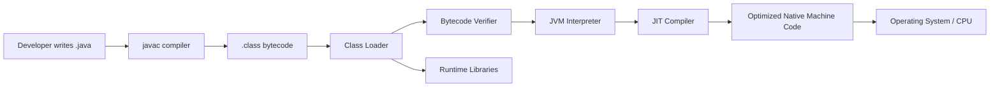
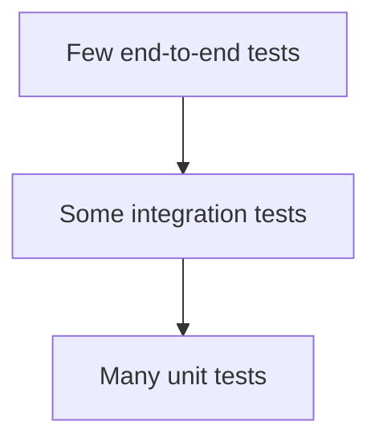
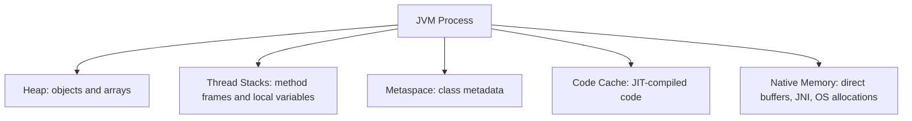
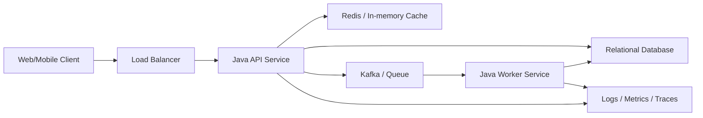
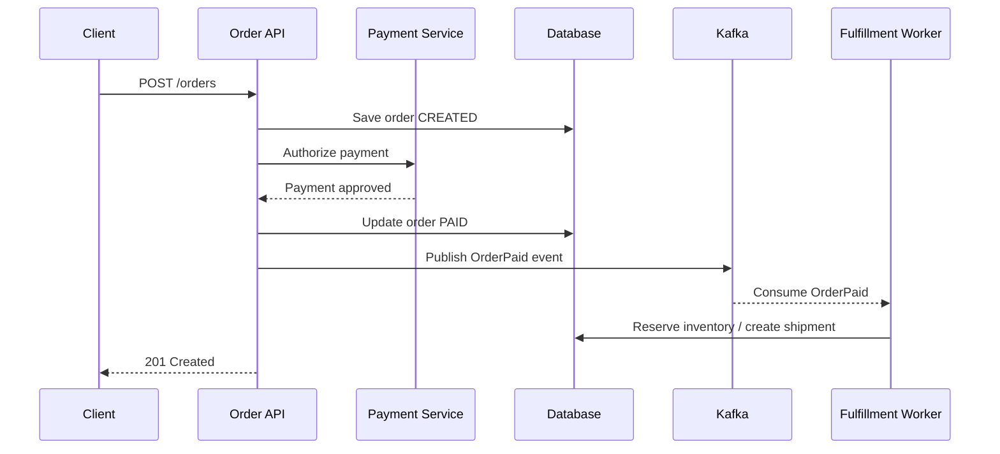
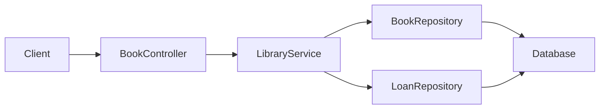
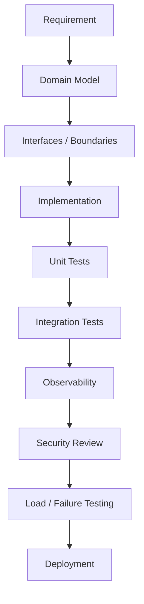
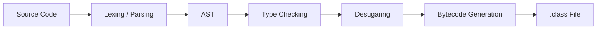
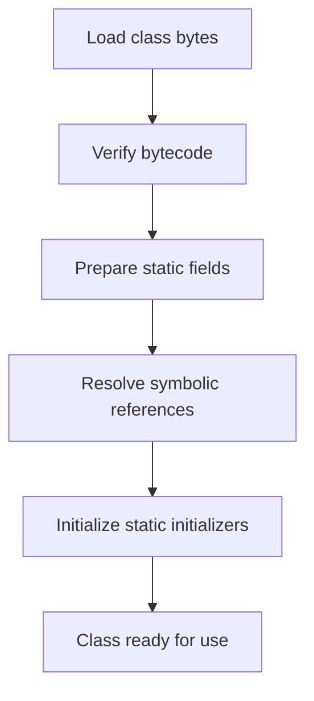

# Basic Java: Beginner-to-Expert Engineering Guide

> **Scope:** This guide teaches Java from first principles through production backend/system-engineering usage. It targets modern Java fundamentals and notes where newer Java SE 25/26-era concepts matter, while keeping the beginner path simple.

## Table of Contents

1. [Executive Summary](#executive-summary)
2. [1. Fundamentals](#1-fundamentals-beginner-level)
3. [2. Core Concepts](#2-core-concepts-intermediate-level)
4. [3. Advanced Concepts](#3-advanced-concepts-senior-level)
5. [4. Real-World System Design Usage](#4-real-world-system-design-usage)
6. [5. Interview Preparation](#5-interview-preparation)
7. [6. Hands-On Thinking](#6-hands-on-thinking)
8. [7. Deep Dive](#7-deep-dive-optional-but-important)
9. [Production Checklists](#production-checklists)
10. [Learning Roadmap](#learning-roadmap)
11. [Self-Review Completion Loop](#self-review-completion-loop)
12. [Official References](#official-references)

---

## Executive Summary

Java is a general-purpose, statically typed, object-oriented programming language and runtime platform used heavily for backend services, enterprise applications, Android ecosystems, financial systems, distributed systems, data platforms, and infrastructure tooling.

The core idea:

```text
Write Java source code
        |
        v
Compile with javac
        |
        v
Platform-neutral bytecode (.class)
        |
        v
Run on the JVM
        |
        v
JVM handles execution, memory management, security boundaries, profiling, and optimization
```

> [!TIP]
> Learn Java as two connected things: the **language** you write and the **platform/runtime** that executes it. Senior Java engineers understand both.

---

# 1. Fundamentals (Beginner Level)

## 1.1 What Is Java?

Java is a programming language where you write instructions in `.java` files. These files are compiled into `.class` bytecode, which runs on the Java Virtual Machine (JVM).

Simple example:

```java
public class Main {
    public static void main(String[] args) {
        System.out.println("Hello, Java!");
    }
}
```

Compile and run:

```bash
javac Main.java
java Main
```

Since modern Java also supports launching simple single-file source programs:

```bash
java Main.java
```

## 1.2 Why Java Exists

Java was designed to solve recurring software engineering problems:

| Problem | Java's Answer |
|---|---|
| Code tied to one operating system | JVM bytecode runs across supported platforms |
| Manual memory management bugs | Garbage collection manages most heap memory |
| Large applications become hard to organize | Classes, packages, modules, interfaces |
| Runtime crashes from many type mistakes | Static type checking at compile time |
| Need reliable backend services | Mature runtime, tooling, monitoring, ecosystem |
| Need standard APIs | Collections, concurrency, networking, I/O, security, time API |

## 1.3 Problems Java Solves

Java is especially good when you need:

- Long-lived backend services.
- Large teams working on the same codebase.
- Strong tooling and IDE support.
- Stable APIs and backward compatibility.
- Good performance after JVM warmup.
- Rich observability and profiling tools.
- Cross-platform deployment.

Java is less ideal when you need:

- Tiny native binaries by default.
- Extremely low startup time without tuning.
- Manual memory layout control.
- Scripting-style experimentation with minimal structure.

## 1.4 Real-World Analogy

Think of Java like shipping containers.

You put goods into a standard container. Ships, trains, trucks, and ports all know how to handle that container. Similarly, Java compiles code into bytecode, and any compatible JVM knows how to run it.

```text
Java source code = goods
javac compiler  = packaging machine
bytecode        = standardized container
JVM             = transport system that can run it anywhere
```

## 1.5 Core Vocabulary

| Term | Meaning |
|---|---|
| JDK | Java Development Kit: compiler, runtime, tools, libraries |
| JRE | Java Runtime Environment: runtime needed to run Java apps |
| JVM | Java Virtual Machine: executes bytecode |
| `javac` | Java compiler |
| `java` | Java launcher |
| `.java` | Source file |
| `.class` | Compiled bytecode |
| `.jar` | Packaged Java archive |
| Package | Namespace for organizing classes |
| Classpath | Where JVM/compiler look for classes |
| Module path | Modern module-based dependency boundary |

## 1.6 Basic Program Structure

```java
package com.example.app;

import java.time.Instant;

public class App {
    public static void main(String[] args) {
        Instant now = Instant.now();
        System.out.println("Started at " + now);
    }
}
```

Breakdown:

| Part | Purpose |
|---|---|
| `package` | Places class in a namespace |
| `import` | Brings another class into readable scope |
| `public class App` | Defines a class named `App` |
| `main` | Entry point for normal command-line Java apps |
| `System.out.println` | Prints text to standard output |

## 1.7 Variables and Types

Java is statically typed. A variable has a declared type.

```java
int age = 30;
double price = 19.99;
boolean active = true;
char grade = 'A';
String name = "Riya";
```

Primitive types:

| Type | Example | Notes |
|---|---:|---|
| `byte` | `10` | 8-bit integer |
| `short` | `1000` | 16-bit integer |
| `int` | `42` | Default integer choice |
| `long` | `9000000000L` | Large integers |
| `float` | `3.14f` | 32-bit floating point |
| `double` | `3.14` | Default decimal choice |
| `char` | `'A'` | UTF-16 code unit |
| `boolean` | `true` | `true` or `false` |

Reference types:

```java
String city = "Mumbai";
User user = new User("Asha");
List<String> names = new ArrayList<>();
```

> [!WARNING]
> `String` is not a primitive. It is a class. Java treats strings conveniently, but they are still objects.

## 1.8 Control Flow

### If/Else

```java
if (age >= 18) {
    System.out.println("Adult");
} else {
    System.out.println("Minor");
}
```

### Loops

```java
for (int i = 0; i < 3; i++) {
    System.out.println(i);
}

while (active) {
    process();
    active = hasMoreWork();
}
```

### Switch

```java
String role = "ADMIN";

switch (role) {
    case "ADMIN" -> System.out.println("Full access");
    case "USER" -> System.out.println("Limited access");
    default -> System.out.println("Unknown role");
}
```

## 1.9 Methods

Methods group reusable behavior.

```java
public static int add(int a, int b) {
    return a + b;
}
```

Parts:

```text
public static int add(int a, int b)
|      |      |   |   |
access |      |   |   parameters
       |      |   method name
       |      return type
       class-level method
```

## 1.10 Classes and Objects

Class = blueprint. Object = instance created from the blueprint.

```java
public class User {
    private final String name;

    public User(String name) {
        this.name = name;
    }

    public String name() {
        return name;
    }
}
```

Usage:

```java
User user = new User("Asha");
System.out.println(user.name());
```

## 1.11 Basic Exception Handling

Exceptions represent failures or exceptional events.

```java
try {
    int value = Integer.parseInt("123");
    System.out.println(value);
} catch (NumberFormatException e) {
    System.out.println("Invalid number");
}
```

Use `try-with-resources` for closeable resources:

```java
try (BufferedReader reader = Files.newBufferedReader(Path.of("input.txt"))) {
    System.out.println(reader.readLine());
} catch (IOException e) {
    throw new UncheckedIOException(e);
}
```

---

# 2. Core Concepts (Intermediate Level)

## 2.1 Java Execution Architecture



Key idea: Java starts from portable bytecode, then the JVM can interpret and dynamically compile hot code into optimized native machine code.

## 2.2 JDK vs JRE vs JVM

| Component | Contains | Used By |
|---|---|---|
| JVM | Execution engine, memory areas, GC, JIT | Runtime |
| JRE | JVM plus runtime libraries | Users running apps |
| JDK | JRE/JVM plus compiler and tools | Developers |

Modern development normally installs a JDK.

## 2.3 Object-Oriented Programming in Java

Java's core OOP concepts:

| Concept | Meaning | Example |
|---|---|---|
| Encapsulation | Hide internal state | `private` fields |
| Inheritance | Reuse/extend behavior | `class Cat extends Animal` |
| Polymorphism | Same interface, different behavior | `List` implemented by `ArrayList` |
| Abstraction | Expose contract, hide details | `interface PaymentGateway` |

### Encapsulation

```java
public class BankAccount {
    private long balanceInCents;

    public void deposit(long amountInCents) {
        if (amountInCents <= 0) {
            throw new IllegalArgumentException("amount must be positive");
        }
        balanceInCents += amountInCents;
    }

    public long balanceInCents() {
        return balanceInCents;
    }
}
```

### Inheritance

```java
class Animal {
    void speak() {
        System.out.println("sound");
    }
}

class Dog extends Animal {
    @Override
    void speak() {
        System.out.println("bark");
    }
}
```

### Prefer Composition for Most Production Code

Inheritance can couple classes tightly. Composition is often safer.

```java
class OrderService {
    private final PaymentGateway paymentGateway;

    OrderService(PaymentGateway paymentGateway) {
        this.paymentGateway = paymentGateway;
    }
}
```

> [!TIP]
> Use inheritance for true "is-a" relationships. Use composition for "uses-a" relationships.

## 2.4 Interfaces

Interfaces define behavior contracts.

```java
public interface PaymentGateway {
    PaymentResult charge(Money amount, Card card);
}
```

Implementation:

```java
public class StripePaymentGateway implements PaymentGateway {
    @Override
    public PaymentResult charge(Money amount, Card card) {
        return PaymentResult.success();
    }
}
```

Why interfaces matter:

- Decouple business logic from implementation.
- Make testing easier.
- Enable dependency injection.
- Support plugin-style architectures.

## 2.5 Records

Records are concise immutable data carriers.

```java
public record UserProfile(String id, String name, String email) {}
```

Equivalent benefits:

- Constructor generated.
- Accessor methods generated.
- `equals`, `hashCode`, `toString` generated.
- Fields are final.

Good for:

- DTOs.
- API responses.
- Value objects.
- Immutable event payloads.

Avoid records when:

- Object identity is central.
- State must mutate heavily.
- You need complex inheritance.

## 2.6 Enums

```java
public enum OrderStatus {
    CREATED,
    PAID,
    SHIPPED,
    CANCELLED
}
```

Enums are type-safe constants. They are much safer than string constants.

## 2.7 Packages

Packages organize code and avoid name collisions.

```java
package com.company.billing.payments;
```

Common package layout:

```text
src/main/java/com/company/app/
    controller/
    service/
    repository/
    domain/
    config/
```

## 2.8 Collections Framework

Collections are standard data structures.

| Interface | Purpose | Common Implementations |
|---|---|---|
| `List` | Ordered sequence | `ArrayList`, `LinkedList` |
| `Set` | Unique values | `HashSet`, `TreeSet`, `LinkedHashSet` |
| `Map` | Key-value pairs | `HashMap`, `TreeMap`, `ConcurrentHashMap` |
| `Queue` | FIFO/work queues | `ArrayDeque`, `PriorityQueue` |

Example:

```java
List<String> names = new ArrayList<>();
names.add("Asha");
names.add("Ravi");

Map<String, Integer> scores = new HashMap<>();
scores.put("Asha", 95);
```

### Choosing Collections

| Need | Choose |
|---|---|
| Fast random access | `ArrayList` |
| Unique unordered values | `HashSet` |
| Preserve insertion order | `LinkedHashMap` / `LinkedHashSet` |
| Sorted keys | `TreeMap` |
| Thread-safe high-concurrency map | `ConcurrentHashMap` |
| Stack/queue behavior | `ArrayDeque` |

## 2.9 Generics

Generics provide type safety for parameterized types.

```java
List<String> names = new ArrayList<>();
names.add("Asha");
String first = names.get(0);
```

Without generics, you would need unsafe casts.

Generic method:

```java
public static <T> T first(List<T> items) {
    if (items.isEmpty()) {
        throw new IllegalArgumentException("items must not be empty");
    }
    return items.get(0);
}
```

### Wildcards

```java
public static double sum(List<? extends Number> numbers) {
    double total = 0;
    for (Number number : numbers) {
        total += number.doubleValue();
    }
    return total;
}
```

Rule of thumb: **PECS**

```text
Producer Extends, Consumer Super
```

If a collection produces values for you, use `? extends T`. If you put values into it, use `? super T`.

## 2.10 Lambdas and Functional Interfaces

Lambda:

```java
names.sort((a, b) -> a.compareToIgnoreCase(b));
```

Functional interface:

```java
@FunctionalInterface
public interface Validator<T> {
    boolean isValid(T value);
}
```

Usage:

```java
Validator<String> nonBlank = value -> value != null && !value.isBlank();
```

## 2.11 Streams

Streams process collections declaratively.

```java
List<String> activeEmails = users.stream()
    .filter(User::active)
    .map(User::email)
    .distinct()
    .sorted()
    .toList();
```

Stream pipeline:

```text
source -> intermediate operations -> terminal operation
List   -> filter/map/sorted      -> collect/toList/count
```

Use streams for clear transformations. Avoid them when a simple loop is more readable or when side effects dominate.

## 2.12 Exceptions: Checked vs Unchecked

| Type | Extends | Compile-time handling? | Example |
|---|---|---|---|
| Checked | `Exception` but not `RuntimeException` | Required | `IOException` |
| Unchecked | `RuntimeException` | Not required | `IllegalArgumentException` |
| Error | `Error` | Not application-handled normally | `OutOfMemoryError` |

Guidelines:

- Use checked exceptions when callers can reasonably recover.
- Use unchecked exceptions for programming errors and invalid state.
- Do not swallow exceptions silently.
- Preserve cause when wrapping exceptions.

```java
try {
    repository.save(order);
} catch (SQLException e) {
    throw new OrderPersistenceException("Failed to save order " + order.id(), e);
}
```

## 2.13 Java I/O and NIO

Modern Java usually uses `java.nio.file`.

```java
Path path = Path.of("orders.txt");
List<String> lines = Files.readAllLines(path);
Files.writeString(Path.of("out.txt"), "done");
```

For large files, stream lines:

```java
try (Stream<String> lines = Files.lines(Path.of("large.log"))) {
    long errors = lines.filter(line -> line.contains("ERROR")).count();
}
```

## 2.14 Date and Time API

Use `java.time`, not old `Date`/`Calendar` for new code.

| Class | Use |
|---|---|
| `Instant` | Machine timestamp |
| `LocalDate` | Date without time zone |
| `LocalDateTime` | Date-time without time zone |
| `ZonedDateTime` | Date-time with time zone |
| `Duration` | Time-based amount |
| `Period` | Date-based amount |

Example:

```java
Instant createdAt = Instant.now();
LocalDate billingDate = LocalDate.now(ZoneId.of("Asia/Kolkata"));
```

> [!WARNING]
> Store timestamps as `Instant` or database timestamp with clear UTC semantics. Convert to local zones at boundaries such as UI and reports.

## 2.15 Build Tools

Common Java build tools:

| Tool | Strength |
|---|---|
| Maven | Convention, dependency management, mature ecosystem |
| Gradle | Flexible builds, strong for multi-module and Android |

Typical Maven layout:

```text
project/
    pom.xml
    src/main/java/
    src/main/resources/
    src/test/java/
```

Typical Gradle layout:

```text
project/
    build.gradle
    settings.gradle
    src/main/java/
    src/test/java/
```

## 2.16 Testing Basics

JUnit example:

```java
import org.junit.jupiter.api.Test;

import static org.junit.jupiter.api.Assertions.assertEquals;

class CalculatorTest {
    @Test
    void addsNumbers() {
        Calculator calculator = new Calculator();
        assertEquals(5, calculator.add(2, 3));
    }
}
```

Testing pyramid:



---

# 3. Advanced Concepts (Senior Level)

## 3.1 JVM Memory Model: Practical View



Key areas:

| Area | Stores | Common Failure |
|---|---|---|
| Heap | Objects | `OutOfMemoryError: Java heap space` |
| Stack | Call frames | `StackOverflowError` |
| Metaspace | Class metadata | Metaspace OOM |
| Code cache | JIT compiled code | Performance degradation |
| Native memory | Direct buffers, threads, JNI | Native OOM/container kill |

## 3.2 Garbage Collection

Garbage collection automatically reclaims memory that is no longer reachable.

Simplified:

```text
Objects allocated -> objects become unreachable -> GC detects -> memory reclaimed
```

Production considerations:

- GC reduces manual memory bugs but adds runtime overhead.
- Larger heaps can increase pause or scanning costs depending on collector.
- Allocation rate matters as much as live data size.
- Memory leaks still happen when unused objects remain reachable.

### GC Trade-Offs

| Goal | Possible Cost |
|---|---|
| Higher throughput | Longer pauses |
| Lower latency | More CPU overhead |
| Smaller memory footprint | More frequent GC |
| Larger heap | Longer warmup or higher memory bill |

### Common JVM GC Options

```bash
java -Xms512m -Xmx512m -XX:+UseG1GC -Xlog:gc*:file=gc.log:time,uptime,level,tags -jar app.jar
```

Meaning:

| Option | Meaning |
|---|---|
| `-Xms` | Initial heap size |
| `-Xmx` | Max heap size |
| `-XX:+UseG1GC` | Select G1 garbage collector |
| `-Xlog:gc*` | Enable GC logging |

## 3.3 Java Memory Model and Concurrency

Java concurrency is governed by visibility, ordering, and atomicity.

### Race Condition

```java
class Counter {
    private int count;

    void increment() {
        count++;
    }
}
```

`count++` is not atomic. It reads, adds, and writes.

Fix with `AtomicInteger`:

```java
class Counter {
    private final AtomicInteger count = new AtomicInteger();

    void increment() {
        count.incrementAndGet();
    }
}
```

### Visibility

```java
class Worker {
    private volatile boolean running = true;

    void stop() {
        running = false;
    }

    void runLoop() {
        while (running) {
            doWork();
        }
    }
}
```

`volatile` makes writes visible across threads, but it does not make compound operations atomic.

## 3.4 Threads, Executors, and Virtual Threads

Classic executor:

```java
ExecutorService executor = Executors.newFixedThreadPool(10);
executor.submit(() -> processOrder(order));
executor.shutdown();
```

Modern virtual-thread style:

```java
try (ExecutorService executor = Executors.newVirtualThreadPerTaskExecutor()) {
    for (Order order : orders) {
        executor.submit(() -> processOrder(order));
    }
}
```

Virtual threads are useful for high-concurrency blocking workloads, such as request handling with network/database calls. They are not magic for CPU-bound workloads.

| Workload | Good Fit |
|---|---|
| Blocking I/O with many concurrent tasks | Virtual threads |
| CPU-heavy computation | Fixed-size platform thread pools |
| Reactive streaming pipelines | Reactive frameworks may still fit |
| Low-level lock-heavy code | Needs careful benchmarking |

## 3.5 Synchronization Tools

| Tool | Use |
|---|---|
| `synchronized` | Simple mutual exclusion |
| `ReentrantLock` | Lock with advanced control |
| `AtomicInteger` / `AtomicReference` | Lock-free atomic updates |
| `ConcurrentHashMap` | Concurrent map |
| `CountDownLatch` | Wait for N events |
| `Semaphore` | Limit concurrent access |
| `CompletableFuture` | Async composition |

## 3.6 Performance Considerations

Senior Java performance is usually about measurement, not guessing.

Important factors:

- Algorithmic complexity.
- Object allocation rate.
- Lock contention.
- Database/network latency.
- Serialization/deserialization cost.
- GC behavior.
- JVM warmup and JIT compilation.
- Cache locality and memory pressure.

### Microbenchmark Warning

Use JMH for serious Java microbenchmarks. Naive loops are often optimized away or distorted by JIT warmup.

```java
// Conceptual only: real benchmarking should use JMH.
long start = System.nanoTime();
doWork();
long elapsed = System.nanoTime() - start;
```

## 3.7 Failure Scenarios

| Failure | Symptom | Common Cause | Debug Tool |
|---|---|---|---|
| Heap OOM | `Java heap space` | Leak or undersized heap | heap dump, MAT |
| Stack overflow | `StackOverflowError` | Unbounded recursion | stack trace |
| Deadlock | Threads stuck forever | Lock order cycle | `jstack`, JFR |
| High GC pause | Latency spikes | Heap pressure | GC logs, JFR |
| Thread exhaustion | Requests hang | Too many platform threads | thread dump |
| Classpath conflict | `NoSuchMethodError` | Dependency version mismatch | `mvn dependency:tree` |
| Time zone bug | Wrong business date | Mixing local/UTC time | logs, tests |
| Connection leak | Pool exhausted | Not closing DB connections | pool metrics |

## 3.8 Dependency and Classpath Problems

Classic failure:

```text
java.lang.NoSuchMethodError
```

This often means code compiled against one library version but runs with another.

Debug approach:

```bash
mvn dependency:tree
gradle dependencies
jar tf app.jar
```

## 3.9 Security Pitfalls

Common Java security concerns:

- Deserialization of untrusted data.
- XML external entity attacks.
- Path traversal when reading files.
- SQL injection from string concatenation.
- Weak cryptography or custom crypto.
- Secrets in logs/config files.
- Unsafe reflection.
- Outdated dependencies.

Safer SQL:

```java
try (PreparedStatement statement =
         connection.prepareStatement("select * from users where email = ?")) {
    statement.setString(1, email);
    try (ResultSet rs = statement.executeQuery()) {
        // read results
    }
}
```

> [!IMPORTANT]
> Never deserialize arbitrary untrusted Java objects. Prefer JSON with strict schemas, allow-lists, and size limits.

## 3.10 API Design in Java

Good Java APIs:

- Use clear domain names.
- Avoid returning `null` for collections.
- Use immutable objects where possible.
- Validate at boundaries.
- Keep exceptions meaningful.
- Avoid exposing mutable internal collections.

Bad:

```java
public List<Item> getItems() {
    return items;
}
```

Better:

```java
public List<Item> getItems() {
    return List.copyOf(items);
}
```

## 3.11 Immutability

Immutable objects are easier to reason about and safer in concurrency.

```java
public record Money(String currency, long minorUnits) {
    public Money {
        if (currency == null || currency.isBlank()) {
            throw new IllegalArgumentException("currency required");
        }
    }
}
```

## 3.12 Binary Compatibility

In production, changing public APIs can break already-compiled consumers.

Generally safer:

- Adding a method to a class.
- Adding a new class.
- Adding overloaded methods carefully.

Riskier:

- Removing public methods.
- Changing method signatures.
- Changing return types.
- Moving classes between packages.
- Changing serialized forms.

## 3.13 Serialization

Java native serialization has a long history but is risky for security and compatibility. Modern systems usually prefer:

- JSON for APIs.
- Avro/Protobuf for strongly typed cross-service messages.
- Database schemas for persistence.
- Explicit mappers.

## 3.14 Modules

Java modules help define explicit dependencies and encapsulation.

```java
module com.example.billing {
    requires java.sql;
    exports com.example.billing.api;
}
```

Use modules when:

- Building libraries.
- Creating custom runtime images.
- Enforcing stronger boundaries.

Many enterprise applications still use classpath-based deployment, especially with frameworks.

---

# 4. Real-World System Design Usage

## 4.1 Where Java Is Used in Production

Java is common in:

- REST APIs and microservices.
- Banking and payment systems.
- E-commerce platforms.
- Messaging and event-driven systems.
- Search and indexing platforms.
- Big data tools.
- Android ecosystem.
- Internal enterprise platforms.
- Trading/risk systems.

## 4.2 Typical Backend Architecture



Java services usually sit in the API and worker layers. Frameworks like Spring Boot, Micronaut, Quarkus, and Helidon help structure web apps, dependency injection, configuration, observability, and deployment.

## 4.3 Big-Company Style Thinking

Large systems use Java because:

- Runtime behavior is observable.
- The JVM is mature under heavy load.
- Backward compatibility protects long-lived systems.
- Tooling supports large teams.
- The ecosystem has battle-tested libraries.
- Performance is strong for many server workloads after warmup.

Design priorities:

| Concern | Java System Design Response |
|---|---|
| Reliability | Typed contracts, tests, retries, circuit breakers |
| Scale | Horizontal services, async queues, connection pools |
| Observability | Structured logs, metrics, tracing, JFR |
| Security | Input validation, dependency scanning, safe crypto |
| Maintainability | packages, modules, interfaces, layered architecture |
| Performance | profiling, GC tuning, caching, batching |

## 4.4 Example: Order Service



Java concepts used:

- Records for request/response DTOs.
- Services for business logic.
- Interfaces for external gateways.
- Exceptions mapped to HTTP errors.
- Executor/virtual threads for concurrent I/O.
- JDBC/JPA for database access.
- Kafka client for event publishing.
- Metrics and logs for production visibility.

## 4.5 Layered Java Service

```text
Controller/API Layer
    - HTTP request parsing
    - Authentication context
    - Response mapping

Service Layer
    - Business rules
    - Transaction boundaries
    - Domain orchestration

Repository Layer
    - Database queries
    - Persistence mapping

Integration Layer
    - External APIs
    - Message brokers
    - File/object storage

Domain Layer
    - Entities
    - Value objects
    - Domain invariants
```

## 4.6 Production Java Deployment

Common artifact styles:

| Artifact | Use |
|---|---|
| Executable JAR | Common for Spring Boot-style services |
| WAR | Traditional servlet containers |
| Container image | Kubernetes/cloud deployments |
| Native image | Low startup/memory use cases |
| Custom runtime image | Smaller JDK runtime with `jlink` |

Basic container concerns:

- Set memory limits intentionally.
- Understand JVM container memory ergonomics.
- Log to stdout/stderr.
- Expose health/readiness endpoints.
- Use graceful shutdown.
- Avoid writing important state to container local disk.

## 4.7 Integration with Other Systems

| System | Java Integration |
|---|---|
| Database | JDBC, JPA/Hibernate, jOOQ |
| Cache | Redis clients, Caffeine |
| Message broker | Kafka, RabbitMQ, JMS |
| HTTP APIs | Java HTTP Client, OkHttp, Apache HttpClient |
| Observability | Micrometer, OpenTelemetry, JFR |
| Security | JAAS, TLS, JCA/JCE, OAuth libraries |
| Build/CI | Maven, Gradle, JUnit, Testcontainers |

---

# 5. Interview Preparation

## 5.1 What Interviewers Expect

For "Basic Java", interviewers usually expect:

- You can write simple Java programs.
- You understand OOP and interfaces.
- You know collections and their trade-offs.
- You understand exceptions.
- You can explain JVM/JDK/JRE.
- You know basic memory management and GC.
- You can reason about thread safety.
- You avoid common null, equality, and mutability mistakes.

For senior backend roles, they also expect:

- Production debugging approach.
- Knowledge of concurrency pitfalls.
- API design maturity.
- Dependency/versioning awareness.
- Understanding of observability and performance.
- Secure coding instincts.

## 5.2 Most Important Questions and Answers

### Q1. What is the difference between JDK, JRE, and JVM?

JVM executes bytecode. JRE includes JVM and runtime libraries for running applications. JDK includes tools such as compiler, debugger, and runtime components needed to develop Java applications.

### Q2. Why is Java platform independent?

Java source is compiled to bytecode. Bytecode can run on any compatible JVM for the target platform.

### Q3. Is Java pass-by-value or pass-by-reference?

Java is pass-by-value. For objects, the value passed is a copy of the reference. The method can mutate the object through that reference, but it cannot reassign the caller's variable.

```java
static void rename(User user) {
    user.setName("New"); // mutates object
}

static void replace(User user) {
    user = new User("Other"); // caller still points to old object
}
```

### Q4. What is the difference between `==` and `.equals()`?

`==` compares primitive values or object references. `.equals()` compares logical equality if the class implements it properly.

```java
String a = new String("java");
String b = new String("java");

System.out.println(a == b);      // false
System.out.println(a.equals(b)); // true
```

### Q5. What is `hashCode()` used for?

Hash-based collections like `HashMap` and `HashSet` use `hashCode()` to locate buckets. If two objects are equal according to `.equals()`, they must have the same hash code.

### Q6. What is the difference between `ArrayList` and `LinkedList`?

`ArrayList` uses a dynamic array and is usually better for random access and general usage. `LinkedList` uses nodes and can have higher memory overhead and worse cache locality. In production, `ArrayList` is usually the default list.

### Q7. What is the difference between checked and unchecked exceptions?

Checked exceptions must be declared or caught. Unchecked exceptions extend `RuntimeException` and do not require compile-time handling.

### Q8. What is a memory leak in Java if GC exists?

A Java memory leak happens when objects are no longer useful but remain reachable, so GC cannot reclaim them. Common causes include static collections, unbounded caches, listener references, and thread-local misuse.

### Q9. What is a deadlock?

A deadlock occurs when two or more threads wait forever for locks held by each other.

```text
Thread A holds Lock 1 and waits for Lock 2
Thread B holds Lock 2 and waits for Lock 1
```

### Q10. What is the difference between interface and abstract class?

An interface defines a contract and supports multiple implementation inheritance of behavior through default methods. An abstract class can hold state, constructors, and shared implementation, but Java allows extending only one class.

## 5.3 Tricky Questions

### Why should mutable objects not be used as `HashMap` keys?

If fields used by `equals()` or `hashCode()` change after insertion, the object may no longer be findable in the correct bucket.

### Can `finally` fail to execute?

Usually `finally` executes, but it may not if the JVM exits abruptly, the process is killed, the machine crashes, or severe runtime failures occur.

### Is `String` mutable?

No. `String` is immutable. Operations like `concat` or `replace` create new strings.

### Why can `NullPointerException` happen with unboxing?

```java
Integer value = null;
int primitive = value; // NullPointerException
```

Unboxing calls `value.intValue()`, which fails on null.

### Does `final` make an object immutable?

No. `final` prevents reassignment of the variable/reference. The object itself may still mutate.

```java
final List<String> names = new ArrayList<>();
names.add("Asha"); // allowed
```

## 5.4 Common Candidate Mistakes

- Saying Java is pass-by-reference.
- Using `==` for string content comparison.
- Ignoring `equals()`/`hashCode()` contract.
- Thinking GC prevents all memory leaks.
- Catching `Exception` everywhere without recovery.
- Returning mutable internal state.
- Using `LinkedList` as default list.
- Overusing inheritance.
- Confusing concurrency with parallelism.
- Not knowing basic JVM memory areas.

## 5.5 Interview Coding Checklist

- Name classes and methods clearly.
- Validate inputs.
- Handle empty collections and nulls deliberately.
- Use the right collection type.
- Explain complexity.
- Mention thread safety if shared state exists.
- Keep code simple before optimizing.
- Add tests for edge cases.

---

# 6. Hands-On Thinking

## 6.1 Three Real-World Projects Using Basic Java

### Project 1: Command-Line Expense Tracker

Concepts:

- Classes and records.
- Collections.
- File I/O.
- Exceptions.
- Date/time API.
- Unit tests.

Features:

- Add expense.
- List expenses by month.
- Categorize expenses.
- Persist to CSV or JSON.
- Show totals.

Design:

```text
ExpenseTrackerApp
    -> ExpenseService
        -> ExpenseRepository
            -> FileExpenseRepository
```

Core model:

```java
public record Expense(
    String id,
    String category,
    long amountInCents,
    LocalDate date,
    String note
) {}
```

### Project 2: RESTful Library Management API

Concepts:

- API layers.
- DTOs.
- Validation.
- Persistence.
- Testing.
- Error handling.

Features:

- Add books.
- Register members.
- Borrow/return books.
- Search by title/author.
- Prevent borrowing unavailable books.

Architecture:



### Project 3: Multi-Threaded Log Analyzer

Concepts:

- File streaming.
- Executors.
- Concurrent maps.
- Atomic counters.
- Performance measurement.
- Error handling.

Features:

- Read large log files.
- Count status codes.
- Find top endpoints.
- Detect error spikes.
- Produce report.

Concurrent counter:

```java
ConcurrentHashMap<Integer, LongAdder> statusCounts = new ConcurrentHashMap<>();

statusCounts
    .computeIfAbsent(statusCode, ignored -> new LongAdder())
    .increment();
```

## 6.2 Step-by-Step Design Approach

For any Java project:

1. Define domain objects.
2. Define use cases.
3. Define interfaces for external dependencies.
4. Choose collections and data structures.
5. Add validation and error handling.
6. Add tests for normal and edge cases.
7. Add logging and metrics if service-like.
8. Package with Maven/Gradle.
9. Run with realistic input size.
10. Profile only after measuring.

## 6.3 Production Implementation Approach



## 6.4 Production Readiness Example

For a Java service, define:

- Health endpoint.
- Readiness endpoint.
- Structured logs.
- Metrics for request count, latency, errors.
- Timeouts for all network calls.
- Retries only for safe/idempotent operations.
- Circuit breakers for unreliable dependencies.
- Dependency vulnerability scanning.
- GC logs in staging.
- Thread/heap dump playbook.

---

# 7. Deep Dive (Optional but Important)

## 7.1 Compilation Pipeline



Important details:

- Java compiler validates syntax and types.
- Some high-level syntax is transformed into simpler bytecode patterns.
- Generics are mostly implemented through type erasure.
- JVM verifies bytecode before execution.

## 7.2 Class Loading



Class loading stages:

| Stage | Purpose |
|---|---|
| Loading | Find and load class bytecode |
| Linking | Verify, prepare, resolve |
| Initialization | Run static initializers |

## 7.3 JIT Compilation

JVM starts by interpreting bytecode. Frequently executed code becomes "hot" and is compiled into optimized native code.

```text
Bytecode -> interpreted first -> hot paths detected -> JIT compiles -> optimized native code
```

Optimization examples:

- Method inlining.
- Escape analysis.
- Dead code elimination.
- Lock elision in some cases.
- Devirtualization when target type is predictable.

## 7.4 Generics and Type Erasure

Java generics mostly exist at compile time. At runtime, many generic type details are erased.

```java
List<String> names = new ArrayList<>();
List<Integer> numbers = new ArrayList<>();
```

At runtime, both are broadly `List` instances. This is why you cannot generally do:

```java
if (value instanceof List<String>) { // not valid
    // ...
}
```

## 7.5 `equals()` and `hashCode()` Contract

If `a.equals(b)` is true, then `a.hashCode() == b.hashCode()` must be true.

Example with record:

```java
public record CustomerId(String value) {}
```

Records automatically implement logical equality based on components.

Manual class:

```java
public final class CustomerId {
    private final String value;

    public CustomerId(String value) {
        this.value = Objects.requireNonNull(value);
    }

    @Override
    public boolean equals(Object other) {
        if (this == other) {
            return true;
        }
        if (!(other instanceof CustomerId that)) {
            return false;
        }
        return value.equals(that.value);
    }

    @Override
    public int hashCode() {
        return value.hashCode();
    }
}
```

## 7.6 Null Handling

Java allows null references, so null-safety is a discipline.

Guidelines:

- Validate constructor arguments.
- Return empty collections instead of null.
- Use `Optional` for possibly missing return values, not fields everywhere.
- Avoid `Optional.get()` without checking.
- Use annotations like `@Nullable`/`@NonNull` if your tooling supports them.

```java
public Optional<User> findById(String id) {
    return Optional.ofNullable(database.get(id));
}
```

## 7.7 Logging

Prefer structured, parameterized logs:

```java
logger.info("Order created: orderId={}, customerId={}", order.id(), order.customerId());
```

Avoid:

```java
logger.info("Order created: " + order); // unnecessary string work and possible sensitive data
```

Logging levels:

| Level | Use |
|---|---|
| ERROR | Failure requiring attention |
| WARN | Unexpected but handled situation |
| INFO | Important lifecycle/business events |
| DEBUG | Diagnostic detail |
| TRACE | Very detailed diagnostic flow |

## 7.8 Debugging Tools

| Tool | Purpose |
|---|---|
| `jps` | List Java processes |
| `jcmd` | JVM diagnostics |
| `jstack` | Thread dump |
| `jmap` | Heap information/dumps |
| JDK Mission Control | Analyze JFR recordings |
| JDK Flight Recorder | Low-overhead runtime profiling |
| GC logs | Understand allocation and collection behavior |
| IDE debugger | Step through code |

Example:

```bash
jcmd <pid> Thread.print
jcmd <pid> GC.heap_info
jcmd <pid> JFR.start name=profile duration=60s filename=profile.jfr
```

---

# Production Checklists

## Code Quality Checklist

- [ ] Classes have single, clear responsibilities.
- [ ] Public APIs are intentionally designed.
- [ ] Inputs are validated at boundaries.
- [ ] Exceptions preserve useful context.
- [ ] No sensitive data in logs.
- [ ] Collections are chosen intentionally.
- [ ] Mutable state is minimized.
- [ ] Tests cover normal, edge, and failure cases.
- [ ] Dependency versions are pinned/managed.
- [ ] Static analysis or linting runs in CI.

## Performance Checklist

- [ ] Measure before optimizing.
- [ ] Check algorithmic complexity.
- [ ] Profile CPU hot spots.
- [ ] Inspect allocation rate.
- [ ] Review GC logs under realistic load.
- [ ] Set realistic heap/container limits.
- [ ] Use connection pooling.
- [ ] Set network timeouts.
- [ ] Avoid unbounded queues/caches.
- [ ] Load test before production release.

## Security Checklist

- [ ] Validate and normalize inputs.
- [ ] Use prepared statements.
- [ ] Avoid native Java deserialization for untrusted data.
- [ ] Keep dependencies updated.
- [ ] Use TLS correctly.
- [ ] Do not log secrets, tokens, or PII.
- [ ] Use secure random for security tokens.
- [ ] Do not write custom crypto.
- [ ] Restrict file access paths.
- [ ] Add authorization checks at service boundaries.

## Debugging Checklist

- [ ] Reproduce with exact version/config.
- [ ] Check logs around first failure, not only final error.
- [ ] Inspect metrics: latency, errors, GC, CPU, memory, threads.
- [ ] Capture thread dump for hangs.
- [ ] Capture heap dump for suspected leaks.
- [ ] Check dependency conflicts.
- [ ] Check recent deployments/config changes.
- [ ] Write a regression test after fixing.

---

# Learning Roadmap

## Phase 1: Beginner

Learn:

- Syntax.
- Variables and types.
- Control flow.
- Methods.
- Classes and objects.
- Basic collections.
- Basic exception handling.

Practice:

- Calculator.
- To-do list.
- Expense tracker.
- Simple file parser.

## Phase 2: Intermediate

Learn:

- Interfaces.
- Generics.
- Collections deeply.
- Streams.
- Date/time API.
- File I/O.
- Unit testing.
- Maven or Gradle.

Practice:

- Library management system.
- CSV/JSON processor.
- REST API with tests.
- Small CLI tool packaged as a JAR.

## Phase 3: Advanced

Learn:

- JVM memory.
- Garbage collection.
- Concurrency.
- Executors and virtual threads.
- Profiling.
- Logging and observability.
- Secure coding.
- Dependency management.

Practice:

- Multi-threaded log analyzer.
- Rate limiter.
- Cache with expiration.
- Message-driven worker.

## Phase 4: Production Backend Engineer

Learn:

- Service architecture.
- Database transactions.
- Distributed systems basics.
- API versioning.
- Fault tolerance.
- Performance testing.
- Deployment and operations.

Practice:

- Order service.
- Payment workflow simulator.
- Event-driven inventory service.
- Production-style service with metrics, logs, tests, and Docker.

---

# Self-Review Completion Loop

The topic was reviewed against:

- Official Java SE documentation categories.
- Java Language Specification concepts.
- JVM Specification concepts.
- Java tutorials and learning paths.
- Secure coding guidelines.
- Garbage collection tuning guidance.
- Common backend production practices.
- Interview patterns for beginner through senior roles.

## Gap Review Matrix

| Area | Covered? | Notes |
|---|---|---|
| Beginner syntax | Yes | Variables, methods, classes, control flow |
| OOP | Yes | Encapsulation, inheritance, polymorphism, abstraction |
| Collections | Yes | Interfaces, implementations, selection guide |
| Exceptions | Yes | Checked/unchecked, wrapping, failures |
| Generics | Yes | Type safety, wildcards, PECS, erasure |
| Streams/lambdas | Yes | Functional interfaces and pipelines |
| JVM basics | Yes | Compile/run, class loading, JIT |
| Memory/GC | Yes | Heap, stack, GC trade-offs, tuning |
| Concurrency | Yes | Threads, executors, volatile, atomics |
| Security | Yes | Injection, deserialization, secrets, crypto caution |
| Debugging/tooling | Yes | jcmd, jstack, JFR, GC logs |
| Production design | Yes | Layering, services, deployment, observability |
| Interview prep | Yes | Questions, traps, expectations |
| Hands-on projects | Yes | Three realistic projects with architecture |

No significant beginner-to-senior Java foundation gaps remain for the requested "Basic Java" scope. Further specialization should split into separate deep dives: **Java Concurrency**, **JVM Internals**, **Spring Boot**, **Java Performance Tuning**, **Java Security**, and **Distributed Systems with Java**.

---

# Official References

- Oracle JDK 26 Documentation: <https://docs.oracle.com/en/java/javase/26/>
- Oracle JDK 25 Documentation: <https://docs.oracle.com/en/java/javase/25/>
- Dev.java Learn Java: <https://dev.java/learn/>
- Java Language Specification, Java SE 26 Edition: <https://docs.oracle.com/javase/specs/jls/se26/html/index.html>
- Java Virtual Machine Specification, Java SE 26 Edition: <https://docs.oracle.com/javase/specs/jvms/se26/html/index.html>
- Oracle Secure Coding Guidelines for Java SE: <https://www.oracle.com/java/technologies/javase/seccodeguide.html>
- Oracle Garbage Collection Tuning Guide: <https://docs.oracle.com/en/java/javase/26/gctuning/introduction-garbage-collection-tuning.html>

---

## Final Summary

Java starts as a simple class-based programming language, but production Java engineering requires understanding the runtime: JVM execution, memory, garbage collection, concurrency, dependency management, observability, and secure coding. The fastest path to senior-level Java is to combine strong fundamentals with repeated practice building services, debugging failures, measuring performance, and designing clean interfaces around real business rules.
