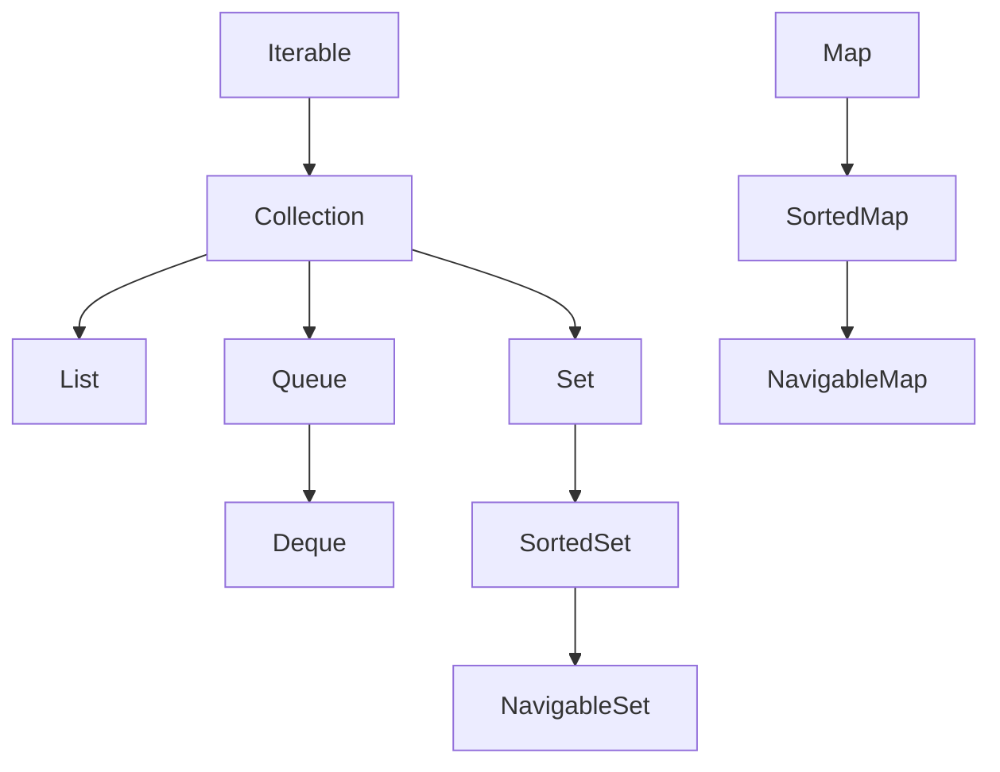
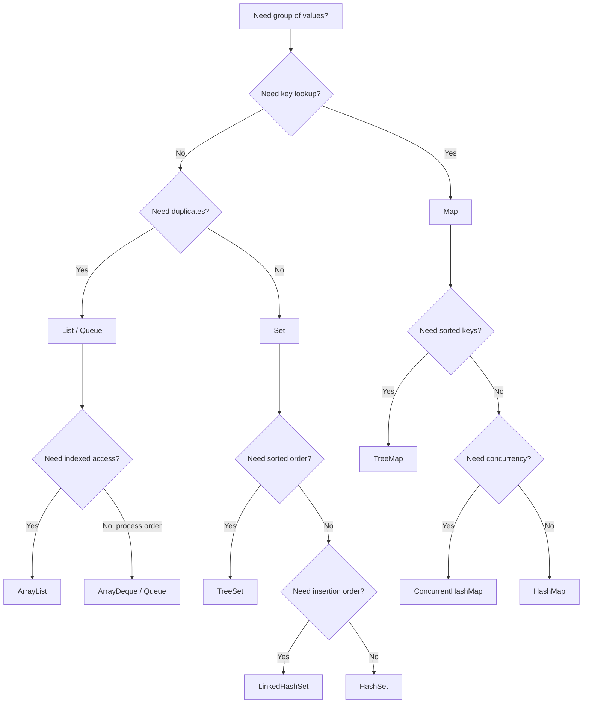
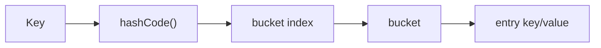
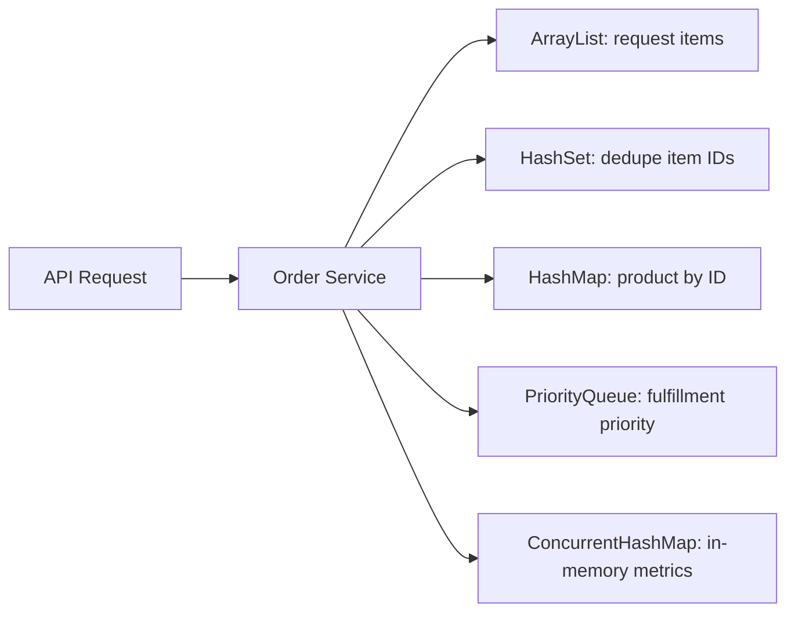
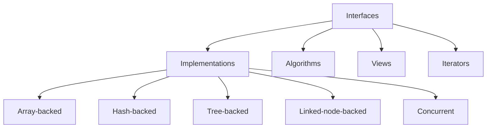

# Collection Framework Java: Beginner-to-Expert Engineering Guide

> **Scope:** A practical, production-focused guide to the Java Collections Framework: `List`, `Set`, `Queue`, `Deque`, `Map`, iterators, generics, ordering, hashing, immutability, concurrency, performance, and interview-level trade-offs.

## Table of Contents

1. [Executive Summary](#executive-summary)
2. [1. Fundamentals](#1-fundamentals-beginner-level)
3. [2. Core Concepts](#2-core-concepts-intermediate-level)
4. [3. Advanced Concepts](#3-advanced-concepts-senior-level)
5. [4. Real-World System Design Usage](#4-real-world-system-design-usage)
6. [5. Interview Preparation](#5-interview-preparation)
7. [6. Hands-On Thinking](#6-hands-on-thinking)
8. [7. Deep Dive](#7-deep-dive-optional-but-important)
9. [Production Checklists](#production-checklists)
10. [Learning Roadmap](#learning-roadmap)
11. [Self-Review Completion Loop](#self-review-completion-loop)
12. [Official References](#official-references)

---

## Executive Summary

The Java Collections Framework is the standard Java architecture for representing and manipulating groups of objects. It gives you interfaces such as `List`, `Set`, `Queue`, `Deque`, and `Map`, plus implementations such as `ArrayList`, `HashSet`, `ArrayDeque`, `HashMap`, `TreeMap`, and `ConcurrentHashMap`.

The shortest practical rule:

```text
Need ordered indexed data?      -> ArrayList
Need unique unordered data?     -> HashSet
Need key-value lookup?          -> HashMap
Need sorted keys/elements?      -> TreeMap / TreeSet
Need queue/stack behavior?      -> ArrayDeque
Need high-concurrency map?      -> ConcurrentHashMap
Need immutable small data?      -> List.of / Set.of / Map.of
```

> [!IMPORTANT]
> Most collection bugs in production come from choosing the wrong implementation, mutating keys after insertion, assuming thread safety, ignoring `equals()`/`hashCode()`, or exposing mutable internal collections.

---

# 1. Fundamentals (Beginner Level)

## 1.1 What Is the Java Collections Framework?

The Java Collections Framework is a set of interfaces, classes, and utility algorithms for storing and processing groups of objects.

Example:

```java
List<String> names = new ArrayList<>();
names.add("Asha");
names.add("Ravi");
names.add("Asha");

System.out.println(names); // [Asha, Ravi, Asha]
```

Here:

- `List` is the interface.
- `ArrayList` is the implementation.
- `String` is the element type.

## 1.2 Why It Exists

Before a common framework, codebases used many incompatible ways to store groups of objects. The collections framework gives Java developers:

- Common interfaces.
- Reusable data structures.
- Standard algorithms.
- Type safety through generics.
- Interoperability across APIs.
- Better readability and maintainability.

## 1.3 Problems It Solves

| Problem | Collection Framework Solution |
|---|---|
| Need dynamic array | `ArrayList` |
| Need no duplicates | `Set` |
| Need fast lookup by key | `HashMap` |
| Need sorted data | `TreeSet`, `TreeMap` |
| Need FIFO queue | `Queue`, `ArrayDeque` |
| Need stack-like behavior | `Deque`, `ArrayDeque` |
| Need thread-safe map | `ConcurrentHashMap` |
| Need unmodifiable small collection | `List.of`, `Set.of`, `Map.of` |

## 1.4 Collections vs Arrays

| Feature | Array | Collection |
|---|---|---|
| Size | Fixed | Usually dynamic |
| Holds primitives directly | Yes | No, uses wrappers like `Integer` |
| Type system | Covariant | Generic/invariant |
| Utility APIs | Limited | Rich |
| Common use | Low-level/fixed data | Application data structures |

Array:

```java
int[] scores = {90, 85, 88};
```

Collection:

```java
List<Integer> scores = new ArrayList<>();
scores.add(90);
scores.add(85);
scores.add(88);
```

> [!TIP]
> Prefer collections for normal application code. Use arrays when you need fixed-size primitive storage, low-level APIs, or performance-sensitive code with clear measurement.

## 1.5 The Main Interfaces



Important note: `Map` is part of the framework, but it does **not** extend `Collection`.

## 1.6 Quick Examples

### List

```java
List<String> users = new ArrayList<>();
users.add("Asha");
users.add("Ravi");
users.add("Asha"); // duplicates allowed
```

### Set

```java
Set<String> uniqueUsers = new HashSet<>();
uniqueUsers.add("Asha");
uniqueUsers.add("Asha"); // duplicate ignored
```

### Queue

```java
Queue<String> jobs = new ArrayDeque<>();
jobs.offer("job-1");
jobs.offer("job-2");
System.out.println(jobs.poll()); // job-1
```

### Map

```java
Map<String, Integer> scores = new HashMap<>();
scores.put("Asha", 95);
scores.put("Ravi", 88);
System.out.println(scores.get("Asha")); // 95
```

## 1.7 Real-World Analogy

| Collection | Analogy |
|---|---|
| `List` | A playlist: order matters, duplicates allowed |
| `Set` | A guest list: each person appears once |
| `Queue` | A waiting line: first in, first out |
| `Deque` | A line where people can enter/leave from both ends |
| `Map` | A phonebook: name/key points to value |
| `TreeMap` | A phonebook sorted by name |

---

# 2. Core Concepts (Intermediate Level)

## 2.1 Interface vs Implementation

Program to interfaces:

```java
List<String> names = new ArrayList<>();
Map<String, User> usersById = new HashMap<>();
Set<String> tags = new HashSet<>();
```

Avoid exposing implementation types unless callers need implementation-specific behavior:

```java
// Usually avoid
public ArrayList<Order> getOrders() { ... }

// Prefer
public List<Order> getOrders() { ... }
```

Why:

- Easier to change implementation later.
- Cleaner API.
- Better testing.
- Less coupling.

## 2.2 List

A `List` is an ordered collection with index-based access. Lists usually allow duplicates.

Common implementations:

| Implementation | Best For | Avoid When |
|---|---|---|
| `ArrayList` | General-purpose lists, fast random access | Frequent insert/remove in middle of huge list |
| `LinkedList` | Rarely the best choice; can act as deque | Random access, memory-sensitive code |
| `CopyOnWriteArrayList` | Many reads, rare writes, thread-safe iteration | Frequent writes |
| `Vector` | Legacy synchronized list | New code |
| `Stack` | Legacy stack | Use `ArrayDeque` |

### ArrayList

```java
List<String> names = new ArrayList<>();
names.add("Asha");
names.add("Ravi");
String first = names.get(0);
```

Characteristics:

- Backed by a resizable array.
- Fast `get(index)`.
- Appending is usually fast.
- Inserting/removing in the middle shifts elements.

### LinkedList

```java
List<String> names = new LinkedList<>();
```

Characteristics:

- Node-based.
- More memory overhead.
- Poor cache locality.
- Index access is slow.
- Can implement `Deque`.

> [!WARNING]
> `LinkedList` is often chosen incorrectly. In most production Java code, `ArrayList` is the better default.

## 2.3 Set

A `Set` stores unique elements.

Common implementations:

| Implementation | Ordering | Best For |
|---|---|---|
| `HashSet` | No guaranteed iteration order | Fast uniqueness checks |
| `LinkedHashSet` | Insertion order | Unique values with predictable iteration |
| `TreeSet` | Sorted order | Sorted unique values |
| `EnumSet` | Natural enum order | Very efficient enum sets |
| `CopyOnWriteArraySet` | Snapshot-style iteration | Read-heavy concurrent sets |
| `ConcurrentHashMap.newKeySet()` | No guaranteed order | High-concurrency set |

Example:

```java
Set<String> emails = new HashSet<>();
emails.add("a@example.com");
emails.add("a@example.com");
System.out.println(emails.size()); // 1
```

## 2.4 Queue and Deque

A `Queue` stores elements for processing.

```java
Queue<String> queue = new ArrayDeque<>();
queue.offer("task-1");
queue.offer("task-2");
String next = queue.poll();
```

A `Deque` supports both ends:

```java
Deque<String> deque = new ArrayDeque<>();
deque.addFirst("front");
deque.addLast("back");
deque.removeFirst();
deque.removeLast();
```

Common implementations:

| Implementation | Best For |
|---|---|
| `ArrayDeque` | General queue/deque/stack |
| `PriorityQueue` | Priority-based retrieval |
| `LinkedBlockingQueue` | Producer-consumer with blocking |
| `ArrayBlockingQueue` | Bounded blocking queue |
| `ConcurrentLinkedQueue` | Non-blocking concurrent queue |
| `DelayQueue` | Delayed task scheduling |

> [!TIP]
> Use `ArrayDeque` instead of `Stack` for stack behavior.

## 2.5 Map

A `Map` stores key-value pairs.

```java
Map<String, User> usersById = new HashMap<>();
usersById.put("u1", new User("u1", "Asha"));
User user = usersById.get("u1");
```

Common implementations:

| Implementation | Ordering | Best For |
|---|---|---|
| `HashMap` | No guaranteed order | General key-value lookup |
| `LinkedHashMap` | Insertion/access order | Predictable iteration, LRU cache base |
| `TreeMap` | Sorted by key | Range queries and sorted keys |
| `EnumMap` | Enum key order | Very efficient enum-keyed map |
| `ConcurrentHashMap` | No guaranteed order | High-concurrency access |
| `WeakHashMap` | Keys weakly referenced | Metadata/cache-like use cases |
| `IdentityHashMap` | Reference equality | Specialized identity-based logic |

## 2.6 Collection Hierarchy in Practice



## 2.7 Iteration

Enhanced for-loop:

```java
for (String name : names) {
    System.out.println(name);
}
```

Iterator:

```java
Iterator<String> iterator = names.iterator();
while (iterator.hasNext()) {
    String name = iterator.next();
    if (name.isBlank()) {
        iterator.remove();
    }
}
```

> [!WARNING]
> Do not remove from a normal collection inside an enhanced for-loop using `collection.remove(x)`. Use `Iterator.remove()` or `removeIf()`.

Modern removal:

```java
names.removeIf(String::isBlank);
```

## 2.8 Sorting

Natural ordering:

```java
List<String> names = new ArrayList<>(List.of("Ravi", "Asha"));
Collections.sort(names);
```

Comparator:

```java
users.sort(Comparator.comparing(User::lastName)
    .thenComparing(User::firstName));
```

TreeSet:

```java
Set<User> users = new TreeSet<>(Comparator.comparing(User::id));
```

## 2.9 Generics

Generics make collections type-safe:

```java
List<String> names = new ArrayList<>();
names.add("Asha");
String name = names.get(0);
```

Avoid raw types:

```java
// Bad
List names = new ArrayList();

// Good
List<String> names = new ArrayList<>();
```

Wildcard examples:

```java
void printAll(Collection<?> items) {
    for (Object item : items) {
        System.out.println(item);
    }
}

double sum(List<? extends Number> numbers) {
    double total = 0;
    for (Number number : numbers) {
        total += number.doubleValue();
    }
    return total;
}
```

PECS:

```text
Producer Extends, Consumer Super
```

## 2.10 Factory Methods and Unmodifiable Collections

```java
List<String> names = List.of("Asha", "Ravi");
Set<String> roles = Set.of("ADMIN", "USER");
Map<String, Integer> scores = Map.of("Asha", 95, "Ravi", 88);
```

These are unmodifiable:

```java
names.add("Meera"); // UnsupportedOperationException
```

Copy:

```java
List<String> snapshot = List.copyOf(existingNames);
```

Important distinction:

```text
Unmodifiable collection != deeply immutable object graph
```

If the elements themselves are mutable, their internal state can still change.

## 2.11 Views

Some collection methods return views backed by original data:

```java
List<String> names = new ArrayList<>(List.of("a", "b", "c"));
List<String> firstTwo = names.subList(0, 2);
firstTwo.clear();
System.out.println(names); // [c]
```

Map views:

```java
Map<String, Integer> scores = new HashMap<>();
Set<String> keys = scores.keySet();
Collection<Integer> values = scores.values();
Set<Map.Entry<String, Integer>> entries = scores.entrySet();
```

Changes can reflect both ways depending on the view.

## 2.12 Streams and Collections

```java
List<String> activeEmails = users.stream()
    .filter(User::active)
    .map(User::email)
    .distinct()
    .sorted()
    .toList();
```

Use streams for:

- Mapping.
- Filtering.
- Grouping.
- Reducing.
- Declarative data transformations.

Use loops when:

- Logic has many side effects.
- Debugging step-by-step matters.
- Control flow is complex.

## 2.13 Basic Complexity Table

Approximate average behavior:

| Operation | `ArrayList` | `LinkedList` | `HashSet` | `TreeSet` | `HashMap` | `TreeMap` |
|---|---:|---:|---:|---:|---:|---:|
| Add end | O(1) amortized | O(1) | O(1) | O(log n) | O(1) | O(log n) |
| Get by index | O(1) | O(n) | N/A | N/A | N/A | N/A |
| Search value | O(n) | O(n) | O(1) | O(log n) | N/A | N/A |
| Remove known element | O(n) | O(n) | O(1) | O(log n) | O(1) key | O(log n) key |
| Sorted iteration | No | No | No | Yes | No | Yes |

---

# 3. Advanced Concepts (Senior Level)

## 3.1 `equals()` and `hashCode()`

Hash-based collections rely on `equals()` and `hashCode()`.

Rule:

```text
If a.equals(b) is true, then a.hashCode() == b.hashCode() must be true.
```

Example:

```java
public record UserId(String value) {}
```

Records implement value-based `equals()` and `hashCode()` automatically.

Manual class:

```java
public final class UserId {
    private final String value;

    public UserId(String value) {
        this.value = Objects.requireNonNull(value);
    }

    @Override
    public boolean equals(Object other) {
        if (this == other) {
            return true;
        }
        if (!(other instanceof UserId that)) {
            return false;
        }
        return value.equals(that.value);
    }

    @Override
    public int hashCode() {
        return value.hashCode();
    }
}
```

## 3.2 Mutable Keys Are Dangerous

Bad:

```java
class UserKey {
    String email;
}

Map<UserKey, User> users = new HashMap<>();
UserKey key = new UserKey();
key.email = "a@example.com";
users.put(key, user);

key.email = "b@example.com"; // map lookup may now fail
```

Use immutable keys:

```java
public record UserKey(String email) {}
```

> [!IMPORTANT]
> Never mutate fields used by `equals()` or `hashCode()` after an object becomes a `HashMap` key or `HashSet` element.

## 3.3 HashMap Internals

Simplified:



`HashMap` stores entries in buckets. It uses hash codes to find a bucket, then uses equality to find the right key in that bucket.

Production implications:

- Good hash distribution matters.
- Too many collisions hurt performance.
- Capacity and load factor affect resizing.
- Iteration order is not a contract.

## 3.4 TreeMap and TreeSet Internals

`TreeMap` and `TreeSet` maintain sorted order using comparison.

```java
Map<String, Integer> scores = new TreeMap<>();
scores.put("Ravi", 88);
scores.put("Asha", 95);
System.out.println(scores.keySet()); // [Asha, Ravi]
```

Rules:

- Keys/elements must be mutually comparable, or a `Comparator` must be supplied.
- Comparison should be consistent with equality when used in sets/maps.

Bug example:

```java
Comparator<User> byAge = Comparator.comparing(User::age);
Set<User> users = new TreeSet<>(byAge);
```

If two users have the same age, the set treats them as duplicates even if they are different users.

Better:

```java
Comparator<User> byAgeThenId = Comparator.comparing(User::age)
    .thenComparing(User::id);
```

## 3.5 Null Handling

Null support differs by implementation.

| Collection | Null Support |
|---|---|
| `ArrayList` | Allows null |
| `HashSet` | Allows one null |
| `HashMap` | Allows one null key and many null values |
| `TreeSet` | Usually no null with natural ordering |
| `TreeMap` | Usually no null key with natural ordering |
| `ConcurrentHashMap` | Does not allow null keys or null values |
| `List.of`, `Set.of`, `Map.of` | Do not allow null |

Production advice:

- Avoid null elements in collections.
- Use empty collections instead of null returns.
- Use `Optional` for possibly missing single values, not for every collection element.

## 3.6 Thread Safety

Most standard collections are not thread-safe for concurrent mutation.

Unsafe:

```java
List<String> names = new ArrayList<>();
// multiple threads mutate names
```

Options:

```java
List<String> syncList = Collections.synchronizedList(new ArrayList<>());
Map<String, User> concurrentMap = new ConcurrentHashMap<>();
List<String> copyOnWrite = new CopyOnWriteArrayList<>();
```

Choose based on workload:

| Workload | Collection |
|---|---|
| Many reads, rare writes | `CopyOnWriteArrayList` |
| Concurrent key-value access | `ConcurrentHashMap` |
| Producer-consumer handoff | `BlockingQueue` |
| Simple synchronized wrapper | `Collections.synchronizedList` |

## 3.7 Fail-Fast Iterators

Many collections have fail-fast iterators. If the collection is structurally modified outside the iterator during iteration, `ConcurrentModificationException` may be thrown.

Bad:

```java
for (String name : names) {
    if (name.isBlank()) {
        names.remove(name);
    }
}
```

Good:

```java
names.removeIf(String::isBlank);
```

Do not rely on `ConcurrentModificationException` for correctness. It is a bug detector, not a synchronization mechanism.

## 3.8 Defensive Copies

Bad:

```java
class Order {
    private final List<Item> items;

    List<Item> items() {
        return items;
    }
}
```

External code can mutate internal state.

Better:

```java
class Order {
    private final List<Item> items;

    Order(List<Item> items) {
        this.items = List.copyOf(items);
    }

    List<Item> items() {
        return items;
    }
}
```

## 3.9 Memory and Performance

Collections have overhead:

- Object headers.
- Node objects in linked structures.
- Backing arrays.
- Hash table buckets.
- Tree nodes.
- Wrapper objects for primitives.

Performance tips:

- Use `ArrayList` for most lists.
- Pre-size large `ArrayList`/`HashMap` if size is known.
- Avoid `LinkedList` unless measured.
- Avoid boxing-heavy collections in hot paths if primitive arrays or specialized libraries fit.
- Avoid creating many short-lived temporary collections in tight loops.

Pre-sizing:

```java
List<Order> orders = new ArrayList<>(expectedOrderCount);
Map<String, User> users = new HashMap<>(expectedUserCount * 2);
```

## 3.10 Unmodifiable vs Immutable

```java
List<StringBuilder> list = List.of(new StringBuilder("a"));
list.get(0).append("b");
System.out.println(list.get(0)); // ab
```

The list is unmodifiable; the element is mutable.

For practical immutability:

- Use immutable element types.
- Use records/value objects.
- Avoid exposing mutable internals.
- Copy on input.
- Return unmodifiable snapshots.

## 3.11 Serialization Pitfalls

Collections may be serializable only if their contents are serializable. Some views may not be serializable even when the backing collection is.

Production guidance:

- Avoid Java native serialization for external boundaries.
- Prefer JSON/Avro/Protobuf with explicit schemas.
- Avoid relying on serialized collection implementation details.

## 3.12 Sequenced Collections

Modern Java has sequenced collection interfaces to represent collections with a defined encounter order and operations at both ends.

Examples of useful concepts:

```java
List<String> names = new ArrayList<>(List.of("A", "B", "C"));
System.out.println(names.getFirst());
System.out.println(names.getLast());
System.out.println(names.reversed());
```

Use these APIs when your code explicitly depends on first/last/reversed encounter order.

## 3.13 Parallel Streams and Collections

Parallel streams can help for CPU-heavy independent operations on large collections, but they can hurt when:

- Work per element is small.
- Operations block on I/O.
- Shared mutable state is used.
- Ordering constraints dominate.
- The common fork-join pool is already busy.

Bad:

```java
List<Result> results = new ArrayList<>();
items.parallelStream().forEach(item -> results.add(process(item))); // unsafe
```

Better:

```java
List<Result> results = items.parallelStream()
    .map(this::process)
    .toList();
```

---

# 4. Real-World System Design Usage

## 4.1 Collections in Backend Services

Typical usage:

| Use Case | Collection |
|---|---|
| Request DTO list | `List` |
| Unique permissions | `Set` |
| Lookup user by ID | `Map<String, User>` |
| Deduplicate events | `Set<EventId>` |
| LRU-like cache | `LinkedHashMap` |
| Work queue | `BlockingQueue` |
| Concurrent counters | `ConcurrentHashMap<K, LongAdder>` |
| Sorted leaderboard | `TreeMap`, `PriorityQueue` |

## 4.2 Example: Permission Evaluation

```java
Set<String> userPermissions = new HashSet<>(List.of(
    "invoice:read",
    "invoice:create"
));

if (!userPermissions.contains("invoice:delete")) {
    throw new AccessDeniedException("missing permission");
}
```

Why `Set`:

- No duplicates.
- Fast membership checks.
- Expresses intent clearly.

## 4.3 Example: Order Indexing

```java
Map<String, Order> ordersById = orders.stream()
    .collect(Collectors.toMap(Order::id, Function.identity()));
```

Pitfall: duplicate keys.

```java
Map<String, Order> latestById = orders.stream()
    .collect(Collectors.toMap(
        Order::id,
        Function.identity(),
        (oldOrder, newOrder) -> newOrder
    ));
```

## 4.4 Example: Grouping

```java
Map<OrderStatus, List<Order>> ordersByStatus = orders.stream()
    .collect(Collectors.groupingBy(Order::status));
```

With enum map:

```java
Map<OrderStatus, List<Order>> ordersByStatus = orders.stream()
    .collect(Collectors.groupingBy(
        Order::status,
        () -> new EnumMap<>(OrderStatus.class),
        Collectors.toList()
    ));
```

## 4.5 Example: Producer-Consumer

```java
BlockingQueue<Job> queue = new LinkedBlockingQueue<>(10_000);

// producer
queue.put(job);

// consumer
Job job = queue.take();
process(job);
```

Use bounded queues in production to avoid unbounded memory growth.

## 4.6 Example: Concurrent Metrics

```java
ConcurrentHashMap<String, LongAdder> counters = new ConcurrentHashMap<>();

void increment(String metricName) {
    counters.computeIfAbsent(metricName, ignored -> new LongAdder())
        .increment();
}
```

This is common for high-throughput counters.

## 4.7 Example: Simple LRU Cache with LinkedHashMap

```java
class LruCache<K, V> extends LinkedHashMap<K, V> {
    private final int maxEntries;

    LruCache(int maxEntries) {
        super(16, 0.75f, true);
        this.maxEntries = maxEntries;
    }

    @Override
    protected boolean removeEldestEntry(Map.Entry<K, V> eldest) {
        return size() > maxEntries;
    }
}
```

For serious production caching, use a mature cache library such as Caffeine.

## 4.8 Architecture Example



## 4.9 Big-Company Style Thinking

In high-scale systems, collections affect:

- Latency.
- Memory footprint.
- GC pressure.
- CPU cache locality.
- Lock contention.
- API safety.
- Data consistency.

Senior engineers ask:

- How large can this collection get?
- Who mutates it?
- Does iteration order matter?
- Are keys immutable?
- Is this safe across threads?
- Is the collection exposed outside the class?
- Does this need eviction/backpressure?
- What happens under duplicate data?

---

# 5. Interview Preparation

## 5.1 What Interviewers Expect

For Java Collections, interviewers expect:

- You know the hierarchy.
- You can choose the right implementation.
- You understand `List`, `Set`, `Map`, `Queue`.
- You know `HashMap` basics.
- You understand `equals()`/`hashCode()`.
- You know fail-fast iteration.
- You know thread-safety basics.
- You can explain complexity trade-offs.
- You avoid common traps like mutable keys.

## 5.2 Important Questions and Answers

### Q1. What is the difference between `Collection` and `Collections`?

`Collection` is an interface representing a group of elements. `Collections` is a utility class with static helper methods such as `sort`, `unmodifiableList`, `synchronizedList`, and `reverse`.

### Q2. Why does `Map` not extend `Collection`?

A `Collection` represents a group of elements. A `Map` represents key-value associations. Its views such as `keySet()`, `values()`, and `entrySet()` can be treated as collections.

### Q3. Difference between `ArrayList` and `LinkedList`?

`ArrayList` is backed by a resizable array and gives fast indexed access. `LinkedList` is node-based and has slower indexed access plus more memory overhead. `ArrayList` is usually the better default.

### Q4. Difference between `HashSet`, `LinkedHashSet`, and `TreeSet`?

`HashSet` gives fast uniqueness with no guaranteed order. `LinkedHashSet` preserves insertion order. `TreeSet` keeps elements sorted using natural ordering or a comparator.

### Q5. Difference between `HashMap` and `TreeMap`?

`HashMap` is hash-table based and usually O(1) for key lookup. `TreeMap` is sorted by key and usually O(log n), but supports sorted iteration and range queries.

### Q6. What happens if you use a mutable object as a `HashMap` key?

If fields used by `equals()` or `hashCode()` change after insertion, the key may no longer be found because it belongs logically in a different hash bucket.

### Q7. What is `ConcurrentModificationException`?

It is commonly thrown by fail-fast iterators when a collection is structurally modified outside the iterator during iteration. It is not a thread-safety guarantee.

### Q8. Difference between `HashMap` and `ConcurrentHashMap`?

`HashMap` is not safe for concurrent mutation. `ConcurrentHashMap` is designed for concurrent access and updates. It also does not allow null keys or values.

### Q9. Difference between unmodifiable and immutable collections?

Unmodifiable means collection mutator methods fail. Immutable means the collection and its contained data cannot change. An unmodifiable list of mutable objects can still appear to change if elements mutate.

### Q10. Why should `equals()` and `hashCode()` be consistent?

Hash-based collections use hash codes to locate buckets and equality to identify elements. If equal objects have different hash codes, lookups and duplicate detection break.

## 5.3 Tricky Questions

### Does `HashMap` preserve insertion order?

No. Use `LinkedHashMap` if insertion order matters.

### Can `TreeSet` contain two different objects that compare as `0`?

No. If the comparator returns `0`, `TreeSet` treats them as duplicates.

### Is `Collections.unmodifiableList(list)` immutable?

No. It is a read-only view. If the backing list changes, the view reflects the change.

### Is `List.of(...)` modifiable?

No. It returns an unmodifiable list and rejects null elements.

### Is `ArrayList` synchronized?

No. Use external synchronization, synchronized wrappers, or concurrent collections when needed.

## 5.4 Common Mistakes

- Using `==` instead of `.equals()` for object equality.
- Forgetting `hashCode()` when overriding `equals()`.
- Mutating keys in `HashMap`.
- Assuming `HashMap` iteration order.
- Using `LinkedList` by default.
- Returning internal mutable collections.
- Removing from a collection incorrectly while iterating.
- Using `parallelStream()` with shared mutable state.
- Using non-thread-safe collections from multiple threads.
- Assuming unmodifiable means deeply immutable.

## 5.5 Coding Interview Checklist

- Choose the simplest correct collection.
- State time complexity.
- Handle duplicates intentionally.
- Handle missing keys.
- Avoid null unless explicitly required.
- Make keys immutable.
- Do not mutate while iterating incorrectly.
- Mention thread safety if multiple threads are involved.

---

# 6. Hands-On Thinking

## 6.1 Three Real-World Projects

### Project 1: Log Analytics Aggregator

Build a CLI that reads log lines and reports:

- Count by HTTP status.
- Top 10 endpoints.
- Unique user IDs.
- Slowest requests.

Collections used:

| Need | Collection |
|---|---|
| Count by status | `Map<Integer, Long>` |
| Unique users | `Set<String>` |
| Top endpoints | `Map<String, Long>` + sorting |
| Slowest requests | `PriorityQueue<RequestLog>` |

Example:

```java
Map<Integer, Long> countByStatus = new HashMap<>();

for (RequestLog log : logs) {
    countByStatus.merge(log.status(), 1L, Long::sum);
}
```

### Project 2: In-Memory LRU Cache

Build a bounded cache:

- `get(key)`.
- `put(key, value)`.
- Evict least recently used.
- Track hit/miss count.
- Add tests.

Collections used:

- `LinkedHashMap`.
- `Map`.
- `LongAdder` for concurrent metrics if needed.

### Project 3: Task Scheduler

Build a scheduler:

- Add tasks with priority.
- Process highest priority first.
- Avoid duplicate task IDs.
- Support cancelled tasks.

Collections used:

- `PriorityQueue<Task>`.
- `Set<TaskId>`.
- `Map<TaskId, Task>`.

## 6.2 Step-by-Step Design Approach

1. Define data access pattern.
2. Decide if ordering matters.
3. Decide if duplicates are allowed.
4. Decide if lookup by key is needed.
5. Estimate max size.
6. Decide if concurrent access exists.
7. Choose interface.
8. Choose implementation.
9. Write tests for edge cases.
10. Measure if performance matters.

## 6.3 Implementation Decision Examples

### Deduplicate while preserving order

```java
List<String> input = List.of("a", "b", "a", "c");
Set<String> seen = new LinkedHashSet<>(input);
List<String> deduped = new ArrayList<>(seen);
```

### Count frequency

```java
Map<String, Integer> counts = new HashMap<>();
for (String word : words) {
    counts.merge(word, 1, Integer::sum);
}
```

### Group by field

```java
Map<String, List<User>> byCountry = users.stream()
    .collect(Collectors.groupingBy(User::country));
```

### Safe return from domain object

```java
public List<Item> items() {
    return List.copyOf(items);
}
```

---

# 7. Deep Dive (Optional but Important)

## 7.1 Internal Architecture



The framework separates:

- **Interfaces:** contracts such as `List`, `Set`, `Map`.
- **Implementations:** concrete storage choices.
- **Algorithms:** sorting, searching, reversing, shuffling.
- **Views:** `subList`, `keySet`, `entrySet`.
- **Iterators:** traversal abstraction.

## 7.2 ArrayList Growth

`ArrayList` uses an internal array. When capacity is exceeded, it allocates a larger array and copies elements.

```text
add element
    |
    v
capacity available? -- yes --> place element
    |
    no
    v
allocate bigger array -> copy old elements -> place element
```

This is why append is amortized O(1), not always O(1).

## 7.3 HashMap Lookup

```text
key.hashCode()
    -> spread hash
    -> bucket index
    -> compare candidate keys with equals()
    -> return value
```

Failures usually come from:

- Bad `hashCode()`.
- Broken `equals()`.
- Mutable keys.
- Assuming order.
- Null handling surprises.

## 7.4 Tree-Based Collections

Tree collections use comparison rather than hashing.

Use `TreeMap` when you need:

- Sorted keys.
- Range queries.
- Nearest lower/higher key.
- Prefix-like ordered scans.

Example:

```java
NavigableMap<Integer, String> map = new TreeMap<>();
map.put(10, "low");
map.put(20, "medium");
map.put(30, "high");

System.out.println(map.floorEntry(25)); // 20=medium
System.out.println(map.ceilingEntry(25)); // 30=high
```

## 7.5 Map Compute APIs

Modern `Map` APIs reduce boilerplate.

```java
counts.merge(word, 1, Integer::sum);
```

```java
usersByCountry.computeIfAbsent(country, ignored -> new ArrayList<>())
    .add(user);
```

```java
cache.computeIfPresent(key, (k, oldValue) -> refresh(oldValue));
```

Use carefully with concurrent maps: mapping functions should be short, side-effect-light, and not assume how many times they may be evaluated in all scenarios.

## 7.6 Collections Utility Class

Examples:

```java
Collections.sort(names);
Collections.reverse(names);
Collections.shuffle(cards);
Collections.unmodifiableList(names);
Collections.synchronizedList(new ArrayList<>());
Collections.emptyList();
Collections.singleton("only");
```

Prefer modern factory methods for simple unmodifiable collections:

```java
List<String> names = List.of("Asha", "Ravi");
```

## 7.7 `Arrays.asList` Trap

```java
List<String> names = Arrays.asList("A", "B");
names.add("C"); // UnsupportedOperationException
```

`Arrays.asList` returns a fixed-size list backed by the array.

If you need mutability:

```java
List<String> names = new ArrayList<>(Arrays.asList("A", "B"));
names.add("C");
```

## 7.8 `toList()` Trap

```java
List<String> result = stream.toList();
```

In modern Java, `Stream.toList()` returns an unmodifiable list. If you need a mutable result:

```java
List<String> result = stream.collect(Collectors.toCollection(ArrayList::new));
```

## 7.9 Bounded Collections

The standard framework does not provide every specialized data structure:

- Multimap.
- Bidirectional map.
- Primitive collections.
- Advanced cache with TTL/size/refresh.
- Immutable persistent collections.

Common production choices:

- Caffeine for caching.
- Guava for multimaps and immutable utilities.
- fastutil/Eclipse Collections for primitive-heavy workloads.

Use external libraries only when the standard framework does not fit.

---

# Production Checklists

## Selection Checklist

- [ ] Do I need keys? Use `Map`.
- [ ] Do I need uniqueness? Use `Set`.
- [ ] Do I need indexed order? Use `List`.
- [ ] Do I need FIFO/LIFO behavior? Use `Queue`/`Deque`.
- [ ] Do I need sorted order? Use tree/navigable collections.
- [ ] Do I need insertion order? Use linked variants.
- [ ] Do I need concurrent mutation? Use concurrent collections.
- [ ] Do I need immutability? Use immutable elements plus unmodifiable collections.

## Safety Checklist

- [ ] Keys are immutable.
- [ ] `equals()` and `hashCode()` are correct.
- [ ] No accidental null elements.
- [ ] Internal collections are not exposed mutably.
- [ ] Iteration and mutation are safe.
- [ ] Thread access is understood.
- [ ] Unbounded collections have limits or eviction.
- [ ] Large collections are pre-sized where useful.

## Performance Checklist

- [ ] Complexity is appropriate.
- [ ] Collection size is estimated.
- [ ] Memory overhead is acceptable.
- [ ] No `LinkedList` by default.
- [ ] No unnecessary boxing in hot paths.
- [ ] No accidental O(n²) loops.
- [ ] Sorting is not repeated unnecessarily.
- [ ] Streams are not used where loops are clearer/faster.

## Concurrency Checklist

- [ ] Non-thread-safe collections are not mutated concurrently.
- [ ] `ConcurrentHashMap` is used for concurrent maps.
- [ ] Blocking queues are bounded where needed.
- [ ] Copy-on-write collections are only used for read-heavy cases.
- [ ] Compound operations are atomic or locked.
- [ ] Iteration semantics are understood.

---

# Learning Roadmap

## Phase 1: Beginner

Learn:

- `List`, `Set`, `Map`, `Queue`.
- `ArrayList`, `HashSet`, `HashMap`, `ArrayDeque`.
- For-each loops.
- Basic generics.

Practice:

- Store names in a list.
- Deduplicate emails with a set.
- Count words with a map.

## Phase 2: Intermediate

Learn:

- `TreeMap`, `TreeSet`, `LinkedHashMap`, `LinkedHashSet`.
- Iterators.
- Sorting with comparators.
- Factory methods.
- Views.
- Streams and collectors.

Practice:

- Group orders by status.
- Sort users by multiple fields.
- Build a small LRU cache.

## Phase 3: Advanced

Learn:

- HashMap internals.
- `equals()`/`hashCode()`.
- Mutable key pitfalls.
- Concurrent collections.
- Memory/performance trade-offs.
- Defensive copies.

Practice:

- Build a concurrent metrics counter.
- Build a producer-consumer queue.
- Benchmark collection choices.

## Phase 4: Production Engineer

Learn:

- Backpressure with bounded queues.
- Cache eviction strategies.
- High-cardinality memory risks.
- Thread-safe API design.
- Collection use in distributed services.

Practice:

- Log analytics aggregator.
- High-throughput dedupe service.
- In-memory index with refresh and safe publication.

---

# Self-Review Completion Loop

Reviewed against:

- Official Java Collections Framework overview.
- Java SE 26 API docs for `Collection`, `List`, `Set`, `Queue`, `Map`.
- Dev.java Collections Framework tutorial structure.
- Production Java collection pitfalls.
- Common Java interview expectations.
- Concurrency, immutability, performance, and security concerns.

## Gap Review Matrix

| Area | Covered? | Notes |
|---|---|---|
| Basic hierarchy | Yes | `Iterable`, `Collection`, `List`, `Set`, `Queue`, `Map` |
| Implementations | Yes | Common general-purpose and concurrent types |
| Selection rules | Yes | Decision tree and checklists |
| Complexity | Yes | Practical operation table |
| Generics | Yes | Raw types, wildcards, PECS |
| Iteration | Yes | Iterator, fail-fast, `removeIf` |
| Sorting | Yes | Natural/comparator/tree collections |
| Hashing | Yes | `HashMap`, `HashSet`, equality contracts |
| Immutability | Yes | `List.of`, `copyOf`, defensive copies |
| Views | Yes | `subList`, map views, unmodifiable views |
| Concurrency | Yes | `ConcurrentHashMap`, blocking queues, copy-on-write |
| Production usage | Yes | Caches, metrics, grouping, queues |
| Interview prep | Yes | Q&A, tricky cases, mistakes |
| Hands-on projects | Yes | Log analytics, LRU cache, scheduler |

No significant gaps remain for a beginner-to-senior guide on the Java Collections Framework. Next useful deep dives: **HashMap Internals**, **Java Concurrency Collections**, **Java Streams and Collectors**, **Performance Benchmarking with JMH**, and **Cache Design in Java**.

---

# Official References

- Oracle Java SE 26 Collections Framework: <https://docs.oracle.com/en/java/javase/26/docs/api/java.base/java/util/doc-files/coll-index.html>
- Dev.java Collections Framework Tutorial: <https://dev.java/learn/api/collections-framework/>
- Java SE 26 `Collection`: <https://docs.oracle.com/en/java/javase/26/docs/api/java.base/java/util/Collection.html>
- Java SE 26 `List`: <https://docs.oracle.com/en/java/javase/26/docs/api/java.base/java/util/List.html>
- Java SE 26 `Set`: <https://docs.oracle.com/en/java/javase/26/docs/api/java.base/java/util/Set.html>
- Java SE 26 `Queue`: <https://docs.oracle.com/en/java/javase/26/docs/api/java.base/java/util/Queue.html>
- Java SE 26 `Map`: <https://docs.oracle.com/en/java/javase/26/docs/api/java.base/java/util/Map.html>
- Java SE 26 `ConcurrentHashMap`: <https://docs.oracle.com/en/java/javase/26/docs/api/java.base/java/util/concurrent/ConcurrentHashMap.html>

---

## Final Summary

The Java Collections Framework is one of the most important parts of practical Java. To use it well, learn the interfaces first, then choose implementations based on ordering, uniqueness, lookup, concurrency, and size. In production, the hard parts are rarely syntax; they are mutability, equality, thread safety, memory growth, and choosing data structures that match real access patterns.
