# 🌊 Java Streams & Functional Programming — Complete Beginner-to-Expert Reference

> How modern Java processes data declaratively — **lambdas**, **functional interfaces**, the **Stream API** (map/filter/reduce/collect), **Optional**, method references, collectors, and lazy evaluation. The functional style that transformed Java 8+.

---

## 📑 Table of Contents

1. [Executive Summary](#-executive-summary)
2. [Fundamentals (Beginner)](#1--fundamentals-beginner-level)
3. [Core Concepts (Intermediate)](#2--core-concepts-intermediate-level)
4. [Advanced Concepts (Senior)](#3--advanced-concepts-senior-level)
5. [Real-World System Design](#4--real-world-system-design-usage)
6. [Interview Preparation](#5--interview-preparation)
7. [Hands-On Projects](#6--hands-on-projects)
8. [Deep Dive: Internals](#7--deep-dive-internals)
9. [Production Checklists](#-production-checklists)
10. [Learning Roadmap](#-learning-roadmap)
11. [Self-Review Completion Loop](#-self-review-completion-loop)
12. [Official References](#-official-references)
13. [Final Summary](#-final-summary)

---

## 🎯 Executive Summary

**Java 8 (2014)** introduced **lambdas**, the **Stream API**, and **Optional** — bringing functional programming to Java and fundamentally changing how idiomatic Java is written. Instead of writing *imperative* loops that describe *how* to process data step by step, you write *declarative* pipelines that describe *what* transformation you want. `list.stream().filter(...).map(...).collect(...)` reads like a description of intent, is more composable, and can be parallelized almost for free.

| What it is | What it replaces | Core superpower |
|---|---|---|
| Functional-style data processing (lambdas + Stream API) | Verbose imperative loops, boilerplate, `null` checks | **Declarative, composable, readable data transformations** — say *what*, not *how* |

> [!IMPORTANT]
> The mental shift that unlocks this whole topic: **stop describing *how* to loop, and start describing *what* transformation you want.** An imperative `for` loop with an accumulator, an `if`, and a mutable list is *mechanism* — you manage indices, conditions, and intermediate state. A **stream pipeline** (`filter → map → collect`) is *intent* — you declare "keep these, transform them, gather them," and the library handles the mechanism. This is the essence of **functional programming**: composing **pure functions** (no side effects) into pipelines, treating **functions as values** (passing behavior around via lambdas), and favoring **immutability** over mutation. The payoff is code that's shorter, more readable, more composable, and safely parallelizable. But it requires understanding the building blocks — **functional interfaces**, **lambdas**, **streams**, **collectors**, and **Optional** — and their subtle rules (laziness, statelessness, when *not* to use streams). This deepens [[01 Basic Java]] and [[02 Collection Framework Java]], and the parallelism connects to [[04 Java Concurrency and JVM]].

Related guides: [[01 Basic Java]] · [[02 Collection Framework Java]] · [[04 Java Concurrency and JVM]] · [[12 Spring WebFlux]] · [[01 JavaScript]] · [[02 Design Patterns]]

---

## 1. 🌱 FUNDAMENTALS (Beginner Level)

### Imperative vs Declarative

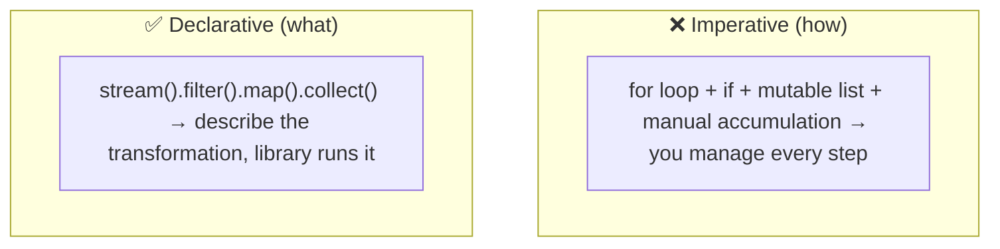

```java
// Imperative — HOW: manage the loop, condition, and accumulator
List<String> result = new ArrayList<>();
for (User u : users) {
    if (u.isActive()) {
        result.add(u.getName().toUpperCase());
    }
}

// Declarative — WHAT: filter active, get uppercase names, collect
List<String> result = users.stream()
    .filter(User::isActive)
    .map(u -> u.getName().toUpperCase())
    .collect(Collectors.toList());
```

> [!IMPORTANT]
> Both snippets do the same thing, but they *communicate* differently. The imperative version buries the intent ("uppercase names of active users") inside loop mechanics — you have to *read the whole loop* to understand it. The declarative stream version *states the intent directly*: filter, map, collect. This readability compounds in real code: pipelines of transformations stay flat and legible where nested loops become tangled. The functional style also **eliminates mutable intermediate state** (no `result` list you keep mutating), which removes a whole class of bugs and makes the code trivially parallelizable (§3.3). This "what over how" shift is the entire point — and once it clicks, imperative data-munging feels needlessly verbose.

### What is a Lambda?

A **lambda** is an anonymous function — a block of behavior you can pass around as a value.

```java
// Before Java 8: anonymous class (verbose)
Runnable r = new Runnable() {
    public void run() { System.out.println("hi"); }
};

// Java 8 lambda: same thing, concise
Runnable r = () -> System.out.println("hi");

// Lambda syntax variations
(x) -> x + 1                    // one param
(x, y) -> x + y                 // two params
x -> x * 2                      // parens optional for single param
(x) -> { return x + 1; }        // block body with explicit return
```

> [!IMPORTANT]
> A **lambda expression** is a concise way to represent an anonymous function — `(parameters) -> body`. Its revolutionary contribution to Java: **functions become values** you can store in variables, pass as arguments, and return from methods. Before lambdas, "passing behavior" required verbose anonymous inner classes (a whole class definition to wrap one method). Lambdas make behavior lightweight and first-class — which is *why* the Stream API is possible (you pass a lambda to `filter`/`map` to specify the behavior). This is the foundation of functional programming in Java: **treating code as data**. Note a lambda isn't magic — under the hood it's an instance of a **functional interface** (§1.3), which is how Java's type system accommodates functions without adding a new "function type."

### Functional Interfaces

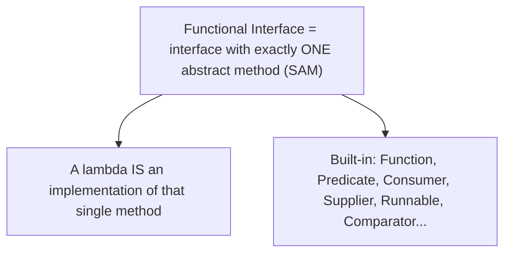

| Interface | Signature | Purpose | Example |
|---|---|---|---|
| **`Function<T,R>`** | `R apply(T)` | Transform T → R | `x -> x.length()` |
| **`Predicate<T>`** | `boolean test(T)` | Test a condition | `x -> x > 5` |
| **`Consumer<T>`** | `void accept(T)` | Consume (side effect) | `x -> print(x)` |
| **`Supplier<T>`** | `T get()` | Produce a value | `() -> new User()` |
| **`BiFunction<T,U,R>`** | `R apply(T,U)` | Two inputs → R | `(a,b) -> a+b` |
| **`UnaryOperator<T>`** | `T apply(T)` | T → T | `x -> x*2` |

> [!IMPORTANT]
> A **functional interface** is an interface with exactly **one abstract method** (a "SAM" — Single Abstract Method), optionally marked `@FunctionalInterface`. This is the *type* a lambda satisfies: when you write `Predicate<String> p = s -> s.isEmpty()`, the lambda provides the implementation of `Predicate`'s single `test` method. Java ships a rich set in `java.util.function` — **`Function`** (transform), **`Predicate`** (test/boolean), **`Consumer`** (side effect, returns nothing), **`Supplier`** (produce, takes nothing), and variants (`BiFunction`, `UnaryOperator`, primitive specializations like `IntFunction`). Understanding these is essential because the Stream API methods take them: `filter` takes a `Predicate`, `map` takes a `Function`, `forEach` takes a `Consumer`. Once you know which functional interface each stream method expects, the whole API becomes predictable. You can also define your own `@FunctionalInterface` for domain-specific behavior.

### Method References

```java
// Lambda → method reference (when the lambda just calls one method)
s -> s.toUpperCase()        →   String::toUpperCase      // instance method of a type
u -> u.getName()            →   User::getName
x -> System.out.println(x)  →   System.out::println      // instance method of an object
s -> Integer.parseInt(s)    →   Integer::parseInt        // static method
() -> new ArrayList<>()     →   ArrayList::new           // constructor reference
```

> [!TIP]
> A **method reference** (`::`) is shorthand for a lambda that does nothing but call an existing method — `User::getName` replaces `u -> u.getName()`. There are four kinds: **static** (`Integer::parseInt`), **instance-of-a-type** (`String::toUpperCase` — the first stream element becomes the receiver), **instance-of-a-specific-object** (`System.out::println`), and **constructor** (`ArrayList::new`). They're not just syntactic sugar for brevity — they often read *better* (`.map(User::getName)` states "get the name" more clearly than `.map(u -> u.getName())`). Use them whenever a lambda simply forwards to a single method; fall back to a full lambda when you need additional logic. Interviewers like to check you can convert between lambdas and method references fluently.

### Real-world analogy 🏭

Streams are like an **assembly line / factory conveyor belt**:
- Raw items (data) enter at one end (the **source** — a collection).
- Each **station** on the belt performs one operation — filter out defects (`filter`), stamp a label (`map`), etc. — these are **intermediate operations**.
- Items flow through *lazily* — nothing moves until there's demand at the end.
- At the end, a **terminal operation** collects the finished products into a box (`collect`), counts them (`count`), or ships them out (`forEach`).
- The belt processes **one item through all stations** before starting the next (in typical stream execution) — not "all items through station 1, then all through station 2."

> [!TIP]
> Beginner takeaway: **lambdas** make functions into values; **functional interfaces** are the types those lambdas satisfy; **method references** are shorthand for simple lambdas; and the **Stream API** uses them to build declarative data pipelines. You describe *what* transformation you want (filter, map, collect) and the library handles the *how*. This functional style is now idiomatic modern Java — the rest of this guide is mastering streams and their subtleties.

---

## 2. 🧩 CORE CONCEPTS (Intermediate Level)

### 2.1 Stream Pipeline Anatomy

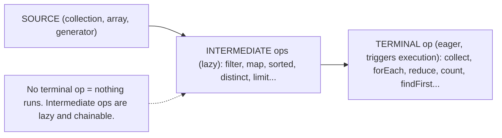

> [!IMPORTANT]
> Every stream pipeline has three parts: a **source** (a collection via `.stream()`, an array, `Stream.of()`, or a generator), zero or more **intermediate operations** (which transform the stream and return *another stream* — so they're chainable: `filter`, `map`, `sorted`, `distinct`, `limit`, `peek`), and exactly one **terminal operation** (which produces a result or side effect and *triggers execution*: `collect`, `forEach`, `reduce`, `count`, `findFirst`, `anyMatch`). The critical rule: **intermediate operations are lazy** — they do *nothing* until a terminal operation is invoked (§3.1). Without a terminal op, a pipeline is just a description that never runs (a common beginner surprise: a `stream().map(...)` with no terminal does nothing). Another key rule: **a stream can only be consumed once** — after a terminal op, the stream is closed; reusing it throws `IllegalStateException` (streams are not reusable collections, they're one-shot pipelines).

### 2.2 The Core Operations — map, filter, reduce

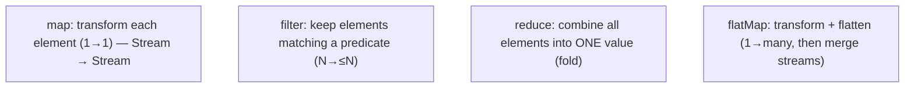

```java
// map — transform
Stream.of("a","bb").map(String::length)         // → 1, 2

// filter — select
Stream.of(1,2,3,4).filter(n -> n % 2 == 0)       // → 2, 4

// reduce — combine to one value
Stream.of(1,2,3,4).reduce(0, Integer::sum)       // → 10

// flatMap — flatten nested structure
Stream.of(List.of(1,2), List.of(3,4))
      .flatMap(List::stream)                      // → 1,2,3,4 (flattened)
```

> [!IMPORTANT]
> The three foundational operations (the "map-filter-reduce" of functional programming): **`map`** transforms each element via a `Function` (one-to-one: a stream of users → a stream of names). **`filter`** keeps only elements passing a `Predicate` (selection). **`reduce`** combines all elements into a single value using an accumulator (sum, product, max, concatenation — a "fold"). The fourth essential is **`flatMap`**, which is `map` + *flatten*: it transforms each element into a *stream* and then concatenates all those streams into one — indispensable for nested structures (a stream of lists → a stream of all their elements; a stream of orders → a stream of all their line items). The classic confusion is **`map` vs `flatMap`**: `map` gives you `Stream<List<T>>` (a stream of lists), while `flatMap` gives you `Stream<T>` (one flat stream). Whenever you find yourself with a "stream of collections" and want a "stream of elements," reach for `flatMap`.

### 2.3 Collectors — gathering results

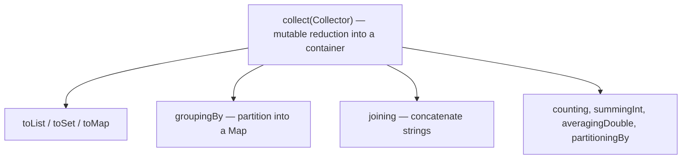

```java
// Group users by department → Map<Dept, List<User>>
Map<Dept, List<User>> byDept = users.stream()
    .collect(Collectors.groupingBy(User::getDept));

// Count per department → Map<Dept, Long>
Map<Dept, Long> counts = users.stream()
    .collect(Collectors.groupingBy(User::getDept, Collectors.counting()));

// Join names → "Alice, Bob, Carol"
String names = users.stream().map(User::getName)
    .collect(Collectors.joining(", "));
```

> [!IMPORTANT]
> **`collect`** is the most powerful terminal operation — it performs a **mutable reduction**, accumulating stream elements into a container using a **`Collector`**. The `Collectors` utility class provides a rich toolkit: **`toList`/`toSet`/`toMap`** (gather into collections), **`groupingBy`** (partition elements into a `Map` keyed by a classifier — like SQL `GROUP BY`, [[01 SQL and Transactions Deep Dive]]), **`joining`** (concatenate strings with delimiters), **`partitioningBy`** (split into true/false groups), and aggregators (**`counting`**, **`summingInt`**, **`averagingDouble`**). The real power is **composing collectors**: `groupingBy(User::getDept, counting())` groups *and* counts in one pass; `groupingBy(User::getDept, mapping(User::getName, toList()))` groups and extracts names. `groupingBy` with downstream collectors is one of the most useful and interview-tested stream idioms — it turns nested loops with maps and lists into a single readable line. Note `toMap` throws on duplicate keys unless you supply a merge function (a common gotcha).

### 2.4 Optional — taming null

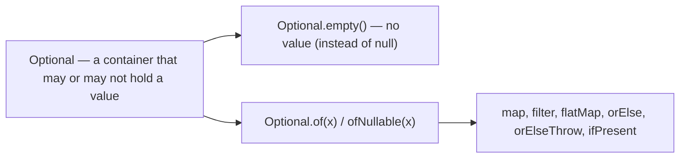

```java
// Instead of returning null (and risking NullPointerException):
Optional<User> findUser(String id) { ... }

// Callers handle absence explicitly:
String name = findUser("42")
    .map(User::getName)                  // transform if present
    .orElse("Unknown");                  // default if empty

findUser("42").ifPresent(u -> notify(u)); // do only if present
User u = findUser("42").orElseThrow(() -> new NotFoundException());
```

> [!IMPORTANT]
> **`Optional<T>`** is a container that *explicitly* represents "a value that may be absent" — designed to combat the **`NullPointerException`**, the "billion-dollar mistake." Instead of returning `null` (which callers forget to check → NPE at runtime), a method returns `Optional<User>`, *forcing* the caller to consciously handle the empty case via `orElse` (default), `orElseThrow` (exception), `ifPresent` (conditional action), or `map`/`flatMap` (transform if present). This makes absence part of the *type signature* — self-documenting and compiler-encouraged. **Best-practice rules**: use `Optional` primarily as a **return type** for methods that might not find a result; **don't** use it for fields, method *parameters*, or in collections (it adds overhead and wasn't designed for that); **never** call `.get()` without checking (it throws if empty — defeating the purpose); and prefer `orElseGet(supplier)` over `orElse(value)` when the default is expensive to compute (§3.5). Optional is Java's answer to null-safety, echoing [[03 TypeScript]]'s optional types and functional languages' `Maybe`/`Option`.

### 2.5 Creating & Converting Streams

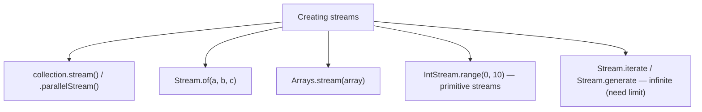

> [!TIP]
> Streams come from many sources: `collection.stream()` (the common case), `Stream.of(...)`, `Arrays.stream(array)`, and generators like `Stream.iterate(seed, next)` / `Stream.generate(supplier)` (which create **infinite streams** — you *must* bound them with `limit()` or a short-circuiting terminal, or they run forever). A crucial performance detail: use **primitive streams** (`IntStream`, `LongStream`, `DoubleStream`) when working with numbers — a `Stream<Integer>` boxes every value (object overhead, [[04 Java Concurrency and JVM]]), while `IntStream` operates on raw `int`s (faster, less memory) and offers numeric operations (`sum()`, `average()`, `range()`). Convert with `mapToInt`/`mapToObj` and `boxed()`. `IntStream.range(0, n)` is the idiomatic functional replacement for a counting `for` loop. Knowing when to drop to primitive streams shows performance awareness.

### 2.6 Common Terminal Operations

| Operation | Returns | Purpose |
|---|---|---|
| **`collect`** | Collection/Map/String | Mutable reduction (§2.3) |
| **`forEach`** | void | Side effect per element |
| **`reduce`** | Optional/T | Combine to one value |
| **`count`** | long | Number of elements |
| **`anyMatch`/`allMatch`/`noneMatch`** | boolean | Predicate checks (short-circuit) |
| **`findFirst`/`findAny`** | Optional | First/any element (short-circuit) |
| **`min`/`max`** | Optional | Extremes by comparator |
| **`toArray`** | array | To an array |

> [!TIP]
> Terminal operations end a pipeline and produce a result. Beyond `collect` and `reduce`, note the **short-circuiting** ones: `anyMatch`/`allMatch`/`noneMatch` (stop as soon as the answer is determined), and `findFirst`/`findAny` (stop at the first match) — these can avoid processing the whole stream (§3.1), which is essential for infinite streams and performance. `findAny` vs `findFirst`: `findAny` may return *any* matching element (allowing optimization in parallel streams where "first" requires ordering coordination), while `findFirst` respects encounter order. `forEach` is for side effects (printing, saving) but is often a code smell in otherwise-functional pipelines — if you're collecting results, prefer `collect`; reserve `forEach` for genuine terminal side effects.

---

## 3. ⚙️ ADVANCED CONCEPTS (Senior Level)

### 3.1 Lazy Evaluation & Short-Circuiting

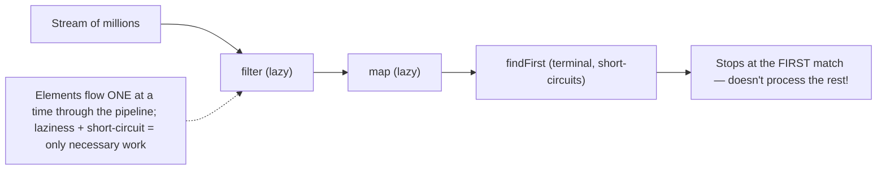

```java
// Only processes elements until it finds the first match — not all million
Optional<String> first = names.stream()
    .filter(n -> n.startsWith("A"))     // lazy
    .map(String::toUpperCase)           // lazy — only runs on survivors
    .findFirst();                       // terminal — stops at first
```

> [!IMPORTANT]
> **Streams are lazy**: intermediate operations don't execute when you *declare* them — they execute only when a terminal operation runs, and even then, elements are pulled through the pipeline **one at a time** (not "all through filter, then all through map"). This enables two powerful optimizations. **(1) Fused operations**: `filter` then `map` doesn't create an intermediate collection — each element flows through both in one pass. **(2) Short-circuiting**: operations like `findFirst`, `anyMatch`, and `limit` can *stop early* — `findFirst` after a `filter` stops at the *first* match, never processing the rest (so a filter+findFirst over a million elements might touch only three). Laziness is also what makes **infinite streams** work (`Stream.iterate(...).limit(10)` — the generator only produces 10 values because `limit` short-circuits). Understanding laziness explains stream performance and why the order of operations matters (put `filter` before `map` to transform fewer elements, put `limit` early). It's the same lazy-evaluation principle behind [[12 Spring WebFlux]]/reactive streams.

### 3.2 Statelessness, Purity & Side Effects

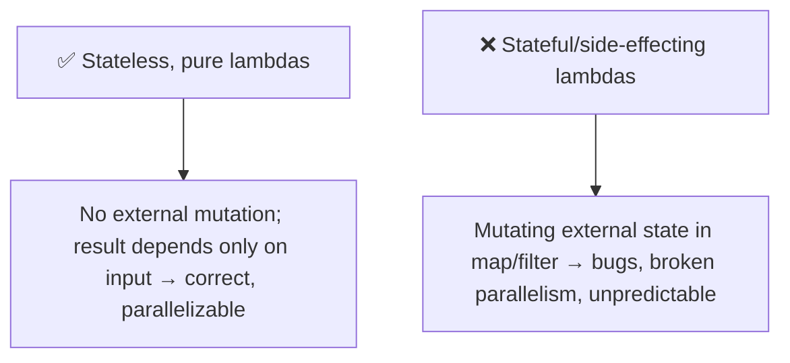

```java
// ❌ BAD — side effect + external mutation inside a stream
List<String> results = new ArrayList<>();
users.stream().forEach(u -> results.add(u.getName()));  // mutating external state!

// ✅ GOOD — pure, no external mutation
List<String> results = users.stream()
    .map(User::getName)
    .collect(Collectors.toList());
```

> [!WARNING]
> Stream operations should use **stateless, side-effect-free (pure) functions** — lambdas whose result depends only on their input and that don't mutate external state. Violating this causes real bugs: a lambda that mutates a shared `ArrayList` inside `map`/`forEach` **breaks under parallel streams** (concurrent mutation → race conditions, [[04 Java Concurrency and JVM]], lost updates, or corrupted collections) and is fragile even sequentially. The idiomatic fix is to let the pipeline *produce* the result (via `collect`) rather than *mutating* external state. This isn't just style — the Stream API's *contract* assumes stateless, non-interfering behavioral parameters, and the JVM relies on it for optimizations and parallelism. Also **never modify the stream's source collection** during a pipeline (concurrent-modification hazard). The functional discipline — **prefer producing new values over mutating existing ones** — is what makes streams safe, parallelizable, and reasoned-about. Side effects belong in terminal `forEach` at most, not scattered through intermediate operations.

### 3.3 Parallel Streams

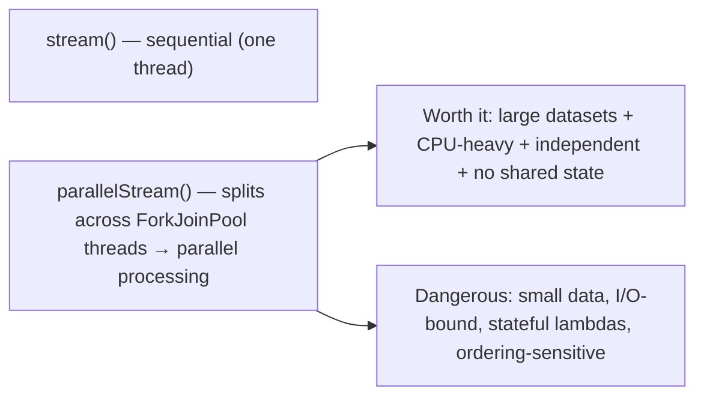

> [!WARNING]
> **Parallel streams** (`parallelStream()` or `.parallel()`) automatically split the work across multiple threads (via the common **ForkJoinPool** — [[04 Java Concurrency and JVM]]) — turning `list.parallelStream().map(expensiveOp)` into parallel execution with *almost no code change*. This is genuinely powerful for **large datasets of CPU-bound, independent work**. But it's easy to misuse and often *slower*: it has overhead (splitting, thread coordination, merging), so for **small collections** it's net-negative; for **I/O-bound work** it's wrong (threads block — you'd want [[04 Java Concurrency and JVM]] virtual threads or async instead); with **stateful/side-effecting lambdas** (§3.2) it produces *wrong results* (races); and it can break **ordering** guarantees. A subtle production trap: parallel streams use the *shared* common ForkJoinPool, so a slow parallel stream can starve *other* parallel streams app-wide. The senior rule: **default to sequential; use parallel only when you've measured that the dataset is large, the work is CPU-bound and independent, the lambdas are stateless, and it actually helps.** Parallelism is not a free "make it faster" switch — it's a targeted tool with real caveats.

### 3.4 reduce, collect & the reduction model

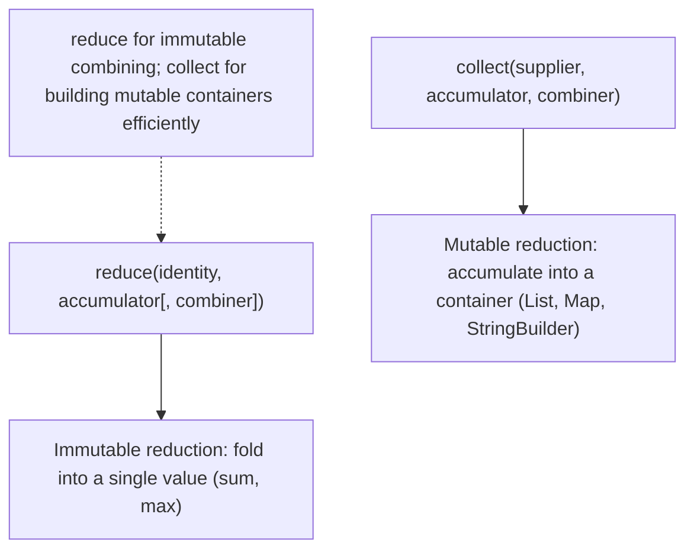

> [!IMPORTANT]
> Java has two reduction models, and knowing when to use each is a senior distinction. **`reduce`** performs an **immutable reduction** — it repeatedly combines elements into a single *immutable* result using an identity and an associative accumulator (`reduce(0, Integer::sum)` for a total, `reduce(String::concat)` for concatenation). But `reduce` for building *collections* is inefficient — combining immutable containers means copying repeatedly (O(n²) for string concatenation). **`collect`** performs a **mutable reduction** — it accumulates into a *mutable* container (a growing `List`, a `StringBuilder`, a `Map`) via a supplier + accumulator + combiner, which is far more efficient for building collections. The rule: **`reduce` for combining into a single immutable value** (numbers, booleans), **`collect` for accumulating into a container**. The three-argument forms both take a **combiner** — crucial for *parallel* streams, where partial results computed on different threads must be merged; the combiner must be associative and consistent with the accumulator, or parallel results will be wrong. Understanding the identity/accumulator/combiner contract is what separates casual stream users from those who can write correct custom reductions.

### 3.5 Optional Deep — pitfalls & idioms

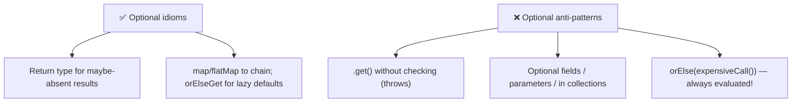

> [!WARNING]
> `Optional` has subtle traps. **`orElse` vs `orElseGet`**: `orElse(computeDefault())` **always evaluates** its argument, even when the Optional has a value (because it's a method argument, evaluated before the call) — so if the default is expensive (a DB call, object creation), you pay for it needlessly *every time*. Use **`orElseGet(() -> computeDefault())`** (a `Supplier`) so the default is computed *only when actually needed* (lazy). This is a real performance bug in production code. Other anti-patterns: calling **`.get()`** without `isPresent()` (throws `NoSuchElementException` — the very NPE-in-disguise Optional was meant to prevent — prefer `orElseThrow`/`orElse`/`map`); using `Optional` for **fields or method parameters** (it's not `Serializable`, adds overhead, and wasn't designed for it — use overloads or nullable params instead); and putting `Optional` **in collections** (nest the absence differently). `Optional` also chains beautifully with **`map`/`flatMap`/`filter`** — `findUser(id).map(User::getAddress).map(Address::getCity).orElse("N/A")` safely navigates a chain that could be absent at any step (Java's null-safe navigation).

### 3.6 Failure Scenarios & Stream Pitfalls

| Pitfall | Cause | Fix |
|---|---|---|
| **Nothing happens** | No terminal operation | Add `collect`/`forEach`/etc. |
| **`IllegalStateException`** | Reusing a consumed stream | Create a fresh stream |
| **Parallel gives wrong result** | Stateful/side-effecting lambda | Pure, stateless lambdas |
| **`toMap` throws** | Duplicate keys | Provide a merge function |
| **Slower than a loop** | Parallel on small data; boxing | Sequential; primitive streams |
| **`orElse` always runs default** | Eager argument evaluation | `orElseGet(supplier)` |
| **NPE inside stream** | Element or mapper returns null | Filter nulls; use Optional |
| **Unreadable mega-pipeline** | Too many chained ops | Extract methods; name steps |

> [!WARNING]
> Beyond individual bugs, the meta-pitfall is **overusing streams where they hurt readability**. A stream pipeline with 15 chained operations, nested lambdas, and complex `collect` logic can be *harder* to read and debug than a plain loop — and streams are notoriously awkward to **debug** (you can't easily step through, though `peek()` helps log intermediate values, and breakpoints in lambdas are fiddly). Streams also can't cleanly handle **checked exceptions** (lambdas can't throw them without wrapping — a real friction point). The mature stance: **streams are a tool, not a mandate.** Use them where they clarify (transformations, filtering, grouping, aggregation); use a simple `for` loop where it's clearer (complex control flow, checked exceptions, early returns with side effects, or when you need indices). "Everything must be a stream" is as wrong as "never use streams" — idiomatic Java mixes both, choosing whichever reads better for the task.

---

## 4. 🏗️ REAL-WORLD SYSTEM DESIGN USAGE

### 4.1 Streams in everyday backend code

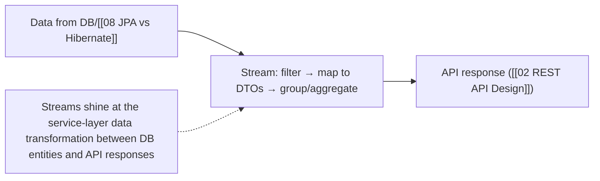

> [!TIP]
> Streams are ubiquitous in real backend code, especially at the **service layer** transforming data between the database and the API. Typical patterns: mapping JPA entities to response **DTOs** (`entities.stream().map(this::toDto).collect(toList())` — [[08 JPA vs Hibernate]], [[02 REST API Design]]), filtering by business rules, grouping/aggregating for reports (`groupingBy` + `counting`/`summingInt`), joining/flattening related data (`flatMap`), and building lookup maps (`toMap`). In [[05 Spring Boot]], you'll see streams everywhere DTOs, validation, and aggregation happen. A key caution though: **don't confuse Java streams with database queries** — filtering/aggregating a huge dataset *in memory* with streams after loading it all from the DB is far slower than doing it in SQL ([[01 SQL and Transactions Deep Dive]]) or letting the DB/[[08 JPA vs Hibernate]] filter. Streams process data *already in memory*; push heavy filtering/aggregation *down to the database* and use streams for the final in-memory shaping. This "filter in the DB, shape with streams" division is a common performance lesson.

### 4.2 Functional style & design patterns

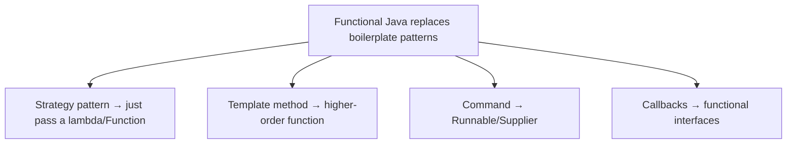

> [!TIP]
> Lambdas and functional interfaces dramatically simplify several classic [[02 Design Patterns]]. The **Strategy pattern** (encapsulating interchangeable algorithms) — which used to require an interface plus multiple concrete classes — becomes just passing a **lambda** (`sort(list, (a,b) -> ...)`, or injecting a `Function`/`Predicate`). The **Template Method** and **Command** patterns similarly collapse into higher-order functions and `Runnable`/`Supplier`. **Callbacks** are just functional interfaces. This is functional programming's influence on OOP design: behavior parameterization via functions replaces boilerplate class hierarchies. It connects to broader ideas — passing behavior as data enables composition, and many "patterns" were really workarounds for the *absence* of first-class functions (a lesson [[01 JavaScript]] developers know well, where functions were always first-class). Recognizing "this pattern is just a function now" is a sign of fluency in modern Java.

### 4.3 Functional programming principles applied

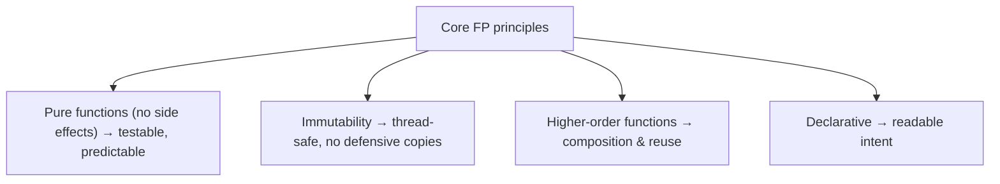

> [!IMPORTANT]
> Java's functional features embody principles worth applying broadly. **Pure functions** (output depends only on input, no side effects) are trivially **testable** ([[01 Testing Strategies]] — no mocks, no setup, same input → same output) and easy to reason about. **Immutability** (value objects that never change — [[04 Domain-Driven Design]], `record` types in modern Java) eliminates whole categories of bugs and is inherently **thread-safe** ([[04 Java Concurrency and JVM]] — no synchronization needed for data that can't change). **Higher-order functions** (functions taking/returning functions) enable powerful **composition** and reuse. **Declarative** code states intent over mechanism. These principles don't require going fully functional — even in mostly-OOP Java, favoring pure functions, immutable data, and composition produces more robust, testable, concurrent-safe code. Modern Java (records, sealed types, pattern matching, virtual threads) increasingly embraces this blend. Understanding *why* functional style helps — not just *how* to write a stream — is the senior-level takeaway.

---

## 5. 🎤 INTERVIEW PREPARATION

### 5.1 Most important questions

<details>
<summary><b>Q1: What is a lambda and a functional interface?</b></summary>

A **lambda** is an anonymous function — `(params) -> body` — that makes functions into values you can pass around. A **functional interface** is an interface with exactly one abstract method (a SAM); it's the *type* a lambda implements. When you write `Predicate<String> p = s -> s.isEmpty()`, the lambda provides `Predicate`'s single `test` method. Java's `java.util.function` package provides `Function`, `Predicate`, `Consumer`, `Supplier`, etc., which the Stream API methods accept. Lambdas replaced verbose anonymous inner classes and enabled the functional style.
</details>

<details>
<summary><b>Q2: Explain the parts of a stream pipeline.</b></summary>

A **source** (collection/array/generator), zero or more **intermediate operations** (lazy, chainable, return a stream — filter, map, sorted), and one **terminal operation** (eager, triggers execution — collect, forEach, reduce, count). Intermediate ops are **lazy**: nothing runs until the terminal op. A stream is **single-use** — after a terminal op it's consumed and can't be reused. Without a terminal op, nothing happens.
</details>

<details>
<summary><b>Q3: map vs flatMap?</b></summary>

**`map`** transforms each element one-to-one via a Function — `Stream<T>` → `Stream<R>`. If the mapper returns a collection, you get `Stream<List<R>>` (a stream of lists). **`flatMap`** transforms each element into a *stream* and then flattens/concatenates all those streams into one — `Stream<T>` → `Stream<R>`. Use flatMap to turn a "stream of collections" into a "stream of elements" (e.g., a stream of orders → a stream of all line items). map = transform; flatMap = transform + flatten.
</details>

<details>
<summary><b>Q4: What is lazy evaluation in streams and why does it matter?</b></summary>

Intermediate operations don't execute when declared — only when a terminal operation runs, and elements are pulled through one at a time. This enables **operation fusion** (filter+map in one pass, no intermediate collection) and **short-circuiting** (findFirst/anyMatch/limit can stop early — a filter+findFirst over a million elements may touch only a few). It also makes infinite streams work (`Stream.iterate(...).limit(n)`). Laziness is why operation order matters for performance (filter before map).
</details>

<details>
<summary><b>Q5: When should you use (or avoid) parallel streams?</b></summary>

Use them for **large datasets** of **CPU-bound, independent** work with **stateless** lambdas, when measured to help. Avoid them for small data (overhead dominates), I/O-bound work (threads block — use async/virtual threads), stateful/side-effecting lambdas (races → wrong results), and ordering-sensitive logic. They share the common ForkJoinPool, so a slow parallel stream can starve others app-wide. Default to sequential; parallel is a measured optimization, not a free speed switch.
</details>

<details>
<summary><b>Q6: What is Optional and how should you use it?</b></summary>

`Optional<T>` explicitly models "a value that may be absent," combating NPEs by forcing callers to handle emptiness (orElse, orElseThrow, ifPresent, map/flatMap). Use it mainly as a **return type** for methods that might not find a result. Don't use it for fields, parameters, or in collections. Never call `.get()` without checking. Prefer `orElseGet(supplier)` over `orElse(value)` when the default is expensive (orElse always evaluates its argument).
</details>

<details>
<summary><b>Q7: reduce vs collect?</b></summary>

**`reduce`** does an immutable reduction — combining elements into a single immutable value (sum, max, concatenation) via identity + associative accumulator. **`collect`** does a mutable reduction — accumulating into a mutable container (List, Map, StringBuilder) via supplier + accumulator + combiner, far more efficient for building collections. Use reduce for combining to one value, collect for building containers. The combiner (in the 3-arg forms) is essential for merging partial results in parallel streams.
</details>

<details>
<summary><b>Q8: Why must stream lambdas be stateless and side-effect-free?</b></summary>

Because the Stream API's contract assumes it, and violating it causes bugs — especially with parallel streams, where mutating shared external state from a lambda creates race conditions and wrong results. It also breaks reasoning and the JVM's optimizations. The idiomatic approach is to *produce* results via collect/reduce rather than *mutate* external state. Side effects belong (if anywhere) in a terminal forEach, not in intermediate operations like map/filter.
</details>

### 5.2 Tricky questions

> [!TIP]
> **"Why doesn't `list.stream().map(...)` do anything on its own?"** — Streams are lazy; intermediate operations (`map`) only run when a terminal operation is invoked. Without a terminal op (`collect`, `forEach`, etc.), the pipeline is just a description that never executes. This surprises people expecting eager evaluation.

> [!TIP]
> **"Is a parallel stream always faster?"** — No, often slower. It adds splitting/merging/coordination overhead, so small datasets and I/O-bound work suffer. It only helps for large, CPU-bound, independent, stateless workloads — and even then you should measure. It can also starve the shared ForkJoinPool.

> [!TIP]
> **"What's wrong with `orElse(getDefaultFromDb())`?"** — `orElse`'s argument is *always* evaluated, even when the Optional has a value — so you hit the DB every call needlessly. Use `orElseGet(() -> getDefaultFromDb())` so the default is computed lazily, only when the Optional is actually empty.

> [!TIP]
> **"Can you reuse a stream?"** — No. A stream is single-use — after its terminal operation runs, it's consumed; operating on it again throws `IllegalStateException`. If you need to process the data twice, create a new stream from the source each time (or collect once and reuse the collection).

### 5.3 Common mistakes candidates make

| Mistake | Reality |
|---|---|
| Forgetting the terminal op | Nothing runs; streams are lazy |
| Reusing a consumed stream | Single-use; create a fresh one |
| Side effects in map/filter | Must be stateless/pure |
| Parallel stream by reflex | Often slower; measure first |
| `orElse` with expensive default | Use `orElseGet` (lazy) |
| `.get()` on Optional | Throws if empty; use safe accessors |
| `map` when you need `flatMap` | flatMap flattens nested streams |
| Streams for everything | Loops are clearer sometimes |

### 5.4 What interviewers actually expect

- **Lambdas + functional interfaces** and converting to **method references**.
- **Stream pipeline** structure; **lazy evaluation** and short-circuiting.
- **map/filter/reduce/flatMap** and **collectors** (esp. `groupingBy`).
- **`map` vs `flatMap`**, **`reduce` vs `collect`**.
- **Parallel streams** caveats (stateless, CPU-bound, measured).
- **Optional** best practices (`orElseGet` vs `orElse`, no `.get()`).
- Knowing when streams *help* vs when a loop is clearer.

---

## 6. 🛠️ HANDS-ON PROJECTS

### Project 1: Refactor Loops to Streams (Beginner→Intermediate)

**Goal:** Build fluency by converting imperative code.

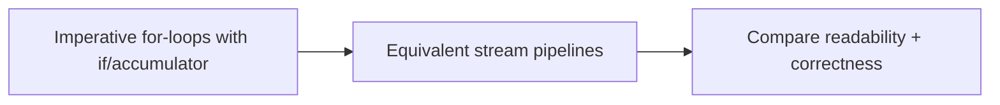

**Steps:**
1. Take a class full of imperative loops (filtering, transforming, summing, grouping over a list of objects).
2. Convert each to a **stream pipeline**; use **method references** where possible.
3. Implement grouping/counting with **`Collectors.groupingBy`** (replace nested maps + loops).
4. Replace null-returning lookups with **`Optional`**.
5. Note where the stream is clearer — and where a loop was actually better.

**Learn:** map/filter/reduce/collect, groupingBy, method references, Optional, when streams help.

---

### Project 2: Data-Processing Pipeline (Intermediate→Senior)

**Goal:** Build a realistic analytics pipeline.

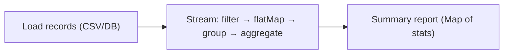

**Steps:**
1. Load a dataset (transactions, log lines, or CSV of orders).
2. Build a pipeline: **filter** invalid rows, **flatMap** nested items, **map** to a model.
3. Compute aggregates with composed **collectors** (`groupingBy` + `summingDouble`/`counting`/`averagingInt`, `partitioningBy`).
4. Use **primitive streams** (`IntStream`/`DoubleStream`) for numeric stats; measure vs boxed.
5. Handle absence with **Optional**; chain `map`/`orElse`.

**Learn:** flatMap, composed collectors, primitive streams, real aggregation, Optional chaining.

---

### Project 3: Explore Laziness, Parallelism & Custom Collectors (Senior)

**Goal:** Understand the internals hands-on.

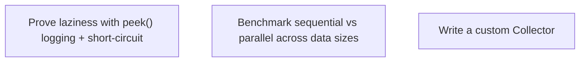

**Steps:**
1. Use **`peek()`** to log element flow; prove **short-circuiting** (`findFirst` after `filter` touches few elements).
2. Create an **infinite stream** (`Stream.iterate`) bounded by `limit`.
3. **Benchmark** sequential vs `parallelStream()` (JMH) across data sizes and CPU vs I/O work — find where parallel actually wins.
4. Deliberately break parallelism with a **stateful lambda**; observe wrong results.
5. Write a **custom `Collector`** (supplier/accumulator/combiner/finisher).

**Learn:** lazy evaluation, short-circuiting, parallel-stream trade-offs, the reduction contract, custom collectors.

---

## 7. 🔬 DEEP DIVE: INTERNALS

### 7.1 How lambdas compile — invokedynamic, not classes

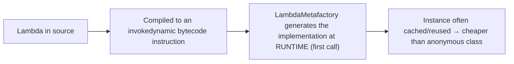

> [!TIP]
> A common misconception is that lambdas are just syntactic sugar for anonymous inner classes — but they compile *differently* and more efficiently. An anonymous class generates a *separate `.class` file* at compile time (class-loading overhead, more classes). A lambda instead compiles to an **`invokedynamic`** bytecode instruction (introduced in Java 7 for dynamic languages, repurposed for lambdas in Java 8): at *runtime*, on first execution, the **`LambdaMetafactory`** generates the implementation dynamically and links the call site — and the resulting instance can be **reused/cached** (a stateless lambda that captures nothing is often a singleton). This means lambdas have **lower overhead** than anonymous classes (no extra class files, potential instance reuse) and give the JVM flexibility to optimize ([[04 Java Concurrency and JVM]] JIT). It's a neat example of the JVM's `invokedynamic` machinery — and explains why "lambdas are just anonymous classes" is technically wrong. (Captured variables do add cost — a capturing lambda creates a new instance per capture.)

### 7.2 Effectively final & variable capture

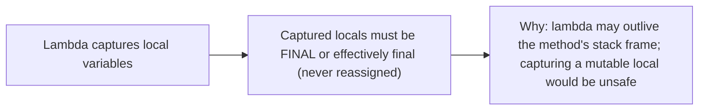

> [!IMPORTANT]
> Lambdas (like anonymous classes) can **capture** local variables from their enclosing scope — but only if those variables are **final or "effectively final"** (never reassigned after initialization). Try to reassign a captured local and it won't compile. **Why the restriction?** A lambda can *outlive* the method that created it (stored, passed to another thread — [[04 Java Concurrency and JVM]]), but Java captures locals **by value** (a copy), not by reference. If the local could change after capture, the lambda's copy would silently diverge from the original — confusing and unsafe (this is exactly why other languages' closures-over-mutable-variables cause subtle bugs — [[01 JavaScript]] closures capture by reference and famously trip people up in loops). Java sidesteps the whole problem by requiring effective finality. The workaround when you *need* mutable captured state is to capture a *reference to a mutable container* (an array element, an `AtomicInteger`) — but that's usually a smell suggesting you should restructure (e.g., use `reduce`/`collect` instead of mutating captured state). Understanding capture semantics explains a frequent compile error and connects lambdas to closure theory.

### 7.3 The Spliterator — how streams split for parallelism

```mermaid
flowchart LR
    Source["Stream source"] --> Spliterator["Spliterator: traverses AND can split() the data"]
    Spliterator --> Split["Parallel stream: recursively split() into chunks → ForkJoinPool tasks"]
    Split --> Merge["Process chunks in parallel → combine results"]
```

> [!TIP]
> Under every stream is a **`Spliterator`** ("splittable iterator") — the engine that powers both sequential traversal and parallel splitting. Beyond iterating (`tryAdvance`), it can **`trySplit`** — partition its elements into two, enabling divide-and-conquer parallelism. When you call `parallelStream()`, the framework recursively calls `trySplit` to break the data into chunks small enough to process independently across **ForkJoinPool** threads ([[04 Java Concurrency and JVM]] work-stealing), then merges results via combiners. The *quality* of splitting depends on the source: an `ArrayList` or array splits cheaply and evenly (index ranges → great parallelism), while a `LinkedList` splits poorly (must traverse) and a `HashSet` splits unevenly — which is *why parallel streams help far more on array-backed sources than linked structures*. Spliterators also carry **characteristics** (SIZED, ORDERED, DISTINCT, SORTED) that let the pipeline optimize (e.g., `SIZED` lets `toList` presize the result). Understanding the Spliterator demystifies *why* parallel-stream performance varies so much by data structure — a deep, differentiating insight.

### 7.4 Stream fusion — why intermediate ops don't allocate

```mermaid
flowchart LR
    Naive["Naive: filter → new list → map → new list (allocations, multiple passes)"]
    Fused["Streams: filter+map FUSED into one pass, element-by-element, no intermediate collections"]
    Naive -.streams avoid this.-> Fused
```

> [!IMPORTANT]
> A key performance property: stream intermediate operations are **fused** into a single pass rather than materializing intermediate collections. If you filtered-then-mapped *eagerly* (like chaining collection methods in some languages, or naive imperative code), you'd allocate a whole intermediate list after `filter`, then another after `map` — multiple passes, multiple allocations. Streams instead build a **pipeline of stateless operations** and push each element through *all* stages before moving to the next (thanks to laziness, §3.1) — so `filter().map().collect()` makes **one pass** with **no intermediate collections**, just the final result. This is implemented via a chain of `Sink` objects internally (each stage wraps the next, passing elements downstream). The consequence: adding more intermediate operations to a stream is *cheap* (no per-stage allocation), and the cost is dominated by the actual work, not overhead. **Stateful** intermediate operations (`sorted`, `distinct`) are the exception — they *must* buffer/see all elements, breaking the pure one-pass model and adding cost. Knowing which operations are stateless (fusable) vs stateful (buffering) explains stream performance characteristics.

### 7.5 Checked exceptions — the functional friction point

```mermaid
flowchart LR
    Problem["Lambda in map() calls a method throwing a CHECKED exception → won't compile (functional interfaces don't declare them)"]
    Fixes["Fixes:"] --> F1["try/catch inside the lambda (ugly)"]
    Fixes --> F2["Wrap checked → unchecked (RuntimeException)"]
    Fixes --> F3["Custom throwing-functional-interface wrapper"]
```

> [!TIP]
> A genuine pain point where Java's functional features clash with its **checked exceptions**: the standard functional interfaces (`Function`, `Predicate`, etc.) **don't declare checked exceptions**, so a lambda that calls a method throwing a checked exception (like `Files.readString` throwing `IOException`) **won't compile** inside a stream. The options are all imperfect: **(1)** `try/catch` *inside* the lambda (verbose, clutters the pipeline), **(2)** wrap the checked exception in a `RuntimeException` (loses the checked-ness, but pragmatic — often the cleanest), or **(3)** define a custom `@FunctionalInterface` that declares the checked exception plus a helper to adapt it (libraries like Vavr provide these). This friction is a real reason some data-processing code *stays* imperative (a `for` loop can `throw` checked exceptions naturally). It's a well-known rough edge in Java's functional design — checked exceptions predate lambdas and don't compose with them. Knowing this (and the pragmatic "wrap in unchecked" workaround) is a mark of someone who's written real stream code, not just textbook examples.

---

## ✅ Production Checklists

### Correctness
- [ ] Every pipeline has a **terminal operation**
- [ ] Lambdas are **stateless & side-effect-free** (esp. for parallel)
- [ ] No mutation of the stream **source** during processing
- [ ] `toMap` has a **merge function** for possible duplicate keys
- [ ] Streams **not reused** after a terminal op
- [ ] Checked exceptions handled/wrapped explicitly

### Performance
- [ ] **Primitive streams** (`IntStream` etc.) for numeric work (avoid boxing)
- [ ] `filter` before `map`; `limit`/short-circuit early
- [ ] **Parallel streams** only when measured (large, CPU-bound, stateless)
- [ ] Heavy filtering/aggregation pushed to the **DB**, not done in-memory
- [ ] `collect` (not `reduce`) for building collections

### Readability & Safety
- [ ] Complex pipelines **broken into named methods**
- [ ] **Method references** where they read better
- [ ] **Optional** as return type (not fields/params); **`orElseGet`** for costly defaults
- [ ] Never `.get()` on Optional without checking
- [ ] Loops preferred where clearer (control flow, checked exceptions)

---

## 🗺️ Learning Roadmap

```mermaid
flowchart TB
    A["1️⃣ Lambdas & functional interfaces<br/>Function/Predicate/Consumer/Supplier"] --> B["2️⃣ Method references<br/>the 4 kinds"]
    B --> C["3️⃣ Stream basics<br/>map/filter/collect, pipeline structure"]
    C --> D["4️⃣ Collectors & reduce<br/>groupingBy, reduce vs collect"]
    D --> E["5️⃣ Optional<br/>idioms & pitfalls"]
    E --> F["6️⃣ Laziness & parallelism<br/>short-circuit, parallel caveats"]
    F --> G["7️⃣ Internals<br/>invokedynamic, spliterator, fusion, capture"]
    G --> H["8️⃣ Judgment<br/>FP principles, when NOT to use streams"]
```

| Stage | Focus | You can... |
|---|---|---|
| 1–2 | Functions as values | Write & convert lambdas/refs |
| 3–4 | Streams | Build map/filter/collect pipelines |
| 5–6 | Optional + laziness | Use Optional & parallel correctly |
| 7–8 | Internals + judgment | Reason deeply; choose streams vs loops |

---

## 🔁 Self-Review Completion Loop

Reviewed against *Effective Java* (Bloch, Items on streams/lambdas/Optional), *Modern Java in Action* (Urma et al.), and the Java API docs.

### Gap Review Matrix

| Dimension | Covered? | Where |
|---|---|---|
| Imperative vs declarative | ✅ | §1 |
| Lambdas | ✅ | §1 |
| Functional interfaces | ✅ | §1 |
| Method references | ✅ | §1 |
| Stream pipeline anatomy | ✅ | §2.1 |
| map/filter/reduce/flatMap | ✅ | §2.2 |
| Collectors / groupingBy | ✅ | §2.3 |
| Optional | ✅ | §2.4, §3.5 |
| Creating/primitive streams | ✅ | §2.5 |
| Terminal operations | ✅ | §2.6 |
| Lazy evaluation / short-circuit | ✅ | §3.1, §7.4 |
| Statelessness / purity | ✅ | §3.2 |
| Parallel streams | ✅ | §3.3, §7.3 |
| reduce vs collect | ✅ | §3.4 |
| Optional pitfalls | ✅ | §3.5 |
| Stream pitfalls | ✅ | §3.6 |
| Real backend usage | ✅ | §4.1 |
| FP + design patterns | ✅ | §4.2 |
| FP principles | ✅ | §4.3 |
| invokedynamic / lambda compilation | ✅ | §7.1 |
| Variable capture | ✅ | §7.2 |
| Spliterator | ✅ | §7.3 |
| Stream fusion | ✅ | §7.4 |
| Checked exceptions | ✅ | §7.5 |
| Interview Q&A + mistakes | ✅ | §5 |
| Hands-on projects | ✅ | §6 |

> [!NOTE]
> **Remaining depth to explore independently:** `record` types & immutability, sealed classes & pattern matching (modern Java), collectors teeing/filtering/flatMapping (Java 9+), `Stream.toList()` (Java 16), `takeWhile`/`dropWhile`/`iterate` with predicate (Java 9), `Collectors.teeing`, `mapMulti` (Java 16), Vavr/functional libraries (persistent collections, Either/Try), reactive streams vs Java streams ([[12 Spring WebFlux]]), CompletableFuture as functional async ([[04 Java Concurrency and JVM]]), and comparison with functional-first languages (Scala, Kotlin sequences).

---

## 📚 Official References

| Resource | Source |
|---|---|
| *Effective Java* (3rd ed) — Bloch | Items 42–48 (lambdas & streams), 55 (Optional) |
| *Modern Java in Action* — Urma, Fusco, Mycroft | The definitive streams book |
| Java Tutorials — Lambda Expressions | https://docs.oracle.com/javase/tutorial/java/javaOO/lambdaexpressions.html |
| java.util.stream package docs | https://docs.oracle.com/en/java/javase/21/docs/api/java.base/java/util/stream/package-summary.html |
| Brian Goetz — "State of the Lambda" | Design rationale |
| java.util.function docs | https://docs.oracle.com/en/java/javase/21/docs/api/java.base/java/util/function/package-summary.html |

---

## 🎁 Final Summary

> [!IMPORTANT]
> **The one-paragraph takeaway:** Java 8's **lambdas**, **Stream API**, and **Optional** brought functional programming to Java, shifting data processing from *imperative* ("how" — loops, indices, mutable accumulators) to *declarative* ("what" — filter, map, collect). A **lambda** (`params -> body`) makes functions into values, implementing a **functional interface** (a single-abstract-method type — `Function`, `Predicate`, `Consumer`, `Supplier`), and **method references** (`User::getName`) are shorthand for simple lambdas. A **stream pipeline** has a **source**, chained **lazy intermediate operations** (`map`, `filter`, `flatMap`, `sorted` — nothing runs until a terminal op), and one **eager terminal operation** (`collect`, `reduce`, `forEach`, `count`, `findFirst`); streams are **single-use**. Master the core ops — `map` (transform 1:1), `filter` (select), `reduce` (combine to one immutable value), and `flatMap` (transform *and* flatten nested streams) — plus **collectors** (`groupingBy`, `toMap`, `joining`, and their compositions, the workhorses of real aggregation). Use **`collect`** (mutable reduction) to build containers and **`reduce`** to fold into a single value. **Laziness + short-circuiting** (findFirst/anyMatch/limit stop early) mean only necessary work runs and infinite streams are possible — so put `filter` before `map` and `limit` early. Keep lambdas **stateless and side-effect-free** (mutating external state breaks parallelism and correctness — produce results via `collect`, don't mutate). **Parallel streams** are a *measured* optimization for large, CPU-bound, independent, stateless work — not a free speed switch (they add overhead, share the common ForkJoinPool, and misbehave with stateful lambdas or I/O). **`Optional`** models absence explicitly to fight NPEs — use it as a *return type*, prefer **`orElseGet`** over `orElse` for costly defaults, and never blindly `.get()`. Under the hood, lambdas compile to efficient **`invokedynamic`** (not anonymous classes), capture only **effectively-final** locals, and parallel streams split via **`Spliterator`** (array-backed sources parallelize best) with **fused** one-pass execution. Finally, judgment matters most: streams shine for transformations, filtering, grouping, and aggregation, but a plain **loop** is clearer for complex control flow, checked exceptions, or when readability suffers — idiomatic modern Java blends both, and pushes heavy filtering/aggregation down to the **database** rather than doing it in memory.

**Golden rules:**
1. 🎯 Think **declarative (what)** over imperative (how) — describe the transformation.
2. 🧩 **Lambdas** implement **functional interfaces**; use **method references** where clearer.
3. 🌊 Pipeline = source → **lazy** intermediates → one **terminal** op (no terminal = nothing runs).
4. 🗺️ `map` transforms 1:1; **`flatMap`** transforms *and flattens* nested streams.
5. 📦 **`collect`** builds containers (esp. **`groupingBy`**); **`reduce`** folds to one value.
6. 🚫 Lambdas must be **stateless & side-effect-free** — produce results, don't mutate.
7. ⚡ **Laziness + short-circuit** = only necessary work; order `filter`/`limit` early.
8. 🧵 **Parallel streams** only when measured (large, CPU-bound, independent, stateless).
9. 🎁 **`Optional`** for maybe-absent return values; **`orElseGet`** over `orElse`; never blind `.get()`.
10. ⚖️ Streams are a tool, **not a mandate** — use a loop when it reads better.

---

*Related guides in this vault: [[01 Basic Java]] · [[02 Collection Framework Java]] · [[04 Java Concurrency and JVM]] · [[12 Spring WebFlux]] · [[01 JavaScript]] · [[02 Design Patterns]] · [[01 SQL and Transactions Deep Dive]] · [[08 JPA vs Hibernate]] · [[01 Testing Strategies]]*
