# ☕ Java Concurrency & JVM — Complete Beginner-to-Expert Reference

> Threads, the memory model, locks, executors, and the internals of the JVM — the deep Java knowledge that separates senior engineers, from `synchronized` to garbage collection to the Java Memory Model.

---

## 📑 Table of Contents

1. [Executive Summary](#-executive-summary)
2. [Fundamentals (Beginner)](#1--fundamentals-beginner-level)
3. [Core Concepts (Intermediate)](#2--core-concepts-intermediate-level)
4. [Advanced Concepts (Senior)](#3--advanced-concepts-senior-level)
5. [Real-World System Design](#4--real-world-system-design-usage)
6. [Interview Preparation](#5--interview-preparation)
7. [Hands-On Projects](#6--hands-on-projects)
8. [Deep Dive: Internals](#7--deep-dive-internals)
9. [Production Checklists](#-production-checklists)
10. [Learning Roadmap](#-learning-roadmap)
11. [Self-Review Completion Loop](#-self-review-completion-loop)
12. [Official References](#-official-references)
13. [Final Summary](#-final-summary)

---

## 🎯 Executive Summary

**Java Concurrency** is about doing multiple things at once safely — coordinating **threads** that share memory without races, deadlocks, or visibility bugs. The **JVM** is the runtime that executes your bytecode, manages memory, and garbage-collects. Together they're the deepest, most interview-heavy area of Java: the **Java Memory Model (JMM)**, `synchronized`/locks, `java.util.concurrent`, thread pools, and **GC tuning**.

| What it is | What it replaces | Core superpower |
|---|---|---|
| Safe multi-threading + managed runtime | Single-threaded blocking code, manual memory management (C/C++) | **Parallel throughput + automatic memory** with strong safety guarantees |

> [!IMPORTANT]
> Two distinct-but-linked topics live here. **Concurrency** is about *correctness under parallelism* — the [[01 Basic Java]] threading model, the **happens-before** relationship of the JMM, and the `java.util.concurrent` toolkit that lets you avoid hand-rolling locks. **The JVM** is about *how your code actually runs* — bytecode, JIT compilation, the memory areas (heap/stack/metaspace), and **garbage collection**. Senior Java interviews probe both relentlessly because they reveal whether you understand what's happening *beneath* your [[05 Spring Boot]] app. Modern Java (21+) also adds **virtual threads** (Project Loom), reshaping how we think about concurrency.

Related guides: [[01 Basic Java]] · [[05 Spring Boot]] · [[12 Spring WebFlux]] · [[09 Java Hibernate]] · [[01 System Design Fundamentals]] · [[06 Distributed Systems]]

---

## 1. 🌱 FUNDAMENTALS (Beginner Level)

### What is concurrency in simple terms?

A single-threaded program does one thing at a time, top to bottom. But modern CPUs have many cores, and much of what programs do is *wait* (for a database, a network call, a file). **Concurrency lets a program do multiple things at once** — handle 1000 web requests simultaneously, or use all CPU cores for a computation. A **thread** is an independent path of execution within a program; concurrency is coordinating many threads safely.

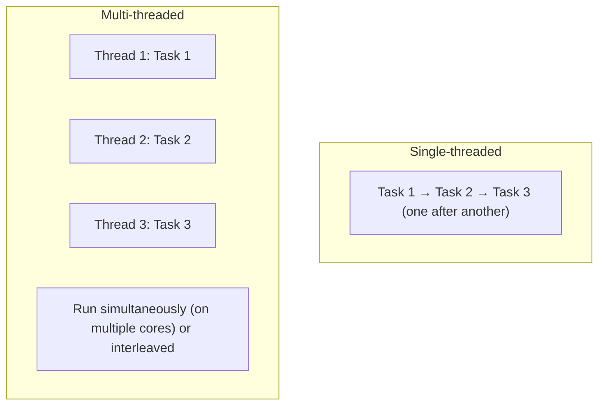

### Concurrency vs Parallelism

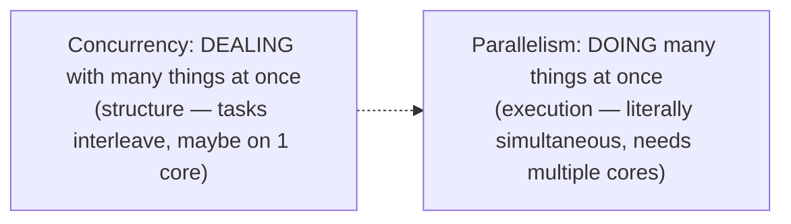

> [!TIP]
> **Concurrency ≠ parallelism** (Rob Pike's famous distinction). **Concurrency** is a *structuring* concept — composing independently-executing tasks that may interleave (a single-core machine can be concurrent by time-slicing). **Parallelism** is *simultaneous execution* — literally running at the same instant on multiple cores. A concurrent program *enables* parallelism when hardware allows. You write concurrent code (threads, tasks); the OS/JVM may run it in parallel. This distinction matters: much concurrency is about managing *waiting* (I/O), not maxing out CPUs.

### Why does this exist? The problems threads solve — and create

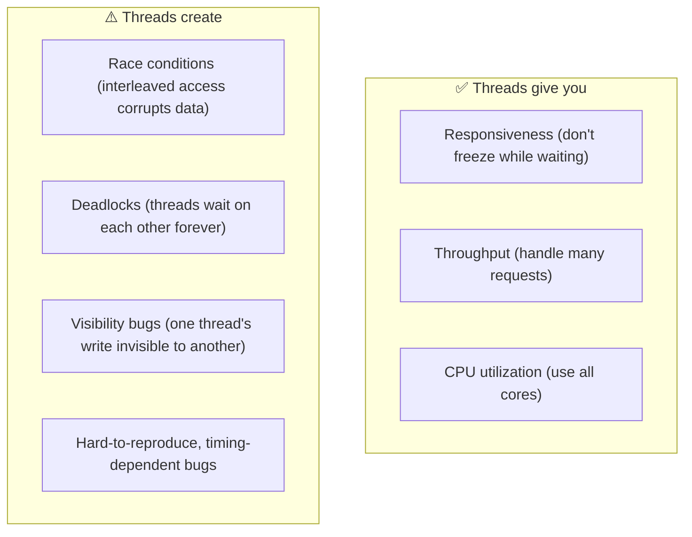

### The Fundamental Problem: Shared Mutable State

```java
// This looks atomic but ISN'T — count++ is read, increment, write (3 steps)
class Counter {
    private int count = 0;
    public void increment() { count++; }  // ❌ race condition under threads
}
// Two threads calling increment() 1000x each may NOT yield 2000.
```

> [!IMPORTANT]
> **The root of all concurrency bugs is shared mutable state accessed without coordination.** `count++` looks like one operation but is actually **three** (read count, add 1, write count). If two threads interleave those steps, updates get lost — a **race condition**. The three ways to be safe: **(1) don't share** (thread confinement / immutability), **(2) don't mutate** (immutable objects), or **(3) coordinate access** (synchronization/locks). Almost all of Java concurrency is tooling for one of these three strategies. The golden rule: *shared, mutable, and unsynchronized — pick at most two.*

### Core vocabulary

| Term | Plain meaning |
|---|---|
| **Thread** | An independent execution path |
| **Race condition** | Bug from unsynchronized interleaved access |
| **Critical section** | Code that must run atomically |
| **Lock / Mutex** | Ensures one thread at a time in a section |
| **Deadlock** | Threads waiting on each other forever |
| **Atomic** | An operation that completes indivisibly |
| **Visibility** | Whether one thread sees another's writes |
| **`volatile`** | Guarantees visibility (not atomicity) |
| **JMM** | Java Memory Model — rules for thread interaction |
| **JVM** | The runtime executing Java bytecode |

### Real-world analogy 🚻

Concurrency is like a **shared bathroom with one key** (a lock):
- Multiple people (threads) want to use it (the critical section / shared resource).
- The **key** (lock/mutex) ensures only one person is inside at a time.
- If two people grab the door at once without a key (no synchronization), chaos (race condition).
- **Deadlock**: Alice holds the bathroom key and waits for the kitchen key; Bob holds the kitchen key and waits for the bathroom key — both wait forever.
- **`volatile`** is like a whiteboard everyone can see immediately — changes are instantly visible, but it doesn't stop two people from writing at once.

> [!TIP]
> The mental model: **threads share memory, and without coordination, that sharing corrupts data or hides updates.** Java gives you a toolkit — `synchronized`, locks, atomics, concurrent collections, executors — to coordinate safely. Master *when* to reach for each. And the modern advice: prefer high-level tools (`java.util.concurrent`, immutability) over hand-rolled locking, which is famously error-prone.

---

## 2. 🧩 CORE CONCEPTS (Intermediate Level)

### 2.1 Creating & Managing Threads

```java
// 1. Extending Thread (rarely used)
class MyThread extends Thread {
    public void run() { System.out.println("running"); }
}

// 2. Implementing Runnable (preferred — composition over inheritance)
Runnable task = () -> System.out.println("running");
Thread t = new Thread(task);
t.start();       // start() creates a new thread; run() would NOT (same thread!)

// 3. Callable + Future (returns a result / throws)
Callable<Integer> c = () -> 42;
```

> [!WARNING]
> **`start()` vs `run()` is a classic trap.** `t.start()` creates a *new* thread and invokes `run()` on it. Calling `t.run()` directly just executes `run()` **on the current thread** — no new thread, no concurrency. Also: **prefer `Runnable`/`Callable` over extending `Thread`** (composition over inheritance — [[02 Design Patterns]]), and in real code, **almost never create raw threads** — use an **ExecutorService** (§2.5). Raw thread creation is expensive and unbounded (a request-per-thread server can exhaust memory).

### 2.2 The Thread Lifecycle

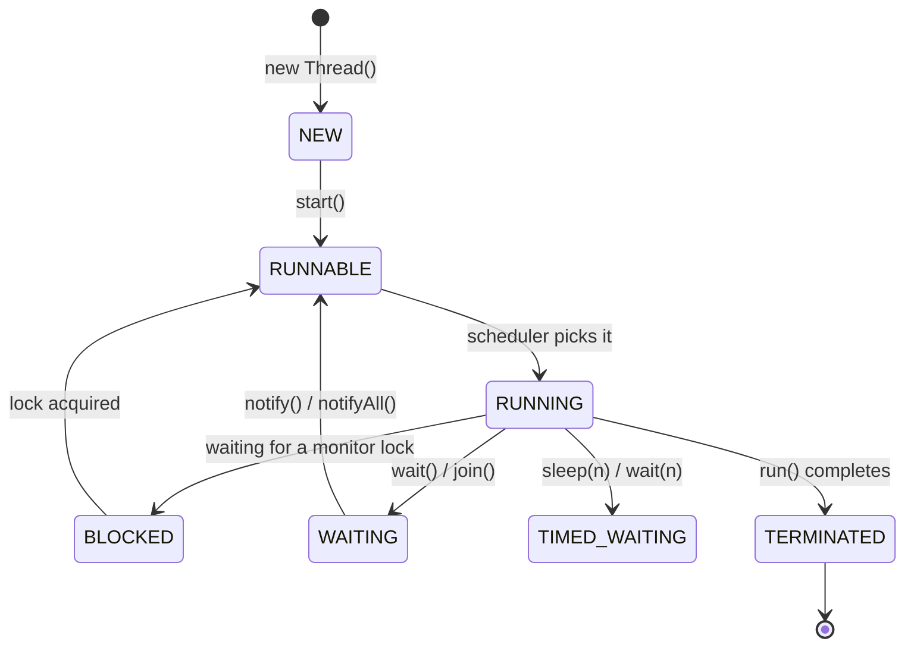

| State | Meaning |
|---|---|
| **NEW** | Created, not started |
| **RUNNABLE** | Eligible to run (running or ready) |
| **BLOCKED** | Waiting to acquire a monitor lock |
| **WAITING** | Waiting indefinitely (`wait()`, `join()`) |
| **TIMED_WAITING** | Waiting with timeout (`sleep`, `wait(ms)`) |
| **TERMINATED** | Finished |

### 2.3 synchronized & Intrinsic Locks

```java
class Counter {
    private int count = 0;

    // Synchronized method: locks on 'this'
    public synchronized void increment() { count++; }

    // Synchronized block: finer-grained, explicit lock object
    private final Object lock = new Object();
    public void incrementBlock() {
        synchronized (lock) { count++; }
    }
}
```

> [!IMPORTANT]
> **`synchronized` provides both mutual exclusion AND visibility.** Every Java object has an **intrinsic lock (monitor)**; `synchronized` acquires it — only one thread holds it at a time (mutual exclusion), and entering/exiting establishes a **happens-before** relationship so changes are visible to the next thread (visibility). This dual guarantee is why `synchronized` fixes both race conditions *and* stale-read bugs. Prefer **synchronized blocks** over methods (lock only the critical section, not the whole method — better performance), and always lock on a **`private final`** object to avoid external interference. Locking on `this` or a `String`/`Integer` (interned/cached) is a subtle bug source.

### 2.4 volatile & Visibility

```java
class Flag {
    private volatile boolean running = true;   // visible across threads

    public void stop() { running = false; }
    public void loop() {
        while (running) { /* work */ }   // without volatile, may loop FOREVER
    }
}
```

> [!WARNING]
> **`volatile` guarantees visibility but NOT atomicity.** Without `volatile`, a thread may cache `running` in a register and never see another thread's `false` — an **infinite loop** (a real, baffling production bug). `volatile` forces reads/writes to go to main memory, so changes are immediately visible. **But** `volatile count++` is *still* a race condition — it's read-modify-write (3 steps), and volatile only makes each step visible, not the whole operation atomic. **Rule: use `volatile` for a simple flag/status shared across threads; use `synchronized`/`AtomicInteger` when you need atomic compound operations.** Confusing these is the #1 concurrency misconception.

### 2.5 Executors & Thread Pools (the right way)

```java
// Don't create raw threads — use a managed pool
ExecutorService pool = Executors.newFixedThreadPool(10);

Future<Integer> future = pool.submit(() -> compute());   // Callable → Future
Integer result = future.get();   // blocks until done (with timeout ideally)

pool.shutdown();   // graceful; or shutdownNow() to interrupt

// Better: build explicitly (Executors factories hide dangerous defaults)
ThreadPoolExecutor executor = new ThreadPoolExecutor(
    corePoolSize, maxPoolSize, keepAlive, TimeUnit.SECONDS,
    new ArrayBlockingQueue<>(capacity),      // BOUNDED queue
    new ThreadPoolExecutor.CallerRunsPolicy() // rejection policy
);
```

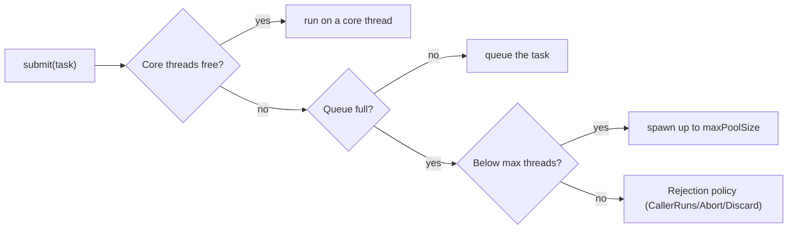

> [!IMPORTANT]
> **Thread pools are the foundation of production concurrency** — they reuse a bounded set of threads instead of creating one per task (which exhausts memory). But the **`Executors.newFixedThreadPool()`/`newCachedThreadPool()` factories hide dangerous defaults**: fixed pools use an *unbounded queue* (tasks pile up → OOM under load), and cached pools can spawn *unlimited threads*. For production, **build a `ThreadPoolExecutor` explicitly** with a **bounded queue** and a **rejection policy** — this gives backpressure ([[01 System Design Fundamentals]]) instead of silent memory exhaustion. Sizing: CPU-bound ≈ #cores; I/O-bound ≈ higher (threads mostly wait). This is a top senior interview topic.

### 2.6 java.util.concurrent Toolkit

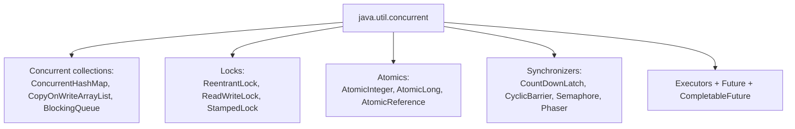

| Tool | Use for |
|---|---|
| **ConcurrentHashMap** | Thread-safe map (lock-striped, high concurrency) |
| **BlockingQueue** | Producer-consumer handoff |
| **ReentrantLock** | Explicit lock (tryLock, timeout, fairness, condition) |
| **ReadWriteLock** | Many readers OR one writer |
| **AtomicInteger** | Lock-free atomic counter (CAS) |
| **CountDownLatch** | Wait for N tasks to complete |
| **Semaphore** | Limit concurrent access to N permits |
| **CompletableFuture** | Async composition, chaining, combining |

> [!TIP]
> **Prefer `java.util.concurrent` over hand-rolled synchronization.** `ConcurrentHashMap` beats `synchronized HashMap` (finer locking). `AtomicInteger` beats `synchronized` counters (lock-free CAS). `ReentrantLock` offers what `synchronized` can't — `tryLock()` with timeout, interruptibility, fairness, and multiple condition variables. Josh Bloch's advice ("prefer concurrency utilities to `wait`/`notify`"): the high-level tools are tested, correct, and expressive — hand-rolled `wait/notify` is a bug magnet. Reach for the toolkit first.

---

## 3. ⚙️ ADVANCED CONCEPTS (Senior Level)

### 3.1 The Java Memory Model (JMM) & Happens-Before

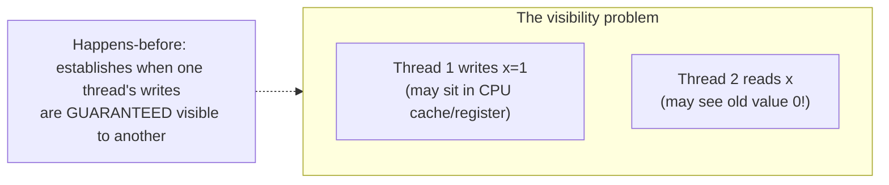

> [!IMPORTANT]
> The **Java Memory Model** is the most important — and most misunderstood — concurrency concept. Modern CPUs and compilers **reorder instructions and cache values** for speed, so without rules, one thread's write might *never* become visible to another, or operations might appear out of order. The JMM defines the **happens-before** relationship: a set of guarantees about when memory effects of one action are visible to another. Key happens-before edges: a `synchronized` unlock happens-before the next lock; a `volatile` write happens-before a subsequent read; `Thread.start()` happens-before the thread's actions; `thread.join()` happens-after its actions. **If there's no happens-before relationship between two threads' accesses to shared data, you have a data race and undefined behavior.** Understanding happens-before (not memorizing `synchronized`) is what makes you *actually* understand Java concurrency.

### 3.2 Atomic Operations & CAS (lock-free)

```java
AtomicInteger counter = new AtomicInteger(0);
counter.incrementAndGet();   // atomic, lock-free
counter.compareAndSet(5, 6); // set to 6 ONLY if currently 5
```

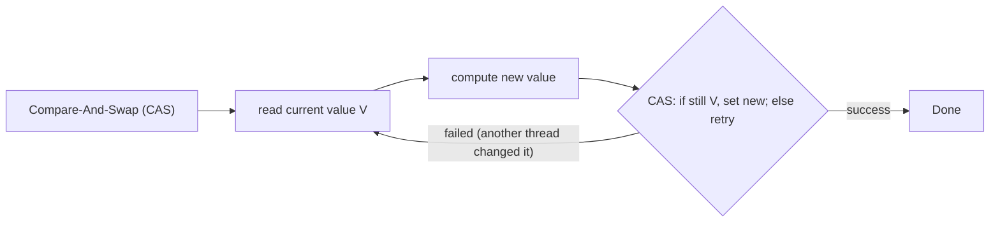

> [!IMPORTANT]
> **Atomics use CAS (Compare-And-Swap)** — a single CPU instruction that atomically checks "is this value still X? if so, set it to Y." This enables **lock-free** algorithms: instead of blocking on a lock, a thread reads a value, computes a new one, and atomically swaps *only if unchanged* (retrying in a loop if another thread got there first — "optimistic concurrency"). Lock-free code avoids lock overhead and can't deadlock, but suffers under high contention (many retries) and the **ABA problem** (value goes A→B→A, CAS thinks nothing changed — solved with `AtomicStampedReference`). CAS is the foundation of `AtomicInteger`, `ConcurrentHashMap`, and much of `java.util.concurrent`. This connects to the optimistic locking in [[09 Java Hibernate]] and versioning in [[06 Distributed Systems]].

### 3.3 Deadlock, Livelock & Starvation

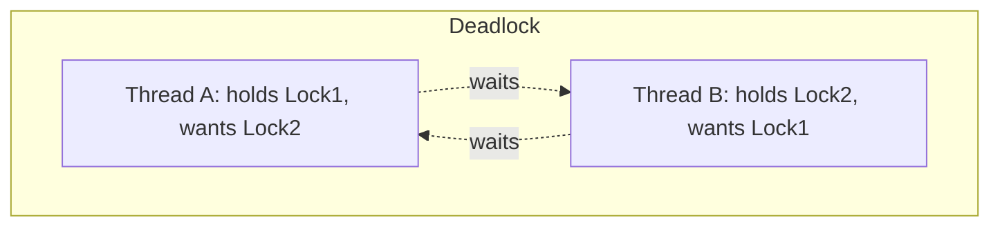

**The 4 Coffman conditions for deadlock (all must hold):**
1. **Mutual exclusion** — resources aren't shareable.
2. **Hold and wait** — hold one, wait for another.
3. **No preemption** — can't force-release a lock.
4. **Circular wait** — a cycle of waiting threads.

| Problem | Description | Fix |
|---|---|---|
| **Deadlock** | Threads wait on each other's locks forever | **Lock ordering** (always acquire in the same order); `tryLock` with timeout |
| **Livelock** | Threads keep responding to each other, no progress | Randomized backoff |
| **Starvation** | A thread never gets the resource | Fair locks, priorities |

> [!WARNING]
> **Deadlock's most practical fix is consistent lock ordering** — if every thread always acquires Lock1 *before* Lock2 (a global order), a circular wait is impossible (breaks Coffman condition #4). When you can't guarantee ordering, use **`ReentrantLock.tryLock(timeout)`** — attempt to acquire, and if it fails within the timeout, release everything and retry (breaks "no preemption"/"hold and wait"). To *diagnose* a deadlock in production, take a **thread dump** (`jstack <pid>`) — the JVM detects and reports deadlocks explicitly ("Found one Java-level deadlock"). Recognizing deadlock in a thread dump is a senior debugging skill.

### 3.4 CompletableFuture & Async Composition

```java
CompletableFuture
    .supplyAsync(() -> fetchUser(id))              // async
    .thenApply(user -> enrich(user))               // transform
    .thenCompose(user -> fetchOrdersAsync(user))   // chain another async
    .thenCombine(fetchRecs(), (a, b) -> merge(a,b)) // combine two
    .exceptionally(ex -> fallback())               // handle errors
    .thenAccept(result -> render(result));         // consume
```

> [!TIP]
> **`CompletableFuture`** brings composable, non-blocking async to Java — chaining (`thenApply`), sequencing dependent async calls (`thenCompose`), combining independent ones (`thenCombine`), and error handling (`exceptionally`/`handle`), without blocking threads on `future.get()`. It's how you fan out to multiple services in parallel and combine results (like an [[06 API Gateway]] aggregation). Two gotchas: (1) always **provide your own executor** to `*Async` methods — the default `ForkJoinPool.commonPool()` is shared and small (can starve); (2) it's still callback-based and can get unwieldy — which is partly why **[[12 Spring WebFlux]]/Reactor** and now **virtual threads** exist.

### 3.5 Virtual Threads (Project Loom, Java 21)

```java
// A virtual thread — cheap, millions possible
Thread.startVirtualThread(() -> {
    var response = httpClient.send(request);   // blocking call, but cheap!
});

// Structured, one virtual thread per task
try (var executor = Executors.newVirtualThreadPerTaskExecutor()) {
    executor.submit(() -> handleRequest());   // 1M concurrent = fine
}
```

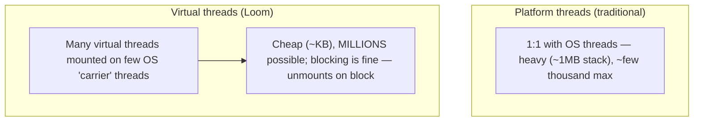

> [!IMPORTANT]
> **Virtual threads (Java 21) are the biggest concurrency change in Java's history.** Traditional **platform threads** map 1:1 to OS threads — heavyweight (~1MB stacks), so you can only have a few thousand, forcing complex async/reactive code ([[12 Spring WebFlux]]) to scale I/O-bound workloads. **Virtual threads** are lightweight (managed by the JVM, ~KB), so you can have **millions**. The magic: when a virtual thread **blocks** on I/O, the JVM **unmounts** it from its OS "carrier" thread, freeing that carrier to run another virtual thread — so blocking code scales like async code *without the callback complexity*. This means you can write **simple, blocking, thread-per-request code** ([[05 Spring Boot]] style) and get reactive-level scalability. It largely obviates the need for reactive programming for I/O-bound work — a paradigm shift. (Caveat: watch for "pinning" when a virtual thread blocks inside `synchronized`.)

### 3.6 Failure Scenarios & Concurrency Bugs

| Bug | Cause | Fix |
|---|---|---|
| **Race condition** | Unsynchronized shared mutable state | synchronize / atomic / immutable |
| **Visibility bug** | Missing volatile/synchronization | happens-before via volatile/lock |
| **Deadlock** | Circular lock acquisition | Lock ordering, tryLock |
| **Thread pool exhaustion** | Unbounded queue/threads | Bounded queue + rejection policy |
| **Memory leak (ThreadLocal)** | ThreadLocal not removed in pooled threads | `remove()` in finally |
| **`ConcurrentModificationException`** | Modifying a collection while iterating | Concurrent collections / copy |
| **Lost update** | `volatile count++` (not atomic) | AtomicInteger / synchronized |
| **Live/starvation** | Unfair scheduling / contention | Fair locks, backoff |

> [!WARNING]
> **ThreadLocal leaks are a subtle, production-only bug.** `ThreadLocal` stores per-thread data — but in a **thread pool**, threads are *reused*, so a `ThreadLocal` value set during one request lingers into the next request handled by the same thread (data leakage across requests + a memory leak). Always **`threadLocal.remove()` in a `finally` block** when using ThreadLocal in pooled threads (common in [[05 Spring Boot]] request handling, security contexts). This is exactly the kind of bug that passes all tests and only surfaces under production load — the hallmark of concurrency issues.

---

## 4. 🏗️ REAL-WORLD SYSTEM DESIGN USAGE

### 4.1 Concurrency in a Spring Boot App

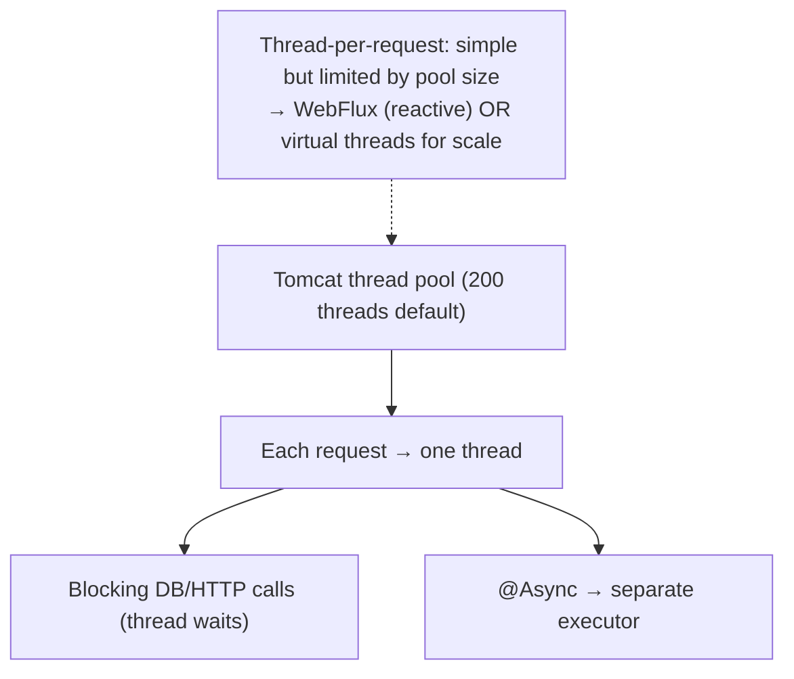

> [!IMPORTANT]
> Your [[05 Spring Boot]] app is deeply concurrent even if you never write `Thread`: Tomcat runs a **thread pool** (default ~200), assigning each incoming request to a thread that runs your controller/service ([[07 Servlets and Filters]]). This **thread-per-request** model is simple but caps concurrency at the pool size — under heavy load with slow I/O, all threads block waiting and new requests queue. The historical answer was **[[12 Spring WebFlux]]** (reactive, non-blocking — complex). The modern answer (Spring Boot 3.2+, Java 21) is **virtual threads**: flip a config flag and each request gets a cheap virtual thread, scaling to huge concurrency while keeping simple blocking code. This is why understanding threads/pools/virtual threads directly impacts your app's throughput.

### 4.2 Producer-Consumer Pattern

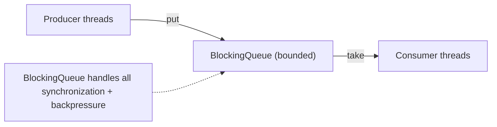

The classic concurrency pattern — producers add work, consumers process it, a `BlockingQueue` safely hands off between them with built-in blocking (consumers wait when empty, producers wait when full → backpressure). It's the in-process cousin of [[01 Kafka]]/[[02 RabbitMQ]] messaging.

### 4.3 How the JVM Runs Your Code

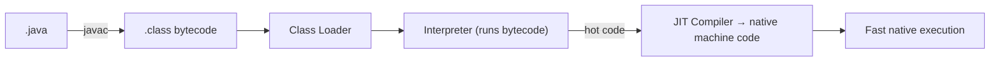

> [!IMPORTANT]
> The JVM's **"write once, run anywhere"** works because `javac` compiles to **bytecode** (platform-neutral), and the JVM on each platform executes it. Crucially, the JVM starts by **interpreting** bytecode, but profiles execution and **JIT-compiles hot methods to native machine code** (via C1/C2 compilers) — so long-running Java approaches C++ speed. This is why JVM apps have a "warm-up" period (slow at first, fast once JIT kicks in) — relevant for benchmarking and serverless cold starts. Understanding bytecode → interpret → JIT explains Java's performance characteristics.

### 4.4 JVM Memory Areas

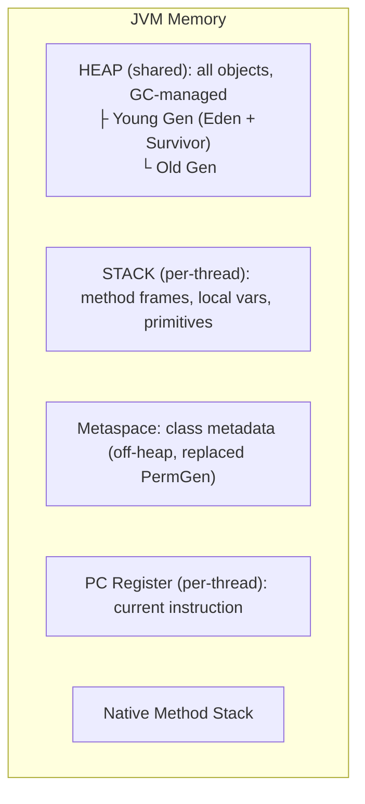

| Area | Contains | Scope |
|---|---|---|
| **Heap** | All objects & arrays | Shared (GC'd) |
| **Stack** | Method frames, locals, primitives | Per-thread |
| **Metaspace** | Class metadata | Shared (off-heap) |
| **PC Register** | Current bytecode instruction | Per-thread |

> [!TIP]
> Know this cold for interviews: **objects live on the shared heap; local variables and method call frames live on per-thread stacks**. This is why local variables are inherently thread-safe (each thread has its own stack) and why object fields need synchronization (shared heap). **`StackOverflowError`** = too-deep recursion (stack exhausted); **`OutOfMemoryError: Java heap space`** = too many/large objects (heap full). **Metaspace** (Java 8+) replaced the old fixed-size **PermGen**, storing class metadata off-heap (grows dynamically — but a classloader leak can still OOM it). The Young/Old generation split in the heap is fundamental to how GC works (§4.5).

### 4.5 Garbage Collection

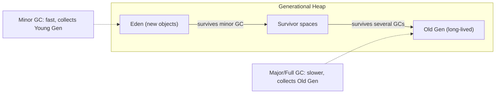

> [!IMPORTANT]
> **Garbage collection** automatically reclaims memory from unreachable objects — no manual `free()`. It exploits the **generational hypothesis**: *most objects die young*. So the heap splits into **Young Gen** (Eden + Survivor — where new objects are created and most are quickly collected by fast **minor GCs**) and **Old Gen** (objects that survive many collections — cleaned by slower **major/full GCs**). Modern collectors: **G1** (default since Java 9 — balances throughput and pause times via regions), **ZGC**/**Shenandoah** (ultra-low pause, <1ms, for large heaps). The key production concern is **GC pauses** ("stop-the-world" — the app freezes during collection); tuning heap size and picking the right collector minimizes them. GC knowledge is essential for diagnosing latency spikes and memory issues in [[05 Spring Boot]] apps.

---

## 5. 🎤 INTERVIEW PREPARATION

### 5.1 Most important questions

<details>
<summary><b>Q1: What's the difference between a race condition and a visibility problem?</b></summary>

A **race condition** is when the *outcome depends on thread interleaving* — e.g., `count++` (read-modify-write) by two threads loses updates. A **visibility problem** is when *one thread's write isn't seen by another* — e.g., a non-volatile flag cached in a register, causing an infinite loop. `synchronized` fixes both (mutual exclusion + happens-before visibility); `volatile` fixes *only* visibility, not atomicity.
</details>

<details>
<summary><b>Q2: volatile vs synchronized vs Atomic?</b></summary>

**`volatile`**: guarantees visibility only (no atomicity) — for simple flags. **`synchronized`**: mutual exclusion + visibility — for critical sections / compound operations, but blocks. **Atomic (CAS)**: lock-free atomic operations on a single variable — for counters/references, faster than synchronized under low-moderate contention. Use volatile for flags, Atomic for counters, synchronized for multi-variable critical sections.
</details>

<details>
<summary><b>Q3: Explain the Java Memory Model / happens-before.</b></summary>

The JMM defines when one thread's memory writes are visible to another, because CPUs/compilers reorder and cache. **Happens-before** is the ordering guarantee: if action A happens-before B, A's effects are visible to B. Key edges: unlock→lock, volatile write→read, `Thread.start()`→thread actions, thread actions→`join()`. Without a happens-before relationship on shared data, you have a data race (undefined behavior).
</details>

<details>
<summary><b>Q4: How do you prevent deadlock?</b></summary>

Deadlock needs all 4 Coffman conditions (mutual exclusion, hold-and-wait, no preemption, circular wait). Break any one: **lock ordering** (always acquire locks in a consistent global order — kills circular wait), **`tryLock(timeout)`** (kills hold-and-wait/no-preemption), avoid nested locks, or use higher-level concurrency utilities. Diagnose via **thread dump** (`jstack`) — the JVM reports deadlocks.
</details>

<details>
<summary><b>Q5: How does a thread pool work and how do you size it?</b></summary>

A `ThreadPoolExecutor` reuses core threads; extra tasks go to a queue, then (if the queue is full) up to maxPoolSize threads spawn, then a rejection policy applies. **Size**: CPU-bound tasks ≈ number of cores; I/O-bound ≈ higher (threads mostly wait — Little's Law helps). Critically, use a **bounded queue** + rejection policy for backpressure — the `Executors` factory defaults (unbounded queue / unlimited threads) risk OOM.
</details>

<details>
<summary><b>Q6: What is CAS and lock-free programming?</b></summary>

**Compare-And-Swap** is an atomic CPU instruction: "if the value is still X, set it to Y." Atomics use it for **lock-free** updates — read, compute, CAS (retry if another thread changed it). Benefits: no locks, no deadlock, less overhead under low contention. Drawbacks: retries waste CPU under high contention, and the **ABA problem** (value cycles A→B→A undetected — use `AtomicStampedReference`).
</details>

<details>
<summary><b>Q7: Explain JVM memory areas and garbage collection.</b></summary>

**Heap** (shared, GC'd) holds objects, split into Young Gen (Eden+Survivor, minor GC) and Old Gen (major GC), exploiting "most objects die young." **Stack** (per-thread) holds method frames/locals. **Metaspace** holds class metadata. **GC** reclaims unreachable objects; collectors like G1 (default), ZGC/Shenandoah (low-pause) manage the trade-off between throughput and stop-the-world pause times.
</details>

<details>
<summary><b>Q8: What are virtual threads (Loom)?</b></summary>

Lightweight threads (Java 21) managed by the JVM, not the OS — millions can exist (vs thousands of platform threads). When a virtual thread blocks on I/O, the JVM unmounts it from its OS carrier thread, so blocking scales like async. This lets you write **simple blocking thread-per-request code** with reactive-level scalability, largely removing the need for reactive frameworks for I/O-bound work. Watch for pinning inside `synchronized`.
</details>

### 5.2 Tricky questions

> [!TIP]
> **"Why might `while(flag){}` loop forever even after another thread sets flag=false?"** — Visibility: without `volatile`, the JVM may cache `flag` in a register/optimize the loop, never re-reading main memory. Make it `volatile` (or synchronize access). A classic JMM demonstration.

> [!TIP]
> **"Is `count++` on a `volatile int` thread-safe?"** — No. `volatile` gives visibility, not atomicity. `count++` is read-modify-write (3 operations); two threads can still lose updates. Use `AtomicInteger.incrementAndGet()` or `synchronized`.

> [!TIP]
> **"start() vs run()?"** — `start()` spawns a new thread and calls `run()` on it. `run()` called directly executes on the *current* thread — no concurrency. A very common beginner-trap that seniors should answer instantly.

> [!TIP]
> **"Can two threads execute two different synchronized methods of the same object simultaneously?"** — No — instance `synchronized` methods all lock on the *same* `this` monitor, so they're mutually exclusive. (But a `synchronized` instance method and a `synchronized static` method *can* run concurrently — they lock different monitors: `this` vs the `Class` object.)

### 5.3 Common mistakes candidates make

| Mistake | Reality |
|---|---|
| `volatile` makes `count++` atomic | Only visibility, not atomicity |
| Calling `run()` to start a thread | Use `start()` |
| `Executors.newFixedThreadPool` in prod | Unbounded queue → OOM; build explicitly |
| Ignoring visibility (JMM) | Needs happens-before |
| Locking on `this`/String/Integer | Use private final lock objects |
| Not removing ThreadLocals in pools | Leak + cross-request data |
| Synchronizing everything | Kills concurrency; lock minimally |
| Ignoring GC pauses / heap sizing | Latency spikes, OOM |

### 5.4 What interviewers actually expect

- **Race vs visibility** and the `volatile`/`synchronized`/`Atomic` distinctions.
- **JMM / happens-before** — real understanding, not memorization.
- **Thread pools** (sizing, bounded queues, rejection) and why raw threads are wrong.
- **Deadlock** prevention + diagnosis (thread dumps).
- **`java.util.concurrent`** fluency (ConcurrentHashMap, CompletableFuture, CountDownLatch).
- **JVM internals**: memory areas, GC generations/collectors, JIT.
- Awareness of **virtual threads** and how they change the landscape.

---

## 6. 🛠️ HANDS-ON PROJECTS

### Project 1: Thread-Safe Counter & the Race Condition (Beginner→Intermediate)

**Goal:** *See* a race condition, then fix it four ways.

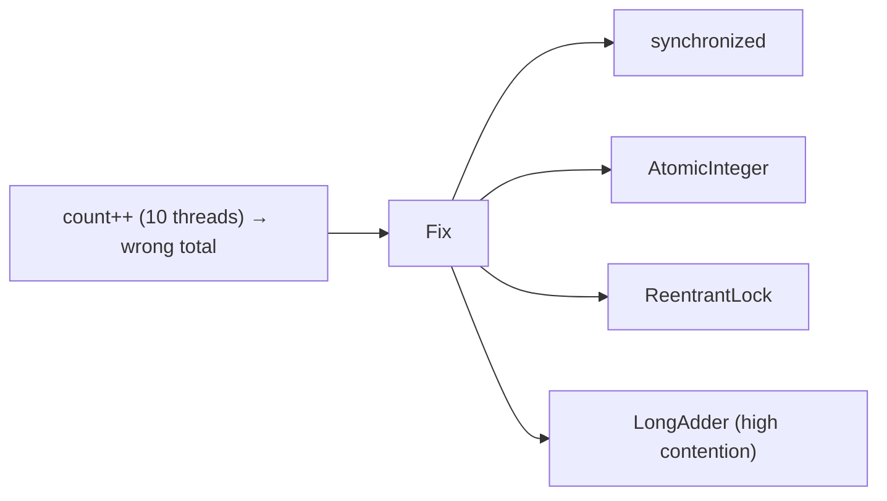

**Steps:**
1. Run 10 threads incrementing an `int` 100k times each — observe the total is **wrong**.
2. Fix with `synchronized`, then `AtomicInteger`, then `ReentrantLock`, then `LongAdder`.
3. **Benchmark** each under contention (JMH) — see AtomicInteger vs synchronized vs LongAdder differences.
4. Demonstrate the `volatile`-doesn't-fix-it point.

**Learn:** race conditions, synchronization options, CAS, contention performance.

---

### Project 2: Producer-Consumer + Executor Pipeline (Intermediate→Senior)

**Goal:** Build a realistic concurrent processing pipeline.


**Steps:**
1. Producers push work to a **bounded `BlockingQueue`**; consumers (a sized `ThreadPoolExecutor`) process it.
2. Add a **rejection policy** + backpressure; observe behavior when the queue fills.
3. Use **CompletableFuture** to fan out to multiple "services" in parallel and combine.
4. Add graceful shutdown (`shutdown` + `awaitTermination`).
5. Trigger and diagnose a **deadlock** (two locks, wrong order) via `jstack`.

**Learn:** producer-consumer, thread pools/backpressure, CompletableFuture, deadlock diagnosis.

---

### Project 3: JVM Tuning & Virtual Threads (Senior)

**Goal:** Compare platform vs virtual threads; tune the JVM.

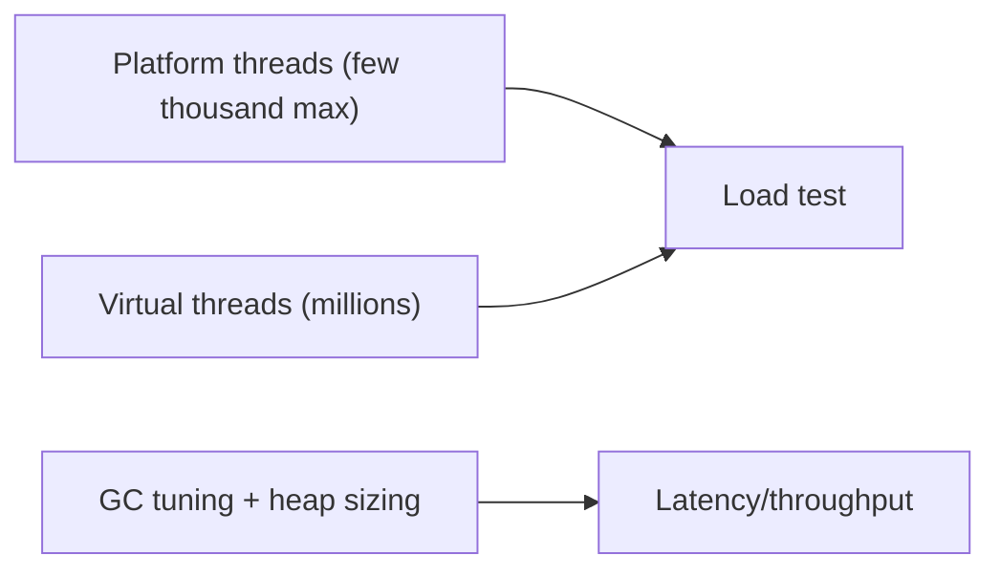

**Steps:**
1. Build a simulated I/O-bound service; load-test with a **fixed platform-thread pool** vs **`newVirtualThreadPerTaskExecutor()`** — compare throughput at high concurrency.
2. Observe **virtual thread** scalability with simple blocking code.
3. Enable GC logging (`-Xlog:gc`); compare **G1 vs ZGC** pause times under load.
4. Tune heap (`-Xmx/-Xms`); trigger and analyze an `OutOfMemoryError` heap dump.
5. Take thread dumps under load; identify blocked/waiting threads.

**Learn:** virtual threads, GC tuning, heap sizing, profiling ([[02 Observability]] for the JVM).

---

## 7. 🔬 DEEP DIVE: INTERNALS

### 7.1 How synchronized Works — Monitors & Lock Escalation

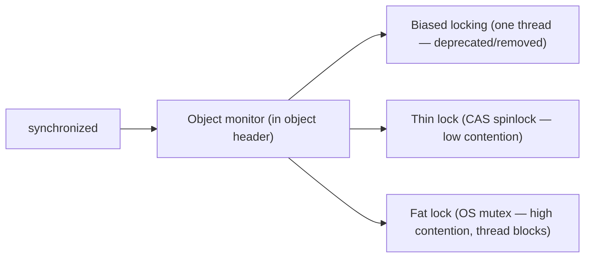

> [!IMPORTANT]
> `synchronized` uses each object's **monitor**, tracked in the **object header** (mark word). The JVM optimizes with **lock escalation**: it starts cheap (a **thin lock** via CAS spinning, for uncontended/low-contention cases) and only "inflates" to a **fat lock** (a real OS mutex, where threads actually block/context-switch) under real contention. This is why *uncontended* `synchronized` is nearly free in modern JVMs — a huge improvement over old advice to always avoid it. (Historical **biased locking** — optimizing for one thread — was deprecated and removed as it stopped paying off.) Bytecode-wise, `synchronized` blocks compile to `monitorenter`/`monitorexit` instructions.

### 7.2 The JIT Compiler & Optimization

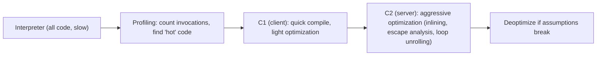

> [!TIP]
> The JVM's **tiered JIT compilation** is why Java is fast despite starting as bytecode: hot methods get compiled to native code, first quickly (**C1**), then aggressively (**C2**) with optimizations like **inlining** (eliminating call overhead), **escape analysis** (stack-allocating objects that don't "escape" a method — avoiding GC), **loop unrolling**, and **dead code elimination**. The JIT makes *speculative* optimizations based on runtime profiling and can **deoptimize** if assumptions break (e.g., a rarely-taken branch suddenly executes). This runtime, profile-guided optimization can make long-running Java outperform statically-compiled languages in some cases — but it's why **micro-benchmarking Java is treacherous** (use JMH to account for warm-up/JIT).

### 7.3 Garbage Collection Algorithms In Depth

```mermaid
flowchart TB
    GC["GC core steps"] --> Mark["Mark: trace reachable objects from GC roots"]
    Mark --> Sweep["Sweep: reclaim unreachable"]
    Sweep --> Compact["Compact: defragment (some collectors)"]
    Roots["GC roots: stack refs, static fields, JNI refs"] -.-> Mark
```

| Collector | Characteristic |
|---|---|
| **Serial** | Single-threaded, small heaps |
| **Parallel** | Throughput-focused, multi-threaded |
| **G1** (default) | Region-based, balances pauses & throughput |
| **ZGC / Shenandoah** | Concurrent, ultra-low pause (<1ms), huge heaps |

> [!IMPORTANT]
> GC fundamentally works by **reachability**: starting from **GC roots** (thread stack references, static fields, JNI refs), it **marks** everything reachable; unmarked objects are garbage and **swept**. Some collectors then **compact** (move survivors together to defragment). The eternal trade-off is **throughput vs pause time vs footprint** — you can optimize any two. **G1** (default) divides the heap into regions and collects incrementally to hit a pause-time target. **ZGC/Shenandoah** do most work *concurrently* with the app for sub-millisecond pauses (crucial for low-latency services), trading some throughput/CPU. **A memory "leak" in Java** isn't unfreed memory — it's **unintentional reachability** (objects still referenced but never used, e.g., an ever-growing static cache, or unremoved listeners/ThreadLocals) — the GC can't collect what's still reachable.

### 7.4 Object Layout & Memory Semantics

```mermaid
flowchart LR
    Object["Java object in heap"] --> Header["Header (mark word + class pointer)"]
    Object --> Fields["Instance fields"]
    Object --> Padding["Padding (8-byte alignment)"]
    Note["Header holds lock state, GC age, identity hash — used by synchronized & GC"] -.-> Header
```

> [!TIP]
> Every Java object has a **header** (~12-16 bytes) containing the **mark word** (lock state, GC generation age, identity hashcode) and a **class pointer** (which type it is), plus its fields and padding for 8-byte alignment. This is why even an empty object costs ~16 bytes — relevant when you have millions of small objects (memory pressure, cache misses). The mark word is exactly what `synchronized` (§7.1) and GC (§7.3) manipulate. **Escape analysis** (§7.2) can eliminate the object entirely (stack allocation or scalar replacement) if the JIT proves it never escapes — a beautiful optimization that turns heap allocation into free stack usage.

### 7.5 False Sharing & Memory Barriers

```mermaid
flowchart TB
    subgraph Cache["CPU cache line (64 bytes)"]
        A["var A (thread 1 writes)"]
        B["var B (thread 2 writes)"]
        Note["Different vars, SAME cache line → each write invalidates the other's cache → 'false sharing' → slow"]
    end
```

> [!IMPORTANT]
> At the hardware level, `volatile` and synchronization insert **memory barriers (fences)** — CPU instructions that prevent reordering and force cache coherence, which is *how* the JMM's happens-before guarantees are physically implemented. A subtle performance killer is **false sharing**: two independent variables that happen to sit on the **same 64-byte CPU cache line** — when thread 1 writes one and thread 2 writes the other, each write **invalidates the other core's cache line**, causing constant cache-coherence traffic even though the variables are unrelated. The fix is **padding** (spacing hot variables onto separate cache lines — Java's `@Contended` annotation does this). This is the deepest layer: Java concurrency ultimately rests on CPU cache coherence and memory ordering — the same physics that [[06 Distributed Systems]] grapples with at network scale, but between cores.

---

## ✅ Production Checklists

### Concurrency Correctness
- [ ] Shared mutable state identified and protected (synchronize/atomic/immutable)
- [ ] `volatile` used only for visibility (not compound atomicity)
- [ ] Locks on **private final** objects; minimal critical sections
- [ ] **Lock ordering** consistent (deadlock prevention)
- [ ] Prefer `java.util.concurrent` over hand-rolled `wait/notify`
- [ ] Immutable objects where possible (thread-safe by design)

### Thread Pools & Executors
- [ ] Explicit `ThreadPoolExecutor` with **bounded queue** + rejection policy
- [ ] Pool sized to workload (CPU-bound vs I/O-bound)
- [ ] Graceful `shutdown()` + `awaitTermination()`
- [ ] **ThreadLocals removed** in pooled threads (finally block)
- [ ] Custom executor for `CompletableFuture` async (not commonPool)
- [ ] Consider **virtual threads** for I/O-bound (Java 21+)

### JVM & GC
- [ ] Heap sized (`-Xmx`/`-Xms`) for the workload
- [ ] Appropriate GC (G1 default; ZGC/Shenandoah for low-latency)
- [ ] **GC logging** enabled; pauses monitored ([[02 Observability]])
- [ ] Heap dumps on OOM (`-XX:+HeapDumpOnOutOfMemoryError`)
- [ ] Thread dumps available for deadlock/hang diagnosis
- [ ] Metaspace monitored (classloader leaks)

---

## 🗺️ Learning Roadmap

```mermaid
flowchart TB
    A["1️⃣ Basics<br/>threads, race conditions, concurrency vs parallelism"] --> B["2️⃣ Synchronization<br/>synchronized, volatile, atomics"]
    B --> C["3️⃣ JMM<br/>happens-before, visibility, reordering"]
    C --> D["4️⃣ Executors<br/>thread pools, Future, CompletableFuture"]
    D --> E["5️⃣ j.u.c toolkit<br/>concurrent collections, locks, synchronizers"]
    E --> F["6️⃣ Hazards<br/>deadlock, livelock, diagnosis"]
    F --> G["7️⃣ JVM<br/>memory areas, GC, JIT"]
    G --> H["8️⃣ Advanced<br/>virtual threads, CAS internals, false sharing, GC tuning"]
```

| Stage | Focus | You can... |
|---|---|---|
| 1–3 | Basics + JMM | Write correct multi-threaded code |
| 4–5 | Executors + toolkit | Build production concurrent systems |
| 6–7 | Hazards + JVM | Diagnose deadlocks and memory issues |
| 8 | Advanced | Tune the JVM; understand the machine |

---

## 🔁 Self-Review Completion Loop

Reviewed against *Java Concurrency in Practice* (Goetz), *Effective Java* (Bloch), the JLS/JMM, and JVM specifications.

### Gap Review Matrix

| Dimension | Covered? | Where |
|---|---|---|
| Concurrency vs parallelism | ✅ | §1 |
| Race conditions / shared state | ✅ | §1 |
| Threads (start/run, lifecycle) | ✅ | §2.1–2.2 |
| synchronized & intrinsic locks | ✅ | §2.3 |
| volatile & visibility | ✅ | §2.4 |
| Executors & thread pools | ✅ | §2.5 |
| java.util.concurrent toolkit | ✅ | §2.6 |
| JMM & happens-before | ✅ | §3.1 |
| CAS / atomics / lock-free | ✅ | §3.2, §7 |
| Deadlock/livelock/starvation | ✅ | §3.3 |
| CompletableFuture | ✅ | §3.4 |
| Virtual threads (Loom) | ✅ | §3.5 |
| Concurrency bugs (ThreadLocal etc.) | ✅ | §3.6 |
| Concurrency in Spring Boot | ✅ | §4.1 |
| Producer-consumer | ✅ | §4.2 |
| JVM execution (bytecode/JIT) | ✅ | §4.3, §7.2 |
| JVM memory areas | ✅ | §4.4 |
| Garbage collection | ✅ | §4.5, §7.3 |
| synchronized internals/monitors | ✅ | §7.1 |
| Object layout | ✅ | §7.4 |
| False sharing / memory barriers | ✅ | §7.5 |
| Interview Q&A + mistakes | ✅ | §5 |
| Hands-on projects | ✅ | §6 |

> [!NOTE]
> **Remaining depth to explore independently:** Fork/Join framework & work-stealing, `StampedLock` optimistic reads, structured concurrency (Java 21 `StructuredTaskScope`), `ThreadLocal` alternatives (`ScopedValue`), the full JMM formalism (sequential consistency, data-race-free guarantee), GC tuning flags in depth, JFR (Java Flight Recorder) profiling, GraalVM native image (AOT vs JIT), and reactive streams ([[12 Spring WebFlux]]) vs virtual threads trade-offs.

---

## 📚 Official References

| Resource | Source |
|---|---|
| *Java Concurrency in Practice* — Brian Goetz | **The** concurrency book |
| *Effective Java* — Joshua Bloch | Concurrency items (best practices) |
| Java Language Spec — Memory Model (Ch 17) | https://docs.oracle.com/javase/specs/jls/se21/html/jls-17.html |
| java.util.concurrent Javadoc | https://docs.oracle.com/en/java/javase/21/docs/api/java.base/java/util/concurrent/package-summary.html |
| JEP 444: Virtual Threads | https://openjdk.org/jeps/444 |
| JVM Specification | https://docs.oracle.com/javase/specs/jvms/se21/html/ |
| Aleksey Shipilëv (JMM/JVM articles) | https://shipilev.net/ |
| G1/ZGC tuning guides | https://docs.oracle.com/en/java/javase/21/gctuning/ |

---

## 🎁 Final Summary

> [!IMPORTANT]
> **The one-paragraph takeaway:** Java concurrency is about safely coordinating **threads that share mutable memory** — where the root of all bugs is **shared mutable state** accessed without coordination (races, visibility problems, deadlocks). The three defenses: **don't share** (thread confinement/immutability), **don't mutate** (immutable objects), or **coordinate** (synchronization). Know the toolkit precisely: **`volatile`** = visibility only (not atomicity), **`synchronized`** = mutual exclusion + visibility (via **happens-before** in the **JMM**), **Atomics/CAS** = lock-free single-variable updates, and the **`java.util.concurrent`** utilities (ConcurrentHashMap, ReentrantLock, CompletableFuture, thread pools) that you should prefer over hand-rolled locking. Use **explicit `ThreadPoolExecutor`s with bounded queues** (not the dangerous `Executors` defaults), prevent deadlock with **consistent lock ordering**, and remove **ThreadLocals** in pooled threads. On the **JVM** side: understand **bytecode → interpret → JIT** compilation, the **heap** (Young/Old generations) vs per-thread **stacks** vs **Metaspace**, and **garbage collection** (G1 default, ZGC for low pause) — including that a Java "leak" is *unintended reachability*, not unfreed memory. Finally, **virtual threads (Java 21, Loom)** are a paradigm shift: cheap threads that let you write simple blocking code with reactive-level scalability, reshaping how [[05 Spring Boot]] scales I/O-bound work.

**Golden rules:**
1. 🧵 The root of all concurrency bugs is **shared mutable state** — confine, immutable, or coordinate.
2. 👁️ **`volatile` = visibility, not atomicity** — `count++` still races.
3. 🔒 **`synchronized`** gives mutual exclusion + visibility (happens-before); lock on private final objects, minimally.
4. ⚛️ Use **Atomics (CAS)** for lock-free counters; `java.util.concurrent` over hand-rolled locks.
5. 🏊 **Bounded thread pools** with rejection policies — never the `Executors` unbounded defaults.
6. 🔗 Prevent **deadlock** with consistent **lock ordering**; diagnose with thread dumps.
7. 🧹 **Remove ThreadLocals** in pooled threads (finally).
8. 🗑️ Java memory leaks = **unintended reachability**; know heap generations + GC collectors.
9. 🚀 **Virtual threads (Loom)** let simple blocking code scale — the modern paradigm.

---

*Related guides in this vault: [[01 Basic Java]] · [[05 Spring Boot]] · [[12 Spring WebFlux]] · [[09 Java Hibernate]] · [[01 System Design Fundamentals]] · [[06 Distributed Systems]] · [[02 Observability]] · [[07 Servlets and Filters]]*
