# Spring Boot: Beginner-to-Expert Engineering Guide

> **Scope:** This guide teaches Spring Boot from first principles through production backend/system-engineering usage. It covers the core framework (IoC/DI, auto-configuration), the web/data/security stacks built on top of it, and how Spring Boot services are actually run, scaled, and debugged in production.

## Table of Contents

1. [Executive Summary](#executive-summary)
2. [1. Fundamentals](#1-fundamentals-beginner-level)
3. [2. Core Concepts](#2-core-concepts-intermediate-level)
4. [3. Advanced Concepts](#3-advanced-concepts-senior-level)
5. [4. Real-World System Design Usage](#4-real-world-system-design-usage)
6. [5. Interview Preparation](#5-interview-preparation)
7. [6. Hands-On Thinking](#6-hands-on-thinking)
8. [7. Deep Dive](#7-deep-dive-optional-but-important)
9. [Production Checklists](#production-checklists)
10. [Learning Roadmap](#learning-roadmap)
11. [Self-Review Completion Loop](#self-review-completion-loop)
12. [Official References](#official-references)

---

## Executive Summary

Spring Boot is an opinionated framework built on top of the Spring Framework that eliminates most manual configuration for building production-ready Java applications — web services, batch jobs, messaging consumers — by providing auto-configuration, embedded servers, and convention-over-configuration defaults.

The core idea:

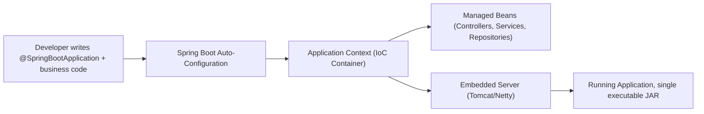

> [!TIP]
> Learn Spring Boot as two layers stacked together: the **Spring Framework core** (IoC container, dependency injection, AOP) underneath, and **Spring Boot's auto-configuration + starters** on top, which decide sensible defaults so you don't hand-wire beans yourself. Senior engineers know how to look *underneath* the auto-configuration when something doesn't behave as expected.

---

# 1. Fundamentals (Beginner Level)

## 1.1 What Is Spring Boot?

Spring Boot lets you build a runnable Java application with minimal boilerplate. You add dependencies ("starters"), annotate classes, and Spring Boot wires everything together at startup.

```java
@SpringBootApplication
public class Application {
    public static void main(String[] args) {
        SpringApplication.run(Application.class, args);
    }
}
```

```java
@RestController
public class HelloController {

    @GetMapping("/hello")
    public String hello() {
        return "Hello, Spring Boot!";
    }
}
```

Run it:

```bash
./mvnw spring-boot:run
# or
java -jar target/app-0.0.1-SNAPSHOT.jar
```

## 1.2 Why Spring Boot Exists

| Problem with Plain Spring Framework | Spring Boot's Answer |
|---|---|
| Verbose XML/Java config to wire beans | Auto-configuration based on classpath contents |
| Manually configuring a servlet container | Embedded Tomcat/Jetty/Netty, runs as a plain JAR |
| Managing compatible dependency versions | Starter POMs with curated, tested version sets |
| No standard way to check app health in production | Actuator endpoints out of the box |
| Environment-specific configuration is awkward | Profiles and externalized configuration |
| Hard to get started quickly | Spring Initializr scaffolds a working project in seconds |

## 1.3 Problems Spring Boot Solves

Spring Boot is especially good when you need:

- A production-ready REST API or web application quickly.
- Consistent, curated dependency management across a large codebase.
- Built-in observability (health checks, metrics) without extra setup.
- A single deployable artifact (executable JAR) for containers/cloud platforms.
- Convention-based structure so new team members ramp up fast.

Spring Boot is less ideal when you need:

- Extremely minimal footprint/startup time (a lightweight framework or native-image-first stack may fit better, though Spring Boot + GraalVM native image narrows this gap).
- Full manual control over every wiring decision (auto-configuration can feel like "magic" until you learn to read it).

## 1.4 Real-World Analogy

Think of Spring Boot like a fully furnished apartment versus building a house from raw materials.

Plain Spring Framework gives you the raw materials (IoC container, AOP, MVC) and lets you build exactly what you want, but you must make every decision (which server, how beans are wired, which defaults to use). Spring Boot is the furnished apartment: walls are up, utilities are connected, furniture is placed sensibly — you can move in and start living (writing business logic) immediately, and you can still swap out any piece of furniture (override any auto-configuration) if the defaults don't fit.

```text
Spring Framework = raw materials (IoC, AOP, MVC, JDBC abstractions)
Spring Boot      = furnished apartment (auto-config, embedded server, starters, actuator)
Your business logic = what you actually do inside the apartment
```

## 1.5 Core Vocabulary

| Term | Meaning |
|---|---|
| IoC Container / ApplicationContext | Object that creates and manages bean lifecycles |
| Bean | An object managed by the Spring container |
| Dependency Injection (DI) | Providing a bean's dependencies from outside rather than creating them internally |
| Starter | A curated dependency bundle (e.g., `spring-boot-starter-web`) |
| Auto-Configuration | Spring Boot's mechanism for configuring beans automatically based on classpath/conditions |
| `@SpringBootApplication` | Combines `@Configuration`, `@EnableAutoConfiguration`, `@ComponentScan` |
| Profile | A named set of configuration/beans active only in certain environments |
| Actuator | Spring Boot module exposing health/metrics/info endpoints |
| Embedded Server | Tomcat/Jetty/Netty bundled inside the application JAR |

## 1.6 Basic Project Structure

```text
src/main/java/com/example/app/
    Application.java
    controller/
        OrderController.java
    service/
        OrderService.java
    repository/
        OrderRepository.java
    domain/
        Order.java
src/main/resources/
    application.properties
    application-dev.properties
    application-prod.properties
src/test/java/com/example/app/
    OrderServiceTest.java
```

## 1.7 Dependency Injection Basics

```java
@Service
public class OrderService {

    private final OrderRepository orderRepository;
    private final PaymentClient paymentClient;

    // Constructor injection: Spring provides these automatically
    public OrderService(OrderRepository orderRepository, PaymentClient paymentClient) {
        this.orderRepository = orderRepository;
        this.paymentClient = paymentClient;
    }
}
```

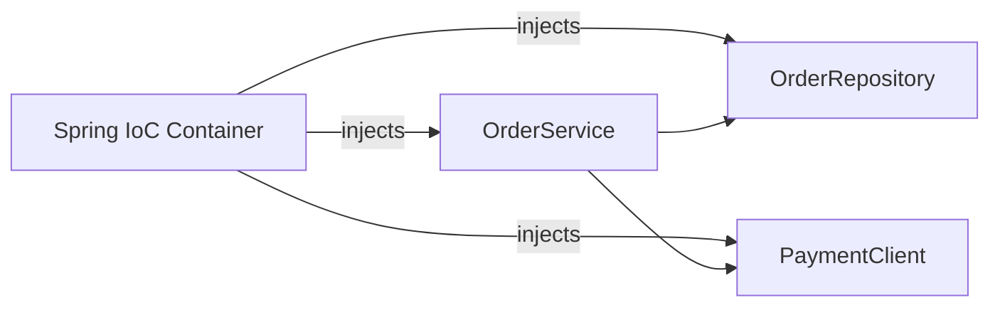

> [!TIP]
> Prefer **constructor injection** (as shown above) over field injection (`@Autowired` on a field). Constructor injection makes dependencies explicit, enables `final` fields, and makes the class trivially testable without Spring.

## 1.8 Stereotype Annotations

| Annotation | Purpose |
|---|---|
| `@Component` | Generic Spring-managed bean |
| `@Service` | Business logic layer (semantically a `@Component`) |
| `@Repository` | Data access layer; also enables exception translation |
| `@Controller` / `@RestController` | Web layer; `@RestController` = `@Controller` + `@ResponseBody` |
| `@Configuration` | Class defining beans via `@Bean` methods |

```java
@Configuration
public class AppConfig {

    @Bean
    public RestTemplate restTemplate() {
        return new RestTemplate();
    }
}
```

## 1.9 Basic REST Controller

```java
@RestController
@RequestMapping("/orders")
public class OrderController {

    private final OrderService orderService;

    OrderController(OrderService orderService) {
        this.orderService = orderService;
    }

    @GetMapping("/{id}")
    public OrderResponse getOrder(@PathVariable Long id) {
        return orderService.findById(id);
    }

    @PostMapping
    @ResponseStatus(HttpStatus.CREATED)
    public OrderResponse createOrder(@Valid @RequestBody CreateOrderRequest request) {
        return orderService.createOrder(request);
    }
}
```

## 1.10 Basic Configuration

```properties
server.port=8080
spring.application.name=order-service

spring.datasource.url=jdbc:postgresql://localhost:5432/orders
spring.datasource.username=app
spring.datasource.password=secret
```

```java
@Value("${spring.application.name}")
private String appName;
```

## 1.11 Basic Exception Handling

```java
@RestControllerAdvice
public class GlobalExceptionHandler {

    @ExceptionHandler(OrderNotFoundException.class)
    public ResponseEntity<ErrorResponse> handleNotFound(OrderNotFoundException ex) {
        return ResponseEntity.status(HttpStatus.NOT_FOUND)
            .body(new ErrorResponse("ORDER_NOT_FOUND", ex.getMessage()));
    }
}
```

---

# 2. Core Concepts (Intermediate Level)

## 2.1 Spring Boot Startup Architecture

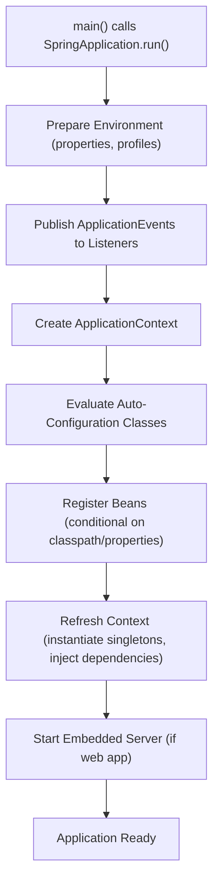

## 2.2 The IoC Container and Bean Lifecycle

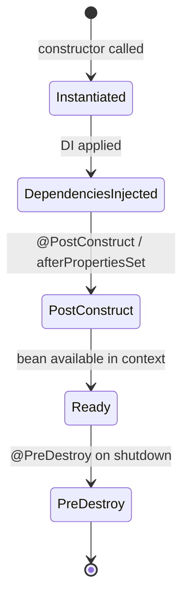

```java
@Component
public class CacheWarmer {

    @PostConstruct
    void warmUp() {
        // runs once after dependencies are injected
    }

    @PreDestroy
    void cleanup() {
        // runs during graceful shutdown
    }
}
```

## 2.3 Auto-Configuration Explained

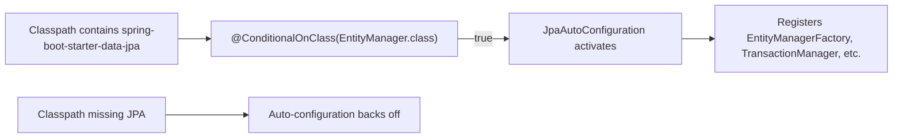

```java
@Configuration
@ConditionalOnClass(DataSource.class)
@ConditionalOnMissingBean(DataSource.class)
public class MyDataSourceAutoConfiguration {

    @Bean
    public DataSource dataSource(DataSourceProperties properties) {
        return properties.initializeDataSourceBuilder().build();
    }
}
```

| Conditional Annotation | Meaning |
|---|---|
| `@ConditionalOnClass` | Activates only if a given class is on the classpath |
| `@ConditionalOnMissingBean` | Activates only if no bean of that type already exists (lets you override defaults) |
| `@ConditionalOnProperty` | Activates only if a specific property is set to a value |
| `@ConditionalOnWebApplication` | Activates only in a web application context |

> [!TIP]
> To see exactly which auto-configurations were applied or skipped and why, run with `--debug` and check the "CONDITIONS EVALUATION REPORT" in the startup logs.

## 2.4 Dependency Injection Types

```java
// Constructor injection (preferred)
public OrderService(OrderRepository repository) {
    this.repository = repository;
}

// Setter injection (occasionally useful for optional dependencies)
@Autowired(required = false)
public void setNotifier(Notifier notifier) {
    this.notifier = notifier;
}

// Field injection (avoid in production code; common only in quick tests)
@Autowired
private OrderRepository repository;
```

## 2.5 Bean Scopes

| Scope | Lifecycle |
|---|---|
| `singleton` (default) | One instance per Spring container |
| `prototype` | New instance every time it's requested |
| `request` | One instance per HTTP request (web-aware contexts) |
| `session` | One instance per HTTP session |

```java
@Bean
@Scope("prototype")
public ReportGenerator reportGenerator() {
    return new ReportGenerator();
}
```

## 2.6 Spring MVC Request Flow

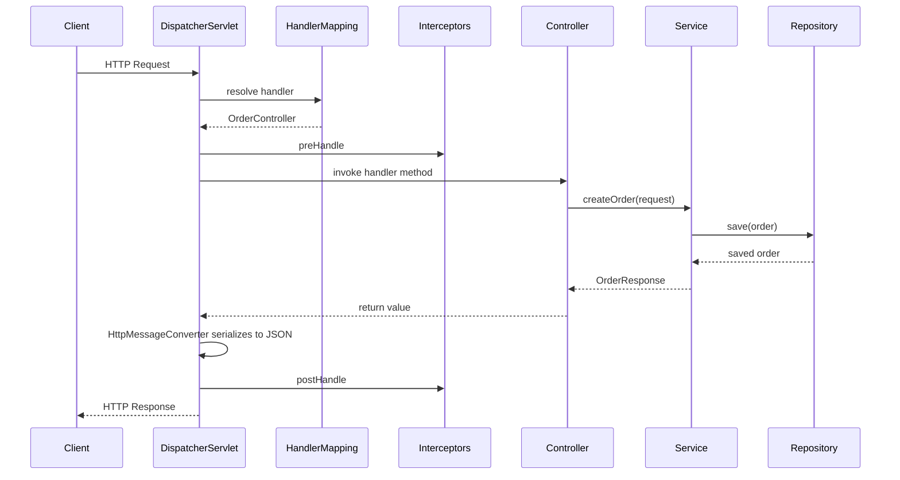

`DispatcherServlet` is the front controller for every Spring MVC request — it's the single entry point that routes to the right handler method.

## 2.7 Request/Response Binding

```java
public record CreateOrderRequest(
    @NotBlank String customerId,
    @NotEmpty List<@Valid OrderItemRequest> items
) {}
```

| Annotation | Purpose |
|---|---|
| `@RequestBody` | Deserializes JSON request body into a Java object |
| `@ResponseBody` (implicit in `@RestController`) | Serializes return value to JSON |
| `@PathVariable` | Binds a URI template variable |
| `@RequestParam` | Binds a query parameter |
| `@Valid` | Triggers Bean Validation on the annotated object |

## 2.8 Spring Data JPA

```java
public interface OrderRepository extends JpaRepository<Order, Long> {
    List<Order> findByStatus(String status);

    @Query("SELECT o FROM Order o WHERE o.customerId = :customerId")
    List<Order> findForCustomer(@Param("customerId") String customerId);
}
```

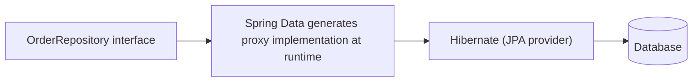

Spring Data JPA generates the repository implementation at runtime — you only declare the interface; method names are parsed into queries automatically (`findByStatus` -> `WHERE status = ?`).

## 2.9 Transactions

```java
@Service
public class OrderService {

    @Transactional
    public Order placeOrder(CreateOrderRequest request) {
        Order order = orderRepository.save(new Order(request));
        inventoryService.reserveStock(order); // same transaction
        return order;
    }
}
```

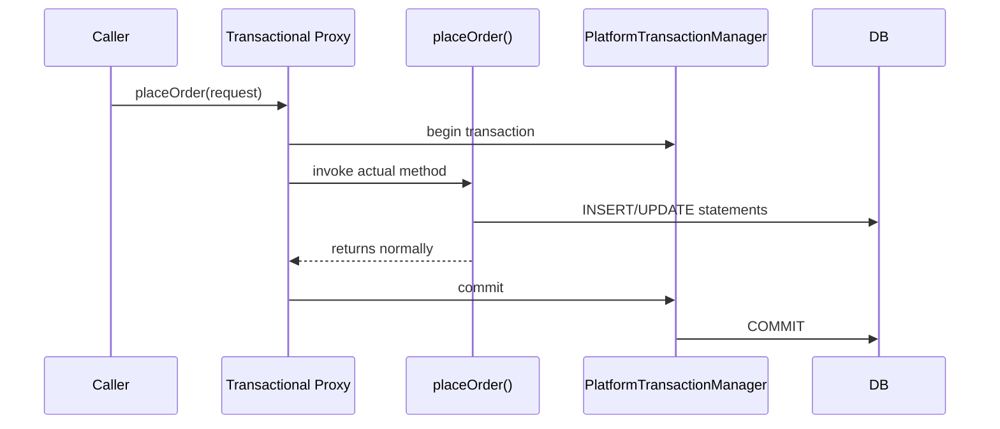

> [!WARNING]
> `@Transactional` works via a dynamic proxy wrapping the bean. Calling a `@Transactional` method **from within the same class** (self-invocation) bypasses the proxy entirely — the transaction annotation is silently ignored. Move such methods to a separate bean if you need transactional behavior across an internal call.

## 2.10 Configuration Profiles

```properties
# application-dev.properties
spring.jpa.hibernate.ddl-auto=update
logging.level.root=DEBUG

# application-prod.properties
spring.jpa.hibernate.ddl-auto=validate
logging.level.root=INFO
```

```bash
java -jar app.jar --spring.profiles.active=prod
```

```java
@Profile("dev")
@Configuration
public class DevOnlyConfig {
    @Bean
    public DataInitializer dataInitializer() {
        return new DataInitializer();
    }
}
```

## 2.11 Actuator

```properties
management.endpoints.web.exposure.include=health,info,metrics
management.endpoint.health.show-details=when-authorized
```

```bash
curl localhost:8080/actuator/health
curl localhost:8080/actuator/metrics/jvm.memory.used
```

| Endpoint | Purpose |
|---|---|
| `/actuator/health` | Liveness/readiness signal, aggregates health indicators (DB, disk, custom) |
| `/actuator/metrics` | Runtime metrics (JVM, HTTP requests, custom via Micrometer) |
| `/actuator/info` | Build/version metadata |
| `/actuator/env` | Current environment properties (sensitive — restrict access) |

## 2.12 Basic Testing

```java
@SpringBootTest
@AutoConfigureMockMvc
class OrderControllerTest {

    @Autowired
    private MockMvc mockMvc;

    @Test
    void createsOrder() throws Exception {
        mockMvc.perform(post("/orders")
                .contentType(MediaType.APPLICATION_JSON)
                .content("""
                    {"customerId": "c1", "items": [{"sku": "A1", "qty": 2}]}
                    """))
            .andExpect(status().isCreated());
    }
}
```

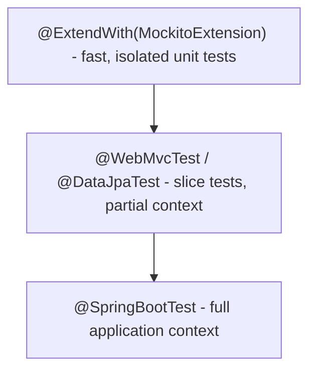

| Test Annotation | Loads |
|---|---|
| `@WebMvcTest` | Only the web layer (controllers, MVC infrastructure), mocks services |
| `@DataJpaTest` | Only JPA/repository layer with an in-memory or test database |
| `@SpringBootTest` | Full application context — slower, use sparingly for true integration tests |

---

# 3. Advanced Concepts (Senior Level)

## 3.1 AOP and Proxy Mechanics

Spring implements cross-cutting concerns (`@Transactional`, `@Cacheable`, `@Async`, custom `@Aspect`s) using proxies.

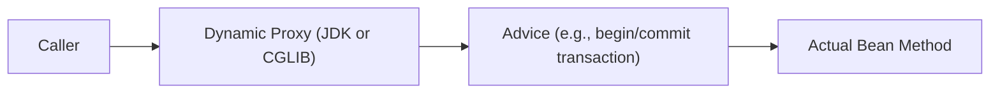

| Proxy Type | Used When |
|---|---|
| JDK dynamic proxy | Target bean implements at least one interface |
| CGLIB proxy | Target bean is a concrete class with no interface (subclasses the class) |

> [!IMPORTANT]
> Proxies only intercept calls that come **from outside the bean** (through the Spring-managed reference). Internal method calls (`this.someMethod()`) bypass the proxy — this is why `@Transactional`, `@Cacheable`, and `@Async` all silently fail on self-invocation. This single mechanic explains a large fraction of "why isn't my annotation working" bugs.

## 3.2 Custom Auto-Configuration

```java
@AutoConfiguration
@ConditionalOnClass(MyClient.class)
@EnableConfigurationProperties(MyClientProperties.class)
public class MyClientAutoConfiguration {

    @Bean
    @ConditionalOnMissingBean
    public MyClient myClient(MyClientProperties properties) {
        return new MyClient(properties.getBaseUrl(), properties.getApiKey());
    }
}
```

```text
src/main/resources/META-INF/spring/
    org.springframework.boot.autoconfigure.AutoConfiguration.imports
        -> com.example.MyClientAutoConfiguration
```

This is how third-party starters (and internal platform teams) ship auto-configured beans that "just work" when a dependency is added to the classpath.

## 3.3 Spring Security Fundamentals

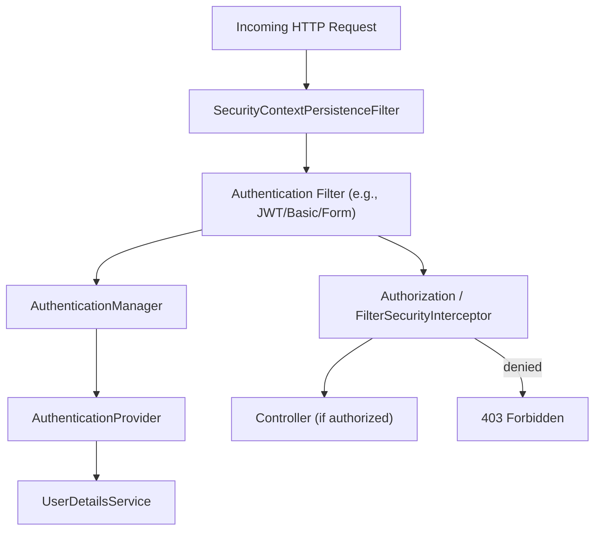

```java
@Configuration
@EnableWebSecurity
public class SecurityConfig {

    @Bean
    public SecurityFilterChain filterChain(HttpSecurity http) throws Exception {
        http
            .authorizeHttpRequests(auth -> auth
                .requestMatchers("/actuator/health").permitAll()
                .requestMatchers("/admin/**").hasRole("ADMIN")
                .anyRequest().authenticated())
            .oauth2ResourceServer(oauth2 -> oauth2.jwt(Customizer.withDefaults()));
        return http.build();
    }
}
```

Spring Security is itself a chain of servlet filters, each handling one concern (authentication, CSRF, authorization) before the request ever reaches your controller.

## 3.4 Caching Abstraction

```java
@Cacheable(value = "products", key = "#id")
public Product findProduct(Long id) {
    return productRepository.findById(id).orElseThrow();
}

@CacheEvict(value = "products", key = "#product.id")
public void updateProduct(Product product) {
    productRepository.save(product);
}
```

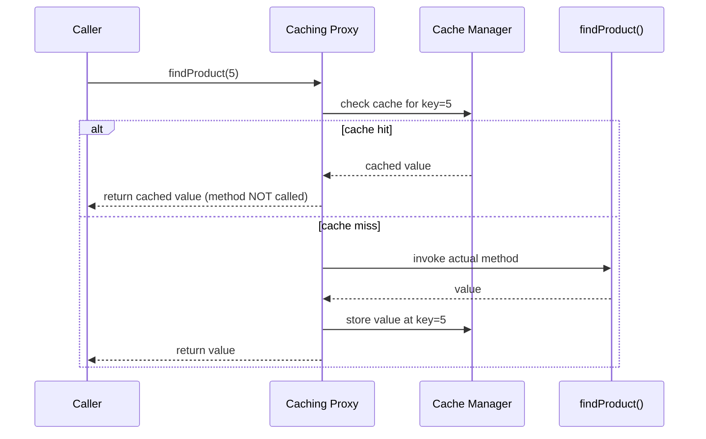

## 3.5 Async Processing

```java
@Async
public CompletableFuture<InventoryResult> checkInventoryAsync(String sku) {
    // runs on a separate thread pool
    return CompletableFuture.completedFuture(inventoryClient.check(sku));
}
```

```java
@Configuration
@EnableAsync
public class AsyncConfig {

    @Bean
    public Executor taskExecutor() {
        ThreadPoolTaskExecutor executor = new ThreadPoolTaskExecutor();
        executor.setCorePoolSize(10);
        executor.setMaxPoolSize(50);
        executor.setQueueCapacity(100);
        return executor;
    }
}
```

> [!WARNING]
> `@Async` methods must be called from a different bean (proxy rule again) and must return `void`, `Future<T>`, or `CompletableFuture<T>` — returning a plain object silently executes synchronously with no error.

## 3.6 Resilience: Circuit Breakers and Retries

```java
@CircuitBreaker(name = "inventoryService", fallbackMethod = "fallback")
@Retry(name = "inventoryService")
public InventoryResult checkInventory(String sku) {
    return inventoryClient.check(sku);
}

public InventoryResult fallback(String sku, Throwable t) {
    return InventoryResult.unknown(sku);
}
```

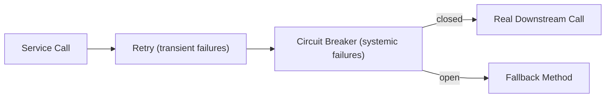

## 3.7 Externalized Configuration and Secrets

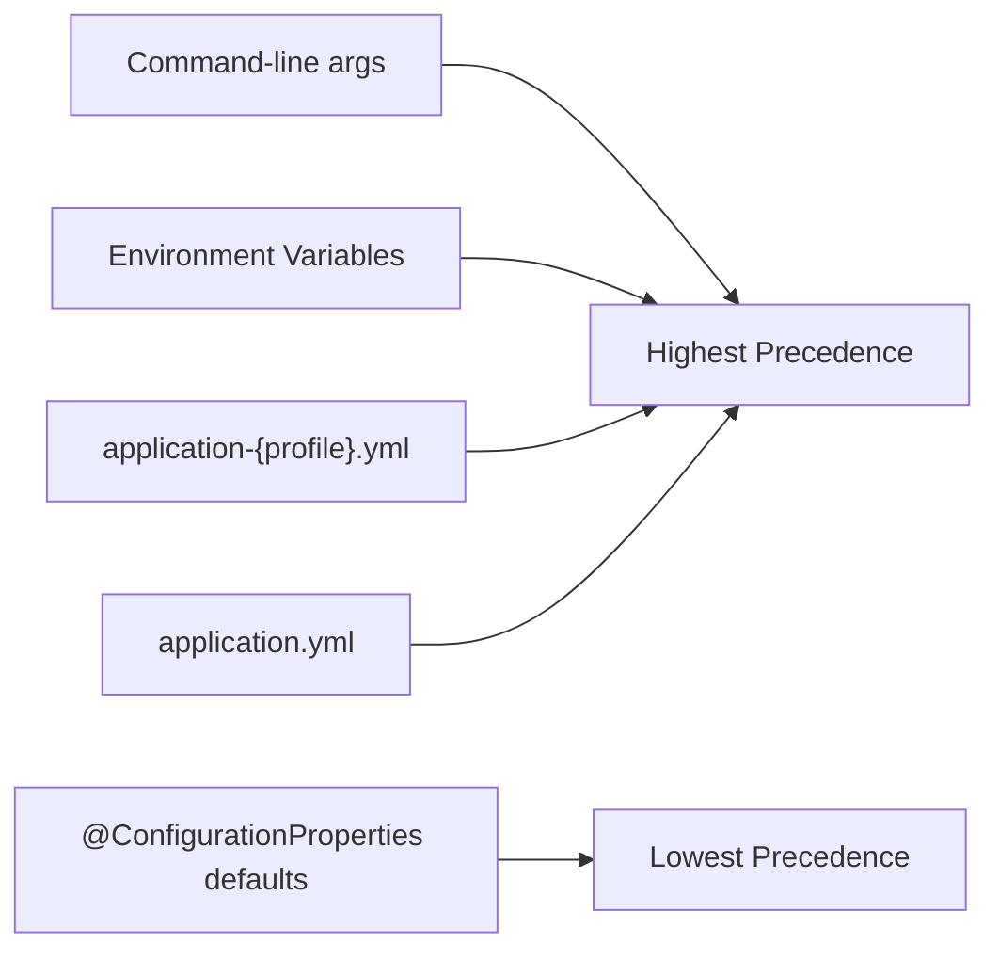

```java
@ConfigurationProperties(prefix = "app.payment")
public record PaymentProperties(String apiKey, Duration timeout) {}
```

```properties
app.payment.api-key=${PAYMENT_API_KEY}
app.payment.timeout=5s
```

> [!IMPORTANT]
> Never commit real secrets into `application.properties`/`application.yml`. Use environment variables, a secrets manager (Vault/AWS Secrets Manager), or Spring Cloud Config with encryption — reference them via placeholders as shown above.

## 3.8 Graceful Shutdown and Connection Draining

```properties
server.shutdown=graceful
spring.lifecycle.timeout-per-shutdown-phase=30s
```

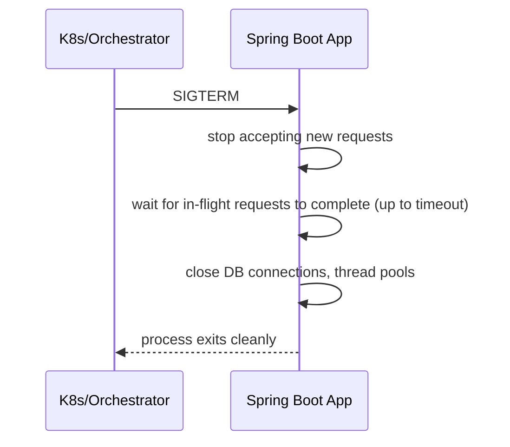

## 3.9 Performance Considerations

- Avoid `@SpringBootTest` in large test suites where a slice test (`@WebMvcTest`, `@DataJpaTest`) would do — full context loads are slow.
- Watch for N+1 queries from JPA entities exposed through REST — see the Hibernate guide for details; use DTO projections.
- Tune the embedded server's thread pool (`server.tomcat.threads.max`) relative to expected concurrency and downstream call latency.
- Enable HTTP response compression and connection keep-alive for high-throughput APIs.
- Consider AOT/native image (Spring Native/GraalVM) for latency-sensitive cold-start scenarios (serverless, CLI tools).
- Monitor actuator metrics (`http.server.requests`, `jvm.gc.pause`) under realistic load, not just functional correctness.

## 3.10 Failure Scenarios

| Failure | Symptom | Common Cause | Fix |
|---|---|---|---|
| `@Transactional` silently not applied | Data inconsistency, no rollback on error | Self-invocation bypassing the proxy | Call through a separate bean, or restructure |
| Slow startup | App takes minutes to boot | Excessive component scanning, too many auto-configurations, eager bean init | Narrow `@ComponentScan`, lazy initialization, profile-specific beans |
| `NoSuchBeanDefinitionException` | Startup failure | Missing starter dependency, missing `@ComponentScan` coverage, conditional not met | Check classpath, check package structure, run with `--debug` |
| Circular bean dependency | `BeanCurrentlyInCreationException` | Two beans depend on each other via constructor injection | Break the cycle via redesign, or use setter injection cautiously |
| Connection pool exhaustion | Requests hang/timeout under load | Long-held sessions, undersized pool, OSIV holding connections | Disable OSIV, size pool to real concurrency, shorten transactions |
| Config not picked up | Property seems ignored | Wrong profile active, wrong property precedence, typo in property name | Check active profiles, check precedence chain, use `--debug`/`/actuator/env` |
| Memory growth over time | `OutOfMemoryError` under sustained load | Beans holding unbounded caches, leaking listeners | Heap dump analysis, bound caches explicitly |
| Health check flapping | Pod restarts under load | Health check depends on a slow/flaky downstream | Separate liveness (process health) from readiness (dependency health) |

## 3.11 Security Pitfalls

| Risk | Mitigation |
|---|---|
| Actuator endpoints exposed publicly | Restrict `management.endpoints.web.exposure.include`, secure with authentication |
| Overly permissive CORS | Configure explicit allowed origins, not `*` with credentials |
| Returning entities directly from controllers | Use DTOs to avoid leaking internal fields or lazy-loading issues |
| Missing input validation | Use `@Valid` + Bean Validation on all request DTOs |
| Verbose error responses in production | Custom `@RestControllerAdvice` returning sanitized error bodies, not stack traces |
| Outdated dependencies | Automated dependency scanning (OWASP Dependency-Check, Dependabot) |

---

# 4. Real-World System Design Usage

## 4.1 Where Spring Boot Is Used in Production

- REST/GraphQL APIs for web and mobile backends.
- Microservices in Spring Cloud-based architectures.
- Batch processing (Spring Batch) for ETL/reporting jobs.
- Event-driven consumers (Spring Kafka/Spring Cloud Stream).
- Internal admin tools and enterprise back-office systems.

## 4.2 Typical Production Architecture

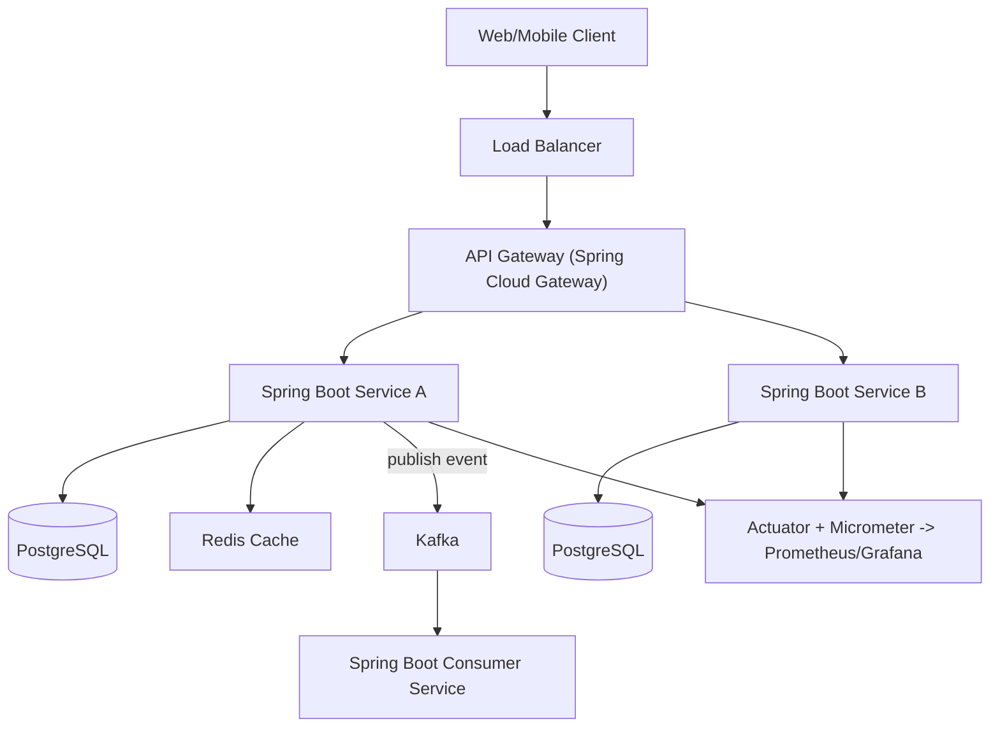

## 4.3 Big-Company Style Thinking

| Concern | Spring Boot Design Response |
|---|---|
| Reliability | Resilience4j circuit breakers/retries, graceful shutdown, health-based readiness |
| Scale | Stateless services behind a load balancer, externalized session/cache (Redis) |
| Observability | Micrometer metrics to Prometheus, structured logs, distributed tracing via OpenTelemetry |
| Security | Spring Security with OAuth2/JWT resource server, method-level `@PreAuthorize` |
| Maintainability | Layered architecture, `@ConfigurationProperties` for typed config, starter-based platform libraries |
| Performance | Slice testing for fast CI, connection pool tuning, caching abstraction |

## 4.4 Example: Order Service Request Lifecycle

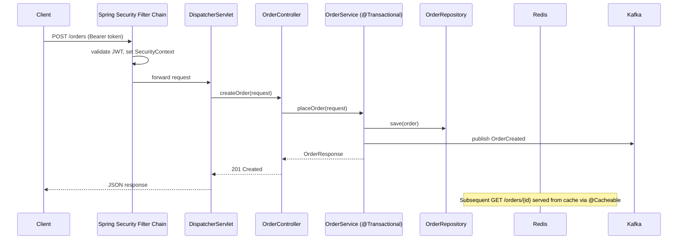

## 4.5 Layered Architecture

```text
Controller Layer (@RestController)
    - HTTP concerns, request/response DTOs, validation

Service Layer (@Service, @Transactional)
    - Business rules, orchestration across repositories/clients

Repository Layer (Spring Data JPA)
    - Persistence, query definitions

Client Layer (WebClient/Feign/RestClient)
    - Outbound calls to other services

Configuration Layer (@Configuration, @ConfigurationProperties)
    - Typed, externalized configuration
```

## 4.6 Deployment

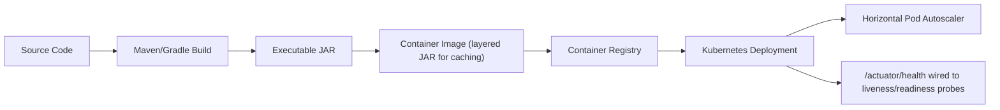

```dockerfile
FROM eclipse-temurin:21-jre
COPY target/app.jar app.jar
ENTRYPOINT ["java", "-jar", "/app.jar"]
```

## 4.7 Integration with Other Systems

| System | Spring Boot Integration |
|---|---|
| Database | Spring Data JPA/JDBC, HikariCP (default pool) |
| Cache | Spring Cache abstraction with Redis/Caffeine |
| Messaging | Spring Kafka, Spring AMQP (RabbitMQ), Spring Cloud Stream |
| Security | Spring Security, OAuth2 Resource Server/Client |
| Observability | Micrometer (metrics), Spring Cloud Sleuth/OpenTelemetry (tracing), Actuator |
| Service discovery/config | Spring Cloud Netflix Eureka, Spring Cloud Config, Consul |
| Resilience | Resilience4j (circuit breakers, retries, rate limiters) |
| Testing | Testcontainers, JUnit 5, MockMvc, WireMock |

---

# 5. Interview Preparation

## 5.1 What Interviewers Expect

For "Spring Boot" topics, interviewers usually expect:

- You understand dependency injection and why constructor injection is preferred.
- You can build a REST API with proper layering (controller/service/repository).
- You understand auto-configuration at a conceptual level.
- You know how `@Transactional` works and its self-invocation limitation.
- You can configure profiles and externalized configuration.

For senior backend roles, they also expect:

- You understand the proxy mechanics behind AOP-based annotations.
- You can debug startup/wiring failures (missing beans, circular dependencies).
- You know how to secure and observe a production Spring Boot service.
- You understand testing strategy (unit vs. slice vs. full context tests).
- You can reason about performance implications of framework choices (OSIV, N+1, thread pool sizing).

## 5.2 Most Important Questions and Answers

### Q1. What is dependency injection, and why does Spring use it?

Dependency injection means a class receives its dependencies from an external source (the Spring container) rather than creating them itself. This decouples classes from concrete implementations, makes testing easier (dependencies can be mocked), and centralizes object lifecycle management.

### Q2. What is auto-configuration?

A mechanism where Spring Boot automatically configures beans based on what's on the classpath and what properties are set, using conditional annotations (`@ConditionalOnClass`, `@ConditionalOnMissingBean`, etc.). It removes the need to manually declare common beans while still allowing you to override any default.

### Q3. Why doesn't `@Transactional` work when called from within the same class?

`@Transactional` is implemented via a dynamic proxy wrapping the bean. Internal (`this.method()`) calls bypass the proxy entirely, so the transactional advice never triggers. The fix is to call the method through the Spring-managed proxy (e.g., from a different bean, or via `AopContext.currentProxy()` in rare cases).

### Q4. What's the difference between `@Component`, `@Service`, and `@Repository`?

They are all stereotype annotations registering a class as a Spring bean. `@Service` and `@Repository` are semantically specialized `@Component`s for readability and, in `@Repository`'s case, they also enable automatic persistence-exception translation into Spring's `DataAccessException` hierarchy.

### Q5. What's the difference between `@WebMvcTest`, `@DataJpaTest`, and `@SpringBootTest`?

`@WebMvcTest` loads only the web layer for controller testing with mocked services. `@DataJpaTest` loads only JPA infrastructure against an embedded/test database. `@SpringBootTest` loads the full application context — most realistic but slowest, so it should be used sparingly for genuine integration tests.

### Q6. How does Spring Boot decide which embedded server to use?

Based on the starter dependency included: `spring-boot-starter-web` brings in Tomcat by default; you can swap to Jetty or Undertow by excluding Tomcat and including the alternative starter dependency. `spring-boot-starter-webflux` uses Netty for reactive applications.

### Q7. What is the difference between `@Autowired` field injection and constructor injection?

Field injection sets a field directly via reflection after construction, hiding dependencies and making the class hard to instantiate without Spring. Constructor injection makes dependencies explicit parameters, allows `final` fields, fails fast if a dependency is missing, and is trivially testable with plain `new`.

### Q8. What are Spring profiles for?

Profiles let you define environment-specific beans and configuration (e.g., different datasource settings for `dev` vs. `prod`) that are activated selectively via `spring.profiles.active`, without changing code.

### Q9. What does Spring Boot Actuator provide?

Production-ready operational endpoints out of the box: `/health` (liveness/readiness signal), `/metrics` (runtime and custom metrics via Micrometer), `/info` (build metadata), and others — critical for running Spring Boot services reliably in orchestrated environments.

### Q10. Why might a bean fail to be found (`NoSuchBeanDefinitionException`) at startup?

Common causes: the class isn't under the base package scanned by `@ComponentScan`/`@SpringBootApplication`, the required starter dependency is missing from the classpath (so its auto-configuration never activates), or a `@Conditional` annotation's condition isn't satisfied.

## 5.3 Tricky Questions

### Can two beans of the same type cause ambiguity, and how do you resolve it?

Yes — Spring throws `NoUniqueBeanDefinitionException` when injecting by type if multiple candidates exist. Resolve with `@Qualifier("beanName")`, `@Primary` on the preferred bean, or by injecting a `List<T>`/`Map<String, T>` of all candidates if you genuinely need all of them.

### Why can `@Async` silently run synchronously?

If the method is called via self-invocation (bypassing the proxy) or if `@EnableAsync` isn't configured, the method executes on the calling thread with no error raised — a subtle bug that "looks async" in code but isn't at runtime.

### Does `@Transactional(readOnly = true)` guarantee no writes can happen?

No — it's a hint to the underlying persistence provider (e.g., Hibernate can skip dirty-checking flushes) and potentially the driver/connection (some drivers optimize or route read-only transactions), but Spring itself doesn't enforce a hard database-level restriction against writes.

### Why might component scanning miss a bean even though the class has `@Component`?

If the class lives outside the package (or sub-package) of the `@SpringBootApplication`-annotated class, and no explicit `@ComponentScan(basePackages = ...)` includes it, Spring never discovers it during classpath scanning.

## 5.4 Common Candidate Mistakes

- Using field injection everywhere instead of constructor injection.
- Assuming `@Transactional` always works regardless of how the method is called.
- Not knowing the difference between profiles and `@ConditionalOnProperty`-based conditional beans.
- Loading `@SpringBootTest` for every test instead of appropriate slice tests.
- Exposing all actuator endpoints publicly without securing them.
- Returning JPA entities directly from REST controllers.
- Not understanding that auto-configuration can be overridden, assuming it's fixed behavior.
- Confusing bean scope defaults (assuming `prototype` when it's actually `singleton`).

## 5.5 Interview Coding Checklist

- [ ] Use constructor injection for all required dependencies.
- [ ] Keep controllers thin; put business logic in the service layer.
- [ ] Validate request DTOs with `@Valid` and Bean Validation annotations.
- [ ] Map exceptions to appropriate HTTP status codes via `@RestControllerAdvice`.
- [ ] Externalize configuration via `@ConfigurationProperties`, not scattered `@Value`.
- [ ] Choose the narrowest test slice that proves the behavior.

---

# 6. Hands-On Thinking

## 6.1 Three Real-World Projects Using Spring Boot

### Project 1: Task Management REST API

Concepts:

- Layered architecture (controller/service/repository).
- Spring Data JPA with relationships.
- Bean Validation on request DTOs.
- Global exception handling.

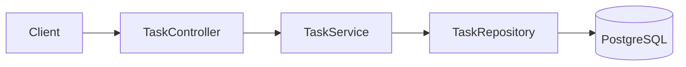

### Project 2: E-Commerce Order Service with Async Notifications

Concepts:

- `@Transactional` service boundaries.
- Spring Kafka producer publishing domain events.
- `@Async` for non-blocking notification dispatch.
- Resilience4j circuit breaker around a payment client.

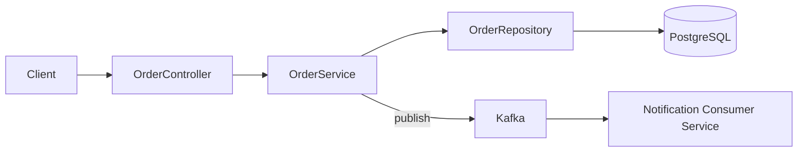

### Project 3: Secured Internal Admin Platform

Concepts:

- Spring Security with OAuth2 resource server (JWT).
- Method-level `@PreAuthorize` authorization.
- Actuator secured behind authentication, exposed only internally.
- Caching abstraction for expensive dashboard queries.

```mermaid
flowchart LR
    AdminUI["Admin UI"] --> GW["Spring Cloud Gateway"]
    GW --> AdminAPI["Admin Service (Spring Security + @PreAuthorize)"]
    AdminAPI --> Cache["Redis Cache"]
    AdminAPI --> DB[("Database")]
```

## 6.2 Step-by-Step Design Approach

For any Spring Boot project:

1. Define the domain model and layer boundaries (controller/service/repository/client).
2. Choose starters deliberately (web, data-jpa, security, validation) based on real needs.
3. Design request/response DTOs separately from persistence entities.
4. Add validation and centralized exception handling early.
5. Configure profiles for environment-specific behavior.
6. Add resilience (circuit breakers, retries, timeouts) around all outbound calls.
7. Secure the application (authentication, authorization, actuator exposure).
8. Add slice tests first, integration tests second, minimal end-to-end tests last.
9. Wire observability (actuator, metrics, tracing) before first production deploy.
10. Load test and tune thread pools/connection pools against realistic traffic.

## 6.3 Production Implementation Approach

```mermaid
flowchart TD
    A["Domain + Layered Design"] --> B["DTOs + Validation"]
    B --> C["Persistence Layer (Spring Data)"]
    C --> D["Security Configuration"]
    D --> E["Resilience (Resilience4j)"]
    E --> F["Testing (slice -> integration -> e2e)"]
    F --> G["Observability (Actuator/Micrometer/Tracing)"]
    G --> H["Containerization"]
    H --> I["Load Testing"]
    I --> J["Production Deployment"]
```

## 6.4 Production Readiness Example

For a Spring Boot service, define:

- Liveness and readiness probes wired to `/actuator/health` with meaningful health indicators.
- Structured JSON logging with correlation/trace IDs.
- Micrometer metrics exported to Prometheus, dashboards in Grafana.
- Graceful shutdown enabled (`server.shutdown=graceful`) for zero-downtime deploys.
- Actuator endpoints restricted to internal network/authenticated access only.
- Externalized secrets via environment variables or a secrets manager, never in source.
- Documented profile strategy (`dev`, `staging`, `prod`) with CI enforcing profile-appropriate settings.

---

# 7. Deep Dive (Optional but Important)

## 7.1 How `@SpringBootApplication` Actually Works

```mermaid
flowchart TB
    SBA["@SpringBootApplication"] --> Config["@SpringBootConfiguration (= @Configuration)"]
    SBA --> EnableAuto["@EnableAutoConfiguration"]
    SBA --> Scan["@ComponentScan"]
    EnableAuto --> Imports["Loads classes listed in AutoConfiguration.imports"]
    Imports --> Conditionals["Each auto-config class evaluates its @Conditional annotations"]
    Conditionals --> Registered["Matching auto-configurations register their beans"]
```

`@SpringBootApplication` is itself a meta-annotation combining three others. `@EnableAutoConfiguration` is the piece that triggers Spring Boot to read `META-INF/spring/org.springframework.boot.autoconfigure.AutoConfiguration.imports` from every starter JAR on the classpath and conditionally apply each one.

## 7.2 BeanFactory vs. ApplicationContext

```text
BeanFactory        -> base container interface, lazy bean instantiation
ApplicationContext -> extends BeanFactory, adds:
                        - event publishing
                        - internationalization support
                        - environment/property source abstraction
                        - eager singleton instantiation by default
```

`ApplicationContext` is what Spring Boot uses in practice; `BeanFactory` is the more primitive interface underneath it.

## 7.3 Bean Definition and Instantiation Order

```mermaid
flowchart LR
    Scan["Component Scan / @Bean methods"] --> Define["BeanDefinitions registered (metadata only, no instances yet)"]
    Define --> PostProcessors["BeanFactoryPostProcessors run (can modify definitions)"]
    PostProcessors --> Instantiate["Singleton beans instantiated in dependency order"]
    Instantiate --> BPP["BeanPostProcessors wrap/modify instances (e.g., AOP proxies applied here)"]
    BPP --> Ready["Fully initialized singleton beans"]
```

Understanding this two-phase process (define first, instantiate later) explains why certain `BeanFactoryPostProcessor`/`BeanDefinitionRegistryPostProcessor` extension points can add or modify bean definitions before any bean is actually created — the mechanism `@ConfigurationProperties` and auto-configuration itself rely on.

## 7.4 Request-Scoped Beans and Proxies in Web Contexts

```java
@Bean
@RequestScope
public RequestContext requestContext() {
    return new RequestContext();
}
```

Because a `singleton`-scoped bean (like a controller) can't hold a direct reference to a per-request bean safely, Spring injects a **scoped proxy** — a stand-in object that resolves the real request-scoped instance from the current request context on every method call.

## 7.5 Micrometer and the Metrics Pipeline

```mermaid
flowchart LR
    App["Application Code"] --> Micrometer["Micrometer (vendor-neutral metrics facade)"]
    Micrometer --> Registry["MeterRegistry"]
    Registry --> Prom["Prometheus Registry"]
    Registry --> Other["Or: Datadog / New Relic / CloudWatch Registry"]
    Prom --> Grafana["Grafana Dashboards"]
```

```java
@Component
public class OrderMetrics {

    private final Counter ordersCreated;

    OrderMetrics(MeterRegistry registry) {
        this.ordersCreated = Counter.builder("orders.created").register(registry);
    }

    void recordOrderCreated() {
        ordersCreated.increment();
    }
}
```

Micrometer is a facade (analogous to SLF4J for logging) — application code depends only on Micrometer's API, and the actual backend (Prometheus, Datadog, etc.) is swapped via configuration.

## 7.6 Logging

```properties
logging.level.root=INFO
logging.level.com.example.app=DEBUG
logging.pattern.console=%d{yyyy-MM-dd HH:mm:ss} [%thread] %-5level %logger{36} - %msg%n
```

```java
private static final Logger log = LoggerFactory.getLogger(OrderService.class);

log.info("Order created: orderId={}, customerId={}", order.getId(), order.getCustomerId());
```

Spring Boot uses SLF4J as the logging facade with Logback as the default implementation, configurable per-package log levels and structured output formats (including JSON for log aggregation pipelines).

## 7.7 Debugging Tools

| Tool/Endpoint | Purpose |
|---|---|
| `--debug` startup flag | Prints the auto-configuration conditions evaluation report |
| `/actuator/beans` | Lists every bean in the application context |
| `/actuator/conditions` | Shows which auto-configurations were applied/excluded and why |
| `/actuator/threaddump` | Captures a thread dump for hang diagnosis |
| `/actuator/heapdump` | Captures a heap dump for memory leak diagnosis |
| Spring Boot DevTools | Automatic restart on code change during local development |

```bash
curl localhost:8080/actuator/conditions | jq '.contexts.application.negativeMatches'
```

---

# Production Checklists

## Code Quality Checklist

- [ ] Constructor injection used consistently; no field injection in production code.
- [ ] Controllers stay thin; business logic lives in the service layer.
- [ ] DTOs used for request/response; entities not exposed directly.
- [ ] Validation applied on all external input (`@Valid` + Bean Validation).
- [ ] Centralized exception handling via `@RestControllerAdvice`.
- [ ] `@ConfigurationProperties` used for structured configuration, not scattered `@Value`.

## Performance Checklist

- [ ] Test suite uses appropriate slices (`@WebMvcTest`/`@DataJpaTest`) instead of `@SpringBootTest` everywhere.
- [ ] Connection pool and thread pool sizes tuned against real concurrency and downstream latency.
- [ ] Caching applied deliberately (`@Cacheable`) for expensive, frequently-read data.
- [ ] N+1 query patterns checked in JPA-backed endpoints.
- [ ] Response compression and keep-alive enabled for high-throughput APIs.
- [ ] Startup time measured and optimized if relevant (cold-start-sensitive environments).

## Security Checklist

- [ ] Spring Security configured with explicit authorization rules (default deny).
- [ ] Actuator endpoints restricted/secured, not exposed publicly by default.
- [ ] CORS configured explicitly, not wildcarded with credentials.
- [ ] Secrets externalized via environment variables or a secrets manager.
- [ ] Dependency scanning enabled in CI (OWASP Dependency-Check/Dependabot).
- [ ] Error responses sanitized in production (no stack traces to clients).

## Debugging Checklist

- [ ] Reproduce with `--debug` to inspect auto-configuration decisions.
- [ ] Check `/actuator/beans` and `/actuator/conditions` for wiring issues.
- [ ] Check for self-invocation bypassing `@Transactional`/`@Async`/`@Cacheable`.
- [ ] Check active profile and property precedence for configuration issues.
- [ ] Capture thread/heap dumps via actuator for hangs/leaks.
- [ ] Write a regression test (appropriate slice level) after fixing.

---

# Learning Roadmap

## Phase 1: Beginner

Learn:

- IoC container, dependency injection, stereotype annotations.
- Basic REST controllers and request/response binding.
- Basic configuration (`application.properties`, `@Value`).
- Basic Spring Data JPA repositories.

Practice:

- Simple CRUD REST API (task manager, book catalog).
- Basic validation and exception handling.

## Phase 2: Intermediate

Learn:

- Auto-configuration mechanics and conditional annotations.
- Transactions (`@Transactional`) and proxy behavior.
- Profiles and externalized configuration.
- Actuator basics.
- Slice testing strategy.

Practice:

- Multi-layer REST API with profiles for dev/prod.
- Add actuator health/metrics to an existing project.

## Phase 3: Advanced

Learn:

- AOP/proxy internals underlying annotations.
- Spring Security (authentication/authorization, OAuth2 resource server).
- Caching abstraction, async processing.
- Resilience4j (circuit breakers, retries).
- Custom auto-configuration/starters.

Practice:

- Secured API with JWT-based authentication and role-based authorization.
- Add resilience patterns around an external API client.

## Phase 4: Production Backend Engineer

Learn:

- Micrometer/observability pipeline design.
- Graceful shutdown and zero-downtime deployment.
- Bean lifecycle and container internals (BeanFactory vs. ApplicationContext).
- Debugging tools (`/actuator/conditions`, `/actuator/threaddump`, `--debug`).
- Building internal shared starters/auto-configurations for platform teams.

Practice:

- Production-style microservice with full observability stack, security, resilience patterns, and CI-driven slice/integration testing.

---

# Self-Review Completion Loop

The topic was reviewed against:

- Official Spring Boot reference documentation categories.
- Spring Framework core documentation (IoC, AOP, transactions).
- Spring Security and Spring Data reference guides.
- Common Spring Boot production incident patterns (proxy self-invocation, auto-configuration surprises, OSIV, thread pool exhaustion).
- Interview patterns for beginner through senior backend roles.

## Gap Review Matrix

| Area | Covered? | Notes |
|---|---|---|
| Beginner DI/IoC | Yes | Constructor injection, stereotypes, bean basics |
| Auto-configuration | Yes | Mechanism, conditionals, debugging report |
| Spring MVC | Yes | Request flow via `DispatcherServlet`, sequence diagram |
| Spring Data JPA | Yes | Repository proxy generation, query derivation |
| Transactions | Yes | Proxy mechanics, self-invocation pitfall |
| Configuration/Profiles | Yes | Precedence chain, `@ConfigurationProperties` |
| Actuator | Yes | Key endpoints, security considerations |
| Security | Yes | Filter chain, OAuth2 resource server example |
| Caching/Async | Yes | `@Cacheable`/`@Async` mechanics and pitfalls |
| Resilience | Yes | Circuit breaker + retry with Resilience4j |
| Testing strategy | Yes | Unit vs. slice vs. full context, diagram |
| AOP/proxy internals | Yes | JDK vs. CGLIB, bean lifecycle diagram |
| Observability | Yes | Micrometer pipeline, logging, tracing |
| Failure scenarios | Yes | Self-invocation, circular deps, pool exhaustion |
| Security pitfalls | Yes | Actuator exposure, CORS, entity leakage |
| Interview prep | Yes | Common and tricky questions, candidate mistakes |
| Hands-on projects | Yes | Three realistic projects with diagrams |
| Diagram depth | Yes | Mermaid diagrams throughout every major section |

No significant beginner-to-senior Spring Boot foundation gaps remain for the requested scope. Further specialization should split into separate deep dives: **Spring Security Deep Dive (OAuth2/JWT)**, **Reactive Spring (WebFlux/Project Reactor)**, **Spring Cloud Microservices Patterns**, **Spring Batch**, and **Spring Boot Native Images (GraalVM)**.

---

# Official References

- Spring Boot Reference Documentation: <https://docs.spring.io/spring-boot/reference/>
- Spring Framework Reference Documentation: <https://docs.spring.io/spring-framework/reference/>
- Spring Data JPA Reference: <https://docs.spring.io/spring-data/jpa/reference/>
- Spring Security Reference: <https://docs.spring.io/spring-security/reference/>
- Micrometer Documentation: <https://micrometer.io/docs>
- Resilience4j Documentation: <https://resilience4j.readme.io/docs>

---

## Final Summary

Spring Boot removes the manual wiring burden of the Spring Framework by auto-configuring sensible defaults based on the classpath, while still allowing every default to be overridden. Production mastery comes from understanding what's happening underneath the annotations — the IoC container's bean lifecycle, the proxy mechanics behind `@Transactional`/`@Async`/`@Cacheable` (and their shared self-invocation pitfall), the auto-configuration conditional system, and the operational surface (Actuator, Micrometer, graceful shutdown) needed to run a service reliably. The fastest path to senior-level Spring Boot skill is learning to read what auto-configuration actually did (`--debug`, `/actuator/conditions`), reasoning about proxies when an annotation "isn't working," and building resilience and observability into services from the start rather than after the first production incident.
