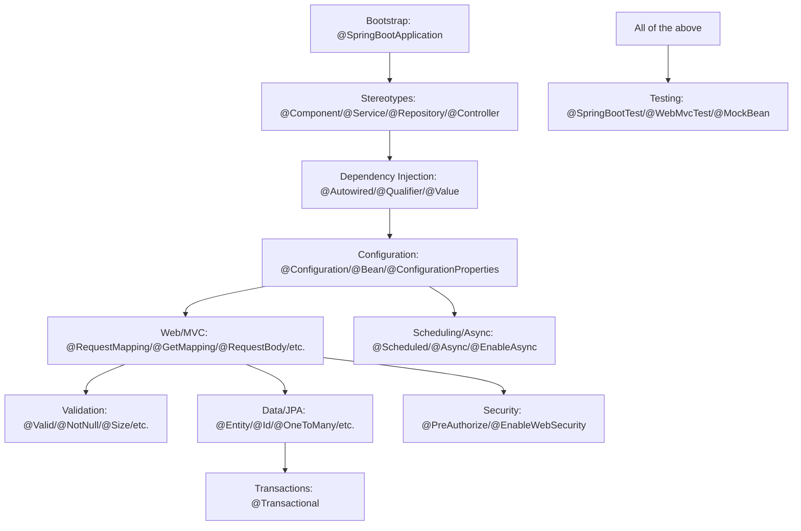
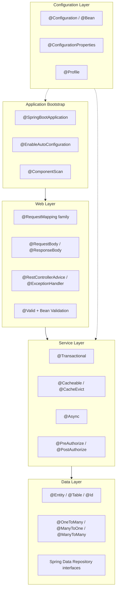
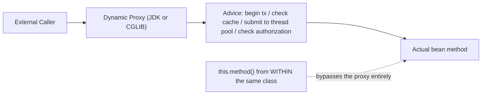
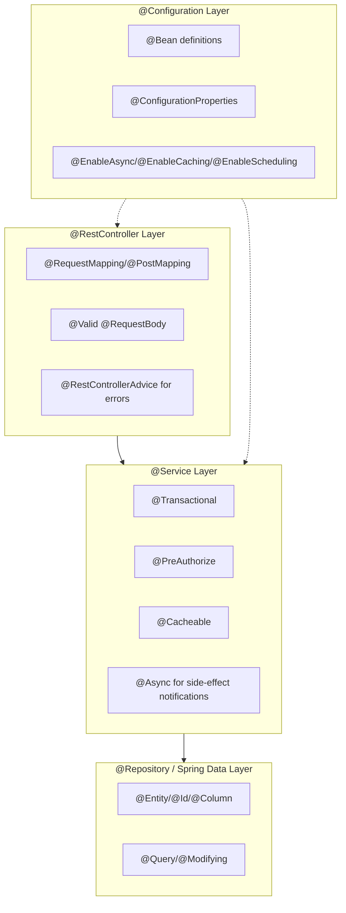
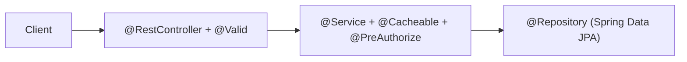
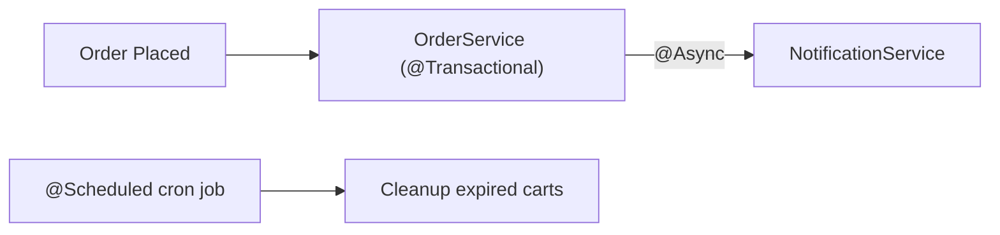
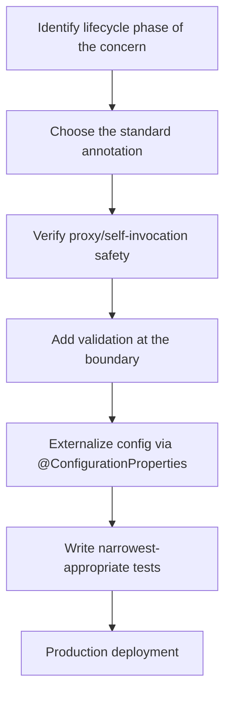
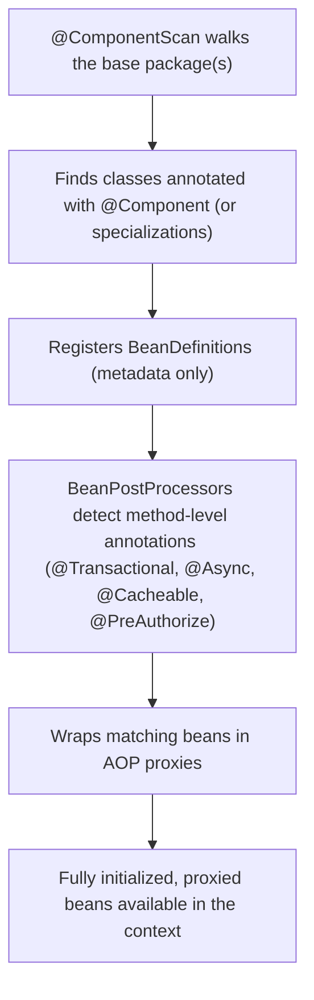

# Spring Boot Annotations: Complete Beginner-to-Expert Reference Guide

> **Scope:** This guide catalogs every annotation you'll actually encounter building production Spring Boot applications — core/bootstrap, stereotypes, dependency injection, web/MVC, validation, data/JPA, transactions, security, scheduling/async, testing, and configuration — organized by category with what each does, when to use it, and the pitfalls that trip people up. Builds on [[05 Spring Boot]], [[09 Java Hibernate]], and [[10 Spring Security]].

## Table of Contents

1. [Executive Summary](#executive-summary)
2. [1. Fundamentals](#1-fundamentals-beginner-level)
3. [2. Core Concepts](#2-core-concepts-intermediate-level)
4. [3. Advanced Concepts](#3-advanced-concepts-senior-level)
5. [4. Real-World System Design Usage](#4-real-world-system-design-usage)
6. [5. Interview Preparation](#5-interview-preparation)
7. [6. Hands-On Thinking](#6-hands-on-thinking)
8. [7. Deep Dive](#7-deep-dive-optional-but-important)
9. [Production Checklists](#production-checklists)
10. [Learning Roadmap](#learning-roadmap)
11. [Self-Review Completion Loop](#self-review-completion-loop)
12. [Official References](#official-references)

---

## Executive Summary

Spring Boot annotations fall into a small number of functional families, each solving a different concern in the request/application lifecycle:



> [!TIP]
> Don't memorize annotations in isolation — learn which **phase** of the request/application lifecycle each one governs: *startup wiring* (`@Configuration`, `@Bean`, `@ComponentScan`), *dependency injection* (`@Autowired`, `@Qualifier`), *web request handling* (`@RequestMapping` family), *persistence* (`@Entity`, `@Transactional`), or *cross-cutting concerns* (`@Async`, `@Cacheable`, `@PreAuthorize` — all AOP-proxy-based, sharing the same self-invocation pitfall).

---

# 1. Fundamentals (Beginner Level)

## 1.1 Bootstrap Annotations

| Annotation | Purpose |
|---|---|
| `@SpringBootApplication` | Meta-annotation combining `@SpringBootConfiguration`, `@EnableAutoConfiguration`, `@ComponentScan` — marks the application's entry point |
| `@SpringBootConfiguration` | Specialized `@Configuration` for the main application class |
| `@EnableAutoConfiguration` | Triggers Spring Boot's auto-configuration mechanism based on the classpath |
| `@ComponentScan` | Tells Spring which packages to scan for `@Component`-annotated classes |

```java
@SpringBootApplication
public class Application {
    public static void main(String[] args) {
        SpringApplication.run(Application.class, args);
    }
}
```

## 1.2 Why These Annotations Exist

| Problem | Annotation Family's Answer |
|---|---|
| Manually wiring every bean by hand | Stereotype annotations + component scanning |
| Explicitly declaring every dependency's construction | `@Autowired`/constructor injection |
| Hardcoding URLs to Java methods | `@RequestMapping`/`@GetMapping` family |
| Manually validating every field in every controller | Bean Validation annotations (`@Valid`, `@NotNull`, etc.) |
| Writing raw SQL/JDBC for every entity | JPA annotations (`@Entity`, `@Id`, `@OneToMany`) |
| Manually starting/committing/rolling back transactions | `@Transactional` |
| Loading the full app context for every test | Test-slice annotations (`@WebMvcTest`, `@DataJpaTest`) |

## 1.3 Stereotype Annotations

```java
@Component
public class EmailValidator { }

@Service
public class OrderService { }

@Repository
public class OrderRepositoryImpl { }

@Controller
public class WebPageController { }

@RestController // = @Controller + @ResponseBody
public class OrderApiController { }
```

| Annotation | Layer | Special Behavior |
|---|---|---|
| `@Component` | Generic | Base stereotype; all others are specializations of it |
| `@Service` | Business logic | Semantic marker only — no extra framework behavior |
| `@Repository` | Data access | Enables automatic persistence exception translation into `DataAccessException` |
| `@Controller` | Web (MVC, view-based) | Methods return view names by default |
| `@RestController` | Web (REST/JSON) | Methods' return values are serialized directly to the response body |

## 1.4 Dependency Injection Annotations

```java
@Service
public class OrderService {

    private final OrderRepository repository; // constructor injection - preferred

    public OrderService(OrderRepository repository) {
        this.repository = repository;
    }
}
```

| Annotation | Purpose |
|---|---|
| `@Autowired` | Marks a constructor/setter/field for automatic dependency injection (optional on constructors since Spring 4.3 if there's only one constructor) |
| `@Qualifier("beanName")` | Disambiguates when multiple beans of the same type exist |
| `@Primary` | Marks a bean as the default choice among multiple candidates |
| `@Value("${property.name}")` | Injects a single configuration property value |
| `@Lazy` | Defers bean initialization until first use |

> [!TIP]
> Prefer constructor injection over field injection (`@Autowired` directly on a field). It makes dependencies explicit, enables `final` fields, and is trivially testable without a Spring context — see [[05 Spring Boot]] for the full rationale.

## 1.5 Configuration Annotations

```java
@Configuration
public class AppConfig {

    @Bean
    public RestTemplate restTemplate() {
        return new RestTemplate();
    }
}
```

| Annotation | Purpose |
|---|---|
| `@Configuration` | Marks a class as a source of bean definitions |
| `@Bean` | Marks a method whose return value should be registered as a Spring bean |
| `@ConfigurationProperties(prefix = "app.x")` | Binds a group of external properties to a typed object |
| `@EnableConfigurationProperties` | Registers a `@ConfigurationProperties` class as a bean |
| `@PropertySource("classpath:custom.properties")` | Loads an additional properties file |
| `@Profile("dev")` | Activates a bean/configuration only under a specific profile |

```java
@ConfigurationProperties(prefix = "app.payment")
public record PaymentProperties(String apiKey, Duration timeout) {}
```

## 1.6 Basic Web Annotations

```java
@RestController
@RequestMapping("/orders")
public class OrderController {

    @GetMapping("/{id}")
    public OrderResponse getOrder(@PathVariable Long id) {
        return orderService.findById(id);
    }

    @PostMapping
    public OrderResponse createOrder(@Valid @RequestBody CreateOrderRequest request) {
        return orderService.create(request);
    }
}
```

| Annotation | Purpose |
|---|---|
| `@RequestMapping` | Maps a class/method to a URL path (base annotation; method-specific ones are shortcuts) |
| `@GetMapping`/`@PostMapping`/`@PutMapping`/`@DeleteMapping`/`@PatchMapping` | HTTP-method-specific shortcuts for `@RequestMapping` |
| `@PathVariable` | Binds a URI template variable to a method parameter |
| `@RequestParam` | Binds a query string parameter |
| `@RequestBody` | Deserializes the request body into a Java object |
| `@ResponseBody` | Serializes the return value directly into the response body (implicit in `@RestController`) |
| `@ResponseStatus` | Sets the HTTP status code for a response |

## 1.7 Basic Validation Annotations

```java
public record CreateOrderRequest(
    @NotBlank String customerId,
    @NotEmpty List<@Valid OrderItemRequest> items,
    @Positive BigDecimal total
) {}
```

| Annotation | Validates |
|---|---|
| `@NotNull` | Value is not `null` |
| `@NotBlank` | String is not `null`, not empty, not all whitespace |
| `@NotEmpty` | Collection/String/Array is not `null` and has at least one element |
| `@Size(min=, max=)` | String/Collection length within bounds |
| `@Min`/`@Max` | Numeric bounds |
| `@Positive`/`@Negative` | Numeric sign |
| `@Email` | Valid email format |
| `@Pattern(regexp = "...")` | Matches a regex |
| `@Valid` | Triggers validation on the annotated object (or cascades into nested objects) |

---

# 2. Core Concepts (Intermediate Level)

## 2.1 Full Annotation Landscape by Layer



## 2.2 Full JPA/Hibernate Entity Annotations

```java
@Entity
@Table(name = "orders")
public class Order {

    @Id
    @GeneratedValue(strategy = GenerationType.IDENTITY)
    private Long id;

    @Column(name = "status", nullable = false, length = 20)
    private String status;

    @Version
    private Long version;

    @ManyToOne(fetch = FetchType.LAZY)
    @JoinColumn(name = "customer_id")
    private Customer customer;

    @OneToMany(mappedBy = "order", cascade = CascadeType.ALL, orphanRemoval = true)
    private List<OrderItem> items = new ArrayList<>();

    @Enumerated(EnumType.STRING)
    private OrderStatus statusEnum;

    @Transient
    private BigDecimal computedDiscount;

    @CreationTimestamp
    private Instant createdAt;

    @UpdateTimestamp
    private Instant updatedAt;
}
```

| Annotation | Purpose |
|---|---|
| `@Entity` | Marks a class as JPA-persistable |
| `@Table` | Customizes table name/schema/constraints |
| `@Id` | Marks the primary key field |
| `@GeneratedValue` | Configures ID generation strategy (`IDENTITY`, `SEQUENCE`, `TABLE`, `UUID`) |
| `@Column` | Customizes column mapping (name, nullability, length, precision) |
| `@Version` | Enables optimistic locking (see [[09 Java Hibernate]]) |
| `@ManyToOne`/`@OneToMany`/`@ManyToMany`/`@OneToOne` | Relationship mappings |
| `@JoinColumn` | Specifies the foreign key column for a relationship |
| `@Enumerated` | Maps a Java enum (`STRING` or `ORDINAL`) |
| `@Transient` | Excludes a field from persistence |
| `@Embeddable`/`@Embedded` | Composes a value object inline into the owning table |
| `@CreationTimestamp`/`@UpdateTimestamp` | Hibernate-native auto-populated timestamps |

## 2.3 Spring Data Repository Annotations

```java
public interface OrderRepository extends JpaRepository<Order, Long> {

    List<Order> findByStatus(String status);

    @Query("SELECT o FROM Order o WHERE o.customer.id = :customerId")
    List<Order> findForCustomer(@Param("customerId") Long customerId);

    @Modifying
    @Query("UPDATE Order o SET o.status = :status WHERE o.id = :id")
    int updateStatus(@Param("id") Long id, @Param("status") String status);

    @EntityGraph(attributePaths = "items")
    Optional<Order> findWithItemsById(Long id);
}
```

| Annotation | Purpose |
|---|---|
| `@Query` | Custom JPQL/native query for a repository method |
| `@Param` | Binds a named parameter in `@Query` |
| `@Modifying` | Marks a `@Query` as an `UPDATE`/`DELETE` (required alongside `@Query` for such statements) |
| `@EntityGraph` | Specifies eager fetch paths for a specific query, avoiding N+1 (see [[09 Java Hibernate]]) |

## 2.4 Transaction Annotations

```java
@Service
public class OrderService {

    @Transactional
    public Order placeOrder(CreateOrderRequest request) {
        Order order = orderRepository.save(new Order(request));
        inventoryService.reserveStock(order);
        return order;
    }

    @Transactional(readOnly = true)
    public List<Order> listOrders() {
        return orderRepository.findAll();
    }

    @Transactional(propagation = Propagation.REQUIRES_NEW, rollbackFor = Exception.class)
    public void auditLog(String message) {
        auditRepository.save(new AuditEntry(message));
    }
}
```

| Attribute | Meaning |
|---|---|
| `readOnly` | Hints the persistence provider to skip dirty-checking flush (performance) |
| `propagation` | How this transaction relates to an existing one (`REQUIRED` default, `REQUIRES_NEW`, `NESTED`, etc.) |
| `isolation` | Overrides the database's default isolation level for this transaction |
| `rollbackFor`/`noRollbackFor` | Controls which exception types trigger a rollback (unchecked exceptions roll back by default; checked ones don't unless specified) |
| `timeout` | Maximum seconds before the transaction is forcibly rolled back |

> [!WARNING]
> `@Transactional` is implemented via an AOP proxy (see [[05 Spring Boot]] §3.1). Calling a `@Transactional` method from within the same class (self-invocation) bypasses the proxy and silently runs without transactional behavior — this is the single most common `@Transactional` bug.

## 2.5 Caching Annotations

```java
@Service
public class ProductService {

    @Cacheable(value = "products", key = "#id")
    public Product findById(Long id) {
        return productRepository.findById(id).orElseThrow();
    }

    @CachePut(value = "products", key = "#product.id")
    public Product update(Product product) {
        return productRepository.save(product);
    }

    @CacheEvict(value = "products", key = "#id")
    public void delete(Long id) {
        productRepository.deleteById(id);
    }

    @CacheEvict(value = "products", allEntries = true)
    public void clearAll() {}
}
```

| Annotation | Purpose |
|---|---|
| `@EnableCaching` | Activates the caching abstraction (class-level, usually on a `@Configuration` class) |
| `@Cacheable` | Caches the method's return value; skips execution on a cache hit |
| `@CachePut` | Always executes the method, but updates the cache with the result |
| `@CacheEvict` | Removes an entry (or all entries) from the cache |
| `@Caching` | Combines multiple cache annotations on one method |

## 2.6 Async and Scheduling Annotations

```java
@Configuration
@EnableAsync
@EnableScheduling
public class AsyncConfig {}

@Service
public class NotificationService {

    @Async
    public CompletableFuture<Void> sendEmailAsync(String to, String body) {
        emailClient.send(to, body);
        return CompletableFuture.completedFuture(null);
    }

    @Scheduled(fixedRate = 60000)
    public void checkPendingOrders() {
        // runs every 60 seconds
    }

    @Scheduled(cron = "0 0 * * * *")
    public void hourlyReport() {
        // runs at the top of every hour
    }
}
```

| Annotation | Purpose |
|---|---|
| `@EnableAsync` | Activates `@Async` method processing |
| `@Async` | Runs the method on a separate thread pool, returns immediately (or a `Future`/`CompletableFuture`) |
| `@EnableScheduling` | Activates `@Scheduled` method processing |
| `@Scheduled` | Runs a method on a fixed rate/delay or cron schedule |

> [!WARNING]
> `@Async` (like `@Transactional` and `@Cacheable`) is proxy-based — self-invocation silently runs the method synchronously with no error. Also, `@Async` methods must return `void`, `Future<T>`, or `CompletableFuture<T>` — any other return type is discarded and the method still runs synchronously on the caller's thread despite the annotation.

## 2.7 Exception Handling Annotations

```java
@RestControllerAdvice
public class GlobalExceptionHandler {

    @ExceptionHandler(OrderNotFoundException.class)
    public ResponseEntity<ErrorResponse> handleNotFound(OrderNotFoundException ex) {
        return ResponseEntity.status(HttpStatus.NOT_FOUND)
            .body(new ErrorResponse("ORDER_NOT_FOUND", ex.getMessage()));
    }

    @ExceptionHandler(MethodArgumentNotValidException.class)
    public ResponseEntity<ErrorResponse> handleValidation(MethodArgumentNotValidException ex) {
        return ResponseEntity.badRequest().body(ErrorResponse.from(ex));
    }
}
```

| Annotation | Purpose |
|---|---|
| `@RestControllerAdvice` | Global exception handling + response-body-producing advice across all controllers |
| `@ControllerAdvice` | Same, but for view-based `@Controller`s (requires explicit `@ResponseBody`) |
| `@ExceptionHandler` | Maps a specific exception type to a handler method |

## 2.8 Basic Testing Annotations

```java
@SpringBootTest
class OrderServiceIntegrationTest { }

@WebMvcTest(OrderController.class)
class OrderControllerTest {
    @Autowired MockMvc mockMvc;
    @MockBean OrderService orderService;
}

@DataJpaTest
class OrderRepositoryTest { }

@ExtendWith(MockitoExtension.class)
class OrderServiceUnitTest {
    @Mock OrderRepository orderRepository;
    @InjectMocks OrderService orderService;
}
```

| Annotation | Loads |
|---|---|
| `@SpringBootTest` | Full application context — slowest, most realistic |
| `@WebMvcTest` | Only the web layer, mocks everything else |
| `@DataJpaTest` | Only JPA infrastructure against a test/embedded database |
| `@MockBean` | Replaces a real bean in the Spring context with a Mockito mock |
| `@Mock`/`@InjectMocks` | Pure Mockito annotations, no Spring context involved (fastest) |
| `@ExtendWith(MockitoExtension.class)` | Activates Mockito annotation processing in plain JUnit 5 tests |

---

# 3. Advanced Concepts (Senior Level)

## 3.1 The Shared Proxy Mechanism Behind `@Transactional`, `@Cacheable`, `@Async`, `@PreAuthorize`



| Annotation | What the Proxy Does Around the Method |
|---|---|
| `@Transactional` | Begins/commits/rolls back a transaction |
| `@Cacheable`/`@CacheEvict`/`@CachePut` | Checks/updates the cache before/after invocation |
| `@Async` | Submits the actual call to a separate thread pool |
| `@PreAuthorize`/`@PostAuthorize`/`@Secured` | Evaluates an authorization expression before/after invocation |

> [!IMPORTANT]
> All four of these annotation families share the exact same limitation: **self-invocation bypasses the proxy**. This is the single highest-value piece of Spring annotation knowledge for debugging "why isn't my annotation working" — see [[05 Spring Boot]] §3.1 and [[10 Spring Security]] §5.2 for the full mechanics.

## 3.2 Security Annotations in Depth

```java
@Configuration
@EnableWebSecurity
@EnableMethodSecurity(prePostEnabled = true, securedEnabled = true, jsr250Enabled = true)
public class SecurityConfig { }

@Service
public class OrderService {

    @PreAuthorize("hasRole('ADMIN') or #order.customerId == authentication.name")
    public void updateOrder(Order order) { }

    @PostAuthorize("returnObject.customerId == authentication.name")
    public Order findById(Long id) { return orderRepository.findById(id).orElseThrow(); }

    @PreFilter("filterObject.customerId == authentication.name")
    public void processOrders(List<Order> orders) { }

    @PostFilter("filterObject.customerId == authentication.name")
    public List<Order> findAll() { return orderRepository.findAll(); }

    @Secured("ROLE_ADMIN")
    public void adminOnlyAction() { }

    @RolesAllowed("ADMIN") // JSR-250 standard, requires jsr250Enabled = true
    public void jsr250Action() { }
}
```

| Annotation | Purpose |
|---|---|
| `@EnableWebSecurity` | Activates Spring Security's web (Servlet Filter) support |
| `@EnableMethodSecurity` | Activates method-level security (`@PreAuthorize` etc.) — the modern replacement for the older `@EnableGlobalMethodSecurity` |
| `@PreAuthorize` | Evaluates a SpEL expression **before** method execution; blocks the call if false |
| `@PostAuthorize` | Evaluates a SpEL expression **after** execution, with access to `returnObject`; throws if false (method still ran) |
| `@PreFilter` | Filters a collection argument before the method runs |
| `@PostFilter` | Filters a collection return value after the method runs |
| `@Secured` | Simpler role-based check, no SpEL, requires `ROLE_` prefix explicitly in the value |
| `@RolesAllowed` | JSR-250 standard equivalent to `@Secured` |

> [!WARNING]
> `@PostAuthorize` and `@PostFilter` run **after** the method body has already executed — if the method has side effects (e.g., logging, a nested write), those side effects happen even if authorization ultimately fails. Prefer `@PreAuthorize`/`@PreFilter` whenever the check can be made before execution.

## 3.3 Advanced Web Annotations

```java
@RestController
@RequestMapping("/orders")
@CrossOrigin(origins = "https://app.example.com")
public class OrderController {

    @GetMapping(params = "status")
    public List<OrderResponse> byStatus(@RequestParam String status) { return List.of(); }

    @PostMapping(consumes = MediaType.APPLICATION_JSON_VALUE, produces = MediaType.APPLICATION_JSON_VALUE)
    public OrderResponse create(@RequestBody CreateOrderRequest request) { return null; }

    @GetMapping("/{id}")
    public ResponseEntity<OrderResponse> get(
            @PathVariable Long id,
            @RequestHeader("If-None-Match") Optional<String> etag,
            @CookieValue(value = "session", required = false) String session) {
        return ResponseEntity.ok().eTag("abc123").body(orderService.findById(id));
    }

    @InitBinder
    public void initBinder(WebDataBinder binder) {
        binder.registerCustomEditor(LocalDate.class, new LocalDateEditor());
    }

    @ModelAttribute
    public void addCommonAttributes(Model model) {
        model.addAttribute("appName", "OrderApp");
    }
}
```

| Annotation | Purpose |
|---|---|
| `@CrossOrigin` | Configures CORS for a specific controller/method (alternative to global CORS config) |
| `@RequestHeader` | Binds an HTTP request header to a parameter |
| `@CookieValue` | Binds a cookie value to a parameter |
| `@MatrixVariable` | Binds matrix URI variables (`/cars;color=red`) |
| `@InitBinder` | Customizes data binding/conversion for a controller |
| `@ModelAttribute` (method-level) | Adds common attributes to the model before every handler in the controller |
| `@ModelAttribute` (parameter-level) | Binds request parameters to a command object, or retrieves a model attribute |
| `@SessionAttributes` | Stores specified model attributes in the HTTP session across requests |

## 3.4 Actuator and Observability Annotations

```java
@Component
public class DatabaseHealthIndicator implements HealthIndicator {
    @Override
    public Health health() {
        return Health.up().withDetail("db", "reachable").build();
    }
}

@Endpoint(id = "orderstats")
@Component
public class OrderStatsEndpoint {

    @ReadOperation
    public Map<String, Object> orderStats() {
        return Map.of("totalOrders", 1234);
    }
}

@Timed("order.processing.time")
@Service
public class OrderService { }
```

| Annotation | Purpose |
|---|---|
| `@Endpoint`/`@ReadOperation`/`@WriteOperation` | Defines a custom Actuator endpoint |
| `@Timed`/`@Counted` (Micrometer) | Declaratively instruments a method with metrics |

## 3.5 AOP Annotations (Beyond Spring's Built-in Proxies)

```java
@Aspect
@Component
public class LoggingAspect {

    @Around("@annotation(Loggable)")
    public Object logExecutionTime(ProceedingJoinPoint joinPoint) throws Throwable {
        long start = System.currentTimeMillis();
        Object result = joinPoint.proceed();
        long duration = System.currentTimeMillis() - start;
        log.info("{} executed in {}ms", joinPoint.getSignature(), duration);
        return result;
    }

    @Before("execution(* com.example.service.*.*(..))")
    public void logBefore(JoinPoint joinPoint) { }

    @AfterThrowing(pointcut = "execution(* com.example.service.*.*(..))", throwing = "ex")
    public void logException(JoinPoint joinPoint, Exception ex) { }
}
```

| Annotation | Purpose |
|---|---|
| `@Aspect` | Marks a class as containing AOP advice |
| `@Around` | Wraps the target method entirely, controlling whether/how it executes |
| `@Before` | Runs before the target method |
| `@After` | Runs after the target method, regardless of outcome |
| `@AfterReturning` | Runs after successful completion, with access to the return value |
| `@AfterThrowing` | Runs when the target method throws an exception |
| `@Pointcut` | Defines a reusable expression describing which methods advice applies to |

Custom annotations like `@Loggable` in the example above are your own creation — `@Around("@annotation(Loggable)")` matches any method annotated with it, a common pattern for building your own declarative cross-cutting behavior on top of Spring AOP.

## 3.6 Conditional/Auto-Configuration Annotations

```java
@AutoConfiguration
@ConditionalOnClass(DataSource.class)
@ConditionalOnMissingBean(DataSource.class)
@ConditionalOnProperty(prefix = "app.datasource", name = "enabled", havingValue = "true", matchIfMissing = true)
public class CustomDataSourceAutoConfiguration {

    @Bean
    public DataSource dataSource(DataSourceProperties properties) {
        return properties.initializeDataSourceBuilder().build();
    }
}
```

| Annotation | Activates the Bean/Configuration When |
|---|---|
| `@ConditionalOnClass` | A specific class is present on the classpath |
| `@ConditionalOnMissingClass` | A specific class is absent |
| `@ConditionalOnBean` | A specific bean already exists in the context |
| `@ConditionalOnMissingBean` | No bean of that type exists yet (lets you override defaults) |
| `@ConditionalOnProperty` | A specific property equals a given value |
| `@ConditionalOnWebApplication` | The context is a web application |
| `@ConditionalOnExpression` | A SpEL expression evaluates to true |

## 3.7 Common Pitfalls Table

| Annotation | Pitfall |
|---|---|
| `@Transactional` | Self-invocation bypasses the proxy; not applied on `private` methods either (proxies can't override them) |
| `@Async` | Self-invocation bypasses the proxy; wrong return type silently runs synchronously |
| `@Cacheable` | Cache key derived incorrectly for methods with multiple/complex parameters without an explicit `key` SpEL expression |
| `@PreAuthorize` | Self-invocation bypasses the proxy; SpEL typos fail silently at runtime, not compile time |
| `@Scheduled` | Uses a single-threaded scheduler by default — one slow task delays all others unless a `TaskScheduler` with a larger pool is configured |
| `@Value` | Can't be used in a `static` field/method; fails silently if the property doesn't exist and no default is given (`${prop:default}`) |
| `@Autowired` on a field | Class becomes hard to instantiate/test without Spring; hides required dependencies |
| `@ComponentScan` | Silently misses beans outside the scanned base package, producing confusing `NoSuchBeanDefinitionException` |
| `@Valid` (without `@RequestBody` nesting) | Nested object validation requires `@Valid` on the nested field too, not just the top-level parameter |

---

# 4. Real-World System Design Usage

## 4.1 Annotation Usage Across a Typical Layered Service



## 4.2 Big-Company Style Thinking

| Concern | Annotation-Level Design Response |
|---|---|
| Reliability | `@Transactional(rollbackFor=...)` explicit about rollback semantics, not relying on defaults |
| Scale | `@Async`/`@Scheduled` with explicitly sized thread pools, not framework defaults |
| Observability | Custom `@Timed`/`@Counted` on critical service methods, `@Endpoint` for domain-specific health/metrics |
| Security | `@PreAuthorize` co-located with business logic for resource-ownership rules; URL-level rules for coarse access |
| Maintainability | `@ConfigurationProperties` records instead of scattered `@Value` injections |
| Testability | Constructor injection (no `@Autowired` on fields) enabling plain `new` in unit tests |

## 4.3 Integration Points

| Concern | Relevant Annotations |
|---|---|
| Persistence | `@Entity`, `@Transactional`, Spring Data repository query annotations — see [[09 Java Hibernate]] |
| Security | `@EnableWebSecurity`, `@PreAuthorize`, `@Secured` — see [[10 Spring Security]] |
| Web request lifecycle | `@RequestMapping` family, `@RestControllerAdvice` — see [[07 Servlets and Filters]] |
| Reactive stack | `@Controller`/`Mono`/`Flux` return types (annotations largely the same as MVC) — see [[12 Spring WebFlux]] |

---

# 5. Interview Preparation

## 5.1 What Interviewers Expect

For "Spring Boot annotations" topics, interviewers usually expect:

- You know the core stereotypes and when to use each.
- You understand constructor vs. field injection trade-offs.
- You can explain what `@Transactional` actually does and its self-invocation limitation.
- You know the difference between test-slice annotations.

For senior backend roles, they also expect:

- You understand that `@Transactional`, `@Async`, `@Cacheable`, and `@PreAuthorize` all share the same proxy mechanism and the same self-invocation pitfall.
- You can explain `@PreAuthorize` vs. `@PostAuthorize` trade-offs (side effects before authorization is checked).
- You understand `@ConditionalOn*` annotations and how auto-configuration actually decides what to register.
- You know when custom AOP (`@Aspect`) is appropriate vs. Spring's built-in annotations.

## 5.2 Most Important Questions and Answers

### Q1. What's the difference between `@Component`, `@Service`, and `@Repository`?

All three register a class as a Spring bean; they're semantically specialized `@Component`s. `@Repository` additionally enables Spring's persistence exception translation (wrapping vendor-specific exceptions into Spring's `DataAccessException` hierarchy). `@Service` has no extra framework behavior — it's a readability convention marking the business logic layer.

### Q2. Why does `@Transactional` sometimes not work?

Most commonly: self-invocation (calling the method from within the same class bypasses the AOP proxy), applying it to a `private` method (proxies can't intercept those), or applying it to a class not managed by Spring at all. All of these silently produce non-transactional behavior with no error.

### Q3. What's the difference between `@RequestParam` and `@PathVariable`?

`@RequestParam` binds a query string parameter (`?status=PAID`); `@PathVariable` binds a segment of the URI path itself (`/orders/{id}`).

### Q4. What does `@Valid` actually do?

It triggers Bean Validation (JSR 380) on the annotated object, checking constraint annotations (`@NotNull`, `@Size`, etc.) on its fields, throwing `MethodArgumentNotValidException` (in a controller) if any fail — typically handled by a `@RestControllerAdvice`.

### Q5. What's the difference between `@Mock`/`@InjectMocks` and `@MockBean`?

`@Mock`/`@InjectMocks` are pure Mockito annotations creating mocks with no Spring context involved at all — fastest, appropriate for true unit tests. `@MockBean` replaces a real bean *inside* a loaded Spring application context (used with `@SpringBootTest`/`@WebMvcTest`), needed when you want to test Spring wiring while substituting one collaborator.

### Q6. What's the difference between `@PreAuthorize` and `@PostAuthorize`?

`@PreAuthorize` evaluates its expression **before** the method runs, blocking execution entirely if false. `@PostAuthorize` evaluates **after** execution (with access to `returnObject`), meaning any side effects in the method body have already happened even if the check ultimately fails.

### Q7. How does `@ConditionalOnMissingBean` enable overriding auto-configured defaults?

Auto-configuration classes register their beans with `@ConditionalOnMissingBean`, meaning if your own `@Configuration` class defines a bean of the same type first, Spring Boot's default auto-configured bean backs off and yours is used instead — this is the mechanism behind "everything is auto-configured but everything is overridable."

### Q8. Why must `@Async` methods return `void`, `Future<T>`, or `CompletableFuture<T>`?

Because the method actually executes on a different thread — any other return type couldn't be meaningfully returned to the caller synchronously. If you declare a different return type, Spring still runs it asynchronously in reality but the caller gets `null` immediately, which is a common silent bug.

### Q9. What's the difference between `@Scheduled(fixedRate=...)` and `@Scheduled(fixedDelay=...)`?

`fixedRate` triggers the next execution at a fixed interval from the **start** of the previous execution (potentially overlapping if the task runs longer than the rate). `fixedDelay` waits a fixed interval from the **completion** of the previous execution before starting the next — never overlapping.

### Q10. What does `@EnableConfigurationProperties` do, and when do you need it?

It registers a class annotated with `@ConfigurationProperties` as a Spring bean. As of recent Spring Boot versions, simply annotating a `@ConfigurationProperties` class and having it picked up by component scanning (or declaring it directly as a `@Bean`) often suffices, but `@EnableConfigurationProperties` is the explicit, unambiguous way to register one, especially in library/auto-configuration code.

## 5.3 Tricky Questions

### Can `@Transactional` be applied at the class level? What does that mean?

Yes — it applies the same settings to every public method in the class, individually overridable by annotating a specific method differently. It's a convenient default but can accidentally wrap read-only query methods in unnecessary write transactions if not paired with method-level `readOnly = true` overrides where appropriate.

### If a bean has both `@Component` and appears in an explicit `@Bean` method, what happens?

This typically causes a bean definition conflict/duplicate registration; Spring Boot will either fail to start or (depending on configuration) let one override the other unpredictably. Choose one registration mechanism per bean, not both.

### Does `@Autowired(required = false)` mean the dependency is optional forever?

It means Spring won't fail startup if no matching bean exists, injecting `null` (or leaving an `Optional` empty if using `Optional<T>` typing) instead — but code using that dependency must then null-check it everywhere, which is often a sign a cleaner design (e.g., a no-op default implementation bean) would be better.

### Why might `@Query` with `@Modifying` still fail without an explicit `@Transactional`?

`@Modifying` queries perform a write, and writes require an active transaction. If the repository method isn't called within an existing `@Transactional` context (e.g., from a service method), it can fail or behave unexpectedly depending on the persistence provider's default transaction handling.

## 5.4 Common Candidate Mistakes

- Confusing `@Service` as having special framework behavior beyond `@Component`.
- Not knowing why `@Transactional` "randomly" doesn't work (self-invocation).
- Using field injection (`@Autowired` on a field) as the default habit.
- Forgetting `@Valid` on nested objects within a validated request DTO.
- Not knowing the difference between `@Mock`/`@InjectMocks` and `@MockBean`.
- Assuming `@Async` always returns asynchronously regardless of declared return type.
- Declaring `authorizeHttpRequests`/`@PreAuthorize` rules without considering evaluation order or side-effect timing (`@PostAuthorize`).
- Overusing `@ConditionalOnProperty` etc. in application code rather than reserving conditionals for actual library/auto-configuration use cases.

## 5.5 Interview Coding Checklist

- [ ] Use constructor injection; reserve `@Autowired` for constructors only when there are multiple.
- [ ] Apply `@Transactional` at the service layer, being explicit about `readOnly`/`rollbackFor` where it matters.
- [ ] Validate all external input with `@Valid` + Bean Validation, including nested objects.
- [ ] Choose `@PreAuthorize` over `@PostAuthorize` whenever the check can be made before side effects occur.
- [ ] Pick the narrowest test annotation (`@WebMvcTest`/`@DataJpaTest`) that proves the behavior, reserving `@SpringBootTest` for true integration tests.

---

# 6. Hands-On Thinking

## 6.1 Three Real-World Projects Exercising a Broad Annotation Set

### Project 1: Secured, Cached, Validated Product Catalog API

Concepts: `@RestController`, `@Valid`, `@Cacheable`/`@CacheEvict`, `@PreAuthorize`, `@RestControllerAdvice`.



### Project 2: Async Notification Pipeline with Scheduled Cleanup

Concepts: `@Async`, `@EnableAsync`, `@Scheduled`, `@EnableScheduling`, `@Transactional`.



### Project 3: Custom Auto-Configuration Starter for an Internal Client Library

Concepts: `@AutoConfiguration`, `@ConditionalOnClass`, `@ConditionalOnMissingBean`, `@ConfigurationProperties`, `@EnableConfigurationProperties`.

```java
@AutoConfiguration
@ConditionalOnClass(InternalApiClient.class)
@EnableConfigurationProperties(InternalApiProperties.class)
public class InternalApiAutoConfiguration {

    @Bean
    @ConditionalOnMissingBean
    public InternalApiClient internalApiClient(InternalApiProperties properties) {
        return new InternalApiClient(properties.getBaseUrl(), properties.getApiKey());
    }
}
```

## 6.2 Step-by-Step Design Approach

For any Spring Boot feature involving annotations:

1. Identify which lifecycle phase the concern belongs to (bootstrap, DI, web, data, cross-cutting).
2. Choose the narrowest, most standard annotation available before reaching for custom AOP.
3. For any proxy-based annotation (`@Transactional`/`@Async`/`@Cacheable`/`@PreAuthorize`), verify the call path doesn't self-invoke.
4. Validate all external input explicitly; don't rely on downstream layers to catch bad data.
5. Keep configuration typed (`@ConfigurationProperties`) rather than scattering `@Value` calls.
6. Choose the narrowest test annotation that proves the behavior.

## 6.3 Production Implementation Approach



## 6.4 Production Readiness Example

For any annotation-heavy Spring Boot service, define:

- A documented convention: constructor injection only, no field `@Autowired`.
- Explicit `@Transactional(readOnly = true)` on read-only service methods.
- `@PreAuthorize` reviewed for self-invocation risk during code review.
- `@ConfigurationProperties` records validated at startup (fail fast on missing required config).
- Test suite using the narrowest slice annotation per test, `@SpringBootTest` reserved for true end-to-end checks.

---

# 7. Deep Dive (Optional but Important)

## 7.1 How Spring Discovers Annotations at Startup



Annotations like `@Transactional` aren't interpreted at compile time — they're metadata read via reflection by specific `BeanPostProcessor` implementations (e.g., `AnnotationAwareAspectJAutoProxyCreator`) during context refresh, which is what decides whether a given bean needs to be wrapped in a proxy at all.

## 7.2 Meta-Annotations and Composed Annotations

```java
@Target(ElementType.METHOD)
@Retention(RetentionPolicy.RUNTIME)
@GetMapping
public @interface GetJson {
}
```

`@SpringBootApplication` itself is a **composed annotation** — a custom annotation meta-annotated with `@SpringBootConfiguration`, `@EnableAutoConfiguration`, and `@ComponentScan`. You can build your own composed annotations the same way to reduce repetitive annotation stacks across a codebase.

## 7.3 SpEL (Spring Expression Language) in Annotations

```java
@Cacheable(value = "orders", key = "#customerId + '-' + #status", condition = "#status != null")
public List<Order> findOrders(String customerId, String status) { }

@PreAuthorize("hasRole('ADMIN') and #request.amount < 10000")
public void approveRefund(RefundRequest request) { }
```

Many annotations (`@Cacheable`'s `key`/`condition`, `@PreAuthorize`'s expression, `@Value`'s `${...}` placeholders) are backed by **SpEL**, evaluated at runtime against a context that includes method parameters, the `Authentication` object (for security expressions), and (for `@Value`) the environment's property sources.

## 7.4 Annotation Retention and Reflection

```java
@Retention(RetentionPolicy.RUNTIME) // required for Spring to read it at runtime via reflection
@Target(ElementType.METHOD)
public @interface Loggable {
}
```

Any custom annotation you intend Spring (or your own `@Aspect`) to detect at runtime **must** declare `@Retention(RetentionPolicy.RUNTIME)` — without it, the annotation is discarded after compilation and invisible to reflection-based frameworks like Spring.

## 7.5 Debugging Tools

| Tool/Technique | Purpose |
|---|---|
| `--debug` startup flag | Shows which auto-configurations (and their `@Conditional` annotations) were applied/excluded |
| `/actuator/beans` | Lists every registered bean, useful for confirming stereotype-based registration worked |
| `logging.level.org.springframework.aop=DEBUG` | Logs AOP proxy creation, useful for confirming `@Transactional`/`@Async`/`@PreAuthorize` proxies were actually created |
| IDE "Show bytecode"/decompile | Confirms whether a class was proxied (CGLIB subclass) at runtime |

---

# Production Checklists

## Code Quality Checklist

- [ ] Constructor injection used consistently; no field-level `@Autowired`.
- [ ] `@Transactional` applied at the service layer with explicit `readOnly`/`rollbackFor` where relevant.
- [ ] No self-invocation of `@Transactional`/`@Async`/`@Cacheable`/`@PreAuthorize`-annotated methods.
- [ ] All external input validated via `@Valid` + Bean Validation, including nested objects.
- [ ] `@ConfigurationProperties` used for structured config instead of scattered `@Value`.

## Performance Checklist

- [ ] `@Cacheable` key expressions reviewed for correctness on multi-parameter methods.
- [ ] `@Async`/`@Scheduled` backed by appropriately sized dedicated thread pools, not framework defaults.
- [ ] `@Transactional(readOnly = true)` applied to read-only paths to skip unnecessary dirty-checking flushes.

## Security Checklist

- [ ] `@PreAuthorize` preferred over `@PostAuthorize` when the check can run before side effects.
- [ ] Method-level security (`@EnableMethodSecurity`) enabled and reviewed alongside URL-level rules.
- [ ] SpEL expressions in `@PreAuthorize` covered by tests (typos fail silently at runtime).

## Debugging Checklist

- [ ] Check for self-invocation first when a proxy-based annotation "isn't working."
- [ ] Use `--debug` to confirm auto-configuration/conditional annotation decisions.
- [ ] Use `/actuator/beans` to confirm expected beans were registered.
- [ ] Enable AOP debug logging to confirm proxy creation when in doubt.

---

# Learning Roadmap

## Phase 1: Beginner

Learn: stereotypes, `@Autowired`/constructor injection, basic `@RequestMapping` family, basic `@Valid`.

Practice: simple CRUD REST API with validation.

## Phase 2: Intermediate

Learn: `@Entity`/JPA annotations, `@Transactional`, `@ConfigurationProperties`, test-slice annotations.

Practice: layered service with persistence and a proper test pyramid.

## Phase 3: Advanced

Learn: `@Cacheable`/`@Async`/`@Scheduled`, `@PreAuthorize`/`@PostAuthorize`, custom `@Aspect`, `@Conditional*` annotations.

Practice: secured, cached, async-notification-driven service with a custom auto-configuration starter.

## Phase 4: Production Backend Engineer

Learn: proxy/AOP internals behind these annotations, SpEL evaluation, composed/meta-annotations, debugging proxy creation.

Practice: production-style service auditing every proxy-based annotation for self-invocation risk, with full observability and a documented annotation-usage convention for the team.

---

# Self-Review Completion Loop

The topic was reviewed against:

- Spring Framework, Spring Boot, Spring Data, and Spring Security reference documentation's annotation indexes.
- Jakarta Bean Validation specification.
- Common production pitfalls tied to proxy-based annotations (self-invocation across four annotation families).
- Interview patterns for beginner through senior backend roles.

## Gap Review Matrix

| Area | Covered? | Notes |
|---|---|---|
| Bootstrap annotations | Yes | `@SpringBootApplication` and its components |
| Stereotypes | Yes | `@Component`/`@Service`/`@Repository`/`@Controller`/`@RestController` |
| DI annotations | Yes | `@Autowired`/`@Qualifier`/`@Primary`/`@Value` |
| Configuration annotations | Yes | `@Configuration`/`@Bean`/`@ConfigurationProperties`/`@Profile` |
| Web/MVC annotations | Yes | Full `@RequestMapping` family, `@RequestHeader`/`@CookieValue`/`@InitBinder` |
| Validation annotations | Yes | Common Bean Validation constraints |
| JPA/Hibernate annotations | Yes | Entity mapping, relationships, cross-linked to [[09 Java Hibernate]] |
| Spring Data repository annotations | Yes | `@Query`/`@Modifying`/`@EntityGraph` |
| Transaction annotations | Yes | Full attribute table, self-invocation pitfall |
| Caching annotations | Yes | `@Cacheable`/`@CachePut`/`@CacheEvict` |
| Async/Scheduling annotations | Yes | `@Async`/`@Scheduled`, return-type pitfall |
| Security annotations | Yes | `@PreAuthorize`/`@PostAuthorize`/`@PreFilter`/`@PostFilter`/`@Secured`, cross-linked to [[10 Spring Security]] |
| Exception handling annotations | Yes | `@RestControllerAdvice`/`@ExceptionHandler` |
| Actuator/observability annotations | Yes | Custom endpoints, Micrometer `@Timed` |
| AOP annotations | Yes | `@Aspect`/`@Around`/`@Before`/`@Pointcut` |
| Conditional/auto-config annotations | Yes | Full `@ConditionalOn*` family |
| Testing annotations | Yes | `@SpringBootTest`/`@WebMvcTest`/`@DataJpaTest`/`@MockBean`/`@Mock` |
| Shared proxy pitfall across annotation families | Yes | Explicit unifying section (§3.1) |
| Interview prep | Yes | Common and tricky questions, candidate mistakes |
| Hands-on projects | Yes | Three realistic projects with diagrams |

No significant gaps remain for the requested scope: a complete reference across Spring Boot's annotation surface, organized by lifecycle phase, with the recurring proxy/self-invocation pitfall called out as a unifying theme. Further specialization should split into separate deep dives: **Bean Validation (JSR 380) In Depth**, **Spring AOP and AspectJ Internals**, **Building Custom Spring Boot Starters**, and **SpEL Reference and Advanced Expressions**.

---

# Official References

- Spring Framework Annotation-Based Container Configuration: <https://docs.spring.io/spring-framework/reference/core/beans/annotation-config.html>
- Spring Boot Reference Documentation: <https://docs.spring.io/spring-boot/reference/>
- Spring Data JPA Reference: <https://docs.spring.io/spring-data/jpa/reference/>
- Spring Security Method Security Reference: <https://docs.spring.io/spring-security/reference/servlet/authorization/method-security.html>
- Jakarta Bean Validation Specification: <https://jakarta.ee/specifications/bean-validation/>
- Spring Framework AOP Reference: <https://docs.spring.io/spring-framework/reference/core/aop.html>

---

## Final Summary

Spring Boot's annotations aren't independent tricks to memorize — they cluster into a small number of families tied to specific lifecycle phases (bootstrap, dependency injection, web handling, persistence, cross-cutting concerns), and four of the most powerful ones (`@Transactional`, `@Async`, `@Cacheable`, `@PreAuthorize`) share the exact same AOP proxy mechanism and the exact same self-invocation pitfall. Production mastery comes from recognizing which phase an annotation governs, knowing when proxy-based behavior can silently fail to apply, and reaching for the narrowest standard annotation before building custom AOP or reflection-based mechanisms of your own.
