# Servlets, Filters, and the Java/Spring Boot Request Lifecycle: Beginner-to-Expert Engineering Guide

> **Scope:** This guide answers one question in full depth: **when a request hits a Java/Spring Boot application, where does it land first, what processes it, in what order, and how does the response travel back?** It covers the raw Servlet API (Servlets, Filters, the container) and then layers Spring MVC (`DispatcherServlet`, `HandlerInterceptor`, Spring Security's filter chain) on top, since that's how almost all production Java web apps are actually built today.

## Table of Contents

1. [Executive Summary](#executive-summary)
2. [1. Fundamentals](#1-fundamentals-beginner-level)
3. [2. Core Concepts](#2-core-concepts-intermediate-level)
4. [3. Advanced Concepts](#3-advanced-concepts-senior-level)
5. [4. Real-World System Design Usage](#4-real-world-system-design-usage)
6. [5. Interview Preparation](#5-interview-preparation)
7. [6. Hands-On Thinking](#6-hands-on-thinking)
8. [7. Deep Dive](#7-deep-dive-optional-but-important)
9. [Production Checklists](#production-checklists)
10. [Learning Roadmap](#learning-roadmap)
11. [Self-Review Completion Loop](#self-review-completion-loop)
12. [Official References](#official-references)

---

## Executive Summary

Every HTTP request into a Java web application (including every Spring Boot app) passes through the same fundamental pipeline: a **Servlet Container** (Tomcat, embedded in Spring Boot) accepts the raw TCP/HTTP connection, wraps it into `HttpServletRequest`/`HttpServletResponse` objects, runs it through a chain of **Filters**, and finally hands it to a **Servlet** — which, in a Spring Boot app, is a single servlet called `DispatcherServlet` that does the actual routing to your `@Controller` methods.

The full journey, top to bottom:

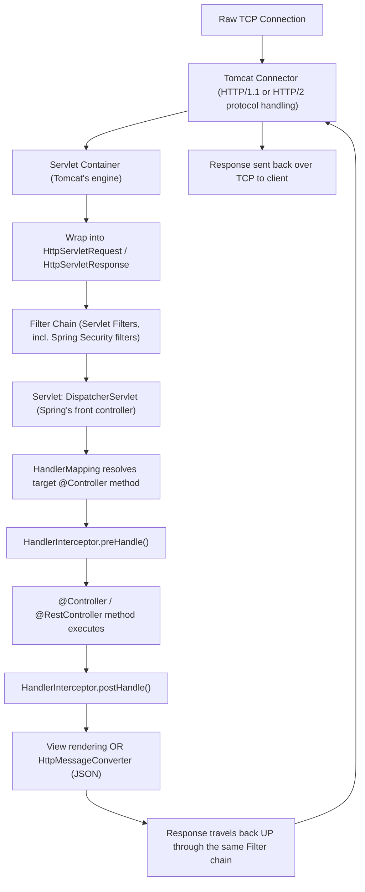

> [!TIP]
> Memorize the shape of this pipeline as **onion layers**: TCP → Connector → Filters → Servlet → (Spring internals: HandlerMapping → Interceptors → Controller) → back out through Interceptors → back out through Filters → Connector → TCP. Every layer can inspect, modify, short-circuit, or wrap the request/response as it passes through, in both directions.

---

# 1. Fundamentals (Beginner Level)

## 1.1 What Is a Servlet?

A Servlet is a Java class that handles HTTP requests inside a **Servlet Container** (Tomcat, Jetty, Undertow). It's the original, low-level building block of Java web applications — before Spring MVC existed, developers wrote raw Servlets directly.

```java
public class HelloServlet extends HttpServlet {

    @Override
    protected void doGet(HttpServletRequest req, HttpServletResponse resp) throws IOException {
        resp.setContentType("text/plain");
        resp.getWriter().write("Hello from a raw Servlet!");
    }
}
```

In a Spring Boot application, you almost never write a Servlet yourself — Spring Boot registers exactly **one** servlet for you: `DispatcherServlet`. Every `@RestController`/`@Controller` method you write runs *inside* that one servlet's request-handling logic, not as a separate servlet each.

## 1.2 Why Servlets and Filters Exist

| Problem | Servlet/Filter Answer |
|---|---|
| Need a standard Java API to handle raw HTTP requests | The Servlet API (`HttpServletRequest`/`HttpServletResponse`) |
| Need to run the same logic (auth, logging, compression) around *every* request, regardless of which handler serves it | Filters — pluggable, chainable, container-managed |
| Need a container to manage sockets, threads, and connection lifecycle so app code doesn't have to | Servlet Container (Tomcat) handles this |
| Need one place to route many different URLs to many different Java methods | Front Controller pattern (`DispatcherServlet` in Spring) |

## 1.3 Problems This Layer Solves

Understanding Servlets/Filters/the container matters because:

- It explains **where security actually happens** (Spring Security is implemented entirely as a chain of Servlet Filters).
- It explains **why order matters** — a logging filter placed after an authentication filter behaves very differently than one placed before it.
- It explains **what "the container" is doing** before your code ever runs (thread allocation, request parsing, connection keep-alive).
- It's the foundation for debugging: when a request "never reaches my controller," the answer is almost always "a filter stopped it first."

## 1.4 Real-World Analogy

Think of an office building's entrance process.

The **Servlet Container** is the building itself — it manages the doors, elevators, and floors (threads, connections, resources). **Filters** are the security checkpoints you must pass through in a fixed order before reaching any office: badge scanner (authentication filter), bag check (logging/compression filter), visitor sign-in (CORS filter). The **Servlet** (`DispatcherServlet`) is the building directory + receptionist that, once you're past all checkpoints, looks at exactly which office (which `@Controller` method) you need and sends you there. On the way out, you pass back through some of the same checkpoints (e.g., the bag check might inspect what you're carrying out — this is filters processing the *response*).

```text
TCP connection      = arriving at the building
Servlet Container   = the building (Tomcat)
Filters             = sequential security checkpoints (in a fixed, configured order)
DispatcherServlet   = receptionist routing you to the right office
@Controller method  = the actual office/person who helps you
Response            = you leaving, passing back through some checkpoints
```

## 1.5 Core Vocabulary

| Term | Meaning |
|---|---|
| Servlet Container | Runtime that manages Servlets, their lifecycle, and HTTP I/O (Tomcat, Jetty, Undertow) |
| Servlet | A Java class implementing `Servlet`/`HttpServlet` that handles requests |
| `HttpServletRequest` | Represents the incoming HTTP request (headers, body, params) |
| `HttpServletResponse` | Represents the outgoing HTTP response (status, headers, body) |
| Filter | A component that intercepts requests/responses before/after they reach a Servlet |
| `FilterChain` | The ordered sequence of Filters a request passes through |
| `DispatcherServlet` | Spring MVC's single front-controller Servlet that all requests go through |
| `HandlerMapping` | Resolves which controller method should handle a given URL |
| `HandlerInterceptor` | Spring-level (not Servlet-level) hook around controller invocation |
| Front Controller Pattern | Design pattern: one entry point routes to many handlers |

## 1.6 Basic Servlet Lifecycle

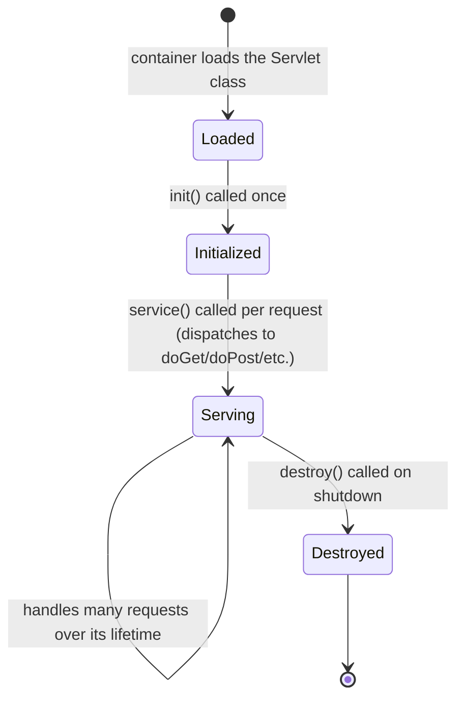

| Method | Called When |
|---|---|
| `init()` | Once, when the servlet is first loaded |
| `service()` | On every request; dispatches to `doGet`, `doPost`, `doPut`, `doDelete`, etc. |
| `destroy()` | Once, when the container shuts down or unloads the servlet |

> [!IMPORTANT]
> A single Servlet instance (including `DispatcherServlet`) is shared across **all concurrent requests** — the container calls `service()` on many threads concurrently against the same instance. This is why Servlets (and Spring `@Controller` beans, which are singletons by default) must not store per-request state in instance fields.

## 1.7 What Is a Filter?

```java
@Component
public class RequestLoggingFilter implements Filter {

    @Override
    public void doFilter(ServletRequest request, ServletResponse response, FilterChain chain)
            throws IOException, ServletException {

        long start = System.currentTimeMillis();
        chain.doFilter(request, response); // pass control to the next filter/servlet
        long duration = System.currentTimeMillis() - start;

        System.out.println("Request took " + duration + "ms");
    }
}
```

Key idea: a Filter can run code **before** calling `chain.doFilter(...)` (pre-processing), **after** it returns (post-processing), or both. It can also choose **not** to call `chain.doFilter(...)` at all — which stops the request from ever reaching the Servlet.

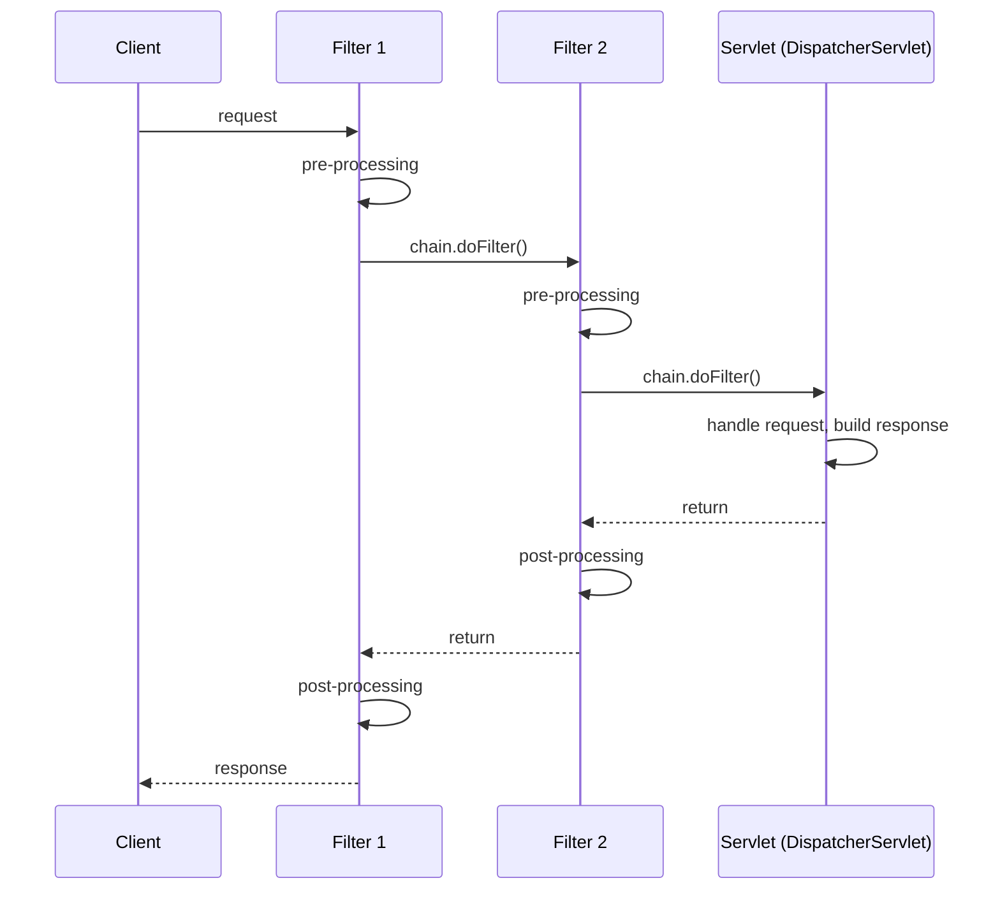

## 1.8 Basic Servlet vs. Filter Comparison

| Aspect | Servlet | Filter |
|---|---|---|
| Purpose | Handles the actual request and produces a response | Intercepts requests/responses around Servlet handling |
| Count per app | Typically one (`DispatcherServlet`) in Spring Boot | Many, chained in a defined order |
| Can short-circuit? | N/A (it's the endpoint) | Yes — simply don't call `chain.doFilter()` |
| Typical use | Business request handling (via Spring's `@Controller`s) | Auth, logging, CORS, compression, rate limiting |

## 1.9 A Minimal Spring Boot Registered Filter

```java
@Component
@Order(1)
public class CorrelationIdFilter extends OncePerRequestFilter {

    @Override
    protected void doFilterInternal(HttpServletRequest request, HttpServletResponse response,
                                     FilterChain filterChain) throws ServletException, IOException {
        String correlationId = UUID.randomUUID().toString();
        MDC.put("correlationId", correlationId);
        response.setHeader("X-Correlation-Id", correlationId);
        try {
            filterChain.doFilter(request, response);
        } finally {
            MDC.remove("correlationId");
        }
    }
}
```

`OncePerRequestFilter` (a Spring convenience base class) guarantees the filter runs exactly once per request even across internal forwards/includes, which the raw Servlet `Filter` interface does not guarantee by default.

---

# 2. Core Concepts (Intermediate Level)

## 2.1 Full Architecture: From TCP Socket to Controller and Back

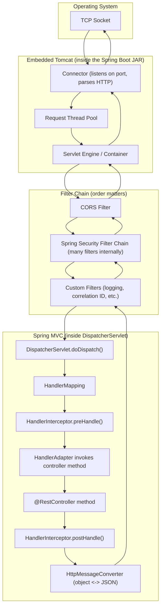

This is the complete picture: the OS hands a raw connection to Tomcat's **Connector**, which is served by a thread from Tomcat's **request thread pool**, processed through the **Filter chain** (where Spring Security lives), then dispatched into **Spring MVC's internal pipeline** inside the single `DispatcherServlet`, and finally the response retraces the same path outward.

## 2.2 The Servlet Container's Job (Tomcat)

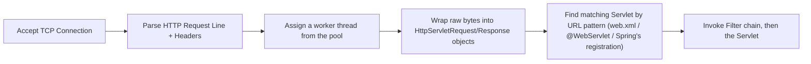

| Responsibility | Detail |
|---|---|
| Connection management | Accepting sockets, HTTP/1.1 keep-alive, HTTP/2 multiplexing |
| Thread pool management | Each request typically gets one thread for its duration (traditional Servlet model) |
| Request/response object creation | Translating raw bytes into `HttpServletRequest`/`HttpServletResponse` |
| Servlet/Filter lifecycle | Loading, initializing, and destroying Servlets and Filters |
| URL-to-Servlet mapping | Deciding which registered Servlet handles a given path |

> [!TIP]
> In a Spring Boot app there is (almost always) exactly **one** Servlet mapped to `/*`: `DispatcherServlet`. All URL-based routing you're used to (`@GetMapping("/orders/{id}")`) happens *inside* that one servlet, via Spring's own `HandlerMapping`, not via the container's URL-to-Servlet mapping.

## 2.3 Filter Ordering

```mermaid
flowchart LR
    Request["Incoming Request"] --> A["Filter A (@Order(1))"]
    A --> B["Filter B (@Order(2))"]
    B --> C["Filter C (@Order(3))"]
    C --> DS["DispatcherServlet"]
    DS --> C2["Filter C (post-processing)"]
    C2 --> B2["Filter B (post-processing)"]
    B2 --> A2["Filter A (post-processing)"]
    A2 --> Response["Outgoing Response"]
```

| Ordering Mechanism | Where Used |
|---|---|
| `@Order` annotation on a `@Component` `Filter` | Spring Boot auto-registered filters |
| `FilterRegistrationBean.setOrder(...)` | Explicit programmatic registration |
| `web.xml` `<filter-mapping>` order | Traditional (non-Boot) Servlet apps |
| Spring Security's internal chain order | Fixed, well-defined order among its ~15 default filters (see Advanced Concepts) |

> [!WARNING]
> Filter order is one of the most common sources of "why doesn't this work" bugs. A logging filter placed *before* an authentication filter logs unauthenticated requests too; placed *after*, it never sees requests that authentication rejected. A CORS filter placed after Spring Security may never get a chance to add headers to a request Security has already rejected.

## 2.4 `HttpServletRequest` and `HttpServletResponse`

```java
@Override
protected void doFilterInternal(HttpServletRequest request, HttpServletResponse response, FilterChain chain)
        throws ServletException, IOException {

    String path = request.getRequestURI();
    String method = request.getMethod();
    String authHeader = request.getHeader("Authorization");

    response.setHeader("X-Processed-By", "MyFilter");

    chain.doFilter(request, response);

    int status = response.getStatus();
}
```

| Object | Represents | Common Uses |
|---|---|---|
| `HttpServletRequest` | The incoming request | Reading headers, params, body, method, URI, attributes |
| `HttpServletResponse` | The outgoing response | Setting status codes, headers, writing the body |
| Request attributes (`setAttribute`/`getAttribute`) | Per-request data passed between filters/servlets | Correlation IDs, authenticated principal, timing data |

## 2.5 `DispatcherServlet`: Spring's Front Controller

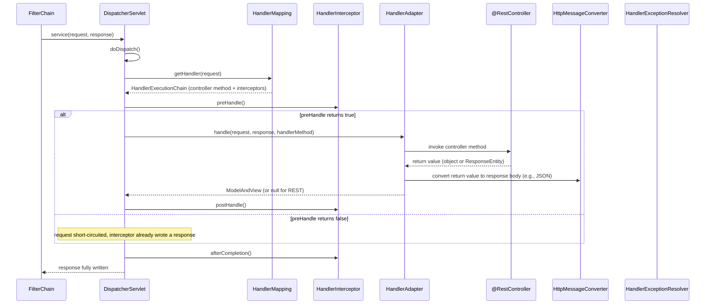

`DispatcherServlet` is the **only** Servlet in a typical Spring Boot app. It doesn't handle business logic itself — it orchestrates: find the right handler (`HandlerMapping`), run pre/post hooks (`HandlerInterceptor`), invoke the handler (`HandlerAdapter` calling your `@Controller` method), and convert the return value to an HTTP response (`HttpMessageConverter`).

## 2.6 Filters vs. Interceptors vs. `@ExceptionHandler`

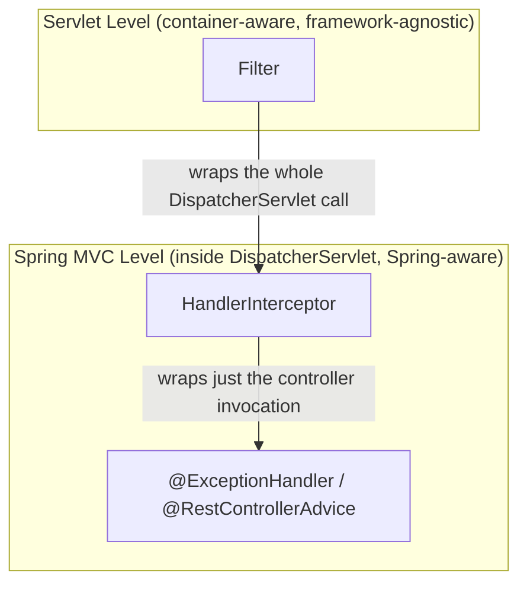

| Mechanism | Runs At | Has Access To |
|---|---|---|
| `Filter` | Before `DispatcherServlet` even starts, and after it fully finishes | Raw `HttpServletRequest`/`Response`; no knowledge of which controller will handle it |
| `HandlerInterceptor` | Inside `DispatcherServlet`, around the controller invocation | Knows the resolved handler method (can inspect `@Annotation`s on it) |
| `@ExceptionHandler`/`@RestControllerAdvice` | When a controller method throws | The exception itself; converts it into an HTTP error response |

```java
@Component
public class TimingInterceptor implements HandlerInterceptor {

    @Override
    public boolean preHandle(HttpServletRequest request, HttpServletResponse response, Object handler) {
        request.setAttribute("startTime", System.currentTimeMillis());
        return true; // false would stop processing here
    }

    @Override
    public void afterCompletion(HttpServletRequest request, HttpServletResponse response,
                                 Object handler, Exception ex) {
        long start = (long) request.getAttribute("startTime");
        System.out.println("Handled in " + (System.currentTimeMillis() - start) + "ms");
    }
}
```

## 2.7 Registering Filters and Interceptors in Spring Boot

```java
// Filters: auto-registered if annotated @Component, or explicitly:
@Bean
public FilterRegistrationBean<CorrelationIdFilter> correlationFilter() {
    FilterRegistrationBean<CorrelationIdFilter> registration = new FilterRegistrationBean<>();
    registration.setFilter(new CorrelationIdFilter());
    registration.addUrlPatterns("/*");
    registration.setOrder(1);
    return registration;
}
```

```java
// Interceptors: registered via WebMvcConfigurer
@Configuration
public class WebConfig implements WebMvcConfigurer {

    @Override
    public void addInterceptors(InterceptorRegistry registry) {
        registry.addInterceptor(new TimingInterceptor())
            .addPathPatterns("/api/**")
            .excludePathPatterns("/api/health");
    }
}
```

## 2.8 Request Body Reading: Why It Can Only Happen Once

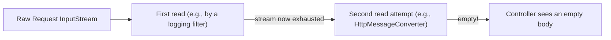

> [!WARNING]
> `HttpServletRequest`'s body is backed by a network input stream that can normally be **read only once**. If a Filter reads the body (e.g., to log it), the downstream `HttpMessageConverter` will find the stream already consumed, and `@RequestBody` deserialization can fail or silently produce an empty object. The fix is to wrap the request in a caching wrapper (`ContentCachingRequestWrapper`) that buffers the body so it can be read multiple times.

```java
public class LoggingFilter extends OncePerRequestFilter {

    @Override
    protected void doFilterInternal(HttpServletRequest request, HttpServletResponse response, FilterChain chain)
            throws ServletException, IOException {
        ContentCachingRequestWrapper wrappedRequest = new ContentCachingRequestWrapper(request);
        chain.doFilter(wrappedRequest, response);
        // now safe to read wrappedRequest.getContentAsByteArray() after the chain has run
    }
}
```

## 2.9 Async Servlets (Non-Blocking Request Handling)

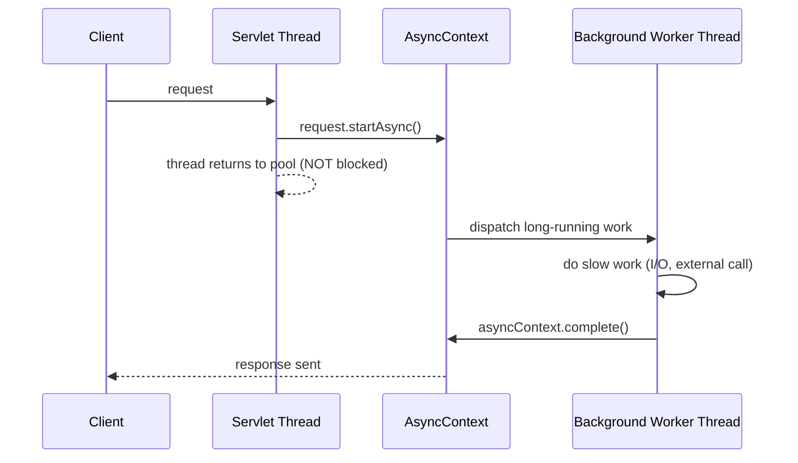

Standard Servlets hold a thread for the entire request duration. Async support (`request.startAsync()`, or Spring's `DeferredResult`/`Callable`/WebFlux) frees the container thread while slow work happens elsewhere, improving throughput under high concurrency with slow downstream calls.

## 2.10 Basic Testing of Filters and Interceptors

```java
@WebMvcTest(OrderController.class)
class CorrelationIdFilterTest {

    @Autowired
    private MockMvc mockMvc;

    @Test
    void addsCorrelationIdHeader() throws Exception {
        mockMvc.perform(get("/orders/1"))
            .andExpect(header().exists("X-Correlation-Id"));
    }
}
```

---

# 3. Advanced Concepts (Senior Level)

## 3.1 Spring Security's Filter Chain in Full Detail

Spring Security is **not** a separate mechanism from Servlet Filters — it *is* a chain of Servlet Filters, registered as a single `DelegatingFilterProxy`/`FilterChainProxy` in the main container filter chain, internally delegating to many specialized filters in a fixed order.

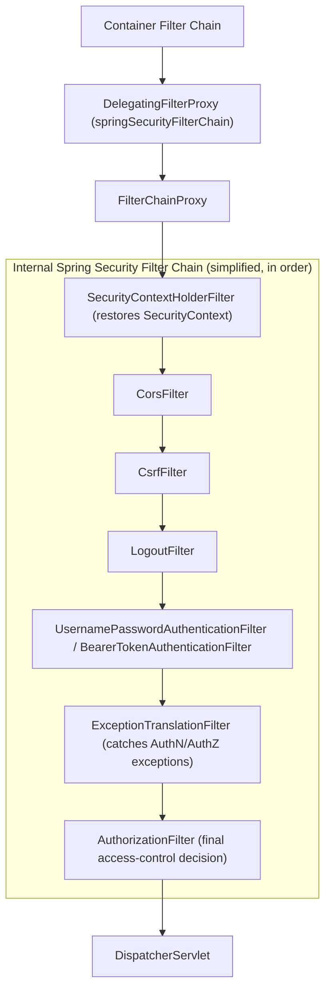

| Filter (simplified order) | Responsibility |
|---|---|
| `SecurityContextHolderFilter` | Loads/saves the `SecurityContext` (who is authenticated) for this request |
| `CorsFilter` | Applies CORS rules before anything else can reject the request |
| `CsrfFilter` | Validates CSRF tokens for state-changing requests (form-based apps) |
| Authentication filters (form login, Basic, Bearer/JWT) | Attempt to authenticate the request, populate the `SecurityContext` |
| `ExceptionTranslationFilter` | Catches `AuthenticationException`/`AccessDeniedException` thrown deeper in the chain and converts them to HTTP 401/403 |
| `AuthorizationFilter` | The last gate: checks whether the authenticated principal is allowed to access this specific request |

> [!IMPORTANT]
> Because `AuthorizationFilter` runs **last** in Spring Security's internal chain, authentication must succeed *before* it, or the request is rejected before ever reaching `DispatcherServlet` — which is exactly why a 401/403 response never shows any of your controller's logs: the request never got that far.

## 3.2 Full Combined Request Flow (Filters + Security + MVC)

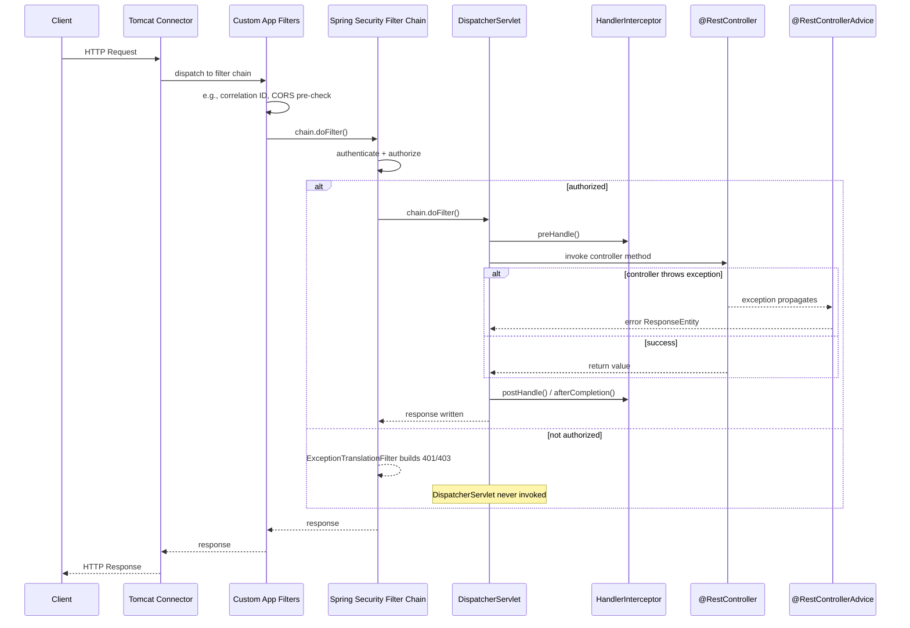

This is the complete real-world picture for a secured Spring Boot REST API: **not every request even reaches `DispatcherServlet`** — Spring Security can reject it several layers earlier.

## 3.3 Thread-Per-Request Model and Its Limits

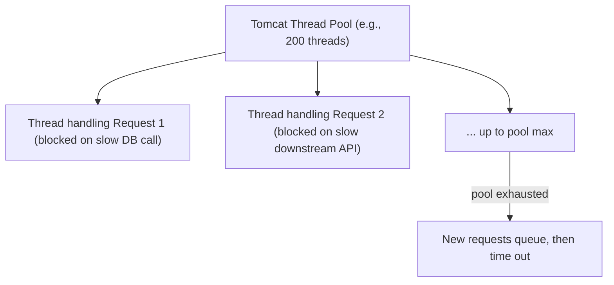

The traditional Servlet model dedicates one thread per in-flight request for its entire duration, including time spent waiting on slow I/O. Under high concurrency with slow dependencies, this can exhaust the thread pool even though the CPU itself is mostly idle (threads are just *waiting*).

| Mitigation | Approach |
|---|---|
| Increase thread pool size | Works up to a point; large pools add context-switching and memory overhead |
| Async Servlets / `DeferredResult` | Frees the container thread during slow I/O, resumes later |
| Reactive stack (Spring WebFlux + Netty) | Fundamentally non-blocking; one small thread pool handles many concurrent requests |
| Virtual threads (Java 21+, Spring Boot 3.2+) | Lets blocking code scale like async code, without rewriting it |

## 3.4 Exception Handling Across Layers

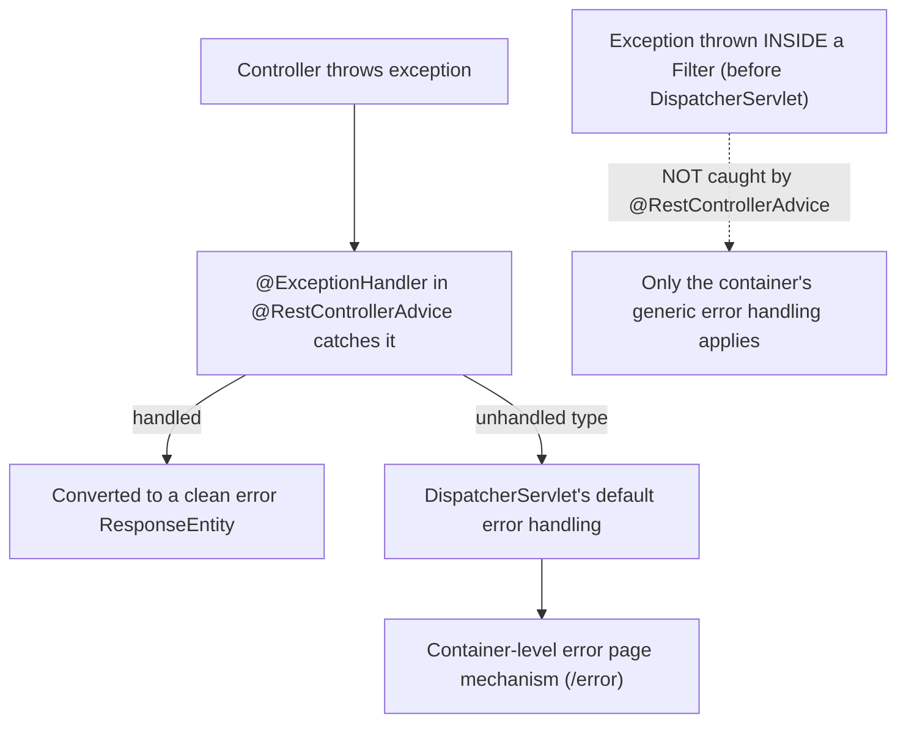

> [!WARNING]
> `@ExceptionHandler`/`@RestControllerAdvice` only catches exceptions thrown from **within** `DispatcherServlet`'s handling (i.e., from your controllers, interceptors' `preHandle`, etc.). An exception thrown inside a raw Servlet `Filter` — before the request ever reaches `DispatcherServlet` — bypasses `@RestControllerAdvice` entirely and falls back to the container's generic error page (`/error`). Filters must handle their own exceptions explicitly.

## 3.5 CORS: Where It Actually Gets Enforced

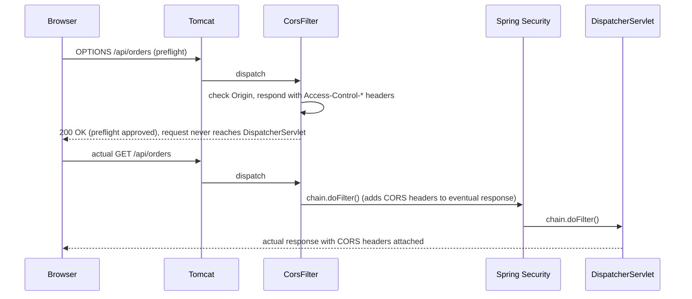

CORS preflight (`OPTIONS`) requests are typically answered entirely at the filter layer and never reach your controllers — a common source of confusion when developers look for `OPTIONS` handling in their `@RestController` and don't find it.

## 3.6 Multipart Requests and Filter Interaction

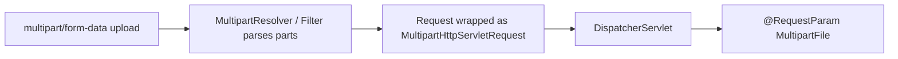

File uploads require a multipart-aware component to parse the request body into individual parts **before** `@RequestParam MultipartFile` binding can work in a controller — another example of a filter-layer concern that controllers implicitly depend on.

## 3.7 Failure Scenarios

| Failure | Symptom | Common Cause | Fix |
|---|---|---|---|
| Controller never invoked, no controller logs | Request silently rejected | An earlier filter (often Security) short-circuited the chain | Check filter order, check Security's authorization rules |
| Empty `@RequestBody` in controller | Deserialization produces empty/null object | A filter already consumed the input stream | Use `ContentCachingRequestWrapper` before reading the body in any filter |
| 401/403 with no `@RestControllerAdvice` formatting | Generic error page shown, not your custom error JSON | Spring Security rejected the request before `DispatcherServlet` | Add a custom `AuthenticationEntryPoint`/`AccessDeniedHandler` in Security config |
| Custom filter's exception produces ugly default error page | Bypasses `@RestControllerAdvice` | Exception thrown inside a `Filter`, not inside `DispatcherServlet`'s handling | Wrap filter logic in try/catch, build the error response manually |
| CORS headers missing on actual response despite working preflight | Browser blocks the response | CORS filter not applied consistently to both `OPTIONS` and the real request, or ordered after Security incorrectly | Ensure `CorsFilter`/`CorsConfigurationSource` is registered ahead of/integrated with Security |
| Duplicate log lines / filter runs twice | Same filter logic executes multiple times per request | Raw `Filter` used across an internal `forward()`/`include()` without `OncePerRequestFilter` | Extend `OncePerRequestFilter` instead of implementing `Filter` directly |
| Thread pool exhaustion under load | Requests hang/timeout even though CPU is idle | Thread-per-request model blocked on slow downstream calls | Async processing, virtual threads, or a reactive stack |
| Interceptor's `preHandle` runs but controller logic seems skipped | Response already committed by the interceptor | `preHandle` returned `false` after writing a response, intentionally short-circuiting | Confirm this was intentional (e.g., auth check); check for accidental `false` returns |

## 3.8 Security Considerations at This Layer

| Risk | Mitigation |
|---|---|
| Sensitive data logged by an overly broad logging filter | Redact headers like `Authorization`/`Cookie` before logging; never log raw request bodies containing PII |
| Filter order allowing unauthenticated access to sensitive endpoints | Explicitly test filter/security chain ordering; default-deny in Spring Security config |
| Reading and buffering large request bodies for logging | Cap buffered size (`ContentCachingRequestWrapper` has limits) to avoid memory pressure/DoS via huge payloads |
| CORS misconfigured to allow `*` with credentials | Configure explicit allowed origins; never combine wildcard origin with `allowCredentials(true)` |
| Verbose stack traces in default error responses | Configure a custom `/error` handler and disable `server.error.include-stacktrace` in production |

---

# 4. Real-World System Design Usage

## 4.1 Where This Architecture Shows Up in Production

- Every Spring Boot REST API, regardless of business domain, runs through this exact pipeline.
- API gateways built on Spring Cloud Gateway (or similar) apply the same filter-chain concept at a higher, cross-service level.
- Rate limiting, request logging, correlation ID propagation, and authentication are almost always implemented as Filters (not controller code) precisely because they must apply uniformly to every endpoint.

## 4.2 Production Request Pipeline (End-to-End, Including Infra)

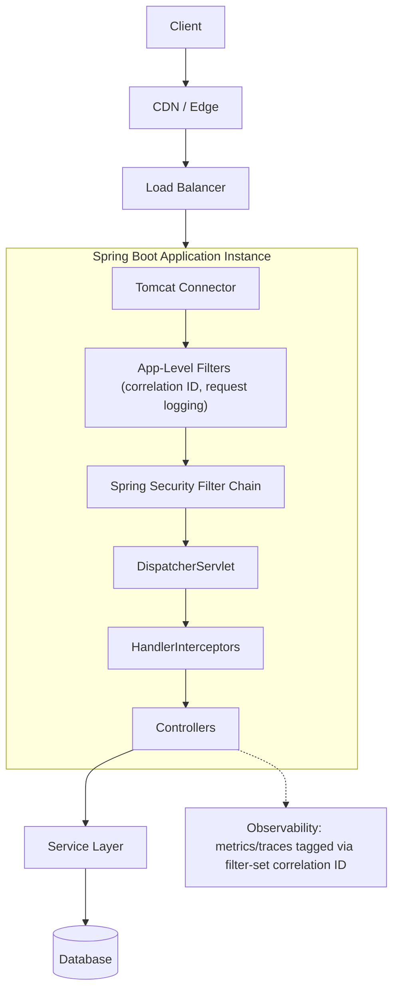

## 4.3 Big-Company Style Thinking

| Concern | Filter/Servlet-Layer Design Response |
|---|---|
| Reliability | Timeouts configured at the connector level; circuit breakers applied around downstream calls in the service layer, not filters |
| Scale | Async/virtual threads to avoid thread-per-request bottlenecks under high concurrency |
| Observability | Correlation ID filter tags every request; propagated into logs, metrics, and trace spans |
| Security | Centralized in the Spring Security filter chain, never duplicated ad hoc in individual controllers |
| Maintainability | Cross-cutting concerns live in filters/interceptors, keeping controllers focused on business logic |
| Performance | Response compression and caching headers often applied at the filter or gateway layer, not per-controller |

## 4.4 Example: Authenticated API Request, Full Trace

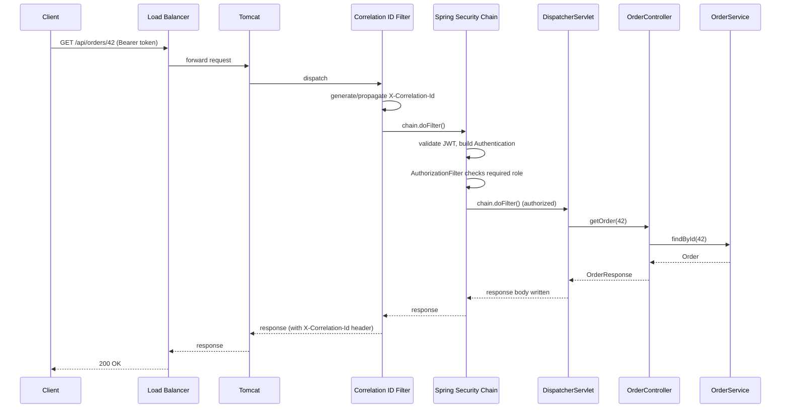

## 4.5 Integration with Other Systems

| System | Integration Point |
|---|---|
| API Gateway (Spring Cloud Gateway, Kong, Envoy) | Applies the same filter-chain concept before requests even reach an individual service |
| Observability (OpenTelemetry) | Trace context propagation typically implemented as a Filter or Interceptor |
| Rate limiting | Implemented as a Filter (e.g., Resilience4j `RateLimiter` wrapped in a Filter, or at the gateway) |
| Authentication providers (OAuth2/JWT issuers) | Validated inside Spring Security's authentication filters |
| Load balancers/reverse proxies (Nginx, ALB) | Sit in front of the Tomcat connector; often terminate TLS and add headers like `X-Forwarded-For` |

---

# 5. Interview Preparation

## 5.1 What Interviewers Expect

For this topic, interviewers usually expect:

- You can explain the full path a request takes, in order, from socket to controller and back.
- You know that Spring Security is implemented as Servlet Filters, not something separate.
- You understand the difference between Filters and `HandlerInterceptor`s.
- You can explain why request bodies can only be read once, and how to work around it.

For senior backend roles, they also expect:

- You can debug "request never reaches my controller" by reasoning about filter order.
- You understand the thread-per-request model's limitations and when async/reactive/virtual threads help.
- You know why exceptions thrown in filters aren't caught by `@RestControllerAdvice`.
- You can explain exactly where and how CORS preflight requests are handled.

## 5.2 Most Important Questions and Answers

### Q1. What is the first thing that touches an incoming HTTP request in a Spring Boot application?

The embedded Tomcat **Connector**, which accepts the raw TCP connection and parses the HTTP protocol, assigning the request to a worker thread from Tomcat's thread pool before any application code runs.

### Q2. What's the difference between a Filter and a Spring `HandlerInterceptor`?

A `Filter` is a Servlet API construct that wraps the entire call into `DispatcherServlet` — it runs before Spring even knows which controller will handle the request. A `HandlerInterceptor` is a Spring MVC construct running *inside* `DispatcherServlet`, after the target handler method has already been resolved, so it has more context (e.g., annotations on the handler method) but less reach (it can't intercept requests that never make it into `DispatcherServlet`).

### Q3. Is Spring Security a separate mechanism from Servlet Filters?

No — Spring Security is implemented entirely as a chain of Servlet Filters (registered via a single `DelegatingFilterProxy`/`FilterChainProxy` in the container's filter chain), internally composed of many specialized filters (authentication, CSRF, authorization, etc.) running in a fixed order.

### Q4. Why can you only read an `HttpServletRequest`'s body once?

The body is backed by the underlying network input stream, which is inherently forward-only and gets consumed as it's read. If a filter reads it for logging purposes without buffering it, later components (like `HttpMessageConverter` deserializing `@RequestBody`) find the stream already exhausted. The fix is wrapping the request in a `ContentCachingRequestWrapper` that buffers the body for repeated reads.

### Q5. If a request returns 403 Forbidden, will it show up in my controller's logs?

Not if Spring Security's `AuthorizationFilter` rejected it — that filter runs before `DispatcherServlet`, so the request never reaches your controller (or any `HandlerInterceptor`/`@RestControllerAdvice` tied to MVC). Only filter-level logging (if placed early enough in the chain) would capture it.

### Q6. How are CORS preflight (`OPTIONS`) requests typically handled?

Usually entirely at the filter layer (a `CorsFilter` or Spring Security's CORS integration) — the filter inspects the `Origin`/`Access-Control-Request-*` headers and responds directly with the appropriate `Access-Control-Allow-*` headers, without the request ever reaching `DispatcherServlet` or any `@RestController`.

### Q7. What does `chain.doFilter(request, response)` actually do inside a Filter?

It passes control to the next Filter in the chain (or to the Servlet itself if this is the last filter). Code before that call runs as pre-processing; code after it (once `doFilter` returns) runs as post-processing on the way back out. Not calling it at all short-circuits the entire chain.

### Q8. Why would you use `OncePerRequestFilter` instead of implementing `Filter` directly?

Raw Servlet `Filter`s can be invoked multiple times for a single client request if the request is internally forwarded or included (e.g., error dispatches, `RequestDispatcher.forward()`). `OncePerRequestFilter` guarantees your filter logic executes exactly once per actual client request, which is almost always the intended behavior.

### Q9. What is `DispatcherServlet`, and how many are there in a typical Spring Boot app?

`DispatcherServlet` is Spring MVC's front controller — the single Servlet that receives every web request and internally routes it to the correct `@Controller` method via `HandlerMapping`. A typical Spring Boot web application registers exactly one instance, mapped to `/`.

### Q10. Why might the thread-per-request model cause problems under load, even with plenty of CPU available?

Because each request holds a dedicated thread for its entire duration, including time spent blocked waiting on slow I/O (database calls, downstream HTTP calls). If enough requests are concurrently waiting on slow dependencies, the thread pool can be fully exhausted — new requests queue and time out — even though the CPU itself is mostly idle.

## 5.3 Tricky Questions

### If a `HandlerInterceptor.preHandle()` returns `false`, does the response still get sent?

Yes, but it's the interceptor's responsibility to have already written a complete response (e.g., a 401 with a body) before returning `false` — Spring won't write anything for you at that point; it simply stops the chain from proceeding to the controller.

### Can a Filter modify the response after the controller has already started writing to it?

Generally no, once bytes have been flushed to the client (response "committed"), headers/status can no longer be changed. This is why filters that need to modify response headers based on what the controller did (e.g., adding a header conditionally) often need to wrap the response in a buffering wrapper so nothing is committed prematurely.

### Why doesn't an exception thrown inside a custom Filter get formatted by my `@RestControllerAdvice`?

`@RestControllerAdvice` is registered with Spring MVC's exception resolution machinery, which only activates for exceptions occurring during `DispatcherServlet`'s handling (interceptors, controllers). An exception thrown inside a Filter happens entirely outside that machinery, so it falls through to the container's generic error handling instead.

### Does adding more filters always add proportional latency?

Not necessarily proportional, but each filter does add some overhead (method call, potential I/O like logging). The bigger risk is usually filters doing expensive synchronous work (e.g., unbounded body logging, synchronous external calls) rather than the mere count of filters.

## 5.4 Common Candidate Mistakes

- Describing Spring Security as something separate from Servlet Filters.
- Confusing Filters and `HandlerInterceptor`s, or using them interchangeably in explanations.
- Not knowing that `DispatcherServlet` is a single shared instance handling all routes.
- Assuming request bodies can always be read multiple times without special handling.
- Assuming `@RestControllerAdvice` catches all exceptions everywhere in the request lifecycle.
- Not knowing where CORS preflight requests are actually handled.
- Underestimating the thread-per-request model's scaling limits under slow-I/O-heavy workloads.

## 5.5 Interview Coding Checklist

- [ ] Correctly order filters relative to security/authentication filters.
- [ ] Use `OncePerRequestFilter` for custom filters, not raw `Filter`.
- [ ] Wrap requests/responses in caching wrappers before reading bodies more than once.
- [ ] Explain what part of the pipeline is responsible for a given cross-cutting concern (logging vs. auth vs. business exception mapping).
- [ ] Distinguish clearly between Filter-level and Interceptor-level responsibilities in a design answer.

---

# 6. Hands-On Thinking

## 6.1 Three Real-World Projects Exercising This Architecture

### Project 1: Correlation ID and Structured Logging Pipeline

Concepts:

- A custom `OncePerRequestFilter` generating/propagating a correlation ID.
- MDC-based structured logging tied to that ID.
- Verifying via `MockMvc` that the header is present on every response, including error responses.

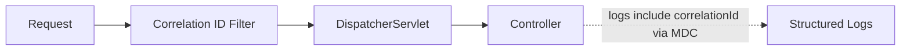

### Project 2: JWT Authentication Filter Chain

Concepts:

- A custom `AbstractAuthenticationProcessingFilter` (or `OncePerRequestFilter`) validating a bearer JWT.
- Populating `SecurityContextHolder` so downstream `@PreAuthorize` checks work.
- Custom `AuthenticationEntryPoint` returning a clean JSON 401 body instead of the default error page.

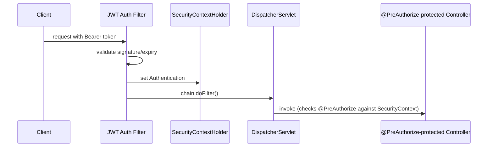

### Project 3: Request/Response Audit Logging with Body Capture

Concepts:

- `ContentCachingRequestWrapper` / `ContentCachingResponseWrapper` to safely log both request and response bodies without breaking downstream reads.
- Redaction logic for sensitive headers/fields before logging.
- Applied selectively via `addPathPatterns`/`excludePathPatterns` to avoid logging health-check noise.

```mermaid
flowchart LR
    Request --> Wrap["Wrap request+response in caching wrappers"]
    Wrap --> DS["DispatcherServlet processes normally"]
    DS --> Wrap
    Wrap --> AuditLog["Log redacted request/response bodies after chain completes"]
```

## 6.2 Step-by-Step Design Approach

For any Filter/Interceptor design task:

1. Decide whether the concern must apply to *every* request regardless of routing (→ Filter) or needs knowledge of the resolved handler (→ Interceptor).
2. Decide where in the filter order it must sit relative to security (before, to run unconditionally; after, to run only for authenticated/authorized requests).
3. If the filter needs to read the body, wrap the request in a caching wrapper first.
4. Handle exceptions inside the filter explicitly — don't rely on `@RestControllerAdvice`.
5. Use `OncePerRequestFilter` unless you have a specific reason not to.
6. Test with `MockMvc` including both success and rejected (e.g., 401/403) paths, since behavior often differs sharply between them.
7. Verify performance impact under load if the filter does any synchronous I/O (logging to disk/network).

## 6.3 Production Implementation Approach

```mermaid
flowchart TD
    A["Identify the cross-cutting concern"] --> B["Choose Filter vs. Interceptor"]
    B --> C["Determine filter chain position"]
    C --> D["Handle body-reading safely if needed"]
    D --> E["Handle exceptions locally within the filter"]
    E --> F["Write tests: success path + short-circuited/rejected path"]
    F --> G["Load test if the filter does synchronous I/O"]
    G --> H["Deploy with observability on filter-added latency"]
```

## 6.4 Production Readiness Example

For a Filter/Interceptor added to a production service, define:

- Explicit `@Order` (or registration order) relative to security and other filters, documented in code.
- Tests covering both the happy path and short-circuited paths (auth rejection, validation failure).
- Explicit handling of request/response body caching if the filter reads bodies.
- Bounded/limited logging (no unbounded body logging, redacted sensitive headers).
- Metrics or timing added around any filter doing non-trivial work, so its latency contribution is visible.

---

# 7. Deep Dive (Optional but Important)

## 7.1 Tomcat Connector Internals

```mermaid
flowchart TB
    Socket["Client Socket"] --> Acceptor["Acceptor Thread (accepts new connections)"]
    Acceptor --> Poller["Poller (NIO: monitors sockets for readiness)"]
    Poller --> Exec["Executor (worker thread pool processes ready requests)"]
    Exec --> Processor["Http11Processor parses the HTTP request"]
    Processor --> Adapter["CoyoteAdapter bridges to Servlet API"]
    Adapter --> Container["Servlet Container invokes Filters/Servlet"]
```

Modern Tomcat uses a non-blocking I/O (NIO) acceptor/poller pair to efficiently detect which of many open sockets have data ready, only then handing that connection off to a worker thread from the executor pool for actual request processing — this is why Tomcat can hold many idle keep-alive connections without needing a thread per idle connection, even though it still uses one thread per *actively processing* request.

## 7.2 `ServletRequest` Wrapping Chain

```mermaid
flowchart LR
    Raw["Raw Coyote Request"] --> HttpReq["Base HttpServletRequest (RequestFacade)"]
    HttpReq --> Wrap1["ContentCachingRequestWrapper (if added by a filter)"]
    Wrap1 --> Wrap2["Multipart wrapper (if multipart/form-data)"]
    Wrap2 --> Final["Final request object seen by DispatcherServlet/Controller"]
```

The `HttpServletRequestWrapper`/`HttpServletResponseWrapper` classes exist specifically so filters can decorate the request/response with additional behavior (caching, wrapping streams) while still satisfying the `HttpServletRequest`/`HttpServletResponse` interface contract for everything downstream.

## 7.3 `DispatcherServlet.doDispatch()` Internals

```text
doDispatch(request, response):
    handler = getHandler(request)                      // HandlerMapping lookup
    interceptors = handler.getInterceptors()
    for interceptor in interceptors: interceptor.preHandle(...)
    handlerAdapter = getHandlerAdapter(handler)
    mv = handlerAdapter.handle(request, response, handler)   // invokes your @Controller method
    for interceptor in reversed(interceptors): interceptor.postHandle(...)
    processDispatchResult(...)                          // render view OR (for REST) already written by HttpMessageConverter
    for interceptor in reversed(interceptors): interceptor.afterCompletion(...)
```

Note the *reversed* order for `postHandle`/`afterCompletion` — interceptors run "onion-style" just like filters: first-in on the way in, last-out on the way out.

## 7.4 `HttpMessageConverter`: How Java Objects Become JSON

```mermaid
flowchart LR
    Controller["Controller returns OrderResponse object"] --> Negotiation["Content negotiation (Accept header)"]
    Negotiation --> Converter["MappingJackson2HttpMessageConverter selected"]
    Converter --> Serialize["Jackson serializes object to JSON bytes"]
    Serialize --> Write["Bytes written to HttpServletResponse output stream"]
```

`@RestController` (`@Controller` + `@ResponseBody`) tells Spring the return value should be converted directly to the response body rather than treated as a view name — `HttpMessageConverter` implementations (Jackson for JSON by default) perform that conversion based on content negotiation with the client's `Accept` header.

## 7.5 Virtual Threads and the Modern Thread Model

```mermaid
flowchart TB
    subgraph Traditional["Traditional: Platform Threads"]
        PT1["Platform Thread 1 - blocked on DB call"]
        PT2["Platform Thread 2 - blocked on DB call"]
        PTN["... limited by OS thread cost"]
    end
    subgraph Modern["Java 21+ Virtual Threads"]
        VT1["Virtual Thread 1 - blocked on DB call"]
        VT2["Virtual Thread 2 - blocked on DB call"]
        VTN["... thousands, cheaply, on a small carrier thread pool"]
    end
```

With Spring Boot 3.2+ on Java 21+, enabling virtual threads (`spring.threads.virtual.enabled=true`) lets the same blocking Servlet code (including all the Filters/Interceptors/Controllers described in this guide) scale to far higher concurrency, because blocked virtual threads don't tie up a scarce OS thread the way platform threads do — without rewriting any code in a reactive style.

## 7.6 Debugging Tools

| Tool/Technique | Purpose |
|---|---|
| `logging.level.org.springframework.web=DEBUG` | Logs `DispatcherServlet`'s handler resolution and dispatch decisions |
| `logging.level.org.springframework.security=DEBUG` | Logs each Spring Security filter's decision for a request |
| `/actuator/threaddump` | Reveals threads blocked in filters/controllers during a hang |
| Adding a temporary logging `Filter` at `@Order(Ordered.HIGHEST_PRECEDENCE)` | Confirms whether a request reaches the app filter chain at all |
| Browser DevTools Network tab | Distinguishes preflight (`OPTIONS`) from actual requests when debugging CORS |
| `curl -v` | Inspect raw headers/status to see exactly what layer produced a given response |

---

# Production Checklists

## Code Quality Checklist

- [ ] Custom filters extend `OncePerRequestFilter`, not raw `Filter`.
- [ ] Filter order (`@Order`) is explicit and documented, especially relative to Spring Security.
- [ ] Any filter reading the request/response body uses caching wrappers.
- [ ] Exceptions inside filters are caught and handled explicitly, not left to propagate to the container default.
- [ ] Cross-cutting concerns (auth, logging, correlation IDs) live in filters/interceptors, not duplicated in controllers.

## Performance Checklist

- [ ] Filters avoid unbounded/synchronous expensive work (e.g., full-body logging without limits).
- [ ] Thread pool (Tomcat) sized relative to expected concurrency and downstream call latency.
- [ ] Async processing or virtual threads considered for high-concurrency, slow-I/O workloads.
- [ ] Response compression enabled where appropriate at the connector/filter layer.

## Security Checklist

- [ ] Spring Security filter chain order verified (authentication before authorization, both before business logic).
- [ ] Sensitive headers (Authorization, Cookie) redacted from any logging filter.
- [ ] CORS configured with explicit origins, never wildcard combined with credentials.
- [ ] Custom `AuthenticationEntryPoint`/`AccessDeniedHandler` configured for clean, non-leaky error responses.
- [ ] Stack traces disabled in production error responses.

## Debugging Checklist

- [ ] Reproduce with `DEBUG` logging on `org.springframework.web` and `org.springframework.security`.
- [ ] Confirm whether the request even reaches `DispatcherServlet` (filter-level logging) before assuming a controller bug.
- [ ] Check filter order when a cross-cutting concern behaves inconsistently.
- [ ] Check for body-stream-already-consumed issues when `@RequestBody` unexpectedly appears empty.
- [ ] Distinguish preflight vs. actual requests when debugging CORS issues.

---

# Learning Roadmap

## Phase 1: Beginner

Learn:

- What a Servlet is and its lifecycle (`init`/`service`/`destroy`).
- What a Filter is and the `chain.doFilter()` contract.
- Basic `HttpServletRequest`/`HttpServletResponse` usage.
- That `DispatcherServlet` is Spring's single front-controller Servlet.

Practice:

- Write a simple raw Servlet and a simple `OncePerRequestFilter` in a Spring Boot app.

## Phase 2: Intermediate

Learn:

- Filter ordering and registration (`@Order`, `FilterRegistrationBean`).
- `HandlerInterceptor` vs. Filter distinctions.
- `HttpMessageConverter` and content negotiation.
- Basic Spring Security filter chain concepts.

Practice:

- Build a correlation ID filter plus a timing interceptor in the same app; observe execution order via logs.

## Phase 3: Advanced

Learn:

- Full Spring Security internal filter chain and ordering.
- Request/response body caching and its necessity.
- Exception handling boundaries (`@RestControllerAdvice` vs. filter-level exceptions).
- Thread-per-request model limits.

Practice:

- Implement a JWT authentication filter with a custom `AuthenticationEntryPoint`.
- Diagnose an intentionally-broken filter order and fix it.

## Phase 4: Production Backend Engineer

Learn:

- Tomcat connector internals (acceptor/poller/executor).
- Virtual threads and their impact on the traditional thread-per-request model.
- Building production-grade audit logging with safe body capture.
- Debugging tools for tracing exactly where a request was rejected or slowed.

Practice:

- Production-style secured service with correlation IDs, audit logging, JWT auth, and virtual threads enabled, load tested under realistic concurrency.

---

# Self-Review Completion Loop

The topic was reviewed against:

- Jakarta Servlet Specification concepts (Servlet/Filter lifecycle, request/response contracts).
- Spring Framework and Spring Security reference documentation (DispatcherServlet internals, filter chain composition).
- Common production incident patterns (body-already-consumed, filter order bugs, thread pool exhaustion).
- Interview patterns for beginner through senior backend roles focused on the web layer.

## Gap Review Matrix

| Area | Covered? | Notes |
|---|---|---|
| Servlet lifecycle | Yes | `init`/`service`/`destroy`, singleton-per-container instance |
| Filter fundamentals | Yes | `chain.doFilter()`, pre/post processing, short-circuiting |
| Full request pipeline diagram | Yes | TCP → Connector → Filters → DispatcherServlet → Controller and back |
| DispatcherServlet internals | Yes | `doDispatch()` pseudocode, sequence diagram |
| Filters vs. Interceptors vs. `@ExceptionHandler` | Yes | Clear boundary table and diagrams |
| Spring Security filter chain | Yes | Full internal filter ordering diagram |
| Body-read-once problem | Yes | Diagram, code fix with `ContentCachingRequestWrapper` |
| CORS handling location | Yes | Sequence diagram showing preflight handled at filter layer |
| Exception handling boundaries | Yes | Why filter exceptions bypass `@RestControllerAdvice` |
| Thread-per-request model and limits | Yes | Diagram, virtual threads as modern mitigation |
| Tomcat connector internals | Yes | Acceptor/poller/executor deep dive |
| Failure scenarios | Yes | Eight concrete production failure patterns with fixes |
| Security considerations | Yes | Logging redaction, CORS misconfig, verbose errors |
| Interview prep | Yes | Common and tricky questions, candidate mistakes |
| Hands-on projects | Yes | Three realistic projects with diagrams |
| Diagram depth | Yes | Mermaid diagrams throughout every major section, as requested |

No significant gaps remain for the requested scope: the full architecture of how a request arrives, is filtered, dispatched, handled, and returned in a Java/Spring Boot application. Further specialization should split into separate deep dives: **Spring Security Deep Dive (OAuth2/JWT internals)**, **Reactive Spring (WebFlux request model)**, **Tomcat Tuning and Connector Configuration**, and **API Gateway Filter Chains at Scale**.

---

# Official References

- Jakarta Servlet Specification: <https://jakarta.ee/specifications/servlet/>
- Spring Framework Web MVC Reference (DispatcherServlet): <https://docs.spring.io/spring-framework/reference/web/webmvc/mvc-servlet.html>
- Spring Security Reference (Servlet Filter Architecture): <https://docs.spring.io/spring-security/reference/servlet/architecture.html>
- Apache Tomcat Documentation: <https://tomcat.apache.org/tomcat-10.1-doc/index.html>
- Spring Boot Reference (Embedded Web Servers): <https://docs.spring.io/spring-boot/reference/web/servlet.html>

---

## Final Summary

Every request into a Java/Spring Boot application follows one predictable pipeline: Tomcat's Connector accepts the raw connection, a Filter chain (which is exactly where Spring Security lives) processes it in a strict, configurable order, and — if it survives — a single `DispatcherServlet` resolves the right controller method, runs it through `HandlerInterceptor`s, and converts the result to an HTTP response via `HttpMessageConverter`s, before the response retraces the same path back out through the filters to the client. Production mastery of this layer means knowing exactly which component is responsible for any given cross-cutting concern, understanding why request bodies can only be read once, recognizing that a "missing" controller log usually means a filter rejected the request first, and knowing when the traditional thread-per-request model needs help (async, virtual threads, or a reactive stack) under real concurrency.
