# ⚖️ JPA vs Hibernate — Complete Beginner-to-Expert Reference

> Untangling the most misunderstood pair in Java persistence — a specification versus its most popular implementation, and why the distinction actually matters in production.

---

## 📑 Table of Contents

1. [Executive Summary](#-executive-summary)
2. [Fundamentals (Beginner)](#1--fundamentals-beginner-level)
3. [Core Concepts (Intermediate)](#2--core-concepts-intermediate-level)
4. [Advanced Concepts (Senior)](#3--advanced-concepts-senior-level)
5. [Real-World System Design](#4--real-world-system-design-usage)
6. [Interview Preparation](#5--interview-preparation)
7. [Hands-On Projects](#6--hands-on-projects)
8. [Deep Dive: Internals](#7--deep-dive-internals)
9. [Production Checklists](#-production-checklists)
10. [Learning Roadmap](#-learning-roadmap)
11. [Self-Review Completion Loop](#-self-review-completion-loop)
12. [Official References](#-official-references)
13. [Final Summary](#-final-summary)

---

## 🎯 Executive Summary

**JPA (Jakarta Persistence API)** is a *specification* — a set of interfaces and rules defining how Java object-relational mapping should work. **Hibernate** is the most popular *implementation* of that specification (and much more). JPA is the "what"; Hibernate is a "how."

| | JPA | Hibernate |
|---|---|---|
| **What it is** | Specification (interfaces + rules) | Implementation (actual working library) |
| **Can it run alone?** | ❌ No — needs a provider | ✅ Yes |
| **Analogy** | The interface | The concrete class |
| **Package** | `jakarta.persistence.*` | `org.hibernate.*` |
| **Ships as** | `jakarta.persistence-api` (just interfaces) | `hibernate-core` (the engine) |

> [!IMPORTANT]
> The single most important thing to internalize: **JPA is a specification; Hibernate is an implementation of that specification.** JPA cannot *do* anything by itself — it's just interfaces (`EntityManager`, `@Entity`, `@Query`). You always need a **provider** (Hibernate, EclipseLink, OpenJPA) to actually talk to the database. When you use "JPA," Hibernate is usually the engine running underneath. This guide is the conceptual companion to your deeper [[09 Java Hibernate]] guide.

Related guides: [[09 Java Hibernate]] · [[05 Spring Boot]] · [[06 Spring Boot Annotations]] · [[02 Postgres]] · [[01 Basic Java]] · [[02 Design Patterns]]

---

## 1. 🌱 FUNDAMENTALS (Beginner Level)

### What is the difference, in simple terms?

Think of an **electrical wall socket standard**. The *standard* (JPA) says "sockets must have this shape, this voltage, these pin positions." Manufacturers (Hibernate, EclipseLink) build *actual sockets* that follow the standard. Your appliance (your code) plugs into the standard shape — so you could swap one manufacturer's socket for another's without changing your appliance.

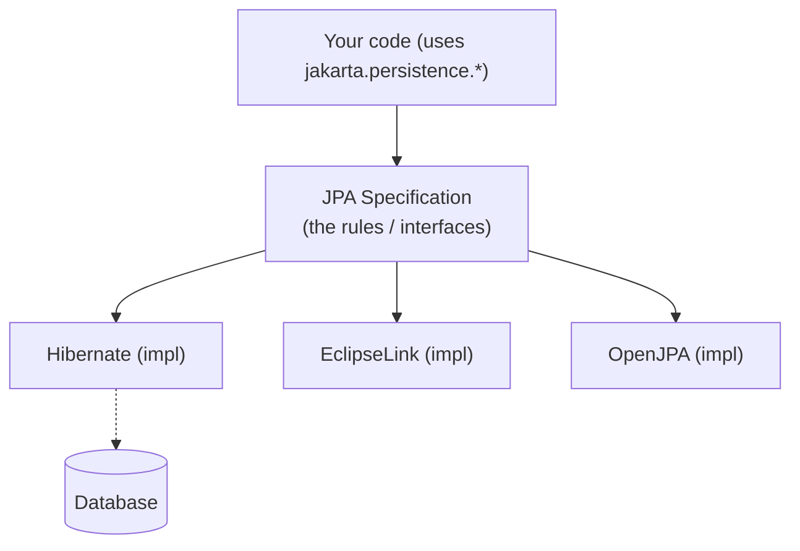

### Why does this distinction exist?

Before JPA, every ORM library (Hibernate, TopLink, JDO) had its **own proprietary API**. Code written for Hibernate was locked to Hibernate. To promote portability, Sun standardized the good ideas (largely inspired by Hibernate itself!) into the **JPA specification** (2006). Now you code against the *standard*, and providers compete on implementation quality.

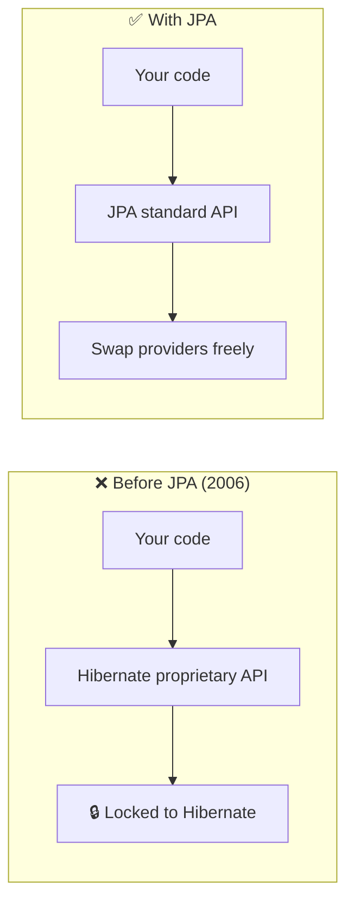

### What each one actually is

| | JPA | Hibernate |
|---|---|---|
| **Nature** | A document + a JAR of interfaces | A full ORM engine (~thousands of classes) |
| **Provides** | Annotations, `EntityManager` interface, JPQL, rules | Session, dialects, caching, actual SQL generation, connection handling |
| **Maintained by** | Jakarta EE (formerly Java EE / Sun/Oracle) | Red Hat / Hibernate team |
| **History** | JPA 1.0 (2006) → Jakarta Persistence 3.x | Predates JPA (2001); inspired JPA |
| **Analogy** | `List` interface | `ArrayList` implementation |

### The relationship visualized

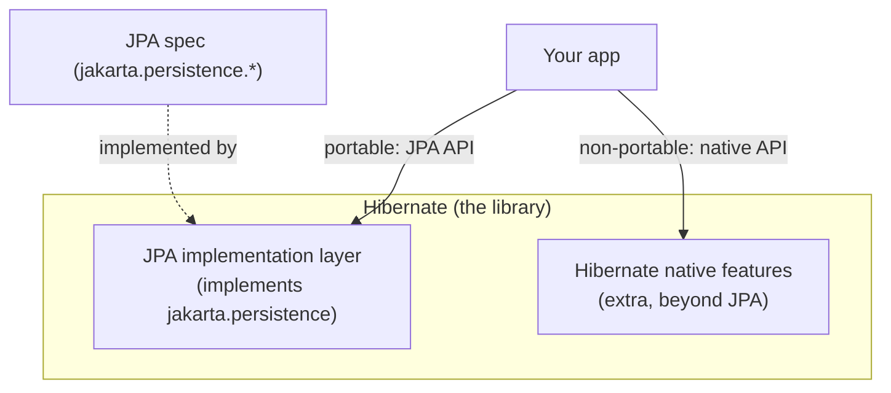

> [!TIP]
> Hibernate is a **superset** of JPA. It fully implements the JPA spec *and* adds extra features JPA doesn't define (multi-tenancy, `@NaturalId`, richer fetch controls, filters, custom SQL). So "use JPA vs use Hibernate" isn't really either/or — you use the **JPA API**, running on the **Hibernate engine**, and *optionally* dip into Hibernate-specific features when you need them (at the cost of portability).

### Real-world analogy 🔌

- **JPA** = the **USB standard**. It defines the shape, the protocol, the pins.
- **Hibernate** = a specific company's **USB cable/port** that follows the standard — but also has some bonus features (fast-charge) the base standard doesn't require.
- **Your laptop** (your code) has a USB port (uses the JPA API). You can plug in any compliant cable. If you use the bonus fast-charge feature (Hibernate-native API), you're now dependent on *that* cable.

> [!TIP]
> The mental model that clears up all confusion: **you rarely choose "JPA or Hibernate" — you choose "which JPA *provider*," and the answer is almost always Hibernate.** The real decision is: *do I stick to portable JPA APIs, or use Hibernate-specific power features?* Prefer JPA APIs; reach for native Hibernate only when JPA genuinely can't express what you need.

---

## 2. 🧩 CORE CONCEPTS (Intermediate Level)

### 2.1 The Layered Picture

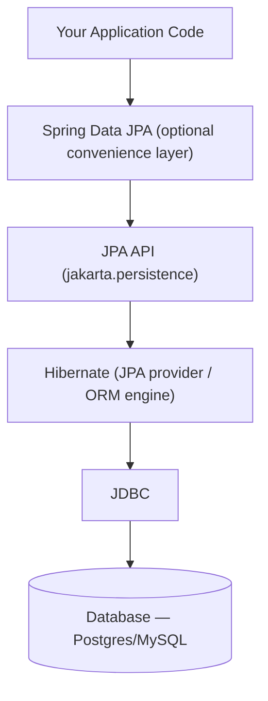

There are often **four** layers people conflate:

| Layer | What it is | Example |
|---|---|---|
| **Spring Data JPA** | Convenience abstraction over JPA (repositories) | `interface UserRepo extends JpaRepository<User, Long>` |
| **JPA** | The persistence specification | `EntityManager`, `@Entity`, JPQL |
| **Hibernate** | The JPA provider (implementation) | `SessionFactory`, dialects, SQL generation |
| **JDBC** | Low-level DB connectivity | `Connection`, `PreparedStatement` |

> [!WARNING]
> **Spring Data JPA is NOT JPA, and JPA is NOT Hibernate** — three different things people constantly mix up. **Spring Data JPA** generates repository implementations for you; it sits *on top of* JPA. **JPA** is the spec. **Hibernate** implements the spec and ultimately calls **JDBC**. When someone says "I use JPA," they usually mean "Spring Data JPA → JPA API → Hibernate → JDBC → my DB." Knowing which layer you're at is essential for debugging (see [[09 Java Hibernate]]).

### 2.2 The Same Code, Two APIs

**Pure JPA API** (portable):

```java
import jakarta.persistence.*;

@Entity
public class User {
    @Id @GeneratedValue(strategy = GenerationType.IDENTITY)
    private Long id;
    private String name;
}

// Using the JPA EntityManager (works on ANY provider)
EntityManager em = emf.createEntityManager();
em.getTransaction().begin();
User user = em.find(User.class, 1L);
em.persist(new User());
em.getTransaction().commit();
```

**Hibernate native API** (non-portable, more features):

```java
import org.hibernate.Session;

// Using the Hibernate Session directly
Session session = sessionFactory.openSession();
session.beginTransaction();
User user = session.get(User.class, 1L);
session.save(new User());   // Hibernate-specific
session.getTransaction().commit();
```

| JPA concept | Hibernate equivalent |
|---|---|
| `EntityManager` | `Session` |
| `EntityManagerFactory` | `SessionFactory` |
| `Persistence Context` | first-level cache (same idea) |
| `persist()` | `save()` / `persist()` |
| `merge()` | `update()` / `merge()` |
| JPQL | HQL (Hibernate Query Language — a superset) |
| `@Entity`, `@Id` (jakarta) | same annotations (Hibernate implements them) |

> [!TIP]
> Under the hood, JPA's `EntityManager` in a Hibernate setup is literally **wrapping a Hibernate `Session`** — you can even unwrap it: `Session s = em.unwrap(Session.class)` to access native features while staying mostly on the JPA API. This "escape hatch" is the pragmatic middle path: JPA everywhere, unwrap to Hibernate only where necessary.

### 2.3 What JPA Defines vs What Hibernate Adds

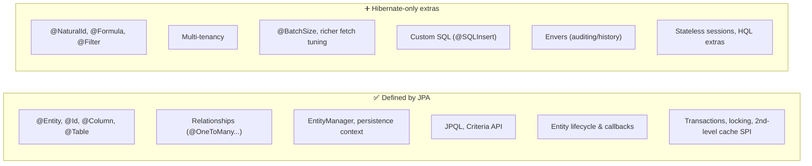

| Feature | JPA | Hibernate |
|---|---|---|
| Basic mapping & CRUD | ✅ | ✅ |
| JPQL / Criteria | ✅ | ✅ (+ HQL extras) |
| Second-level cache | ✅ (SPI only) | ✅ (integrations) |
| `@NaturalId` | ❌ | ✅ |
| `@Formula` (computed columns) | ❌ | ✅ |
| Multi-tenancy | ❌ | ✅ |
| Envers (entity versioning/audit) | ❌ | ✅ |
| Custom DML (`@SQLDelete`) | ❌ | ✅ |
| Stateless session | ❌ | ✅ |

### 2.4 Configuration: `persistence.xml` vs Spring Boot

**Classic JPA** (`persistence.xml` — provider named explicitly):

```xml
<persistence-unit name="myPU">
  <!-- Hibernate is the chosen JPA provider -->
  <provider>org.hibernate.jpa.HibernatePersistenceProvider</provider>
  <properties>
    <property name="jakarta.persistence.jdbc.url" value="jdbc:postgresql://..."/>
    <property name="hibernate.dialect" value="org.hibernate.dialect.PostgreSQLDialect"/>
  </properties>
</persistence-unit>
```

**Spring Boot** (auto-configures Hibernate as the provider):

```properties
spring.jpa.hibernate.ddl-auto=validate
spring.jpa.properties.hibernate.dialect=org.hibernate.dialect.PostgreSQLDialect
spring.jpa.show-sql=true
```

> [!IMPORTANT]
> Notice: even in a "JPA" configuration, you **explicitly name Hibernate as the provider** and set **`hibernate.*` properties**. This is the practical reality — "using JPA" almost always means "using Hibernate through the JPA API." Spring Boot's `spring-boot-starter-data-jpa` bundles Hibernate by default, which is why most Java developers use Hibernate without consciously choosing it. See [[05 Spring Boot]] for the auto-configuration.

### 2.5 JPQL vs HQL

```java
// JPQL (JPA standard) — object-oriented query language
"SELECT u FROM User u WHERE u.age > :age"

// HQL (Hibernate) — a superset of JPQL with extra features
"SELECT u FROM User u WHERE u.age > :age ORDER BY u.name NULLS LAST"
//                                                        ^ HQL extension
```

Both query **entities and their fields** (not tables and columns like raw SQL). **HQL is a superset of JPQL** — all JPQL is valid HQL, but HQL adds Hibernate-specific capabilities. Sticking to JPQL keeps you portable.

---

## 3. ⚙️ ADVANCED CONCEPTS (Senior Level)

### 3.1 The Portability Question — Does It Actually Matter?

The theoretical selling point of JPA is **provider portability** (swap Hibernate for EclipseLink). In practice:

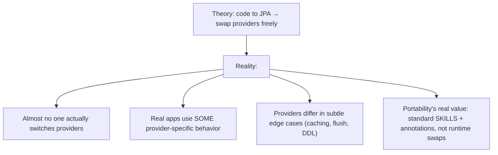

> [!WARNING]
> **Provider portability is largely a myth in practice.** Real applications inevitably rely on some provider-specific behavior — Hibernate's flush timing, its DDL generation quirks, `@NaturalId`, batch fetching, or subtle differences in how `merge`/cascade behave. Migrating a mature app from Hibernate to EclipseLink is rarely painless. The *genuine* value of JPA isn't runtime swappability — it's a **standard set of annotations and concepts** that every Java dev knows, and the discipline of coding to an interface ([[02 Design Patterns]]). Don't cripple yourself avoiding all Hibernate features for a swap that will never happen — but *do* prefer JPA APIs where they suffice.

### 3.2 When to Use Native Hibernate Features

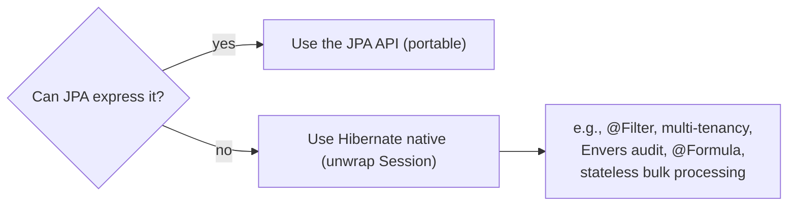

| Need | JPA enough? | Reach for Hibernate |
|---|---|---|
| Basic CRUD, relationships | ✅ | — |
| Standard queries | ✅ (JPQL/Criteria) | — |
| Audit/history of entities | ❌ | **Envers** |
| Row-level filtering (soft delete, tenant) | ❌ | **@Filter** |
| Computed/derived columns | ❌ | **@Formula** |
| High-volume batch inserts | ⚠️ awkward | **StatelessSession** |
| Multi-tenant DB per customer | ❌ | Hibernate **multi-tenancy** |
| Natural business keys + caching | ⚠️ | **@NaturalId** |

> [!TIP]
> The pragmatic rule: **stay on the JPA API by default; use Hibernate-specific features deliberately and locally, documenting them as "provider-specific."** This gives you standard code for 95% of your persistence and full power where it's genuinely needed. Isolate native usage behind repository methods so it doesn't leak everywhere.

### 3.3 The Shared Core Concepts (they're really JPA concepts)

Almost everything people call "Hibernate concepts" are actually **defined by JPA** and implemented by Hibernate. These matter far more than the JPA-vs-Hibernate distinction itself:

| Concept | Defined by | Covered deeply in |
|---|---|---|
| **Persistence Context / 1st-level cache** | JPA | [[09 Java Hibernate]] |
| **Entity lifecycle** (transient/managed/detached/removed) | JPA | [[09 Java Hibernate]] |
| **Lazy vs eager loading** | JPA | [[09 Java Hibernate]] |
| **N+1 query problem** | JPA (behavior) | [[09 Java Hibernate]] |
| **Dirty checking** | Both | [[09 Java Hibernate]] |
| **Cascade types** | JPA | [[09 Java Hibernate]] |
| **Flush modes** | JPA (Hibernate extends) | [[09 Java Hibernate]] |
| **Second-level cache** | JPA SPI + Hibernate impl | [[09 Java Hibernate]] |

> [!IMPORTANT]
> The senior insight: **the JPA-vs-Hibernate debate is mostly trivia — what actually determines whether your persistence layer performs is mastery of the shared concepts**: the persistence context, entity states, lazy loading, the **N+1 problem**, `LazyInitializationException`, dirty checking, and transaction/flush semantics. These are the same whether you call them "JPA" or "Hibernate." Your [[09 Java Hibernate]] guide covers them in depth — that knowledge is where 99% of real-world value lies.

### 3.4 Entity Lifecycle States (JPA-defined, Hibernate-implemented)

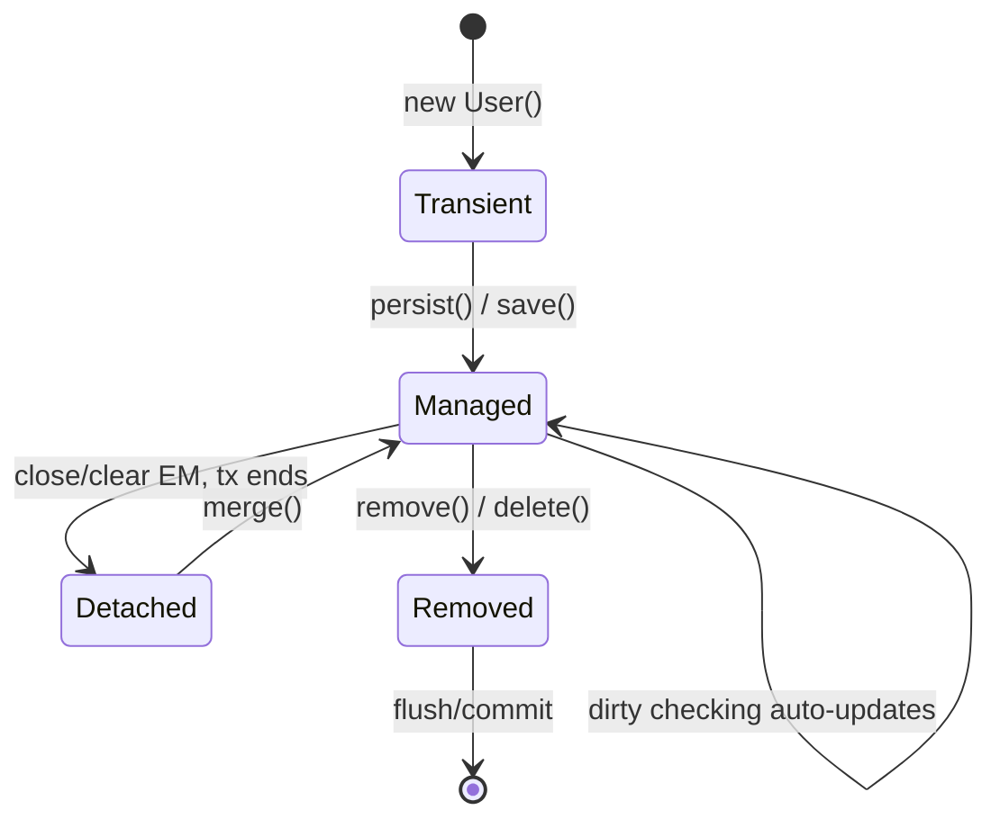

> [!WARNING]
> The most common real bug from misunderstanding this: **`LazyInitializationException`** — accessing a lazy association on a **detached** entity (after the persistence context/transaction closed). This is JPA-defined lifecycle behavior, and it bites everyone regardless of "JPA vs Hibernate." Fixes (fetch joins, `@EntityGraph`, keeping the transaction open, DTO projections) are in [[09 Java Hibernate]]. The naming confusion doesn't change the bug — the concepts do.

### 3.5 Alternative JPA Providers (the ones you'd "swap" to)

| Provider | Notes |
|---|---|
| **Hibernate** | Default, most popular, most features, Red Hat-backed, Spring Boot default |
| **EclipseLink** | JPA *reference implementation*, from the Eclipse Foundation, strong caching |
| **OpenJPA** | Apache, less active now |
| **DataNucleus** | Supports JPA + JDO, works with NoSQL too |

> [!TIP]
> **EclipseLink is the official JPA reference implementation** — meaning it's the canonical "this is what the spec means" provider. Yet **Hibernate dominates** real-world usage because of its maturity, feature richness, community, and (crucially) being Spring Boot's default. If someone says "we should use the reference implementation for purity," the counter is: Hibernate's ecosystem and Spring integration almost always outweigh spec-purity concerns.

### 3.6 Failure Scenarios & Misconceptions

| Misconception / Issue | Reality |
|---|---|
| "JPA and Hibernate are competitors" | JPA is a spec; Hibernate *implements* it — not rivals |
| "JPA is faster/slower than Hibernate" | Meaningless — JPA has no runtime; Hibernate *is* the runtime |
| "Spring Data JPA = JPA" | It's a layer *above* JPA (repositories) |
| "Using JPA means no Hibernate" | Almost always Hibernate is the provider underneath |
| "Portability lets me swap providers easily" | Rarely true in mature apps |
| "HQL and JPQL are unrelated" | HQL is a superset of JPQL |
| "`@Entity` is a Hibernate annotation" | It's `jakarta.persistence` — JPA-defined |
| Mixing `javax.persistence` and `jakarta.persistence` | Jakarta EE 9+ renamed the package — must be consistent |

> [!WARNING]
> A real, painful modern gotcha: the **`javax.persistence` → `jakarta.persistence` package rename** (Jakarta EE 9, adopted by Spring Boot 3 / Hibernate 6). Old tutorials/imports use `javax.persistence.*`; modern ones use `jakarta.persistence.*`. Mixing them causes compile/runtime failures. If you upgrade to Spring Boot 3+, you **must** migrate all `javax.persistence` imports to `jakarta.persistence`. This trips up nearly everyone modernizing an app.

---

## 4. 🏗️ REAL-WORLD SYSTEM DESIGN USAGE

### 4.1 The Real-World Stack

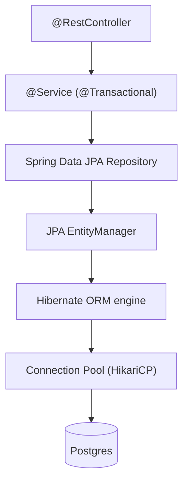

In a modern [[05 Spring Boot]] app, the layering is: **Controller → Service (`@Transactional`) → Spring Data JPA repository → JPA API → Hibernate → HikariCP → [[02 Postgres]]**. You write against Spring Data JPA + JPA annotations; Hibernate does the heavy lifting; you rarely touch it directly.

### 4.2 How teams actually decide

| Scenario | Choice |
|---|---|
| New Spring Boot app | Spring Data JPA + Hibernate (default, no decision needed) |
| Need standard, portable, team-familiar code | JPA API |
| Need audit trails | Hibernate **Envers** |
| Multi-tenant SaaS | Hibernate **multi-tenancy** |
| Extreme performance / bulk | Native SQL or **StatelessSession**, sometimes bypass ORM |
| Reporting/complex reads | Native queries or a separate read model ([[01 System Design Fundamentals]] CQRS) |

> [!IMPORTANT]
> Real teams almost never sit down and "choose JPA vs Hibernate" — they add `spring-boot-starter-data-jpa`, which *is* Hibernate, and move on. The decisions that actually matter are: **which mappings, fetch strategies, and query approaches** to use (to avoid N+1 and performance traps), and **when to drop to native SQL** for queries the ORM handles poorly. The framework choice is made for you; the *usage discipline* is what separates good from bad.

### 4.3 When to Bypass the ORM Entirely

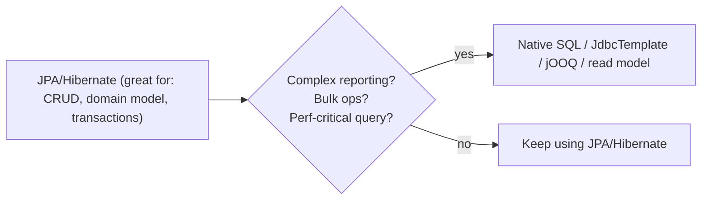

> [!TIP]
> ORMs (JPA/Hibernate) excel at **object-graph CRUD and domain modeling** but can be awkward or slow for **complex reporting, aggregations, and bulk operations**. Mature systems use a **hybrid**: JPA/Hibernate for the transactional write side, and **native SQL / `JdbcTemplate` / jOOQ** for heavy reads and reports. This is a form of CQRS ([[01 System Design Fundamentals]]). Don't force every query through the ORM — use the right tool per access pattern.

### 4.4 Big Ecosystem Context

- **Jakarta EE** stewards the JPA spec (renamed from Java EE after Oracle handed it to the Eclipse Foundation).
- **Hibernate** (Red Hat) is the reference-quality real-world default and drove much of JPA's design.
- **Spring** wraps both with Spring Data JPA and transaction management ([[06 Spring Boot Annotations]] `@Transactional`).
- Other JVM options that *don't* use JPA at all: **jOOQ** (type-safe SQL), **MyBatis** (SQL mapping), **Spring Data JDBC** (simpler, no persistence context).

---

## 5. 🎤 INTERVIEW PREPARATION

### 5.1 Most important questions

<details>
<summary><b>Q1: What is the difference between JPA and Hibernate?</b></summary>

**JPA is a specification** (a set of interfaces and rules for ORM in Java, under `jakarta.persistence`); **Hibernate is an implementation** of that specification (plus extra features). JPA defines *what* persistence should do; Hibernate provides the *actual working code*. JPA can't run alone — it needs a provider like Hibernate. Analogy: JPA is the `List` interface, Hibernate is `ArrayList`.
</details>

<details>
<summary><b>Q2: Can you use JPA without Hibernate?</b></summary>

Yes — JPA is provider-agnostic. You can use **EclipseLink** (the reference implementation), OpenJPA, or DataNucleus instead. But you always need *some* provider; JPA is just interfaces. In practice, Hibernate is the overwhelming default, especially in Spring Boot.
</details>

<details>
<summary><b>Q3: Is Spring Data JPA the same as JPA?</b></summary>

No. **Spring Data JPA** is a Spring convenience layer *on top of* JPA that auto-generates repository implementations (`JpaRepository`). It uses JPA underneath, which uses a provider (Hibernate). So the stack is: Spring Data JPA → JPA → Hibernate → JDBC → DB. Three distinct layers.
</details>

<details>
<summary><b>Q4: JPQL vs HQL?</b></summary>

**JPQL** (Java Persistence Query Language) is the JPA-standard, object-oriented query language (queries entities, not tables). **HQL** (Hibernate Query Language) is Hibernate's version — a **superset** of JPQL with extra features. All JPQL is valid HQL. Stick to JPQL for portability.
</details>

<details>
<summary><b>Q5: EntityManager vs Session?</b></summary>

`EntityManager` is the **JPA** interface for interacting with the persistence context; `Session` is **Hibernate's** native equivalent (and predates it). In a Hibernate setup, the `EntityManager` wraps a `Session` — you can `em.unwrap(Session.class)` to access native features. Both represent a unit of work with a first-level cache.
</details>

<details>
<summary><b>Q6: Why use JPA instead of Hibernate's native API?</b></summary>

**Portability and standardization**: coding to JPA means standard annotations/concepts every Java dev knows, theoretical provider-swappability, and cleaner architecture (coding to an interface). You lose access to Hibernate-only features unless you unwrap. In reality, provider-swapping is rare, but the standardized skillset and API are genuine benefits.
</details>

<details>
<summary><b>Q7: Does JPA have performance overhead vs Hibernate?</b></summary>

The question is malformed — **JPA has no runtime**, so it can't be faster or slower. Hibernate *is* the runtime executing your JPA calls. Performance depends on how you use the shared concepts (fetch strategies, N+1, caching, batching), not on "JPA vs Hibernate."
</details>

<details>
<summary><b>Q8: What changed with javax → jakarta?</b></summary>

When Java EE moved to the Eclipse Foundation as **Jakarta EE**, Oracle's trademark forced renaming the `javax.*` packages to `jakarta.*`. So JPA annotations moved from `javax.persistence` to `jakarta.persistence` (Jakarta EE 9+, adopted by Spring Boot 3 / Hibernate 6). Upgrading requires migrating all imports.
</details>

### 5.2 Tricky questions

> [!TIP]
> **"Which is faster, JPA or Hibernate?"** — A trap. JPA is a spec with no execution; Hibernate is the engine. Comparing their speed is a category error. Redirect to what actually affects performance: fetch strategy, N+1, caching, batch size.

> [!TIP]
> **"Is `@Entity` a Hibernate annotation?"** — No — it's `jakarta.persistence.@Entity`, defined by **JPA**. Hibernate *implements* it. Most annotations people attribute to Hibernate (`@Id`, `@Column`, `@OneToMany`) are JPA-standard. Hibernate-only ones live in `org.hibernate.annotations.*` (e.g., `@NaturalId`, `@Formula`).

> [!TIP]
> **"If I use only JPA, can I swap Hibernate for EclipseLink with zero changes?"** — Theoretically yes, practically rarely — subtle differences (flush timing, DDL, caching, edge-case behavior) and any provider-specific config usually require work. Portability is a nice-to-have, not a guarantee.

> [!TIP]
> **"Does Hibernate require JPA?"** — No! Hibernate **predates** JPA (2001 vs 2006) and has its own native API (`SessionFactory`/`Session`). You can use Hibernate *without* touching the JPA API at all. JPA needs a provider; Hibernate doesn't need JPA.

### 5.3 Common mistakes candidates make

| Mistake | Reality |
|---|---|
| "JPA and Hibernate are alternatives/rivals" | Spec vs implementation |
| Comparing their "performance" | JPA has no runtime |
| "Spring Data JPA is JPA" | It's a layer above JPA |
| Thinking `@Entity` is Hibernate-specific | It's JPA (`jakarta.persistence`) |
| Believing portability is seamless | It's rarely exercised, rarely painless |
| Confusing `javax` vs `jakarta` | Package renamed in Jakarta EE 9+ |
| Focusing on the naming, not the concepts | N+1, lazy loading, contexts matter far more |

### 5.4 What interviewers actually expect

- Crisp **spec vs implementation** articulation (with the `List`/`ArrayList` analogy).
- Knowing the **layering** (Spring Data JPA → JPA → Hibernate → JDBC).
- Recognizing that the "hard/valuable" knowledge is the **shared concepts** (persistence context, N+1, lazy loading — [[09 Java Hibernate]]).
- **Pragmatism**: Hibernate is the default; portability is mostly theoretical; use native features deliberately.
- Awareness of the **jakarta rename** and modern versions.

---

## 6. 🛠️ HANDS-ON PROJECTS

### Project 1: The Same App, Two APIs (Beginner→Intermediate)

**Goal:** Build one CRUD app twice — pure JPA API, then Hibernate native — to *feel* the difference.

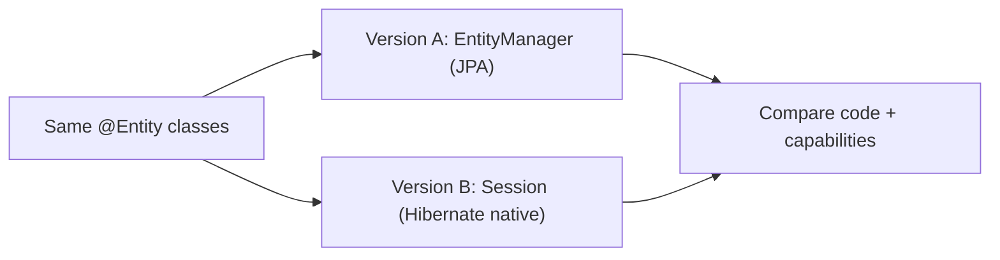

**Steps:**
1. Define `@Entity` classes (`jakarta.persistence`) — shared by both.
2. Version A: CRUD via `EntityManager` (`persist`, `find`, JPQL).
3. Version B: CRUD via Hibernate `Session` (`save`, `get`, HQL).
4. Use `em.unwrap(Session.class)` to bridge from JPA to native.
5. Note which imports are `jakarta.*` (JPA) vs `org.hibernate.*` (native).

**Learn:** the concrete API differences, what's standard vs provider-specific, unwrapping.

---

### Project 2: Full Spring Boot Stack + Provider Swap Experiment (Intermediate→Senior)

**Goal:** See the real layering and test the portability claim.

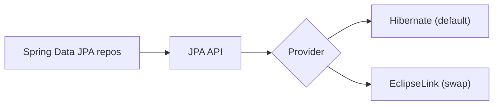

**Steps:**
1. Build a [[05 Spring Boot]] app with Spring Data JPA repositories on [[02 Postgres]].
2. Confirm Hibernate is the provider (logs, `hibernate.*` props).
3. Attempt to swap the provider to **EclipseLink**; document what breaks/changes.
4. Enable SQL logging; observe Hibernate generating SQL from your JPQL.
5. Add one Hibernate-only feature (`@NaturalId` or Envers) — note it now blocks the swap.

**Learn:** the four-layer stack, real portability limits, cost of native features.

---

### Project 3: Hybrid Persistence — ORM + Native for Reports (Senior)

**Goal:** Use JPA for writes and native SQL for heavy reads (mini-CQRS).

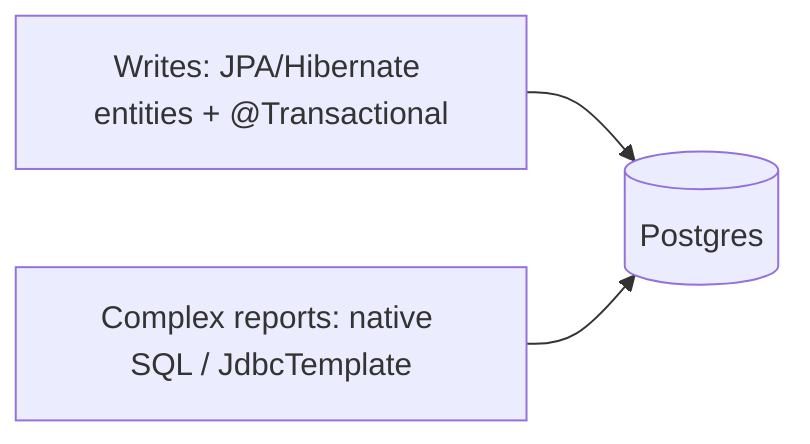

**Steps:**
1. Model the write side with JPA entities + Spring Data repositories.
2. Build a complex reporting query that's painful in JPQL.
3. Implement it with a **native query** (`@Query(nativeQuery=true)`) or `JdbcTemplate`.
4. Add a Hibernate `StatelessSession` bulk-insert path for a data-load job.
5. Reason about when the ORM helps vs hurts ([[01 System Design Fundamentals]] read/write split).

**Learn:** ORM boundaries, hybrid persistence, when to bypass JPA/Hibernate.

---

## 7. 🔬 DEEP DIVE: INTERNALS

### 7.1 How JPA Calls Become Hibernate Actions

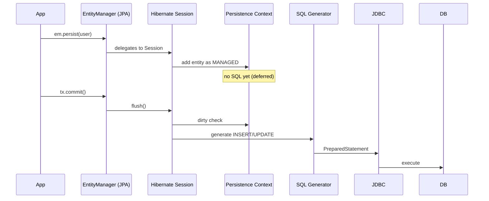

> [!IMPORTANT]
> The JPA `EntityManager` is a **thin standard facade over Hibernate's `Session`**. When you call `em.persist()`, Hibernate registers the entity in the **persistence context** (first-level cache) but typically **defers the SQL** until flush/commit — batching and reordering statements for efficiency. This deferred, transactional, dirty-checking machinery is defined *conceptually* by JPA but *implemented* by Hibernate. The "magic" (auto-updates without explicit `save`, N+1, lazy proxies) all lives in Hibernate's implementation of the JPA contract — see [[09 Java Hibernate]] §7.

### 7.2 Hibernate as a Proxy Factory

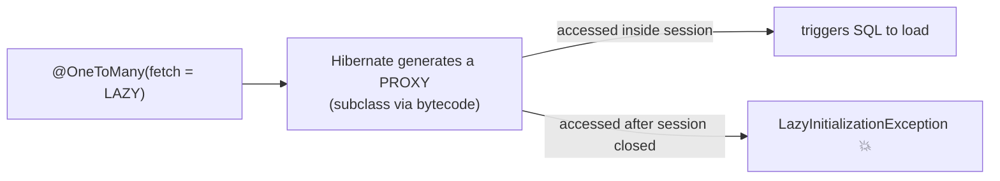

> [!TIP]
> Lazy loading — a **JPA-defined** behavior — is implemented by Hibernate via the **Proxy pattern** ([[02 Design Patterns]]): it generates bytecode subclasses that stand in for associations and load data on first access *within* an open session. This is why the spec (JPA) and implementation (Hibernate) division is mostly academic to your daily work: the *concept* is JPA, but understanding the *proxy mechanism* (and its `LazyInitializationException` failure mode) requires knowing how Hibernate implements it.

### 7.3 The Dialect System (how Hibernate stays DB-agnostic)

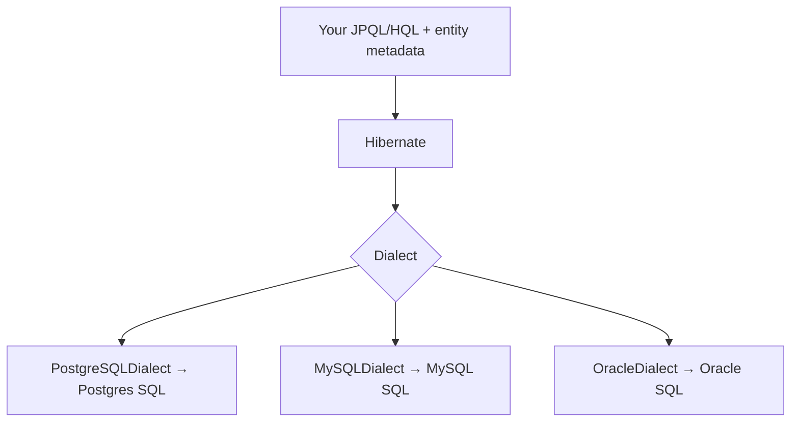

> [!IMPORTANT]
> JPA lets you write database-agnostic queries (JPQL over entities). Hibernate makes that real through the **Dialect** system: a `Dialect` class per database translates Hibernate's internal representation into that DB's specific SQL flavor, functions, pagination syntax, and types. Switching from [[02 Postgres]] to MySQL is (ideally) just changing the dialect + driver — *this* is a portability that actually works well, unlike provider-swapping. It's also why the wrong dialect causes subtle SQL bugs.

### 7.4 The Bootstrap Process

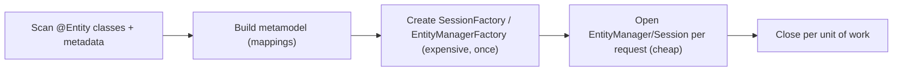

> [!TIP]
> A key operational fact: the **`EntityManagerFactory`/`SessionFactory` is heavyweight and created once** at startup (it parses all mappings, builds the metamodel, sets up caches, connection pools). Individual **`EntityManager`/`Session` instances are lightweight** and created **per request/unit-of-work**, then closed. Mixing these up (e.g., sharing one `EntityManager` across threads — it's *not* thread-safe) is a classic bug. Spring manages this lifecycle for you, tying an `EntityManager` to the transaction ([[06 Spring Boot Annotations]]).

### 7.5 What "Implementing a Spec" Actually Means

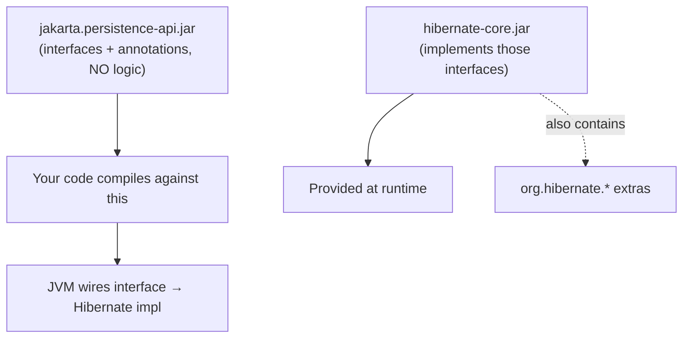

> [!IMPORTANT]
> Concretely: `jakarta.persistence-api` is a JAR containing **only interfaces and annotations with no implementation logic** — your code compiles against it. `hibernate-core` is a separate JAR that **provides concrete classes implementing those interfaces** (plus Hibernate's own `org.hibernate.*` API). At runtime, JPA's service-loader mechanism discovers Hibernate as the provider and wires it in. This is the **program-to-an-interface** principle ([[02 Design Patterns]]) at the ecosystem level: your code depends on the abstraction (JPA), the concrete engine (Hibernate) is plugged in at runtime. That's *literally* what "spec vs implementation" means in bytecode.

---

## ✅ Production Checklists

### Understanding & Setup
- [ ] Clear on the layering: Spring Data JPA → JPA → Hibernate → JDBC
- [ ] Using `jakarta.persistence.*` (not legacy `javax.persistence.*`) on Spring Boot 3+
- [ ] Provider explicitly known (Hibernate) + correct **dialect** for your DB
- [ ] Prefer **JPA API**; native Hibernate features used deliberately & documented
- [ ] `ddl-auto=validate` (or `none`) in production — never `create`/`update`

### Concept Mastery (the part that matters)
- [ ] Team understands **persistence context / entity states** ([[09 Java Hibernate]])
- [ ] **N+1** detection + fix strategies in place (fetch joins/`@EntityGraph`)
- [ ] `LazyInitializationException` avoided (transaction boundaries, DTOs)
- [ ] Fetch strategies chosen deliberately (LAZY by default)
- [ ] Batch settings tuned for bulk ops

### Architecture
- [ ] Hybrid approach where warranted (native SQL / JdbcTemplate for reports)
- [ ] Native-feature usage isolated (doesn't leak provider-lock everywhere)
- [ ] `@Transactional` boundaries correct ([[06 Spring Boot Annotations]])
- [ ] Connection pool (HikariCP) sized appropriately

---

## 🗺️ Learning Roadmap

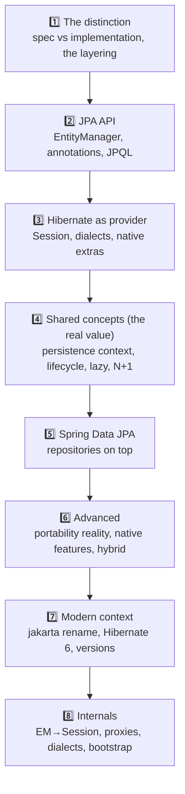

| Stage | Focus | You can... |
|---|---|---|
| 1–3 | Distinction + both APIs | Explain and use JPA & Hibernate correctly |
| 4–5 | Shared concepts + Spring | Write real, performant persistence code |
| 6–7 | Judgment + modern | Decide native-vs-portable; handle upgrades |
| 8 | Internals | Debug deeply, understand the machinery |

---

## 🔁 Self-Review Completion Loop

Reviewed against the Jakarta Persistence spec, Hibernate documentation, common interview questions, and real-world usage.

### Gap Review Matrix

| Dimension | Covered? | Where |
|---|---|---|
| Spec vs implementation core distinction | ✅ | §1 |
| Why the distinction exists (history) | ✅ | §1 |
| The four-layer stack (Spring Data/JPA/Hibernate/JDBC) | ✅ | §2.1 |
| Same code, two APIs (EM vs Session) | ✅ | §2.2 |
| What JPA defines vs Hibernate adds | ✅ | §2.3 |
| Configuration (persistence.xml / Spring Boot) | ✅ | §2.4 |
| JPQL vs HQL | ✅ | §2.5 |
| Portability reality | ✅ | §3.1 |
| When to use native Hibernate | ✅ | §3.2 |
| Shared concepts pointer | ✅ | §3.3 |
| Entity lifecycle | ✅ | §3.4 |
| Alternative providers | ✅ | §3.5 |
| Misconceptions | ✅ | §3.6 |
| javax → jakarta rename | ✅ | §3.6 |
| Real-world stack & decisions | ✅ | §4.1–4.2 |
| Bypassing the ORM (hybrid) | ✅ | §4.3 |
| Interview Q&A + tricky + mistakes | ✅ | §5 |
| Hands-on projects | ✅ | §6 |
| EM→Session delegation internals | ✅ | §7.1 |
| Proxy/lazy internals | ✅ | §7.2 |
| Dialect system | ✅ | §7.3 |
| Bootstrap/lifecycle | ✅ | §7.4 |
| "Implementing a spec" in bytecode | ✅ | §7.5 |

> [!NOTE]
> **Remaining depth to explore independently:** the full Hibernate feature deep-dive (caching tiers, N+1 solutions, fetch strategies, dirty checking, `LazyInitializationException` fixes) lives in your **[[09 Java Hibernate]]** guide; also worth exploring — Hibernate 6 architecture changes (semantic query model), the Jakarta Persistence 3.2 additions, Spring Data JDBC as a lighter alternative, and jOOQ/MyBatis as non-JPA persistence approaches.

---

## 📚 Official References

| Resource | URL |
|---|---|
| Jakarta Persistence Specification | https://jakarta.ee/specifications/persistence/ |
| Hibernate ORM Documentation | https://hibernate.org/orm/documentation/ |
| Hibernate User Guide | https://docs.jboss.org/hibernate/orm/current/userguide/html_single/Hibernate_User_Guide.html |
| Spring Data JPA | https://spring.io/projects/spring-data-jpa |
| EclipseLink (reference impl) | https://eclipse.dev/eclipselink/ |
| Jakarta EE (spec steward) | https://jakarta.ee/ |
| Vlad Mihalcea's blog (JPA/Hibernate deep-dives) | https://vladmihalcea.com/ |

---

## 🎁 Final Summary

> [!IMPORTANT]
> **The one-paragraph takeaway:** **JPA is a specification** (interfaces, annotations, and rules under `jakarta.persistence`) and **Hibernate is the most popular implementation** of it — they are not rivals but *contract and engine*. JPA can't run alone (it's just interfaces); Hibernate is the actual ORM that generates SQL, manages the persistence context, and talks to the database via JDBC. In practice the stack is **Spring Data JPA → JPA API → Hibernate → JDBC → DB**, and "using JPA" almost always means "using Hibernate through the standard JPA API." Prefer the **portable JPA API**, reaching for **Hibernate-native features** (Envers, `@Filter`, `@Formula`, multi-tenancy) deliberately when JPA can't express your need — but know that **provider portability is largely theoretical** in mature apps. Crucially, the JPA-vs-Hibernate distinction is mostly *trivia*: what actually determines your persistence layer's correctness and performance is mastery of the **shared concepts** — persistence context, entity lifecycle, lazy loading, the N+1 problem, and transactions — all covered in depth in [[09 Java Hibernate]].

**Golden rules:**
1. 📜 **JPA = specification, Hibernate = implementation** — contract vs engine, like `List` vs `ArrayList`.
2. 🔌 JPA needs a **provider**; Hibernate is the default (and predates JPA).
3. 🧱 Know the layers: **Spring Data JPA ≠ JPA ≠ Hibernate ≠ JDBC**.
4. ⚡ "JPA vs Hibernate performance" is a **category error** — JPA has no runtime.
5. 🎯 Prefer the **JPA API**; use Hibernate-native features **deliberately**.
6. 🌍 Provider **portability is mostly theoretical** — don't cripple yourself for it.
7. 📦 Use **`jakarta.persistence`** (not `javax`) on Spring Boot 3 / Hibernate 6.
8. 🧠 The **shared concepts** ([[09 Java Hibernate]]) matter far more than the naming debate.

---

*Related guides in this vault: [[09 Java Hibernate]] · [[05 Spring Boot]] · [[06 Spring Boot Annotations]] · [[02 Postgres]] · [[01 Basic Java]] · [[02 Design Patterns]] · [[01 System Design Fundamentals]]*
