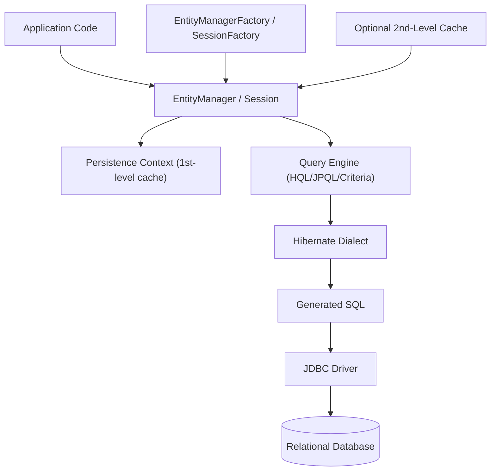
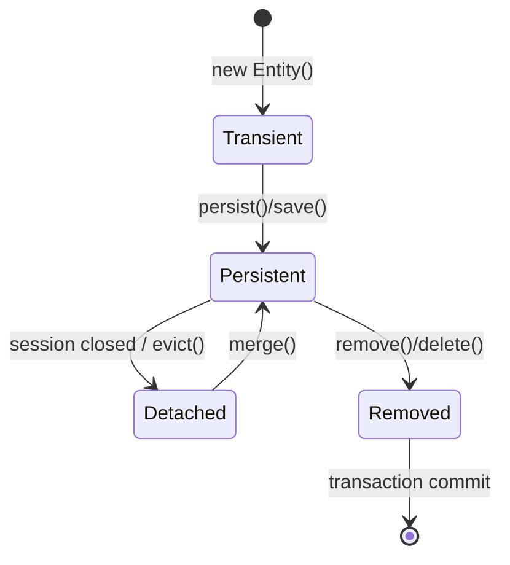
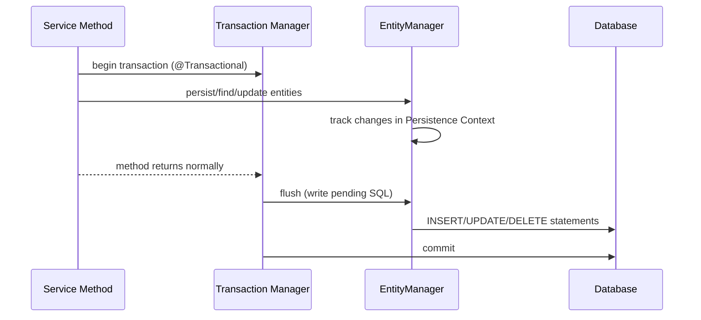
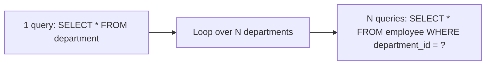
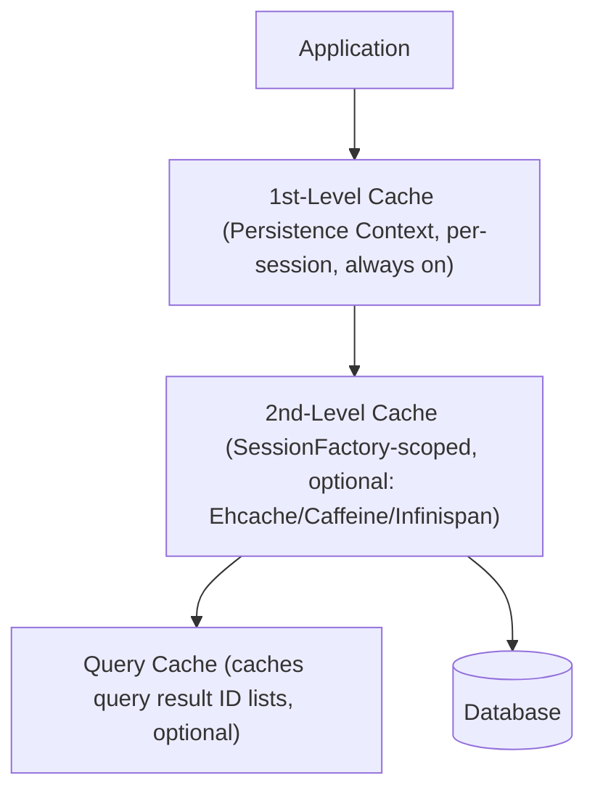
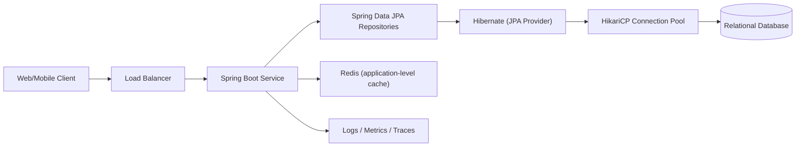
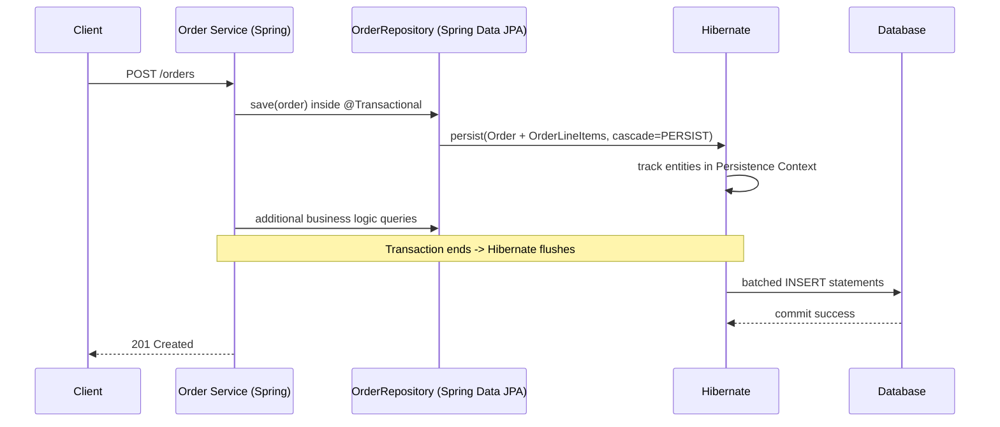
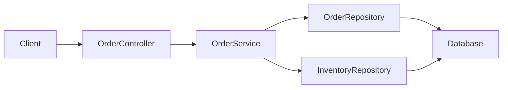
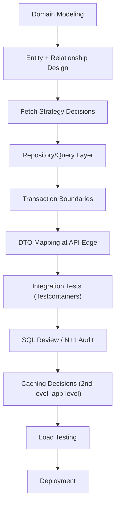
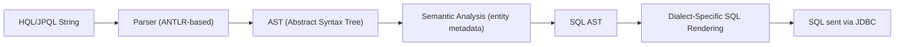

# Java Hibernate: Beginner-to-Expert Engineering Guide

> **Scope:** This guide teaches Hibernate ORM from first principles through production backend/system-engineering usage. It covers native Hibernate APIs and JPA (the standard Hibernate implements), with emphasis on how Hibernate is actually used in Spring Boot and other production Java services.

## Table of Contents

1. [Executive Summary](#executive-summary)
2. [1. Fundamentals](#1-fundamentals-beginner-level)
3. [2. Core Concepts](#2-core-concepts-intermediate-level)
4. [3. Advanced Concepts](#3-advanced-concepts-senior-level)
5. [4. Real-World System Design Usage](#4-real-world-system-design-usage)
6. [5. Interview Preparation](#5-interview-preparation)
7. [6. Hands-On Thinking](#6-hands-on-thinking)
8. [7. Deep Dive](#7-deep-dive-optional-but-important)
9. [Production Checklists](#production-checklists)
10. [Learning Roadmap](#learning-roadmap)
11. [Self-Review Completion Loop](#self-review-completion-loop)
12. [Official References](#official-references)

---

## Executive Summary

Hibernate is an Object-Relational Mapping (ORM) framework for Java. It maps Java classes to relational database tables and Java field types to SQL column types, letting you work with objects in code while Hibernate generates and executes the underlying SQL.

The core idea:

```text
Java Objects (Entities)
        |
        v
Hibernate ORM Engine (Session / EntityManager)
        |
        v
Persistence Context (in-memory tracking of loaded entities)
        |
        v
SQL generated by Hibernate's dialect-aware engine
        |
        v
JDBC Driver
        |
        v
Relational Database
```

> [!TIP]
> Learn Hibernate as three connected things: **JPA** (the specification/annotations), **Hibernate** (the most popular implementation of JPA, with extra native features), and the **Persistence Context** (the runtime object cache/tracking mechanism that makes Hibernate behave differently from plain JDBC). Senior engineers understand all three, not just the annotations.

---

# 1. Fundamentals (Beginner Level)

## 1.1 What Is Hibernate?

Hibernate is a library that lets you persist Java objects to a relational database without hand-writing most SQL. You annotate a class as an entity, and Hibernate handles `INSERT`, `UPDATE`, `DELETE`, and `SELECT` statements for you.

```java
@Entity
@Table(name = "users")
public class User {

    @Id
    @GeneratedValue(strategy = GenerationType.IDENTITY)
    private Long id;

    @Column(nullable = false)
    private String name;

    private String email;

    // getters/setters or Lombok
}
```

Saving an object:

```java
User user = new User();
user.setName("Asha");
user.setEmail("asha@example.com");

session.persist(user); // Hibernate generates the INSERT
```

## 1.2 Why Hibernate Exists

Hibernate was created to solve recurring problems with plain JDBC-based data access.

| Problem with Plain JDBC | Hibernate's Answer |
|---|---|
| Repetitive boilerplate for `PreparedStatement`/`ResultSet` mapping | Automatic mapping between objects and rows |
| Manual SQL for every CRUD operation | Generated SQL from entity metadata |
| Database-specific SQL dialect differences | Hibernate `Dialect` abstracts common differences |
| Manually tracking which objects changed | Automatic **dirty checking** |
| No object identity/caching within a unit of work | **Persistence Context** (first-level cache) |
| Hard to model object graphs (parent/child) | Declarative relationship mappings |
| Verbose code for pagination, joins, dynamic queries | HQL, JPQL, Criteria API |

## 1.3 Problems Hibernate Solves

Hibernate is especially useful when you need:

- Rapid CRUD development against a relational schema.
- An object graph that mirrors your relational schema (entities with relationships).
- Automatic change tracking so you don't manually write `UPDATE` statements.
- A query language (HQL/JPQL) that's portable across databases.
- Built-in transaction integration with Spring or Jakarta EE.
- Caching layers to reduce database round-trips.

Hibernate is less ideal when you need:

- Full control over every SQL statement (e.g., highly tuned analytical queries).
- Bulk operations over millions of rows (native SQL or batch JDBC is often better).
- A very thin data layer with minimal abstraction (some teams prefer jOOQ or plain JDBC + a mapper like MyBatis for this reason).

## 1.4 Real-World Analogy

Think of Hibernate like a translator between two people who speak different languages.

You (your Java code) think in terms of objects: a `User` with a `name` and `orders`. The database thinks in terms of tables, rows, and foreign keys. Hibernate sits between you and translates: when you say "save this `User` object," Hibernate translates that into the correct `INSERT INTO users (...) VALUES (...)` statement, and vice versa when reading rows back into objects.

```text
Your Java code = person speaking "Object" language
Hibernate       = translator
Database        = person speaking "Relational/SQL" language
```

## 1.5 Core Vocabulary

| Term | Meaning |
|---|---|
| JPA | Jakarta Persistence API: the standard specification for Java ORM |
| Hibernate | The most widely used implementation of JPA (also has native extra APIs) |
| Entity | A Java class mapped to a database table |
| `EntityManager` | JPA standard interface for persistence operations |
| `Session` | Hibernate-native interface, extends `EntityManager`-like capability (historically predates JPA) |
| `SessionFactory` / `EntityManagerFactory` | Thread-safe factory that creates `Session`/`EntityManager` instances; expensive to create, created once per app |
| Persistence Context | The set of entities currently being tracked/managed in a session (first-level cache) |
| Dialect | Hibernate component that generates database-specific SQL |
| HQL | Hibernate Query Language, object-oriented query language |
| JPQL | JPA's standard query language, very similar to HQL |
| Dirty Checking | Hibernate's mechanism for detecting changed fields and auto-generating `UPDATE` |

## 1.6 Basic Program Structure (Spring Boot Style)

Most production Hibernate usage today happens through Spring Data JPA, which wraps Hibernate.

```java
@Entity
public class Product {
    @Id
    @GeneratedValue(strategy = GenerationType.IDENTITY)
    private Long id;

    private String name;
    private BigDecimal price;
}
```

```java
public interface ProductRepository extends JpaRepository<Product, Long> {
    List<Product> findByNameContainingIgnoreCase(String name);
}
```

```java
@Service
public class ProductService {
    private final ProductRepository repository;

    ProductService(ProductRepository repository) {
        this.repository = repository;
    }

    public Product createProduct(String name, BigDecimal price) {
        Product product = new Product();
        product.setName(name);
        product.setPrice(price);
        return repository.save(product); // Hibernate generates INSERT
    }
}
```

Breakdown:

| Part | Purpose |
|---|---|
| `@Entity` | Marks class as a Hibernate-managed entity |
| `@Id` | Marks primary key field |
| `@GeneratedValue` | Tells Hibernate how the ID is generated |
| `JpaRepository` | Spring Data abstraction that Hibernate implements under the hood |
| `repository.save()` | Triggers Hibernate `persist`/`merge` logic |

## 1.7 Entities and Basic Mapping

```java
@Entity
@Table(name = "orders")
public class Order {

    @Id
    @GeneratedValue(strategy = GenerationType.IDENTITY)
    private Long id;

    @Column(name = "order_status", nullable = false, length = 20)
    private String status;

    @Column(name = "created_at")
    private Instant createdAt;
}
```

Common annotations:

| Annotation | Purpose |
|---|---|
| `@Entity` | Marks a class as persistable |
| `@Table` | Customizes table name/schema |
| `@Id` | Primary key field |
| `@GeneratedValue` | ID generation strategy |
| `@Column` | Customizes column name, nullability, length |
| `@Transient` | Field excluded from persistence |
| `@Enumerated` | Maps Java enums to DB columns |
| `@Temporal` | Legacy date/time mapping (pre-`java.time`) |

## 1.8 Basic CRUD with `EntityManager`

```java
EntityManager em = entityManagerFactory.createEntityManager();
EntityTransaction tx = em.getTransaction();

tx.begin();

User user = new User();
user.setName("Ravi");
em.persist(user); // INSERT

User found = em.find(User.class, user.getId()); // SELECT
found.setName("Ravi Kumar"); // no explicit UPDATE call needed (dirty checking)

em.remove(found); // DELETE (only if transaction commits)

tx.commit();
em.close();
```

> [!WARNING]
> Changes to a managed entity are **not** written to the database until the transaction commits (or a flush happens). This trips up beginners who expect immediate writes.

## 1.9 Basic Exception Handling

```java
try {
    tx.begin();
    em.persist(order);
    tx.commit();
} catch (RuntimeException e) {
    if (tx.isActive()) {
        tx.rollback();
    }
    throw e;
}
```

---

# 2. Core Concepts (Intermediate Level)

## 2.1 Hibernate Architecture Overview



Key idea: your code never talks to JDBC directly. The `EntityManager`/`Session` mediates everything, tracking loaded entities in the Persistence Context and deciding what SQL to emit and when.

## 2.2 JPA vs Hibernate

| Aspect | JPA | Hibernate |
|---|---|---|
| What it is | Specification (interfaces, annotations) | Implementation of JPA + extra native features |
| Main interface | `EntityManager` | `Session` (extends similar capability) |
| Query language | JPQL | HQL (superset of JPQL) |
| Vendor lock-in | None (spec-only) | Native APIs create some lock-in |
| Examples of other implementations | EclipseLink, OpenJPA | N/A |

```text
Your Code --> JPA annotations/interfaces --> Hibernate (implementation) --> JDBC --> DB
```

> [!TIP]
> Prefer coding against JPA interfaces (`EntityManager`, `@Entity`, JPQL) for portability, and drop into Hibernate-native APIs (`Session`, HQL extensions, `@Fetch`, `@BatchSize`) only when you need a capability JPA doesn't expose.

## 2.3 Configuration

### `application.properties` (Spring Boot + Hibernate)

```properties
spring.datasource.url=jdbc:postgresql://localhost:5432/appdb
spring.datasource.username=app
spring.datasource.password=secret

spring.jpa.hibernate.ddl-auto=validate
spring.jpa.properties.hibernate.dialect=org.hibernate.dialect.PostgreSQLDialect
spring.jpa.properties.hibernate.jdbc.batch_size=50
spring.jpa.show-sql=false
```

### Native `hibernate.cfg.xml` (non-Spring)

```xml
<hibernate-configuration>
    <session-factory>
        <property name="connection.url">jdbc:postgresql://localhost:5432/appdb</property>
        <property name="connection.username">app</property>
        <property name="connection.password">secret</property>
        <property name="dialect">org.hibernate.dialect.PostgreSQLDialect</property>
        <property name="hbm2ddl.auto">validate</property>
        <mapping class="com.example.domain.User"/>
    </session-factory>
</hibernate-configuration>
```

> [!WARNING]
> `ddl-auto=update` (or `hbm2ddl.auto=update`) is convenient in local development but risky in production: it can silently alter production schema. Use migration tools (Flyway, Liquibase) with `validate` or `none` in production.

## 2.4 Entity Lifecycle States



| State | Meaning |
|---|---|
| Transient | New object, not associated with any session, no DB row yet |
| Persistent (Managed) | Associated with an active Persistence Context; changes are tracked |
| Detached | Was persistent, but its session closed; no longer tracked |
| Removed | Marked for deletion; removed from DB on flush/commit |

## 2.5 Persistence Context and First-Level Cache

Every `Session`/`EntityManager` has its own Persistence Context: a map of entities keyed by identity, scoped to that session/transaction.

```java
User u1 = em.find(User.class, 1L); // hits DB
User u2 = em.find(User.class, 1L); // returns same object from Persistence Context, no DB hit
System.out.println(u1 == u2); // true
```

This is why first-level cache is **always on** and **not configurable** — it's fundamental to how a session works.

## 2.6 Relationships

### `@OneToMany` / `@ManyToOne`

```java
@Entity
public class Department {
    @Id
    @GeneratedValue
    private Long id;

    @OneToMany(mappedBy = "department", cascade = CascadeType.ALL, orphanRemoval = true)
    private List<Employee> employees = new ArrayList<>();
}

@Entity
public class Employee {
    @Id
    @GeneratedValue
    private Long id;

    @ManyToOne(fetch = FetchType.LAZY)
    @JoinColumn(name = "department_id")
    private Department department;
}
```

| Concept | Meaning |
|---|---|
| `mappedBy` | Marks the "inverse" side; the other side owns the foreign key |
| Owning side | The side with `@JoinColumn`; its state determines the FK value written to DB |
| `cascade` | Propagates operations (persist, remove, etc.) from parent to children |
| `orphanRemoval` | Deletes child rows when removed from the parent's collection |

### `@ManyToMany`

```java
@Entity
public class Student {
    @Id @GeneratedValue
    private Long id;

    @ManyToMany
    @JoinTable(
        name = "student_course",
        joinColumns = @JoinColumn(name = "student_id"),
        inverseJoinColumns = @JoinColumn(name = "course_id")
    )
    private Set<Course> courses = new HashSet<>();
}
```

### `@OneToOne`

```java
@Entity
public class UserProfile {
    @Id
    private Long id;

    @OneToOne
    @MapsId
    @JoinColumn(name = "id")
    private User user;
}
```

### Relationship Cardinality Cheat Sheet

| Relationship | Owning Side Has | Typical Join |
|---|---|---|
| `@ManyToOne` | Foreign key column | Many rows -> one row |
| `@OneToMany` (with `mappedBy`) | No FK (inverse side) | One row -> many rows |
| `@OneToOne` | FK or shared PK | One row -> one row |
| `@ManyToMany` | Join table | Many rows -> many rows |

> [!TIP]
> Default to `FetchType.LAZY` for `@ManyToOne` and `@OneToOne` too (JPA defaults these to `EAGER`, which is a common production performance trap). Override explicitly.

## 2.7 Fetch Types

| Fetch Type | Default For | Behavior |
|---|---|---|
| `LAZY` | `@OneToMany`, `@ManyToMany` | Loaded only when accessed |
| `EAGER` | `@ManyToOne`, `@OneToOne` | Loaded immediately with parent |

```java
@ManyToOne(fetch = FetchType.LAZY)
private Department department;
```

## 2.8 HQL, JPQL, and Criteria API

### HQL/JPQL (object-oriented query language)

```java
List<User> users = em.createQuery(
        "SELECT u FROM User u WHERE u.active = true", User.class)
    .getResultList();
```

### Named parameters

```java
List<Order> orders = em.createQuery(
        "SELECT o FROM Order o WHERE o.status = :status", Order.class)
    .setParameter("status", "PAID")
    .getResultList();
```

### Criteria API (type-safe, programmatic)

```java
CriteriaBuilder cb = em.getCriteriaBuilder();
CriteriaQuery<User> query = cb.createQuery(User.class);
Root<User> root = query.from(User.class);

query.select(root).where(cb.equal(root.get("active"), true));

List<User> users = em.createQuery(query).getResultList();
```

### Native SQL (escape hatch)

```java
List<User> users = em.createNativeQuery(
        "SELECT * FROM users WHERE active = true", User.class)
    .getResultList();
```

| Query Style | When to Use |
|---|---|
| JPQL/HQL | Most queries; portable, readable |
| Criteria API | Dynamic queries built conditionally at runtime |
| Native SQL | Vendor-specific features, complex analytical queries, performance tuning |

## 2.9 Transactions

```java
@Service
public class OrderService {

    @Transactional
    public void placeOrder(Order order) {
        orderRepository.save(order);
        inventoryService.reserveStock(order); // same transaction
    }
}
```



Key rule: Hibernate defers writing SQL until **flush time** (end of transaction, explicit `flush()`, or before a query that needs consistent state).

## 2.10 Basic Testing

```java
@DataJpaTest
class ProductRepositoryTest {

    @Autowired
    private ProductRepository repository;

    @Test
    void savesAndFindsProduct() {
        Product product = new Product();
        product.setName("Widget");
        product.setPrice(BigDecimal.TEN);

        Product saved = repository.save(product);

        assertThat(repository.findById(saved.getId())).isPresent();
    }
}
```

> [!TIP]
> Use Testcontainers with a real database (e.g., PostgreSQL) rather than H2 in-memory for integration tests when the production database has vendor-specific behavior (JSON columns, specific locking, sequences).

---

# 3. Advanced Concepts (Senior Level)

## 3.1 The N+1 Query Problem

This is the single most common Hibernate production performance bug.

```java
List<Department> departments = em.createQuery(
        "SELECT d FROM Department d", Department.class)
    .getResultList(); // 1 query

for (Department d : departments) {
    System.out.println(d.getEmployees().size()); // N additional queries, one per department
}
```



### Fixes

| Fix | Approach |
|---|---|
| `JOIN FETCH` | `SELECT d FROM Department d JOIN FETCH d.employees` |
| Entity graphs | `@EntityGraph(attributePaths = "employees")` |
| Batch fetching | `@BatchSize(size = 20)` reduces N queries to N/20 |
| `@Fetch(FetchMode.SUBSELECT)` | Loads all children in one extra query using original query's WHERE clause |

```java
@Query("SELECT d FROM Department d JOIN FETCH d.employees WHERE d.id = :id")
Department findWithEmployees(@Param("id") Long id);
```

> [!IMPORTANT]
> N+1 problems are often invisible in dev/testing (small datasets) and only show up as production latency spikes at scale. Always check generated SQL logs (`show-sql`/`format_sql`) or use tools like p6spy/datasource-proxy in staging.

## 3.2 Dirty Checking Internals

At flush time, Hibernate compares each managed entity's current field values against a snapshot taken when the entity was loaded.

```text
Load entity -> Hibernate stores a snapshot copy
   ...
   entity.setName("New Name")
   ...
Flush time -> Hibernate compares current state vs snapshot
   -> if different, generate UPDATE with only (or all) changed columns
```

| Consideration | Detail |
|---|---|
| Cost | O(fields) comparison per entity per flush; expensive for many large entities |
| `@DynamicUpdate` | Generates `UPDATE` with only changed columns instead of all columns |
| Detached entities | No dirty checking; must call `merge()` explicitly |

## 3.3 Cascade Types

| Cascade Type | Effect |
|---|---|
| `PERSIST` | Saving parent also saves new children |
| `MERGE` | Merging parent also merges children |
| `REMOVE` | Deleting parent also deletes children |
| `REFRESH` | Refreshing parent also refreshes children |
| `DETACH` | Detaching parent also detaches children |
| `ALL` | All of the above |

> [!WARNING]
> `CascadeType.REMOVE` on a `@ManyToOne` (child pointing to shared parent) is a classic production bug: deleting one child can cascade-delete a parent shared by other children. Cascade `REMOVE` typically belongs only on the "owning parent" side of a true composition relationship (e.g., `Order` -> `OrderLineItem`).

## 3.4 Locking Strategies

### Optimistic Locking

```java
@Entity
public class Account {
    @Id
    private Long id;

    @Version
    private Long version;

    private BigDecimal balance;
}
```

```text
Thread A reads Account (version=1)
Thread B reads Account (version=1)
Thread A updates -> version becomes 2
Thread B updates -> Hibernate detects version mismatch -> OptimisticLockException
```

### Pessimistic Locking

```java
Account account = em.find(Account.class, id, LockModeType.PESSIMISTIC_WRITE);
```

| Locking Type | Mechanism | Best For |
|---|---|---|
| Optimistic (`@Version`) | Version column checked at update time | High-read, low-conflict workloads |
| Pessimistic (`SELECT ... FOR UPDATE`) | DB row lock held during transaction | High-conflict, must-serialize workloads (e.g., balance transfers) |

## 3.5 Caching Layers



| Cache Level | Scope | Enabled By Default | Risk |
|---|---|---|---|
| First-level (Persistence Context) | Per session/transaction | Always | None (required for dirty checking) |
| Second-level | Across sessions, app-wide | No | Stale data if external processes modify DB directly |
| Query cache | Across sessions, app-wide | No | Must be paired with 2nd-level cache; easy to misconfigure |

```java
@Entity
@Cacheable
@org.hibernate.annotations.Cache(usage = CacheConcurrencyStrategy.READ_WRITE)
public class Country {
    @Id
    private Long id;
    private String name;
}
```

> [!WARNING]
> Second-level cache is dangerous in multi-instance deployments unless using a distributed cache provider (e.g., Infinispan, Hazelcast) or the cache is read-mostly reference data. A local in-JVM cache (Ehcache without clustering) can serve stale data across instances.

## 3.6 `LazyInitializationException`

```java
Department department;
try (EntityManager em = emf.createEntityManager()) {
    department = em.find(Department.class, 1L);
} // session closes here

department.getEmployees().size(); // LazyInitializationException: no session
```

### Fixes

| Fix | Trade-off |
|---|---|
| Fetch eagerly with `JOIN FETCH` before closing session | Best for known access patterns |
| Open Session In View (OSIV) | Convenient but can hide N+1 problems, holds connections longer |
| DTO projection before session closes | Cleanest for API boundaries; avoids lazy access entirely |
| `Hibernate.initialize(collection)` | Explicit, intentional initialization |

> [!IMPORTANT]
> Spring Boot enables Open Session In View by default (`spring.jpa.open-in-view=true`), which silently keeps a DB connection open for the whole HTTP request. Most senior teams explicitly disable it (`spring.jpa.open-in-view=false`) and design services to fetch what they need inside the transactional service layer, then map to DTOs.

## 3.7 Batch Processing

Naive bulk insert with Hibernate (memory and performance risk):

```java
for (int i = 0; i < 100_000; i++) {
    em.persist(new Record(i));
}
em.getTransaction().commit(); // Persistence Context holds 100,000 entities in memory
```

Fix: batch + periodic flush/clear.

```java
for (int i = 0; i < 100_000; i++) {
    em.persist(new Record(i));
    if (i % 50 == 0) {
        em.flush();
        em.clear(); // detach entities, free memory
    }
}
```

```properties
spring.jpa.properties.hibernate.jdbc.batch_size=50
spring.jpa.properties.hibernate.order_inserts=true
spring.jpa.properties.hibernate.order_updates=true
```

## 3.8 Failure Scenarios

| Failure | Symptom | Common Cause | Fix |
|---|---|---|---|
| `LazyInitializationException` | Exception on collection access | Session closed before lazy load | Fetch join, DTO projection, or explicit init |
| N+1 queries | Slow endpoint under load, many small queries in logs | Lazy collections accessed in a loop | `JOIN FETCH`, batch fetching, entity graphs |
| `OptimisticLockException` | Update fails under concurrent writes | Version mismatch | Retry logic, or move to pessimistic locking |
| `StaleObjectStateException` | Similar to above, Hibernate-native | Concurrent modification | Same as above |
| Memory growth in long transactions | `OutOfMemoryError` in batch jobs | Persistence Context never cleared | `flush()` + `clear()` periodically |
| Connection pool exhaustion | Requests hang/timeout | OSIV holding connections too long, or missing `@Transactional` boundaries | Disable OSIV, tune pool size, shorten transactions |
| Unexpected cascading deletes | Rows deleted unintentionally | Misused `CascadeType.REMOVE` | Restrict cascade to true parent-owns-child relationships |
| Duplicate rows from joins | More result rows than expected | Fetching `@OneToMany` without `DISTINCT` | Use `SELECT DISTINCT` in JPQL or `Set` collections |

## 3.9 Performance Considerations

- Always check the SQL Hibernate actually generates (`hibernate.show_sql`, `format_sql`, or a SQL logging proxy) — don't assume.
- Prefer projections (DTOs) for read-heavy, reporting-style endpoints instead of loading full entity graphs.
- Use `@BatchSize` on collections/entities that are frequently loaded in groups.
- Avoid `EAGER` fetch defaults on `@ManyToOne`/`@OneToOne` — override to `LAZY`.
- Paginate with `setFirstResult`/`setMaxResults` (or Spring Data `Pageable`), never load unbounded result sets.
- Avoid deep object graphs in hot paths; consider native SQL or a query-only tool for complex reporting.
- Watch out for implicit `COUNT` queries generated by pagination metadata (`Page<T>` in Spring Data) — they double query cost.

## 3.10 Security Pitfalls

```java
// UNSAFE: string concatenation enables HQL/SQL injection
String hql = "FROM User u WHERE u.name = '" + userInput + "'";

// SAFE: parameterized query
String hql = "FROM User u WHERE u.name = :name";
em.createQuery(hql, User.class).setParameter("name", userInput);
```

| Risk | Mitigation |
|---|---|
| HQL/JPQL injection via string concatenation | Always use named/positional parameters |
| Native SQL injection | Use `setParameter`, never string-build native queries with user input |
| Over-fetching sensitive fields | Use DTO projections; don't serialize entities directly to API responses |
| Mass assignment via entity binding | Use dedicated request DTOs, not entities, as controller input |
| Schema drift from `ddl-auto=update` in prod | Use migrations (Flyway/Liquibase); set `ddl-auto=validate` or `none` |

---

# 4. Real-World System Design Usage

## 4.1 Where Hibernate Is Used in Production

- Spring Boot microservices with a relational database (PostgreSQL, MySQL, Oracle, SQL Server).
- Enterprise monoliths (banking, insurance, ERP systems).
- E-commerce order/inventory/catalog systems.
- Admin/back-office CRUD-heavy applications.
- Multi-tenant SaaS platforms (schema-per-tenant or discriminator-per-tenant).

## 4.2 Typical Backend Architecture



Hibernate typically sits behind Spring Data JPA repositories in the persistence layer, isolated from controllers and business logic by DTOs and service interfaces.

## 4.3 Big-Company Style Thinking

| Concern | Hibernate-Specific Design Response |
|---|---|
| Reliability | `@Version` optimistic locking, retry-on-conflict logic, idempotent writes |
| Scale | Read replicas for reporting queries, connection pool tuning, DTO projections to reduce payload size |
| Observability | SQL logging in staging, slow query logs, APM tracing around repository calls |
| Security | Parameterized queries by default, DTOs at API boundaries, least-privilege DB users |
| Maintainability | Clear entity boundaries (aggregate roots), avoiding "god entities" with dozens of relationships |
| Performance | Fetch strategy discipline, batch fetching, pagination, avoiding OSIV, native SQL for reports |

## 4.4 Example: E-Commerce Order Service



Hibernate concepts used:

- `@Entity` aggregate: `Order` with `@OneToMany(cascade = PERSIST, orphanRemoval = true)` for `OrderLineItem`.
- `@Version` on `Order` for optimistic concurrency (avoiding double-processing).
- `@Transactional` service boundary controlling flush timing.
- DTO mapping before returning data to the client (never serializing entities directly).
- Batched inserts (`hibernate.jdbc.batch_size`) for line items.

## 4.5 Layered Architecture with Hibernate

```text
Controller Layer
    - Accepts/returns DTOs, never entities directly

Service Layer
    - @Transactional boundaries
    - Business rules, orchestration
    - Talks to repositories, maps entities <-> DTOs

Repository Layer (Spring Data JPA / Hibernate)
    - Entity definitions
    - Query methods, JPQL, native queries
    - Fetch strategy decisions

Database Layer
    - Schema managed by Flyway/Liquibase migrations
    - Indexes aligned with query patterns
```

## 4.6 Multi-Tenancy Patterns

| Strategy | Description | Hibernate Support |
|---|---|---|
| Separate database per tenant | Full isolation, most operational overhead | `MultiTenantConnectionProvider` |
| Separate schema per tenant | Shared DB instance, isolated schemas | `CurrentTenantIdentifierResolver` + schema-based `MultiTenantConnectionProvider` |
| Shared schema, discriminator column | Cheapest, least isolation | `@TenantId` discriminator, filters |

## 4.7 Integration with Other Systems

| System | Hibernate Integration |
|---|---|
| Connection pooling | HikariCP (Spring Boot default), tuned pool size vs DB max connections |
| Migrations | Flyway or Liquibase manage schema; Hibernate should not own schema in production |
| Caching | Redis/Caffeine for application-level caching; Ehcache/Infinispan for 2nd-level cache |
| Observability | Micrometer + Hibernate statistics (`hibernate.generate_statistics`), APM SQL tracing |
| Testing | Testcontainers for real-database integration tests |
| Search | Hibernate Search (Lucene/Elasticsearch backend) for full-text search on entities |

---

# 5. Interview Preparation

## 5.1 What Interviewers Expect

For "Hibernate" topics, interviewers usually expect:

- You understand the difference between JPA and Hibernate.
- You can explain the Persistence Context and entity lifecycle.
- You understand lazy vs eager loading and can spot/fix N+1 problems.
- You know how dirty checking and flushing work.
- You understand transactions and why writes are deferred.
- You can discuss caching layers and their risks.

For senior backend roles, they also expect:

- You can debug `LazyInitializationException` and N+1 issues in real systems.
- You understand optimistic vs pessimistic locking trade-offs.
- You know when **not** to use Hibernate (bulk operations, complex reporting).
- You understand OSIV trade-offs and connection pool implications.
- You can reason about cascade semantics and avoid destructive cascades.

## 5.2 Most Important Questions and Answers

### Q1. What is the difference between `Session` and `EntityManager`?

`EntityManager` is the standard JPA interface. `Session` is Hibernate's native interface and historically predates JPA; modern Hibernate `Session` extends/implements JPA-compatible behavior. In Spring apps you usually interact with `EntityManager` (or repositories built on top of it) for portability, but can unwrap to `Session` for Hibernate-specific features.

### Q2. What is the Persistence Context?

It's the set of entity instances currently managed by a `Session`/`EntityManager`, keyed by identity. It acts as a first-level cache, tracks changes for dirty checking, and ensures identity consistency (`==`) for the same row within one session.

### Q3. Why doesn't `entity.setX(value)` immediately update the database?

Hibernate defers SQL execution until flush time (transaction commit, explicit `flush()`, or before a query needing consistent state). This lets Hibernate batch and optimize writes rather than executing SQL on every setter call.

### Q4. What causes the N+1 query problem, and how do you fix it?

It happens when a query loads N parent rows, and then a lazy association is accessed for each parent in a loop, triggering N additional queries. Fix with `JOIN FETCH`, entity graphs, or batch fetching (`@BatchSize`).

### Q5. What's the difference between `merge()` and `persist()`?

`persist()` makes a transient (new) entity managed/persistent, expecting it doesn't already exist. `merge()` takes a detached entity's state and copies it onto a managed entity (loading it if needed), returning the managed instance — the original object passed in remains detached.

### Q6. What is optimistic locking and when would you use it?

Optimistic locking uses a `@Version` column checked at update time to detect concurrent modification, throwing an exception if the version has changed. Use it for high-read, low-conflict scenarios where you don't want to hold DB locks.

### Q7. Why is `LazyInitializationException` thrown?

It occurs when code tries to access a lazy-loaded association or collection after the owning session/`EntityManager` has closed, so there's no active Persistence Context to fetch the data.

### Q8. What is the difference between first-level and second-level cache?

First-level cache is the Persistence Context, scoped to a single session, always on. Second-level cache is `SessionFactory`-scoped, shared across sessions, optional, and requires an external cache provider (e.g., Ehcache, Infinispan).

### Q9. What does `@Transactional` actually do with Hibernate?

It opens (or joins) a transaction around the method, and at the end commits (flushing pending changes to the DB) or rolls back on an unchecked exception. It also typically controls the scope of the Persistence Context in Spring's default setup.

### Q10. What is Open Session In View (OSIV), and why is it controversial?

OSIV keeps the Hibernate session (and DB connection) open for the entire HTTP request, allowing lazy loading in the view/controller layer. It's convenient but can hide N+1 problems, hold DB connections longer than necessary, and make performance issues harder to diagnose. Many senior teams disable it.

## 5.3 Tricky Questions

### Why can two `@ManyToOne` entities with `CascadeType.REMOVE` cause unexpected deletes?

If a shared parent is cascaded for removal from a child that shouldn't own that cascade, deleting one child can delete a parent still referenced by other children. Cascade `REMOVE` should be limited to true aggregate-root-to-child compositions.

### Why might `save()` in a Spring Data repository issue a `SELECT` before the `INSERT`?

If the entity's ID is manually assigned (not `GenerationType.IDENTITY`/`SEQUENCE`), Hibernate can't tell if it's new or existing, so it may check via `SELECT` (or rely on `@Version`/`Persistable` interface) before deciding `INSERT` vs `UPDATE`.

### Why does adding `DISTINCT` to a JPQL query with a `JOIN FETCH` fix duplicate results?

Fetching a `@OneToMany` produces one row per child in the underlying SQL join. Without `DISTINCT`, the parent entity appears once per child row in the JPQL results (even though Hibernate deduplicates identity in the Persistence Context in older versions' Java-side dedup — behavior has evolved across Hibernate versions, so explicit `DISTINCT` is the reliable fix).

### Is `@Transactional(readOnly = true)` just a hint, or does it do something real?

It can skip dirty-checking flush for read paths (performance optimization) and, depending on the datasource/driver, can route to a read replica or set the DB transaction to read-only mode.

## 5.4 Common Candidate Mistakes

- Confusing JPA (spec) with Hibernate (implementation) as if they're unrelated.
- Not knowing that writes are deferred until flush.
- Not being able to explain or fix N+1 queries.
- Assuming second-level cache is safe by default in multi-instance deployments.
- Using `EAGER` fetch everywhere "to be safe," causing over-fetching.
- Forgetting `@Version` for optimistic locking and then blaming "random" update failures.
- Returning entities directly from REST controllers instead of DTOs.
- Not understanding why `LazyInitializationException` happens.
- Using `ddl-auto=update` in production.

## 5.5 Interview Coding Checklist

- [ ] Correct fetch types declared explicitly, not left at JPA defaults.
- [ ] Cascade types match true ownership semantics.
- [ ] Queries fetch only what's needed (DTO projection when appropriate).
- [ ] `@Version` used where optimistic concurrency matters.
- [ ] Transactions scoped at the service layer, not spread across layers.
- [ ] No entities serialized directly to API responses.
- [ ] Pagination used for potentially large result sets.

---

# 6. Hands-On Thinking

## 6.1 Three Real-World Projects Using Hibernate

### Project 1: Library Management System

Concepts:

- Entity relationships (`Book` `@ManyToMany` `Author`, `Book` `@OneToMany` `Loan`).
- Optimistic locking on `Book` availability count.
- JPQL queries for search/filter.
- DTO projections for API responses.

Design:

```text
LibraryController
    -> LibraryService (@Transactional)
        -> BookRepository (Spring Data JPA)
        -> LoanRepository
```

Core model:

```java
@Entity
public class Book {
    @Id @GeneratedValue
    private Long id;

    private String title;

    @Version
    private Long version;

    private int availableCopies;

    @ManyToMany
    private Set<Author> authors = new HashSet<>();
}
```

### Project 2: E-Commerce Order and Inventory Service

Concepts:

- Aggregate root pattern (`Order` owns `OrderLineItem`).
- Cascade `PERSIST`/`orphanRemoval` for line items.
- Pessimistic locking on inventory rows during checkout.
- Batch inserts for line items.

Architecture:



### Project 3: Multi-Tenant SaaS Reporting Platform

Concepts:

- Schema-per-tenant multi-tenancy.
- Native SQL for heavy reporting queries (bypassing entity graph overhead).
- Read replica routing for read-heavy dashboards.
- Query result caching for expensive aggregate reports.

Features:

- Tenant-aware repositories.
- Scheduled batch jobs using `flush()`/`clear()` cycles.
- Report queries using projections (interface-based DTO projections in Spring Data).

## 6.2 Step-by-Step Design Approach

For any Hibernate-backed service:

1. Model the domain first (entities, aggregate boundaries) — not the database schema.
2. Decide ownership: who cascades to whom, who is the "aggregate root."
3. Choose fetch types deliberately (`LAZY` by default; override case-by-case).
4. Define query needs upfront — this drives whether you need JPQL, projections, or native SQL.
5. Add `@Version` where concurrent writes are plausible.
6. Wrap use-case boundaries in `@Transactional` at the service layer.
7. Map entities to DTOs at API boundaries.
8. Add integration tests against a real database (Testcontainers).
9. Turn on SQL logging in staging to catch N+1 issues before production.
10. Load test and check generated SQL under realistic concurrency.

## 6.3 Production Implementation Approach



## 6.4 Production Readiness Example

For a Hibernate-backed service, define:

- Migrations owned by Flyway/Liquibase, `ddl-auto=validate` in production.
- SQL logging enabled in staging with realistic data volume.
- Connection pool sized relative to DB max connections and instance count.
- OSIV explicitly decided (usually disabled) with a documented rationale.
- Alerting on slow queries / connection pool saturation.
- A documented policy on when native SQL is allowed vs JPQL.
- Retry logic for `OptimisticLockException` on user-facing conflict-prone updates.

---

# 7. Deep Dive (Optional but Important)

## 7.1 How Hibernate Turns HQL/JPQL into SQL



Hibernate parses HQL/JPQL against its own metamodel (built from your `@Entity` annotations), resolves entity/property names to table/column names, and renders SQL using a `Dialect` implementation specific to your database (handling things like pagination syntax, identity generation, and function differences).

## 7.2 Proxy Generation for Lazy Loading

Hibernate uses runtime bytecode generation (historically via libraries like Javassist/ByteBuddy) to create proxy subclasses of your entities for lazy associations.

```text
Department department = em.getReference(Department.class, 1L);
// department is actually a generated proxy subclass, not the real entity
// no SQL executed yet
department.getName(); // triggers SQL now, populates the real object behind the proxy
```

Implications:

- `entity.getClass()` on a lazy-loaded association may return a proxy class, not the entity class — use `Hibernate.getClass(entity)` or `instanceof` checks carefully.
- Proxies require a no-arg constructor and non-`final` classes/methods, which is why `final` entity classes break lazy loading.

## 7.3 Flush Modes and the Flush Algorithm

```text
FlushMode.AUTO (default):
  Hibernate flushes before query execution if pending changes could affect
  the query's results, and always before transaction commit.

FlushMode.COMMIT:
  Only flushes at transaction commit (rarely used; risks stale reads within a transaction).
```

At flush time, Hibernate:

1. Computes the dirty set (changed managed entities via snapshot comparison).
2. Cascades operations per configured `CascadeType`s.
3. Orders SQL statements (inserts, then updates, then deletes) to respect FK constraints — can be tuned with `order_inserts`/`order_updates`.
4. Executes SQL (batched if `hibernate.jdbc.batch_size` is configured).

## 7.4 Identifier Generation Strategies

| Strategy | Mechanism | Notes |
|---|---|---|
| `IDENTITY` | DB auto-increment column | Simple, but disables JDBC batching for inserts in many databases |
| `SEQUENCE` | DB sequence object | Supports batching; preferred on PostgreSQL/Oracle |
| `TABLE` | A dedicated table simulates a sequence | Portable but slower; rarely preferred |
| `UUID` | Application-generated UUID | No DB round-trip needed to get an ID before insert |

> [!WARNING]
> `GenerationType.IDENTITY` disables Hibernate's JDBC batch inserts because the ID must come back from the database before Hibernate can process dependent Persistence Context operations. If batch insert performance matters, prefer `SEQUENCE`.

## 7.5 `equals()`/`hashCode()` for Entities

Entity equality is subtle because of proxies and transient/detached states.

```java
@Entity
public class Book {
    @Id
    private Long id;

    @Override
    public boolean equals(Object o) {
        if (this == o) return true;
        if (!(o instanceof Book other)) return false;
        return id != null && id.equals(other.id);
    }

    @Override
    public int hashCode() {
        return getClass().hashCode(); // stable across transient/persistent states
    }
}
```

> [!TIP]
> Avoid using all mutable business fields in `equals()`/`hashCode()` for entities placed in `Set`s — if the fields change while the entity is in a `HashSet`, it can become unfindable. Base identity equality on the primary key (guarding against `null` for transient entities), and use a constant `hashCode()`.

## 7.6 Statistics and Debugging

```properties
spring.jpa.properties.hibernate.generate_statistics=true
```

```java
Statistics stats = sessionFactory.getStatistics();
System.out.println("Query count: " + stats.getQueryExecutionCount());
System.out.println("2nd-level cache hits: " + stats.getSecondLevelCacheHitCount());
```

| Tool | Purpose |
|---|---|
| `hibernate.show_sql` / `format_sql` | Print generated SQL for manual inspection |
| `hibernate.generate_statistics` | Runtime counters for queries, cache hits/misses, flush counts |
| p6spy / datasource-proxy | Logs real SQL with bound parameter values |
| APM tools (e.g., distributed tracing) | Correlate slow HTTP requests with underlying SQL calls |
| Database slow query log | Ground truth for what's actually expensive at the DB level |

## 7.7 Bulk Operations Bypass the Persistence Context

```java
em.createQuery("UPDATE Product p SET p.price = p.price * 1.1 WHERE p.category = :cat")
    .setParameter("cat", "Electronics")
    .executeUpdate();
```

> [!WARNING]
> Bulk JPQL `UPDATE`/`DELETE` statements execute directly against the database and **bypass the Persistence Context**. Any already-loaded entities in the current session become stale relative to the database until refreshed or the session is cleared.

---

# Production Checklists

## Code Quality Checklist

- [ ] Fetch types explicitly declared (not relying on JPA defaults).
- [ ] Cascade types match true aggregate ownership.
- [ ] Entities never returned directly from REST controllers.
- [ ] `@Version` present on entities with concurrent-write risk.
- [ ] Transaction boundaries defined at the service layer, not scattered.
- [ ] `equals()`/`hashCode()` based on primary key, with a stable `hashCode()`.
- [ ] Migrations (Flyway/Liquibase) own schema changes, not `ddl-auto`.

## Performance Checklist

- [ ] SQL logs reviewed for N+1 patterns under realistic data volume.
- [ ] `@BatchSize` or `JOIN FETCH` applied where collections are commonly accessed.
- [ ] Pagination used for all potentially large result sets.
- [ ] DTO projections used for read-heavy/reporting endpoints.
- [ ] `hibernate.jdbc.batch_size` configured, and `SEQUENCE`/`UUID` used instead of `IDENTITY` where batching matters.
- [ ] Open Session In View decision made deliberately, not left at framework default.
- [ ] Connection pool sized against DB limits and instance count.

## Security Checklist

- [ ] No string concatenation in HQL/JPQL/native queries with user input.
- [ ] DTOs used for both request binding and response serialization (no entity exposure).
- [ ] Database user permissions scoped to least privilege needed.
- [ ] Sensitive fields excluded from logs (`show_sql` output can leak data in logs).
- [ ] `ddl-auto` set to `validate`/`none` in production.

## Debugging Checklist

- [ ] Reproduce with SQL logging enabled and realistic data volume.
- [ ] Check Hibernate statistics for query counts and cache hit ratios.
- [ ] Inspect flush timing if seeing unexpected SQL ordering or stale reads.
- [ ] Check for lazy-loading access outside a valid session (`LazyInitializationException`).
- [ ] Check for cascading deletes/updates against unintended entities.
- [ ] Verify bulk update/delete operations against Persistence Context staleness.
- [ ] Write a regression test (ideally against a real DB via Testcontainers) after fixing.

---

# Learning Roadmap

## Phase 1: Beginner

Learn:

- Entities, `@Id`, `@GeneratedValue`, basic column mappings.
- `EntityManager`/`Session` basics: `persist`, `find`, `remove`.
- Entity lifecycle states.
- Basic relationships (`@ManyToOne`, `@OneToMany`).

Practice:

- Simple CRUD app (books, users, or products) with Spring Data JPA.
- To-do list with a single entity and basic queries.

## Phase 2: Intermediate

Learn:

- HQL/JPQL, Criteria API, native queries.
- Fetch types and the Persistence Context/first-level cache.
- Transactions and flush timing.
- Cascade types and `orphanRemoval`.
- Testing with Testcontainers.

Practice:

- Library management system with multiple relationships.
- REST API backed by Spring Data JPA with DTO mapping.

## Phase 3: Advanced

Learn:

- N+1 detection and resolution strategies.
- Optimistic vs pessimistic locking.
- Second-level and query caching.
- Batch processing (`flush`/`clear` cycles).
- `LazyInitializationException` root causes and fixes.
- OSIV trade-offs.

Practice:

- E-commerce order/inventory service with concurrency-safe stock updates.
- Batch job that imports/updates large datasets efficiently.

## Phase 4: Production Backend Engineer

Learn:

- Multi-tenancy patterns.
- Hibernate statistics and observability integration.
- Proxy/bytecode internals relevant to lazy loading.
- Identifier generation strategy trade-offs at scale.
- When to bypass Hibernate (native SQL, bulk operations, reporting).

Practice:

- Multi-tenant SaaS reporting platform with schema-per-tenant isolation.
- Production-style service with migrations, observability, load testing, and a documented fetch/caching strategy.

---

# Self-Review Completion Loop

The topic was reviewed against:

- Official Hibernate ORM User Guide categories.
- Jakarta Persistence (JPA) specification concepts.
- Common Hibernate production incident patterns (N+1, lazy loading, locking).
- Spring Data JPA integration practices.
- Secure coding guidance for query construction.
- Interview patterns for beginner through senior backend roles.

## Gap Review Matrix

| Area | Covered? | Notes |
|---|---|---|
| Beginner entity mapping | Yes | `@Entity`, `@Id`, `@GeneratedValue`, `@Column` |
| JPA vs Hibernate | Yes | Spec vs implementation distinction |
| Persistence Context / 1st-level cache | Yes | Identity tracking, dirty checking |
| Relationships | Yes | `@OneToMany`, `@ManyToOne`, `@ManyToMany`, `@OneToOne` |
| Fetch strategies | Yes | Lazy/eager defaults and overrides |
| Query mechanisms | Yes | HQL/JPQL, Criteria API, native SQL |
| Transactions and flush | Yes | Deferred writes, flush triggers |
| N+1 problem | Yes | Root cause, detection, fixes |
| Locking | Yes | Optimistic `@Version`, pessimistic `FOR UPDATE` |
| Caching | Yes | 1st-level, 2nd-level, query cache, risks |
| Cascade semantics | Yes | Types, orphan removal, destructive cascade pitfall |
| Failure scenarios | Yes | `LazyInitializationException`, stale state, memory growth |
| Security | Yes | Injection prevention, DTO boundaries, schema management |
| Multi-tenancy | Yes | Database/schema/discriminator strategies |
| Internals | Yes | HQL-to-SQL pipeline, proxies, flush algorithm, ID generation |
| Debugging/tooling | Yes | SQL logging, statistics API, proxy tooling |
| Interview prep | Yes | Common and tricky questions, candidate mistakes |
| Hands-on projects | Yes | Three realistic projects with architecture |

No significant beginner-to-senior Hibernate foundation gaps remain for the requested scope. Further specialization should split into separate deep dives: **Hibernate Performance Tuning**, **Distributed Caching with Hibernate**, **Multi-Tenant Architecture Patterns**, **Spring Data JPA Advanced Query Techniques**, and **Database Schema Migration Strategy (Flyway/Liquibase)**.

---

# Official References

- Hibernate ORM User Guide: <https://docs.jboss.org/hibernate/orm/current/userguide/html_single/Hibernate_User_Guide.html>
- Hibernate ORM Documentation Index: <https://hibernate.org/orm/documentation/>
- Jakarta Persistence Specification: <https://jakarta.ee/specifications/persistence/>
- Spring Data JPA Reference Documentation: <https://docs.spring.io/spring-data/jpa/reference/>
- Hibernate ORM Javadoc: <https://docs.jboss.org/hibernate/orm/current/javadocs/>

---

## Final Summary

Hibernate simplifies relational persistence by mapping Java objects to database rows and automating SQL generation, but production mastery comes from understanding what happens underneath the annotations: the Persistence Context and dirty checking, deferred flush timing, fetch strategy trade-offs, locking semantics, and caching risks. The fastest path to senior-level Hibernate skill is learning to read the SQL Hibernate actually generates, recognizing N+1 and lazy-loading failure patterns early, and making deliberate fetch/cache/transaction decisions rather than relying on framework defaults.
