# Spring Security: Beginner-to-Expert Engineering Guide (With Full Flow)

> **Scope:** This guide teaches Spring Security from first principles through production-grade authentication/authorization design. It is flow-diagram-heavy by design, building directly on [[07 Servlets and Filters]] — Spring Security *is* a chain of Servlet Filters, and every concept here is shown as a concrete request flow, not just annotations.

## Table of Contents

1. [Executive Summary](#executive-summary)
2. [1. Fundamentals](#1-fundamentals-beginner-level)
3. [2. Core Concepts](#2-core-concepts-intermediate-level)
4. [3. Advanced Concepts](#3-advanced-concepts-senior-level)
5. [4. Real-World System Design Usage](#4-real-world-system-design-usage)
6. [5. Interview Preparation](#5-interview-preparation)
7. [6. Hands-On Thinking](#6-hands-on-thinking)
8. [7. Deep Dive](#7-deep-dive-optional-but-important)
9. [Production Checklists](#production-checklists)
10. [Learning Roadmap](#learning-roadmap)
11. [Self-Review Completion Loop](#self-review-completion-loop)
12. [Official References](#official-references)

---

## Executive Summary

Spring Security is a framework that secures Java/Spring applications by answering two questions for every request: **"Who are you?" (Authentication)** and **"Are you allowed to do this?" (Authorization)** — implemented entirely as a chain of Servlet Filters sitting in front of your application.

The core idea, as a flow:

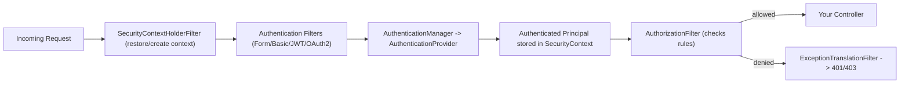

> [!TIP]
> Learn Spring Security as **filters that populate and then check a `SecurityContext`**. Authentication filters run first and answer "who is this?"; the authorization filter runs last and answers "can they do this?". Every annotation you write (`@PreAuthorize`, `.hasRole(...)`) is just a rule this pipeline evaluates — none of it is magic once you can see the flow.

---

# 1. Fundamentals (Beginner Level)

## 1.1 What Is Spring Security?

Spring Security is a library that adds authentication and authorization to a Spring application. Add the starter, and Spring Boot auto-configures a secure-by-default application: every endpoint requires login, using a form-login page and an auto-generated password, out of the box.

```xml
<dependency>
    <groupId>org.springframework.boot</groupId>
    <artifactId>spring-boot-starter-security</artifactId>
</dependency>
```

```text
Without any config, adding this starter to a Spring Boot app immediately:
    - Requires authentication for every endpoint
    - Generates a default "user" with a random password (printed in console logs)
    - Provides a default login page
```

## 1.2 Why Spring Security Exists

| Problem | Spring Security's Answer |
|---|---|
| Every app needs login, but rolling your own is error-prone | Battle-tested, pluggable authentication mechanisms |
| Passwords stored insecurely | Built-in strong password encoders (BCrypt, Argon2) |
| Need role/permission-based access control | Declarative authorization (`hasRole`, `@PreAuthorize`) |
| CSRF, session fixation, clickjacking are easy to get wrong | Protections enabled by default |
| Need to support many auth mechanisms (form, Basic, JWT, OAuth2, SSO) | Pluggable `AuthenticationProvider`/filter architecture |
| Need consistent security across many endpoints | Centralized filter-chain configuration, not per-controller checks |

## 1.3 Problems Spring Security Solves

Spring Security is especially good when you need:

- Centralized, consistent authentication/authorization instead of ad hoc checks scattered in controllers.
- Support for modern standards: OAuth2, OpenID Connect, JWT bearer tokens.
- Defense-in-depth defaults (CSRF, secure headers, session management) without manual setup.
- Method-level security (`@PreAuthorize`) alongside URL-level rules.

Spring Security is less critical (though still often used) when:

- The application is fully internal, behind a trusted network boundary with its own auth layer (e.g., a service mesh handling mTLS) — though most teams still use it for defense-in-depth.
- You're building a pure client-side SPA with no server-rendered pages and delegate all auth entirely to an external identity provider at the edge/gateway.

## 1.4 Real-World Analogy

Think of Spring Security like an airport's security process, not just a single checkpoint.

You don't get one check — you pass through several: ID verification (authentication: who are you?), a boarding pass check for your specific gate (authorization: are you allowed *here*?), and different lanes for different traveler types (different `AuthenticationProvider`s for password login vs. trusted-traveler/biometric vs. staff badges). If any check fails, you're redirected (401/403), never reaching the gate (your controller).

```text
Airport terminal        = your application
ID check                = Authentication (who are you?)
Gate-specific boarding pass check = Authorization (are you allowed HERE?)
Different traveler lanes = different AuthenticationProviders (password, JWT, OAuth2, SSO)
Security officer escorting you out = ExceptionTranslationFilter producing 401/403
```

## 1.5 Core Vocabulary

| Term | Meaning |
|---|---|
| Authentication | Verifying identity — "who are you?" |
| Authorization | Verifying permission — "are you allowed to do this?" |
| Principal | The currently authenticated identity (user, service, etc.) |
| `Authentication` object | Spring Security's representation of a (possibly unauthenticated) identity + credentials + authorities |
| `SecurityContext` | Holds the current `Authentication` for the current request/thread |
| `SecurityContextHolder` | Static accessor to the current `SecurityContext` |
| `AuthenticationManager` | Delegates authentication to one or more `AuthenticationProvider`s |
| `AuthenticationProvider` | Performs the actual authentication logic for one mechanism (e.g., DB-backed password check) |
| `UserDetailsService` | Loads user data (username, password hash, authorities) from a data source |
| `GrantedAuthority` | A permission/role string granted to a principal (e.g., `ROLE_ADMIN`) |
| `SecurityFilterChain` | The ordered list of Security filters applied to matching requests |

## 1.6 Minimal Security Configuration

```java
@Configuration
@EnableWebSecurity
public class SecurityConfig {

    @Bean
    public SecurityFilterChain filterChain(HttpSecurity http) throws Exception {
        http
            .authorizeHttpRequests(auth -> auth
                .requestMatchers("/public/**").permitAll()
                .anyRequest().authenticated()
            )
            .formLogin(Customizer.withDefaults());
        return http.build();
    }

    @Bean
    public PasswordEncoder passwordEncoder() {
        return new BCryptPasswordEncoder();
    }
}
```

## 1.7 `UserDetailsService`: Loading Users

```java
@Service
public class JpaUserDetailsService implements UserDetailsService {

    private final UserRepository userRepository;

    JpaUserDetailsService(UserRepository userRepository) {
        this.userRepository = userRepository;
    }

    @Override
    public UserDetails loadUserByUsername(String username) {
        User user = userRepository.findByUsername(username)
            .orElseThrow(() -> new UsernameNotFoundException(username));

        return org.springframework.security.core.userdetails.User
            .withUsername(user.getUsername())
            .password(user.getPasswordHash())
            .authorities(user.getRoles().toArray(new String[0]))
            .build();
    }
}
```

## 1.8 Basic Password Login Flow

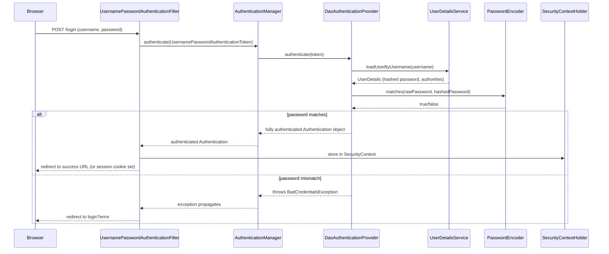

## 1.9 Basic Authorization Rules

```java
http.authorizeHttpRequests(auth -> auth
    .requestMatchers("/admin/**").hasRole("ADMIN")
    .requestMatchers(HttpMethod.GET, "/products/**").permitAll()
    .requestMatchers(HttpMethod.POST, "/products/**").hasAuthority("PRODUCT_WRITE")
    .anyRequest().authenticated()
);
```

| Method | Meaning |
|---|---|
| `permitAll()` | No authentication required |
| `authenticated()` | Must be logged in, any role |
| `hasRole("X")` | Must have authority `ROLE_X` |
| `hasAuthority("X")` | Must have the exact authority string `X` |
| `denyAll()` | Always rejected |

> [!WARNING]
> Rules are evaluated **in order, first match wins**. A broad `anyRequest().authenticated()` placed *before* a specific `requestMatchers("/admin/**").hasRole("ADMIN")` will match first and the admin-specific rule never gets a chance to apply. Order rules from most-specific to least-specific.

---

# 2. Core Concepts (Intermediate Level)

## 2.1 Full Authentication + Authorization Flow

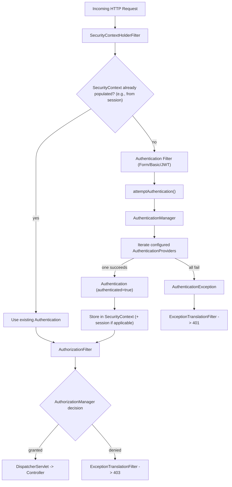

## 2.2 `SecurityContextHolder` and `SecurityContext`

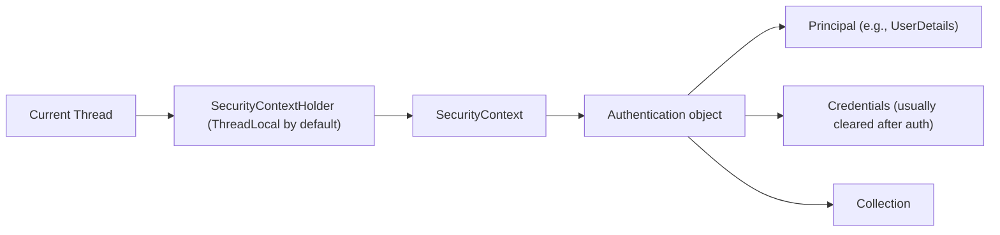

```java
Authentication auth = SecurityContextHolder.getContext().getAuthentication();
String username = auth.getName();
boolean isAdmin = auth.getAuthorities().stream()
    .anyMatch(a -> a.getAuthority().equals("ROLE_ADMIN"));
```

> [!IMPORTANT]
> `SecurityContextHolder` defaults to `ThreadLocal` storage strategy. This means the authenticated context is tied to the thread handling the request — if you hand work off to a **new thread** (e.g., inside an `@Async` method or a manually spawned thread) without explicitly propagating the context, that new thread sees **no authentication** at all.

## 2.3 The `Authentication` Object Lifecycle

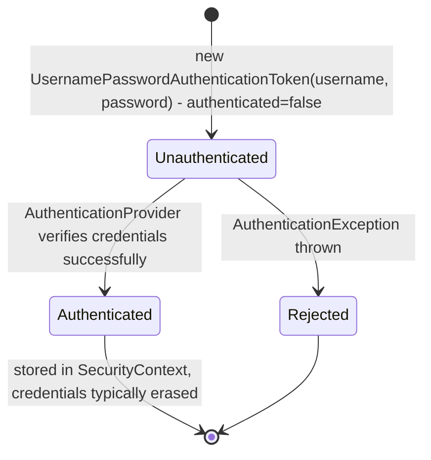

An `Authentication` object plays **two roles** at different points: before authentication, it carries the raw submitted credentials (`authenticated=false`); after a successful `AuthenticationProvider` call, a **new** `Authentication` object is returned representing the verified identity (`authenticated=true`), typically with credentials erased.

## 2.4 `AuthenticationManager` and `AuthenticationProvider`

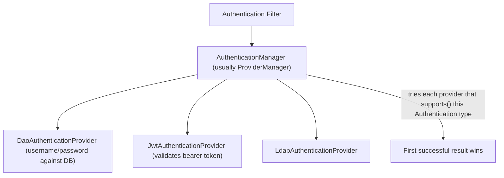

```java
@Bean
public AuthenticationManager authenticationManager(
        UserDetailsService userDetailsService, PasswordEncoder encoder) {
    DaoAuthenticationProvider provider = new DaoAuthenticationProvider();
    provider.setUserDetailsService(userDetailsService);
    provider.setPasswordEncoder(encoder);
    return new ProviderManager(provider);
}
```

`ProviderManager` (the default `AuthenticationManager` implementation) tries each registered `AuthenticationProvider` in turn, using only the ones whose `supports(authenticationClass)` returns true for the given `Authentication` type — this is how multiple auth mechanisms (password, JWT, LDAP) coexist in one app.

## 2.5 Password Encoding

```java
@Bean
public PasswordEncoder passwordEncoder() {
    return new BCryptPasswordEncoder(); // work factor tunable
}
```

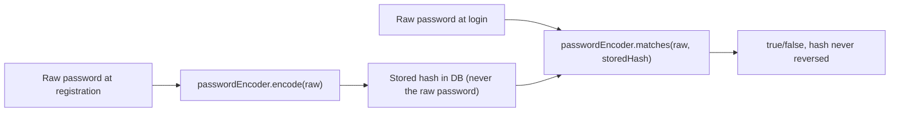

> [!WARNING]
> Never store plaintext or reversibly-encrypted passwords. `BCryptPasswordEncoder` (or Argon2) hashes are one-way and salted automatically — `matches()` re-hashes the input and compares, it never decrypts the stored value.

## 2.6 CSRF Protection

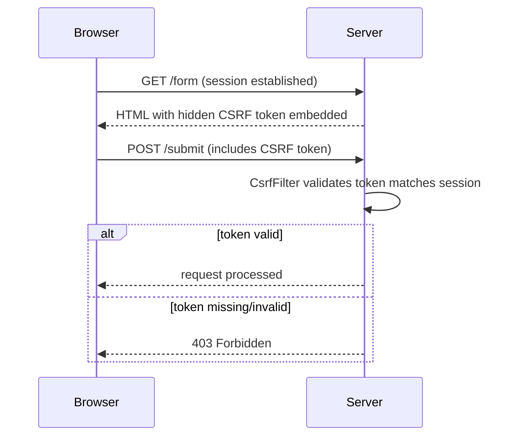

| Context | CSRF Protection Needed? |
|---|---|
| Server-rendered forms with session-based auth (cookies) | Yes — CSRF is enabled by default |
| Stateless REST APIs using bearer tokens (JWT in `Authorization` header) | Usually disabled — tokens aren't automatically sent by the browser like cookies are, so CSRF (which exploits automatic cookie-sending) doesn't apply the same way |

```java
http.csrf(csrf -> csrf.disable()); // only appropriate for stateless, token-based APIs
```

> [!WARNING]
> Disabling CSRF is only safe when your authentication mechanism doesn't rely on cookies being automatically sent by the browser (i.e., pure stateless bearer-token APIs). Disabling it on a cookie-session-based app removes real protection against cross-site request forgery.

## 2.7 Session Management

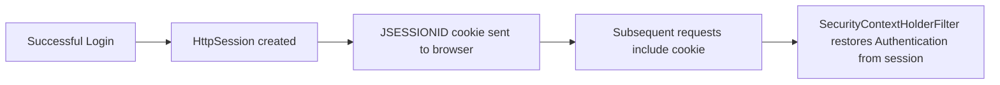

```java
http.sessionManagement(session -> session
    .sessionCreationPolicy(SessionCreationPolicy.IF_REQUIRED) // default
    .maximumSessions(1)
    .maxSessionsPreventsLogin(false)
);
```

| Policy | Meaning |
|---|---|
| `ALWAYS` | Always create a session |
| `IF_REQUIRED` (default) | Create a session only if needed |
| `NEVER` | Never create one, but use existing session if present |
| `STATELESS` | Never create or use a session — typical for JWT/token-based APIs |

## 2.8 Method-Level Security

```java
@Configuration
@EnableMethodSecurity
public class MethodSecurityConfig {}
```

```java
@Service
public class OrderService {

    @PreAuthorize("hasRole('ADMIN') or #order.customerId == authentication.name")
    public Order getOrder(Order order) {
        return order;
    }

    @PostAuthorize("returnObject.customerId == authentication.name")
    public Order findById(Long id) {
        return orderRepository.findById(id).orElseThrow();
    }
}
```

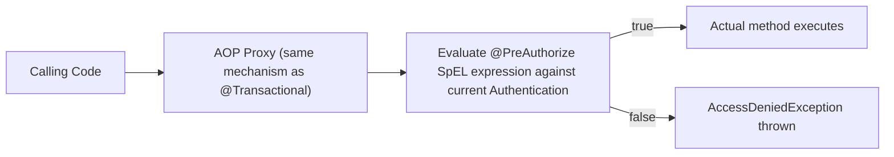

> [!TIP]
> `@PreAuthorize`/`@PostAuthorize` use the exact same AOP proxy mechanism as `@Transactional` — meaning the same self-invocation pitfall applies: calling an `@PreAuthorize`-annotated method from within the same class (`this.method()`) bypasses the security check entirely.

## 2.9 Exception Translation

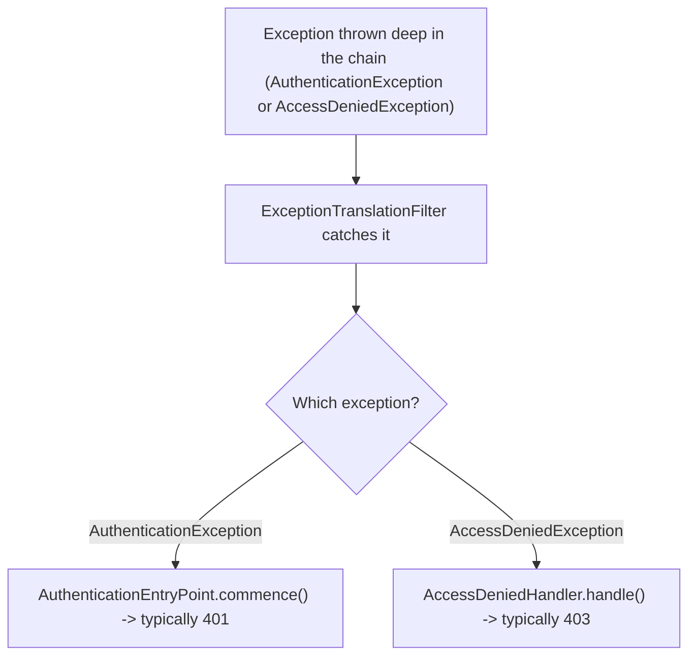

```java
@Bean
public SecurityFilterChain filterChain(HttpSecurity http) throws Exception {
    http.exceptionHandling(ex -> ex
        .authenticationEntryPoint((request, response, authEx) -> {
            response.setStatus(HttpServletResponse.SC_UNAUTHORIZED);
            response.setContentType("application/json");
            response.getWriter().write("{\"error\":\"unauthenticated\"}");
        })
        .accessDeniedHandler((request, response, accessEx) -> {
            response.setStatus(HttpServletResponse.SC_FORBIDDEN);
            response.setContentType("application/json");
            response.getWriter().write("{\"error\":\"forbidden\"}");
        })
    );
    return http.build();
}
```

## 2.10 Basic Testing

```java
@SpringBootTest
@AutoConfigureMockMvc
class OrderControllerSecurityTest {

    @Autowired
    private MockMvc mockMvc;

    @Test
    @WithMockUser(roles = "ADMIN")
    void adminCanAccessAdminEndpoint() throws Exception {
        mockMvc.perform(get("/admin/reports"))
            .andExpect(status().isOk());
    }

    @Test
    void unauthenticatedRequestIsRejected() throws Exception {
        mockMvc.perform(get("/admin/reports"))
            .andExpect(status().isUnauthorized());
    }
}
```

---

# 3. Advanced Concepts (Senior Level)

## 3.1 The Full Internal Filter Chain, In Order

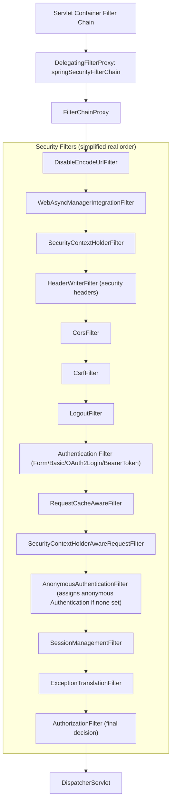

| Filter | Role |
|---|---|
| `SecurityContextHolderFilter` | Loads `SecurityContext` from the session (or elsewhere) at request start, saves it back at the end |
| `HeaderWriterFilter` | Adds security headers (`X-Content-Type-Options`, `X-Frame-Options`, etc.) |
| `CsrfFilter` | Validates CSRF tokens for state-changing requests |
| `LogoutFilter` | Handles logout URL, clears authentication/session |
| Authentication filter | The specific mechanism configured (form login, Basic auth, JWT bearer, OAuth2 login) |
| `AnonymousAuthenticationFilter` | If nothing else authenticated the request, assigns a special "anonymous" `Authentication` so downstream code always has *some* `Authentication` object to check |
| `ExceptionTranslationFilter` | Catches security exceptions thrown further down and converts them to HTTP responses |
| `AuthorizationFilter` | The final gate — makes the allow/deny decision for this specific request |

> [!IMPORTANT]
> `AnonymousAuthenticationFilter` means `SecurityContextHolder.getContext().getAuthentication()` is almost **never actually `null`** in a typical Spring Security app — an unauthenticated request still gets a non-null `Authentication` representing the anonymous user (with authority `ROLE_ANONYMOUS`). Checking "is authenticated" should use `authentication.isAuthenticated()` combined with checking it's not an `AnonymousAuthenticationToken`, which is exactly what `.authenticated()` in `authorizeHttpRequests` does for you.

## 3.2 JWT Bearer Token Authentication Flow (Stateless API)

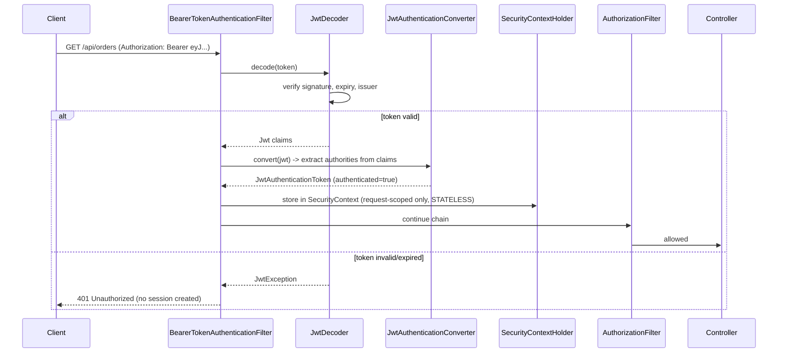

```java
@Bean
public SecurityFilterChain filterChain(HttpSecurity http) throws Exception {
    http
        .sessionManagement(session -> session.sessionCreationPolicy(SessionCreationPolicy.STATELESS))
        .csrf(csrf -> csrf.disable())
        .authorizeHttpRequests(auth -> auth
            .requestMatchers("/public/**").permitAll()
            .anyRequest().authenticated())
        .oauth2ResourceServer(oauth2 -> oauth2.jwt(Customizer.withDefaults()));
    return http.build();
}
```

Key point: with `SessionCreationPolicy.STATELESS`, **no session is created**, so this flow repeats identically for *every single request* — the JWT is re-validated every time, and the `SecurityContext` never persists between requests. This is fundamentally different from form-login's session-based flow, where authentication happens once and is restored from the session on later requests.

## 3.3 OAuth2 Authorization Code Flow (Login via External Provider)

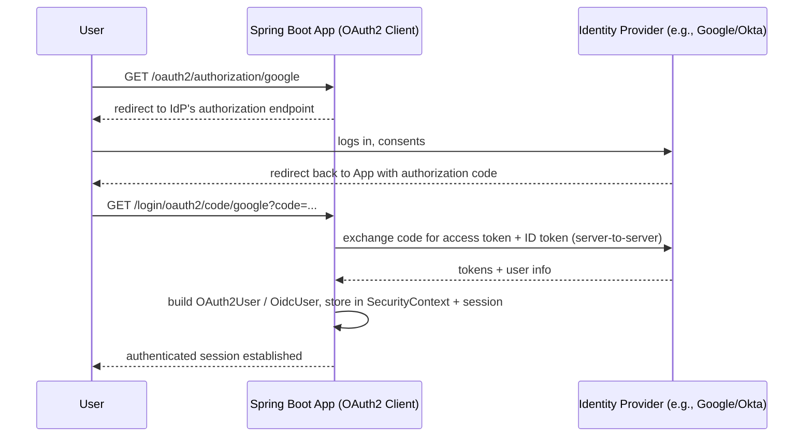

```java
http.oauth2Login(Customizer.withDefaults());
```

| Role | Responsibility |
|---|---|
| OAuth2 Client (your Spring Boot app) | Initiates the flow, exchanges the code for tokens |
| Authorization Server / Identity Provider | Authenticates the user, issues codes/tokens |
| Resource Server | Validates bearer tokens on subsequent API calls (can be the same app or a separate one) |

## 3.4 Custom `AuthenticationProvider`

```java
@Component
public class ApiKeyAuthenticationProvider implements AuthenticationProvider {

    private final ApiKeyRepository apiKeyRepository;

    @Override
    public Authentication authenticate(Authentication authentication) {
        String apiKey = (String) authentication.getCredentials();
        ApiKeyRecord record = apiKeyRepository.findByKey(apiKey)
            .orElseThrow(() -> new BadCredentialsException("Invalid API key"));

        return new ApiKeyAuthenticationToken(record.getClientId(), apiKey, record.getAuthorities());
    }

    @Override
    public boolean supports(Class<?> authenticationType) {
        return ApiKeyAuthenticationToken.class.isAssignableFrom(authenticationType);
    }
}
```

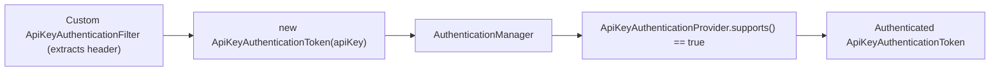

This is the extension point for any non-standard authentication mechanism (API keys, mutual TLS certificate identity, custom SSO protocols) — implement `AuthenticationProvider` + a small custom `Filter` that constructs the unauthenticated token from the incoming request.

## 3.5 Authorization Beyond Roles: `AuthorizationManager` and ABAC

```java
http.authorizeHttpRequests(auth -> auth
    .requestMatchers("/orders/**").access(new WebExpressionAuthorizationManager(
        "hasRole('ADMIN') or @orderSecurity.isOwner(authentication, request)"))
);
```

```java
@Component("orderSecurity")
public class OrderSecurity {
    public boolean isOwner(Authentication authentication, HttpServletRequest request) {
        String orderId = extractOrderId(request);
        return orderRepository.findById(orderId)
            .map(order -> order.getCustomerId().equals(authentication.getName()))
            .orElse(false);
    }
}
```

Modern Spring Security's `AuthorizationManager` abstraction supports arbitrary logic beyond simple role checks — enabling attribute-based access control (ABAC), like "admins or the resource owner," evaluated per-request.

## 3.6 CORS + Security Interaction

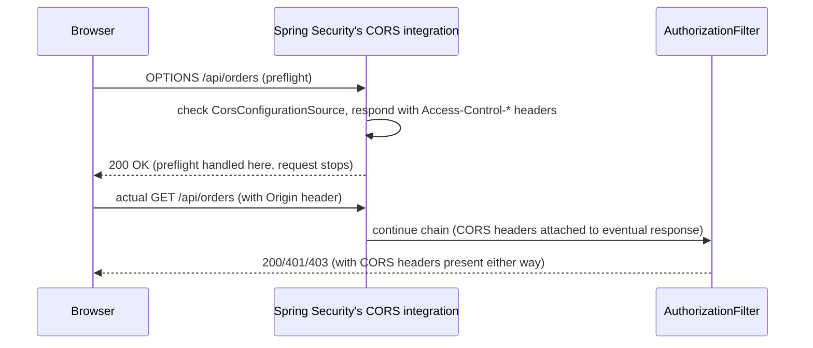

```java
@Bean
public CorsConfigurationSource corsConfigurationSource() {
    CorsConfiguration config = new CorsConfiguration();
    config.setAllowedOrigins(List.of("https://app.example.com"));
    config.setAllowedMethods(List.of("GET", "POST", "PUT", "DELETE"));
    config.setAllowCredentials(true);

    UrlBasedCorsConfigurationSource source = new UrlBasedCorsConfigurationSource();
    source.registerCorsConfiguration("/**", config);
    return source;
}
```

> [!WARNING]
> `.setAllowCredentials(true)` combined with `.setAllowedOrigins("*")` is invalid and a security risk — browsers reject it, and Spring will throw at startup. Always pair credentialed CORS with an explicit origin allow-list.

## 3.7 Multiple Security Filter Chains

```java
@Bean
@Order(1)
public SecurityFilterChain apiFilterChain(HttpSecurity http) throws Exception {
    http.securityMatcher("/api/**")
        .sessionManagement(s -> s.sessionCreationPolicy(SessionCreationPolicy.STATELESS))
        .oauth2ResourceServer(oauth2 -> oauth2.jwt(Customizer.withDefaults()));
    return http.build();
}

@Bean
@Order(2)
public SecurityFilterChain webFilterChain(HttpSecurity http) throws Exception {
    http.securityMatcher("/**")
        .formLogin(Customizer.withDefaults());
    return http.build();
}
```

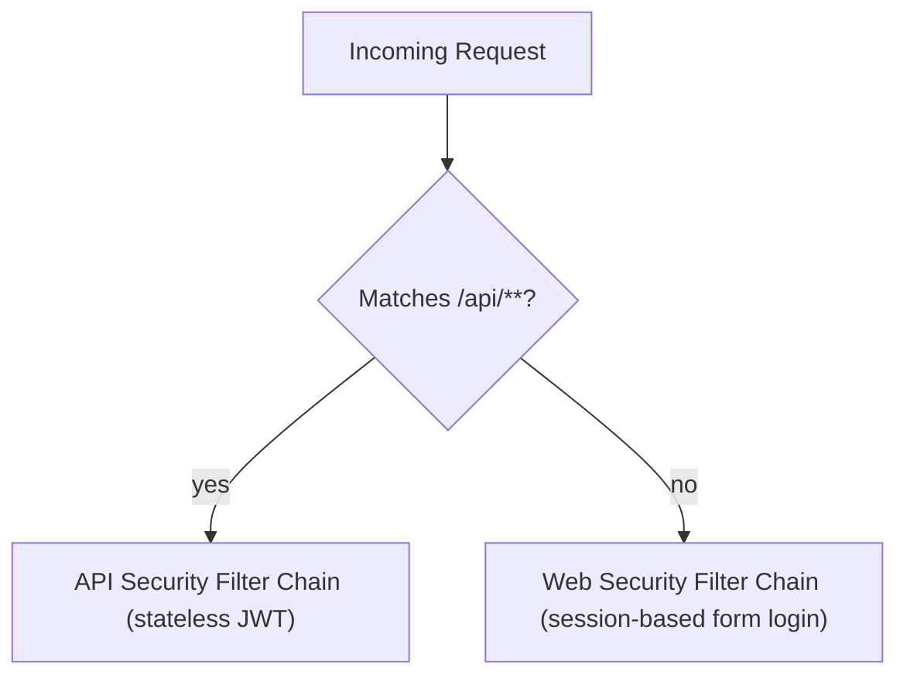

One application can run **multiple independent `SecurityFilterChain`s**, each scoped to a URL pattern via `securityMatcher`, allowing (for example) stateless JWT auth for `/api/**` and session-based form login for everything else, evaluated in `@Order`.

## 3.8 Failure Scenarios

| Failure | Symptom | Common Cause | Fix |
|---|---|---|---|
| Endless redirect loop to `/login` | Browser shows "too many redirects" | Login page itself not `permitAll()`-ed, or misconfigured success handler redirecting back to a protected page | Explicitly `permitAll()` the login page and static assets |
| `@PreAuthorize` silently not enforced | Method executes despite failing the expression | Self-invocation bypassing the AOP proxy | Call through a separate bean, restructure |
| Works with Postman, fails from browser (CORS) | Preflight succeeds but actual request blocked | CORS configuration missing/misordered relative to Security, or credentials+wildcard origin conflict | Configure `CorsConfigurationSource` explicitly, verify origin allow-list |
| JWT accepted after user is "logged out" | Revoked/logged-out tokens still work | JWTs are stateless and self-validating; logout can't invalidate them without extra infrastructure | Use short expiry + refresh tokens, or a token blocklist/revocation store |
| Async task has no `Authentication` | `SecurityContextHolder.getContext().getAuthentication()` is `null`/anonymous inside `@Async` | `ThreadLocal` context not propagated to the new thread | Configure `SecurityContextHolder.setStrategyName(MODE_INHERITABLETHREADLOCAL)` or explicitly propagate context |
| Ordering bug: broad rule matches before specific rule | A specific `hasRole` rule never applies | Rules declared out of specificity order in `authorizeHttpRequests` | Reorder from most-specific to least-specific |
| CSRF 403 on legitimate API POST | Valid state-changing request rejected | CSRF still enabled for a stateless bearer-token API where it isn't meaningful | Disable CSRF only for genuinely stateless, non-cookie-based auth |
| Default generated password shown in logs | Unexpected login prompt with a random password in console | No custom `UserDetailsService`/security config provided yet | Configure real users/authentication before deploying beyond local dev |

## 3.9 Security-of-Security: Hardening Considerations

| Risk | Mitigation |
|---|---|
| Long-lived JWTs that can't be revoked | Short access-token expiry + refresh token rotation |
| Sensitive data in JWT claims | Keep claims minimal; treat JWTs as visible to the client (they're only signed, not encrypted, unless using JWE) |
| Password brute-forcing | Rate limiting on login endpoints, account lockout policies |
| Session fixation | Spring Security regenerates the session ID on login by default — don't disable this |
| Clickjacking | `X-Frame-Options`/CSP headers, enabled by default via `HeaderWriterFilter` |
| Missing HTTPS | Enforce `requiresChannel().anyRequest().requiresSecure()` in production configs |
| Verbose authentication error messages | Avoid revealing "username exists but wrong password" vs. "username doesn't exist" distinctly — use a generic message |

---

# 4. Real-World System Design Usage

## 4.1 Where Spring Security Is Used in Production

- Every secured Spring Boot REST API and web application.
- Microservices acting as OAuth2 Resource Servers validating JWTs issued by a central identity provider (Keycloak, Okta, Auth0, Cognito).
- Internal admin tools using session-based form login with role-based access control.
- Public APIs using API-key-based custom authentication for third-party integrators.

## 4.2 Typical Production Architecture (Microservices + Central Identity Provider)

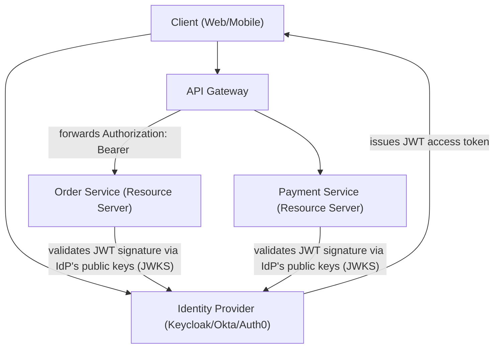

Each downstream service independently validates the JWT's signature (via the identity provider's published JWKS endpoint) and extracts authorities from its claims — no service needs to call the identity provider synchronously per-request for token validation itself (only to fetch/cache the public keys).

## 4.3 Big-Company Style Thinking

| Concern | Spring Security Design Response |
|---|---|
| Reliability | Stateless JWT validation (no shared session store dependency across service instances) |
| Scale | `SessionCreationPolicy.STATELESS` avoids sticky-session requirements at the load balancer |
| Observability | Custom `AuthenticationEntryPoint`/`AccessDeniedHandler` emit structured, loggable security events |
| Security | Centralized identity provider, short-lived tokens, ABAC via `AuthorizationManager` for fine-grained rules |
| Maintainability | Method-level `@PreAuthorize` co-located with business logic; URL-level rules for coarse routing-level access |
| Compliance | Audit logging of authentication/authorization decisions, enforced HTTPS, password policy enforcement |

## 4.4 Example: Securing an Order API End-to-End

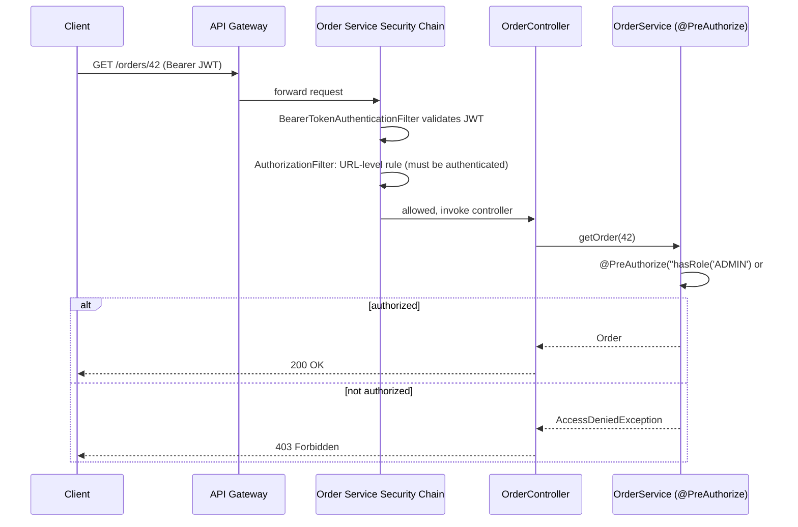

Notice the two layers of authorization: coarse URL-level rules in the filter chain (must be authenticated at all) and fine-grained method-level rules (must own this specific resource or be an admin) — a common and recommended production pattern.

## 4.5 Layered Security Architecture

```text
Edge / Gateway Layer
    - TLS termination
    - Coarse rate limiting
    - Optional: JWT validation at the gateway for fail-fast rejection

Service Security Filter Chain Layer
    - Authentication (JWT/session/API key)
    - URL-level authorization rules (authorizeHttpRequests)

Method-Level Security Layer
    - @PreAuthorize / @PostAuthorize for resource-ownership and fine-grained rules

Domain/Business Layer
    - Assumes security has already been enforced; focuses on business logic
```

## 4.6 Integration with Other Systems

| System | Spring Security Integration |
|---|---|
| Identity Providers | OAuth2/OIDC login (`oauth2Login`), Resource Server JWT validation (`oauth2ResourceServer`) |
| Databases | `UserDetailsService` backed by JPA/JDBC for credential storage |
| Caching | Session stores externalized to Redis (Spring Session) for horizontally scaled session-based apps |
| API Gateway | Gateway-level auth (e.g., Spring Cloud Gateway with its own Security filters) complementing per-service checks |
| Observability | Custom handlers logging authentication failures/access denials as structured security events |
| Secrets management | JWT signing keys, OAuth2 client secrets stored in Vault/KMS, not source code |

---

# 5. Interview Preparation

## 5.1 What Interviewers Expect

For "Spring Security" topics, interviewers usually expect:

- You can explain the difference between authentication and authorization clearly.
- You understand `SecurityContextHolder`/`SecurityContext`/`Authentication` and how they relate.
- You can configure basic URL-level and method-level security rules.
- You know how password encoding works and why plaintext storage is wrong.

For senior backend roles, they also expect:

- You can draw/explain the full internal filter chain and where a given filter sits.
- You understand stateless (JWT) vs. stateful (session) security models and their trade-offs.
- You can debug "why is this request rejected" by reasoning about filter/rule order.
- You know the self-invocation pitfall for `@PreAuthorize` (same as `@Transactional`).
- You understand OAuth2/OIDC flows at a conceptual level, not just annotations.

## 5.2 Most Important Questions and Answers

### Q1. What's the difference between authentication and authorization?

Authentication verifies identity — confirming *who* is making the request. Authorization verifies permission — confirming *what* that identified (or anonymous) principal is allowed to do. Authentication always happens first; authorization decisions are made based on its result.

### Q2. Is Spring Security a separate framework from Servlet Filters?

No — it's implemented entirely as a chain of Servlet Filters registered via a single `DelegatingFilterProxy`/`FilterChainProxy` within the container's filter chain. Every Spring Security concept (authentication, CSRF, authorization) is a specific filter running in a well-defined order.

### Q3. What is `SecurityContextHolder`, and how does it store the current user?

It's a static accessor to the `SecurityContext`, which holds the current `Authentication` object (principal, authorities, authenticated flag). By default it uses `ThreadLocal` storage, meaning the authenticated identity is tied to the thread handling the current request.

### Q4. How does password authentication actually verify a password without storing it?

Passwords are hashed with a one-way, salted algorithm (BCrypt/Argon2) at registration. At login, the raw submitted password is re-hashed and compared to the stored hash via `passwordEncoder.matches(raw, storedHash)` — the stored hash is never decrypted, because it can't be.

### Q5. What is the difference between session-based and JWT-based (stateless) authentication?

Session-based authentication authenticates once, stores the result server-side (`HttpSession`), and identifies subsequent requests via a session cookie. JWT-based (stateless) authentication has the client present a self-contained, signed token on every request; the server validates the signature/claims each time without any server-side session state — trading easier revocation (session-based) for horizontal scalability without shared session storage (JWT-based).

### Q6. Why can't a JWT be easily "logged out" or revoked?

A JWT is self-contained and cryptographically valid until its expiry, regardless of server-side state — there's no session to delete. Mitigations include keeping access tokens short-lived, using refresh tokens that *can* be revoked server-side, or maintaining an explicit token blocklist (which reintroduces some statefulness).

### Q7. Why might `@PreAuthorize` not be enforced even though it's correctly annotated?

Like `@Transactional`, `@PreAuthorize` relies on an AOP proxy wrapping the bean. Calling the annotated method via self-invocation (`this.method()` from within the same class) bypasses the proxy entirely, so the security check never runs.

### Q8. What does `AnonymousAuthenticationFilter` do, and why does it matter?

It assigns a special "anonymous" `Authentication` (with authority `ROLE_ANONYMOUS`) to any request that wasn't otherwise authenticated, ensuring `SecurityContextHolder.getContext().getAuthentication()` is essentially never `null`. This is why authorization checks test `.isAuthenticated()` rather than null-checking the `Authentication` object.

### Q9. What's the purpose of `ExceptionTranslationFilter`?

It catches `AuthenticationException` and `AccessDeniedException` thrown anywhere further down the filter chain and translates them into appropriate HTTP responses — invoking an `AuthenticationEntryPoint` (typically producing 401) or an `AccessDeniedHandler` (typically producing 403).

### Q10. Why is CSRF protection usually disabled for stateless JWT APIs but not for session-based web apps?

CSRF attacks exploit the browser's automatic inclusion of cookies (like session cookies) on cross-site requests. A stateless API using an `Authorization: Bearer <token>` header isn't automatically attached by the browser the way cookies are, so the CSRF attack vector doesn't apply the same way — but disabling CSRF on a cookie/session-based app removes real protection.

## 5.3 Tricky Questions

### If `SecurityContextHolder` uses `ThreadLocal`, what happens to authentication inside an `@Async` method?

By default, the new thread has no access to the calling thread's `ThreadLocal`, so `SecurityContextHolder.getContext().getAuthentication()` returns an anonymous/empty context inside the async method unless you explicitly configure `SecurityContextHolder.setStrategyName(SecurityContextHolder.MODE_INHERITABLETHREADLOCAL)` or manually propagate the context.

### Can you have both session-based and stateless JWT authentication in the same application?

Yes, via multiple `SecurityFilterChain` beans scoped with `securityMatcher()` to different URL patterns (e.g., `/api/**` stateless JWT, everything else session-based form login), each evaluated in `@Order`.

### Does `hasRole("ADMIN")` check for the string `"ADMIN"` or `"ROLE_ADMIN"`?

`hasRole("ADMIN")` automatically prefixes with `ROLE_`, checking for the authority `ROLE_ADMIN`. `hasAuthority("ADMIN")` checks for the exact string `ADMIN` with no prefix added — a common source of confusion when authorities are stored without the `ROLE_` prefix in the database.

### Why might two identical-looking authorization rules behave differently depending on order?

`authorizeHttpRequests` rules are evaluated in the order they're declared, and the **first matching rule wins** — it does not evaluate all rules and pick the most specific one. A broad rule declared before a narrow one will shadow it entirely.

## 5.4 Common Candidate Mistakes

- Describing authentication and authorization as the same thing.
- Not knowing Spring Security is built on Servlet Filters.
- Assuming `SecurityContextHolder.getContext().getAuthentication()` can be `null` for unauthenticated requests (it's usually an anonymous token instead).
- Declaring `authorizeHttpRequests` rules in the wrong order (broad before narrow).
- Storing plaintext or reversibly encrypted passwords.
- Disabling CSRF blindly "to make it work" without understanding when it's actually safe.
- Not knowing the self-invocation pitfall for `@PreAuthorize`.
- Confusing `hasRole` (adds `ROLE_` prefix) with `hasAuthority` (exact string match).

## 5.5 Interview Coding Checklist

- [ ] Use constructor-injected `PasswordEncoder`, never roll your own hashing.
- [ ] Order `authorizeHttpRequests` rules from most-specific to least-specific.
- [ ] Choose session-based vs. stateless (JWT) deliberately based on the API's actual needs.
- [ ] Disable CSRF only for genuinely stateless, non-cookie-based authentication.
- [ ] Add method-level `@PreAuthorize` for resource-ownership checks the URL layer can't express.
- [ ] Provide custom `AuthenticationEntryPoint`/`AccessDeniedHandler` for clean API error responses.

---

# 6. Hands-On Thinking

## 6.1 Three Real-World Projects Using Spring Security

### Project 1: Session-Based Admin Dashboard

Concepts:

- Form login with `UserDetailsService` backed by a database.
- Role-based URL authorization (`hasRole("ADMIN")`).
- CSRF protection enabled (default, appropriate for session/cookie auth).
- Session fixation protection (default behavior, not disabled).

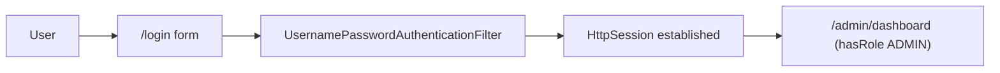

### Project 2: Stateless JWT REST API

Concepts:

- `SessionCreationPolicy.STATELESS`.
- `oauth2ResourceServer().jwt(...)` validating tokens from an external identity provider.
- Custom `AuthenticationEntryPoint` returning JSON error bodies.
- Method-level `@PreAuthorize` for resource ownership.

```mermaid
flowchart LR
    Client --> JWT["Bearer JWT"] --> ResourceServer["Order Service (Resource Server)"]
    ResourceServer --> Validate["Validate signature via IdP JWKS"]
    Validate --> Controller["Controller (stateless per request)"]
```

### Project 3: Multi-Auth Public API (API Key + OAuth2)

Concepts:

- Custom `AuthenticationProvider` for API-key-based third-party integrator access.
- OAuth2 login for first-party web/mobile clients.
- Multiple `SecurityFilterChain`s scoped by URL pattern.
- Rate limiting layered on top of authentication for API-key clients.

```mermaid
flowchart TB
    ThirdParty["Third-Party Integrator"] -->|"X-API-Key header"| ApiKeyChain["/partner-api/** Security Chain (ApiKeyAuthenticationProvider)"]
    FirstParty["First-Party Web App"] -->|"OAuth2 login"| OAuthChain["/** Security Chain (oauth2Login)"]
```

## 6.2 Step-by-Step Design Approach

For any Spring Security configuration task:

1. Decide the authentication model per client type: session-based (browsers, first-party) vs. stateless token-based (APIs, mobile, third-party).
2. Define `UserDetailsService`/`AuthenticationProvider` for each mechanism needed.
3. Configure URL-level rules (`authorizeHttpRequests`) from most-specific to least-specific.
4. Add method-level `@PreAuthorize`/`@PostAuthorize` for rules the URL layer can't express (resource ownership).
5. Decide CSRF policy based on whether cookies/sessions are involved.
6. Configure custom `AuthenticationEntryPoint`/`AccessDeniedHandler` for clean, consistent error responses.
7. Test both the "allowed" and "denied" paths explicitly with `@WithMockUser`/`MockMvc`.
8. Review token/session expiry and revocation strategy before production.

## 6.3 Production Implementation Approach

```mermaid
flowchart TD
    A["Identify client types and auth models needed"] --> B["Configure AuthenticationProviders/UserDetailsService"]
    B --> C["Configure SecurityFilterChain(s) with URL-level rules"]
    C --> D["Add method-level security for fine-grained rules"]
    D --> E["Configure CSRF/session policy appropriately per chain"]
    E --> F["Custom error handling (EntryPoint/AccessDeniedHandler)"]
    F --> G["Test allowed + denied paths"]
    G --> H["Security review: token expiry, revocation, secrets"]
    H --> I["Production deployment"]
```

## 6.4 Production Readiness Example

For a Spring Security-secured service, define:

- Explicit, ordered `authorizeHttpRequests` rules reviewed for shadowing bugs.
- Token expiry and refresh/revocation strategy documented (for JWT-based auth).
- CSRF policy matched correctly to the auth model per `SecurityFilterChain`.
- Structured logging of authentication failures and access-denied events (without logging credentials).
- HTTPS enforced (`requiresSecure()`) in production configuration.
- Regular review of `@PreAuthorize` expressions for self-invocation bugs.
- Dependency scanning for Spring Security CVEs (security libraries are a high-value patching target).

---

# 7. Deep Dive (Optional but Important)

## 7.1 How `@EnableWebSecurity` Wires Everything Together

```mermaid
flowchart TB
    Enable["@EnableWebSecurity"] --> Import["Imports WebSecurityConfiguration"]
    Import --> BuildChain["Builds SecurityFilterChain bean(s) from HttpSecurity DSL calls"]
    BuildChain --> Register["Registers FilterChainProxy as springSecurityFilterChain bean"]
    Register --> DFP["Spring Boot auto-registers DelegatingFilterProxy pointing to it in the container's filter chain"]
```

`HttpSecurity` is a builder: each `.authorizeHttpRequests(...)`, `.formLogin(...)`, `.oauth2ResourceServer(...)` call configures and adds the corresponding filter(s) to the eventual `SecurityFilterChain`, which `FilterChainProxy` then delegates to for matching requests.

## 7.2 `FilterChainProxy`: Matching Requests to Chains

```mermaid
flowchart TB
    Req["Incoming Request"] --> FCP["FilterChainProxy"]
    FCP --> Chains["Iterate configured SecurityFilterChains in order"]
    Chains --> Match{"chain.matches(request)?"}
    Match -->|"first match"| Selected["Use this chain's filters for the request"]
    Match -->|"no match"| Next["Try next chain"]
```

`FilterChainProxy` is the single Filter registered with the Servlet container; internally, it holds a list of `SecurityFilterChain`s (each with its own `RequestMatcher` and filter list) and delegates to the **first one whose matcher matches** the incoming request — this is the mechanism behind the "multiple security filter chains" pattern shown earlier.

## 7.3 JWT Structure and Validation Internals

```text
JWT = base64url(header) + "." + base64url(payload) + "." + base64url(signature)

header:  {"alg": "RS256", "typ": "JWT"}
payload: {"sub": "user123", "roles": ["ADMIN"], "exp": 1735689600, "iss": "https://idp.example.com"}
signature: RSA-SHA256 signature over header+payload, using the IdP's private key
```

```mermaid
flowchart LR
    Token["Incoming JWT"] --> Parse["Parse header + payload + signature"]
    Parse --> Fetch["Fetch IdP's public key via JWKS endpoint (cached)"]
    Fetch --> Verify["Verify signature against public key"]
    Verify --> CheckClaims["Check exp, iss, aud claims"]
    CheckClaims -->|"all valid"| Valid["Authentication built from claims"]
    CheckClaims -->|"any invalid"| Invalid["JwtException -> 401"]
```

> [!IMPORTANT]
> A JWT's payload is **base64-encoded, not encrypted** — anyone with the token can decode and read its claims (though they can't forge a valid signature without the private key). Never put secrets or sensitive PII directly in JWT claims; treat them as visible to the client.

## 7.4 `RequestMatcher` Internals

```java
new AntPathRequestMatcher("/admin/**")
new RegexRequestMatcher("^/api/v[0-9]+/.*$", null)
```

`authorizeHttpRequests`/`securityMatcher` rely on `RequestMatcher` implementations to decide whether a rule/chain applies to a given request — understanding this explains subtle bugs like a trailing-slash mismatch (`/admin` vs. `/admin/`) causing a rule to unexpectedly not match.

## 7.5 Password Encoder Internals (BCrypt)

```text
BCrypt hash format: $2a$10$N9qo8uLOickgx2ZMRZoMyeIjZAgcfl7p92ldGxad68LJZdL17lhWy
                     |  |  |
                     |  |  22-character salt + 31-character hash
                     |  cost factor (2^10 = 1024 rounds)
                     algorithm version
```

The cost factor controls how computationally expensive each hash operation is — deliberately slow to resist brute-force attacks, and tunable upward over time as hardware gets faster (`new BCryptPasswordEncoder(12)` for a higher cost factor).

## 7.6 Debugging Tools

| Tool/Technique | Purpose |
|---|---|
| `logging.level.org.springframework.security=DEBUG` | Logs every filter's decision for a request, including which chain matched and why access was granted/denied |
| Spring Security's `spring-security-test` (`@WithMockUser`) | Test controller/method security without a real authentication flow |
| `/actuator/conditions` | Confirms whether Spring Security auto-configuration applied as expected |
| jwt.io (or equivalent decoder, used carefully with non-sensitive tokens) | Inspect JWT claims/header for debugging token content |
| Browser DevTools | Inspect `Set-Cookie`/session behavior, CORS preflight vs. actual request handling |

```bash
curl -v -H "Authorization: Bearer <token>" http://localhost:8080/api/orders
```

---

# Production Checklists

## Code Quality Checklist

- [ ] `authorizeHttpRequests` rules ordered from most-specific to least-specific.
- [ ] `UserDetailsService` and `PasswordEncoder` explicitly configured, not left at unstated defaults.
- [ ] Method-level `@PreAuthorize` used for rules URL matching can't express (resource ownership).
- [ ] No self-invocation of `@PreAuthorize`-annotated methods within the same class.
- [ ] Custom `AuthenticationEntryPoint`/`AccessDeniedHandler` for consistent API error responses.

## Performance/Scalability Checklist

- [ ] Session vs. stateless model chosen deliberately per API/client type.
- [ ] JWKS public keys cached appropriately, not fetched on every request.
- [ ] Session store externalized (Spring Session + Redis) if running multiple instances with session-based auth.

## Security Checklist

- [ ] Passwords hashed with BCrypt/Argon2, never stored plaintext or reversibly encrypted.
- [ ] CSRF enabled for cookie/session-based flows; disabled only for genuinely stateless token auth.
- [ ] HTTPS enforced in production (`requiresSecure()`).
- [ ] Token expiry short-lived, with a documented refresh/revocation strategy.
- [ ] CORS configured with explicit origins, never wildcard combined with credentials.
- [ ] Sensitive claims/PII kept out of JWT payloads.
- [ ] Rate limiting/lockout applied to authentication endpoints.

## Debugging Checklist

- [ ] Reproduce with `DEBUG` logging on `org.springframework.security`.
- [ ] Check rule order when an expected authorization outcome doesn't match.
- [ ] Check for self-invocation when `@PreAuthorize` seems ignored.
- [ ] Distinguish 401 (authentication failure) from 403 (authorization failure) precisely when debugging.
- [ ] Verify JWT claims/expiry directly when token-based auth behaves unexpectedly.

---

# Learning Roadmap

## Phase 1: Beginner

Learn:

- Authentication vs. authorization.
- Basic `SecurityFilterChain` configuration (`authorizeHttpRequests`, `formLogin`).
- `UserDetailsService` and password encoding.
- Basic role-based URL rules.

Practice:

- Secure a simple CRUD app with form login and two roles (USER, ADMIN).

## Phase 2: Intermediate

Learn:

- `SecurityContextHolder`/`Authentication` lifecycle.
- `AuthenticationManager`/`AuthenticationProvider` architecture.
- CSRF, session management policies.
- Method-level security (`@PreAuthorize`).
- Exception translation (`AuthenticationEntryPoint`/`AccessDeniedHandler`).

Practice:

- Add method-level resource-ownership checks to the CRUD app.
- Write `MockMvc` tests for both allowed and denied paths.

## Phase 3: Advanced

Learn:

- The full internal filter chain, in order.
- JWT bearer token authentication (stateless resource server).
- OAuth2 login flow (authorization code grant).
- Custom `AuthenticationProvider` for non-standard mechanisms.
- Multiple `SecurityFilterChain`s in one application.

Practice:

- Convert the CRUD app's API to stateless JWT auth, keep an admin UI on session-based form login.
- Add a third-party API-key authentication mechanism alongside it.

## Phase 4: Production Security Engineer

Learn:

- ABAC via custom `AuthorizationManager`.
- Token revocation strategies and refresh token rotation.
- `ThreadLocal` propagation pitfalls (`@Async` + security context).
- Security hardening (headers, HTTPS enforcement, rate limiting).
- Debugging tools and structured security event logging.

Practice:

- Production-style multi-chain application: OAuth2 login for users, JWT resource server for APIs, API keys for partners, full audit logging, and hardened configuration reviewed against a security checklist.

---

# Self-Review Completion Loop

The topic was reviewed against:

- Spring Security reference documentation (architecture, servlet filter chain, OAuth2/JWT support).
- Servlet Filter architecture (building on [[07 Servlets and Filters]]).
- Common production incident patterns (rule ordering, self-invocation, CORS/CSRF interaction, ThreadLocal propagation).
- Interview patterns for beginner through senior backend/security-focused roles.

## Gap Review Matrix

| Area | Covered? | Notes |
|---|---|---|
| Authentication vs. authorization | Yes | Clear conceptual distinction, analogy |
| `SecurityContext`/`SecurityContextHolder` | Yes | ThreadLocal behavior and async pitfall |
| `AuthenticationManager`/`AuthenticationProvider` | Yes | Multi-provider architecture diagram |
| Password encoding | Yes | BCrypt internals, one-way hashing |
| Full internal filter chain | Yes | Complete ordered diagram with roles |
| JWT/stateless auth flow | Yes | Full sequence diagram, structure, validation |
| OAuth2 login flow | Yes | Authorization code grant sequence diagram |
| CSRF | Yes | When needed vs. safe to disable |
| Session management | Yes | Policies, fixation protection |
| Method-level security | Yes | `@PreAuthorize`/`@PostAuthorize`, self-invocation pitfall |
| Custom authentication mechanisms | Yes | Custom `AuthenticationProvider` example |
| ABAC/fine-grained authorization | Yes | `AuthorizationManager` example |
| Multiple security filter chains | Yes | `securityMatcher` pattern with diagram |
| CORS interaction | Yes | Sequence diagram, credentials+wildcard pitfall |
| Failure scenarios | Yes | Eight concrete production failure patterns |
| Security hardening | Yes | Headers, HTTPS, rate limiting, token revocation |
| Interview prep | Yes | Common and tricky questions, candidate mistakes |
| Hands-on projects | Yes | Three realistic projects with diagrams |
| Diagram/flow depth | Yes | Mermaid diagrams throughout every major section, as requested |

No significant gaps remain for the requested scope. Further specialization should split into separate deep dives: **OAuth2/OIDC Deep Dive**, **Spring Security ACL (fine-grained domain object security)**, **Multi-Tenant Security Architectures**, and **Security Testing and Penetration Testing for Spring Applications**.

---

# Official References

- Spring Security Reference Documentation: <https://docs.spring.io/spring-security/reference/>
- Spring Security Servlet Architecture: <https://docs.spring.io/spring-security/reference/servlet/architecture.html>
- Spring Security OAuth2 Resource Server: <https://docs.spring.io/spring-security/reference/servlet/oauth2/resource-server/index.html>
- Spring Security OAuth2 Login: <https://docs.spring.io/spring-security/reference/servlet/oauth2/login/index.html>
- OWASP Authentication Cheat Sheet: <https://cheatsheetseries.owasp.org/cheatsheets/Authentication_Cheat_Sheet.html>
- JWT.io Introduction: <https://jwt.io/introduction>

---

## Final Summary

Spring Security secures an application by chaining Servlet Filters that first establish "who is this?" (authentication, populating a `SecurityContext`) and then enforce "are they allowed here?" (authorization, via the final `AuthorizationFilter` and optional method-level `@PreAuthorize` checks) — with `ExceptionTranslationFilter` converting any failure into a clean 401/403. Production mastery comes from knowing exactly which filter in that ordered chain is responsible for a given behavior, choosing session-based vs. stateless JWT authentication deliberately based on the client type, and recognizing the recurring proxy-based pitfalls (self-invocation breaking `@PreAuthorize`, `ThreadLocal` context not crossing into async threads) before they become production incidents.
