# Spring Boot Authentication: Beginner-to-Expert Engineering Guide (Every Mechanism, With Flow)

> **Scope:** This guide is a practical, implementation-focused tour of every authentication mechanism you'll build in Spring Boot: Basic Auth, session-based form login, custom JWT issuance (generating and validating your own tokens, not just consuming someone else's), refresh token rotation, OAuth2/OIDC login via an external provider, API keys, and multi-factor auth — each with a full request flow. It assumes the filter-chain architecture from [[10 Spring Security]] and builds concrete, runnable implementations on top of it.

## Table of Contents

1. [Executive Summary](#executive-summary)
2. [1. Fundamentals](#1-fundamentals-beginner-level)
3. [2. Core Concepts](#2-core-concepts-intermediate-level)
4. [3. Advanced Concepts](#3-advanced-concepts-senior-level)
5. [4. Real-World System Design Usage](#4-real-world-system-design-usage)
6. [5. Interview Preparation](#5-interview-preparation)
7. [6. Hands-On Thinking](#6-hands-on-thinking)
8. [7. Deep Dive](#7-deep-dive-optional-but-important)
9. [Production Checklists](#production-checklists)
10. [Learning Roadmap](#learning-roadmap)
11. [Self-Review Completion Loop](#self-review-completion-loop)
12. [Official References](#official-references)

---

## Executive Summary

"Authentication" in Spring Boot isn't one thing — it's a family of mechanisms, each answering "who are you?" differently, all plugging into the same filter-chain architecture ([[10 Spring Security]]) at a different point.

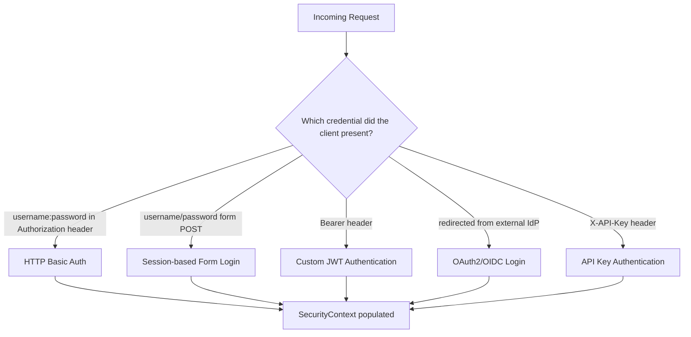

> [!TIP]
> Choose the mechanism by **who the client is**, not by habit: browsers driving server-rendered pages → session-based form login; first-party SPAs/mobile apps → OAuth2/OIDC or JWT issued by your own auth service; service-to-service or third-party integrators → API keys or client-credentials OAuth2; anything behind a corporate SSO → OAuth2/OIDC login against that IdP. Mixing mechanisms in one app is normal — see §3.7 for running multiple simultaneously.

---

# 1. Fundamentals (Beginner Level)

## 1.1 What "Authentication" Means Here

Authentication is the process of verifying a claimed identity before granting access. In Spring Boot, every mechanism ultimately does the same three things: **extract credentials from the request**, **verify them**, and **populate the `SecurityContext`** so the rest of the app (and Spring Security's authorization layer) knows who's making the request.

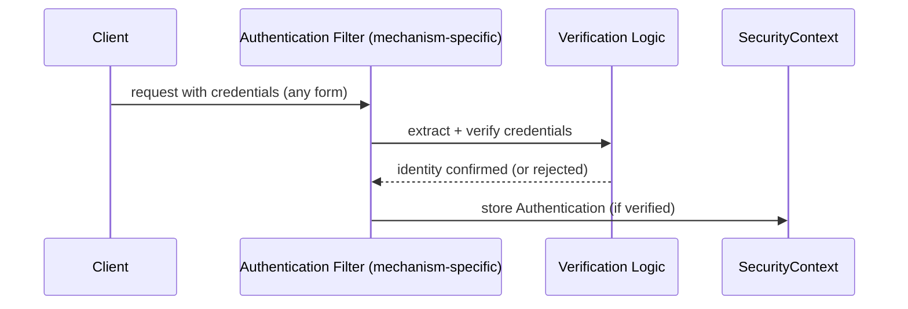

## 1.2 Why So Many Mechanisms Exist

| Client Type | Natural Fit | Why |
|---|---|---|
| Server-rendered web app, browser | Session + form login | Browser automatically sends cookies; server holds state |
| Single-page app (SPA) / mobile app | JWT or OAuth2/OIDC | No natural place to store server session across app restarts; token travels explicitly |
| Third-party integrator / partner API | API key or OAuth2 client credentials | No interactive login step; long-lived, revocable credential |
| Enterprise internal tool | OAuth2/OIDC via corporate SSO (Okta/Azure AD/Keycloak) | Centralized identity, single sign-on across many internal apps |
| Service-to-service (internal) | mTLS or client credentials JWT | No human involved; machine identity |

## 1.3 Problems Each Mechanism Solves

| Mechanism | Solves |
|---|---|
| HTTP Basic Auth | Simplest possible credential transport; fine for quick internal tools/scripts, not for production user-facing apps |
| Session-based Form Login | Full control over login UX; server-side revocation is trivial (delete the session) |
| JWT | Stateless scaling — no shared session store needed across instances |
| OAuth2/OIDC | Delegated authentication — users log in with an identity they already trust (Google, corporate SSO) without your app ever seeing their password |
| API Keys | Simple, long-lived credentials for non-interactive clients, easy to issue/revoke per integrator |
| Multi-Factor Auth | Defense against credential theft/phishing — a stolen password alone isn't enough |

## 1.4 Real-World Analogy

Think of these mechanisms like different ways to prove who you are at different kinds of doors.

HTTP Basic is showing your ID at a quick, low-stakes door every single time. Session-based login is checking into a hotel once and getting a room key card that works for your whole stay. JWT is being issued a signed, tamper-proof wristband at a festival — any gate can verify it instantly without calling back to the ticket office. OAuth2/OIDC is using your driver's license (issued by the government, not the venue) to get into a bar — the venue trusts the ID's issuer rather than verifying your identity itself. An API key is a numbered vendor badge for delivery staff — long-lived, tied to one entity, easily deactivated if lost.

```text
HTTP Basic       = showing ID every single time at the door
Session/cookie   = hotel key card issued once, works all week
JWT              = signed festival wristband, any gate verifies it instantly, no callback
OAuth2/OIDC      = using a government-issued ID a venue trusts, rather than verifying yourself
API key          = numbered vendor badge, long-lived, revocable
```

## 1.5 Core Vocabulary

| Term | Meaning |
|---|---|
| Credential | Something presented to prove identity (password, token, key, certificate) |
| Principal | The identified party once authenticated |
| Access Token | A short-lived credential granting access to resources (often a JWT) |
| Refresh Token | A longer-lived credential used to obtain a new access token without re-login |
| Identity Provider (IdP) | An external system that authenticates users on your app's behalf (Keycloak, Okta, Google) |
| Resource Server | A service that validates access tokens and serves protected resources |
| Authorization Server | The component that issues access/refresh tokens after authenticating a user or client |
| MFA/2FA | Multi-factor / two-factor authentication — requiring more than one type of proof |

## 1.6 HTTP Basic Auth: Minimal Example

```java
@Bean
public SecurityFilterChain filterChain(HttpSecurity http) throws Exception {
    http
        .authorizeHttpRequests(auth -> auth.anyRequest().authenticated())
        .httpBasic(Customizer.withDefaults());
    return http.build();
}
```

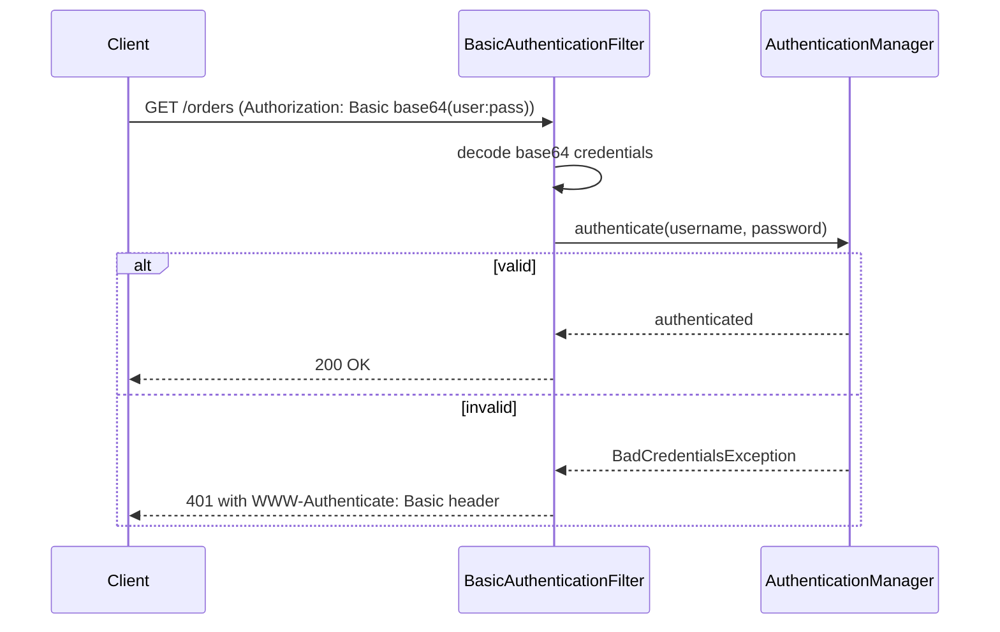

> [!WARNING]
> Basic Auth sends the password (base64-encoded, **not encrypted**) on **every single request**. It's acceptable only over HTTPS, for internal tools, scripts, or quick prototypes — never for production user-facing authentication.

## 1.7 Session-Based Form Login: Minimal Example

```java
@Bean
public SecurityFilterChain filterChain(HttpSecurity http) throws Exception {
    http
        .authorizeHttpRequests(auth -> auth
            .requestMatchers("/login").permitAll()
            .anyRequest().authenticated())
        .formLogin(form -> form
            .loginPage("/login")
            .defaultSuccessUrl("/dashboard", true));
    return http.build();
}
```

This is the flow already covered in depth in [[10 Spring Security]] §1.8 — `UsernamePasswordAuthenticationFilter` → `AuthenticationManager` → `UserDetailsService` → session creation.

## 1.8 API Key Auth: Minimal Custom Filter

```java
public class ApiKeyAuthenticationFilter extends OncePerRequestFilter {

    private final ApiKeyRepository apiKeyRepository;

    @Override
    protected void doFilterInternal(HttpServletRequest request, HttpServletResponse response,
                                     FilterChain chain) throws ServletException, IOException {
        String apiKey = request.getHeader("X-API-Key");
        if (apiKey != null) {
            apiKeyRepository.findByKey(apiKey).ifPresent(record -> {
                var auth = new ApiKeyAuthenticationToken(record.getClientId(), record.getAuthorities());
                SecurityContextHolder.getContext().setAuthentication(auth);
            });
        }
        chain.doFilter(request, response);
    }
}
```

```java
http.addFilterBefore(new ApiKeyAuthenticationFilter(apiKeyRepository), UsernamePasswordAuthenticationFilter.class);
```

## 1.9 Basic Testing of Authentication

```java
@Test
void rejectsRequestWithoutCredentials() throws Exception {
    mockMvc.perform(get("/orders")).andExpect(status().isUnauthorized());
}

@Test
void acceptsValidBasicAuth() throws Exception {
    mockMvc.perform(get("/orders").with(httpBasic("user", "password")))
        .andExpect(status().isOk());
}

@Test
@WithMockUser
void acceptsMockedAuthenticatedUser() throws Exception {
    mockMvc.perform(get("/orders")).andExpect(status().isOk());
}
```

---

# 2. Core Concepts (Intermediate Level)

## 2.1 Full Decision Flow: Choosing a Mechanism

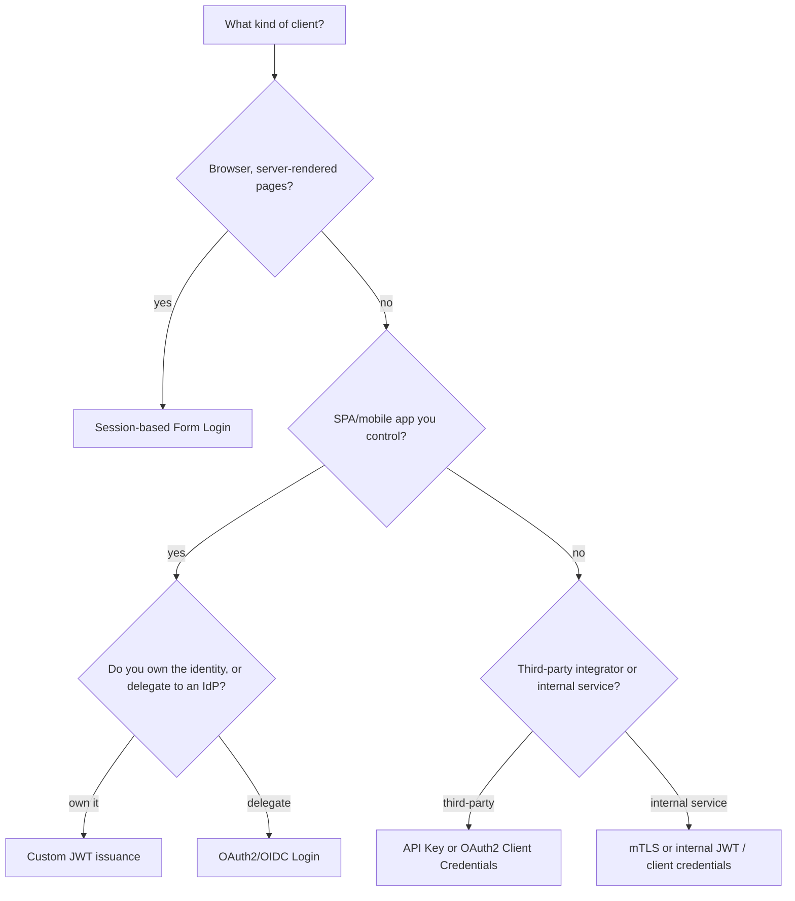

## 2.2 Building a Custom JWT Authentication Service (End-to-End)

Unlike consuming someone else's JWTs (covered as "Resource Server" in [[10 Spring Security]] §3.2), here your own application **issues** the tokens.

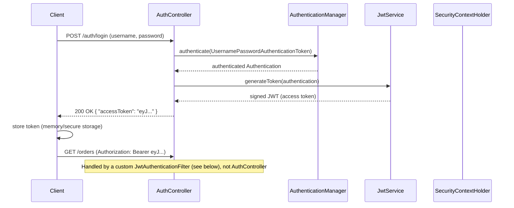

```java
@Service
public class JwtService {

    private final SecretKey signingKey;
    private final long expirationMillis;

    public String generateToken(Authentication authentication) {
        Instant now = Instant.now();
        return Jwts.builder()
            .subject(authentication.getName())
            .claim("roles", authentication.getAuthorities().stream()
                .map(GrantedAuthority::getAuthority).toList())
            .issuedAt(Date.from(now))
            .expiration(Date.from(now.plusMillis(expirationMillis)))
            .signWith(signingKey)
            .compact();
    }

    public Jws<Claims> parseToken(String token) {
        return Jwts.parser().verifyWith(signingKey).build().parseSignedClaims(token);
    }
}
```

```java
public class JwtAuthenticationFilter extends OncePerRequestFilter {

    private final JwtService jwtService;

    @Override
    protected void doFilterInternal(HttpServletRequest request, HttpServletResponse response,
                                     FilterChain chain) throws ServletException, IOException {
        String header = request.getHeader("Authorization");
        if (header != null && header.startsWith("Bearer ")) {
            try {
                Jws<Claims> claims = jwtService.parseToken(header.substring(7));
                String username = claims.getPayload().getSubject();
                List<String> roles = claims.getPayload().get("roles", List.class);

                var authorities = roles.stream().map(SimpleGrantedAuthority::new).toList();
                var auth = new UsernamePasswordAuthenticationToken(username, null, authorities);
                SecurityContextHolder.getContext().setAuthentication(auth);
            } catch (JwtException ex) {
                // invalid/expired token: leave SecurityContext empty, request proceeds as anonymous
            }
        }
        chain.doFilter(request, response);
    }
}
```

```java
@Bean
public SecurityFilterChain filterChain(HttpSecurity http, JwtAuthenticationFilter jwtFilter) throws Exception {
    http
        .sessionManagement(s -> s.sessionCreationPolicy(SessionCreationPolicy.STATELESS))
        .csrf(csrf -> csrf.disable())
        .authorizeHttpRequests(auth -> auth
            .requestMatchers("/auth/**").permitAll()
            .anyRequest().authenticated())
        .addFilterBefore(jwtFilter, UsernamePasswordAuthenticationFilter.class);
    return http.build();
}
```

## 2.3 Refresh Token Flow

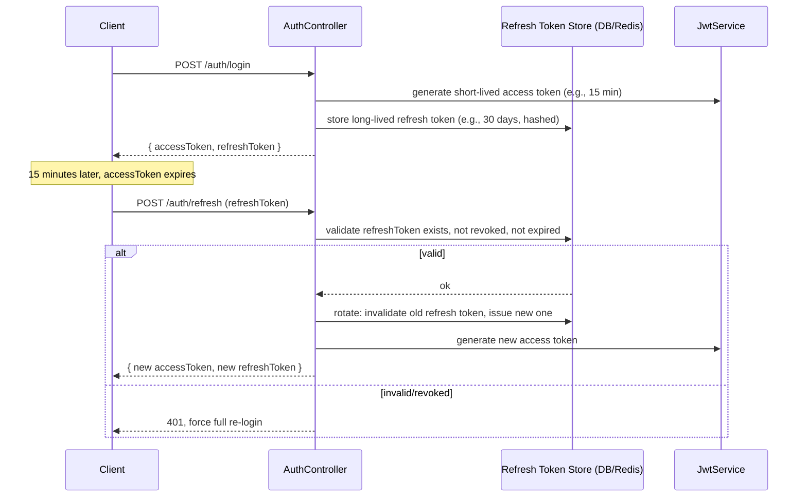

| Design Choice | Why |
|---|---|
| Access token short-lived (minutes) | Limits damage window if leaked; can't be revoked once issued (stateless) |
| Refresh token long-lived but stored server-side | Can be revoked (logout, compromise) since the server tracks it |
| Refresh token **rotation** (invalidate old, issue new on each use) | Detects token theft: if a stolen refresh token is used after the legitimate client already rotated it, the reused old token signals compromise |

> [!IMPORTANT]
> Refresh token rotation with reuse detection is what makes JWT-based auth practically revocable despite access tokens themselves being stateless: you can't invalidate an already-issued access token, but you can stop new ones from being minted by revoking the refresh token, and detect theft by flagging any attempt to reuse an already-rotated-away refresh token.

## 2.4 OAuth2/OIDC Login (Delegating to an External Identity Provider)

```java
http.oauth2Login(oauth2 -> oauth2
    .loginPage("/oauth2/authorization/keycloak")
    .userInfoEndpoint(userInfo -> userInfo.oidcUserService(customOidcUserService()))
);
```

```properties
spring.security.oauth2.client.registration.keycloak.client-id=my-app
spring.security.oauth2.client.registration.keycloak.client-secret=${KEYCLOAK_CLIENT_SECRET}
spring.security.oauth2.client.registration.keycloak.scope=openid,profile,email
spring.security.oauth2.client.provider.keycloak.issuer-uri=https://idp.example.com/realms/myrealm
```

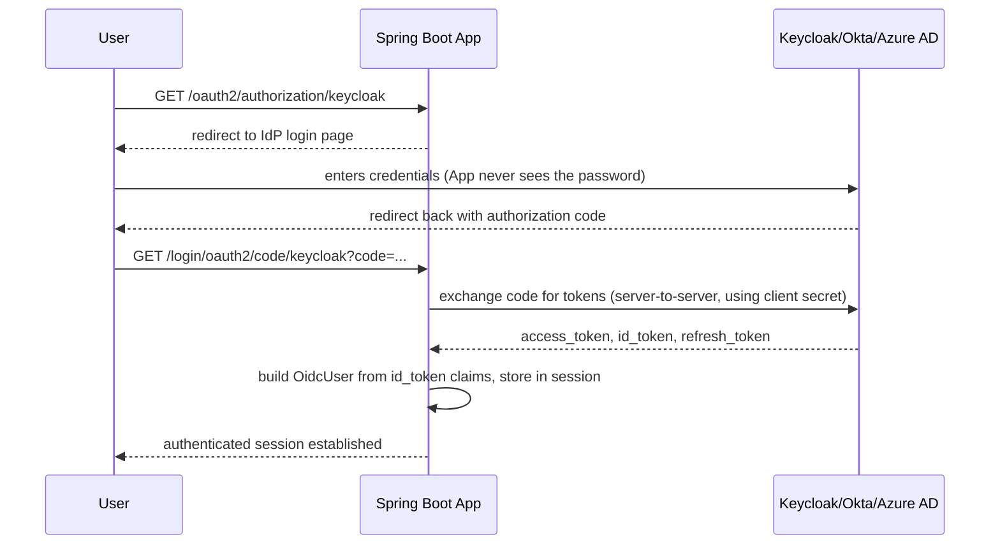

This is the same flow as [[10 Spring Security]] §3.3, shown here with concrete Keycloak-style configuration as a practical reference.

## 2.5 Multi-Factor Authentication (MFA/2FA)

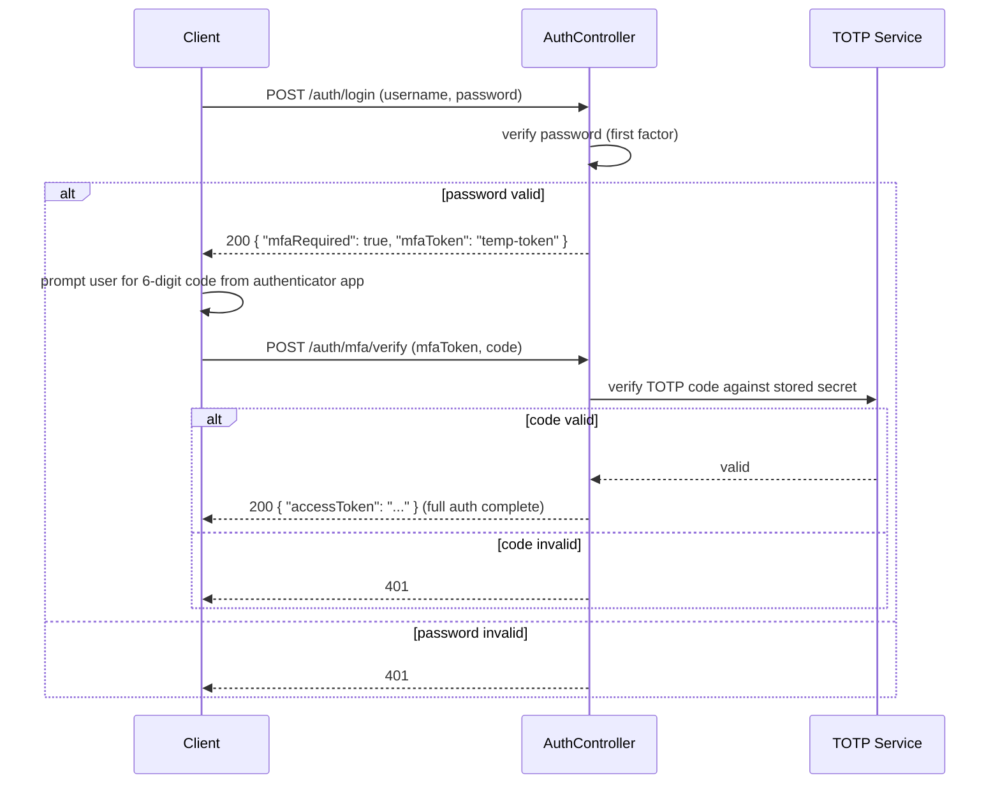

```java
@Service
public class TotpService {

    public boolean verifyCode(String secret, String submittedCode) {
        long timeWindow = System.currentTimeMillis() / 30000; // 30-second windows
        String expectedCode = generateTotp(secret, timeWindow);
        return expectedCode.equals(submittedCode)
            || generateTotp(secret, timeWindow - 1).equals(submittedCode); // allow slight clock drift
    }
}
```

Key design point: the **first factor succeeding does not grant full access** — it issues a short-lived, limited-scope "mfaToken" that only permits calling the second-factor verification endpoint, not general API access.

## 2.6 "Remember Me" Persistent Login

```java
http.rememberMe(remember -> remember
    .key("uniqueAndSecret")
    .tokenValiditySeconds(1209600) // 14 days
    .userDetailsService(userDetailsService)
);
```

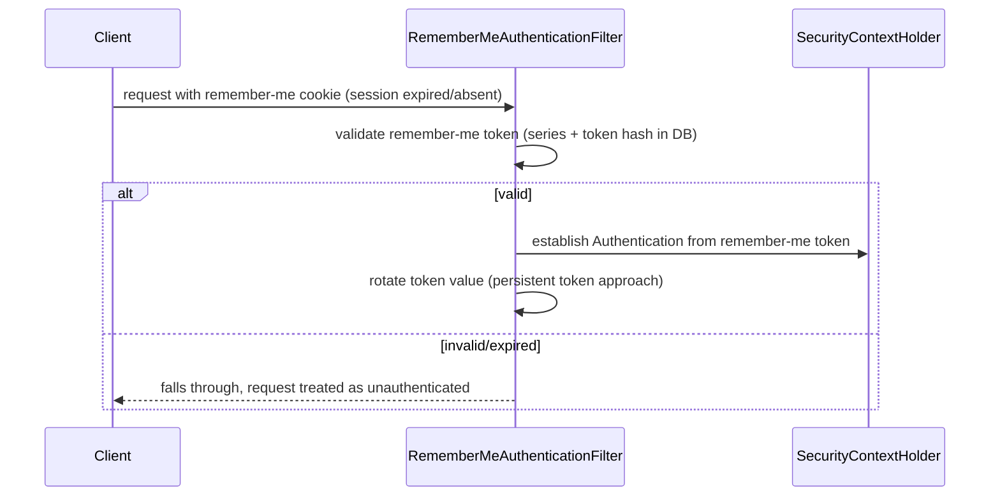

`RememberMeAuthenticationFilter` runs when the normal session-based authentication finds nothing — it's a fallback, not a replacement for the primary authentication mechanism.

## 2.7 Logout Across Mechanisms

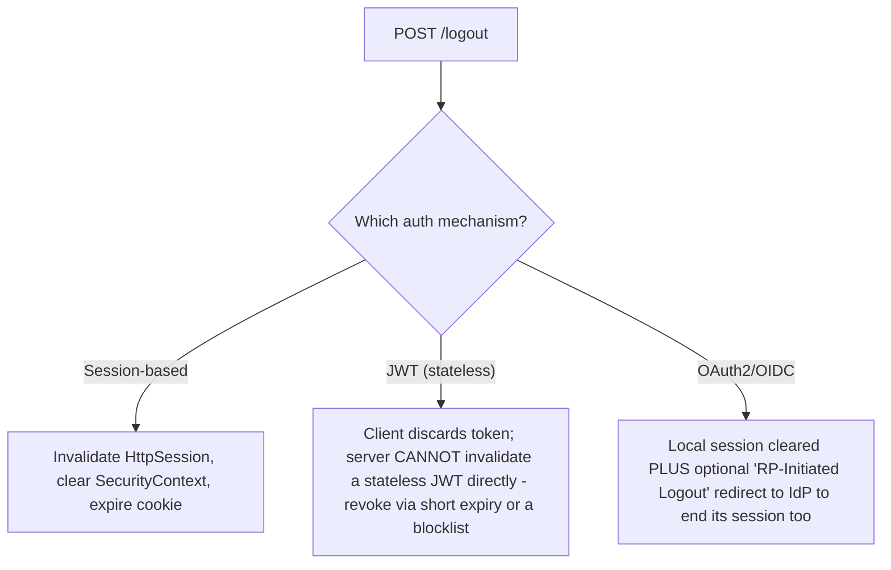

> [!WARNING]
> "Logout" means something structurally different per mechanism. Session-based logout is trivial (delete server-side state). JWT logout is fundamentally limited — the token remains cryptographically valid until it expires unless you maintain a revocation list. OAuth2/OIDC logout may need to also terminate the session at the identity provider (RP-Initiated Logout) or users can silently get re-authenticated on their next visit.

## 2.8 Testing Each Mechanism

```java
@Test
void jwtProtectedEndpointRejectsExpiredToken() throws Exception {
    String expiredToken = jwtTestUtil.expiredToken("user1");
    mockMvc.perform(get("/orders").header("Authorization", "Bearer " + expiredToken))
        .andExpect(status().isUnauthorized());
}

@Test
void refreshRotatesToken() throws Exception {
    String refreshToken = loginAndGetRefreshToken();
    mockMvc.perform(post("/auth/refresh").content(refreshToken))
        .andExpect(status().isOk())
        .andExpect(jsonPath("$.refreshToken").value(not(equalTo(refreshToken))));
}
```

---

# 3. Advanced Concepts (Senior Level)

## 3.1 JWT Signing: Symmetric vs. Asymmetric

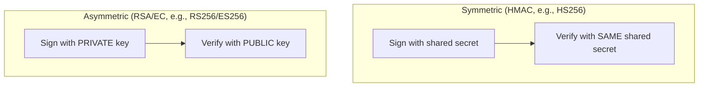

| Approach | Trade-off |
|---|---|
| HMAC (shared secret) | Simple, fast; but every service that needs to *verify* tokens must also hold the secret — meaning it could also *forge* tokens. Fine for a single monolith issuing and validating its own tokens. |
| RSA/EC (asymmetric) | Only the issuer holds the private (signing) key; any number of resource servers can safely hold just the public key to verify, without being able to forge tokens. Standard choice for microservices/multi-service architectures. |

> [!TIP]
> If more than one service needs to *verify* tokens your app issues, use asymmetric signing (RS256/ES256) and publish your public key via a JWKS endpoint — this is exactly the model OAuth2 identity providers use, and it's why [[10 Spring Security]]'s `oauth2ResourceServer().jwt()` fetches keys from a JWKS URL rather than a shared secret.

## 3.2 Custom JWKS Endpoint (If You're the Issuer for Other Services)

```java
@RestController
public class JwksController {

    private final RSAPublicKey publicKey;

    @GetMapping("/.well-known/jwks.json")
    public Map<String, Object> jwks() {
        RSAKey rsaKey = new RSAKey.Builder(publicKey).keyID("key-1").build();
        return new JWKSet(rsaKey).toJSONObject();
    }
}
```

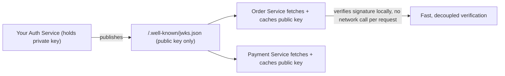

## 3.3 Key Rotation

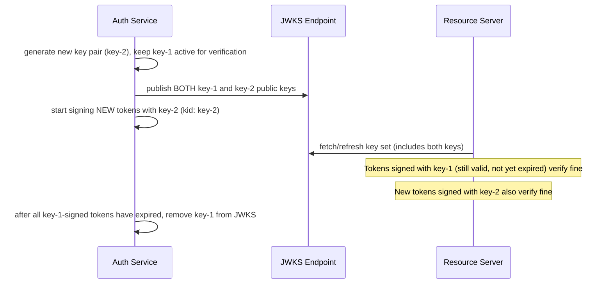

Every JWT carries a `kid` (key ID) header claim identifying which key signed it, allowing multiple valid keys to coexist during a rotation window — critical for rotating signing keys without invalidating all currently-outstanding tokens instantly.

## 3.4 Password Reset Flow (A Frequently-Misdesigned Auth Adjacent Flow)

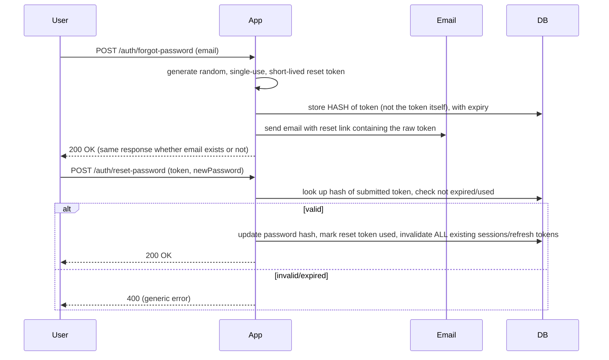

> [!WARNING]
> Two common mistakes: (1) returning a different response for "email exists" vs. "email doesn't exist" (an account enumeration leak), and (2) storing the raw reset token instead of a hash of it (if the database leaks, all outstanding reset tokens become usable). Also always invalidate existing sessions/refresh tokens on password reset — otherwise a stolen-and-then-reset account can still be accessed via a session established before the reset.

## 3.5 Account Lockout and Brute-Force Protection

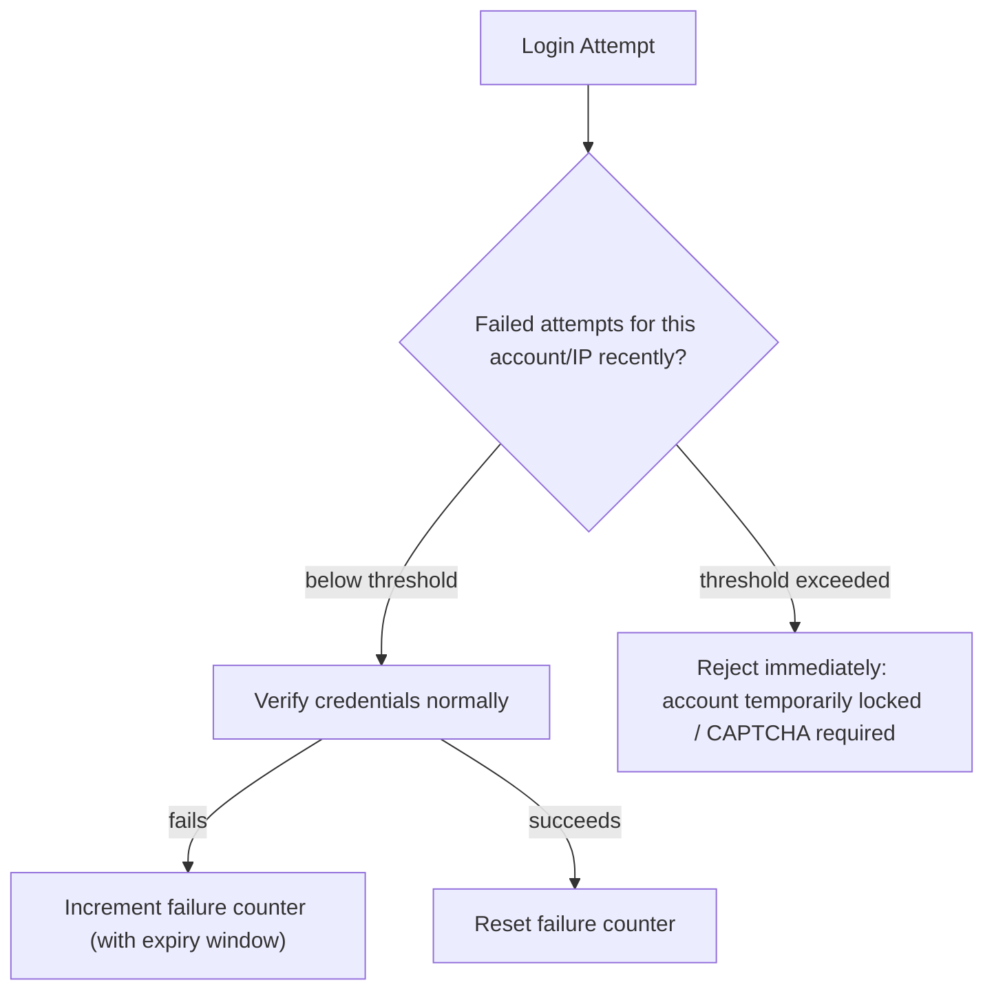

```java
@Component
public class LoginAttemptService {

    private final Cache<String, Integer> attempts = Caffeine.newBuilder()
        .expireAfterWrite(Duration.ofMinutes(15))
        .build();

    public void recordFailure(String key) {
        attempts.asMap().merge(key, 1, Integer::sum);
    }

    public boolean isBlocked(String key) {
        return attempts.asMap().getOrDefault(key, 0) >= 5;
    }
}
```

## 3.6 Concurrent Session Control

```java
http.sessionManagement(session -> session
    .maximumSessions(1)
    .maxSessionsPreventsLogin(false) // false = new login kicks out the old session
    .expiredUrl("/login?expired")
);
```

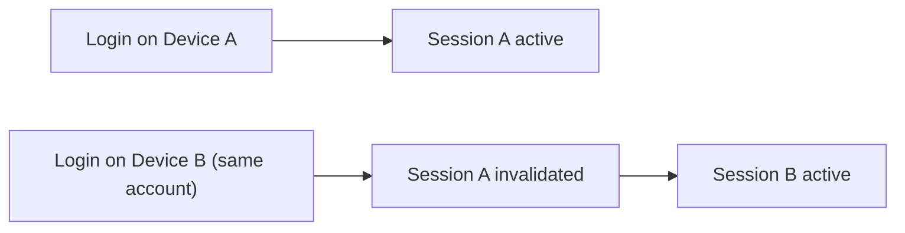

## 3.7 Running Multiple Authentication Mechanisms Simultaneously

```java
@Bean
@Order(1)
public SecurityFilterChain apiChain(HttpSecurity http) throws Exception {
    http.securityMatcher("/api/**")
        .sessionManagement(s -> s.sessionCreationPolicy(SessionCreationPolicy.STATELESS))
        .addFilterBefore(jwtAuthenticationFilter, UsernamePasswordAuthenticationFilter.class)
        .authorizeHttpRequests(a -> a.anyRequest().authenticated());
    return http.build();
}

@Bean
@Order(2)
public SecurityFilterChain partnerChain(HttpSecurity http) throws Exception {
    http.securityMatcher("/partner-api/**")
        .addFilterBefore(apiKeyAuthenticationFilter, UsernamePasswordAuthenticationFilter.class)
        .authorizeHttpRequests(a -> a.anyRequest().authenticated());
    return http.build();
}

@Bean
@Order(3)
public SecurityFilterChain webChain(HttpSecurity http) throws Exception {
    http.securityMatcher("/**")
        .formLogin(Customizer.withDefaults());
    return http.build();
}
```

This is the same `securityMatcher`-scoped multi-chain pattern from [[10 Spring Security]] §3.7, applied concretely: JWT for `/api/**`, API keys for `/partner-api/**`, session-based form login for everything else.

## 3.8 Failure Scenarios

| Failure | Symptom | Common Cause | Fix |
|---|---|---|---|
| "Logged out" user's JWT still works | Token accepted after logout | Stateless JWTs can't be individually revoked | Short access-token expiry, refresh token revocation, or a token blocklist |
| Refresh token replay after rotation | Legitimate user unexpectedly logged out, or attacker gains access | No reuse detection on rotated refresh tokens | Detect reuse of an already-rotated-away refresh token, revoke the whole token family |
| MFA bypassed by calling the protected API directly | Second factor never actually enforced | First-factor success token has full access instead of limited scope | Ensure the intermediate token only permits the MFA-verify endpoint |
| Account enumeration via password reset/login error messages | Attacker can determine which emails have accounts | Different error messages for "no such user" vs. "wrong password" | Use identical generic messages/timing for both cases |
| Brute-force succeeds despite "security" | Password guessed via unlimited attempts | No rate limiting/lockout on login endpoint | Add attempt tracking and lockout/backoff |
| Key rotation breaks all active sessions | Mass logout after a routine key rotation | Old key removed from JWKS before all tokens signed with it expired | Keep old keys published until their signed tokens naturally expire |
| CSRF token errors on a JWT API | Legitimate stateless API requests rejected | CSRF left enabled for a chain that's actually stateless | Disable CSRF only on genuinely stateless, cookie-free chains |
| Multiple security chains conflict | Wrong chain applied to a request, unexpected 401/403 | Overlapping `securityMatcher` patterns, wrong `@Order` | Verify patterns are mutually exclusive and ordered correctly |

## 3.9 Security Hardening Considerations

| Risk | Mitigation |
|---|---|
| Long-lived access tokens | Keep access tokens short (minutes), rely on refresh tokens for longevity |
| Refresh token theft | Rotation + reuse detection + binding to client fingerprint/IP where feasible |
| Password reset token leakage | Store hashed, single-use, short expiry, invalidate sessions on reset |
| MFA fatigue/bypass | Rate-limit MFA attempts, use time-boxed intermediate tokens, never allow full access after only first factor |
| Credential stuffing | Rate limiting, CAPTCHA after repeated failures, breached-password checks at registration |
| JWT algorithm confusion attacks | Explicitly configure and validate the expected signing algorithm; never trust an `alg` claim blindly (a known historical JWT library vulnerability class) |

---

# 4. Real-World System Design Usage

## 4.1 Where Each Mechanism Shows Up in Production

- **Session-based form login**: internal admin dashboards, server-rendered enterprise apps.
- **Custom JWT**: first-party mobile apps and SPAs where you own the entire identity stack.
- **OAuth2/OIDC**: consumer apps offering "Login with Google," enterprise apps behind corporate SSO (Okta/Azure AD/Keycloak).
- **API keys**: partner/third-party integration APIs, webhooks, server-to-server calls from external systems.
- **MFA**: any account handling money, PII, or admin privileges.

## 4.2 Full Production Authentication Architecture

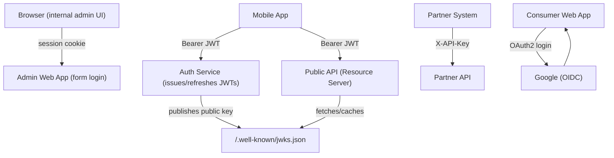

## 4.3 Big-Company Style Thinking

| Concern | Authentication Design Response |
|---|---|
| Reliability | Refresh token rotation with reuse detection instead of relying on unrevocable long-lived tokens |
| Scale | Stateless JWT verification via cached JWKS, avoiding a synchronous auth-service call per request |
| Security | MFA for privileged accounts, account lockout, generic error messages, hashed reset tokens |
| Maintainability | Centralized `AuthenticationProvider`/filter implementations reused across multiple `SecurityFilterChain`s |
| User Experience | "Remember me" for low-risk contexts, refresh tokens for mobile apps to avoid frequent re-login |
| Compliance | Audit logging of authentication events, documented session/token expiry policies |

## 4.4 Example: Mobile App Login and Session Lifecycle

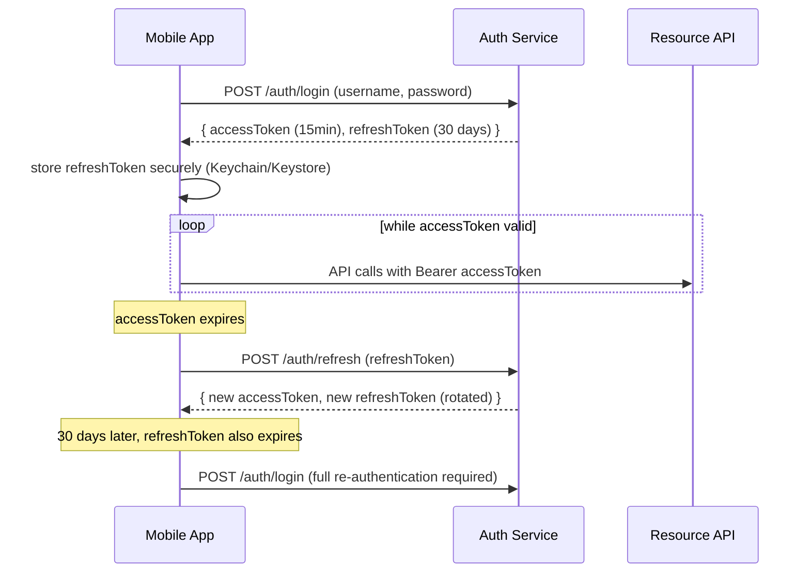

## 4.5 Integration with Other Systems

| System | Integration |
|---|---|
| Identity Providers | Keycloak, Okta, Auth0, Azure AD via `spring-boot-starter-oauth2-client`/`-resource-server` |
| Token storage (refresh tokens) | Redis (fast lookup/revocation) or a relational table |
| MFA providers | TOTP (Google Authenticator-compatible), or third-party services (Twilio Verify, Authy) |
| Secrets management | JWT signing keys, OAuth2 client secrets in Vault/KMS |
| Observability | Structured logging of auth success/failure events, alerting on lockout/brute-force patterns |

---

# 5. Interview Preparation

## 5.1 What Interviewers Expect

For "Spring Boot Authentication" topics, interviewers usually expect:

- You can explain multiple mechanisms and when each is appropriate.
- You understand the access/refresh token pattern and why both exist.
- You know the fundamental limitation of JWT revocation and how teams work around it.

For senior backend roles, they also expect:

- You can design a full login → refresh → logout lifecycle, including token rotation and reuse detection.
- You understand symmetric vs. asymmetric JWT signing and why microservices favor asymmetric.
- You can design MFA so the first factor alone never grants full access.
- You know common account-security pitfalls (enumeration, brute force, reset token handling).

## 5.2 Most Important Questions and Answers

### Q1. Why use both an access token and a refresh token instead of just one long-lived token?

A long-lived access token can't be revoked (stateless) and is dangerous if leaked since it stays valid for a long time. Splitting into a short-lived access token (limits damage if leaked) plus a longer-lived refresh token (stored server-side, individually revocable) gets both security and a good user experience (no frequent re-login).

### Q2. What is refresh token rotation, and why does it matter?

Each time a refresh token is used, the server invalidates it and issues a brand-new one. If an old, already-rotated-away refresh token is ever presented again, that's a strong signal of theft (the legitimate client already moved on to the new one), letting the server revoke the entire token family in response.

### Q3. Why can't you simply "log out" a JWT the way you can a session?

A JWT is self-contained and cryptographically valid on its own merit until expiry — there's no server-side state to delete. Mitigations include short access-token expiry, refresh token revocation (which stops new access tokens from being minted), or maintaining an explicit blocklist (reintroducing some server-side state).

### Q4. Why do microservice architectures prefer asymmetric (RSA/EC) JWT signing over symmetric (HMAC)?

With HMAC, any service that can *verify* a token also holds the same secret used to *sign* it — meaning it could forge tokens too. Asymmetric signing lets the issuer keep the private key exclusively while any number of services safely hold only the public key to verify, without being able to mint valid tokens themselves.

### Q5. How should multi-factor authentication be structured so it can't be bypassed?

The first factor (password) succeeding should issue only a limited-scope, short-lived intermediate token permitting exactly one action: submitting the second factor. It must not grant access to any other endpoint — otherwise an attacker who compromises the password alone can skip the second factor entirely.

### Q6. What's wrong with returning "no account found for this email" on a login/password-reset form?

It's an account enumeration vulnerability — an attacker can use the differing responses to build a list of valid registered emails. The fix is a generic, identical response (and similar response timing) regardless of whether the account exists.

### Q7. Why store a hash of a password-reset token instead of the raw token?

If the database is ever compromised (leak, backup exposure, insider access), a raw stored token could be used directly to reset any account. Storing only a hash means a database leak alone isn't sufficient — same principle as password storage.

### Q8. What should happen to existing sessions/tokens when a user resets their password?

All existing sessions and refresh tokens should be invalidated. Otherwise, if the password reset was triggered because of a compromised account, an attacker who already has an active session or refresh token retains access even after the "legitimate" password reset.

### Q9. How do you support key rotation for JWT signing without invalidating all outstanding tokens instantly?

Publish multiple valid public keys in the JWKS endpoint simultaneously (each JWT carries a `kid` header identifying which key signed it), start signing new tokens with the new key, and only remove the old key from the JWKS once all tokens signed with it have naturally expired.

### Q10. When would you choose OAuth2/OIDC login over building your own username/password + JWT system?

When you want to delegate identity verification to a trusted external provider (Google, corporate SSO) — avoiding the liability of storing passwords yourself, giving users single sign-on across multiple apps, and offloading MFA/account-recovery/breach-detection to a provider that specializes in it.

## 5.3 Tricky Questions

### If access tokens are short-lived, why not just make them long-lived and skip refresh tokens entirely?

A long-lived access token that leaks (via logs, a compromised device, a network intercept) stays fully valid for its entire lifetime with no way to revoke it. Splitting into short-lived access + revocable refresh tokens bounds the damage window of an access token leak to minutes, while still avoiding constant re-login via the refresh token.

### Does disabling CSRF for a JWT-based API always make it equally safe?

Only if the API is *genuinely* stateless with no cookie-based session coexisting — if a session cookie is present for any reason alongside JWT auth, CSRF protections may still be relevant for that surface. Verify there's truly no cookie-based authentication path before disabling CSRF wholesale.

### Can "remember me" and session-based login coexist safely?

Yes — `RememberMeAuthenticationFilter` only activates when normal session-based authentication finds nothing, acting purely as a fallback. It should still be treated as a slightly weaker guarantee (e.g., excluded from access to the most sensitive actions, which might require re-authentication regardless of a remember-me cookie).

### Is API key authentication "less secure" than OAuth2 by nature?

Not inherently — it depends on implementation. A well-implemented API key system (hashed storage, per-key scoping, easy revocation, rate limiting, rotation support) can be entirely appropriate for machine-to-machine or partner integrations where an interactive OAuth2 flow doesn't fit the use case (e.g., client credentials grant is often a better fit than a raw API key for that exact scenario, but plain API keys remain common and acceptable for simpler integrations).

## 5.4 Common Candidate Mistakes

- Proposing a single long-lived JWT with no refresh token strategy.
- Not knowing that JWTs can't be individually revoked without extra infrastructure.
- Designing MFA where the first factor alone grants full API access.
- Returning different error messages for "account doesn't exist" vs. "wrong password."
- Storing raw (unhashed) password-reset tokens.
- Forgetting to invalidate existing sessions/tokens after a password reset.
- Using symmetric JWT signing across multiple independently-deployed services.
- Not considering brute-force protection on login endpoints.

## 5.5 Interview Coding Checklist

- [ ] Access tokens short-lived; refresh tokens long-lived, server-tracked, and rotated on use.
- [ ] MFA's first-factor token scoped to only the second-factor endpoint.
- [ ] Password reset tokens hashed at rest, single-use, short expiry.
- [ ] Generic error messages/timing for account-existence-sensitive endpoints.
- [ ] Asymmetric signing chosen when more than one service verifies tokens.
- [ ] Rate limiting/lockout present on all authentication endpoints.

---

# 6. Hands-On Thinking

## 6.1 Three Real-World Projects Exercising Authentication Mechanisms

### Project 1: Mobile App Backend with JWT + Refresh Rotation

Concepts: custom `JwtService`, `JwtAuthenticationFilter`, refresh token store in Redis with rotation and reuse detection.

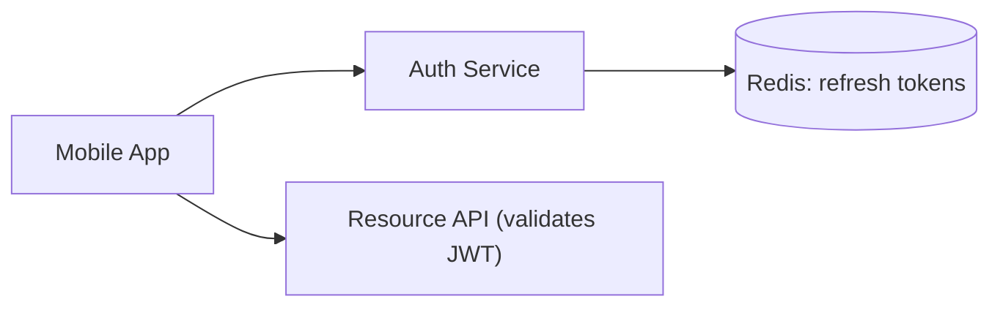

### Project 2: Enterprise Admin Portal with OAuth2/OIDC + MFA Fallback

Concepts: `oauth2Login()` against Azure AD/Okta, plus a local MFA step for accounts requiring elevated privilege even after SSO.

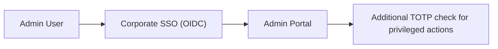

### Project 3: Partner Integration API with API Keys + Rate Limiting

Concepts: custom `ApiKeyAuthenticationFilter`, per-key rate limiting, key rotation/revocation admin endpoints.

```mermaid
flowchart LR
    Partner["Partner System"] -->|"X-API-Key"| Gateway["Partner API"]
    Gateway --> RateLimiter["Per-Key Rate Limiter"]
    Gateway --> KeyStore[("API Key Store, hashed")]
```

## 6.2 Step-by-Step Design Approach

For any authentication feature:

1. Identify the client type and pick the mechanism from the decision flow in §2.1.
2. For token-based auth, design the access/refresh token split and expiry policy first.
3. Design revocation explicitly — decide what "logout" means for this mechanism before building login.
4. For MFA, ensure intermediate tokens are scope-limited to prevent bypass.
5. Add brute-force protection and generic error responses from the start, not as an afterthought.
6. Test both success and every rejection path (expired, revoked, malformed, wrong signature).
7. Plan key/secret rotation before the first production key is ever generated.

## 6.3 Production Implementation Approach

```mermaid
flowchart TD
    A["Identify client type"] --> B["Choose mechanism"]
    B --> C["Design token/session lifecycle + revocation"]
    C --> D["Design MFA scope-limiting if applicable"]
    D --> E["Add brute-force/lockout protection"]
    E --> F["Test all rejection paths explicitly"]
    F --> G["Plan key/secret rotation strategy"]
    G --> H["Production deployment"]
```

## 6.4 Production Readiness Example

For an authentication system, define:

- Documented access/refresh token expiry values and rotation policy.
- Reuse-detection response plan (revoke entire token family on detected replay).
- MFA intermediate token scope explicitly tested to reject any other endpoint.
- Password reset flow reviewed for enumeration and token-hashing correctness.
- Key rotation runbook tested at least once before it's needed in an emergency.
- Rate limiting/lockout thresholds tuned and monitored, with alerting on spikes.

---

# 7. Deep Dive (Optional but Important)

## 7.1 `AuthenticationManager` Resolution for Custom Mechanisms

```mermaid
flowchart TB
    CustomFilter["Custom Filter (JWT/API Key/etc.)"] --> Choice{"Does this mechanism need AuthenticationManager?"}
    Choice -->|"JWT: token IS the proof, no further lookup needed"| Direct["Directly build a fully-authenticated Authentication and set it on SecurityContext"]
    Choice -->|"API key needing DB lookup with provider abstraction"| Provider["Build unauthenticated token -> AuthenticationManager -> custom AuthenticationProvider"]
```

For JWT, since the signature itself is the proof of authenticity (no further external check needed), it's common to skip `AuthenticationManager` entirely and construct an already-authenticated `Authentication` directly in the filter, as shown in §2.2. For mechanisms needing a database/external lookup (API keys, LDAP), routing through `AuthenticationManager` → `AuthenticationProvider` keeps things consistent with Spring Security's extension model (see [[10 Spring Security]] §3.4).

## 7.2 TOTP Algorithm Internals

```text
TOTP(secret, time) = HOTP(secret, floor(current_unix_time / 30))
HOTP(secret, counter) = truncate(HMAC-SHA1(secret, counter)) -> 6-digit code
```

Time-based One-Time Passwords derive a code from a shared secret and the current time, divided into 30-second windows — both the server and the authenticator app (Google Authenticator, Authy) compute the same code independently as long as their clocks are reasonably in sync and they share the same secret (exchanged once at MFA setup, typically via a QR code).

## 7.3 JWT Algorithm Confusion Attacks (Historical Vulnerability Class)

```text
Attack: a JWT library trusts the "alg" header claim from the TOKEN ITSELF to decide how to verify it.
If an attacker changes "alg": "RS256" to "alg": "none" or "alg": "HS256" (using the RSA
public key, which is public, as an HMAC secret), some vulnerable libraries would
incorrectly accept a forged token.

Fix: the VERIFIER must specify and enforce the expected algorithm explicitly,
never derive trust from the token's own header claim.
```

Modern JWT libraries (including `jjwt`, Nimbus, and Spring Security's OAuth2 resource server support) require explicit algorithm configuration on the verifying side specifically to close this historical vulnerability class.

## 7.4 Session Fixation Protection Internals

```mermaid
sequenceDiagram
    participant Attacker
    participant Victim
    participant App

    Attacker->>App: obtain a valid, pre-authentication session ID
    Attacker->>Victim: trick victim into using that same session ID (fixation)
    Victim->>App: logs in using the attacker's pre-set session ID
    Note over App: WITHOUT protection: victim's authenticated session now has the ID the attacker already knows
    Note over App: WITH protection (Spring Security default): a NEW session ID is generated upon successful login, invalidating the old one
```

Spring Security's default behavior of changing the session ID on successful authentication (`sessionManagement().sessionFixation().changeSessionId()`, the default) directly defeats this class of attack — disabling it removes a real protection.

## 7.5 Debugging Tools

| Tool/Technique | Purpose |
|---|---|
| `logging.level.org.springframework.security=DEBUG` | Traces which filter/provider handled (or rejected) an authentication attempt |
| jwt.io-style decoder (used carefully, never with production secrets/tokens) | Inspect JWT claims/header structure during development |
| Redis CLI (`GET`/`TTL` on refresh token keys) | Verify refresh token storage, expiry, and rotation behavior directly |
| `curl -v` with explicit `Authorization`/`X-API-Key` headers | Isolate exactly which credential form is being tested |
| Load testing the login endpoint | Confirms rate limiting/lockout actually engages under realistic attack-like traffic |

---

# Production Checklists

## Code Quality Checklist

- [ ] Access/refresh token lifecycle explicitly designed, not just "add JWT and ship."
- [ ] MFA intermediate tokens scope-limited and tested against bypass.
- [ ] Password reset tokens hashed, single-use, short-lived; sessions invalidated on reset.
- [ ] Generic, identical responses for account-existence-sensitive endpoints.
- [ ] JWT verification explicitly configures and enforces the expected signing algorithm.

## Security Checklist

- [ ] Refresh token rotation with reuse detection implemented.
- [ ] Brute-force protection (rate limiting/lockout) on all authentication endpoints.
- [ ] Asymmetric JWT signing used whenever more than one service verifies tokens.
- [ ] Key rotation strategy tested, not just theoretically documented.
- [ ] Session fixation protection left enabled (default), not disabled for convenience.
- [ ] Secrets (signing keys, client secrets) stored in a secrets manager, not source/config files.

## Performance/UX Checklist

- [ ] Access token expiry balances security (short) against unnecessary refresh churn.
- [ ] Refresh token expiry balances user convenience against exposure window.
- [ ] JWKS public keys cached client-side (resource servers), not fetched per request.

## Debugging Checklist

- [ ] Reproduce with `DEBUG` logging on `org.springframework.security`.
- [ ] Test every rejection path explicitly: expired, malformed, wrong signature, revoked, reused.
- [ ] Verify refresh token rotation and reuse-detection behavior directly against the token store.
- [ ] Confirm MFA intermediate tokens are rejected on any endpoint other than the verify step.

---

# Learning Roadmap

## Phase 1: Beginner

Learn: HTTP Basic, session-based form login, basic API key filter.

Practice: secure a simple app with form login; add a basic API key check for a machine client.

## Phase 2: Intermediate

Learn: custom JWT issuance and validation, refresh tokens, OAuth2/OIDC login basics, remember-me.

Practice: build a JWT-issuing auth endpoint plus a validating filter for a mobile-backend-style API.

## Phase 3: Advanced

Learn: refresh token rotation + reuse detection, MFA design, asymmetric signing + JWKS, key rotation.

Practice: add refresh rotation and TOTP-based MFA to the JWT project from Phase 2.

## Phase 4: Production Security Engineer

Learn: brute-force protection, session fixation internals, JWT algorithm confusion history, multi-mechanism architectures.

Practice: production-style system running session-based admin auth, JWT mobile-backend auth, and API-key partner auth simultaneously behind multiple `SecurityFilterChain`s, with full audit logging and a tested key-rotation runbook.

---

# Self-Review Completion Loop

The topic was reviewed against:

- Spring Security reference documentation for each authentication mechanism.
- OAuth2/OIDC and JWT (RFC 7519) specifications.
- OWASP Authentication and Session Management Cheat Sheets.
- Common production incident patterns (token revocation limits, reuse attacks, enumeration, key rotation mistakes).
- Interview patterns for beginner through senior backend/security roles.

## Gap Review Matrix

| Area | Covered? | Notes |
|---|---|---|
| HTTP Basic | Yes | Minimal example, when appropriate |
| Session-based form login | Yes | Cross-linked to [[10 Spring Security]] full flow |
| Custom JWT issuance | Yes | Full `JwtService`/`JwtAuthenticationFilter` implementation |
| Refresh token rotation | Yes | Sequence diagram, reuse-detection rationale |
| OAuth2/OIDC login | Yes | Concrete Keycloak-style config, sequence diagram |
| API key authentication | Yes | Custom filter implementation |
| Multi-factor authentication | Yes | Scope-limited intermediate token design |
| Remember-me | Yes | Fallback filter behavior explained |
| Logout across mechanisms | Yes | Explicit per-mechanism comparison |
| Symmetric vs. asymmetric JWT signing | Yes | Trade-off table, JWKS pattern |
| Key rotation | Yes | Sequence diagram, `kid` claim mechanism |
| Password reset flow | Yes | Hashing, enumeration, session invalidation pitfalls |
| Brute-force protection | Yes | Attempt-tracking code example |
| Concurrent session control | Yes | `maximumSessions` example |
| Multiple simultaneous mechanisms | Yes | Concrete multi-chain example |
| Session fixation | Yes | Deep dive with sequence diagram |
| JWT algorithm confusion attacks | Yes | Deep dive, historical vulnerability class |
| Interview prep | Yes | Common and tricky questions, candidate mistakes |
| Hands-on projects | Yes | Three realistic projects with diagrams |
| Diagram/flow depth | Yes | Mermaid diagrams throughout every major section |

No significant gaps remain for the requested scope. Further specialization should split into separate deep dives: **OAuth2 Client Credentials and Machine-to-Machine Auth**, **Passwordless/WebAuthn/Passkeys**, **Session Store Scaling with Spring Session + Redis**, and **Security Incident Response for Authentication Systems**.

---

# Official References

- Spring Security Reference (Authentication): <https://docs.spring.io/spring-security/reference/servlet/authentication/index.html>
- Spring Security OAuth2 Login: <https://docs.spring.io/spring-security/reference/servlet/oauth2/login/index.html>
- Spring Security OAuth2 Resource Server: <https://docs.spring.io/spring-security/reference/servlet/oauth2/resource-server/index.html>
- RFC 7519 — JSON Web Token (JWT): <https://datatracker.ietf.org/doc/html/rfc7519>
- OWASP Authentication Cheat Sheet: <https://cheatsheetseries.owasp.org/cheatsheets/Authentication_Cheat_Sheet.html>
- OWASP Session Management Cheat Sheet: <https://cheatsheetseries.owasp.org/cheatsheets/Session_Management_Cheat_Sheet.html>
- RFC 6238 — TOTP: <https://datatracker.ietf.org/doc/html/rfc6238>

---

## Final Summary

Authentication in Spring Boot is a toolkit, not a single pattern: choose HTTP Basic for trivial internal tools, session-based form login for browser-driven server-rendered apps, custom JWT with refresh-token rotation for first-party mobile/SPA clients you fully control, OAuth2/OIDC when delegating identity to a trusted provider, and API keys for non-interactive integrators — often several at once behind separate `SecurityFilterChain`s. Production mastery comes from designing the full lifecycle up front (issuance, expiry, refresh, revocation, and what "logout" actually means for that specific mechanism), scoping multi-factor auth so the first factor alone never grants full access, and treating account-adjacent flows like password reset and brute-force protection with the same rigor as the login flow itself.
