# Spring WebFlux: Beginner-to-Expert Engineering Guide (Reactive, With Full Flow)

> **Scope:** This guide teaches Spring WebFlux — Spring's reactive web stack — from first principles through production-grade reactive system design. It contrasts directly with [[07 Servlets and Filters]] and [[05 Spring Boot]] (the traditional Servlet/Tomcat/thread-per-request stack), since the fastest way to understand WebFlux is to see exactly what it replaces and why.

## Table of Contents

1. [Executive Summary](#executive-summary)
2. [1. Fundamentals](#1-fundamentals-beginner-level)
3. [2. Core Concepts](#2-core-concepts-intermediate-level)
4. [3. Advanced Concepts](#3-advanced-concepts-senior-level)
5. [4. Real-World System Design Usage](#4-real-world-system-design-usage)
6. [5. Interview Preparation](#5-interview-preparation)
7. [6. Hands-On Thinking](#6-hands-on-thinking)
8. [7. Deep Dive](#7-deep-dive-optional-but-important)
9. [Production Checklists](#production-checklists)
10. [Learning Roadmap](#learning-roadmap)
11. [Self-Review Completion Loop](#self-review-completion-loop)
12. [Official References](#official-references)

---

## Executive Summary

Spring WebFlux is Spring's **non-blocking, reactive** web framework — an alternative to Spring MVC that handles many concurrent requests using a small, fixed number of threads instead of one thread per request, by never blocking a thread on I/O.

The core contrast:

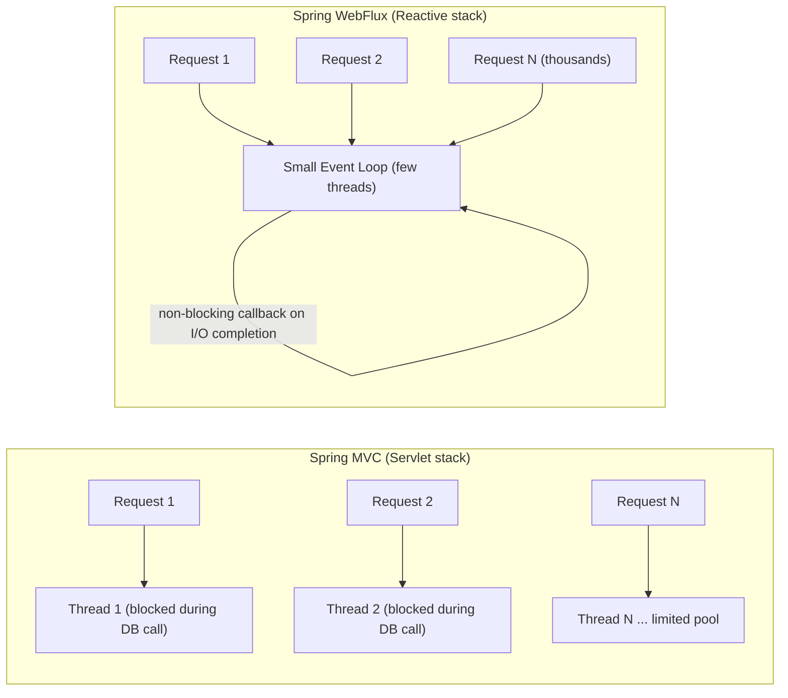

> [!TIP]
> Learn WebFlux as a trade: you give up the simplicity of "one thread, top-to-bottom, blocking code" in exchange for handling far more concurrent connections per server with the same hardware — but only if **every** layer of your stack (web, database driver, HTTP clients) is genuinely non-blocking. A single blocking call anywhere in a reactive pipeline defeats the entire model.

---

# 1. Fundamentals (Beginner Level)

## 1.1 What Is Spring WebFlux?

WebFlux is Spring's reactive-stack web framework, built on **Project Reactor** (`Mono`/`Flux`) and running by default on **Netty** instead of Tomcat.

```java
@RestController
public class HelloController {

    @GetMapping("/hello")
    public Mono<String> hello() {
        return Mono.just("Hello, WebFlux!");
    }
}
```

```xml
<dependency>
    <groupId>org.springframework.boot</groupId>
    <artifactId>spring-boot-starter-webflux</artifactId>
</dependency>
```

Notice the return type: `Mono<String>` instead of plain `String`. This single change signals the entire shift — you're describing an asynchronous computation that will *eventually* produce a value, not returning a value directly.

## 1.2 Why WebFlux Exists

| Problem with Servlet/MVC Model | WebFlux's Answer |
|---|---|
| Thread-per-request model ties up a thread for the whole request, including I/O wait time | Non-blocking event loop: a thread is only busy doing actual CPU work |
| High-concurrency workloads with slow downstream calls exhaust the thread pool | A small fixed thread pool can handle thousands of concurrent in-flight requests |
| Scaling to many concurrent long-lived connections (streaming, SSE, WebSocket-like) is expensive with one-thread-per-connection | Reactive streams handle backpressure and many connections cheaply |
| Composing async operations (call A, then B, then C) is awkward with callbacks/futures | `Mono`/`Flux` provide a fluent, composable API for async pipelines |

## 1.3 Problems WebFlux Solves

WebFlux is especially good when you need:

- Very high concurrency with I/O-bound workloads (many slow downstream calls, not much CPU work).
- Streaming data (Server-Sent Events, large result sets processed incrementally).
- A system built end-to-end on non-blocking I/O (reactive database drivers, reactive HTTP clients).
- Backpressure — the ability for a slow consumer to signal a fast producer to slow down.

WebFlux is **not** automatically better when:

- Your workload is CPU-bound rather than I/O-bound (reactive doesn't help CPU-bound work).
- Your database driver or key dependencies are blocking (JDBC is blocking — mixing it into WebFlux without care reintroduces blocking and defeats the model).
- Your team's productivity and debuggability matter more than raw per-server concurrency, and traditional Spring MVC (especially with virtual threads on Java 21+) already meets your scaling needs.

> [!WARNING]
> As of Java 21+ with **virtual threads**, Spring MVC can achieve much of WebFlux's high-concurrency benefit while keeping simple, blocking-style code. Many teams now default to Spring MVC + virtual threads and reserve WebFlux for genuinely streaming or extreme-concurrency use cases — see [[05 Spring Boot]] and [[07 Servlets and Filters]] for the virtual threads discussion.

## 1.4 Real-World Analogy

Think of Spring MVC like a restaurant where each waiter is assigned to exactly one table for the entire meal — taking the order, waiting at the kitchen window until the food is ready, then serving it, unable to help any other table in the meantime. Add more tables, and you need more waiters (threads); eventually you run out.

WebFlux is like a restaurant with a few waiters who take an order, hand it to the kitchen, and immediately move to help another table — then whichever waiter is free responds when *any* order becomes ready, notified by the kitchen (a callback), rather than standing and waiting.

```text
Spring MVC waiter  = one thread, blocked waiting from order to delivery, one table at a time
WebFlux waiters    = a few threads, never blocked, notified when work is ready, serve many tables
Kitchen            = non-blocking I/O (database, downstream services)
```

## 1.5 Core Vocabulary

| Term | Meaning |
|---|---|
| Reactive Streams | A specification (`Publisher`, `Subscriber`, `Subscription`) for asynchronous stream processing with backpressure |
| Project Reactor | Spring's Reactive Streams implementation, providing `Mono` and `Flux` |
| `Mono<T>` | A reactive publisher of 0 or 1 element |
| `Flux<T>` | A reactive publisher of 0 to N elements (a stream) |
| Backpressure | A mechanism letting a subscriber control how much data a publisher sends at once |
| Non-blocking I/O | I/O operations that don't hold a thread while waiting for completion |
| Event Loop | A small set of threads that continuously process ready I/O events without blocking |
| `WebClient` | WebFlux's non-blocking, reactive HTTP client (replaces the blocking `RestTemplate`) |
| Netty | The default non-blocking server WebFlux runs on (instead of Tomcat) |
| Subscriber | The consumer that triggers execution of a reactive pipeline by subscribing to it |

## 1.6 `Mono` and `Flux` Basics

```java
Mono<User> user = Mono.just(new User("Asha"));

Flux<User> users = Flux.just(
    new User("Asha"),
    new User("Ravi"),
    new User("Meera")
);
```

```java
Mono<User> user = userRepository.findById(id)
    .map(u -> {
        u.setLastAccessed(Instant.now());
        return u;
    })
    .switchIfEmpty(Mono.error(new UserNotFoundException(id)));
```

> [!IMPORTANT]
> **Nothing happens until something subscribes.** `Mono`/`Flux` are lazy descriptions of a computation — building a pipeline with `.map()`, `.flatMap()`, `.filter()` does not execute anything. Execution starts only when a subscriber (Spring's WebFlux runtime, `.block()` in a test, or `.subscribe()`) attaches to the chain. This is the single most important mental model shift from imperative code.

## 1.7 Basic Reactive Controller

```java
@RestController
@RequestMapping("/orders")
public class OrderController {

    private final OrderService orderService;

    OrderController(OrderService orderService) {
        this.orderService = orderService;
    }

    @GetMapping("/{id}")
    public Mono<OrderResponse> getOrder(@PathVariable Long id) {
        return orderService.findById(id);
    }

    @GetMapping
    public Flux<OrderResponse> getAllOrders() {
        return orderService.findAll();
    }

    @PostMapping
    @ResponseStatus(HttpStatus.CREATED)
    public Mono<OrderResponse> createOrder(@Valid @RequestBody Mono<CreateOrderRequest> request) {
        return request.flatMap(orderService::createOrder);
    }
}
```

The framework itself subscribes to the returned `Mono`/`Flux` once the response needs to be written — your controller code never calls `.block()` or `.subscribe()`.

## 1.8 Basic Reactive Repository

```java
public interface OrderRepository extends ReactiveCrudRepository<Order, Long> {
    Flux<Order> findByStatus(String status);
}
```

```java
Flux<Order> paidOrders = orderRepository.findByStatus("PAID");
```

`ReactiveCrudRepository` (Spring Data R2DBC/MongoDB reactive) mirrors `CrudRepository` but every method returns `Mono`/`Flux` instead of blocking values — this only works with a genuinely non-blocking driver underneath (R2DBC for relational databases, the reactive MongoDB driver, etc.).

## 1.9 Basic Error Handling

```java
public Mono<OrderResponse> findById(Long id) {
    return orderRepository.findById(id)
        .map(OrderResponse::from)
        .switchIfEmpty(Mono.error(new OrderNotFoundException(id)));
}
```

```java
@ExceptionHandler(OrderNotFoundException.class)
public ResponseEntity<ErrorResponse> handleNotFound(OrderNotFoundException ex) {
    return ResponseEntity.status(HttpStatus.NOT_FOUND)
        .body(new ErrorResponse("ORDER_NOT_FOUND", ex.getMessage()));
}
```

`@RestControllerAdvice`/`@ExceptionHandler` still works in WebFlux the same way it does in Spring MVC — exceptions propagate through the reactive pipeline as error signals and are caught the same way.

---

# 2. Core Concepts (Intermediate Level)

## 2.1 Full WebFlux Architecture

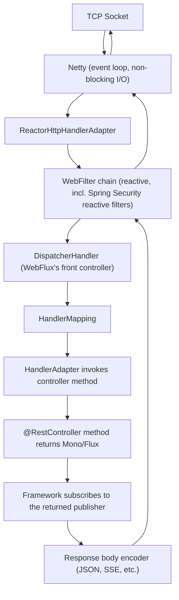

Compare directly to the Servlet stack diagram in [[07 Servlets and Filters]]: **`DispatcherServlet` becomes `DispatcherHandler`**, **`Filter` becomes `WebFilter`**, **Tomcat becomes Netty**, and the controller returns a `Mono`/`Flux` instead of a plain object — but the conceptual shape (front controller, handler mapping, filter chain around it) is nearly identical.

## 2.2 `DispatcherHandler`: WebFlux's Front Controller

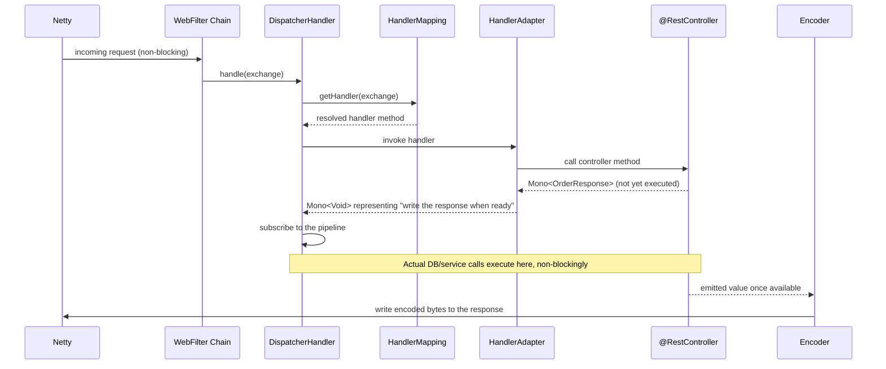

Unlike `DispatcherServlet`, which invokes your controller method and gets an immediate return value, `DispatcherHandler` receives a **not-yet-executed** `Mono`/`Flux` and subscribes to it — the actual work happens asynchronously, potentially completing on a different thread than the one that received the request.

## 2.3 `Mono`/`Flux` Operators

```java
Flux<OrderResponse> orders = orderRepository.findByStatus("PAID")
    .filter(order -> order.getTotal().compareTo(BigDecimal.ZERO) > 0)
    .map(OrderResponse::from)
    .take(50);

Mono<OrderResponse> enriched = orderRepository.findById(id)
    .flatMap(order -> userService.findUser(order.getCustomerId())
        .map(user -> OrderResponse.from(order, user)));
```

| Operator | Behavior |
|---|---|
| `.map(fn)` | Synchronous transformation of each emitted value |
| `.flatMap(fn)` | Transforms each value into a new `Mono`/`Flux` and flattens the result (for chaining async calls) |
| `.filter(predicate)` | Keeps only matching elements |
| `.switchIfEmpty(other)` | Provides a fallback publisher if the source completes with no elements |
| `.zip(a, b)` | Combines results from multiple independent publishers |
| `.onErrorResume(fn)` | Recovers from an error by switching to a fallback publisher |
| `.retry(n)` | Re-subscribes on error, up to `n` times |
| `.doOnNext(fn)` | Side-effect hook (e.g., logging) without altering the value |

> [!WARNING]
> Use `.flatMap()`, not `.map()`, whenever the transformation function itself returns a `Mono`/`Flux` (i.e., calls another reactive method). Using `.map()` there produces a `Mono<Mono<T>>` — a common beginner mistake that either fails to compile or, worse, silently does the wrong thing if types happen to align.

## 2.4 Combining Multiple Reactive Calls

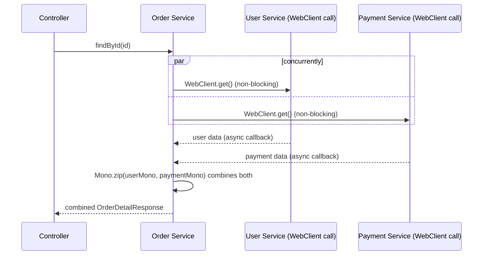

```java
public Mono<OrderDetailResponse> getOrderDetail(Long orderId) {
    Mono<Order> order = orderRepository.findById(orderId);
    Mono<User> user = order.flatMap(o -> userClient.getUser(o.getCustomerId()));
    Mono<PaymentInfo> payment = order.flatMap(o -> paymentClient.getPayment(o.getId()));

    return Mono.zip(order, user, payment)
        .map(tuple -> OrderDetailResponse.from(tuple.getT1(), tuple.getT2(), tuple.getT3()));
}
```

`Mono.zip()` runs both downstream calls **concurrently** rather than sequentially — a key performance advantage over sequential blocking calls, achieved without manually managing threads.

## 2.5 `WebClient`: The Reactive HTTP Client

```java
@Bean
public WebClient userServiceClient(WebClient.Builder builder) {
    return builder.baseUrl("http://user-service").build();
}
```

```java
public Mono<User> getUser(String userId) {
    return webClient.get()
        .uri("/users/{id}", userId)
        .retrieve()
        .bodyToMono(User.class)
        .timeout(Duration.ofSeconds(2))
        .onErrorResume(WebClientResponseException.NotFound.class, ex -> Mono.empty());
}
```

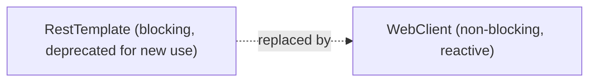

> [!TIP]
> `WebClient` works in **both** WebFlux and traditional Spring MVC applications — you can use it in a blocking MVC app (calling `.block()` at the boundary) to get a modern, fluent HTTP client API even without going fully reactive. But calling `.block()` inside a WebFlux controller reintroduces blocking and should be avoided.

## 2.6 Server-Sent Events (SSE) and Streaming

```java
@GetMapping(value = "/orders/stream", produces = MediaType.TEXT_EVENT_STREAM_VALUE)
public Flux<OrderResponse> streamOrders() {
    return orderService.streamOrderUpdates(); // a Flux that emits over time, doesn't complete immediately
}
```

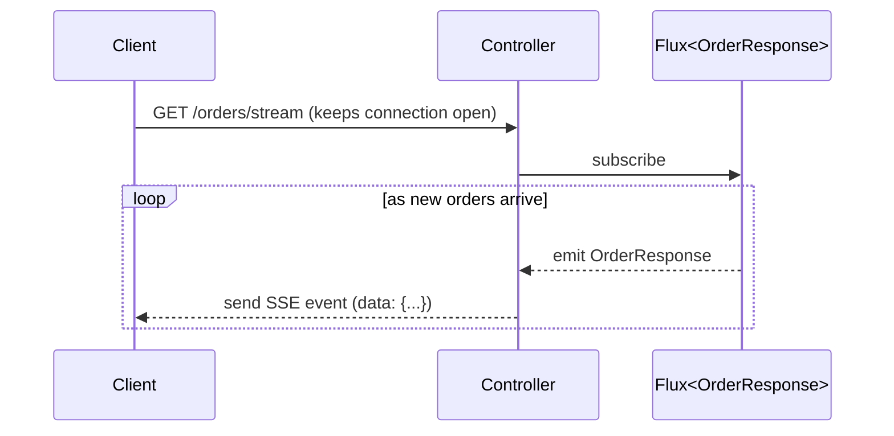

This is a use case where WebFlux has a structural advantage: holding thousands of long-lived streaming connections open with a small thread pool would exhaust a thread-per-connection Servlet model, but costs almost nothing extra in the reactive model.

## 2.7 Reactive WebFilter (WebFlux's Equivalent of a Servlet Filter)

```java
@Component
public class CorrelationIdWebFilter implements WebFilter {

    @Override
    public Mono<Void> filter(ServerWebExchange exchange, WebFilterChain chain) {
        String correlationId = UUID.randomUUID().toString();
        exchange.getResponse().getHeaders().add("X-Correlation-Id", correlationId);

        return chain.filter(exchange)
            .contextWrite(Context.of("correlationId", correlationId));
    }
}
```

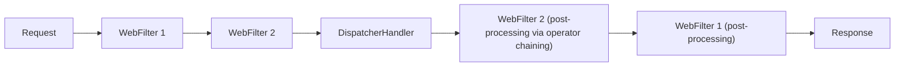

> [!IMPORTANT]
> `WebFilter.filter()` doesn't use imperative "before/after" code around a blocking call like a Servlet `Filter` does — it returns a `Mono<Void>` and expresses "after" logic via reactive operators (`.then()`, `.doFinally()`) chained onto `chain.filter(exchange)`, because the actual downstream processing hasn't happened yet when this method returns.

## 2.8 Reactive Context Propagation (Not `ThreadLocal`!)

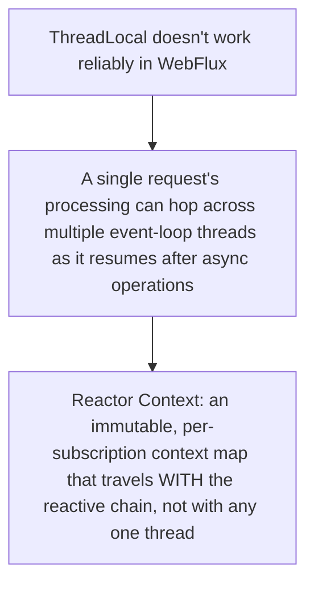

```java
public Mono<String> getCorrelationId() {
    return Mono.deferContextual(ctx -> Mono.just(ctx.get("correlationId")));
}
```

> [!WARNING]
> This is the single biggest mental adjustment coming from the Servlet world: `ThreadLocal` (used by `SecurityContextHolder` and MDC logging in Spring MVC) **does not reliably work in WebFlux**, because a request's processing can resume on a *different* thread after each asynchronous step. Reactor's **Context** replaces `ThreadLocal` — it's attached to the subscription itself and flows with the reactive chain regardless of which thread executes each step.

## 2.9 Testing Reactive Code

```java
@Test
void findsOrderById() {
    Order order = new Order(1L, "PAID");
    when(orderRepository.findById(1L)).thenReturn(Mono.just(order));

    StepVerifier.create(orderService.findById(1L))
        .expectNextMatches(response -> response.status().equals("PAID"))
        .verifyComplete();
}
```

```java
@WebFluxTest(OrderController.class)
class OrderControllerTest {

    @Autowired
    private WebTestClient webTestClient;

    @Test
    void getOrder() {
        webTestClient.get().uri("/orders/1")
            .exchange()
            .expectStatus().isOk()
            .expectBody(OrderResponse.class);
    }
}
```

`StepVerifier` (from `reactor-test`) is the standard way to assert on `Mono`/`Flux` behavior step-by-step, including timing and error signals — plain JUnit assertions on a `Mono` object are meaningless without subscribing to it first.

## 2.10 Configuration Differences from Spring MVC

```properties
# WebFlux uses Netty by default; no server.tomcat.* properties apply
spring.webflux.base-path=/api
```

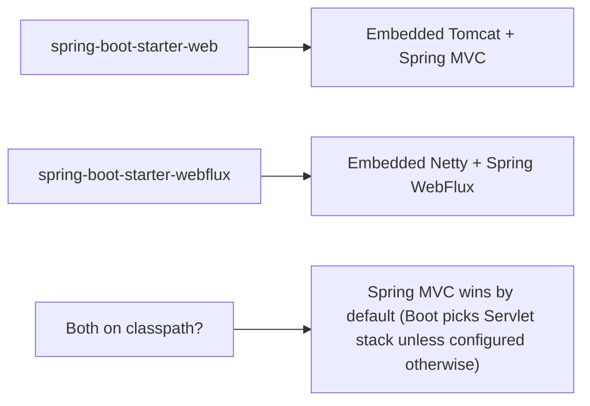

---

# 3. Advanced Concepts (Senior Level)

## 3.1 The Blocking Call Trap

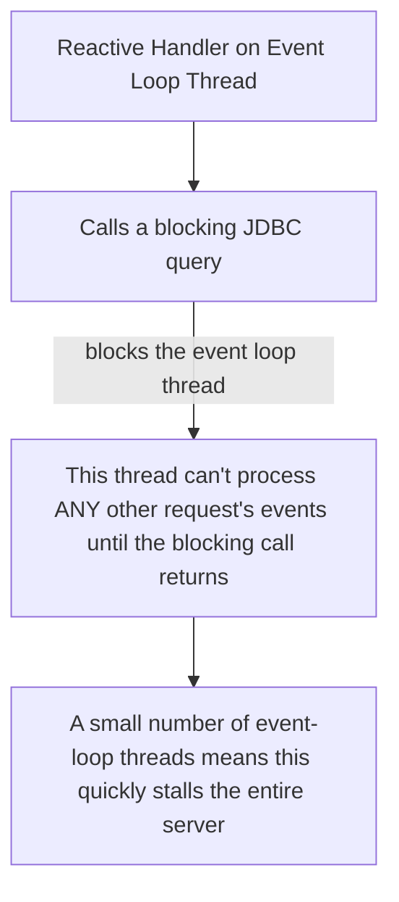

```java
// WRONG in a WebFlux app: blocks the event loop thread
@GetMapping("/legacy")
public Mono<String> legacy() {
    String result = jdbcTemplate.queryForObject("SELECT name FROM users WHERE id = 1", String.class);
    return Mono.just(result);
}
```

```java
// If you must call blocking code from a reactive pipeline, isolate it on a dedicated scheduler
public Mono<String> legacy() {
    return Mono.fromCallable(() ->
            jdbcTemplate.queryForObject("SELECT name FROM users WHERE id = 1", String.class))
        .subscribeOn(Schedulers.boundedElastic());
}
```

> [!IMPORTANT]
> Unlike the Servlet model, where one blocked thread only affects the request it's serving, blocking the **tiny fixed pool of event-loop threads** in WebFlux can stall the entire server's throughput — because those same few threads are responsible for processing I/O readiness events for *every* in-flight request. `Schedulers.boundedElastic()` provides an escape hatch: a separate thread pool designed specifically for wrapping unavoidable blocking calls so they don't stall the event loop.

## 3.2 Reactive Schedulers

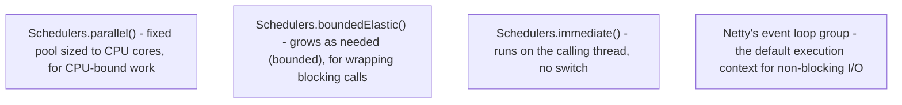

| Scheduler | Use Case |
|---|---|
| `Schedulers.parallel()` | CPU-intensive computation you want to run off the event loop |
| `Schedulers.boundedElastic()` | Wrapping legacy/blocking calls (JDBC, blocking file I/O) safely |
| `Schedulers.immediate()` | No thread switch — stays on whatever thread is currently executing |
| Default (Netty event loop) | Where non-blocking I/O callbacks naturally resume execution |

```java
Mono.fromCallable(this::expensiveComputation)
    .subscribeOn(Schedulers.parallel());
```

## 3.3 Backpressure

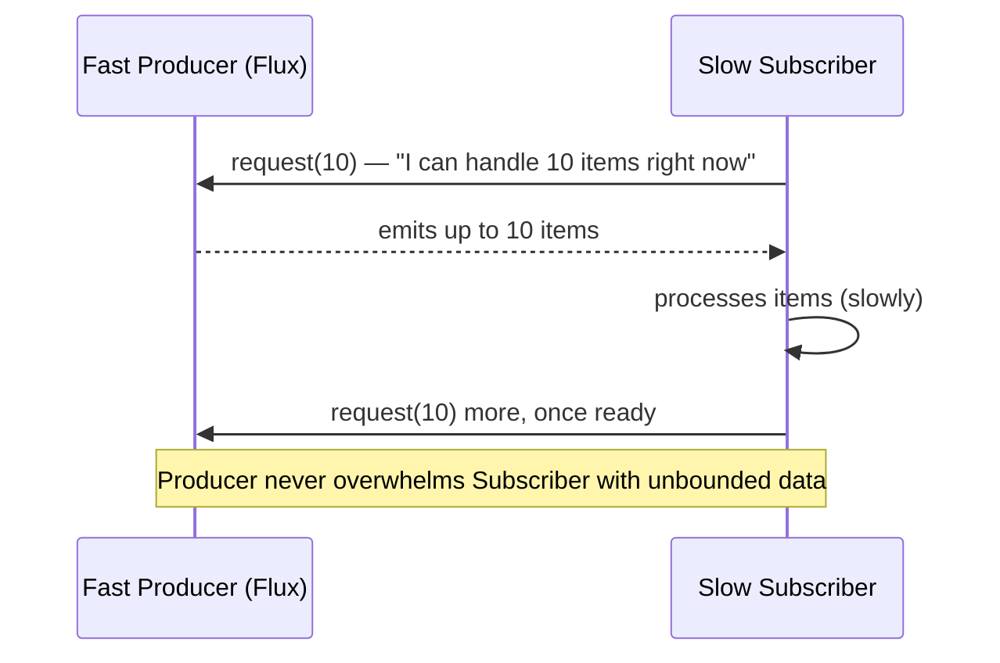

Backpressure is Reactive Streams' built-in mechanism for a subscriber to control the rate of data it receives, preventing fast producers (e.g., a database returning millions of rows) from overwhelming a slower consumer (e.g., a client connection). This is fundamentally different from a Servlet-based `List<T>` response, which must fully materialize in memory before being sent.

```java
Flux<Order> largeResultSet = orderRepository.findAll(); // streamed with backpressure, not loaded all at once
```

## 3.4 Reactive Spring Security

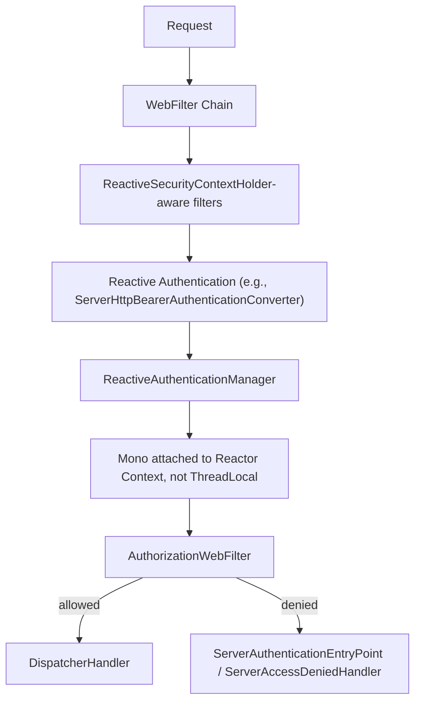

```java
@Bean
public SecurityWebFilterChain springSecurityFilterChain(ServerHttpSecurity http) {
    return http
        .authorizeExchange(exchange -> exchange
            .pathMatchers("/public/**").permitAll()
            .anyExchange().authenticated())
        .oauth2ResourceServer(oauth2 -> oauth2.jwt(Customizer.withDefaults()))
        .build();
}
```

Reactive Spring Security mirrors the Servlet-based model conceptually ([[10 Spring Security]]) but every extension point returns `Mono`/`Flux`, and `SecurityContext` is retrieved reactively via `ReactiveSecurityContextHolder.getContext()` (which returns a `Mono<SecurityContext>` sourced from Reactor Context) rather than `ThreadLocal`.

```java
Mono<String> currentUsername = ReactiveSecurityContextHolder.getContext()
    .map(SecurityContext::getAuthentication)
    .map(Authentication::getName);
```

## 3.5 Reactive Transactions

```java
@Transactional
public Mono<Order> placeOrder(CreateOrderRequest request) {
    return orderRepository.save(new Order(request))
        .flatMap(order -> inventoryService.reserveStock(order).thenReturn(order));
}
```

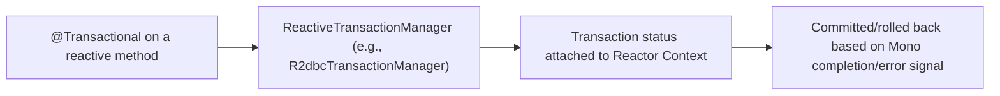

> [!WARNING]
> `@Transactional` in a reactive method requires a `ReactiveTransactionManager` (e.g., backed by R2DBC), not the standard JDBC-based `PlatformTransactionManager`. Mixing JPA/Hibernate (inherently blocking) into a WebFlux application under `@Transactional` does not give you reactive transaction semantics — it silently reintroduces blocking behavior. R2DBC is the genuinely reactive relational database driver ecosystem.

## 3.6 Error Handling Patterns

```java
public Mono<OrderResponse> getOrder(Long id) {
    return orderRepository.findById(id)
        .map(OrderResponse::from)
        .switchIfEmpty(Mono.error(new OrderNotFoundException(id)))
        .onErrorResume(TimeoutException.class, ex -> Mono.error(new ServiceUnavailableException()))
        .doOnError(ex -> log.error("Failed to get order {}", id, ex))
        .timeout(Duration.ofSeconds(3));
}
```

| Operator | Behavior |
|---|---|
| `.onErrorResume(fn)` | Recover with a fallback publisher |
| `.onErrorReturn(value)` | Recover with a static fallback value |
| `.doOnError(fn)` | Side-effect (e.g., logging) without altering the error signal |
| `.retryWhen(spec)` | Sophisticated retry with backoff, jitter, and conditions |
| `.timeout(duration)` | Emits a `TimeoutException` if no signal arrives in time |

## 3.7 Failure Scenarios

| Failure | Symptom | Common Cause | Fix |
|---|---|---|---|
| Server-wide latency spike / stall | All requests slow down simultaneously | A blocking call executed directly on an event-loop thread | Wrap blocking calls in `Schedulers.boundedElastic()`, or avoid them entirely |
| `IllegalStateException: block()/blockFirst()/blockLast() are blocking` | Thrown when calling `.block()` inside a reactive context (Reactor's safety check) | Attempting to bridge reactive-to-blocking incorrectly inside the event loop | Restructure to stay reactive end-to-end, or use `boundedElastic` explicitly if truly unavoidable |
| Empty/missing correlation ID or auth context deep in a call chain | `ThreadLocal`-based data (MDC, `SecurityContextHolder`) missing | Assuming `ThreadLocal` propagates the way it does in Servlet/MVC code | Use Reactor Context (`contextWrite`/`deferContextual`) instead |
| `Mono<Mono<T>>` type oddities / nothing seems to execute | Using `.map()` where `.flatMap()` was needed | Confusing a synchronous transform with one that returns a publisher | Use `.flatMap()` whenever the function itself returns `Mono`/`Flux` |
| Silent request hangs / no response ever sent | Subscribing without a terminal signal, or a source `Mono`/`Flux` never completes | Missing `.subscribe()`/framework never sees a completion signal, or an infinite `Flux` with no `.take()` bound on a synchronous non-streaming endpoint | Verify the publisher actually completes for non-streaming endpoints |
| Reactive Security context missing in downstream calls | `ReactiveSecurityContextHolder.getContext()` returns empty | Context not propagated correctly across a manually created `Mono`/thread boundary | Ensure the reactive chain isn't broken by wrapping in non-reactive code that discards context |
| Mixing JPA/Hibernate into WebFlux "for convenience" | Defeats the entire non-blocking model | Blocking ORM call executed inside a reactive pipeline without isolation | Use R2DBC for genuinely reactive persistence, or isolate JPA calls on `boundedElastic` deliberately |

## 3.8 Performance Considerations

- Reactive doesn't make individual requests *faster* — it improves **throughput under high concurrency with I/O-bound workloads** by using threads more efficiently.
- Profile actual event-loop thread utilization; a stalled event loop looks like "everything is slow" rather than "one request is slow."
- Use `Mono.zip()`/`Flux.merge()` for concurrent independent calls rather than chaining them sequentially with `.flatMap()`.
- Watch out for accidentally serializing what should be parallel work (e.g., `.flatMap()` on a `Flux` runs concurrently by default, but sequential-looking chains of `.then()` calls run in order).
- Benchmark with realistic concurrent load — reactive advantages are invisible at low concurrency and only show up as connection counts rise.

## 3.9 Security Pitfalls Specific to Reactive

| Risk | Mitigation |
|---|---|
| Assuming `SecurityContextHolder` (blocking-style) works in WebFlux | Use `ReactiveSecurityContextHolder` and Reactor Context consistently |
| Blocking calls introduced by security libraries not built for reactive stacks | Verify any custom `AuthenticationProvider`-equivalent is truly non-blocking, or isolate on `boundedElastic` |
| Leaking security context across requests via improperly scoped Reactor Context | Always derive context per-subscription (`contextWrite` scoped correctly), never share mutable global state |

---

# 4. Real-World System Design Usage

## 4.1 Where WebFlux Is Used in Production

- API gateways (Spring Cloud Gateway is built on WebFlux) needing to proxy huge numbers of concurrent connections efficiently.
- Streaming APIs (Server-Sent Events, real-time dashboards, notification feeds).
- High-fan-out services that call many downstream microservices concurrently per request.
- Systems built around reactive data stores (MongoDB reactive driver, R2DBC, Redis reactive client, Cassandra reactive driver).

## 4.2 Typical Production Architecture

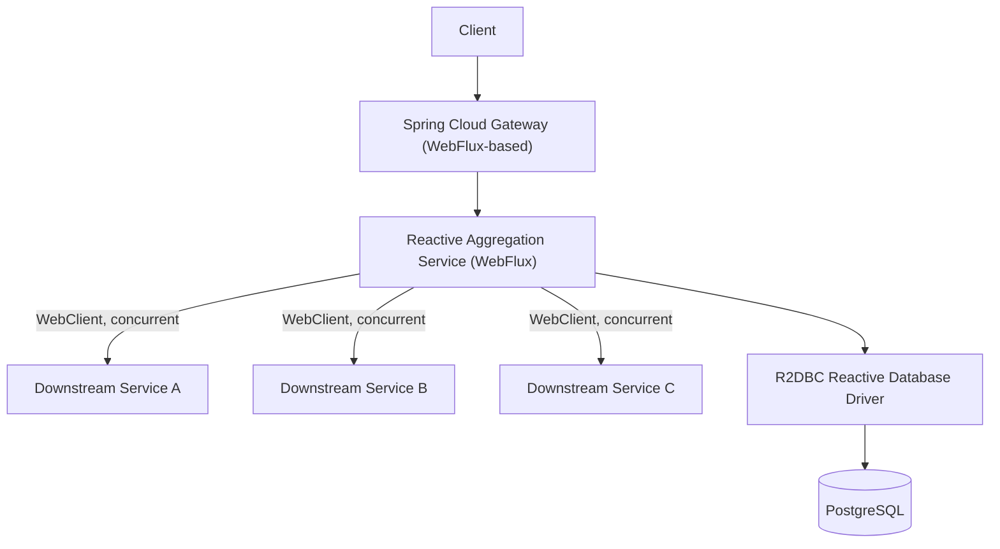

WebFlux's structural advantage shows most clearly in a **fan-out aggregation service** — one that calls several other services concurrently per incoming request — where blocking threads waiting on each of three downstream calls would multiply thread usage under load.

## 4.3 Big-Company Style Thinking

| Concern | WebFlux Design Response |
|---|---|
| Reliability | `.timeout()`/`.retryWhen()` on every downstream `WebClient` call; circuit breakers via Resilience4j's reactive operators |
| Scale | Small, fixed thread pool handling very high concurrent connection counts (API gateways, streaming) |
| Observability | Reactor Context-based trace propagation (not `ThreadLocal`-based), Micrometer's reactive instrumentation |
| Security | Reactive Spring Security with `ReactiveSecurityContextHolder` |
| Maintainability | Discipline required to keep the entire call chain non-blocking end-to-end (a single blocking dependency undermines the whole stack) |
| Performance | Concurrent `Mono.zip()`/`Flux.merge()` composition for multi-dependency aggregation, backpressure for streaming endpoints |

## 4.4 Example: Aggregation Gateway Request Flow

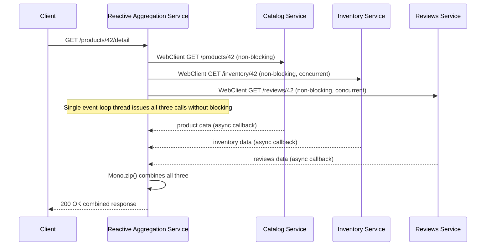

All three downstream calls happen concurrently from a **single** request-handling thread, which is freed to serve other requests while waiting — a scenario where the Servlet model would need three threads blocked simultaneously (or manual `CompletableFuture` orchestration) to achieve the same concurrency.

## 4.5 Layered Reactive Architecture

```text
WebFilter Layer
    - Reactive Security, correlation ID propagation via Reactor Context

DispatcherHandler / Controller Layer
    - Returns Mono<T>/Flux<T>, never blocks

Service Layer
    - Composes Mono/Flux pipelines, coordinates concurrent WebClient/repository calls

Reactive Data Access Layer
    - R2DBC / reactive MongoDB / reactive Redis clients
    - NEVER JDBC/JPA directly in the hot path

External Call Layer
    - WebClient for all outbound HTTP, never RestTemplate/blocking clients
```

## 4.6 Integration with Other Systems

| System | WebFlux Integration |
|---|---|
| Relational databases | R2DBC (reactive relational database connectivity) |
| MongoDB | Reactive Streams MongoDB driver via Spring Data MongoDB Reactive |
| Redis | Lettuce's reactive API via Spring Data Redis Reactive |
| Messaging | Reactor Kafka, reactive RabbitMQ clients |
| Resilience | Resilience4j's reactive operators (`transform()`/`transformDeferred()`) for circuit breakers/retries |
| API Gateway | Spring Cloud Gateway (built entirely on WebFlux) |
| Observability | Micrometer + Reactor's context propagation for tracing across async boundaries |

---

# 5. Interview Preparation

## 5.1 What Interviewers Expect

For "WebFlux" topics, interviewers usually expect:

- You understand the fundamental difference between thread-per-request (MVC) and event-loop (WebFlux) models.
- You know `Mono`/`Flux` basics and the "nothing happens until subscribed" principle.
- You can explain when WebFlux is actually beneficial vs. when it adds complexity for no gain.

For senior backend roles, they also expect:

- You understand the blocking-call trap and how it can stall an entire reactive server.
- You know why `ThreadLocal` doesn't work reliably in WebFlux and what replaces it (Reactor Context).
- You can reason about backpressure and why it matters for streaming.
- You understand that reactive database/HTTP clients are required end-to-end for the model to actually pay off.

## 5.2 Most Important Questions and Answers

### Q1. What is the fundamental architectural difference between Spring MVC and Spring WebFlux?

Spring MVC uses a thread-per-request model on a Servlet container (Tomcat): each request holds a dedicated thread for its full duration, including blocking I/O wait time. Spring WebFlux uses a small, fixed pool of event-loop threads (on Netty by default) that never block — I/O operations register callbacks and the thread moves on to other work, resuming when results are ready.

### Q2. What does "nothing happens until subscribed" mean for `Mono`/`Flux`?

Building a reactive pipeline (`.map()`, `.flatMap()`, etc.) only describes a computation; it doesn't execute anything. Execution begins only when something subscribes to the publisher — in a WebFlux controller, the framework itself does this subscription when writing the response, so application code typically never calls `.subscribe()` or `.block()` directly.

### Q3. Why is calling a blocking JDBC query directly inside a WebFlux controller dangerous?

It blocks one of the small, fixed number of event-loop threads responsible for processing I/O readiness for *all* in-flight requests, not just the current one — potentially stalling the entire server's throughput, unlike the Servlet model where a blocked thread only affects its own request.

### Q4. Why doesn't `ThreadLocal` (like `SecurityContextHolder` in Spring MVC) work reliably in WebFlux?

A single request's reactive pipeline can resume execution on a *different* event-loop thread after each asynchronous step (e.g., after an I/O callback completes), so data tied to "the current thread" via `ThreadLocal` doesn't travel with the logical request. Reactor's **Context** solves this by attaching data to the subscription itself, which flows correctly regardless of which thread executes each step.

### Q5. What is backpressure, and why does it matter?

Backpressure is Reactive Streams' mechanism letting a subscriber tell a publisher how much data it's ready to receive, preventing a fast producer from overwhelming a slower consumer. It matters most for streaming scenarios (large result sets, SSE feeds) where materializing everything in memory upfront (as a Servlet-based `List<T>` response would) isn't feasible or efficient.

### Q6. When would you NOT choose WebFlux for a new service?

When the workload is CPU-bound rather than I/O-bound (reactive doesn't help there), when key dependencies (an ORM, a legacy client library) are inherently blocking and can't realistically be replaced, or when team familiarity/debuggability favors simpler blocking code — especially now that virtual threads let Spring MVC handle high I/O-bound concurrency with much less conceptual overhead.

### Q7. What's the difference between `.map()` and `.flatMap()` on a `Mono`/`Flux`?

`.map()` applies a synchronous transformation, producing a plain value wrapped back into the same reactive type. `.flatMap()` is for when the transformation itself returns a `Mono`/`Flux` (e.g., calling another reactive method) — it flattens the nested publisher into a single stream rather than producing a `Mono<Mono<T>>`.

### Q8. How do you run two independent reactive calls concurrently instead of sequentially?

Use `Mono.zip()` (or `Flux.merge()`/`Flux.zip()` for multiple items) to combine independently-subscribed publishers, which subscribes to each concurrently and combines their results once all complete — as opposed to chaining them with sequential `.flatMap()` calls, which would wait for the first to complete before starting the second.

### Q9. What replaces `RestTemplate` in a WebFlux application, and why?

`WebClient`, Spring's non-blocking, reactive HTTP client. `RestTemplate` is a blocking client and is now in maintenance mode; using it inside a WebFlux pipeline (without explicit isolation) would block an event-loop thread, defeating the reactive model.

### Q10. What is `Schedulers.boundedElastic()` for?

It's a thread pool specifically intended for wrapping blocking calls that can't be avoided (e.g., a legacy blocking library) so they don't stall the small event-loop thread pool. It's an escape hatch, not a general-purpose solution — using it everywhere effectively recreates a thread-per-blocking-call model.

## 5.3 Tricky Questions

### If reactive is non-blocking, why would `.block()` ever throw an exception in WebFlux?

Reactor detects when `.block()` is called on an event-loop thread (via `Schedulers.isInNonBlockingThread()`) and throws `IllegalStateException` deliberately, as a safety net — calling `.block()` there would be exactly the blocking-call trap described above, so Reactor fails fast rather than silently degrading performance.

### Does WebFlux make a single request complete faster than MVC?

Generally no — for a single request with the same downstream latency, response time is comparable or sometimes slightly worse due to reactive overhead. The benefit is in **aggregate throughput under high concurrency**, not single-request latency.

### Can you mix WebFlux and blocking code in the same application safely?

Yes, but only with explicit isolation: wrap blocking calls in `Mono.fromCallable(...).subscribeOn(Schedulers.boundedElastic())` so they run on a dedicated pool, never directly on the event loop. This is a common and valid pattern for gradually adopting reactive style or bridging to unavoidably blocking dependencies.

### Why might a `Flux` representing a "stream that never ends" be a design smell for a normal REST endpoint?

Normal request/response endpoints should return a `Mono`/`Flux` that eventually completes so the framework knows when to finish writing the response. An infinite, never-completing `Flux` is appropriate for genuine streaming endpoints (SSE) but would hang a regular JSON response endpoint forever.

## 5.4 Common Candidate Mistakes

- Claiming WebFlux makes everything "faster" rather than "more concurrent under I/O-bound load."
- Using `.map()` where `.flatMap()` was needed, producing nested publishers.
- Calling `.block()` inside a reactive pipeline "to make it work," defeating the model.
- Assuming `SecurityContextHolder`/MDC work the same way as in Spring MVC.
- Mixing JPA/Hibernate into a WebFlux app without realizing it reintroduces blocking.
- Not knowing what backpressure is or why it matters for streaming.
- Choosing WebFlux by default without considering whether the workload is actually I/O-bound and whether all dependencies are reactive.

## 5.5 Interview Coding Checklist

- [ ] Return `Mono`/`Flux` from controller methods; never call `.block()` inside them.
- [ ] Use `.flatMap()` for chained async calls, `.map()` only for synchronous transforms.
- [ ] Use `Mono.zip()`/`Flux.merge()` for genuinely independent concurrent calls.
- [ ] Wrap any unavoidable blocking call in `Schedulers.boundedElastic()`.
- [ ] Use Reactor Context, not `ThreadLocal`, for cross-cutting per-request data.
- [ ] Use R2DBC (or another reactive driver), not JDBC/JPA, for the data layer.

---

# 6. Hands-On Thinking

## 6.1 Three Real-World Projects Using WebFlux

### Project 1: Real-Time Order Status Streaming API

Concepts:

- SSE endpoint (`Flux<OrderStatusEvent>`) streaming live updates to connected clients.
- Backpressure handling for slow clients.
- Reactive Kafka consumer feeding the stream.

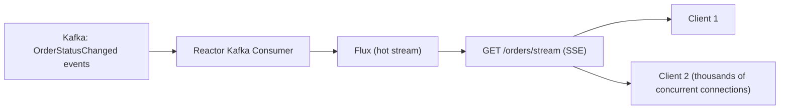

### Project 2: Multi-Service Aggregation Gateway

Concepts:

- `WebClient` calling 3-5 downstream services concurrently per request.
- `Mono.zip()` combining results.
- Circuit breakers (Resilience4j reactive) and timeouts per downstream call.

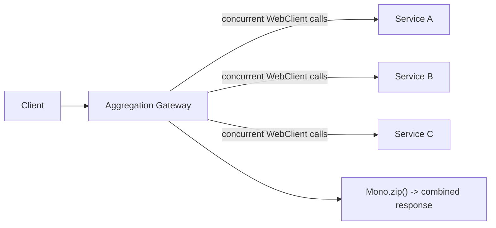

### Project 3: High-Concurrency Reactive REST API with R2DBC

Concepts:

- `ReactiveCrudRepository` backed by R2DBC against PostgreSQL.
- Reactive Spring Security (JWT resource server) protecting endpoints.
- Load testing to demonstrate throughput advantage under many concurrent slow-downstream-call scenarios.

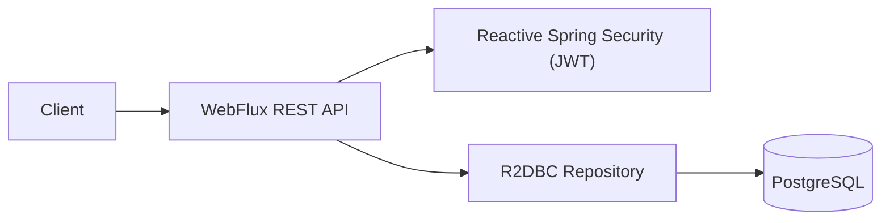

## 6.2 Step-by-Step Design Approach

For any WebFlux project:

1. Confirm the workload is genuinely I/O-bound with high concurrency potential, or genuinely streaming — otherwise reconsider WebFlux vs. MVC + virtual threads.
2. Choose reactive drivers end-to-end: R2DBC (not JPA), `WebClient` (not `RestTemplate`), reactive messaging clients.
3. Design service methods returning `Mono`/`Flux`, composing with `.flatMap()`/`.zip()` deliberately.
4. Identify any unavoidable blocking dependency and isolate it explicitly on `Schedulers.boundedElastic()`.
5. Replace `ThreadLocal`-based cross-cutting concerns with Reactor Context.
6. Add timeouts, retries, and circuit breakers to every external `WebClient` call.
7. Test with `StepVerifier`/`WebTestClient`, including error and empty-result paths.
8. Load test at realistic concurrency to actually observe the throughput benefit (it won't show at low concurrency).

## 6.3 Production Implementation Approach

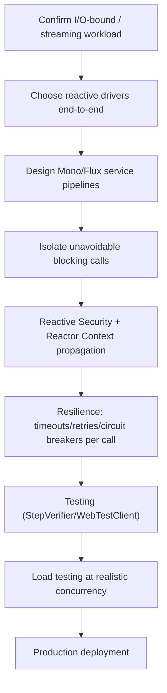

## 6.4 Production Readiness Example

For a WebFlux service, define:

- Confirmed non-blocking data access (R2DBC/reactive driver), with no JDBC/JPA in the hot request path.
- Every `WebClient` call has an explicit `.timeout()` and retry/circuit-breaker policy.
- Any blocking dependency explicitly isolated on `Schedulers.boundedElastic()`, documented as a known trade-off.
- Reactor Context used for correlation IDs/security context, not `ThreadLocal`.
- Load testing performed at the concurrency level the service is expected to handle in production, confirming the throughput benefit is real for this workload.

---

# 7. Deep Dive (Optional but Important)

## 7.1 Reactive Streams Specification Internals

```mermaid
sequenceDiagram
    participant Sub as Subscriber
    participant Pub as Publisher

    Sub->>Pub: subscribe(subscriber)
    Pub-->>Sub: onSubscribe(subscription)
    Sub->>Pub: subscription.request(n)
    Pub-->>Sub: onNext(item) [up to n times]
    alt completes normally
        Pub-->>Sub: onComplete()
    else error occurs
        Pub-->>Sub: onError(throwable)
    end
```

`Mono`/`Flux` are Project Reactor's implementations of the Reactive Streams specification's `Publisher` interface. The `request(n)` call from `Subscriber` to `Publisher` is the actual mechanism behind backpressure — the publisher is contractually forbidden from emitting more than `n` items until asked for more.

## 7.2 Netty's Event Loop Model

```mermaid
flowchart TB
    BossGroup["Boss EventLoopGroup (accepts new connections)"]
    WorkerGroup["Worker EventLoopGroup (handles I/O for established connections)"]
    BossGroup --> WorkerGroup
    WorkerGroup --> EL1["EventLoop 1 (handles a subset of connections' I/O, non-blocking)"]
    WorkerGroup --> EL2["EventLoop 2"]
    WorkerGroup --> ELN["... typically ~2x CPU cores"]
```

Each Netty `EventLoop` is a single thread that multiplexes I/O across many connections using OS-level selectors (epoll on Linux) — a connection is only "active" on a thread while there's actual work to do (bytes ready to read/write), never while idle or waiting for a downstream response.

## 7.3 `Mono`/`Flux` Assembly vs. Subscription Time

```text
Assembly time:     the pipeline is being BUILT (map/flatMap/filter chained) — no execution yet
Subscription time: something subscribes -> onSubscribe/onNext/onComplete signals actually flow
```

```java
Mono<String> pipeline = Mono.just("input")   // assembly
    .map(String::toUpperCase)                 // assembly
    .doOnNext(v -> log.info("about to emit: {}", v)); // assembly

// Nothing has executed yet! Only now:
pipeline.subscribe(System.out::println); // subscription time - execution actually happens
```

This assembly/subscription distinction explains why side effects inside `.map()`/`.doOnNext()` don't run when you *think* they should (at pipeline construction) — they run only when the eventual subscriber (WebFlux's `DispatcherHandler`, or `StepVerifier` in a test) triggers execution.

## 7.4 Context Propagation Mechanics

```mermaid
flowchart TB
    Sub["Subscriber subscribes with an initial Context"] --> Chain["Context flows UPSTREAM through the operator chain during subscription"]
    Chain --> Operators["Each operator can read (deferContextual) or add to (contextWrite) the Context"]
    Operators --> Execution["During execution, data flows DOWNSTREAM, but Context remains accessible at each step"]
```

> [!TIP]
> A common point of confusion: `contextWrite()` written "after" an operator in the chain actually applies to operators "before" it in read order, because Context propagates **upstream** during subscription, opposite to the downstream direction data flows during execution. Read Reactor's context documentation carefully when debugging "why can't this operator see the context I wrote."

## 7.5 Debugging Tools

| Tool/Technique | Purpose |
|---|---|
| `reactor.tools.agent.ReactorDebugAgent` / `Hooks.onOperatorDebug()` | Produces readable stack traces across async boundaries (normally very hard to debug) |
| `.log()` operator | Logs every Reactive Streams signal (`onSubscribe`, `onNext`, `onComplete`, `onError`) for a pipeline |
| `StepVerifier` with `.expectNoEvent(duration)` | Asserts on timing behavior in tests |
| BlockHound | A library that detects blocking calls executed on non-blocking threads at runtime, failing fast in tests/CI |
| Micrometer + Reactor Context propagation | Distributed tracing across genuinely async, multi-thread-hopping reactive chains |

```java
Flux<Order> debugged = orderRepository.findAll()
    .log("orders.stream");
```

---

# Production Checklists

## Code Quality Checklist

- [ ] Controllers/services return `Mono`/`Flux`, never call `.block()`/`.subscribe()` themselves.
- [ ] `.flatMap()` used (not `.map()`) for any transformation returning a publisher.
- [ ] Independent async calls combined with `Mono.zip()`/`Flux.merge()`, not chained sequentially.
- [ ] Any blocking call explicitly isolated via `Schedulers.boundedElastic()` and documented.
- [ ] Reactor Context used for cross-cutting per-request data, not `ThreadLocal`.

## Performance Checklist

- [ ] Data access layer is genuinely reactive (R2DBC/reactive drivers), not JPA/JDBC in the hot path.
- [ ] `WebClient` used for all outbound HTTP, not `RestTemplate`.
- [ ] Timeouts configured on every external call.
- [ ] Load tested at realistic high concurrency to confirm the throughput benefit actually materializes for this workload.
- [ ] BlockHound (or equivalent) used in tests/CI to catch accidental blocking calls on event-loop threads.

## Security Checklist

- [ ] Reactive Spring Security (`ReactiveSecurityContextHolder`, `SecurityWebFilterChain`) used consistently.
- [ ] No blocking authentication/authorization logic executed directly on the event loop.
- [ ] Security context correctly propagated via Reactor Context through the full call chain.

## Debugging Checklist

- [ ] Reproduce with `.log()` on the suspect pipeline to see actual Reactive Streams signals.
- [ ] Check for accidental blocking calls first if the whole server seems to stall, not just one request.
- [ ] Verify `Mono`/`Flux` pipelines actually terminate (`onComplete`/`onError`) for non-streaming endpoints.
- [ ] Confirm Reactor Context (not `ThreadLocal`) is used wherever cross-cutting data is expected downstream.
- [ ] Use `StepVerifier` to pin down exactly which operator produces unexpected behavior.

---

# Learning Roadmap

## Phase 1: Beginner

Learn:

- `Mono`/`Flux` basics, "nothing happens until subscribed."
- Basic reactive controllers and repositories.
- Basic operators (`map`, `filter`, `flatMap`).

Practice:

- Simple reactive CRUD API backed by R2DBC.

## Phase 2: Intermediate

Learn:

- `WebClient` for outbound calls.
- Combining concurrent calls (`Mono.zip()`).
- SSE/streaming endpoints.
- `WebFilter` and reactive request/response lifecycle.
- Testing with `StepVerifier`/`WebTestClient`.

Practice:

- Build a real-time SSE streaming endpoint backed by a reactive message source.

## Phase 3: Advanced

Learn:

- The blocking-call trap and `Schedulers.boundedElastic()`.
- Reactor Context (replacing `ThreadLocal`).
- Reactive Spring Security.
- Backpressure semantics in depth.
- Reactive transactions (R2DBC transaction manager).

Practice:

- Build a multi-service aggregation gateway using concurrent `WebClient` calls and resilience patterns.

## Phase 4: Production Reactive Systems Engineer

Learn:

- Netty event loop internals.
- Reactive Streams specification details.
- BlockHound and blocking-call detection in CI.
- Debugging async stack traces across thread hops.
- Deciding WebFlux vs. MVC + virtual threads for a given workload.

Practice:

- Production-style high-concurrency reactive API with full observability, resilience, and load-tested throughput comparison against an equivalent MVC implementation.

---

# Self-Review Completion Loop

The topic was reviewed against:

- Official Spring Framework WebFlux reference documentation.
- Project Reactor reference documentation and Reactive Streams specification.
- Comparison against the Servlet/Spring MVC stack ([[07 Servlets and Filters]], [[05 Spring Boot]]).
- Common production incident patterns (blocking-call trap, `ThreadLocal` misuse, context propagation bugs).
- Interview patterns for beginner through senior backend roles focused on reactive systems.

## Gap Review Matrix

| Area | Covered? | Notes |
|---|---|---|
| Thread-per-request vs. event-loop contrast | Yes | Direct diagrammed comparison with MVC |
| `Mono`/`Flux` fundamentals | Yes | Including "nothing happens until subscribed" |
| Full WebFlux architecture | Yes | `DispatcherHandler`, `WebFilter`, Netty pipeline diagram |
| Operators (`map`/`flatMap`/`zip`/etc.) | Yes | Table + common pitfall (`map` vs `flatMap`) |
| `WebClient` | Yes | Replaces `RestTemplate`, usable in both stacks |
| SSE/streaming | Yes | Sequence diagram, backpressure explanation |
| Blocking-call trap | Yes | Diagram, code example, `boundedElastic` fix |
| Reactor Context vs. `ThreadLocal` | Yes | Explicit contrast, propagation mechanics deep dive |
| Reactive Spring Security | Yes | `ReactiveSecurityContextHolder`, diagram |
| Reactive transactions (R2DBC) | Yes | Contrast with JPA/blocking pitfall |
| Backpressure | Yes | Reactive Streams sequence diagram |
| Failure scenarios | Yes | Seven concrete production failure patterns |
| Real-world architecture (aggregation gateway) | Yes | Full sequence diagram with concurrent calls |
| Interview prep | Yes | Common and tricky questions, candidate mistakes |
| Hands-on projects | Yes | Three realistic projects with diagrams |
| Diagram/flow depth | Yes | Mermaid diagrams throughout every major section |

No significant gaps remain for the requested scope. Further specialization should split into separate deep dives: **R2DBC Deep Dive**, **Reactor Advanced Operators and Debugging**, **Spring Cloud Gateway Internals**, and **Choosing Between WebFlux and Virtual-Thread MVC at Scale**.

---

# Official References

- Spring Framework WebFlux Reference: <https://docs.spring.io/spring-framework/reference/web/webflux.html>
- Project Reactor Reference Guide: <https://projectreactor.io/docs/core/release/reference/>
- Reactive Streams Specification: <https://www.reactive-streams.org/>
- Spring Data R2DBC Reference: <https://docs.spring.io/spring-data/r2dbc/reference/>
- Spring Security Reactive Reference: <https://docs.spring.io/spring-security/reference/reactive/index.html>
- BlockHound Project: <https://github.com/reactor/BlockHound>

---

## Final Summary

Spring WebFlux trades the simplicity of thread-per-request blocking code for high throughput under I/O-bound concurrency, by running on a small, fixed pool of non-blocking event-loop threads instead of Tomcat's one-thread-per-request model. The entire benefit depends on discipline: every layer — data access, HTTP clients, security — must be genuinely non-blocking end-to-end, because a single blocking call on the event loop can stall the whole server rather than just one request. Production mastery means understanding the assembly-vs-subscription distinction for `Mono`/`Flux`, replacing `ThreadLocal` habits with Reactor Context, isolating any unavoidable blocking call on `Schedulers.boundedElastic()`, and — just as importantly — knowing when WebFlux is the wrong choice, since virtual threads now let traditional Spring MVC handle much of the same high-concurrency territory with far simpler code.
