# JavaScript: Beginner-to-Expert Engineering Guide

> **Scope:** This guide teaches JavaScript from first principles through production backend/frontend engineering usage. It covers modern ES2020+ JavaScript, the runtime model (event loop, engine internals), and how JavaScript is actually used in production systems (Node.js backends, browser frontends, tooling).

## Table of Contents

1. [Executive Summary](#executive-summary)
2. [1. Fundamentals](#1-fundamentals-beginner-level)
3. [2. Core Concepts](#2-core-concepts-intermediate-level)
4. [3. Advanced Concepts](#3-advanced-concepts-senior-level)
5. [4. Real-World System Design Usage](#4-real-world-system-design-usage)
6. [5. Interview Preparation](#5-interview-preparation)
7. [6. Hands-On Thinking](#6-hands-on-thinking)
8. [7. Deep Dive](#7-deep-dive-optional-but-important)
9. [Production Checklists](#production-checklists)
10. [Learning Roadmap](#learning-roadmap)
11. [Self-Review Completion Loop](#self-review-completion-loop)
12. [Official References](#official-references)

---

## Executive Summary

JavaScript is a dynamically typed, single-threaded (with an async event loop), prototype-based programming language originally built for browsers and now running everywhere — servers (Node.js), mobile (React Native), desktop (Electron), and edge/serverless runtimes.

The core idea:

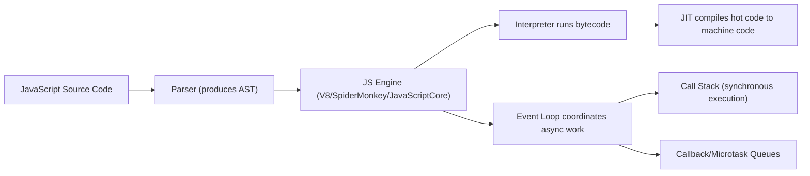

> [!TIP]
> Learn JavaScript as two connected things: the **language** (syntax, types, closures, prototypes) and the **runtime model** (the single-threaded event loop, call stack, and task queues that make async code work). Most confusing JavaScript bugs come from misunderstanding the runtime, not the syntax.

---

# 1. Fundamentals (Beginner Level)

## 1.1 What Is JavaScript?

JavaScript is a scripting language originally designed to make web pages interactive. Today it runs in browsers (via engines like V8, SpiderMonkey) and outside browsers via runtimes like Node.js and Deno.

```javascript
console.log("Hello, JavaScript!");

let name = "Asha";
console.log(`Hello, ${name}!`);
```

Run it:

```bash
node app.js
```

Or in a browser via a `<script>` tag or the DevTools console.

## 1.2 Why JavaScript Exists

| Problem | JavaScript's Answer |
|---|---|
| Static HTML pages couldn't react to user interaction | A scripting language embedded directly in the browser |
| Needed a language every browser could run without installation | Standardized as ECMAScript, implemented by every major browser |
| Needed asynchronous I/O without blocking the UI thread | Event loop + callbacks/Promises/async-await |
| Needed one language for both frontend and backend | Node.js brought JavaScript server-side |
| Needed to handle loosely structured, dynamic data (JSON, DOM) | Dynamic typing, first-class objects, native JSON support |

## 1.3 Problems JavaScript Solves

JavaScript is especially good when you need:

- Interactive user interfaces in a browser (no alternative exists for browser scripting other than compiling to JS/WASM).
- Full-stack development in one language (Node.js backend + JS/TypeScript frontend).
- Fast I/O-bound servers (its non-blocking event loop suits high-concurrency network I/O well).
- Rapid prototyping and a huge ecosystem (npm).

JavaScript is less ideal when you need:

- Heavy CPU-bound computation (single-threaded by default; Web Workers/worker threads help but add complexity).
- Strong compile-time type guarantees out of the box (TypeScript is the standard remedy).
- Extremely predictable low-level memory control.

## 1.4 Real-World Analogy

Think of JavaScript's engine like a single, very fast chef in a kitchen with a notepad of orders.

The chef (the single thread) can only cook one dish at a time, but instead of standing idle waiting for water to boil (a slow I/O operation), they hand that task to a timer (the browser/Node.js runtime) and move on to prep the next dish. When the timer rings, the "ready" task gets added back to the chef's order list (the callback queue), to be handled as soon as the chef finishes what's currently in hand.

```text
JS engine's single thread = the chef
Call stack                = the dish currently being cooked
Web APIs / Node APIs      = the timer, oven, etc. handling slow tasks in the background
Callback/task queue       = the "ready" orders waiting for the chef's attention
Event loop                = the process of the chef checking the ready-order list between dishes
```

## 1.5 Core Vocabulary

| Term | Meaning |
|---|---|
| ECMAScript | The language specification JavaScript implements |
| Engine | The program that parses and executes JS (V8, SpiderMonkey, JavaScriptCore) |
| Runtime | The engine plus surrounding APIs (browser DOM/Web APIs, or Node.js APIs) |
| Call Stack | Tracks currently executing function calls |
| Event Loop | Coordinates the call stack, callback queue, and microtask queue |
| Closure | A function that retains access to its defining scope's variables |
| Prototype | The mechanism behind JavaScript's object inheritance |
| Hoisting | Variable/function declarations being "moved" to the top of their scope during compilation |
| Truthy/Falsy | Values that coerce to `true`/`false` in a boolean context |

## 1.6 Variables and Types

```javascript
let age = 30;          // mutable binding
const name = "Asha";   // immutable binding (the binding, not necessarily the value)
var legacy = "avoid";   // function-scoped, avoid in modern code

const isActive = true;
const price = 19.99;
const items = ["apple", "banana"];
const user = { name: "Asha", age: 30 };
```

| Type | Example | Notes |
|---|---|---|
| `number` | `42`, `3.14` | Single numeric type (double-precision float); `BigInt` for arbitrary precision integers |
| `string` | `"hello"` | Immutable |
| `boolean` | `true`/`false` | |
| `undefined` | Declared but unassigned | |
| `null` | Explicit "no value" | |
| `object` | `{}`, arrays, functions | Reference type |
| `symbol` | Unique, immutable identifier | Used for special object keys |
| `bigint` | `123n` | Arbitrary-precision integers |

> [!WARNING]
> `typeof null === "object"` — a famous, unfixable legacy bug in the language. Always check for `null` explicitly (`value === null`), don't rely on `typeof`.

## 1.7 Control Flow

```javascript
if (age >= 18) {
    console.log("Adult");
} else {
    console.log("Minor");
}

for (let i = 0; i < 3; i++) {
    console.log(i);
}

for (const item of items) {
    console.log(item);
}

switch (role) {
    case "ADMIN":
        console.log("Full access");
        break;
    default:
        console.log("Limited access");
}
```

## 1.8 Functions

```javascript
function add(a, b) {
    return a + b;
}

const multiply = (a, b) => a * b; // arrow function

function greet(name = "friend") { // default parameter
    return `Hello, ${name}!`;
}

function sum(...numbers) { // rest parameter
    return numbers.reduce((total, n) => total + n, 0);
}
```

| Function Style | Notes |
|---|---|
| Function declaration | Hoisted; has its own `this` |
| Function expression | Not hoisted (the variable binding is, the assignment isn't) |
| Arrow function | No own `this`/`arguments`; inherits from enclosing scope; concise for callbacks |

## 1.9 Objects and Arrays

```javascript
const user = {
    name: "Asha",
    age: 30,
    greet() {
        return `Hi, I'm ${this.name}`;
    }
};

const { name, age } = user; // destructuring
const numbers = [1, 2, 3];
const [first, second] = numbers;

const doubled = numbers.map(n => n * 2);
const evens = numbers.filter(n => n % 2 === 0);
const total = numbers.reduce((sum, n) => sum + n, 0);
```

## 1.10 Basic Async: Callbacks, Promises, `async`/`await`

```javascript
// Callback style (older)
setTimeout(() => console.log("done"), 1000);

// Promise style
fetch("/api/orders")
    .then(response => response.json())
    .then(data => console.log(data))
    .catch(error => console.error(error));

// async/await (modern, preferred)
async function loadOrders() {
    try {
        const response = await fetch("/api/orders");
        const data = await response.json();
        console.log(data);
    } catch (error) {
        console.error(error);
    }
}
```

---

# 2. Core Concepts (Intermediate Level)

## 2.1 The Event Loop in Detail

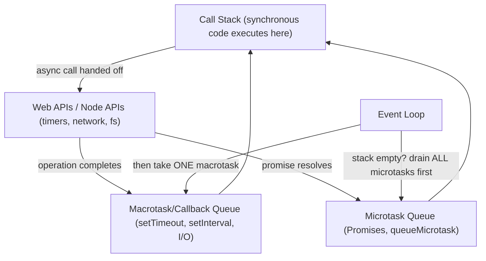

```javascript
console.log("1");
setTimeout(() => console.log("2"), 0);
Promise.resolve().then(() => console.log("3"));
console.log("4");

// Output: 1, 4, 3, 2
// Synchronous code runs first, then ALL microtasks (Promises) drain,
// THEN the event loop takes one task from the macrotask queue (setTimeout).
```

> [!IMPORTANT]
> **Microtasks (Promises) always run before macrotasks (`setTimeout`), even a `setTimeout(fn, 0)`.** This surprises almost every developer once. The event loop fully drains the microtask queue between every single macrotask — so a chain of `.then()` calls can even starve macrotasks if it keeps queueing more microtasks.

## 2.2 Closures

```javascript
function makeCounter() {
    let count = 0;
    return function increment() {
        count += 1;
        return count;
    };
}

const counter = makeCounter();
console.log(counter()); // 1
console.log(counter()); // 2
```

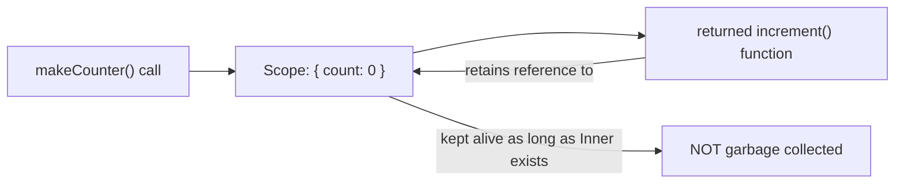

A closure is a function bundled with references to its surrounding lexical scope. This is the mechanism behind private state in JavaScript (before classes had true private fields), and behind the classic "loop variable capture" bug.

```javascript
// Classic bug: var is function-scoped, all callbacks share the SAME i
for (var i = 0; i < 3; i++) {
    setTimeout(() => console.log(i), 0); // logs 3, 3, 3
}

// Fixed: let is block-scoped, each iteration gets its OWN i
for (let i = 0; i < 3; i++) {
    setTimeout(() => console.log(i), 0); // logs 0, 1, 2
}
```

## 2.3 `this` Binding

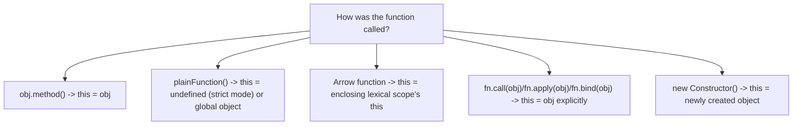

```javascript
const user = {
    name: "Asha",
    greetRegular: function () {
        console.log(this.name); // "Asha" - this = user (called as user.greetRegular())
    },
    greetArrow: () => {
        console.log(this.name); // undefined - arrow inherits outer (module/global) this
    }
};

const detached = user.greetRegular;
detached(); // undefined or error - this is now lost/undefined, NOT user
```

> [!WARNING]
> `this` in JavaScript is determined by **how a function is called**, not where it's defined (except for arrow functions, which fix `this` lexically at definition time). This is why passing `obj.method` as a callback (`setTimeout(obj.method, 100)`) silently loses `this` — a very common bug. Fix with `.bind(obj)` or an arrow function wrapper.

## 2.4 Prototypes and Classes

```javascript
class Animal {
    constructor(name) {
        this.name = name;
    }

    speak() {
        return `${this.name} makes a sound`;
    }
}

class Dog extends Animal {
    speak() {
        return `${this.name} barks`;
    }
}

const dog = new Dog("Rex");
console.log(dog.speak()); // "Rex barks"
```


ES6 `class` syntax is sugar over JavaScript's underlying **prototype chain** — method lookups walk up this chain until found (or reach `null`). Understanding the chain explains why modifying `Array.prototype` affects every array, and why property lookups can be slower on deeply nested prototype chains.

## 2.5 Array and Object Methods You'll Use Constantly

```javascript
const orders = [
    { id: 1, status: "PAID", total: 100 },
    { id: 2, status: "PENDING", total: 50 }
];

orders.find(o => o.status === "PAID");
orders.some(o => o.total > 90);
orders.every(o => o.total > 0);
orders.sort((a, b) => a.total - b.total);
[...orders].sort((a, b) => b.total - a.total); // copy first to avoid mutating original

const ids = orders.map(o => o.id);
const paidTotal = orders
    .filter(o => o.status === "PAID")
    .reduce((sum, o) => sum + o.total, 0);

Object.keys(orders[0]);
Object.values(orders[0]);
Object.entries(orders[0]);
const merged = { ...orders[0], total: 200 }; // spread creates a shallow copy with overrides
```

## 2.6 Destructuring and Spread/Rest

```javascript
const { id, status = "UNKNOWN" } = order; // default value if missing
const { id: orderId } = order;            // rename during destructuring

function createOrder({ customerId, items = [] }) {
    // destructure directly in parameters
}

const original = [1, 2, 3];
const copy = [...original, 4]; // spread: new array, original untouched
```

## 2.7 Modules

```javascript
// math.js
export function add(a, b) { return a + b; }
export default class Calculator { }

// app.js
import Calculator, { add } from "./math.js";
```

| Module System | Syntax | Where Used |
|---|---|---|
| ES Modules (ESM) | `import`/`export` | Modern browsers, modern Node.js (`"type": "module"`) |
| CommonJS | `require`/`module.exports` | Traditional Node.js |

> [!TIP]
> Node.js supports both, but mixing them carelessly in the same project causes real friction (CommonJS `require()` of an ESM-only package can fail). Pick one module system per project and be deliberate about `package.json`'s `"type"` field.

## 2.8 Error Handling

```javascript
class OrderNotFoundError extends Error {
    constructor(id) {
        super(`Order ${id} not found`);
        this.name = "OrderNotFoundError";
    }
}

async function getOrder(id) {
    const order = await orderRepository.findById(id);
    if (!order) {
        throw new OrderNotFoundError(id);
    }
    return order;
}

try {
    await getOrder(42);
} catch (error) {
    if (error instanceof OrderNotFoundError) {
        console.log("Handle missing order");
    } else {
        throw error; // rethrow unexpected errors
    }
}
```

## 2.9 JSON

```javascript
const json = JSON.stringify({ name: "Asha", age: 30 });
const obj = JSON.parse(json);
```

> [!WARNING]
> `JSON.stringify` silently drops `undefined` values, functions, and `Symbol`s from objects, and throws on circular references. `Date` objects are converted to ISO strings (and don't automatically convert back to `Date` on parse — you must do that manually).

## 2.10 Basic Testing

```javascript
import { describe, it, expect } from "vitest"; // or Jest

describe("Calculator", () => {
    it("adds two numbers", () => {
        expect(add(2, 3)).toBe(5);
    });

    it("throws on invalid input", () => {
        expect(() => divide(1, 0)).toThrow();
    });
});
```

---

# 3. Advanced Concepts (Senior Level)

## 3.1 Full Event Loop with `process.nextTick` (Node.js) and Microtasks

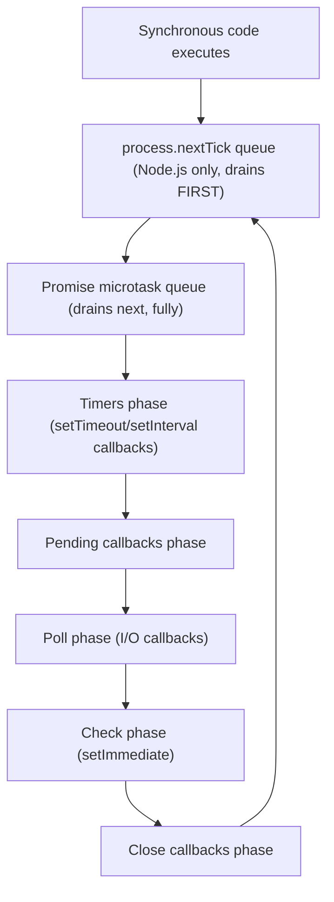

Node.js's event loop has distinct **phases** (timers, I/O, `setImmediate`, close callbacks), and between every phase transition — and after every single callback — Node fully drains `process.nextTick` first, then the Promise microtask queue. This is a more detailed picture than the simplified browser model and explains ordering subtleties between `setTimeout(fn, 0)`, `setImmediate(fn)`, and `process.nextTick(fn)`.

## 3.2 Promise Combinators

```javascript
const results = await Promise.all([fetchUser(1), fetchUser(2), fetchUser(3)]);
// fails fast if ANY promise rejects

const settled = await Promise.allSettled([fetchUser(1), fetchUser(2)]);
// never rejects; each result is { status: "fulfilled"/"rejected", value/reason }

const first = await Promise.race([fetchFromCache(), fetchFromNetwork()]);
// resolves/rejects as soon as the FIRST promise settles

const firstSuccess = await Promise.any([fetchFromMirror1(), fetchFromMirror2()]);
// resolves with the first FULFILLED promise, ignoring rejections unless all reject
```

| Combinator | Behavior | Use Case |
|---|---|---|
| `Promise.all` | Fails fast on first rejection | All results needed, all-or-nothing |
| `Promise.allSettled` | Never rejects, reports each outcome | Want results even if some fail |
| `Promise.race` | Settles on first settled promise (success or failure) | Timeouts, fastest-source wins |
| `Promise.any` | Resolves on first success, ignores failures | Redundant sources, only need one success |

## 3.3 Memory Management and Closures Gotchas


```javascript
function setup(largeData) {
    const summary = largeData.length; // only this is needed
    return function report() {
        console.log(summary); // but the closure may still retain largeData depending on engine optimization
    };
}
```

> [!WARNING]
> Closures retaining references to large objects (DOM nodes, big arrays, cached responses) longer than intended is a common source of memory leaks in long-running Node.js processes and single-page apps. Detach event listeners, clear intervals/timeouts, and null out references you no longer need, especially in long-lived server processes.

## 3.4 Debouncing and Throttling

```javascript
function debounce(fn, delay) {
    let timeoutId;
    return (...args) => {
        clearTimeout(timeoutId);
        timeoutId = setTimeout(() => fn(...args), delay);
    };
}

function throttle(fn, interval) {
    let lastCall = 0;
    return (...args) => {
        const now = Date.now();
        if (now - lastCall >= interval) {
            lastCall = now;
            fn(...args);
        }
    };
}
```

| Pattern | Behavior | Use Case |
|---|---|---|
| Debounce | Waits until calls stop for `delay` ms, then fires once | Search-as-you-type, resize handlers |
| Throttle | Fires at most once per `interval` ms | Scroll handlers, rate-limited API calls |

## 3.5 Prototype Pollution (Security)

```javascript
// Dangerous if merging untrusted input into an object recursively without guarding keys:
function merge(target, source) {
    for (const key in source) {
        if (typeof source[key] === "object") {
            target[key] = merge(target[key] || {}, source[key]);
        } else {
            target[key] = source[key];
        }
    }
    return target;
}

merge({}, JSON.parse('{"__proto__": {"isAdmin": true}}'));
// Can pollute Object.prototype, affecting EVERY object in the application
```

> [!IMPORTANT]
> **Prototype pollution** is a real, exploited vulnerability class in JavaScript: recursively merging untrusted JSON into objects without guarding against `__proto__`/`constructor`/`prototype` keys can let an attacker inject properties onto `Object.prototype` itself, affecting every object application-wide. Use `Object.create(null)` for dictionaries built from untrusted input, or a vetted merge library that explicitly blocks these keys.

## 3.6 Generators and Iterators

```javascript
function* idGenerator() {
    let id = 1;
    while (true) {
        yield id++;
    }
}

const gen = idGenerator();
console.log(gen.next().value); // 1
console.log(gen.next().value); // 2
```

```javascript
class Range {
    constructor(start, end) {
        this.start = start;
        this.end = end;
    }
    [Symbol.iterator]() {
        let current = this.start;
        const end = this.end;
        return {
            next() {
                return current <= end
                    ? { value: current++, done: false }
                    : { value: undefined, done: true };
            }
        };
    }
}

for (const n of new Range(1, 3)) {
    console.log(n); // 1, 2, 3
}
```

Generators (and the `Symbol.iterator` protocol) are the mechanism underlying `for...of`, spread syntax, and destructuring over custom objects — and are the conceptual foundation async generators (`async function*`) build on for streaming async data.

## 3.7 `WeakMap` and `WeakRef`

```javascript
const cache = new WeakMap();

function getMetadata(obj) {
    if (!cache.has(obj)) {
        cache.set(obj, computeExpensiveMetadata(obj));
    }
    return cache.get(obj);
}
```

`WeakMap` keys must be objects, and — critically — **don't prevent garbage collection** of those objects. A regular `Map` used as a cache keyed by objects would keep every key alive forever; `WeakMap` lets entries be collected once nothing else references the key object, making it ideal for metadata/caching tied to an object's lifetime without causing a memory leak.

## 3.8 Failure Scenarios

| Failure | Symptom | Common Cause | Fix |
|---|---|---|---|
| `setTimeout(fn, 0)` runs later than expected | Ordering surprises | Microtasks (Promises) always drain fully before the next macrotask | Understand the micro/macrotask distinction; don't assume `setTimeout(fn, 0)` means "immediately" |
| Memory leak in a long-running Node.js server | Growing heap over time | Closures/caches/event listeners retaining references indefinitely | Use `WeakMap` for object-keyed caches, remove listeners, bound cache sizes |
| `this` is `undefined` in a callback | `TypeError: Cannot read property of undefined` | Passing `obj.method` as a bare callback loses its `this` binding | Use `.bind(obj)`, an arrow function wrapper, or arrow class fields |
| Unhandled promise rejection crashes a Node process | Process exits or logs a warning | A rejected promise with no `.catch()`/try-catch | Always handle rejections; use global `unhandledRejection` handlers as a safety net, not a fix |
| Prototype pollution vulnerability | Unexpected properties appear on unrelated objects | Recursive merge of untrusted JSON without key guards | Guard `__proto__`/`constructor`/`prototype` keys, use `Object.create(null)` for untrusted dictionaries |
| Race condition in concurrent async code | Inconsistent results depending on timing | Assuming synchronous-like ordering across `await` boundaries | Use proper synchronization (mutex libraries) or restructure to avoid shared mutable state across awaits |
| `NaN` propagating silently through calculations | Wrong numeric results with no error thrown | JavaScript's permissive numeric coercion (`"abc" * 2` = `NaN`, not an error) | Validate/parse inputs explicitly; check `Number.isNaN()` at boundaries |
| Deep equality checks failing unexpectedly | `{a:1} === {a:1}` is `false` | Object/array comparison is by reference, not structural, with `===` | Use structural comparison (`JSON.stringify` for simple cases, a deep-equal library for real cases) |

## 3.9 Performance Considerations

- Avoid creating new functions/objects inside hot loops or frequently-called render functions (e.g., inline arrow functions in a React render path) — they defeat memoization and add GC pressure.
- Prefer `for` loops over `.forEach()`/`.map()` in genuinely hot, performance-critical paths (though modern engines optimize array methods well for most code).
- Batch DOM updates in browser code; layout thrashing (repeatedly reading then writing layout-affecting properties) is a classic performance killer.
- In Node.js, avoid synchronous blocking calls (`fs.readFileSync` in a request handler) that stall the single-threaded event loop for every concurrent request.
- Use streaming (`Readable`/`Writable` streams in Node.js) for large data instead of buffering everything in memory.

## 3.10 Security Pitfalls

| Risk | Mitigation |
|---|---|
| `eval()`/`new Function()` on untrusted input | Avoid entirely; if dynamic code execution is truly needed, sandbox it |
| Prototype pollution | Guard merge/clone operations against `__proto__`/`constructor` keys |
| XSS via `innerHTML` with unsanitized user content | Use `textContent`, or sanitize HTML explicitly before inserting |
| Regex denial of service (ReDoS) | Avoid catastrophic-backtracking regex patterns on user input; test regex complexity |
| Insecure deserialization equivalent (`JSON.parse` is generally safe, but validate schema) | Validate parsed JSON against an expected schema before trusting its shape |
| Outdated npm dependencies | `npm audit`, Dependabot/Renovate, lockfile discipline |

---

# 4. Real-World System Design Usage

## 4.1 Where JavaScript Is Used in Production

- Browser frontends (vanilla JS, React, Vue, Angular, Svelte).
- Node.js backend APIs and microservices.
- Serverless functions (AWS Lambda, Cloudflare Workers, Vercel Edge Functions).
- Real-time applications (WebSocket servers, chat, collaborative editing).
- Build tooling and CLIs (npm ecosystem, bundlers, linters — many written in JS/TS themselves).
- Desktop apps (Electron) and mobile apps (React Native).

## 4.2 Typical Backend Architecture (Node.js)

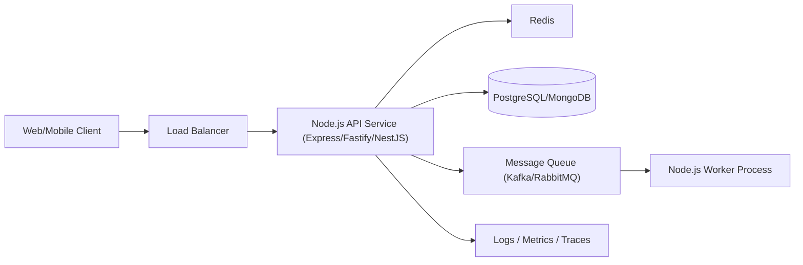

Because Node.js is single-threaded per process, production deployments typically run multiple Node.js processes (via the `cluster` module, PM2, or simply multiple container replicas behind a load balancer) to use multiple CPU cores.

## 4.3 Big-Company Style Thinking

| Concern | JavaScript System Design Response |
|---|---|
| Reliability | Global error handlers, graceful shutdown, health checks, process managers (PM2/Kubernetes) |
| Scale | Multiple Node.js processes/containers (never rely on one process using multiple cores automatically) |
| Observability | Structured logging (pino/winston), APM tracing, metrics |
| Security | Input validation (zod/joi), dependency scanning, CSP headers for frontend XSS defense |
| Maintainability | TypeScript for large codebases, linting (ESLint), consistent module boundaries |
| Performance | Avoid blocking the event loop, use streams for large data, cache aggressively |

## 4.4 Example: Order Service (Node.js/Express)

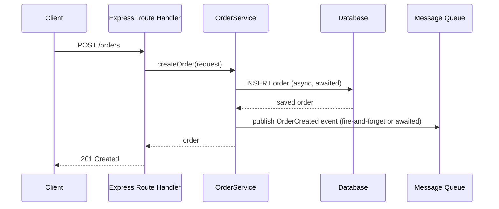

```javascript
app.post("/orders", async (req, res, next) => {
    try {
        const order = await orderService.createOrder(req.body);
        res.status(201).json(order);
    } catch (error) {
        next(error); // delegate to Express error-handling middleware
    }
});
```

## 4.5 Layered Node.js Service

```text
Route/Controller Layer (Express/Fastify handlers)
    - HTTP request parsing, response mapping

Service Layer
    - Business logic, orchestration

Repository/Data Access Layer
    - Database queries (via an ORM like Prisma/TypeORM, or a query builder like Knex)

Integration Layer
    - External API calls, message queues

Shared/Utility Layer
    - Validation schemas, error classes, logging
```

## 4.6 Frontend Architecture


## 4.7 Integration with Other Systems

| System | JavaScript Integration |
|---|---|
| Database | Prisma, TypeORM, Mongoose, Knex, native drivers (`pg`, `mongodb`) |
| Cache | `ioredis`, `node-cache` |
| Message broker | `kafkajs`, `amqplib` (RabbitMQ) |
| HTTP clients | native `fetch`, `axios` |
| Observability | `pino`/`winston` (logging), OpenTelemetry JS SDK |
| Testing | Jest, Vitest, Playwright/Cypress (E2E) |
| Build/CI | npm/pnpm/yarn, Vite/Webpack/esbuild, ESLint, Prettier |
| Type safety | TypeScript |

---

# 5. Interview Preparation

## 5.1 What Interviewers Expect

For "JavaScript" topics, interviewers usually expect:

- You can write correct, idiomatic modern JS (destructuring, arrow functions, async/await).
- You understand closures, `this` binding, and prototypes.
- You understand the event loop and can explain async ordering.
- You know common array/object methods well.

For senior backend/frontend roles, they also expect:

- You can explain the event loop in depth, including microtask vs. macrotask ordering.
- You understand memory management pitfalls (closures, listeners, `WeakMap`).
- You know how to avoid blocking the event loop in Node.js.
- You understand security pitfalls specific to JS (prototype pollution, XSS, ReDoS).

## 5.2 Most Important Questions and Answers

### Q1. Is JavaScript single-threaded? How does it handle async operations then?

Yes, JavaScript's call stack runs on a single thread. Asynchronous operations (timers, network requests, file I/O) are delegated to the runtime (browser Web APIs or Node.js's libuv thread pool/OS), and their callbacks/promise resolutions are queued to run on the single thread later, coordinated by the event loop.

### Q2. What's the difference between the microtask queue and the macrotask (callback) queue?

Microtasks (Promise callbacks, `queueMicrotask`) are drained **completely** after each synchronous execution block, before the event loop moves to the next macrotask. Macrotasks (`setTimeout`, `setInterval`, I/O callbacks) are processed one at a time, with the microtask queue fully drained between each one.

### Q3. What is a closure?

A closure is a function combined with references to the variables from its enclosing lexical scope, which remain accessible even after the outer function has returned. It's the mechanism behind private state, factory functions, and memoization patterns in JavaScript.

### Q4. How does `this` get determined in JavaScript?

By **how the function is called**, not where it's defined: as a method call (`obj.method()`, `this` = `obj`), a plain call (`this` = `undefined` in strict mode), via `call`/`apply`/`bind` (explicit `this`), or via `new` (a newly created object) — except for arrow functions, which don't have their own `this` and instead inherit it lexically from the enclosing scope at definition time.

### Q5. What's the difference between `==` and `===`?

`===` (strict equality) compares value and type with no coercion. `==` (loose equality) performs type coercion before comparing, leading to surprising results (`"" == 0` is `true`, `null == undefined` is `true` but `null === undefined` is `false`). Prefer `===` almost always.

### Q6. What's the difference between `var`, `let`, and `const`?

`var` is function-scoped and hoisted with an initial value of `undefined`. `let` and `const` are block-scoped and hoisted into a "temporal dead zone" (accessing them before declaration throws, rather than returning `undefined`). `const` additionally prevents reassignment of the binding (though the referenced object/array can still be mutated).

### Q7. What is prototypal inheritance?

Every JavaScript object has an internal link (`[[Prototype]]`, accessible via `Object.getPrototypeOf`) to another object it delegates property/method lookups to if the property isn't found on itself. This chain continues until `Object.prototype` and finally `null`. ES6 `class` syntax is syntactic sugar over this same mechanism.

### Q8. What happens if a Promise rejects and there's no `.catch()`?

In Node.js, it emits an `unhandledRejection` event (and in modern Node.js versions, can crash the process by default). In browsers, it logs to the console as an unhandled promise rejection. Always attach error handling to promise chains, especially in long-running server processes.

### Q9. Why is `NaN !== NaN` true, and how do you check for it?

`NaN` (Not-a-Number) is specified to never equal anything, including itself, per IEEE 754 floating-point semantics. Use `Number.isNaN(value)` (not the global `isNaN`, which coerces its argument first and can give misleading results) to check reliably.

### Q10. What's the difference between `null` and `undefined`?

`undefined` means a variable has been declared but not assigned a value (or a function returned nothing, or an object property doesn't exist). `null` is an explicit assignment representing "intentionally no value." Use `null` deliberately in your own code to signal an intentional empty state; `undefined` typically indicates something wasn't set.

## 5.3 Tricky Questions

### Why does `[1, 2, 3] + [4, 5, 6]` produce `"1,2,34,5,6"`?

The `+` operator with non-numeric operands falls back to string concatenation after calling `toString()` on each array (which joins elements with commas), producing `"1,2,3"` and `"4,5,6"`, then concatenating those strings.

### Why does modifying an array while iterating over it with `for...of` sometimes produce surprising results?

`for...of` uses the array's iterator at the time of iteration; mutating the array's length mid-iteration (especially shrinking it) can cause elements to be skipped or iteration to end early, since the iterator tracks an index against a live, mutable array.

### Can two functionally identical objects be `===` equal?

No — `===` for objects/arrays compares reference identity, not structural content, even if every property matches. `{a: 1} === {a: 1}` is always `false` unless it's literally the same object reference.

### Why might `async` functions still block the event loop?

`async`/`await` doesn't make CPU-bound synchronous code inside the function asynchronous — a long, synchronous loop inside an `async function` still blocks the single thread exactly as it would without `async`. `async`/`await` only changes how you *compose* asynchronous operations that are already non-blocking (I/O, timers); it doesn't offload CPU work to another thread.

## 5.4 Common Candidate Mistakes

- Confusing microtask/macrotask ordering (assuming `setTimeout(fn, 0)` runs before pending Promise callbacks).
- Using `==` instead of `===` without understanding coercion rules.
- Passing `obj.method` as a bare callback and being surprised `this` is lost.
- Assuming `async`/`await` automatically parallelizes independent calls (forgetting `Promise.all`).
- Treating arrays/objects as value types when comparing with `===`.
- Not knowing that `const` doesn't make objects/arrays immutable, only the binding.
- Ignoring unhandled promise rejections in Node.js code.

## 5.5 Interview Coding Checklist

- [ ] Use `===`/`!==`, not `==`/`!=`, unless coercion is explicitly intended.
- [ ] Use `const` by default, `let` when reassignment is needed, avoid `var`.
- [ ] Handle every promise rejection (`try/catch` with `await`, or `.catch()`).
- [ ] Use `Promise.all`/`allSettled` for independent concurrent async operations.
- [ ] Validate/sanitize any data crossing a trust boundary (user input, JSON parsing).
- [ ] Avoid mutating arrays/objects you don't own (prefer spread/copy for updates).

---

# 6. Hands-On Thinking

## 6.1 Three Real-World Projects Using JavaScript

### Project 1: Node.js REST API with Express

Concepts: async/await, middleware, error handling, input validation (zod), a repository layer over a database driver.

```text
ExpressApp
    -> Routes (controllers)
        -> Services
            -> Repositories (database access)
```

### Project 2: Real-Time Chat Application (WebSockets)

Concepts: event-driven architecture, `EventEmitter`, WebSocket server (`ws`/Socket.IO), in-memory + persisted message history, debounced "typing" indicators.

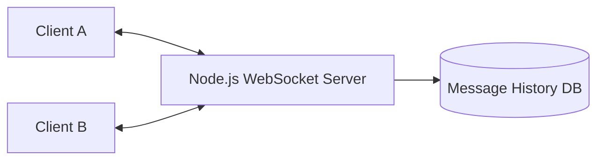

### Project 3: Frontend Dashboard with Data Fetching and Caching

Concepts: `fetch`/`AbortController` for cancellable requests, debounced search input, client-side caching, error boundaries.

```javascript
async function search(query, signal) {
    const response = await fetch(`/api/search?q=${query}`, { signal });
    return response.json();
}

const controller = new AbortController();
searchInput.addEventListener("input", debounce(() => {
    controller.abort(); // cancel any in-flight previous request
    search(searchInput.value, controller.signal);
}, 300));
```

## 6.2 Step-by-Step Design Approach

For any JavaScript project:

1. Choose module system and tooling (ESM vs. CommonJS, bundler, TypeScript or not) up front.
2. Model data structures and validation schemas before writing logic.
3. Design the async flow explicitly — identify what must run sequentially vs. concurrently.
4. Handle every error path — no silent unhandled rejections.
5. Add tests for async code paths, including rejection/error cases.
6. Profile for event-loop-blocking operations in server code before shipping.
7. Run linting/type-checking (ESLint, TypeScript) in CI.

## 6.3 Production Implementation Approach

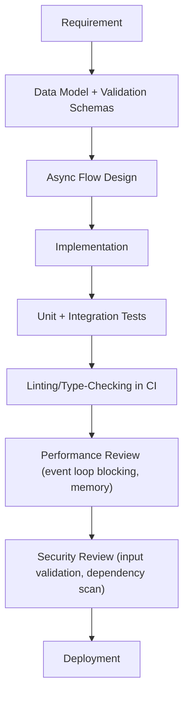

## 6.4 Production Readiness Example

For a Node.js service, define:

- Global unhandled rejection/exception handlers with proper logging and graceful shutdown.
- Health/readiness endpoints.
- Input validation on every external boundary (API requests, message queue payloads).
- Structured logging with correlation IDs.
- Dependency vulnerability scanning (`npm audit`, Snyk/Dependabot).
- Process management for multi-core usage (cluster mode, multiple container replicas).
- Timeouts on all outbound network calls.

---

# 7. Deep Dive (Optional but Important)

## 7.1 Parsing and Execution Pipeline

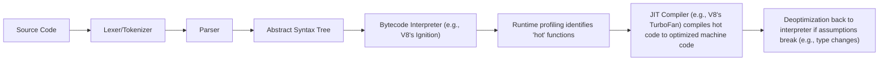

Modern JS engines like V8 start by interpreting bytecode, then use runtime type feedback to identify frequently executed ("hot") functions and JIT-compile them into highly optimized machine code — assuming stable object shapes and types. Changing an object's shape unpredictably (adding/removing properties dynamically in inconsistent patterns) can trigger **deoptimization**, falling back to slower interpreted execution.

## 7.2 Hidden Classes / Shapes (V8 Internals)

```javascript
function Point(x, y) {
    this.x = x;
    this.y = y;
}

const p1 = new Point(1, 2);
const p2 = new Point(3, 4);
// p1 and p2 share the same "hidden class" / shape since properties were added in the same order

p1.z = 5; // p1 now has a DIFFERENT hidden class than p2
```

> [!TIP]
> For performance-sensitive code, initialize all of an object's properties in the constructor in a consistent order across instances, rather than adding properties dynamically and inconsistently afterward. This lets the engine's hidden-class/inline-cache optimizations work effectively — a real (if often over-emphasized) performance consideration in hot paths.

## 7.3 Garbage Collection

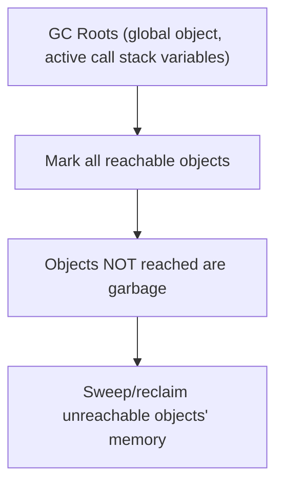

JavaScript engines use **mark-and-sweep** garbage collection (with generational optimizations — most objects die young, so young/old object spaces are collected with different strategies). Unlike reference counting, mark-and-sweep correctly handles circular references (`a.ref = b; b.ref = a;` with nothing else pointing to either — both become unreachable from the roots and are collected).

## 7.4 `async`/`await` Desugaring

```javascript
async function loadUser(id) {
    const response = await fetch(`/users/${id}`);
    return response.json();
}

// Conceptually similar to (simplified):
function loadUser(id) {
    return fetch(`/users/${id}`).then(response => response.json());
}
```

`async`/`await` is syntactic sugar over Promises and generators — an `async function` always returns a Promise, and `await` pauses execution of that function (not the whole thread) until the awaited Promise settles, then resumes as a microtask.

## 7.5 The Node.js Event Loop and libuv

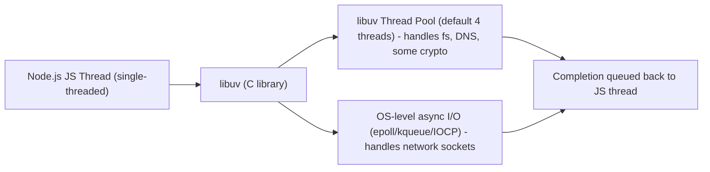

Node.js's non-blocking I/O model is powered by **libuv**, which uses OS-level async mechanisms for network I/O directly, but falls back to a small internal thread pool (default size 4) for operations that don't have a natural async OS API, like most filesystem operations and some DNS/crypto functions — meaning heavy concurrent file I/O can bottleneck on that thread pool size.

## 7.6 Debugging Tools

| Tool | Purpose |
|---|---|
| Chrome DevTools / Node.js `--inspect` | Breakpoint debugging, call stack inspection |
| `console.trace()` | Prints a stack trace at the point of the call |
| Node.js `--prof` + `node --prof-process` | CPU profiling |
| Heap snapshots (DevTools/`--inspect`) | Diagnosing memory leaks |
| `async_hooks` (Node.js) | Tracing async operation lifecycles |
| ESLint | Static analysis catching common bugs before runtime |

---

# Production Checklists

## Code Quality Checklist

- [ ] `const`/`let` used exclusively; no `var`.
- [ ] `===`/`!==` used exclusively; no implicit coercion comparisons.
- [ ] Every promise has explicit error handling.
- [ ] No accidental global variables (strict mode / ESLint enforced).
- [ ] Input validated at every external boundary (API requests, env vars, file parsing).
- [ ] TypeScript (or JSDoc types) used for non-trivial codebases.

## Performance Checklist

- [ ] No synchronous blocking calls (`fs.*Sync`, heavy CPU loops) in server request paths.
- [ ] Large collections processed via streams, not fully buffered in memory.
- [ ] Debounce/throttle applied to high-frequency event handlers.
- [ ] Object shapes kept consistent for hot-path performance-sensitive code.
- [ ] Multi-core usage addressed via clustering/multiple processes, not assumed automatic.

## Security Checklist

- [ ] No `eval()`/`new Function()` on untrusted input.
- [ ] Recursive merge/clone operations guarded against prototype pollution.
- [ ] User-generated content sanitized before DOM insertion (no raw `innerHTML`).
- [ ] Regex patterns reviewed for catastrophic backtracking (ReDoS) on user input.
- [ ] Dependencies scanned regularly (`npm audit`, Dependabot/Snyk).

## Debugging Checklist

- [ ] Reproduce with the exact Node.js/browser version and dependency versions.
- [ ] Check for unhandled promise rejections in logs.
- [ ] Use heap snapshots to diagnose suspected memory leaks.
- [ ] Verify event loop isn't blocked (check for long synchronous stretches) under load.
- [ ] Write a regression test after fixing (including the async/error path, not just the happy path).

---

# Learning Roadmap

## Phase 1: Beginner

Learn: syntax, variables/types, control flow, functions, arrays/objects, basic async (Promises/`async`-`await`).

Practice: to-do list, calculator, simple DOM manipulation script.

## Phase 2: Intermediate

Learn: closures, `this` binding, prototypes/classes, destructuring/spread, modules, error handling, JSON.

Practice: small REST API with Express; a frontend component fetching and rendering data.

## Phase 3: Advanced

Learn: event loop internals (micro/macrotask), Promise combinators, generators, `WeakMap`, memory management, security pitfalls (prototype pollution, XSS).

Practice: real-time WebSocket app; a debounced/throttled search UI with request cancellation.

## Phase 4: Production Backend/Frontend Engineer

Learn: V8 internals (hidden classes, JIT), Node.js/libuv internals, GC behavior, profiling and debugging tools, TypeScript adoption at scale.

Practice: production-style Node.js service with clustering, structured logging, full test suite, and a load-tested, profiled hot path.

---

# Self-Review Completion Loop

The topic was reviewed against:

- ECMAScript specification categories (types, closures, prototypes, async).
- Node.js and browser runtime documentation (event loop, libuv, Web APIs).
- Common production incident patterns (event loop blocking, memory leaks, prototype pollution).
- Interview patterns for beginner through senior JavaScript roles.

## Gap Review Matrix

| Area | Covered? | Notes |
|---|---|---|
| Beginner syntax | Yes | Variables, functions, control flow, arrays/objects |
| Async fundamentals | Yes | Callbacks, Promises, async/await |
| Event loop internals | Yes | Micro/macrotask distinction, Node.js phases + libuv |
| Closures | Yes | Mechanism, classic loop-variable bug, memory leak risk |
| `this` binding | Yes | All four call forms, arrow function exception |
| Prototypes/classes | Yes | Prototype chain diagram, ES6 class sugar |
| Promise combinators | Yes | `all`/`allSettled`/`race`/`any` comparison |
| Generators/iterators | Yes | Custom iterator protocol example |
| `WeakMap`/memory | Yes | Object-keyed cache without leaks |
| Security | Yes | Prototype pollution, XSS, ReDoS, eval risks |
| Performance | Yes | Hidden classes, debounce/throttle, streaming |
| Node.js specifics | Yes | libuv, cluster mode, blocking call pitfalls |
| Failure scenarios | Yes | Eight concrete production failure patterns |
| Interview prep | Yes | Common and tricky questions, candidate mistakes |
| Hands-on projects | Yes | Three realistic projects with diagrams |
| Deep internals | Yes | Parsing/JIT pipeline, GC, async/await desugaring |

No significant beginner-to-senior JavaScript foundation gaps remain for the requested scope. Further specialization should split into separate deep dives: **TypeScript**, **Node.js Streams and Buffers**, **Frontend Framework Internals (React/Vue rendering models)**, **V8 Performance Tuning**, and **JavaScript Security Deep Dive**.

---

# Official References

- MDN JavaScript Reference: <https://developer.mozilla.org/en-US/docs/Web/JavaScript>
- ECMAScript Language Specification: <https://tc39.es/ecma262/>
- Node.js Documentation: <https://nodejs.org/en/docs>
- Node.js Event Loop Guide: <https://nodejs.org/en/learn/asynchronous-work/event-loop-timers-and-nexttick>
- V8 Blog (engine internals): <https://v8.dev/blog>
- OWASP Prototype Pollution Prevention: <https://cheatsheetseries.owasp.org/cheatsheets/Prototype_Pollution_Prevention_Cheat_Sheet.html>

---

## Final Summary

JavaScript pairs a flexible, dynamically-typed language with a single-threaded, event-loop-driven runtime that makes asynchronous I/O feel natural but hides real complexity underneath — closures, prototype chains, and `this` binding rules that trip up even experienced developers moving between languages. Production mastery comes from understanding the runtime model as deeply as the syntax: knowing exactly when microtasks vs. macrotasks run, recognizing memory-leak-prone closure patterns, never blocking the single thread in a server process, and treating security pitfalls like prototype pollution and unsanitized DOM insertion as first-class concerns rather than afterthoughts.
