# 🟨 Modern JavaScript Deep Dive — Complete Beginner-to-Expert Reference

> The language mechanics that actually get asked — **closures**, **prototypes & the prototype chain**, **`this` binding**, **scope & hoisting**, the **event loop**, and DOM **event propagation & delegation**. The "how does JavaScript really work" knowledge behind every framework.

---

## 📑 Table of Contents

1. [Executive Summary](#-executive-summary)
2. [Fundamentals (Beginner)](#1--fundamentals-beginner-level)
3. [Core Concepts (Intermediate)](#2--core-concepts-intermediate-level)
4. [Advanced Concepts (Senior)](#3--advanced-concepts-senior-level)
5. [Real-World System Design](#4--real-world-system-design-usage)
6. [Interview Preparation](#5--interview-preparation)
7. [Hands-On Projects](#6--hands-on-projects)
8. [Deep Dive: Internals](#7--deep-dive-internals)
9. [Production Checklists](#-production-checklists)
10. [Learning Roadmap](#-learning-roadmap)
11. [Self-Review Completion Loop](#-self-review-completion-loop)
12. [Official References](#-official-references)
13. [Final Summary](#-final-summary)

---

## 🎯 Executive Summary

JavaScript looks simple but has a handful of mechanics that trip up even experienced developers — and they're *exactly* what interviews probe because they reveal whether you understand the language or just copy patterns. **Closures** (functions remembering their birth scope), **prototypes** (JS's inheritance model), **`this`** (the most confusing keyword in the language), **scope/hoisting**, and the DOM's **event propagation & delegation** are the core. Master these and every framework ([[08 React]], [[05 Node.js]]) makes sense underneath.

| What it is | What it replaces | Core superpower |
|---|---|---|
| Deep understanding of JS's core runtime mechanics | Cargo-cult patterns, framework-only knowledge | **Understanding *why* JS behaves as it does** — closures, prototypes, `this`, events |

> [!IMPORTANT]
> The theme uniting this guide: **JavaScript's "weird" behaviors are all logical once you know the underlying mechanics.** Why does a loop with `var` and `setTimeout` print the same number repeatedly? (Closures + scope.) Why does `this` become `undefined` when you pass a method as a callback? (Dynamic `this` binding.) Why can you call `.map()` on an array you never defined it on? (The prototype chain.) Why does one click handler on a parent catch clicks on hundreds of children? (Event propagation + delegation.) None of these are random — they follow from how JS scopes variables, resolves properties, binds `this`, and dispatches events. Frameworks like [[08 React]] *hide* these mechanics, but bugs, performance issues, and interview questions live *underneath* the abstraction. This guide is the "how JavaScript actually works" layer beneath [[01 JavaScript]], [[03 TypeScript]], [[08 React]], and [[04 JavaScript and Nodejs Concurrency]].

Related guides: [[01 JavaScript]] · [[03 TypeScript]] · [[08 React]] · [[04 JavaScript and Nodejs Concurrency]] · [[05 Node.js]] · [[10 React Internals and Architecture]]

---

## 1. 🌱 FUNDAMENTALS (Beginner Level)

### Scope — where variables live

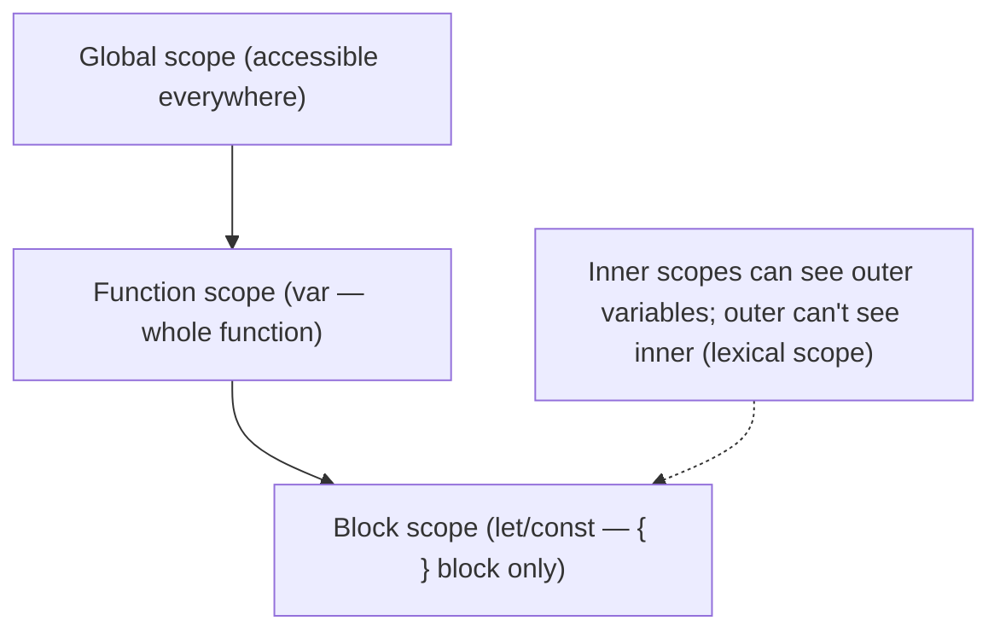

```javascript
let x = 1;                 // global
function outer() {
  let y = 2;               // function scope
  if (true) {
    let z = 3;             // block scope — only visible inside this { }
    var w = 4;             // function scope — visible in whole outer()!
  }
  // z is NOT accessible here; w IS (var ignores blocks)
}
```

> [!IMPORTANT]
> **Scope** determines where a variable is accessible. JavaScript has **global**, **function**, and (since ES6) **block** scope. The critical distinction: **`var` is function-scoped** (it ignores `{ }` blocks — a `var` inside an `if` is visible in the whole function), while **`let`/`const` are block-scoped** (confined to their nearest `{ }`). This is *the* reason to always use `let`/`const` over `var` in modern JS — block scoping matches how most languages behave and prevents a class of bugs (the classic loop-closure bug, §2.2). JS uses **lexical (static) scope**: a function's scope is determined by *where it's written* in the source, not where it's called — inner functions can access outer variables, forming the **scope chain** that makes closures possible. Understanding scope is the foundation for closures, hoisting, and `this`.

### Hoisting — declarations move up

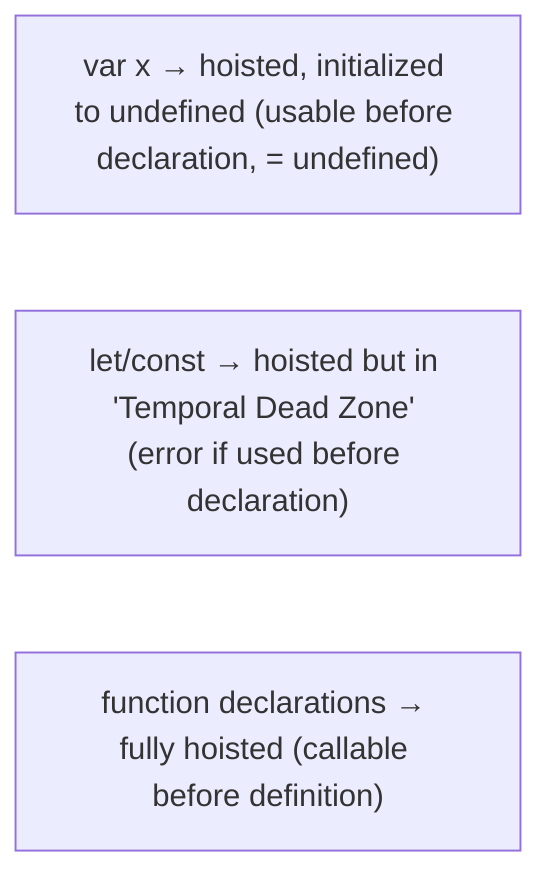

```javascript
console.log(a);   // undefined (var hoisted, not yet assigned)
var a = 5;

console.log(b);   // ReferenceError! (TDZ — let is hoisted but not initialized)
let b = 5;

greet();          // works! (function declaration fully hoisted)
function greet() { console.log("hi"); }
```

> [!TIP]
> **Hoisting** is JavaScript's behavior of moving *declarations* to the top of their scope before execution. But *what* gets hoisted differs: **`var`** declarations are hoisted and initialized to `undefined` (so using one before its line gives `undefined`, not an error). **`let`/`const`** are *also* hoisted but **not initialized** — they sit in the **Temporal Dead Zone (TDZ)** from the start of the scope until their declaration line, and accessing them there throws a `ReferenceError` (this is a *feature* — it catches use-before-declaration bugs). **Function declarations** are fully hoisted (you can call them before they appear), but **function expressions** (`const f = () => {}`) follow their variable's rules (TDZ for `const`). Hoisting explains many "why is this `undefined`?" and "why ReferenceError?" surprises, and interviewers love testing the `var`/`let`/function-declaration differences.

### Primitives vs References

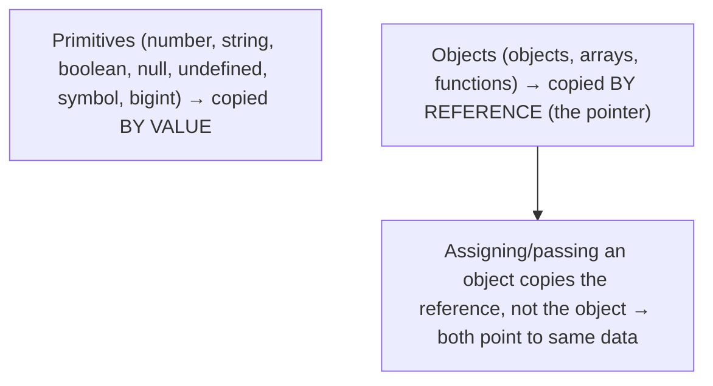

> [!IMPORTANT]
> JavaScript has two categories of values with fundamentally different copy semantics. **Primitives** (number, string, boolean, `null`, `undefined`, symbol, bigint) are **immutable and copied by value** — `let b = a` copies the value, so changing `b` doesn't affect `a`. **Objects** (including arrays and functions) are **copied by reference** — `let obj2 = obj1` copies the *pointer*, so both variables reference the *same* object, and mutating through one is visible through the other. This is the source of countless bugs: passing an object to a function and having it mutated unexpectedly, or `[...arr]` vs `arr` (shallow copy vs same reference). It's also why equality is tricky (`{} === {}` is `false` — different references; `1 === 1` is `true` — same value). Understanding value-vs-reference is essential for [[08 React]] (state immutability, why you spread objects), and it underlies the closure-capture and comparison behaviors throughout JS.

### Real-world analogy 🎒

Think of JavaScript's core mechanics like a **backpack a function carries**:
- A **closure** is a function walking around with a **backpack** containing the variables from where it was born — even long after that place is gone, it still has the backpack.
- **`this`** is like the word "here" — its meaning depends on *where you're standing when you say it* (how the function is *called*), not where the sentence was written.
- The **prototype chain** is like asking your parent when you don't know something, who asks *their* parent, up the family tree, until someone answers (or nobody does → `undefined`).
- **Event propagation** is like a rumor: a click "captures" *down* from the document to the target, then "bubbles" *up* from the target back to the document — and a smart listener at the top (delegation) hears about all of them.

> [!TIP]
> Beginner takeaway: JavaScript variables live in nested **scopes** (use `let`/`const` for block scope), **hoisting** moves declarations up (with `var`/`let` differing), and values are either copied **by value** (primitives) or **by reference** (objects). These three fundamentals underpin the harder concepts — closures, `this`, and prototypes — that follow.

---

## 2. 🧩 CORE CONCEPTS (Intermediate Level)

### 2.1 Closures — the defining JS feature

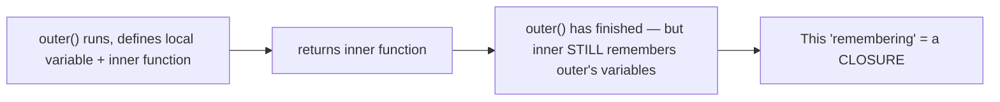

```javascript
function makeCounter() {
  let count = 0;                    // private variable
  return function () {
    count++;                        // closure: remembers 'count'
    return count;
  };
}
const counter = makeCounter();
counter();  // 1
counter();  // 2   ← 'count' persists between calls, but is PRIVATE
```

> [!IMPORTANT]
> A **closure** is a function bundled together with references to its surrounding (lexical) scope — it "remembers" the variables from where it was *defined*, even after that outer function has finished executing. In the example, `makeCounter` returns, but the inner function *keeps a live reference* to `count`, so `count` persists across calls and is completely **private** (nothing outside can access it). Closures are arguably JavaScript's most important and powerful feature, enabling: **data privacy / encapsulation** (private variables — the module pattern, §4.1), **stateful functions** (the counter above), **function factories** (functions that build customized functions), **callbacks that remember context**, and much of [[08 React]] hooks (`useState` relies on closures to remember state between renders — [[10 React Internals and Architecture]]). The key insight: closures capture *variables* (references), not values — which is exactly what causes the famous loop bug (§2.2). Understanding closures deeply is the single biggest step from "writes JS" to "understands JS."

### 2.2 The classic closure loop bug

```javascript
// ❌ With var — prints 3, 3, 3 (not 0, 1, 2!)
for (var i = 0; i < 3; i++) {
  setTimeout(() => console.log(i), 100);
}
// All three closures share the SAME 'i' (function-scoped); by the time
// they run, the loop is done and i === 3.

// ✅ With let — prints 0, 1, 2
for (let i = 0; i < 3; i++) {
  setTimeout(() => console.log(i), 100);
}
// let creates a NEW binding of 'i' per iteration — each closure captures its own.
```

> [!WARNING]
> This is *the* most famous JavaScript interview question, and it's pure closures + scope. With **`var`** (function-scoped), all three `setTimeout` callbacks close over the *same single* `i` variable; the loop finishes (setting `i` to 3) *before* any callback fires (they're async — [[04 JavaScript and Nodejs Concurrency]]), so all print **3**. With **`let`** (block-scoped), each loop iteration creates a *fresh* `i` binding, so each closure captures its *own* copy — printing **0, 1, 2**. Before `let`, developers fixed this with an **IIFE** (immediately-invoked function expression) to create a new scope per iteration: `(function(j){ setTimeout(() => console.log(j)) })(i)`. This bug crystallizes three concepts at once — closures capture variables not values, `var` vs `let` scoping, and async execution timing — which is exactly why it's asked so often. If you can explain *both* the bug and *both* fixes, you understand closures.

### 2.3 Prototypes & the Prototype Chain

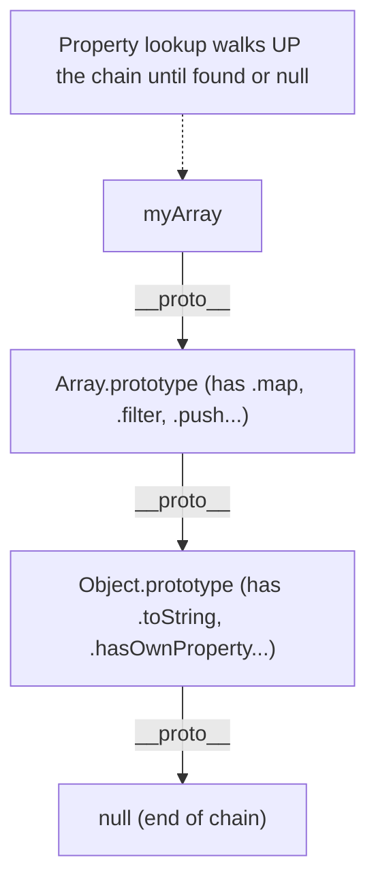

```javascript
const arr = [1, 2, 3];
arr.map(x => x * 2);   // 'map' isn't on arr — it's found on Array.prototype

// JS finds properties by walking the prototype chain:
// arr → Array.prototype (finds map) → Object.prototype → null
```

> [!IMPORTANT]
> JavaScript uses **prototypal inheritance** — objects inherit directly from other objects (unlike class-based languages like [[01 Basic Java]]). Every object has an internal link (`[[Prototype]]`, accessible via `__proto__` or `Object.getPrototypeOf`) to another object, its **prototype**. When you access a property, JS first checks the object itself; if not found, it walks *up* the **prototype chain** — object → its prototype → that prototype's prototype → ... → `Object.prototype` → `null` — returning the first match (or `undefined`). This is why `[1,2,3].map(...)` works: `map` lives on `Array.prototype`, which your array's chain includes. It's how methods are *shared* (all arrays share one `Array.prototype.map` — memory-efficient, no per-object copy). The `class` syntax (ES6) is **syntactic sugar over prototypes** — `class Dog extends Animal` still sets up a prototype chain under the hood. Understanding prototypes explains inheritance, method resolution, `instanceof`, and why modifying `Array.prototype` affects all arrays (a reason not to).

### 2.4 `this` — the four binding rules

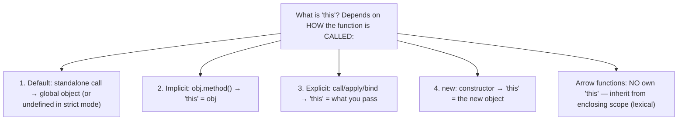

```javascript
const obj = {
  name: "Alice",
  greet() { return `Hi, ${this.name}`; }
};
obj.greet();                      // "Hi, Alice" — implicit binding (this = obj)

const fn = obj.greet;
fn();                             // "Hi, undefined" — lost binding! (this = global/undefined)

obj.greet.call({ name: "Bob" });  // "Hi, Bob" — explicit binding
```

> [!IMPORTANT]
> **`this` is JavaScript's most confusing keyword** because — unlike most languages — its value is determined by **how a function is called**, not where it's defined (except arrow functions). The four rules, in precedence order: **(1) `new` binding** — calling with `new` makes `this` the newly-created object. **(2) Explicit binding** — `call`/`apply`/`bind` set `this` to what you pass. **(3) Implicit binding** — `obj.method()` sets `this` to `obj` (the object left of the dot). **(4) Default binding** — a standalone `fn()` call sets `this` to the global object (`window`/`globalThis`) or `undefined` in strict mode. The infamous trap (shown above): pulling a method off its object (`const fn = obj.greet`) *loses* the implicit binding, so `this` becomes global/undefined — which is *why* passing methods as callbacks breaks, and why you see `this.handleClick = this.handleClick.bind(this)` in old [[08 React]] class components. **Arrow functions are the exception** (§2.5) — the modern fix.

### 2.5 Arrow functions & lexical `this`

```javascript
const obj = {
  name: "Alice",
  friends: ["Bob", "Carol"],
  greetAll() {
    // Arrow function inherits 'this' from greetAll (lexical) → this.name works
    this.friends.forEach(f => console.log(`${this.name} knows ${f}`));
    // A regular function here would have this === undefined (lost binding)
  }
};
```

> [!IMPORTANT]
> **Arrow functions don't have their own `this`** — they **lexically inherit** `this` from the enclosing scope where they're *defined* (like any other variable). This solves the #1 `this` headache: callbacks. Before arrows, a regular-function callback (in `forEach`, `setTimeout`, event handlers) would lose the outer `this` (default binding → undefined/global), forcing workarounds (`const self = this`, or `.bind(this)`). An arrow function callback just *keeps* the surrounding `this` automatically — which is why arrows are now the default for callbacks. **But this cuts both ways**: because arrows have no own `this`, you should **not** use them as object *methods* (`this` won't be the object) or as constructors (they can't be `new`ed) or as event handlers where you want `this` to be the element. The rule: **arrow functions for callbacks (inherit `this`); regular functions/methods when you need dynamic `this`.** Arrows also don't have their own `arguments` object. This lexical-`this` behavior is one of ES6's most impactful changes and a constant interview topic.

### 2.6 The Event Loop (brief — see the dedicated guide)

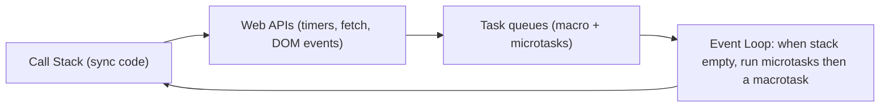

> [!TIP]
> JavaScript is **single-threaded** with an **event loop** that enables non-blocking concurrency — sync code runs on the call stack, async operations (timers, `fetch`, events) are handed to the environment, and their callbacks are queued and run when the stack is empty (**microtasks** like Promises before **macrotasks** like `setTimeout`). This is *why* the loop-closure bug's callbacks run *after* the loop finishes (§2.2), and it's foundational to everything async. It's covered in full depth — macro/microtask ordering, Node's phases, libuv — in **[[04 JavaScript and Nodejs Concurrency]]**; here just note that JS's concurrency model is essential context for closures-in-callbacks and event handling.

---

## 3. ⚙️ ADVANCED CONCEPTS (Senior Level)

### 3.1 Event Propagation — capture & bubble

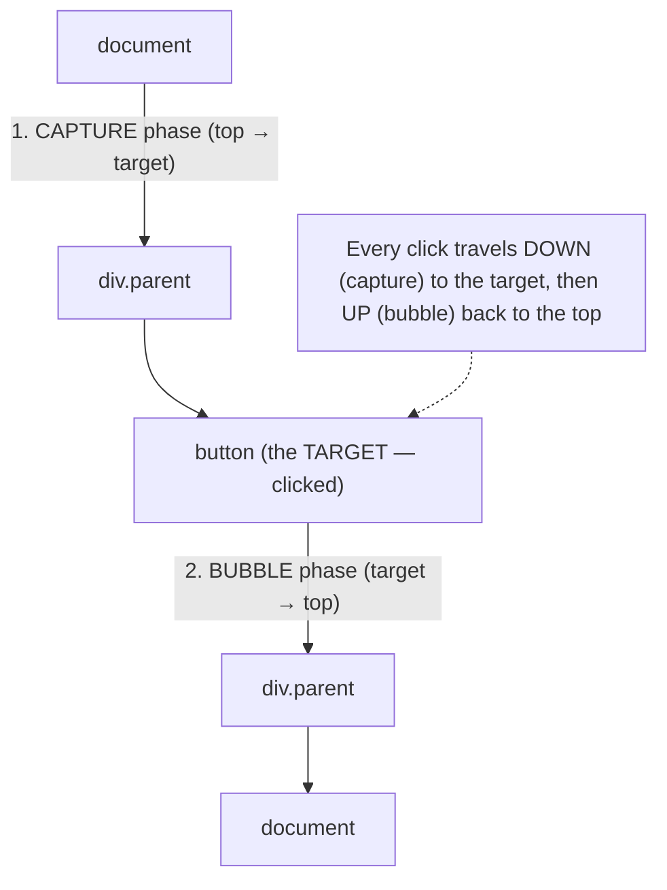

> [!IMPORTANT]
> When you click a DOM element, the event doesn't just fire on that element — it travels through the DOM tree in **three phases**: **(1) Capture phase** — the event descends from the `document` *down* through ancestors to the target. **(2) Target phase** — it fires on the actual clicked element. **(3) Bubble phase** — it *ascends* back up from the target through the ancestors to the `document`. By default, `addEventListener` listens in the **bubble** phase (pass `{ capture: true }` for the capture phase). This means a click on a button *also* triggers click listeners on its parent `<div>`, grandparent, and so on up the tree — **event propagation**. Understanding this explains many "why did my parent's handler fire?" behaviors and is the mechanism that makes **event delegation** (§3.2) possible. You can inspect the phase via `event.eventPhase` and find the true clicked element via `event.target` (vs `event.currentTarget`, the element the listener is *attached* to — a crucial distinction, §3.3).

### 3.2 Event Delegation

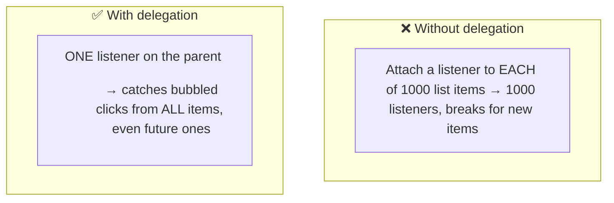

```javascript
// Instead of a listener per <li>, ONE listener on the parent:
document.querySelector("ul").addEventListener("click", (e) => {
  if (e.target.matches("li")) {          // check what was actually clicked
    console.log("clicked item:", e.target.textContent);
  }
});
// Works for items added LATER too — the parent listener catches their bubbled clicks
```

> [!IMPORTANT]
> **Event delegation** is a powerful pattern built on bubbling: instead of attaching a listener to *every* child element, you attach **one listener to a common ancestor** and use `event.target` to determine which child was actually clicked. Since clicks bubble up from children to the ancestor, that single listener handles them all. Benefits: **(1) Performance/memory** — one listener instead of hundreds/thousands (crucial for large lists or tables). **(2) Dynamic elements** — it automatically handles elements added *after* the listener was set up (a per-element listener would miss them; the delegated listener catches their bubbled events). This is heavily used in vanilla JS and *is exactly how [[08 React]] handles events* — React attaches a *single* delegated listener at the root and dispatches synthetically (React 17+ at the root container — [[10 React Internals and Architecture]]), rather than one real DOM listener per element. Event delegation is a top interview topic because it demonstrates you understand bubbling *and* can apply it practically.

### 3.3 target vs currentTarget & stopping propagation

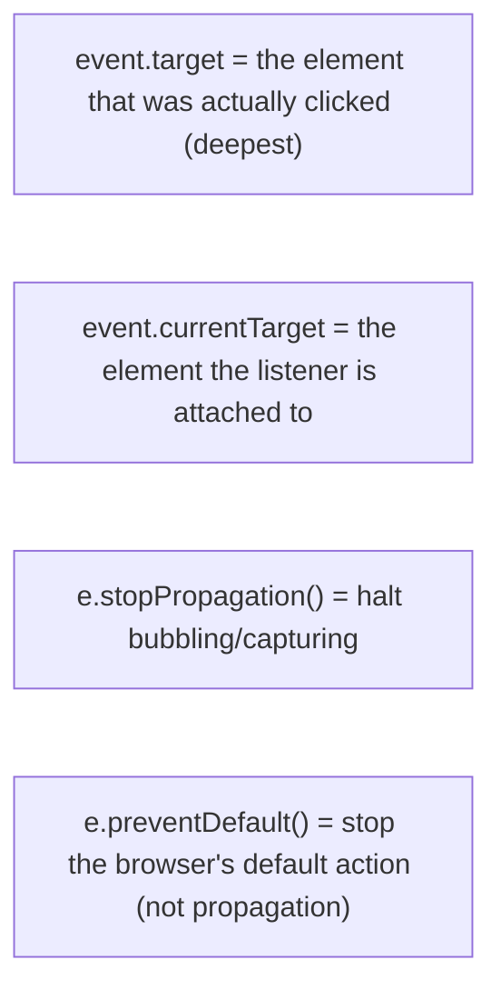

> [!WARNING]
> Two pairs of frequently-confused concepts. **`event.target` vs `event.currentTarget`**: `target` is the element that *originated* the event (the deepest element actually clicked), while `currentTarget` is the element whose listener is *currently running* (the one you attached to). In event delegation, `currentTarget` is the parent `<ul>` but `target` is the specific `<li>` — you use `target` to know *what* was clicked. (Inside an arrow-function handler, note `this` won't be `currentTarget`, unlike a regular-function handler — §2.5.) **`stopPropagation()` vs `preventDefault()`**: `stopPropagation()` halts the event's travel through the DOM (no more bubbling/capturing to other elements) but does *not* stop the default browser action; `preventDefault()` stops the browser's *default behavior* (a link navigating, a form submitting, a checkbox toggling) but does *not* stop propagation. They're independent — you might use neither, either, or both. Mixing them up (calling `stopPropagation` when you meant `preventDefault`) is a very common bug — e.g., a form still submits despite `stopPropagation`, or a click still bubbles despite `preventDefault`.

### 3.4 call, apply, bind

```javascript
function greet(greeting, punct) { return `${greeting}, ${this.name}${punct}`; }
const person = { name: "Alice" };

greet.call(person, "Hi", "!");        // "Hi, Alice!" — args listed individually
greet.apply(person, ["Hi", "!"]);     // "Hi, Alice!" — args as an array
const bound = greet.bind(person);     // returns a NEW function with this permanently = person
bound("Hey", ".");                    // "Hey, Alice."
```

> [!TIP]
> **`call`, `apply`, and `bind`** are how you *explicitly* control `this` (rule #2 of `this` binding, §2.4). **`call(thisArg, arg1, arg2, ...)`** invokes the function immediately with a given `this` and individually-listed arguments. **`apply(thisArg, [args])`** is identical but takes arguments as an *array* (mnemonic: **A**pply = **A**rray). **`bind(thisArg)`** is different — it doesn't call the function; it returns a *new* function with `this` (and optionally some arguments) *permanently fixed*, to call later. `bind` is what old [[08 React]] class components used (`this.handleClick = this.handleClick.bind(this)`) to lock a method's `this` before passing it as a callback. These are essential for borrowing methods, partial application, and controlling context. Modern code uses them less (arrow functions and spread handle many cases — `apply` is often replaced by `fn(...args)`), but understanding them is expected, and `bind` still appears in real codebases and interviews.

### 3.5 Prototypal inheritance in practice

```javascript
// ES6 class — syntactic sugar over prototypes
class Animal {
  constructor(name) { this.name = name; }
  speak() { return `${this.name} makes a sound`; }   // → Animal.prototype.speak
}
class Dog extends Animal {
  speak() { return `${this.name} barks`; }            // overrides via prototype chain
}
new Dog("Rex").speak();   // "Rex barks" — found on Dog.prototype before Animal.prototype
```

> [!TIP]
> ES6 **`class`** syntax makes JavaScript *look* like a classical OOP language ([[01 Basic Java]]), but it's **syntactic sugar over prototypes** — no new inheritance model was added. `class Animal { speak() {} }` puts `speak` on `Animal.prototype`; `class Dog extends Animal` sets `Dog.prototype`'s prototype to `Animal.prototype` (building the chain), and `super` walks up it. Method resolution still works by walking the prototype chain (§2.3): `new Dog().speak()` finds `Dog.prototype.speak` first (override), and if you called an inherited method, JS would walk up to `Animal.prototype`. Knowing that classes are prototype-based explains behaviors that pure-class languages don't have: you can add methods to a class's prototype at runtime, `instanceof` checks the prototype chain, and there are no truly private fields historically (until `#private` fields, ES2022). The senior insight: **JavaScript is prototype-based at its core; `class` is a familiar face over an unfamiliar model** — and understanding the model beats memorizing the syntax.

### 3.6 Failure Scenarios & JS Gotchas

| Gotcha | Cause | Fix |
|---|---|---|
| Loop prints last value N times | `var` + shared closure | Use `let` (per-iteration binding) |
| `this` is undefined in callback | Lost implicit binding | Arrow function / `bind` |
| Method on prototype affects all | Shared prototype mutation | Don't modify built-in prototypes |
| `stopPropagation` didn't stop submit | Confused with `preventDefault` | Use the right one (they're independent) |
| Object mutated unexpectedly | Copied by reference | Spread/clone for copies |
| `==` surprising coercions | Loose equality type coercion | Use `===` (strict equality) |
| Memory leak from closures | Closures holding large refs | Null out refs; scope carefully |
| Delegated handler fires wrongly | Not checking `event.target` | Check `target.matches(selector)` |

> [!WARNING]
> Two pervasive JS footguns beyond the ones already covered. **Loose equality (`==`)** performs **type coercion** with famously bizarre results (`0 == ""` is `true`, `null == undefined` is `true`, `[] == ![]` is `true`) — **always use strict equality (`===`)** which compares without coercion, avoiding the whole mess (this is a near-universal lint rule). **Closure memory leaks**: because closures keep their captured variables alive, a closure that captures a large object (or a DOM element) and outlives its usefulness (e.g., an event listener never removed, a timer never cleared) keeps that memory referenced and un-garbage-collected — a real source of leaks in long-running SPAs ([[08 React]]) and [[05 Node.js]] servers. The fix is disciplined cleanup (remove listeners, clear timers, null out references) — exactly what [[08 React]]'s `useEffect` cleanup functions are for. These gotchas, plus the closure-loop and `this` traps, are the "does this person actually know JavaScript?" checks in interviews.

---

## 4. 🏗️ REAL-WORLD SYSTEM DESIGN USAGE

### 4.1 The Module Pattern (closures for encapsulation)

```javascript
const counterModule = (function () {
  let count = 0;                          // PRIVATE (closure)
  return {                                // PUBLIC interface
    increment() { count++; },
    get() { return count; }
  };
})();
counterModule.increment();
counterModule.get();   // 1 — 'count' is inaccessible directly
```

> [!TIP]
> Before ES modules, the **module pattern** used closures + an **IIFE** to create encapsulation: variables inside the IIFE are private (closure-captured), and you return an object exposing only a public interface. This gave JavaScript **data privacy** and namespacing when the language had no built-in modules — the foundation of libraries like jQuery. Modern JS has native **ES modules** (`import`/`export`, [[05 Node.js]]) and `#private` class fields, so the explicit IIFE module pattern is less common — but the *principle* (closures for private state) is everywhere: every [[08 React]] hook, every event handler that remembers config, every debounce/throttle utility (§4.2) relies on closures for private, persistent state. Recognizing the module pattern and its closure basis connects a classic pattern to the fundamental mechanic — and shows you understand *why* it worked.

### 4.2 Debounce & Throttle (closures in the wild)

```javascript
// Debounce: run fn only after 'delay' ms of NO calls (closure remembers the timer)
function debounce(fn, delay) {
  let timer;                              // private, persists via closure
  return function (...args) {
    clearTimeout(timer);
    timer = setTimeout(() => fn.apply(this, args), delay);
  };
}
const onSearch = debounce(query => search(query), 300);  // fires 300ms after typing stops
```

> [!IMPORTANT]
> **Debounce** and **throttle** are essential real-world utilities that are *pure closures in action* — and common interview "implement this" questions. **Debounce** delays running a function until a pause in calls (e.g., search-as-you-type: only fire the API call 300ms after the user *stops* typing — avoiding a request per keystroke). **Throttle** limits a function to run at most once per interval (e.g., a scroll or resize handler firing at most every 100ms). Both work by using a **closure** to remember state (the timer ID, the last-run time) *between* invocations of the returned function — exactly the "stateful function via closure" pattern (§2.1). They demonstrate why closures matter practically: without them you'd need external mutable state or a class. These utilities are ubiquitous in [[08 React]] apps (debouncing inputs, throttling scroll), and being able to implement debounce from scratch (closure + `setTimeout` + `clearTimeout`) is a frequent frontend interview task.

### 4.3 How frameworks use these mechanics

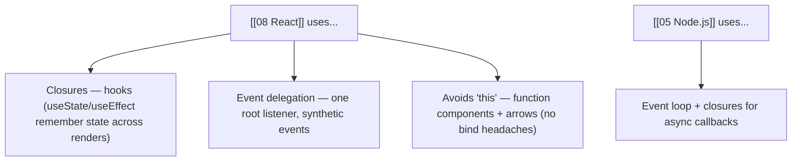

> [!TIP]
> These "fundamentals" aren't academic — they're the machinery frameworks are *built on*. **[[08 React]]** hooks are fundamentally **closures**: `useState` returns a setter that closes over the component's state slot, and `useEffect`/`useCallback` capture variables from the render scope (which is *why* stale-closure bugs happen in hooks and why dependency arrays exist — [[10 React Internals and Architecture]]). React's **event system is delegation**: rather than attaching real DOM listeners to every element, React attaches a few listeners at the root and dispatches **synthetic events** (better performance, consistent cross-browser behavior). React's shift to **function components + arrow functions** largely eliminated the `this`-binding pain of class components. **[[05 Node.js]]** is the **event loop** + closures-for-callbacks throughout. So mastering closures, `this`, prototypes, and event propagation isn't separate from framework knowledge — it's the *foundation* that makes framework behavior (and framework bugs) comprehensible. This is why interviewers test fundamentals: they predict who can debug the hard framework problems.

---

## 5. 🎤 INTERVIEW PREPARATION

### 5.1 Most important questions

<details>
<summary><b>Q1: What is a closure? Give a use case.</b></summary>

A closure is a function bundled with references to its surrounding lexical scope — it "remembers" variables from where it was defined, even after the outer function has returned. Use cases: **data privacy** (private variables via the module pattern), **stateful functions** (a counter that persists state between calls), **function factories**, **callbacks that remember context**, and utilities like **debounce/throttle** (remembering a timer). It works because JS uses lexical scope and keeps captured variables alive as long as the closure references them. React hooks are built on closures.
</details>

<details>
<summary><b>Q2: Why does a `var` loop with setTimeout print the same number repeatedly?</b></summary>

Because `var` is function-scoped, all the `setTimeout` callbacks close over the *same single* `i` variable. The loop is synchronous and finishes (setting `i` to its final value) before any async callback runs, so they all read the final value. Fix with `let` (block-scoped — each iteration gets a fresh binding, so each closure captures its own `i`), or historically an IIFE creating a new scope per iteration. It combines closures, scoping, and async timing.
</details>

<details>
<summary><b>Q3: How does `this` work in JavaScript?</b></summary>

`this` is determined by *how a function is called*, not where it's defined (except arrows). Precedence: **new binding** (`new Fn()` → the new object), **explicit** (`call`/`apply`/`bind` → the passed value), **implicit** (`obj.method()` → `obj`), **default** (standalone `fn()` → global/undefined in strict mode). The common trap: extracting a method (`const f = obj.method`) loses implicit binding, so `this` becomes global/undefined. **Arrow functions** have no own `this` — they lexically inherit it from the enclosing scope, which is why they're ideal for callbacks.
</details>

<details>
<summary><b>Q4: Explain the prototype chain.</b></summary>

Every JS object has an internal link to a prototype object. When you access a property, JS checks the object itself, then walks *up* the prototype chain (object → its prototype → ... → `Object.prototype` → `null`) returning the first match or `undefined`. This is how `[1,2,3].map()` works — `map` lives on `Array.prototype`. It's prototypal inheritance: objects inherit from objects, methods are shared via the prototype (memory-efficient). ES6 `class` is syntactic sugar over this — `extends` sets up the prototype chain.
</details>

<details>
<summary><b>Q5: What is event bubbling, capturing, and delegation?</b></summary>

An event travels in three phases: **capture** (document down to target), **target**, and **bubble** (target back up to document). Listeners default to the bubble phase. **Delegation** exploits bubbling: attach one listener to a common ancestor and use `event.target` to identify the actual clicked child — instead of a listener per child. Benefits: fewer listeners (performance/memory) and automatic handling of dynamically-added elements. React uses delegation internally (root-level synthetic event system).
</details>

<details>
<summary><b>Q6: target vs currentTarget? stopPropagation vs preventDefault?</b></summary>

**`event.target`** is the element that originated the event (deepest clicked); **`event.currentTarget`** is the element whose listener is running (what you attached to) — they differ in delegation. **`stopPropagation()`** halts the event's travel through the DOM (no more bubbling/capturing) but not the browser's default action; **`preventDefault()`** stops the default action (link navigation, form submit) but not propagation. They're independent — confusing them (e.g., using stopPropagation to prevent a form submit) is a common bug.
</details>

<details>
<summary><b>Q7: Arrow functions vs regular functions?</b></summary>

Arrow functions have **no own `this`** (they lexically inherit it from the enclosing scope), no own `arguments`, can't be used with `new`, and have no `prototype`. This makes them ideal for **callbacks** (they keep the surrounding `this`, avoiding the lost-binding problem). Regular functions have dynamic `this` (set by how they're called), so use them for **object methods** and cases where you need `this` to be the caller/element. Rule: arrows for callbacks, regular functions/methods when you need dynamic `this`.
</details>

<details>
<summary><b>Q8: `==` vs `===`?</b></summary>

`==` (loose equality) performs type coercion before comparing, producing surprising results (`0 == ""`, `null == undefined`, `[] == ![]` all true). `===` (strict equality) compares value *and* type with no coercion. Always use `===` (and `!==`) to avoid coercion bugs — it's a near-universal best practice and lint rule. The exception some allow is `== null` to check for both null and undefined, but even that is often written explicitly.
</details>

### 5.2 Tricky questions

> [!TIP]
> **"What does `this` refer to inside a regular function passed to `setTimeout`?"** — The global object (or `undefined` in strict mode) — default binding, because it's a standalone call with no object context. That's why you use an arrow function (inherits the outer `this`) or `bind`. A classic reason callbacks "lose" `this`.

> [!TIP]
> **"Can you access a `let` variable before its declaration?"** — No — it's in the Temporal Dead Zone from the start of the scope until the declaration line, so accessing it throws a `ReferenceError`. Unlike `var`, which is hoisted and initialized to `undefined` (accessible, just undefined). This is a deliberate safety feature.

> [!TIP]
> **"How would you implement private variables in JavaScript?"** — Historically via **closures** (the module pattern — variables inside a function/IIFE are inaccessible outside, exposed only through returned methods). Modern JS also has **`#private` class fields** (ES2022). Both prevent external access; closures were the pre-class answer and are still used everywhere (hooks, utilities).

> [!TIP]
> **"Why is event delegation better than adding listeners to each element?"** — Fewer listeners (better memory/performance, especially for large or dynamic lists), and it automatically handles elements added *after* setup (bubbled events still reach the ancestor listener). One listener on the parent, using `event.target` to identify the source — which is exactly how React's event system works.

### 5.3 Common mistakes candidates make

| Mistake | Reality |
|---|---|
| "`this` depends on where defined" | Depends on how *called* (except arrows) |
| Using `var` in loops with async | Shared binding → use `let` |
| Thinking classes aren't prototypes | `class` is sugar over prototypes |
| Confusing target/currentTarget | target = clicked; currentTarget = listener's element |
| stopPropagation for default actions | Use preventDefault (independent concepts) |
| Using `==` | Use `===` (avoid coercion) |
| Arrow function as an object method | Arrows have no own `this` |
| Forgetting closure memory leaks | Clean up listeners/timers |

### 5.4 What interviewers actually expect

- **Closures** — definition, the loop bug (+ both fixes), real use cases.
- **`this`** — the four binding rules and the lost-binding trap.
- **Arrow vs regular** functions (lexical `this`).
- **Prototype chain** — property lookup, classes as sugar.
- **Event propagation** (capture/bubble) and **delegation**.
- **target vs currentTarget**, **stopPropagation vs preventDefault**.
- Scope/hoisting (`var`/`let`/TDZ), `===` over `==`.

---

## 6. 🛠️ HANDS-ON PROJECTS

### Project 1: Closures & `this` Playground (Beginner→Intermediate)

**Goal:** Cement the two trickiest mechanics by experiment.

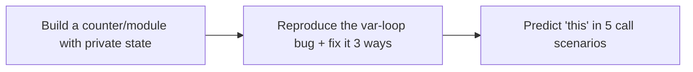

**Steps:**
1. Build a **counter module** with a private variable (closure) exposing only `increment`/`get`.
2. Reproduce the **`var` loop bug**; fix with `let`, then with an IIFE, then by passing `i` as an argument.
3. Write 5 functions and **predict `this`** for each call style (standalone, method, `call`, `new`, arrow) — then verify.
4. Break a callback by losing `this`; fix it with an arrow and with `bind`.

**Learn:** closures, private state, the loop bug, `this` binding rules, arrow vs regular.

---

### Project 2: Implement Debounce, Throttle & a Mini Event System (Intermediate→Senior)

**Goal:** Build real utilities from the mechanics.

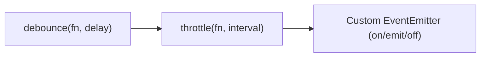

**Steps:**
1. Implement **`debounce`** and **`throttle`** from scratch (closures + timers).
2. Wire them to real events (search input debounce, scroll throttle) and observe the difference.
3. Build a small **EventEmitter** (`on`, `emit`, `off`) using closures to hold listeners.
4. Implement **event delegation** on a list: one parent listener handling clicks on dynamically-added items via `event.target`.

**Learn:** closures for stateful utilities, debounce/throttle, custom events, delegation.

---

### Project 3: Prototypes & the Event System Deep Explore (Senior)

**Goal:** Understand prototypes and propagation hands-on.

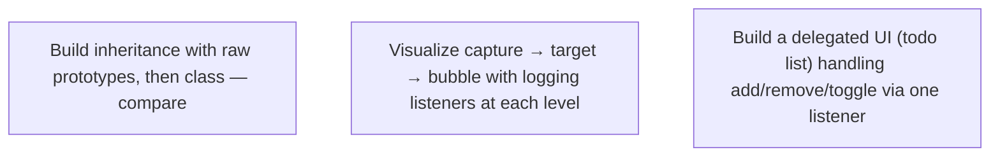

**Steps:**
1. Build an inheritance hierarchy using **raw prototypes** (`Object.create`, `prototype`), then rewrite with `class`; confirm they're equivalent (inspect `__proto__`).
2. Attach listeners at document/parent/target with `{capture}` on/off; **log the phase order** to *see* capture → target → bubble.
3. Experiment with **`stopPropagation`** and **`preventDefault`**; observe exactly what each stops.
4. Build a **todo list with event delegation** (one listener handles add/toggle/delete on all items, including new ones).

**Learn:** prototype chain, class-as-sugar, propagation phases, delegation, target vs currentTarget.

---

## 7. 🔬 DEEP DIVE: INTERNALS

### 7.1 How closures work in memory — the scope chain

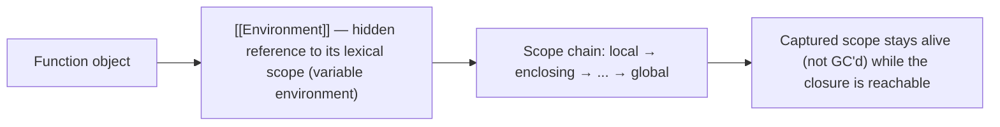

> [!IMPORTANT]
> Under the hood, every function carries a hidden internal reference (`[[Environment]]`) to the **lexical environment** where it was created — essentially a pointer to its enclosing scope's variables. When a function is created inside another, it captures this reference, forming the **scope chain** (local → enclosing → ... → global). A **closure** exists because this captured environment **stays alive as long as the closure is reachable** — even after the outer function returns, the garbage collector *cannot* reclaim the captured variables because the closure still references them. This is *why* the counter's `count` persists (§2.1) and *why* closures can cause **memory leaks** (§3.6): a closure holding a reference to a large object or DOM node keeps it alive indefinitely. Crucially, closures capture the **variable itself (the binding), not a snapshot of its value** — which is the precise reason the `var` loop bug happens (all closures share one binding) and `let` fixes it (a new binding per iteration). Understanding closures as *"functions + a live reference to their birth environment"* demystifies both their power and their leak risk.

### 7.2 The prototype chain mechanics & performance

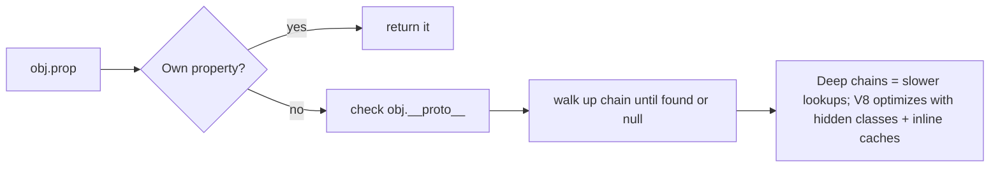

> [!TIP]
> Property access in JavaScript is a **prototype-chain walk**: check the object's own properties, then its prototype, then *that* prototype, up to `Object.prototype` and finally `null` (returning `undefined` if never found). This has a performance implication — **deep prototype chains mean more steps per lookup** — but engines like **V8** optimize aggressively ([[10 React Internals and Architecture]] covers V8): they use **hidden classes** (internal "shapes" that let V8 treat similarly-structured objects like fixed-layout structs) and **inline caches** (remembering where a property was found last time to skip the walk). This is why **consistent object shapes matter for performance** — creating objects with the same properties in the same order lets V8 reuse hidden classes and inline caches, while adding/deleting properties dynamically or having polymorphic shapes *deoptimizes* and slows property access. `Object.create(null)` makes a prototype-less object (no chain, useful for pure dictionaries). Understanding the chain-walk + V8's optimizations connects the *language semantics* (prototypes) to *real performance* (hidden classes) — a genuinely senior-level synthesis.

### 7.3 `this` binding resolution & the arrow exception

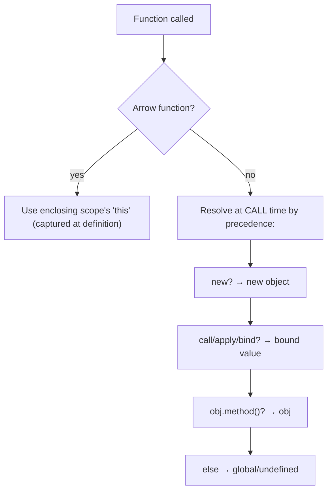

> [!IMPORTANT]
> The mechanism: for a **regular function**, `this` is **resolved dynamically at call time** by the precedence rules (§2.4) — the JS engine determines `this` based on the call site *every time* the function runs, which is why the same function has different `this` depending on how it's invoked. An **arrow function** is fundamentally different: it has **no `this` binding slot of its own** — at definition, it captures the `this` of its enclosing lexical scope, and references to `this` inside it resolve up the scope chain (exactly like any other variable). So an arrow's `this` is fixed at *definition* and can *never* be changed — `call`/`apply`/`bind` have **no effect** on an arrow's `this` (a subtle gotcha). This is *why* arrows solved the callback problem so elegantly: a regular-function callback re-resolves `this` at call time (getting the wrong context), while an arrow just uses the surrounding `this` it captured. Grasping that regular functions resolve `this` *dynamically at the call site* while arrows capture it *lexically at definition* is the complete mental model — everything about `this` follows from it.

### 7.4 The event dispatch algorithm

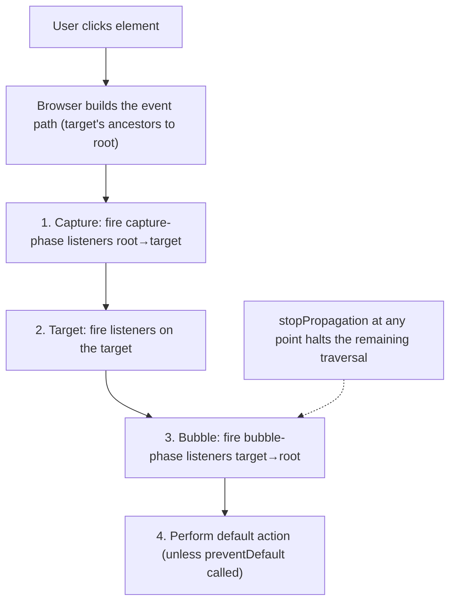

> [!TIP]
> When an event fires, the browser runs a precise **dispatch algorithm**: first it computes the **event path** (the chain from the target up to the `document`/`window`). Then it traverses this path three times conceptually — **capture phase** (root → target, firing any capture-registered listeners), **target phase** (the target's own listeners), and **bubble phase** (target → root, firing bubble-registered listeners, which is the default). At each element it invokes the matching listeners in registration order. **`stopPropagation()`** sets a flag that halts traversal *after the current element* (remaining listeners on *other* elements won't fire, though `stopImmediatePropagation()` also stops *other listeners on the same element*). After propagation completes, the browser performs the **default action** (navigate, submit, toggle) *unless* `preventDefault()` was called. Not all events bubble (`focus`, `blur`, `load` don't — use `focusin`/`focusout` for bubbling focus). This algorithm is *why* delegation works (bubbling carries the event to the ancestor listener), why phase and registration order matter, and why `target`/`currentTarget` differ (the event object is the same, but `currentTarget` updates as traversal moves). Knowing the actual dispatch steps — not just "it bubbles" — is deep DOM understanding.

### 7.5 Garbage collection & closures/listeners

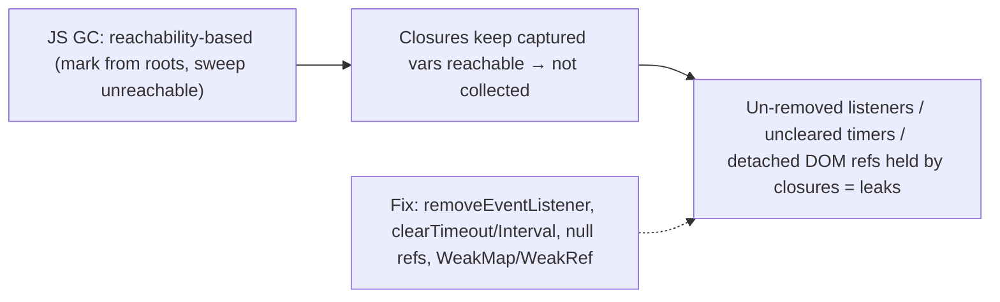

> [!IMPORTANT]
> JavaScript uses **reachability-based garbage collection** (like the JVM — [[04 Java Concurrency and JVM]]): starting from roots (global object, active call stack), it marks everything reachable and collects the rest. A JS "memory leak" is therefore **unintended reachability** — keeping references to things you no longer need. **Closures are a prime cause**: because a closure keeps its captured variables reachable, a long-lived closure holding a large object or a **detached DOM node** keeps that memory alive forever. Common real-world leaks: **event listeners never removed** (the handler closure keeps its captured scope — and often the DOM element — alive; always `removeEventListener` or use [[08 React]] `useEffect` cleanup), **timers never cleared** (`setInterval` callbacks stay referenced — `clearInterval`), and **closures over DOM elements** that were removed from the page. The tools: explicit cleanup, and **`WeakMap`/`WeakSet`/`WeakRef`** (weak references that *don't* prevent GC — ideal for metadata keyed by objects that should be collectable). This connects the language mechanics (closures) to production stability (memory in long-running SPAs and [[05 Node.js]] servers) — the same "leak = unintended reachability" lesson across managed runtimes.

---

## ✅ Production Checklists

### Correctness
- [ ] Use **`let`/`const`** (block scope), never `var`
- [ ] Use **`===`/`!==`** (strict equality), never `==`
- [ ] **Arrow functions** for callbacks (lexical `this`); regular for methods
- [ ] Don't extract methods and lose `this` (bind or arrow-wrap)
- [ ] Don't modify built-in prototypes (`Array.prototype` etc.)
- [ ] Copy objects/arrays (spread/clone) when you need independence (reference semantics)

### Events
- [ ] Use **event delegation** for large/dynamic lists
- [ ] Use **`event.target`** (not currentTarget) to find the clicked element in delegation
- [ ] Correct choice of **`stopPropagation`** vs **`preventDefault`**
- [ ] Aware some events don't bubble (focus/blur)

### Memory
- [ ] **`removeEventListener`** on cleanup; clear timers/intervals
- [ ] Avoid closures capturing large objects/DOM longer than needed
- [ ] Use **`WeakMap`/`WeakRef`** for collectable object-keyed data
- [ ] Watch for closure leaks in long-running SPAs / [[05 Node.js]]

---

## 🗺️ Learning Roadmap

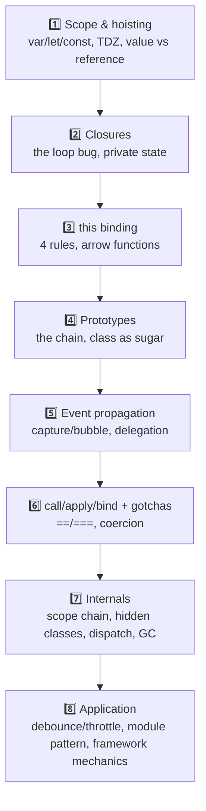

| Stage | Focus | You can... |
|---|---|---|
| 1–2 | Scope + closures | Explain closures & the loop bug |
| 3–4 | this + prototypes | Reason about binding & inheritance |
| 5–6 | Events + methods | Use propagation, delegation, call/apply/bind |
| 7–8 | Internals + application | Debug leaks; build real utilities |

---

## 🔁 Self-Review Completion Loop

Reviewed against MDN, *You Don't Know JS* (Kyle Simpson), *Eloquent JavaScript*, and the ECMAScript spec.

### Gap Review Matrix

| Dimension | Covered? | Where |
|---|---|---|
| Scope (var/let/const) | ✅ | §1 |
| Hoisting & TDZ | ✅ | §1 |
| Value vs reference | ✅ | §1 |
| Closures | ✅ | §2.1, §7.1 |
| The loop-closure bug | ✅ | §2.2 |
| Prototypes & the chain | ✅ | §2.3, §7.2 |
| `this` binding rules | ✅ | §2.4, §7.3 |
| Arrow functions & lexical this | ✅ | §2.5, §7.3 |
| Event loop (brief) | ✅ | §2.6 |
| Event propagation (capture/bubble) | ✅ | §3.1, §7.4 |
| Event delegation | ✅ | §3.2 |
| target vs currentTarget | ✅ | §3.3 |
| stopPropagation vs preventDefault | ✅ | §3.3, §7.4 |
| call/apply/bind | ✅ | §3.4 |
| Prototypal inheritance / class | ✅ | §3.5 |
| JS gotchas (==, leaks) | ✅ | §3.6 |
| Module pattern | ✅ | §4.1 |
| Debounce/throttle | ✅ | §4.2 |
| Framework mechanics | ✅ | §4.3 |
| GC & closures/listeners | ✅ | §7.5 |
| Interview Q&A + mistakes | ✅ | §5 |
| Hands-on projects | ✅ | §6 |

> [!NOTE]
> **Remaining depth to explore independently:** `Symbol` and well-known symbols, iterators & generators (`function*`, `yield`), async iterators & `for await`, Proxy & Reflect (metaprogramming), getters/setters & property descriptors, `Object.freeze`/immutability, optional chaining & nullish coalescing, destructuring depth, tagged template literals, ES modules vs CommonJS ([[05 Node.js]]), `structuredClone`, memory profiling in DevTools, and the full ECMAScript coercion algorithm. Async depth (Promises, event loop phases) is in [[04 JavaScript and Nodejs Concurrency]].

---

## 📚 Official References

| Resource | Source |
|---|---|
| MDN — Closures | https://developer.mozilla.org/en-US/docs/Web/JavaScript/Closures |
| MDN — Inheritance and the prototype chain | https://developer.mozilla.org/en-US/docs/Web/JavaScript/Inheritance_and_the_prototype_chain |
| MDN — `this` | https://developer.mozilla.org/en-US/docs/Web/JavaScript/Reference/Operators/this |
| MDN — Event bubbling & capture | https://developer.mozilla.org/en-US/docs/Learn/JavaScript/Building_blocks/Events |
| *You Don't Know JS Yet* — Kyle Simpson | https://github.com/getify/You-Dont-Know-JS |
| *Eloquent JavaScript* — Marijn Haverbeke | https://eloquentjavascript.net/ |
| javascript.info (modern tutorial) | https://javascript.info/ |

---

## 🎁 Final Summary

> [!IMPORTANT]
> **The one-paragraph takeaway:** JavaScript's reputation for "weird" behavior dissolves once you understand a handful of core mechanics. Variables live in nested **scopes** — use **`let`/`const`** (block-scoped) over **`var`** (function-scoped) — and **hoisting** moves declarations up (`var` → `undefined`; `let`/`const` → the **Temporal Dead Zone** → ReferenceError). A **closure** is a function bundled with a *live reference* to its birth scope, so it remembers (and keeps alive) those variables even after the outer function returns — enabling private state, stateful functions, and utilities like debounce/throttle, *and* causing the famous `var`-loop-with-`setTimeout` bug (all closures share one binding; `let` gives each iteration its own). **`this`** is resolved by *how a function is called* (precedence: `new` → `call`/`apply`/`bind` → `obj.method()` → global/undefined), and the notorious trap is losing implicit binding when you extract a method — solved by **arrow functions**, which have *no own `this`* and lexically inherit it from their enclosing scope (making them perfect for callbacks but wrong as object methods). JavaScript uses **prototypal inheritance**: property access walks *up the prototype chain* (object → prototype → ... → `Object.prototype` → null) until found, which is how shared methods like `Array.prototype.map` work, and ES6 **`class` is just syntactic sugar** over this. In the DOM, events travel in three phases — **capture** (down), **target**, **bubble** (up) — and **event delegation** exploits bubbling by putting *one* listener on an ancestor and using **`event.target`** to identify the source (fewer listeners, handles dynamic elements — exactly how [[08 React]] dispatches events); don't confuse **`target`** (clicked element) with **`currentTarget`** (listener's element), or **`stopPropagation`** (halts DOM travel) with **`preventDefault`** (stops the browser's default action). Round it out with **`call`/`apply`/`bind`** for explicit `this`, **`===`** over coercion-prone `==`, reference-vs-value semantics for objects, and awareness that closures/listeners/timers cause **memory leaks** (unintended reachability) unless cleaned up. These aren't trivia — they're the machinery every framework is built on, which is exactly why interviews test them.

**Golden rules:**
1. 🔒 A **closure** = function + live reference to its birth scope (remembers *variables*, not values).
2. 🔁 The **`var`-loop bug** is closures + scoping — fix with **`let`** (per-iteration binding).
3. 🎯 **`this`** depends on *how a function is called*, not where it's defined (arrows excepted).
4. ➡️ **Arrow functions** have no own `this` — great for callbacks, wrong as methods.
5. ⛓️ Property lookup walks the **prototype chain**; `class` is sugar over prototypes.
6. 🎈 Events **capture down, then bubble up** — three phases through the DOM.
7. 🎪 **Event delegation**: one ancestor listener + `event.target` (fewer listeners, dynamic-safe).
8. 🎭 **`target`** = clicked; **`currentTarget`** = listener's element; **`stopPropagation`** ≠ **`preventDefault`**.
9. ⚖️ Use **`===`** (no coercion); objects are **by reference** (clone for copies); `let`/`const` not `var`.
10. 🧹 Closures/listeners/timers **leak memory** — clean up (removeEventListener, clear timers, WeakMap).

---

*Related guides in this vault: [[01 JavaScript]] · [[03 TypeScript]] · [[08 React]] · [[04 JavaScript and Nodejs Concurrency]] · [[05 Node.js]] · [[10 React Internals and Architecture]] · [[03 Java Streams and Functional Programming]]*
