# 🔷 TypeScript — Complete Beginner-to-Expert Reference

> JavaScript that scales — a static type layer that catches bugs at compile time, powers world-class tooling, and makes large codebases maintainable.

---

## 📑 Table of Contents

1. [Executive Summary](#-executive-summary)
2. [Fundamentals (Beginner)](#1--fundamentals-beginner-level)
3. [Core Concepts (Intermediate)](#2--core-concepts-intermediate-level)
4. [Advanced Concepts (Senior)](#3--advanced-concepts-senior-level)
5. [Real-World System Design](#4--real-world-system-design-usage)
6. [Interview Preparation](#5--interview-preparation)
7. [Hands-On Projects](#6--hands-on-projects)
8. [Deep Dive: Internals](#7--deep-dive-internals)
9. [Production Checklists](#-production-checklists)
10. [Learning Roadmap](#-learning-roadmap)
11. [Self-Review Completion Loop](#-self-review-completion-loop)
12. [Official References](#-official-references)
13. [Final Summary](#-final-summary)

---

## 🎯 Executive Summary

**TypeScript** is a **statically-typed superset of JavaScript** developed by Microsoft. It adds an optional type system on top of [[01 JavaScript]], catching a huge class of bugs *before* the code runs, then **compiles down to plain JavaScript** that runs anywhere JS runs. Every valid JS program is valid TS — you adopt types incrementally.

| What it is | What it replaces | Core superpower |
|---|---|---|
| Statically-typed superset of JavaScript | Runtime `undefined is not a function` errors, guesswork, weak tooling | **Compile-time type safety** + world-class autocomplete/refactoring, with zero runtime overhead |

> [!IMPORTANT]
> TypeScript's defining trait is that it's a **compile-time-only** type system: types are checked during compilation, then **completely erased** — the JavaScript that ships has no types and no runtime checks. This is the key to understanding TS: it's a *developer-experience and correctness tool*, not a runtime framework. It makes [[01 JavaScript]] safe to write at scale (millions of lines, huge teams) without changing how JS actually executes.

Related guides: [[01 JavaScript]] · [[08 React]] · [[09 React Hooks]] · [[05 Node.js]] · [[06 Express.js]] · [[07 Hono]] · [[12 TanStack Query]]

---

## 1. 🌱 FUNDAMENTALS (Beginner Level)

### What is TypeScript in simple terms?

[[01 JavaScript]] is **dynamically typed** — a variable can hold anything, and type errors only surface *at runtime*, often in production:

```javascript
// JavaScript — no complaint until it explodes at runtime
function greet(user) {
  return "Hello, " + user.name.toUpperCase();
}
greet({ name: "Alice" });   // ✅ "Hello, ALICE"
greet("Alice");             // 💥 runtime error: user.name is undefined
greet();                    // 💥 Cannot read properties of undefined
```

**TypeScript adds types** so these mistakes are caught *while you type*, in your editor, before the code ever runs:

```typescript
interface User { name: string; }

function greet(user: User): string {
  return "Hello, " + user.name.toUpperCase();
}
greet({ name: "Alice" });   // ✅
greet("Alice");             // ❌ compile error: string is not a User
greet();                    // ❌ compile error: expected 1 argument
```

### Why does TypeScript exist?

JavaScript was designed in 10 days for small browser scripts. Decades later, we build **massive** applications with it ([[08 React]] frontends, [[05 Node.js]] backends). At that scale, dynamic typing becomes a liability:

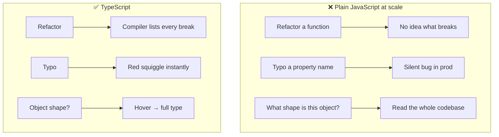

### Problems TypeScript solves

| Problem | How TS solves it |
|---|---|
| **Runtime type errors** | Caught at compile time |
| **"What arguments does this take?"** | Types document the contract; autocomplete shows it |
| **Fearful refactoring** | Compiler flags every affected call site |
| **`undefined`/`null` bugs** | Strict null checking forces you to handle them |
| **Poor autocomplete** | Types drive rich IntelliSense |
| **Onboarding friction** | Types are living documentation |
| **API contract drift** | Shared types keep client & server in sync |

### TypeScript vs JavaScript

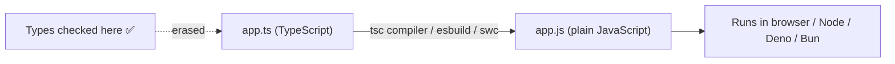

| Aspect | JavaScript | TypeScript |
|---|---|---|
| **Typing** | Dynamic (runtime) | Static (compile time) |
| **Errors caught** | At runtime | Before running |
| **Tooling** | Basic | Rich (autocomplete, refactor, nav) |
| **Runs directly** | Yes | No — compiles to JS first |
| **Learning curve** | Lower | Slightly higher (types) |
| **Best for** | Small scripts, quick prototypes | Anything that grows / has a team |

### Core concepts (the vocabulary)

| Term | Plain meaning |
|---|---|
| **Type annotation** | Declaring what type something is (`x: number`) |
| **Type inference** | TS figuring out types automatically |
| **Interface / Type alias** | Naming the shape of an object |
| **Union / Intersection** | "A or B" / "A and B" types |
| **Generic** | A type parameterized by another type (`Array<T>`) |
| **`tsc`** | The TypeScript compiler |
| **`tsconfig.json`** | Compiler configuration |
| **Structural typing** | Compatibility by shape, not by name |
| **Type narrowing** | Refining a type via checks (`if typeof...`) |
| **`.d.ts`** | Declaration file (types only, no code) |

### Real-world analogy 📋

TypeScript is like a **detailed blueprint + spell-checker for construction**:
- Plain JS is building a house **without blueprints** — you find out the plumbing doesn't fit *after* it's installed (runtime error).
- TypeScript is having an **architect check the blueprint** first: "this pipe (string) can't connect to that fitting (number)" — caught on paper, before any concrete is poured.
- The **blueprint** (types) also documents the whole house so a new builder instantly understands it.
- Crucially, the **finished house is identical** — the blueprint isn't part of the building (types are erased at compile time).

> [!TIP]
> The mental model: **TypeScript is a linter/spell-checker on steroids that runs at compile time and then gets out of the way.** It never changes runtime behavior — it just refuses to compile code that's provably wrong. Everything you know about [[01 JavaScript]] still applies; TS only adds a safety net on top.

---

## 2. 🧩 CORE CONCEPTS (Intermediate Level)

### 2.1 Basic Types

```typescript
// Primitives
let name: string = "Alice";
let age: number = 30;
let active: boolean = true;
let nothing: null = null;
let missing: undefined = undefined;
let big: bigint = 100n;
let sym: symbol = Symbol("id");

// Arrays & tuples
let nums: number[] = [1, 2, 3];
let pair: [string, number] = ["age", 30];   // tuple: fixed length + types

// Objects
let user: { name: string; age?: number } = { name: "Bob" };  // age optional

// Functions
function add(a: number, b: number): number { return a + b; }
const multiply = (a: number, b: number): number => a * b;

// Special types
let anything: any;        // opt out of type checking (avoid!)
let safe: unknown;        // like any but must be narrowed before use
function fail(): never { throw new Error(); }  // never returns
let nothing2: void;       // function returns nothing
```

> [!WARNING]
> **`any` is a hole in the type system** — it disables all checking for that value and *spreads* (anything touching an `any` becomes unchecked). Overusing `any` gives you "JavaScript with extra steps." Prefer **`unknown`** when a type is truly unknown: it forces you to **narrow** (check) before using it, keeping safety. A good `tsconfig` sets `noImplicitAny: true` so accidental `any` is flagged.

### 2.2 Type Inference (let TS do the work)

```typescript
let count = 5;              // inferred: number (no annotation needed)
const name = "Alice";      // inferred: "Alice" (literal type, because const)
const nums = [1, 2, 3];    // inferred: number[]

function double(x: number) {
  return x * 2;            // return type inferred: number
}
```

> [!TIP]
> **Don't over-annotate.** TypeScript's inference is excellent — annotate *inputs* (function parameters, public API boundaries) and let TS infer *outputs* (return types, local variables). Redundant annotations add noise and can drift from reality. The idiom: type the boundaries, infer the interior.

### 2.3 Interfaces vs Type Aliases

```typescript
// Interface — best for object shapes; can be extended & merged
interface User {
  id: number;
  name: string;
  email?: string;            // optional
  readonly createdAt: Date;  // can't reassign
}
interface Admin extends User {
  role: "admin";
}

// Type alias — more flexible; unions, primitives, tuples, functions
type ID = string | number;
type Point = { x: number; y: number };
type Handler = (event: string) => void;
type Status = "active" | "inactive" | "banned";   // union of literals
```

| | `interface` | `type` |
|---|---|---|
| Object shapes | ✅ | ✅ |
| Unions / intersections | ❌ | ✅ |
| Primitives / tuples / functions | ❌ | ✅ |
| `extends` | ✅ | ✅ (via `&`) |
| **Declaration merging** | ✅ (reopens) | ❌ |
| Recommendation | Public object APIs | Everything else (unions, utilities) |

> [!TIP]
> Common guidance: use **`interface` for object shapes** you might extend (especially public APIs / library types — declaration merging helps), and **`type` for unions, intersections, tuples, function types, and mapped/conditional types**. In practice they overlap heavily; pick one convention per team. `type` is strictly more capable; `interface` gives better error messages and merging.

### 2.4 Union & Intersection Types + Narrowing

```typescript
type Shape =
  | { kind: "circle"; radius: number }
  | { kind: "square"; size: number };

// Discriminated union — narrow by the "kind" tag
function area(shape: Shape): number {
  switch (shape.kind) {
    case "circle": return Math.PI * shape.radius ** 2;  // TS knows radius exists
    case "square": return shape.size ** 2;               // TS knows size exists
  }
}

// Narrowing techniques
function process(x: string | number) {
  if (typeof x === "string") x.toUpperCase();  // narrowed to string
  else x.toFixed(2);                            // narrowed to number
}
```

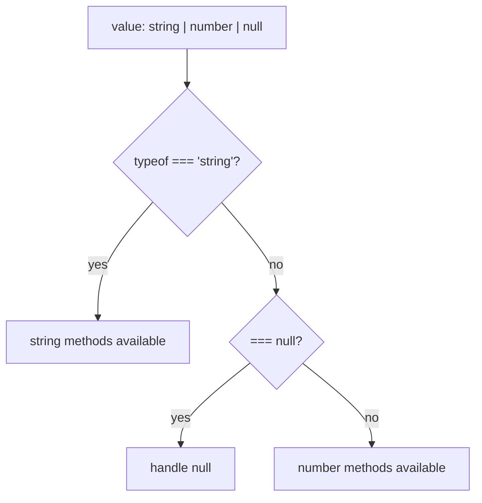

> [!IMPORTANT]
> **Discriminated unions** (a shared literal "tag" field like `kind`) are one of TS's most powerful patterns — they model "one of several shapes" safely and let the compiler **narrow** exhaustively. Combined with a `never`-based exhaustiveness check in the `default` case, adding a new variant becomes a **compile error** everywhere you forgot to handle it. This is how you model state machines, API responses, and Redux-style actions type-safely ([[11 Redux Toolkit and RTK Query]]).

### 2.5 Generics (reusable, type-safe code)

```typescript
// A function that preserves the type it's given
function identity<T>(value: T): T {
  return value;
}
identity<string>("hi");   // T = string
identity(42);             // T = number (inferred)

// Generic constraints
function longest<T extends { length: number }>(a: T, b: T): T {
  return a.length >= b.length ? a : b;
}
longest([1,2,3], [1,2]);      // ✅ arrays have length
longest("abc", "ab");         // ✅ strings have length
// longest(3, 4);             // ❌ numbers have no length

// Generic interface
interface ApiResponse<T> {
  data: T;
  status: number;
  error?: string;
}
const res: ApiResponse<User[]> = { data: [], status: 200 };
```

> [!TIP]
> Generics are "type variables" — they let you write code that works over *many* types **without losing type information** (unlike `any`, which throws it away). If you find yourself writing the same function for `User[]`, `Product[]`, `Order[]`, that's a generic `<T>`. Use **constraints** (`T extends ...`) to require capabilities. Data-fetching libraries like [[12 TanStack Query]] and [[11 Redux Toolkit and RTK Query]] are generics-heavy for exactly this reason.

### 2.6 The tsconfig.json (compiler control)

```jsonc
{
  "compilerOptions": {
    "target": "ES2022",           // JS version to emit
    "module": "ESNext",           // module system
    "moduleResolution": "bundler",
    "strict": true,               // ⭐ enable ALL strict checks
    "noImplicitAny": true,        // error on implicit any
    "strictNullChecks": true,     // null/undefined must be handled
    "noUncheckedIndexedAccess": true, // arr[i] is T | undefined
    "esModuleInterop": true,
    "skipLibCheck": true,         // skip checking .d.ts (faster)
    "sourceMap": true,            // debugging
    "outDir": "./dist",
    "noUnusedLocals": true,
    "noImplicitReturns": true
  },
  "include": ["src/**/*"],
  "exclude": ["node_modules", "dist"]
}
```

> [!IMPORTANT]
> **Always enable `"strict": true`.** It turns on `strictNullChecks`, `noImplicitAny`, and a suite of checks that catch the bugs TypeScript exists to prevent. Without strict mode, you get a fraction of the value — `null`/`undefined` slip through, implicit `any` spreads, and the type system becomes decorative. Starting a new project non-strict is the most common way to waste TypeScript. Consider `noUncheckedIndexedAccess` too — it correctly types `array[i]` as possibly `undefined`.

### 2.7 The Compilation Pipeline

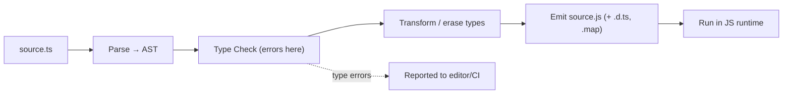

> [!WARNING]
> A crucial nuance: **`tsc` reports type errors but by default still emits JavaScript anyway** (unless `noEmitOnError` is set). And bundlers like **esbuild/swc/Vite strip types WITHOUT type-checking at all** (for speed). This means your build can "succeed" with type errors! In production setups, run **`tsc --noEmit`** as a separate CI type-check step, while the bundler handles fast transpilation. Type-checking and transpilation are two separate jobs.

---

## 3. ⚙️ ADVANCED CONCEPTS (Senior Level)

### 3.1 Utility Types (built-in type transformers)

```typescript
interface User {
  id: number;
  name: string;
  email: string;
  age: number;
}

Partial<User>            // all properties optional
Required<User>           // all properties required
Readonly<User>           // all properties readonly
Pick<User, "id" | "name">        // subset: { id, name }
Omit<User, "email">              // everything except email
Record<string, User>             // { [key: string]: User }
Exclude<"a" | "b" | "c", "a">    // "b" | "c"
Extract<string | number, string> // string
NonNullable<string | null>       // string
ReturnType<typeof someFn>        // the function's return type
Parameters<typeof someFn>        // tuple of its param types
Awaited<Promise<User>>           // User (unwraps promises)
```

```typescript
// Real-world: an update DTO where every field is optional
function updateUser(id: number, changes: Partial<User>) { /* ... */ }
updateUser(1, { name: "New Name" });   // ✅ only the fields you're changing
```

> [!TIP]
> **Utility types are how you avoid duplicating type definitions.** Define `User` once, then derive: `Partial<User>` for updates, `Omit<User, "id">` for creation payloads, `Pick<User, "id" | "name">` for a summary view. When the base type changes, all derivatives update automatically — a huge maintainability win. Memorize `Partial`, `Pick`, `Omit`, `Record`, `ReturnType` — they cover 90% of real use.

### 3.2 Mapped Types & Conditional Types

```typescript
// Mapped type — transform every property
type Optional<T> = { [K in keyof T]?: T[K] };        // like Partial
type Nullable<T> = { [K in keyof T]: T[K] | null };
type Getters<T> = {
  [K in keyof T as `get${Capitalize<string & K>}`]: () => T[K]
};
// Getters<{ name: string }> → { getName: () => string }

// Conditional type — "if type extends X then A else B"
type IsString<T> = T extends string ? true : false;
type A = IsString<"hi">;    // true
type B = IsString<42>;      // false

// Infer — extract a type from within another
type ElementType<T> = T extends (infer U)[] ? U : never;
type E = ElementType<number[]>;   // number

type UnwrapPromise<T> = T extends Promise<infer U> ? U : T;
```

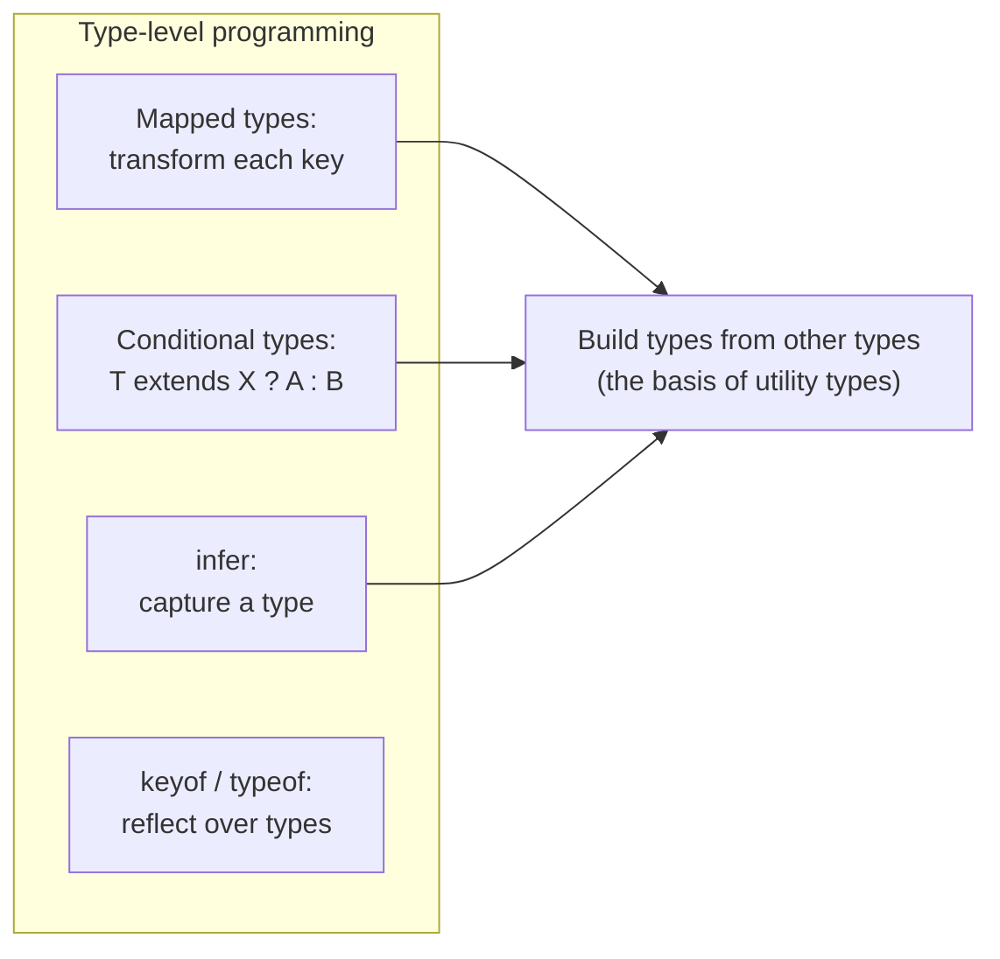

> [!IMPORTANT]
> **Mapped + conditional types + `infer` make TypeScript's type system Turing-complete** — you can compute types from other types. This is how the built-in utility types are implemented, and how libraries provide magical inference (e.g., a router that infers param types from a URL string, or [[12 TanStack Query]] inferring your data shape). You rarely *write* deep type-level code, but understanding it lets you read library types and build ergonomic APIs. Don't over-engineer — clarity beats cleverness.

### 3.3 Type Guards & Narrowing (advanced)

```typescript
// User-defined type guard (the "is" predicate)
function isUser(value: unknown): value is User {
  return typeof value === "object" && value !== null &&
         "id" in value && "name" in value;
}

const data: unknown = await fetchSomething();
if (isUser(data)) {
  data.name;   // ✅ TS now knows data is User
}

// assertion function
function assertIsDefined<T>(val: T): asserts val is NonNullable<T> {
  if (val == null) throw new Error("Not defined");
}

// Narrowing tools:  typeof · instanceof · in · === literal · Array.isArray
```

> [!WARNING]
> A type guard like `value is User` is a **promise you make to the compiler**, not a checked fact. If your guard's logic is wrong (e.g., you forget to check a field), TS trusts you and you get an unsafe cast with a false sense of safety. For validating **external data** (API responses, form input, env vars), use a **runtime validation library like Zod** that generates *both* the runtime check *and* the type — because TS types are erased and cannot validate data at runtime (see §3.6).

### 3.4 `keyof`, `typeof`, Indexed Access

```typescript
interface User { id: number; name: string; email: string; }

type UserKeys = keyof User;              // "id" | "name" | "email"
type NameType = User["name"];            // string (indexed access)

// typeof — get the type of a value
const config = { host: "localhost", port: 5432 };
type Config = typeof config;             // { host: string; port: number }

// Combine: a type-safe property getter
function getProp<T, K extends keyof T>(obj: T, key: K): T[K] {
  return obj[key];
}
getProp({ name: "Al", age: 3 }, "name");  // returns string, "age" → number
// getProp({ name: "Al" }, "missing");    // ❌ compile error
```

### 3.5 Generics — Advanced Patterns

```typescript
// Multiple type params + defaults
interface Store<State, Action = { type: string }> {
  getState(): State;
  dispatch(action: Action): void;
}

// Constrained generic factory
function createRepository<T extends { id: number }>() {
  const items = new Map<number, T>();
  return {
    save: (item: T) => items.set(item.id, item),
    find: (id: number): T | undefined => items.get(id),
  };
}
const userRepo = createRepository<User>();

// Conditional return type based on input
function parse<T extends "json" | "text">(
  format: T
): T extends "json" ? object : string {
  return (format === "json" ? {} : "") as any;
}
```

### 3.6 The Runtime Gap — Types Are Erased

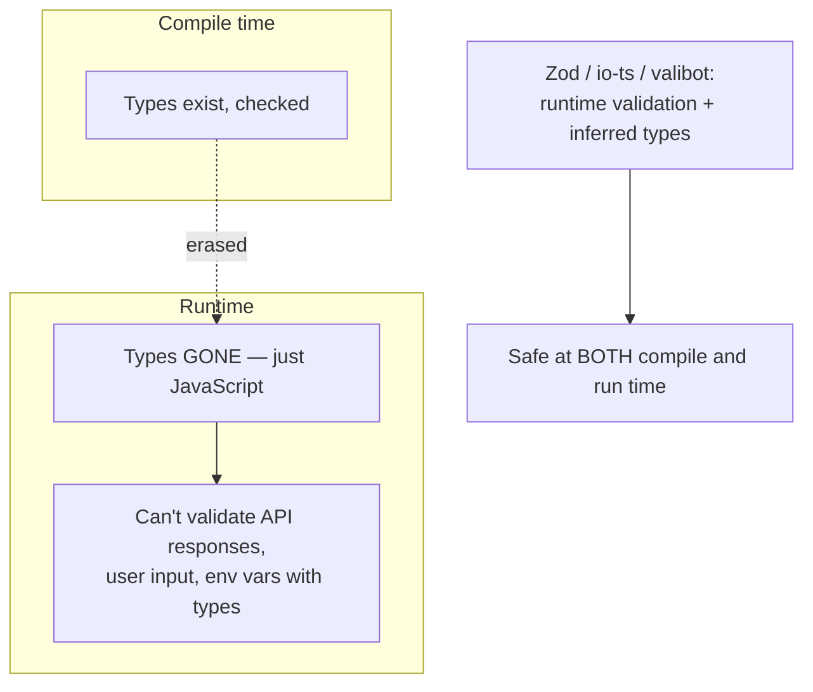

```typescript
import { z } from "zod";

// Define ONCE — get runtime validation AND a static type
const UserSchema = z.object({
  id: z.number(),
  name: z.string(),
  email: z.string().email(),
});
type User = z.infer<typeof UserSchema>;   // static type derived from schema

// Validate untrusted data at runtime
const result = UserSchema.safeParse(await res.json());
if (result.success) {
  result.data;   // ✅ typed AND verified to actually match at runtime
}
```

> [!IMPORTANT]
> **The single most important senior insight: TypeScript types do NOT exist at runtime.** A type annotation cannot validate that an API actually returned what you claimed, that user input is well-formed, or that `process.env.PORT` is a number. At every **trust boundary** (network, user input, files, env), you need **runtime validation** — and **Zod** (or valibot/io-ts) is the standard: you write a schema once and `z.infer` gives you the matching static type, so runtime and compile-time truth stay in sync. Casting API responses with `as User` is a lie the compiler can't catch.

### 3.7 Failure Scenarios & Production Issues

| Problem | Cause | Fix |
|---|---|---|
| **`as` casting bugs** | Lying to the compiler | Validate with Zod; avoid `as` (use guards) |
| **`any` spreading** | One `any` infects everything | `noImplicitAny`, prefer `unknown` |
| **Non-strict mode** | Null bugs slip through | `"strict": true` |
| **Type errors ignored in build** | Bundler skips type-check | `tsc --noEmit` in CI |
| **Runtime data mismatch** | Trusting `as` on API data | Runtime validation at boundaries |
| **Slow compiler / editor** | Huge/complex types, big project | `skipLibCheck`, project references, simplify types |
| **`@ts-ignore` graveyard** | Suppressing instead of fixing | Prefer `@ts-expect-error` (errors if the error disappears) |
| **Enum surprises** | `enum` emits runtime code, quirks | Prefer union of string literals or `as const` |
| **Declaration file gaps** | JS lib without types | `@types/x` or write a `.d.ts` |

> [!WARNING]
> `@ts-ignore` silently suppresses the *next* line's error forever — even after you fix the underlying issue, hiding future real errors. Prefer **`@ts-expect-error`**: it suppresses an error but **fails the build if there's no longer an error there**, so it self-cleans once the code is fixed. And **never** commit `as any` to "make it compile" — that's disabling the tool you're paying for.

---

## 4. 🏗️ REAL-WORLD SYSTEM DESIGN USAGE

### 4.1 End-to-End Type Safety (the killer app)

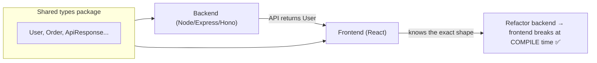

Sharing types between [[05 Node.js]]/[[06 Express.js]]/[[07 Hono]] backends and [[08 React]] frontends means a backend change that alters an API shape **breaks the frontend build immediately** — not in production. Tools that push this further:
- **tRPC** — end-to-end typesafe APIs with **zero codegen** (the client infers types directly from the server router).
- **Zod + OpenAPI** — schema-first contracts.
- **GraphQL Code Generator / Prisma** — generate types from schemas.

> [!TIP]
> **tRPC** is a TypeScript superpower for full-stack TS apps: define procedures on the server, and the client gets fully-typed, autocompleted calls with **no code generation and no manual API types** — if you rename a field on the server, the client call is a compile error instantly. It relies entirely on TS inference (§3.2). Great for monorepos where front and back share a language.

### 4.2 How companies use TypeScript

| Company | Usage |
|---|---|
| **Microsoft** | Created it; VS Code, Office web, Azure portal |
| **Google** | Angular is TS-first; internal adoption |
| **Airbnb, Slack, Stripe** | Migrated large JS codebases to TS for reliability |
| **Vercel/Next.js** | TS-first framework & tooling |
| **Most modern startups** | Default choice for new JS projects |

### 4.3 TypeScript in the Stack

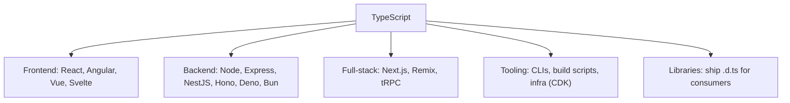

- **Frontend**: [[08 React]] + TS is the modern default; props, hooks, and events all typed ([[09 React Hooks]]).
- **Backend**: [[05 Node.js]]/[[06 Express.js]]/[[07 Hono]], NestJS (TS-first, decorators/DI), Deno & Bun (TS natively).
- **Full-stack**: Next.js, Remix, tRPC for shared types.
- **Infra**: AWS CDK / Pulumi let you write cloud infrastructure in TS.

### 4.4 Migrating JavaScript → TypeScript (incremental)

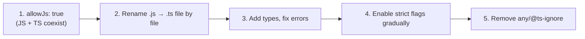

Because TS is a **superset**, you can adopt it gradually: enable `allowJs`, rename files one at a time, use `// @ts-check` in JS files for lightweight checking, and tighten `strict` settings incrementally. Big migrations (Airbnb, Slack) did exactly this over months.

> [!TIP]
> For a **library you publish**, ship `.d.ts` declaration files (`"declaration": true`) so consumers get types. For a JS-only dependency without types, install community types from **DefinitelyTyped** (`npm i -D @types/lodash`) or write a minimal `.d.ts`. The `@types/*` ecosystem is one of TS's biggest strengths — nearly every popular JS library has community-maintained types.

---

## 5. 🎤 INTERVIEW PREPARATION

### 5.1 Most important questions

<details>
<summary><b>Q1: What is TypeScript and how does it relate to JavaScript?</b></summary>

A **statically-typed superset** of JavaScript — all valid JS is valid TS. It adds a compile-time type system, then compiles to plain JS. Types are **erased** at compile time (zero runtime overhead). It catches type errors before running and powers rich tooling, making large codebases maintainable.
</details>

<details>
<summary><b>Q2: `any` vs `unknown` vs `never`?</b></summary>

**`any`** disables type checking (avoid — it spreads). **`unknown`** is the type-safe counterpart: you can hold anything but must **narrow** before using it. **`never`** is the type with no values — for functions that never return (throw/infinite loop) and for exhaustiveness checks. Rule: use `unknown` at boundaries, narrow, never `any`.
</details>

<details>
<summary><b>Q3: interface vs type?</b></summary>

Both name shapes. **`interface`** is best for object shapes, supports `extends` and **declaration merging** (great for public APIs). **`type`** is more flexible — unions, intersections, tuples, primitives, mapped/conditional types. `type` is strictly more capable; `interface` gives cleaner errors and can be reopened. Convention varies; common: interface for objects, type for unions/utilities.
</details>

<details>
<summary><b>Q4: What are generics and why use them?</b></summary>

Type parameters that let code work over many types **while preserving type information** (unlike `any`). E.g., `function first<T>(arr: T[]): T`. Use **constraints** (`T extends ...`) to require capabilities. They power reusable, type-safe utilities, collections, and data libraries.
</details>

<details>
<summary><b>Q5: Do TypeScript types exist at runtime?</b></summary>

**No** — types are completely erased during compilation; the shipped JS has no type info or checks. So you can't validate external data (API responses, user input) with types alone. At trust boundaries, use **runtime validation (Zod)** which gives both a runtime check and an inferred static type.
</details>

<details>
<summary><b>Q6: What is a discriminated union?</b></summary>

A union of object types sharing a literal **discriminant** field (e.g., `kind: "circle" | "square"`). The compiler **narrows** based on that tag, so each branch knows the exact shape. With a `never` exhaustiveness check, forgetting a new case becomes a compile error. Ideal for state machines, actions, and API results.
</details>

<details>
<summary><b>Q7: What does `strict` mode do and why enable it?</b></summary>

`"strict": true` enables `strictNullChecks` (null/undefined must be handled), `noImplicitAny`, and other checks that catch the exact bugs TS exists to prevent. Without it, you lose most of the value. Always enable it, especially on new projects.
</details>

<details>
<summary><b>Q8: How does TypeScript's structural typing work?</b></summary>

TS uses **structural** (duck) typing: compatibility is by **shape**, not by declared name. If an object has all the required properties of a type, it *is* that type — regardless of whether it was declared as such. This differs from **nominal** typing (Java/C#), where names must match. It's flexible but can allow unintended matches (mitigate with branded types).
</details>

### 5.2 Tricky questions

> [!TIP]
> **"Can `tsc` produce JS even with type errors?"** — Yes, by default it still emits JS unless `noEmitOnError` is set, and bundlers (esbuild/swc) skip type-checking entirely. Always run `tsc --noEmit` in CI as the real gate.

> [!TIP]
> **"Why does `[] as User[]` compile but crash later?"** — `as` is an **assertion**, not a conversion — you're overriding the compiler. It performs no runtime check, so lying about a type (especially on `any`/`unknown` API data) passes compilation but breaks at runtime. Validate instead of asserting.

> [!TIP]
> **"Is `enum` recommended?"** — Often not. TS `enum` **emits runtime code** (unlike everything else, which erases) and has quirks (numeric enums are bidirectional, `const enum` has caveats). Many teams prefer a **union of string literals** or `as const` objects, which are simpler and fully erasable.

> [!TIP]
> **"What's `as const`?"** — A **const assertion** that makes a value deeply `readonly` and infers the narrowest **literal** types (`{ x: 1 } as const` → `{ readonly x: 1 }`). Essential for turning objects/arrays into precise literal-typed sources (e.g., deriving a union from an array of strings).

### 5.3 Common mistakes candidates make

| Mistake | Reality |
|---|---|
| Using `any` liberally | Defeats the purpose; use `unknown` + narrowing |
| Not enabling `strict` | Loses most of TS's value |
| `as` to silence errors | Assertion ≠ validation; can crash at runtime |
| Trusting API data via types | Types are erased — validate with Zod |
| Over-annotating | Let inference work; type boundaries only |
| `@ts-ignore` everywhere | Use `@ts-expect-error`; fix the cause |
| Thinking types affect runtime | They're erased; zero runtime effect |
| Overusing `enum` | Prefer string-literal unions / `as const` |

### 5.4 What interviewers actually expect

- Clear grasp that TS is **compile-time, erased, zero-runtime**.
- `any` vs `unknown` vs `never`, **narrowing**, **discriminated unions**.
- **Generics** and when to reach for them.
- The **runtime gap** and why **Zod/runtime validation** matters at boundaries.
- **strict mode**, structural typing, and practical tooling (`tsc --noEmit`, `@types`).
- Pragmatism: types serve correctness and DX, not cleverness.

---

## 6. 🛠️ HANDS-ON PROJECTS

### Project 1: Type a Real API Client (Beginner→Intermediate)

**Goal:** Build a fully-typed data layer with runtime validation.

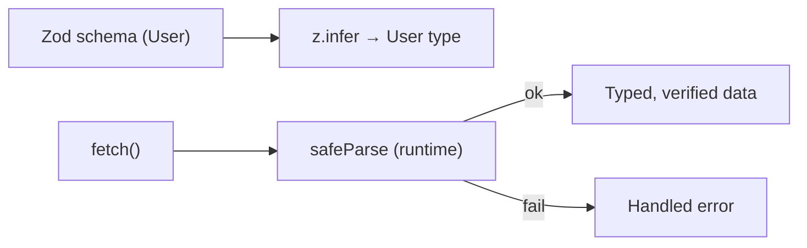

**Steps:**
1. Set up a TS project with `"strict": true`.
2. Define `User`/`Post` as **Zod schemas**; derive types with `z.infer`.
3. Write a generic `fetchJson<T>(url, schema): Promise<T>` that validates responses.
4. Model API states as a **discriminated union** (`loading | success | error`).
5. Add an exhaustive `switch` with a `never` check.

**Learn:** basic types, generics, Zod, discriminated unions, the runtime gap.

---

### Project 2: Type-Safe Utility Library with Generics (Intermediate→Senior)

**Goal:** Publish a small library with great inference and shipped types.

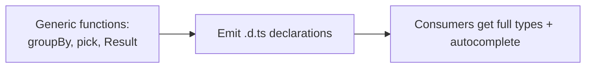

**Steps:**
1. Implement generic utilities: `groupBy<T, K>`, `pick<T, K extends keyof T>`, a `Result<T, E>` type (discriminated union for error handling).
2. Use **constraints**, `keyof`, indexed access, and conditional types.
3. Enable `"declaration": true`; emit `.d.ts`.
4. Add utility-type transforms (`Partial`, `Omit`) in the public API.
5. Test types with `tsd` or `@ts-expect-error` assertions.

**Learn:** advanced generics, keyof/mapped/conditional types, declaration files, library ergonomics.

---

### Project 3: Full-Stack End-to-End Type Safety (Senior)

**Goal:** Share types across a [[07 Hono]]/[[05 Node.js]] backend and a [[08 React]] frontend.

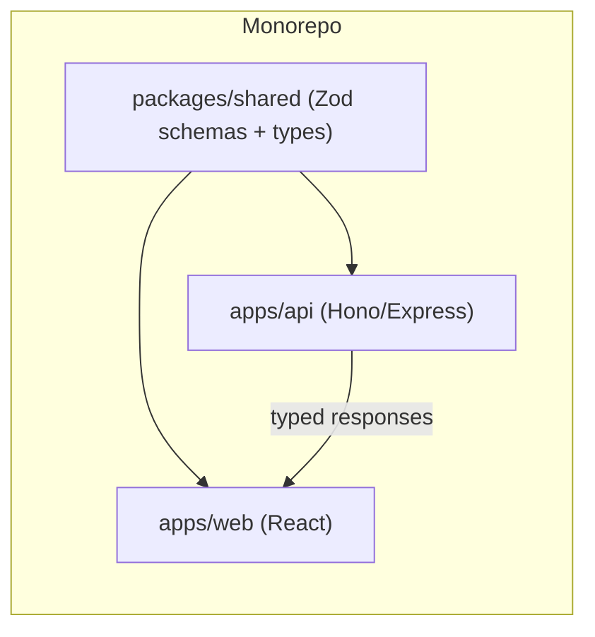

**Steps:**
1. Monorepo with a shared package of **Zod schemas + inferred types**.
2. Backend ([[07 Hono]]/[[06 Express.js]]) validates input/output with the shared schemas.
3. Frontend ([[08 React]] + [[12 TanStack Query]]) consumes the same types — typed hooks.
4. (Optional) Wire up **tRPC** for zero-codegen end-to-end inference.
5. Rename a field in a shared schema → watch **both** apps fail to compile.

**Learn:** shared types, end-to-end safety, Zod contracts, monorepo, tRPC.

---

## 7. 🔬 DEEP DIVE: INTERNALS

### 7.1 How the Compiler Works

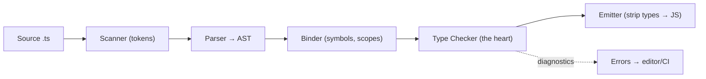

- **Scanner** → tokens; **Parser** → Abstract Syntax Tree; **Binder** → builds symbol tables (what names refer to).
- **Checker** — the massive core: infers and verifies types, resolves generics, evaluates conditional/mapped types.
- **Emitter** — erases types and emits JS (+ optional `.d.ts`, source maps).
- The same compiler powers the **Language Service** that your editor uses for autocomplete, hover, refactor, and go-to-definition in real time.

> [!IMPORTANT]
> The TypeScript **Language Service** (not just the compiler) is why the editing experience is so good — it's an incremental, in-memory type checker that answers "what type is this?", "where is this defined?", "what can I autocomplete here?" as you type. When people say "TypeScript's tooling," this is it. (Microsoft is rewriting the compiler in **Go** — "TypeScript 7 / tsgo" — for ~10× faster checks on large codebases.)

### 7.2 Structural Typing Under the Hood

```typescript
interface Point { x: number; y: number; }
function log(p: Point) { /* ... */ }

const vec = { x: 1, y: 2, z: 3 };
log(vec);   // ✅ has x and y → structurally a Point (extra z is fine)

// But object LITERALS get "excess property checks":
log({ x: 1, y: 2, z: 3 });  // ❌ excess property z (only for fresh literals)
```

> [!TIP]
> TS is **structural**: types are compatible if their *shapes* match, regardless of names — great for flexibility and duck typing. The exception is **excess property checking** on fresh object literals (catches typos like `{ colour: "red" }` when you meant `color`). To get **nominal**-like behavior (prevent a `UserId` string being used as an `OrderId`), use **branded types**: `type UserId = string & { readonly __brand: "UserId" }`.

### 7.3 Type Widening, Narrowing & Literal Types

```typescript
let x = "hello";        // widened to string (let can change)
const y = "hello";      // narrowed to "hello" (literal type; const can't change)

let z = "hello" as const;  // "hello" literal even with let

// Control-flow narrowing
function f(x: string | null) {
  if (!x) return;      // x narrowed to string after this
  x.toUpperCase();     // ✅ safe
}
```

The compiler tracks types through **control flow** — after an `if (typeof x === "string")`, `x` is `string` in that branch. `const` and `as const` produce narrow **literal types**; `let` **widens** to the base type.

### 7.4 Declaration Files & the Type Ecosystem

```typescript
// math-lib.d.ts — types for a JS library (no implementation)
declare module "math-lib" {
  export function add(a: number, b: number): number;
  export const PI: number;
}

// Global augmentation
declare global {
  interface Window { myApp: { version: string }; }
}
```

- `.d.ts` files describe types **without** implementation — how JS libraries provide types.
- **DefinitelyTyped** (`@types/*`) is a huge community repo of declaration files for thousands of JS packages.
- **Declaration merging** lets you augment existing interfaces (e.g., add a property to Express's `Request`).

### 7.5 Variance, `infer`, and Type-Level Computation

```typescript
// infer captures a type inside a conditional type
type ReturnOf<T> = T extends (...args: any[]) => infer R ? R : never;
type Flatten<T> = T extends Array<infer Item> ? Item : T;

// Recursive type-level computation
type DeepReadonly<T> = {
  readonly [K in keyof T]: T[K] extends object ? DeepReadonly<T[K]> : T[K];
};
```

> [!IMPORTANT]
> `infer` is the mechanism that lets conditional types **destructure and capture** pieces of other types — extract a function's return type, an array's element type, a promise's resolved type. Combined with **recursion**, this makes the type system a full (if awkward) programming language operating purely at compile time. This is the machinery behind "magic" library types. As a senior, you read and occasionally write these; the discipline is knowing when the complexity is worth it versus when a simpler type (or a bit of `any` at a well-contained boundary) is the pragmatic choice.

---

## ✅ Production Checklists

### Config
- [ ] `"strict": true` (non-negotiable)
- [ ] `noUncheckedIndexedAccess`, `noImplicitReturns`, `noUnusedLocals`
- [ ] `tsc --noEmit` as a **separate CI type-check** step
- [ ] `noEmitOnError` (or CI gate) so type errors block builds
- [ ] Source maps for debugging; `declaration: true` for libraries
- [ ] Path aliases + consistent `moduleResolution`

### Code Quality
- [ ] **No `any`** (`noImplicitAny`); use `unknown` + narrowing
- [ ] Runtime validation (**Zod**) at all trust boundaries
- [ ] `@ts-expect-error` (not `@ts-ignore`); no `as any`
- [ ] Discriminated unions + exhaustiveness (`never`) checks
- [ ] Shared types between front/back where applicable
- [ ] Prefer string-literal unions / `as const` over `enum`
- [ ] ESLint with `@typescript-eslint` (typed lint rules)

### Tooling & Ops
- [ ] `@types/*` for untyped deps; write `.d.ts` where missing
- [ ] Fast transpile (esbuild/swc/Vite) + separate type-check
- [ ] `skipLibCheck` / project references for large monorepos
- [ ] Consistent formatter (Prettier)
- [ ] Type tests for public library APIs (`tsd`/`expect-type`)

---

## 🗺️ Learning Roadmap

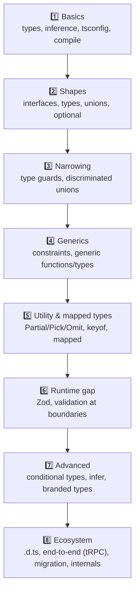

| Stage | Focus | You can... |
|---|---|---|
| 1–3 | Basics + narrowing | Write safe typed code, model unions |
| 4–5 | Generics + utility types | Build reusable, DRY type-safe APIs |
| 6–7 | Runtime + advanced types | Handle real data safely; read library types |
| 8 | Ecosystem + internals | Ship typed libs, full-stack type safety |

---

## 🔁 Self-Review Completion Loop

Reviewed against the official TypeScript Handbook, best practices, edge cases, interview patterns, and production scenarios.

### Gap Review Matrix

| Dimension | Covered? | Where |
|---|---|---|
| What/why, TS vs JS | ✅ | §1 |
| Basic types (any/unknown/never/void) | ✅ | §2.1 |
| Type inference | ✅ | §2.2 |
| Interfaces vs types | ✅ | §2.3 |
| Unions/intersections + narrowing | ✅ | §2.4 |
| Generics | ✅ | §2.5, §3.5 |
| tsconfig & strict mode | ✅ | §2.6 |
| Compilation pipeline | ✅ | §2.7, §7.1 |
| Utility types | ✅ | §3.1 |
| Mapped & conditional types | ✅ | §3.2 |
| Type guards & assertion functions | ✅ | §3.3 |
| keyof/typeof/indexed access | ✅ | §3.4 |
| Runtime gap + Zod | ✅ | §3.6 |
| Failure scenarios | ✅ | §3.7 |
| End-to-end type safety / tRPC | ✅ | §4.1 |
| TS in the stack | ✅ | §4.3 |
| JS→TS migration | ✅ | §4.4 |
| Compiler internals | ✅ | §7.1 |
| Structural typing + branded types | ✅ | §7.2 |
| Widening/narrowing/literals/as const | ✅ | §7.3 |
| Declaration files & @types | ✅ | §7.4 |
| infer & type-level computation | ✅ | §7.5 |
| Interview Q&A + mistakes | ✅ | §5 |
| Hands-on projects | ✅ | §6 |

> [!NOTE]
> **Remaining depth to explore independently:** the `satisfies` operator, template literal types in depth, variance annotations (`in`/`out`), decorators (TC39 + `experimentalDecorators`, used by NestJS/Angular), module resolution modes (`node16`/`bundler`), project references & incremental builds, `tsgo` (Go rewrite), and comparing Zod vs valibot vs ArkType for runtime validation.

---

## 📚 Official References

| Resource | URL |
|---|---|
| TypeScript Handbook | https://www.typescriptlang.org/docs/handbook/intro.html |
| Playground (try online) | https://www.typescriptlang.org/play |
| tsconfig Reference | https://www.typescriptlang.org/tsconfig |
| Utility Types | https://www.typescriptlang.org/docs/handbook/utility-types.html |
| Release Notes | https://www.typescriptlang.org/docs/handbook/release-notes/overview.html |
| Type Challenges (practice) | https://github.com/type-challenges/type-challenges |
| DefinitelyTyped (@types) | https://github.com/DefinitelyTyped/DefinitelyTyped |
| Zod | https://zod.dev/ |
| tRPC | https://trpc.io/ |

---

## 🎁 Final Summary

> [!IMPORTANT]
> **The one-paragraph takeaway:** TypeScript is a **statically-typed superset of JavaScript** that catches type errors at **compile time** and then **erases all types** — the shipped JS is plain JS with zero runtime overhead. Its value is **correctness + world-class tooling** at scale: annotate boundaries and let **inference** do the rest, model data with **interfaces, unions, and discriminated unions**, write reusable code with **generics**, transform types with **utility/mapped/conditional types**, and always run with **`strict: true`**. The defining senior insight is the **runtime gap** — types don't exist at runtime, so validate untrusted data at every trust boundary with **Zod** (schema once → runtime check + inferred type). Avoid `any` (use `unknown` + narrowing), never trust `as` on external data, and remember type-checking (`tsc --noEmit`) is separate from transpilation. Combined with [[08 React]] and [[05 Node.js]], TS enables **end-to-end type safety** that makes large codebases refactorable and teams productive.

**Golden rules:**
1. 🔒 Always enable **`strict: true`** — it's most of the value.
2. 🚫 Avoid **`any`**; use **`unknown`** and narrow.
3. 🧠 Type the **boundaries**, let **inference** handle the interior.
4. 🎭 Model "one of many shapes" with **discriminated unions** + exhaustiveness checks.
5. ♻️ Reuse with **generics** and **utility types** — define once, derive the rest.
6. 🌐 Types are **erased** — validate external data at runtime with **Zod**.
7. ⚠️ `as` is an assertion, not a check — prefer **type guards / validation**.
8. 🔧 Type-check (`tsc --noEmit`) separately from bundling; block builds on errors.

---

*Related guides in this vault: [[01 JavaScript]] · [[08 React]] · [[09 React Hooks]] · [[05 Node.js]] · [[06 Express.js]] · [[07 Hono]] · [[12 TanStack Query]] · [[11 Redux Toolkit and RTK Query]]*
