# ⚡ JavaScript & Node.js Concurrency — Complete Beginner-to-Expert Reference

> How a **single-threaded** language handles thousands of concurrent operations — the event loop, callbacks/Promises/async-await, **libuv**, the thread pool, worker threads, and exactly how the browser's and Node.js's architectures differ.

---

## 📑 Table of Contents

1. [Executive Summary](#-executive-summary)
2. [Fundamentals (Beginner)](#1--fundamentals-beginner-level)
3. [Core Concepts (Intermediate)](#2--core-concepts-intermediate-level)
4. [Advanced Concepts (Senior)](#3--advanced-concepts-senior-level)
5. [Real-World System Design](#4--real-world-system-design-usage)
6. [Interview Preparation](#5--interview-preparation)
7. [Hands-On Projects](#6--hands-on-projects)
8. [Deep Dive: Internals](#7--deep-dive-internals)
9. [Production Checklists](#-production-checklists)
10. [Learning Roadmap](#-learning-roadmap)
11. [Self-Review Completion Loop](#-self-review-completion-loop)
12. [Official References](#-official-references)
13. [Final Summary](#-final-summary)

---

## 🎯 Executive Summary

JavaScript is **single-threaded** — it runs your code on **one** call stack. Yet a Node.js server handles tens of thousands of concurrent connections, and a browser stays responsive while fetching data. The secret is the **event loop**: an architecture that offloads slow operations (I/O, timers, network) to the environment and processes their results as callbacks when the single thread is free. This is **concurrency without parallelism** — and it's the polar opposite of the [[04 Java Concurrency and JVM]] thread-per-task model.

| What it is | What it replaces | Core superpower |
|---|---|---|
| Single-threaded, event-driven, non-blocking I/O | Thread-per-request blocking servers | **Massive I/O concurrency on one thread** — no locks, no race conditions on shared memory |

> [!IMPORTANT]
> The single most important idea: **JavaScript itself is single-threaded, but its runtime environment is not.** Your JS code runs on one thread with one call stack — but the **environment** (the browser or Node.js, powered by **libuv** in Node) provides Web APIs / C++ threads that handle slow work *in the background*. When that work finishes, its callback is queued and the event loop runs it when the stack is empty. So JS achieves *concurrency* (managing many operations) without *parallelism* (running JS in parallel) — the exact inverse of [[04 Java Concurrency and JVM]], where you spin up many threads that truly run at once. This is why JS has **no locks, no `synchronized`, no data races** on your variables — but also why a single **CPU-heavy task blocks everything**.

Related guides: [[01 JavaScript]] · [[05 Node.js]] · [[04 Java Concurrency and JVM]] · [[03 TypeScript]] · [[06 Express.js]] · [[05 WebSockets]] · [[01 System Design Fundamentals]]

---

## 1. 🌱 FUNDAMENTALS (Beginner Level)

### What does "single-threaded" actually mean?

JavaScript has **one call stack** — one place where functions execute, one at a time, top to bottom. There is no second thread running your JS code simultaneously. If a function is running, nothing else JS can run until it returns.

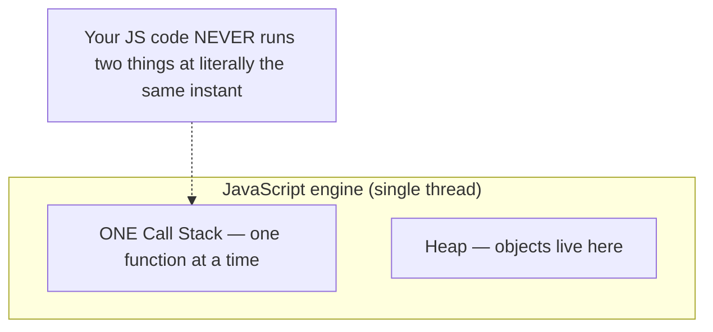

### The problem: what about slow things?

If JS is single-threaded and blocking, how does `fetch()` a network request not freeze the whole page for 2 seconds? The answer: **it doesn't run the wait on the JS thread.** Slow operations are handed off to the environment.

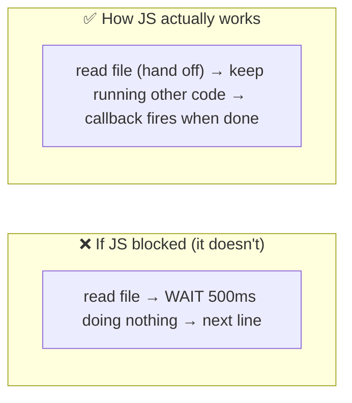

> [!IMPORTANT]
> This is the crux of **non-blocking I/O**. In a blocking model ([[04 Java Concurrency and JVM]] traditional threads), a thread that reads a file *sits idle* until the disk responds — so you need many threads to handle many requests. In JavaScript's **non-blocking** model, the single thread *initiates* the I/O, hands it to the environment, and immediately moves on to other work. When the I/O completes, a **callback** is scheduled. One thread thus juggles thousands of in-flight operations because it never waits — it only reacts to completions. This is the entire reason Node.js excels at I/O-heavy workloads (APIs, proxies, real-time) with tiny resource usage.

### Synchronous vs Asynchronous

```javascript
// Synchronous (blocking) — each line waits for the previous
const data = fs.readFileSync('big.txt');  // ⛔ freezes thread until done
console.log(data);
console.log('after');   // runs only after file is fully read

// Asynchronous (non-blocking) — hand off, continue, react later
fs.readFile('big.txt', (err, data) => {   // ✅ callback runs LATER
  console.log(data);
});
console.log('after');   // runs IMMEDIATELY, before the file is read
```

### The core mental model

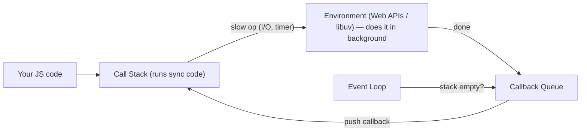

| Term | Plain meaning |
|---|---|
| **Call Stack** | Where JS runs functions (one at a time) |
| **Event Loop** | The coordinator that feeds callbacks to the stack |
| **Callback Queue** | Waiting callbacks (from completed async ops) |
| **Web APIs / libuv** | The environment that does slow work in the background |
| **Non-blocking I/O** | Start slow work, don't wait, react on completion |
| **Concurrency** | Managing many operations over time (JS does this) |
| **Parallelism** | Running many operations at the same instant (JS code does NOT) |

### Real-world analogy 👨‍🍳

A single chef (the JS thread) in a kitchen:
- The chef puts a cake in the **oven** (hands off I/O to the environment) and **doesn't stand there watching** — he chops vegetables for the next order (keeps running code).
- A **timer dings** when the cake is done (callback queued); the chef finishes his current chop (current stack), then handles the cake (runs the callback).
- **One chef** serves many dishes concurrently *because he never idly waits* — but he can only do **one thing at a time** with his hands (single call stack).
- If the chef has to hand-knead dough for 10 minutes straight (a **CPU-heavy task**), every other order stalls — the kitchen freezes. That's why you offload heavy compute to a **worker** (a second chef).

> [!TIP]
> Internalize this: **JavaScript concurrency is about *not waiting*, not about *doing many things at once*.** The single thread stays busy by offloading waits. This model gives you enormous I/O concurrency for free — and, unlike [[04 Java Concurrency and JVM]], **zero locking bugs on your data** (no two pieces of JS touch a variable simultaneously). The trade-off: **CPU-bound work blocks the one thread**, so you must offload it (Worker Threads / child processes).

---

## 2. 🧩 CORE CONCEPTS (Intermediate Level)

### 2.1 The Event Loop (browser model)

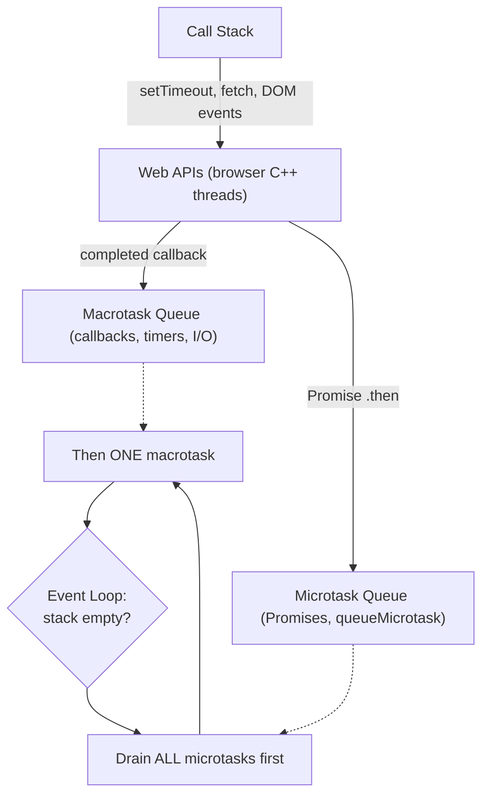

> [!IMPORTANT]
> **The event loop's rule: when the call stack is empty, drain the *entire* microtask queue, then take *one* macrotask, then drain microtasks again, repeat.** **Macrotasks**: `setTimeout`, `setInterval`, I/O callbacks, UI events. **Microtasks**: Promise `.then/.catch/.finally`, `queueMicrotask`, `await` continuations. Microtasks have **higher priority** — they run *before* the next macrotask and even before the browser repaints. This is why a `Promise.resolve().then()` fires before a `setTimeout(…, 0)`. Understanding macro vs micro ordering is *the* classic JS interview question (§5).

### 2.2 Callbacks → Promises → async/await

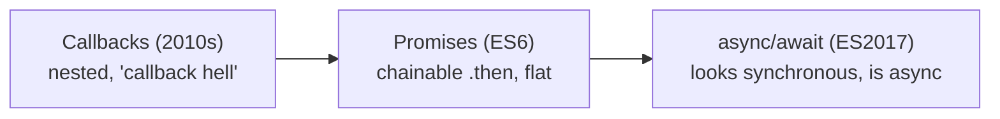

```javascript
// 1. Callback (pyramid of doom)
getUser(id, (u) => getOrders(u, (o) => getItems(o, (i) => render(i))));

// 2. Promise (flat chain)
getUser(id).then(getOrders).then(getItems).then(render).catch(handleErr);

// 3. async/await (reads like sync, still non-blocking)
async function load() {
  try {
    const u = await getUser(id);
    const o = await getOrders(u);
    render(await getItems(o));
  } catch (e) { handleErr(e); }
}
```

> [!TIP]
> **`async/await` is syntactic sugar over Promises, not a new concurrency model.** An `async` function returns a Promise; `await` *pauses that function* and schedules the rest as a microtask continuation when the awaited Promise resolves — **without blocking the thread**. The event loop keeps running everything else meanwhile. Key insight: `await` doesn't make code synchronous or block the thread — it just lets you *write* async code that *reads* top-to-bottom. This is why you can't `await` at the top level of old scripts (only inside `async`) and why forgetting `await` is a silent bug (you get a Promise, not the value).

### 2.3 Running things concurrently vs sequentially

```javascript
// ❌ Sequential — 3 awaits in a row = sum of all times (e.g., 300ms)
const a = await fetchA();  // 100ms
const b = await fetchB();  // 100ms
const c = await fetchC();  // 100ms

// ✅ Concurrent — start all, then await together (~100ms, the slowest)
const [a, b, c] = await Promise.all([fetchA(), fetchB(), fetchC()]);
```

| Combinator | Behavior |
|---|---|
| **`Promise.all`** | All succeed → array; any reject → rejects immediately |
| **`Promise.allSettled`** | Waits for all; returns status of each (never short-circuits) |
| **`Promise.race`** | First to settle (resolve OR reject) wins |
| **`Promise.any`** | First to *succeed* wins; rejects only if all fail |

> [!WARNING]
> **A very common performance bug: awaiting independent operations sequentially.** If `fetchA/B/C` don't depend on each other, `await`-ing them one by one triples the latency. Kick them off together with **`Promise.all`** so they run concurrently in the background (the environment handles them in parallel even though your JS is single-threaded — because the *I/O* is parallel, not the JS). Use `allSettled` when you want all results regardless of failures, `race`/`any` for timeouts and fastest-wins patterns.

### 2.4 The Node.js Architecture

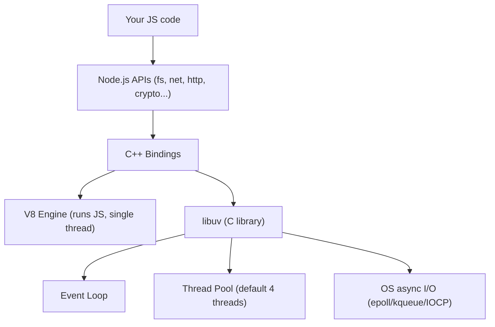

> [!IMPORTANT]
> Node.js = **V8** (Google's JS engine, runs your JavaScript) + **libuv** (a C library providing the event loop, the thread pool, and cross-platform async I/O) + Node's **C++ bindings and standard library**. When you call `fs.readFile`, Node delegates through C++ bindings to **libuv**, which either uses the **OS's native async I/O** (for network sockets — `epoll` on Linux, `kqueue` on macOS, IOCP on Windows) or its **thread pool** (for things without OS async support — file I/O, DNS, crypto). Results flow back through libuv's event loop as callbacks. So Node is *single-threaded for your JS* but *multi-threaded under the hood* via libuv — a crucial distinction that surprises many.

### 2.5 The browser vs Node.js — same idea, different engine

| Aspect | Browser | Node.js |
|---|---|---|
| JS engine | V8 (Chrome), SpiderMonkey (FF) | V8 |
| Async provider | **Web APIs** (DOM, fetch, timers) | **libuv** (event loop + thread pool) |
| Event loop phases | Simplified (macro/micro) | 6 distinct phases (timers, poll, check...) |
| Extra queue | — | `process.nextTick` (before microtasks) |
| Global object | `window` | `global` / `globalThis` |
| Concurrency escape hatch | **Web Workers** | **Worker Threads**, `child_process`, `cluster` |
| I/O focus | DOM, network | Files, network, streams |

> [!TIP]
> The **event loop concept is the same** in both, but the *implementation* differs. The browser's async capabilities come from **Web APIs** (provided by the browser's C++). Node's come from **libuv**. Node's event loop is more elaborate — **6 phases** (§3.1) — and adds `process.nextTick` (runs even before Promise microtasks). If you deeply understand one, you understand the other; just know the environment-specific details for interviews.

---

## 3. ⚙️ ADVANCED CONCEPTS (Senior Level)

### 3.1 The Node.js Event Loop — 6 Phases

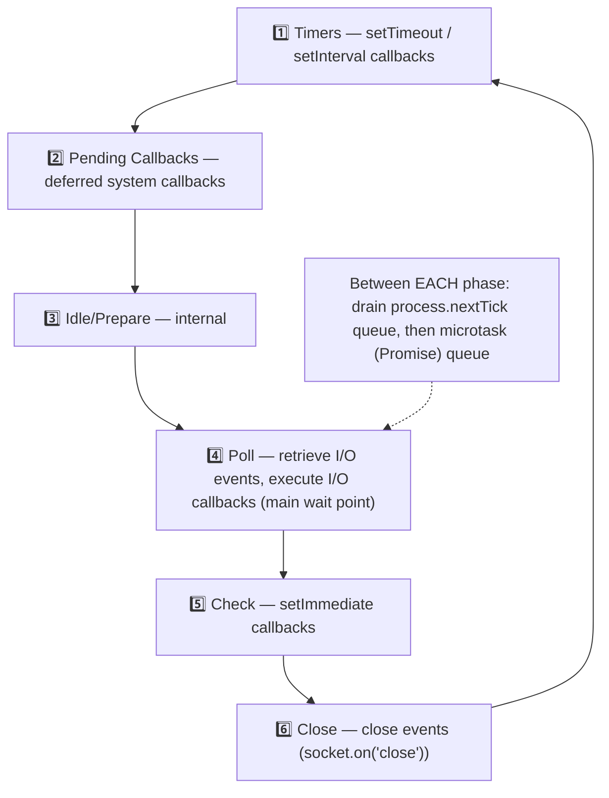

> [!IMPORTANT]
> Node's event loop cycles through **six phases**, each with its own callback queue. The most important is the **poll phase**, where I/O callbacks run and where the loop *blocks waiting* for new I/O if there's nothing else to do. **`setImmediate`** fires in the **check** phase (right after poll), while **`setTimeout(…,0)`** fires in the **timers** phase (next tick) — which is why their ordering can be nondeterministic at the top level but deterministic inside an I/O callback (setImmediate always wins there). Crucially, **`process.nextTick` and Promise microtasks drain between every phase**, with `nextTick` having the *highest* priority of all. This phase model is heavy senior Node interview material.

### 3.2 The libuv Thread Pool

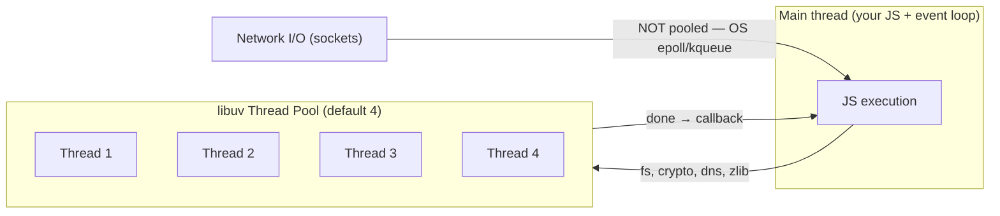

> [!WARNING]
> A subtle but critical point: **not all async work uses the thread pool.** **Network I/O** (TCP/HTTP sockets) uses the OS's native async mechanisms (`epoll`/`kqueue`/IOCP) directly — *no thread pool needed*, which is why Node scales to huge connection counts. But **file system operations, DNS lookups (`dns.lookup`), crypto (`pbkdf2`, `bcrypt`), and zlib compression** run on **libuv's thread pool** — which defaults to only **4 threads** (`UV_THREADPOOL_SIZE`, max 1024). If you fire many concurrent `crypto.pbkdf2` or file operations, they **queue behind those 4 threads**, creating surprising latency. Tuning `UV_THREADPOOL_SIZE` or offloading is a real production concern. This distinction — OS-async network vs thread-pooled fs/crypto — is a senior-level "gotcha."

### 3.3 Worker Threads — true parallelism for CPU work

```javascript
// main.js — offload CPU-heavy work so the event loop stays free
const { Worker } = require('worker_threads');
const worker = new Worker('./heavy.js', { workerData: { n: 40 } });
worker.on('message', (result) => console.log('done:', result));
worker.postMessage({ start: true });
```

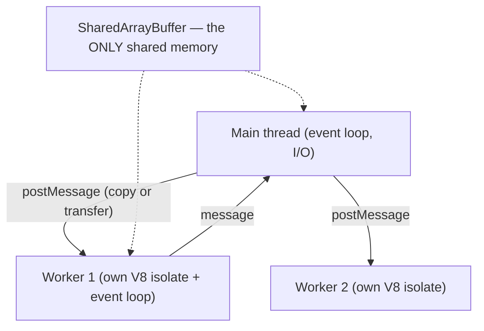

> [!IMPORTANT]
> When you have genuinely **CPU-bound work** (image processing, big computations, parsing) that would block the single event loop, **Worker Threads** (Node 12+) give you **real parallelism**. Each worker is a *separate V8 isolate with its own event loop and memory* — so this is closer to [[04 Java Concurrency and JVM]] threads. But the design is **share-nothing by default**: workers communicate via **message passing** (`postMessage`), and data is **copied** (structured clone) or **transferred** (ownership moves, e.g., `ArrayBuffer`). The *only* truly shared memory is a **`SharedArrayBuffer`** — and *that's* the one place JavaScript reintroduces data races (needing `Atomics` for coordination). For most CPU offloading, message-passing workers keep you safe from the locking hazards Java developers wrestle with.

### 3.4 Worker Threads vs child_process vs Cluster

| Mechanism | What it is | Use for |
|---|---|---|
| **Worker Threads** | Threads in one process, shared-nothing + optional SharedArrayBuffer | CPU-bound work, low overhead |
| **child_process** | Separate OS processes (`spawn`/`fork`/`exec`) | Running external commands, isolation |
| **Cluster** | Fork multiple Node processes sharing a port | Scaling an HTTP server across CPU cores |

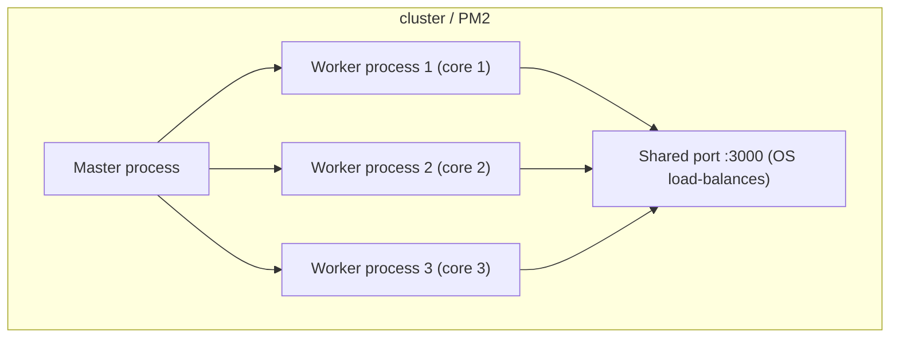

> [!TIP]
> Because one Node process uses **one CPU core** for JS, to use a multi-core machine for an HTTP server you run **multiple processes** via the **cluster** module (or a manager like **PM2**), each handling requests on the same port with OS-level load balancing. Use **Worker Threads** for CPU-bound *computation* within an app, **cluster/child_process** for *scaling the whole server* across cores. In containerized [[02 Kubernetes]] deployments, the common pattern is actually one Node process per container and let the orchestrator scale replicas — often simpler than cluster.

### 3.5 Blocking the Event Loop — the cardinal sin

```javascript
// ❌ This freezes the ENTIRE server for everyone during the loop
app.get('/hash', (req, res) => {
  let result = 0;
  for (let i = 0; i < 1e10; i++) result += i;  // blocks event loop!
  res.json({ result });
});
// While this runs, NO other request is handled. The whole app hangs.
```

> [!WARNING]
> **The #1 Node.js production killer: blocking the event loop.** Because *all* requests share the *one* thread, any synchronous CPU-heavy or blocking operation — a giant loop, `JSON.parse` of a huge payload, synchronous `fs.readFileSync`, a bad regex (ReDoS), `bcrypt` sync — **freezes every concurrent request** until it finishes. There are no other threads to pick up the slack (unlike [[04 Java Concurrency and JVM]]). Defenses: use **async APIs** (never the `…Sync` versions in request handlers), offload CPU work to **Worker Threads**, paginate/stream large data, and monitor **event loop lag** ([[02 Observability]]). "Don't block the event loop" is the golden rule of Node.

### 3.6 Failure Scenarios & Async Bugs

| Bug | Cause | Fix |
|---|---|---|
| **Unhandled Promise rejection** | Missing `.catch` / try-catch on await | Always handle; `process.on('unhandledRejection')` |
| **Blocked event loop** | Sync CPU work in handler | Async APIs, Worker Threads |
| **Sequential awaits** | `await` independent ops in series | `Promise.all` |
| **Forgotten `await`** | Using a Promise as a value | Lint rules, TypeScript ([[03 TypeScript]]) |
| **Callback called twice / never** | Manual callback bugs | Promisify; use async/await |
| **Thread pool saturation** | Many fs/crypto ops, pool=4 | Tune `UV_THREADPOOL_SIZE`, offload |
| **Memory leak** | Growing closures/listeners/caches | Profile heap; remove listeners |
| **Zalgo (sync/async mix)** | Callback sometimes sync, sometimes async | Always call back asynchronously |

> [!WARNING]
> **Unhandled promise rejections** are especially dangerous: an async error with no `.catch`/`try-catch` used to silently vanish and now (modern Node) **crashes the process** by default. Every Promise chain needs error handling, and every `await` should be in a `try/catch` or have a `.catch` on the returned promise. Combine with a top-level `process.on('unhandledRejection')` handler as a safety net (log + graceful shutdown), never to silently swallow.

---

## 4. 🏗️ REAL-WORLD SYSTEM DESIGN USAGE

### 4.1 Why Node.js dominates I/O-heavy services

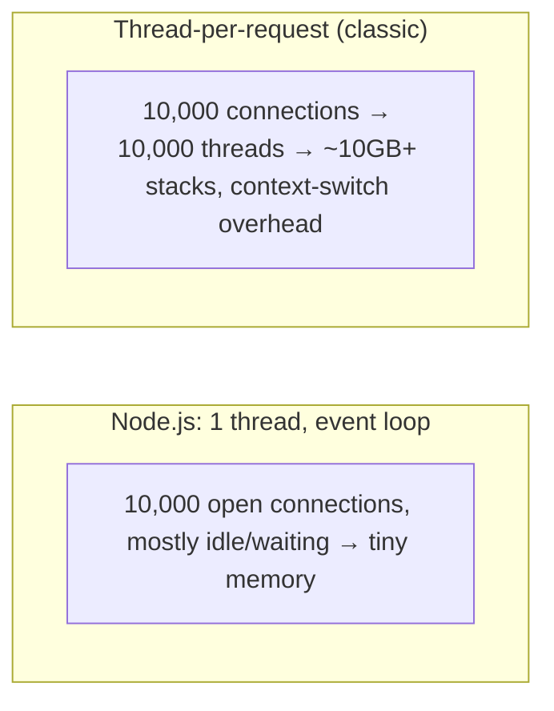

> [!IMPORTANT]
> Node.js is ideal for **I/O-bound, high-concurrency** workloads — API gateways, real-time apps ([[05 WebSockets]]), streaming proxies, BFFs — because the event loop juggles thousands of mostly-waiting connections on one thread with minimal memory. A classic thread-per-request server ([[04 Java Concurrency and JVM]] pre-virtual-threads) needs a thread (≈1MB stack) *per* connection, hitting memory and context-switch limits. **The flip side**: Node is a *poor* choice for **CPU-bound** work (video encoding, ML, heavy computation) — that single thread becomes the bottleneck, and you'd reach for Worker Threads or a different runtime. Interestingly, Java's new **virtual threads** ([[04 Java Concurrency and JVM]] §3.5) now bring event-loop-like I/O scalability to the blocking thread model — converging the two worlds.

### 4.2 A request's async journey through Express

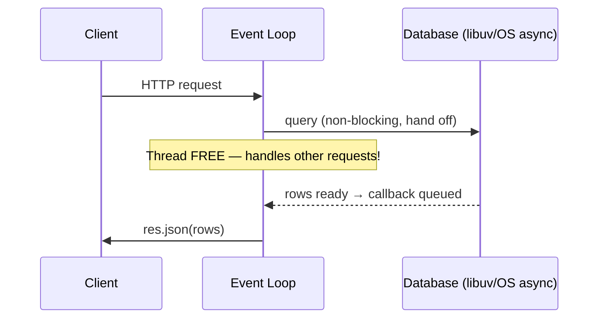

In [[06 Express.js]], a handler that `await`s a DB query doesn't block — the event loop serves other requests during the wait, then resumes this one when the DB responds. That's how one Node process serves thousands of concurrent requests.

### 4.3 Real-time systems

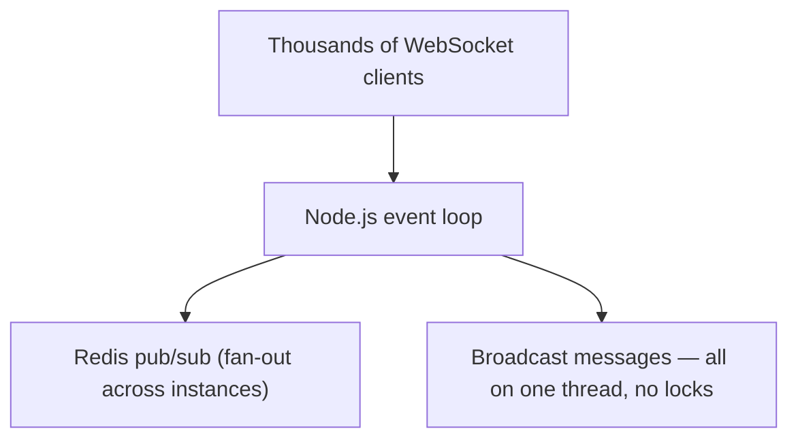

Node's event-driven model is a natural fit for [[05 WebSockets]] chat, live dashboards, and collaborative apps — thousands of persistent connections, each mostly idle, handled event-by-event. Scale horizontally with [[04 Redis]] pub/sub across instances.

### 4.4 Node.js vs Java — the architectural contrast

| Dimension | Node.js | Java ([[04 Java Concurrency and JVM]]) |
|---|---|---|
| Threading | Single-threaded event loop | Multi-threaded (thread-per-task) |
| I/O model | Non-blocking, event-driven | Blocking (classic) / reactive / virtual threads |
| Concurrency unit | Callback / Promise / task | Thread |
| Shared state hazards | **None** on JS data (single thread) | Races, deadlocks, visibility (JMM) |
| CPU-bound work | Weak — blocks loop (needs Workers) | Strong — real parallel threads |
| I/O-bound scale | Excellent (few resources) | Good (esp. with virtual threads now) |
| Memory per connection | Tiny | ~1MB/thread (classic), tiny (virtual) |
| Mental model | "Don't block the loop" | "Coordinate shared state safely" |

> [!TIP]
> This table is a frequent senior interview discussion. The elegant summary: **Node trades away CPU parallelism to eliminate the entire class of shared-memory concurrency bugs**, betting that most web workloads are I/O-bound. Java embraces true multithreading (with all its locking complexity) for CPU parallelism and now matches Node's I/O scalability with virtual threads. Neither is "better" — they're different bets. Knowing *why* each exists shows architectural maturity.

---

## 5. 🎤 INTERVIEW PREPARATION

### 5.1 Most important questions

<details>
<summary><b>Q1: If JavaScript is single-threaded, how does it handle concurrency?</b></summary>

JS code runs on one thread/call stack, but the **runtime environment** (browser Web APIs / Node's libuv) handles slow operations in the background. When you start async I/O, the thread hands it off and continues running other code. On completion, a callback is queued, and the **event loop** pushes it onto the stack when the stack is empty. So JS achieves *concurrency* (managing many ops) without *parallelism* (JS never runs two things at once). It's non-blocking I/O, not multithreading.
</details>

<details>
<summary><b>Q2: Explain the event loop, macrotasks, and microtasks.</b></summary>

The event loop moves callbacks from queues to the call stack when it's empty. **Macrotasks** (setTimeout, setInterval, I/O, UI events) and **microtasks** (Promise `.then`, `queueMicrotask`, `await` continuations). Rule: after each macrotask (and when the stack empties), drain **all** microtasks before the next macrotask. So microtasks have higher priority — `Promise.resolve().then()` runs before `setTimeout(…,0)`. In Node, `process.nextTick` runs before even Promise microtasks.
</details>

<details>
<summary><b>Q3: What is libuv and what does it do?</b></summary>

libuv is the C library powering Node's async model. It provides: (1) the **event loop** (6 phases), (2) a **thread pool** (default 4 threads) for operations without OS async support — file I/O, DNS, crypto, zlib, and (3) cross-platform **async network I/O** using the OS (epoll/kqueue/IOCP). So Node is single-threaded for your JS but multi-threaded under the hood via libuv. Network I/O uses the OS directly (no pool); fs/crypto use the thread pool.
</details>

<details>
<summary><b>Q4: setTimeout(fn, 0) vs setImmediate vs process.nextTick — order?</b></summary>

`process.nextTick` runs first (before any Promise microtask, between every phase). Then Promise microtasks. `setImmediate` runs in the **check** phase; `setTimeout(…,0)` in the **timers** phase. At the top level their order is nondeterministic, but **inside an I/O callback, `setImmediate` always fires before `setTimeout`** (check phase comes right after poll). Overusing `process.nextTick` can starve the event loop.
</details>

<details>
<summary><b>Q5: How do you run CPU-intensive work without blocking Node?</b></summary>

Offload it. Use **Worker Threads** (Node 12+) for parallel computation — each is a separate V8 isolate communicating via message passing (share-nothing, or SharedArrayBuffer + Atomics). Alternatively **child_process** for external programs, or break work into chunks with `setImmediate` to yield to the loop. Never run heavy sync loops in a request handler — it freezes all requests.
</details>

<details>
<summary><b>Q6: Sequential vs concurrent awaits — what's the bug?</b></summary>

Awaiting independent async operations one-by-one runs them sequentially (sum of latencies). If they don't depend on each other, start them together and await with `Promise.all` — they run concurrently (the I/O overlaps), taking roughly the time of the slowest. Only await sequentially when a later call *depends* on an earlier result.
</details>

<details>
<summary><b>Q7: Is async/await multithreading? Does await block the thread?</b></summary>

No and no. `async/await` is sugar over Promises — still single-threaded. `await` **pauses the async function** and schedules its continuation as a microtask when the awaited Promise settles, but it **does not block the thread** — the event loop keeps running all other code meanwhile. It only makes async code *read* synchronously.
</details>

<details>
<summary><b>Q8: How does Node compare to Java's threading model?</b></summary>

Node: single-threaded event loop, non-blocking I/O, no shared-memory race conditions, weak at CPU work. Java: multi-threaded, true parallelism, powerful for CPU work but must manage locks/visibility/deadlocks (the JMM). Node scales I/O cheaply with one thread; Java traditionally used a thread per request (now virtual threads match Node's I/O scalability). Node eliminates concurrency bugs by not sharing memory; Java gains parallelism at the cost of coordination complexity. See [[04 Java Concurrency and JVM]].
</details>

### 5.2 Tricky questions

> [!TIP]
> **"What prints? `console.log(1); setTimeout(()=>console.log(2),0); Promise.resolve().then(()=>console.log(3)); console.log(4);`"** — **1, 4, 3, 2.** Sync first (1, 4), then microtasks (3 — the Promise), then macrotasks (2 — the timer). The canonical event-loop question.

> [!TIP]
> **"Does Node.js use threads at all?"** — Yes! Your JS runs on one thread, but **libuv** uses a thread pool (default 4) for fs/crypto/dns/zlib, and network I/O uses OS async. Plus you can create **Worker Threads**. "Single-threaded" refers to JS *execution*, not the whole runtime.

> [!TIP]
> **"Why might 5 concurrent `crypto.pbkdf2` calls have the 5th much slower?"** — The libuv thread pool defaults to **4 threads**. The first 4 run in parallel; the 5th queues until one frees up. Raise `UV_THREADPOOL_SIZE`.

> [!TIP]
> **"Can you have a race condition in Node.js?"** — On *JS variables*, no (single thread — no two statements run simultaneously). But you *can* have **logical race conditions** across async operations (interleaved awaits reading/writing shared state or a database), and *real* memory races only with `SharedArrayBuffer` across Worker Threads (needing `Atomics`).

### 5.3 Common mistakes candidates make

| Mistake | Reality |
|---|---|
| "async/await makes it multithreaded" | Still single-threaded; sugar over Promises |
| "Node is fully single-threaded" | libuv has a thread pool; Worker Threads exist |
| "await blocks the thread" | It yields; the loop keeps running |
| "setTimeout(0) runs immediately" | Queued as a macrotask, after microtasks |
| Sequential awaits for independent ops | Use `Promise.all` |
| Forgetting `.catch`/try-catch | Unhandled rejection → crash |
| Heavy CPU work in a handler | Blocks all requests — offload |
| Using `…Sync` fs in a server | Blocks the event loop |

### 5.4 What interviewers actually expect

- **"Single-threaded but non-blocking"** explained precisely (concurrency vs parallelism).
- **Event loop** mechanics: macro vs microtask ordering, and Node's phases.
- **libuv**: thread pool (fs/crypto) vs OS async (network); the default-4 gotcha.
- **Promises/async-await** internals; `Promise.all` for concurrency.
- **Don't block the event loop** — and how to offload (Worker Threads/cluster).
- The **Node vs Java** architectural contrast ([[04 Java Concurrency and JVM]]).

---

## 6. 🛠️ HANDS-ON PROJECTS

### Project 1: Visualize the Event Loop (Beginner→Intermediate)

**Goal:** *See* macro/microtask ordering with your own eyes.


**Steps:**
1. Write a script mixing `console.log`, `setTimeout(…,0)`, `Promise.resolve().then`, `queueMicrotask`, and (Node) `process.nextTick` and `setImmediate`.
2. **Predict** the output order, then run it — reconcile differences.
3. Repeat the experiment *inside* an `fs.readFile` callback and see how `setImmediate` vs `setTimeout` ordering changes.
4. Explain each result in terms of phases/queues.

**Learn:** event loop, macro vs micro, Node phases, nextTick priority.

---

### Project 2: Blocking vs Non-Blocking Server (Intermediate→Senior)

**Goal:** Feel the event loop freeze — then fix it.

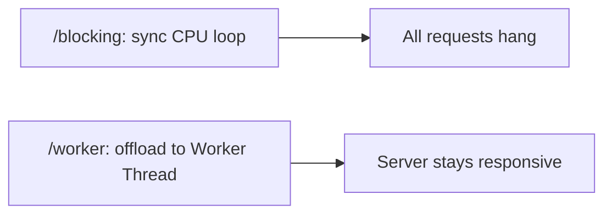

**Steps:**
1. Build an [[06 Express.js]] server with a `/blocking` route doing a heavy sync loop and a `/ping` route.
2. Hit `/blocking`, then `/ping` concurrently — observe `/ping` **freezes** until `/blocking` finishes.
3. Move the heavy work to a **Worker Thread**; verify `/ping` stays instant.
4. Load-test both (autocannon); compare throughput and latency.
5. Add **event loop lag** monitoring.

**Learn:** blocking the loop, Worker Threads, why sync work is dangerous, offloading.

---

### Project 3: Concurrency Patterns & Thread Pool (Senior)

**Goal:** Master `Promise` combinators and the libuv pool.


**Steps:**
1. Fetch 100 URLs sequentially vs with `Promise.all` vs with a **concurrency limiter** (e.g., 10 at a time — like `p-limit`); compare time and resource use.
2. Implement `Promise.all`, `allSettled`, `race`, `any` behaviors from scratch to understand them.
3. Fire many `crypto.pbkdf2` calls; observe the **4-thread pool** bottleneck; raise `UV_THREADPOOL_SIZE` and re-measure.
4. Add a timeout wrapper using `Promise.race`.

**Learn:** concurrency control, backpressure ([[01 System Design Fundamentals]]), thread pool tuning, Promise internals.

---

## 7. 🔬 DEEP DIVE: INTERNALS

### 7.1 V8 — how JS actually executes

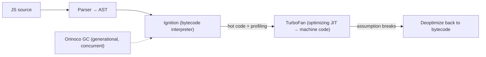

> [!IMPORTANT]
> **V8** compiles JS much like the JVM compiles bytecode ([[04 Java Concurrency and JVM]] §7.2): it parses to an AST, interprets via **Ignition** (bytecode), and **JIT-compiles hot functions** to machine code via **TurboFan**, using runtime profiling — **deoptimizing** if assumptions break (e.g., a variable's "hidden class"/shape changes). This is why *monomorphic* code (consistent object shapes) is fast and why changing object structure hurts. V8 also has a **generational garbage collector** (Orinoco) — a young "new space" (fast scavenging) and old space, with much work done concurrently/incrementally to minimize pauses — conceptually the same generational strategy as the JVM. So under the hood, JS and Java runtimes rhyme; the difference is the *concurrency model layered on top*.

### 7.2 What an `await` compiles to

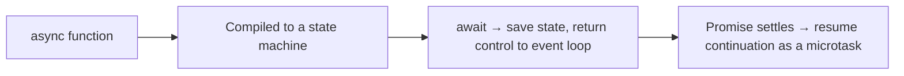

> [!TIP]
> An `async` function is transformed into a **state machine** (like generators). Each `await` is a suspension point: the function's state is saved, control returns to the event loop, and when the awaited Promise resolves, the continuation is scheduled as a **microtask** that resumes the function where it left off. This is why `await` doesn't block — it's cooperative suspension, not a thread park. It also explains why exceptions in awaited code propagate as if synchronous (the state machine re-throws on resume) and why stack traces across awaits historically were tricky (now improved with async stack traces).

### 7.3 libuv internals — the poll phase & OS async

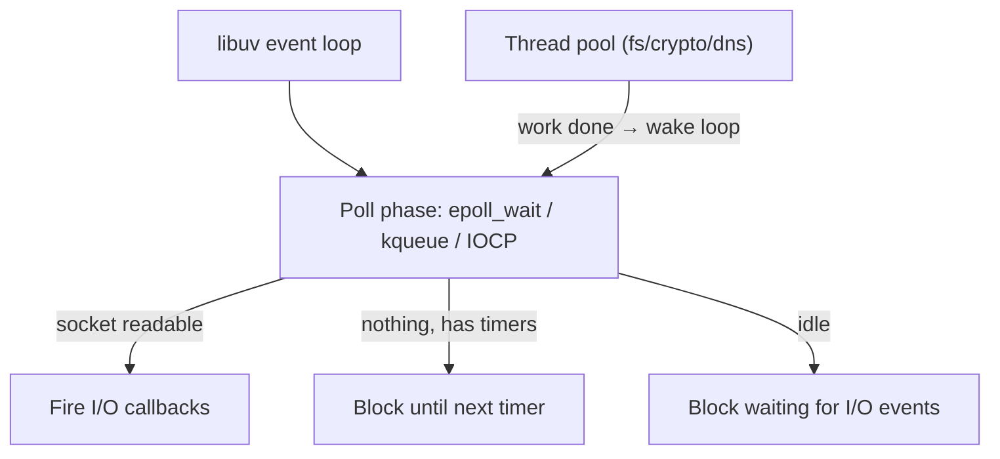

> [!IMPORTANT]
> libuv's genius is unifying platform-specific async I/O (`epoll`, `kqueue`, IOCP, event ports) behind one event loop. In the **poll phase**, the loop calls the OS ("which sockets are ready?") and can **block there efficiently** — the OS wakes it when data arrives, so an idle Node process uses ~zero CPU while holding thousands of connections. Work on the **thread pool** (file/crypto) signals completion back to the loop via an internal async handle that wakes the poll phase. This architecture — OS-level readiness notification for network + a small thread pool for the rest — is *why* one thread scales to enormous I/O concurrency. It's the same epoll/kqueue foundation that high-performance servers like [[05 Nginx]] use.

### 7.4 SharedArrayBuffer & Atomics — JS's only true shared memory

```javascript
// The ONE place JS has real shared-memory concurrency (across workers)
const sab = new SharedArrayBuffer(4);
const view = new Int32Array(sab);
Atomics.add(view, 0, 1);          // atomic increment (like Java's AtomicInteger)
Atomics.wait(view, 0, 0);         // block until value changes (worker coordination)
Atomics.notify(view, 0, 1);       // wake a waiting worker
```

> [!WARNING]
> **`SharedArrayBuffer` reintroduces everything JS normally protects you from.** Passed between Worker Threads, it's *actual shared memory* — so two workers writing it concurrently can race, exactly like [[04 Java Concurrency and JVM]]. The **`Atomics`** object provides atomic operations (`add`, `compareExchange`, `wait`, `notify`) — JS's equivalent of CAS/atomics and even a primitive lock/condition — to coordinate safely. This is advanced, niche territory (high-performance parallel compute, WASM threading), but it's the answer to "can JavaScript *ever* have a data race?": yes, precisely here. For 99% of Node code you never touch it, which is the whole point of the single-threaded model.

### 7.5 Streams & Backpressure

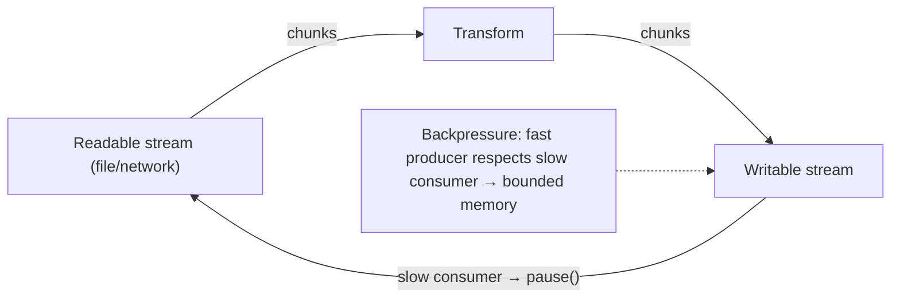

> [!TIP]
> Node **streams** are the idiomatic way to process data that's too big to hold in memory (files, HTTP bodies, uploads) — processing it in **chunks** as it flows. The key concept is **backpressure**: if a slow consumer (writable) can't keep up with a fast producer (readable), the stream signals *pause*, preventing unbounded memory growth. `pipe()`/`pipeline()` handle this automatically. This is the same backpressure principle as bounded queues in [[04 Java Concurrency and JVM]] thread pools and [[01 Kafka]] consumers — flow control so a fast source doesn't overwhelm a slow sink. Getting streams and backpressure right is a hallmark of production-grade Node.

---

## ✅ Production Checklists

### Async Correctness
- [ ] Every Promise chain has error handling (`.catch` / try-catch)
- [ ] `process.on('unhandledRejection')` + `uncaughtException` safety nets (log + graceful exit)
- [ ] Independent async ops use `Promise.all` (not sequential awaits)
- [ ] No forgotten `await` (lint + [[03 TypeScript]] help)
- [ ] Timeouts on external calls (`Promise.race` / AbortController)

### Don't Block the Event Loop
- [ ] No `…Sync` fs calls in request handlers
- [ ] CPU-heavy work offloaded to **Worker Threads**
- [ ] Large payloads streamed/paginated, not loaded whole
- [ ] Regexes checked for ReDoS
- [ ] **Event loop lag** monitored ([[02 Observability]])

### Scaling & Resources
- [ ] **cluster**/PM2 or K8s replicas to use all cores
- [ ] `UV_THREADPOOL_SIZE` tuned if heavy fs/crypto/dns
- [ ] Streams + backpressure for large data
- [ ] Graceful shutdown (drain connections, close server)
- [ ] Memory profiled for leaks (listeners, closures, caches)

---

## 🗺️ Learning Roadmap

```mermaid
flowchart TB
    A["1️⃣ Single-threaded model<br/>sync vs async, call stack"] --> B["2️⃣ Event loop<br/>callbacks, macro/micro tasks"]
    B --> C["3️⃣ Promises & async/await<br/>chaining, Promise.all, errors"]
    C --> D["4️⃣ Node architecture<br/>V8 + libuv, thread pool"]
    D --> E["5️⃣ Event loop phases<br/>nextTick, setImmediate, timers"]
    E --> F["6️⃣ Don't block the loop<br/>Worker Threads, cluster"]
    F --> G["7️⃣ Internals<br/>V8 JIT, libuv poll, streams"]
    G --> H["8️⃣ Advanced<br/>SharedArrayBuffer/Atomics, tuning"]
```

| Stage | Focus | You can... |
|---|---|---|
| 1–3 | Async foundations | Write correct async code |
| 4–5 | Node architecture | Explain how Node really works |
| 6 | Scaling | Keep the loop free, use all cores |
| 7–8 | Internals | Tune, profile, reason deeply |

---

## 🔁 Self-Review Completion Loop

Reviewed against the Node.js docs, libuv docs, V8 blog, and MDN event-loop references.

### Gap Review Matrix

| Dimension | Covered? | Where |
|---|---|---|
| Single-threaded meaning | ✅ | §1 |
| Sync vs async / non-blocking I/O | ✅ | §1 |
| Concurrency vs parallelism | ✅ | §1, §4.4 |
| Event loop (browser) | ✅ | §2.1 |
| Macro vs microtasks | ✅ | §2.1, §5 |
| Callbacks/Promises/async-await | ✅ | §2.2 |
| Promise combinators | ✅ | §2.3 |
| Node architecture (V8 + libuv) | ✅ | §2.4 |
| Browser vs Node differences | ✅ | §2.5 |
| Event loop 6 phases | ✅ | §3.1 |
| libuv thread pool | ✅ | §3.2 |
| Worker Threads | ✅ | §3.3 |
| child_process / cluster | ✅ | §3.4 |
| Blocking the event loop | ✅ | §3.5 |
| Async bugs & failures | ✅ | §3.6 |
| Node vs Java contrast | ✅ | §4.4 |
| V8 internals (JIT/GC) | ✅ | §7.1 |
| async → state machine | ✅ | §7.2 |
| libuv poll / OS async | ✅ | §7.3 |
| SharedArrayBuffer / Atomics | ✅ | §7.4 |
| Streams & backpressure | ✅ | §7.5 |
| Interview Q&A + mistakes | ✅ | §5 |
| Hands-on projects | ✅ | §6 |

> [!NOTE]
> **Remaining depth to explore independently:** AbortController/AbortSignal for cancellation, async iterators & `for await…of`, generators as the basis of async, the `perf_hooks` event-loop-lag monitor, `diagnostics_channel` and async_hooks / AsyncLocalStorage (context propagation — Node's "ThreadLocal"), Reactive programming (RxJS) vs Promises, structured concurrency proposals, WASM threads, and Deno/Bun's alternative runtimes.

---

## 📚 Official References

| Resource | Source |
|---|---|
| Node.js — The Event Loop (official guide) | https://nodejs.org/en/learn/asynchronous-work/event-loop-timers-and-nexttick |
| Node.js — Don't Block the Event Loop | https://nodejs.org/en/learn/asynchronous-work/dont-block-the-event-loop |
| libuv documentation | https://docs.libuv.org/ |
| MDN — The event loop | https://developer.mozilla.org/en-US/docs/Web/JavaScript/Event_loop |
| Worker Threads API | https://nodejs.org/api/worker_threads.html |
| V8 blog (Ignition/TurboFan) | https://v8.dev/blog |
| "What the heck is the event loop anyway?" — Philip Roberts | JSConf talk (foundational) |
| Atomics & SharedArrayBuffer (MDN) | https://developer.mozilla.org/en-US/docs/Web/JavaScript/Reference/Global_Objects/Atomics |

---

## 🎁 Final Summary

> [!IMPORTANT]
> **The one-paragraph takeaway:** JavaScript is **single-threaded** — one call stack, one thing at a time — yet handles massive concurrency because its **runtime environment is not** single-threaded. Slow operations (I/O, timers, network) are handed off to the environment (browser **Web APIs**, or Node's **libuv**), and their callbacks are run by the **event loop** when the call stack is empty. This is **concurrency without parallelism**: the thread never waits, it only reacts — giving huge I/O scalability with tiny resources and, unlike [[04 Java Concurrency and JVM]], **zero shared-memory race conditions** on your data. Master the **event loop**: sync code first, then drain **all microtasks** (Promises, `await` continuations, `process.nextTick` first in Node), then **one macrotask** (`setTimeout`, I/O, `setImmediate`), repeat — across Node's **6 phases**. Node = **V8** (runs JS) + **libuv** (event loop + a **4-thread pool** for fs/crypto/dns + OS-native async for network). `async/await` is sugar over Promises — it *yields*, never blocks; use **`Promise.all`** to run independent work concurrently. The cardinal sin is **blocking the single event loop** with CPU-heavy or sync work — offload it to **Worker Threads** (real parallelism, share-nothing message passing) and scale across cores with **cluster**/replicas. The deep contrast with Java: Node trades CPU parallelism to *eliminate* the locking/deadlock/visibility complexity of shared-memory threading, betting the web is I/O-bound — while Java's virtual threads now bring event-loop-like I/O scaling to the blocking-thread world, converging the two.

**Golden rules:**
1. 🧵 **JS is single-threaded; the runtime isn't** — concurrency comes from offloading, not parallel JS.
2. 🔄 **Event loop order:** sync → all microtasks → one macrotask → repeat.
3. ⏭️ In Node: **`process.nextTick` > Promise microtasks > macrotasks**; know the 6 phases.
4. 🧰 **Node = V8 + libuv**; network uses OS async, **fs/crypto/dns use the 4-thread pool**.
5. ⏸️ **`await` yields, never blocks** — it's sugar over Promises.
6. 🚀 Run independent async work with **`Promise.all`**, not sequential awaits.
7. 🛑 **Never block the event loop** — offload CPU work to **Worker Threads**.
8. 🖥️ One process = one core; use **cluster/replicas** to scale across CPUs.
9. 🔐 **No data races on JS variables** — except `SharedArrayBuffer` + `Atomics` across workers.
10. ⚖️ **Node vs Java:** no-shared-memory I/O concurrency vs true multi-threaded parallelism.

---

*Related guides in this vault: [[01 JavaScript]] · [[05 Node.js]] · [[04 Java Concurrency and JVM]] · [[03 TypeScript]] · [[06 Express.js]] · [[05 WebSockets]] · [[01 System Design Fundamentals]] · [[05 Nginx]] · [[04 Redis]]*
