# Node.js: Beginner-to-Expert Engineering Guide

> **Scope:** This guide teaches Node.js from first principles through production backend engineering usage — the runtime (libuv, event loop phases), core modules (`fs`, `http`, `streams`, `events`), the module system, npm ecosystem, process/cluster/worker-thread models, and production deployment. Builds directly on [[01 JavaScript]] (language + basic event loop) — this guide goes deeper into Node.js-specific runtime internals and server-side engineering concerns.

## Table of Contents

1. [Executive Summary](#executive-summary)
2. [1. Fundamentals](#1-fundamentals-beginner-level)
3. [2. Core Concepts](#2-core-concepts-intermediate-level)
4. [3. Advanced Concepts](#3-advanced-concepts-senior-level)
5. [4. Real-World System Design Usage](#4-real-world-system-design-usage)
6. [5. Interview Preparation](#5-interview-preparation)
7. [6. Hands-On Thinking](#6-hands-on-thinking)
8. [7. Deep Dive](#7-deep-dive-optional-but-important)
9. [Production Checklists](#production-checklists)
10. [Learning Roadmap](#learning-roadmap)
11. [Self-Review Completion Loop](#self-review-completion-loop)
12. [Official References](#official-references)

---

## Executive Summary

Node.js is a JavaScript runtime built on Chrome's V8 engine that lets JavaScript run outside the browser — as a server, a CLI tool, or a scripting environment — using an event-driven, non-blocking I/O model powered by **libuv**.

The core idea:

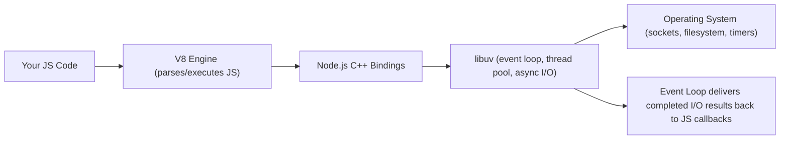

> [!TIP]
> Learn Node.js as **V8 (runs your JavaScript) + libuv (handles everything asynchronous)**. Almost every Node.js-specific concept — the event loop's phases, the thread pool, why `fs.readFileSync` is dangerous in a server — comes from understanding what libuv does underneath the JavaScript you write.

---

# 1. Fundamentals (Beginner Level)

## 1.1 What Is Node.js?

Node.js lets you run JavaScript as a standalone program — a server, script, or CLI tool — rather than only inside a browser.

```javascript
// server.js
const http = require("http");

const server = http.createServer((req, res) => {
    res.writeHead(200, { "Content-Type": "text/plain" });
    res.end("Hello, Node.js!");
});

server.listen(3000, () => console.log("Listening on port 3000"));
```

```bash
node server.js
```

## 1.2 Why Node.js Exists

| Problem | Node.js's Answer |
|---|---|
| JavaScript could only run in browsers | V8 embedded as a standalone runtime |
| Needed a language shared between frontend and backend | One language (JavaScript/TypeScript) end-to-end |
| Traditional thread-per-request servers don't scale well for I/O-heavy workloads | Non-blocking, event-driven I/O handles many concurrent connections with few threads |
| Needed a package ecosystem for rapid backend development | npm — the largest software package registry in the world |

## 1.3 Problems Node.js Solves

Node.js is especially good when you need:

- High-concurrency, I/O-bound servers (APIs, real-time apps, proxies/gateways).
- A unified JavaScript/TypeScript stack across frontend and backend.
- Fast iteration and a massive ecosystem of ready-made packages (npm).
- Streaming data processing (large files, network streams) without buffering everything in memory.

Node.js is less ideal when you need:

- Heavy CPU-bound computation (single-threaded JS execution; needs worker threads or a different runtime).
- Extremely low-level memory/hardware control.

## 1.4 Real-World Analogy

Think of Node.js like a single, very efficient waiter working a restaurant using a walkie-talkie to the kitchen.

The waiter (Node's single JS thread) never stands at the kitchen window waiting for a dish. They take an order, radio it to the kitchen (libuv/OS), and immediately move to the next table. Multiple dishes cook in parallel in the kitchen (multiple I/O operations happening concurrently at the OS/libuv level), and the waiter just responds to the radio the moment each dish is ready — letting one waiter effectively serve far more tables than if they had to personally stand and wait for each dish.

```text
Waiter (single thread) = Node.js's JavaScript execution thread
Kitchen                = libuv + OS (handles I/O concurrently, outside the JS thread)
Radio/walkie-talkie    = callbacks/Promises signaling when I/O completes
```

## 1.5 Core Vocabulary

| Term | Meaning |
|---|---|
| V8 | Google's JavaScript engine, embedded in Node.js and Chrome |
| libuv | C library providing the event loop, thread pool, and async I/O abstractions |
| Event Loop | The mechanism coordinating callback execution across phases |
| npm | Node Package Manager — registry and CLI for JavaScript packages |
| `package.json` | Project manifest: dependencies, scripts, metadata |
| CommonJS | Node's original module system (`require`/`module.exports`) |
| ESM | ECMAScript Modules (`import`/`export`), also supported by modern Node |
| Stream | An abstraction for processing data incrementally rather than all at once |
| Event Emitter | Node's core pub/sub pattern implementation |

## 1.6 Modules: CommonJS

```javascript
// math.js
function add(a, b) { return a + b; }
module.exports = { add };

// app.js
const { add } = require("./math");
console.log(add(2, 3));
```

## 1.7 Modules: ES Modules

```javascript
// math.mjs (or "type": "module" in package.json)
export function add(a, b) { return a + b; }

// app.mjs
import { add } from "./math.mjs";
```

> [!TIP]
> Node.js supports both module systems, but they don't mix seamlessly — see [[01 JavaScript]] §2.7. Pick one per project via `package.json`'s `"type"` field and be deliberate.

## 1.8 `package.json` and npm Basics

```json
{
    "name": "order-service",
    "version": "1.0.0",
    "type": "module",
    "scripts": {
        "start": "node src/index.js",
        "test": "vitest"
    },
    "dependencies": {
        "express": "^4.19.0"
    },
    "devDependencies": {
        "vitest": "^1.0.0"
    }
}
```

```bash
npm install express       # adds to dependencies
npm install --save-dev vitest  # adds to devDependencies
npm ci                    # clean install from lockfile (CI-safe)
npm run test
```

| File | Purpose |
|---|---|
| `package.json` | Declares dependencies with version *ranges* |
| `package-lock.json` | Locks exact resolved versions for reproducible installs |
| `node_modules/` | Where installed packages actually live (never commit this) |

## 1.9 Basic File System Operations

```javascript
import { readFile, writeFile } from "fs/promises";

async function processFile() {
    const content = await readFile("input.txt", "utf-8");
    await writeFile("output.txt", content.toUpperCase());
}
```

> [!WARNING]
> Prefer the `fs/promises` (or callback) API over `fs.readFileSync`/`writeFileSync` in server code. Synchronous file operations **block the entire event loop** — while one is running, the server can't process any other request, connection, or timer.

## 1.10 Basic HTTP Server and `EventEmitter`

```javascript
import { EventEmitter } from "events";

class OrderEvents extends EventEmitter {}
const orderEvents = new OrderEvents();

orderEvents.on("created", (order) => console.log("Order created:", order.id));
orderEvents.emit("created", { id: 1 });
```

Most of Node's core APIs (HTTP servers, streams, child processes) are built on `EventEmitter` — objects that emit named events other code can subscribe to.

## 1.11 Basic Error Handling

```javascript
process.on("uncaughtException", (err) => {
    console.error("Uncaught exception:", err);
    process.exit(1); // don't try to keep running after an uncaught exception
});

process.on("unhandledRejection", (reason) => {
    console.error("Unhandled promise rejection:", reason);
});
```

> [!IMPORTANT]
> `uncaughtException`/`unhandledRejection` handlers are a **safety net for logging before crashing**, not a way to keep a corrupted process alive. After an uncaught exception, the process is in an unknown state — the standard practice is to log it and exit, letting a process manager (PM2, Kubernetes) restart a fresh process.

---

# 2. Core Concepts (Intermediate Level)

## 2.1 The Node.js Event Loop, Phase by Phase

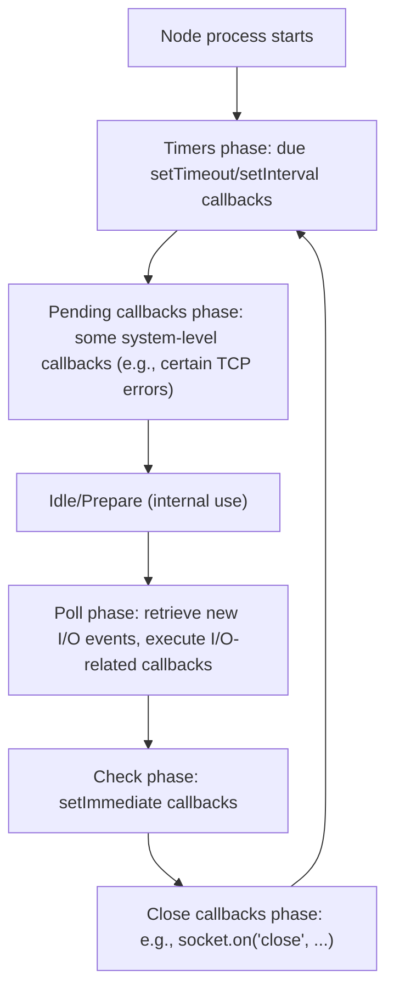

Between **every** callback (and between every phase transition), Node fully drains the `process.nextTick` queue, then the Promise microtask queue — this is the more detailed Node-specific picture beyond the simplified browser model covered in [[01 JavaScript]] §2.1 and §3.1.

## 2.2 `setImmediate` vs. `setTimeout(fn, 0)` vs. `process.nextTick`

```javascript
console.log("start");

setTimeout(() => console.log("setTimeout"), 0);
setImmediate(() => console.log("setImmediate"));
process.nextTick(() => console.log("nextTick"));
Promise.resolve().then(() => console.log("promise"));

console.log("end");

// Output: start, end, nextTick, promise, setTimeout, setImmediate
// (setTimeout vs setImmediate order can actually FLIP depending on context — see below)
```

| Mechanism | Runs |
|---|---|
| `process.nextTick` | Immediately after the current operation, before any other queue — highest priority |
| Promise microtasks | After `nextTick` queue drains, before moving to the next event loop phase |
| `setTimeout(fn, 0)` | In the **timers** phase, on the next loop iteration |
| `setImmediate` | In the **check** phase, after the poll phase completes |

> [!WARNING]
> At the **top level** of a script, the order of `setTimeout(fn, 0)` vs. `setImmediate(fn)` is **not guaranteed** — it depends on process startup timing precision. But **inside an I/O callback** (e.g., inside `fs.readFile`'s callback), `setImmediate` is **always** guaranteed to run before `setTimeout(fn, 0)`, because the poll phase (where the I/O callback runs) always transitions to the check phase (`setImmediate`) before circling back to timers.

## 2.3 The libuv Thread Pool

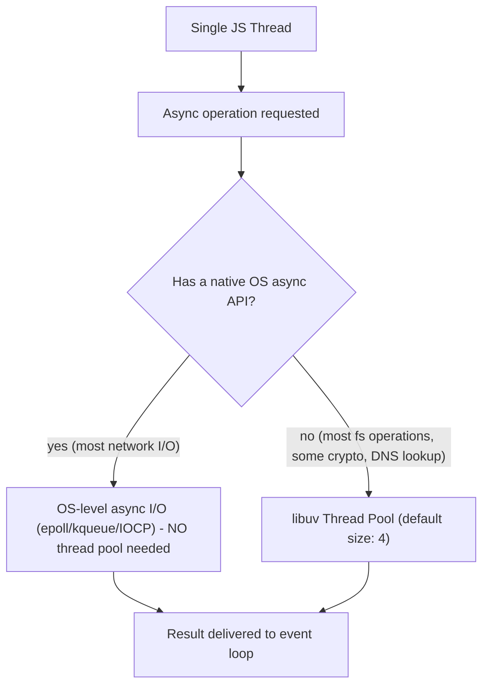

```javascript
process.env.UV_THREADPOOL_SIZE = 8; // must be set BEFORE any thread-pool-using operation starts
```

> [!IMPORTANT]
> Network I/O (TCP/HTTP) uses OS-level async mechanisms directly and doesn't consume the thread pool. But most **filesystem operations**, some **DNS lookups** (`dns.lookup`), and some **crypto** functions (`crypto.pbkdf2`) go through libuv's small thread pool (default size 4). Under heavy concurrent file I/O, this pool becomes a bottleneck — increase `UV_THREADPOOL_SIZE` or move such work to worker threads/a separate service.

## 2.4 Streams

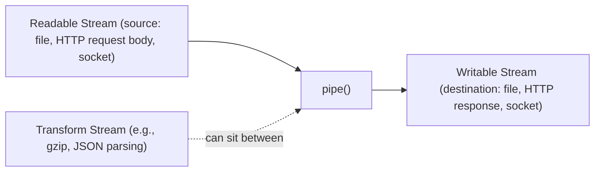

```javascript
import { createReadStream, createWriteStream } from "fs";
import { createGzip } from "zlib";

createReadStream("large-file.txt")
    .pipe(createGzip())
    .pipe(createWriteStream("large-file.txt.gz"));
```

| Stream Type | Direction |
|---|---|
| Readable | Data source you read from (`fs.createReadStream`, HTTP request body) |
| Writable | Data destination you write to (`fs.createWriteStream`, HTTP response) |
| Duplex | Both readable and writable (a TCP socket) |
| Transform | A Duplex stream that modifies data as it passes through (gzip, encryption) |

> [!TIP]
> Streams let you process files/network data **larger than available memory** by handling it in chunks, with automatic **backpressure** — `.pipe()` automatically pauses the readable source if the writable destination can't keep up, preventing memory overload. This is the Node.js-specific expression of the same backpressure concept touched on generally in [[01 JavaScript]].

## 2.5 Basic HTTP Server Patterns

```javascript
import { createServer } from "http";

const server = createServer(async (req, res) => {
    if (req.url === "/orders" && req.method === "GET") {
        const orders = await fetchOrders();
        res.writeHead(200, { "Content-Type": "application/json" });
        res.end(JSON.stringify(orders));
    } else {
        res.writeHead(404);
        res.end("Not found");
    }
});

server.listen(3000);
```

Most production code uses a framework (Express, Fastify, NestJS) on top of this — but they're all built on the same `http.createServer` primitive underneath.

## 2.6 Express Basics

```javascript
import express from "express";

const app = express();
app.use(express.json());

app.get("/orders/:id", async (req, res) => {
    const order = await orderService.findById(req.params.id);
    if (!order) return res.status(404).json({ error: "Not found" });
    res.json(order);
});

app.use((err, req, res, next) => { // error-handling middleware (4 args signals this to Express)
    console.error(err);
    res.status(500).json({ error: "Internal server error" });
});

app.listen(3000);
```


## 2.7 Environment Configuration

```javascript
import "dotenv/config"; // loads .env into process.env

const port = process.env.PORT || 3000;
const dbUrl = process.env.DATABASE_URL;
```

```bash
# .env (never commit this file)
DATABASE_URL=postgres://localhost/mydb
API_KEY=secret123
```

## 2.8 Child Processes

```javascript
import { exec, spawn } from "child_process";

exec("ls -la", (err, stdout) => console.log(stdout));

const child = spawn("python3", ["script.py"]);
child.stdout.on("data", (data) => console.log(`Output: ${data}`));
```

| Function | Behavior |
|---|---|
| `exec` | Runs a shell command, buffers all output, returns via callback — bad for huge output |
| `spawn` | Streams output incrementally, better for long-running/large-output processes |
| `fork` | Spawns a new Node.js process with an IPC channel for message passing |

## 2.9 Basic Testing

```javascript
import { describe, it, expect } from "vitest";
import request from "supertest";
import app from "../app.js";

describe("GET /orders/:id", () => {
    it("returns 404 for missing order", async () => {
        const response = await request(app).get("/orders/999");
        expect(response.status).toBe(404);
    });
});
```

## 2.10 Logging

```javascript
import pino from "pino";

const logger = pino();
logger.info({ orderId: 42 }, "Order created");
logger.error({ err }, "Failed to process order");
```

> [!TIP]
> Use a structured logging library (pino, winston) that outputs JSON, not `console.log`. Structured logs are searchable/filterable in production log aggregation systems (ELK, Datadog); plain `console.log` strings aren't.

---

# 3. Advanced Concepts (Senior Level)

## 3.1 The `cluster` Module for Multi-Core Usage

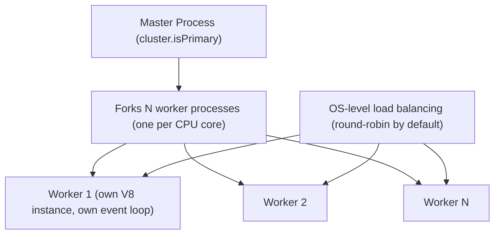

```javascript
import cluster from "cluster";
import { cpus } from "os";
import http from "http";

if (cluster.isPrimary) {
    const numCPUs = cpus().length;
    for (let i = 0; i < numCPUs; i++) cluster.fork();

    cluster.on("exit", (worker) => {
        console.log(`Worker ${worker.process.pid} died, restarting`);
        cluster.fork(); // resilience: replace a crashed worker
    });
} else {
    http.createServer((req, res) => res.end("Hello")).listen(3000);
}
```

> [!IMPORTANT]
> **A single Node.js process only uses one CPU core**, because JavaScript execution is single-threaded. `cluster` (or running multiple container replicas behind a load balancer, which is more common in modern Kubernetes-based deployments) is how you actually use multiple cores — each worker is a fully separate process with its own memory and event loop, not a thread sharing memory.

## 3.2 Worker Threads for CPU-Bound Work

```javascript
// main.js
import { Worker } from "worker_threads";

function runInWorker(data) {
    return new Promise((resolve, reject) => {
        const worker = new Worker("./cpu-heavy-task.js", { workerData: data });
        worker.on("message", resolve);
        worker.on("error", reject);
    });
}

// cpu-heavy-task.js
import { workerData, parentPort } from "worker_threads";
const result = computeExpensiveThing(workerData);
parentPort.postMessage(result);
```

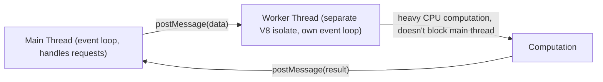

| Aspect | `cluster` | `worker_threads` |
|---|---|---|
| Isolation | Separate OS processes, no shared memory | Threads within the same process, can share memory (`SharedArrayBuffer`) |
| Use case | Scaling request handling across cores | Offloading CPU-intensive work without blocking the main event loop |
| Overhead | Higher (separate process, separate V8 instance) | Lower (shared process, but still separate V8 isolate per worker) |

> [!TIP]
> Use `cluster` (or container replicas) to scale request-handling **throughput** across cores. Use `worker_threads` specifically to move **CPU-bound work** (image processing, complex calculations, parsing huge JSON) off the main event loop so it doesn't block request handling — these solve different problems and are often used together.

## 3.3 Backpressure in Streams (In Depth)

```javascript
readableStream.on("data", (chunk) => {
    const canContinue = writableStream.write(chunk);
    if (!canContinue) {
        readableStream.pause(); // writable's internal buffer is full, slow down
        writableStream.once("drain", () => readableStream.resume()); // buffer freed, resume
    }
});

// Simpler: .pipe() handles all of this automatically
readableStream.pipe(writableStream);
```

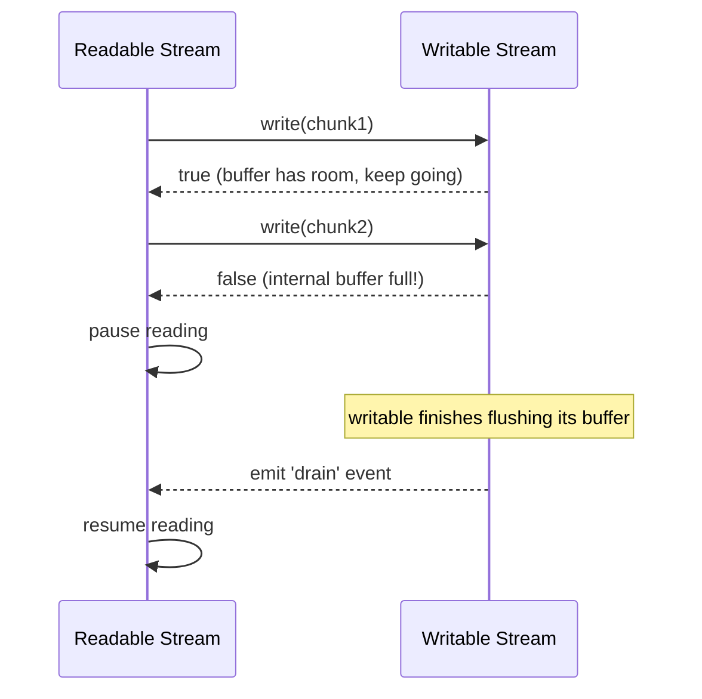

Manually implementing what `.pipe()` gives you for free demonstrates exactly why backpressure matters: without it, a fast source (like reading a large file) could push data into a slow destination (like a rate-limited network socket) faster than it can be written, causing unbounded memory growth as the writable's internal buffer keeps accepting more than it can flush.

## 3.4 Graceful Shutdown

```javascript
const server = app.listen(3000);

process.on("SIGTERM", async () => {
    console.log("SIGTERM received, shutting down gracefully");
    server.close(() => console.log("HTTP server closed"));

    await database.closeConnections();
    await messageQueue.disconnect();

    process.exit(0);
});
```

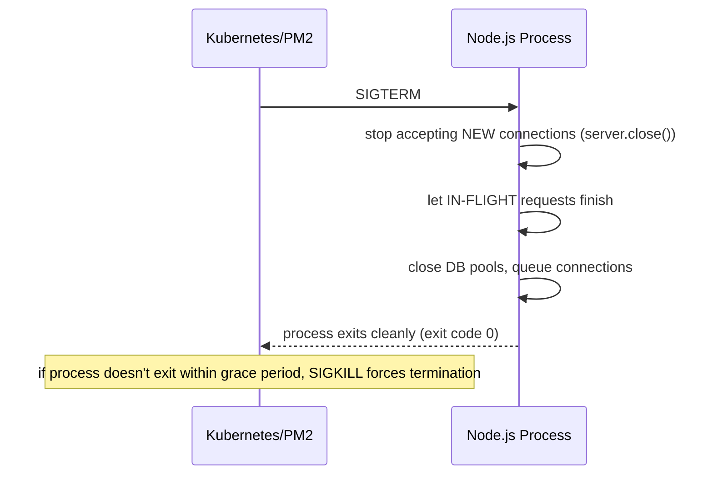

> [!WARNING]
> Without a `SIGTERM` handler, an orchestrator's rolling deployment can forcibly kill a process mid-request, dropping in-flight client connections and potentially leaving database transactions in an inconsistent state. Always handle `SIGTERM` to drain gracefully within the orchestrator's configured grace period.

## 3.5 Memory Management and Diagnosing Leaks

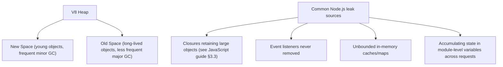

```bash
node --max-old-space-size=2048 app.js   # set heap size limit explicitly
node --inspect app.js                    # enable debugging/heap snapshot capture via Chrome DevTools
```

```javascript
process.on("warning", (warning) => {
    if (warning.name === "MaxListenersExceededWarning") {
        console.error("Possible EventEmitter listener leak:", warning);
    }
});
```

## 3.6 Security Hardening

| Risk | Mitigation |
|---|---|
| Outdated/vulnerable dependencies | `npm audit`, Dependabot/Snyk, lockfile discipline |
| Prototype pollution (see [[01 JavaScript]] §3.5) | Guard recursive merges, use `Object.create(null)` for untrusted-key dictionaries |
| Command injection via `child_process.exec` with user input | Use `execFile`/`spawn` with an argument array, never string-interpolate user input into a shell command |
| Path traversal via user-controlled file paths | Validate/normalize paths, restrict to an allowed base directory |
| ReDoS (regex denial of service) | Avoid catastrophic-backtracking patterns on user input |
| Exposing stack traces in production error responses | Custom error middleware returning sanitized messages |
| Running as root inside a container | Run the Node.js process as a non-root user in the container image |

```javascript
// DANGEROUS: command injection if userInput is attacker-controlled
exec(`convert ${userInput} output.png`);

// SAFE: arguments passed as an array, not shell-interpolated
execFile("convert", [userInput, "output.png"]);
```

## 3.7 Failure Scenarios

| Failure | Symptom | Common Cause | Fix |
|---|---|---|---|
| Server unresponsive under load despite low CPU usage | Requests hang/timeout | Synchronous blocking call (`fs.readFileSync`, heavy synchronous loop) on the event loop thread | Use async APIs; move CPU-heavy work to worker threads |
| Memory grows unboundedly over days | Eventually OOM-killed | Event listener leak, unbounded cache, closures retaining large objects | Heap snapshots via `--inspect`, bound caches, remove listeners |
| Only using 1 of N available CPU cores | Underutilized hardware despite high traffic | Single Node.js process without `cluster`/multiple replicas | Use `cluster` or run multiple container replicas behind a load balancer |
| Dropped connections during deployment | Client errors during rolling deploys | No `SIGTERM` handler, orchestrator force-kills mid-request | Implement graceful shutdown |
| Process crashes with no log output | Silent failures in production | Uncaught exception with no handler, or the handler itself throwing | Add `uncaughtException`/`unhandledRejection` handlers that log before exiting |
| File I/O bottleneck under concurrent load | Slow response times despite async code | libuv's small thread pool (default 4) saturated by concurrent `fs` operations | Increase `UV_THREADPOOL_SIZE`, or offload to a separate service |
| `npm install` produces different dependency versions across environments | "Works on my machine" bugs | Missing/ignored lockfile, using `npm install` instead of `npm ci` in CI | Commit the lockfile, use `npm ci` in CI/CD pipelines |

## 3.8 Performance Considerations

- Never use `*Sync` filesystem functions in a request-handling path.
- Use streams for large file/network payloads instead of buffering entire files in memory.
- Profile with `node --prof` + `node --prof-process`, or Clinic.js, before optimizing blindly.
- Keep the event loop unblocked — break up any necessarily-synchronous CPU work into smaller chunks or move it to worker threads.
- Use connection pooling for databases; avoid creating a new connection per request.
- Cache aggressively (Redis) for expensive, frequently-repeated computations/queries.

---

# 4. Real-World System Design Usage

## 4.1 Where Node.js Is Used in Production

- REST/GraphQL API backends (Express, Fastify, NestJS).
- Real-time applications (WebSocket servers, chat, live dashboards).
- API gateways and BFF (Backend-for-Frontend) layers.
- Serverless functions (AWS Lambda, Vercel/Cloudflare edge functions).
- CLI tools and build tooling (much of the modern JS toolchain itself is Node.js-based).
- Microservices in polyglot architectures, often alongside Java/Go/Python services.

## 4.2 Typical Production Architecture

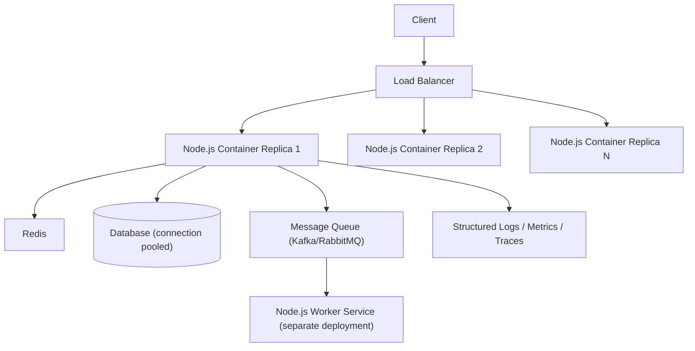

Because a single Node.js process uses one core, production deployments scale via **multiple replicas** (containers/pods), not by relying on any single process to use all available hardware.

## 4.3 Big-Company Style Thinking

| Concern | Node.js Design Response |
|---|---|
| Reliability | Graceful shutdown, process managers with auto-restart, health/readiness endpoints |
| Scale | Horizontal scaling via multiple replicas/containers, not single-process cluster mode in Kubernetes environments |
| Observability | Structured JSON logging, distributed tracing (OpenTelemetry), APM |
| Security | Dependency scanning, non-root container user, input validation at every boundary |
| Maintainability | TypeScript for large codebases, layered architecture (routes/services/repositories) |
| Performance | Never block the event loop; worker threads for CPU-bound work; streaming for large payloads |

## 4.4 Example: Order Service Request Lifecycle

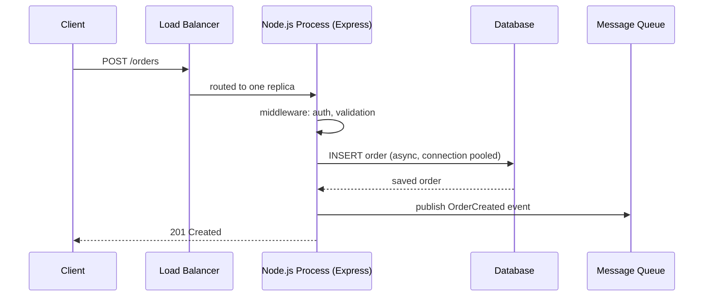

## 4.5 Layered Node.js Service Architecture

```text
src/
    routes/          - Express route definitions, thin, delegate to services
    services/        - Business logic
    repositories/     - Database access (via an ORM/query builder)
    middleware/       - Auth, validation, error handling
    workers/          - Background job/queue consumers (separate entry point)
    config/           - Environment-driven configuration
```

## 4.6 Integration with Other Systems

| System | Node.js Integration |
|---|---|
| Databases | Prisma, TypeORM, Knex, native drivers (`pg`, `mongodb`) |
| Caching | `ioredis` |
| Message queues | `kafkajs`, `amqplib` |
| Web frameworks | Express, Fastify, NestJS, Koa |
| Process management | PM2, Kubernetes (preferred for modern container-based deployments) |
| Observability | OpenTelemetry JS SDK, pino/winston for logs, Prometheus client for metrics |
| Testing | Vitest/Jest, Supertest (HTTP assertions), Testcontainers (real dependency integration tests) |

---

# 5. Interview Preparation

## 5.1 What Interviewers Expect

For "Node.js" topics, interviewers usually expect:

- You understand Node's single-threaded, event-driven, non-blocking I/O model.
- You know the difference between synchronous and asynchronous filesystem APIs and why it matters.
- You can build a basic HTTP server/Express API with proper error handling.

For senior backend roles, they also expect:

- You understand the event loop's phases in Node.js specifically (not just the browser's simplified model).
- You know when and how to use `cluster` vs. `worker_threads`.
- You can diagnose event-loop-blocking and memory-leak issues in production.
- You understand graceful shutdown and why it matters for zero-downtime deployments.

## 5.2 Most Important Questions and Answers

### Q1. Is Node.js single-threaded? What does that actually mean in practice?

JavaScript execution in Node.js runs on a single thread. However, Node.js itself (via libuv) uses OS-level async I/O and a small internal thread pool for certain operations, meaning I/O-bound work happens concurrently *outside* that single JS thread — "single-threaded" refers specifically to your JavaScript code's execution, not to everything Node.js does internally.

### Q2. Why is `fs.readFileSync` dangerous in a Node.js server?

It blocks the single JS thread until the file read completes, during which the event loop can't process any other request, timer, or I/O callback — effectively freezing the entire server for every concurrent client, not just the one that triggered the read.

### Q3. What is libuv's thread pool used for, and what's its default size?

It handles operations without a natural OS-level async API — primarily most filesystem operations, some DNS lookups, and some crypto functions. Its default size is 4; under heavy concurrent use of these operations, the pool can become a bottleneck, addressable via `UV_THREADPOOL_SIZE` or offloading work elsewhere.

### Q4. How do you actually use multiple CPU cores with Node.js?

Since a single process only uses one core, you either use the `cluster` module to fork multiple worker processes within one deployment, or — more common in modern container/Kubernetes environments — run multiple container replicas behind a load balancer, letting the orchestration layer distribute load across cores/machines.

### Q5. What's the difference between `cluster` and `worker_threads`?

`cluster` forks separate OS **processes** (no shared memory) primarily to scale request-handling throughput across cores. `worker_threads` creates threads **within the same process** (can share memory via `SharedArrayBuffer`) specifically to offload CPU-intensive computation without blocking the main event loop that handles requests.

### Q6. Why does graceful shutdown matter for Node.js services?

Without handling `SIGTERM`, an orchestrator's rolling deployment or scale-down can forcibly kill a process mid-request, dropping client connections and potentially leaving transactions inconsistent. A proper `SIGTERM` handler stops accepting new connections, lets in-flight requests finish, closes database/queue connections, and then exits cleanly within the orchestrator's grace period.

### Q7. What causes a memory leak in a long-running Node.js server?

Common causes: event listeners registered but never removed, unbounded in-memory caches/maps that grow indefinitely, and closures retaining references to large objects longer than necessary (see [[01 JavaScript]] §3.3) — all preventing garbage collection of objects that are no longer actually needed.

### Q8. What's the difference between `exec` and `spawn` for child processes?

`exec` buffers the entire child process's output in memory and returns it via callback — problematic for large output. `spawn` streams output incrementally via events, better suited for long-running processes or large output volumes; it also avoids `exec`'s command-injection risk if used with an argument array rather than a single shell-interpolated string.

### Q9. How does Node.js achieve high concurrency for I/O-bound workloads with a single thread?

By never blocking the JS thread on I/O — async operations are handed off to libuv, which uses OS-level async mechanisms (or its thread pool for select operations) to handle many operations concurrently, notifying the event loop via callbacks/promises as each completes, letting one thread juggle thousands of concurrent I/O-bound connections.

### Q10. Why should you use `npm ci` instead of `npm install` in CI/CD pipelines?

`npm ci` installs exactly what's specified in `package-lock.json`, failing if the lockfile and `package.json` are out of sync, guaranteeing reproducible builds. `npm install` can update the lockfile and resolve slightly different versions within allowed ranges, risking "works locally, breaks in CI" inconsistencies.

## 5.3 Tricky Questions

### If Node.js is non-blocking, why can a single slow synchronous computation still hang the whole server?

Non-blocking I/O only applies to operations Node hands off to libuv/the OS (file reads, network calls, timers). A synchronous, CPU-bound computation (a huge loop, expensive JSON parsing/stringifying, complex regex) runs directly on the single JS thread and blocks everything else regardless of how "async" the surrounding code looks.

### Does `process.nextTick` starve the event loop if used incorrectly?

Yes — because `process.nextTick`'s queue is drained **completely** before the event loop proceeds to anything else (including I/O callbacks), a `nextTick` callback that recursively schedules more `nextTick` calls can starve the entire event loop indefinitely, a documented Node.js-specific gotcha absent from the standard browser microtask model.

### Can two `worker_threads` share the exact same JavaScript object in memory?

Not directly as a plain object — but they can share raw binary data via `SharedArrayBuffer`, which both threads can read/write concurrently (with manual synchronization via `Atomics` if needed), unlike regular objects which are copied (structured-cloned) when passed via `postMessage`.

### Why might increasing `UV_THREADPOOL_SIZE` not fix a performance problem?

If the actual bottleneck is network I/O (which doesn't use the thread pool at all) or a CPU-bound synchronous computation on the main thread, increasing the thread pool size only helps thread-pool-bound operations (`fs`, some `crypto`/`dns` calls) — it's important to profile and confirm where the actual bottleneck lies before tuning this setting.

## 5.4 Common Candidate Mistakes

- Using `fs.readFileSync`/other synchronous APIs in request-handling code.
- Assuming a single Node.js process automatically uses multiple CPU cores.
- Confusing `cluster` (multi-process scaling) with `worker_threads` (CPU offloading).
- Not handling `SIGTERM` for graceful shutdown.
- Using `exec` with string-interpolated user input (command injection risk).
- Not knowing the difference between OS-level async I/O and libuv's thread pool.
- Committing `node_modules/` or ignoring the lockfile in version control/CI.

## 5.5 Interview Coding Checklist

- [ ] Use async (`fs/promises` or callback) filesystem APIs, never `*Sync` in server code.
- [ ] Handle `SIGTERM` for graceful shutdown in any long-running service.
- [ ] Use `spawn`/`execFile` with argument arrays for child processes involving external input, never `exec` with string interpolation.
- [ ] Add `uncaughtException`/`unhandledRejection` handlers that log and exit cleanly.
- [ ] Use streams for large file/network payloads instead of buffering fully in memory.
- [ ] Use `npm ci` in CI/CD, commit the lockfile.

---

# 6. Hands-On Thinking

## 6.1 Three Real-World Projects Using Node.js

### Project 1: Streaming File Upload/Processing Service

Concepts: streams with backpressure, `Transform` streams for on-the-fly processing (e.g., CSV parsing), avoiding full in-memory buffering of large uploads.

```javascript
app.post("/upload", (req, res) => {
    req.pipe(createGzip()).pipe(createWriteStream("uploaded.gz"));
    req.on("end", () => res.status(200).send("Uploaded"));
});
```

### Project 2: Real-Time Chat Server (WebSockets + Cluster)

Concepts: `ws`/Socket.IO WebSocket server, `cluster` module (with a shared adapter like Redis pub/sub so messages broadcast across all worker processes), graceful shutdown.


### Project 3: CPU-Intensive Image Processing API (Worker Threads)

Concepts: `worker_threads` pool for image resizing/processing, keeping the main event loop responsive for concurrent request handling while heavy computation happens on worker threads.

```javascript
import { Worker } from "worker_threads";
import Piscina from "piscina"; // worker thread pool library

const pool = new Piscina({ filename: "./resize-worker.js" });

app.post("/resize", async (req, res) => {
    const result = await pool.run(req.body); // offloaded to a worker thread
    res.json(result);
});
```

## 6.2 Step-by-Step Design Approach

For any Node.js service:

1. Choose the module system (ESM/CommonJS) and confirm tooling compatibility up front.
2. Identify any necessarily-synchronous or CPU-heavy work and plan to isolate it (worker threads or a separate service).
3. Design the layered architecture (routes/services/repositories) before writing handlers.
4. Add structured logging and error handling from the start, not as an afterthought.
5. Implement graceful shutdown before the first production deployment, not after an incident.
6. Plan horizontal scaling (replicas) rather than relying on a single process/cluster mode where Kubernetes-style orchestration is available.
7. Add health/readiness endpoints for the orchestrator.

## 6.3 Production Implementation Approach

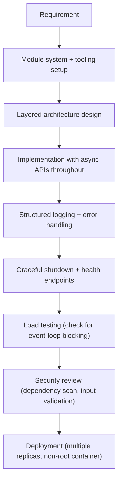

## 6.4 Production Readiness Example

For a Node.js service, define:

- Health (`/healthz`) and readiness (`/readyz`) endpoints wired to the orchestrator.
- `SIGTERM` handler draining in-flight requests before exit.
- Structured JSON logging with correlation IDs.
- `uncaughtException`/`unhandledRejection` handlers logging before process exit.
- Dependency vulnerability scanning in CI (`npm audit`, Snyk/Dependabot).
- Non-root user in the container image.
- Horizontal scaling via multiple replicas, not reliance on a single process's `cluster` mode in a Kubernetes environment.
- Timeouts on all outbound network calls and database queries.

---

# 7. Deep Dive (Optional but Important)

## 7.1 Node.js Startup Sequence

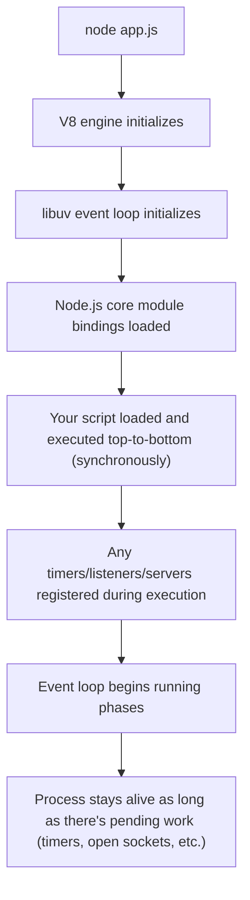

A Node.js process exits naturally once the event loop has no more pending work (no open handles/timers/listeners) — this is why a script with no server/timers exits immediately after its synchronous code finishes, while a server process (with an open listening socket) stays alive indefinitely.

## 7.2 V8 Memory Structure (Node-Specific View)

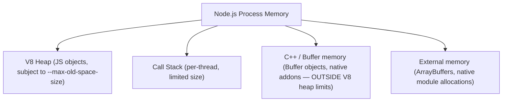

> [!WARNING]
> `Buffer` objects (used heavily for binary/file/network data in Node.js) and other native allocations live **outside** V8's heap limit (`--max-old-space-size`), so a process can run out of system memory from Buffer/native allocation growth even while V8's own heap usage looks healthy — memory diagnostics must account for both.

## 7.3 Module Resolution Algorithm (CommonJS)

```text
require("./foo")   -> resolves relative to the current file: ./foo.js, ./foo/index.js, etc.
require("foo")     -> searches node_modules/ upward from the current directory,
                       through each parent directory, until found or reaching the filesystem root
require("node:fs") -> resolves to Node's own built-in core module (explicit "node:" prefix recommended)
```

Understanding this resolution order explains why two different `node_modules/foo` installations (nested at different directory levels) can coexist, and why moving a file to a different directory can silently change which `node_modules` a relative `require` resolves against.

## 7.4 `AsyncLocalStorage` for Request-Scoped Context

```javascript
import { AsyncLocalStorage } from "async_hooks";

const asyncLocalStorage = new AsyncLocalStorage();

app.use((req, res, next) => {
    asyncLocalStorage.run({ requestId: crypto.randomUUID() }, next);
});

function logWithContext(message) {
    const store = asyncLocalStorage.getStore();
    logger.info({ requestId: store?.requestId }, message);
}
```

`AsyncLocalStorage` provides Node.js's equivalent of "thread-local storage" for asynchronous call chains — letting request-scoped data (like a correlation ID) be accessible deep inside nested async calls without manually threading it through every function parameter, correctly tracking the logical async chain even across `await` boundaries and callbacks.

## 7.5 Debugging Tools

| Tool | Purpose |
|---|---|
| `node --inspect` + Chrome DevTools | Breakpoint debugging, heap snapshots, CPU profiling |
| `node --prof` / `--prof-process` | CPU profiling from the command line |
| Clinic.js (`clinic doctor`/`clinic flame`) | Diagnoses event-loop blocking, memory leaks, CPU bottlenecks visually |
| `0x` | Flame graph generation for CPU profiling |
| `process.memoryUsage()` | Programmatic snapshot of heap/RSS/external memory |
| `async_hooks` | Low-level tracing of async operation lifecycles (what `AsyncLocalStorage` is built on) |

---

# Production Checklists

## Code Quality Checklist

- [ ] No synchronous blocking filesystem/CPU-heavy calls in request-handling paths.
- [ ] Module system (ESM/CommonJS) consistent and deliberately chosen per project.
- [ ] Layered architecture (routes/services/repositories) with clear boundaries.
- [ ] Structured JSON logging with correlation IDs (via `AsyncLocalStorage` where needed).
- [ ] Lockfile committed; `npm ci` used in CI/CD.

## Performance Checklist

- [ ] Streams used for large file/network payloads.
- [ ] CPU-bound work isolated to worker threads, not run on the main event loop.
- [ ] Horizontal scaling (multiple replicas) planned for multi-core utilization.
- [ ] Database connections pooled, not created per request.
- [ ] `UV_THREADPOOL_SIZE` tuned if filesystem/crypto/DNS operations are a proven bottleneck.

## Security Checklist

- [ ] Dependencies scanned regularly (`npm audit`, Snyk/Dependabot).
- [ ] `child_process` calls use argument arrays (`execFile`/`spawn`), never shell-interpolated strings with user input.
- [ ] Container runs as a non-root user.
- [ ] Input validated at every external boundary.
- [ ] Stack traces/internal errors not exposed in production API responses.

## Debugging Checklist

- [ ] Reproduce with `--inspect` and Chrome DevTools or Clinic.js.
- [ ] Check for synchronous blocking calls first if the whole server seems unresponsive under load.
- [ ] Capture heap snapshots to diagnose suspected memory leaks.
- [ ] Verify graceful shutdown behavior explicitly under a simulated `SIGTERM` during load.
- [ ] Check `Buffer`/native memory usage separately from V8 heap usage when diagnosing OOM issues.

---

# Learning Roadmap

## Phase 1: Beginner

Learn: running scripts, CommonJS/ESM modules, `npm`/`package.json`, basic `fs`, basic `http.createServer`.

Practice: a simple CLI tool; a basic HTTP server without a framework.

## Phase 2: Intermediate

Learn: Express/Fastify basics, streams, `EventEmitter`, environment configuration, basic testing (Vitest/Jest + Supertest).

Practice: a REST API with a database, proper error-handling middleware, and integration tests.

## Phase 3: Advanced

Learn: event loop phases in depth, libuv thread pool, `cluster`, `worker_threads`, graceful shutdown, structured logging.

Practice: a service using worker threads for CPU-heavy work, with graceful shutdown and health endpoints.

## Phase 4: Production Backend Engineer

Learn: memory diagnostics (heap snapshots, Buffer/native memory), `AsyncLocalStorage`, security hardening, horizontal scaling strategy.

Practice: a production-style multi-replica service with full observability, dependency scanning, non-root containerization, and load-tested graceful shutdown.

---

# Self-Review Completion Loop

The topic was reviewed against:

- Official Node.js documentation categories (event loop, streams, cluster, worker threads, child processes).
- libuv's documented design and thread pool behavior.
- Common production incident patterns (event-loop blocking, memory leaks, ungraceful shutdowns, single-core underutilization).
- Interview patterns for beginner through senior backend roles.

## Gap Review Matrix

| Area | Covered? | Notes |
|---|---|---|
| Beginner modules/npm | Yes | CommonJS/ESM, `package.json`, lockfile discipline |
| Basic HTTP/Express | Yes | Raw `http` and Express middleware pipeline |
| Event loop phases (Node-specific) | Yes | Full phase diagram, `nextTick`/microtask ordering |
| libuv thread pool | Yes | Default size, what uses it, tuning |
| Streams | Yes | Types, `.pipe()`, backpressure sequence diagram |
| `cluster` module | Yes | Multi-core scaling, diagram |
| `worker_threads` | Yes | CPU-bound offloading, comparison to `cluster` |
| Graceful shutdown | Yes | `SIGTERM` handling, sequence diagram |
| Memory management | Yes | Heap structure, Buffer/native memory outside V8 heap limits |
| Child processes | Yes | `exec`/`spawn`/`fork`, command injection risk |
| Security | Yes | Dependency scanning, injection risks, non-root containers |
| Failure scenarios | Yes | Seven concrete production failure patterns |
| `AsyncLocalStorage` | Yes | Request-scoped context deep dive |
| Module resolution | Yes | CommonJS resolution algorithm explained |
| Interview prep | Yes | Common and tricky questions, candidate mistakes |
| Hands-on projects | Yes | Three realistic projects with diagrams |
| Diagram depth | Yes | Mermaid diagrams throughout every major section |

No significant beginner-to-senior Node.js gaps remain for the requested scope. Further specialization should split into separate deep dives: **Express/Fastify/NestJS Framework Deep Dive**, **Node.js Performance Profiling with Clinic.js**, **Building Node.js Native Addons**, and **Node.js Streams API In Depth**.

---

# Official References

- Node.js Official Documentation: <https://nodejs.org/en/docs>
- Node.js Event Loop Guide: <https://nodejs.org/en/learn/asynchronous-work/event-loop-timers-and-nexttick>
- libuv Documentation: <https://docs.libuv.org/>
- Node.js Streams Documentation: <https://nodejs.org/api/stream.html>
- Node.js `worker_threads` Documentation: <https://nodejs.org/api/worker_threads.html>
- Node.js `cluster` Documentation: <https://nodejs.org/api/cluster.html>

---

## Final Summary

Node.js runs JavaScript outside the browser by pairing V8 with libuv, which handles everything asynchronous — OS-level I/O directly for network operations, and a small internal thread pool for filesystem/DNS/crypto operations that lack a native async API. Production mastery comes from respecting the single-threaded execution model (never blocking it with synchronous I/O or heavy CPU work), scaling deliberately across cores via multiple processes/replicas rather than assuming Node does this automatically, and treating operational concerns — graceful shutdown, structured logging, memory diagnostics beyond just the V8 heap — as first-class engineering work rather than afterthoughts.
