# Express.js: Beginner-to-Expert Engineering Guide

> **Scope:** This guide teaches Express.js from first principles through production REST API engineering — routing, the middleware pipeline, request/response objects, error handling, security hardening, and production architecture. Builds directly on [[05 Node.js]] (Express is a thin layer over `http.createServer`) and [[01 JavaScript]] (async/await patterns throughout).

## Table of Contents

1. [Executive Summary](#executive-summary)
2. [1. Fundamentals](#1-fundamentals-beginner-level)
3. [2. Core Concepts](#2-core-concepts-intermediate-level)
4. [3. Advanced Concepts](#3-advanced-concepts-senior-level)
5. [4. Real-World System Design Usage](#4-real-world-system-design-usage)
6. [5. Interview Preparation](#5-interview-preparation)
7. [6. Hands-On Thinking](#6-hands-on-thinking)
8. [7. Deep Dive](#7-deep-dive-optional-but-important)
9. [Production Checklists](#production-checklists)
10. [Learning Roadmap](#learning-roadmap)
11. [Self-Review Completion Loop](#self-review-completion-loop)
12. [Official References](#official-references)

---

## Executive Summary

Express is a minimal, unopinionated web framework for Node.js built around one core idea: a **pipeline of middleware functions**, each receiving the request and response objects and either handling the request, transforming it, or passing control to the next function in line.

The core idea:


> [!TIP]
> Learn Express as **"everything is middleware."** Route handlers, body parsers, authentication checks, error handlers, even Express's routing itself — all of it is the same fundamental pattern: `(req, res, next) => { ... }`. Once that clicks, the entire framework's API surface becomes predictable.

---

# 1. Fundamentals (Beginner Level)

## 1.1 What Is Express.js?

Express is a Node.js framework that sits on top of the raw `http` module (see [[05 Node.js]] §2.5), providing routing, middleware composition, and helpers for building web servers and APIs with far less boilerplate than raw `http.createServer`.

```bash
npm install express
```

```javascript
import express from "express";

const app = express();

app.get("/", (req, res) => {
    res.send("Hello, Express!");
});

app.listen(3000, () => console.log("Listening on port 3000"));
```

## 1.2 Why Express Exists

| Problem with Raw `http` | Express's Answer |
|---|---|
| Manual URL/method matching with `if`/`switch` statements | Declarative routing (`app.get`, `app.post`, route params) |
| No built-in request body parsing | `express.json()`/`express.urlencoded()` middleware |
| Cross-cutting concerns (logging, auth) require manual wiring into every handler | Composable middleware pipeline applied globally or per-route |
| Verbose response handling (manually setting headers, status, stringifying JSON) | `res.json()`, `res.status()`, chainable response helpers |
| No structure for large applications with many routes | `express.Router()` for modular route organization |

## 1.3 Problems Express Solves

Express is especially good when you need:

- A REST API or server-rendered app with standard routing and middleware needs.
- Fine-grained control over the request/response pipeline without heavy framework opinions.
- A huge ecosystem of middleware (auth, CORS, security headers, rate limiting) that "just works" via the same `(req, res, next)` interface.

Express is less ideal (by itself) when you need:

- Very high raw throughput with minimal overhead (Fastify is faster due to its architecture — see §3.9).
- Strong built-in structure/conventions for large teams (NestJS layers this on top of Express/Fastify).
- Built-in TypeScript-first design (Express's types are community-maintained, not built-in).

## 1.4 Real-World Analogy

Think of Express's middleware pipeline like an airport security corridor with sequential checkpoints, each free to inspect, modify, or stop your journey.

Every passenger (request) walks through the same corridor: ID check (auth middleware), bag scan (body parsing), a metal detector (validation) — each checkpoint can wave you through to the next (`next()`), send you to a special processing room (redirect to an error handler), or hold you entirely (send a response and end the pipeline). The gate you eventually board from (the matched route handler) is just the last, most specific checkpoint in that same corridor.

```text
Corridor           = the middleware pipeline
Each checkpoint     = a middleware function
Waving you through  = calling next()
Route handler       = the final, most specific "checkpoint" matching your exact route
```

## 1.5 Core Vocabulary

| Term | Meaning |
|---|---|
| Middleware | A function `(req, res, next) => {}` that can inspect/modify the request/response or end the cycle |
| `next()` | Passes control to the next middleware/route handler in the pipeline |
| Route | A path + HTTP method pairing mapped to a handler function |
| `req` (Request) | Wraps Node's `IncomingMessage`, adds convenience properties/methods |
| `res` (Response) | Wraps Node's `ServerResponse`, adds convenience methods (`res.json`, `res.status`) |
| Router | A mini, mountable Express application for modular route grouping |
| Error-handling middleware | Middleware with **four** parameters `(err, req, res, next)`, specifically for errors |

## 1.6 Basic Routing

```javascript
app.get("/orders", (req, res) => res.json(orders));
app.get("/orders/:id", (req, res) => res.json(findOrder(req.params.id)));
app.post("/orders", (req, res) => res.status(201).json(createOrder(req.body)));
app.put("/orders/:id", (req, res) => res.json(updateOrder(req.params.id, req.body)));
app.delete("/orders/:id", (req, res) => { deleteOrder(req.params.id); res.status(204).end(); });
```

| `req` Property | Contains |
|---|---|
| `req.params` | Route parameters (`:id`) |
| `req.query` | Query string parameters (`?status=PAID`) |
| `req.body` | Parsed request body (requires body-parsing middleware) |
| `req.headers` | Request headers |

## 1.7 Built-In Middleware

```javascript
app.use(express.json());               // parses JSON request bodies into req.body
app.use(express.urlencoded({ extended: true })); // parses form-encoded bodies
app.use(express.static("public"));      // serves static files from a directory
```

## 1.8 Basic Custom Middleware

```javascript
function requestLogger(req, res, next) {
    console.log(`${req.method} ${req.url}`);
    next(); // MUST call next() or the request hangs forever
}

app.use(requestLogger); // applied to ALL routes
```

> [!WARNING]
> Forgetting to call `next()` (or send a response) inside a middleware function leaves the request **hanging indefinitely** — the client never gets a response, and no error is thrown. This is one of the most common Express bugs for beginners.

## 1.9 Basic Error Handling

```javascript
app.get("/orders/:id", async (req, res, next) => {
    try {
        const order = await orderService.findById(req.params.id);
        if (!order) return res.status(404).json({ error: "Not found" });
        res.json(order);
    } catch (err) {
        next(err); // forwards to error-handling middleware
    }
});

// Error-handling middleware: MUST have exactly 4 parameters
app.use((err, req, res, next) => {
    console.error(err);
    res.status(500).json({ error: "Internal server error" });
});
```

> [!IMPORTANT]
> Express identifies error-handling middleware **purely by its arity (4 parameters)** — `(err, req, res, next)`. Defining it with 3 parameters, even if you intend it as an error handler, means Express treats it as regular middleware and it will never be invoked for errors.

## 1.10 Route Parameters and Query Strings

```javascript
// GET /orders/42?include=items
app.get("/orders/:id", (req, res) => {
    const id = req.params.id;          // "42"
    const include = req.query.include; // "items"
});
```

---

# 2. Core Concepts (Intermediate Level)

## 2.1 The Full Middleware Pipeline in Detail

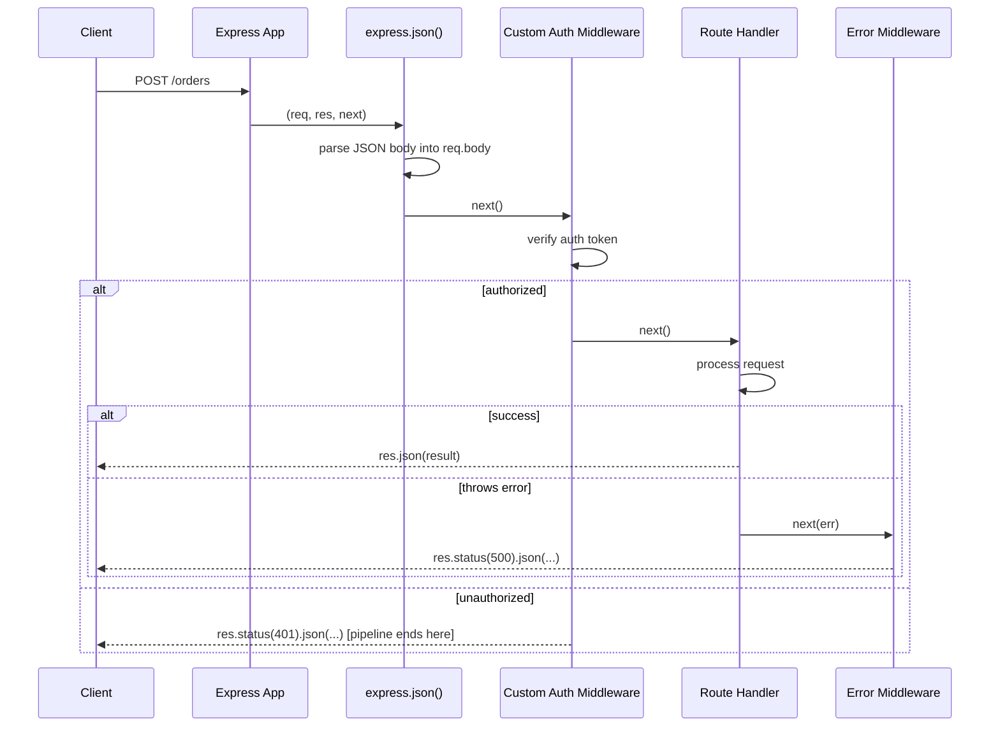

Middleware executes **strictly in registration order** for a given request — this is why middleware order matters enormously (body parsers before routes that read `req.body`, auth before protected routes, error handlers registered **last**).

## 2.2 `express.Router()` for Modular Routes

```javascript
// routes/orders.js
import { Router } from "express";

const router = Router();

router.get("/", listOrders);
router.get("/:id", getOrder);
router.post("/", createOrder);

export default router;
```

```javascript
// app.js
import ordersRouter from "./routes/orders.js";

app.use("/orders", ordersRouter); // all routes above are now prefixed with /orders
```

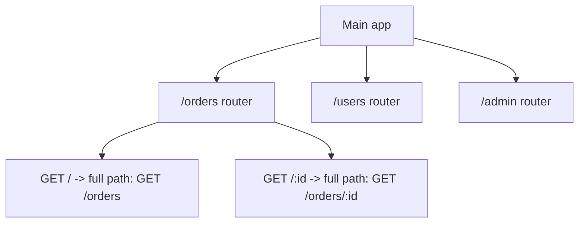

A `Router` is a mini, self-contained Express application — it has its own middleware stack and routes, and gets "mounted" onto a path prefix in the main app, enabling large applications to organize routes into feature modules.

## 2.3 Middleware Application Scope

```javascript
app.use(loggerMiddleware);                    // applies to ALL routes
app.use("/admin", adminAuthMiddleware);        // applies only to paths starting with /admin
app.get("/orders/:id", validateId, getOrder);  // applies only to THIS route (validateId runs, then getOrder)
```

| Scope | Syntax |
|---|---|
| Global | `app.use(middleware)` |
| Path-prefixed | `app.use("/admin", middleware)` |
| Route-specific | `app.get("/path", middleware1, middleware2, handler)` |

## 2.4 Request Validation

```javascript
import { z } from "zod";

const createOrderSchema = z.object({
    customerId: z.string(),
    items: z.array(z.object({ sku: z.string(), quantity: z.number().positive() }))
});

function validate(schema) {
    return (req, res, next) => {
        const result = schema.safeParse(req.body);
        if (!result.success) {
            return res.status(400).json({ error: result.error.flatten() });
        }
        req.body = result.data;
        next();
    };
}

app.post("/orders", validate(createOrderSchema), createOrder);
```

> [!TIP]
> Never trust `req.body`/`req.params`/`req.query` without validation — Express does zero validation by default. Use a schema library (zod, Joi, express-validator) as reusable middleware applied consistently across routes, rather than manual `if` checks scattered through handlers.

## 2.5 CORS

```javascript
import cors from "cors";

app.use(cors({
    origin: "https://app.example.com",
    credentials: true
}));
```

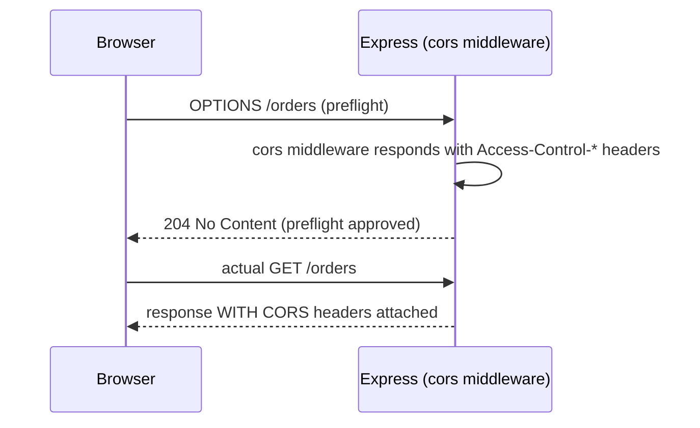

This is the same CORS preflight behavior described generally in [[07 Servlets and Filters]] §3.5 — Express's `cors` middleware handles both the preflight `OPTIONS` request and attaching headers to the real response.

## 2.6 Security Headers with Helmet

```javascript
import helmet from "helmet";

app.use(helmet()); // sets various security-related HTTP headers by default
```

| Header (set by Helmet) | Protects Against |
|---|---|
| `X-Content-Type-Options: nosniff` | MIME-sniffing attacks |
| `X-Frame-Options` / CSP `frame-ancestors` | Clickjacking |
| `Strict-Transport-Security` | Downgrade attacks (forces HTTPS) |
| Content-Security-Policy | XSS mitigation (restricts allowed content sources) |

## 2.7 Async Route Handlers and Error Propagation

```javascript
// Express 4: async errors are NOT automatically caught - must manually forward
app.get("/orders/:id", async (req, res, next) => {
    try {
        const order = await orderService.findById(req.params.id);
        res.json(order);
    } catch (err) {
        next(err); // REQUIRED in Express 4 - unhandled rejection otherwise
    }
});

// Express 5: async errors ARE automatically caught and forwarded to error middleware
app.get("/orders/:id", async (req, res) => {
    const order = await orderService.findById(req.params.id); // if this throws, Express 5 catches it automatically
    res.json(order);
});
```

> [!WARNING]
> In **Express 4** (still widely deployed), a rejected Promise inside an `async` route handler is **not** automatically caught — without an explicit `try/catch` + `next(err)`, the error becomes an unhandled rejection that never reaches your error middleware and never sends a response, leaving the client hanging. **Express 5** fixes this by automatically catching rejected promises from async handlers and forwarding them to error middleware. Know which major version you're on.

## 2.8 Serving Static Files and Templating

```javascript
app.use(express.static("public")); // serves files directly, e.g., /logo.png -> public/logo.png

app.set("view engine", "ejs");
app.get("/dashboard", (req, res) => {
    res.render("dashboard", { orders }); // renders views/dashboard.ejs with data
});
```

Most production Express usage today is API-only (JSON responses, no server-rendered templates), with templating engines (EJS, Pug, Handlebars) reserved for simpler server-rendered pages or email templates.

## 2.9 Response Helpers

```javascript
res.status(201).json({ id: 1 });
res.status(204).end(); // no body
res.redirect("/login");
res.set("X-Custom-Header", "value");
res.cookie("sessionId", "abc123", { httpOnly: true, secure: true });
res.download("report.pdf");
```

## 2.10 Basic Testing

```javascript
import request from "supertest";
import app from "../app.js";

describe("Orders API", () => {
    it("creates an order", async () => {
        const response = await request(app)
            .post("/orders")
            .send({ customerId: "c1", items: [] });
        expect(response.status).toBe(201);
    });

    it("returns 404 for missing order", async () => {
        const response = await request(app).get("/orders/999");
        expect(response.status).toBe(404);
    });
});
```

Supertest lets you test Express routes directly (in-process, no real network socket needed) by passing the `app` instance itself.

---

# 3. Advanced Concepts (Senior Level)

## 3.1 Route Matching Internals

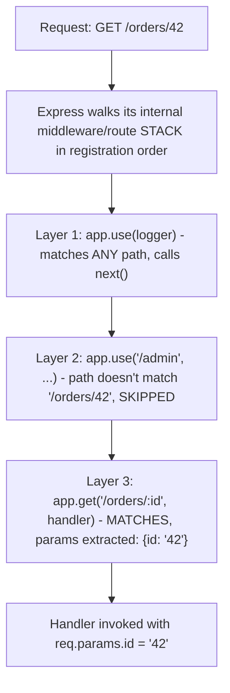

Express compiles route patterns (`/orders/:id`) into regular expressions internally (historically via the `path-to-regexp` library) and checks each registered layer in order against the incoming method + path, stopping at the first match unless that layer calls `next()` to continue past itself.

## 3.2 Error-Handling Middleware Chaining

```javascript
app.use((err, req, res, next) => {
    if (err instanceof ValidationError) {
        return res.status(400).json({ error: err.message });
    }
    next(err); // pass to the NEXT error handler if this one doesn't handle this error type
});

app.use((err, req, res, next) => {
    if (err instanceof NotFoundError) {
        return res.status(404).json({ error: err.message });
    }
    next(err);
});

app.use((err, req, res, next) => { // final catch-all
    console.error(err);
    res.status(500).json({ error: "Internal server error" });
});
```

Multiple error-handling middleware functions can be chained, each handling specific error types and forwarding unhandled ones with `next(err)` — mirroring how regular middleware chains, but specifically for the error-handling track.

## 3.3 `next(err)` vs. Throwing vs. Calling `next()` with No Argument

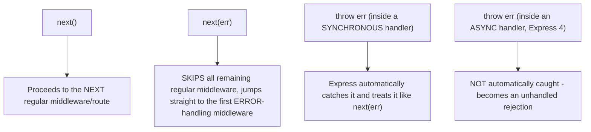

## 3.4 Rate Limiting

```javascript
import rateLimit from "express-rate-limit";

const limiter = rateLimit({
    windowMs: 15 * 60 * 1000, // 15 minutes
    limit: 100,                // 100 requests per window per IP
    standardHeaders: true,
    legacyHeaders: false
});

app.use("/api/", limiter);
```

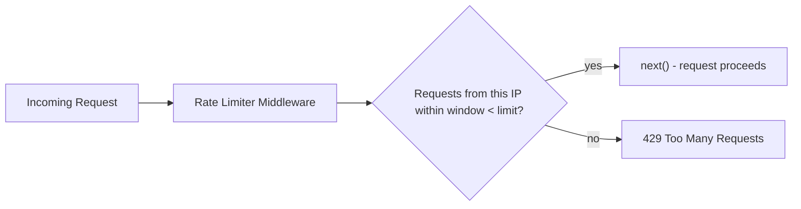

> [!WARNING]
> In-memory rate limiting (the default store) only tracks counts **per process** — in a multi-replica deployment (see [[05 Node.js]] §3.1), each replica enforces its own independent limit, meaning the *effective* rate limit is `limit × number of replicas`. Use a shared store (Redis) for accurate limits across horizontally-scaled deployments.

## 3.5 Request Timeout Handling

```javascript
import timeout from "connect-timeout";

app.use(timeout("5s"));

app.use((req, res, next) => {
    if (!req.timedout) next();
});

app.get("/slow-endpoint", async (req, res) => {
    const result = await slowOperation();
    if (!req.timedout) res.json(result); // avoid writing to a response after timeout already fired
});
```

Without explicit timeout handling, a slow downstream dependency can leave a request (and its allocated resources) hanging indefinitely — always set timeouts on both the Express layer and any outbound calls (database queries, HTTP clients) inside handlers.

## 3.6 Centralized Async Error Wrapping

```javascript
function asyncHandler(fn) {
    return (req, res, next) => {
        Promise.resolve(fn(req, res, next)).catch(next);
    };
}

app.get("/orders/:id", asyncHandler(async (req, res) => {
    const order = await orderService.findById(req.params.id); // no try/catch needed
    res.json(order);
}));
```

This wrapper pattern is the common Express 4 workaround for the "async errors aren't auto-caught" limitation (§2.7) — wrapping every async handler once, rather than repeating `try/catch` + `next(err)` boilerplate in every single route.

## 3.7 Content Negotiation and API Versioning

```javascript
app.get("/orders/:id", (req, res) => {
    res.format({
        "application/json": () => res.json(order),
        "application/xml": () => res.send(toXml(order)),
        default: () => res.status(406).send("Not Acceptable")
    });
});
```

```javascript
app.use("/v1/orders", ordersV1Router);
app.use("/v2/orders", ordersV2Router);
```

## 3.8 Failure Scenarios

| Failure | Symptom | Common Cause | Fix |
|---|---|---|---|
| Request hangs forever, no response | Client times out, no server error logged | A middleware function never calls `next()` or sends a response | Audit every middleware for a guaranteed `next()`/response call on every code path |
| Error middleware never invoked | Unhandled errors crash the process or produce Express's default HTML error page | Error middleware defined with fewer than 4 parameters | Ensure error-handling middleware has the exact `(err, req, res, next)` signature |
| Client receives no response after an async handler throws (Express 4) | Silent hang, `UnhandledPromiseRejection` in logs | Missing `try/catch` + `next(err)` in an async route handler | Use `try/catch` explicitly, an `asyncHandler` wrapper, or upgrade to Express 5 |
| Route matches the wrong handler | Unexpected handler invoked for a given path | Middleware/route registration order places a broader-matching layer before a more specific one | Reorder registration from most-specific to least-specific, or use exact path matching |
| Rate limiting ineffective in production | Users bypass intended limits under load | In-memory rate limit store used across multiple replicas | Use a shared store (Redis) for the rate limiter |
| Response sent twice / "Cannot set headers after they are sent" | Crash or warning in logs | A handler calls `res.json()`/`res.send()` more than once (e.g., after a timeout already responded) | Guard against double-responses with early returns and `req.timedout` checks |
| CORS works with Postman but fails from the browser | Preflight succeeds, actual request blocked, or vice versa | `cors` middleware misconfigured or registered after routes it should protect | Register `cors()` before the routes it needs to apply to; verify allowed origins/credentials configuration |

## 3.9 Express vs. Fastify vs. NestJS


| Aspect | Express | Fastify | NestJS |
|---|---|---|---|
| Philosophy | Minimal, unopinionated | Performance-focused, schema-driven | Full-featured, structured (Angular-inspired) |
| Raw throughput | Good | Generally higher (optimized JSON serialization, lower overhead) | Depends on underlying adapter (Express or Fastify) |
| Built-in validation | No (bring your own) | Yes (JSON Schema-based) | Yes (via decorators + class-validator) |
| Learning curve | Low | Low-medium | Higher (DI, modules, decorators) |
| Best fit | Small-to-medium APIs, maximum flexibility, huge middleware ecosystem needs | High-throughput APIs, teams wanting built-in validation/schema | Large enterprise codebases wanting strong structure/conventions |

> [!TIP]
> Express remains the most widely adopted choice for its simplicity and ecosystem maturity; reach for Fastify when raw throughput matters and you're comfortable with schema-first design, and NestJS when you want Angular-style architecture (modules, dependency injection, decorators) for a large team — NestJS can itself run on an Express or Fastify adapter underneath.

## 3.10 Security Deep Dive

| Risk | Mitigation |
|---|---|
| Missing security headers by default | `helmet()` middleware |
| No built-in input validation | Schema validation middleware (zod/Joi) on every route accepting input |
| Prototype pollution via `req.body`/`req.query` (see [[01 JavaScript]] §3.5) | Validate/whitelist expected keys explicitly; avoid naive recursive merges of request data |
| SQL/NoSQL injection via unsanitized `req.body`/`req.params` passed to queries | Parameterized queries/ORMs, never string-concatenated queries |
| Sensitive data leaking via verbose error responses | Custom error middleware returning sanitized messages in production |
| Trusting `req.ip`/`X-Forwarded-For` behind a proxy without configuring `trust proxy` | Set `app.set("trust proxy", 1)` correctly when behind a load balancer/reverse proxy |

```javascript
app.set("trust proxy", 1); // trust the first hop (e.g., a load balancer) for X-Forwarded-* headers
```

---

# 4. Real-World System Design Usage

## 4.1 Where Express Is Used in Production

- REST API backends for web/mobile applications.
- BFF (Backend-for-Frontend) layers aggregating multiple downstream services.
- Internal admin tools and lightweight server-rendered apps.
- Microservices in Node.js-based architectures.
- API gateways (custom-built, though dedicated gateway products are also common).

## 4.2 Typical Production Architecture

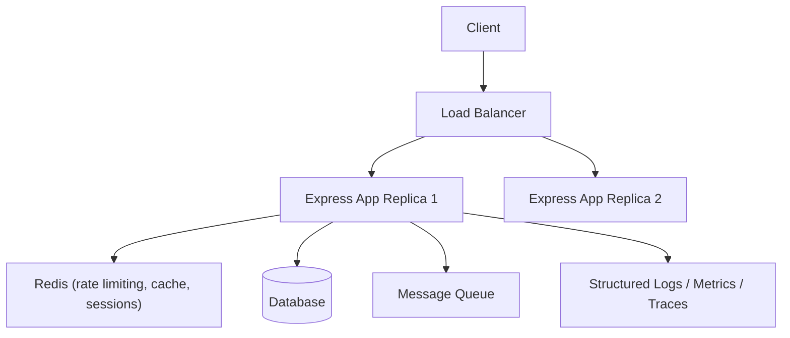

## 4.3 Big-Company Style Thinking

| Concern | Express Design Response |
|---|---|
| Reliability | Centralized async error wrapping, request timeouts, graceful shutdown (see [[05 Node.js]] §3.4) |
| Scale | Multiple replicas behind a load balancer, shared rate-limit/session stores (Redis) |
| Observability | Request-logging middleware with correlation IDs, structured logging, APM instrumentation |
| Security | `helmet()`, schema validation on every route, `trust proxy` configured correctly |
| Maintainability | Feature-based `Router` modules, layered architecture (routes → services → repositories) |
| Performance | Minimal middleware on hot paths, async handlers throughout, connection pooling |

## 4.4 Example: Order API Request Flow

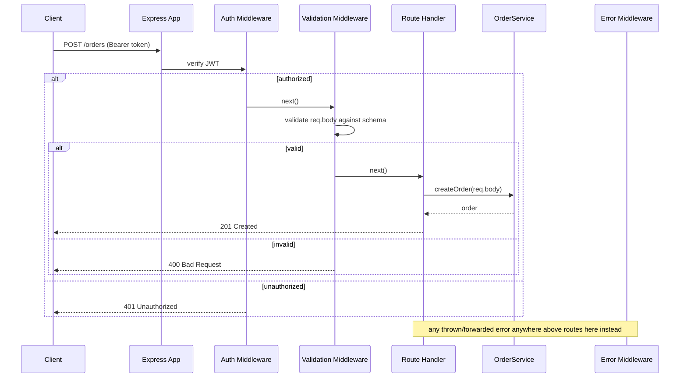

## 4.5 Layered Architecture

```text
src/
    app.js               - Express app setup, global middleware registration
    routes/
        orders.js         - express.Router() for /orders endpoints
        users.js
    middleware/
        auth.js
        errorHandler.js
        validate.js
    services/
        orderService.js   - business logic
    repositories/
        orderRepository.js - database access
```

## 4.6 Integration with Other Systems

| System | Express Integration |
|---|---|
| Databases | Prisma/TypeORM/Knex/native drivers, called from the service layer |
| Authentication | Passport.js, custom JWT middleware |
| Validation | zod, Joi, express-validator |
| Security | `helmet`, `cors`, `express-rate-limit` |
| Observability | `morgan`/pino for request logging, OpenTelemetry for tracing |
| Testing | Supertest for HTTP-level assertions, Jest/Vitest as the test runner |

---

# 5. Interview Preparation

## 5.1 What Interviewers Expect

For "Express.js" topics, interviewers usually expect:

- You understand middleware and the `(req, res, next)` signature.
- You can build routes with params, query strings, and body parsing.
- You know how error-handling middleware differs from regular middleware.

For senior backend roles, they also expect:

- You understand middleware execution order and its practical implications.
- You know the Express 4 vs. 5 async error-handling difference.
- You can design centralized error handling, validation, and security middleware for a production API.
- You can compare Express against Fastify/NestJS with real trade-offs.

## 5.2 Most Important Questions and Answers

### Q1. What is middleware in Express?

A function with the signature `(req, res, next)` (or `(err, req, res, next)` for error handling) that sits in the request pipeline, able to inspect/modify the request or response, end the request-response cycle, or call `next()` to pass control to the next function in the chain.

### Q2. How does Express distinguish error-handling middleware from regular middleware?

Purely by **function arity** — a middleware function with exactly 4 parameters `(err, req, res, next)` is treated as error-handling middleware. One with 3 or fewer parameters is treated as regular middleware, even if it's intended to handle errors.

### Q3. What happens if a middleware function never calls `next()` or sends a response?

The request hangs indefinitely — the client never receives a response, and no error is automatically thrown, making this a particularly hard-to-diagnose bug (nothing "crashes," it just never completes).

### Q4. Why does middleware registration order matter?

Express executes middleware in the exact order it's registered for a matching request. Registering a body parser after a route that reads `req.body` means that route sees an unparsed body; registering broad middleware/routes before more specific ones can cause the broad one to handle (or block) a request meant for the specific one.

### Q5. What's the difference in async error handling between Express 4 and Express 5?

In Express 4, a rejected Promise inside an `async` route handler is not automatically caught — you must explicitly `try/catch` and call `next(err)`, or wrap the handler, or the error becomes an unhandled rejection with no response ever sent. Express 5 automatically catches rejected promises from async handlers and forwards them to error-handling middleware.

### Q6. How do you organize a large Express application?

Using `express.Router()` to group related routes into modules (e.g., one router per resource/feature), mounted onto the main app with a path prefix (`app.use("/orders", ordersRouter)`), combined with a layered structure separating routes, middleware, services, and data access.

### Q7. Why is in-memory rate limiting insufficient for a horizontally-scaled Express deployment?

Each process/replica maintains its own independent count, so the effective limit across the whole deployment becomes `configured limit × number of replicas` rather than the intended global limit — a shared store (Redis) is needed to enforce an accurate limit across all instances.

### Q8. What's the purpose of `app.set("trust proxy", 1)`?

It tells Express to trust `X-Forwarded-For`/`X-Forwarded-Proto` headers from the first hop (typically a load balancer or reverse proxy), which is necessary for `req.ip` and `req.secure` to reflect the real client IP/protocol rather than the proxy's — critical for rate limiting, logging, and security checks behind a proxy.

### Q9. How does Express match a route like `/orders/:id`?

Historically via the `path-to-regexp` library, which compiles route patterns into regular expressions at registration time; incoming requests are checked against each registered layer's compiled pattern in order, and named parameters (`:id`) are extracted into `req.params` upon a match.

### Q10. When would you choose Fastify or NestJS over plain Express?

Fastify when raw throughput and built-in schema-based validation/serialization matter more than ecosystem breadth. NestJS when you want strong architectural conventions (dependency injection, modules, decorators) for a large team, especially if the team has Angular experience — note NestJS itself can run on an Express or Fastify adapter underneath.

## 5.3 Tricky Questions

### If a route handler and an `app.use()` middleware both match the same path, which runs first?

Whichever was **registered first** in the code, regardless of whether it's a `use()` or a specific method handler like `get()` — Express doesn't prioritize by specificity, only by registration order.

### Can middleware short-circuit the pipeline without an error?

Yes — any middleware can simply call `res.send()`/`res.json()`/`res.end()` instead of `next()`, ending the request-response cycle immediately without ever reaching later middleware or the intended route handler (e.g., an auth middleware rejecting an unauthenticated request with a 401).

### Does calling `next()` twice in the same middleware cause a problem?

Yes — it can cause "Cannot set headers after they are sent" errors or unpredictable double-execution of downstream middleware/handlers, since Express doesn't guard against a middleware function accidentally invoking `next()` more than once.

### Why might `express.json()` silently fail to populate `req.body`?

Common causes: the request's `Content-Type` header isn't `application/json` (the parser only activates for matching content types by default), the body-parsing middleware is registered *after* the route that reads `req.body`, or the payload exceeds the configured size limit and is silently rejected/truncated depending on configuration.

## 5.4 Common Candidate Mistakes

- Forgetting `next()` inside custom middleware, causing hung requests.
- Defining error-handling middleware with the wrong number of parameters.
- Not handling async errors explicitly in Express 4 (missing `try/catch`/`next(err)`).
- Registering routes/middleware in an order that causes broad matches to shadow specific ones.
- Trusting `req.body`/`req.query`/`req.params` without validation.
- Using in-memory rate limiting/sessions in a multi-replica deployment without a shared store.
- Not configuring `trust proxy` behind a load balancer, breaking IP-based logic.

## 5.5 Interview Coding Checklist

- [ ] Every middleware function calls `next()` or sends a response on every code path.
- [ ] Error-handling middleware defined with exactly 4 parameters and registered last.
- [ ] Async route handlers wrapped/try-caught explicitly unless confirmed on Express 5.
- [ ] Input validated via schema middleware before reaching business logic.
- [ ] Routes organized via `express.Router()` per feature/resource for anything beyond a trivial app.
- [ ] Security middleware (`helmet`, `cors`, rate limiting with a shared store) applied globally where appropriate.

---

# 6. Hands-On Thinking

## 6.1 Three Real-World Projects Using Express

### Project 1: E-Commerce REST API

Concepts: `express.Router()` per resource, zod validation middleware, centralized async error wrapping, JWT auth middleware, `helmet`/`cors`.

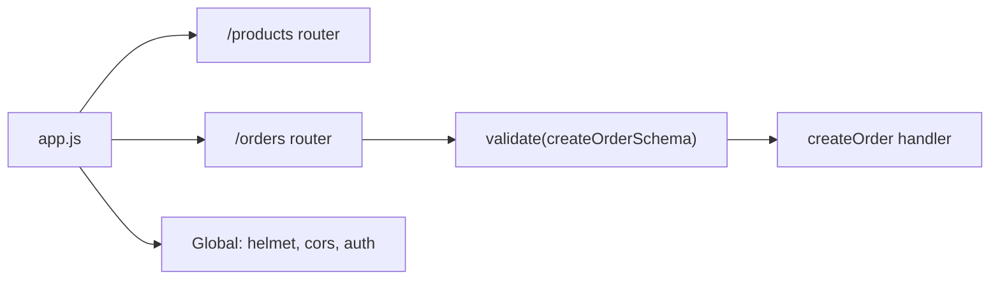

### Project 2: BFF (Backend-for-Frontend) Aggregation Layer

Concepts: Express routes that call multiple downstream microservices concurrently (`Promise.all`), response shaping tailored to a specific frontend, timeout handling per downstream call.

```javascript
app.get("/dashboard-summary", async (req, res, next) => {
    try {
        const [orders, inventory, notifications] = await Promise.all([
            fetchOrders(),
            fetchInventory(),
            fetchNotifications()
        ]);
        res.json({ orders, inventory, notifications });
    } catch (err) {
        next(err);
    }
});
```

### Project 3: Rate-Limited Public API with API Keys

Concepts: custom API-key authentication middleware, Redis-backed rate limiting shared across replicas, request logging with correlation IDs, versioned routes (`/v1`, `/v2`).


## 6.2 Step-by-Step Design Approach

For any Express application:

1. Design the route/resource structure and organize into `Router` modules per feature.
2. Register global middleware (security headers, CORS, body parsing, logging) in the correct order, before routes.
3. Add validation middleware for every route accepting external input.
4. Design centralized error handling with typed error classes mapped to HTTP status codes.
5. Wrap async handlers consistently (helper function, or confirm Express 5).
6. Add security hardening (`helmet`, rate limiting with a shared store, `trust proxy`).
7. Test with Supertest, covering both success and error paths.

## 6.3 Production Implementation Approach

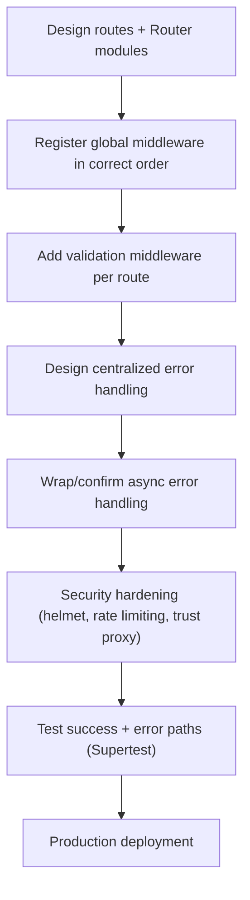

## 6.4 Production Readiness Example

For an Express service, define:

- Global middleware order documented and reviewed (security → parsing → logging → routes → error handler).
- Centralized error-handling middleware mapping custom error types to HTTP status codes consistently.
- Every route accepting external input covered by schema validation middleware.
- Rate limiting backed by a shared store (Redis) if running multiple replicas.
- `trust proxy` configured correctly for the deployment topology.
- Graceful shutdown (see [[05 Node.js]] §3.4) integrated with the Express server instance.

---

# 7. Deep Dive (Optional but Important)

## 7.1 How Express Wraps Node's `http` Module

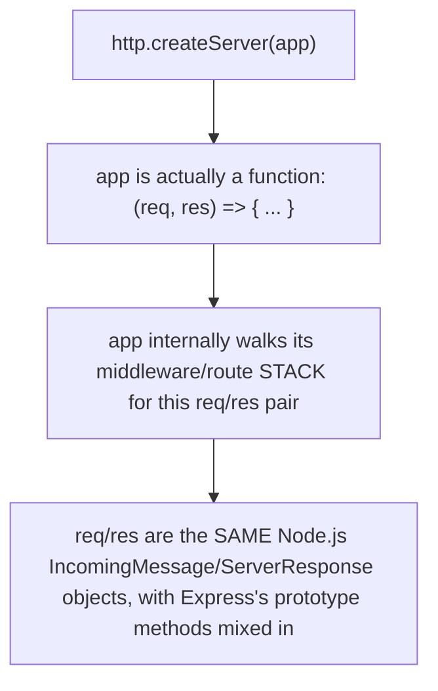

```javascript
const app = express();
// Under the hood, roughly:
http.createServer(app).listen(3000);
// because `app` itself is a callable function matching http.createServer's expected (req, res) signature
```

Express doesn't replace Node's `http` module — an Express `app` is itself a request-handler function compatible with `http.createServer`, and `req`/`res` are the exact same Node.js objects from [[05 Node.js]] §2.5, just augmented with additional Express-specific properties and methods on their prototypes.

## 7.2 The Middleware Stack as an Array of Layers

```text
app._router.stack = [
    { path: '*', handle: loggerMiddleware },
    { path: '/orders', handle: ordersRouter },
    { path: '/users', handle: usersRouter },
    { path: '*', handle: errorHandler }  // 4-arity, marked as error middleware
]
```

Internally, Express maintains an ordered array of "layers," each pairing a path-matcher with a handler function; dispatching a request is essentially iterating this array, checking each layer's matcher against the request, and invoking matching handlers in sequence via the `next()` continuation pattern.

## 7.3 `req`/`res` as Nothing More Than Augmented Node Objects

```javascript
app.get("/", (req, res) => {
    console.log(req instanceof http.IncomingMessage); // true
    console.log(res instanceof http.ServerResponse);   // true
});
```

Because `req`/`res` are the genuine Node.js core objects, every raw Node.js API (`req.headers`, `res.writeHead()`, streaming via `res.write()`) remains available even inside Express handlers — Express's `res.json()`/`res.send()` are convenience methods layered on top, not replacements.

## 7.4 Router Isolation and Sub-Applications

```javascript
const adminRouter = express.Router();
adminRouter.use(requireAdminRole); // ONLY applies within this router's scope

app.use("/admin", adminRouter); // mounted with its own middleware stack, isolated from the rest of the app
```

Each `Router` maintains its **own** middleware stack, isolated from the main app's — middleware registered on a router only ever runs for requests matching that router's mount path, which is the mechanism enabling feature-scoped cross-cutting concerns (like admin-only auth) without affecting unrelated routes.

## 7.5 Debugging Tools

| Tool | Purpose |
|---|---|
| `DEBUG=express:* node app.js` | Verbose internal Express logging (routing decisions, middleware execution) |
| `morgan` | HTTP request logging middleware |
| Supertest | In-process HTTP assertion testing without a real network socket |
| Node.js `--inspect` (see [[05 Node.js]] §7.5) | Standard breakpoint debugging, applies equally to Express handlers |

---

# Production Checklists

## Code Quality Checklist

- [ ] Every middleware function guaranteed to call `next()` or send a response on all code paths.
- [ ] Error-handling middleware has exactly 4 parameters and is registered last.
- [ ] Async handlers wrapped/try-caught consistently (or confirmed running on Express 5).
- [ ] Routes organized into `Router` modules per feature/resource.
- [ ] All external input validated via schema middleware before reaching business logic.

## Performance Checklist

- [ ] Minimal middleware applied on hot paths; expensive middleware scoped only where needed.
- [ ] Database connections pooled, not created per request.
- [ ] Timeouts configured for slow downstream operations inside handlers.
- [ ] Static assets served via a CDN in production, not directly from Express, where feasible.

## Security Checklist

- [ ] `helmet()` applied globally.
- [ ] `cors()` configured with explicit allowed origins, not a wildcard with credentials.
- [ ] Rate limiting backed by a shared store (Redis) for multi-replica deployments.
- [ ] `trust proxy` configured correctly for the deployment's proxy topology.
- [ ] No verbose stack traces exposed in production error responses.

## Debugging Checklist

- [ ] Reproduce with `DEBUG=express:*` to see internal routing/middleware execution.
- [ ] Check middleware registration order first when behavior seems inconsistent.
- [ ] Check for a missing `next()` first when a request hangs indefinitely.
- [ ] Check error-middleware arity first when errors aren't being caught as expected.
- [ ] Verify Express major version (4 vs. 5) when diagnosing async error-handling gaps.

---

# Learning Roadmap

## Phase 1: Beginner

Learn: basic routing, `express.json()`, route params/query strings, basic error handling.

Practice: a simple CRUD API for a single resource.

## Phase 2: Intermediate

Learn: `express.Router()`, custom middleware, validation middleware, CORS, Helmet, Supertest testing.

Practice: a multi-resource REST API with modular routers and consistent validation.

## Phase 3: Advanced

Learn: centralized async error handling, rate limiting with a shared store, content negotiation/API versioning, `trust proxy`.

Practice: a production-hardened API with security middleware, versioned routes, and Redis-backed rate limiting.

## Phase 4: Production Backend Engineer

Learn: Express internals (middleware stack, route compilation), Express vs. Fastify/NestJS trade-offs, graceful shutdown integration.

Practice: a production-style Express service with full observability, horizontal scaling considerations, and a documented middleware/error-handling architecture.

---

# Self-Review Completion Loop

The topic was reviewed against:

- Official Express.js documentation (expressjs.com), including the Express 4 vs. 5 migration guide.
- Common production incident patterns (hung requests, unhandled async errors, rate-limiting gaps in scaled deployments).
- Direct comparison against Fastify and NestJS.
- Interview patterns for beginner through senior backend roles.

## Gap Review Matrix

| Area | Covered? | Notes |
|---|---|---|
| Basic routing | Yes | Params, query strings, all HTTP methods |
| Middleware fundamentals | Yes | Signature, `next()`, missing-`next()` pitfall |
| Error-handling middleware | Yes | 4-arity detection mechanism explained |
| `express.Router()` | Yes | Modular routing, isolated middleware stacks |
| Validation | Yes | Schema middleware pattern (zod) |
| CORS/Helmet/security headers | Yes | Sequence diagram, header table |
| Async error handling (v4 vs v5) | Yes | Explicit version difference, wrapper pattern |
| Rate limiting | Yes | Multi-replica in-memory pitfall, Redis fix |
| Request timeouts | Yes | Hanging-request prevention |
| Express vs. Fastify vs. NestJS | Yes | Comparison table |
| Failure scenarios | Yes | Seven concrete production failure patterns |
| Security deep dive | Yes | `trust proxy`, injection risks, prototype pollution cross-link |
| Interview prep | Yes | Common and tricky questions, candidate mistakes |
| Hands-on projects | Yes | Three realistic projects with diagrams |
| Internals | Yes | `http` wrapping, middleware stack array, Router isolation |

No significant beginner-to-senior Express.js gaps remain for the requested scope. Further specialization should split into separate deep dives: **Fastify Deep Dive**, **NestJS Architecture**, **Express + Passport.js Authentication Strategies**, and **Building an API Gateway with Express**.

---

# Official References

- Express.js Official Documentation: <https://expressjs.com/>
- Express 5 Migration Guide: <https://expressjs.com/en/guide/migrating-5.html>
- Express Error Handling Guide: <https://expressjs.com/en/guide/error-handling.html>
- Helmet.js Documentation: <https://helmetjs.github.io/>
- Supertest Documentation: <https://github.com/ladjs/supertest>

---

## Final Summary

Express reduces to one core idea repeated everywhere: a pipeline of `(req, res, next)` functions executed in registration order, where any function can inspect, modify, end, or forward the request. Production mastery comes from respecting that order (parsers before routes, auth before protected handlers, error middleware last), knowing precisely how Express distinguishes error-handling middleware (by arity) from regular middleware, being deliberate about async error propagation (especially on Express 4, where it isn't automatic), and layering security middleware (`helmet`, `cors`, validation, shared-store rate limiting) as a first-class architectural concern rather than an afterthought.
