# Hono: Beginner-to-Expert Engineering Guide

> **Scope:** This guide teaches Hono — a small, fast, multi-runtime web framework — from first principles through production usage on edge/serverless platforms (Cloudflare Workers, Deno, Bun) and traditional Node.js. Builds on [[01 JavaScript]] and contrasts directly with [[06 Express.js]] throughout, since Hono solves the same routing/middleware problem with a different architecture optimized for portability and edge execution.

## Table of Contents

1. [Executive Summary](#executive-summary)
2. [1. Fundamentals](#1-fundamentals-beginner-level)
3. [2. Core Concepts](#2-core-concepts-intermediate-level)
4. [3. Advanced Concepts](#3-advanced-concepts-senior-level)
5. [4. Real-World System Design Usage](#4-real-world-system-design-usage)
6. [5. Interview Preparation](#5-interview-preparation)
7. [6. Hands-On Thinking](#6-hands-on-thinking)
8. [7. Deep Dive](#7-deep-dive-optional-but-important)
9. [Production Checklists](#production-checklists)
10. [Learning Roadmap](#learning-roadmap)
11. [Self-Review Completion Loop](#self-review-completion-loop)
12. [Official References](#official-references)

---

## Executive Summary

Hono ("flame" in Japanese) is a web framework built on the standard **Web APIs** (`Request`/`Response`/`fetch`) rather than any single runtime's proprietary APIs, letting the exact same application code run unmodified on Cloudflare Workers, Deno, Bun, AWS Lambda, or Node.js.

The core idea:

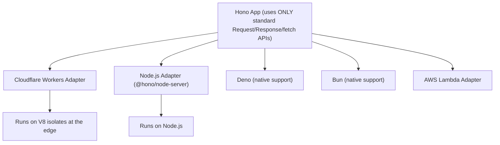

> [!TIP]
> Learn Hono as **Express's mental model (middleware pipeline, routing) rebuilt on Web Standard APIs instead of Node's `http` module**. Everything you know about middleware ordering, `next()`-style continuation, and route params from [[06 Express.js]] transfers directly — the difference is architectural portability and performance, not a new programming model.

---

# 1. Fundamentals (Beginner Level)

## 1.1 What Is Hono?

Hono is a lightweight, fast web framework with an Express-like API, built entirely on Web Standard APIs (`Request`, `Response`, `Headers`, `fetch`), making it runtime-agnostic by design.

```bash
npm create hono@latest my-app
```

```javascript
import { Hono } from "hono";
import { serve } from "@hono/node-server";

const app = new Hono();

app.get("/", (c) => c.text("Hello, Hono!"));

serve(app); // runs on Node.js; on Cloudflare Workers, `export default app` is enough
```

## 1.2 Why Hono Exists

| Problem | Hono's Answer |
|---|---|
| Express is tightly coupled to Node.js's `http` module and `req`/`res` objects | Built on Web Standard `Request`/`Response`, portable across runtimes |
| Cold-start latency matters on serverless/edge platforms | Extremely small, dependency-light core optimized for fast cold starts |
| Teams want to deploy the same API to multiple platforms (edge for global latency, Node.js for existing infra) | One codebase runs unmodified across supported runtimes |
| TypeScript support often feels bolted-on in older frameworks | Hono is TypeScript-first, with strong end-to-end type inference (including RPC mode, see §3.4) |
| Express's routing performance degrades with very large route tables | Hono uses a highly optimized router (RegExpRouter by default) for fast route matching at scale |

## 1.3 Problems Hono Solves

Hono is especially good when you need:

- An API deployed to edge/serverless platforms (Cloudflare Workers, Deno Deploy, Vercel Edge Functions) where cold-start time and small bundle size matter.
- A single codebase portable across multiple JavaScript runtimes.
- Strong TypeScript inference from route definition through to the client (RPC mode).
- Express-like ergonomics without Node.js-specific coupling.

Hono is less critical when:

- You're committed to a traditional Node.js-only deployment with no edge/portability requirements — Express's ecosystem maturity may outweigh Hono's architectural advantages there.
- You need a specific Express-only middleware package with no Hono equivalent and no easy way to adapt it.

## 1.4 Real-World Analogy

Think of Hono like a shipping container standard versus a custom-built truck bed.

Express is like cargo built specifically to fit one truck's bed (Node.js's `http` module) — it works great on that truck, but moving it to a ship or a train requires rebuilding the cargo hold. Hono packages your application logic in a standardized shipping container (Web Standard `Request`/`Response`) that any compatible vehicle — truck (Node.js), ship (Cloudflare Workers), train (Deno/Bun) — can carry without modification.

```text
Custom truck bed        = Node.js's proprietary http.IncomingMessage/ServerResponse (what Express uses)
Standard shipping container = Web Standard Request/Response (what Hono uses)
Any vehicle can carry it = any runtime implementing the Web Standard APIs can run a Hono app
```

## 1.5 Core Vocabulary

| Term | Meaning |
|---|---|
| Context (`c`) | Hono's per-request object wrapping the standard `Request` and providing response helpers |
| Web Standard APIs | `Request`, `Response`, `Headers`, `fetch` — specified by WHATWG, implemented by browsers and modern runtimes |
| Adapter | A thin runtime-specific layer translating a platform's native request handling into Hono's standard interface |
| RegExpRouter | Hono's default, high-performance router implementation |
| RPC Mode | Hono's mechanism for generating a fully-typed client directly from your server route definitions |
| Edge Runtime | A JavaScript execution environment (often V8 isolates) running close to users geographically, with fast cold starts |
| Middleware | Same concept as Express: a function that can inspect/modify the request/response or short-circuit the chain |

## 1.6 Basic Routing

```javascript
app.get("/orders", (c) => c.json(orders));
app.get("/orders/:id", (c) => {
    const id = c.req.param("id");
    return c.json(findOrder(id));
});
app.post("/orders", async (c) => {
    const body = await c.req.json();
    const order = createOrder(body);
    return c.json(order, 201);
});
```

| `c.req` Method | Equivalent in Express |
|---|---|
| `c.req.param("id")` | `req.params.id` |
| `c.req.query("status")` | `req.query.status` |
| `await c.req.json()` | `req.body` (after `express.json()`) |
| `c.req.header("Authorization")` | `req.headers.authorization` |

## 1.7 The Context Object and Response Helpers

```javascript
app.get("/orders/:id", (c) => {
    const order = findOrder(c.req.param("id"));
    if (!order) return c.json({ error: "Not found" }, 404);
    return c.json(order);
});
```

| Helper | Purpose |
|---|---|
| `c.text(str)` | Plain text response |
| `c.json(obj, status?)` | JSON response |
| `c.html(str)` | HTML response |
| `c.redirect(url)` | Redirect response |
| `c.status(code)` | Set the status code separately |
| `c.header(name, value)` | Set a response header |

> [!IMPORTANT]
> Unlike Express handlers, which **mutate** the `res` object and implicitly send a response, Hono handlers must **return** a `Response` object (or use `c.json()`/`c.text()`, which construct and return one) — this mirrors how a standard `fetch`-based server function works, since `c.json()` etc. are just convenience wrappers around `new Response(...)`.

## 1.8 Basic Middleware

```javascript
app.use(async (c, next) => {
    console.log(`${c.req.method} ${c.req.url}`);
    await next(); // pass control to the next middleware/handler
});

app.use("/admin/*", async (c, next) => {
    const token = c.req.header("Authorization");
    if (!token) return c.json({ error: "Unauthorized" }, 401);
    await next();
});
```

> [!WARNING]
> Hono middleware uses `await next()` — since it's built around async/await rather than a callback-style `next()`, **forgetting `await`** before `next()` doesn't hang the request the way forgetting to call Express's `next()` does, but it can cause code *after* `next()` in the same middleware to run before the downstream handler actually finishes, breaking any logic that depends on running strictly after the response is fully generated (e.g., timing/logging middleware).

## 1.9 Built-In Middleware

```javascript
import { cors } from "hono/cors";
import { logger } from "hono/logger";
import { secureHeaders } from "hono/secure-headers";
import { prettyJSON } from "hono/pretty-json";

app.use(logger());
app.use(cors({ origin: "https://app.example.com" }));
app.use(secureHeaders());
```

Hono ships many commonly-needed middleware (CORS, logging, security headers, JWT, basic auth, compression, caching) as part of the core package or official sub-packages — no need to reach for third-party npm packages the way Express often requires (`cors`, `helmet`, `morgan`).

## 1.10 Basic Testing

```javascript
import { describe, it, expect } from "vitest";
import app from "../app";

describe("GET /orders/:id", () => {
    it("returns 404 for missing order", async () => {
        const res = await app.request("/orders/999");
        expect(res.status).toBe(404);
    });
});
```

`app.request()` lets you test a Hono app directly by constructing a request and invoking the app as a function — no real network socket or server startup needed, working identically across every supported runtime.

---

# 2. Core Concepts (Intermediate Level)

## 2.1 Full Request Lifecycle

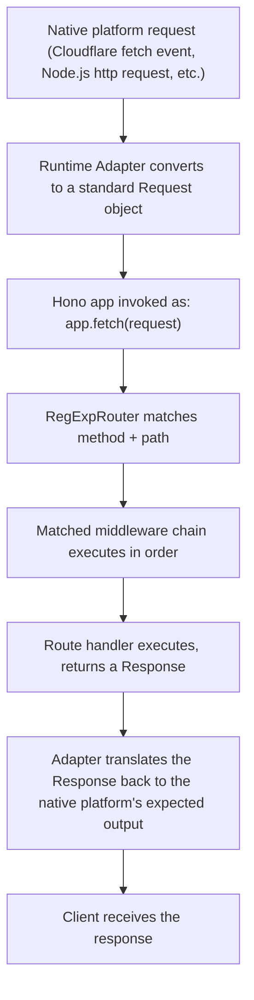

Because a Hono app's core method is `app.fetch(request): Promise<Response>` — literally matching the standard `fetch` function signature — the same app object can be handed directly to Cloudflare's `export default app`, wrapped by `@hono/node-server`'s `serve()` for Node.js, or invoked directly in tests via `app.request()`.

## 2.2 Middleware Execution Model: `await next()` as Onion Layers

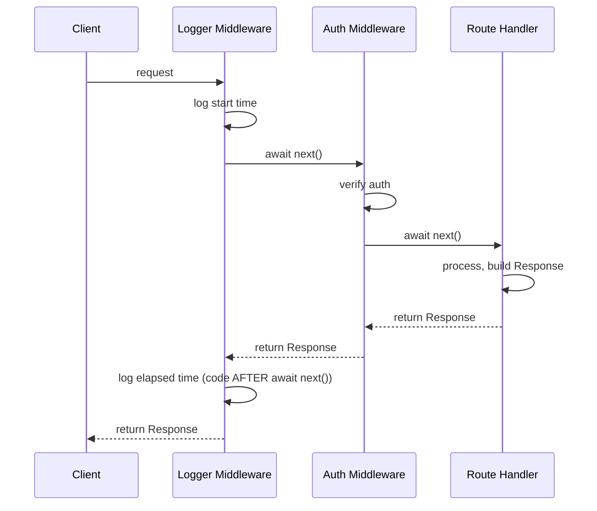

```javascript
app.use(async (c, next) => {
    const start = Date.now();
    await next(); // control passes downstream, THEN returns here once handler completes
    const elapsed = Date.now() - start;
    c.header("X-Response-Time", `${elapsed}ms`); // runs AFTER the handler, before response is sent
});
```

This "onion" model — code before `await next()` runs on the way in, code after runs on the way out — is functionally identical to Express's middleware chain but expressed with async/await instead of a callback, and is also the same conceptual model used by Koa (which directly inspired this part of Hono's design).

## 2.3 Route Grouping

```javascript
import { Hono } from "hono";

const ordersRouter = new Hono();
ordersRouter.get("/", (c) => c.json(listOrders()));
ordersRouter.get("/:id", (c) => c.json(getOrder(c.req.param("id"))));

const app = new Hono();
app.route("/orders", ordersRouter); // mounts ordersRouter under /orders prefix
```

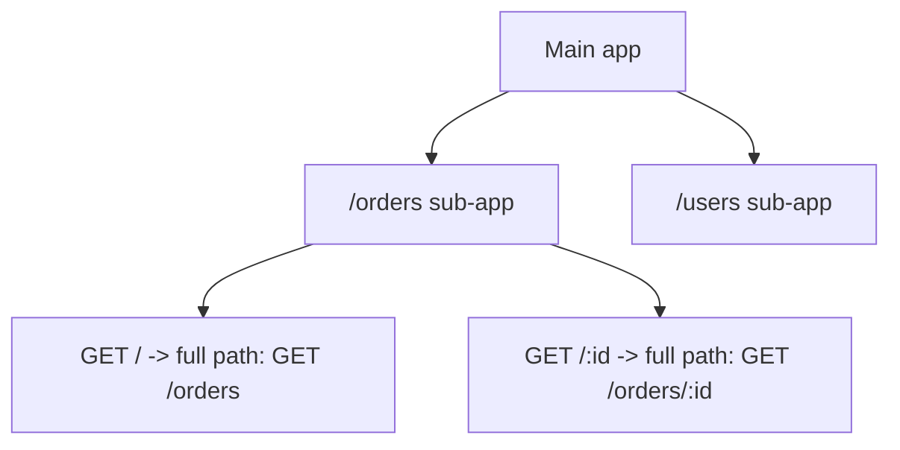

Directly analogous to Express's `express.Router()` (see [[06 Express.js]] §2.2) — a Hono sub-app is itself a full `Hono` instance, mountable onto a parent app with `.route()`.

## 2.4 Validation Middleware

```javascript
import { zValidator } from "@hono/zod-validator";
import { z } from "zod";

const createOrderSchema = z.object({
    customerId: z.string(),
    items: z.array(z.object({ sku: z.string(), quantity: z.number().positive() }))
});

app.post("/orders", zValidator("json", createOrderSchema), (c) => {
    const body = c.req.valid("json"); // fully typed, already validated
    return c.json(createOrder(body), 201);
});
```

Hono's official validator middleware integrates directly with schema libraries (zod, Valibot) and — critically for TypeScript users — **infers the validated type** for `c.req.valid("json")`, so the handler gets full type safety without a separate manual type annotation.

## 2.5 Error Handling

```javascript
app.onError((err, c) => {
    console.error(err);
    if (err instanceof HTTPException) {
        return err.getResponse();
    }
    return c.json({ error: "Internal server error" }, 500);
});

app.notFound((c) => c.json({ error: "Not found" }, 404));
```

```javascript
import { HTTPException } from "hono/http-exception";

app.get("/orders/:id", (c) => {
    const order = findOrder(c.req.param("id"));
    if (!order) throw new HTTPException(404, { message: "Order not found" });
    return c.json(order);
});
```

> [!TIP]
> Unlike Express (where error-handling middleware is distinguished by function arity — see [[06 Express.js]] §1.9), Hono uses a single dedicated `app.onError()` handler registered once per app, and a `throw`n error (synchronous or from an `async` handler) is **automatically caught** and routed there — there's no Express-4-style gap where async errors silently vanish.

## 2.6 Environment Bindings (Platform-Specific Resources)

```javascript
type Bindings = {
    DATABASE_URL: string;
    MY_KV: KVNamespace; // Cloudflare Workers KV binding
};

const app = new Hono<{ Bindings: Bindings }>();

app.get("/orders", async (c) => {
    const dbUrl = c.env.DATABASE_URL; // typed access to platform-specific bindings/env vars
    const cached = await c.env.MY_KV.get("orders-cache");
});
```

`c.env` is Hono's typed abstraction over however the underlying runtime exposes environment variables and platform-specific resources (Cloudflare Workers' bindings, Node's `process.env`, Deno's `Deno.env`) — the same application code accesses configuration consistently regardless of deployment target.

## 2.7 Context Variables (Request-Scoped Data)

```javascript
app.use(async (c, next) => {
    const user = await authenticate(c.req.header("Authorization"));
    c.set("user", user); // store request-scoped data
    await next();
});

app.get("/profile", (c) => {
    const user = c.get("user"); // retrieve it in a later middleware/handler
    return c.json(user);
});
```

This is Hono's equivalent of Express's convention of attaching custom properties directly to `req` (e.g., `req.user = ...`) — but `c.set`/`c.get` keep it explicit and (with TypeScript generics) fully typed, rather than relying on ambient object mutation.

## 2.8 Streaming Responses

```javascript
app.get("/stream", (c) => {
    return c.streamText(async (stream) => {
        for (let i = 0; i < 5; i++) {
            await stream.writeln(`chunk ${i}`);
            await stream.sleep(1000);
        }
    });
});
```

Built directly on the Web Standard `ReadableStream`, Hono's streaming helpers work identically whether deployed to an edge runtime or Node.js, unlike Node's native streams (see [[05 Node.js]] §2.4) which require the `@hono/node-server` adapter to bridge to this standard interface.

## 2.9 Serving Static Files

```javascript
import { serveStatic } from "@hono/node-server/serve-static"; // Node.js
// or: import { serveStatic } from "hono/cloudflare-workers"; // Cloudflare

app.use("/static/*", serveStatic({ root: "./public" }));
```

## 2.10 Basic JSX Support (Server-Side Rendering)

```jsx
app.get("/page", (c) => {
    return c.html(<Layout><h1>Hello, Hono JSX!</h1></Layout>);
});

function Layout({ children }) {
    return (
        <html>
            <body>{children}</body>
        </html>
    );
}
```

Hono has built-in JSX support for server-side rendering (no React dependency required — it's Hono's own lightweight JSX renderer), useful for simple server-rendered pages without pulling in a full frontend framework.

---

# 3. Advanced Concepts (Senior Level)

## 3.1 RegExpRouter: How Hono Achieves High Routing Performance

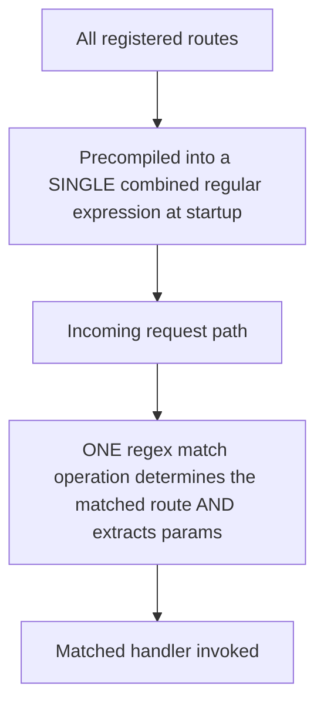

| Router Strategy | Approach | Trade-off |
|---|---|---|
| Linear (Express's default `path-to-regexp`-per-route approach) | Checks each registered route pattern one by one until a match | O(n) in the number of routes; fine for most apps |
| RegExpRouter (Hono's default) | Combines all static/simple routes into fewer, larger precompiled regex checks | Much faster matching at scale, especially with hundreds of routes; some highly dynamic patterns fall back to a slower router internally |

> [!TIP]
> RegExpRouter's performance advantage matters most for APIs with **very large route counts** or extremely latency-sensitive edge deployments where every millisecond of cold-start/dispatch overhead counts — for a typical small-to-medium app, the practical difference versus Express's routing is unlikely to be the dominant factor in overall response latency.

## 3.2 Edge Runtime Constraints

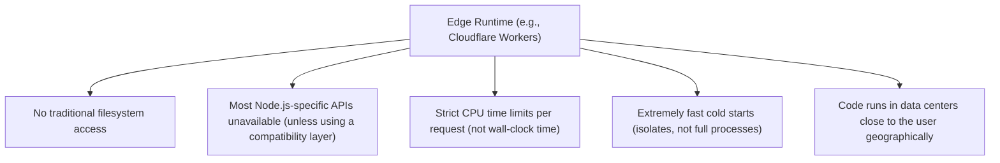

| Constraint | Practical Implication |
|---|---|
| No filesystem | Static assets served via platform-specific storage (Cloudflare KV/R2), not `fs.readFile` |
| Limited Node.js API surface | Database drivers/libraries must support edge runtimes (or use HTTP-based/edge-compatible drivers) |
| CPU time limits | Heavy synchronous computation risks hitting platform-enforced limits; genuinely CPU-bound work belongs elsewhere |
| Fast cold starts | Ideal for bursty, globally-distributed traffic; Hono's minimal footprint is specifically optimized for this |

> [!WARNING]
> Code that works perfectly on Node.js can fail silently or throw at runtime on an edge platform if it depends on Node-specific globals/modules (`fs`, `child_process`, `Buffer` in some contexts) that aren't available there. Writing genuinely portable Hono code means sticking to Web Standard APIs and edge-compatible libraries throughout, not just at the routing layer.

## 3.3 Testing Across Multiple Runtimes

```javascript
// This exact test code works whether app.js targets Node.js, Cloudflare Workers, Deno, or Bun
const res = await app.request("/orders/1", { method: "GET" });
expect(res.status).toBe(200);
```

Because `app.request()` operates purely on standard `Request`/`Response` objects without touching any actual network socket or platform-specific server, the same test suite validates identical behavior regardless of which runtime the app is ultimately deployed to — a direct benefit of the Web Standard API foundation.

## 3.4 RPC Mode: End-to-End Type Safety

```typescript
// server.ts
const app = new Hono()
    .get("/orders/:id", (c) => c.json({ id: c.req.param("id"), status: "PAID" }))
    .post("/orders", zValidator("json", createOrderSchema), (c) => c.json(createOrder(c.req.valid("json"))));

export type AppType = typeof app; // export the TYPE of the route definitions
```

```typescript
// client.ts
import { hc } from "hono/client";
import type { AppType } from "./server";

const client = hc<AppType>("http://localhost:3000");

const res = await client.orders[":id"].$get({ param: { id: "1" } });
const data = await res.json(); // TYPED as { id: string, status: string } - inferred from the SERVER's route definition
```

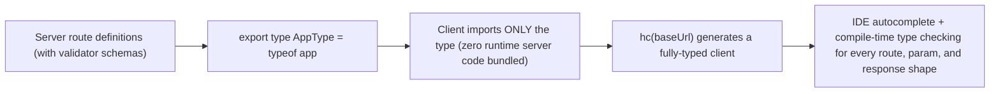

> [!IMPORTANT]
> RPC mode achieves end-to-end type safety **without any code generation step** (unlike OpenAPI-based codegen tools) — it works purely through TypeScript's type inference on the exported `AppType`. Because only the *type* is imported (`import type`), none of the server's actual runtime code, dependencies, or secrets end up bundled into the client — this is a compile-time-only mechanism with zero runtime cost or coupling.

## 3.5 Middleware Composition and Ordering Pitfalls

```javascript
// WRONG: auth runs for EVERY route including public ones, because it's registered before the path-scoped middleware
app.use(authMiddleware);
app.use("/admin/*", requireAdminRole);

// RIGHT: scope auth-related middleware to the paths that actually need it
app.use("/admin/*", authMiddleware, requireAdminRole);
```

Just like Express (see [[06 Express.js]] §2.1), middleware executes in **registration order**, and path-scoped `app.use("/prefix/*", ...)` only applies to matching paths — getting this order wrong is the same class of bug in both frameworks.

## 3.6 Compatibility Layers for Node.js-Specific Code

```javascript
import { getRuntimeKey } from "hono/adapter";

app.get("/info", (c) => {
    const runtime = getRuntimeKey(); // "node", "workerd", "deno", "bun", etc.
    return c.json({ runtime });
});
```

For genuinely runtime-specific needs (e.g., using Node's `fs` module only when deployed to Node.js), Hono provides `getRuntimeKey()` and encourages isolating such code behind clearly-marked conditional branches or separate adapter modules, rather than scattering runtime checks throughout business logic.

## 3.7 Deploying to Cloudflare Workers

```javascript
// worker.js
import { Hono } from "hono";

const app = new Hono();
app.get("/", (c) => c.text("Hello from the edge!"));

export default app; // Cloudflare Workers' runtime calls app.fetch() directly
```

```toml
# wrangler.toml
name = "my-hono-app"
main = "src/worker.js"
compatibility_date = "2024-01-01"
```

```bash
npx wrangler deploy
```

No adapter package is needed for Cloudflare Workers specifically — Hono's core `fetch` interface **is** exactly what Cloudflare Workers expects natively, making it the most direct/zero-overhead deployment target.

## 3.8 Failure Scenarios

| Failure | Symptom | Common Cause | Fix |
|---|---|---|---|
| Middleware "after `next()`" code runs too early | Timing/logging middleware reports incorrect values | Forgetting `await` before `next()` | Always `await next()`; lint for missing awaits |
| Node.js-specific library throws at runtime only on deployment | Works locally (Node.js dev), fails on Cloudflare Workers | Library depends on Node-only APIs (`fs`, certain `Buffer` usage, native addons) | Use edge-compatible libraries, or isolate Node-specific code behind a runtime check |
| RPC client types don't match actual server behavior | Type-safe code still produces runtime errors | Server route changed but client wasn't rebuilt against the updated `AppType`, or `any`-typed escape hatches used somewhere in the route chain | Ensure both sides share a build/CI step that fails on type mismatches; avoid breaking the type-chaining pattern (see §3.4) |
| CPU time limit exceeded on an edge platform | Requests fail intermittently only under certain inputs | Heavy synchronous computation exceeding the platform's enforced CPU time budget | Move CPU-heavy work off the edge to a traditional backend, or optimize the computation |
| Static file serving doesn't work after deploying from Node.js to an edge platform | 404s for previously-working static assets | `serveStatic` import path is Node.js-specific; edge platforms need their own static-serving mechanism (KV/R2-backed) | Use the correct platform-specific static serving approach, don't assume `fs`-based serving is portable |
| Validator middleware silently skipped | Invalid data reaches the handler | `zValidator` registered after a handler that already reads the body, or the target (`"json"`/`"form"`/`"query"`) doesn't match how the client actually sent data | Register validators before the handler; verify content-type/target alignment |

## 3.9 Performance Considerations

- Hono's small footprint and RegExpRouter matter most at scale (large route counts, high-frequency cold starts on edge platforms) — profile before assuming a rewrite from Express will meaningfully change performance for a small app.
- Keep dependencies minimal for edge deployments — every additional package increases bundle size, directly affecting cold-start time on platforms like Cloudflare Workers.
- Use platform-native caching (Cloudflare Cache API, KV) instead of assuming Node.js-style in-memory caching persists across edge isolate invocations (it often doesn't).
- Avoid heavy synchronous work in edge deployments; respect platform-enforced CPU time budgets.

## 3.10 Security Considerations

| Risk | Mitigation |
|---|---|
| Missing security headers | `secureHeaders()` built-in middleware |
| CORS misconfiguration | `cors()` built-in middleware with explicit origin allow-lists |
| Unvalidated input | `zValidator`/`@hono/zod-validator` on every route accepting external input |
| Secrets leaking into edge-deployed bundles | Use platform-native secret bindings (Cloudflare Workers secrets, environment bindings), never hardcode or bundle secrets into client-shipped code |
| RPC mode accidentally leaking server internals | Confirm only `import type` is used on the client — a plain `import` of the server module would bundle real server code/dependencies |

---

# 4. Real-World System Design Usage

## 4.1 Where Hono Is Used in Production

- APIs deployed to Cloudflare Workers, Deno Deploy, or Vercel Edge Functions for global low-latency access.
- Full-stack TypeScript applications wanting end-to-end type safety (RPC mode) between an API and its frontend.
- Multi-runtime products needing to run identical logic across Node.js (existing infra) and edge platforms (new low-latency requirements).
- Lightweight microservices where cold-start time and small footprint matter (serverless functions).

## 4.2 Typical Production Architecture (Edge-Deployed)

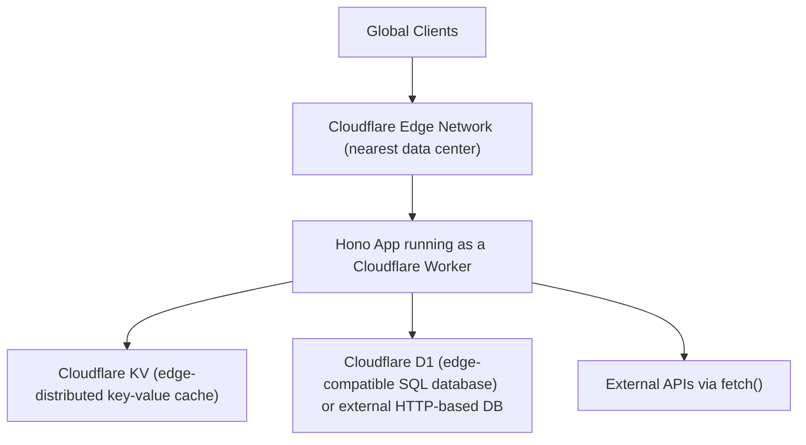

## 4.3 Big-Company Style Thinking

| Concern | Hono Design Response |
|---|---|
| Reliability | `onError`/`notFound` centralized handling, HTTPException for consistent error responses |
| Scale | Edge deployment for geographically-distributed low-latency access; RegExpRouter for large route tables |
| Observability | `logger()` middleware, custom middleware for structured logging/tracing adapted to the target runtime's constraints |
| Security | Built-in `secureHeaders()`/`cors()`, validator middleware on every input boundary |
| Maintainability | RPC mode for compile-time-verified client-server contracts, eliminating a whole class of integration bugs |
| Portability | Business logic written against Web Standard APIs only, isolating any genuinely runtime-specific code |

## 4.4 Example: Full-Stack Type-Safe Order API

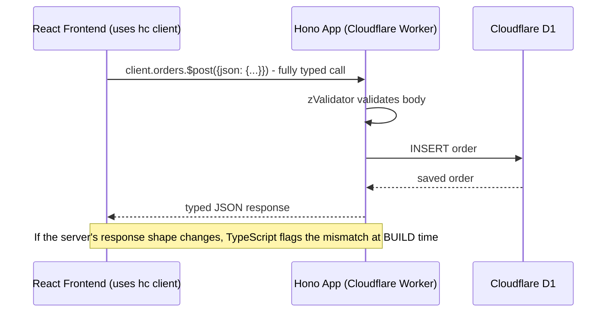

## 4.5 Layered Architecture

```text
src/
    index.ts             - Hono app setup, route mounting, exports AppType
    routes/
        orders.ts          - order-related routes, exported as a sub-app
    middleware/
        auth.ts
    services/
        orderService.ts    - business logic, runtime-agnostic
    lib/
        db.ts               - edge-compatible database client setup
```

## 4.6 Integration with Other Systems

| System | Hono Integration |
|---|---|
| Edge-compatible databases | Cloudflare D1, PlanetScale (HTTP-based driver), Neon (HTTP-based Postgres driver), Turso |
| Validation | `@hono/zod-validator`, Valibot |
| Authentication | `hono/jwt` built-in middleware, `hono/basic-auth` |
| Observability | Custom middleware wrapping OpenTelemetry-compatible tracing, adapted per runtime |
| Frontend integration | RPC mode (`hono/client`) for fully-typed API calls from React/Vue/etc. |
| Testing | Vitest with `app.request()`, works identically regardless of deployment target |

---

# 5. Interview Preparation

## 5.1 What Interviewers Expect

For "Hono" topics, interviewers usually expect:

- You understand what problem Hono solves relative to Express (portability, edge-readiness).
- You can build routes, use middleware, and handle validation/errors.
- You understand the Web Standard `Request`/`Response` foundation.

For senior backend roles, they also expect:

- You can explain RPC mode's compile-time-only type-safety mechanism.
- You understand edge runtime constraints (no filesystem, CPU time limits, limited Node API surface).
- You can compare Hono against Express with concrete architectural trade-offs, not just "Hono is faster."

## 5.2 Most Important Questions and Answers

### Q1. What is the core architectural difference between Hono and Express?

Express is built around Node.js's proprietary `http.IncomingMessage`/`ServerResponse` objects, coupling it tightly to the Node.js runtime. Hono is built entirely on Web Standard `Request`/`Response`/`fetch` APIs, making the same application code portable across Cloudflare Workers, Deno, Bun, and Node.js (via a thin adapter) without modification.

### Q2. Why does Hono's small footprint matter specifically for edge/serverless deployments?

Edge platforms (like Cloudflare Workers) run code in short-lived isolates with strict cold-start expectations — a smaller bundle with fewer dependencies starts executing faster, directly reducing the latency a user experiences on a cold request, which matters far more on serverless/edge than on a long-running traditional server process.

### Q3. How does Hono's RPC mode achieve type safety without code generation?

By exporting the **TypeScript type** of the server's route definitions (`export type AppType = typeof app`) and having the client import only that type, then constructing a typed client via `hc<AppType>(baseUrl)`. TypeScript's structural type inference does all the work at compile time — there's no codegen step, no schema file, and (since only the type is imported) no server runtime code bundled into the client.

### Q4. What are the practical constraints of deploying to an edge runtime like Cloudflare Workers?

No traditional filesystem access, a restricted subset of Node.js APIs available, strict CPU time limits per request, and no long-lived in-memory state across requests (each request may hit a different isolate) — application code must rely on platform-native storage (KV, D1, R2) and avoid Node-specific or heavy synchronous computation.

### Q5. How does Hono's middleware model compare to Express's?

Conceptually identical — an ordered chain of functions that can run code before and after passing control downstream, and can short-circuit by returning a response instead of continuing. Hono expresses this with `async (c, next) => { ...; await next(); ...; }` instead of Express's callback-style `(req, res, next) => next()`, but the "onion" execution order is the same.

### Q6. How does Hono handle errors differently from Express?

Hono registers a single `app.onError()` handler that automatically receives **any** thrown error, whether from a synchronous or `async` handler — there's no Express-4-style gap where async errors silently fail to reach error handling; Express requires either explicit `try/catch`+`next(err)` (v4) or relies on v5's automatic promise-rejection catching.

### Q7. What is `c.env` for, and why is it necessary?

It's Hono's typed abstraction over however the current runtime exposes environment variables and platform-specific resources — Cloudflare Workers' "bindings" (KV namespaces, D1 databases, secrets) don't work like Node's `process.env`, so `c.env` provides one consistent access pattern that adapts correctly regardless of deployment target.

### Q8. When would you NOT choose Hono over Express?

When the application is committed to traditional Node.js-only deployment with no portability or edge-latency requirements, and depends heavily on Express-specific middleware packages without a straightforward Hono equivalent — Express's larger, more mature ecosystem can outweigh Hono's architectural advantages in that specific case.

### Q9. Why might code that works locally on Node.js fail after deploying to Cloudflare Workers?

If it depends on Node.js-specific APIs unavailable in the Workers runtime (`fs`, certain native modules, some `Buffer` behaviors) — Hono's portability applies to the *framework's* API surface, but doesn't automatically make every dependency or line of business logic edge-compatible; that requires deliberate attention to which libraries/APIs are actually used.

### Q10. How is testing a Hono app simplified by its Web Standard foundation?

`app.request()` lets you invoke the app directly with a constructed `Request`, receiving back a real `Response` object — no real network socket, port binding, or platform-specific server startup needed, and the exact same test code validates behavior regardless of which runtime the app is ultimately deployed to.

## 5.3 Tricky Questions

### Does using Hono automatically make an application "edge-ready"?

No — Hono's own API surface is portable, but the application only becomes genuinely edge-ready if its *dependencies* (database drivers, external libraries) and *code* also avoid Node-specific APIs and heavy synchronous work; Hono removes the framework-level obstacle, not every possible obstacle.

### If RPC mode only imports a type, how does the client know the actual base URL/network details?

Those are supplied explicitly when constructing the client (`hc<AppType>("https://api.example.com")`) — RPC mode only guarantees the *shape* of requests/responses matches the server's route definitions at compile time; the actual network call still goes through a real `fetch` at runtime, requiring a real, correctly-configured base URL.

### Can Hono run genuinely stateful, long-lived connections (like WebSockets) on every supported runtime?

Support varies by runtime — Node.js and some platforms support this well, but pure edge/isolate-based platforms (like standard Cloudflare Workers, absent specific stateful primitives like Durable Objects) have different constraints around long-lived connections and in-memory state persistence across requests; portability claims should be verified against the specific feature and target runtime, not assumed universally.

### Is Hono's RegExpRouter always faster than Express's routing in absolute terms?

For most small-to-medium applications, the difference is unlikely to be the dominant factor in real-world latency (network/database calls typically dominate) — RegExpRouter's advantage is most measurable in high-route-count or extremely dispatch-latency-sensitive scenarios, not a universal guarantee of dramatically faster responses in every deployment.

## 5.4 Common Candidate Mistakes

- Claiming Hono is "just a faster Express" without understanding the actual architectural difference (Web Standard APIs vs. Node-specific).
- Assuming any code that runs in Node.js will work unmodified on an edge runtime just because it uses Hono.
- Forgetting `await` before `next()` in middleware.
- Not understanding that RPC mode is a compile-time-only mechanism with no runtime codegen or schema validation of its own (validation still happens via middleware like `zValidator`).
- Assuming in-memory state (caches, counters) persists reliably across requests on edge/serverless platforms.
- Not knowing Hono has a comparable middleware ecosystem to Express, assuming you always need external npm packages for CORS/security headers/logging.

## 5.5 Interview Coding Checklist

- [ ] Middleware always uses `await next()`, never a bare `next()` call.
- [ ] Validators (`zValidator`) registered before handlers that rely on `c.req.valid(...)`.
- [ ] `app.onError`/`app.notFound` registered for centralized error handling.
- [ ] Environment/platform-specific resources accessed via `c.env`, not runtime-specific globals directly.
- [ ] RPC mode's client uses `import type` only, never a full runtime import of the server module.
- [ ] Genuinely runtime-specific code isolated behind clear boundaries, not assumed portable by default.

---

# 6. Hands-On Thinking

## 6.1 Three Real-World Projects Using Hono

### Project 1: Globally-Distributed Public API on Cloudflare Workers

Concepts: edge deployment, Cloudflare KV for caching, `secureHeaders()`/`cors()`, no traditional database (HTTP-based edge-compatible DB or D1).

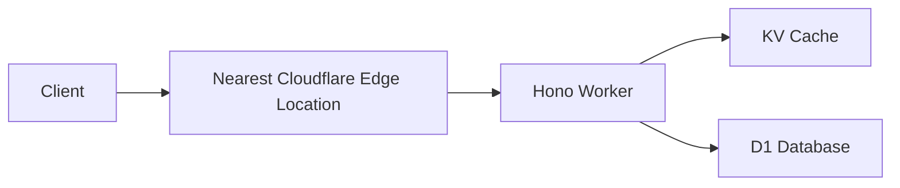

### Project 2: Full-Stack Type-Safe App (Hono + React)

Concepts: RPC mode end-to-end type safety, `zValidator` on every mutating route, shared TypeScript types between frontend and backend without a separate schema/codegen tool.

```typescript
// shared type flows from server route definitions directly to the React app's API client
const client = hc<AppType>("/api");
const { data } = await client.orders.$get();
```

### Project 3: Multi-Runtime Microservice (Node.js Today, Edge Tomorrow)

Concepts: business logic written against Web Standard APIs only, `@hono/node-server` adapter for current Node.js deployment, a documented migration path to Cloudflare Workers with minimal code changes.

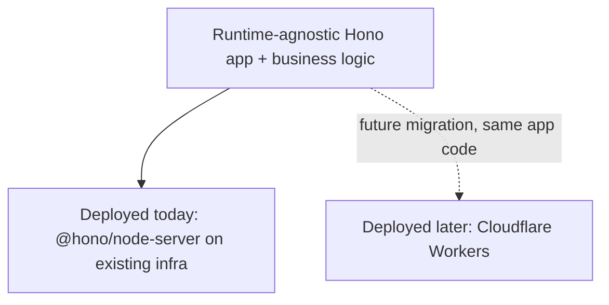

## 6.2 Step-by-Step Design Approach

For any Hono application:

1. Decide the target runtime(s) up front — this affects database/library choices from day one.
2. Design routes and validators (`zValidator`) together, keeping input validation as close to the route definition as possible.
3. Centralize error handling via `app.onError`/`app.notFound` rather than per-route try/catch scattered everywhere.
4. If building a TypeScript full-stack app, export `AppType` and wire up the RPC client early rather than retrofitting it later.
5. Isolate any genuinely runtime-specific code (Node-only libraries) behind clearly marked boundaries.
6. Test with `app.request()`, confirming behavior is consistent regardless of eventual deployment target.

## 6.3 Production Implementation Approach

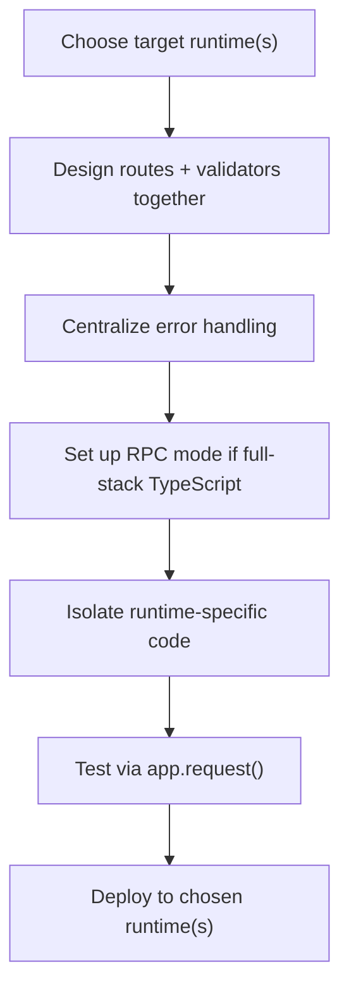

## 6.4 Production Readiness Example

For a Hono application, define:

- Explicit target runtime(s) documented, with edge-compatibility verified for every dependency if targeting Workers/Deno Deploy.
- Centralized `onError`/`notFound` handlers returning consistent, sanitized error responses.
- Validator middleware on every route accepting external input.
- RPC mode wired up (if full-stack TypeScript) with a CI step that fails the build on client-server type mismatches.
- Platform-native secret/config management (Cloudflare Workers secrets, environment bindings) instead of hardcoded values.
- Load testing performed against the actual target runtime, not just local Node.js development.

---

# 7. Deep Dive (Optional but Important)

## 7.1 `app.fetch` as the Universal Interface

```javascript
// This IS the entire interface every adapter needs to satisfy:
async function fetch(request: Request, env?: Env, ctx?: ExecutionContext): Promise<Response>

// Cloudflare Workers calls this directly.
// @hono/node-server wraps Node's http.createServer, translating IncomingMessage -> Request
// and Response -> writing to Node's ServerResponse, then calling app.fetch() internally.
```

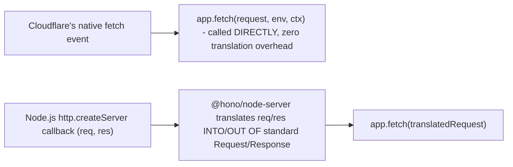

Every Hono adapter's entire job is translating a platform's native request-handling convention into a call to `app.fetch()` and translating the resulting `Response` back — this is why Cloudflare Workers requires essentially zero adapter code (its native interface **is** `fetch`), while Node.js requires a small but real translation layer.

## 7.2 RegExpRouter Construction

```text
Registered routes:
    GET  /orders
    GET  /orders/:id
    POST /orders

RegExpRouter precompiles these (conceptually) into ONE combined pattern per HTTP method,
with capture groups mapped back to route handlers and param names — avoiding a
per-route sequential check at request time in favor of a single regex evaluation.
```

Hono actually offers multiple router implementations (`RegExpRouter`, `TrieRouter`, `PatternRouter`) with different performance/flexibility trade-offs, defaulting to `RegExpRouter` for its strong general-purpose performance; understanding this internal swappability explains why some highly dynamic route patterns can fall back to a different internal strategy transparently.

## 7.3 Context Object Internals

```javascript
class Context {
    req;      // wraps the standard Request, adds param()/query()/valid() helpers
    env;      // platform bindings/environment
    #variables; // internal map backing c.set()/c.get()
    finalized; // whether a Response has been set for this request
}
```

The `Context` (`c`) object is Hono's per-request container — conceptually similar to Express's augmented `req`/`res` pair, but unified into a single object that wraps the standard `Request` and accumulates response state until a `Response` is finalized and returned up through the middleware chain.

## 7.4 Type Inference Chain for RPC Mode

```typescript
const app = new Hono()
    .get("/orders/:id", (c) => c.json({ id: c.req.param("id") }));
    // TypeScript infers: this route returns Response<{ id: string }> for GET /orders/:id

type AppType = typeof app;
// AppType captures EVERY route's method, path, and inferred response/request shape
// as a structural TypeScript type, entirely at compile time
```

> [!TIP]
> This inference chain only works reliably when routes are **chained** (`.get(...).post(...)`) rather than called as separate statements on the same `app` variable in some cases — chaining preserves the precise combined type through each call, which is why Hono's documentation consistently demonstrates route definitions in chained form for RPC-mode-consuming apps.

## 7.5 Debugging Tools

| Tool | Purpose |
|---|---|
| `hono/logger` middleware | Basic request logging across any supported runtime |
| Wrangler's local dev mode (`wrangler dev`) | Local Cloudflare Workers emulation for realistic edge-runtime testing before deployment |
| Vitest + `app.request()` | Fast, runtime-agnostic testing without spinning up a real server |
| Node.js `--inspect` (when using `@hono/node-server`) | Standard Node debugging tools apply when running on the Node adapter |

---

# Production Checklists

## Code Quality Checklist

- [ ] Middleware consistently uses `await next()`.
- [ ] Validators registered before handlers relying on `c.req.valid(...)`.
- [ ] Centralized `app.onError`/`app.notFound` for consistent error responses.
- [ ] Routes chained (`.get().post()...`) when RPC mode/type inference is used.
- [ ] Runtime-specific code clearly isolated, not assumed portable by default.

## Performance Checklist

- [ ] Dependencies kept minimal for edge deployments (bundle size affects cold start).
- [ ] Platform-native caching (KV, Cache API) used instead of assuming in-memory persistence across requests.
- [ ] Heavy synchronous computation avoided or moved off edge runtimes with CPU time limits.

## Security Checklist

- [ ] `secureHeaders()` and `cors()` (with explicit origins) applied.
- [ ] All external input validated via `zValidator`/equivalent.
- [ ] Secrets managed via platform-native bindings, never hardcoded or bundled into client code.
- [ ] RPC client uses `import type` only — verified no runtime server code is bundled client-side.

## Debugging Checklist

- [ ] Reproduce locally with the correct runtime emulation (`wrangler dev` for Workers, Node.js directly for the Node adapter).
- [ ] Check for missing `await` before `next()` first when middleware ordering seems off.
- [ ] Check for Node-specific API usage first when code fails only after edge deployment.
- [ ] Verify `AppType` export/chaining first when RPC client types seem wrong or incomplete.

---

# Learning Roadmap

## Phase 1: Beginner

Learn: basic routing, `c.req`/`c.json`, basic middleware, built-in CORS/logger/secureHeaders.

Practice: a simple CRUD API deployed to Node.js via `@hono/node-server`.

## Phase 2: Intermediate

Learn: route grouping (`.route()`), `zValidator`, `app.onError`/`app.notFound`, context variables (`c.set`/`c.get`), environment bindings.

Practice: a validated, error-handled API with modular route groups.

## Phase 3: Advanced

Learn: RPC mode end-to-end type safety, edge runtime constraints, RegExpRouter internals, streaming responses.

Practice: a full-stack TypeScript app with a Hono backend and a typed RPC client frontend.

## Phase 4: Production Backend Engineer

Learn: multi-runtime portability strategy, edge-compatible database/library selection, `app.fetch` adapter internals.

Practice: deploy the same Hono codebase to both Node.js and Cloudflare Workers, documenting what (if anything) needed runtime-specific handling.

---

# Self-Review Completion Loop

The topic was reviewed against:

- Official Hono documentation (hono.dev).
- Web Standard API specifications (WHATWG Fetch Standard).
- Direct architectural comparison against Express ([[06 Express.js]]).
- Common production incident patterns (edge runtime incompatibilities, RPC type-chain breaks, missing `await`).
- Interview patterns for beginner through senior backend roles.

## Gap Review Matrix

| Area | Covered? | Notes |
|---|---|---|
| Basic routing/context | Yes | `c.req`/`c.json` and equivalents to Express's `req`/`res` |
| Middleware model | Yes | Onion diagram, `await next()` pitfall |
| Route grouping | Yes | Direct comparison to Express's `Router()` |
| Validation | Yes | `zValidator` with type inference |
| Error handling | Yes | Contrast with Express's arity-based/v4-v5 model |
| Environment bindings | Yes | `c.env` abstraction explained |
| Context variables | Yes | `c.set`/`c.get` vs. Express's `req.x = ...` convention |
| Streaming | Yes | Web Standard `ReadableStream` foundation |
| RegExpRouter internals | Yes | Precompiled regex matching explained |
| Edge runtime constraints | Yes | No filesystem, CPU limits, Node API gaps |
| RPC mode | Yes | Full type-inference-chain explanation, zero-codegen mechanism |
| Multi-runtime testing | Yes | `app.request()` explained |
| Failure scenarios | Yes | Six concrete production failure patterns |
| Security | Yes | Built-in middleware, RPC leak risk, secrets management |
| Interview prep | Yes | Common and tricky questions, candidate mistakes |
| Hands-on projects | Yes | Three realistic projects with diagrams |
| Internals | Yes | `app.fetch` universal interface, adapter translation, type inference chain |

No significant beginner-to-senior Hono gaps remain for the requested scope. Further specialization should split into separate deep dives: **Cloudflare Workers Platform Deep Dive (Durable Objects, D1, R2)**, **Hono RPC Mode Advanced Patterns**, **Edge-Compatible Database Drivers Comparison**, and **Migrating an Express App to Hono**.

---

# Official References

- Hono Official Documentation: <https://hono.dev/>
- Hono RPC Mode Guide: <https://hono.dev/docs/guides/rpc>
- Cloudflare Workers Documentation: <https://developers.cloudflare.com/workers/>
- WHATWG Fetch Standard: <https://fetch.spec.whatwg.org/>
- `@hono/node-server` Documentation: <https://github.com/honojs/node-server>

---

## Final Summary

Hono rebuilds Express's familiar middleware/routing mental model entirely on Web Standard `Request`/`Response`/`fetch` APIs, trading Node.js-specific coupling for genuine portability across edge runtimes, Deno, Bun, and Node.js from a single codebase — with RPC mode adding compile-time-only, zero-codegen type safety between server and client as a distinctive additional capability. Production mastery comes from respecting edge runtime constraints (no filesystem, strict CPU limits, a narrower API surface) when targeting platforms like Cloudflare Workers, keeping the middleware `await next()` discipline consistent, and choosing Hono deliberately for its architectural portability advantages rather than assuming it's simply "a faster Express" with no trade-offs.
