# React: Beginner-to-Expert Engineering Guide (Everything in React)

> **Scope:** This guide covers React comprehensively — components, JSX, hooks, the rendering/reconciliation model (including Fiber internals), state management, performance optimization, routing, data fetching, testing, and production architecture (SSR/SSG via Next.js). Builds on [[01 JavaScript]] since React is fundamentally JavaScript with a component model and a rendering engine layered on top.

## Table of Contents

1. [Executive Summary](#executive-summary)
2. [1. Fundamentals](#1-fundamentals-beginner-level)
3. [2. Core Concepts](#2-core-concepts-intermediate-level)
4. [3. Advanced Concepts](#3-advanced-concepts-senior-level)
5. [4. Real-World System Design Usage](#4-real-world-system-design-usage)
6. [5. Interview Preparation](#5-interview-preparation)
7. [6. Hands-On Thinking](#6-hands-on-thinking)
8. [7. Deep Dive](#7-deep-dive-optional-but-important)
9. [Production Checklists](#production-checklists)
10. [Learning Roadmap](#learning-roadmap)
11. [Self-Review Completion Loop](#self-review-completion-loop)
12. [Official References](#official-references)

---

## Executive Summary

React is a JavaScript library for building user interfaces out of composable **components** that describe "what the UI should look like" for a given state, while React itself figures out the minimal set of real DOM changes needed to get there.

The core idea:

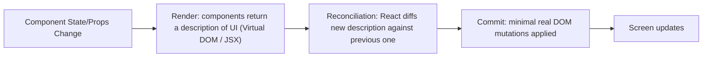

> [!TIP]
> Learn React as a **declarative rendering function of state**: `UI = f(state)`. You never manually mutate the DOM — you describe what the UI should look like for the current state, and React handles the diffing and DOM updates. Most React bugs come from either violating this model (mutating state directly) or misunderstanding *when* re-renders happen.

---

# 1. Fundamentals (Beginner Level)

## 1.1 What Is React?

React lets you build UIs from small, reusable **components** — JavaScript functions that return a description of UI (written in JSX, an HTML-like syntax extension).

```jsx
function Greeting({ name }) {
    return <h1>Hello, {name}!</h1>;
}

function App() {
    return (
        <div>
            <Greeting name="Asha" />
            <Greeting name="Ravi" />
        </div>
    );
}
```

```bash
npx create-vite my-app --template react
# or: npx create-next-app my-app
```

## 1.2 Why React Exists

| Problem | React's Answer |
|---|---|
| Manually updating the DOM as state changes is error-prone and hard to scale | Declarative rendering: describe the end state, React computes the diff |
| UI logic scattered across many DOM manipulation call sites | Components co-locate markup, logic, and (with hooks) state |
| Reusing UI pieces across an app is awkward with plain DOM APIs | Composable, reusable components with props |
| Keeping UI in sync with changing data is manual and bug-prone | Automatic re-rendering when state/props change |
| Large apps need a predictable way to reason about "what caused this UI to update" | Unidirectional data flow: data flows down via props, events flow up via callbacks |

## 1.3 Problems React Solves

React is especially good when you need:

- Complex, interactive UIs with lots of state that changes over time.
- Reusable UI components shared across many pages/apps (design systems).
- A large team working on a UI codebase with a clear component boundary model.
- An ecosystem of tools for routing, data fetching, forms, and state management.

React is less critical (though still often used) when:

- The UI is mostly static content (a simple content-only site might not need a component framework at all).
- Extremely tight bundle-size/performance constraints favor a lighter framework (Svelte, Solid) or vanilla JS.

## 1.4 Real-World Analogy

Think of React like a smart projector displaying slides, rather than you manually repainting a whiteboard.

With a whiteboard (manual DOM manipulation), every change means you erase and redraw the specific part that changed yourself — track exactly what's on the board at all times. With a projector (React), you just create a new slide describing what the *whole* screen should look like right now, and the projector (React's reconciler) automatically figures out the minimal actual change needed and applies just that, without you tracking pixel-by-pixel state yourself.

```text
Whiteboard + manual erasing = imperative DOM manipulation
New slide each time          = declarative JSX describing the desired UI
Projector's smart diffing    = React's reconciliation, computing the minimal real update
```

## 1.5 Core Vocabulary

| Term | Meaning |
|---|---|
| Component | A function (or class) returning a UI description |
| JSX | Syntax extension letting you write HTML-like markup in JavaScript |
| Props | Read-only inputs passed from a parent component to a child |
| State | Data local to a component that can change and triggers re-render |
| Virtual DOM | An in-memory description of the UI React diffs against the previous version |
| Reconciliation | The process of diffing the new UI description against the previous one |
| Fiber | React's internal data structure/algorithm for incremental, interruptible rendering |
| Hook | A function (`useState`, `useEffect`, etc.) letting function components use state/lifecycle features |
| Key | A special prop helping React identify which list items changed/moved |

## 1.6 JSX Basics

```jsx
const name = "Asha";
const element = <h1 className="greeting">Hello, {name}!</h1>;

const isLoggedIn = true;
const message = isLoggedIn ? <p>Welcome back</p> : <p>Please log in</p>;

const items = ["Apple", "Banana"];
const list = (
    <ul>
        {items.map(item => <li key={item}>{item}</li>)}
    </ul>
);
```

> [!WARNING]
> JSX compiles to `React.createElement(...)` calls — it's not HTML. `class` becomes `className`, `for` becomes `htmlFor`, and every expression inside `{}` must be a valid JavaScript expression (not a statement like `if`).

## 1.7 Components and Props

```jsx
function OrderCard({ order, onSelect }) {
    return (
        <div onClick={() => onSelect(order.id)}>
            <h3>Order #{order.id}</h3>
            <p>{order.status}</p>
        </div>
    );
}

function OrderList({ orders, onOrderSelect }) {
    return (
        <div>
            {orders.map(order => (
                <OrderCard key={order.id} order={order} onSelect={onOrderSelect} />
            ))}
        </div>
    );
}
```

| Concept | Rule |
|---|---|
| Props | Passed from parent to child, read-only inside the child |
| `key` | Required on list items; helps React track identity across re-renders |
| Children (`props.children`) | Content nested between a component's opening/closing tags |

## 1.8 State with `useState`

```jsx
import { useState } from "react";

function Counter() {
    const [count, setCount] = useState(0);

    return (
        <button onClick={() => setCount(count + 1)}>
            Clicked {count} times
        </button>
    );
}
```

> [!IMPORTANT]
> `setCount` doesn't mutate `count` in place — it schedules a re-render with the new value. State updates are the **only** correct way to change data a component displays; directly mutating a variable won't trigger a re-render, because React has no way to know something changed.

## 1.9 Handling Events

```jsx
function SearchBox({ onSearch }) {
    const [query, setQuery] = useState("");

    function handleSubmit(event) {
        event.preventDefault();
        onSearch(query);
    }

    return (
        <form onSubmit={handleSubmit}>
            <input value={query} onChange={e => setQuery(e.target.value)} />
            <button type="submit">Search</button>
        </form>
    );
}
```

This is a **controlled component** — the input's value is driven entirely by React state, not the DOM's own internal input state.

## 1.10 Conditional Rendering and Lists

```jsx
function OrderStatus({ order }) {
    if (!order) {
        return <p>Loading...</p>;
    }

    return (
        <div>
            {order.status === "PAID" && <span>✓ Paid</span>}
            {order.items.length === 0 ? <p>No items</p> : (
                <ul>
                    {order.items.map(item => <li key={item.id}>{item.name}</li>)}
                </ul>
            )}
        </div>
    );
}
```

## 1.11 Basic Side Effects with `useEffect`

```jsx
import { useState, useEffect } from "react";

function OrderDetail({ orderId }) {
    const [order, setOrder] = useState(null);

    useEffect(() => {
        fetch(`/api/orders/${orderId}`)
            .then(res => res.json())
            .then(setOrder);
    }, [orderId]); // re-run only when orderId changes

    if (!order) return <p>Loading...</p>;
    return <h2>Order #{order.id}</h2>;
}
```

---

# 2. Core Concepts (Intermediate Level)

## 2.1 Full Render Lifecycle

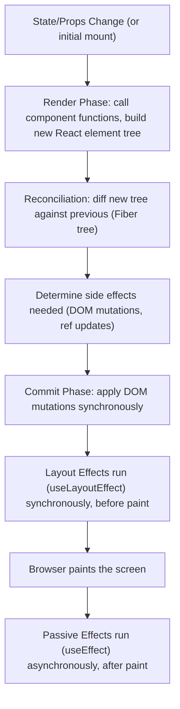

> [!TIP]
> The Render Phase can be paused, aborted, or restarted by React (it must be pure — no side effects allowed). The Commit Phase is synchronous and cannot be interrupted. This split is fundamental to React's concurrent rendering capabilities (see §3.1).

## 2.2 The Full Hooks Reference

```jsx
const [state, setState] = useState(initialValue);
const derived = useMemo(() => expensiveCalculation(a, b), [a, b]);
const stableCallback = useCallback(() => doSomething(a), [a]);
const ref = useRef(initialValue);
const value = useContext(MyContext);
const [state, dispatch] = useReducer(reducer, initialState);

useEffect(() => {
    // side effect after paint
    return () => { /* cleanup */ };
}, [dependencies]);

useLayoutEffect(() => {
    // side effect BEFORE paint, synchronous — use sparingly
}, [dependencies]);

const id = useId(); // stable unique ID for accessibility attributes
```

| Hook | Purpose |
|---|---|
| `useState` | Local component state |
| `useEffect` | Side effects after render/paint (data fetching, subscriptions) |
| `useLayoutEffect` | Side effects that must run synchronously before paint (measuring DOM layout) |
| `useMemo` | Memoizes an expensive computed value |
| `useCallback` | Memoizes a function reference (prevents unnecessary child re-renders/effect re-runs) |
| `useRef` | Mutable value that persists across renders WITHOUT triggering re-render when changed |
| `useContext` | Reads a value from a `Context.Provider` higher in the tree |
| `useReducer` | State management via a reducer function, for more complex state transitions |
| `useId` | Generates a stable unique ID (SSR-safe) for accessibility (`aria-*`, `htmlFor`) |

## 2.3 `useEffect` Dependency Array Semantics

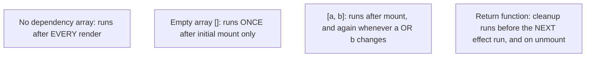

```jsx
useEffect(() => {
    const subscription = subscribeToOrders(orderId, setOrder);
    return () => subscription.unsubscribe(); // cleanup: prevents leaks/stale subscriptions
}, [orderId]);
```

> [!WARNING]
> Omitting a value from the dependency array that the effect actually uses is the single most common React bug — the effect closes over a **stale** value from the render it was created in, not the latest one. `eslint-plugin-react-hooks`'s `exhaustive-deps` rule catches this; don't disable it without understanding exactly why.

## 2.4 Lifting State Up and Composition

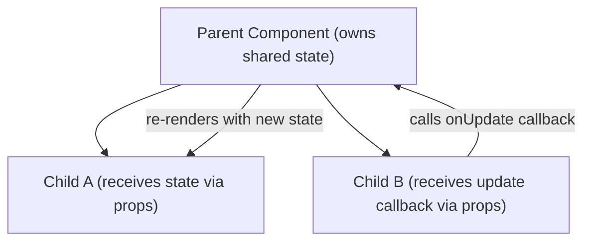

```jsx
function OrderPage() {
    const [selectedId, setSelectedId] = useState(null);

    return (
        <div>
            <OrderList onOrderSelect={setSelectedId} />
            <OrderDetail orderId={selectedId} />
        </div>
    );
}
```

When two sibling components need to share state, that state is "lifted" to their nearest common parent, which passes it down as props and receives updates via callbacks — this is the foundation of React's unidirectional data flow.

## 2.5 Context for Avoiding Prop Drilling

```jsx
const ThemeContext = createContext("light");

function App() {
    const [theme, setTheme] = useState("light");
    return (
        <ThemeContext.Provider value={theme}>
            <Toolbar />
        </ThemeContext.Provider>
    );
}

function Toolbar() {
    return <ThemedButton />; // doesn't need to receive/pass "theme" as a prop
}

function ThemedButton() {
    const theme = useContext(ThemeContext);
    return <button className={theme}>Click me</button>;
}
```

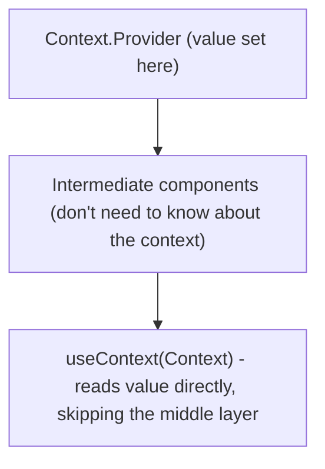

> [!WARNING]
> Every consumer of a Context re-renders whenever the Provider's `value` changes — **regardless of which specific field changed**. Passing a new object literal (`value={{ theme, setTheme }}`) on every render causes all consumers to re-render every time, even if nothing they care about changed. Memoize the context value with `useMemo` for non-trivial contexts.

## 2.6 `useReducer` for Complex State

```jsx
function orderReducer(state, action) {
    switch (action.type) {
        case "added":
            return { ...state, items: [...state.items, action.item] };
        case "removed":
            return { ...state, items: state.items.filter(i => i.id !== action.id) };
        default:
            throw new Error("Unknown action: " + action.type);
    }
}

function OrderBuilder() {
    const [state, dispatch] = useReducer(orderReducer, { items: [] });

    return (
        <button onClick={() => dispatch({ type: "added", item: { id: 1, name: "Widget" } })}>
            Add Item
        </button>
    );
}
```

`useReducer` centralizes state transition logic in one pure function, making complex state changes more predictable and testable than scattered `useState` calls with intertwined update logic.

## 2.7 Forms

```jsx
function LoginForm({ onSubmit }) {
    const [form, setForm] = useState({ email: "", password: "" });

    function handleChange(e) {
        setForm({ ...form, [e.target.name]: e.target.value });
    }

    return (
        <form onSubmit={e => { e.preventDefault(); onSubmit(form); }}>
            <input name="email" value={form.email} onChange={handleChange} />
            <input name="password" type="password" value={form.password} onChange={handleChange} />
            <button type="submit">Log in</button>
        </form>
    );
}
```

For complex forms with validation, libraries like React Hook Form or Formik reduce boilerplate and re-render overhead compared to manually managing every field with `useState`.

## 2.8 Data Fetching Patterns

```jsx
function useOrders() {
    const [orders, setOrders] = useState([]);
    const [loading, setLoading] = useState(true);
    const [error, setError] = useState(null);

    useEffect(() => {
        let cancelled = false;
        setLoading(true);
        fetch("/api/orders")
            .then(res => res.json())
            .then(data => { if (!cancelled) setOrders(data); })
            .catch(err => { if (!cancelled) setError(err); })
            .finally(() => { if (!cancelled) setLoading(false); });

        return () => { cancelled = true; }; // prevent state update after unmount
    }, []);

    return { orders, loading, error };
}
```

> [!TIP]
> Manually managing loading/error/cancellation state for every fetch is repetitive and easy to get wrong (the classic bug: an old, slow request resolves *after* a newer one and overwrites fresher data). Production apps typically use a dedicated data-fetching library (TanStack Query, SWR) that handles caching, deduplication, race conditions, and refetching out of the box — see §3.6.

## 2.9 Component Composition Patterns

```jsx
function Card({ children }) {
    return <div className="card">{children}</div>;
}

function App() {
    return (
        <Card>
            <h2>Title</h2>
            <p>Content goes here, composed via children.</p>
        </Card>
    );
}
```

```jsx
// Render props pattern (less common in the hooks era, but still seen)
function DataFetcher({ url, children }) {
    const { data } = useFetch(url);
    return children(data);
}

<DataFetcher url="/api/orders">
    {data => <OrderList orders={data} />}
</DataFetcher>
```

## 2.10 Basic Testing

```jsx
import { render, screen, fireEvent } from "@testing-library/react";

test("increments counter on click", () => {
    render(<Counter />);
    const button = screen.getByRole("button");
    fireEvent.click(button);
    expect(button).toHaveTextContent("Clicked 1 times");
});
```

React Testing Library encourages testing components the way a user interacts with them (querying by visible text/role, not internal implementation details), rather than testing internal state directly.

---

# 3. Advanced Concepts (Senior Level)

## 3.1 Fiber Architecture and Concurrent Rendering

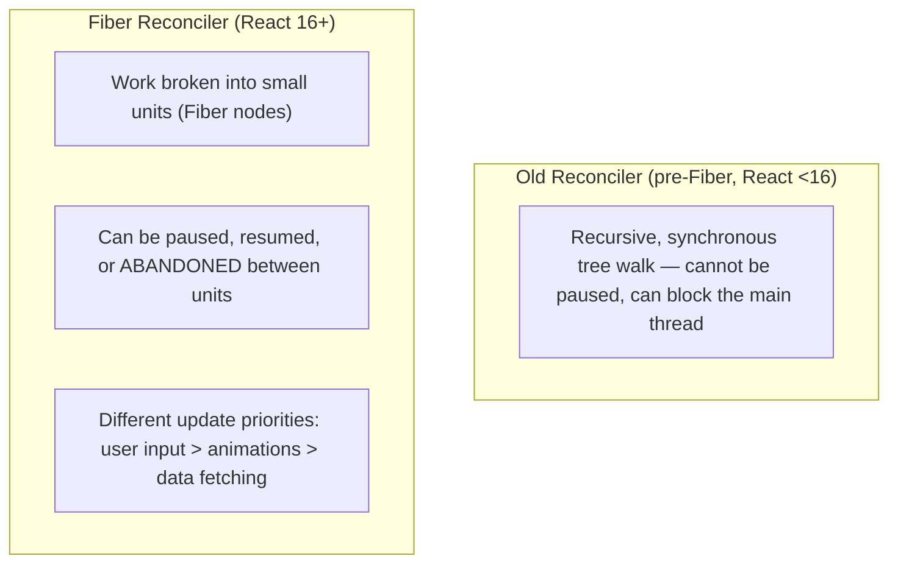

Fiber is React's internal reimplementation of the reconciliation algorithm as an **incremental, interruptible** process. Instead of walking the entire component tree synchronously (which could block the main thread on a large tree), React breaks work into units it can pause, let the browser handle a higher-priority task (like user input), and resume — enabling features like automatic batching, transitions, and Suspense.

```jsx
import { useTransition } from "react";

function SearchResults() {
    const [isPending, startTransition] = useTransition();
    const [query, setQuery] = useState("");
    const [results, setResults] = useState([]);

    function handleChange(e) {
        setQuery(e.target.value); // urgent update: keep input responsive
        startTransition(() => {
            setResults(expensiveSearch(e.target.value)); // low-priority update: can be interrupted
        });
    }

    return (
        <>
            <input value={query} onChange={handleChange} />
            {isPending && <Spinner />}
            <ResultsList results={results} />
        </>
    );
}
```

`useTransition` marks an update as low-priority, letting React keep the UI (like a text input) responsive even while a large, expensive re-render is in progress — a direct practical consequence of Fiber's interruptible design.

## 3.2 Reconciliation and Keys in Depth

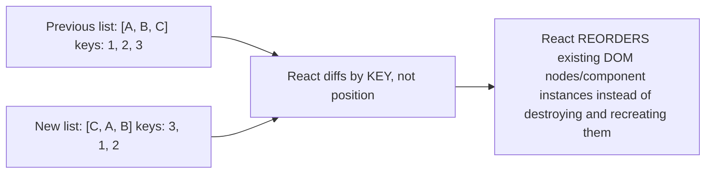

```jsx
// WRONG: using array index as key when list order can change
{items.map((item, index) => <Item key={index} data={item} />)}

// RIGHT: using a stable, unique identifier
{items.map(item => <Item key={item.id} data={item} />)}
```

> [!WARNING]
> Using array **index** as `key` breaks when items are reordered, inserted, or removed from the middle — React can't tell which item is which, leading to state (like an input's cursor position, or a checkbox's checked state) attaching to the *wrong* item after a reorder. Always use a stable, unique ID tied to the data itself.

## 3.3 Memoization: `React.memo`, `useMemo`, `useCallback`

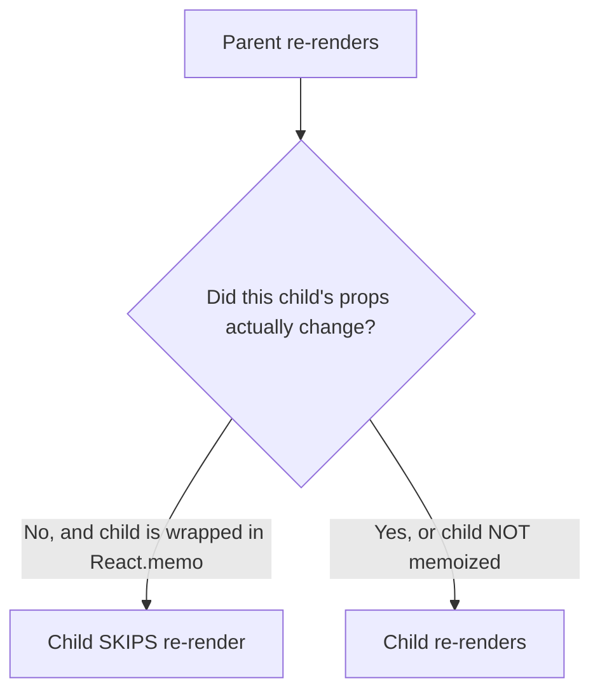

```jsx
const ExpensiveList = React.memo(function ExpensiveList({ items, onSelect }) {
    return items.map(item => <Item key={item.id} item={item} onSelect={onSelect} />);
});

function Parent() {
    const [count, setCount] = useState(0);
    const items = useMemo(() => computeItems(), []); // stable reference across renders
    const handleSelect = useCallback((id) => console.log(id), []); // stable reference

    return (
        <>
            <button onClick={() => setCount(count + 1)}>{count}</button>
            <ExpensiveList items={items} onSelect={handleSelect} />
        </>
    );
}
```

> [!IMPORTANT]
> `React.memo` only helps if the props passed to the child are **referentially stable** across renders. Passing a new inline object/array/function literal as a prop (`onSelect={() => ...}`) defeats `React.memo` entirely, because it's a *new* reference every render even if its behavior is identical — this is exactly why `useMemo`/`useCallback` exist, and why they're often used *together with* `React.memo`, not as standalone performance tools.

## 3.4 Custom Hooks

```jsx
function useDebounce(value, delay) {
    const [debounced, setDebounced] = useState(value);

    useEffect(() => {
        const timer = setTimeout(() => setDebounced(value), delay);
        return () => clearTimeout(timer);
    }, [value, delay]);

    return debounced;
}

function SearchBox() {
    const [query, setQuery] = useState("");
    const debouncedQuery = useDebounce(query, 300);

    useEffect(() => {
        if (debouncedQuery) searchApi(debouncedQuery);
    }, [debouncedQuery]);

    return <input value={query} onChange={e => setQuery(e.target.value)} />;
}
```

Custom hooks are just regular functions that call other hooks — they're React's mechanism for extracting and reusing **stateful logic** across components, something that plain function extraction can't do (since each component needs its own independent state instances).

## 3.5 Suspense and Lazy Loading

```jsx
const OrderDashboard = React.lazy(() => import("./OrderDashboard"));

function App() {
    return (
        <Suspense fallback={<Spinner />}>
            <OrderDashboard />
        </Suspense>
    );
}
```

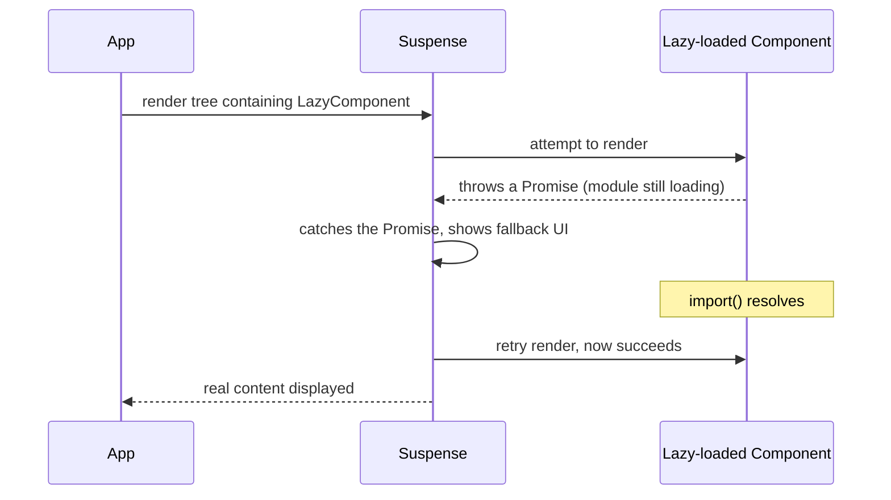

Suspense works by catching a **thrown Promise** from a child during render and showing a fallback until it resolves — the same mechanism (extended in newer React versions) powers data-fetching libraries' Suspense integration, not just code-splitting.

## 3.6 Server State Management (TanStack Query / SWR)

```jsx
import { useQuery, useMutation, useQueryClient } from "@tanstack/react-query";

function OrderList() {
    const { data: orders, isLoading, error } = useQuery({
        queryKey: ["orders"],
        queryFn: () => fetch("/api/orders").then(r => r.json()),
    });

    const queryClient = useQueryClient();
    const mutation = useMutation({
        mutationFn: (order) => fetch("/api/orders", { method: "POST", body: JSON.stringify(order) }),
        onSuccess: () => queryClient.invalidateQueries({ queryKey: ["orders"] }),
    });

    if (isLoading) return <Spinner />;
    if (error) return <ErrorMessage error={error} />;
    return <ul>{orders.map(o => <li key={o.id}>{o.status}</li>)}</ul>;
}
```

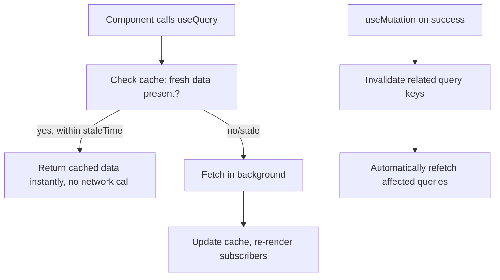

> [!TIP]
> "Server state" (data owned by a backend, fetched over the network, potentially shared across many components) is fundamentally different from "client state" (a form input's value, a modal's open/closed flag) and benefits from a dedicated caching/synchronization library rather than manual `useState`/`useEffect` — this distinction is one of the most important architectural lessons in modern React applications.

## 3.7 Client State Management (Beyond Context)

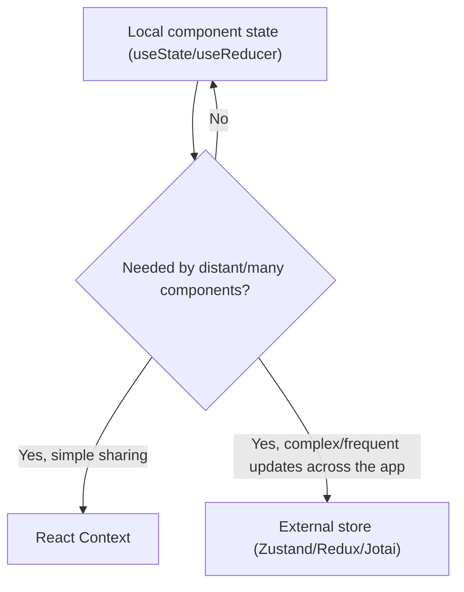

| Tool | Best For |
|---|---|
| `useState`/`useReducer` | Local, component-scoped state |
| Context | Infrequently-changing, broadly-needed values (theme, current user, locale) |
| Zustand/Jotai | Lightweight global client state with minimal boilerplate |
| Redux (Toolkit) | Large apps needing strict, traceable state transitions, time-travel debugging, complex middleware |
| TanStack Query/SWR | Server-derived state (not really "client state" at all) |

> [!WARNING]
> Reaching for Context (or Redux) as a default "global state" solution for data that's actually server state (fetched from an API) is a common architectural mistake — it duplicates caching/invalidation logic that data-fetching libraries already solve well, and misses out on automatic refetching, deduplication, and stale-time handling.

## 3.8 Error Boundaries

```jsx
class ErrorBoundary extends React.Component {
    state = { hasError: false };

    static getDerivedStateFromError(error) {
        return { hasError: true };
    }

    componentDidCatch(error, info) {
        logErrorToService(error, info);
    }

    render() {
        if (this.state.hasError) return <FallbackUI />;
        return this.props.children;
    }
}
```

> [!IMPORTANT]
> Error boundaries **must** be class components (as of current React versions — there's no hook equivalent for `componentDidCatch`/`getDerivedStateFromError`). They catch errors during rendering, in lifecycle methods, and in constructors of the tree below them — but **not** errors in event handlers, async code, or during server-side rendering; those need their own explicit try/catch handling.

## 3.9 Server-Side Rendering (SSR) and Hydration

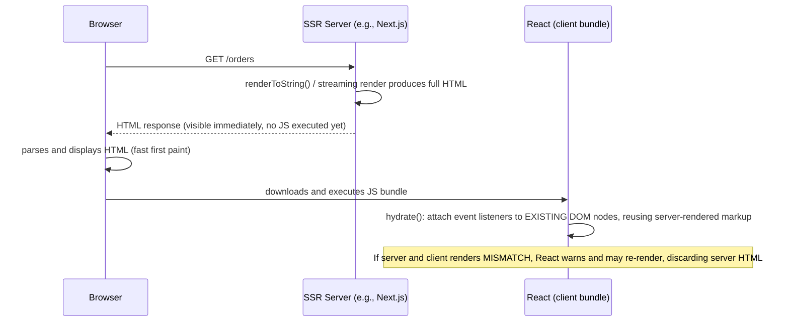

SSR renders the initial HTML on the server (fast first paint, better SEO), then the client "hydrates" that static HTML by attaching React's event handlers and internal state to the existing DOM nodes — **without re-creating them**, as long as the client's initial render output matches the server's exactly.

> [!WARNING]
> **Hydration mismatches** (client-rendered output differing from server-rendered HTML — e.g., using `Date.now()` or `Math.random()` directly in render, or checking `typeof window` inconsistently) cause React to discard the server-rendered DOM and re-render from scratch on the client, losing the SSR performance benefit and sometimes causing visible content flashes.

## 3.10 Failure Scenarios

| Failure | Symptom | Common Cause | Fix |
|---|---|---|---|
| Stale closure in `useEffect` | Effect uses an outdated value | Missing dependency in the dependency array | Add all used values to the dependency array (`exhaustive-deps` lint rule) |
| Infinite re-render loop | Browser freezes, "Maximum update depth exceeded" | Calling a state setter unconditionally during render, or an effect with a dependency that changes every render | Move the setter into an event handler/effect; stabilize the dependency with `useMemo`/`useCallback` |
| List items' state "jumps" after reorder | Wrong input retains focus/wrong checkbox stays checked | Using array index as `key` | Use a stable, unique data-derived key |
| Component re-renders far more than expected | Sluggish UI, wasted work | New object/function literals passed as props every render, defeating `React.memo` | Memoize props with `useMemo`/`useCallback`, or restructure to avoid passing unstable references |
| "Can't perform a state update on an unmounted component" warning | State update after component is gone | Async operation (fetch) resolves after unmount, still calls `setState` | Use a cleanup flag/`AbortController`, or a data-fetching library that handles this automatically |
| Hydration mismatch warning | Content flashes/differs between server and client render | Non-deterministic values (`Date.now()`, `Math.random()`, `typeof window` checks) used directly in render | Move non-deterministic values to `useEffect` (client-only) or pass them from the server explicitly |
| Context causes unrelated components to re-render | Performance degradation in large apps | New object literal passed as Context `value` on every render | Memoize the context value with `useMemo` |
| Memory leak from uncanceled subscriptions | Warnings, growing memory in long-lived SPAs | `useEffect` subscribing without a cleanup function | Always return a cleanup function from effects that subscribe/set timers |

## 3.11 Performance Considerations

- Profile with React DevTools Profiler before optimizing — most components don't need `React.memo`/`useMemo` and adding them everywhere adds complexity without benefit.
- Virtualize long lists (`react-window`/`react-virtual`) instead of rendering thousands of DOM nodes at once.
- Code-split routes/heavy components with `React.lazy` + `Suspense` to reduce initial bundle size.
- Avoid creating new objects/arrays/functions inline in JSX for components wrapped in `React.memo`.
- Batch related state updates (React 18+ batches automatically across most contexts, including promises/timeouts, unlike React 17).

## 3.12 Security Pitfalls

| Risk | Mitigation |
|---|---|
| XSS via `dangerouslySetInnerHTML` | Sanitize any HTML string before rendering; avoid this API unless truly necessary |
| Rendering user-controlled URLs in `href`/`src` | Validate/sanitize URLs (block `javascript:` scheme) |
| Storing sensitive tokens in `localStorage` | Prefer httpOnly cookies where possible; `localStorage` is readable by any script (including injected XSS payloads) |
| Leaking secrets via client-bundled environment variables | Never put server secrets in client-exposed env vars (e.g., `NEXT_PUBLIC_*` prefixed vars are bundled into client JS) |
| Outdated dependencies (npm ecosystem) | Regular dependency scanning, lockfile discipline |

---

# 4. Real-World System Design Usage

## 4.1 Where React Is Used in Production

- Consumer web applications (dashboards, e-commerce, social platforms).
- Internal admin tools and enterprise SaaS frontends.
- Mobile apps via React Native (shared component/logic patterns, different renderer).
- Server-rendered marketing/content sites via Next.js/Remix for SEO and fast first paint.

## 4.2 Typical Production Frontend Architecture

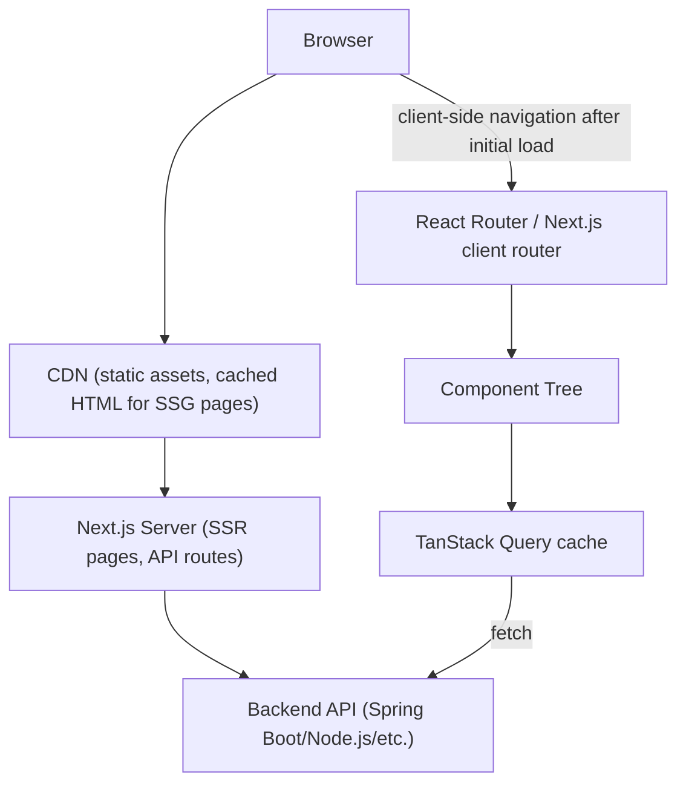

## 4.3 Big-Company Style Thinking

| Concern | React Design Response |
|---|---|
| Reliability | Error boundaries around major sections, so one failing widget doesn't blank the whole page |
| Scale | Code-splitting per route, virtualized lists, memoization applied where profiling shows real benefit |
| Observability | Error tracking (Sentry), performance monitoring (Web Vitals), React DevTools Profiler in staging |
| Security | Sanitized HTML rendering, CSP headers, careful token storage strategy |
| Maintainability | Component library/design system, clear server-state vs. client-state boundaries, TypeScript for prop contracts |
| SEO/Performance | SSR/SSG for public-facing pages, client-side rendering for authenticated app shells |

## 4.4 Example: Order Dashboard Data Flow

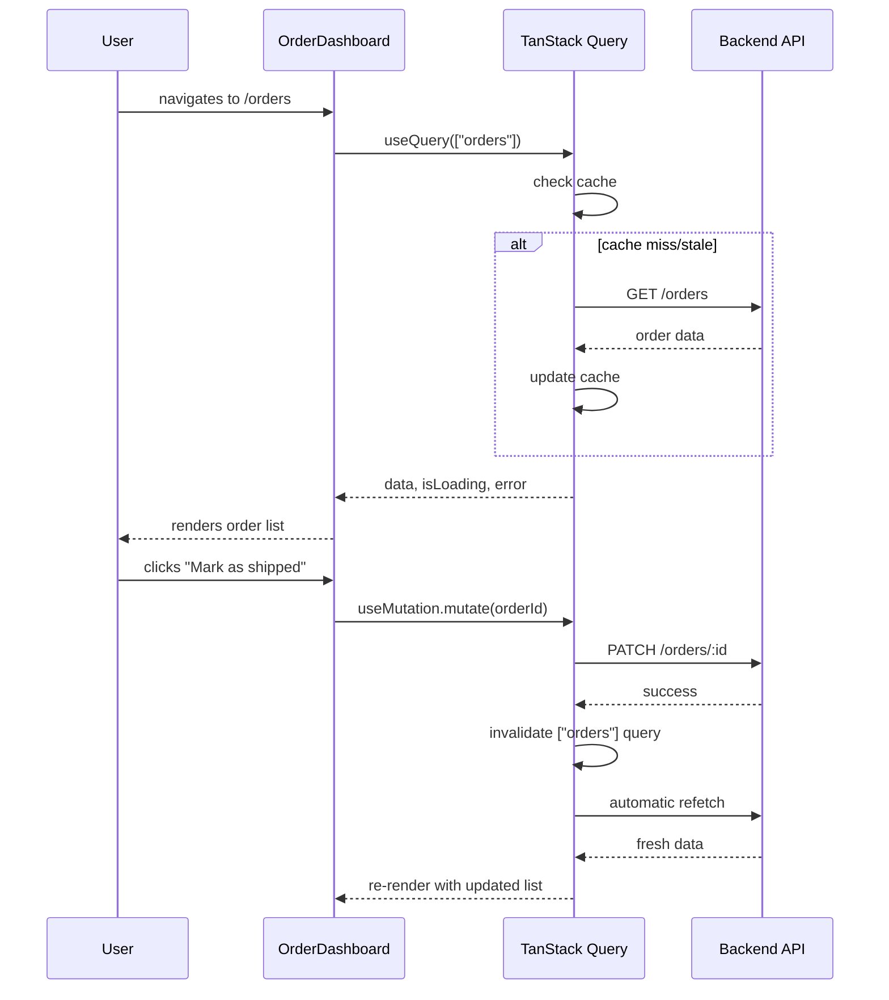

## 4.5 Layered Frontend Architecture

```text
Pages/Routes Layer
    - Route-level components, code-split boundaries

Feature/Container Components
    - Compose data fetching (TanStack Query) with presentational components
    - Own local UI state (modals, form state)

Presentational/UI Components
    - Pure rendering based on props, highly reusable, often in a shared design system

Hooks Layer
    - Custom hooks encapsulating reusable stateful logic (useDebounce, useAuth, etc.)

Data Layer
    - API client functions, TanStack Query hooks, schema validation (zod)
```

## 4.6 Integration with Other Systems

| System | React Integration |
|---|---|
| Backend APIs | `fetch`/axios wrapped in TanStack Query/SWR hooks |
| Routing | React Router (SPA), Next.js App Router (file-based, SSR-capable) |
| Forms | React Hook Form, Formik, combined with schema validation (zod/yup) |
| Styling | CSS Modules, Tailwind CSS, styled-components/Emotion (CSS-in-JS) |
| State management | Context, Zustand, Redux Toolkit for complex client state |
| Testing | Jest/Vitest + React Testing Library, Playwright/Cypress for E2E |
| Build tooling | Vite, Next.js's built-in bundler, Webpack |
| Observability | Sentry (errors), Web Vitals reporting |

---

# 5. Interview Preparation

## 5.1 What Interviewers Expect

For "React" topics, interviewers usually expect:

- You can build components with props, state, and event handling correctly.
- You understand the render lifecycle and `useEffect` dependency semantics.
- You know why `key` matters and the index-as-key pitfall.
- You can explain the difference between state and props.

For senior frontend roles, they also expect:

- You understand reconciliation and Fiber's interruptible rendering model at a conceptual level.
- You can reason about when/why a component re-renders and how to prevent unnecessary ones.
- You understand the server-state vs. client-state distinction and pick appropriate tools for each.
- You know SSR/hydration mechanics and common mismatch pitfalls.
- You can design a component architecture with clear composition and state-ownership boundaries.

## 5.2 Most Important Questions and Answers

### Q1. What's the difference between props and state?

Props are inputs passed from a parent to a child component — read-only from the child's perspective, owned and controlled by the parent. State is data owned and managed *within* a component (or lifted to a shared parent), which can change over time and triggers a re-render when updated via its setter.

### Q2. Why does React need `key` when rendering lists?

`key` gives React a stable identity for each item across renders, letting it correctly match old and new list items during reconciliation — reusing/reordering existing DOM nodes and component state instead of destroying and recreating them. Without stable keys (or using array index when order can change), component state can attach to the wrong item after a reorder.

### Q3. What happens during React's "render phase" vs. "commit phase"?

The render phase calls component functions to produce a new element tree and diffs it against the previous one — it must be pure (no side effects) because React may pause, abandon, or restart it (especially under concurrent rendering). The commit phase applies the computed DOM mutations synchronously and is when refs update and layout effects run.

### Q4. Why is the `useEffect` dependency array important, and what happens if you get it wrong?

The dependency array tells React when to re-run the effect. If it omits a value the effect actually reads, the effect closes over a **stale** version of that value from whichever render created the closure — a very common source of bugs where an effect appears to "not see" the latest state/props.

### Q5. What's the difference between `useMemo` and `useCallback`?

Both memoize something across renders based on a dependency array: `useMemo` memoizes a **computed value**, while `useCallback` memoizes a **function reference** (it's actually just `useMemo` specialized for functions: `useCallback(fn, deps)` ≈ `useMemo(() => fn, deps)`).

### Q6. Why might `React.memo` fail to prevent a re-render?

`React.memo` does a shallow comparison of props; if any prop is a new object/array/function reference each render (a common case for inline arrow functions or object literals passed as props), the shallow comparison sees them as "different" every time, even if their actual content/behavior is identical — defeating the memoization.

### Q7. What is the difference between controlled and uncontrolled components?

A controlled component's value is fully driven by React state (`value` + `onChange`), making React the single source of truth. An uncontrolled component lets the DOM manage its own internal state, accessed imperatively via a `ref` when needed (e.g., `inputRef.current.value`) — simpler for some cases, but loses React's ability to react to every keystroke.

### Q8. What is hydration, and what causes a hydration mismatch?

Hydration is the client attaching React's event handlers and internal state to server-rendered HTML without re-creating the DOM nodes, as long as the client's initial render matches the server's output exactly. A mismatch (e.g., from `Date.now()`, `Math.random()`, or environment-dependent logic used directly during render) forces React to discard the server HTML and re-render from scratch, negating the SSR benefit for that content.

### Q9. What's the architectural difference between "server state" and "client state," and why does it matter?

Server state is data owned by a backend, fetched over the network, potentially shared/stale/cached — it benefits from a dedicated library (TanStack Query/SWR) handling caching, deduplication, and invalidation. Client state is UI-only data (a form's current values, a modal's open flag) that belongs in `useState`/`useReducer`/Context. Treating server state as plain client state (manual `useState` + `useEffect` fetching) reinvents caching/race-condition handling poorly.

### Q10. Why must error boundaries be class components?

React hasn't provided hook equivalents for the two lifecycle methods error boundaries require (`static getDerivedStateFromError` and `componentDidCatch`) — these are inherently tied to the class component lifecycle model, so as of current React versions, there's no way to build an error boundary with function components and hooks alone.

## 5.3 Tricky Questions

### If state updates are "asynchronous," why does `console.log(count)` right after `setCount(count + 1)` show the old value?

State updates are batched and applied on the next render — calling the setter doesn't synchronously mutate the current render's `count` variable, it schedules a re-render with the new value. The `count` variable in the current closure remains what it was for this render's entire lifetime; only the *next* render sees the updated value.

### Why can calling a state setter directly in the component body (not inside an event handler or effect) cause an infinite loop?

Calling a setter during render schedules another render immediately; if that render calls the same unconditional setter again, React keeps re-rendering without ever reaching a stable state, eventually throwing "Maximum update depth exceeded." Setters should be called from event handlers or effects, not unconditionally during the render itself.

### Does `React.StrictMode` double-invoking component functions/effects in development indicate a bug?

Not necessarily a bug in itself — it's intentional, designed to surface impurities (side effects during render, effects not properly cleaning up) by deliberately running things twice in development only, to help catch code that isn't resilient to React's future concurrent rendering behaviors.

### Can a child component ever cause its parent to re-render just by rendering?

No — rendering flows one direction (parent triggers child render, not the reverse). A child can only cause the parent to update by calling a callback the parent passed down, which the parent uses to update its own state, which *then* re-renders both the parent and (as a consequence) the child.

## 5.4 Common Candidate Mistakes

- Using array index as `key` for lists that can reorder/filter.
- Mutating state directly (`state.items.push(x)`) instead of creating a new reference.
- Missing dependencies in `useEffect`, then "fixing" it by disabling the lint rule instead of understanding why.
- Treating server-fetched data as plain client state, manually reinventing caching/race-condition handling.
- Overusing `useMemo`/`useCallback` everywhere without profiling, adding complexity with no measured benefit.
- Not knowing the difference between the render phase and commit phase.
- Assuming state updates apply synchronously.
- Building error boundaries as function components (not possible without a library providing a wrapper).

## 5.5 Interview Coding Checklist

- [ ] Use stable, unique `key`s for list items, never array index if order/filtering can change.
- [ ] Never mutate state directly; always create new objects/arrays for updates.
- [ ] Include all used values in `useEffect` dependency arrays; don't disable the lint rule without understanding why.
- [ ] Distinguish server state (fetched data) from client state (UI-only) in the design.
- [ ] Call state setters only from event handlers/effects, never unconditionally during render.
- [ ] Clean up subscriptions/timers/listeners in `useEffect` return functions.

---

# 6. Hands-On Thinking

## 6.1 Three Real-World Projects Using React

### Project 1: Task Management Dashboard

Concepts: `useState`/`useReducer` for local UI state, TanStack Query for server state, controlled forms, list virtualization for large task lists.

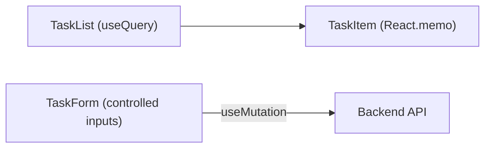

### Project 2: Real-Time Order Tracking with WebSockets

Concepts: custom `useWebSocket` hook, `useEffect` cleanup for subscriptions, `useReducer` for incoming event-driven state updates, error boundaries around the live-updating widget.

```jsx
function useOrderUpdates(orderId) {
    const [status, dispatch] = useReducer(statusReducer, null);

    useEffect(() => {
        const ws = new WebSocket(`wss://api.example.com/orders/${orderId}`);
        ws.onmessage = (event) => dispatch(JSON.parse(event.data));
        return () => ws.close(); // cleanup on unmount or orderId change
    }, [orderId]);

    return status;
}
```

### Project 3: Server-Rendered E-Commerce Product Pages (Next.js)

Concepts: SSR/SSG for SEO-critical product pages, client-side hydration for interactive "add to cart," code-splitting for heavy components (image galleries, reviews), careful avoidance of hydration mismatches.

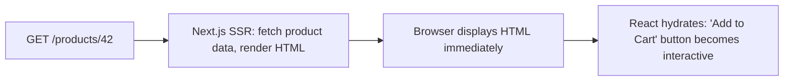

## 6.2 Step-by-Step Design Approach

For any React feature:

1. Identify what's server state (fetched data) vs. client state (UI-only) before writing any hooks.
2. Design the component tree around composition and clear prop/state ownership, not just visual layout.
3. Choose controlled vs. uncontrolled inputs deliberately based on whether you need to react to every change.
4. Write custom hooks to extract reusable stateful logic once it appears in more than one place.
5. Add error boundaries around independently-failing sections.
6. Profile with React DevTools before adding `React.memo`/`useMemo`/`useCallback` optimizations.
7. Test using React Testing Library, querying by role/text as a user would, not internal state.

## 6.3 Production Implementation Approach

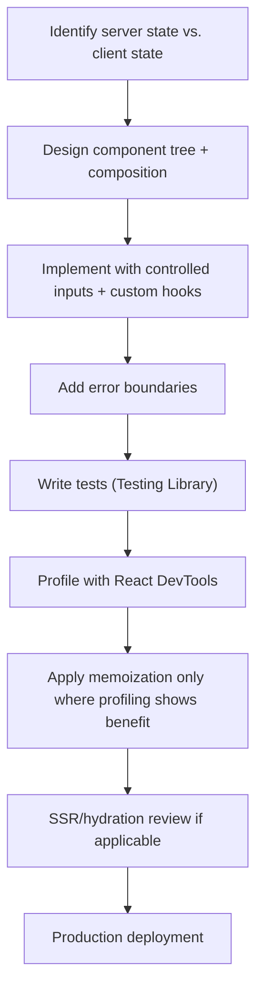

## 6.4 Production Readiness Example

For a React application, define:

- Clear architectural convention: server state via TanStack Query/SWR, client state via `useState`/Context/Zustand — documented, not ad hoc.
- Error boundaries around major independent sections of the UI.
- Bundle analysis and code-splitting for routes/heavy components.
- Accessibility review (semantic HTML, `aria-*` attributes, keyboard navigation).
- Performance monitoring (Web Vitals) and error tracking (Sentry) wired into production.
- SSR hydration mismatches checked explicitly if using Next.js/Remix.

---

# 7. Deep Dive (Optional but Important)

## 7.1 The Fiber Tree Structure

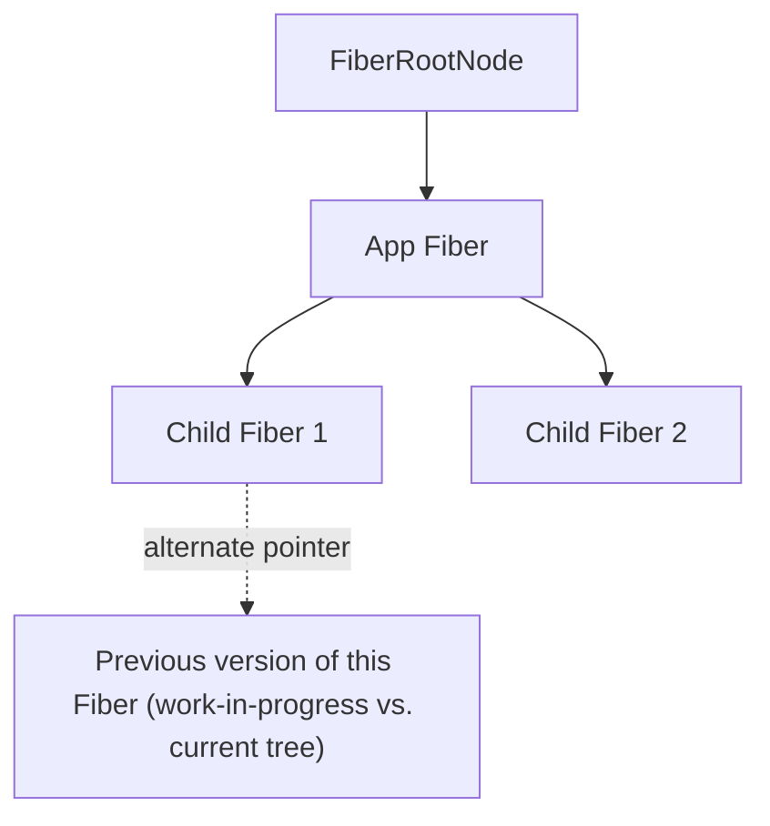

Each Fiber node represents a unit of work corresponding to a component instance, holding its type, props, state, and pointers to related fibers (child, sibling, return/parent) plus an `alternate` pointer linking to its previous version — this dual-tree structure ("current" tree vs. "work-in-progress" tree) is what allows React to build the next tree incrementally without disturbing what's currently on screen, then atomically swap them at commit time.

## 7.2 Reconciliation Diffing Algorithm (Heuristics)

```text
1. Different element types at the same position -> tear down the old subtree entirely, build new
2. Same element type -> keep the DOM node, update only changed attributes/children
3. Lists -> match by `key` first, falling back to position only without keys
```

React's diffing is a heuristic **O(n)** algorithm (not the theoretically optimal but impractical O(n³) tree-diff), built on two assumptions: different component types produce substantially different trees (so it doesn't try to diff across type changes), and lists commonly maintain stable identity across renders (hence the importance of `key`).

## 7.3 Batching and Automatic Batching (React 18+)

```jsx
function handleClick() {
    setCount(c => c + 1);
    setFlag(f => !f);
    // React 18+: both updates batched into ONE re-render, even outside event handlers
    // (React 17: only batched inside React event handlers; a setTimeout/promise callback would cause TWO re-renders)
}
```

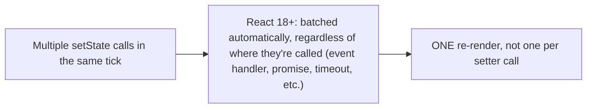

## 7.4 Concurrent Features: `useDeferredValue`

```jsx
function SearchResults({ query }) {
    const deferredQuery = useDeferredValue(query);
    const results = useMemo(() => expensiveSearch(deferredQuery), [deferredQuery]);

    return <ResultsList results={results} isStale={query !== deferredQuery} />;
}
```

`useDeferredValue` lets a value "lag behind" the true latest value during a low-priority update, similar in spirit to `useTransition` but applied to a value rather than wrapping an update — both are built on Fiber's ability to interrupt low-priority rendering work in favor of urgent updates (like keystrokes).

## 7.5 The Virtual DOM Is Not Free

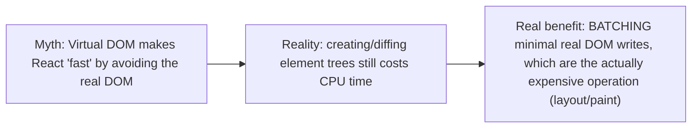

The Virtual DOM's actual performance win isn't that it's "faster than the DOM" in the abstract — it's that computing a diff in memory and applying only the minimal necessary real DOM mutations avoids the expensive part (layout thrashing from many small, uncoordinated DOM writes), at the cost of some JS-side diffing work that's usually far cheaper than the DOM operations it saves.

## 7.6 Debugging Tools

| Tool | Purpose |
|---|---|
| React DevTools (Components/Profiler tabs) | Inspect component tree/props/state, profile render timings and causes |
| `why-did-you-render` library | Logs exactly why a component re-rendered (prop/state diff) |
| `<Profiler>` component | Programmatically measure render duration for a subtree |
| ESLint `eslint-plugin-react-hooks` | Catches missing `useEffect` dependencies at lint time |
| Browser Performance tab | Correlate React renders with actual layout/paint costs |

---

# Production Checklists

## Code Quality Checklist

- [ ] Stable, unique `key`s used for all list rendering, never array index when order can change.
- [ ] State never mutated directly; all updates create new references.
- [ ] `useEffect` dependency arrays complete and lint-clean (`exhaustive-deps`).
- [ ] Server state managed via a dedicated library (TanStack Query/SWR), not manual `useEffect` fetching.
- [ ] Error boundaries placed around independently-failing UI sections.
- [ ] Custom hooks used to extract logic duplicated across more than one component.

## Performance Checklist

- [ ] Profiled with React DevTools before applying `React.memo`/`useMemo`/`useCallback`.
- [ ] Long lists virtualized rather than rendering every item unconditionally.
- [ ] Routes/heavy components code-split via `React.lazy`/dynamic imports.
- [ ] No inline object/array/function literals passed as props to memoized children.
- [ ] Bundle size monitored and analyzed regularly.

## Security Checklist

- [ ] `dangerouslySetInnerHTML` avoided or paired with rigorous sanitization.
- [ ] User-controlled URLs validated before use in `href`/`src`.
- [ ] Sensitive tokens not stored in `localStorage` where an httpOnly cookie is feasible.
- [ ] No server secrets leaked into client-bundled environment variables.

## Debugging Checklist

- [ ] Reproduce with React DevTools Profiler to see actual render causes.
- [ ] Check `useEffect` dependency arrays first when state seems "stale."
- [ ] Check for new-reference props defeating `React.memo` when re-renders seem excessive.
- [ ] Check for hydration mismatch warnings first when SSR content flashes/differs.
- [ ] Write a regression test (React Testing Library) after fixing.

---

# Learning Roadmap

## Phase 1: Beginner

Learn: JSX, components, props, `useState`, event handling, conditional rendering, lists and `key`.

Practice: to-do list, counter app, simple form.

## Phase 2: Intermediate

Learn: `useEffect` and its dependency semantics, lifting state up, Context, `useReducer`, controlled forms, basic data fetching.

Practice: a small dashboard fetching and displaying API data with a shared theme via Context.

## Phase 3: Advanced

Learn: `React.memo`/`useMemo`/`useCallback`, custom hooks, Suspense/lazy loading, TanStack Query for server state, error boundaries.

Practice: a real-time updating dashboard with WebSocket data, proper server/client state separation, and error boundaries.

## Phase 4: Production Frontend Engineer

Learn: Fiber architecture and concurrent rendering, reconciliation internals, SSR/hydration with Next.js, performance profiling, accessibility.

Practice: production-style SSR e-commerce app with code-splitting, full test coverage, performance monitoring, and a documented server-state/client-state architecture.

---

# Self-Review Completion Loop

The topic was reviewed against:

- Official React documentation (react.dev) categories.
- React RFC discussions for concurrent rendering and Fiber.
- Common production incident patterns (stale closures, key misuse, hydration mismatches, unnecessary re-renders).
- Interview patterns for beginner through senior frontend roles.

## Gap Review Matrix

| Area | Covered? | Notes |
|---|---|---|
| JSX/components/props | Yes | Fundamentals with examples |
| State (`useState`) | Yes | Including the "async-looking" update model |
| `useEffect` semantics | Yes | Dependency array rules, stale closure pitfall |
| Full hooks reference | Yes | Table covering all commonly used hooks |
| Reconciliation and keys | Yes | Diagram + index-as-key pitfall |
| Fiber architecture | Yes | Dual-tree structure, interruptible rendering |
| Memoization | Yes | `React.memo`/`useMemo`/`useCallback` interplay and pitfalls |
| Context pitfalls | Yes | Re-render-all-consumers issue, memoized value fix |
| Custom hooks | Yes | Reusable stateful logic example |
| Suspense/lazy loading | Yes | Mechanism (thrown Promise) explained |
| Server state vs. client state | Yes | Explicit architectural distinction, TanStack Query example |
| Error boundaries | Yes | Class-only limitation explained |
| SSR/hydration | Yes | Sequence diagram, mismatch pitfalls |
| Concurrent features | Yes | `useTransition`, `useDeferredValue` |
| Batching | Yes | React 17 vs. 18+ automatic batching contrast |
| Failure scenarios | Yes | Eight concrete production failure patterns |
| Security | Yes | XSS, token storage, env variable leakage |
| Interview prep | Yes | Common and tricky questions, candidate mistakes |
| Hands-on projects | Yes | Three realistic projects with diagrams |
| Diagram depth | Yes | Mermaid diagrams throughout every major section |

No significant beginner-to-senior React gaps remain for the requested "everything in React" scope. Further specialization should split into separate deep dives: **Next.js App Router Deep Dive**, **React Native**, **Advanced State Management (Redux Toolkit/Zustand internals)**, **React Performance Profiling in Depth**, and **Accessibility in React Applications**.

---

# Official References

- React Official Documentation: <https://react.dev/>
- React Reference (Hooks): <https://react.dev/reference/react>
- TanStack Query Documentation: <https://tanstack.com/query/latest>
- Next.js Documentation: <https://nextjs.org/docs>
- React Testing Library Documentation: <https://testing-library.com/docs/react-testing-library/intro/>
- React RFCs (Fiber, Concurrent Features): <https://github.com/reactjs/rfcs>

---

## Final Summary

React's core promise — describe the UI as a function of state, and let React figure out the minimal DOM updates — is powered underneath by Fiber's incremental, interruptible reconciliation model, which is what makes features like transitions and Suspense possible. Production mastery comes from internalizing the render/commit split, respecting `useEffect`'s dependency semantics instead of fighting the linter, keeping list `key`s stable, and drawing a clear architectural line between server state (owned by a data-fetching library like TanStack Query) and client state (owned by `useState`/Context) rather than treating all state the same way.
