# All React Hooks: Complete Beginner-to-Expert Reference Guide

> **Scope:** This guide catalogs every hook in React — state, effect, context, ref, performance, concurrent, and the newest React 19 hooks (`use`, `useOptimistic`, `useActionState`, `useFormStatus`) — plus the Rules of Hooks, custom hook patterns, and how each hook actually works internally. Builds on [[08 React]] and cross-links to [[12 TanStack Query]] and [[11 Redux Toolkit and RTK Query]] for hooks that overlap with those libraries' concerns.

## Table of Contents

1. [Executive Summary](#executive-summary)
2. [1. Fundamentals](#1-fundamentals-beginner-level)
3. [2. Core Concepts](#2-core-concepts-intermediate-level)
4. [3. Advanced Concepts](#3-advanced-concepts-senior-level)
5. [4. Real-World System Design Usage](#4-real-world-system-design-usage)
6. [5. Interview Preparation](#5-interview-preparation)
7. [6. Hands-On Thinking](#6-hands-on-thinking)
8. [7. Deep Dive](#7-deep-dive-optional-but-important)
9. [Production Checklists](#production-checklists)
10. [Learning Roadmap](#learning-roadmap)
11. [Self-Review Completion Loop](#self-review-completion-loop)
12. [Official References](#official-references)

---

## Executive Summary

Hooks are functions that let function components "hook into" React features — state, lifecycle-like effects, context, refs, and performance optimizations — that previously required class components. Every hook follows the same underlying mechanism: it reads from and writes to a slot in an internal, ordered list tied to the component's Fiber node.

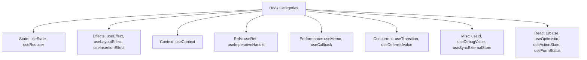

> [!TIP]
> Every hook's behavior follows from one mechanical fact: **hooks are matched to their stored state by the *order* they're called in, not by name.** This single rule explains the Rules of Hooks (no conditionals/loops around hook calls), why custom hooks work at all, and most "why did my state get mixed up" bugs.

---

# 1. Fundamentals (Beginner Level)

## 1.1 The Rules of Hooks

```javascript
// RULE 1: Only call hooks at the top level — never inside conditions, loops, or nested functions
function Component() {
    if (condition) {
        const [state, setState] = useState(0); // WRONG
    }
}

// RULE 2: Only call hooks from React function components or custom hooks
function regularFunction() {
    const [state, setState] = useState(0); // WRONG - not a component or hook
}

// Custom hooks MUST start with "use" so React's linter can verify Rule 1 for them
function useMyCustomHook() { /* ... */ } // correct naming
```

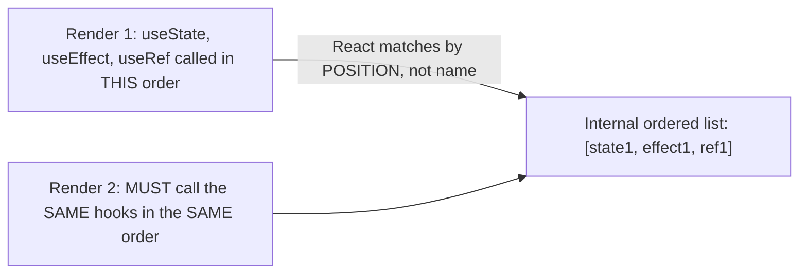

## 1.2 Why Hooks Exist

| Problem with Class Components | Hooks' Answer |
|---|---|
| Stateful logic couldn't be extracted/reused without patterns like HOCs/render props (which caused "wrapper hell") | Custom hooks extract and reuse stateful logic directly |
| Related logic scattered across multiple lifecycle methods (`componentDidMount`, `componentDidUpdate`, `componentWillUnmount`) | `useEffect` co-locates related setup/cleanup logic in one place |
| `this` binding confusion in class methods | Function components have no `this` to manage |
| Classes are harder to minify/optimize and encourage larger component bundles | Function components are simpler for tooling |

## 1.3 `useState`

```jsx
const [count, setCount] = useState(0);
const [count, setCount] = useState(() => computeExpensiveInitial()); // lazy initializer, runs ONCE

setCount(count + 1);           // direct value
setCount(prev => prev + 1);    // updater function - always gets the LATEST state, even in batched updates
```

| Detail | Behavior |
|---|---|
| Lazy initializer | Pass a function to `useState` when the initial value is expensive to compute — it only runs on the first render |
| Updater function form | Use `setCount(prev => ...)` when the new state depends on the previous state, especially with multiple updates in one event |
| Object/array state | React does NOT shallow-merge like class `this.setState` did — you must spread manually: `setUser({...user, name: "New"})` |

> [!WARNING]
> `useState` does not merge objects like class components' `setState` did. `setUser({ name: "New" })` **replaces** the entire state value, losing any other fields — always spread the previous state explicitly when updating part of an object.

## 1.4 `useEffect`

```jsx
useEffect(() => {
    const subscription = subscribe(id);
    return () => subscription.unsubscribe(); // cleanup
}, [id]);
```

| Dependency Array | Effect Runs |
|---|---|
| Omitted | After every render |
| `[]` | Once, after initial mount only |
| `[a, b]` | After mount, and again whenever `a` or `b` changes |

Covered in full detail in [[08 React]] §1.11 and §2.3 (stale closure pitfall).

## 1.5 `useContext`

```jsx
const ThemeContext = createContext("light");
const theme = useContext(ThemeContext); // reads the nearest Provider's value above this component
```

Covered in full detail in [[08 React]] §2.5, including the "every consumer re-renders on any value change" pitfall.

## 1.6 `useRef`

```jsx
function TextInput() {
    const inputRef = useRef(null);

    function focusInput() {
        inputRef.current.focus();
    }

    return <input ref={inputRef} />;
}
```

```jsx
function Timer() {
    const countRef = useRef(0); // mutable value that does NOT trigger re-render when changed

    function increment() {
        countRef.current += 1; // no re-render happens
        console.log(countRef.current); // always up to date, unlike a closure over state
    }
}
```

| Use Case | Pattern |
|---|---|
| DOM element access | `<div ref={myRef} />`, then `myRef.current` is the actual DOM node |
| Mutable value across renders, no re-render on change | `const ref = useRef(initial); ref.current = newValue;` |
| Storing a previous value | Update `ref.current` inside a `useEffect` after render, compare against it |

> [!IMPORTANT]
> `useRef` is the **only** built-in hook that lets you store a value across renders **without** causing a re-render when it changes, and without the value being "stale" inside closures the way `useState` values captured in an old closure would be — `ref.current` always reflects the latest assignment, read at any time.

## 1.7 `useReducer`

```jsx
function reducer(state, action) {
    switch (action.type) {
        case "increment": return { count: state.count + 1 };
        case "decrement": return { count: state.count - 1 };
        default: throw new Error("Unknown action");
    }
}

function Counter() {
    const [state, dispatch] = useReducer(reducer, { count: 0 });
    return <button onClick={() => dispatch({ type: "increment" })}>{state.count}</button>;
}
```

Covered in full detail in [[08 React]] §2.6. Prefer over multiple `useState` calls when state transitions are complex or interdependent.

## 1.8 `useMemo` and `useCallback`

```jsx
const sortedItems = useMemo(() => [...items].sort(compareFn), [items]);
const handleClick = useCallback(() => doSomething(id), [id]);
```

Covered in full detail in [[08 React]] §3.3, including why they only help when paired with `React.memo` on a reference-sensitive child.

## 1.9 Basic Custom Hooks

```jsx
function useToggle(initial = false) {
    const [value, setValue] = useState(initial);
    const toggle = useCallback(() => setValue(v => !v), []);
    return [value, toggle];
}

function Modal() {
    const [isOpen, toggleOpen] = useToggle(false);
}
```

A custom hook is just a regular function, following the naming convention `useXxx`, that calls one or more built-in hooks internally — each component using it gets its **own independent state**, even though they share the same logic.

## 1.10 Hooks You Can't Use in Class Components

Every hook listed in this guide is exclusively for function components — there is no hook equivalent usable inside a class component's methods, and conversely, error boundaries (which require `componentDidCatch`/`getDerivedStateFromError`) have no hook equivalent, as covered in [[08 React]] §3.8.

---

# 2. Core Concepts (Intermediate Level)

## 2.1 `useLayoutEffect`

```jsx
function Tooltip({ targetRef }) {
    const tooltipRef = useRef(null);

    useLayoutEffect(() => {
        const rect = targetRef.current.getBoundingClientRect();
        tooltipRef.current.style.top = `${rect.bottom}px`; // measure and adjust BEFORE paint
    }, [targetRef]);

    return <div ref={tooltipRef} className="tooltip" />;
}
```

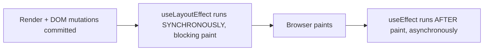

| Hook | Timing | Use For |
|---|---|---|
| `useLayoutEffect` | Synchronous, before browser paint | Measuring DOM layout (position/size) and synchronously adjusting before the user sees anything |
| `useEffect` | Asynchronous, after browser paint | Almost everything else: data fetching, subscriptions, logging |

> [!WARNING]
> `useLayoutEffect` blocks the browser from painting until it finishes — using it for anything beyond DOM measurement/synchronous adjustment (like data fetching) will make your UI feel less responsive. Default to `useEffect`; reach for `useLayoutEffect` only when you specifically need to prevent a visual flash from a layout-dependent adjustment.

## 2.2 `useImperativeHandle`

```jsx
const FancyInput = forwardRef(function FancyInput(props, ref) {
    const inputRef = useRef(null);

    useImperativeHandle(ref, () => ({
        focus() { inputRef.current.focus(); },
        clear() { inputRef.current.value = ""; }
        // deliberately does NOT expose the raw DOM node itself
    }));

    return <input ref={inputRef} {...props} />;
});

function Parent() {
    const fancyRef = useRef(null);
    return <FancyInput ref={fancyRef} onClick={() => fancyRef.current.focus()} />;
}
```

`useImperativeHandle` customizes exactly what a parent component receives when it attaches a `ref` to a child, letting the child expose a curated imperative API (`focus()`, `clear()`) instead of the raw underlying DOM node or internal implementation details.

## 2.3 `useId`

```jsx
function LabeledInput({ label }) {
    const id = useId();
    return (
        <>
            <label htmlFor={id}>{label}</label>
            <input id={id} />
        </>
    );
}
```

> [!TIP]
> `useId` generates a stable, unique identifier that's **consistent between server and client render** (unlike `Math.random()` or an incrementing module-level counter, both of which cause SSR hydration mismatches — see [[08 React]] §3.9). Use it for accessibility attributes (`id`/`htmlFor`/`aria-describedby`), never as a list `key` or for anything requiring true global uniqueness across an entire dataset.

## 2.4 `useDebugValue`

```jsx
function useOnlineStatus() {
    const [isOnline, setIsOnline] = useState(navigator.onLine);
    useDebugValue(isOnline ? "Online" : "Offline"); // shown in React DevTools next to this hook's entry
    // ... subscribe to online/offline events
    return isOnline;
}
```

`useDebugValue` only affects what's displayed in React DevTools for a custom hook — it has zero effect on runtime behavior, purely a developer-experience aid for inspecting custom hook state.

## 2.5 Hooks Ordering with Custom Hooks

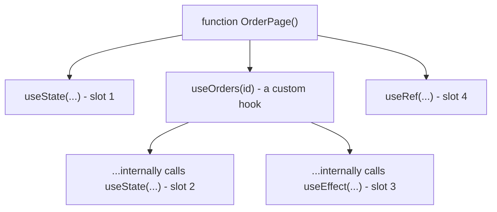

Custom hooks don't create a separate "scope" of hook slots — every hook call, whether directly in the component or nested inside a custom hook it calls, occupies the **next sequential slot** in that component's single ordered hook list. This is why the Rules of Hooks apply identically whether a hook call is written directly in the component or inside a custom hook it uses.

## 2.6 `useTransition`

```jsx
const [isPending, startTransition] = useTransition();

function handleTabChange(nextTab) {
    startTransition(() => {
        setActiveTab(nextTab); // marked as a LOW-priority update, interruptible by more urgent ones
    });
}
```

Covered in depth in [[08 React]] §3.1 — marks a state update as low-priority so React can interrupt it in favor of urgent updates (like keystrokes), returning `isPending` to show a non-blocking loading indicator.

## 2.7 `useDeferredValue`

```jsx
function SearchResults({ query }) {
    const deferredQuery = useDeferredValue(query);
    const isStale = query !== deferredQuery;
    const results = useMemo(() => expensiveSearch(deferredQuery), [deferredQuery]);

    return <div style={{ opacity: isStale ? 0.5 : 1 }}>{results}</div>;
}
```

Covered in depth in [[08 React]] §7.4 — lets a *value* (rather than an update) lag behind during low-priority rendering work, useful when you don't control the state setter directly (e.g., a value from a parent/URL) but still want to defer expensive re-renders derived from it.

## 2.8 `useSyncExternalStore`

```jsx
function useWindowWidth() {
    return useSyncExternalStore(
        (callback) => {
            window.addEventListener("resize", callback);
            return () => window.removeEventListener("resize", callback);
        },
        () => window.innerWidth,        // client snapshot
        () => 0                          // server snapshot (for SSR)
    );
}
```

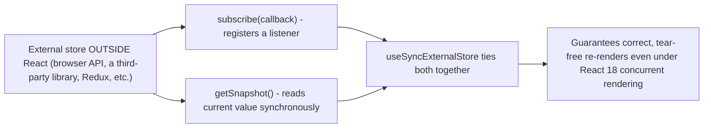

> [!IMPORTANT]
> This is the hook you need whenever subscribing a component to state that lives **outside** React (a browser API, a third-party non-React store, a WebSocket connection's latest value) — using plain `useState` + `useEffect` to mirror external state into React can produce inconsistent "tearing" under concurrent rendering (different parts of a paint showing different snapshots of the same external value). `useSyncExternalStore` is exactly the primitive libraries like Redux's `useSelector` and Zustand build on internally.

## 2.9 `useInsertionEffect`

```jsx
function useCSSInJS(rule) {
    useInsertionEffect(() => {
        const styleSheet = document.styleSheets[0];
        const index = styleSheet.insertRule(rule);
        return () => styleSheet.deleteRule(index);
    });
}
```

`useInsertionEffect` fires **before** `useLayoutEffect`, specifically designed for CSS-in-JS libraries that need to inject `<style>` rules into the DOM before any layout effects run and read layout information that depends on those styles being present — this is a highly specialized hook almost never used directly in application code, only inside styling library internals.

## 2.10 Testing Custom Hooks

```jsx
import { renderHook, act } from "@testing-library/react";

test("useToggle flips its value", () => {
    const { result } = renderHook(() => useToggle(false));
    expect(result.current[0]).toBe(false);

    act(() => result.current[1]()); // call the toggle function
    expect(result.current[0]).toBe(true);
});
```

---

# 3. Advanced Concepts (Senior Level)

## 3.1 React 19: The `use` Hook

```jsx
function OrderDetail({ orderPromise }) {
    const order = use(orderPromise); // suspends the component until the promise resolves
    return <h2>{order.status}</h2>;
}

function Page({ orderId }) {
    const orderPromise = useMemo(() => fetchOrder(orderId), [orderId]);
    return (
        <Suspense fallback={<Spinner />}>
            <OrderDetail orderPromise={orderPromise} />
        </Suspense>
    );
}
```

```jsx
function ThemedButton() {
    // use() can ALSO read context, and — unlike useContext — can be called CONDITIONALLY
    if (someCondition) {
        const theme = use(ThemeContext);
    }
}
```

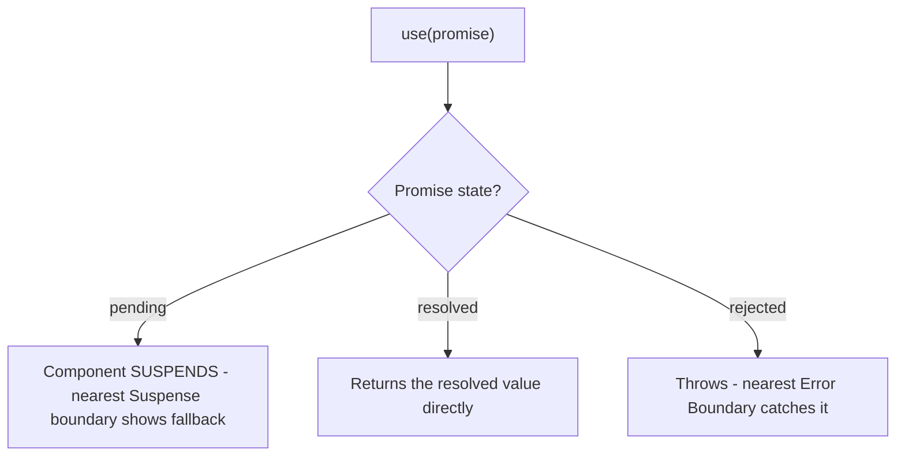

| Aspect | `use` | Other Hooks |
|---|---|---|
| Can be called conditionally | **Yes** — this is a deliberate, unique exception to the Rules of Hooks | No |
| Reads Promises | Yes, suspending the component until resolution | N/A |
| Reads Context | Yes (alternative to `useContext`) | `useContext` only |
| Purpose | A more flexible primitive for consuming async values and context, especially in Server Components | N/A |

> [!IMPORTANT]
> `use` is the **only** hook allowed to be called conditionally or in a loop — this is intentional, not an oversight, because of how it integrates with Suspense and Server Components. Don't assume this exception extends to any other hook.

## 3.2 React 19: `useOptimistic`

```jsx
function OrderStatus({ order, updateStatus }) {
    const [optimisticOrder, setOptimisticOrder] = useOptimistic(
        order,
        (currentOrder, newStatus) => ({ ...currentOrder, status: newStatus })
    );

    async function handleShip() {
        setOptimisticOrder("SHIPPED"); // instantly reflected in the UI
        await updateStatus(order.id, "SHIPPED"); // actual server request
        // once the real `order` prop updates (e.g., via revalidation), optimisticOrder reconciles automatically
    }

    return (
        <div>
            <p>{optimisticOrder.status}</p>
            <button onClick={handleShip}>Mark as Shipped</button>
        </div>
    );
}
```

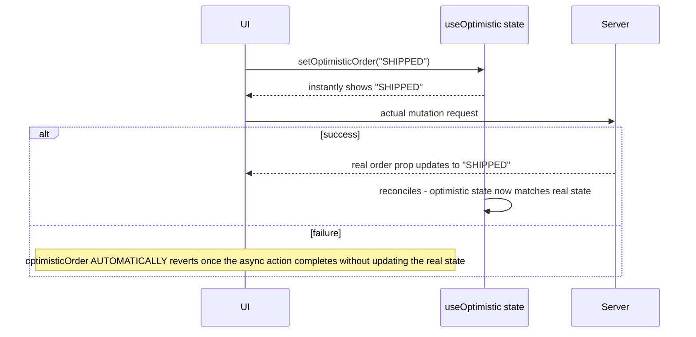

`useOptimistic` is a built-in, simpler alternative to hand-rolling optimistic-update state with `useState` + manual rollback logic — it automatically reverts to the real underlying value once the async action settles, if that real value was never actually updated to match the optimistic guess. This overlaps conceptually with TanStack Query's and RTK Query's optimistic update patterns ([[12 TanStack Query]] §3.1, [[11 Redux Toolkit and RTK Query]] §3.3) but is a lighter-weight, library-free primitive for simpler cases.

## 3.3 React 19: `useActionState` and Form Actions

```jsx
async function createOrderAction(previousState, formData) {
    const name = formData.get("customerName");
    try {
        const order = await api.createOrder({ name });
        return { success: true, order };
    } catch (error) {
        return { success: false, error: error.message };
    }
}

function CreateOrderForm() {
    const [state, formAction, isPending] = useActionState(createOrderAction, { success: null });

    return (
        <form action={formAction}>
            <input name="customerName" />
            <button disabled={isPending}>{isPending ? "Creating..." : "Create Order"}</button>
            {state.success === false && <p>Error: {state.error}</p>}
        </form>
    );
}
```

```mermaid
flowchart LR
    Form["<form action={formAction}>"] --> Submit["User submits"]
    Submit --> Action["React calls createOrderAction(previousState, formData)"]
    Action --> Pending["isPending = true while the action runs"]
    Action --> NewState["Return value becomes the new state"]
    NewState --> Rerender["Component re-renders with updated state, isPending=false"]
```

`useActionState` wires a form directly to an async server/client action function, automatically managing pending state and the returned result — replacing manual `useState` + `onSubmit` + `preventDefault` + loading-flag boilerplate for form submissions.

## 3.4 React 19: `useFormStatus`

```jsx
function SubmitButton() {
    const { pending } = useFormStatus(); // reads the status of the PARENT <form>'s pending submission
    return <button disabled={pending}>{pending ? "Submitting..." : "Submit"}</button>;
}

function CreateOrderForm() {
    return (
        <form action={createOrderAction}>
            <input name="customerName" />
            <SubmitButton /> {/* a separate, reusable component reading the ambient form status */}
        </form>
    );
}
```

> [!TIP]
> `useFormStatus` must be called from a component **rendered inside** the `<form>`, and it reads that form's ambient pending state without needing the status threaded down as an explicit prop — ideal for building reusable submit-button components that work inside any form action without coupling to a specific parent's state.

## 3.5 `useContext` Performance Deep Dive

```jsx
// PROBLEM: new object literal every render -> ALL consumers re-render on every App render
function App() {
    const [user, setUser] = useState(null);
    return (
        <UserContext.Provider value={{ user, setUser }}>
            <Rest />
        </UserContext.Provider>
    );
}

// FIX: memoize the context value
function App() {
    const [user, setUser] = useState(null);
    const value = useMemo(() => ({ user, setUser }), [user]);
    return (
        <UserContext.Provider value={value}>
            <Rest />
        </UserContext.Provider>
    );
}
```

Even with a memoized value, **every** consumer of a given context still re-renders whenever that value changes at all — Context has no built-in mechanism for a consumer to subscribe to only part of the value (unlike `useSyncExternalStore`-based external stores, which can implement selective subscriptions). For frequently-changing, broadly-consumed state, an external store (Zustand, Redux) often scales better than Context.

## 3.6 Custom Hook Composition Patterns

```jsx
function useDebounce(value, delay) {
    const [debounced, setDebounced] = useState(value);
    useEffect(() => {
        const timer = setTimeout(() => setDebounced(value), delay);
        return () => clearTimeout(timer);
    }, [value, delay]);
    return debounced;
}

function useSearch(query) {
    const debouncedQuery = useDebounce(query, 300);
    const { data, isLoading } = useQuery({
        queryKey: ["search", debouncedQuery],
        queryFn: () => searchApi(debouncedQuery),
        enabled: debouncedQuery.length > 0
    });
    return { results: data, isLoading };
}
```

Custom hooks compose naturally — `useSearch` builds on `useDebounce` (a generic utility hook) and TanStack Query's `useQuery` (a data-fetching hook), demonstrating how hooks let you layer increasingly domain-specific abstractions from generic building blocks.

## 3.7 Common Hook Pitfalls Reference Table

| Hook | Pitfall |
|---|---|
| `useState` | Assuming object/array state merges automatically (it replaces, doesn't merge) |
| `useEffect` | Missing a used value in the dependency array, causing a stale closure |
| `useEffect` | Forgetting cleanup for subscriptions/timers, causing leaks or "update on unmounted component" warnings |
| `useLayoutEffect` | Overusing it for non-layout work, blocking paint unnecessarily |
| `useRef` | Expecting a change to `ref.current` to trigger a re-render (it never does) |
| `useMemo`/`useCallback` | Using them without a memoized consumer (`React.memo`), gaining no actual benefit |
| `useContext` | Passing a new object/array literal as `Provider value` every render, causing all consumers to re-render constantly |
| `useReducer` | Mutating the state object directly inside the reducer instead of returning a new object |
| `useId` | Using it as a list `key` (it's for accessibility attributes, not list identity) |
| `use` | Passing a **new** Promise instance on every render without memoizing it, causing infinite re-suspension |
| `useOptimistic`/`useActionState` | Using these without also handling the true error/failure path in the UI |

## 3.8 Failure Scenarios

| Failure | Symptom | Common Cause | Fix |
|---|---|---|---|
| "Rendered fewer hooks than expected" error | Crash on re-render | A hook call was placed inside a conditional/early return, changing hook count between renders | Move all hook calls to the unconditional top level of the component |
| Effect uses outdated prop/state value | Bug only shows up after multiple state changes | Missing dependency in `useEffect`'s array | Add every used value to the dependency array |
| Infinite `useEffect` loop | Browser freezes | Effect's dependency (e.g., a new object/array) changes identity every render | Memoize the dependency with `useMemo`, or narrow the dependency to primitives |
| `use(promise)` causes infinite suspension | Component keeps showing the Suspense fallback forever | A brand-new Promise created on every render passed to `use` | Memoize the Promise (`useMemo`) so the same instance persists across re-renders until inputs actually change |
| Context consumer re-renders constantly | Performance issue in a large subtree | New object/array literal passed as Provider `value` each render | Memoize the value with `useMemo` |
| Ref-based DOM manipulation happens before the element exists | `Cannot read properties of null` | Reading `ref.current` during render instead of in an effect (refs are only attached after commit) | Access `ref.current` inside `useEffect`/`useLayoutEffect` or event handlers, never during render |

## 3.9 Security Considerations for Hooks

| Risk | Mitigation |
|---|---|
| `useEffect` fetching sensitive data without cleanup, leaking across route changes | Always return a cleanup function that cancels/ignores stale in-flight requests |
| Storing tokens in `useRef`/`useState` and accidentally logging them via `useDebugValue`/DevTools | Avoid surfacing sensitive values in debug output |
| `useActionState`/form actions trusting `formData` without server-side validation | Always validate/sanitize on the server action itself, never trust client input implicitly |

---

# 4. Real-World System Design Usage

## 4.1 Where Different Hooks Show Up in Production

| Hook Category | Typical Production Use |
|---|---|
| `useState`/`useReducer` | Form fields, UI toggles, wizard step state |
| `useEffect` | Subscriptions (WebSocket, browser events), imperative DOM sync, analytics logging |
| `useContext` | Theme, current authenticated user, locale — infrequently-changing broadly-shared values |
| `useMemo`/`useCallback` | Expensive derived data, stabilizing props for memoized children in large lists |
| `useRef` | Focus management, integrating non-React libraries (charting, maps) imperatively |
| `useTransition`/`useDeferredValue` | Search-as-you-type, tab switching with heavy content, large list filtering |
| `useSyncExternalStore` | Custom hooks wrapping browser APIs or third-party non-React state |
| `use`/`useOptimistic`/`useActionState`/`useFormStatus` | React 19 Server Components/Actions-based forms and data loading |

## 4.2 Typical Hook Layering in a Feature

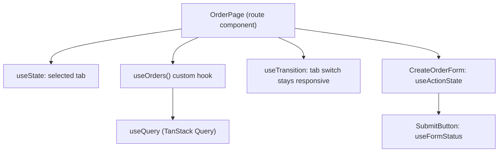

## 4.3 Big-Company Style Thinking

| Concern | Hook-Level Design Response |
|---|---|
| Performance | `useTransition`/`useDeferredValue` for heavy UI updates; `useMemo`/`useCallback` only where profiling justifies it |
| Correctness | Exhaustive `useEffect` dependencies enforced via lint rule in CI, never manually suppressed without justification |
| Maintainability | Custom hooks named and organized per domain (`useOrders`, `useAuth`, `useDebounce`) in a shared hooks directory |
| Accessibility | `useId` used consistently for form label associations |
| Server-state architecture | Data-fetching hooks (TanStack Query/RTK Query) chosen over ad hoc `useEffect` fetching, per [[08 React]] §3.6 |

## 4.4 Integration Points

| Concern | Relevant Hooks |
|---|---|
| Server state | `useQuery`/`useMutation` (TanStack Query), RTK Query hooks — see [[12 TanStack Query]], [[11 Redux Toolkit and RTK Query]] |
| Global client state | `useContext`, or external-store hooks via `useSyncExternalStore`-based libraries (Zustand) |
| Forms | `useActionState`, `useFormStatus`, or third-party (`useForm` from React Hook Form) |
| Concurrent UX | `useTransition`, `useDeferredValue` |

---

# 5. Interview Preparation

## 5.1 What Interviewers Expect

For "React hooks" topics, interviewers usually expect:

- You know the Rules of Hooks and *why* they exist (positional matching).
- You can correctly use `useState`, `useEffect`, `useContext`, `useRef`, `useReducer`.
- You understand `useMemo`/`useCallback` and when they actually help.

For senior frontend roles, they also expect:

- You understand `useSyncExternalStore` and why it's needed for external state.
- You know the newer React 19 hooks (`use`, `useOptimistic`, `useActionState`, `useFormStatus`) and their use cases.
- You can explain why hooks must be called unconditionally and what breaks if they aren't.
- You can build well-composed custom hooks layering multiple built-in hooks.

## 5.2 Most Important Questions and Answers

### Q1. Why must hooks be called in the same order on every render?

React matches each hook call to its stored state/effect by the **position** it's called in during render, not by variable name or any other identifier. If a hook call is skipped conditionally on one render but not another, every subsequent hook's position shifts, causing React to match the wrong stored state to the wrong hook — hence the Rules of Hooks requiring unconditional, top-level calls.

### Q2. What's the difference between `useEffect` and `useLayoutEffect`?

`useEffect` runs asynchronously after the browser paints, suitable for the vast majority of side effects. `useLayoutEffect` runs synchronously after DOM mutations but before paint, blocking the browser — necessary only when you need to measure or adjust layout before the user sees anything, to avoid a visual flash.

### Q3. Why doesn't changing `ref.current` cause a re-render?

`useRef` is deliberately designed to hold a mutable value **outside** React's rendering/state system — it's a plain mutable box, not tracked state. This makes it ideal for values that need to persist across renders and be read/written imperatively (DOM nodes, timers, previous values) without triggering the render cycle.

### Q4. When does `useMemo`/`useCallback` actually provide a performance benefit?

Only when the memoized value/function is passed to something that does a reference-equality check to skip work — typically a child wrapped in `React.memo`, or another hook's dependency array. Used without such a consumer, they add overhead (the memoization check itself) without preventing any actual work.

### Q5. What is `useSyncExternalStore` for, and why can't `useState` + `useEffect` replace it safely?

It's for subscribing a component to state that lives **outside** React (browser APIs, third-party stores). Manually mirroring external state into `useState` via a `useEffect` subscription can produce "tearing" under React 18's concurrent rendering — different components reading inconsistent snapshots of the same external value during a single render pass. `useSyncExternalStore` guarantees consistent, synchronized reads.

### Q6. What is unique about the `use` hook compared to every other hook?

It's the only hook allowed to be called **conditionally** or inside loops — a deliberate, singular exception to the Rules of Hooks, designed to work with Suspense (for Promises) and Server Components (for context) in a more flexible way than `useContext`/manual promise handling allowed.

### Q7. How does `useOptimistic` differ from manually managing optimistic state with `useState`?

`useOptimistic` automatically derives its optimistic value from the real underlying state plus a pending "guess," and automatically reconciles/reverts once the real state either updates to match or the async action completes without changing it — removing the need to manually snapshot, apply, and roll back state as you would with hand-written `useState`-based optimistic logic.

### Q8. What does `useActionState` provide over a manual `onSubmit` handler with `useState`?

It wires a form's action function directly into React's rendering, automatically tracking a `pending` state during the action's execution and updating a `state` value from the action's return value — removing manual `useState` calls for loading/result tracking and manual `event.preventDefault()`/submission wiring.

### Q9. Why must `useFormStatus` be called from a component nested inside a `<form>`?

It reads the ambient pending status of its **nearest parent `<form>`** implicitly — it has no way to know which form's status to report if called outside of one, which is precisely its design benefit: a reusable submit-button component can read this without any prop being threaded down from the form.

### Q10. Can custom hooks have their own private state?

Yes — every call to a custom hook from a different component instance gets its own completely independent copy of whatever `useState`/`useReducer`/`useRef` calls happen inside it; custom hooks are not global or shared, they're just reusable *logic*, with state still scoped per calling component.

## 5.3 Tricky Questions

### If two sibling components both call the same custom hook, do they share state?

No — each call site gets its own independent state instance. The custom hook function runs separately (as part of each component's own render), producing separate hook slots per component; the *logic* is shared, the *state* is not.

### Why might wrapping a `useEffect`'s dependency in `useMemo` still not fix an infinite loop?

If the `useMemo` itself depends on something that's unstable (e.g., a new object/function reference recreated every render), the memoized value still changes every time, propagating the instability rather than fixing it — you have to trace the instability back to its actual unstable root, not just add memoization at the point where you first noticed the symptom.

### Is `useState`'s setter function guaranteed to be stable across renders?

Yes — the setter function returned by `useState` (and `dispatch` from `useReducer`) is guaranteed by React to have a stable identity across re-renders, so it's safe to omit from a `useEffect`/`useCallback` dependency array (ESLint's `exhaustive-deps` rule is aware of this and won't flag it).

### Does calling `use(promise)` twice with the same promise in the same component cause two suspensions?

No — as long as it's the exact same Promise instance, React's Suspense integration handles it as one logical asynchronous dependency; the actual subtlety is ensuring the Promise instance itself is stable (e.g., via `useMemo`) across re-renders, not accidentally creating a new one each time.

## 5.4 Common Candidate Mistakes

- Calling hooks inside `if` statements, loops, or after an early `return`.
- Believing `useState` merges object updates automatically.
- Missing `useEffect` dependencies and blaming "React bugs" instead of the stale closure.
- Using `useMemo`/`useCallback` everywhere without understanding they need a memoized consumer to matter.
- Expecting a `ref.current` mutation to trigger a re-render.
- Not knowing `useSyncExternalStore` exists and manually (unsafely) syncing external state via `useState`+`useEffect`.
- Confusing `useId`'s purpose with generating list `key`s.
- Not knowing about the React 19 hooks (`use`, `useOptimistic`, `useActionState`, `useFormStatus`) at all.

## 5.5 Interview Coding Checklist

- [ ] All hook calls at the unconditional top level of the component/custom hook.
- [ ] `useEffect` dependency arrays complete and lint-clean.
- [ ] `useRef` used (not `useState`) for values that shouldn't trigger re-renders.
- [ ] `useMemo`/`useCallback` applied only where a memoized consumer or dependency array benefits from it.
- [ ] Context `Provider` values memoized if the context is broadly consumed and changes somewhat often.
- [ ] Custom hooks named with the `use` prefix and composed from smaller, focused hooks.

---

# 6. Hands-On Thinking

## 6.1 Three Real-World Projects Exercising Many Hooks

### Project 1: Accessible, Reusable Form Library

Concepts: `useId` for label association, `useActionState` for submission handling, `useFormStatus` for a reusable submit button, custom `useFieldValidation` hook.

```mermaid
flowchart LR
    Form["<form action={formAction}>"] --> Field["LabeledField (useId)"]
    Form --> Submit["SubmitButton (useFormStatus)"]
    Form -->|"useActionState"| ActionResult["Result/error state"]
```

### Project 2: Live Dashboard with External Store Integration

Concepts: `useSyncExternalStore` wrapping a WebSocket connection's latest value, `useTransition` for smooth widget switching, `useDeferredValue` for a heavy chart re-render.

```jsx
function useLiveMetric(socket) {
    return useSyncExternalStore(
        (callback) => { socket.on("update", callback); return () => socket.off("update", callback); },
        () => socket.latestValue
    );
}
```

### Project 3: Optimistic Task Board

Concepts: `useOptimistic` for instant drag-and-drop feedback, `useReducer` for complex board state transitions, `useCallback` to stabilize handlers passed to memoized `TaskCard` components.

```jsx
const [optimisticTasks, addOptimisticMove] = useOptimistic(tasks, (state, move) =>
    state.map(t => t.id === move.taskId ? { ...t, columnId: move.newColumnId } : t)
);
```

## 6.2 Step-by-Step Design Approach

For any component needing hooks:

1. Start with the simplest hook that solves the problem (`useState` before `useReducer`, `useEffect` before `useLayoutEffect`).
2. Extract logic into a custom hook as soon as it's needed in more than one component.
3. Verify every `useEffect` dependency array is complete before considering the effect "done."
4. Only add `useMemo`/`useCallback` after profiling shows a real re-render cost, paired with an actual memoized consumer.
5. Reach for `useSyncExternalStore` (or a library built on it) for any state genuinely owned outside React.
6. For React 19 form/action patterns, prefer `useActionState`/`useFormStatus` over manual `useState`-based submission handling.

## 6.3 Production Implementation Approach

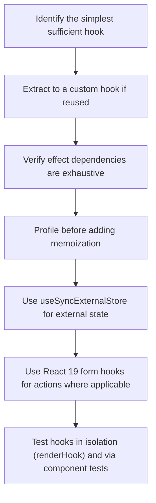

## 6.4 Production Readiness Example

For a hooks-heavy codebase, define:

- ESLint's `react-hooks/exhaustive-deps` and `react-hooks/rules-of-hooks` enforced in CI, not just locally.
- A shared `hooks/` directory with clear naming and single-responsibility custom hooks.
- A documented policy: server state via a dedicated library, not raw `useEffect` fetching.
- Memoization added only with a comment/justification tied to a profiling result, not defensively everywhere.

---

# 7. Deep Dive (Optional but Important)

## 7.1 The Fiber-Linked-List Hook Storage Mechanism

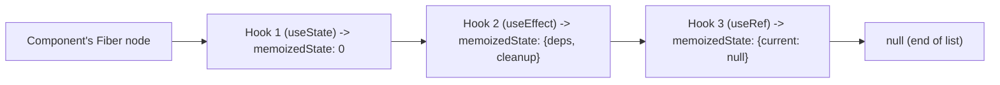

Internally, each Fiber node maintains a linked list of "Hook" objects, each storing that hook's current state, effect deps, or ref value. On each render, React walks this same linked list in order, matching the *n*-th hook call in your component's code to the *n*-th Hook object in the list — this is the literal mechanism behind "hooks are matched by call order, not name."

## 7.2 How `useState` Is Actually Implemented (Conceptually)

```text
1st render: React creates a new Hook object, stores initial value, returns [value, dispatch]
Re-render:  React walks to the SAME position in the (already-existing) Hook list,
            reads the CURRENT stored value (which may have been updated by a
            previous dispatch call), returns [currentValue, sameDispatchFunction]
dispatch(newValue): schedules a re-render; the Hook's stored value is updated
                     as part of processing the update, BEFORE the next render reads it
```

## 7.3 Batching Across React 19 Actions

```javascript
async function formAction(previousState, formData) {
    // Multiple state-affecting operations inside a form action are automatically
    // batched together, similar to React 18's automatic batching for event handlers
}
```

React 19's Actions (used by `useActionState`) extend automatic batching guarantees into async action functions, ensuring state updates triggered as part of processing a form submission don't cause multiple separate re-renders unnecessarily.

## 7.4 Why Conditional Hooks Would Break Silently (Not Just "Look Wrong")

```jsx
function BadComponent({ showExtra }) {
    const [a, setA] = useState(1);
    if (showExtra) {
        const [b, setB] = useState(2); // conditionally called
    }
    const [c, setC] = useState(3);
    // If showExtra flips from true to false between renders:
    // React expects hook #2 to be 'c's useState, but it was previously 'b's useState
    // -> c's state gets initialized with b's stored value, or React throws an error
    //    detecting the mismatched hook count, depending on the specific case
}
```

This concrete trace is why the Rules of Hooks aren't just a style guideline — violating them causes React's internal position-based bookkeeping to desynchronize from your actual code, corrupting which stored value gets attached to which variable.

## 7.5 Debugging Tools

| Tool | Purpose |
|---|---|
| React DevTools (Components tab, "hooks" inspector) | Inspect every hook's current value for a selected component instance |
| `eslint-plugin-react-hooks` | Enforces Rules of Hooks and exhaustive-deps at lint time |
| `@testing-library/react`'s `renderHook` | Test custom hooks in isolation without a full component |
| `useDebugValue` | Custom labels shown in DevTools for custom hook state |

---

# Production Checklists

## Code Quality Checklist

- [ ] All hooks called unconditionally at the top level.
- [ ] `useEffect`/`useLayoutEffect` dependency arrays complete and lint-verified.
- [ ] `useRef` used (not `useState`) for values that shouldn't trigger re-renders.
- [ ] Custom hooks named with `use` prefix, single-responsibility, composed from smaller hooks.
- [ ] `useSyncExternalStore` (or a library built on it) used for genuinely external state, not manual `useEffect` syncing.

## Performance Checklist

- [ ] `useMemo`/`useCallback` applied only where profiling shows benefit, paired with a memoized consumer.
- [ ] Context `Provider` values memoized for broadly-consumed, changing contexts.
- [ ] `useTransition`/`useDeferredValue` applied for heavy, interruptible UI updates.

## Security Checklist

- [ ] Effects fetching sensitive data include proper cleanup/cancellation.
- [ ] Form action functions (`useActionState`) validate input server-side, not just client-side.
- [ ] No sensitive values surfaced via `useDebugValue`/DevTools in production builds.

## Debugging Checklist

- [ ] "Rendered fewer hooks than expected" → check for hooks inside conditionals/early returns.
- [ ] Stale value inside an effect → check the dependency array first.
- [ ] Infinite loop → check for unstable object/function identities feeding a dependency array.
- [ ] Context consumers re-rendering excessively → check for unmemoized `Provider` value.
- [ ] `use(promise)` re-suspending endlessly → check the Promise instance is memoized, not recreated every render.

---

# Learning Roadmap

## Phase 1: Beginner

Learn: Rules of Hooks, `useState`, `useEffect`, `useContext`, `useRef`.

Practice: a form with local state, a data-fetching component with cleanup, a themed component tree.

## Phase 2: Intermediate

Learn: `useReducer`, `useMemo`/`useCallback`, `useId`, `useImperativeHandle`, custom hook basics.

Practice: extract a `useDebounce`/`useToggle` custom hook; wrap a third-party imperative widget with `useImperativeHandle`.

## Phase 3: Advanced

Learn: `useTransition`, `useDeferredValue`, `useSyncExternalStore`, `useLayoutEffect`, `useInsertionEffect`.

Practice: build a custom hook wrapping a non-React external store with `useSyncExternalStore`; add `useTransition` to a heavy search/filter UI.

## Phase 4: Production Frontend Engineer

Learn: React 19's `use`, `useOptimistic`, `useActionState`, `useFormStatus`; Fiber's internal hook storage mechanism.

Practice: a production-style form flow using Actions end-to-end (`useActionState` + `useFormStatus`), and an optimistic-UI feature built on `useOptimistic`.

---

# Self-Review Completion Loop

The topic was reviewed against:

- Official React documentation's complete hooks reference (react.dev).
- React 19 release notes and RFC discussions (`use`, Actions, `useOptimistic`, `useActionState`, `useFormStatus`).
- Common production pitfalls per hook (stale closures, unstable references, conditional hook calls).
- Interview patterns for beginner through senior frontend roles.

## Gap Review Matrix

| Area | Covered? | Notes |
|---|---|---|
| Rules of Hooks | Yes | Mechanical explanation via Fiber's linked list |
| `useState` | Yes | Lazy initializer, updater function, no auto-merge pitfall |
| `useEffect`/`useLayoutEffect`/`useInsertionEffect` | Yes | Full timing comparison, CSS-in-JS use case |
| `useContext` | Yes | Performance pitfall, memoized value fix |
| `useRef`/`useImperativeHandle` | Yes | Mutable-without-re-render behavior, curated imperative API |
| `useReducer` | Yes | Cross-linked to [[08 React]] |
| `useMemo`/`useCallback` | Yes | When they actually help, cross-linked |
| `useId`/`useDebugValue` | Yes | SSR-safe ID generation, DevTools-only debug aid |
| `useTransition`/`useDeferredValue` | Yes | Cross-linked to [[08 React]] concurrent features |
| `useSyncExternalStore` | Yes | Tearing problem explained, library-internals connection |
| React 19: `use` | Yes | Unique conditional-call exception, Promise/context reading |
| React 19: `useOptimistic` | Yes | Sequence diagram, comparison to manual optimistic patterns |
| React 19: `useActionState`/`useFormStatus` | Yes | Form action wiring, reusable submit button pattern |
| Custom hook composition | Yes | Layered example (`useDebounce` + `useQuery`) |
| Failure scenarios | Yes | Six concrete production failure patterns |
| Security | Yes | Cleanup, server-side validation, debug value leakage |
| Interview prep | Yes | Common and tricky questions, candidate mistakes |
| Hands-on projects | Yes | Three realistic projects with diagrams |
| Internals | Yes | Fiber hook linked-list mechanism, conditional-hook failure trace |

No significant gaps remain for "all hooks in React," including the newest React 19 additions. Further specialization should split into separate deep dives: **React Server Components and Actions In Depth**, **Building a Custom State Management Library on `useSyncExternalStore`**, and **Advanced Suspense Patterns with `use`**.

---

# Official References

- React Reference — Hooks: <https://react.dev/reference/react/hooks>
- React 19 Release Notes: <https://react.dev/blog/2024/12/05/react-19>
- React Reference — `use`: <https://react.dev/reference/react/use>
- React Reference — `useOptimistic`: <https://react.dev/reference/react/useOptimistic>
- React Reference — `useActionState`: <https://react.dev/reference/react/useActionState>
- React Reference — `useSyncExternalStore`: <https://react.dev/reference/react/useSyncExternalStore>

---

## Final Summary

Every React hook — from `useState` to the newest React 19 additions — is matched to its stored data by call *order*, not name, which is the single mechanical fact underlying the Rules of Hooks and most hook-related bugs. Production mastery comes from choosing the simplest hook that solves the problem, keeping `useEffect` dependency arrays exhaustive rather than fighting the linter, reaching for `useSyncExternalStore` (not manual `useState`+`useEffect`) for genuinely external state, and adopting React 19's `use`/`useOptimistic`/`useActionState`/`useFormStatus` where they replace hand-rolled async/optimistic-update/form-submission boilerplate with built-in, better-integrated primitives.
