# ⚛️ React Internals & Architecture — Complete Beginner-to-Expert Reference

> How React *actually works* under the hood — the Virtual DOM, the **Fiber** architecture, reconciliation & diffing, the render/commit phases, how **hooks** are really implemented, concurrent rendering, and the scheduler. The deep mental model behind every `useState`.

---

## 📑 Table of Contents

1. [Executive Summary](#-executive-summary)
2. [Fundamentals (Beginner)](#1--fundamentals-beginner-level)
3. [Core Concepts (Intermediate)](#2--core-concepts-intermediate-level)
4. [Advanced Concepts (Senior)](#3--advanced-concepts-senior-level)
5. [Real-World System Design](#4--real-world-system-design-usage)
6. [Interview Preparation](#5--interview-preparation)
7. [Hands-On Projects](#6--hands-on-projects)
8. [Deep Dive: Internals](#7--deep-dive-internals)
9. [Production Checklists](#-production-checklists)
10. [Learning Roadmap](#-learning-roadmap)
11. [Self-Review Completion Loop](#-self-review-completion-loop)
12. [Official References](#-official-references)
13. [Final Summary](#-final-summary)

---

## 🎯 Executive Summary

React is a **UI library built on one radical idea**: describe *what* the UI should look like for a given state, and let React figure out *how* to update the real DOM efficiently. You write declarative components; React builds a lightweight tree (the **Virtual DOM**), **diffs** it against the previous tree (**reconciliation**), and applies the minimal set of real DOM mutations. Since React 16, this all runs on the **Fiber** architecture — a rewrite that makes rendering *interruptible*, enabling concurrent features.

| What it is | What it replaces | Core superpower |
|---|---|---|
| Declarative UI + Virtual DOM diffing on the Fiber engine | Manual DOM manipulation (jQuery), string templating | **Describe UI as a function of state; React efficiently syncs the DOM** |

> [!IMPORTANT]
> The mental model that unlocks everything: **`UI = f(state)`**. Your components are functions that take state/props and return a description of the UI (React elements — plain objects, *not* real DOM). When state changes, React **re-runs** the relevant components to produce a new element tree, **diffs** it against the old one (reconciliation), and surgically updates only what changed. The Virtual DOM isn't magic speed — it's a *programming model* that lets you write declarative code while React handles imperative DOM updates. The **Fiber** architecture (React 16+) then made this work *interruptible and prioritizable*, which is what enables Suspense, concurrent rendering, and transitions. Understanding this pipeline — element → reconcile → commit — explains every React behavior, quirk, and optimization. Builds directly on [[08 React]] and [[09 React Hooks]].

Related guides: [[08 React]] · [[09 React Hooks]] · [[01 JavaScript]] · [[04 JavaScript and Nodejs Concurrency]] · [[03 TypeScript]] · [[11 Redux Toolkit and RTK Query]] · [[12 TanStack Query]]

---

## 1. 🌱 FUNDAMENTALS (Beginner Level)

### The core problem React solves

Directly manipulating the DOM (with `document.getElementById`, jQuery) gets unmanageable: as state changes, you must manually find and update every affected element, keeping the DOM in sync with your data. This is error-prone and doesn't scale.

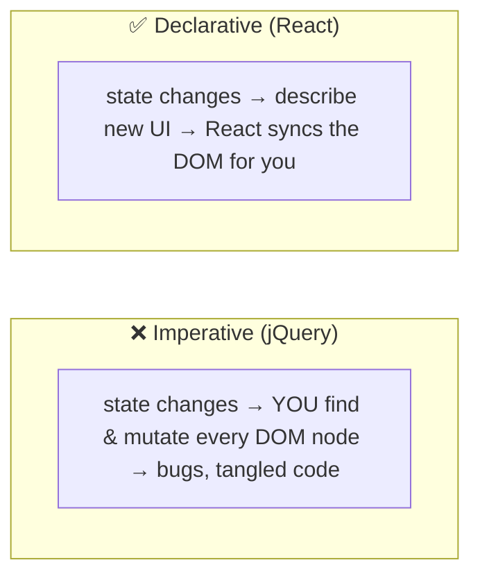

> [!IMPORTANT]
> React's founding insight: **stop mutating the DOM manually; instead describe what the UI should be, and re-describe it whenever state changes.** You never say "add this `<li>`" — you say "here's the list for this state," and React computes the difference. This **declarative** approach means your UI code is a pure function of state: given the same state, you get the same UI. The cost of re-describing the *whole* UI on every change would be huge if applied naively to the real DOM — so React invented the **Virtual DOM** to make "re-render everything" cheap.

### What is the Virtual DOM?

The Virtual DOM (VDOM) is a **lightweight JavaScript object tree** that mirrors the real DOM structure. Updating a plain JS object is far cheaper than touching the real DOM (which triggers layout, reflow, paint).

```javascript
// JSX...
<h1 className="title">Hello</h1>

// ...compiles to React.createElement(...), which produces a plain object:
{
  type: 'h1',
  props: { className: 'title', children: 'Hello' },
  key: null, ref: null
}
// This object is a "React element" — the Virtual DOM node. NOT a real DOM node.
```

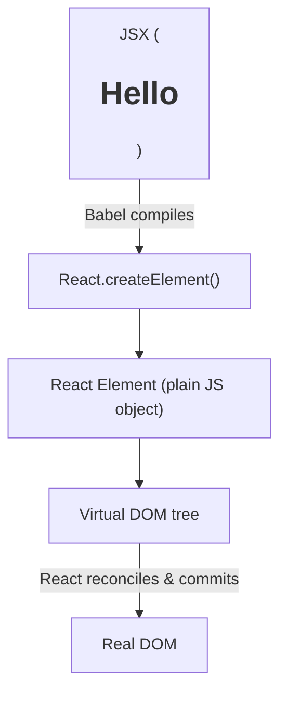

> [!TIP]
> **JSX is not HTML and not magic** — it's syntactic sugar. Babel compiles `<h1>Hello</h1>` into `React.createElement('h1', null, 'Hello')`, which returns a **plain object** describing the element. Your entire component tree becomes a tree of these objects — the Virtual DOM. React works with these cheap objects, computes what changed, and only then touches the expensive real DOM. This is why you can "re-render" freely: you're mostly creating JS objects, not DOM nodes.

### The three-step cycle

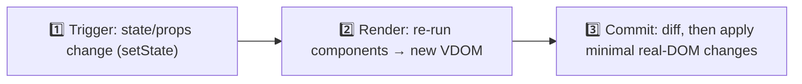

| Step | What happens |
|---|---|
| **Trigger** | `setState`/props change schedules a re-render |
| **Render** | React calls your components, builds a new element tree (no DOM touched yet) |
| **Reconcile** | Diff new tree vs old tree — find what changed |
| **Commit** | Apply the minimal DOM mutations; run effects |

### Real-world analogy 📝

Think of React like an **editor tracking changes in a document**:
- You hand in a **new draft** of the whole document (re-render → new VDOM).
- The editor **compares** it to the previous draft (reconciliation/diffing).
- Instead of retyping the whole thing, they only **apply the specific edits** that changed (commit to real DOM).
- **Keys** are like paragraph IDs — they help the editor know "this is the *same* paragraph moved," not "delete and rewrite."

> [!TIP]
> Beginner takeaway: you write components as **functions of state that return element trees**; React handles the "how do I efficiently update the screen" part via the VDOM diff. Re-rendering is *describing*, not *DOM-updating* — the actual DOM work is minimized in the commit phase. Everything advanced (Fiber, concurrency, hooks) is built on this foundation.

---

## 2. 🧩 CORE CONCEPTS (Intermediate Level)

### 2.1 Reconciliation & the Diffing Algorithm

Comparing two trees optimally is O(n³) — far too slow. React uses **heuristics** to make it O(n) based on two assumptions:

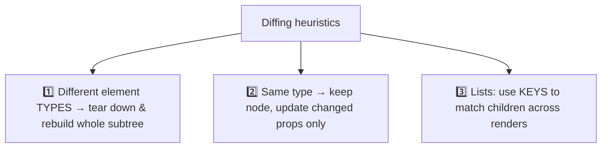

> [!IMPORTANT]
> **Reconciliation** is React's diffing process, made fast by two heuristics: (1) **elements of different types produce different trees** — if `<div>` becomes `<span>`, React destroys the old subtree entirely and builds new (it doesn't try to diff across types); (2) **the developer hints stable identity via `key`** — for lists, keys let React match elements across renders (this moved, this is new, this was removed) instead of re-creating them. Same type → React reuses the DOM node and only patches changed attributes. These heuristics turn an intractable problem into a linear one — the trade-off being occasional sub-optimal diffs that keys exist to fix.

### 2.2 Why keys matter (the classic bug)

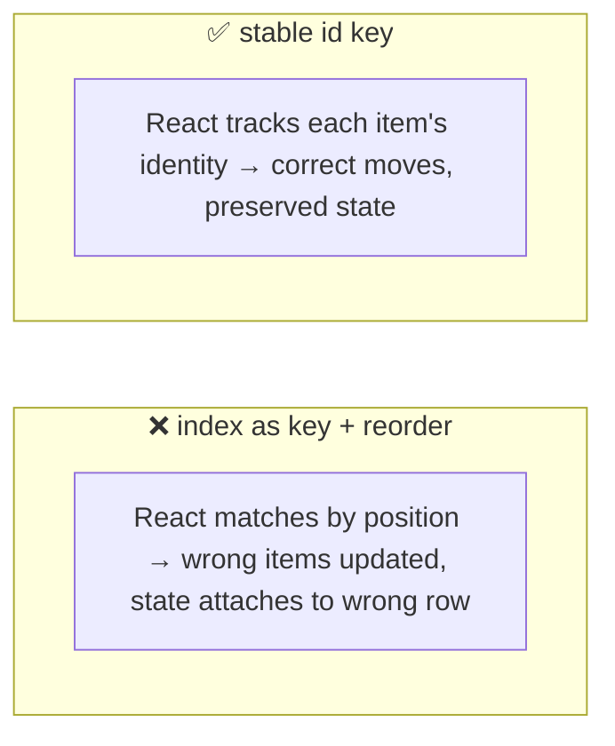

> [!WARNING]
> **Using array index as a `key` is a top React bug** — when the list reorders, inserts, or deletes, React matches children *by position*, so it associates the wrong DOM/state with the wrong data (an input's value "jumps" to another row, wrong items animate, etc.). Keys must be **stable, unique identifiers** tied to the *data* (e.g., `item.id`), not the position. Index-as-key is only safe for static, never-reordered lists. This directly stems from heuristic #3 — keys ARE how React establishes element identity across renders.

### 2.3 The Fiber Architecture

Before React 16, reconciliation was **recursive and synchronous** — once it started, it ran to completion, blocking the main thread (janky UI on big trees). **Fiber** (React 16) rewrote this.

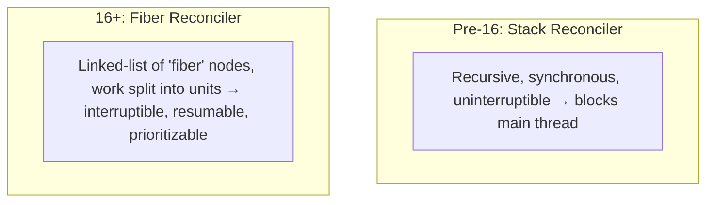

> [!IMPORTANT]
> A **Fiber** is a JavaScript object representing a unit of work — essentially one node in the tree (a component instance / DOM node) plus bookkeeping: its type, props, state, and pointers to its `child`, `sibling`, and `return` (parent). Fibers form a **linked list** (not a recursive call stack), which is the key innovation: React can **process one fiber, then pause, check if something more urgent came in, and resume later** — rendering becomes *interruptible*. The old "stack reconciler" was a recursive function call that couldn't be paused. Fiber turned reconciliation into a loop over a linked list of work units that React's **scheduler** can time-slice. This is the foundation for *everything* concurrent (Suspense, transitions, concurrent rendering).

### 2.4 Two Phases: Render & Commit

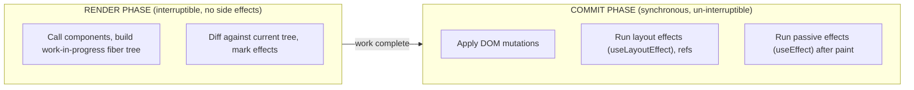

> [!IMPORTANT]
> React splits work into two phases. The **render phase** is where React calls your components and builds a "work-in-progress" fiber tree, diffing to figure out what changed — this phase is **interruptible, can be paused/restarted/aborted, and must be pure** (no side effects, because React might run it multiple times or throw it away). The **commit phase** applies the actual DOM changes and runs effects — it's **synchronous and cannot be interrupted** (the DOM must update atomically so users never see a half-updated screen). **This is why your render function must be pure and side-effect-free** (side effects go in `useEffect`/event handlers): React may call it speculatively and discard the result. Understanding render-vs-commit explains Strict Mode's double-rendering, why effects run after paint, and concurrent behavior.

### 2.5 State updates & batching

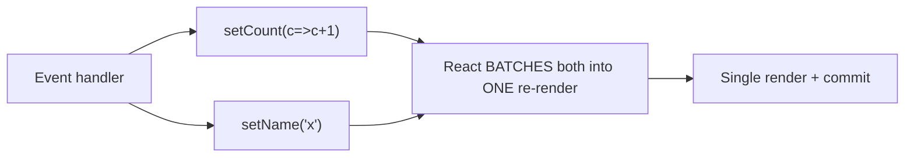

> [!TIP]
> React **batches** multiple state updates that happen in the same event handler into a *single* re-render for efficiency (two `setState` calls = one render, not two). Since React 18, this **automatic batching** extends to promises, timeouts, and native events too (previously only React event handlers batched). This is why reading state right after `setState` shows the *old* value — updates are scheduled, not immediate, and applied on the next render. Use the **updater function** form (`setCount(c => c + 1)`) when the new state depends on the previous, to avoid stale-closure bugs during batching.

### 2.6 How Hooks work (the rules explained)

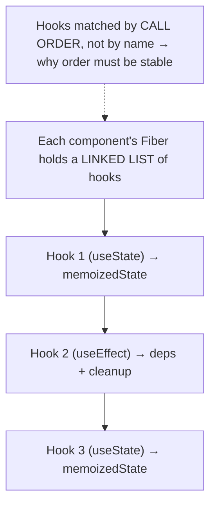

> [!IMPORTANT]
> Here's *why* the "Rules of Hooks" exist. React stores a component's hooks as an **ordered linked list on its fiber**. On each render, React walks that list **in call order** — the 1st `useState` call maps to the 1st slot, the 2nd hook to the 2nd slot, and so on. There are **no names** — hooks are identified purely by *the order they're called*. This is why you **must call hooks unconditionally at the top level**: if you put a hook inside an `if`, the call order changes between renders, and React reads the wrong slot (state from `useState` #1 suddenly belongs to `useEffect` #2 — chaos). "Don't call hooks conditionally" isn't arbitrary — it's a direct consequence of the index-based storage mechanism. See [[09 React Hooks]] for usage; this is the *why*.

---

## 3. ⚙️ ADVANCED CONCEPTS (Senior Level)

### 3.1 Double Buffering — current vs work-in-progress trees

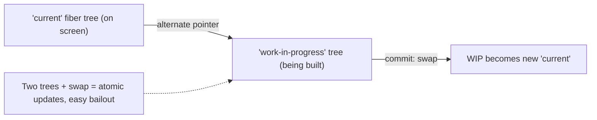

> [!IMPORTANT]
> React maintains **two fiber trees** simultaneously — the **`current`** tree (what's rendered on screen) and the **`workInProgress`** tree (what React is building for the next render). Each fiber has an **`alternate`** pointer linking its counterpart in the other tree. React builds the WIP tree during the render phase; when complete, the commit phase **swaps pointers** in one atomic operation — WIP becomes the new `current`. This **double-buffering** (a technique borrowed from graphics) means: the on-screen tree is never in a half-updated state, React can **abandon** an in-progress render (just discard the WIP tree) if a higher-priority update arrives, and it can **reuse** fibers via `alternate` to avoid allocation. It's the structural basis of interruptible, concurrent rendering.

### 3.2 The Scheduler & Priority

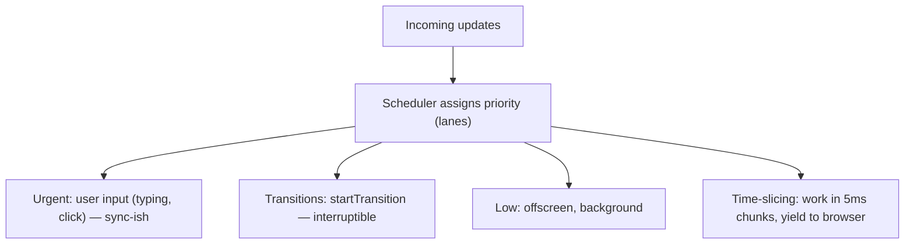

> [!IMPORTANT]
> Fiber enables React's **scheduler** to prioritize work using a **lane** model (a bitmask of priority levels). Urgent updates (typing in an input, clicks) get high priority and are processed synchronously-ish; **transitions** (`startTransition`, `useDeferredValue`) are marked low-priority and **interruptible** — React can pause them to keep the UI responsive. The scheduler does **time-slicing**: it works in small chunks (~5ms), then *yields to the browser* (via a `MessageChannel`-based mechanism) so the browser can handle input, paint, and animations — then resumes. This is how React 18 keeps a heavy render from freezing the page: expensive work is broken up and yields, so typing stays smooth even while a big list re-renders. It's cooperative scheduling on JavaScript's single thread ([[04 JavaScript and Nodejs Concurrency]]).

### 3.3 Concurrent Rendering & Transitions

```javascript
// Mark a non-urgent update as a transition — React can interrupt it
import { startTransition, useDeferredValue } from 'react';

startTransition(() => {
  setSearchResults(expensiveFilter(query));  // low priority, interruptible
});
// Urgent update (the input value) stays responsive; results update when possible
```

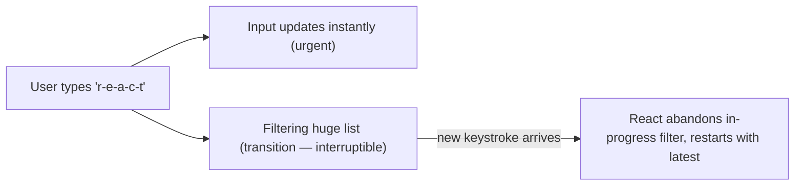

> [!IMPORTANT]
> **Concurrent rendering** (React 18) means React can **prepare multiple versions of the UI at once** and interrupt/abandon work. `startTransition` marks an update as non-urgent — React renders it in the background *without blocking* urgent updates (like the input). If a new keystroke arrives mid-render, React **throws away** the in-progress work and starts fresh with the latest value (thanks to double-buffering §3.1). `useDeferredValue` does similar — it lets a value "lag" so expensive dependent renders don't block typing. **This isn't multithreading** — it's still one thread, using time-slicing + interruptibility to *prioritize*. The result: heavy renders no longer make the app feel frozen. This is the payoff of the entire Fiber rewrite.

### 3.4 Suspense & how it works internally

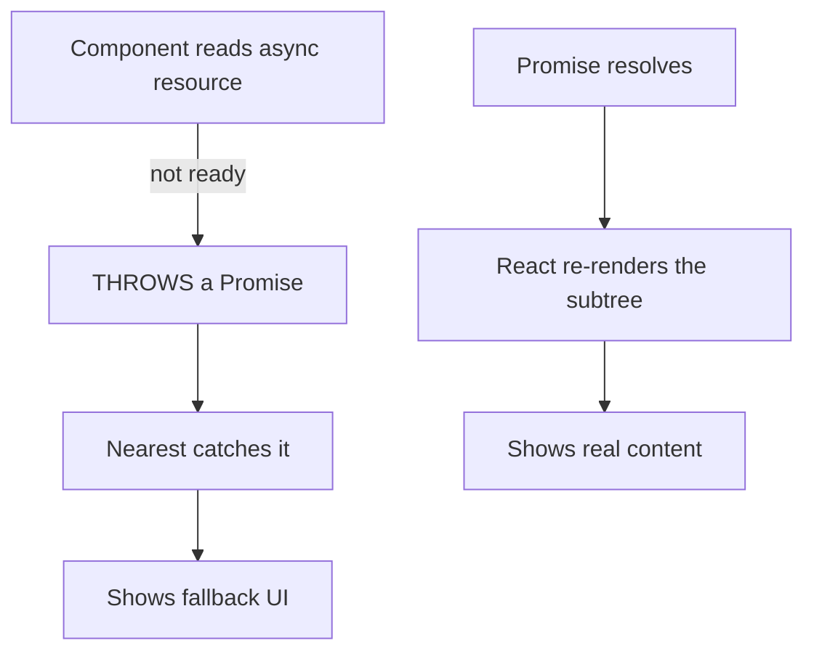

> [!TIP]
> **Suspense** works via a clever mechanism: when a component needs data that isn't ready, it **throws a Promise** (not an error). The nearest `<Suspense>` boundary "catches" it (like an error boundary catches errors), shows the `fallback`, and subscribes to the Promise. When it resolves, React retries rendering the subtree. This lets you write components that *read* async data as if it were synchronous, with declarative loading states. It integrates with the concurrent renderer to avoid showing fallbacks unnecessarily (React can wait a bit for fast data). Data libraries ([[12 TanStack Query]], React Server Components, frameworks like Next.js) build on this. The throw-a-Promise trick is how React "pauses" a component mid-render.

### 3.5 Reconciliation edge cases & bailouts

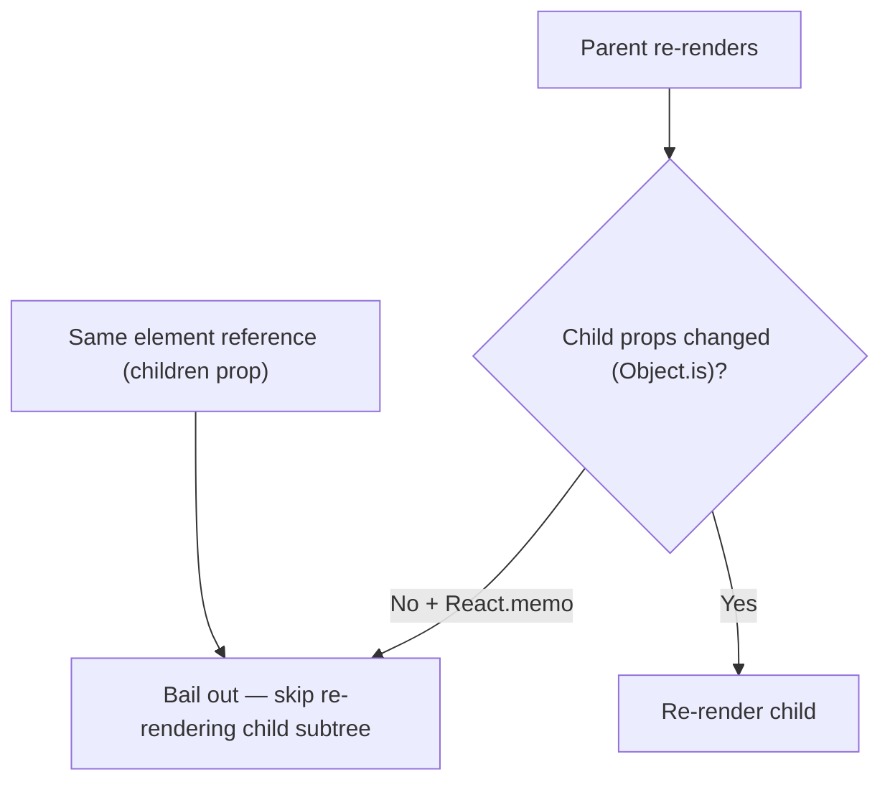

> [!TIP]
> React has several **bailout** optimizations to skip re-rendering. If a component returns the *same element reference* as last time (e.g., a `children` prop passed through), React skips re-rendering that subtree. **`React.memo`** wraps a component to bail out when props are shallow-equal (`Object.is`). **`useMemo`/`useCallback`** stabilize references so memoized children can bail. But beware: **a state change re-renders a component and all its descendants by default** — memoization only helps at the boundary you apply it. A common senior insight: often the better fix isn't `memo` everywhere but **restructuring** (lift state down, pass components as `children`) so fewer components are in the re-render path. Note React 19's **compiler** can auto-insert these memoizations.

### 3.6 Failure Scenarios & Common Internals-Level Bugs

| Bug | Root cause (internals) | Fix |
|---|---|---|
| Wrong item state after reorder | Index-as-key → identity mismatch in diff | Stable `id` keys |
| "Too many re-renders" | setState during render (not in effect/handler) | Move to event handler / effect |
| Stale state in closure | Batching + closure captured old state | Updater fn `setX(x=>…)` / correct deps |
| Effect runs twice (dev) | Strict Mode double-invoke to surface bugs | Make effects idempotent + cleanup |
| Hook order error | Conditional hook → wrong linked-list slot | Hooks unconditional at top level |
| Janky UI on big render | Synchronous blocking render | `startTransition`/`useDeferredValue` |
| Memo not working | New object/fn reference each render breaks shallow-eq | `useMemo`/`useCallback` |

> [!WARNING]
> The **Strict Mode double-render** in development trips up many: React 18 intentionally **calls your component (and mounts/unmounts effects) twice** in dev to *surface* impure renders and missing effect cleanups. If your component breaks when rendered twice or your effect leaks without cleanup, that's a real bug React is helping you find (it maps to concurrent rendering, where components may render multiple times). The fix is *never* to disable Strict Mode — it's to make renders **pure** and effects **idempotent with proper cleanup**. This directly reflects the render-phase-must-be-pure rule (§2.4).

---

## 4. 🏗️ REAL-WORLD SYSTEM DESIGN USAGE

### 4.1 The full render pipeline in one picture

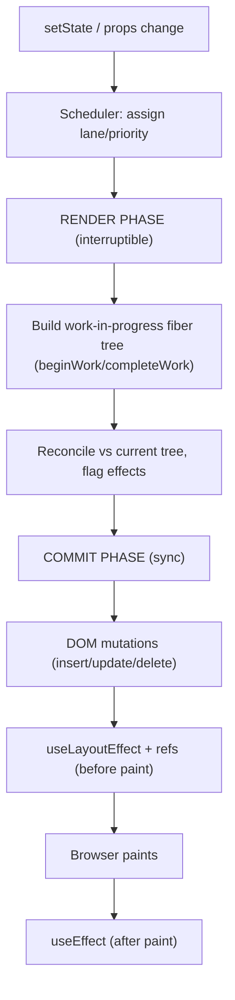

> [!IMPORTANT]
> This is the complete journey of an update — worth memorizing for senior interviews. A state change is **scheduled** with a priority, the **render phase** builds a new fiber tree (via `beginWork` descending and `completeWork` ascending) and reconciles it against the current tree (marking which fibers have effects), then the **commit phase** synchronously applies DOM mutations, runs `useLayoutEffect` and ref updates *before* the browser paints, lets the browser paint, and finally runs `useEffect` (passive effects) *after* paint. This ordering explains everything: why `useLayoutEffect` can measure/mutate the DOM without flicker (runs before paint, blocking) while `useEffect` is for non-visual work (runs after paint, non-blocking). Missing this ordering is the source of countless timing bugs.

### 4.2 Where React fits: Client vs Server rendering

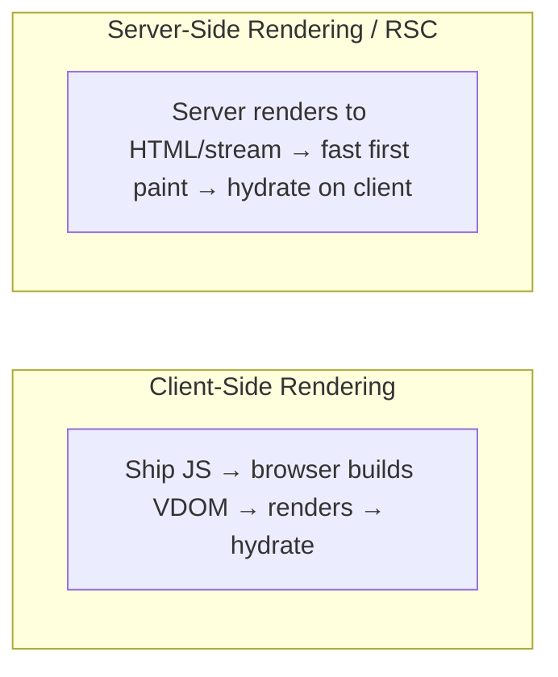

> [!TIP]
> The same reconciliation engine drives multiple rendering strategies. **Client rendering**: the browser downloads JS, builds the VDOM, and renders (slow first paint, then interactive). **Server-side rendering (SSR)**: the server renders components to HTML for a fast first paint, then the client **hydrates** (attaches event listeners, rebuilds the fiber tree to match). **React Server Components (RSC)** (used by Next.js) render some components entirely on the server, sending a serialized tree — reducing client JS. All of these reuse the Fiber reconciler; they differ in *where* and *when* rendering happens. Concurrent features (streaming SSR with Suspense) let the server send HTML in chunks as data resolves.

### 4.3 Performance architecture in practice

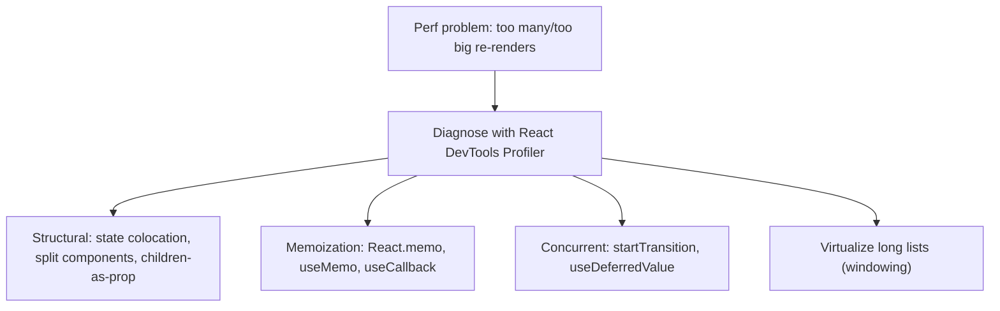

> [!IMPORTANT]
> Real-world React performance is about **controlling the re-render path**. Because a state update re-renders a component and its subtree, the levers are: **structural** (keep state as local as possible so fewer components re-render; pass children as props to enable bailouts), **memoization** (`React.memo`/`useMemo`/`useCallback` to skip work at boundaries), **concurrent** (`startTransition` to keep urgent updates snappy), and **virtualization** (only render visible list rows). Always **profile first** (React DevTools Profiler shows what rendered and why) — premature `memo` everywhere adds complexity for little gain. Data-fetching libraries ([[12 TanStack Query]], [[11 Redux Toolkit and RTK Query]]) also reduce re-renders via caching and selective subscriptions.

---

## 5. 🎤 INTERVIEW PREPARATION

### 5.1 Most important questions

<details>
<summary><b>Q1: What is the Virtual DOM and why does React use it?</b></summary>

The Virtual DOM is a lightweight JavaScript object tree representing the UI. When state changes, React builds a new VDOM tree, **diffs** it against the previous one (reconciliation), and applies only the minimal necessary changes to the real DOM. It exists because direct DOM manipulation is expensive (reflow/repaint) and imperative code is hard to maintain — the VDOM lets you write declarative `UI = f(state)` code while React optimizes the actual DOM updates. Note: the VDOM isn't inherently "fast" — it's a programming model that makes efficient updates possible.
</details>

<details>
<summary><b>Q2: Explain reconciliation and the diffing heuristics.</b></summary>

Reconciliation is React comparing the new element tree to the previous one to determine what changed. Optimal tree diffing is O(n³), so React uses O(n) heuristics: (1) different element **types** → destroy and rebuild the subtree; (2) same type → keep the node, update changed props; (3) lists use **keys** to match children by identity across renders. These assumptions trade perfect diffs for speed; keys are how developers give React the identity hints it needs.
</details>

<details>
<summary><b>Q3: What is Fiber and why was it introduced?</b></summary>

Fiber (React 16) is the reconciler rewrite. A "fiber" is a JS object representing a unit of work (a node) with pointers to child/sibling/parent, forming a linked list instead of a recursive call stack. This makes rendering **interruptible**: React can process a fiber, pause, handle a higher-priority update, and resume — enabling time-slicing, concurrent rendering, Suspense, and transitions. The old stack reconciler was synchronous and uninterruptible, so a big render blocked the main thread.
</details>

<details>
<summary><b>Q4: Render phase vs commit phase?</b></summary>

The **render phase** calls components and builds the work-in-progress fiber tree, diffing against the current tree — it's **interruptible and must be pure** (no side effects; React may run it multiple times or discard it). The **commit phase** applies DOM mutations and runs effects — it's **synchronous and atomic** (the screen is never half-updated). `useLayoutEffect`/refs run in commit before paint; `useEffect` runs after paint. This is why render functions must be side-effect-free.
</details>

<details>
<summary><b>Q5: How do hooks work internally? Why the Rules of Hooks?</b></summary>

React stores each component's hooks as an **ordered linked list on its fiber**, matched by **call order** (not name) — the Nth hook call maps to the Nth slot. On every render React walks the list in order. That's why hooks must be called **unconditionally at the top level**: a conditional hook changes the call order, so React reads the wrong slot and state gets misassigned. The rules are a direct consequence of the index-based storage.
</details>

<details>
<summary><b>Q6: What is concurrent rendering / what does startTransition do?</b></summary>

Concurrent rendering (React 18) lets React prepare UI updates in the background, interrupt them, and prioritize. `startTransition` marks an update as non-urgent — React renders it without blocking urgent updates (like typing) and can abandon/restart it if newer input arrives. It's enabled by Fiber's interruptibility + double-buffering (two trees). It's not multithreading — it's time-slicing and prioritization on the single thread.
</details>

<details>
<summary><b>Q7: Why is index as a key a problem?</b></summary>

Keys give elements stable identity for the diff. With index keys, when a list reorders/inserts/deletes, React matches children by position, so it attaches the wrong DOM state to the wrong data (input values jump rows, wrong items update/animate). Use stable data-derived ids. Index keys are only safe for static, append-only, never-reordered lists.
</details>

<details>
<summary><b>Q8: Why does Strict Mode render components twice?</b></summary>

In development, Strict Mode intentionally double-invokes renders and mounts/unmounts effects to **surface** impure renders and missing effect cleanups — bugs that would otherwise appear under concurrent rendering (where components may render multiple times or effects re-run). The fix is to keep renders pure and effects idempotent with cleanup, not to disable Strict Mode.
</details>

### 5.2 Tricky questions

> [!TIP]
> **"Is the Virtual DOM faster than the real DOM?"** — Not inherently. The VDOM *adds* work (build + diff). Its value is enabling *declarative* code and *batching minimal* real-DOM updates. Hand-optimized imperative code can be faster; the VDOM trades a little speed for huge maintainability and "good enough" performance automatically.

> [!TIP]
> **"Why must the render function be pure?"** — Because the render phase is interruptible and speculative: React may call your component multiple times, pause, or throw away the result (concurrent rendering). Side effects during render would run unpredictably. Effects belong in `useEffect`/event handlers, which run in the committed, controlled phase.

> [!TIP]
> **"What actually happens when you call setState?"** — It doesn't mutate immediately. It **schedules** an update (with a priority lane), React **batches** it with other updates in the same tick, then re-renders: builds a new WIP fiber tree, reconciles, and commits. That's why reading state right after `setState` gives the old value.

> [!TIP]
> **"useEffect vs useLayoutEffect — internals difference?"** — Both run in commit, but `useLayoutEffect` fires **synchronously before the browser paints** (blocking — use to measure/mutate DOM without flicker), while `useEffect` fires **asynchronously after paint** (non-blocking — for data fetching, subscriptions). Overusing `useLayoutEffect` can delay paint.

### 5.3 Common mistakes candidates make

| Mistake | Reality |
|---|---|
| "VDOM is fast because it's in memory" | It's a *model*; value is batched minimal updates |
| "React re-renders only what changed" | It re-*runs* components (subtree); DOM updates are minimal, not renders |
| "Fiber = multithreading" | Single-threaded; interruptible time-slicing |
| "Hooks are magic / stored by name" | Ordered linked list, matched by call order |
| "setState is synchronous" | Scheduled + batched |
| Index keys everywhere | Breaks identity on reorder |
| memo everything for perf | Profile first; structure often better |

### 5.4 What interviewers actually expect

- **`UI = f(state)`** and the VDOM as a *programming model*, not a speed trick.
- **Reconciliation** heuristics + why **keys** matter (identity).
- **Fiber**: what it is, why (interruptibility), and what it unlocks.
- **Render vs commit** phases and why render must be pure.
- **Hooks internals** → the Rules of Hooks.
- **Concurrent rendering / transitions** and the scheduler at a high level.
- Practical **performance** reasoning (re-render path, memo, profiling).

---

## 6. 🛠️ HANDS-ON PROJECTS

### Project 1: Build a Mini Virtual DOM & Diff (Beginner→Intermediate)

**Goal:** Truly understand VDOM + reconciliation by building a tiny version.

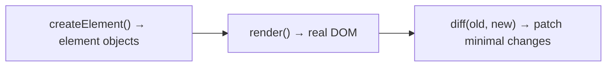

**Steps:**
1. Write a `createElement(type, props, ...children)` returning element objects.
2. Write `render(element)` that creates real DOM nodes.
3. Write a `diff(oldTree, newTree)` that patches only changes (add/remove/update attributes, replace on type change).
4. Add **keys** to your list diffing; demonstrate the index-key bug and fix it.

**Learn:** what the VDOM *is*, the diff heuristics, why keys matter — from first principles.

---

### Project 2: Implement useState & useEffect from Scratch (Intermediate→Senior)

**Goal:** Demystify hooks by building the linked-list mechanism.

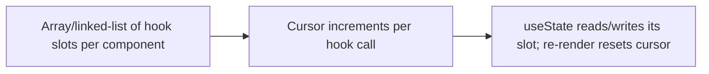

**Steps:**
1. Build a minimal render loop that resets a **hook cursor** before each render.
2. Implement `useState` storing state in an ordered array indexed by call order.
3. **Break it** by calling a hook conditionally — watch state get misassigned (proving the Rules of Hooks).
4. Implement `useEffect` with dependency comparison + cleanup.

**Learn:** why hooks are order-dependent, the fiber-hook linked list, deps/cleanup semantics.

---

### Project 3: Profile & Optimize a Slow App with Concurrent Features (Senior)

**Goal:** Diagnose and fix real re-render performance.

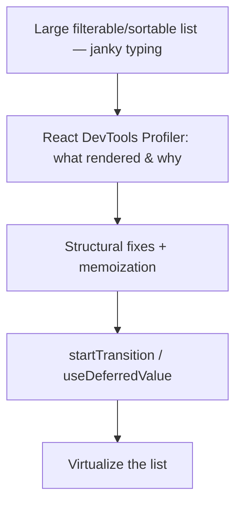

**Steps:**
1. Build a big list with a search box that filters — observe typing jank.
2. Use the **Profiler** to see the re-render cascade and durations.
3. Apply `React.memo`/`useMemo`/`useCallback` where the profiler justifies it.
4. Wrap the expensive filter update in **`startTransition`** (or `useDeferredValue`); confirm typing stays smooth.
5. Add **list virtualization**; compare metrics before/after.

**Learn:** profiling, the re-render path, memoization boundaries, concurrent features, virtualization.

---

## 7. 🔬 DEEP DIVE: INTERNALS

### 7.1 The work loop — beginWork & completeWork

```mermaid
flowchart TB
    Root["workLoop: while(nextUnitOfWork && !shouldYield)"] --> Begin["beginWork(fiber): descend, create child fibers, diff"]
    Begin -->|"has child"| Begin
    Begin -->|"no child"| Complete["completeWork(fiber): build DOM, bubble effects up"]
    Complete -->|"has sibling"| Begin
    Complete -->|"no sibling"| Return["return to parent, complete it"]
    Return --> Commit["all complete → commit"]
```

> [!IMPORTANT]
> React's reconciliation is a **work loop** over fibers. **`beginWork`** processes a fiber going *down* the tree — it calls the component (for function components, runs your function + hooks), reconciles children (creating/reusing child fibers), and returns the next fiber to work on. When it reaches a leaf, **`completeWork`** runs going *up* — it prepares the DOM node (in a detached state) and **bubbles effect flags** up to parents so the commit phase knows exactly which fibers need mutations. The loop checks **`shouldYield()`** between units — if the time slice is exhausted or a higher-priority update waits, it pauses and yields to the browser, resuming later. This begin/complete traversal over a linked list (instead of recursion) is *precisely* what makes rendering interruptible.

### 7.2 Lanes — the priority model

```mermaid
flowchart LR
    Lanes["Lane = a bit in a 31-bit bitmask"] --> Sync["SyncLane (highest — discrete input)"]
    Lanes --> Input["InputContinuousLane (hover, scroll)"]
    Lanes --> Default["DefaultLane (normal updates)"]
    Lanes --> Transition["TransitionLanes (startTransition)"]
    Lanes --> Idle["IdleLane (lowest)"]
```

> [!TIP]
> React 18 represents priority as **lanes** — a 31-bit bitmask where each bit (or group) is a priority level. This replaced the older `expirationTime` number model. Bitmasks let React efficiently represent *sets* of pending priorities and check/merge them with fast bitwise ops (e.g., "are there any pending sync-lane updates?"). When multiple updates are pending, React picks the highest-priority lanes to render first, and can **batch updates in the same lane**. Transitions get their own lanes so they're clearly interruptible by higher-priority input. This model is how the scheduler decides *what to render next* and *what to interrupt* — the machinery behind concurrent React.

### 7.3 The Scheduler package & cooperative yielding

```mermaid
flowchart TB
    React["React (reconciler)"] -->|"scheduleCallback(priority, work)"| Scheduler["scheduler package (separate)"]
    Scheduler --> MC["MessageChannel port.postMessage → macrotask"]
    MC --> Run["Run work until 5ms frame budget"]
    Run -->|"budget exceeded"| Yield["Yield to browser (paint, input)"]
    Yield --> MC
```

> [!IMPORTANT]
> React's scheduling lives in a **separate `scheduler` package**. It yields to the browser using a **`MessageChannel`** (not `setTimeout`, which has a ~4ms clamp, and not `requestIdleCallback`, which is too unreliable/infrequent) — posting a message schedules a **macrotask** ([[04 JavaScript and Nodejs Concurrency]]) that runs after the browser has had a chance to paint and process input. React works for roughly a **5ms slice**, then checks `shouldYield()`; if exceeded, it stops, lets the browser breathe, and reschedules the continuation. This **cooperative yielding** is how a huge render is broken into chunks that don't freeze the page. It's the concrete implementation of time-slicing — built entirely on the event loop, since JS is single-threaded.

### 7.4 Effect lists & how commit knows what changed

```mermaid
flowchart LR
    Render["During render: each fiber gets 'flags' (Placement/Update/Deletion)"] --> Bubble["completeWork bubbles flags to parents (subtreeFlags)"]
    Bubble --> Commit["Commit walks only fibers WITH flags"]
    Commit --> Apply["Apply mutations + run matching effects"]
```

> [!TIP]
> The commit phase doesn't re-diff — the render phase already tagged each fiber with **effect flags** (`Placement` for insert, `Update` for prop/text change, `Deletion` for removal, plus effect-hook flags). `completeWork` bubbles a **`subtreeFlags`** summary upward so a parent knows whether any descendant needs work. The commit phase then efficiently walks only the fibers that have flags set, applying DOM mutations and scheduling the right lifecycle/effect callbacks. This flag-and-bubble mechanism is why commit is fast and synchronous — all the "what changed" analysis happened during the (interruptible) render phase, leaving commit to just *apply* a precomputed changeset.

### 7.5 Fiber node anatomy

```mermaid
flowchart TB
    Fiber["A Fiber node"] --> Type["type / tag (FunctionComponent, HostComponent...)"]
    Fiber --> Props["pendingProps / memoizedProps"]
    Fiber --> State["memoizedState (hooks linked list for fn components)"]
    Fiber --> Links["child / sibling / return (tree structure)"]
    Fiber --> Alt["alternate (link to other tree — double buffer)"]
    Fiber --> Flags["flags / lanes (effects + priority)"]
    Fiber --> Statenode["stateNode (real DOM node / class instance)"]
```

> [!IMPORTANT]
> A single **fiber** is the atom of React's architecture, and its fields tell the whole story: `tag`/`type` (what kind of node), `pendingProps`/`memoizedProps` (new vs last-committed props), `memoizedState` (for function components, this is the **head of the hooks linked list** — §2.6), `child`/`sibling`/`return` (the tree, as a linked list — enabling the interruptible work loop), `alternate` (the counterpart in the other tree — enabling double-buffering, §3.1), `flags`/`lanes` (what effects it has + its priority — §7.2/7.4), and `stateNode` (the actual DOM node or class instance it manages). *Every* React concept — hooks, reconciliation, concurrency, effects — is ultimately data on these fiber objects and the algorithms that walk them. Grokking the fiber node is grokking React's internals.

---

## ✅ Production Checklists

### Correct Rendering
- [ ] Render functions are **pure** (no side effects, no mutation of props/state)
- [ ] Effects (`useEffect`) idempotent with proper **cleanup**
- [ ] **Stable keys** (data ids, never index for dynamic lists)
- [ ] Hooks called **unconditionally at top level**
- [ ] State updates use **updater fn** when depending on previous state
- [ ] Strict Mode **enabled** (surfaces impurity)

### Performance
- [ ] **Profiled** before optimizing (React DevTools Profiler)
- [ ] State **colocated**/lifted appropriately to limit re-render scope
- [ ] `React.memo`/`useMemo`/`useCallback` at justified boundaries
- [ ] Long lists **virtualized** (windowing)
- [ ] Non-urgent updates in **`startTransition`**/`useDeferredValue`
- [ ] Expensive children passed as **`children`** to enable bailouts

### Architecture
- [ ] Rendering strategy chosen (CSR / SSR / RSC) for the use case
- [ ] Suspense boundaries + error boundaries placed thoughtfully
- [ ] Data fetching via a cache layer ([[12 TanStack Query]] / RTK Query)
- [ ] Consider React 19 compiler (auto-memoization)

---

## 🗺️ Learning Roadmap

```mermaid
flowchart TB
    A["1️⃣ UI = f(state)<br/>declarative model, JSX → elements"] --> B["2️⃣ Virtual DOM<br/>elements, trees"]
    B --> C["3️⃣ Reconciliation<br/>diff heuristics, keys"]
    C --> D["4️⃣ Fiber<br/>units of work, interruptibility"]
    D --> E["5️⃣ Render vs Commit<br/>purity, effect timing"]
    E --> F["6️⃣ Hooks internals<br/>linked list, rules"]
    F --> G["7️⃣ Concurrency<br/>scheduler, lanes, transitions, Suspense"]
    G --> H["8️⃣ Deep internals<br/>work loop, double buffering, effect flags"]
```

| Stage | Focus | You can... |
|---|---|---|
| 1–3 | Model + diffing | Explain why React updates efficiently |
| 4–5 | Fiber + phases | Reason about purity, timing, Strict Mode |
| 6 | Hooks internals | Explain the Rules of Hooks from mechanism |
| 7–8 | Concurrency + internals | Discuss React at a contributor level |

---

## 🔁 Self-Review Completion Loop

Reviewed against the React docs (react.dev), React source, Andrew Clark/Dan Abramov talks, and "Build your own React" (Rodrigo Pombo).

### Gap Review Matrix

| Dimension | Covered? | Where |
|---|---|---|
| Declarative model / UI=f(state) | ✅ | §1 |
| JSX → elements | ✅ | §1 |
| Virtual DOM | ✅ | §1 |
| Reconciliation & heuristics | ✅ | §2.1 |
| Keys | ✅ | §2.2, §3.6 |
| Fiber architecture | ✅ | §2.3, §7.5 |
| Render vs commit phases | ✅ | §2.4, §4.1 |
| Batching / setState internals | ✅ | §2.5, §5.2 |
| Hooks internals + Rules | ✅ | §2.6, §6-P2 |
| Double buffering (current/WIP) | ✅ | §3.1 |
| Scheduler & priority/lanes | ✅ | §3.2, §7.2, §7.3 |
| Concurrent rendering/transitions | ✅ | §3.3 |
| Suspense internals | ✅ | §3.4 |
| Bailouts / memoization | ✅ | §3.5, §4.3 |
| Strict Mode double-render | ✅ | §3.6 |
| Full pipeline | ✅ | §4.1 |
| CSR/SSR/RSC | ✅ | §4.2 |
| Performance architecture | ✅ | §4.3 |
| Work loop (begin/complete) | ✅ | §7.1 |
| Effect flags/lists | ✅ | §7.4 |
| Fiber node anatomy | ✅ | §7.5 |
| Interview Q&A + mistakes | ✅ | §5 |
| Hands-on projects | ✅ | §6 |

> [!NOTE]
> **Remaining depth to explore independently:** React Server Components & the RSC wire format, streaming SSR + selective hydration internals, the React 19 compiler (auto-memoization) and how it transforms code, `useTransition`/`useOptimistic`/`use()` hook internals, context propagation & the "context tearing" problem in concurrent mode, hydration mismatch mechanics, `useSyncExternalStore` (how external stores integrate safely with concurrency), reconciliation of portals/fragments, and comparing Fiber to other renderers (react-native, react-three-fiber, custom reconcilers via `react-reconciler`).

---

## 📚 Official References

| Resource | Source |
|---|---|
| React docs — Render and Commit | https://react.dev/learn/render-and-commit |
| React docs — Preserving and Resetting State (keys) | https://react.dev/learn/preserving-and-resetting-state |
| React docs — Rules of Hooks | https://react.dev/reference/rules/rules-of-hooks |
| "React as a UI Runtime" — Dan Abramov | https://overreacts.io/react-as-a-ui-runtime/ |
| "Build your own React" — Rodrigo Pombo | https://pomb.us/build-your-own-react/ |
| React Fiber Architecture (acdlite notes) | https://github.com/acdlite/react-fiber-architecture |
| React 18 concurrent features | https://react.dev/blog |
| React source (reconciler + scheduler) | https://github.com/facebook/react |

---

## 🎁 Final Summary

> [!IMPORTANT]
> **The one-paragraph takeaway:** React is built on **`UI = f(state)`** — you describe the UI declaratively, and React efficiently syncs the real DOM. It does this by building a **Virtual DOM** (a tree of lightweight element objects that JSX compiles to), then on each update **reconciling** the new tree against the old one using O(n) heuristics — different types rebuild subtrees, same types patch props, and **keys** provide the stable identity that makes list diffs correct (which is why index-as-key breaks on reorder). Since React 16 this runs on the **Fiber** architecture: each node becomes a **fiber** object in a linked list (with `child`/`sibling`/`return`/`alternate` pointers), turning reconciliation from an uninterruptible recursive call into an **interruptible work loop** (`beginWork` down, `completeWork` up) that a **scheduler** can time-slice — working ~5ms, then yielding to the browser via `MessageChannel`, prioritizing updates by **lanes**. Work splits into a **render phase** (interruptible, *must be pure* — React may re-run or discard it, which is why side effects live in `useEffect`) and a **commit phase** (synchronous, atomic DOM mutations; `useLayoutEffect` before paint, `useEffect` after). **Double-buffering** (a `current` tree and a `workInProgress` tree swapped on commit) lets React abandon in-progress work, which powers **concurrent rendering** — `startTransition` marks updates non-urgent so heavy renders never freeze typing — and **Suspense** (a component throws a Promise, the boundary shows a fallback). **Hooks** are stored as an **ordered linked list on each fiber**, matched by *call order*, which is the literal reason the Rules of Hooks exist. Master the pipeline — element → reconcile (flag effects) → commit — and every React behavior, from Strict Mode's double-render to `useEffect` timing to performance tuning, follows logically.

**Golden rules:**
1. 🧠 **`UI = f(state)`** — you describe UI; React syncs the DOM.
2. 🌳 The **Virtual DOM** is a *programming model*, not an inherent speed trick.
3. 🔑 **Keys give identity** — stable data ids, never index for dynamic lists.
4. 🧬 **Fiber** = linked-list units of work → *interruptible* rendering.
5. 🎭 **Render must be pure** (interruptible/discardable); side effects go in effects.
6. ✅ **Commit is atomic**; `useLayoutEffect` before paint, `useEffect` after.
7. 🪝 **Hooks = ordered list by call order** → that IS the Rules of Hooks.
8. ⏱️ **Scheduler + lanes + time-slicing** keep the UI responsive on one thread.
9. 🔀 **`startTransition`/Suspense** = concurrent React's payoff for the Fiber rewrite.
10. 📊 **Profile before optimizing**; control the re-render path structurally first.

---

*Related guides in this vault: [[08 React]] · [[09 React Hooks]] · [[01 JavaScript]] · [[04 JavaScript and Nodejs Concurrency]] · [[03 TypeScript]] · [[11 Redux Toolkit and RTK Query]] · [[12 TanStack Query]] · [[01 System Design Fundamentals]]*
