# Redux Toolkit and RTK Query: Beginner-to-Expert Engineering Guide

> **Scope:** This guide covers Redux fundamentals, Redux Toolkit (RTK) as the modern standard way to write Redux, and RTK Query as the built-in data-fetching/caching solution — with full flow diagrams for the store lifecycle, middleware pipeline, and cache invalidation. Builds on [[08 React]], particularly its "server state vs. client state" distinction, since RTK handles client state and RTK Query handles server state within the same ecosystem.

## Table of Contents

1. [Executive Summary](#executive-summary)
2. [1. Fundamentals](#1-fundamentals-beginner-level)
3. [2. Core Concepts](#2-core-concepts-intermediate-level)
4. [3. Advanced Concepts](#3-advanced-concepts-senior-level)
5. [4. Real-World System Design Usage](#4-real-world-system-design-usage)
6. [5. Interview Preparation](#5-interview-preparation)
7. [6. Hands-On Thinking](#6-hands-on-thinking)
8. [7. Deep Dive](#7-deep-dive-optional-but-important)
9. [Production Checklists](#production-checklists)
10. [Learning Roadmap](#learning-roadmap)
11. [Self-Review Completion Loop](#self-review-completion-loop)
12. [Official References](#official-references)

---

## Executive Summary

Redux is a predictable state container: all application state lives in one store, and the only way to change it is by dispatching a plain object describing what happened (an **action**), which a **reducer** function uses to compute the next state. Redux Toolkit (RTK) is the official, opinionated way to write Redux with far less boilerplate; RTK Query (built on top of RTK) is a data-fetching and caching layer that handles the "server state" problem the same way TanStack Query does in plain React.

The core idea:

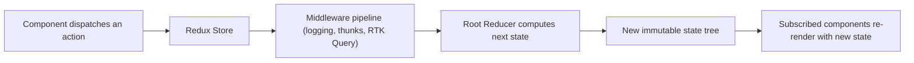

> [!TIP]
> Learn Redux as **one-way data flow with a single source of truth**: `dispatch(action) → reducer(state, action) → newState → re-render`. Redux Toolkit doesn't change this model — it just eliminates the hand-written boilerplate (action type constants, action creators, immutable update spreads) that made plain Redux tedious. RTK Query then extends the same store to also own **server state**, with automatic caching and invalidation, so you rarely write manual data-fetching reducers at all.

---

# 1. Fundamentals (Beginner Level)

## 1.1 What Is Redux (and Why Toolkit)?

Redux is a pattern (and library) for managing application state predictably: one store, plain-object actions describing "what happened," and pure reducer functions computing the next state. Writing "plain" Redux required a lot of repetitive boilerplate — Redux Toolkit is the officially recommended way to write Redux today, wrapping the same core concepts in a much smaller API surface.

```javascript
// npm install @reduxjs/toolkit react-redux
```

```javascript
import { configureStore, createSlice } from "@reduxjs/toolkit";

const counterSlice = createSlice({
    name: "counter",
    initialState: { value: 0 },
    reducers: {
        incremented(state) {
            state.value += 1; // looks like mutation, but RTK uses Immer under the hood
        },
        decremented(state) {
            state.value -= 1;
        }
    }
});

export const { incremented, decremented } = counterSlice.actions;

export const store = configureStore({
    reducer: { counter: counterSlice.reducer }
});
```

## 1.2 Why Redux (and RTK) Exists

| Problem | Redux/RTK's Answer |
|---|---|
| State scattered across many components, hard to trace what changed it | Single store, single source of truth |
| Prop drilling state/callbacks through many component layers | Any connected component can `dispatch`/`useSelector` directly |
| Hard to debug "what caused this state change" in a large app | Actions are named, loggable, and reducers are pure — full time-travel debugging is possible |
| Plain Redux required tons of boilerplate (action types, action creators, manual immutable updates) | RTK's `createSlice` generates action creators/types and lets you write "mutating" logic safely via Immer |
| Manual data-fetching state (loading/error/cache) reinvented per feature | RTK Query auto-generates hooks with caching, deduplication, and invalidation |

## 1.3 Problems Redux/RTK Solves

Redux/RTK is especially good when you need:

- Complex client state shared across many distant parts of a large application.
- Predictable, traceable state transitions (useful for debugging, time-travel, and testing).
- A single consistent pattern for data fetching, caching, and mutation across a large team (RTK Query).

Redux/RTK is less necessary when:

- The app is small/medium with state that's mostly local or easily lifted (`useState`/Context may suffice — see [[08 React]] §3.7).
- Most of your "state" is actually server data that a lighter dedicated tool (TanStack Query/SWR) already handles well without a full store.

## 1.4 Real-World Analogy

Think of the Redux store like a company's single official ledger, and actions like signed transaction slips.

Nobody edits the ledger directly with a pencil (no direct state mutation) — instead, everyone submits a signed slip describing exactly what happened ("Deposit $100," "Withdraw $50"), and a single designated accountant (the reducer) is the only one authorized to update the ledger, always producing a brand-new, complete ledger page rather than erasing and rewriting the old one. Because every slip is recorded in order, anyone can replay the entire history to understand exactly how the ledger reached its current state.

```text
Store            = the official ledger (single source of truth)
Action            = a signed transaction slip describing what happened
Reducer           = the one accountant allowed to compute the next ledger page
Immutable updates = each page is a NEW page, old pages are never erased
Time-travel debug = replaying the slips in order to understand history
```

## 1.5 Core Vocabulary

| Term | Meaning |
|---|---|
| Store | The single object holding the entire application's Redux state |
| Action | A plain object (`{ type: "...", payload: ... }`) describing what happened |
| Reducer | A pure function `(state, action) => newState` |
| Dispatch | The function used to send an action to the store |
| Slice | RTK's bundling of a reducer + its related actions for one feature/domain |
| Selector | A function that reads/derives data from the store's state |
| Thunk | A function (instead of a plain object) dispatched to handle async logic |
| Immer | The library RTK uses internally to let you write "mutating" reducer code that produces immutable updates |
| RTK Query | RTK's built-in data-fetching/caching API, generating hooks automatically |

## 1.6 Setting Up the Store and Provider

```javascript
import { configureStore } from "@reduxjs/toolkit";
import counterReducer from "./counterSlice";

export const store = configureStore({
    reducer: {
        counter: counterReducer
    }
});
```

```jsx
import { Provider } from "react-redux";
import { store } from "./store";

function App() {
    return (
        <Provider store={store}>
            <Counter />
        </Provider>
    );
}
```

## 1.7 `createSlice` in Detail

```javascript
import { createSlice } from "@reduxjs/toolkit";

const ordersSlice = createSlice({
    name: "orders",
    initialState: { items: [], selectedId: null },
    reducers: {
        orderAdded(state, action) {
            state.items.push(action.payload); // Immer makes this safe
        },
        orderSelected(state, action) {
            state.selectedId = action.payload;
        },
        orderRemoved(state, action) {
            state.items = state.items.filter(o => o.id !== action.payload);
        }
    }
});

export const { orderAdded, orderSelected, orderRemoved } = ordersSlice.actions;
export default ordersSlice.reducer;
```

`createSlice` auto-generates:

| Generated | From |
|---|---|
| Action creators (`orderAdded(payload)`) | Each key in `reducers` |
| Action type strings (`"orders/orderAdded"`) | `${sliceName}/${reducerKey}` |
| The slice's reducer function | Combining all the individual case reducers |

## 1.8 Using Redux in Components: `useSelector` and `useDispatch`

```jsx
import { useSelector, useDispatch } from "react-redux";
import { orderAdded, orderSelected } from "./ordersSlice";

function OrderList() {
    const orders = useSelector(state => state.orders.items);
    const dispatch = useDispatch();

    return (
        <ul>
            {orders.map(order => (
                <li key={order.id} onClick={() => dispatch(orderSelected(order.id))}>
                    {order.status}
                </li>
            ))}
        </ul>
    );
}
```

> [!WARNING]
> `useSelector` re-renders the component whenever the **selected value's reference changes** after any dispatched action (by default, using `===` comparison). Selecting a *new* object/array literal inline (`useSelector(state => ({ a: state.a, b: state.b }))`) creates a new reference every time, causing the component to re-render on **every** dispatched action, regardless of relevance — see §3.2 for the fix.

## 1.9 Basic Async with `createAsyncThunk`

```javascript
import { createAsyncThunk, createSlice } from "@reduxjs/toolkit";

export const fetchOrders = createAsyncThunk("orders/fetch", async () => {
    const response = await fetch("/api/orders");
    return response.json();
});

const ordersSlice = createSlice({
    name: "orders",
    initialState: { items: [], status: "idle", error: null },
    reducers: {},
    extraReducers: (builder) => {
        builder
            .addCase(fetchOrders.pending, (state) => { state.status = "loading"; })
            .addCase(fetchOrders.fulfilled, (state, action) => {
                state.status = "succeeded";
                state.items = action.payload;
            })
            .addCase(fetchOrders.rejected, (state, action) => {
                state.status = "failed";
                state.error = action.error.message;
            });
    }
});
```

```jsx
function OrderList() {
    const dispatch = useDispatch();
    const { items, status } = useSelector(state => state.orders);

    useEffect(() => {
        if (status === "idle") dispatch(fetchOrders());
    }, [status, dispatch]);

    if (status === "loading") return <Spinner />;
    return <ul>{items.map(o => <li key={o.id}>{o.status}</li>)}</ul>;
}
```

This is exactly the manual "loading/error/data" pattern from [[08 React]] §2.8, now centralized in Redux — and exactly what RTK Query exists to eliminate (see §1.10).

## 1.10 Basic RTK Query Setup

```javascript
import { createApi, fetchBaseQuery } from "@reduxjs/toolkit/query/react";

export const ordersApi = createApi({
    reducerPath: "ordersApi",
    baseQuery: fetchBaseQuery({ baseUrl: "/api" }),
    endpoints: (builder) => ({
        getOrders: builder.query({ query: () => "orders" }),
        addOrder: builder.mutation({
            query: (order) => ({ url: "orders", method: "POST", body: order })
        })
    })
});

export const { useGetOrdersQuery, useAddOrderMutation } = ordersApi;
```

```javascript
export const store = configureStore({
    reducer: {
        [ordersApi.reducerPath]: ordersApi.reducer
    },
    middleware: (getDefaultMiddleware) =>
        getDefaultMiddleware().concat(ordersApi.middleware)
});
```

```jsx
function OrderList() {
    const { data: orders, isLoading, error } = useGetOrdersQuery();
    const [addOrder] = useAddOrderMutation();

    if (isLoading) return <Spinner />;
    return <ul>{orders.map(o => <li key={o.id}>{o.status}</li>)}</ul>;
}
```

No `useEffect`, no manual loading/error state, no thunks — `createApi` auto-generates hooks that handle fetching, caching, loading/error states, and re-fetching triggers.

---

# 2. Core Concepts (Intermediate Level)

## 2.1 The Full Redux Data Flow

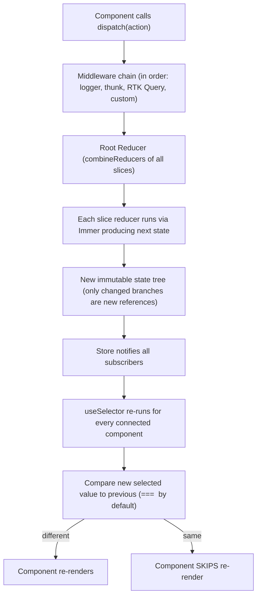

## 2.2 Immer: How "Mutating" Reducers Stay Immutable

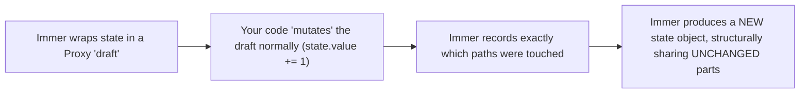

```javascript
reducers: {
    orderStatusUpdated(state, action) {
        const order = state.items.find(o => o.id === action.payload.id);
        if (order) {
            order.status = action.payload.status; // looks like mutation
        }
        // Immer produces: a new `items` array reference, a new matching order object,
        // but every OTHER order object in the array keeps its EXACT SAME reference
    }
}
```

> [!IMPORTANT]
> This structural sharing is exactly what makes `useSelector`'s default `===` comparison work correctly: only the parts of the state tree that actually changed get new references, so components selecting *unrelated* slices of state correctly see no change and skip re-rendering — Immer is the mechanism that makes "mutating" reducer code produce genuinely immutable, reference-stable results.

## 2.3 `extraReducers` and Cross-Slice Reactions

```javascript
const notificationsSlice = createSlice({
    name: "notifications",
    initialState: [],
    reducers: {},
    extraReducers: (builder) => {
        builder.addCase(fetchOrders.rejected, (state, action) => {
            state.push({ message: `Failed to load orders: ${action.error.message}` });
        });
    }
});
```

`extraReducers` lets a slice react to actions **it didn't define itself** (including another slice's actions, or `createAsyncThunk` lifecycle actions) — this is how cross-cutting concerns (like a global notifications slice reacting to any failed request) stay decoupled from the slice that triggered them.

## 2.4 Selectors and Memoization with `createSelector`

```javascript
import { createSelector } from "@reduxjs/toolkit";

const selectOrders = state => state.orders.items;
const selectStatusFilter = state => state.orders.statusFilter;

export const selectFilteredOrders = createSelector(
    [selectOrders, selectStatusFilter],
    (orders, statusFilter) =>
        statusFilter ? orders.filter(o => o.status === statusFilter) : orders
);
```

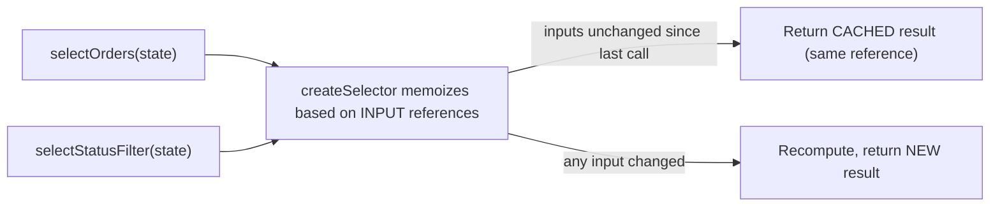

> [!WARNING]
> Without `createSelector`, a derived selector like `state => state.orders.items.filter(...)` creates a **brand-new array every single call**, even if nothing relevant changed — defeating `useSelector`'s reference-equality check and causing the component to re-render on every dispatched action. `createSelector` memoizes based on its **input selectors' results**, only recomputing (and only returning a new reference) when an actual input changed.

## 2.5 RTK Query Caching Model

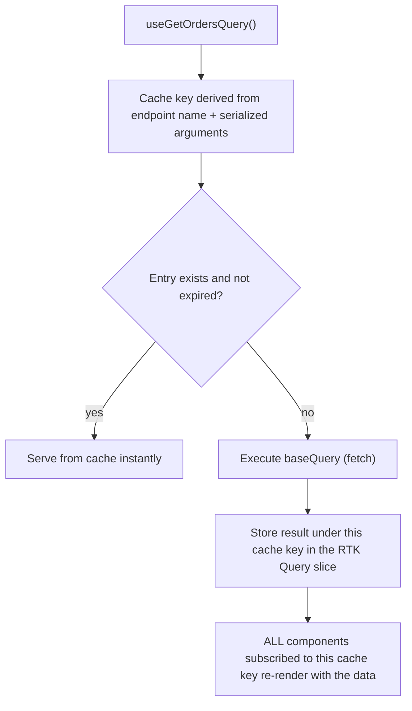

```jsx
function OrderDetailA({ id }) {
    const { data } = useGetOrderQuery(id); // component A
}
function OrderDetailB({ id }) {
    const { data } = useGetOrderQuery(id); // component B, SAME id
}
// Only ONE network request is made; both components share the same cache entry
```

RTK Query automatically **deduplicates** identical in-flight requests and shares cached results across every component subscribing to the same query + arguments combination — a direct parallel to TanStack Query's caching model in plain React.

## 2.6 Cache Invalidation via Tags

```javascript
export const ordersApi = createApi({
    reducerPath: "ordersApi",
    baseQuery: fetchBaseQuery({ baseUrl: "/api" }),
    tagTypes: ["Order"],
    endpoints: (builder) => ({
        getOrders: builder.query({
            query: () => "orders",
            providesTags: (result) =>
                result ? [...result.map(o => ({ type: "Order", id: o.id })), { type: "Order", id: "LIST" }]
                       : [{ type: "Order", id: "LIST" }]
        }),
        addOrder: builder.mutation({
            query: (order) => ({ url: "orders", method: "POST", body: order }),
            invalidatesTags: [{ type: "Order", id: "LIST" }]
        }),
        updateOrder: builder.mutation({
            query: ({ id, ...patch }) => ({ url: `orders/${id}`, method: "PATCH", body: patch }),
            invalidatesTags: (result, error, { id }) => [{ type: "Order", id }]
        })
    })
});
```

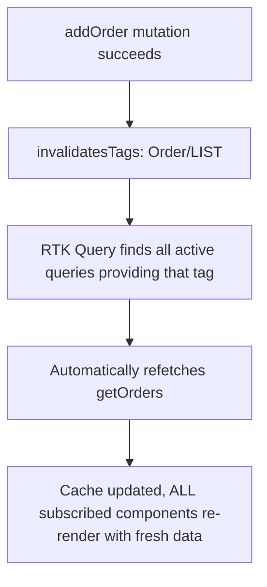

This tag-based system is RTK Query's core innovation over manually managing cache invalidation: rather than remembering "which queries need refetching after this mutation," you declare **what data each query provides** and **what data each mutation invalidates**, and RTK Query figures out the rest.

## 2.7 Middleware

```javascript
const loggerMiddleware = (store) => (next) => (action) => {
    console.log("dispatching", action);
    const result = next(action);
    console.log("next state", store.getState());
    return result;
};

export const store = configureStore({
    reducer: rootReducer,
    middleware: (getDefaultMiddleware) => getDefaultMiddleware().concat(loggerMiddleware)
});
```

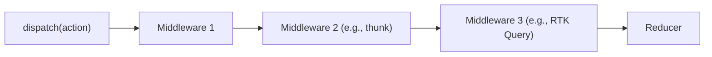

Middleware sits between `dispatch` and the reducer, able to intercept, log, delay, or even swallow actions (e.g., the thunk middleware intercepts function actions and calls them instead of passing them to reducers) — RTK Query's entire caching/refetching machinery is itself implemented as middleware plus a generated reducer slice.

## 2.8 Redux DevTools and Time-Travel Debugging

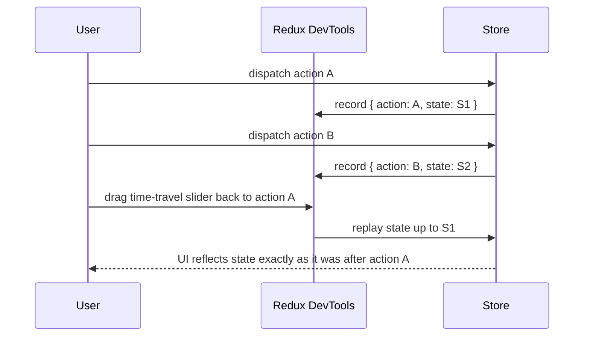

`configureStore` wires up Redux DevTools integration automatically — every dispatched action and resulting state is recorded, letting you inspect, replay, and even "time travel" through your application's state history during development.

## 2.9 Testing Slices and Selectors

```javascript
import ordersReducer, { orderAdded } from "./ordersSlice";

test("orderAdded adds a new order", () => {
    const initialState = { items: [] };
    const newState = ordersReducer(initialState, orderAdded({ id: 1, status: "PENDING" }));
    expect(newState.items).toHaveLength(1);
});
```

Because reducers are pure functions, testing them requires no mocking, no rendering, no store setup — just call the reducer with an input state and action, and assert on the output.

## 2.10 Testing Components with Redux

```jsx
import { render, screen } from "@testing-library/react";
import { Provider } from "react-redux";
import { configureStore } from "@reduxjs/toolkit";

function renderWithStore(ui, preloadedState) {
    const store = configureStore({ reducer: rootReducer, preloadedState });
    return render(<Provider store={store}>{ui}</Provider>);
}

test("renders orders from the store", () => {
    renderWithStore(<OrderList />, { orders: { items: [{ id: 1, status: "PAID" }] } });
    expect(screen.getByText("PAID")).toBeInTheDocument();
});
```

---

# 3. Advanced Concepts (Senior Level)

## 3.1 Normalized State Shape

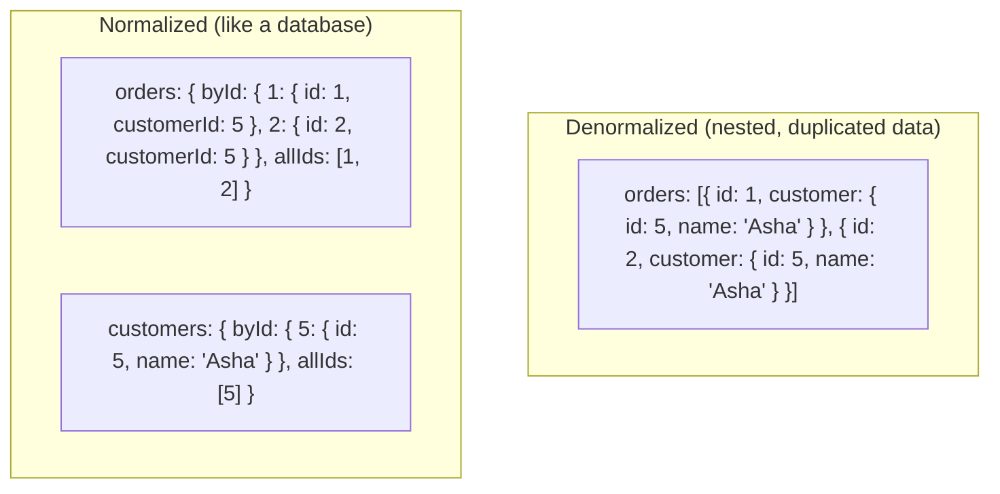

```javascript
import { createEntityAdapter, createSlice } from "@reduxjs/toolkit";

const ordersAdapter = createEntityAdapter();

const ordersSlice = createSlice({
    name: "orders",
    initialState: ordersAdapter.getInitialState(),
    reducers: {
        orderAdded: ordersAdapter.addOne,
        orderUpdated: ordersAdapter.updateOne,
        orderRemoved: ordersAdapter.removeOne
    }
});

export const { selectAll: selectAllOrders, selectById: selectOrderById } =
    ordersAdapter.getSelectors(state => state.orders);
```

> [!TIP]
> `createEntityAdapter` gives you a normalized `{ ids: [...], entities: { [id]: {...} } }` shape plus generated CRUD reducers and selectors for free. Normalizing avoids duplicated nested data (updating a customer's name in one place instead of every order that embeds it) and makes lookups by ID O(1) instead of requiring an array scan.

## 3.2 The `useSelector` Reference-Equality Pitfall, Solved

```jsx
// BAD: new object literal every render, breaks reference equality, causes re-render on EVERY action
const { items, status } = useSelector(state => ({
    items: state.orders.items,
    status: state.orders.status
}));

// GOOD: separate selector calls, each with its own reference-stable comparison
const items = useSelector(state => state.orders.items);
const status = useSelector(state => state.orders.status);

// GOOD (alternative): shallowEqual comparator for object selections
import { shallowEqual } from "react-redux";
const { items, status } = useSelector(
    state => ({ items: state.orders.items, status: state.orders.status }),
    shallowEqual
);
```

## 3.3 RTK Query Optimistic Updates

```javascript
updateOrderStatus: builder.mutation({
    query: ({ id, status }) => ({ url: `orders/${id}`, method: "PATCH", body: { status } }),
    async onQueryStarted({ id, status }, { dispatch, queryFulfilled }) {
        const patchResult = dispatch(
            ordersApi.util.updateQueryData("getOrders", undefined, (draft) => {
                const order = draft.find(o => o.id === id);
                if (order) order.status = status; // optimistic update via Immer draft
            })
        );
        try {
            await queryFulfilled;
        } catch {
            patchResult.undo(); // roll back on failure
        }
    }
})
```

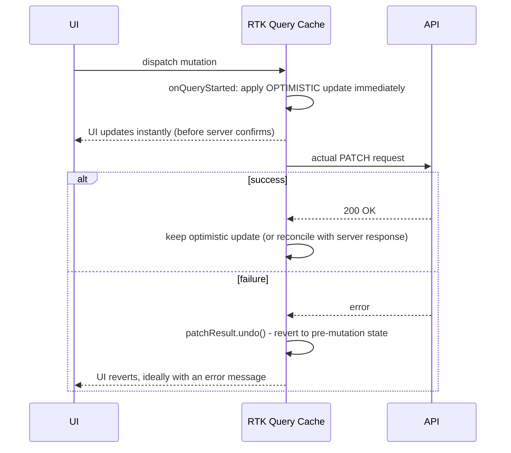

Optimistic updates make the UI feel instantaneous by assuming success and updating the cache immediately, with an explicit rollback path (`patchResult.undo()`) if the server ultimately rejects the mutation — critical for perceived performance on actions like toggling a status or "liking" something.

## 3.4 RTK Query Polling and Refetching Strategies

```jsx
const { data } = useGetOrdersQuery(undefined, {
    pollingInterval: 5000, // refetch every 5 seconds
    refetchOnMountOrArgChange: true,
    refetchOnFocus: true, // refetch when the browser tab regains focus
    refetchOnReconnect: true // refetch when network connection is restored
});
```

| Option | Behavior |
|---|---|
| `pollingInterval` | Refetches on a fixed interval while the component is mounted |
| `refetchOnMountOrArgChange` | Refetches if data is older than a threshold when the component (re)mounts or args change |
| `refetchOnFocus` | Refetches when the window regains focus (requires `setupListeners(store.dispatch)`) |
| `refetchOnReconnect` | Refetches after the browser detects the network came back online |

## 3.5 `createAsyncThunk` Lifecycle in Full

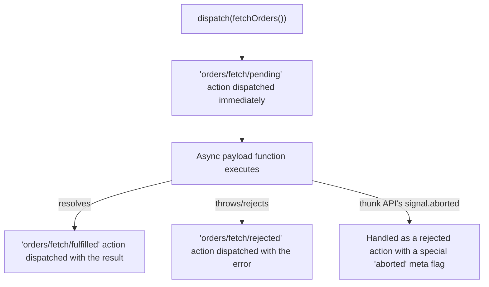

```javascript
export const fetchOrder = createAsyncThunk(
    "orders/fetchOne",
    async (id, { rejectWithValue, signal }) => {
        try {
            const response = await fetch(`/api/orders/${id}`, { signal });
            if (!response.ok) return rejectWithValue(await response.json());
            return response.json();
        } catch (err) {
            return rejectWithValue(err.message);
        }
    }
);
```

`rejectWithValue` lets you pass a specific, typed error payload to the `rejected` action instead of relying on the generic error message — important for building meaningful error UI states from thunk failures.

## 3.6 RTK Query vs. `createAsyncThunk`: When to Use Which

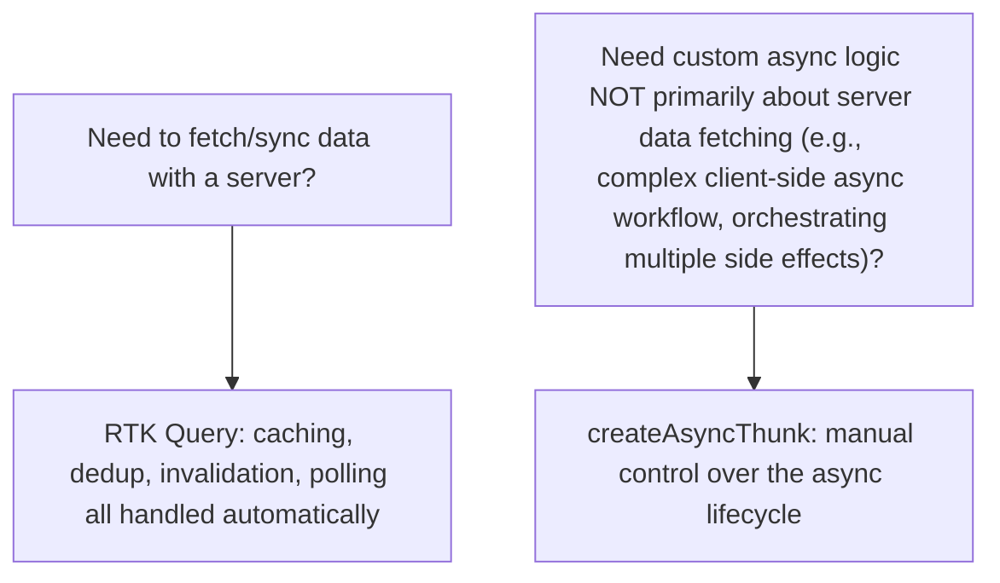

| Aspect | RTK Query | `createAsyncThunk` |
|---|---|---|
| Best for | Fetching/syncing server data | Custom async logic, non-fetch side effects |
| Caching | Automatic, tag-based invalidation | Manual (you write the reducer logic) |
| Boilerplate | Minimal — hooks auto-generated | You write `extraReducers` for each state |
| Deduplication | Automatic across components | Manual |
| Polling/refetch-on-focus | Built-in options | You build it yourself |

> [!TIP]
> If what you're building is "fetch data from an API and keep a component in sync with it," RTK Query is almost always the better default in a modern RTK codebase — reach for `createAsyncThunk` only for async logic that isn't fundamentally about server-state caching (e.g., orchestrating a multi-step client-side workflow, or interacting with a non-HTTP async API like IndexedDB).

## 3.7 Code-Splitting Reducers (Reducer Injection)

```javascript
export const store = configureStore({
    reducer: {
        // only the "core" reducers needed at startup
    }
});

// Later, when a lazy-loaded feature module is loaded:
store.replaceReducer(combineReducers({
    ...store.getState(),
    feature: featureReducer
}));
```

For large applications with code-split routes/features, injecting a feature's reducer only when that feature's code loads keeps the initial bundle and store setup smaller — a pattern often handled by libraries like `redux-dynamic-modules` for larger scale.

## 3.8 Failure Scenarios

| Failure | Symptom | Common Cause | Fix |
|---|---|---|---|
| Component re-renders on every action | Sluggish UI, unrelated state changes trigger re-renders | Selector returns a new object/array literal every call | Split into separate `useSelector` calls, or use `createSelector`/`shallowEqual` |
| RTK Query cache never updates after a mutation | Stale data shown after create/update/delete | Missing or mismatched `invalidatesTags`/`providesTags` | Ensure mutation's `invalidatesTags` matches the query's `providesTags` exactly |
| "A non-serializable value was detected" warning | Redux DevTools warnings, potential subtle bugs | Storing non-plain objects (class instances, functions, Promises, Dates) directly in state | Store plain, serializable data; keep instances/functions outside Redux state |
| Reducer produces unexpected mutation bugs | State appears to change outside a dispatch | Mutating state directly OUTSIDE an RTK `createSlice` reducer (e.g., in a selector or component) | Only ever mutate inside an RTK `createSlice` reducer, where Immer safely intercepts it |
| Optimistic update doesn't roll back on failure | UI shows incorrect state after a failed mutation | Missing `patchResult.undo()` in the `onQueryStarted` catch block | Always pair optimistic updates with an explicit rollback path |
| Duplicate network requests despite RTK Query | Same data fetched multiple times unexpectedly | Different serialized argument shapes for what should be the "same" query (e.g., object vs. primitive arg with inconsistent key order) | Use primitive or consistently-shaped arguments; consider a custom `serializeQueryArgs` |
| Store grows unbounded over a long-lived session | Memory growth in long-running SPAs | RTK Query cache entries never garbage collected because they're always "active" (kept subscribed) | Configure `keepUnusedDataFor`, ensure components properly unsubscribe (unmount) |

## 3.9 Performance Considerations

- Prefer many small, focused `useSelector` calls over one large object-returning selector.
- Use `createSelector` for any derived/computed data (filtering, sorting, aggregating) read via `useSelector`.
- Use RTK Query's `selectFromResult` option to subscribe a component to only a derived slice of a query's result, avoiding re-renders when unrelated parts of the cached data change.
- Normalize deeply nested/relational data with `createEntityAdapter` rather than nested arrays requiring `.find()`/`.filter()` scans on every read.
- Configure `keepUnusedDataFor` deliberately for RTK Query endpoints holding large or rarely-needed cached data.

## 3.10 Security Considerations

| Risk | Mitigation |
|---|---|
| Storing sensitive tokens/PII in Redux state (visible in Redux DevTools) | Avoid storing raw secrets in Redux state; DevTools extension exposes full state history |
| Logging entire state/actions in production | Disable verbose logging middleware and DevTools in production builds |
| RTK Query caching sensitive per-user data across user sessions | Reset the API cache (`api.util.resetApiState()`) on logout/user switch |

---

# 4. Real-World System Design Usage

## 4.1 Where Redux Toolkit/RTK Query Are Used in Production

- Large-scale single-page applications with complex, shared client state (dashboards, admin panels, editors).
- Applications needing strict state traceability/debuggability (financial tools, complex workflows).
- Apps standardizing on one consistent data-fetching pattern across many features/teams (RTK Query's generated hooks).

## 4.2 Typical Production Architecture

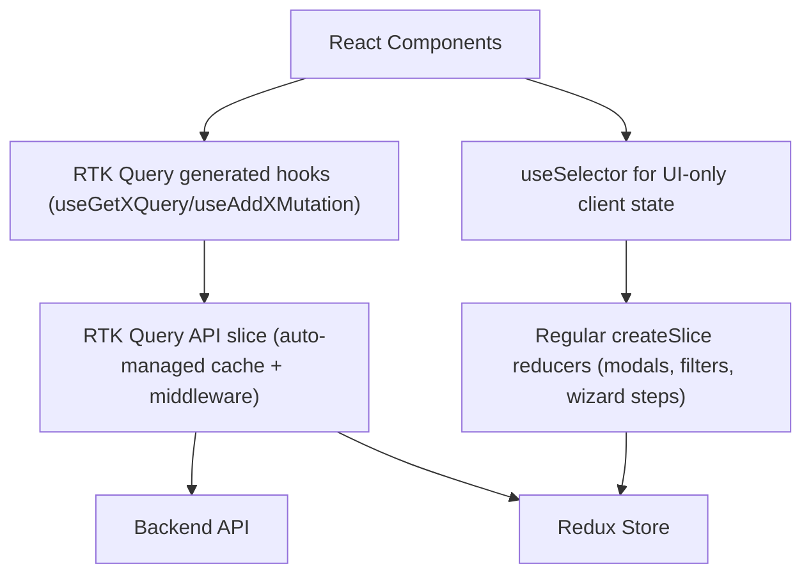

## 4.3 Big-Company Style Thinking

| Concern | RTK/RTK Query Design Response |
|---|---|
| Reliability | Optimistic updates paired with explicit rollback, error boundaries around data-dependent UI |
| Scale | Normalized entity state, `createSelector` memoization, RTK Query cache lifetime tuning |
| Observability | Redux DevTools in staging/dev, custom middleware for structured action logging |
| Security | Cache reset on logout, no secrets stored in Redux state |
| Maintainability | Feature-folder structure (one slice + API endpoints per feature), consistent tag-based invalidation conventions |
| Team Scale | RTK Query's generated hooks give every team the same data-fetching pattern, reducing bespoke fetching logic per feature |

## 4.4 Example: Order Management Feature End-to-End

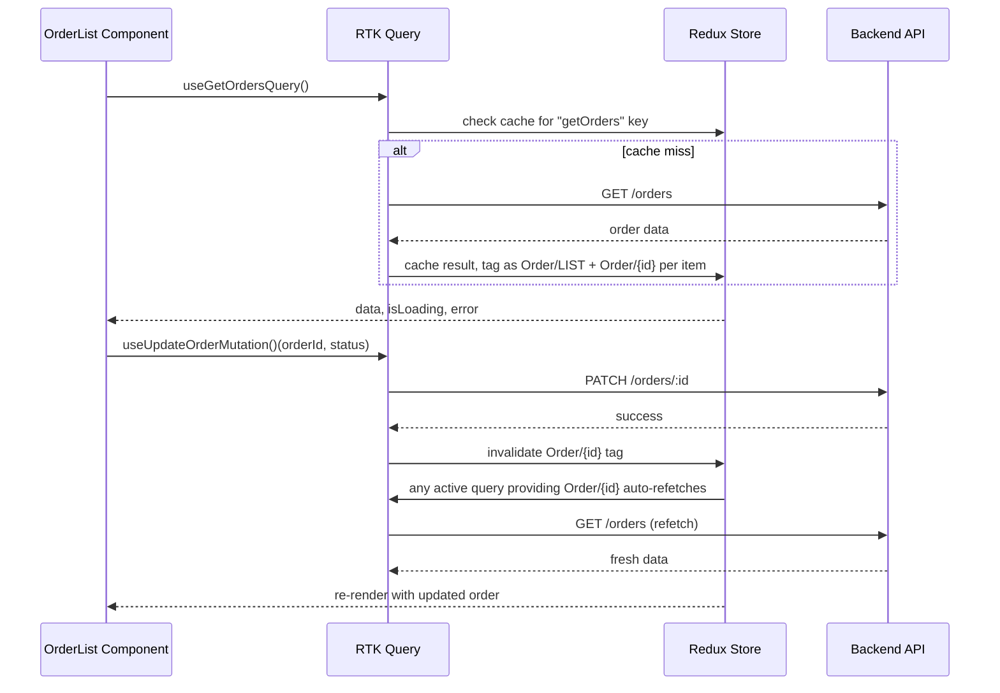

## 4.5 Layered Architecture (Feature-Folder Convention)

```text
src/features/orders/
    ordersApiSlice.js   - RTK Query endpoints (getOrders, addOrder, updateOrder)
    ordersSlice.js      - Client-only state (selected order ID, filter, modal open/closed)
    OrderList.jsx        - Component using generated hooks + useSelector
    OrderDetail.jsx
    selectors.js         - createSelector-based derived selectors

src/app/
    store.js             - configureStore combining all feature reducers + api middleware
```

## 4.6 Integration with Other Systems

| System | RTK/RTK Query Integration |
|---|---|
| Backend REST APIs | `fetchBaseQuery` (built on `fetch`) as the `baseQuery` |
| GraphQL APIs | Custom `baseQuery` wrapping a GraphQL client, or `graphql-request` integration |
| Authentication | `fetchBaseQuery`'s `prepareHeaders` to attach auth tokens to every request |
| WebSockets | RTK Query's `onCacheEntryAdded` lifecycle to merge live socket updates into cached query data |
| Testing | Redux Toolkit's pure reducers/selectors tested without mocking; RTK Query endpoints tested with MSW (Mock Service Worker) |

```javascript
baseQuery: fetchBaseQuery({
    baseUrl: "/api",
    prepareHeaders: (headers, { getState }) => {
        const token = getState().auth.token;
        if (token) headers.set("Authorization", `Bearer ${token}`);
        return headers;
    }
})
```

---

# 5. Interview Preparation

## 5.1 What Interviewers Expect

For "Redux Toolkit/RTK Query" topics, interviewers usually expect:

- You understand core Redux concepts (store, actions, reducers, one-way data flow).
- You can use `createSlice` and know it uses Immer for "mutating" syntax.
- You understand why `useSelector` re-renders and the reference-equality pitfall.
- You know when RTK Query is appropriate vs. plain Redux state.

For senior frontend roles, they also expect:

- You understand normalized state and `createEntityAdapter`.
- You can design tag-based cache invalidation for RTK Query correctly.
- You can implement and reason about optimistic updates with rollback.
- You know the trade-offs between RTK Query and `createAsyncThunk`.

## 5.2 Most Important Questions and Answers

### Q1. What problem does Redux Toolkit solve compared to "plain" Redux?

Plain Redux required significant boilerplate: manually defined action type constants, hand-written action creators, and careful immutable spread-based state updates. Redux Toolkit's `createSlice` auto-generates action creators/types and lets you write reducer logic that *looks* like direct mutation (safely, via Immer under the hood), while `configureStore` sets up good defaults (DevTools, thunk middleware, dev-mode checks) automatically.

### Q2. How does `createSlice` let you write "mutating" code that's actually immutable?

It wraps your reducer logic with Immer, which gives you a "draft" proxy of the state. Any mutation you perform on the draft is recorded, and Immer produces a brand-new, immutable state object based on those recorded changes — with unchanged parts of the tree keeping their exact original references (structural sharing).

### Q3. Why does a component using `useSelector` sometimes re-render on every single dispatched action?

If the selector function returns a *new* object/array/computed value on every call (e.g., an inline object literal, or a `.filter()`/`.map()` call without memoization), `useSelector`'s default `===` reference check sees a "different" value every time, even when the underlying meaningful data hasn't changed — causing unnecessary re-renders.

### Q4. What does `createSelector` do, and why does it fix the previous problem?

It memoizes a selector's result based on its **input selectors'** results: it only recomputes (and only returns a new reference) when at least one input selector's result has actually changed since the last call, otherwise returning the exact same cached reference — which lets `useSelector`'s reference equality check correctly skip re-renders.

### Q5. What is `createEntityAdapter` for?

It manages a normalized state shape (`{ ids: [...], entities: { [id]: {...} } }`) for a collection of same-typed items, generating standard CRUD reducers (`addOne`, `updateOne`, `removeOne`, etc.) and selectors (`selectAll`, `selectById`) — avoiding both duplicated nested data and O(n) array scans for by-ID lookups.

### Q6. How does RTK Query decide when to refetch data after a mutation?

Via a tag-based system: queries declare what data they `providesTags` (e.g., `{ type: "Order", id: 5 }`), and mutations declare what they `invalidatesTags`. When a mutation's invalidated tags match tags provided by any currently active query, RTK Query automatically triggers a refetch of exactly those queries.

### Q7. What is an optimistic update, and how do you roll one back?

An optimistic update applies the expected result of a mutation to the cache **immediately**, before the server confirms it, so the UI feels instant. In RTK Query, this is done in a mutation's `onQueryStarted` via `updateQueryData`, and if the actual request (`queryFulfilled`) later rejects, you call the returned patch's `.undo()` to revert the cache to its pre-mutation state.

### Q8. When would you use `createAsyncThunk` instead of RTK Query?

When the async logic isn't fundamentally about fetching/caching server data — e.g., orchestrating a multi-step client-side workflow, interacting with a non-HTTP async API (IndexedDB, native device APIs), or any case where you need fully custom control over the async lifecycle rather than RTK Query's automatic caching/deduplication/invalidation behavior.

### Q9. Why shouldn't you store non-serializable values (class instances, functions, Promises) in Redux state?

Redux/RTK's design assumes plain, serializable state (needed for features like DevTools time-travel, persistence, and `configureStore`'s default serializability checks, which will warn in development). Storing non-serializable values breaks these guarantees and can cause subtle bugs with DevTools or persistence middleware.

### Q10. What's the difference between `providesTags` and `invalidatesTags`?

`providesTags` (on a query) declares what cached data this query's result represents, tagged so it can later be targeted for invalidation. `invalidatesTags` (on a mutation) declares which of those tags should be considered stale after this mutation succeeds, triggering automatic refetches of any active query providing a matching tag.

## 5.3 Tricky Questions

### If Immer lets you "mutate" state, why can't you mutate state outside of an RTK `createSlice` reducer?

Immer's draft-tracking mechanism only wraps the state specifically **during** the execution of a `createSlice` reducer function (via a Proxy). Mutating state directly in a selector, a component, or outside that Immer-wrapped context bypasses the Proxy entirely and directly mutates the real state object — a real, unsafe mutation with none of Immer's protections, breaking reference-equality assumptions elsewhere in the app.

### Can two different RTK Query endpoints share cached data?

Not directly by default — each endpoint's cache entries are keyed by endpoint name + serialized arguments. However, you can achieve similar cross-endpoint synchronization using shared tags (invalidating one endpoint's tag can trigger a refetch that indirectly keeps related data consistent) or by manually updating another endpoint's cache via `api.util.updateQueryData` from within a different endpoint's lifecycle hook.

### Does `configureStore`'s default middleware include `thunk` automatically?

Yes — `getDefaultMiddleware()` includes the thunk middleware, a serializability check, and an immutability check (both dev-only) by default, which is why `createAsyncThunk` and `createApi` "just work" as soon as you use `configureStore`, without manually wiring up `redux-thunk`.

### Why might `useGetOrdersQuery()` in two different components with the same arguments only trigger one network request?

RTK Query derives a cache key from the endpoint name and serialized arguments; identical calls (same endpoint, same args) share the exact same cache entry and in-flight request promise — this is the deduplication behavior built into the caching layer, not something each component needs to coordinate manually.

## 5.4 Common Candidate Mistakes

- Writing manual `createAsyncThunk` + `extraReducers` boilerplate for straightforward server-data fetching where RTK Query would be simpler and more capable.
- Returning new object/array literals from `useSelector` without `createSelector`/`shallowEqual`, causing excessive re-renders.
- Mutating state outside of an RTK `createSlice` reducer, assuming Immer protects all state mutations everywhere.
- Forgetting to configure `invalidatesTags`/`providesTags` correctly, leading to stale UI after mutations.
- Storing non-serializable values (Date objects, class instances) directly in Redux state.
- Not normalizing collection data, leading to duplicated nested objects and O(n) lookups.
- Forgetting to roll back optimistic updates on mutation failure.

## 5.5 Interview Coding Checklist

- [ ] Use `createSlice` for all client-state reducers; avoid hand-written action type constants.
- [ ] Use RTK Query for server-data fetching by default; reserve `createAsyncThunk` for genuinely custom async logic.
- [ ] Split `useSelector` calls or use `createSelector`/`shallowEqual` to avoid unnecessary re-renders.
- [ ] Configure `providesTags`/`invalidatesTags` consistently across related queries/mutations.
- [ ] Normalize collection state with `createEntityAdapter` where appropriate.
- [ ] Pair optimistic updates with explicit rollback logic.

---

# 6. Hands-On Thinking

## 6.1 Three Real-World Projects Using Redux Toolkit / RTK Query

### Project 1: E-Commerce Cart and Checkout

Concepts: `createSlice` for cart client state (items, quantities), RTK Query for product catalog and order submission, `createSelector` for derived cart totals.

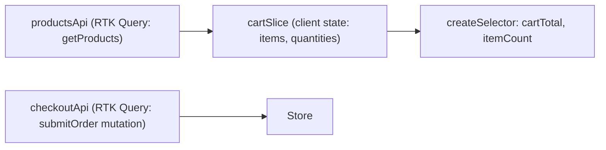

### Project 2: Collaborative Task Board (Trello-style)

Concepts: `createEntityAdapter` for normalized boards/columns/tasks, optimistic updates for drag-and-drop reordering, tag-based invalidation across related entities.

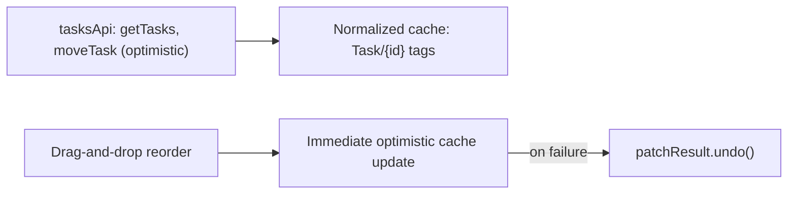

### Project 3: Admin Dashboard with Real-Time Updates

Concepts: RTK Query base query with auth headers, WebSocket integration via `onCacheEntryAdded` to merge live updates into cached queries, polling fallback.

```javascript
getOrders: builder.query({
    query: () => "orders",
    async onCacheEntryAdded(arg, { updateCachedData, cacheDataLoaded, cacheEntryRemoved }) {
        await cacheDataLoaded;
        const ws = new WebSocket("wss://api.example.com/orders/live");
        ws.onmessage = (event) => {
            updateCachedData((draft) => {
                const update = JSON.parse(event.data);
                const order = draft.find(o => o.id === update.id);
                if (order) Object.assign(order, update);
            });
        };
        await cacheEntryRemoved;
        ws.close();
    }
})
```

## 6.2 Step-by-Step Design Approach

For any Redux Toolkit/RTK Query feature:

1. Separate client state (UI-only) from server state (RTK Query) before writing any code.
2. Design the normalized shape for collection data if relationships/lookups matter.
3. Define RTK Query tag types and plan `providesTags`/`invalidatesTags` for every endpoint up front.
4. Write selectors with `createSelector` for any derived/computed values.
5. Add optimistic updates only for mutations where instant feedback matters and rollback is well-defined.
6. Test reducers/selectors directly (pure functions); test components against a real store with `preloadedState`.

## 6.3 Production Implementation Approach

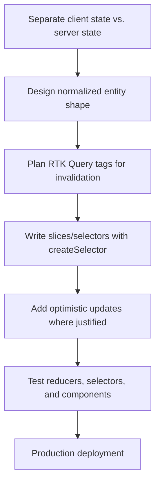

## 6.4 Production Readiness Example

For a Redux Toolkit/RTK Query application, define:

- A documented convention for what belongs in RTK Query vs. plain `createSlice` client state.
- Consistent tag-naming conventions across features to avoid invalidation mismatches.
- `keepUnusedDataFor` tuned per endpoint based on data volatility/size.
- Cache reset (`api.util.resetApiState()`) wired into logout/user-switch flows.
- Redux DevTools disabled or restricted in production builds.
- Test coverage for reducers (pure, fast) and RTK Query endpoints (via MSW-mocked network layer).

---

# 7. Deep Dive (Optional but Important)

## 7.1 How `configureStore` Wires Everything Together

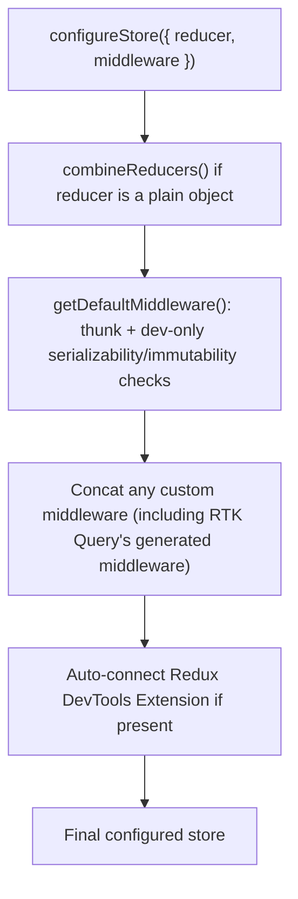

## 7.2 RTK Query's Internal Architecture

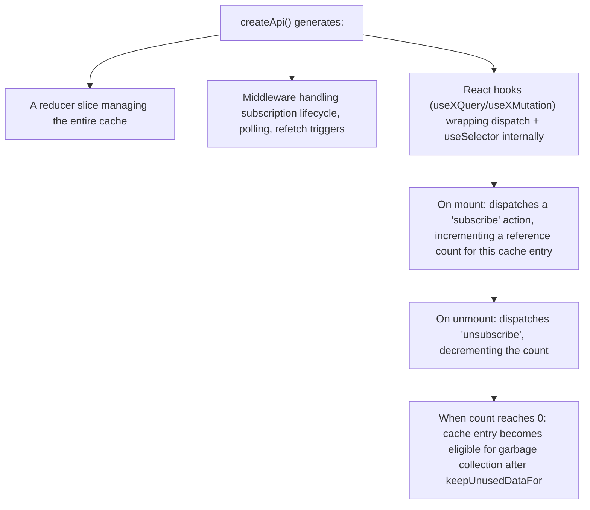

RTK Query isn't a separate system bolted onto Redux — it's built entirely from standard Redux primitives: a generated slice reducer holds the cache, generated middleware manages the async lifecycle (subscriptions, polling, refetch triggers), and the generated hooks are thin wrappers combining `dispatch` (to trigger fetches/subscribe) with `useSelector` (to read the cached result).

## 7.3 Serialization Checks in Development

```javascript
middleware: (getDefaultMiddleware) =>
    getDefaultMiddleware({
        serializableCheck: {
            ignoredActions: ["orders/uploadFile/pending"],
            ignoredPaths: ["orders.currentFile"]
        }
    })
```

By default, RTK's middleware (in development only) checks that every dispatched action and every piece of state is a plain, serializable value, warning loudly if not — catching accidental storage of class instances, functions, or Promises before they cause subtler bugs (like broken DevTools time-travel or persistence).

## 7.4 Immer's Structural Sharing in Detail

```text
Before update: state = { orders: { items: [orderA, orderB, orderC] }, ui: { filter: "" } }

Reducer mutates orderB's status via the Immer draft.

After update: state = { orders: { items: [orderA, orderB_NEW, orderC] }, ui: { filter: "" } }
                                              ^^^^^^^^^ only this changed
    - state.ui                 -> SAME reference as before (untouched)
    - state.orders.items[0]    -> SAME reference (orderA untouched)
    - state.orders.items[2]    -> SAME reference (orderC untouched)
    - state.orders.items[1]    -> NEW reference (orderB was mutated)
    - state.orders.items       -> NEW array reference (since an element within it changed)
    - state.orders             -> NEW reference (since .items changed)
    - state (root)             -> NEW reference (since .orders changed)
```

This selective "only what changed gets a new reference, all the way up to the root" behavior is exactly why `useSelector`'s cheap `===` check is sufficient to detect real changes without deep-equality comparisons — and why selecting `state.ui` in an unrelated component correctly avoids re-rendering when only `state.orders.items[1]` changed.

## 7.5 Debugging Tools

| Tool | Purpose |
|---|---|
| Redux DevTools Extension | Action log, state diff per action, time-travel debugging |
| `redux-logger` (or custom logging middleware) | Console logging of every action and resulting state |
| RTK Query's DevTools integration | Inspect cache entries, subscription counts, and query status directly |
| `why-did-you-render` | Diagnose unnecessary component re-renders tied back to selector reference issues |

---

# Production Checklists

## Code Quality Checklist

- [ ] Client state and server state clearly separated (`createSlice` vs. RTK Query).
- [ ] `createSelector` used for all derived/computed selector logic.
- [ ] Collection state normalized via `createEntityAdapter` where relationships/lookups matter.
- [ ] `providesTags`/`invalidatesTags` consistent and tested across related endpoints.
- [ ] No direct state mutation outside of `createSlice` reducers.
- [ ] No non-serializable values stored in Redux state.

## Performance Checklist

- [ ] `useSelector` calls split/memoized to avoid re-renders on unrelated state changes.
- [ ] RTK Query `keepUnusedDataFor` tuned per endpoint.
- [ ] `selectFromResult` used where a component only needs a derived slice of a query result.
- [ ] Large feature reducers code-split/injected only when needed, for large applications.

## Security Checklist

- [ ] No secrets/PII stored directly in Redux state visible via DevTools.
- [ ] API cache reset on logout/user switch (`api.util.resetApiState()`).
- [ ] Redux DevTools disabled or access-restricted in production builds.

## Debugging Checklist

- [ ] Reproduce with Redux DevTools to inspect the exact action sequence and state diffs.
- [ ] Check for new-object-literal selectors first when re-renders seem excessive.
- [ ] Check `providesTags`/`invalidatesTags` alignment first when cache seems stale after a mutation.
- [ ] Verify optimistic update rollback logic explicitly with a simulated failure in tests.

---

# Learning Roadmap

## Phase 1: Beginner

Learn: store/actions/reducers fundamentals, `createSlice`, `configureStore`, `useSelector`/`useDispatch`.

Practice: a simple counter/to-do app with Redux Toolkit.

## Phase 2: Intermediate

Learn: `createAsyncThunk`, basic RTK Query setup (`createApi`, generated hooks), `extraReducers`, testing reducers.

Practice: a small app fetching and displaying data via RTK Query with a loading/error UI.

## Phase 3: Advanced

Learn: `createSelector` memoization, `createEntityAdapter` normalization, tag-based cache invalidation, optimistic updates.

Practice: a task board with normalized entities, optimistic drag-and-drop reordering, and proper rollback.

## Phase 4: Production Frontend Engineer

Learn: RTK Query internals (subscription lifecycle, cache garbage collection), WebSocket integration via `onCacheEntryAdded`, serialization checks, reducer injection for code-splitting.

Practice: production-style dashboard with real-time cache updates, tuned cache lifetimes, full test coverage, and a documented client-state/server-state convention for the team.

---

# Self-Review Completion Loop

The topic was reviewed against:

- Official Redux Toolkit and RTK Query documentation (redux-toolkit.js.org).
- Redux core documentation and style guide.
- Common production incident patterns (re-render storms from unstable selectors, stale RTK Query caches, non-serializable state).
- Interview patterns for beginner through senior frontend roles.

## Gap Review Matrix

| Area | Covered? | Notes |
|---|---|---|
| Redux fundamentals | Yes | Store, actions, reducers, one-way data flow |
| `createSlice`/Immer | Yes | Mechanism explained with structural sharing diagram |
| `useSelector`/`useDispatch` | Yes | Reference-equality pitfall and fix |
| `createAsyncThunk` | Yes | Full lifecycle diagram, `rejectWithValue` |
| RTK Query basics | Yes | `createApi`, generated hooks, caching model |
| Tag-based invalidation | Yes | `providesTags`/`invalidatesTags` diagram and example |
| Optimistic updates | Yes | `onQueryStarted`/`updateQueryData`/rollback sequence diagram |
| Normalized state | Yes | `createEntityAdapter`, denormalized vs. normalized diagram |
| `createSelector` memoization | Yes | Input-selector-based memoization explained |
| Middleware | Yes | Pipeline diagram, custom logger example |
| RTK Query vs. `createAsyncThunk` | Yes | Explicit decision guidance |
| WebSocket/real-time integration | Yes | `onCacheEntryAdded` example |
| Redux DevTools/time-travel | Yes | Sequence diagram |
| Failure scenarios | Yes | Seven concrete production failure patterns |
| Security | Yes | Non-serializable state, DevTools exposure, cache reset on logout |
| Interview prep | Yes | Common and tricky questions, candidate mistakes |
| Hands-on projects | Yes | Three realistic projects with diagrams |
| Internals | Yes | `configureStore` wiring, RTK Query architecture, Immer structural sharing |

No significant beginner-to-senior gaps remain for Redux Toolkit and RTK Query. Further specialization should split into separate deep dives: **Redux Middleware Authoring in Depth**, **RTK Query Code Generation from OpenAPI/GraphQL Schemas**, **Large-Scale Redux Architecture (Feature-Sliced Design)**, and **Redux Persistence (redux-persist)**.

---

# Official References

- Redux Toolkit Official Documentation: <https://redux-toolkit.js.org/>
- RTK Query Documentation: <https://redux-toolkit.js.org/rtk-query/overview>
- Redux Core Documentation: <https://redux.js.org/>
- Redux Style Guide: <https://redux.js.org/style-guide/>
- Immer Documentation: <https://immerjs.github.io/immer/>
- React-Redux Documentation: <https://react-redux.js.org/>

---

## Final Summary

Redux Toolkit removes the historical boilerplate tax of Redux while keeping its core value intact — one predictable store, pure reducers, traceable one-way data flow — by wrapping reducer logic in Immer so "mutating" code produces safely immutable, structurally-shared state. RTK Query extends that same store to own server state too, replacing manually written `createAsyncThunk`/`extraReducers` fetching boilerplate with generated hooks, automatic caching, deduplication, and a tag-based invalidation system. Production mastery comes from cleanly separating client state from server state, memoizing derived selectors correctly to avoid re-render storms, and designing tag invalidation and optimistic-update rollback deliberately rather than as an afterthought.
