# TanStack Query: Beginner-to-Expert Engineering Guide

> **Scope:** This guide covers TanStack Query (formerly React Query) — the standard library for managing **server state** in React (and Vue/Svelte/Solid) applications: caching, background refetching, deduplication, mutations, and cache invalidation. Builds on [[08 React]]'s server-state-vs-client-state distinction and complements [[11 Redux Toolkit and RTK Query]] — the two libraries solve the identical problem with different architectures, compared directly in §3.9.

## Table of Contents

1. [Executive Summary](#executive-summary)
2. [1. Fundamentals](#1-fundamentals-beginner-level)
3. [2. Core Concepts](#2-core-concepts-intermediate-level)
4. [3. Advanced Concepts](#3-advanced-concepts-senior-level)
5. [4. Real-World System Design Usage](#4-real-world-system-design-usage)
6. [5. Interview Preparation](#5-interview-preparation)
7. [6. Hands-On Thinking](#6-hands-on-thinking)
8. [7. Deep Dive](#7-deep-dive-optional-but-important)
9. [Production Checklists](#production-checklists)
10. [Learning Roadmap](#learning-roadmap)
11. [Self-Review Completion Loop](#self-review-completion-loop)
12. [Official References](#official-references)

---

## Executive Summary

TanStack Query manages **server state** — data your app doesn't own, fetched asynchronously from somewhere else, that can go stale — as a first-class concern distinct from client state, handling caching, deduplication, background refetching, and invalidation so you almost never write manual loading/error/data `useState` triplets again.

The core idea:

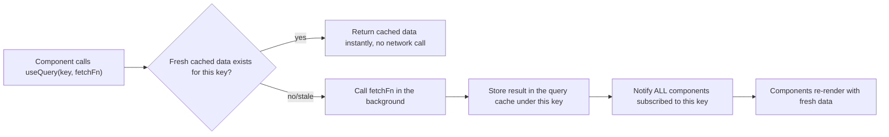

> [!TIP]
> Learn TanStack Query as a **cache with subscriptions**, not a fetching library. The actual `fetch`/axios call is the least interesting part — the value is in the cache key system, staleness rules, background refetching triggers, and automatic deduplication across every component asking for the same data.

---

# 1. Fundamentals (Beginner Level)

## 1.1 What Is TanStack Query?

TanStack Query is a library that manages fetching, caching, and synchronizing asynchronous data in your UI, replacing manual `useEffect` + `useState` data-fetching patterns.

```bash
npm install @tanstack/react-query
```

```jsx
import { QueryClient, QueryClientProvider, useQuery } from "@tanstack/react-query";

const queryClient = new QueryClient();

function App() {
    return (
        <QueryClientProvider client={queryClient}>
            <Orders />
        </QueryClientProvider>
    );
}

function Orders() {
    const { data, isLoading, error } = useQuery({
        queryKey: ["orders"],
        queryFn: () => fetch("/api/orders").then(res => res.json())
    });

    if (isLoading) return <p>Loading...</p>;
    if (error) return <p>Error: {error.message}</p>;
    return <ul>{data.map(o => <li key={o.id}>{o.status}</li>)}</ul>;
}
```

## 1.2 Why TanStack Query Exists

| Problem with Manual `useEffect` Fetching | TanStack Query's Answer |
|---|---|
| Every component reinvents loading/error/data state | `useQuery` returns them automatically |
| Multiple components fetching the same data cause duplicate requests | Automatic deduplication by cache key |
| Stale data lingers until you manually refetch | Configurable staleness + automatic background refetching |
| Race conditions when a slow request resolves after a newer one | Handled internally — the cache always reflects the latest query |
| No built-in caching across navigation (re-fetch every time you revisit a page) | Cache persists across component unmounts (until garbage collected) |
| Manual cache updates after mutations are error-prone | `invalidateQueries`/optimistic updates built in |

## 1.3 Problems TanStack Query Solves

TanStack Query is especially good when you need:

- Any UI that fetches data from a server and needs to show loading/error states correctly.
- Data shared across multiple components/pages without prop drilling or a global store just for caching.
- Background refetching (on window focus, reconnect, interval) to keep data fresh without full page reloads.
- Optimistic UI updates for mutations with automatic rollback on failure.

TanStack Query is **not** a replacement for:

- Client-only state (form inputs, modal open/closed, UI toggles) — use `useState`/Context/Zustand for that, as discussed in [[08 React]] §3.7.
- A full global state management solution if your app genuinely needs complex client-state orchestration alongside server state (Redux/Zustand still have a role — see §3.9 for how they coexist with RTK Query specifically).

## 1.4 Real-World Analogy

Think of TanStack Query like a librarian who remembers what everyone recently asked for.

Instead of walking to the archive (the server) every single time someone asks for a book (data), the librarian first checks a shelf of recently-requested books (the cache). If it's there and still considered "fresh enough," they hand it over instantly. If it's stale or missing, they fetch a new copy from the archive, hand it over, and put it back on the fresh-shelf for the next person who asks — and if the sun starts setting (the window loses/regains focus) or enough time passes, they proactively double-check whether the archive has an updated version.

```text
Archive (server)         = your backend API
Recently-requested shelf = the query cache
Librarian's freshness rule = staleTime
Proactively re-checking   = background refetching (on focus/reconnect/interval)
```

## 1.5 Core Vocabulary

| Term | Meaning |
|---|---|
| Query | A declarative subscription to an asynchronous data source, identified by a key |
| Query Key | An array uniquely identifying a query (`["orders", { status: "PAID" }]`) |
| Query Function | The async function that actually fetches the data |
| `staleTime` | How long fetched data is considered "fresh" before it's eligible for background refetch |
| `gcTime` (formerly `cacheTime`) | How long unused cached data is kept in memory before being garbage collected |
| Mutation | An operation that creates/updates/deletes data on the server |
| Query Invalidation | Marking cached data as stale, triggering a refetch for any active observers |
| `QueryClient` | The central object holding the cache and configuration |
| Observer | A component subscribed to a query via `useQuery`, notified when the cache updates |

## 1.6 `useQuery` Return Values

```jsx
const {
    data,           // the resolved data, or undefined if not yet loaded
    error,          // the error object, if the query function threw/rejected
    isLoading,      // true only during the FIRST fetch for this query (no cached data yet)
    isFetching,     // true whenever ANY fetch is in progress, including background refetches
    isError,
    isSuccess,
    refetch         // manually trigger a refetch
} = useQuery({
    queryKey: ["orders"],
    queryFn: fetchOrders
});
```

> [!WARNING]
> `isLoading` is `true` only when there's **no cached data at all** yet (the very first load). `isFetching` is `true` any time a fetch is happening, **including silent background refetches** where you already have (possibly stale) data to show. Using `isLoading` to gate your entire UI means background refetches won't show a full loading spinner — usually what you want; conflating the two is a common source of confusing "flash of loading spinner" bugs.

## 1.7 Query Keys with Parameters

```jsx
function useOrder(orderId) {
    return useQuery({
        queryKey: ["orders", orderId],
        queryFn: () => fetch(`/api/orders/${orderId}`).then(r => r.json()),
        enabled: !!orderId // don't run the query until orderId is available
    });
}
```

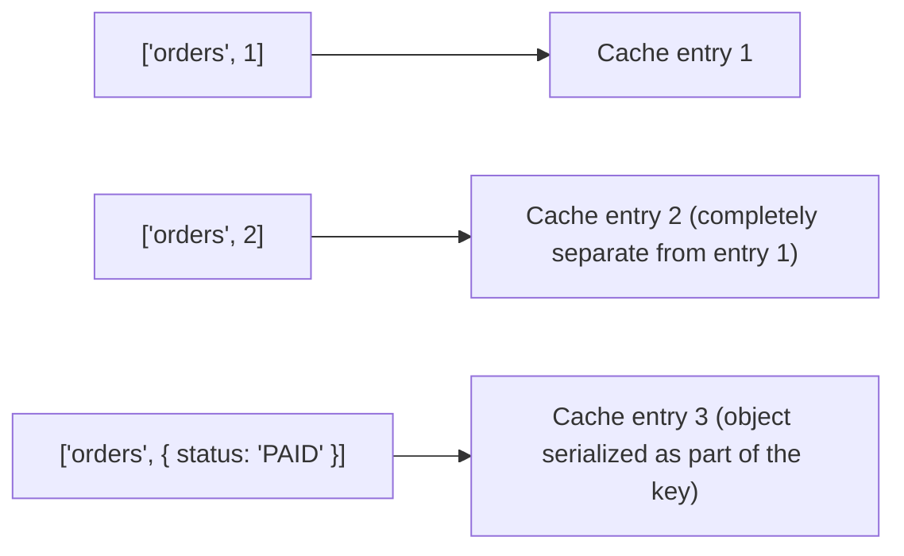

Every distinct query key gets its own independent cache entry — changing `orderId` in the key array automatically fetches and caches a *different* entry, with no manual cache-key management needed.

## 1.8 Basic Mutations

```jsx
import { useMutation, useQueryClient } from "@tanstack/react-query";

function CreateOrderForm() {
    const queryClient = useQueryClient();
    const mutation = useMutation({
        mutationFn: (newOrder) =>
            fetch("/api/orders", { method: "POST", body: JSON.stringify(newOrder) }),
        onSuccess: () => {
            queryClient.invalidateQueries({ queryKey: ["orders"] });
        }
    });

    return (
        <button onClick={() => mutation.mutate({ item: "Widget" })} disabled={mutation.isPending}>
            {mutation.isPending ? "Creating..." : "Create Order"}
        </button>
    );
}
```

## 1.9 Basic Configuration

```jsx
const queryClient = new QueryClient({
    defaultOptions: {
        queries: {
            staleTime: 60 * 1000,      // data considered fresh for 1 minute
            retry: 2,                   // retry failed queries twice
            refetchOnWindowFocus: true  // default: refetch when tab regains focus
        }
    }
});
```

## 1.10 Basic Testing

```jsx
import { QueryClient, QueryClientProvider } from "@tanstack/react-query";
import { render, screen, waitFor } from "@testing-library/react";

function renderWithClient(ui) {
    const testClient = new QueryClient({
        defaultOptions: { queries: { retry: false } }
    });
    return render(<QueryClientProvider client={testClient}>{ui}</QueryClientProvider>);
}

test("shows orders after loading", async () => {
    renderWithClient(<Orders />);
    await waitFor(() => expect(screen.getByText("PAID")).toBeInTheDocument());
});
```

---

# 2. Core Concepts (Intermediate Level)

## 2.1 Full Query Lifecycle

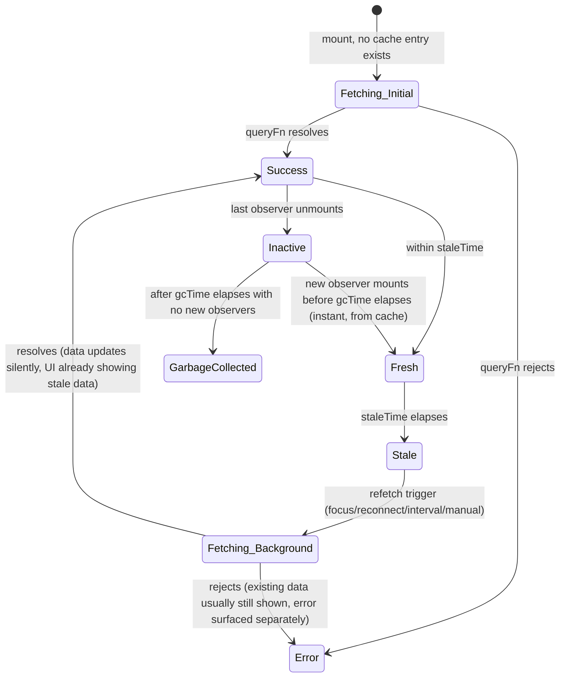

## 2.2 `staleTime` vs. `gcTime`

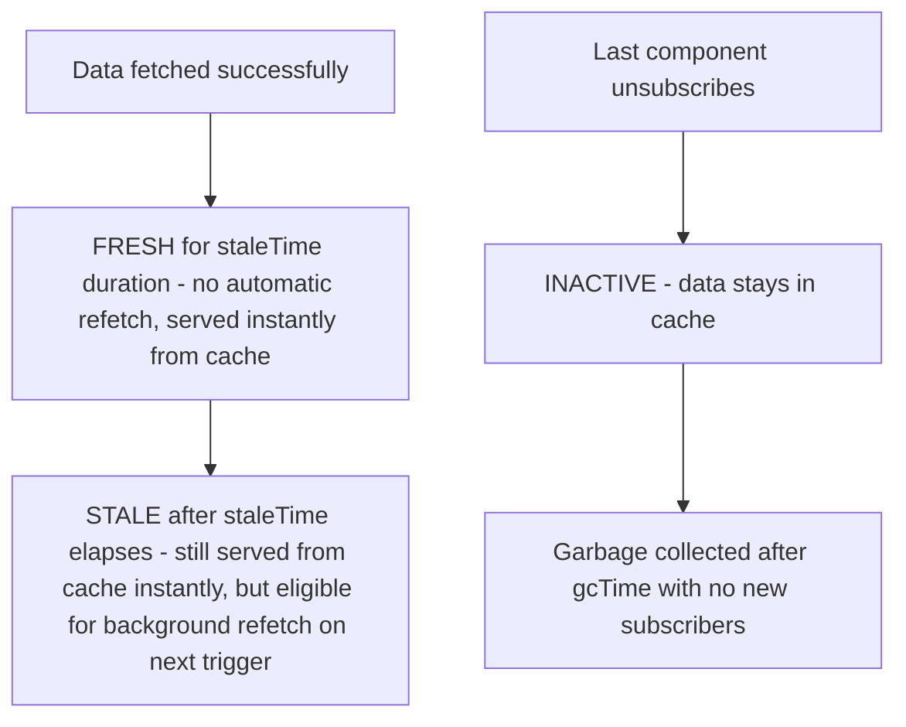

| Setting | Default | Controls |
|---|---|---|
| `staleTime` | `0` | How long data is "fresh" (no background refetch triggered) after fetching |
| `gcTime` | 5 minutes | How long **unused** (no active observers) cache data is kept before being deleted entirely |

> [!IMPORTANT]
> The default `staleTime` of `0` means data is considered stale **immediately** after fetching — every single component mount/window focus/reconnect will trigger a background refetch by default. This is a deliberate "always try to be fresh" default, but for data that changes rarely (e.g., a list of countries), setting a longer `staleTime` avoids unnecessary network traffic.

## 2.3 Background Refetch Triggers

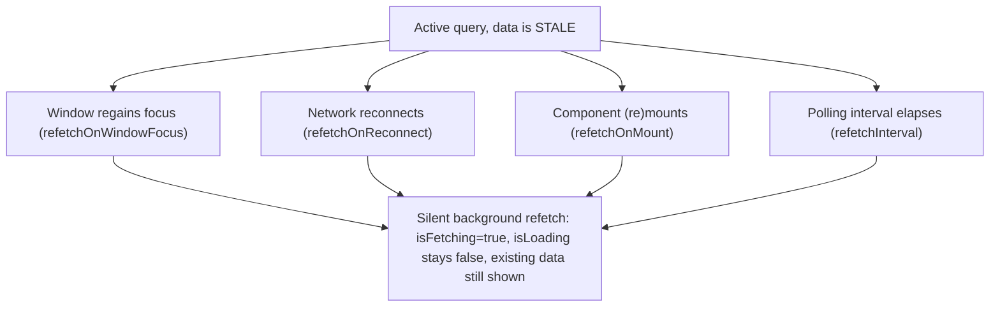

```jsx
useQuery({
    queryKey: ["orders"],
    queryFn: fetchOrders,
    refetchInterval: 5000,       // poll every 5 seconds while mounted
    refetchOnWindowFocus: true,   // default
    refetchOnReconnect: true      // default
});
```

## 2.4 Deduplication Across Components

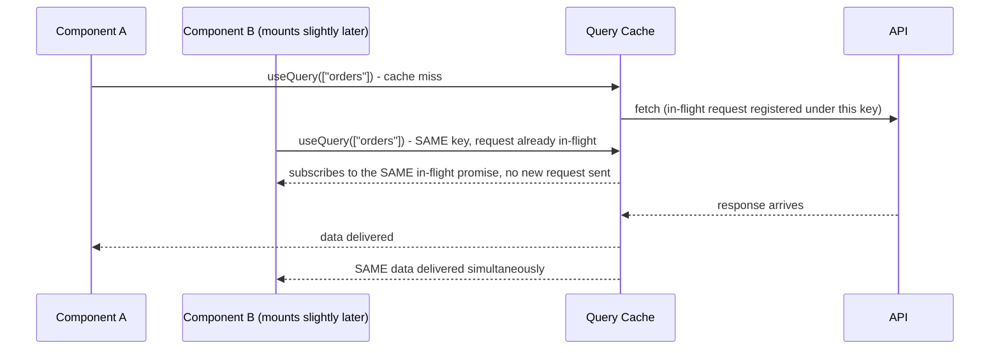

Any number of components calling `useQuery` with the identical key share exactly one underlying request and one cache entry — this is automatic, requiring no coordination between components.

## 2.5 Dependent Queries

```jsx
function OrderWithUser({ orderId }) {
    const { data: order } = useQuery({
        queryKey: ["orders", orderId],
        queryFn: () => fetchOrder(orderId)
    });

    const { data: user } = useQuery({
        queryKey: ["users", order?.customerId],
        queryFn: () => fetchUser(order.customerId),
        enabled: !!order?.customerId // waits until order has loaded
    });

    if (!order || !user) return <Spinner />;
    return <div>{order.id} for {user.name}</div>;
}
```

`enabled: false` prevents a query from running at all until its precondition is met — the standard pattern for queries that depend on the result of another query.

## 2.6 Parallel and Combined Queries

```jsx
import { useQueries } from "@tanstack/react-query";

const results = useQueries({
    queries: orderIds.map(id => ({
        queryKey: ["orders", id],
        queryFn: () => fetchOrder(id)
    }))
});
```

`useQueries` runs a dynamic, variable-length list of queries in parallel — useful when the number of queries depends on runtime data (e.g., an array of IDs), unlike calling `useQuery` a fixed number of times.

## 2.7 Cache Invalidation Patterns

```jsx
const queryClient = useQueryClient();

// Invalidate ALL queries starting with ["orders", ...]
queryClient.invalidateQueries({ queryKey: ["orders"] });

// Invalidate only the exact key
queryClient.invalidateQueries({ queryKey: ["orders", 5], exact: true });

// Directly update cached data without a network round-trip
queryClient.setQueryData(["orders", 5], (old) => ({ ...old, status: "SHIPPED" }));
```

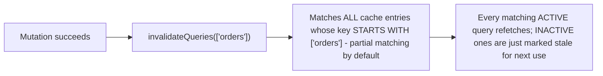

> [!TIP]
> `invalidateQueries` matches by key **prefix** by default (`["orders"]` matches `["orders", 1]`, `["orders", 2]`, `["orders", { status: "PAID" }]`, etc.) — this is intentional and powerful: invalidating the broad `["orders"]` key after any order mutation refreshes every related cached view without manually tracking each specific key.

## 2.8 Pagination

```jsx
function OrderPage({ page }) {
    const { data, isPlaceholderData } = useQuery({
        queryKey: ["orders", { page }],
        queryFn: () => fetchOrders(page),
        placeholderData: (previousData) => previousData // keep showing old page while new one loads
    });

    return (
        <div style={{ opacity: isPlaceholderData ? 0.5 : 1 }}>
            {data.items.map(o => <OrderRow key={o.id} order={o} />)}
        </div>
    );
}
```

`placeholderData: (previousData) => previousData` (the modern replacement for the older `keepPreviousData` option) avoids a jarring loading flash between pages by keeping the previous page's data visible (dimmed) while the next page fetches.

## 2.9 Infinite Queries (Infinite Scroll)

```jsx
import { useInfiniteQuery } from "@tanstack/react-query";

function OrderFeed() {
    const { data, fetchNextPage, hasNextPage, isFetchingNextPage } = useInfiniteQuery({
        queryKey: ["orders", "feed"],
        queryFn: ({ pageParam }) => fetchOrders({ cursor: pageParam }),
        initialPageParam: null,
        getNextPageParam: (lastPage) => lastPage.nextCursor ?? undefined
    });

    return (
        <div>
            {data?.pages.flatMap(page => page.items).map(order => (
                <OrderRow key={order.id} order={order} />
            ))}
            {hasNextPage && (
                <button onClick={() => fetchNextPage()} disabled={isFetchingNextPage}>
                    Load more
                </button>
            )}
        </div>
    );
}
```

## 2.10 DevTools

```jsx
import { ReactQueryDevtools } from "@tanstack/react-query-devtools";

function App() {
    return (
        <QueryClientProvider client={queryClient}>
            <Orders />
            <ReactQueryDevtools initialIsOpen={false} />
        </QueryClientProvider>
    );
}
```

The DevTools panel shows every query's key, status (fresh/stale/fetching/inactive), data, and lets you manually trigger refetches/invalidation — indispensable for understanding cache behavior during development.

---

# 3. Advanced Concepts (Senior Level)

## 3.1 Optimistic Updates with Rollback

```jsx
const mutation = useMutation({
    mutationFn: updateOrderStatus,
    onMutate: async (newOrder) => {
        await queryClient.cancelQueries({ queryKey: ["orders", newOrder.id] });
        const previousOrder = queryClient.getQueryData(["orders", newOrder.id]);

        queryClient.setQueryData(["orders", newOrder.id], newOrder); // optimistic update

        return { previousOrder }; // context passed to onError
    },
    onError: (err, newOrder, context) => {
        queryClient.setQueryData(["orders", newOrder.id], context.previousOrder); // rollback
    },
    onSettled: (newOrder) => {
        queryClient.invalidateQueries({ queryKey: ["orders", newOrder.id] }); // reconcile with server truth
    }
});
```

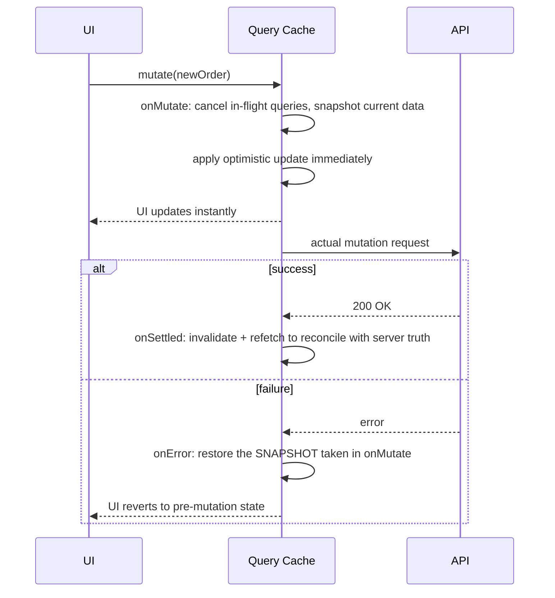

> [!IMPORTANT]
> **Always call `cancelQueries` first** in `onMutate`. Without it, an in-flight background refetch that was already running before the mutation started could resolve *after* your optimistic update is applied, silently overwriting it with stale pre-mutation data — a subtle race condition that only shows up under real network latency, not in fast local development.

## 3.2 Query Cancellation with `AbortSignal`

```jsx
useQuery({
    queryKey: ["orders", filters],
    queryFn: ({ signal }) => fetch(`/api/orders?${toParams(filters)}`, { signal }).then(r => r.json())
});
```

TanStack Query automatically passes an `AbortSignal` to your query function and calls `.abort()` on it when the query is no longer needed (e.g., the component unmounts, or the query key changes before the previous fetch completed) — pass this signal to `fetch` (or axios's `signal` option) to actually cancel the underlying network request, not just ignore its eventual result.

## 3.3 Structural Sharing

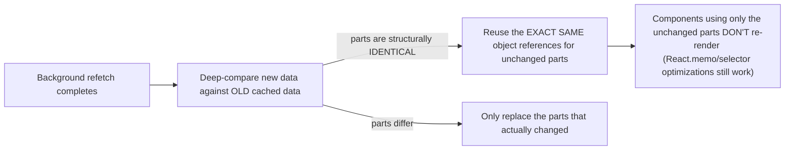

TanStack Query performs structural sharing on every successful fetch by default: even though a background refetch produces a brand-new JS object from `JSON.parse`, the library deep-compares it against the previous cached value and preserves reference equality for any sub-trees that are unchanged — directly analogous to Immer's structural sharing in Redux Toolkit ([[11 Redux Toolkit and RTK Query]] §7.4), achieved by a different mechanism (post-hoc diffing instead of proxy-based mutation tracking).

## 3.4 `select` for Derived/Partial Subscriptions

```jsx
const orderCount = useQuery({
    queryKey: ["orders"],
    queryFn: fetchOrders,
    select: (data) => data.length // component only cares about the count
});
```

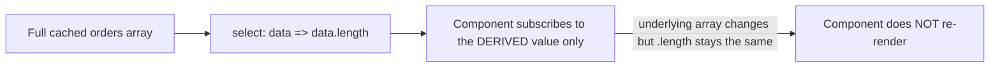

`select` lets a component subscribe to a **derived** slice of a query's cached data, re-rendering only when that specific derived value changes — directly parallel to RTK Query's `selectFromResult` ([[11 Redux Toolkit and RTK Query]] §3.9) and Redux's `createSelector` memoization pattern.

## 3.5 Prefetching

```jsx
async function handleMouseEnterOrderLink(orderId) {
    await queryClient.prefetchQuery({
        queryKey: ["orders", orderId],
        queryFn: () => fetchOrder(orderId),
        staleTime: 10000
    });
}

<Link onMouseEnter={() => handleMouseEnterOrderLink(order.id)} to={`/orders/${order.id}`}>
```

Prefetching primes the cache **before** a component that needs the data actually mounts (e.g., on hover before navigation, or during SSR) — when the destination component does mount and call `useQuery`, it finds the data already cached and shows it instantly with no loading state at all.

## 3.6 SSR/Hydration with TanStack Query

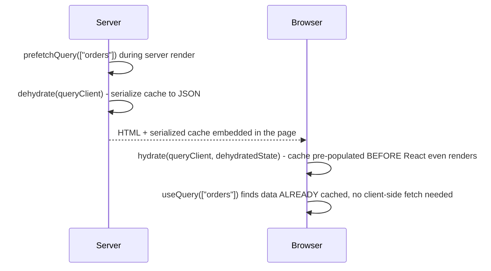

```jsx
// Server (e.g., Next.js)
await queryClient.prefetchQuery({ queryKey: ["orders"], queryFn: fetchOrders });
const dehydratedState = dehydrate(queryClient);

// Client
<HydrationBoundary state={dehydratedState}>
    <Orders />
</HydrationBoundary>
```

This is the mechanism that avoids the classic SSR double-fetch problem (server fetches to render HTML, then client immediately re-fetches the same data on hydration) — see [[08 React]] §3.9 for the general hydration mismatch pitfalls this also helps sidestep, as long as the dehydrated state and initial client render stay consistent.

## 3.7 Mutation Queuing and Offline Support

```jsx
const queryClient = new QueryClient({
    defaultOptions: {
        mutations: {
            retry: 3,
            networkMode: "offlineFirst" // queue mutations while offline, run when back online
        }
    }
});
```

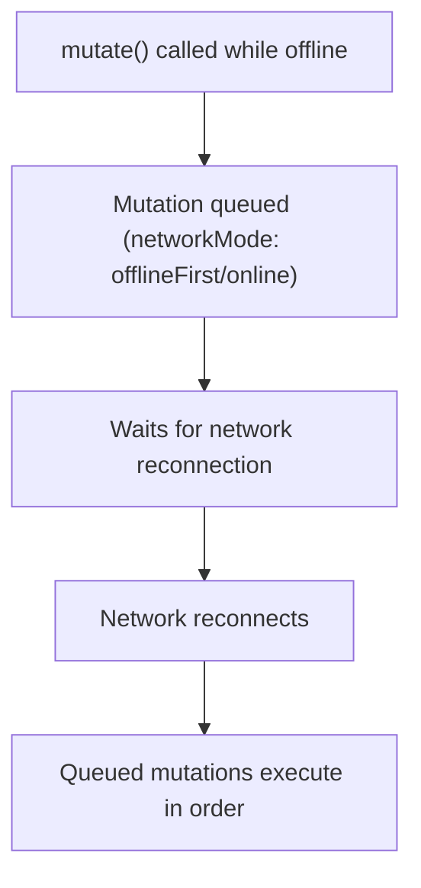

With persistence plugins (`@tanstack/query-sync-storage-persister`), the queue and cache can even survive a full page reload while offline, resuming queued mutations once connectivity returns.

## 3.8 Query Cache Persistence

```jsx
import { persistQueryClient } from "@tanstack/react-query-persist-client";
import { createSyncStoragePersister } from "@tanstack/query-sync-storage-persister";

const persister = createSyncStoragePersister({ storage: window.localStorage });

persistQueryClient({
    queryClient,
    persister,
    maxAge: 24 * 60 * 60 * 1000 // 24 hours
});
```

Persisting the cache to `localStorage`/`AsyncStorage` (React Native) lets an app show cached data **instantly** on cold start, before any network request completes — valuable for offline-tolerant or slow-network scenarios, at the cost of needing to think carefully about stale/sensitive data surviving across sessions.

## 3.9 TanStack Query vs. RTK Query: Architectural Comparison

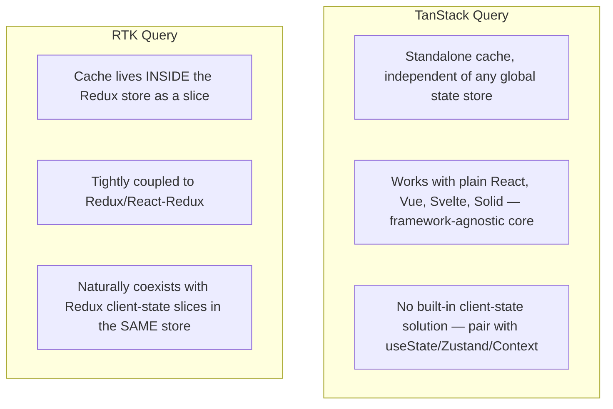

| Aspect | TanStack Query | RTK Query |
|---|---|---|
| Where the cache lives | Its own internal store, independent of any UI framework's state system | A Redux store slice |
| Framework support | React, Vue, Svelte, Solid, Angular | React (via React-Redux) primarily |
| Best fit | Apps without Redux, or wanting server-state caching decoupled from any global store | Apps already using Redux, wanting one unified store for both client and server state |
| Cache key model | Array-based query keys, structural matching | Endpoint name + serialized args |
| Invalidation | `invalidateQueries` by key prefix matching | Tag-based (`providesTags`/`invalidatesTags`) |
| DevTools | Dedicated TanStack Query DevTools panel | Integrated into Redux DevTools |

> [!TIP]
> These two libraries solve the **exact same problem** (server-state caching) with different architectural philosophies. Choosing between them is largely about whether your app already has (or wants) a Redux store: if yes, RTK Query's unified-store model is compelling; if no, TanStack Query avoids introducing Redux at all just to get good data-fetching caching.

## 3.10 Failure Scenarios

| Failure | Symptom | Common Cause | Fix |
|---|---|---|---|
| Optimistic update reverted by a stale background refetch | Optimistic change flickers back before the real mutation even completes | Not calling `cancelQueries` in `onMutate` | Always `await queryClient.cancelQueries(...)` first in `onMutate` |
| Query refetches far more than expected | Excessive network traffic, "why is this fetching again?" | `staleTime: 0` default combined with frequent focus/mount events | Set an appropriate `staleTime` for data that doesn't need aggressive freshness |
| Query never runs | `data` stays `undefined` indefinitely | `enabled` condition never becomes true, or a typo in the condition | Verify the `enabled` expression evaluates to `true` once its dependency is ready |
| Stale data shown after a mutation | UI doesn't reflect the just-completed change | Forgot to `invalidateQueries`/`setQueryData` after the mutation | Add explicit invalidation or optimistic update in `onSuccess`/`onSettled` |
| Memory/network waste from many similar but distinct keys | Cache grows large, unclear why so many entries exist | Including unstable values (new object/function references, timestamps) directly in the query key | Keep query keys to stable, serializable primitives/plain objects |
| Component doesn't see loading spinner it expects | UI silently shows old data instead of a spinner during refetch | Checking `isLoading` instead of `isFetching` for a case that includes background refetches | Use `isFetching` (or a custom loading UI strategy) when background-refetch loading state matters |
| Infinite query duplicate/missing items after a mutation | Paginated list has gaps or duplicates after an insert/delete | Cache not properly invalidated/restructured after a mutation affecting a paginated list | Invalidate the infinite query, or manually restructure pages in `setQueryData` |

## 3.11 Performance Considerations

- Set deliberate `staleTime` per query based on how often that specific data actually changes — don't leave everything at the aggressive `0` default.
- Use `select` to subscribe components to only the derived data they need, avoiding re-renders on unrelated cache changes.
- Use `placeholderData`/`keepPreviousData` for paginated UIs to avoid loading flashes between pages.
- Prefetch on hover/predicted navigation for perceived-instant page transitions.
- Tune `gcTime` down for large, rarely-revisited cached datasets to free memory sooner; up for small, frequently-revisited data.

## 3.12 Security Considerations

| Risk | Mitigation |
|---|---|
| Sensitive per-user data persisting in `localStorage` via query persistence | Avoid persisting caches containing sensitive/PII data, or clear on logout |
| Stale sensitive data remaining cached after logout | Call `queryClient.clear()` (or `removeQueries`) on logout |
| Query keys accidentally including secrets/tokens (visible in DevTools) | Keep auth tokens out of query keys; pass them via headers in the query function instead |

---

# 4. Real-World System Design Usage

## 4.1 Where TanStack Query Is Used in Production

- React/Vue/Svelte SPAs of any size needing reliable server-data synchronization.
- Dashboards and admin panels with frequently-changing, polled, or real-time-adjacent data.
- E-commerce product listings/detail pages benefiting from prefetching and pagination caching.
- Mobile apps (React Native) needing offline-tolerant cached data with persistence.

## 4.2 Typical Production Architecture

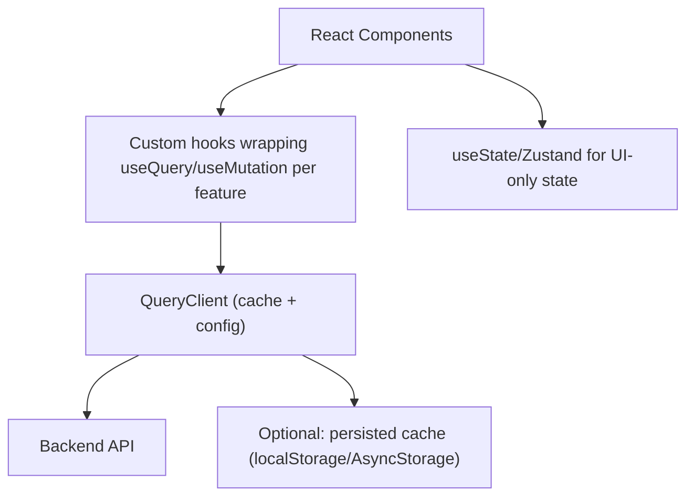

## 4.3 Big-Company Style Thinking

| Concern | TanStack Query Design Response |
|---|---|
| Reliability | Optimistic updates with proper cancellation + rollback, retry policies tuned per endpoint |
| Scale | Deduplication and caching reduce redundant network load across many components/pages |
| Observability | DevTools in development; custom logging via global `QueryCache`/`MutationCache` callbacks in production |
| Security | Cache cleared on logout, no sensitive data in query keys or persisted storage |
| Maintainability | One custom hook per query/mutation (e.g., `useOrders()`, `useCreateOrder()`), consistent key-naming conventions |
| Performance | Deliberate `staleTime`/`gcTime` per data type, `select` for minimal re-renders, prefetching for perceived speed |

## 4.4 Example: Order Dashboard with Optimistic Status Updates

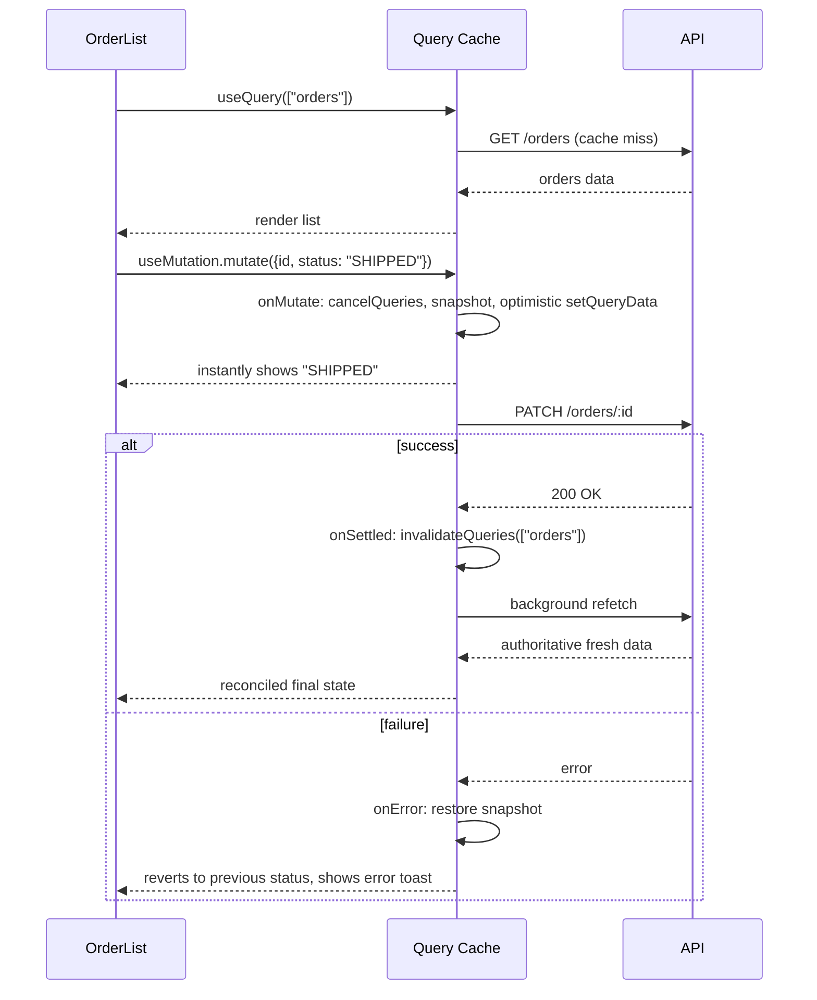

## 4.5 Feature-Folder Architecture

```text
src/features/orders/
    api.js              - raw fetch functions (fetchOrders, fetchOrder, createOrder, updateOrderStatus)
    hooks.js             - useOrders(), useOrder(id), useCreateOrder(), useUpdateOrderStatus()
    OrderList.jsx
    OrderDetail.jsx

src/app/
    queryClient.js        - QueryClient instance + defaultOptions
```

```javascript
// hooks.js
export function useOrders(filters) {
    return useQuery({
        queryKey: ["orders", filters],
        queryFn: () => fetchOrders(filters),
        staleTime: 30_000
    });
}
```

## 4.6 Integration with Other Systems

| System | TanStack Query Integration |
|---|---|
| REST APIs | Any `fetch`/axios call as the query function |
| GraphQL | `graphql-request` or any GraphQL client wrapped as a query function |
| WebSockets/real-time | `queryClient.setQueryData()` called from a socket message handler to push live updates into the cache |
| SSR frameworks | Next.js/Remix `prefetchQuery` + `dehydrate`/`HydrationBoundary` |
| Forms | Combined with React Hook Form for submission via `useMutation` |
| Testing | Mock Service Worker (MSW) to intercept network calls in tests without mocking the library itself |

```javascript
// WebSocket pushing live updates into the TanStack Query cache
socket.on("orderUpdated", (order) => {
    queryClient.setQueryData(["orders", order.id], order);
});
```

---

# 5. Interview Preparation

## 5.1 What Interviewers Expect

For "TanStack Query" topics, interviewers usually expect:

- You understand why server state deserves a dedicated tool instead of `useState`/`useEffect`.
- You can use `useQuery`/`useMutation` correctly, including cache invalidation after mutations.
- You understand `staleTime` vs. `gcTime` and the default aggressive refetching behavior.

For senior frontend roles, they also expect:

- You can implement optimistic updates correctly, including the cancellation race-condition fix.
- You understand structural sharing and `select` for minimizing re-renders.
- You can design SSR prefetching/hydration to avoid double-fetching.
- You can articulate the architectural trade-off between TanStack Query and RTK Query.

## 5.2 Most Important Questions and Answers

### Q1. Why use TanStack Query instead of `useEffect` + `useState` for data fetching?

Manual fetching reinvents loading/error state handling per component, doesn't deduplicate identical requests across components, doesn't cache data across navigation, and is prone to race conditions when a slower request resolves after a newer one. TanStack Query handles all of this automatically via its cache-key-based subscription model.

### Q2. What's the difference between `staleTime` and `gcTime`?

`staleTime` controls how long fetched data is considered "fresh" — during this window, no automatic background refetch occurs even if triggers (focus, mount, reconnect) happen. `gcTime` controls how long **unused** cache data (no components currently subscribed) is retained in memory before being deleted entirely, regardless of staleness.

### Q3. Why might a query refetch immediately every time you switch back to the browser tab?

The default `staleTime` is `0`, meaning data is stale immediately after fetching, and `refetchOnWindowFocus` is `true` by default — so any tab-focus event after the data is (immediately) stale triggers a background refetch. Set a longer `staleTime` for data that doesn't need this aggressive freshness.

### Q4. What's the difference between `isLoading` and `isFetching`?

`isLoading` is true only during the very first fetch when no cached data exists yet. `isFetching` is true during **any** fetch, including silent background refetches where existing (possibly stale) data is already being displayed. Using the wrong one causes either a missing loading indicator, or an unwanted full-loading-spinner flash during background refetches.

### Q5. How does query deduplication work?

Any number of `useQuery` calls sharing the identical query key subscribe to the exact same cache entry and, if a fetch is already in-flight for that key, share the same underlying promise rather than issuing a new network request — this happens automatically based purely on key equality.

### Q6. Why is `cancelQueries` important before applying an optimistic update?

Without cancelling in-flight queries for that key first, a background refetch that was already running (started before the mutation) could resolve *after* your optimistic update is applied, silently overwriting it with stale pre-mutation data — a race condition. `cancelQueries` ensures no competing fetch can clobber the optimistic state before the real mutation's result reconciles it.

### Q7. What does `invalidateQueries({ queryKey: ["orders"] })` actually invalidate?

By default, it matches by **key prefix** — every cached entry whose key array starts with `["orders"]` (e.g., `["orders", 1]`, `["orders", { status: "PAID" }]`) is marked stale, triggering a refetch for any currently active (mounted) query and simply flagging inactive ones for refetch next time they're used.

### Q8. What is structural sharing, and why does it matter?

After a successful fetch (including background refetches), TanStack Query deep-compares the new data against the previously cached value and reuses object references for any unchanged sub-trees, only creating new references where data actually differs — this preserves reference-equality-based optimizations (like `React.memo`) even across refetches that return mostly-unchanged data.

### Q9. How do you avoid the double-fetch problem with server-side rendering?

Prefetch the query on the server (`queryClient.prefetchQuery`), serialize the resulting cache with `dehydrate`, embed it in the initial page payload, and `hydrate`/`HydrationBoundary` it on the client before the component tree renders — so the client's `useQuery` call finds the data already cached and doesn't issue a redundant client-side fetch.

### Q10. How does TanStack Query architecturally differ from RTK Query?

TanStack Query maintains its own independent cache, decoupled from any global state store, and works across multiple frameworks. RTK Query's cache lives as a slice inside a Redux store, tightly coupled to Redux/React-Redux, which is compelling specifically for apps that already want one unified store for both client and server state.

## 5.3 Tricky Questions

### Can two different query keys ever share the same cached data?

Not automatically — each distinct key (after serialization) gets its own independent cache entry. To keep genuinely related data in sync across differently-keyed queries, you'd need to manually update both via `setQueryData` (or rely on invalidation triggering both to refetch from the same authoritative source).

### If `staleTime` is set very high, does the UI ever show wrong data?

It can show data that's out of date relative to the server, by design — that's the explicit trade-off of a longer `staleTime` (fewer network requests vs. potentially showing older data). Mutations that affect that data should still explicitly invalidate/update the relevant cache entries regardless of `staleTime`, since invalidation and staleness are somewhat independent mechanisms.

### Does calling `refetch()` manually bypass `staleTime`?

Yes — `refetch()` (and `invalidateQueries`) force a fetch regardless of whether the data is currently considered fresh; `staleTime` only governs whether *automatic* triggers (focus, mount, reconnect, interval) cause a background refetch, not manual/explicit ones.

### Why might including a Date object or a new array literal directly in a query key cause excessive cache growth?

Query keys are compared based on their serialized/structural value; a `new Date()` or freshly-created array/object literal with a different reference (but conceptually "the same" value) computed on every render can produce a subtly different serialized key each time if it's not stable/deterministic, fragmenting what should be one cache entry into many, or in some cases missing deduplication entirely if the values genuinely differ (e.g., timestamps down to the millisecond).

## 5.4 Common Candidate Mistakes

- Not knowing the difference between `isLoading` and `isFetching`.
- Forgetting to invalidate or optimistically update the cache after a mutation, leaving stale UI.
- Skipping `cancelQueries` in optimistic update `onMutate` handlers.
- Leaving `staleTime` at the aggressive default for data that rarely changes, causing unnecessary network traffic.
- Including unstable values in query keys, fragmenting the cache.
- Treating TanStack Query as a general client-state manager instead of specifically a server-state cache.
- Not using `select` or splitting queries when a component only needs a small derived piece of a large cached object.

## 5.5 Interview Coding Checklist

- [ ] Use stable, serializable query keys (primitives/plain objects), never unstable references.
- [ ] Set `staleTime` deliberately per query based on actual data volatility.
- [ ] Invalidate or optimistically update relevant queries after every mutation.
- [ ] Call `cancelQueries` before applying any optimistic update.
- [ ] Use `select` for components needing only a derived slice of cached data.
- [ ] Use `enabled` to correctly gate dependent queries.

---

# 6. Hands-On Thinking

## 6.1 Three Real-World Projects Using TanStack Query

### Project 1: E-Commerce Product Catalog with Prefetching

Concepts: paginated product listing with `placeholderData`, prefetch-on-hover for product detail pages, `staleTime` tuned for rarely-changing catalog data.

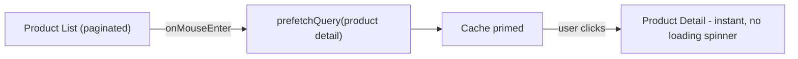

### Project 2: Collaborative Task Board with Optimistic Drag-and-Drop

Concepts: `useMutation` with full optimistic update + cancellation + rollback for reordering, `select` to minimize re-renders per column.

```jsx
const moveTask = useMutation({
    mutationFn: ({ taskId, newColumnId }) => api.moveTask(taskId, newColumnId),
    onMutate: async ({ taskId, newColumnId }) => {
        await queryClient.cancelQueries({ queryKey: ["tasks"] });
        const previous = queryClient.getQueryData(["tasks"]);
        queryClient.setQueryData(["tasks"], (old) => moveTaskInList(old, taskId, newColumnId));
        return { previous };
    },
    onError: (err, vars, context) => queryClient.setQueryData(["tasks"], context.previous),
    onSettled: () => queryClient.invalidateQueries({ queryKey: ["tasks"] })
});
```

### Project 3: Real-Time Dashboard with WebSocket-Fed Cache Updates

Concepts: initial `useQuery` load, WebSocket pushing incremental updates directly into the cache via `setQueryData`, polling fallback if the socket disconnects.

```jsx
useEffect(() => {
    const socket = connectSocket();
    socket.on("metricUpdate", (metric) => {
        queryClient.setQueryData(["metrics", metric.id], metric);
    });
    return () => socket.disconnect();
}, [queryClient]);

useQuery({
    queryKey: ["metrics"],
    queryFn: fetchMetrics,
    refetchInterval: socketConnected ? false : 10000 // poll only as a fallback
});
```

## 6.2 Step-by-Step Design Approach

For any TanStack Query feature:

1. Identify the query key structure up front, including all parameters that make a query's result unique.
2. Choose `staleTime`/`gcTime` deliberately based on how often the underlying data actually changes.
3. Design mutation success handling: invalidate, `setQueryData`, or full optimistic update — decide per mutation.
4. For optimistic updates, always include `cancelQueries` + snapshot + rollback as one complete unit, never partially.
5. Use `select`/`enabled`/`placeholderData` to shape exactly what and when each component subscribes to.
6. Test with MSW to simulate real network behavior (including delays and failures) rather than mocking the library.

## 6.3 Production Implementation Approach

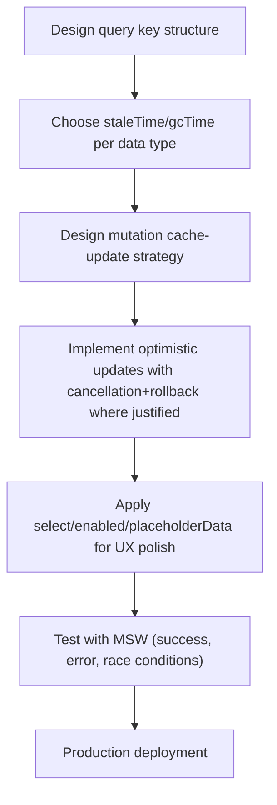

## 6.4 Production Readiness Example

For a TanStack Query application, define:

- A documented query-key convention per feature (e.g., `["orders", filters]`, `["orders", id]`).
- `staleTime`/`gcTime` defaults reviewed per data category (rarely-changing reference data vs. frequently-changing live data).
- Every mutation's cache-update strategy (invalidate vs. optimistic) explicitly decided and documented.
- Cache cleared (`queryClient.clear()`) on logout.
- DevTools disabled or excluded from production bundles.
- SSR prefetch/hydration reviewed for any pages using server rendering.

---

# 7. Deep Dive (Optional but Important)

## 7.1 Internal Architecture: `QueryClient`, `QueryCache`, and Observers

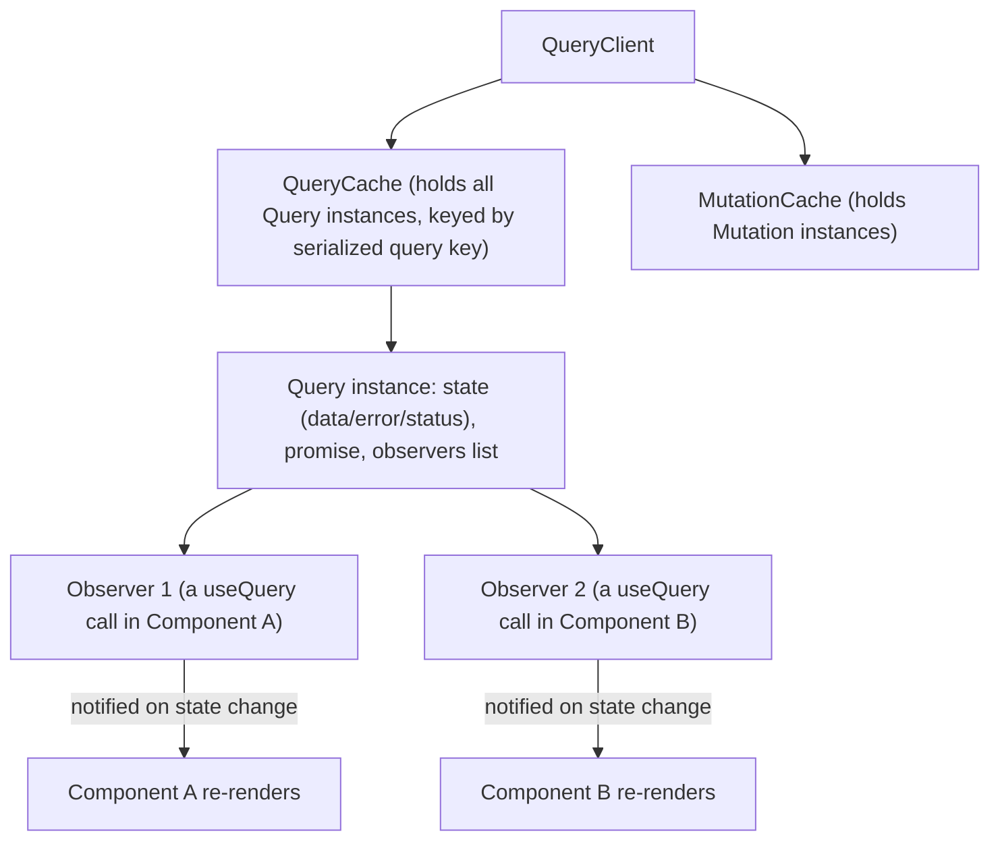

`useQuery` is a thin React binding over a framework-agnostic core: a `Query` object holds the actual state and fetch logic, and each `useQuery` call registers an "observer" that gets notified (triggering a re-render via internal `useState`/`useSyncExternalStore`) whenever that query's state changes — this is why the exact same data can be shared instantly and consistently across arbitrarily many components.

## 7.2 Query Key Serialization and Hashing

```javascript
// These are considered the SAME query key (key order within objects doesn't matter):
["orders", { status: "PAID", page: 1 }]
["orders", { page: 1, status: "PAID" }]

// These are DIFFERENT query keys (different array structure/values):
["orders", { status: "PAID" }]
["orders", "PAID"]
```

TanStack Query hashes query keys deterministically, sorting object keys so property order doesn't create spurious cache misses — but array position and value types still matter, which is why keeping a consistent, deliberate key *shape* per query type across your codebase avoids confusing cache fragmentation.

## 7.3 Retry and Backoff Internals

```jsx
useQuery({
    queryKey: ["orders"],
    queryFn: fetchOrders,
    retry: (failureCount, error) => {
        if (error.status === 404) return false; // don't retry a definitive "not found"
        return failureCount < 3;
    },
    retryDelay: (attemptIndex) => Math.min(1000 * 2 ** attemptIndex, 30000) // exponential backoff
});
```

The default retry behavior (3 attempts with exponential backoff) is configurable per query or globally, and — importantly — retry logic can inspect the actual error to decide whether retrying even makes sense (retrying a 404 is pointless; retrying a transient 503 is reasonable).

## 7.4 `useSyncExternalStore` Integration

```text
useQuery internally uses React's useSyncExternalStore (or an equivalent shim)
to subscribe a component to the external Query object's state, ensuring:
    - Correct behavior under React 18's concurrent rendering
    - No "tearing" (different parts of the UI briefly showing inconsistent cache states)
      during a single render pass, even with concurrent features enabled
```

This is the same underlying React API that libraries like Redux's `useSelector` (in recent versions) and other external-store bindings use to correctly integrate with React's concurrent rendering model, as touched on in [[08 React]] §3.1.

## 7.5 Debugging Tools

| Tool | Purpose |
|---|---|
| TanStack Query DevTools | Inspect every query's key, status, data, and staleness; manually trigger refetch/invalidate |
| Mock Service Worker (MSW) | Intercept network requests in tests/development without mocking the query library itself |
| `queryClient.getQueryCache().subscribe(...)` | Programmatically log every cache event for custom observability integration |
| React DevTools Profiler | Correlate query state changes with actual component re-renders |

---

# Production Checklists

## Code Quality Checklist

- [ ] Query keys stable, serializable, and consistently shaped per query type.
- [ ] `staleTime`/`gcTime` set deliberately per data category, not left at defaults everywhere.
- [ ] Every mutation has an explicit cache-update strategy (invalidate or optimistic).
- [ ] Optimistic updates always paired with `cancelQueries` + snapshot + rollback as one unit.
- [ ] `enabled` used correctly to gate dependent queries.
- [ ] One custom hook per query/mutation per feature, not raw `useQuery` calls scattered through components.

## Performance Checklist

- [ ] `select` used for components needing only a derived slice of larger cached data.
- [ ] `placeholderData` used for paginated views to avoid loading flashes.
- [ ] Prefetching applied for predictable navigation (hover, likely-next-page).
- [ ] `gcTime` tuned down for large, rarely-revisited datasets; up for small, frequently-revisited ones.

## Security Checklist

- [ ] No sensitive tokens/PII embedded directly in query keys.
- [ ] Cache cleared (`queryClient.clear()`) on logout/user switch.
- [ ] Persisted cache storage (if used) reviewed for sensitive data exposure.
- [ ] DevTools excluded from production builds.

## Debugging Checklist

- [ ] Reproduce with TanStack Query DevTools open to inspect exact cache/query state.
- [ ] Check `staleTime`/refetch triggers first when a query refetches unexpectedly.
- [ ] Check `cancelQueries` presence first when an optimistic update flickers/reverts unexpectedly.
- [ ] Verify query key stability first when cache entries seem duplicated or fragmented.
- [ ] Use MSW to simulate error/race-condition scenarios in tests, not just the happy path.

---

# Learning Roadmap

## Phase 1: Beginner

Learn: `useQuery` basics, `QueryClientProvider` setup, basic `useMutation` with `invalidateQueries`.

Practice: a simple app fetching and displaying a list from a public API.

## Phase 2: Intermediate

Learn: query keys with parameters, `enabled`/dependent queries, pagination with `placeholderData`, DevTools.

Practice: a paginated product listing with detail pages and dependent queries.

## Phase 3: Advanced

Learn: optimistic updates with cancellation/rollback, `select`, infinite queries, prefetching, SSR hydration.

Practice: a task board with optimistic drag-and-drop reordering and prefetch-on-hover navigation.

## Phase 4: Production Frontend Engineer

Learn: internal architecture (`QueryCache`/observers), structural sharing internals, offline/persistence support, retry/backoff tuning.

Practice: a production-style dashboard with WebSocket-fed cache updates, tuned staleness policies per data type, and full SSR prefetch/hydration.

---

# Self-Review Completion Loop

The topic was reviewed against:

- Official TanStack Query documentation (tanstack.com/query).
- Common production incident patterns (race conditions in optimistic updates, stale-data confusion, cache fragmentation from unstable keys).
- Direct architectural comparison against RTK Query ([[11 Redux Toolkit and RTK Query]]).
- Interview patterns for beginner through senior frontend roles.

## Gap Review Matrix

| Area | Covered? | Notes |
|---|---|---|
| `useQuery`/`useMutation` fundamentals | Yes | Full return-value breakdown, basic examples |
| Query lifecycle | Yes | State diagram: fetching → fresh → stale → inactive → GC |
| `staleTime` vs. `gcTime` | Yes | Explicit distinction and default-behavior warning |
| Deduplication | Yes | Sequence diagram across components |
| Dependent/parallel queries | Yes | `enabled`, `useQueries` |
| Cache invalidation | Yes | Prefix-matching behavior explained |
| Pagination/infinite queries | Yes | `placeholderData`, `useInfiniteQuery` |
| Optimistic updates | Yes | Full sequence diagram, cancellation race-condition explained |
| Structural sharing | Yes | Diagram, comparison to Immer's mechanism |
| `select` | Yes | Diagram, comparison to RTK Query's `selectFromResult` |
| Prefetching | Yes | Hover-based example |
| SSR/hydration | Yes | Sequence diagram, double-fetch problem solved |
| Offline/persistence | Yes | `networkMode`, `persistQueryClient` |
| TanStack Query vs. RTK Query | Yes | Explicit architectural comparison table |
| Failure scenarios | Yes | Seven concrete production failure patterns |
| Security | Yes | Cache clearing on logout, key hygiene |
| Interview prep | Yes | Common and tricky questions, candidate mistakes |
| Hands-on projects | Yes | Three realistic projects with diagrams |
| Internals | Yes | `QueryClient`/`QueryCache`/observer architecture, key hashing, retry/backoff, `useSyncExternalStore` |

No significant beginner-to-senior gaps remain for TanStack Query. Further specialization should split into separate deep dives: **TanStack Query with Next.js App Router (Server Components)**, **TanStack Query for React Native/Offline-First Apps**, **Advanced Optimistic UI Patterns**, and **TanStack Query vs. SWR Comparison**.

---

# Official References

- TanStack Query Official Documentation: <https://tanstack.com/query/latest>
- TanStack Query SSR Guide: <https://tanstack.com/query/latest/docs/framework/react/guides/ssr>
- TanStack Query Optimistic Updates Guide: <https://tanstack.com/query/latest/docs/framework/react/guides/optimistic-updates>
- Mock Service Worker Documentation: <https://mswjs.io/>

---

## Final Summary

TanStack Query treats server state as a cache-with-subscriptions problem distinct from client state, replacing manual `useEffect`/`useState` fetching with automatic deduplication, configurable staleness, background refetching, and structural sharing that preserves reference equality across refetches. Production mastery comes from setting `staleTime`/`gcTime` deliberately per data type rather than leaving aggressive defaults everywhere, always pairing optimistic updates with query cancellation to avoid race conditions, and choosing consciously between TanStack Query's standalone cache and RTK Query's Redux-integrated cache based on whether your app already needs a unified store.
