# 🗄️ SQL & Transactions Deep Dive — Complete Beginner-to-Expert Reference

> How relational databases *really* work — **ACID**, **isolation levels**, **locking vs MVCC**, **indexing** (B-trees), **query optimization** (EXPLAIN plans), joins, and the concurrency anomalies that corrupt data. The deep database knowledge behind every backend system.

---

## 📑 Table of Contents

1. [Executive Summary](#-executive-summary)
2. [Fundamentals (Beginner)](#1--fundamentals-beginner-level)
3. [Core Concepts (Intermediate)](#2--core-concepts-intermediate-level)
4. [Advanced Concepts (Senior)](#3--advanced-concepts-senior-level)
5. [Real-World System Design](#4--real-world-system-design-usage)
6. [Interview Preparation](#5--interview-preparation)
7. [Hands-On Projects](#6--hands-on-projects)
8. [Deep Dive: Internals](#7--deep-dive-internals)
9. [Production Checklists](#-production-checklists)
10. [Learning Roadmap](#-learning-roadmap)
11. [Self-Review Completion Loop](#-self-review-completion-loop)
12. [Official References](#-official-references)
13. [Final Summary](#-final-summary)

---

## 🎯 Executive Summary

A **relational database** stores data in tables with defined relationships, queried via **SQL**. Its superpower is the **transaction** — a group of operations that execute as an all-or-nothing unit with strong correctness guarantees (**ACID**), even under concurrent access and crashes. Understanding *how* databases provide those guarantees — isolation levels, locking, MVCC, the write-ahead log — and how to make queries fast — indexes, query plans — is the deepest and most interview-critical backend skill.

| What it is | What it replaces | Core superpower |
|---|---|---|
| Relational storage + SQL + ACID transactions | Flat files, ad-hoc data handling, no consistency guarantees | **Correct, concurrent, durable data** — all-or-nothing operations that survive crashes and concurrency |

> [!IMPORTANT]
> The one idea that anchors everything: **a transaction turns many operations into a single, indivisible unit that is correct even when things go wrong** — concurrent users, power failures, mid-operation crashes. Transferring money is the canonical example: debit one account and credit another must *both* happen or *neither* — never just the debit (money vanishes) or just the credit (money appears). Databases guarantee this via **ACID** (Atomicity, Consistency, Isolation, Durability), and the *hard* part — the part interviews probe relentlessly — is **Isolation**: how the database lets thousands of transactions run *concurrently* while making each *feel* like it ran alone. That's governed by **isolation levels**, implemented by **locking** and **MVCC**, and it's a direct sibling of the consistency problems in [[06 Distributed Systems]]. On top of correctness sits **performance** — **indexes** (B-trees) and **query optimization** turn slow full-table scans into instant lookups. This guide deepens [[02 Postgres]] and connects to [[08 JPA vs Hibernate]] and [[06 Distributed Systems]].

Related guides: [[02 Postgres]] · [[08 JPA vs Hibernate]] · [[09 Java Hibernate]] · [[06 Distributed Systems]] · [[04 Redis]] · [[01 System Design Fundamentals]] · [[03 MongoDB]]

---

## 1. 🌱 FUNDAMENTALS (Beginner Level)

### What is a relational database?

Data lives in **tables** (rows and columns) with **relationships** between them, enforced by keys. SQL is the declarative language to define, query, and modify it.

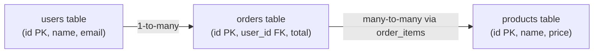

| Concept | Meaning |
|---|---|
| **Table** | A collection of rows (records) with typed columns |
| **Primary Key (PK)** | Uniquely identifies each row |
| **Foreign Key (FK)** | References a PK in another table (a relationship) |
| **Schema** | The structure (tables, columns, types, constraints) |
| **Constraint** | Rules: NOT NULL, UNIQUE, CHECK, FK |

> [!TIP]
> The "relational" model organizes data into tables linked by **keys**, avoiding duplication through **normalization** (§2.5). **Primary keys** uniquely identify rows; **foreign keys** enforce relationships (an order's `user_id` must reference a real user — **referential integrity**). This structure plus **constraints** (NOT NULL, UNIQUE, CHECK) means the *database itself* enforces data correctness — invalid data is rejected at the source. This is a key contrast with [[03 MongoDB]] (schema-flexible documents): relational DBs trade flexibility for strong, enforced structure and relationships.

### The 4 SQL operation categories

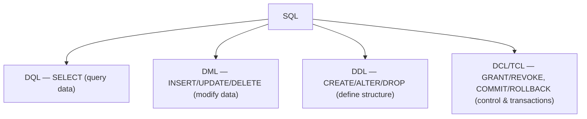

### Basic query anatomy

```sql
SELECT   u.name, COUNT(o.id) AS order_count   -- what columns
FROM     users u                              -- from which table
JOIN     orders o ON o.user_id = u.id         -- combine with orders
WHERE    u.active = true                       -- filter rows
GROUP BY u.name                                -- aggregate groups
HAVING   COUNT(o.id) > 5                        -- filter groups
ORDER BY order_count DESC                       -- sort
LIMIT    10;                                     -- cap results
```


> [!IMPORTANT]
> A crucial and often-tested detail: **SQL executes in a different order than it's written.** You *write* `SELECT ... FROM ... WHERE ... GROUP BY ... HAVING ... ORDER BY`, but the database *logically evaluates* `FROM/JOIN` → `WHERE` → `GROUP BY` → `HAVING` → `SELECT` → `ORDER BY` → `LIMIT`. This explains real behaviors: you *can't* use a `SELECT` column alias in a `WHERE` clause (WHERE runs before SELECT) but *can* in `ORDER BY` (which runs after SELECT); and `WHERE` filters individual rows *before* grouping while `HAVING` filters *after* aggregation. Understanding this logical order demystifies why queries behave as they do and is a common interview checkpoint.

### What is a transaction?

```sql
BEGIN;                                          -- start transaction
UPDATE accounts SET balance = balance - 100 WHERE id = 1;  -- debit
UPDATE accounts SET balance = balance + 100 WHERE id = 2;  -- credit
COMMIT;                                          -- make it permanent (or ROLLBACK to undo)
```

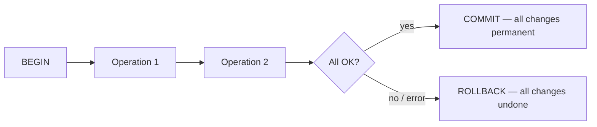

> [!IMPORTANT]
> A **transaction** groups multiple statements into a single **all-or-nothing** unit. Between `BEGIN` and `COMMIT`, changes are provisional; `COMMIT` makes them permanent atomically, while `ROLLBACK` (or a crash/error) undoes *everything* as if nothing happened. This is the fundamental tool for correctness: the money transfer's debit and credit are wrapped in one transaction, so a failure between them rolls back the debit — money is never lost or created. Every meaningful data modification that spans multiple steps should be transactional. The guarantees a transaction provides are **ACID** (§2.1), and how it behaves under concurrency is the deep material.

### Real-world analogy 🏦

A transaction is like a **bank wire transfer with a receipt**:
- You fill out multiple steps (debit here, credit there) — the whole thing is one **transaction**.
- Either the *entire* transfer completes and you get a receipt (**COMMIT**), or if anything fails partway, the bank **reverses everything** (**ROLLBACK**) — you never end up with money debited but not credited.
- **Isolation**: while your transfer processes, other people's transfers don't see your half-finished state — each transfer appears to happen on its own.
- **Durability**: once you have the receipt (committed), the transfer survives even if the bank's power goes out one second later.

> [!TIP]
> Beginner takeaway: SQL is the declarative language for relational data; **transactions** wrap operations into atomic, correct, durable units. The database's job is to keep data *correct* (ACID) even under concurrency and failure, and *fast* (indexes, optimization). Everything advanced — isolation levels, MVCC, B-trees, query plans — serves those two goals.

---

## 2. 🧩 CORE CONCEPTS (Intermediate Level)

### 2.1 ACID — the transaction guarantees

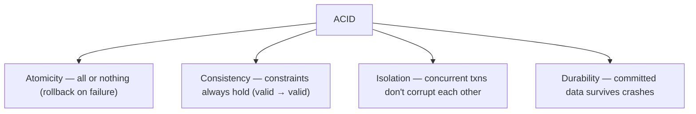

| Property | Guarantees | Mechanism |
|---|---|---|
| **Atomicity** | All operations succeed or none do | Undo log / rollback |
| **Consistency** | Constraints/invariants preserved | Constraints + app logic |
| **Isolation** | Concurrent txns as if serial | Locking / MVCC + isolation levels |
| **Durability** | Committed = permanent | Write-ahead log (WAL) + fsync |

> [!IMPORTANT]
> **ACID** defines what a transaction guarantees. **Atomicity** — the transaction is indivisible; a failure rolls back all its changes (via an undo/rollback log). **Consistency** — the database moves from one valid state to another, never violating constraints (FKs, uniqueness, CHECKs) — note this is *application-defined correctness*, enforced by constraints + your logic. **Isolation** — concurrent transactions don't interfere; ideally each behaves as if it ran alone (the hardest to provide, tuned by **isolation levels**). **Durability** — once committed, data survives crashes/power loss (via the **write-ahead log** flushed to disk, §7.4). The subtle point interviewers love: the "C" is the odd one out — it's largely a *consequence* of the other three plus your constraints, not a separate mechanism. And "Isolation" is where all the concurrency complexity lives.

### 2.2 The Concurrency Anomalies (why isolation matters)

Without isolation, concurrent transactions produce these bugs:

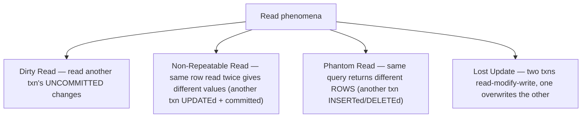

| Anomaly | What happens |
|---|---|
| **Dirty read** | You read data another transaction wrote but hasn't committed (it may roll back!) |
| **Non-repeatable read** | You read a row, another txn updates+commits it, you re-read → different value |
| **Phantom read** | You run a range query, another txn inserts matching rows, you re-run → new rows appear |
| **Lost update** | Two txns read the same value, both update; the second overwrites the first's change |

> [!WARNING]
> These **anomalies** are the concrete data-corruption bugs that isolation prevents — and knowing them cold is essential. A **dirty read** is the worst: you act on data that might get rolled back (never happened). A **non-repeatable read** breaks assumptions when you read the same row twice in one transaction. A **phantom read** is like non-repeatable but for *sets of rows* (a range query's result set changes). A **lost update** silently destroys data — two users edit the same record, and one's changes vanish (a real, common bug — e.g., two admins updating inventory). Each **isolation level** (§2.3) prevents a specific subset of these, trading correctness for performance. You *must* be able to name these anomalies and which level stops each.

### 2.3 Isolation Levels

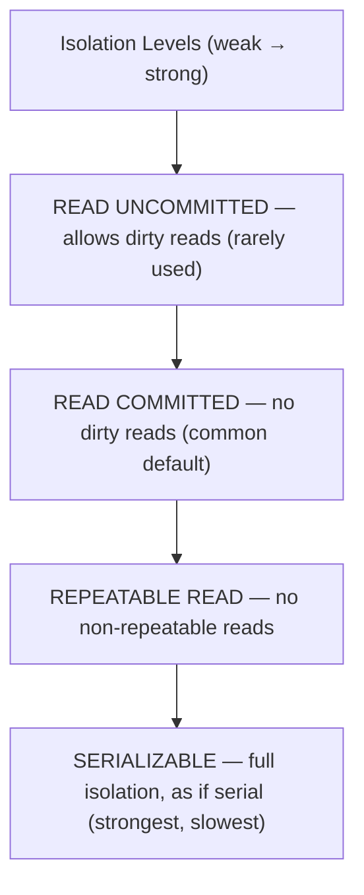

| Level | Dirty read | Non-repeatable | Phantom |
|---|---|---|---|
| **READ UNCOMMITTED** | ✅ possible | ✅ possible | ✅ possible |
| **READ COMMITTED** | ❌ prevented | ✅ possible | ✅ possible |
| **REPEATABLE READ** | ❌ | ❌ prevented | ✅ possible* |
| **SERIALIZABLE** | ❌ | ❌ | ❌ prevented |

> [!IMPORTANT]
> **Isolation levels** let you trade isolation strength for concurrency/performance. **READ UNCOMMITTED** (allows dirty reads — almost never used). **READ COMMITTED** (only sees committed data — the **default in [[02 Postgres]]**, Oracle, SQL Server) — prevents dirty reads but a row can change between two reads. **REPEATABLE READ** (a transaction sees a consistent snapshot — the same row reads the same all transaction long; **default in MySQL/InnoDB**) — prevents non-repeatable reads. **SERIALIZABLE** (transactions behave as if run one-at-a-time — the strongest, prevents *all* anomalies, but with the most contention/aborts). Key nuance: the SQL *standard* says REPEATABLE READ allows phantoms, but real implementations differ — **[[02 Postgres]]'s REPEATABLE READ (snapshot isolation) actually prevents phantoms** via MVCC, and its SERIALIZABLE adds detection for the remaining serialization anomalies. **You should know your database's default and pick the weakest level that's still correct** for the operation — stronger isolation costs concurrency.

### 2.4 Joins

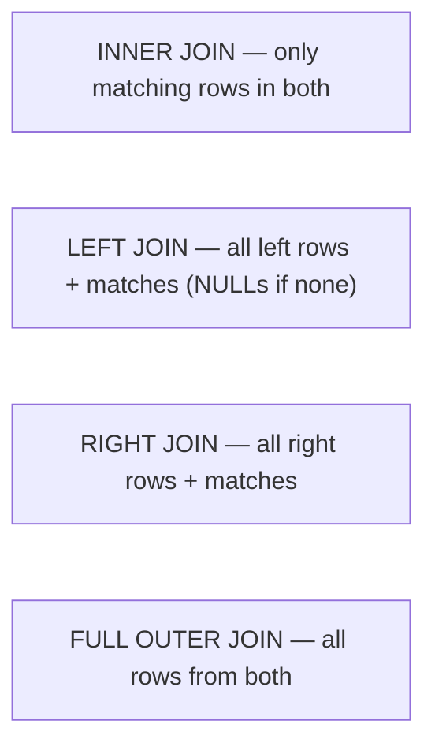

| Join | Returns |
|---|---|
| **INNER** | Rows with a match in both tables |
| **LEFT (OUTER)** | All left rows; matched right or NULLs |
| **RIGHT (OUTER)** | All right rows; matched left or NULLs |
| **FULL OUTER** | All rows from both, matched where possible |
| **CROSS** | Cartesian product (every combination) |
| **SELF** | Table joined to itself (e.g., employee→manager) |

> [!TIP]
> **Joins** combine rows across tables using a matching condition — the core of relational querying. **INNER JOIN** keeps only rows that match in both. **LEFT JOIN** keeps *all* left-table rows, filling NULLs where the right has no match (great for "users and their orders, including users with none"). A classic bug: filtering a LEFT JOIN's right table in `WHERE` (e.g., `WHERE o.status = 'x'`) accidentally turns it into an inner join (NULLs fail the filter) — put such conditions in the `ON` clause instead. Understanding join *semantics* (and their performance — joins are where slow queries often live) is fundamental. Joins are exactly what [[03 MongoDB]]'s document model tries to avoid (embedding vs referencing).

### 2.5 Normalization

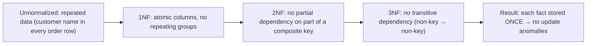

> [!TIP]
> **Normalization** organizes tables to eliminate redundancy so each fact is stored *once*, preventing **update anomalies** (if a customer's name is copied into every order, changing it means updating thousands of rows — and missing one corrupts data). The practical target is **3rd Normal Form (3NF)**: atomic values (1NF), no partial dependencies on composite keys (2NF), and no transitive dependencies — every non-key column depends on "the key, the whole key, and nothing but the key." **But normalization trades write-simplicity for read-cost** (more joins to reassemble data). Real systems often **denormalize** strategically for read performance (§4.2) — duplicating data deliberately, accepting the maintenance burden for speed. Knowing the normal forms *and* when to break them is a senior skill.

### 2.6 Constraints & Referential Integrity

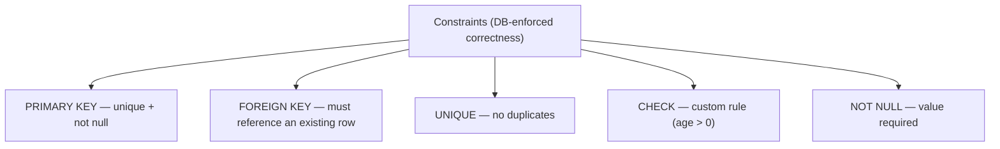

> [!IMPORTANT]
> **Constraints push correctness into the database**, where it's enforced regardless of which app or bug tries to violate it. **Foreign keys** enforce **referential integrity** (you can't create an order for a non-existent user, or delete a user who still has orders — unless you specify `ON DELETE CASCADE`). This is a genuine architectural decision: enforcing rules in the DB (constraints) is more robust (no app can bypass them) but less flexible; enforcing in the app is more flexible but relies on every code path being correct. The strong stance: **let the database enforce what it can** — a UNIQUE constraint is a far more reliable guard against duplicate emails than an app-level check that races under concurrency (two simultaneous signups both pass the app check, but the DB constraint stops the second insert). Constraints are your last line of data-integrity defense.

---

## 3. ⚙️ ADVANCED CONCEPTS (Senior Level)

### 3.1 Indexing & B-Trees

An **index** is a separate data structure that makes lookups fast — without one, the DB scans every row (a **full table scan**, O(n)).

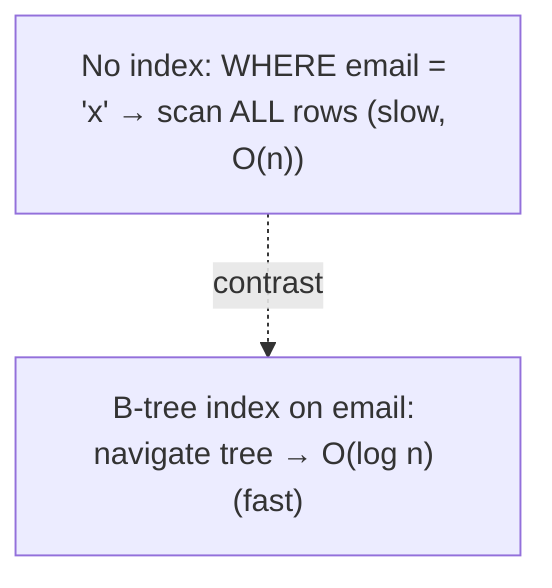

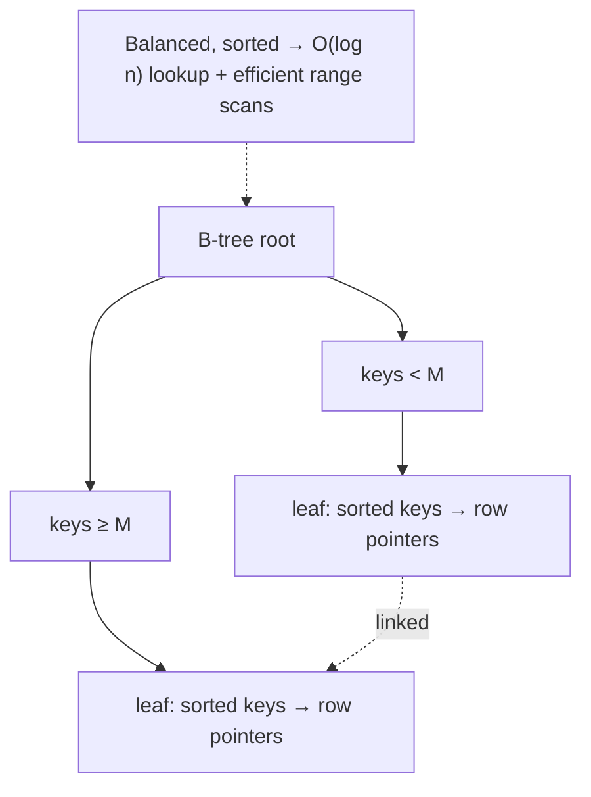

> [!IMPORTANT]
> **Indexes are the #1 database performance tool.** Without one, finding rows by a column means a **full table scan** — reading every row (O(n), catastrophic on millions of rows). An index (almost always a **B-tree** — balanced, sorted) provides **O(log n)** lookups and efficient **range queries** (`WHERE age BETWEEN 20 AND 30`) and sorting, because the tree keeps keys sorted with linked leaves. The trade-off: indexes **speed reads but slow writes** (every INSERT/UPDATE must also update the indexes) and **cost storage**. So you index columns used in `WHERE`, `JOIN`, and `ORDER BY` — but don't index everything. Critical concepts: a **composite index** `(a, b)` follows the **leftmost-prefix rule** (it helps queries filtering on `a`, or `a AND b`, but *not* `b` alone); a **covering index** includes all columns a query needs so the DB never touches the table (**index-only scan**); and **low-cardinality** columns (like a boolean) barely benefit. Indexing is where most real-world query tuning happens.

### 3.2 Reading Query Plans (EXPLAIN)

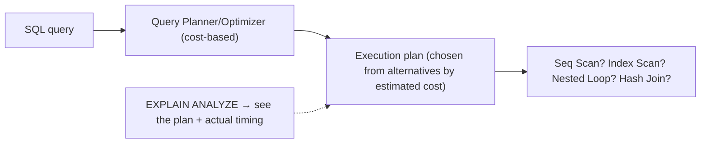

> [!IMPORTANT]
> The **query optimizer** is the database's brain: SQL is *declarative* (you say *what* you want, not *how*), so the optimizer chooses *how* to execute — which indexes to use, join order, join algorithm — by estimating the **cost** of alternative plans using **table statistics** (row counts, value distributions). **`EXPLAIN ANALYZE`** is the single most important performance tool: it shows the chosen plan and (with ANALYZE) actual timings, revealing why a query is slow. Red flags to recognize: a **Seq Scan** (full table scan) on a large table where you expected an index (maybe the index is missing, or stats are stale, or a function on the column disables it — `WHERE lower(email)=...` can't use a plain `email` index); a **Nested Loop** over huge inputs (vs a **Hash Join** for large unindexed joins); and huge discrepancies between *estimated* and *actual* rows (stale statistics — run `ANALYZE`). Reading query plans separates engineers who *guess* at performance from those who *diagnose* it — a core senior [[02 Postgres]] skill.

### 3.3 Locking — Pessimistic Concurrency Control

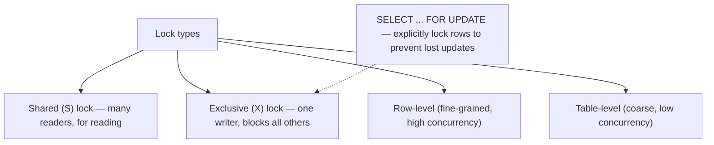

> [!IMPORTANT]
> **Locking** is how databases enforce isolation pessimistically — assume conflict, block until safe. **Shared (read) locks** allow concurrent readers; **exclusive (write) locks** allow one writer and block everyone. Locks are acquired at different **granularities** (row-level = high concurrency but more overhead; table-level = coarse). A key senior tool is **`SELECT ... FOR UPDATE`** — explicitly locking rows you're about to modify to prevent **lost updates**: read the account balance `FOR UPDATE`, and concurrent transactions block until you commit, so no one overwrites your change (this implements **pessimistic locking**, [[08 JPA vs Hibernate]]). The danger of locking is **deadlock** — transaction A holds a lock B wants while B holds one A wants (the same Coffman cycle as [[04 Java Concurrency and JVM]]); databases *detect* deadlocks and abort one transaction (the "victim"). Prevent deadlocks by **acquiring locks in a consistent order**. Excessive/coarse locking kills throughput — the reason MVCC (§3.4) exists.

### 3.4 MVCC — Multi-Version Concurrency Control

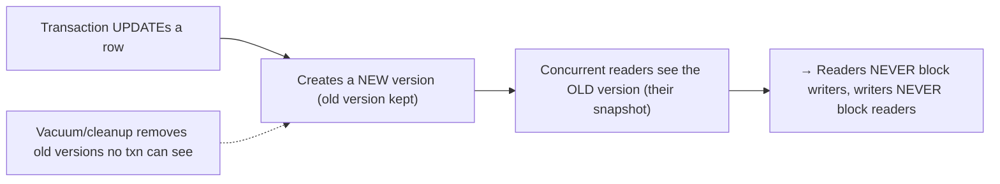

> [!IMPORTANT]
> **MVCC** is the elegant technique behind modern databases ([[02 Postgres]], MySQL/InnoDB, Oracle) that makes concurrency fast: instead of locking on reads, the database keeps **multiple versions** of each row. When a transaction updates a row, it creates a *new version*; transactions that started earlier still see the *old version* (their consistent **snapshot**). The huge win: **readers never block writers, and writers never block readers** — a read gets a consistent point-in-time view without waiting for or blocking anyone. Each transaction sees a snapshot as of its start (or statement, depending on level), implemented via per-row transaction IDs (`xmin`/`xmax` in [[02 Postgres]]) and visibility rules. This is *how* [[02 Postgres]] provides snapshot isolation (its REPEATABLE READ) cheaply. The cost: old row versions accumulate and must be cleaned up (**VACUUM** in Postgres, purge in InnoDB) — neglect it and you get **table bloat**. MVCC vs pure locking is a favorite senior interview contrast: MVCC gives non-blocking reads at the cost of version storage + cleanup.

### 3.5 Optimistic vs Pessimistic Concurrency

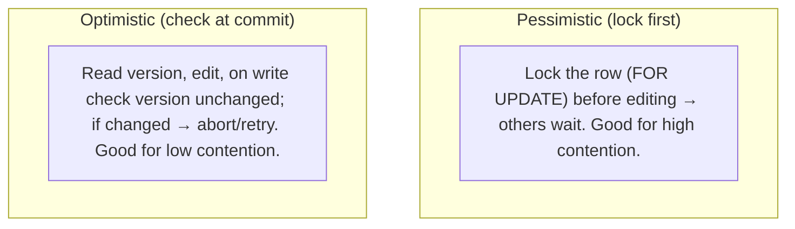

> [!TIP]
> Two strategies for handling concurrent updates. **Pessimistic**: lock the data before modifying (`SELECT FOR UPDATE`) — others block until you finish. Best when conflicts are *likely* (high contention) — you avoid wasted work, but reduce concurrency and risk deadlocks. **Optimistic**: don't lock; instead track a **version number** (or timestamp) on the row — read it, do your work, and at write time verify the version *hasn't changed*; if it has, someone else edited it first, so you **abort and retry**. Best when conflicts are *rare* (low contention) — no locking overhead, high concurrency, but wasted work on the occasional conflict. This is exactly [[08 JPA vs Hibernate]]'s `@Version` optimistic locking, and it's the same optimistic-concurrency principle as CAS in [[04 Java Concurrency and JVM]] and version vectors in [[06 Distributed Systems]] — a beautiful cross-domain pattern. Choose based on your conflict rate.

### 3.6 Failure Scenarios & SQL Pitfalls

| Pitfall | Cause | Fix |
|---|---|---|
| **Lost update** | Read-modify-write race | `SELECT FOR UPDATE` or optimistic `@Version` |
| **N+1 queries** | ORM loads relations in a loop | Eager fetch / JOIN / batch ([[08 JPA vs Hibernate]]) |
| **Full table scan** | Missing/unusable index | Add index; avoid functions on indexed cols |
| **Deadlock** | Inconsistent lock ordering | Consistent order; keep txns short |
| **Long-held locks** | Big/slow transactions | Short transactions; do work outside the txn |
| **Index not used** | Function on column, type mismatch, stale stats | Fix predicate; `ANALYZE`; expression index |
| **Table bloat** | MVCC dead tuples not vacuumed | Autovacuum tuning ([[02 Postgres]]) |
| **Wrong isolation** | Too weak (bugs) or too strong (contention) | Match level to correctness need |

> [!WARNING]
> The **N+1 query problem** is the most common real-world database performance killer, and it hides behind ORMs ([[08 JPA vs Hibernate]], [[09 Java Hibernate]]). You load 100 users (1 query), then loop and access each user's orders — triggering *100 more queries* (N+1 = 101 total) instead of 1 join or 1 batched query. It's invisible in code (looks like simple property access) but devastating under load. Fixes: eager fetching, explicit joins, or batch loading. The broader lesson: **ORMs abstract SQL but you must still understand the SQL they generate** — turn on query logging and *look*. Equally important: **keep transactions short** — a transaction holding locks while doing slow work (network calls, heavy computation) blocks others and invites deadlocks; do the slow work *outside* the transaction, and only hold locks for the minimal critical section (the same principle as [[04 Java Concurrency and JVM]] minimal critical sections).

---

## 4. 🏗️ REAL-WORLD SYSTEM DESIGN USAGE

### 4.1 Scaling reads and writes

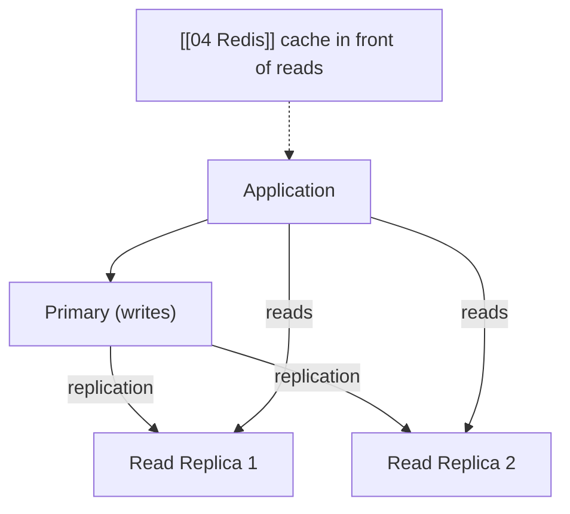

> [!IMPORTANT]
> When a single database can't keep up, the standard scaling path: **caching** ([[04 Redis]] in front to absorb read load), **read replicas** (the primary handles writes and streams changes to replicas that serve reads — great since most workloads are read-heavy, but replicas are **eventually consistent**, so a read right after a write might be stale — the replication lag problem, [[06 Distributed Systems]]), **connection pooling** (databases handle limited connections; a pool reuses them — [[08 JPA vs Hibernate]]), and eventually **partitioning/sharding** (splitting data across multiple databases by a key — powerful but sacrifices cross-shard transactions and joins). Note the tension with ACID: replicas and sharding introduce the *distributed* consistency problems ([[06 Distributed Systems]] CAP theorem) that a single ACID database elegantly avoids — which is exactly why you scale vertically and add replicas *before* sharding. This is the database chapter of [[01 System Design Fundamentals]].

### 4.2 Normalize vs Denormalize

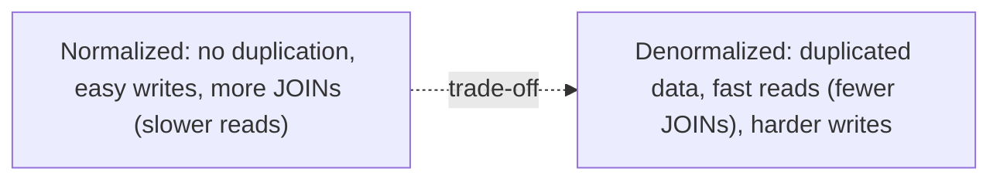

> [!TIP]
> A core design decision: **normalize for write integrity, denormalize for read speed.** Normalized schemas (3NF) store each fact once — safe writes, no update anomalies — but require joins to reassemble data, which can be slow at scale. **Denormalization** deliberately duplicates data (e.g., storing a `customer_name` on the order, or a precomputed `order_count` on the user) to avoid joins on hot read paths — trading write complexity (now you must keep copies in sync) for read performance. The pragmatic approach: **normalize by default, denormalize surgically** where profiling shows a read bottleneck, and use materialized views or maintained aggregate columns. This mirrors the CQRS read-model idea in [[05 Event-Driven Architecture]] — separate the optimized-for-reads representation from the source of truth.

### 4.3 Where transactions fit in a microservices world

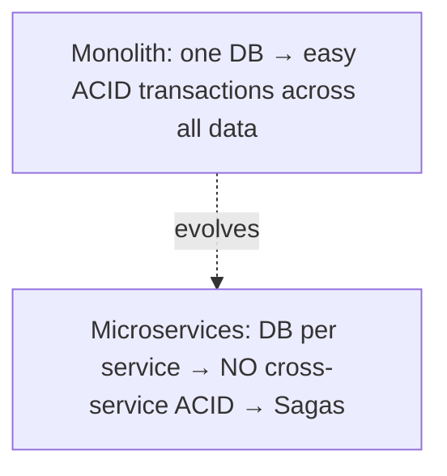

> [!IMPORTANT]
> ACID transactions are a *single-database* superpower — and one of the strongest arguments for keeping related data in one database. In a **monolith** with one database, you get atomic transactions across all your data for free. In a **[[03 Microservices]]** architecture where each service owns its database, **you lose cross-service ACID transactions** — you can't `BEGIN`/`COMMIT` across service boundaries. This is why distributed systems reach for the **Saga pattern** (compensating transactions, [[05 Event-Driven Architecture]]) and eventual consistency ([[06 Distributed Systems]]) — trading the simplicity of ACID for service autonomy. The senior insight: *don't split data across services casually* — if two pieces of data must change atomically together, that's a strong signal they belong in the *same* service/database. Understanding transactions deeply is what tells you where those boundaries should be.

---

## 5. 🎤 INTERVIEW PREPARATION

### 5.1 Most important questions

<details>
<summary><b>Q1: Explain ACID.</b></summary>

**Atomicity** — a transaction is all-or-nothing; failure rolls back everything (via an undo log). **Consistency** — the DB moves from one valid state to another, preserving constraints/invariants. **Isolation** — concurrent transactions don't interfere; ideally each behaves as if run alone (tuned by isolation levels via locking/MVCC). **Durability** — once committed, data survives crashes (via the write-ahead log flushed to disk). Isolation is the hardest to provide and where concurrency complexity lives; Consistency is largely a consequence of the other three plus your constraints.
</details>

<details>
<summary><b>Q2: What are the isolation levels and what anomalies do they prevent?</b></summary>

From weakest to strongest: **READ UNCOMMITTED** (allows dirty reads), **READ COMMITTED** (prevents dirty reads; Postgres default), **REPEATABLE READ** (also prevents non-repeatable reads; MySQL default — and in Postgres also prevents phantoms via snapshot isolation), **SERIALIZABLE** (prevents all anomalies — dirty, non-repeatable, phantom — behaves as if serial). Anomalies: dirty read (read uncommitted data), non-repeatable read (row changes between reads), phantom read (result set changes), lost update. Stronger isolation = more correctness, less concurrency. Pick the weakest level that's still correct.
</details>

<details>
<summary><b>Q3: What is an index and how does it work? Downsides?</b></summary>

An index is a separate sorted data structure (usually a B-tree) that lets the DB find rows in O(log n) instead of scanning all rows (O(n)). It also speeds range queries and sorting. Downsides: it slows writes (each INSERT/UPDATE maintains the index) and uses storage. Index columns used in WHERE/JOIN/ORDER BY. Know composite indexes (leftmost-prefix rule), covering indexes (index-only scans), and that functions on a column (`lower(email)`) or low cardinality can prevent index use.
</details>

<details>
<summary><b>Q4: Locking vs MVCC?</b></summary>

**Locking** (pessimistic) blocks conflicting access — readers can block writers and vice versa, hurting concurrency. **MVCC** keeps multiple row versions: writers create new versions while readers see their consistent snapshot of old versions — so **readers never block writers and writers never block readers**, giving much higher concurrency. Modern DBs (Postgres, InnoDB) use MVCC for reads and locks for write conflicts. MVCC's cost is storing old versions and cleaning them up (VACUUM).
</details>

<details>
<summary><b>Q5: What is a lost update and how do you prevent it?</b></summary>

Two transactions read the same value, both modify it, and the second write overwrites the first — the first update is silently lost (e.g., two admins editing inventory). Prevent it with **pessimistic locking** (`SELECT ... FOR UPDATE` locks the row so the second waits) or **optimistic locking** (a version column checked at write time — if it changed, abort and retry, like JPA's @Version). Choose based on contention: pessimistic for high, optimistic for low.
</details>

<details>
<summary><b>Q6: What is the N+1 query problem?</b></summary>

Loading a list (1 query), then triggering a separate query for each item's related data (N queries) = N+1 total. Common with ORMs where accessing a lazy relation in a loop silently fires queries. It's a major performance killer under load. Fix with eager fetching, a JOIN, or batch/IN loading. Lesson: understand the SQL your ORM generates — turn on query logging.
</details>

<details>
<summary><b>Q7: How do you diagnose a slow query?</b></summary>

Use **EXPLAIN ANALYZE** to see the execution plan and actual timings. Look for full table scans (Seq Scan) where an index should be used, expensive nested loops on large inputs, and big gaps between estimated vs actual rows (stale statistics — run ANALYZE). Check for missing indexes, functions on indexed columns disabling the index, and N+1 patterns. Then add/fix indexes, rewrite the predicate, or restructure the query, and re-measure.
</details>

<details>
<summary><b>Q8: Optimistic vs pessimistic locking — when each?</b></summary>

**Pessimistic** (lock before editing, `FOR UPDATE`): use when conflicts are likely (high contention) — avoids wasted work but reduces concurrency and risks deadlock. **Optimistic** (version-check at commit, retry on conflict): use when conflicts are rare (low contention) — no locking overhead and high concurrency, at the cost of occasional retries. It's the same trade-off as CAS/optimistic concurrency elsewhere.
</details>

### 5.2 Tricky questions

> [!TIP]
> **"Does an index always make queries faster?"** — No. Indexes speed *reads* but slow *writes* and use storage. On small tables a scan is fine. Low-cardinality columns (booleans) barely help. And an index is useless if the query can't use it (function on the column, leading wildcard `LIKE '%x'`, type mismatch). Over-indexing hurts write-heavy workloads.

> [!TIP]
> **"Is SERIALIZABLE always the right choice for correctness?"** — It's the *safest* but costs the most (contention, aborts/retries under load). The engineering skill is choosing the *weakest* isolation level that's still correct for the operation — most reads are fine at READ COMMITTED. Reserve SERIALIZABLE for operations that genuinely need it.

> [!TIP]
> **"Where does the C in ACID actually come from?"** — Consistency is largely *not* a separate mechanism — it emerges from Atomicity + Isolation + Durability plus the constraints/invariants you define (FKs, CHECKs) and your application logic. The database enforces declared constraints; it can't know your business rules unless you encode them.

> [!TIP]
> **"Why can two concurrent signups both create a duplicate email even with an app-level check?"** — Race condition: both transactions run the "does this email exist?" SELECT (both see none), then both INSERT. The app check doesn't hold a lock across the gap. The reliable fix is a **UNIQUE constraint** in the database, which atomically rejects the second insert. Let the DB enforce it.

### 5.3 Common mistakes candidates make

| Mistake | Reality |
|---|---|
| "Indexes always help" | They slow writes; must be usable by the query |
| Ignoring isolation levels | They govern correctness under concurrency |
| App-level uniqueness check | Races; use a DB UNIQUE constraint |
| Not knowing N+1 | The top ORM performance killer |
| "Denormalize everything for speed" | Creates update anomalies; normalize first |
| Long transactions | Hold locks, block others, cause deadlocks |
| Confusing the C in ACID | It's mostly a consequence + constraints |
| Guessing at slow queries | Use EXPLAIN ANALYZE to diagnose |

### 5.4 What interviewers actually expect

- **ACID** explained precisely, with Isolation as the deep part.
- **Isolation levels** + the **anomalies** each prevents; know your DB's default.
- **Indexing** (B-trees, composite/covering, when NOT to index) and **EXPLAIN**.
- **Locking vs MVCC**; **optimistic vs pessimistic**; **lost update** prevention.
- **N+1** and ORM-generated SQL awareness ([[08 JPA vs Hibernate]]).
- **Normalization** and when to denormalize.
- How transactions constrain [[03 Microservices]] boundaries ([[06 Distributed Systems]]).

---

## 6. 🛠️ HANDS-ON PROJECTS

### Project 1: Indexing & EXPLAIN Lab (Beginner→Intermediate)

**Goal:** *See* indexes transform query performance.

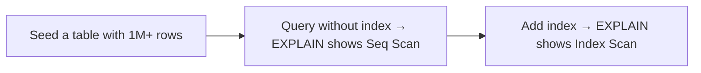

**Steps:**
1. Create a table, seed **1M+ rows** ([[02 Postgres]] `generate_series`).
2. Run `EXPLAIN ANALYZE` on a `WHERE` query — observe the **Seq Scan** and time.
3. Add an index; re-run — observe **Index Scan** and the dramatic speedup.
4. Experiment: **composite index** + leftmost-prefix rule; a query with `lower(col)` (index *not* used) then an **expression index** that fixes it.
5. Add a **covering index** and see an **index-only scan**.

**Learn:** indexes, B-trees, EXPLAIN, composite/covering indexes, why indexes get skipped.

---

### Project 2: Reproduce Concurrency Anomalies (Intermediate→Senior)

**Goal:** *Cause* and *fix* real isolation bugs with two sessions.

```mermaid
flowchart LR
    S1["Session A"] --> Anomaly["Dirty/non-repeatable/phantom read, lost update"]
    S2["Session B"] --> Anomaly
    Anomaly --> Fix["Fix via isolation level or FOR UPDATE / @Version"]
```

**Steps:**
1. Open **two DB sessions**. Reproduce a **lost update** (both read a balance, both write) and watch one vanish.
2. Fix it with `SELECT ... FOR UPDATE` (pessimistic) — see the second session block.
3. Change isolation levels and reproduce/prevent **non-repeatable** and **phantom** reads.
4. Implement **optimistic locking** with a version column; force a conflict and retry.
5. Deliberately cause a **deadlock** (two sessions, opposite lock order); watch the DB abort a victim.

**Learn:** isolation levels, anomalies, pessimistic vs optimistic locking, deadlocks — hands-on.

---

### Project 3: Diagnose & Optimize a Slow System (Senior)

**Goal:** End-to-end performance tuning.

```mermaid
flowchart TB
    Slow["Slow app (N+1, missing indexes, bad queries)"] --> Diagnose["Query logs + EXPLAIN + slow query log"]
    Diagnose --> Fix["Fix N+1, add indexes, rewrite queries, tune"]
    Fix --> Measure["Load test before/after"]
```

**Steps:**
1. Build an app ([[05 Spring Boot]]+[[08 JPA vs Hibernate]] or [[05 Node.js]]) with an intentional **N+1** problem; find it via query logging.
2. Fix N+1 with joins/batch fetching; measure the query-count drop.
3. Enable the **slow query log**; find and index the worst queries.
4. Add a **read replica** or [[04 Redis]] cache for a hot read path; measure.
5. Reproduce and fix a **connection pool exhaustion** scenario (long transactions holding connections).

**Learn:** N+1, query logging, slow-query analysis, caching/replicas, connection pooling.

---

## 7. 🔬 DEEP DIVE: INTERNALS

### 7.1 B-Tree vs LSM-Tree storage engines

```mermaid
flowchart TB
    subgraph BTree["B-Tree (Postgres, InnoDB, most SQL)"]
        BT["Update in place, read-optimized, balanced tree → great for reads + range"]
    end
    subgraph LSM["LSM-Tree (Cassandra, RocksDB, some NoSQL)"]
        L["Append writes to memory + flush sorted files, compact later → write-optimized"]
    end
```

> [!IMPORTANT]
> The choice of **storage engine** shapes a database's performance profile. **B-trees** (used by most relational DBs — [[02 Postgres]], MySQL/InnoDB) update data *in place* in a balanced, sorted tree — excellent for **reads** and **range queries**, with predictable performance. **LSM-trees (Log-Structured Merge)** (used by [[Cassandra]], RocksDB, many NoSQL) instead **buffer writes in memory** and periodically flush them as immutable sorted files, merging/compacting in the background — this makes **writes very fast** (sequential appends, no in-place updates) at some read cost (a read may check multiple files, mitigated by bloom filters). The trade-off: **B-trees favor read-heavy workloads; LSM-trees favor write-heavy workloads.** This is a deep [[01 System Design Fundamentals]] and [[06 Distributed Systems]] decision — knowing *why* Cassandra ingests writes so fast (LSM) vs why Postgres excels at complex reads (B-tree) demonstrates real database understanding. Kleppmann's *Designing Data-Intensive Applications* covers this beautifully.

### 7.2 How MVCC visibility actually works

```mermaid
flowchart LR
    Row["Each row version has: xmin (creating txn), xmax (deleting/updating txn)"] --> Snapshot["Transaction has a snapshot: which txn IDs were committed at its start"]
    Snapshot --> Visible["Version visible if: xmin committed & visible, and xmax not yet committed/visible"]
    Visible --> Consistent["→ Each txn sees a consistent point-in-time view"]
```

> [!TIP]
> [[02 Postgres]]'s MVCC works via hidden per-row system columns: **`xmin`** (the transaction ID that *created* this row version) and **`xmax`** (the transaction that *deleted or superseded* it). Each transaction operates against a **snapshot** — essentially the set of transaction IDs that had committed when it began. A row version is **visible** to a transaction if its `xmin` is committed-and-in-the-snapshot *and* its `xmax` is not (i.e., not yet deleted from this transaction's viewpoint). An UPDATE doesn't overwrite — it marks the old version's `xmax` and inserts a new version with a fresh `xmin`. This is why readers see a consistent old snapshot while a writer creates new versions — no blocking. The dead versions (no longer visible to *any* transaction) are reclaimed by **VACUUM**. This concrete mechanism (transaction IDs + visibility rules) is *how* the abstract "snapshot isolation" is actually implemented — and understanding it explains table bloat, VACUUM, and transaction-ID wraparound.

### 7.3 The Write-Ahead Log (WAL) — how durability & atomicity work

```mermaid
flowchart LR
    Change["Transaction change"] --> WAL["1. Write to WAL (sequential, fast) + fsync"]
    WAL --> Ack["2. COMMIT acknowledged (durable now!)"]
    Ack --> Later["3. Data pages updated in memory, flushed to disk later"]
    Crash["Crash? → replay WAL to recover committed changes"] -.-> WAL
```

> [!IMPORTANT]
> The **Write-Ahead Log (WAL)** is the mechanism behind both **Durability** and **Atomicity** — and it's brilliant. The rule: **before any change is applied to the data files, it's first written to a sequential log and flushed to disk (`fsync`).** On COMMIT, the database only needs the WAL record safely on disk to acknowledge durability — the actual data pages can be updated in memory and written to their final locations *lazily* later. Why this is fast: WAL writes are **sequential** (append-only — fast even on spinning disks) versus random data-page writes. Why it's correct: after a **crash**, the database **replays the WAL** to reconstruct all committed changes (redo) and roll back uncommitted ones (undo) — so a committed transaction is never lost and a partial transaction never persists. The WAL is *also* the foundation of **replication** (stream the WAL to replicas — [[02 Postgres]] streaming replication, [[06 Distributed Systems]]) and **point-in-time recovery**. This "log first, apply later" pattern is the same **log as source of truth** idea central to [[01 Kafka]] and [[05 Event-Driven Architecture]]'s CDC — the log is one of computing's most powerful primitives.

### 7.4 Deadlock detection & the wait-for graph

```mermaid
flowchart LR
    A["Txn A holds lock 1, wants lock 2"] --> B["Txn B holds lock 2, wants lock 1"]
    B --> A
    Cycle["DB builds a wait-for graph → detects the cycle → aborts a 'victim' txn"] -.-> A
```

> [!TIP]
> Databases handle **deadlocks** automatically via a **wait-for graph**: nodes are transactions, and an edge A→B means "A is waiting for a lock B holds." Periodically (or on lock timeout), the database checks this graph for a **cycle** — a cycle means a deadlock (each transaction waits on another in a loop, forever). The database breaks it by choosing a **victim** transaction (often the one with the least work done or fewest locks) and **aborting** it, releasing its locks so others proceed; the victim gets a "deadlock detected" error and should **retry**. This is the same cyclic-wait problem as [[04 Java Concurrency and JVM]] deadlocks — but the database *detects and resolves* it automatically (whereas application-thread deadlocks just hang). Your job as a developer: **minimize deadlock probability** (acquire locks in a consistent order, keep transactions short and small) and **handle the deadlock-victim error** by retrying. Well-designed apps treat deadlock aborts as a normal, retryable event, not a crash.

### 7.5 Query Optimizer Internals — cost-based planning

```mermaid
flowchart TB
    Query["Parsed query"] --> Plans["Generate candidate plans (join orders, scan methods, join algorithms)"]
    Plans --> Cost["Estimate each plan's COST using statistics (row counts, distributions, index selectivity)"]
    Cost --> Pick["Pick the lowest-cost plan"]
    Stats["ANALYZE keeps statistics fresh → good estimates → good plans"] -.-> Cost
```

> [!IMPORTANT]
> The **cost-based optimizer** is why SQL can be declarative. For a query with multiple joins and available indexes, there are *many* possible execution strategies (which table to scan first, which join algorithm — nested loop vs hash vs merge, which index). The optimizer **enumerates candidate plans** and estimates each one's **cost** (roughly, expected I/O + CPU) using **table statistics** — row counts, column value distributions (histograms), and index **selectivity** (how many rows a predicate will match) — then picks the cheapest. The critical dependency: **statistics must be accurate**. If they're stale (e.g., after a bulk load), the optimizer mis-estimates (thinks a table has 1000 rows when it has 10M) and picks a terrible plan (a nested loop that should've been a hash join) — the #1 cause of "the query was fast yesterday, slow today." This is why `ANALYZE` (refreshing stats) and autovacuum matter. It also explains why **query hints, forcing indexes, and rewriting predicates** work — they change the optimizer's inputs. Understanding the optimizer turns query tuning from guesswork into engineering — the deepest SQL performance skill.

---

## ✅ Production Checklists

### Correctness
- [ ] Multi-step modifications wrapped in **transactions**
- [ ] Appropriate **isolation level** per operation (weakest that's correct)
- [ ] **Lost updates** prevented (`FOR UPDATE` or optimistic `@Version`)
- [ ] **UNIQUE/FK/CHECK constraints** enforce integrity in the DB
- [ ] Transactions kept **short**; no slow work (network/IO) inside them
- [ ] Deadlock-victim errors **retried**

### Performance
- [ ] Indexes on **WHERE/JOIN/ORDER BY** columns (not over-indexed)
- [ ] Slow queries diagnosed with **EXPLAIN ANALYZE**
- [ ] **N+1** eliminated (joins/batch fetch — [[08 JPA vs Hibernate]])
- [ ] Statistics fresh (**ANALYZE**/autovacuum); no table bloat
- [ ] Predicates index-friendly (no needless functions on columns)
- [ ] **Connection pooling** configured

### Scale
- [ ] **Caching** ([[04 Redis]]) for hot reads
- [ ] **Read replicas** for read scaling (mind replication lag)
- [ ] Denormalize surgically where profiled
- [ ] Partitioning/sharding only when needed (loses cross-shard ACID)
- [ ] Backups + **point-in-time recovery** (WAL archiving) tested

---

## 🗺️ Learning Roadmap

```mermaid
flowchart TB
    A["1️⃣ SQL basics<br/>tables, keys, queries, joins"] --> B["2️⃣ Transactions & ACID<br/>BEGIN/COMMIT/ROLLBACK"]
    B --> C["3️⃣ Isolation<br/>anomalies, isolation levels"]
    C --> D["4️⃣ Concurrency control<br/>locking, MVCC, optimistic/pessimistic"]
    D --> E["5️⃣ Indexing<br/>B-trees, composite/covering"]
    E --> F["6️⃣ Query optimization<br/>EXPLAIN, plans, N+1"]
    F --> G["7️⃣ Internals<br/>WAL, MVCC visibility, deadlock detection, optimizer"]
    G --> H["8️⃣ Scale<br/>replicas, sharding, denormalization, storage engines"]
```

| Stage | Focus | You can... |
|---|---|---|
| 1–2 | SQL + transactions | Write correct transactional SQL |
| 3–4 | Concurrency | Prevent anomalies & lost updates |
| 5–6 | Performance | Index and optimize queries |
| 7–8 | Internals + scale | Reason deeply and architect at scale |

---

## 🔁 Self-Review Completion Loop

Reviewed against *Designing Data-Intensive Applications* (Kleppmann), the PostgreSQL/MySQL docs, and Use The Index, Luke (Markus Winand).

### Gap Review Matrix

| Dimension | Covered? | Where |
|---|---|---|
| Relational model / keys | ✅ | §1 |
| SQL categories + query order | ✅ | §1 |
| Transactions (BEGIN/COMMIT) | ✅ | §1 |
| ACID | ✅ | §2.1 |
| Concurrency anomalies | ✅ | §2.2 |
| Isolation levels | ✅ | §2.3 |
| Joins | ✅ | §2.4 |
| Normalization | ✅ | §2.5 |
| Constraints / referential integrity | ✅ | §2.6 |
| Indexing / B-trees | ✅ | §3.1, §7.1 |
| Query plans / EXPLAIN | ✅ | §3.2, §7.5 |
| Locking | ✅ | §3.3 |
| MVCC | ✅ | §3.4, §7.2 |
| Optimistic vs pessimistic | ✅ | §3.5 |
| SQL pitfalls (N+1, etc.) | ✅ | §3.6 |
| Scaling (replicas/sharding) | ✅ | §4.1 |
| Normalize vs denormalize | ✅ | §4.2 |
| Transactions in microservices | ✅ | §4.3 |
| B-tree vs LSM | ✅ | §7.1 |
| WAL / durability | ✅ | §7.3 |
| Deadlock detection | ✅ | §7.4 |
| Optimizer internals | ✅ | §7.5 |
| Interview Q&A + mistakes | ✅ | §5 |
| Hands-on projects | ✅ | §6 |

> [!NOTE]
> **Remaining depth to explore independently:** window functions & CTEs (recursive), advanced indexing (partial, GiST/GIN/BRIN, full-text — [[02 Postgres]]), partitioning strategies, materialized views, the SERIALIZABLE implementation (SSI — Serializable Snapshot Isolation), transaction-ID wraparound, query hints & plan pinning, columnar storage (OLAP vs OLTP), distributed SQL (CockroachDB/Spanner and how they do distributed ACID — [[06 Distributed Systems]]), connection pooling internals (PgBouncer), and NewSQL vs NoSQL trade-offs ([[03 MongoDB]]).

---

## 📚 Official References

| Resource | Source |
|---|---|
| *Designing Data-Intensive Applications* — Kleppmann | Ch. 7 (Transactions), Ch. 3 (Storage) |
| Use The Index, Luke — Markus Winand | https://use-the-index-luke.com/ |
| PostgreSQL docs — MVCC & Transactions | https://www.postgresql.org/docs/current/mvcc.html |
| PostgreSQL docs — EXPLAIN / indexes | https://www.postgresql.org/docs/current/using-explain.html |
| MySQL docs — InnoDB locking & isolation | https://dev.mysql.com/doc/refman/8.0/en/innodb-locking.html |
| "A Critique of ANSI SQL Isolation Levels" (Berenson et al.) | Classic isolation paper |
| Jepsen (isolation/consistency analyses) | https://jepsen.io/ |

---

## 🎁 Final Summary

> [!IMPORTANT]
> **The one-paragraph takeaway:** A relational database's job is to keep data **correct** and **fast**. Correctness comes from **transactions** — all-or-nothing units guaranteed by **ACID**: **Atomicity** (rollback on failure via an undo log), **Consistency** (constraints preserved), **Isolation** (concurrent transactions don't corrupt each other), and **Durability** (committed data survives crashes via the **write-ahead log**, which is *also* the basis of replication and recovery). **Isolation** is the deep part: without it you get **anomalies** — dirty reads (reading uncommitted data), non-repeatable reads (a row changes mid-transaction), phantom reads (a result set changes), and lost updates (one write silently overwrites another) — and **isolation levels** (READ UNCOMMITTED → READ COMMITTED → REPEATABLE READ → SERIALIZABLE) each prevent progressively more, trading concurrency for correctness (know your DB's default — READ COMMITTED in Postgres, REPEATABLE READ in MySQL — and pick the *weakest level that's still correct*). Modern databases implement isolation cheaply with **MVCC** (multiple row versions so readers never block writers and vice versa, via per-row transaction IDs and visibility rules) rather than pure locking, though writes still use locks — and you prevent **lost updates** with **pessimistic** (`SELECT FOR UPDATE`) or **optimistic** (version-check, retry — like JPA's `@Version`) concurrency control depending on contention. **Performance** comes from **indexes** — usually **B-trees** giving O(log n) lookups and range scans (index WHERE/JOIN/ORDER BY columns, mind composite leftmost-prefix and covering indexes, and that indexes slow writes) — and from understanding the **cost-based optimizer**, which chooses execution plans from **statistics**; diagnose slow queries with **EXPLAIN ANALYZE**, watch for Seq Scans and the ORM **N+1 problem**, and keep statistics fresh. **Normalize** for write integrity (3NF, no update anomalies) and **denormalize** surgically for read speed; let the **database enforce constraints** (a UNIQUE constraint beats a racy app-level check). Finally, ACID is a *single-database* superpower — [[03 Microservices]] that split data lose cross-service transactions and must fall back to Sagas/eventual consistency ([[05 Event-Driven Architecture]], [[06 Distributed Systems]]) — so understanding transactions deeply tells you where service and data boundaries *should* be. It all rests on the humble, powerful **log**.

**Golden rules:**
1. 🔒 Wrap multi-step changes in **transactions**; know **ACID** (Isolation is the hard part).
2. 🎚️ Understand the **anomalies** and pick the **weakest isolation level that's still correct**.
3. 🔄 **MVCC** = non-blocking reads (versions + snapshots); locking handles write conflicts.
4. ⚔️ Prevent **lost updates** with `FOR UPDATE` (pessimistic) or `@Version` (optimistic).
5. 🌳 **Index** WHERE/JOIN/ORDER BY (B-trees, O(log n)) — but indexes slow writes.
6. 🔎 Diagnose with **EXPLAIN ANALYZE**; kill the **N+1** problem; keep stats fresh.
7. 🧱 **Normalize** for integrity; **denormalize** surgically for read speed.
8. 🛡️ Let the **database enforce constraints** (UNIQUE/FK/CHECK) — don't race in app code.
9. ⏱️ Keep transactions **short**; retry **deadlock victims**; consistent lock order.
10. 🌐 ACID is single-DB — splitting data across [[03 Microservices]] means Sagas & eventual consistency.

---

*Related guides in this vault: [[02 Postgres]] · [[08 JPA vs Hibernate]] · [[09 Java Hibernate]] · [[06 Distributed Systems]] · [[05 Event-Driven Architecture]] · [[04 Redis]] · [[01 System Design Fundamentals]] · [[03 MongoDB]] · [[04 Java Concurrency and JVM]]*
