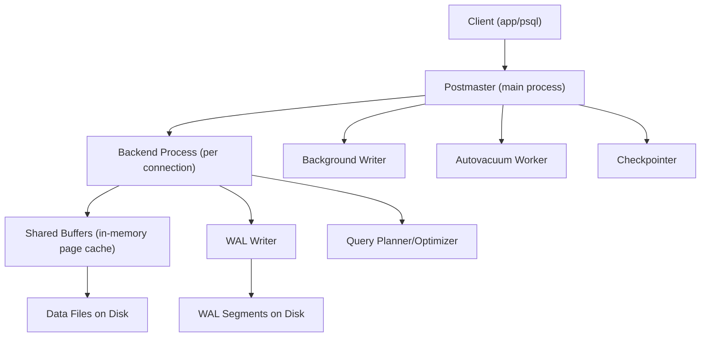
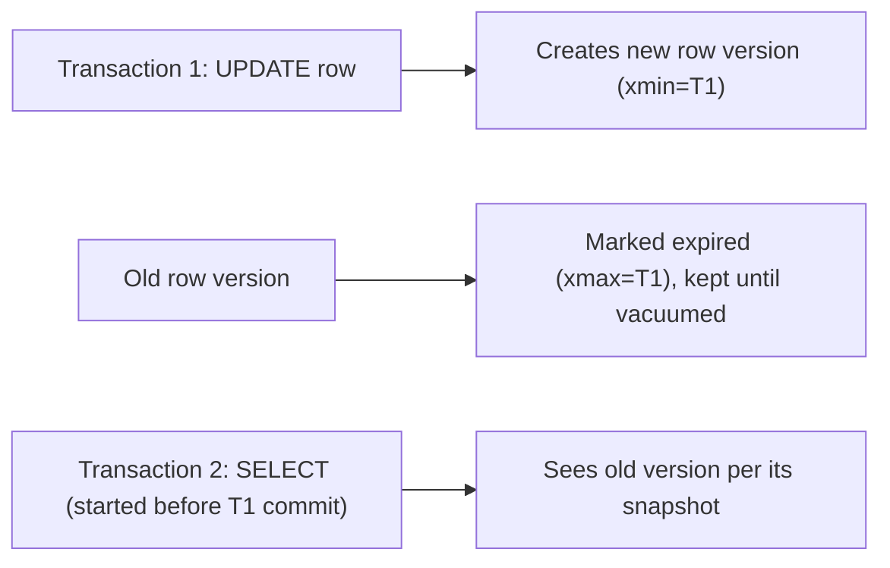
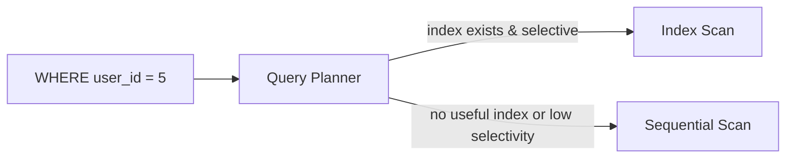
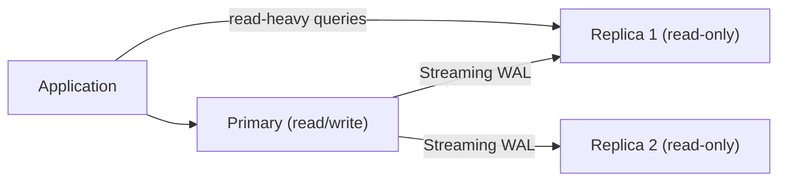
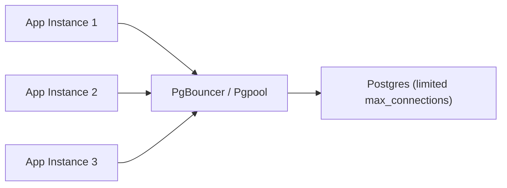
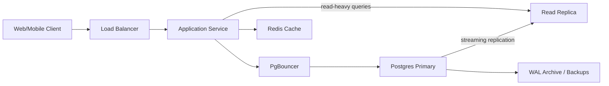
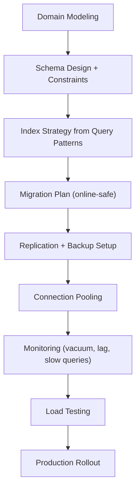
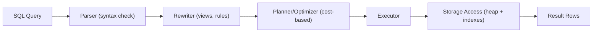

# PostgreSQL: Beginner-to-Expert Engineering Guide

> **Scope:** This guide teaches PostgreSQL from first principles through production backend/system-engineering usage. It covers the relational engine, SQL, indexing, transactions/MVCC, replication, and how PostgreSQL is used in real production systems.

## Table of Contents

1. [Executive Summary](#executive-summary)
2. [1. Fundamentals](#1-fundamentals-beginner-level)
3. [2. Core Concepts](#2-core-concepts-intermediate-level)
4. [3. Advanced Concepts](#3-advanced-concepts-senior-level)
5. [4. Real-World System Design Usage](#4-real-world-system-design-usage)
6. [5. Interview Preparation](#5-interview-preparation)
7. [6. Hands-On Thinking](#6-hands-on-thinking)
8. [7. Deep Dive](#7-deep-dive-optional-but-important)
9. [Production Checklists](#production-checklists)
10. [Learning Roadmap](#learning-roadmap)
11. [Self-Review Completion Loop](#self-review-completion-loop)
12. [Official References](#official-references)

---

## Executive Summary

PostgreSQL ("Postgres") is an open-source, object-relational database management system (RDBMS) known for standards compliance, extensibility, strong correctness guarantees (ACID transactions via MVCC), and a rich feature set (JSONB, full-text search, window functions, extensions like PostGIS).

The core idea:

```text
Client (application / psql / driver)
        |
        v
Postgres Backend Process (one process per connection)
        |
        v
Query Parser -> Planner/Optimizer -> Executor
        |
        v
Storage Engine (MVCC, heap pages, indexes, WAL)
        |
        v
Disk (data files, WAL segments)
```

> [!TIP]
> Learn Postgres as three connected layers: **SQL** (what you write), the **query planner** (how it decides to execute your SQL), and **MVCC/storage** (how it guarantees correctness and concurrency underneath). Senior engineers reason about all three when something is slow or behaves unexpectedly.

---

# 1. Fundamentals (Beginner Level)

## 1.1 What Is PostgreSQL?

PostgreSQL is a relational database: data is organized into tables with rows and typed columns, and you use SQL to create, read, update, and delete that data.

```sql
CREATE TABLE users (
    id BIGSERIAL PRIMARY KEY,
    name TEXT NOT NULL,
    email TEXT UNIQUE NOT NULL,
    created_at TIMESTAMPTZ NOT NULL DEFAULT now()
);

INSERT INTO users (name, email) VALUES ('Asha', 'asha@example.com');

SELECT * FROM users WHERE email = 'asha@example.com';
```

## 1.2 Why PostgreSQL Exists

| Problem | Postgres's Answer |
|---|---|
| Need reliable, consistent data storage | ACID transactions |
| Concurrent readers/writers corrupting data | MVCC (Multi-Version Concurrency Control) |
| Rigid schemas for semi-structured data | Native `JSON`/`JSONB` types |
| Need complex queries across related data | Full SQL support, joins, subqueries, window functions |
| Vendor lock-in with proprietary databases | Open-source, standards-compliant, extensible |
| Need custom data types/behavior | Extension system (PostGIS, pg_trgm, etc.) |
| Need to scale reads | Streaming replication, read replicas |

## 1.3 Problems PostgreSQL Solves

Postgres is especially good when you need:

- Strong consistency and correctness guarantees (financial data, inventory, bookings).
- Complex relational queries (joins, aggregations, reporting).
- A mix of structured and semi-structured data (relational columns + JSONB).
- Rich indexing (B-tree, GIN, GiST, BRIN) for varied query patterns.
- Extensibility (custom types, functions, extensions like PostGIS for geospatial).

Postgres is less ideal (by itself) when you need:

- Massive horizontal write scaling out of the box (native sharding is limited; needs extensions like Citus or application-level sharding).
- Simple key-value access at extreme scale with minimal latency (a dedicated KV store may fit better).
- Multi-region active-active writes without careful architecture.

## 1.4 Real-World Analogy

Think of Postgres like a very well-organized library with a strict librarian.

Every book (row) has a catalog card (index) so it can be found quickly. The librarian (query planner) decides the fastest way to find what you're looking for — checking the card catalog (index) versus walking every shelf (sequential scan). Multiple people can browse at once without interfering with each other, because the librarian keeps track of who's looking at which version of a shelf (MVCC) while changes are being made.

```text
Rows          = books
Indexes       = card catalog
Query planner = librarian deciding search strategy
MVCC          = the system that lets many people read while one person updates, without conflicts
```

## 1.5 Core Vocabulary

| Term | Meaning |
|---|---|
| Table | A collection of rows with a defined schema |
| Row/Tuple | A single record in a table |
| Column | A typed field in a table |
| Primary Key | Uniquely identifies each row |
| Foreign Key | Enforces referential integrity between tables |
| Index | Auxiliary structure for fast lookups |
| Schema | A namespace grouping tables/objects within a database |
| Transaction | A unit of work with ACID guarantees |
| WAL | Write-Ahead Log: durability and replication mechanism |
| MVCC | Multi-Version Concurrency Control |
| `psql` | Postgres's interactive command-line client |
| Extension | Pluggable add-on functionality (e.g., `pg_trgm`, `postgis`) |

## 1.6 Basic Data Types

```sql
CREATE TABLE products (
    id BIGSERIAL PRIMARY KEY,
    name TEXT NOT NULL,
    price NUMERIC(10, 2) NOT NULL,
    in_stock BOOLEAN NOT NULL DEFAULT true,
    tags TEXT[],
    metadata JSONB,
    created_at TIMESTAMPTZ NOT NULL DEFAULT now()
);
```

| Type | Use |
|---|---|
| `INTEGER` / `BIGINT` | Whole numbers |
| `NUMERIC(p, s)` | Exact decimal (money, precise math) |
| `REAL` / `DOUBLE PRECISION` | Approximate floating point |
| `TEXT` / `VARCHAR(n)` | Strings |
| `BOOLEAN` | True/false |
| `TIMESTAMPTZ` | Timestamp with time zone (recommended default) |
| `DATE` | Calendar date without time |
| `JSONB` | Binary JSON, indexable, queryable |
| `UUID` | Universally unique identifiers |
| `ARRAY` (e.g., `TEXT[]`) | Native array column |

> [!WARNING]
> Prefer `TIMESTAMPTZ` over plain `TIMESTAMP` for almost all application data. `TIMESTAMP` (without time zone) silently drops zone information, which causes subtle bugs across services in different time zones.

## 1.7 Basic CRUD

```sql
-- Create
INSERT INTO products (name, price, tags) VALUES ('Widget', 9.99, ARRAY['tools', 'hardware']);

-- Read
SELECT id, name, price FROM products WHERE price < 20 ORDER BY price ASC;

-- Update
UPDATE products SET price = 12.99 WHERE id = 1;

-- Delete
DELETE FROM products WHERE id = 1;
```

## 1.8 Constraints

```sql
CREATE TABLE orders (
    id BIGSERIAL PRIMARY KEY,
    user_id BIGINT NOT NULL REFERENCES users(id),
    status TEXT NOT NULL CHECK (status IN ('CREATED', 'PAID', 'SHIPPED', 'CANCELLED')),
    total NUMERIC(10, 2) NOT NULL CHECK (total >= 0)
);
```

| Constraint | Purpose |
|---|---|
| `PRIMARY KEY` | Unique row identity |
| `FOREIGN KEY` / `REFERENCES` | Enforces relationship integrity |
| `UNIQUE` | No duplicate values in a column |
| `NOT NULL` | Column must have a value |
| `CHECK` | Custom validation rule enforced by the database |

## 1.9 Basic Joins

```sql
SELECT o.id, o.status, u.name
FROM orders o
JOIN users u ON u.id = o.user_id
WHERE o.status = 'PAID';
```

| Join Type | Behavior |
|---|---|
| `INNER JOIN` | Only matching rows in both tables |
| `LEFT JOIN` | All rows from left table, matched or `NULL` |
| `RIGHT JOIN` | All rows from right table, matched or `NULL` |
| `FULL OUTER JOIN` | All rows from both, matched where possible |

---

# 2. Core Concepts (Intermediate Level)

## 2.1 Postgres Architecture Overview



Key idea: Postgres spawns a dedicated OS process per client connection (unlike thread-per-connection models). Shared memory (shared buffers) caches pages from disk; background processes (autovacuum, checkpointer, WAL writer) keep the system healthy without blocking client queries.

## 2.2 Transactions and ACID

```sql
BEGIN;

UPDATE accounts SET balance = balance - 100 WHERE id = 1;
UPDATE accounts SET balance = balance + 100 WHERE id = 2;

COMMIT;
```

| Property | Meaning |
|---|---|
| Atomicity | All statements in a transaction succeed or none do |
| Consistency | Database moves from one valid state to another |
| Isolation | Concurrent transactions don't see each other's uncommitted changes |
| Durability | Once committed, data survives crashes (via WAL) |

## 2.3 MVCC (Multi-Version Concurrency Control)

Postgres doesn't lock rows for reads. Instead, each row version carries visibility metadata (`xmin`/`xmax` transaction IDs), so readers see a consistent snapshot without blocking writers.



Practical implications:

- `UPDATE`/`DELETE` don't overwrite rows in place; they create new row versions and mark old ones as dead.
- Dead row versions accumulate as "bloat" until reclaimed by **vacuum**.
- Readers never block writers, and writers never block readers (but writers can block writers on the same row).

## 2.4 Isolation Levels

| Level | Prevents | Postgres Default |
|---|---|---|
| Read Uncommitted | Nothing (treated as Read Committed in Postgres) | No |
| Read Committed | Dirty reads | **Yes (default)** |
| Repeatable Read | Dirty reads, non-repeatable reads | No |
| Serializable | Dirty reads, non-repeatable reads, phantom reads, write skew | No |

```sql
BEGIN ISOLATION LEVEL SERIALIZABLE;
-- statements
COMMIT;
```

> [!TIP]
> Postgres's `Read Committed` default means each statement within a transaction sees a fresh snapshot, not just the start of the transaction. This differs from `Repeatable Read`/`Serializable`, where the whole transaction sees one consistent snapshot.

## 2.5 Indexes

```sql
CREATE INDEX idx_orders_user_id ON orders (user_id);
CREATE UNIQUE INDEX idx_users_email ON users (email);
CREATE INDEX idx_products_metadata ON products USING GIN (metadata);
```

| Index Type | Best For |
|---|---|
| B-tree (default) | Equality and range queries (`=`, `<`, `>`, `BETWEEN`, `ORDER BY`) |
| GIN | `JSONB`, arrays, full-text search (containment/membership queries) |
| GiST | Geospatial data (PostGIS), full-text search, nearest-neighbor |
| BRIN | Very large, naturally ordered tables (e.g., time-series by insertion order) |
| Hash | Equality-only lookups (rarely needed over B-tree today) |



## 2.6 `EXPLAIN` and Query Plans

```sql
EXPLAIN ANALYZE
SELECT * FROM orders WHERE user_id = 5;
```

```text
Index Scan using idx_orders_user_id on orders  (cost=0.29..8.31 rows=1 width=64) (actual time=0.020..0.022 rows=1 loops=1)
  Index Cond: (user_id = 5)
Planning Time: 0.085 ms
Execution Time: 0.041 ms
```

| Plan Node | Meaning |
|---|---|
| `Seq Scan` | Reads every row in the table |
| `Index Scan` | Uses an index, then fetches matching heap rows |
| `Index Only Scan` | Answers entirely from the index, no heap access needed |
| `Bitmap Heap Scan` | Combines multiple index matches efficiently for medium selectivity |
| `Nested Loop` / `Hash Join` / `Merge Join` | Different join strategies chosen by the planner |

> [!TIP]
> `EXPLAIN` shows the *estimated* plan. `EXPLAIN ANALYZE` actually runs the query and shows *real* timing/row counts — essential for diagnosing when the planner's estimates are wrong.

## 2.7 Aggregations and Window Functions

```sql
SELECT status, COUNT(*), SUM(total)
FROM orders
GROUP BY status;

SELECT
    id,
    total,
    SUM(total) OVER (PARTITION BY user_id ORDER BY created_at) AS running_total
FROM orders;
```

| Function Type | Example | Behavior |
|---|---|---|
| Aggregate | `COUNT`, `SUM`, `AVG` | Collapses groups into single rows |
| Window | `ROW_NUMBER()`, `RANK()`, `SUM() OVER (...)` | Computes per-row values using a related set of rows without collapsing |

## 2.8 JSONB

```sql
INSERT INTO products (name, price, metadata)
VALUES ('Widget', 9.99, '{"color": "blue", "sizes": ["S", "M", "L"]}');

SELECT * FROM products WHERE metadata->>'color' = 'blue';
SELECT * FROM products WHERE metadata @> '{"color": "blue"}';
```

| Operator | Meaning |
|---|---|
| `->` | Get JSON field (returns JSON) |
| `->>` | Get JSON field as text |
| `@>` | Contains (JSONB containment) |
| `?` | Key exists |
| `#>` | Get value at JSON path |

## 2.9 Common Table Expressions (CTEs)

```sql
WITH recent_orders AS (
    SELECT * FROM orders WHERE created_at > now() - INTERVAL '30 days'
)
SELECT user_id, COUNT(*) FROM recent_orders GROUP BY user_id;
```

Recursive CTE example:

```sql
WITH RECURSIVE org_chart AS (
    SELECT id, name, manager_id FROM employees WHERE manager_id IS NULL
    UNION ALL
    SELECT e.id, e.name, e.manager_id
    FROM employees e
    JOIN org_chart o ON e.manager_id = o.id
)
SELECT * FROM org_chart;
```

## 2.10 Schemas and `psql` Basics

```sql
CREATE SCHEMA billing;
CREATE TABLE billing.invoices (id BIGSERIAL PRIMARY KEY);
```

```bash
psql -U app -d appdb
\dt            -- list tables
\d orders       -- describe table
\di             -- list indexes
\l              -- list databases
```

## 2.11 Basic Backup

```bash
pg_dump -U app -d appdb -F custom -f appdb.dump
pg_restore -U app -d appdb_restored appdb.dump
```

---

# 3. Advanced Concepts (Senior Level)

## 3.1 Vacuum and Bloat

Since `UPDATE`/`DELETE` create dead row versions instead of overwriting in place, Postgres needs **vacuum** to reclaim that space.

```sql
VACUUM orders;
VACUUM ANALYZE orders;
VACUUM FULL orders; -- rewrites the table, requires exclusive lock, use rarely
```

| Vacuum Type | Effect | Locking |
|---|---|---|
| `VACUUM` | Reclaims dead tuple space for reuse, updates visibility map | Non-blocking for reads/writes |
| `VACUUM ANALYZE` | Vacuum + refresh planner statistics | Non-blocking |
| `VACUUM FULL` | Physically rewrites table, returns space to OS | Exclusive lock (blocks everything) |
| Autovacuum | Background process running vacuum automatically per table thresholds | Non-blocking, tunable |

> [!IMPORTANT]
> **Transaction ID wraparound** is a serious failure mode: Postgres uses 32-bit transaction IDs, and if autovacuum can't keep up (e.g., disabled, or a long-running transaction prevents cleanup), the database can eventually refuse writes to avoid data corruption. Monitor `age(datfrozenxid)` and never disable autovacuum globally in production.

## 3.2 Locking

| Lock Level | Example Statement | Blocks |
|---|---|---|
| `ROW SHARE` | `SELECT ... FOR UPDATE` | Conflicting row locks |
| `ROW EXCLUSIVE` | `UPDATE`, `DELETE`, `INSERT` | Other writes to same rows |
| `SHARE` | `CREATE INDEX` (non-concurrent) | Writes to the table |
| `ACCESS EXCLUSIVE` | `ALTER TABLE`, `DROP TABLE`, `VACUUM FULL` | Everything (reads and writes) |

```sql
BEGIN;
SELECT * FROM accounts WHERE id = 1 FOR UPDATE; -- row-level lock
UPDATE accounts SET balance = balance - 100 WHERE id = 1;
COMMIT;
```

> [!WARNING]
> `ALTER TABLE ... ADD COLUMN ... DEFAULT <value>` on very old Postgres versions rewrote the whole table under an `ACCESS EXCLUSIVE` lock. Modern Postgres (11+) optimizes constant defaults to be instant, but adding a column with a **volatile** default, changing a column type, or adding a `NOT NULL` constraint without a prevalidated `CHECK` can still require a full table rewrite/scan — plan these as online-safe migrations (e.g., add nullable, backfill, then constrain).

## 3.3 Deadlocks

```text
Transaction A: locks row 1, then waits for row 2
Transaction B: locks row 2, then waits for row 1
=> Postgres detects the cycle and aborts one transaction with a deadlock error
```

Mitigation: always acquire locks in a consistent order across the application (e.g., always lock lower ID first).

## 3.4 Replication



| Replication Type | Mechanism | Use Case |
|---|---|---|
| Streaming (physical) | Replica replays WAL from primary | Read replicas, HA failover |
| Logical | Replicates row-level changes, can filter/transform | Selective replication, cross-version upgrades, ETL |
| Synchronous | Primary waits for replica ACK before commit | Strong durability, but adds latency |
| Asynchronous | Primary doesn't wait | Lower latency, small risk of data loss on failover |

> [!WARNING]
> Read replicas are asynchronous by default, meaning a read immediately after a write to the primary may not see that write yet (**replication lag**). Design read-after-write-sensitive flows to read from the primary or use synchronous replication for that path.

## 3.5 Partitioning

```sql
CREATE TABLE events (
    id BIGSERIAL,
    created_at TIMESTAMPTZ NOT NULL,
    payload JSONB
) PARTITION BY RANGE (created_at);

CREATE TABLE events_2026_01 PARTITION OF events
    FOR VALUES FROM ('2026-01-01') TO ('2026-02-01');
```

| Partitioning Strategy | Use Case |
|---|---|
| Range | Time-series data (partition by month/day) |
| List | Discrete categories (partition by region/tenant) |
| Hash | Even distribution when no natural range/list key exists |

Benefits: faster maintenance (drop old partitions instead of `DELETE`), partition pruning speeds up queries that filter on the partition key, smaller indexes per partition.

## 3.6 Connection Management

Each Postgres connection is a full OS process — expensive to create and limited in count (`max_connections`).



| Pooling Mode (PgBouncer) | Behavior |
|---|---|
| Session | One client connection = one server connection for the session's lifetime |
| Transaction | Server connection returned to pool after each transaction (most common) |
| Statement | Server connection returned after each statement (rarely used, breaks multi-statement transactions) |

> [!IMPORTANT]
> High `max_connections` doesn't scale for free — each connection consumes memory (`work_mem` per sort/hash operation, plus overhead) and adds contention. Use a connection pooler (PgBouncer) between the application and Postgres in most production deployments.

## 3.7 Query Performance Tuning

Common causes of slow queries:

| Cause | Diagnosis | Fix |
|---|---|---|
| Missing index | `Seq Scan` in `EXPLAIN` on large table | Add appropriate index |
| Stale statistics | Planner picks bad plan despite index | `ANALYZE` the table |
| Over-indexing | Slow writes, bloated indexes | Drop unused indexes (`pg_stat_user_indexes`) |
| N+1 queries from ORM | Many small round-trips in logs | Batch/join at the query layer |
| Large `OFFSET` pagination | Slow deep pages | Keyset/cursor pagination instead of `OFFSET` |
| Unbounded `work_mem` sorts spilling to disk | `Sort Method: external merge Disk` in `EXPLAIN ANALYZE` | Tune `work_mem`, add supporting index |
| Lock contention | Queries waiting, visible in `pg_locks` | Shorter transactions, consistent lock ordering |

```sql
SELECT * FROM orders
WHERE created_at < '2026-01-01'
ORDER BY created_at DESC
LIMIT 20 OFFSET 10000; -- slow: scans and discards 10,000 rows

-- Faster: keyset pagination
SELECT * FROM orders
WHERE created_at < '2026-01-01' AND id < :last_seen_id
ORDER BY id DESC
LIMIT 20;
```

## 3.8 Failure Scenarios

| Failure | Symptom | Common Cause | Fix |
|---|---|---|---|
| Table bloat | Slow queries, growing disk usage | Autovacuum falling behind, long-running transactions | Tune autovacuum, kill long idle transactions |
| Transaction ID wraparound risk | Warnings in logs, eventual write refusal | Autovacuum disabled/blocked | Monitor `age(datfrozenxid)`, ensure autovacuum runs |
| Connection exhaustion | `too many connections` errors | No pooler, connection leaks | Add PgBouncer, fix app connection handling |
| Replication lag | Stale reads on replicas | Network/IO bottleneck, long queries on replica | Monitor lag, route write-sensitive reads to primary |
| Deadlocks | Transactions aborted with deadlock error | Inconsistent lock acquisition order | Standardize lock ordering across code paths |
| Disk full from WAL accumulation | Writes fail, replication broken | Replica disconnected, WAL not being archived/consumed | Monitor WAL retention, fix replica/archiving |
| Long-running query blocking vacuum | Bloat grows despite autovacuum running | Idle-in-transaction sessions | Set `idle_in_transaction_session_timeout` |
| Slow deep pagination | High latency on later pages | `OFFSET`-based pagination | Switch to keyset pagination |

## 3.9 Security Considerations

```sql
-- Least privilege roles
CREATE ROLE app_readonly LOGIN PASSWORD '...';
GRANT CONNECT ON DATABASE appdb TO app_readonly;
GRANT USAGE ON SCHEMA public TO app_readonly;
GRANT SELECT ON ALL TABLES IN SCHEMA public TO app_readonly;
```

| Risk | Mitigation |
|---|---|
| SQL injection | Always use parameterized queries/prepared statements, never string concatenation |
| Overly broad privileges | Principle of least privilege; separate read-only vs read-write roles |
| Data exposure via Row-Level Security gaps | Use `ROW LEVEL SECURITY` policies for multi-tenant tables when appropriate |
| Unencrypted connections | Enforce `sslmode=require` (or stricter) for client connections |
| Secrets in plaintext config | Use secret managers, not committed config files |
| Superuser overuse | Application roles should never be `SUPERUSER` |

```sql
ALTER TABLE invoices ENABLE ROW LEVEL SECURITY;

CREATE POLICY tenant_isolation ON invoices
    USING (tenant_id = current_setting('app.current_tenant')::uuid);
```

---

# 4. Real-World System Design Usage

## 4.1 Where PostgreSQL Is Used in Production

- Primary transactional database for web/mobile backends.
- Financial and payment systems requiring strong consistency.
- Geospatial applications (via PostGIS).
- Analytics/reporting on moderate-scale data (with partitioning, materialized views).
- Multi-tenant SaaS platforms.
- Event/audit logging (often partitioned by time).

## 4.2 Typical Backend Architecture



## 4.3 Big-Company Style Thinking

| Concern | Postgres-Specific Design Response |
|---|---|
| Reliability | Streaming replication, automated failover (Patroni/repmgr), WAL-based backups |
| Scale | Read replicas, connection pooling, partitioning, caching layer, eventual sharding (Citus) |
| Observability | `pg_stat_statements`, slow query logs, replication lag metrics, autovacuum monitoring |
| Security | Least-privilege roles, TLS, row-level security, audit logging |
| Maintainability | Migrations (Flyway/Liquibase/Sqitch), schema versioning, documented indexes |
| Performance | `EXPLAIN ANALYZE`-driven tuning, index strategy, `work_mem`/`shared_buffers` tuning |

## 4.4 Example: Order Processing System

```mermaid
sequenceDiagram
    participant C as Client
    participant API as Order API
    participant PG as Postgres Primary
    participant R as Read Replica

    C->>API: POST /orders
    API->>PG: BEGIN; INSERT order, line items; COMMIT
    PG-->>API: success
    API-->>C: 201 Created

    C->>API: GET /orders/history
    API->>R: SELECT (read-only, can tolerate slight lag)
    R-->>API: rows
    API-->>C: 200 OK
```

Postgres concepts used:

- Transactional writes with `BEGIN`/`COMMIT` for order + line items.
- Foreign keys enforcing referential integrity (order -> user, line item -> order).
- Read replica for history/reporting queries that can tolerate replication lag.
- Indexes on `user_id`, `status`, and `created_at` supporting common query patterns.

## 4.5 Layered Architecture with Postgres

```text
Application Layer
    - Connection pooling (PgBouncer) or ORM-managed pool

Data Access Layer
    - Parameterized queries / ORM
    - Read/write routing (primary vs replica)

Postgres Cluster
    - Primary (writes)
    - Replicas (reads, failover candidates)
    - WAL archiving for PITR (point-in-time recovery)

Operations Layer
    - Automated backups
    - Monitoring (replication lag, autovacuum, slow queries)
    - Migration tooling
```

## 4.6 Scaling Strategies

| Strategy | Approach |
|---|---|
| Vertical scaling | Bigger instance (more CPU/RAM/IO) — simplest first step |
| Read replicas | Offload read traffic from primary |
| Connection pooling | PgBouncer to handle many app connections efficiently |
| Partitioning | Split large tables by range/list/hash for maintenance and query speed |
| Caching | Redis/Memcached in front of hot read paths |
| Sharding | Citus or application-level sharding for extreme write scale (adds significant complexity) |

## 4.7 Integration with Other Systems

| System | Postgres Integration |
|---|---|
| ORMs | Hibernate/JPA, Sequelize, SQLAlchemy, Prisma |
| Connection pooling | PgBouncer, Pgpool-II |
| High availability | Patroni, repmgr, cloud-managed HA (RDS Multi-AZ, Cloud SQL HA) |
| Migrations | Flyway, Liquibase, Sqitch |
| Monitoring | `pg_stat_statements`, Prometheus + `postgres_exporter`, pganalyze |
| Search | Native full-text search (`tsvector`/`tsquery`), or Elasticsearch alongside for advanced needs |
| Geospatial | PostGIS extension |
| Change data capture | Logical replication, Debezium for streaming changes to Kafka |

---

# 5. Interview Preparation

## 5.1 What Interviewers Expect

For "PostgreSQL" topics, interviewers usually expect:

- You can write correct SQL (joins, aggregations, subqueries).
- You understand transactions, ACID, and isolation levels.
- You understand indexing and can read a basic `EXPLAIN` plan.
- You know the difference between `Seq Scan` and `Index Scan` and why the planner picks one.
- You understand normalization basics.

For senior backend roles, they also expect:

- You understand MVCC and why vacuum exists.
- You can diagnose slow queries using `EXPLAIN ANALYZE`.
- You understand replication and its consistency trade-offs.
- You know about locking, deadlocks, and safe schema migrations.
- You can reason about connection pooling and scaling strategies.

## 5.2 Most Important Questions and Answers

### Q1. What is MVCC and why does Postgres use it?

MVCC (Multi-Version Concurrency Control) lets readers and writers operate concurrently without blocking each other by keeping multiple versions of a row. Each transaction sees a consistent snapshot based on transaction visibility rules, rather than needing to lock rows for reads.

### Q2. Why does Postgres need `VACUUM`?

Because `UPDATE`/`DELETE` don't remove old row versions immediately (MVCC keeps them for concurrent readers), dead tuples accumulate. Vacuum reclaims that space for reuse and updates the visibility map/statistics so the planner and index-only scans stay efficient.

### Q3. What's the difference between a sequential scan and an index scan?

A sequential scan reads every row in the table. An index scan uses an index structure to jump directly to matching rows. The planner chooses based on cost estimates — for low-selectivity queries (returning most of the table), a sequential scan can actually be cheaper than an index scan.

### Q4. What is the default isolation level in Postgres, and what does it guarantee?

`READ COMMITTED` is the default. Each statement within a transaction sees a fresh snapshot of committed data as of when that statement started, preventing dirty reads but allowing non-repeatable reads and phantom reads across statements in the same transaction.

### Q5. What causes replication lag, and why does it matter?

Lag happens when a replica can't apply WAL as fast as the primary generates it (network, I/O, or long-running queries on the replica). It matters because reads from a lagging replica can return stale data, causing read-after-write inconsistency if not handled deliberately.

### Q6. Why can adding a `NOT NULL` column be risky on a large production table?

Older Postgres versions required a full table scan/rewrite to validate the constraint or set a default, taking an `ACCESS EXCLUSIVE` lock for the duration — blocking all reads and writes. The safe pattern is: add the column nullable, backfill in batches, then add the constraint (using `NOT VALID` + `VALIDATE CONSTRAINT` where applicable to avoid long locks).

### Q7. What is a deadlock and how does Postgres handle it?

A deadlock is a cycle of transactions each waiting on a lock the other holds. Postgres detects the cycle and aborts one of the transactions with an error, allowing the others to proceed. Prevention relies on consistent lock ordering in application code.

### Q8. When would you use `JSONB` instead of a normalized relational schema?

For semi-structured, sparse, or evolving attributes (e.g., product metadata that varies per category) where creating and migrating many nullable columns would be worse than a flexible document field, especially when you still need indexed queries via GIN indexes.

### Q9. What's the difference between `WHERE` and `HAVING`?

`WHERE` filters rows before grouping/aggregation. `HAVING` filters groups after aggregation, so it can reference aggregate functions like `COUNT(*)` or `SUM(...)`.

### Q10. Why is `OFFSET`-based pagination slow for deep pages?

Postgres must scan and discard all rows up to the offset before returning the requested page, so cost grows linearly with the offset. Keyset (cursor-based) pagination using an indexed column avoids this by filtering directly (`WHERE id < :last_seen_id`).

## 5.3 Tricky Questions

### Why might `COUNT(*)` be slow on a large table in Postgres?

Because of MVCC, Postgres can't maintain a simple fast row counter (visibility varies per transaction), so `COUNT(*)` generally requires scanning visible rows (though index-only scans can help in some cases). Approximate counts via `pg_stat_user_tables.n_live_tup` or `EXPLAIN`'s row estimate are common workarounds for very large tables.

### Can two transactions with `SERIALIZABLE` isolation still fail?

Yes — `SERIALIZABLE` in Postgres uses predicate locking (SSI, Serializable Snapshot Isolation) and can abort a transaction with a serialization failure if it detects a conflict that would violate true serial ordering. The application must be prepared to retry.

### Why would an index not be used even though it exists?

Common reasons: low selectivity (the planner estimates a sequential scan is cheaper), stale statistics (`ANALYZE` needed), function/expression mismatch (query doesn't match an expression index), implicit type casts preventing index usage, or the index being on a different collation/operator class than needed.

### Does `VACUUM` lock the table?

Regular `VACUUM` does not take an exclusive lock and runs concurrently with normal operations (it acquires only a lightweight lock). `VACUUM FULL`, however, takes an `ACCESS EXCLUSIVE` lock and rewrites the entire table.

## 5.4 Common Candidate Mistakes

- Confusing `Seq Scan` as always bad — it's often correct for low-selectivity queries.
- Not knowing what `VACUUM`/autovacuum is for.
- Assuming replicas are always in sync (ignoring replication lag).
- Using `OFFSET` pagination for deep, high-traffic pages.
- Forgetting foreign keys need supporting indexes on the referencing column for performant joins/deletes.
- Not understanding the difference between `WHERE` and `HAVING`.
- Treating `TIMESTAMP` and `TIMESTAMPTZ` as interchangeable.
- Adding indexes without considering write-path cost.

## 5.5 Interview Coding Checklist

- [ ] Use parameterized queries, never string-concatenated SQL.
- [ ] Add indexes for foreign keys and frequent filter/sort columns.
- [ ] Use transactions for multi-statement writes that must be atomic.
- [ ] Choose `TIMESTAMPTZ` over `TIMESTAMP` for new schemas.
- [ ] Consider `EXPLAIN ANALYZE` before assuming a query is "slow."
- [ ] Prefer keyset pagination for large, frequently-paginated result sets.

---

# 6. Hands-On Thinking

## 6.1 Three Real-World Projects Using PostgreSQL

### Project 1: E-Commerce Order System

Concepts:

- Normalized schema (users, products, orders, order_items).
- Foreign keys and `CHECK` constraints.
- Transactions for order placement.
- Indexes for common lookup patterns.

Design:

```text
users --< orders --< order_items >-- products
```

### Project 2: Multi-Tenant SaaS Analytics Platform

Concepts:

- Row-Level Security for tenant isolation.
- Partitioning by time for event tables.
- Materialized views for expensive aggregate dashboards.
- Read replicas for reporting queries.

```sql
CREATE MATERIALIZED VIEW daily_revenue AS
SELECT date_trunc('day', created_at) AS day, SUM(total) AS revenue
FROM orders
GROUP BY 1;

REFRESH MATERIALIZED VIEW CONCURRENTLY daily_revenue;
```

### Project 3: Geospatial Store Locator (PostGIS)

Concepts:

- PostGIS extension for geographic queries.
- GiST indexes for spatial nearest-neighbor search.
- Distance-based queries.

```sql
CREATE EXTENSION postgis;

SELECT name, ST_Distance(location, ST_MakePoint(:lng, :lat)::geography) AS distance
FROM stores
ORDER BY location <-> ST_MakePoint(:lng, :lat)::geography
LIMIT 5;
```

## 6.2 Step-by-Step Design Approach

For any Postgres-backed system:

1. Model the domain with normalized tables first; denormalize deliberately later if needed.
2. Define primary keys, foreign keys, and constraints that encode real business rules.
3. Identify query patterns before adding indexes — index for actual access paths.
4. Choose appropriate types (`TIMESTAMPTZ`, `NUMERIC` for money, `JSONB` for flexible attributes).
5. Wrap multi-statement writes in transactions with the narrowest scope needed.
6. Add `EXPLAIN ANALYZE` checks for any query touching large tables.
7. Plan for schema migrations that avoid long locks on production tables.
8. Set up replication/backups before you need them, not after an incident.
9. Monitor autovacuum, replication lag, and slow queries continuously.
10. Load test with realistic data volume, not toy datasets.

## 6.3 Production Implementation Approach



## 6.4 Production Readiness Example

For a Postgres-backed service, define:

- Automated backups with tested restore procedure (PITR via WAL archiving).
- Replication topology with documented failover process.
- Connection pooling (PgBouncer) sized against `max_connections`.
- Autovacuum tuned per large/hot table, monitored via `pg_stat_user_tables`.
- Slow query logging (`log_min_duration_statement`) and `pg_stat_statements` enabled.
- Migration process that avoids long-locking `ALTER TABLE` operations on large tables.
- Alerting on replication lag, connection saturation, and disk usage.

---

# 7. Deep Dive (Optional but Important)

## 7.1 How a Query Is Processed



The planner estimates the cost of multiple possible execution strategies (which indexes to use, join order, join algorithm) using table statistics (`pg_statistic`, refreshed by `ANALYZE`) and picks the cheapest estimated plan.

## 7.2 Heap Storage and TOAST

Postgres stores table rows in fixed-size pages (default 8 KB). Large field values (long text, big JSONB) don't fit inline, so Postgres uses **TOAST** (The Oversized-Attribute Storage Technique) to compress and/or store them out-of-line in a separate TOAST table, transparently to queries.

```text
Row in heap page --> pointer to TOAST table --> large value chunks stored separately
```

## 7.3 Write-Ahead Logging (WAL)

Before any data change is written to the actual data files, it's first written to the WAL — sequential, append-only log records.

```text
Transaction commits -> WAL record flushed to disk -> (later) data file pages updated -> checkpoint
```

Why: if the server crashes before data file pages are updated, Postgres can replay the WAL to reconstruct changes on restart, guaranteeing durability. WAL is also the mechanism streaming replication uses — replicas receive and replay the same WAL stream.

## 7.4 Autovacuum Internals

```text
Autovacuum launcher periodically checks each table's:
    dead tuple count vs autovacuum_vacuum_threshold + scale_factor * live tuples
    -> if exceeded, schedules a vacuum worker for that table
```

| Parameter | Effect |
|---|---|
| `autovacuum_vacuum_scale_factor` | Fraction of table size that triggers vacuum |
| `autovacuum_vacuum_cost_delay` | Throttles vacuum I/O to reduce impact on foreground queries |
| `autovacuum_max_workers` | Number of concurrent autovacuum workers |

> [!TIP]
> High-churn tables (frequently updated rows) often need more aggressive autovacuum settings than the defaults — tune per-table with `ALTER TABLE ... SET (autovacuum_vacuum_scale_factor = ...)` rather than changing global defaults blindly.

## 7.5 Planner Statistics

```sql
ANALYZE orders;
SELECT * FROM pg_stats WHERE tablename = 'orders';
```

The planner relies on histograms, most-common-values lists, and null fractions gathered by `ANALYZE` to estimate selectivity. Stale statistics after bulk data changes are a common cause of sudden bad query plans.

## 7.6 Extended Statistics for Correlated Columns

```sql
CREATE STATISTICS orders_status_region_stats (dependencies)
    ON status, region FROM orders;

ANALYZE orders;
```

By default, the planner assumes columns are independent when estimating combined selectivity. Extended statistics let it account for correlation between columns (e.g., `status` and `region` moving together), improving plan choices for such queries.

## 7.7 Logical Replication and Change Data Capture

```sql
CREATE PUBLICATION orders_pub FOR TABLE orders;
-- on subscriber:
CREATE SUBSCRIPTION orders_sub CONNECTION '...' PUBLICATION orders_pub;
```

Logical replication streams row-level changes (not raw WAL bytes), enabling selective table replication, cross-version replication, and integration with CDC tools like Debezium that publish changes to Kafka for downstream consumers.

## 7.8 Debugging Tools

| Tool/View | Purpose |
|---|---|
| `EXPLAIN (ANALYZE, BUFFERS)` | Real execution plan with timing and buffer/cache usage |
| `pg_stat_statements` | Aggregated query performance stats across the instance |
| `pg_stat_activity` | Currently running queries/sessions |
| `pg_locks` | Current lock state, useful for diagnosing blocking |
| `pg_stat_user_tables` | Per-table vacuum/analyze stats, live/dead tuple counts |
| `pg_stat_replication` | Replica connection status and lag |
| `log_min_duration_statement` | Logs queries exceeding a duration threshold |

```sql
SELECT pid, state, wait_event_type, wait_event, query
FROM pg_stat_activity
WHERE state != 'idle';

SELECT * FROM pg_locks WHERE NOT granted;
```

---

# Production Checklists

## Code Quality Checklist

- [ ] Schema uses appropriate constraints (`NOT NULL`, `CHECK`, `FOREIGN KEY`) to enforce invariants at the database level.
- [ ] `TIMESTAMPTZ` used for all new timestamp columns.
- [ ] Money/precise values use `NUMERIC`, not floating point.
- [ ] Indexes exist for foreign keys and common filter/sort/join columns.
- [ ] Migrations are reversible and reviewed for lock impact on large tables.
- [ ] Queries use parameterized statements, never string concatenation.

## Performance Checklist

- [ ] `EXPLAIN ANALYZE` reviewed for any query on a large/hot table.
- [ ] Statistics kept fresh (`ANALYZE` after bulk loads).
- [ ] Pagination uses keyset/cursor approach for deep or frequent pagination.
- [ ] Connection pooling (PgBouncer) in place for high-connection-count applications.
- [ ] Autovacuum tuned per high-churn table, not left at defaults blindly.
- [ ] `work_mem`/`shared_buffers` sized appropriately for workload.
- [ ] Unused indexes identified and removed (`pg_stat_user_indexes`).

## Security Checklist

- [ ] Application roles follow least privilege (no unnecessary `SUPERUSER`).
- [ ] TLS enforced for client connections.
- [ ] Row-Level Security used for multi-tenant isolation where appropriate.
- [ ] Secrets managed outside of plaintext config files.
- [ ] Audit logging enabled for sensitive tables if required by compliance.
- [ ] Regular dependency/version patching for Postgres itself.

## Debugging Checklist

- [ ] Reproduce with `EXPLAIN ANALYZE` against realistic data volume.
- [ ] Check `pg_stat_activity` for blocking/long-running queries.
- [ ] Check `pg_locks` for lock contention during incidents.
- [ ] Check replication lag if reads seem stale.
- [ ] Check autovacuum/bloat status for tables involved (`pg_stat_user_tables`).
- [ ] Check recent migrations/schema changes and deploys.
- [ ] Write a regression test and add monitoring after fixing.

---

# Learning Roadmap

## Phase 1: Beginner

Learn:

- Basic SQL: `SELECT`, `INSERT`, `UPDATE`, `DELETE`, `WHERE`, `ORDER BY`.
- Data types and constraints.
- Joins (`INNER`, `LEFT`).
- Basic `psql` usage.

Practice:

- Simple CRUD schema (users, products, orders).
- Basic reporting queries with `GROUP BY`.

## Phase 2: Intermediate

Learn:

- Transactions and isolation levels.
- Indexes and `EXPLAIN` basics.
- JSONB and window functions.
- CTEs (including recursive).
- Schema design and normalization.

Practice:

- Multi-table e-commerce schema with foreign keys and constraints.
- Reporting dashboard using window functions and CTEs.

## Phase 3: Advanced

Learn:

- MVCC and vacuum internals.
- Locking and deadlock avoidance.
- Replication (streaming and logical).
- Partitioning strategies.
- Connection pooling.

Practice:

- Partitioned event-logging table with time-based partitions.
- Read-replica-backed reporting service with lag-aware routing.

## Phase 4: Production Database Engineer

Learn:

- Query planner internals and extended statistics.
- WAL, checkpointing, and PITR backups.
- High-availability topologies (Patroni/repmgr).
- Sharding strategies (Citus, application-level).
- Security hardening (RLS, least privilege, auditing).

Practice:

- Multi-tenant SaaS platform with RLS and materialized views.
- Production-style cluster with automated failover, monitoring, and backup/restore drills.

---

# Self-Review Completion Loop

The topic was reviewed against:

- Official PostgreSQL documentation categories (SQL, administration, internals).
- MVCC and transaction isolation semantics.
- Common production incident patterns (bloat, wraparound, lock contention, replication lag).
- Security hardening guidance (roles, RLS, TLS).
- Interview patterns for beginner through senior backend/database roles.

## Gap Review Matrix

| Area | Covered? | Notes |
|---|---|---|
| Beginner SQL | Yes | CRUD, joins, constraints, data types |
| Transactions/ACID | Yes | Properties, isolation levels |
| MVCC | Yes | Row versioning, snapshot visibility |
| Indexing | Yes | B-tree, GIN, GiST, BRIN, selection guidance |
| Query planning | Yes | `EXPLAIN`/`EXPLAIN ANALYZE`, plan node types |
| Vacuum/bloat | Yes | Mechanism, wraparound risk, tuning |
| Locking/deadlocks | Yes | Lock levels, safe migration patterns |
| Replication | Yes | Streaming, logical, sync/async trade-offs |
| Partitioning | Yes | Range/list/hash strategies |
| Connection pooling | Yes | PgBouncer modes, why it's needed |
| Performance tuning | Yes | Common slow query causes and fixes |
| Security | Yes | Roles, RLS, TLS, injection prevention |
| Internals | Yes | Query pipeline, TOAST, WAL, autovacuum, statistics |
| Debugging/tooling | Yes | `pg_stat_*` views, `EXPLAIN (ANALYZE, BUFFERS)` |
| Interview prep | Yes | Common and tricky questions, candidate mistakes |
| Hands-on projects | Yes | Three realistic projects with architecture |

No significant beginner-to-senior PostgreSQL foundation gaps remain for the requested scope. Further specialization should split into separate deep dives: **PostgreSQL High Availability (Patroni/repmgr)**, **PostgreSQL Performance Tuning at Scale**, **Sharding with Citus**, **PostGIS Geospatial Systems**, and **Change Data Capture with Debezium**.

---

# Official References

- PostgreSQL Official Documentation: <https://www.postgresql.org/docs/current/>
- PostgreSQL `EXPLAIN` Documentation: <https://www.postgresql.org/docs/current/sql-explain.html>
- PostgreSQL MVCC Documentation: <https://www.postgresql.org/docs/current/mvcc.html>
- PostgreSQL Routine Vacuuming: <https://www.postgresql.org/docs/current/routine-vacuuming.html>
- PostgreSQL Replication Documentation: <https://www.postgresql.org/docs/current/high-availability.html>
- PgBouncer Documentation: <https://www.pgbouncer.org/>

---

## Final Summary

PostgreSQL provides strong correctness guarantees through MVCC and ACID transactions while remaining highly extensible through JSONB, full-text search, and extensions like PostGIS. Production mastery comes from understanding what's happening beneath the SQL: how the planner chooses execution strategies, why vacuum exists and what happens if it falls behind, how replication trades consistency for read scalability, and how locking behaves under concurrent access. The fastest path to senior-level Postgres skill is learning to read `EXPLAIN ANALYZE` output fluently, designing schemas and indexes around real query patterns, and building operational discipline around migrations, backups, and monitoring before they're needed in an incident.
