# MongoDB: Beginner-to-Expert Engineering Guide

> **Scope:** This guide teaches MongoDB from first principles through production backend/system-engineering usage — the document data model, CRUD, indexing, the aggregation pipeline, schema design (embedding vs. referencing), replication, sharding, transactions, and operations. Contrasts with the relational model from [[02 Postgres]] throughout, since the biggest MongoDB mistakes come from applying relational habits to a document database.

## Table of Contents

1. [Executive Summary](#executive-summary)
2. [1. Fundamentals](#1-fundamentals-beginner-level)
3. [2. Core Concepts](#2-core-concepts-intermediate-level)
4. [3. Advanced Concepts](#3-advanced-concepts-senior-level)
5. [4. Real-World System Design Usage](#4-real-world-system-design-usage)
6. [5. Interview Preparation](#5-interview-preparation)
7. [6. Hands-On Thinking](#6-hands-on-thinking)
8. [7. Deep Dive](#7-deep-dive-optional-but-important)
9. [Production Checklists](#production-checklists)
10. [Learning Roadmap](#learning-roadmap)
11. [Self-Review Completion Loop](#self-review-completion-loop)
12. [Official References](#official-references)

---

## Executive Summary

MongoDB is a document-oriented NoSQL database that stores data as flexible, JSON-like documents (BSON) grouped into collections, rather than rows in fixed-schema tables. Its central design principle: **model your data around how your application accesses it, not around normalized entity relationships.**

The core idea:

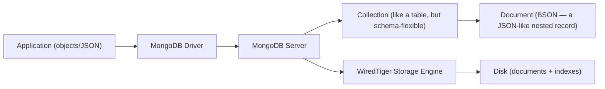

> [!TIP]
> Learn MongoDB by unlearning one relational habit: in SQL you normalize first and design queries later; in MongoDB you design your **access patterns first**, then shape documents (embedding related data together, or referencing it) to make those exact reads fast. "How will I query this?" drives the schema, not "what are the entities?"

---

# 1. Fundamentals (Beginner Level)

## 1.1 What Is MongoDB?

MongoDB stores data as **documents** — nested, JSON-like structures — inside **collections**. Unlike a relational table where every row has the same fixed columns, documents in a collection can have different fields.

```javascript
// A single document in the "orders" collection
{
    _id: ObjectId("507f1f77bcf86cd799439011"),
    customerId: "cust_123",
    status: "PAID",
    items: [
        { sku: "WIDGET-1", quantity: 2, price: 9.99 },
        { sku: "GADGET-3", quantity: 1, price: 19.99 }
    ],
    createdAt: ISODate("2026-01-15T10:30:00Z")
}
```

Notice the `items` array is **embedded inside** the order document — in a relational database ([[02 Postgres]]), this would be a separate `order_items` table joined at query time.

## 1.2 Why MongoDB Exists

| Problem | MongoDB's Answer |
|---|---|
| Rigid relational schemas are painful when data shape evolves rapidly | Flexible schema — documents can vary, fields added without migrations |
| Object-relational impedance mismatch (mapping objects to flat tables) | Documents map naturally to application objects (nested, arrays) |
| Joins across many tables are expensive at scale | Embed related data in one document — read it in a single operation |
| Scaling writes horizontally is hard with traditional SQL | Native sharding distributes data across many servers |
| Semi-structured/varied data (catalogs, events, user profiles) fits awkwardly in tables | Documents naturally hold nested, heterogeneous data |

## 1.3 Problems MongoDB Solves

MongoDB is especially good when you need:

- Flexible or rapidly-evolving schemas (product catalogs, user-generated content, event data).
- Data that naturally forms a self-contained document (an order with its line items, a blog post with its comments).
- High write throughput with horizontal scaling (sharding).
- Fast reads of an entire aggregate in one operation (no joins needed when data is embedded).

MongoDB is **less ideal** when you need:

- Complex multi-entity transactions and strong relational integrity across many tables (a relational DB like [[02 Postgres]] is often better).
- Heavy ad-hoc analytical queries joining many independent datasets.
- Data that's inherently highly relational with many many-to-many relationships.

## 1.4 Real-World Analogy

Think of a relational database like a filing system where a customer's information is split across many separate drawers — one drawer for contact info, one for orders, one for order line items — and to assemble a full picture you pull from every drawer and staple the pages together (a JOIN).

MongoDB is like keeping a single folder per customer that contains everything about them — their info, their orders, the items in each order — all in one place. Pulling the whole folder is one fast action. But if the same document (say, a product's price) needs to appear in thousands of folders, updating it everywhere becomes the trade-off.

```text
Relational tables + JOINs = information split across drawers, assembled on demand
MongoDB embedded document = one self-contained folder holding the whole picture
The trade-off             = duplicated data across folders is fast to read, harder to update everywhere
```

## 1.5 Core Vocabulary

| Term | Meaning | Relational Equivalent ([[02 Postgres]]) |
|---|---|---|
| Database | Top-level container of collections | Database |
| Collection | A group of documents | Table |
| Document | A single JSON-like record (stored as BSON) | Row |
| Field | A key-value pair in a document | Column |
| `_id` | Unique primary key, auto-generated as an `ObjectId` if not provided | Primary key |
| Embedding | Nesting related data inside a document | (No direct equivalent — closest is a JSONB column) |
| Reference | Storing another document's `_id` to link them | Foreign key |
| BSON | Binary JSON — MongoDB's storage/wire format | (Internal storage format) |

## 1.6 Basic CRUD

```javascript
// CREATE
db.orders.insertOne({ customerId: "cust_123", status: "PENDING", total: 29.98 });
db.orders.insertMany([ {...}, {...} ]);

// READ
db.orders.find({ status: "PAID" });
db.orders.findOne({ _id: ObjectId("...") });

// UPDATE
db.orders.updateOne(
    { _id: ObjectId("...") },
    { $set: { status: "SHIPPED" } }
);

// DELETE
db.orders.deleteOne({ _id: ObjectId("...") });
```

## 1.7 Query Operators

```javascript
db.orders.find({ total: { $gt: 20 } });                    // greater than
db.orders.find({ status: { $in: ["PAID", "SHIPPED"] } });  // in a set
db.orders.find({ status: "PAID", total: { $gte: 10 } });   // implicit AND
db.orders.find({ $or: [{ status: "PAID" }, { total: { $gt: 100 } }] });
db.orders.find({ "items.sku": "WIDGET-1" });               // query inside an embedded array
```

| Operator | Meaning |
|---|---|
| `$eq`, `$ne` | Equal, not equal |
| `$gt`, `$gte`, `$lt`, `$lte` | Comparison |
| `$in`, `$nin` | In / not in a set |
| `$and`, `$or`, `$not` | Logical |
| `$exists` | Field presence |
| `$regex` | Pattern matching |

## 1.8 Update Operators

```javascript
db.orders.updateOne({ _id: id }, { $set: { status: "PAID" } });      // set a field
db.orders.updateOne({ _id: id }, { $inc: { total: 5 } });             // increment
db.orders.updateOne({ _id: id }, { $push: { items: newItem } });      // add to array
db.orders.updateOne({ _id: id }, { $pull: { items: { sku: "OLD" } } }); // remove from array
db.orders.updateOne({ _id: id }, { $unset: { tempField: "" } });      // remove a field
```

> [!WARNING]
> Without update operators like `$set`, passing a plain object to `updateOne` **replaces the entire document** (except `_id`), silently deleting every field you didn't include. Always use `$set`/`$inc`/etc. to modify specific fields.

## 1.9 The `_id` Field and ObjectId

```javascript
{
    _id: ObjectId("507f1f77bcf86cd799439011")
    //             └─ 12 bytes: 4-byte timestamp + 5-byte random + 3-byte counter
}
```

Every document has a unique `_id`. If you don't provide one, MongoDB generates an `ObjectId` — a 12-byte value that embeds a creation timestamp (so ObjectIds are roughly sortable by creation time) plus random and counter bytes for uniqueness across machines.

## 1.10 Basic Connection (Node.js Driver)

```javascript
import { MongoClient } from "mongodb";

const client = new MongoClient(process.env.MONGODB_URI);
await client.connect();

const db = client.db("shop");
const orders = db.collection("orders");

const order = await orders.findOne({ _id: new ObjectId(id) });
```

Cross-links to [[05 Node.js]] — the MongoDB driver is fully async, integrating naturally with async/await.

---

# 2. Core Concepts (Intermediate Level)

## 2.1 The Document Data Model: Embedding vs. Referencing

This is the single most important decision in MongoDB schema design.

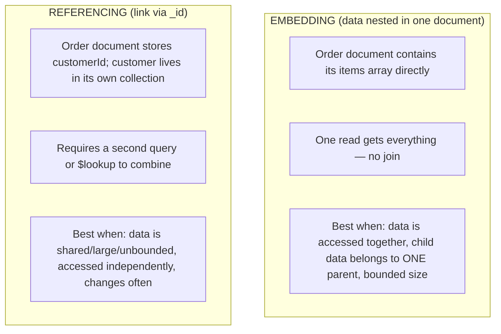

```javascript
// EMBEDDING — order + items together
{ _id: 1, customerId: "c1", items: [ { sku: "A", qty: 2 } ] }

// REFERENCING — order links to a separate customer document
{ _id: 1, customerId: ObjectId("c1"), items: [...] }   // orders collection
{ _id: ObjectId("c1"), name: "Asha", email: "..." }    // customers collection
```

| Choose Embedding When | Choose Referencing When |
|---|---|
| Data is always read together | Data is often read independently |
| Child data belongs to exactly one parent | Data is shared across many documents |
| The embedded data has a bounded size | The related data grows unbounded (e.g., millions of comments) |
| Updates to the whole aggregate are atomic and desirable | The referenced data changes frequently and must stay consistent in one place |

> [!IMPORTANT]
> The MongoDB rule of thumb: **"Data that is accessed together should be stored together."** Embedding optimizes reads (one operation, no join) but duplicates data and has a hard limit — a single document cannot exceed **16 MB**. Unbounded arrays (e.g., embedding every comment in a post that could get millions) will eventually hit this limit and are a classic anti-pattern.

## 2.2 Indexes

```javascript
db.orders.createIndex({ customerId: 1 });                  // single field, ascending
db.orders.createIndex({ status: 1, createdAt: -1 });        // compound index
db.orders.createIndex({ email: 1 }, { unique: true });      // unique constraint
db.orders.createIndex({ "items.sku": 1 });                  // index a field inside an embedded array
db.orders.createIndex({ description: "text" });             // full-text index
```

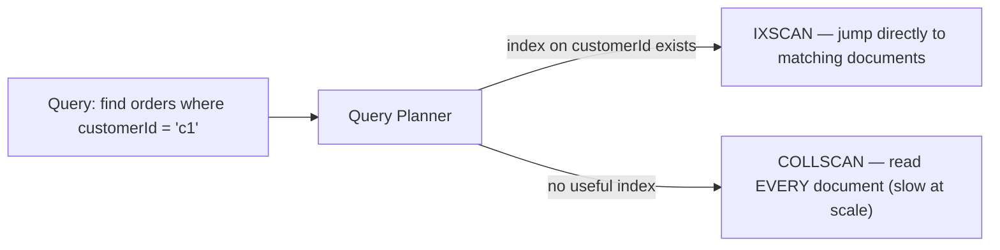

> [!WARNING]
> Without an appropriate index, MongoDB performs a **collection scan** (`COLLSCAN`) — reading every document in the collection. This is fine for tiny collections but catastrophic at scale. Use `.explain("executionStats")` (§2.6) to confirm queries use indexes (`IXSCAN`), not scans.

## 2.3 Compound Index Order: The ESR Rule

```javascript
// Query: find orders for a customer with a status, sorted by date
db.orders.find({ customerId: "c1", status: "PAID" }).sort({ createdAt: -1 });

// Optimal index follows ESR: Equality, Sort, Range
db.orders.createIndex({ customerId: 1, status: 1, createdAt: -1 });
```

| ESR Position | Fields | Why |
|---|---|---|
| **E**quality | `customerId`, `status` | Exact-match fields come first — they narrow the search most efficiently |
| **S**ort | `createdAt` | Sort fields next — lets the index provide already-sorted results, avoiding an in-memory sort |
| **R**ange | (e.g., `total: {$gt: 20}`) | Range fields last — they can't be followed by further equality matches in the index |

> [!TIP]
> Compound index field **order matters enormously**. An index on `{customerId, status}` supports queries on `customerId` alone (prefix), but an index on `{status, customerId}` does **not** efficiently support queries on `customerId` alone. Follow the **ESR rule** (Equality, Sort, Range) when ordering fields.

## 2.4 The Aggregation Pipeline

The aggregation pipeline processes documents through a sequence of stages, each transforming the stream of documents — MongoDB's equivalent of complex SQL (GROUP BY, JOINs, transformations).

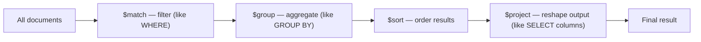

```javascript
db.orders.aggregate([
    { $match: { status: "PAID" } },                                    // filter
    { $group: { _id: "$customerId", total: { $sum: "$total" } } },      // sum per customer
    { $sort: { total: -1 } },                                           // highest spenders first
    { $limit: 10 }
]);
```

| Stage | SQL Analogy |
|---|---|
| `$match` | `WHERE` |
| `$group` | `GROUP BY` + aggregate functions |
| `$sort` | `ORDER BY` |
| `$project` | `SELECT` (choose/compute fields) |
| `$limit` / `$skip` | `LIMIT` / `OFFSET` |
| `$lookup` | `JOIN` |
| `$unwind` | Flatten an array into one document per element |

## 2.5 `$lookup` (Joins in MongoDB)

```javascript
db.orders.aggregate([
    {
        $lookup: {
            from: "customers",
            localField: "customerId",
            foreignField: "_id",
            as: "customer"
        }
    },
    { $unwind: "$customer" }  // $lookup returns an array; unwind to a single object
]);
```

> [!WARNING]
> `$lookup` performs a join, but joins are generally **less efficient in MongoDB than in a relational database** ([[02 Postgres]]), which is purpose-built for them. If you find yourself relying heavily on `$lookup`, it's often a sign your schema should have embedded that data instead — or that a relational database might fit the problem better.

## 2.6 `explain()` and Query Analysis

```javascript
db.orders.find({ customerId: "c1" }).explain("executionStats");
```

```javascript
{
    executionStats: {
        executionSuccess: true,
        nReturned: 5,
        totalDocsExamined: 5,        // GOOD: examined ≈ returned (index used well)
        totalKeysExamined: 5,
        executionStages: { stage: "IXSCAN" }   // using an index, not COLLSCAN
    }
}
```

| Metric | What to Watch For |
|---|---|
| `stage: "COLLSCAN"` | Bad — full collection scan, needs an index |
| `stage: "IXSCAN"` | Good — using an index |
| `totalDocsExamined` >> `nReturned` | Inefficient — examining far more docs than returned; index isn't selective enough |
| `SORT` stage present | An in-memory sort is happening — consider an index that provides the sort order |

## 2.7 Schema Validation

```javascript
db.createCollection("orders", {
    validator: {
        $jsonSchema: {
            bsonType: "object",
            required: ["customerId", "status"],
            properties: {
                status: { enum: ["PENDING", "PAID", "SHIPPED", "CANCELLED"] },
                total: { bsonType: "number", minimum: 0 }
            }
        }
    }
});
```

> [!TIP]
> "Schema-less" doesn't mean "no schema" — it means the schema is enforced by your application (and optionally by MongoDB's schema validation), not rigidly by the database's table definition. Production systems almost always enforce structure via an ODM (Mongoose) and/or `$jsonSchema` validation rather than allowing truly arbitrary documents.

## 2.8 Mongoose (ODM for Node.js)

```javascript
import mongoose from "mongoose";

const orderSchema = new mongoose.Schema({
    customerId: { type: String, required: true },
    status: { type: String, enum: ["PENDING", "PAID", "SHIPPED"], default: "PENDING" },
    items: [{ sku: String, quantity: Number, price: Number }],
    createdAt: { type: Date, default: Date.now }
});

const Order = mongoose.model("Order", orderSchema);

const order = await Order.findById(id);
await Order.create({ customerId: "c1", status: "PAID" });
```

Mongoose is the most popular ODM (Object Document Mapper) — it adds schemas, validation, middleware/hooks, and a structured query API on top of the raw driver, analogous to what Hibernate does for relational databases in Java ([[09 Java Hibernate]]).

## 2.9 Data Types (BSON)

| BSON Type | Example | Notes |
|---|---|---|
| String | `"hello"` | UTF-8 |
| Number | `42`, `3.14` | `int32`, `int64`, `double`, `decimal128` |
| Boolean | `true` | |
| Date | `ISODate("...")` | Stored as milliseconds since epoch |
| ObjectId | `ObjectId("...")` | 12-byte unique identifier |
| Array | `[1, 2, 3]` | Can hold mixed types and nested documents |
| Embedded Document | `{ a: 1 }` | Nested object |
| Null / Binary / Decimal128 | | For precise decimals (money), use `Decimal128`, not `double` |

> [!WARNING]
> Like JavaScript ([[01 JavaScript]]), MongoDB's default number type is a double-precision float, which is imprecise for money. Use `Decimal128` for currency and precise decimal calculations, not `double`.

## 2.10 Basic Testing

```javascript
import { MongoMemoryServer } from "mongodb-memory-server";

let mongod, client;
beforeAll(async () => {
    mongod = await MongoMemoryServer.create();  // in-memory MongoDB for tests
    client = new MongoClient(mongod.getUri());
    await client.connect();
});
afterAll(async () => { await client.close(); await mongod.stop(); });
```

For integration tests requiring MongoDB-specific behavior, use a real MongoDB (via `mongodb-memory-server` or Testcontainers) rather than mocking the driver.

---

# 3. Advanced Concepts (Senior Level)

## 3.1 Replica Sets and High Availability

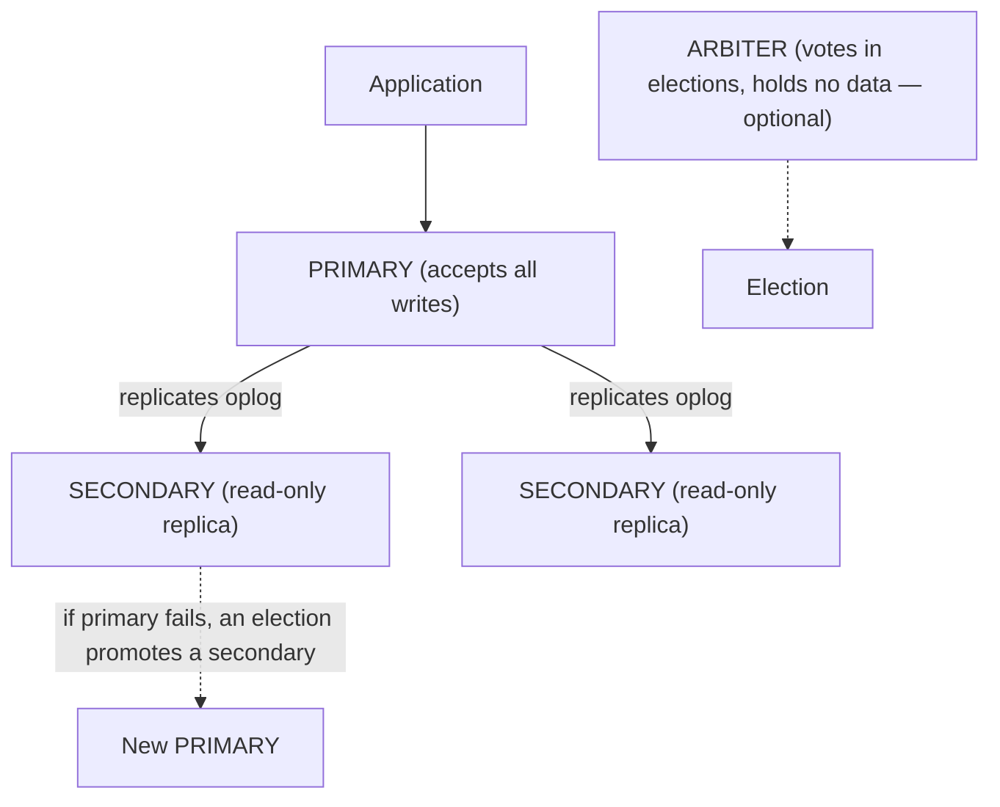

| Member | Role |
|---|---|
| Primary | Receives all writes; only one at a time |
| Secondary | Replicates the primary's data via the **oplog** (operations log); can serve reads |
| Arbiter | Participates in elections to break ties but stores no data (optional) |

> [!IMPORTANT]
> A replica set provides **high availability** through automatic failover: if the primary becomes unavailable, the remaining members hold an **election** to promote a secondary to primary — typically within seconds. Production MongoDB should **always** run as a replica set (minimum 3 members), never a single standalone node. Replication is also a prerequisite for multi-document transactions.

## 3.2 Read Preferences and Write Concerns

```javascript
// Write concern: how many members must acknowledge a write before it's considered successful
db.orders.insertOne(doc, { writeConcern: { w: "majority", j: true } });

// Read preference: where reads are routed
db.orders.find().readPref("secondaryPreferred");
```

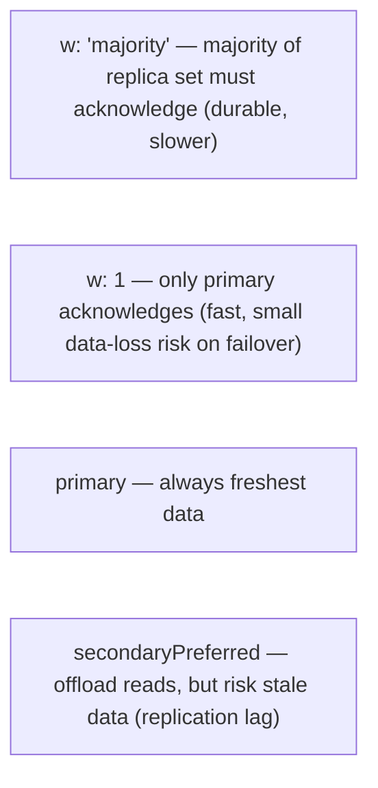

| Setting | Trade-off |
|---|---|
| `writeConcern: { w: "majority" }` | Durable — survives primary failure; higher latency |
| `writeConcern: { w: 1 }` | Fast — but a write acknowledged only by a primary that then fails can be lost |
| `readPreference: primary` | Always consistent, but no read scaling |
| `readPreference: secondaryPreferred` | Scales reads, but risks stale data due to replication lag |

## 3.3 Sharding (Horizontal Scaling)

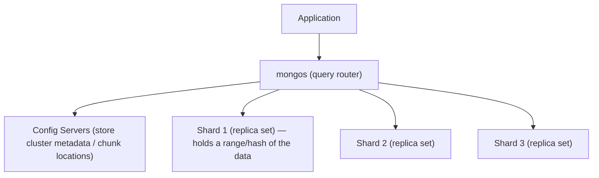

Sharding distributes a collection's documents across multiple shards (each itself a replica set), based on a **shard key** — enabling horizontal scaling beyond a single server's capacity.

| Sharding Strategy | Behavior |
|---|---|
| Ranged sharding | Documents partitioned by shard key ranges — good for range queries, risks uneven distribution ("hotspots") |
| Hashed sharding | Shard key hashed for even distribution — good write balance, but range queries must hit all shards |

> [!IMPORTANT]
> Choosing the **shard key is the most consequential and hardest-to-reverse decision** in a sharded MongoDB deployment. A poor shard key (e.g., a monotonically increasing value like a timestamp with ranged sharding) causes all new writes to hit a single shard (a "hotspot"), defeating the purpose of sharding. The key should have high cardinality, distribute writes evenly, and align with common query patterns.

## 3.4 Multi-Document Transactions

```javascript
const session = client.startSession();
try {
    await session.withTransaction(async () => {
        await orders.insertOne({ _id: orderId, total: 100 }, { session });
        await inventory.updateOne(
            { sku: "WIDGET-1" },
            { $inc: { stock: -1 } },
            { session }
        );
    });
} finally {
    await session.endSession();
}
```

> [!WARNING]
> MongoDB supports ACID multi-document transactions (since 4.0, and across shards since 4.2), but they carry **more overhead** than single-document operations and require a replica set. The document model is designed so that a well-modeled aggregate (with related data embedded) can be updated atomically in a **single document** operation — which is always atomic in MongoDB — **without** needing a transaction. If you find yourself needing transactions frequently, reconsider whether your schema should embed more, or whether a relational database fits better.

## 3.5 Single-Document Atomicity

```javascript
// This entire update is atomic — no transaction needed
db.accounts.updateOne(
    { _id: accountId, balance: { $gte: 100 } },  // condition ensures sufficient balance
    { $inc: { balance: -100 }, $push: { transactions: { amount: -100, at: new Date() } } }
);
```

Every operation on a **single document** in MongoDB is atomic, even when it modifies multiple fields or embedded arrays. This is the foundation of MongoDB's data model philosophy: embed related data so that a business operation touches one document, gaining atomicity for free without transactions.

## 3.6 The WiredTiger Storage Engine

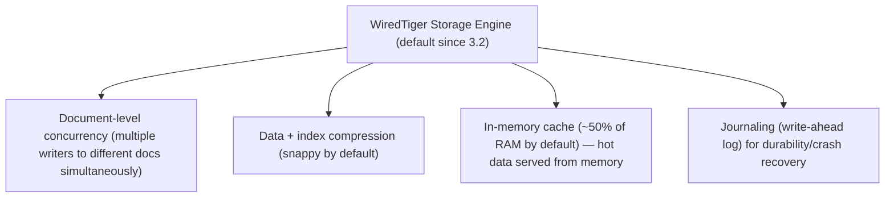

WiredTiger provides document-level concurrency control (writers to different documents don't block each other), compression, and an in-memory cache. Understanding that MongoDB serves hot data from a RAM cache explains why keeping your **working set** (frequently-accessed data + indexes) within available memory is critical for performance.

## 3.7 Change Streams

```javascript
const changeStream = db.collection("orders").watch([
    { $match: { "fullDocument.status": "PAID" } }
]);

for await (const change of changeStream) {
    console.log("Order paid:", change.fullDocument);
    // trigger downstream processing, notifications, etc.
}
```

Change streams let applications subscribe to real-time data changes (inserts, updates, deletes) — built on the oplog — enabling event-driven architectures, cache invalidation, and real-time features without polling. Conceptually similar to change data capture in [[02 Postgres]] via logical replication.

## 3.8 Failure Scenarios

| Failure | Symptom | Common Cause | Fix |
|---|---|---|---|
| Slow queries / high CPU | Queries take seconds, DB CPU spikes | Missing index causing `COLLSCAN` | Add index; verify with `.explain()` |
| Document too large error | Write fails at 16 MB limit | Unbounded array embedding (e.g., all comments in a post) | Move unbounded data to referenced documents (the "outlier"/bucketing pattern) |
| Write hotspot on one shard | Uneven load despite sharding | Monotonically increasing shard key with ranged sharding | Use hashed sharding or a better-distributed compound shard key |
| Stale reads | App shows outdated data | Reading from secondaries with replication lag | Read from primary for read-after-write consistency, or use causal consistency |
| Data loss on failover | Acknowledged writes disappear after primary crash | `writeConcern: { w: 1 }` — write lost before replicating | Use `writeConcern: { w: "majority" }` for critical writes |
| Working set exceeds RAM | Performance degrades sharply | Frequently-accessed data + indexes larger than WiredTiger cache | Scale RAM, add indexes to reduce docs examined, or shard |
| Unbounded `$lookup` slowness | Aggregations time out | Heavy reliance on joins in a document DB | Re-model with embedding, or reconsider database choice |
| Duplicate key error | Insert fails | Violating a unique index | Handle the constraint; use upserts where appropriate |

## 3.9 Performance Considerations

- Ensure every common query is backed by an index; use `.explain("executionStats")` to catch collection scans.
- Keep the **working set** (hot data + indexes) within available RAM — MongoDB serves cached data far faster than disk.
- Use **projections** (`find(query, { field1: 1 })`) to return only needed fields, reducing network and memory overhead.
- Avoid unbounded array growth in documents (16 MB limit; also large docs are slow to move/update).
- Use covered queries (query satisfied entirely by an index, no document fetch) where possible for read-heavy paths.
- Batch writes (`insertMany`, `bulkWrite`) instead of many individual operations.
- Beware `$lookup` and unbounded aggregations at scale — they don't scale like relational joins.

## 3.10 Security Considerations

| Risk | Mitigation |
|---|---|
| NoSQL injection (e.g., passing `{ $ne: null }` as a query value from user input) | Validate/sanitize input types; never pass raw user input directly as query operators |
| Unauthenticated database exposed to the internet | Enable authentication (`--auth`), bind to private networks, never expose to the public internet |
| Overly broad user permissions | Role-based access control (RBAC) with least-privilege roles per application |
| Unencrypted connections/data | TLS for connections; encryption at rest for sensitive data |
| Storing sensitive data unhashed | Hash passwords, encrypt PII |

```javascript
// NoSQL injection: if `req.body.username` is `{ "$ne": null }`, this matches ANY user
db.users.findOne({ username: req.body.username, password: req.body.password });
// FIX: validate that inputs are strings before querying
```

---

# 4. Real-World System Design Usage

## 4.1 Where MongoDB Is Used in Production

- Content management and catalogs (products, articles) with varied, evolving structure.
- User profiles and personalization data.
- Real-time analytics and event/logging data (often with time-series collections).
- Mobile/IoT backends with flexible, high-write-volume data.
- Gaming (player state, sessions), and any domain where the aggregate maps naturally to a document.

## 4.2 Typical Production Architecture

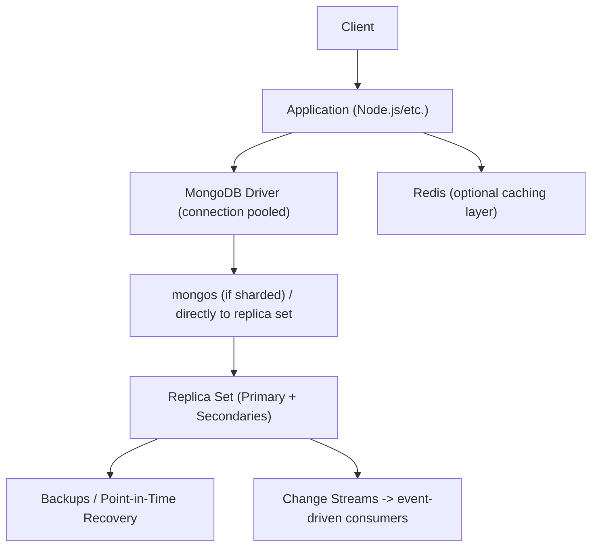

## 4.3 Big-Company Style Thinking

| Concern | MongoDB Design Response |
|---|---|
| Reliability | Replica sets (3+ members) with automatic failover, `majority` write concern for critical data |
| Scale | Sharding with a carefully-chosen shard key; read scaling via secondaries where staleness is acceptable |
| Observability | `mongostat`/`mongotop`, slow query log, Atlas monitoring, `explain()` in profiling |
| Security | Authentication + RBAC, TLS, network isolation, input validation against NoSQL injection |
| Maintainability | Schema validation (`$jsonSchema`) + ODM (Mongoose), documented access patterns driving schema |
| Performance | Indexes aligned to query patterns (ESR rule), working set in RAM, projections, bounded documents |

## 4.4 Example: E-Commerce Order Modeling

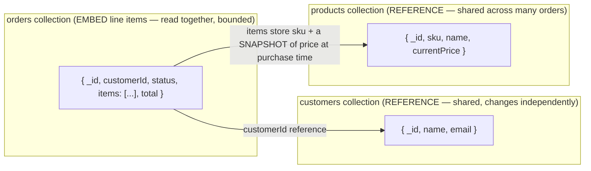

Key modeling decisions:
- **Embed line items** in the order — they're read with the order, belong to one order, and are bounded.
- **Reference the customer** — shared across many orders, changes independently.
- **Snapshot the price** into the order's items (denormalize) — the price at purchase time must not change when the product's current price later changes.

## 4.5 Schema Design Patterns

| Pattern | Purpose |
|---|---|
| Embedding | Store related, together-accessed data in one document |
| Referencing | Link shared/large/independent data via `_id` |
| Denormalization / Snapshotting | Duplicate a value (e.g., price at purchase) to avoid a join and preserve historical accuracy |
| Bucketing | Group many small time-series items into "bucket" documents to avoid document-per-event overhead |
| Outlier | Handle the rare document with an unusually large array by overflowing to referenced documents |
| Computed | Precompute and store aggregates (e.g., total count) to avoid recomputing on every read |

## 4.6 Integration with Other Systems

| System | MongoDB Integration |
|---|---|
| Node.js | Official `mongodb` driver, Mongoose ODM — see [[05 Node.js]] |
| Caching | Redis in front of hot reads |
| Search | Atlas Search (built-in Lucene) or Elasticsearch alongside |
| Analytics | Aggregation pipeline, or offload to a data warehouse via change streams/connectors |
| Event-driven | Change streams feeding Kafka/message queues |
| Managed hosting | MongoDB Atlas (managed replica sets, sharding, backups, monitoring) |

---

# 5. Interview Preparation

## 5.1 What Interviewers Expect

For "MongoDB" topics, interviewers usually expect:

- You understand the document model and how it differs from relational tables.
- You can do CRUD, use query/update operators, and write basic aggregations.
- You understand indexing and can explain why a query might be slow.
- You know the embedding vs. referencing trade-off.

For senior backend roles, they also expect:

- You can design a schema driven by access patterns, justifying embedding vs. referencing decisions.
- You understand replica sets, sharding, and shard key selection.
- You know single-document atomicity vs. multi-document transactions and when each applies.
- You can reason about consistency trade-offs (write concern, read preference, replication lag).

## 5.2 Most Important Questions and Answers

### Q1. What's the fundamental difference between MongoDB and a relational database?

MongoDB stores data as flexible, nested documents grouped into collections, with no enforced fixed schema, and is designed to model data around access patterns (embedding related data together). Relational databases store data as rows in fixed-schema tables normalized to eliminate duplication, joining tables at query time. MongoDB optimizes for reading self-contained aggregates in one operation; relational databases optimize for normalized integrity and flexible ad-hoc joins.

### Q2. When should you embed vs. reference?

Embed when data is accessed together, belongs to a single parent, and is bounded in size — this gives single-operation reads and atomic updates. Reference when data is shared across many documents, accessed independently, changes frequently, or grows unbounded — to avoid duplication and the 16 MB document limit. The guiding principle is "data that is accessed together is stored together."

### Q3. Why is choosing the right shard key so important?

The shard key determines how documents distribute across shards. A poor choice — like a monotonically increasing value (timestamp) with ranged sharding — routes all new writes to one shard, creating a hotspot that defeats horizontal scaling. A good shard key has high cardinality, distributes writes evenly, and aligns with common queries. It's also very hard to change after the fact, making it a critical upfront decision.

### Q4. Is MongoDB ACID-compliant?

Single-document operations have always been fully atomic (ACID at the document level). Since version 4.0, MongoDB also supports multi-document ACID transactions (across shards since 4.2), but these have more overhead and require a replica set. The document model encourages embedding related data so most operations touch a single document and get atomicity without needing a transaction.

### Q5. What is a replica set and why is it important?

A replica set is a group of MongoDB nodes maintaining the same data: one primary (accepts writes) and one or more secondaries (replicate via the oplog). If the primary fails, the members hold an election to automatically promote a secondary, providing high availability. Production MongoDB should always run as a replica set (3+ members), never a single node — it's also a prerequisite for transactions.

### Q6. How do you diagnose a slow query in MongoDB?

Use `.explain("executionStats")`. Look for `COLLSCAN` (a full collection scan indicating a missing index), a large ratio of `totalDocsExamined` to `nReturned` (an unselective index), or an in-memory `SORT` stage (needing an index that provides the sort order). The fix is usually adding or refining an index following the ESR rule.

### Q7. What is the ESR rule for compound indexes?

Equality, Sort, Range — the optimal field order in a compound index. Put fields queried by exact equality first (they narrow results most), then fields used for sorting (so the index provides pre-sorted results), then range-query fields last (since fields after a range field in an index can't be used for further equality filtering).

### Q8. What is the 16 MB document limit and why does it matter for schema design?

A single BSON document cannot exceed 16 MB. This directly shapes embedding decisions — you cannot embed an unbounded, ever-growing array (like every comment on a viral post) because it will eventually exceed the limit. Such data must be referenced in separate documents or handled with patterns like bucketing.

### Q9. What's the difference between `w: 1` and `w: "majority"` write concern?

`w: 1` means a write is acknowledged as soon as the primary applies it — fast, but if that primary fails before replicating, the write can be lost during failover. `w: "majority"` requires a majority of replica set members to acknowledge the write, guaranteeing it survives primary failure — more durable but higher latency. Critical data should use `majority`.

### Q10. What causes stale reads in MongoDB and how do you avoid them?

Reading from secondaries can return stale data because secondaries replicate the primary asynchronously (replication lag). To guarantee read-after-write consistency, read from the primary, or use causal consistency (via sessions). Reading from secondaries is appropriate only where slightly stale data is acceptable (e.g., analytics, non-critical displays).

## 5.3 Tricky Questions

### If MongoDB is "schema-less," why do production systems still define schemas?

"Schema-less" means the *database* doesn't enforce a rigid schema by default, giving flexibility — but data still has an implicit structure the application depends on. Production systems enforce that structure through an ODM (Mongoose) and/or MongoDB's `$jsonSchema` validation, because uncontrolled document variation makes code fragile and bugs hard to catch. The flexibility is about *evolution* (adding fields without migrations), not about having no structure.

### Why can embedding actually hurt performance in some cases?

Because every read of the document loads the entire embedded content, even if you only need part of it, and every update rewrites/moves a large document. If an order embeds thousands of items but you usually only need the order summary, you pay to load all items every time. Large documents also strain the 16 MB limit and the WiredTiger cache. Embedding optimizes for *reading the whole aggregate together*; it hurts when you frequently need only fragments.

### Does adding more indexes always improve performance?

No — indexes speed up reads but slow down writes (every insert/update must also update every relevant index) and consume memory and disk. Too many indexes bloat the working set and can push it out of RAM. The goal is the *minimal* set of indexes that covers your actual query patterns, verified with `explain()` and index-usage statistics — not indexing every field defensively.

### Can you always avoid transactions with good schema design?

Often, but not always. Embedding related data into one document handles many cases via single-document atomicity. But some operations genuinely span independent entities (e.g., transferring between two separate account documents, or updating an order and a shared inventory record). Those legitimately need multi-document transactions — or a design that tolerates eventual consistency. Good schema design *minimizes* the need for transactions, it doesn't always eliminate it.

## 5.4 Common Candidate Mistakes

- Designing MongoDB schemas like normalized relational tables (many small collections joined via `$lookup`).
- Embedding unbounded arrays that will eventually hit the 16 MB limit.
- Not indexing query fields, causing collection scans at scale.
- Getting compound index field order wrong (ignoring the ESR rule).
- Using `updateOne` with a plain object (replacing the whole document instead of using `$set`).
- Assuming reads from secondaries are always consistent (ignoring replication lag).
- Choosing a monotonically increasing shard key, creating write hotspots.
- Using `double` for money instead of `Decimal128`.

## 5.5 Interview Coding Checklist

- [ ] Design the schema from access patterns, justifying embed vs. reference decisions.
- [ ] Add indexes for every common query; verify with `.explain()`.
- [ ] Order compound index fields by ESR (Equality, Sort, Range).
- [ ] Use `$set`/`$inc`/etc. for updates, never a bare replacement object unintentionally.
- [ ] Keep embedded arrays bounded; reference unbounded relationships.
- [ ] Use appropriate write concern (`majority` for critical data) and understand read preference trade-offs.

---

# 6. Hands-On Thinking

## 6.1 Three Real-World Projects Using MongoDB

### Project 1: Content Management System

Concepts: flexible document schema for varied content types, embedded metadata, full-text search indexes, denormalized author info.

```javascript
{ _id, type: "article", title, body, author: { id, name }, tags: [...], publishedAt }
```

### Project 2: Real-Time Analytics / Event Store

Concepts: time-series collections or bucketing pattern for high-volume events, aggregation pipeline for rollups, TTL indexes for automatic data expiration.

```javascript
db.events.createIndex({ createdAt: 1 }, { expireAfterSeconds: 2592000 }); // auto-delete after 30 days
```

### Project 3: E-Commerce Platform (Sharded)

Concepts: embedding vs. referencing decisions (orders embed items, reference customers/products with price snapshots), sharding by a well-distributed key, transactions for inventory + order consistency where truly needed, change streams for order-event processing.

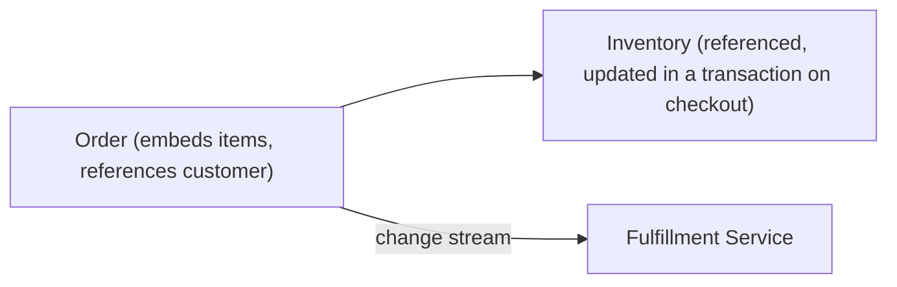

## 6.2 Step-by-Step Design Approach

For any MongoDB schema:

1. Enumerate the application's **access patterns** first (what queries/reads will actually run, and how often).
2. For each relationship, decide embed vs. reference based on access-together, size bounds, and change frequency.
3. Design documents so the most common operations touch a single document (leveraging single-document atomicity).
4. Define indexes to support every common query, ordered by the ESR rule.
5. Add schema validation (`$jsonSchema` or an ODM) to enforce structure.
6. Plan for scale: pick a shard key aligned to query/write distribution before you actually need to shard.
7. Verify query performance with `.explain()` against realistic data volumes.

## 6.3 Production Implementation Approach

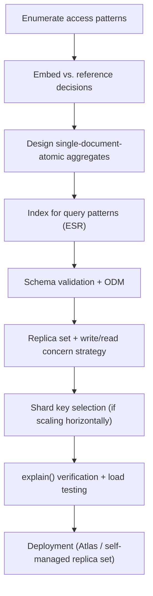

## 6.4 Production Readiness Example

For a MongoDB-backed service, define:

- A replica set (3+ members) — never a standalone node in production.
- `majority` write concern for critical data; documented read-preference strategy per read path.
- Indexes reviewed against actual query patterns, with unused indexes removed.
- Schema validation via `$jsonSchema`/ODM enforcing document structure.
- Authentication + RBAC enabled, network isolation, TLS, input validated against NoSQL injection.
- Backups with tested point-in-time recovery.
- Monitoring of slow queries, replication lag, and working-set-vs-RAM.
- A documented shard key strategy if horizontal scaling is anticipated.

---

# 7. Deep Dive (Optional but Important)

## 7.1 BSON: Why Not Just JSON?

```text
JSON:  human-readable text, limited types (no dates, no binary, imprecise numbers)
BSON:  Binary JSON — MongoDB's storage/wire format
    - Adds types JSON lacks: Date, ObjectId, Binary, Decimal128, int32/int64
    - Length-prefixed fields for fast traversal/skipping without parsing everything
    - Slightly larger than JSON on disk, but far faster to scan and richer in types
```

MongoDB stores and transmits documents as BSON, not JSON — this gives it precise numeric types (critical for the `Decimal128`-for-money point in §2.9), native dates and binary data, and efficient field navigation, while still presenting a JSON-like interface to developers.

## 7.2 The Oplog and Replication Internals

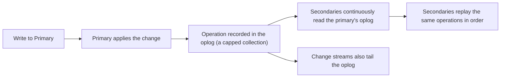

The **oplog** (operations log) is a special capped collection recording every data-modifying operation on the primary. Secondaries tail it and replay operations to stay in sync, and change streams (§3.7) tap the same mechanism — making the oplog the backbone of both replication and MongoDB's real-time change notification.

## 7.3 How the Query Planner Chooses an Index

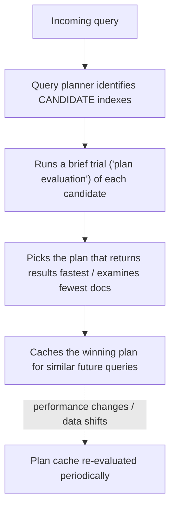

MongoDB's query planner empirically tests candidate indexes on a real query and caches the winner, rather than relying purely on static cost estimates — which is why the same query shape reuses a cached plan, and why `.explain()` output can reflect a cached rather than freshly-computed decision.

## 7.4 Write-Ahead Journaling and Durability

```text
Write operation -> WiredTiger applies it in memory (cache) -> recorded in the journal (write-ahead log)
    -> periodically flushed (checkpoint) to the actual data files on disk

If the server crashes between checkpoints, the journal is replayed on restart to recover
committed writes — analogous to Postgres's WAL (see [[02 Postgres]]).
```

## 7.5 Debugging Tools

| Tool | Purpose |
|---|---|
| `.explain("executionStats")` | Analyze how a query executes — index usage, docs examined |
| `mongostat` | Real-time server statistics (ops/sec, memory, connections) |
| `mongotop` | Time spent reading/writing per collection |
| Database Profiler | Logs slow operations to `system.profile` for analysis |
| `db.currentOp()` | Inspect currently-running operations (find long-running/blocked queries) |
| MongoDB Atlas / Compass | GUI for query analysis, index suggestions, performance monitoring |

---

# Production Checklists

## Schema/Code Quality Checklist

- [ ] Schema designed from documented access patterns, not normalized relational habits.
- [ ] Embed vs. reference decisions justified per relationship.
- [ ] Embedded arrays bounded; unbounded relationships referenced.
- [ ] Updates use field operators (`$set`/`$inc`), not accidental whole-document replacement.
- [ ] Money/precise decimals use `Decimal128`, not `double`.
- [ ] Schema validation enforced via `$jsonSchema` and/or an ODM.

## Performance Checklist

- [ ] Every common query backed by an appropriate index (verified with `.explain()`).
- [ ] Compound indexes ordered by ESR (Equality, Sort, Range).
- [ ] No `COLLSCAN` on large collections in production query paths.
- [ ] Working set (hot data + indexes) fits within available RAM.
- [ ] Projections used to return only needed fields.
- [ ] Unused/redundant indexes removed (they slow writes and consume memory).

## Security Checklist

- [ ] Authentication enabled; RBAC with least-privilege roles per application.
- [ ] Database not exposed to the public internet; network isolation in place.
- [ ] TLS for connections; encryption at rest for sensitive data.
- [ ] User input validated to prevent NoSQL injection (no raw operators from user input).
- [ ] Passwords hashed, PII encrypted.

## Operations Checklist

- [ ] Deployed as a replica set (3+ members), never standalone.
- [ ] `majority` write concern for critical data; read-preference strategy documented.
- [ ] Backups configured with tested point-in-time recovery.
- [ ] Monitoring for slow queries, replication lag, and working-set/RAM pressure.
- [ ] Shard key strategy documented if sharding (high cardinality, even distribution).

---

# Learning Roadmap

## Phase 1: Beginner

Learn: documents/collections, CRUD, query and update operators, `_id`/ObjectId, basic connection.

Practice: a simple CRUD app (blog, to-do) with a single collection.

## Phase 2: Intermediate

Learn: embedding vs. referencing, indexes and `.explain()`, the aggregation pipeline, `$lookup`, schema validation, Mongoose.

Practice: an e-commerce data model with justified embed/reference decisions and aggregation-based reports.

## Phase 3: Advanced

Learn: replica sets, write concern/read preference, single-document atomicity vs. transactions, the ESR rule, change streams.

Practice: a replica-set-backed service with transactions where genuinely needed and change-stream-driven event processing.

## Phase 4: Production Database Engineer

Learn: sharding and shard key design, WiredTiger internals, oplog/replication mechanics, performance tuning at scale, security hardening.

Practice: a sharded deployment with a well-chosen shard key, full monitoring, backup/recovery drills, and load-tested query performance.

---

# Self-Review Completion Loop

The topic was reviewed against:

- Official MongoDB documentation (data modeling, indexing, aggregation, replication, sharding).
- Direct comparison against the relational model ([[02 Postgres]]).
- Common production incident patterns (missing indexes, unbounded embedding, shard hotspots, stale reads).
- Interview patterns for beginner through senior backend/database roles.

## Gap Review Matrix

| Area | Covered? | Notes |
|---|---|---|
| Document model | Yes | Documents/collections/BSON, contrast with tables |
| CRUD + operators | Yes | Query and update operators, whole-doc-replacement pitfall |
| Embedding vs. referencing | Yes | The central schema decision, with rules and trade-offs |
| Indexing | Yes | Single/compound/unique/text, COLLSCAN vs IXSCAN |
| ESR rule | Yes | Compound index field ordering |
| Aggregation pipeline | Yes | Stages, SQL analogies, `$lookup`/`$unwind` |
| `explain()` | Yes | Reading execution stats |
| Schema validation / Mongoose | Yes | `$jsonSchema`, ODM |
| Replica sets | Yes | Primary/secondary/arbiter, elections, failover |
| Write concern / read preference | Yes | Durability vs. latency, staleness trade-offs |
| Sharding | Yes | mongos/config servers, shard key criticality |
| Transactions | Yes | Multi-doc vs. single-doc atomicity |
| WiredTiger | Yes | Document-level concurrency, cache, working set |
| Change streams | Yes | Oplog-based real-time events |
| Failure scenarios | Yes | Eight concrete production failure patterns |
| Security | Yes | NoSQL injection, auth/RBAC, encryption |
| Interview prep | Yes | Common and tricky questions, candidate mistakes |
| Hands-on projects | Yes | Three realistic projects |
| Internals | Yes | BSON, oplog, query planner, journaling |

No significant beginner-to-senior MongoDB gaps remain for the requested scope. Further specialization should split into separate deep dives: **MongoDB Aggregation Pipeline In Depth**, **Sharding Strategy and Shard Key Design**, **MongoDB Atlas Operations**, **Time-Series Collections**, and **Mongoose Advanced Patterns**.

---

# Official References

- MongoDB Manual: <https://www.mongodb.com/docs/manual/>
- MongoDB Data Modeling Guide: <https://www.mongodb.com/docs/manual/data-modeling/>
- MongoDB Indexes: <https://www.mongodb.com/docs/manual/indexes/>
- MongoDB Aggregation Pipeline: <https://www.mongodb.com/docs/manual/core/aggregation-pipeline/>
- MongoDB Sharding: <https://www.mongodb.com/docs/manual/sharding/>
- Mongoose Documentation: <https://mongoosejs.com/docs/>

---

## Final Summary

MongoDB is a document database whose entire design philosophy flips the relational approach: instead of normalizing data into tables and joining at query time, you model documents around your application's access patterns — embedding data that's read together and referencing data that's shared or unbounded. Production mastery comes from making embed-vs-reference decisions deliberately (respecting the 16 MB limit and single-document atomicity), indexing precisely for real query patterns using the ESR rule, running as a replica set with appropriate write/read concerns, and — when scaling horizontally — choosing a shard key that distributes writes evenly. The recurring senior-level insight is that most MongoDB problems trace back to applying relational habits to a document model that rewards a fundamentally different way of thinking.
