# 🔴 Redis — Complete Beginner-to-Expert Reference

> The in-memory data structure store that powers caching, sessions, rate limiting, queues, leaderboards, and real-time systems — sub-millisecond latency at massive scale.

---

## 📑 Table of Contents

1. [Executive Summary](#-executive-summary)
2. [Fundamentals (Beginner)](#1--fundamentals-beginner-level)
3. [Core Concepts (Intermediate)](#2--core-concepts-intermediate-level)
4. [Advanced Concepts (Senior)](#3--advanced-concepts-senior-level)
5. [Real-World System Design](#4--real-world-system-design-usage)
6. [Interview Preparation](#5--interview-preparation)
7. [Hands-On Projects](#6--hands-on-projects)
8. [Deep Dive: Internals](#7--deep-dive-internals)
9. [Production Checklists](#-production-checklists)
10. [Learning Roadmap](#-learning-roadmap)
11. [Self-Review Completion Loop](#-self-review-completion-loop)
12. [Official References](#-official-references)
13. [Final Summary](#-final-summary)

---

## 🎯 Executive Summary

**Redis** (REmote DIctionary Server) is an open-source, **in-memory data structure store** used as a cache, database, message broker, and more. It keeps data in RAM for **sub-millisecond** reads/writes, offers rich data types (not just strings), and is single-threaded for its command execution — making it blazingly fast and simple to reason about.

| What it is | What it replaces | Core superpower |
|---|---|---|
| In-memory data structure store | Slow DB round-trips, session tables, ad-hoc queues, custom rate limiters | **Sub-millisecond** access to rich data structures with atomic operations |

> [!IMPORTANT]
> Redis is often reduced to "a cache," but its real power is being an **in-memory data structure server**: strings, hashes, lists, sets, sorted sets, streams, bitmaps, HyperLogLog, and geospatial indexes — each with atomic operations. This lets you solve problems (leaderboards, rate limiting, queues, real-time analytics) in *one* fast atomic command that would take complex logic against [[02 Postgres]]. Caching is just the most common use, not the whole story.

Related guides: [[02 Postgres]] · [[03 MongoDB]] · [[01 Kafka]] · [[05 Node.js]] · [[05 Spring Boot]] · [[03 Microservices]] · [[02 Kubernetes]]

---

## 1. 🌱 FUNDAMENTALS (Beginner Level)

### What is Redis in simple terms?

Your database ([[02 Postgres]]/[[03 MongoDB]]) stores data on **disk** — durable but relatively slow (milliseconds per query, more under load). Redis keeps data in **RAM** — volatile but *insanely* fast (microseconds). You put frequently-accessed or ephemeral data in Redis so your app doesn't hammer the slow database for everything.

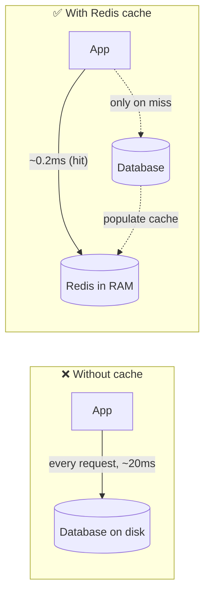

### Why does Redis exist?

Databases optimized for **durability and complex queries** are inherently slower than RAM. As traffic grows, the database becomes the bottleneck. Redis (2009) gave developers a **simple, ridiculously fast** place to store hot data and ephemeral state, with data structures rich enough to model real problems — not just a key→string cache.

### Problems Redis solves

| Problem | How Redis solves it |
|---|---|
| **Slow, repeated DB queries** | Cache results in RAM (sub-ms reads) |
| **Database overload** | Absorb read traffic; protect the DB |
| **Session storage** | Fast, shared session store across app servers |
| **Rate limiting** | Atomic counters with expiry |
| **Leaderboards / rankings** | Sorted sets (ranked in O(log n)) |
| **Real-time counts** | Atomic increments, HyperLogLog |
| **Job/task queues** | Lists / Streams as lightweight queues |
| **Pub/Sub messaging** | Built-in publish/subscribe |
| **Distributed locks** | Atomic SET NX with expiry |
| **Ephemeral data with TTL** | Auto-expiring keys |

### Core concepts (the vocabulary)

| Term | Plain meaning |
|---|---|
| **Key** | The unique identifier for a value (`user:42:session`) |
| **Value** | The data — one of Redis's rich types |
| **TTL** | Time-to-live; keys can auto-expire |
| **Eviction** | What Redis discards when memory is full |
| **Persistence** | Optionally saving RAM data to disk (RDB/AOF) |
| **Replication** | Copying data to replica nodes |
| **Sentinel** | High-availability failover manager |
| **Cluster** | Sharded, horizontally-scaled Redis |
| **Pipeline** | Batching commands to cut round-trips |
| **Atomic op** | A command that completes indivisibly |

### Real-world analogy 🏪

Redis is like the **counter shelf right behind a shop cashier**:
- The **warehouse** (slow, huge) = your database.
- The **shelf behind the cashier** (small, instant reach) = Redis in RAM.
- Popular items are kept on the shelf so the cashier doesn't walk to the warehouse every time (cache hit).
- If an item isn't on the shelf, they fetch it from the warehouse *once* and put it on the shelf (cache miss → populate).
- The shelf has **limited space** — old/unpopular items get removed (eviction).
- Some items have a "sell by" sticker (TTL) and are cleared automatically.

> [!TIP]
> The mental model: **Redis trades durability and size for raw speed by living in RAM.** It's not a replacement for your database — it's a fast layer *in front of* or *beside* it. Know what belongs in Redis (hot, ephemeral, or structure-friendly data) vs what belongs in [[02 Postgres]] (the durable source of truth).

---

## 2. 🧩 CORE CONCEPTS (Intermediate Level)

### 2.1 Data Types — the heart of Redis

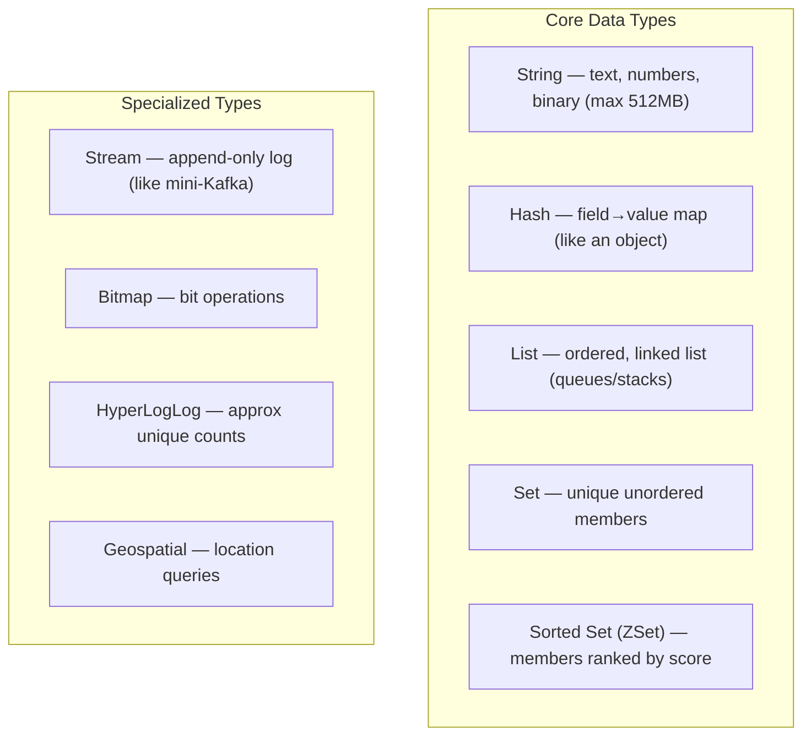

| Type | Use case | Key commands |
|---|---|---|
| **String** | Cache values, counters, flags | `SET`, `GET`, `INCR`, `SETEX`, `SETNX` |
| **Hash** | Objects (user profile fields) | `HSET`, `HGET`, `HGETALL`, `HINCRBY` |
| **List** | Queues, stacks, recent items | `LPUSH`, `RPUSH`, `LPOP`, `BRPOP`, `LRANGE` |
| **Set** | Unique tags, membership, dedup | `SADD`, `SISMEMBER`, `SINTER`, `SUNION` |
| **Sorted Set** | Leaderboards, priority queues, rate limits | `ZADD`, `ZRANGE`, `ZRANK`, `ZRANGEBYSCORE` |
| **Stream** | Event logs, message queues | `XADD`, `XREAD`, `XREADGROUP`, `XACK` |
| **Bitmap** | Daily active users, feature flags | `SETBIT`, `GETBIT`, `BITCOUNT` |
| **HyperLogLog** | Unique visitor counts (approx) | `PFADD`, `PFCOUNT` |
| **Geospatial** | "Restaurants near me" | `GEOADD`, `GEOSEARCH` |

```bash
# String as a counter (atomic)
INCR page:views              # → 1, 2, 3... no race condition

# Hash as an object
HSET user:42 name "Alice" age 30
HGET user:42 name            # → "Alice"

# Sorted set as a leaderboard
ZADD leaderboard 1500 alice 1200 bob 1800 carol
ZREVRANGE leaderboard 0 2 WITHSCORES   # top 3: carol, alice, bob

# List as a queue
LPUSH jobs "task1"
BRPOP jobs 5                  # blocking pop (wait up to 5s)
```

> [!TIP]
> Choosing the right type *is* the skill. A leaderboard in [[02 Postgres]] needs `ORDER BY ... LIMIT` (recomputed each query); in Redis, a **sorted set** keeps it ranked continuously — `ZREVRANGE` is O(log n + k). Rate limiting, dedup, "online now," recent activity — each maps to a native type with atomic ops. Don't store JSON blobs in strings when a hash/zset fits.

### 2.2 Keys, TTL & Expiration

```bash
SET session:abc "userdata" EX 3600   # expires in 3600s
TTL session:abc                       # → seconds remaining
EXPIRE user:42 300                     # set/update TTL
PERSIST user:42                        # remove TTL (make permanent)
```

**Key naming convention** (colons for namespacing):

```
user:42:profile
session:abc123
ratelimit:ip:192.168.1.1
cache:product:9981
```

> [!IMPORTANT]
> **TTL is central to using Redis well.** Cached data should almost always have an expiry so stale data self-cleans and memory stays bounded. Sessions, rate-limit windows, and locks all rely on TTL. A cache without TTLs slowly fills memory and serves stale data — two of the most common Redis production problems.

### 2.3 How expiration actually works

Redis uses **two mechanisms** together:

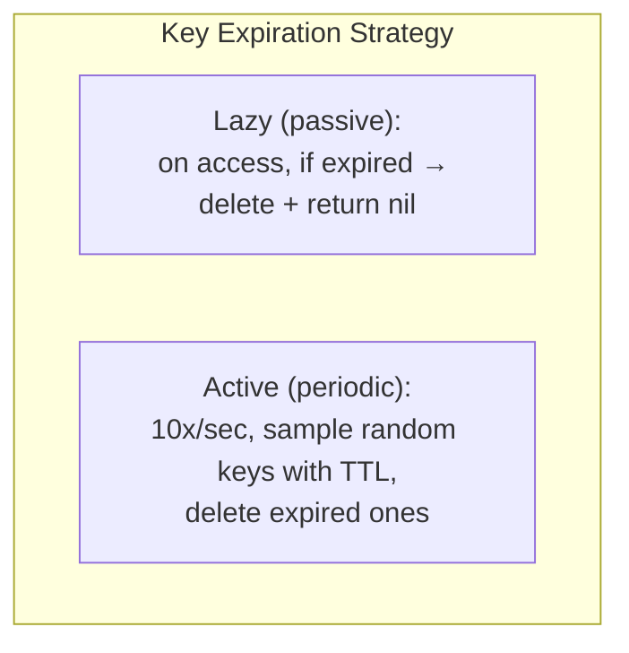

> [!WARNING]
> A key with a TTL is **not deleted at the exact moment it expires** — Redis deletes it either when you next access it (lazy) or when the background sampler happens to hit it (active). This means **expired keys can still occupy memory** until collected. Usually fine, but for memory-critical workloads it matters. It also means `DBSIZE` may count not-yet-collected expired keys.

### 2.4 Atomic Operations & Single-Threaded Model

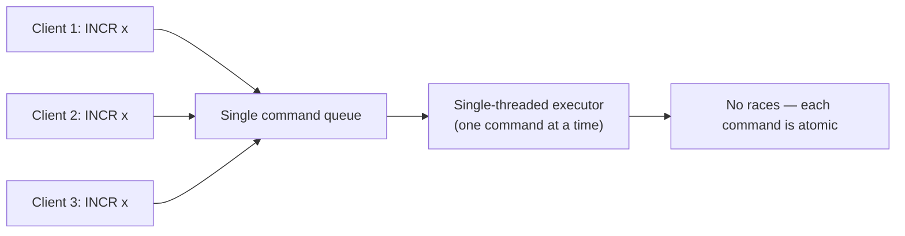

> [!IMPORTANT]
> **Redis executes commands one at a time on a single thread.** This is a feature, not a limitation: every individual command is **atomic** with no locks or race conditions. `INCR` can't lose an update; `SETNX` (set-if-not-exists) is a reliable lock primitive. Because operations are RAM-speed, one thread handles 100K+ ops/sec. (Redis 6+ added multi-threaded *I/O* for network, but **command execution stays single-threaded**.)

> [!WARNING]
> The flip side: a **single slow command blocks everything**. Running `KEYS *` (O(n) over all keys) or a big `SORT`/`SMEMBERS` on a huge collection freezes the whole server for every other client. **Never use `KEYS` in production** — use `SCAN` (cursor-based, non-blocking). Avoid O(n) commands on large data.

### 2.5 Transactions & Scripting

**MULTI/EXEC** — queue commands, execute atomically:

```bash
MULTI
INCR account:a:balance
DECR account:b:balance
EXEC                    # both run atomically, or WATCH-based abort
```

**WATCH** adds optimistic locking (abort if a key changed):

```bash
WATCH inventory:item1
val = GET inventory:item1
MULTI
SET inventory:item1 (val - 1)
EXEC                    # fails (nil) if inventory:item1 changed since WATCH
```

**Lua scripting** — true atomic multi-step logic server-side:

```lua
-- Atomic "decrement if positive" — runs as one atomic unit
local stock = tonumber(redis.call('GET', KEYS[1]))
if stock > 0 then
  redis.call('DECR', KEYS[1])
  return 1
else
  return 0
end
```

> [!TIP]
> For complex atomic logic (check-then-act), prefer a **Lua script** (`EVAL`) over MULTI/WATCH retry loops — the script runs atomically on the server with no round-trips and no race window. This is how robust rate limiters and distributed locks are built. Modern Redis also offers **Functions** (persistent server-side scripts).

### 2.6 Pipelining (cut network round-trips)

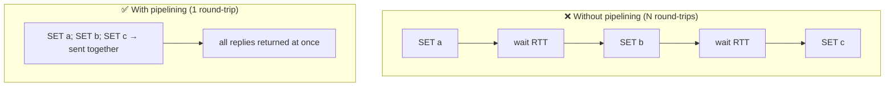

> [!TIP]
> If you issue many commands, the **network round-trip (RTT)** dominates — not Redis's execution. **Pipelining** sends many commands without waiting for each reply, collapsing N RTTs into one. For 1000 sequential ops over a 1ms-RTT link, that's ~1s → ~a few ms. Distinct from transactions: pipelining is about *throughput*, not atomicity.

---

## 3. ⚙️ ADVANCED CONCEPTS (Senior Level)

### 3.1 Persistence: RDB vs AOF

Redis is in-memory, but can persist to disk so data survives restarts:

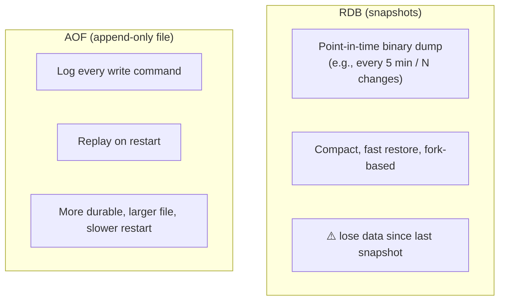

| Aspect | RDB | AOF |
|---|---|---|
| **What** | Periodic binary snapshot | Log of every write op |
| **Durability** | Lose data since last snapshot | Up to 1 sec loss (`everysec`) |
| **Restart speed** | Fast (compact file) | Slower (replay log) |
| **File size** | Small | Larger (rewrite/compact periodically) |
| **Performance impact** | Fork cost at snapshot | Small continuous write cost |

**`fsync` policies for AOF:** `always` (safest, slow), `everysec` (default — ≤1s loss), `no` (OS decides).

> [!IMPORTANT]
> **Best practice: enable BOTH.** RDB gives fast restarts and backups; AOF gives better durability (minimal data loss). On restart Redis uses AOF (more complete) if enabled. But remember: **if you use Redis purely as a cache, you may disable persistence entirely** — losing the cache just means repopulating from the DB. Persistence choice depends on whether Redis is a cache (optional) or a datastore (required).

### 3.2 Eviction Policies (when memory fills up)

When Redis hits `maxmemory`, it must decide what to drop:

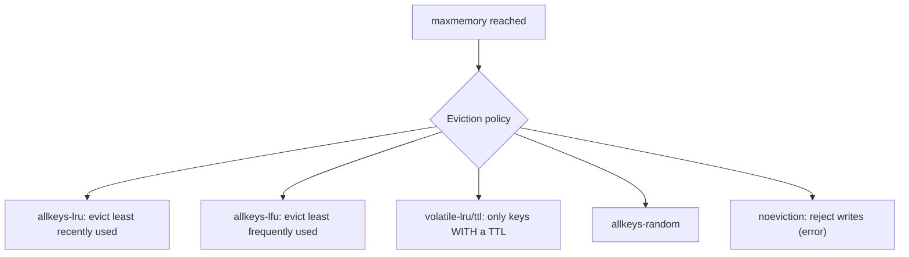

| Policy | Behavior | Use for |
|---|---|---|
| `noeviction` | Reject writes when full (default) | Redis as a **datastore** (don't lose data) |
| `allkeys-lru` | Evict least-recently-used | Redis as a **cache** (common choice) |
| `allkeys-lfu` | Evict least-frequently-used | Cache with skewed access patterns |
| `volatile-lru` | LRU among keys **with TTL** | Mixed cache + persistent keys |
| `volatile-ttl` | Evict soonest-to-expire | Prioritize keeping fresh data |

> [!WARNING]
> The default `noeviction` **rejects writes with an error when memory is full** — surprising if you assumed Redis auto-evicts. For a cache, set **`allkeys-lru`** (or `lfu`) + a `maxmemory` limit so Redis gracefully drops cold data instead of erroring. For a datastore where every key matters, keep `noeviction` and alert on memory. Mixing cache + persistent keys? Use `volatile-*` and set TTLs only on cache keys.

### 3.3 High Availability: Replication & Sentinel

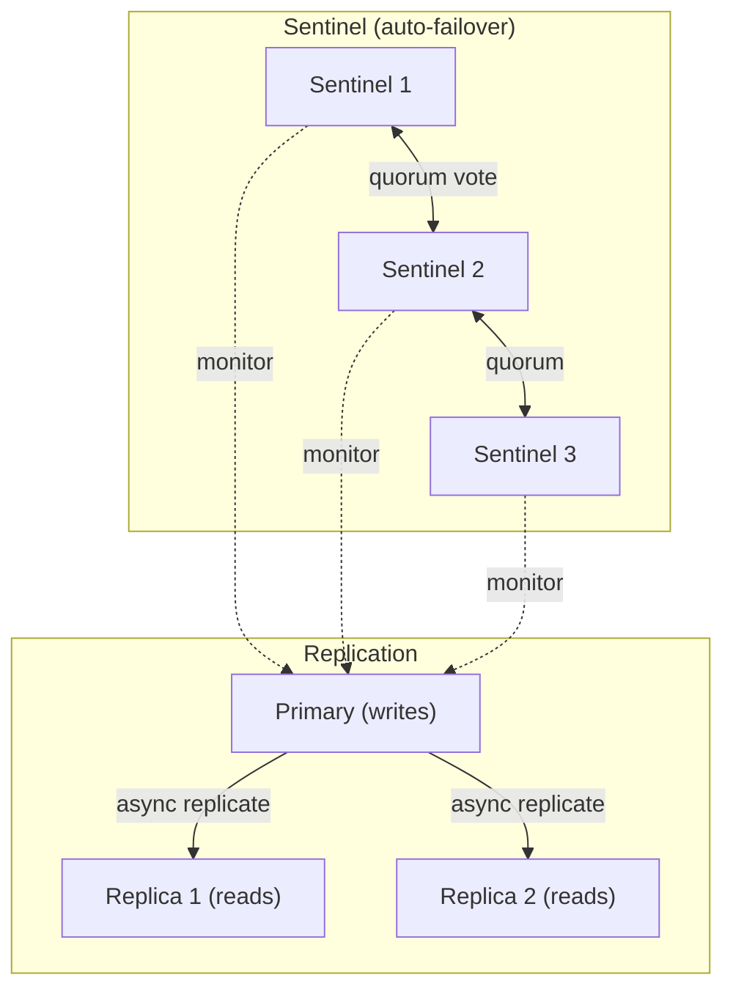

- **Replication**: a primary asynchronously copies data to replicas. Replicas serve **reads** (scale reads) and provide redundancy.
- **Sentinel**: a set of monitoring processes that detect primary failure and **automatically promote a replica** (with quorum to avoid split-brain), updating clients.

> [!WARNING]
> Redis replication is **asynchronous** — a primary acks a write before replicas have it. If the primary crashes right after acking, that write can be **lost** on failover. `WAIT numreplicas timeout` can force waiting for replicas, and Redis Enterprise offers stronger guarantees, but out of the box **Redis is not a strongly-consistent store**. Design around possible small data loss on failover (fine for caches; think carefully for critical data).

### 3.4 Redis Cluster (horizontal scaling / sharding)

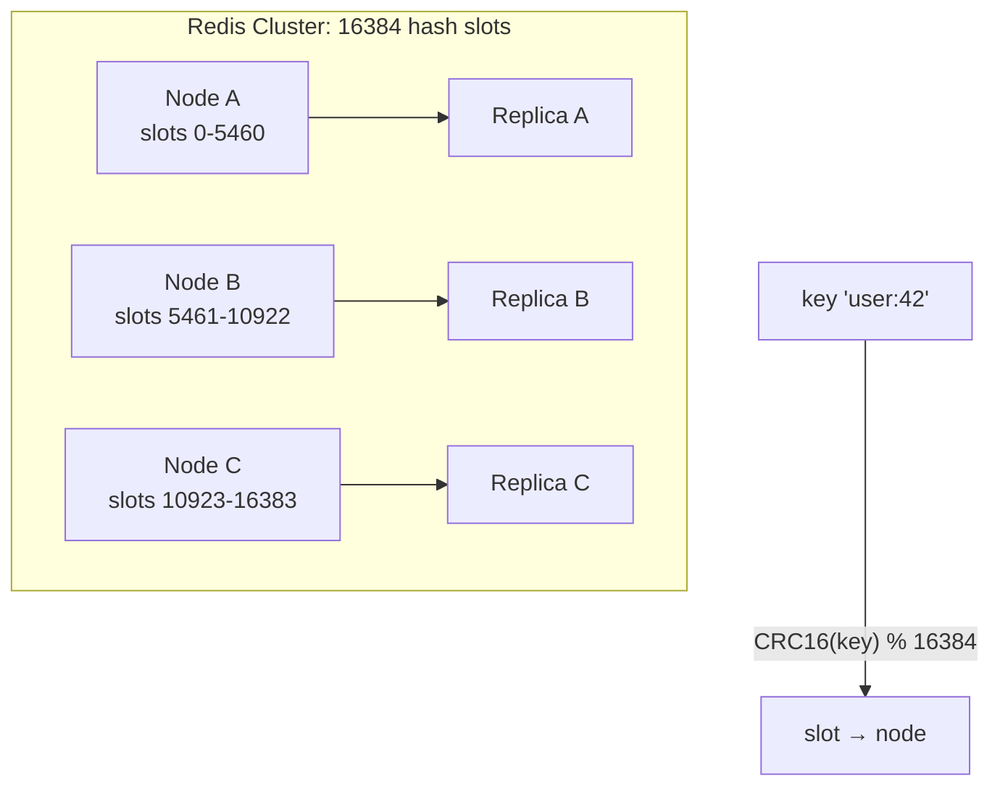

- Data is sharded across nodes by **16384 hash slots**: `slot = CRC16(key) % 16384`.
- Each node owns a slot range; each has replicas for HA.
- Scales **writes + memory** horizontally (Sentinel only scales reads/HA, not sharding).

> [!IMPORTANT]
> **Multi-key operations in Cluster only work if all keys are in the same slot.** `MSET a b c d` fails if keys land on different nodes. Use **hash tags** — `{user:42}:profile` and `{user:42}:sessions` — the `{...}` portion is what's hashed, forcing related keys onto the same slot so you can run multi-key ops (transactions, Lua) on them. Forgetting hash tags is the #1 Cluster migration surprise.

### 3.5 Caching Patterns

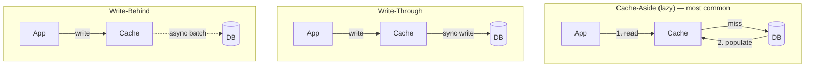

| Pattern | How | Trade-off |
|---|---|---|
| **Cache-aside** (lazy loading) | App checks cache, on miss loads from DB & populates | Simple, resilient; first request slow, possible staleness |
| **Read-through** | Cache library loads from DB on miss | Cleaner app code; needs cache provider support |
| **Write-through** | Write to cache + DB synchronously | Cache always fresh; slower writes |
| **Write-behind** | Write to cache, async flush to DB | Fast writes; risk of loss before flush |

> [!TIP]
> **Cache-aside is the default** for most apps. The key discipline is **invalidation**: on update, either delete the cache key (next read repopulates) or update it. "There are only two hard things in CS: cache invalidation and naming things" — stale caches are the classic bug. Pair cache-aside with a **TTL** as a safety net so even a missed invalidation self-corrects.

### 3.6 The Three Cache Killers

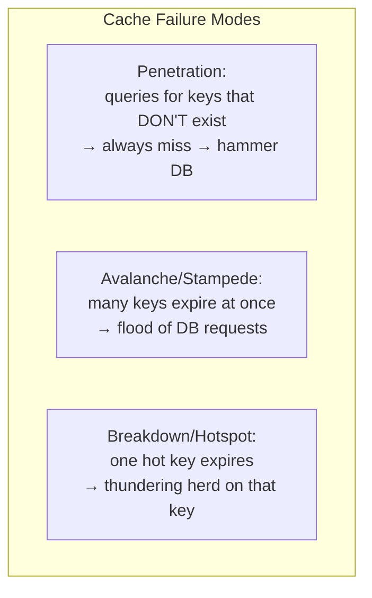

| Problem | Cause | Fix |
|---|---|---|
| **Cache Penetration** | Requests for non-existent keys bypass cache to DB (often malicious) | Cache the "null" result (short TTL); **Bloom filter** to reject unknown keys |
| **Cache Avalanche** | Mass simultaneous expiry / Redis down | **Randomized/jittered TTLs**; multi-layer cache; circuit breaker |
| **Cache Breakdown** | A single very hot key expires → concurrent rebuilds | **Mutex/lock** so one request rebuilds; logical expiry; never-expire hot keys |

> [!WARNING]
> **Cache stampede** is a real outage cause: a popular key expires, thousands of concurrent requests all miss simultaneously and hit the DB at once, potentially taking it down. Defenses: **jittered TTLs** (don't expire everything at the same second), a **rebuild lock** (`SETNX`) so only one worker regenerates the value while others wait/serve stale, or **probabilistic early expiration**.

### 3.7 Distributed Locks

```bash
# Acquire: SET with NX (only if absent) + PX (expiry) + unique token
SET lock:resource <random-token> NX PX 30000

# Release: only if we still own it (atomic via Lua)
EVAL "if redis.call('get',KEYS[1])==ARGV[1] then return redis.call('del',KEYS[1]) else return 0 end" 1 lock:resource <random-token>
```

> [!WARNING]
> A naive distributed lock (`SET NX`) has pitfalls: if the lock holder pauses (GC, network) past the TTL, the lock expires, another process acquires it, and now **two processes hold "the lock."** Always use a **unique token** and release only if you still own it (the Lua above), set a sensible TTL, and for critical correctness consider **Redlock** (multi-node) — though even Redlock is debated. For many cases, prefer designing idempotent operations over relying on perfect locks.

### 3.8 Pub/Sub & Streams

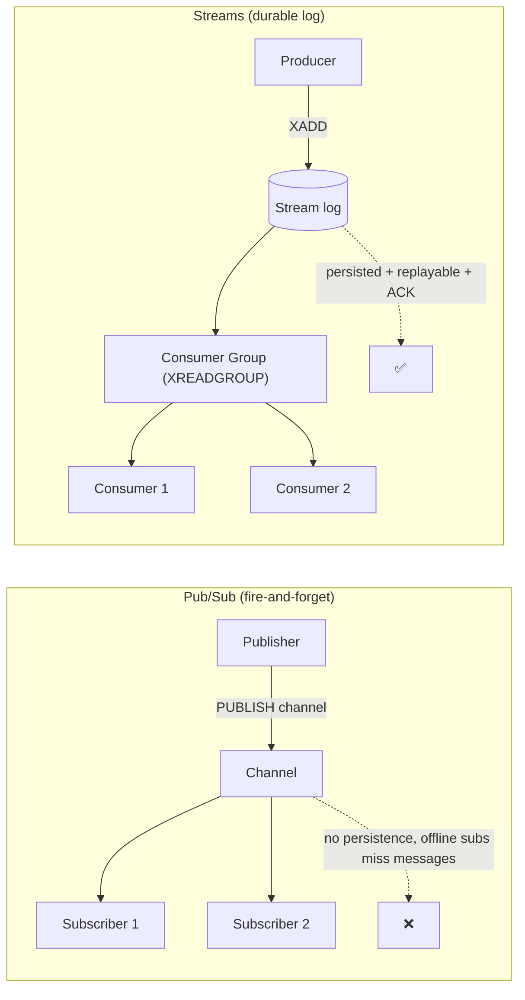

| | Pub/Sub | Streams |
|---|---|---|
| Persistence | None (transient) | Durable append-only log |
| Offline consumers | Miss messages | Read history later |
| Consumer groups | No | Yes (like [[01 Kafka]]) |
| Acknowledgment | No | Yes (`XACK`, pending list) |
| Use for | Live notifications, cache invalidation fan-out | Event streaming, reliable queues |

> [!TIP]
> **Redis Streams** are a lightweight, [[01 Kafka]]-like log with consumer groups, acknowledgments, and replay — great when you want event streaming without operating a full Kafka cluster. **Pub/Sub** is fire-and-forget: perfect for real-time notifications or broadcasting cache-invalidation events, but any subscriber that's offline **misses** the message entirely. Choose Streams when you need durability/at-least-once.

### 3.9 Failure Scenarios & Production Issues

| Failure | Symptom | Mitigation |
|---|---|---|
| **`KEYS *` in prod** | Server freezes | Use `SCAN`; ban `KEYS` |
| **Big keys** (huge list/hash) | Slow ops, blocking, uneven shards | Split keys; monitor with `--bigkeys` |
| **Memory full + noeviction** | Writes rejected | Set `maxmemory` + `allkeys-lru` |
| **Cache stampede** | DB overload on expiry | Jittered TTL, rebuild lock |
| **Data loss on failover** | Missing recent writes | Async replication reality; `WAIT`, plan for it |
| **Blocking slow command** | Latency spikes for all | Avoid O(n) cmds; use Lua carefully |
| **No TTLs** | Memory creep, stale data | Always set TTL on cache keys |
| **Hot key** | One shard/CPU saturated | Client-side cache, replicas, key splitting |
| **Fork latency (RDB/AOF rewrite)** | Periodic pauses | Tune save policy; enough free RAM for fork |
| **Unbounded connections** | `maxclients` errors | Connection pooling |

---

## 4. 🏗️ REAL-WORLD SYSTEM DESIGN USAGE

### 4.1 Redis in a Typical Architecture

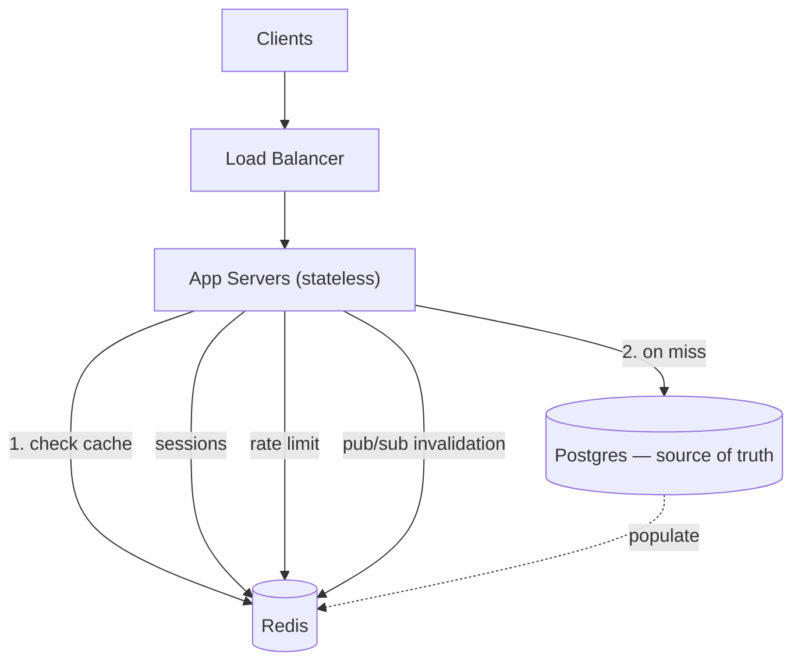

Redis sits **between** stateless app servers and the durable database ([[02 Postgres]]), serving hot reads, sessions, rate limits, and coordination — letting app servers stay stateless (essential for scaling in [[02 Kubernetes]]) and shielding the DB.

### 4.2 Common Production Use Cases

| Use case | How | Data type |
|---|---|---|
| **Database caching** | Cache-aside for expensive queries | String/Hash |
| **Session store** | Shared sessions across app instances | Hash + TTL |
| **Rate limiting** | Count requests per window | String `INCR` / Sorted Set |
| **Leaderboards** | Real-time rankings | Sorted Set |
| **Job queues** | Background task processing | List / Stream |
| **Real-time analytics** | Live counters, unique visitors | Bitmap / HyperLogLog |
| **Feature flags** | Fast toggle lookups | String / Hash |
| **Distributed locks** | Coordinate across instances | String `SET NX` |
| **Geospatial** | "Nearby" queries (ride-hailing) | Geo |
| **API response cache** | Cache full responses at the edge | String + TTL |

### 4.3 Sliding-Window Rate Limiter (real example)

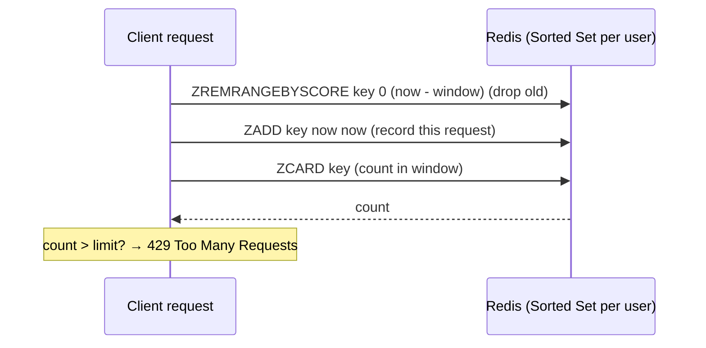

The sorted set stores request timestamps as scores; old ones are trimmed, and the cardinality is the count in the window — an accurate sliding-window limiter in ~3 atomic commands (often wrapped in one Lua script). Used everywhere for API throttling ([[06 Express.js]]/[[05 Spring Boot]]).

### 4.4 How big companies use Redis

| Company | Usage |
|---|---|
| **Twitter/X** | Timeline caching, fan-out |
| **GitHub** | Caching, background job queues (Resque) |
| **Stack Overflow** | Aggressive caching layer (famously few servers) |
| **Uber/Lyft** | Geospatial matching, rate limiting |
| **Pinterest, Snapchat** | Feed caching, real-time features |

### 4.5 Redis vs Alternatives

| Tool | vs Redis |
|---|---|
| **Memcached** | Simpler pure cache (strings only, multi-threaded); Redis has rich types, persistence, replication |
| **[[02 Postgres]]** | Durable, relational, complex queries; Redis is fast, in-memory, simple structures |
| **[[01 Kafka]]** | Durable high-throughput event streaming; Redis Streams is lighter-weight, in-memory |
| **[[03 MongoDB]]** | Document DB on disk; Redis is in-memory key-structure store |
| **Valkey** | Open-source Redis fork (post-license change); largely drop-in compatible |

> [!IMPORTANT]
> **Redis changed its license (2024) to non-open-source (RSALv2/SSPL)**, prompting the Linux Foundation to fork **Valkey** (BSD, drop-in compatible, backed by AWS/Google/Oracle). Many clouds now offer Valkey. For interviews/architecture, know that "Redis-compatible" increasingly means Redis *or* Valkey; the concepts here apply to both.

---

## 5. 🎤 INTERVIEW PREPARATION

### 5.1 Most important questions

<details>
<summary><b>Q1: Why is Redis so fast?</b></summary>

Three reasons: (1) **In-memory** — data in RAM, no disk seeks; (2) **Single-threaded command execution** — no lock contention or context-switching overhead, and every command is atomic; (3) **Efficient data structures + simple protocol (RESP)** with optimized C implementations. It routinely does 100K+ ops/sec with sub-millisecond latency.
</details>

<details>
<summary><b>Q2: Redis is single-threaded — isn't that a bottleneck?</b></summary>

For command execution, single-threaded is actually a strength: no locks, no races, atomic ops, and RAM-speed means one thread handles enormous throughput. Redis 6+ added **multi-threaded I/O** (network read/write) but keeps **command execution single-threaded**. To use more cores, run multiple instances / Redis Cluster. The risk is a single **slow command blocking all** — so avoid O(n) commands like `KEYS`.
</details>

<details>
<summary><b>Q3: RDB vs AOF persistence?</b></summary>

**RDB** = periodic binary snapshots — compact, fast restore, but you lose data since the last snapshot. **AOF** = append-only log of every write — more durable (≤1s loss with `everysec`), larger file, slower restart. Best practice: **enable both** (or neither if Redis is a pure cache).
</details>

<details>
<summary><b>Q4: How do you prevent memory from growing unbounded?</b></summary>

Set a **`maxmemory`** limit + an **eviction policy** (`allkeys-lru`/`lfu` for caches). Set **TTLs** on cache keys so they self-expire. Watch out: the default `noeviction` **rejects writes** when full instead of evicting.
</details>

<details>
<summary><b>Q5: Explain cache-aside and cache invalidation.</b></summary>

**Cache-aside**: app reads cache; on miss, loads from DB and populates cache. On write, **invalidate** (delete) or update the cache key. Add a **TTL** as a safety net so stale data self-corrects. Invalidation is the hard part — a stale cache is the classic bug.
</details>

<details>
<summary><b>Q6: What is cache stampede/avalanche and how do you prevent it?</b></summary>

Many keys (or one hot key) expiring simultaneously cause a flood of cache misses hitting the DB at once, potentially crashing it. Prevent with **jittered/randomized TTLs**, a **rebuild lock** (only one worker regenerates), serving stale during rebuild, or probabilistic early expiration.
</details>

<details>
<summary><b>Q7: Replication vs Sentinel vs Cluster?</b></summary>

**Replication** = primary copies to replicas (read scaling + redundancy). **Sentinel** = monitors + **auto-failover** (HA, no sharding). **Cluster** = **sharding** across nodes via 16384 hash slots (scales writes + memory horizontally), each shard with replicas. Sentinel for HA of a single dataset; Cluster when data/writes exceed one node.
</details>

<details>
<summary><b>Q8: How do you build a reliable distributed lock?</b></summary>

`SET lock <unique-token> NX PX <ttl>` to acquire; release with a **Lua script** that deletes only if the token matches (so you don't release someone else's lock). Set a sensible TTL for crash safety. For multi-node correctness, **Redlock** — but prefer idempotent design where possible, since async replication + timing can still cause edge cases.
</details>

<details>
<summary><b>Q9: When should you NOT use Redis?</b></summary>

When you need: strong durability guarantees for every write (async replication can lose data on failover), complex relational queries/joins ([[02 Postgres]]), datasets far larger than RAM economically, or strong consistency. Redis is a fast layer, not a replacement for a durable system of record.
</details>

### 5.2 Tricky questions

> [!TIP]
> **"Why never run `KEYS *` in production?"** — It's O(n) over the entire keyspace and, because Redis is single-threaded, it **blocks every other client** until it finishes. On millions of keys that's a multi-second freeze. Use `SCAN` (cursor-based, incremental).

> [!TIP]
> **"Does a key disappear the instant its TTL hits?"** — No. Expiration is **lazy** (on access) + **active** (periodic random sampling). An expired key may linger in memory until collected.

> [!TIP]
> **"Is `INCR` safe with concurrent clients?"** — Yes — single-threaded execution makes it atomic. No lost updates, no locks needed. This is why Redis counters are reliable for rate limiting.

> [!TIP]
> **"Pipelining vs Transactions — same thing?"** — No. **Pipelining** batches commands to save round-trips (throughput). **MULTI/EXEC transactions** guarantee atomic, isolated execution. You can pipeline non-atomically, or use MULTI for atomicity.

### 5.3 Common mistakes candidates make

| Mistake | Reality |
|---|---|
| "Redis is just a cache" | It's a data-structure server (queues, locks, leaderboards…) |
| Using `KEYS` in prod | Blocks everything — use `SCAN` |
| No TTL on cache keys | Memory creep + stale data |
| Assuming strong durability | Async replication can lose writes on failover |
| Storing giant JSON in strings | Use hashes/native types |
| Ignoring eviction policy | Default `noeviction` rejects writes when full |
| One big key | Blocks ops, skews Cluster shards |
| Naive `SET NX` lock without token | Can release another process's lock |

### 5.4 What interviewers actually expect

- Redis as a **data-structure store**, mapping problems → the right type.
- Deep grasp of the **single-threaded atomic model** and its `KEYS`/slow-command implications.
- **Persistence (RDB/AOF), eviction, TTL** trade-offs.
- **Caching patterns + invalidation + stampede** defenses.
- **HA topology** (replication/Sentinel/Cluster) and the **async-replication data-loss** honesty.
- Knowing **when NOT to use Redis**.

---

## 6. 🛠️ HANDS-ON PROJECTS

### Project 1: Cache-Aside Layer for an API (Beginner→Intermediate)

**Goal:** Add Redis caching in front of a [[02 Postgres]]-backed API.

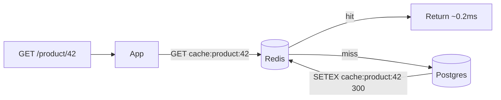

**Steps:**
1. Run Redis + [[02 Postgres]] via Docker Compose ([[01 Docker]]).
2. On read: check `cache:product:{id}`; on miss, query DB, `SETEX` with a TTL.
3. On update: **invalidate** (delete) the key.
4. Add **jittered TTLs** to avoid synchronized expiry.
5. Measure latency + DB load with and without the cache.

**Learn:** cache-aside, TTL, invalidation, hit/miss metrics.

---

### Project 2: Rate Limiter + Session Store + Leaderboard (Intermediate→Senior)

**Goal:** Use three data types for three real features.

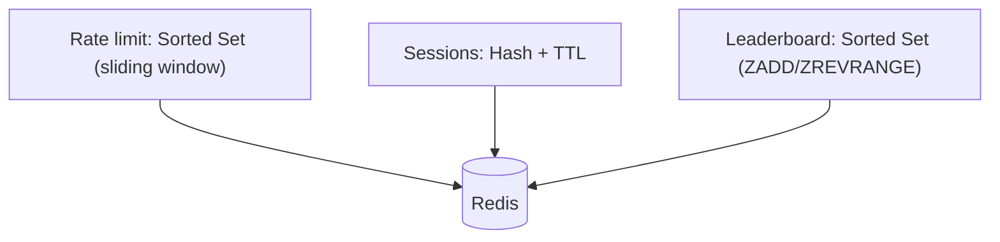

**Steps:**
1. **Rate limiter**: sliding-window with a sorted set (or fixed-window `INCR`+`EXPIRE`), wrapped in a **Lua script** for atomicity — integrate as [[06 Express.js]]/[[05 Spring Boot]] middleware.
2. **Session store**: store session as a Hash with a TTL; app servers stay stateless.
3. **Leaderboard**: `ZADD` scores, `ZREVRANGE` for top-N, `ZRANK` for a user's rank.
4. Load-test the rate limiter for correctness under concurrency.

**Learn:** sorted sets, hashes, Lua atomicity, TTL, real feature design.

---

### Project 3: HA Redis + Streams Event Pipeline (Senior)

**Goal:** Run resilient Redis and a durable event queue.

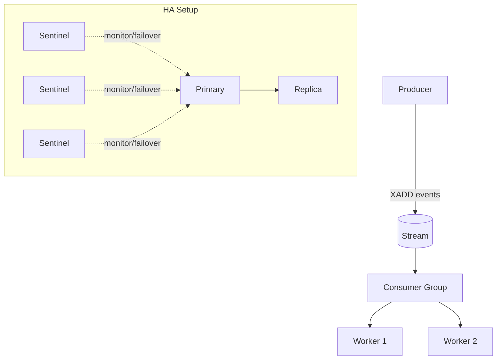

**Steps:**
1. Deploy a primary + replicas + 3 Sentinels (or Redis Cluster) — on [[02 Kubernetes]] via a Helm chart ([[03 Helm Charts]]).
2. Configure `maxmemory` + `allkeys-lru`, and RDB+AOF persistence.
3. Build a **Streams** pipeline: `XADD` producers, `XREADGROUP` consumers with `XACK` + pending-list handling for failures.
4. Kill the primary → observe Sentinel failover; verify the app reconnects.
5. Compare Streams vs Pub/Sub for a reliability-sensitive event.

**Learn:** replication, Sentinel failover, eviction/persistence config, Streams consumer groups, HA operations.

---

## 7. 🔬 DEEP DIVE: INTERNALS

### 7.1 The Single-Threaded Event Loop

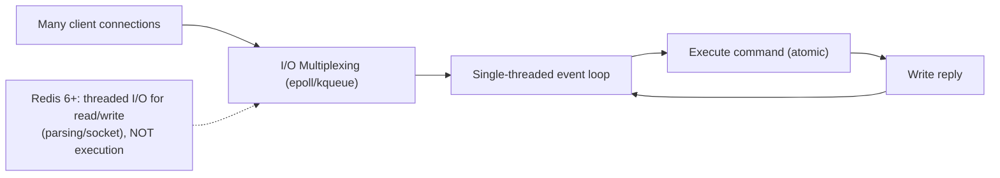

> [!IMPORTANT]
> Redis handles thousands of connections on **one thread** using **I/O multiplexing** (`epoll` on Linux) — the same pattern as [[05 Node.js]]'s event loop. It never blocks on a slow client; it processes ready sockets in a loop. Command **execution** is serialized (atomic), while Redis 6+ parallelizes only the **network I/O** (reading/writing/parsing) across threads. This is why "Redis is single-threaded" is true for *logic* but nuanced for *I/O*.

### 7.2 Memory Efficiency & Encodings

Redis picks compact internal encodings based on size:

| Type | Small encoding | Large encoding |
|---|---|---|
| Hash | `listpack` (compact array) | `hashtable` |
| List | `listpack` | `quicklist` (linked listpacks) |
| Set | `intset` (all ints) / `listpack` | `hashtable` |
| Sorted Set | `listpack` | `skiplist` + hashtable |

> [!TIP]
> Small collections use **listpack** (a compact, cache-friendly contiguous encoding) instead of full hash tables — saving huge memory. Configs like `hash-max-listpack-entries` control the threshold. This is why **many small hashes** can be far more memory-efficient than one giant hash or many top-level string keys. Sorted sets use a **skiplist** (probabilistic balanced structure) for O(log n) ranked ops.

### 7.3 RESP Protocol

```
Client: *3\r\n$3\r\nSET\r\n$3\r\nfoo\r\n$3\r\nbar\r\n   (SET foo bar)
Server: +OK\r\n
```

**RESP (REdis Serialization Protocol)** is a simple, human-readable, binary-safe text protocol. Its simplicity is part of Redis's speed and why clients exist for every language. RESP3 (newer) adds richer types (maps, push messages for client-side caching).

### 7.4 Fork-Based Persistence (Copy-on-Write)

```mermaid
flowchart TB
    Parent["Redis process (serving traffic)"] -->|fork()| Child["Child process"]
    Child --> Write["Write RDB snapshot to disk"]
    Parent -.->|"COW: only modified pages copied"| Mem["Shared memory pages"]
```

> [!IMPORTANT]
> For RDB snapshots and AOF rewrites, Redis **`fork()`s** a child process that writes to disk while the parent keeps serving. Thanks to OS **copy-on-write**, the child shares the parent's memory pages; only pages *modified during the save* get duplicated. Implication: a save can transiently need **up to ~2× memory** if the whole dataset is written during the fork — so keep enough free RAM, or a snapshot can trigger swapping / OOM. This "fork latency" is a real source of periodic pauses on large instances.

### 7.5 Client-Side Caching (RESP3 tracking)

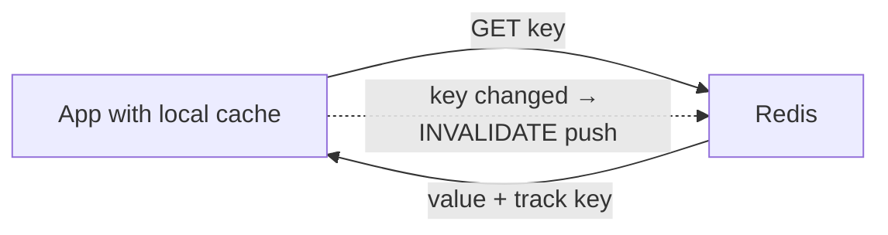

Modern Redis (6+, RESP3) supports **server-assisted client-side caching**: the client caches values locally and Redis **pushes invalidation** messages when a tracked key changes. This eliminates network round-trips for the hottest keys — a powerful optimization for read-heavy workloads and a defense against hot-key bottlenecks.

---

## ✅ Production Checklists

### Configuration
- [ ] `maxmemory` set with an **eviction policy** (`allkeys-lru`/`lfu` for cache)
- [ ] **TTLs** on all cache keys (with jitter)
- [ ] Persistence chosen deliberately (RDB+AOF for datastore; off for pure cache)
- [ ] `appendfsync everysec` (or `always` if durability-critical)
- [ ] Protected mode / auth (`requirepass` / ACLs) + TLS
- [ ] `maxclients` + client connection **pooling**

### Reliability
- [ ] Replication (primary + replicas)
- [ ] **Sentinel** (3+) or **Cluster** for HA/failover
- [ ] Cluster keys use **hash tags** for multi-key ops
- [ ] Aware of async-replication data-loss window; `WAIT` where needed
- [ ] Backups (RDB snapshots) shipped off-box + restore-tested
- [ ] Enough free RAM for **fork** (COW) during saves

### Performance & Safety
- [ ] **`KEYS` banned**; use `SCAN`
- [ ] No large O(n) commands on big collections
- [ ] Monitor **big keys** (`--bigkeys`) and hot keys
- [ ] **Pipelining** for bulk ops
- [ ] Cache-stampede defenses (jitter + rebuild lock)
- [ ] Metrics: hit ratio, memory, evictions, latency, connected clients, replication lag
- [ ] Slow-log monitored

---

## 🗺️ Learning Roadmap

```mermaid
flowchart TB
    A["1️⃣ Basics<br/>what/why, in-memory, CLI, strings"] --> B["2️⃣ Data types<br/>hash, list, set, sorted set, streams"]
    B --> C["3️⃣ Keys & TTL<br/>expiry, naming, atomic ops"]
    C --> D["4️⃣ Caching<br/>cache-aside, invalidation, stampede"]
    D --> E["5️⃣ Persistence & eviction<br/>RDB/AOF, maxmemory, policies"]
    E --> F["6️⃣ HA & scaling<br/>replication, Sentinel, Cluster"]
    F --> G["7️⃣ Patterns<br/>rate limit, locks, queues, leaderboards, pub/sub"]
    G --> H["8️⃣ Internals<br/>event loop, encodings, RESP, fork/COW"]
```

| Stage | Focus | You can... |
|---|---|---|
| 1–3 | Basics + types + TTL | Model data and use core commands |
| 4–5 | Caching + persistence | Build a real cache layer safely |
| 6–7 | HA + patterns | Run resilient Redis + real features |
| 8 | Internals | Reason about performance at a deep level |

---

## 🔁 Self-Review Completion Loop

Reviewed against official Redis docs, best practices, edge cases, interview patterns, and production scenarios.

### Gap Review Matrix

| Dimension | Covered? | Where |
|---|---|---|
| What/why, in-memory model | ✅ | §1 |
| All data types | ✅ | §2.1 |
| Keys, TTL, expiration | ✅ | §2.2–2.3 |
| Single-threaded atomic model | ✅ | §2.4, §7.1 |
| Transactions & Lua scripting | ✅ | §2.5 |
| Pipelining | ✅ | §2.6 |
| Persistence (RDB/AOF) | ✅ | §3.1 |
| Eviction policies | ✅ | §3.2 |
| Replication & Sentinel | ✅ | §3.3 |
| Cluster & hash slots/tags | ✅ | §3.4 |
| Caching patterns | ✅ | §3.5 |
| Cache penetration/avalanche/breakdown | ✅ | §3.6 |
| Distributed locks | ✅ | §3.7 |
| Pub/Sub vs Streams | ✅ | §3.8 |
| Failure scenarios | ✅ | §3.9 |
| Architecture placement | ✅ | §4.1 |
| Use cases + rate limiter | ✅ | §4.2–4.3 |
| Redis vs alternatives + Valkey/license | ✅ | §4.5 |
| Event loop / I/O multiplexing | ✅ | §7.1 |
| Memory encodings (listpack/skiplist) | ✅ | §7.2 |
| RESP protocol | ✅ | §7.3 |
| Fork / copy-on-write persistence | ✅ | §7.4 |
| Client-side caching (RESP3) | ✅ | §7.5 |
| Interview Q&A + mistakes | ✅ | §5 |
| Hands-on projects | ✅ | §6 |

> [!NOTE]
> **Remaining depth to explore independently:** Redis modules (RedisJSON, RediSearch, RedisBloom, RedisTimeSeries), Redis as a primary DB (Redis Stack), ACL fine-grained security, keyspace notifications, `CLIENT NO-EVICT`/`MEMORY DOCTOR`, active-active geo-replication (CRDTs in Redis Enterprise), and Valkey's divergence from Redis post-fork.

---

## 📚 Official References

| Resource | URL |
|---|---|
| Redis Docs | https://redis.io/docs/latest/ |
| Data Types | https://redis.io/docs/latest/develop/data-types/ |
| Commands Reference | https://redis.io/commands/ |
| Persistence | https://redis.io/docs/latest/operate/oss_and_stack/management/persistence/ |
| Replication | https://redis.io/docs/latest/operate/oss_and_stack/management/replication/ |
| Redis Cluster | https://redis.io/docs/latest/operate/oss_and_stack/management/scaling/ |
| Sentinel | https://redis.io/docs/latest/operate/oss_and_stack/management/sentinel/ |
| Client-side caching | https://redis.io/docs/latest/develop/reference/client-side-caching/ |
| Valkey (fork) | https://valkey.io/ |

---

## 🎁 Final Summary

> [!IMPORTANT]
> **The one-paragraph takeaway:** Redis is an **in-memory data structure store** delivering sub-millisecond access to strings, hashes, lists, sets, sorted sets, and streams — each with **atomic** operations thanks to its **single-threaded** execution model. It's the go-to for **caching, sessions, rate limiting, leaderboards, queues, locks, and real-time features**. Master the **data types** (map each problem to the right one), **TTL + eviction + persistence** trade-offs, **cache-aside + invalidation + stampede** defenses, and the **replication/Sentinel/Cluster** HA topology — while remembering Redis uses **async replication** (small data-loss window on failover) and is a fast *layer*, not a durable system of record. Avoid `KEYS` and O(n) commands (single thread = one slow command blocks all). It sits beside [[02 Postgres]] and in front of your app, and is often the difference between a system that scales and one that melts under load.

**Golden rules:**
1. 🧠 Redis is a **data-structure server**, not just a cache — pick the right type.
2. ⚡ **Single-threaded = atomic**, but one slow command blocks all — **never `KEYS`**, use `SCAN`.
3. ⏳ Put **TTLs** on cache keys (with jitter); set `maxmemory` + **`allkeys-lru`**.
4. 🔁 **Cache-aside + invalidation**; defend against **stampede** (jitter + rebuild lock).
5. 💾 Choose **persistence** deliberately (RDB+AOF for datastore, off for pure cache).
6. 🛡️ HA = **replication + Sentinel** (or **Cluster** for sharding) — but replication is **async** (plan for loss).
7. 🔒 Distributed locks: `SET NX PX` + **unique token** + Lua release; prefer idempotency.
8. 📦 It's a fast **layer beside** [[02 Postgres]] — not a replacement for your durable database.

---

*Related guides in this vault: [[02 Postgres]] · [[03 MongoDB]] · [[01 Kafka]] · [[05 Node.js]] · [[05 Spring Boot]] · [[03 Microservices]] · [[02 Kubernetes]] · [[01 Docker]] · [[06 Express.js]]*
