# ⚡ Caching Strategies — Complete Beginner-to-Expert Reference

> How to make systems fast by *not doing work twice* — cache-aside, write-through, write-back, the **invalidation** problem, **eviction** policies, TTLs, the caching layers from CPU to CDN, and the failure modes (stampede, penetration, avalanche) that take systems down.

---

## 📑 Table of Contents

1. [Executive Summary](#-executive-summary)
2. [Fundamentals (Beginner)](#1--fundamentals-beginner-level)
3. [Core Concepts (Intermediate)](#2--core-concepts-intermediate-level)
4. [Advanced Concepts (Senior)](#3--advanced-concepts-senior-level)
5. [Real-World System Design](#4--real-world-system-design-usage)
6. [Interview Preparation](#5--interview-preparation)
7. [Hands-On Projects](#6--hands-on-projects)
8. [Deep Dive: Internals](#7--deep-dive-internals)
9. [Production Checklists](#-production-checklists)
10. [Learning Roadmap](#-learning-roadmap)
11. [Self-Review Completion Loop](#-self-review-completion-loop)
12. [Official References](#-official-references)
13. [Final Summary](#-final-summary)

---

## 🎯 Executive Summary

**Caching** is storing the result of expensive work (a database query, a computation, an API call) in a fast, temporary store so future requests can reuse it instead of redoing the work. It's the single highest-leverage performance technique in software — a well-placed cache can turn a 200ms database query into a 1ms memory lookup and cut load on your backend by 90%+. But caching introduces the hardest problem in computer science: **keeping cached data consistent with the source of truth** (invalidation).

| What it is | What it replaces | Core superpower |
|---|---|---|
| Fast temporary storage of computed/fetched results | Recomputing/refetching the same data every time | **Massive latency reduction + load offloading** — trading a little staleness for enormous speed |

> [!IMPORTANT]
> The fundamental caching trade-off, and the thing every decision comes back to: **caching trades consistency (and memory) for speed.** A cache is a *copy* of data that lives closer/faster than the source — so by definition it can become **stale** (out of date) when the source changes. Every caching strategy is really a different answer to *"how do we keep the cache fresh enough while staying fast?"* This is why Phil Karlton's famous quip — *"There are only two hard things in Computer Science: cache invalidation and naming things"* — is only half a joke. Caching is easy to add and hard to get right, because the bugs (serving stale data, cache/DB inconsistency, thundering herds) are subtle and appear under load. This guide deepens [[04 Redis]] (the tool), and connects to [[01 HTTP Deep Dive]] (HTTP caching/CDN), [[01 SQL and Transactions Deep Dive]] (what you're caching), and [[01 System Design Fundamentals]] (where caches fit).

Related guides: [[04 Redis]] · [[01 HTTP Deep Dive]] · [[01 System Design Fundamentals]] · [[01 SQL and Transactions Deep Dive]] · [[06 Distributed Systems]] · [[02 Postgres]] · [[06 API Gateway]]

---

## 1. 🌱 FUNDAMENTALS (Beginner Level)

### What is a cache and why does it work?

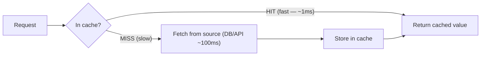

> [!IMPORTANT]
> A **cache** is a fast, temporary store that holds copies of data so repeated requests avoid the slow original source. Caching works because of two real-world properties: **temporal locality** (data accessed once is likely accessed again soon — a popular product, a logged-in user's profile) and the huge **latency gap** between storage tiers (memory is ~100,000× faster than disk; a local cache is far faster than a network call to a database). When a request finds its data in the cache, that's a **cache hit** (fast); when it doesn't, that's a **cache miss** (fall through to the source, then usually populate the cache). The **hit ratio** (hits ÷ total requests) is *the* key metric — a 90% hit ratio means 90% of requests never touch your slow backend. Caching is powerful precisely because real workloads are skewed: a small fraction of data (hot keys) serves most requests (the Pareto/80-20 principle).

### The latency numbers that justify caching

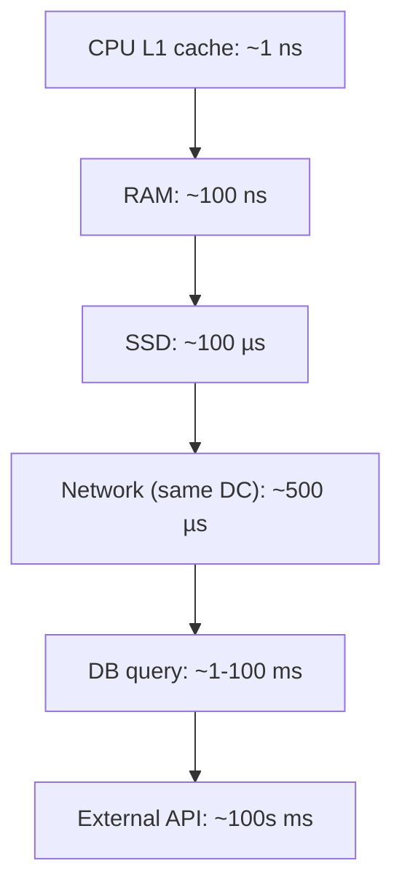

| Operation | Approx. latency | Relative |
|---|---|---|
| In-process memory cache | ~0.1 µs | 1× |
| Redis (network round-trip) | ~0.5–1 ms | ~10,000× |
| Database query | ~1–100 ms | ~1,000,000× |
| External API call | ~100s ms | huge |

> [!TIP]
> These orders-of-magnitude gaps are *why* caching is so effective. Serving from an in-memory cache instead of a database query isn't a 2× improvement — it's often 100–1000×. And offloading reads from the database doesn't just make *those* requests fast; it frees the database to handle writes and reduces the need to scale it. This is why caching is usually the *first* performance lever pulled in [[01 System Design Fundamentals]] — cheaper and faster to add than sharding or bigger servers. But note the tiers: an **in-process** cache (data in your app's memory) is faster than a **distributed** cache like [[04 Redis]] (a network hop away), which is faster than the database — each layer trades speed for shareability and capacity (§2.5).

### Cache hit, miss, and hit ratio

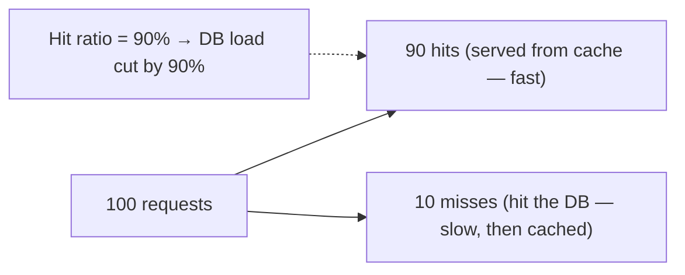

> [!IMPORTANT]
> The **hit ratio** determines a cache's value. A low hit ratio (say 20%) means the cache barely helps — most requests still hit the slow source, *plus* you pay the cache-lookup overhead. A high hit ratio (90%+) means the cache absorbs most load. What drives hit ratio: **cache size** (bigger fits more), **eviction policy** (keep the *right* data — §2.4), **TTL** (how long entries live), and crucially **access pattern** (skewed/hot data caches well; uniformly random access caches poorly — there's no "hot" data to keep). A key senior instinct: **not everything should be cached.** Data that's rarely re-read, or changes on every access, has a low hit ratio and isn't worth caching. Measure the hit ratio in production ([[02 Observability]]) — a cache you're not measuring is a cache you don't understand.

### Real-world analogy 🍳

A cache is like keeping **frequently-used ingredients on the kitchen counter** instead of the pantry/store:
- The **counter** (cache) holds what you use often — grabbing salt from the counter (hit) is instant vs walking to the pantry (miss, slow).
- **Limited counter space** (cache size) means you keep only what you use most; when it fills, you put away the least-used items (**eviction**).
- Ingredients **spoil** (TTL) — you toss old items even if there's room, to avoid using something stale.
- The hard part: if you buy fresh milk (the source changes), the carton on your counter is now **stale** — you must remember to replace it (**invalidation**), or you'll cook with expired milk (serve wrong data).

> [!TIP]
> Beginner takeaway: a cache stores results of expensive work in a fast store to avoid redoing it, exploiting the fact that data is reused and that faster storage is dramatically faster. The two hard parts are **eviction** (what to keep when space is limited) and **invalidation** (keeping copies fresh when the source changes). Everything advanced is about managing those two under real-world load.

---

## 2. 🧩 CORE CONCEPTS (Intermediate Level)

### 2.1 Cache-Aside (Lazy Loading) — the most common pattern

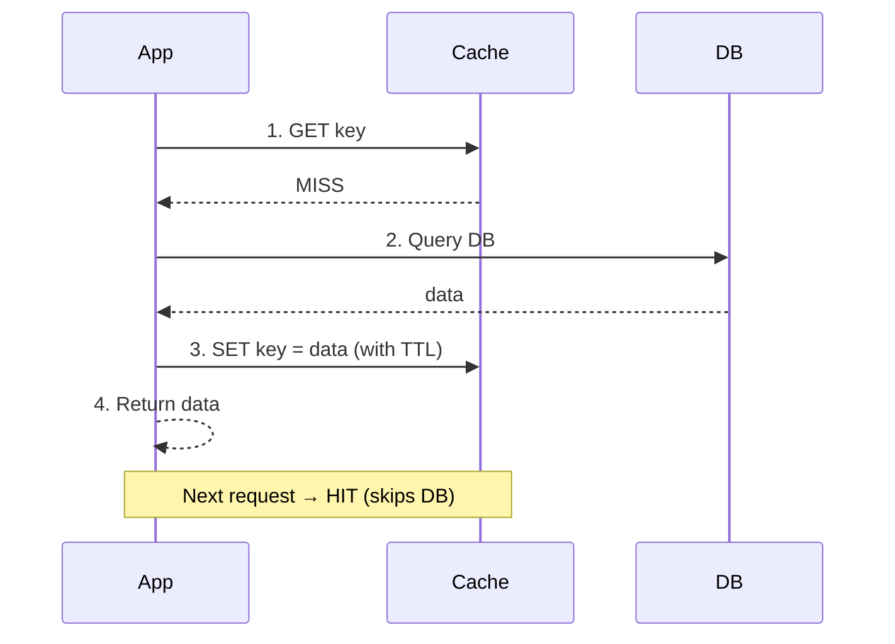

> [!IMPORTANT]
> **Cache-aside** (aka lazy loading) is by far the most common pattern: the *application* manages the cache. On a read, it checks the cache first; on a **miss**, it queries the database, stores the result in the cache, and returns it. On a write, it updates the database and **invalidates** (deletes) the cache entry. Pros: **only requested data is cached** (memory-efficient — you never cache what's never read), and it's **resilient** (if the cache dies, the app still works by hitting the DB, just slower). Cons: **every miss costs three trips** (check cache, query DB, populate cache) — so the first request for any key is always slow (a "cold cache"); and there's a **consistency window** — the classic race where the cache can end up stale (§3.1). This is the pattern you'll implement 90% of the time with [[04 Redis]], and interviewers expect you to draw this exact sequence.

### 2.2 Write Strategies — Through, Back, Around

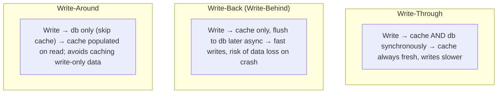

| Strategy | Write path | Pros | Cons |
|---|---|---|---|
| **Write-through** | Cache + DB together (sync) | Cache always consistent | Slower writes; caches data that may never be read |
| **Write-back** | Cache now, DB later (async) | Very fast writes, absorbs bursts | **Data loss risk** if cache crashes before flush |
| **Write-around** | DB only; cache on read | Avoids polluting cache with rarely-read writes | Recently-written data is a cache miss |

> [!IMPORTANT]
> Where **reads** use cache-aside, **writes** have three strategies. **Write-through** writes to cache *and* database synchronously — the cache is always consistent with the DB, but writes are slower (two writes) and you cache data that may never be read. **Write-back (write-behind)** writes only to the cache and flushes to the DB *asynchronously* later — extremely fast writes that absorb bursts (great for high write volume, like counters/metrics), but **you can lose data** if the cache crashes before flushing (a serious durability trade-off — [[01 SQL and Transactions Deep Dive]]'s "D"). **Write-around** writes straight to the DB, skipping the cache, so the cache only fills on reads — good when written data isn't immediately re-read (avoiding cache pollution). Real systems mix these: often **cache-aside reads + write-through or write-around**. The choice hinges on your read/write ratio and how much you can tolerate losing recent writes.

### 2.3 TTL & Expiration

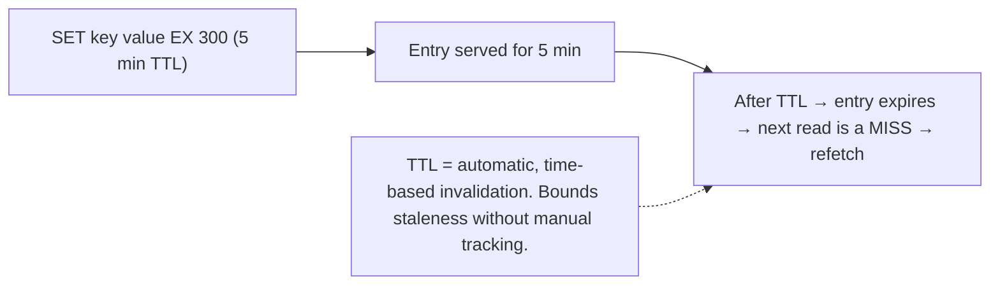

> [!IMPORTANT]
> **TTL (Time To Live)** is the simplest and most important invalidation tool: each cache entry expires automatically after a set time. This **bounds staleness** — a 5-minute TTL means data is *at most* 5 minutes out of date, no matter what — without any manual tracking of what changed. It's the pragmatic escape from the invalidation problem: instead of perfectly tracking every change, you accept "eventually consistent within N seconds." Choosing the TTL is a judgment call: **short TTL** = fresher data but lower hit ratio (more misses/refetches); **long TTL** = higher hit ratio but staler data. Match it to how tolerant the data is of staleness — a stock price needs seconds, a product description can be hours, a country list can be days. A subtle danger: **many keys with the *same* TTL expire simultaneously**, causing a load spike (cache avalanche, §3.4) — mitigate with **TTL jitter** (randomize expiry slightly).

### 2.4 Eviction Policies — what to remove when full

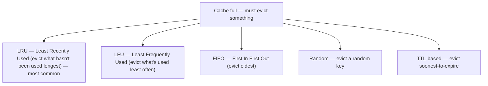

> [!IMPORTANT]
> A cache has **limited memory**, so when it's full and a new entry arrives, it must **evict** an existing one. The policy determines *which*, and it directly affects hit ratio. **LRU (Least Recently Used)** — evict the entry not accessed for the longest time — is the most popular default (exploits temporal locality: recently-used data is likely to be used again). **LFU (Least Frequently Used)** — evict the least-accessed entry — is better when popularity is stable over time (a genuinely hot key shouldn't be evicted just because it wasn't touched in the last minute). **FIFO** (evict oldest inserted) is simple but ignores usage. [[04 Redis]] offers configurable policies (`allkeys-lru`, `allkeys-lfu`, `volatile-*`, etc.). The right policy depends on your access pattern — LRU for recency-driven access, LFU for stable-popularity access. Modern caches use approximations (Redis samples a few keys rather than tracking exact LRU order — §7.1) because exact LRU is expensive.

### 2.5 The Caching Layers — from CPU to CDN

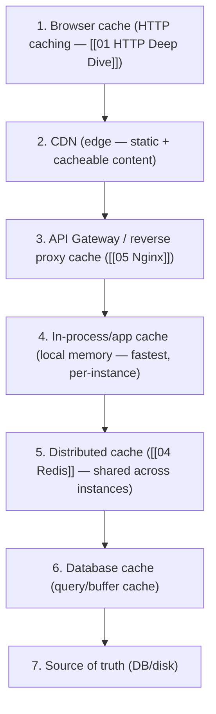

> [!TIP]
> Caching happens at **many layers**, and a request ideally never reaches the bottom. **Browser cache** (client-side, via HTTP headers — [[01 HTTP Deep Dive]]). **CDN** (geographically-distributed edge caches for static assets and cacheable responses — closest to the user). **Reverse-proxy cache** ([[05 Nginx]]/[[06 API Gateway]]). **In-process cache** (data in your app's own memory — nanosecond-fast but *per-instance* and not shared, so it can go stale across instances). **Distributed cache** ([[04 Redis]]/Memcached — shared across all app instances, network hop, the workhorse of most systems). **Database caches** (query cache, buffer pool). Each layer trades speed for scope: in-process is fastest but unshared; distributed is shared but slower; CDN is closest to users but only for cacheable content. Senior design is about placing caches at the *right* layers — cache static assets at the CDN, session/query data in Redis, hot config in-process — so each request short-circuits as early as possible.

### 2.6 In-Process vs Distributed Cache

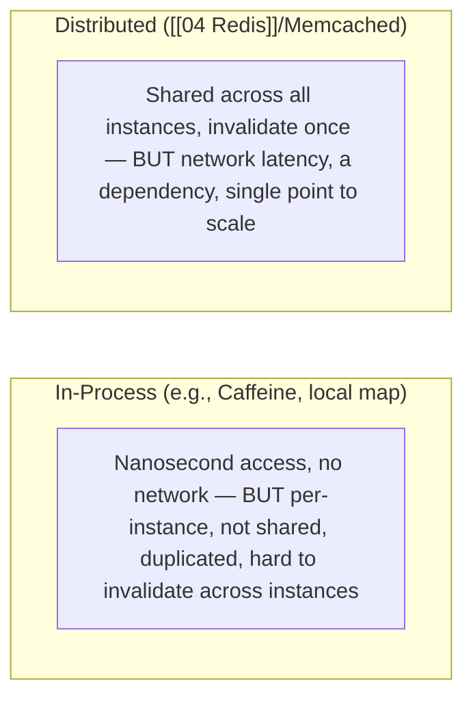

> [!IMPORTANT]
> A core architectural choice: **in-process** vs **distributed** caching. An **in-process cache** (Caffeine/Guava in Java, a Map in memory) lives inside your application — blazing fast (no serialization, no network) but **local to one instance**: with 10 app servers you have 10 separate caches that can disagree, waste memory (same data 10×), and are hard to invalidate consistently (you'd have to tell all 10). A **distributed cache** ([[04 Redis]]) is a separate shared service — one source, invalidate once, consistent across all instances, survives app restarts — at the cost of network latency and being an external dependency to run/scale. The common **hybrid**: a small in-process L1 cache (for the hottest, most-stable data) backed by a distributed L2 (Redis) — the app checks local memory first, then Redis, then the DB. This **multi-level caching** captures the best of both but adds invalidation complexity (you must invalidate *both* levels).

---

## 3. ⚙️ ADVANCED CONCEPTS (Senior Level)

### 3.1 The Cache Invalidation Problem

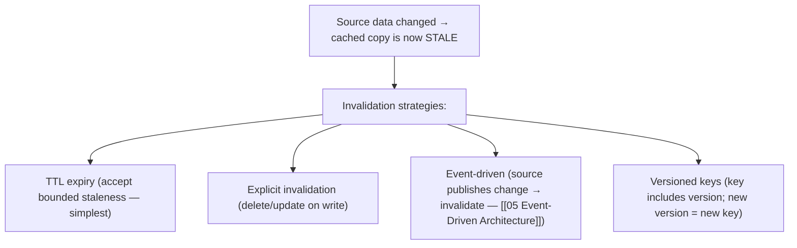

> [!WARNING]
> **Cache invalidation is the hardest problem** because a cache is a *duplicate* of data that can drift from its source. The strategies, roughly from simple to precise: **(1) TTL** — just let entries expire; accept bounded staleness (simplest, works surprisingly often). **(2) Explicit invalidation** — on every write, delete or update the affected cache entries (precise but requires knowing *exactly* which keys a write affects — easy to miss one, and derived/aggregated data is hard to map). **(3) Event-driven invalidation** — the source of truth emits change events ([[05 Event-Driven Architecture]]) that invalidate caches (great for distributed systems, decouples the cache from the writer, e.g., CDC on the DB — [[01 SQL and Transactions Deep Dive]]). **(4) Versioned/immutable keys** — bake a version into the key (`user:42:v3` or a content hash); when data changes, the key changes, so old entries are simply never requested again (elegant — no invalidation *at all*, used heavily for static assets/CDN). The senior reality: **there is no perfect general solution** — you pick per data type based on how bad staleness is and how precisely you can track changes. Most systems lean on TTL + explicit invalidation, accepting small staleness windows.

### 3.2 Consistency: the write-invalidate race

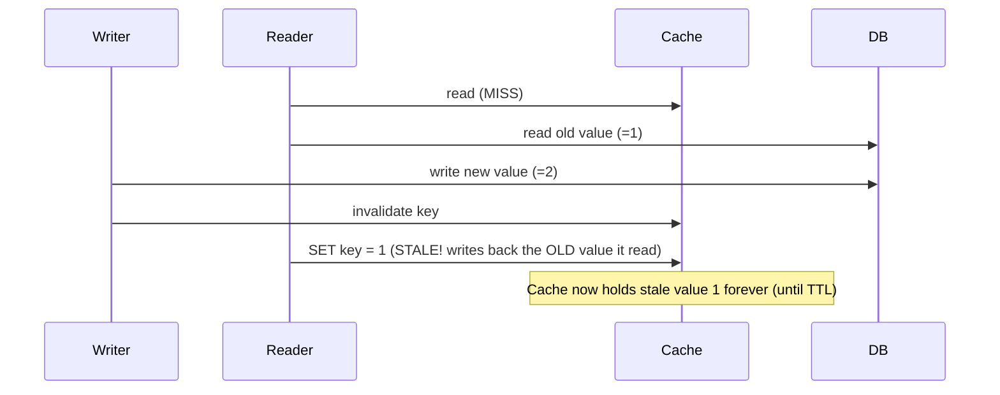

> [!WARNING]
> A subtle but real bug: with cache-aside, a **read** that misses and a concurrent **write** can interleave so the reader writes a *stale* value back into the cache *after* the writer invalidated it — leaving the cache wrong until the TTL saves it. This is why **the order of operations matters**: on a write, you should **update the DB first, then invalidate the cache** (not invalidate-then-update, which has an even worse race window). Even so, the race above can occur — mitigations include **short TTLs** (bound the damage), **delete-don't-update** on writes (deleting is safer than trying to write the new value into the cache, which can also race), and for strong needs, techniques like **versioning** or setting the cache within the same lock/transaction. The deep lesson from [[06 Distributed Systems]]: a cache + a database is a *distributed system with two copies of data*, so you inherit consistency problems — perfect cache/DB consistency is expensive, so most systems accept **eventual consistency** with a bounded staleness window and design the product to tolerate it.

### 3.3 Cache Stampede / Thundering Herd

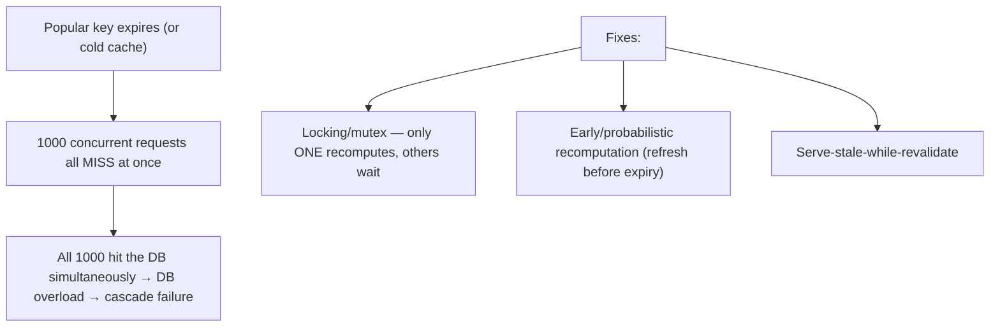

> [!WARNING]
> A **cache stampede** (thundering herd) is a classic production outage: a popular key expires, and *simultaneously* thousands of in-flight requests all miss and hammer the database at once to recompute the same value — overwhelming the DB and potentially cascading into a full outage. It's especially nasty because it strikes precisely under high load (hot keys, peak traffic). **Defenses:** **(1) Locking / request coalescing** — when a key misses, only the *first* request recomputes it (holding a lock/mutex, e.g., a [[04 Redis]] `SETNX` lock); others *wait* for the result rather than all recomputing (also called "single flight"). **(2) Early recomputation** — probabilistically refresh a key *before* it expires, so it's never simultaneously stale for everyone (XFetch algorithm). **(3) Serve stale while revalidating** — return the expired value immediately while one background task refreshes it (favor availability over freshness). This is a top senior interview scenario — recognizing that TTL expiry on a hot key is a *correlated failure* is the insight.

### 3.4 Cache Penetration & Avalanche

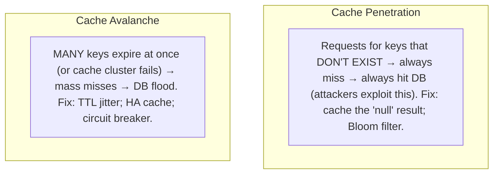

> [!WARNING]
> Two more failure modes every senior should name. **Cache penetration**: requests for keys that **don't exist in the source at all** — every one misses the cache *and* misses the DB, so the cache provides zero protection (an attacker can weaponize this by requesting random non-existent IDs to flood your DB). **Fix:** cache the *negative* result too (store a "null"/"not found" marker with a short TTL) and/or use a **Bloom filter** (a probabilistic structure that quickly answers "this key definitely doesn't exist" — §7.4). **Cache avalanche**: a *large number* of keys expire at nearly the same time (e.g., you warmed the cache in a batch with identical TTLs), OR the cache cluster itself goes down — causing a sudden flood of misses that overwhelms the DB. **Fix:** **TTL jitter** (randomize expiry times so they spread out), a **highly-available cache** ([[04 Redis]] cluster/replicas so it doesn't fail wholesale), and **circuit breakers**/rate limits to protect the DB. Together with stampede (§3.3), these three — **penetration, stampede, avalanche** — are the canonical caching failure trio.

### 3.5 Cache Warming & Multi-Level Caches

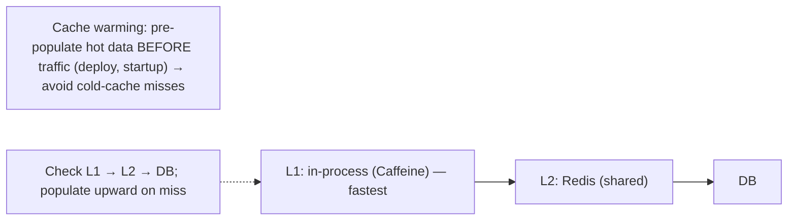

> [!TIP]
> **Cache warming** proactively loads likely-needed data *before* it's requested — e.g., on startup or after a deploy, preload the hot products/config so the first users don't all hit cold-cache misses (which can itself cause a stampede). **Multi-level caching** stacks caches: an **L1** in-process cache (nanosecond, per-instance, for the hottest stable data) backed by an **L2** distributed cache ([[04 Redis]], shared) backed by the DB — each miss falls through to the next level and populates upward. This maximizes speed (most hits served from L1) while keeping shared consistency (L2). The complexity cost is invalidation across levels: invalidating L2 doesn't automatically clear the L1 copies in every app instance, so you need a mechanism (short L1 TTLs, or a pub/sub invalidation broadcast — [[04 Redis]] pub/sub, [[05 Event-Driven Architecture]]) to keep L1 caches fresh. Multi-level caching is common in high-scale systems but should be added deliberately — the extra layer is only worth it when L1 hit rates are high and L2 latency is a real bottleneck.

### 3.6 Failure Scenarios & Caching Pitfalls

| Pitfall | Cause | Fix |
|---|---|---|
| **Stale data** | Missed/incorrect invalidation | TTL bound + explicit invalidation; delete-don't-update |
| **Cache stampede** | Hot key expires → herd to DB | Locking/single-flight; early refresh; serve-stale |
| **Cache penetration** | Requests for non-existent keys | Cache nulls; Bloom filter |
| **Cache avalanche** | Mass simultaneous expiry / cache down | TTL jitter; HA cache; circuit breaker |
| **Inconsistent multi-instance** | In-process caches diverge | Distributed cache or pub/sub invalidation |
| **Low hit ratio** | Caching wrong/uncacheable data | Measure; cache hot, skewed data only |
| **Memory exhaustion / OOM** | No eviction limit / no TTL | Set maxmemory + eviction policy + TTLs |
| **Caching sensitive data** | Leaks via shared cache | Don't cache secrets; scope by user |

> [!WARNING]
> The most *common* real bug is **stale data from missed invalidation** — you cache a user's profile, they update it, but a write path forgot to invalidate the cache, so they see the old data (confusing and eroding trust). This is why **TTL is your safety net even when you invalidate explicitly** — it bounds how long a missed invalidation can hurt. The most *dangerous* bugs are the correlated-failure trio (stampede/penetration/avalanche) that convert a cache from a shield into an *amplifier* of load — turning a cache problem into a database outage. And an operational must: **always bound cache memory** (`maxmemory` + an eviction policy in [[04 Redis]]) — an unbounded cache eventually OOMs and takes down the cache (or the app if in-process). Treat the cache as a *performance optimization that must fail gracefully*: if the cache is down, the system should still work (slower), never crash.

---

## 4. 🏗️ REAL-WORLD SYSTEM DESIGN USAGE

### 4.1 What to cache (and what not to)

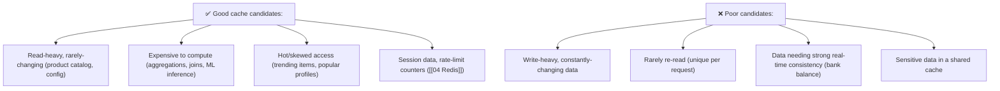

> [!IMPORTANT]
> **Caching is not free** (memory, complexity, consistency risk), so cache selectively. **Great candidates:** read-heavy + slowly-changing data (product catalogs, configuration, reference data), expensive computations (aggregations, complex joins — [[01 SQL and Transactions Deep Dive]], report data, ML inference), hot/skewed access patterns (a small set of popular items serving most traffic), and purpose-built cache use cases (sessions, [[06 API Gateway]] rate-limit counters, leaderboards — all classic [[04 Redis]] uses). **Poor candidates:** write-heavy data that changes faster than it's read (the cache is stale before it's reused, low hit ratio), data unique to each request (nothing to reuse), data requiring strict real-time accuracy where staleness is unacceptable (though even bank systems cache *some* views), and sensitive data in shared caches (leak risk — [[02 Web Security and OWASP Top 10]]). The discipline: **cache the read-heavy, expensive, reusable, staleness-tolerant** — and *measure the hit ratio* to confirm the cache is earning its keep.

### 4.2 Caching in a typical web architecture

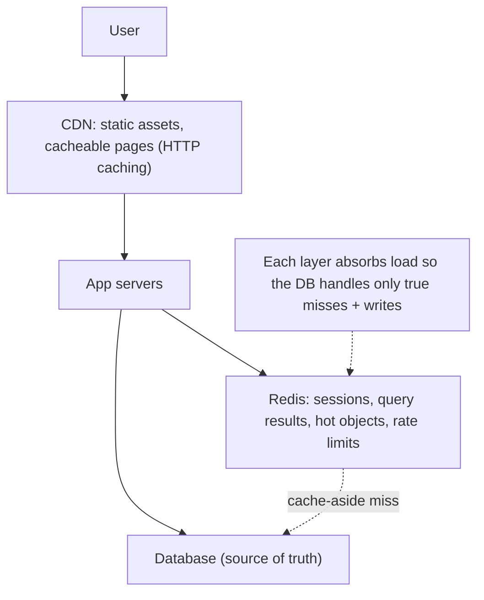

> [!IMPORTANT]
> In a real system, caching is layered end-to-end (§2.5). The **CDN** serves static assets (JS/CSS/images) and cacheable API responses from edge locations near users — offloading the vast majority of static traffic before it reaches your servers ([[01 HTTP Deep Dive]] cache headers control this). The application uses **[[04 Redis]]** as a distributed cache for database query results (cache-aside), session storage, hot objects, and rate-limiting counters — cutting database read load dramatically. The **database** itself caches (buffer pool, query cache). The net effect: the database — usually the scaling bottleneck and hardest tier to scale ([[01 System Design Fundamentals]], [[01 SQL and Transactions Deep Dive]]) — only handles *true* cache misses and writes, a small fraction of total traffic. This is why "add a cache" is the go-to first move for read-scaling: it's far cheaper and faster than adding read replicas or sharding, and it stacks with them.

### 4.3 Caching + eventual consistency in distributed systems

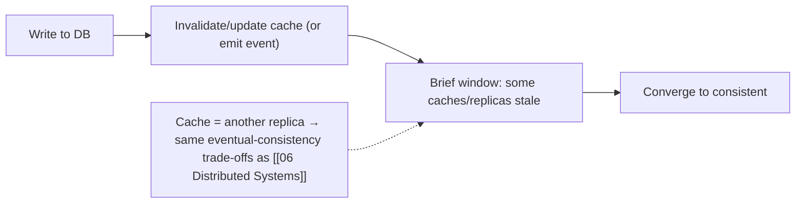

> [!TIP]
> Zoom out and a cache *is* a **replica** — another copy of data optimized for reads — so caching is really a special case of the replication and consistency problems in [[06 Distributed Systems]]. The same trade-offs apply: you generally accept **eventual consistency** (the cache converges to the source's value within a bounded window) because strong consistency between cache and source is expensive (you'd have to synchronously update/invalidate on every write, negating much of the speed benefit). This is why **event-driven invalidation** ([[05 Event-Driven Architecture]]) fits so well — the source of truth publishes change events, and caches (and read replicas, and search indexes) all update from the same event stream, exactly like CQRS read models. Framing caching as "read-optimized replication with a staleness budget" connects it to the broader distributed-data picture and is a mark of senior understanding.

---

## 5. 🎤 INTERVIEW PREPARATION

### 5.1 Most important questions

<details>
<summary><b>Q1: Explain cache-aside. What are its pros and cons?</b></summary>

Cache-aside (lazy loading): the app checks the cache first; on a miss, it queries the DB, populates the cache, and returns the data; on writes it invalidates the cache entry. Pros: only requested data is cached (memory-efficient), and it's resilient (cache failure just means slower DB reads). Cons: every miss costs three trips (so the first request is slow — cold cache), and there's a consistency window where the cache can go stale (the read/write invalidation race). It's the most common caching pattern.
</details>

<details>
<summary><b>Q2: Write-through vs write-back vs write-around?</b></summary>

**Write-through**: write to cache and DB synchronously — cache always consistent, but slower writes and caches possibly-unread data. **Write-back (write-behind)**: write to cache, flush to DB asynchronously — very fast writes that absorb bursts, but risk data loss if the cache crashes before flushing. **Write-around**: write to DB only, skipping the cache — avoids polluting the cache with rarely-read writes, but recently-written data is a cache miss. Choose based on read/write ratio and durability tolerance.
</details>

<details>
<summary><b>Q3: What's the cache invalidation problem and how do you handle it?</b></summary>

A cache is a copy that can drift from the source when data changes, so you must keep it fresh — but knowing exactly what to invalidate (especially derived/aggregated data) is hard. Strategies: **TTL** (accept bounded staleness — simplest), **explicit invalidation** (delete on write — precise but easy to miss keys), **event-driven** (source emits change events), and **versioned keys** (change the key on change, so old entries are never read). Most systems combine TTL (as a safety net) with explicit invalidation, accepting eventual consistency.
</details>

<details>
<summary><b>Q4: What is a cache stampede and how do you prevent it?</b></summary>

When a popular key expires, many concurrent requests all miss simultaneously and flood the DB to recompute the same value, potentially causing an outage. Prevent with: **locking/single-flight** (only the first request recomputes; others wait), **early/probabilistic recomputation** (refresh before expiry), and **serve-stale-while-revalidate** (return the old value while refreshing in the background). The key insight is that hot-key expiry is a correlated failure.
</details>

<details>
<summary><b>Q5: Explain cache eviction policies.</b></summary>

When a full cache must make room, it evicts an entry per a policy. **LRU** (Least Recently Used) evicts the longest-unused entry — the common default, exploiting temporal locality. **LFU** (Least Frequently Used) evicts the least-accessed — better for stable popularity. **FIFO** evicts the oldest inserted. **Random** evicts randomly. The choice affects hit ratio and depends on access patterns; Redis offers configurable policies and uses sampling-based approximations of LRU/LFU for efficiency.
</details>

<details>
<summary><b>Q6: Penetration vs stampede vs avalanche?</b></summary>

**Penetration**: requests for non-existent keys always miss both cache and DB (attackers exploit this) — fix by caching null results and Bloom filters. **Stampede/thundering herd**: one hot key expires and many requests recompute it at once — fix with locking/single-flight, early refresh, serve-stale. **Avalanche**: many keys expire simultaneously or the cache goes down, flooding the DB — fix with TTL jitter, a highly-available cache, and circuit breakers. All three turn the cache from a shield into a load amplifier.
</details>

<details>
<summary><b>Q7: In-process vs distributed cache — trade-offs?</b></summary>

**In-process** (local memory, e.g., Caffeine): nanosecond-fast, no network — but per-instance, so multiple servers have separate caches that duplicate data, can disagree, and are hard to invalidate consistently. **Distributed** (Redis/Memcached): shared across all instances (one source, invalidate once, consistent, survives restarts) — but adds network latency and an external dependency. Common hybrid: a small in-process L1 backed by a distributed L2, needing cross-level invalidation (short L1 TTLs or pub/sub).
</details>

<details>
<summary><b>Q8: How do you keep a cache consistent with the database?</b></summary>

You generally can't get perfect real-time consistency cheaply — a cache is another copy, so you accept eventual consistency with a bounded staleness window. On writes, update the DB first then invalidate (delete) the cache entry, use TTLs as a safety net for missed invalidations, and for distributed setups use event-driven invalidation (the DB/source emits change events). For strict needs, versioned keys or updating within the same lock/transaction. The pragmatic answer: bound staleness with TTL + explicit invalidation and design the product to tolerate small windows.
</details>

### 5.2 Tricky questions

> [!TIP]
> **"Why delete the cache entry on write instead of updating it with the new value?"** — Deleting is safer: updating the cache with the new value has its own race (two concurrent writes can write values in the wrong order, leaving the cache wrong), and it wastes effort caching data that may not be re-read. Delete-on-write lets the next read repopulate with the authoritative DB value (cache-aside). "Invalidate, don't update" is the common guidance.

> [!TIP]
> **"Should you update the DB or the cache first on a write?"** — Update the DB first (the source of truth), then invalidate the cache. Cache-first risks the DB write failing after you've already changed the cache (cache now ahead of DB). Even DB-first has a residual race (§3.2), mitigated by short TTLs. Never leave the cache as the only holder of a write (unless deliberately using write-back with durability accepted).

> [!TIP]
> **"Your cache hit ratio is 20% — what's wrong?"** — You're likely caching the wrong data: uniformly-random access (no hot keys), data that changes/expires faster than it's reused, or unique-per-request data. Diagnose the access pattern; cache only skewed/hot, reusable, staleness-tolerant data. A 20% hit ratio may mean the cache is net-negative (lookup overhead without benefit).

> [!TIP]
> **"Is caching a bank account balance safe?"** — Risky for the authoritative balance (staleness could allow overdrafts), but you can cache *derived views* (recent transaction lists, display balances with clear "as of" timestamps) with short TTLs, while the *transactional* balance check reads the source under a lock ([[01 SQL and Transactions Deep Dive]]). The answer is nuanced: cache what tolerates staleness, read the source for what doesn't.

### 5.3 Common mistakes candidates make

| Mistake | Reality |
|---|---|
| "Cache everything" | Caching has cost; cache hot/reusable data only |
| Forgetting invalidation | Stale data is the #1 caching bug |
| No TTL safety net | A missed invalidation lingers forever |
| Ignoring stampede/penetration/avalanche | These cause real outages |
| Updating cache instead of deleting | Delete-on-write avoids races |
| In-process cache across many instances | They diverge; use distributed/pub-sub |
| No memory bound/eviction | Cache OOMs and fails |
| Not measuring hit ratio | Can't tell if the cache helps |

### 5.4 What interviewers actually expect

- **Cache-aside** (draw the sequence) + **write-through/back/around**.
- The **invalidation problem** and strategies (TTL, explicit, event-driven, versioned).
- **Eviction policies** (LRU/LFU) and **TTL** trade-offs.
- The failure trio: **stampede, penetration, avalanche** and their fixes.
- **In-process vs distributed** and **multi-level** caching.
- **What to cache** (read-heavy, hot, expensive, staleness-tolerant) and hit ratio.
- Caching as **read-optimized replication** with eventual consistency ([[06 Distributed Systems]]).

---

## 6. 🛠️ HANDS-ON PROJECTS

### Project 1: Cache-Aside with Redis (Beginner→Intermediate)

**Goal:** Implement the core pattern and measure its impact.

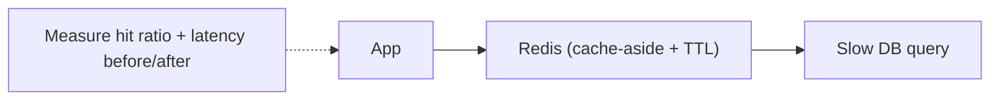

**Steps:**
1. Build an endpoint backed by a deliberately slow DB query ([[02 Postgres]]).
2. Add **cache-aside** with [[04 Redis]] (check → miss → query → SET with TTL).
3. Invalidate on writes (delete the key); verify freshness.
4. Measure **hit ratio** and p50/p99 **latency** with and without the cache under load.
5. Experiment with different **TTLs** and watch the hit-ratio/staleness trade-off.

**Learn:** cache-aside, TTL, invalidation, hit ratio, real latency impact.

---

### Project 2: Reproduce & Fix the Failure Trio (Intermediate→Senior)

**Goal:** Cause stampede, penetration, avalanche — then fix them.

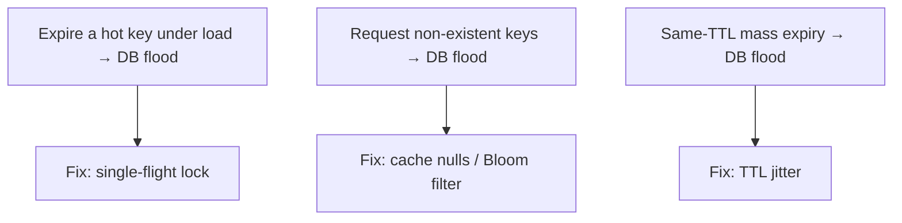

**Steps:**
1. Load-test a hot key that expires; observe the **stampede** hammering the DB.
2. Fix it with a **single-flight lock** ([[04 Redis]] `SETNX`) so only one request recomputes.
3. Flood with **non-existent** keys (penetration); fix by caching negative results + a **Bloom filter**.
4. Warm many keys with identical TTLs, let them expire together (**avalanche**); fix with **TTL jitter**.
5. Add **serve-stale-while-revalidate** and compare.

**Learn:** the caching failure trio, single-flight, negative caching, Bloom filters, jitter — hands-on.

---

### Project 3: Multi-Level Cache with Invalidation (Senior)

**Goal:** Build L1 (in-process) + L2 (Redis) with cross-level invalidation.

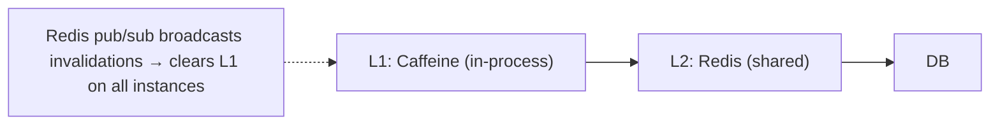

**Steps:**
1. Add an in-process **L1** ([[04 Java Concurrency and JVM]] Caffeine or a Map) in front of a [[04 Redis]] **L2**.
2. Implement read-through L1→L2→DB with upward population.
3. Run **multiple app instances**; observe L1 divergence (stale across instances).
4. Fix with **[[04 Redis]] pub/sub** broadcasting invalidations to clear L1 everywhere (or short L1 TTLs).
5. Measure the hit-ratio and latency gains of L1 vs L2-only.

**Learn:** multi-level caching, in-process vs distributed, cross-instance invalidation, pub/sub.

---

## 7. 🔬 DEEP DIVE: INTERNALS

### 7.1 How LRU is actually implemented (and approximated)

```mermaid
flowchart LR
    Exact["Exact LRU: hashmap + doubly-linked list → O(1) get/put, move-to-front on access"]
    Approx["Redis approx-LRU: sample N random keys, evict the oldest sampled → near-LRU without per-key bookkeeping"]
    Exact -.too costly at scale.-> Approx
```

> [!TIP]
> **Exact LRU** is implemented with a **hash map + doubly-linked list**: the map gives O(1) key lookup; the linked list maintains access order (on every access, move the entry to the front; evict from the back). This is the classic "LRU Cache" coding-interview problem — O(1) get and put. But at scale, maintaining exact LRU order has real cost (pointer updates and metadata per access, memory overhead). So **[[04 Redis]] uses approximate LRU**: instead of a global ordering, it **samples a handful of random keys** (default 5) and evicts the least-recently-used *among the sample*, using a cached idle-time per key. This gets *close* to true LRU behavior with far less memory and CPU — a pragmatic accuracy/cost trade-off. Redis's **LFU** mode similarly uses a probabilistic counter (a Morris counter that approximates access frequency in a few bits). Knowing that production caches *approximate* these policies — rather than implementing textbook versions — is a nice senior detail, and the exact-LRU structure is worth being able to code.

### 7.2 Consistent Hashing — distributing a cache across nodes

```mermaid
flowchart TB
    Ring["Hash ring (0 → 2^32)"] --> Nodes["Cache nodes placed on the ring"]
    Nodes --> Keys["Each key → hash → nearest node clockwise"]
    AddRemove["Add/remove a node → only ~1/N keys remap (not everything)"] -.-> Ring
```

> [!IMPORTANT]
> When a cache is **distributed across multiple nodes** (a [[04 Redis]] cluster, Memcached pool), you need to decide *which node* holds each key. Naive **modulo hashing** (`node = hash(key) % N`) is catastrophic when N changes: adding or removing one node changes almost *every* key's assignment, so nearly the entire cache misses at once (a self-inflicted avalanche). **Consistent hashing** solves this: nodes and keys are hashed onto a **ring** (0 to 2³²), and each key belongs to the next node clockwise. Adding or removing a node only remaps the keys between it and its neighbor — roughly **1/N of keys**, leaving the rest untouched. **Virtual nodes** (each physical node placed at many ring positions) smooth out the distribution. This is the same consistent-hashing technique used for partitioning in [[06 Distributed Systems]] and databases like Cassandra — a foundational algorithm for any distributed cache/store, and a very common system-design interview topic.

### 7.3 Why cache-aside deletes (the race, formally)

```mermaid
flowchart TB
    Options["Write handling options"] --> D["Delete cache (recommended): next read repopulates from DB"]
    Options --> U["Update cache: two concurrent writes can apply in wrong order → cache holds older value"]
    D --> Safer["Delete is idempotent + lets DB be authoritative on next read"]
```

> [!TIP]
> Why "invalidate (delete), don't update" the cache on writes? Consider two concurrent writers, W1 setting value A and W2 setting value B. If they **update the cache** directly, the DB might commit in order A then B (final DB = B), but the cache updates might arrive B then A (final cache = A) — a **permanent inconsistency** (cache disagrees with DB until TTL). **Deleting** the cache entry instead avoids this: whoever writes last, the entry is simply gone, and the next read fetches the authoritative current value from the DB and repopulates. Deletion is **idempotent** (deleting twice is the same as once) and keeps the DB as the single source of truth for repopulation, which is more robust under concurrency ([[01 SQL and Transactions Deep Dive]], [[04 Java Concurrency and JVM]] race conditions). The residual read-repopulation race (§3.2) still exists but is narrower and TTL-bounded. This is a subtle correctness argument that demonstrates deep understanding — most people cache-update by reflex without seeing the race.

### 7.4 Bloom Filters — cheap "definitely not here" checks

```mermaid
flowchart LR
    Add["Add key → hash with k functions → set k bits in a bit array"]
    Check["Check key → hash with k functions → all bits set?"]
    Check -->|"any bit 0"| No["DEFINITELY not present (no false negatives)"]
    Check -->|"all bits 1"| Maybe["MAYBE present (small false-positive rate)"]
```

> [!IMPORTANT]
> A **Bloom filter** is a compact, probabilistic data structure that answers "is this element in the set?" with two possible answers: **"definitely not"** or **"possibly yes"** — never a false negative, but a tunable rate of false positives. It works with a bit array and *k* hash functions: to add an element, hash it *k* ways and set those bits; to check, hash and see if *all* those bits are set (if any is 0, it's *definitely* absent). It uses a tiny fraction of the memory of storing the actual keys. For caching, this powers the **cache penetration** defense (§3.4): before hitting the DB for a possibly-non-existent key, check a Bloom filter of existing keys — if it says "definitely not present," you skip the DB entirely (returning "not found"), stopping attackers from flooding the DB with random non-existent IDs. Bloom filters also appear in [[Cassandra]]/LSM-tree databases (to avoid disk reads for absent keys — [[01 SQL and Transactions Deep Dive]] §7.1) and CDNs. The elegant insight: accepting a *small false-positive rate* buys *enormous space savings* — a recurring theme in probabilistic data structures (HyperLogLog, Count-Min Sketch in [[04 Redis]]).

### 7.5 Serve-Stale & Probabilistic Early Expiration

```mermaid
flowchart LR
    Normal["Key valid"] --> Near["Near expiry"]
    Near --> Prob["Each request: small probability to refresh EARLY (rises as expiry nears)"]
    Prob --> One["→ Usually ONE request refreshes before expiry; others use fresh value"]
    Stale["Serve-stale: on expiry, return old value + trigger async refresh (availability > freshness)"] -.-> Normal
```

> [!TIP]
> Two elegant stampede defenses (§3.3) worth understanding. **Serve-stale-while-revalidate**: when an entry expires, instead of blocking to recompute, the cache **returns the stale value immediately** and triggers a *single* background refresh — favoring availability and low latency over strict freshness (also an HTTP caching directive, `stale-while-revalidate` — [[01 HTTP Deep Dive]]). **Probabilistic early expiration (XFetch)**: rather than everyone recomputing exactly at expiry, each read computes a probability of refreshing *early* that increases as expiry approaches (and scales with how expensive the recompute is) — so *one* lucky request typically refreshes the key *before* it expires, and no correlated stampede ever occurs (the value is essentially never simultaneously stale for all readers). These are clever because they attack the *root cause* — the correlated, synchronized expiry of a hot key — rather than just adding locks. They embody a general distributed-systems principle: **de-correlate and de-synchronize** to avoid herd behavior (the same reason for TTL jitter and randomized backoff — [[06 Distributed Systems]]).

---

## ✅ Production Checklists

### Design
- [ ] Cache only **read-heavy, hot, expensive, staleness-tolerant** data (measured)
- [ ] Right **pattern** chosen (cache-aside reads; write-through/around/back per needs)
- [ ] Placed at the right **layer(s)** (CDN/proxy/distributed/in-process)
- [ ] **Hit ratio** monitored ([[02 Observability]]); cache proven net-positive

### Consistency
- [ ] **TTL** on every entry (safety net against missed invalidation)
- [ ] Write path **invalidates (deletes)** affected keys; DB-first then invalidate
- [ ] Event-driven or versioned invalidation where precision matters
- [ ] Multi-instance in-process caches kept fresh (pub/sub or short TTL)

### Resilience
- [ ] **Memory bounded** (`maxmemory` + eviction policy)
- [ ] **Stampede** protection (single-flight / early refresh / serve-stale)
- [ ] **Penetration** protection (cache nulls / Bloom filter)
- [ ] **Avalanche** protection (TTL jitter, HA cache, circuit breaker)
- [ ] System **degrades gracefully** if cache is down (falls back to source)
- [ ] No **sensitive data** in shared caches ([[02 Web Security and OWASP Top 10]])

---

## 🗺️ Learning Roadmap

```mermaid
flowchart TB
    A["1️⃣ Basics<br/>hit/miss, hit ratio, why caching works"] --> B["2️⃣ Read patterns<br/>cache-aside"]
    B --> C["3️⃣ Write patterns<br/>through/back/around, TTL"]
    C --> D["4️⃣ Eviction & layers<br/>LRU/LFU, in-process vs distributed"]
    D --> E["5️⃣ Invalidation<br/>the hard problem, strategies"]
    E --> F["6️⃣ Failure modes<br/>stampede, penetration, avalanche"]
    F --> G["7️⃣ Internals<br/>LRU impl, consistent hashing, Bloom filters"]
    G --> H["8️⃣ System design<br/>multi-level, what to cache, eventual consistency"]
```

| Stage | Focus | You can... |
|---|---|---|
| 1–3 | Patterns | Implement cache-aside + write strategies |
| 4–5 | Management | Handle eviction, TTL, invalidation |
| 6 | Resilience | Prevent the caching failure trio |
| 7–8 | Depth + design | Architect caching at scale |

---

## 🔁 Self-Review Completion Loop

Reviewed against *Designing Data-Intensive Applications* (Kleppmann), the Redis docs, AWS/Cloudflare caching guides, and classic caching literature.

### Gap Review Matrix

| Dimension | Covered? | Where |
|---|---|---|
| What/why caching, locality | ✅ | §1 |
| Latency numbers | ✅ | §1 |
| Hit/miss/hit ratio | ✅ | §1 |
| Cache-aside | ✅ | §2.1 |
| Write-through/back/around | ✅ | §2.2 |
| TTL / expiration | ✅ | §2.3 |
| Eviction policies (LRU/LFU) | ✅ | §2.4, §7.1 |
| Caching layers | ✅ | §2.5 |
| In-process vs distributed | ✅ | §2.6 |
| Invalidation problem | ✅ | §3.1 |
| Consistency/write race | ✅ | §3.2, §7.3 |
| Stampede / thundering herd | ✅ | §3.3, §7.5 |
| Penetration & avalanche | ✅ | §3.4 |
| Cache warming / multi-level | ✅ | §3.5 |
| Pitfalls | ✅ | §3.6 |
| What to cache | ✅ | §4.1 |
| Web architecture caching | ✅ | §4.2 |
| Eventual consistency framing | ✅ | §4.3 |
| LRU implementation | ✅ | §7.1 |
| Consistent hashing | ✅ | §7.2 |
| Bloom filters | ✅ | §7.4 |
| Serve-stale / early expiry | ✅ | §7.5 |
| Interview Q&A + mistakes | ✅ | §5 |
| Hands-on projects | ✅ | §6 |

> [!NOTE]
> **Remaining depth to explore independently:** write-back durability & flush strategies, cache coherence protocols (MESI at the CPU level — [[04 Java Concurrency and JVM]]), CDN internals & cache-key design ([[01 HTTP Deep Dive]]), Redis-specific features (persistence, cluster, Lua scripts for atomic cache ops — [[04 Redis]]), near-cache patterns, negative caching nuances, cache tagging/grouped invalidation, HyperLogLog & Count-Min Sketch (probabilistic counting), read-through/refresh-ahead caches, and caching in GraphQL ([[03 GraphQL]] dataloader/N+1) and ORMs ([[08 JPA vs Hibernate]] first/second-level cache).

---

## 📚 Official References

| Resource | Source |
|---|---|
| *Designing Data-Intensive Applications* — Kleppmann | Caching & replication |
| Redis docs — eviction, TTL, patterns | https://redis.io/docs/ |
| AWS — Caching best practices / ElastiCache | https://aws.amazon.com/caching/ |
| Cloudflare Learning — CDN & caching | https://www.cloudflare.com/learning/cdn/what-is-caching/ |
| "A hitchhiker's guide to caching patterns" (write strategies) | Various engineering blogs |
| XFetch — "Optimal Probabilistic Cache Stampede Prevention" (paper) | VLDB 2015 |
| Consistent Hashing (Karger et al.) | Classic paper |

---

## 🎁 Final Summary

> [!IMPORTANT]
> **The one-paragraph takeaway:** Caching stores the results of expensive work in a fast store so repeated requests skip the slow source — exploiting **temporal locality** and the huge **latency gap** between memory and disk/network to cut latency 100–1000× and offload the backend, with the **hit ratio** as the key metric. The universal trade-off: a cache is a *copy*, so it trades **consistency and memory for speed**, and every strategy is an answer to *"how fresh, how fast?"* For reads, **cache-aside** dominates (check cache → on miss, query DB and populate → invalidate on write); for writes, choose **write-through** (consistent, slower), **write-back** (fast, risks data loss), or **write-around** (skip cache, avoid pollution). Bound staleness with **TTL** (the pragmatic safety net), manage limited memory with **eviction** (**LRU** default, **LFU** for stable popularity), and place caches across **layers** (CDN → proxy → distributed [[04 Redis]] → in-process) — choosing **in-process** (fast, per-instance, diverges) vs **distributed** (shared, consistent, network hop) or a **multi-level** hybrid. The hard problem is **invalidation** (TTL / explicit-delete / event-driven / versioned keys — and on writes, *delete don't update*, DB-first, because a cache+DB is a two-copy distributed system with eventual consistency — [[06 Distributed Systems]]). Above all, know the **failure trio** that turns a cache from shield into load-amplifier: **stampede** (hot key expiry → herd → fix with single-flight/early-refresh/serve-stale), **penetration** (non-existent keys → fix with null-caching/Bloom filters), and **avalanche** (mass simultaneous expiry/cache-down → fix with TTL jitter/HA/circuit breakers). Cache the **read-heavy, hot, expensive, staleness-tolerant** data (and *measure* the hit ratio), always **bound memory and degrade gracefully** if the cache dies, and never cache sensitive data in a shared cache. Underneath sit elegant mechanisms — approximate-LRU sampling, **consistent hashing** for distribution, **Bloom filters** for absence checks, and probabilistic early expiration — all reflecting one theme: **de-correlate and de-synchronize** to avoid herd behavior.

**Golden rules:**
1. ⚖️ Caching trades **consistency + memory for speed** — every decision flows from this.
2. 🔄 **Cache-aside** for reads; pick write-through/back/around by durability & read/write ratio.
3. ⏳ Put a **TTL on everything** — the safety net for missed invalidations.
4. 🗑️ On writes, **delete (invalidate) the cache, don't update it**; update DB first.
5. 🧹 Bound memory with an **eviction policy** (LRU/LFU) — never let the cache OOM.
6. 🐘 Defend the **failure trio**: stampede (single-flight), penetration (Bloom/null), avalanche (jitter).
7. 🏛️ Cache the **read-heavy, hot, expensive, staleness-tolerant** — and **measure hit ratio**.
8. 🌐 In-process (fast, diverges) vs distributed (shared, consistent) — or multi-level.
9. 🛡️ **Degrade gracefully** if the cache is down; never cache secrets in a shared cache.
10. 🔗 A cache is **read-optimized replication** — expect eventual consistency ([[06 Distributed Systems]]).

---

*Related guides in this vault: [[04 Redis]] · [[01 HTTP Deep Dive]] · [[01 System Design Fundamentals]] · [[01 SQL and Transactions Deep Dive]] · [[06 Distributed Systems]] · [[02 Postgres]] · [[05 Event-Driven Architecture]] · [[06 API Gateway]] · [[05 Nginx]]*
