# 🌐 HTTP Deep Dive — Complete Beginner-to-Expert Reference

> How the web *actually* talks — request/response anatomy, methods, status codes, headers, cookies, **caching**, **HTTPS/TLS**, and the evolution from **HTTP/1.1 → HTTP/2 → HTTP/3**. The protocol under every API, browser, and microservice call.

---

## 📑 Table of Contents

1. [Executive Summary](#-executive-summary)
2. [Fundamentals (Beginner)](#1--fundamentals-beginner-level)
3. [Core Concepts (Intermediate)](#2--core-concepts-intermediate-level)
4. [Advanced Concepts (Senior)](#3--advanced-concepts-senior-level)
5. [Real-World System Design](#4--real-world-system-design-usage)
6. [Interview Preparation](#5--interview-preparation)
7. [Hands-On Projects](#6--hands-on-projects)
8. [Deep Dive: Internals](#7--deep-dive-internals)
9. [Production Checklists](#-production-checklists)
10. [Learning Roadmap](#-learning-roadmap)
11. [Self-Review Completion Loop](#-self-review-completion-loop)
12. [Official References](#-official-references)
13. [Final Summary](#-final-summary)

---

## 🎯 Executive Summary

**HTTP (HyperText Transfer Protocol)** is the request/response protocol that powers the web — every page load, API call, and microservice message. A **client** sends a **request** (method + URL + headers + optional body); a **server** returns a **response** (status code + headers + body). It's **stateless** by design (each request is independent), text-based and human-readable in its classic form, and layered on top of TCP/TLS. Understanding it deeply explains everything from [[02 REST API Design]] to caching to why your site is slow.

| What it is | What it replaces | Core superpower |
|---|---|---|
| Stateless application-layer request/response protocol | Ad-hoc, incompatible network protocols | **A universal, simple, extensible contract** for client↔server communication across the entire internet |

> [!IMPORTANT]
> The single most important property to internalize: **HTTP is stateless** — the server treats every request as brand new, remembering *nothing* about previous requests by default. This is a deliberate design choice that makes HTTP massively scalable (any server can handle any request; no per-client memory) and is the foundation of [[02 REST API Design]]. Everything that *feels* stateful on the web — being "logged in," a shopping cart, a session — is a *layer built on top* of stateless HTTP using **cookies, tokens ([[01 OAuth2 OIDC and JWT]]), and server-side sessions**. If you understand that HTTP forgets you after every request, and that state is re-established each time via a cookie or token, you understand the deepest truth of web architecture. The rest — methods, status codes, headers, caching, HTTP/2/3, TLS — is machinery built around this stateless core.

Related guides: [[02 REST API Design]] · [[05 WebSockets]] · [[04 gRPC]] · [[05 Nginx]] · [[01 OAuth2 OIDC and JWT]] · [[06 API Gateway]] · [[01 System Design Fundamentals]] · [[06 Distributed Systems]]

---

## 1. 🌱 FUNDAMENTALS (Beginner Level)

### What happens when you type a URL and hit Enter?

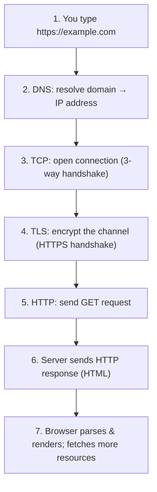

> [!IMPORTANT]
> This sequence is *the* classic senior interview question ("what happens when you type google.com?"). The key layers: **DNS** translates the human-readable domain into an IP address (a distributed phonebook lookup). **TCP** establishes a reliable connection via a 3-way handshake (SYN → SYN-ACK → ACK). **TLS** (for HTTPS) negotiates encryption so the conversation is private. Only *then* does **HTTP** — the application layer — send the actual request, and the server responds. Notice HTTP sits *on top of* TCP/TLS ([[06 Distributed Systems]] networking) — HTTP itself doesn't handle reliability or encryption; it delegates to lower layers. This layering is why the same HTTP can run over different transports (HTTP/3 swaps TCP for QUIC, §3.4).

### Anatomy of an HTTP request

```
GET /api/users/42 HTTP/1.1          ← request line: METHOD PATH VERSION
Host: example.com                    ← headers (metadata)
Accept: application/json
Authorization: Bearer eyJ...
User-Agent: Mozilla/5.0
                                     ← blank line separates headers from body
(optional request body — for POST/PUT)
```

### Anatomy of an HTTP response

```
HTTP/1.1 200 OK                      ← status line: VERSION STATUS-CODE REASON
Content-Type: application/json       ← headers
Content-Length: 87
Cache-Control: max-age=3600
                                     ← blank line
{"id": 42, "name": "Alice"}          ← response body
```

| Part | Request | Response |
|---|---|---|
| **First line** | Method + Path + Version | Version + Status code |
| **Headers** | Metadata (Host, Accept, Auth...) | Metadata (Content-Type, Cache...) |
| **Body** | Optional (POST/PUT data) | The actual content (HTML/JSON...) |

### The core HTTP methods

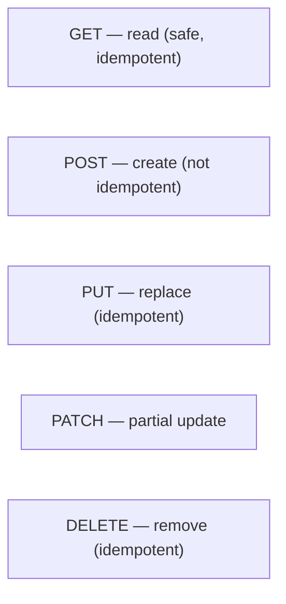

| Method | Purpose | Safe? | Idempotent? | Body? |
|---|---|---|---|---|
| **GET** | Retrieve a resource | ✅ | ✅ | No |
| **POST** | Create / submit | ❌ | ❌ | Yes |
| **PUT** | Replace entirely | ❌ | ✅ | Yes |
| **PATCH** | Partial update | ❌ | ❌* | Yes |
| **DELETE** | Remove | ❌ | ✅ | Optional |
| **HEAD** | GET without body | ✅ | ✅ | No |
| **OPTIONS** | Ask what's allowed (CORS preflight) | ✅ | ✅ | No |

> [!TIP]
> Two properties define method semantics. **Safe** = read-only, no server state change (GET, HEAD, OPTIONS) — crawlers and prefetchers rely on this. **Idempotent** = doing it N times has the same effect as once (GET, PUT, DELETE) — crucial for *retries*: a network failure during a PUT can be safely retried; a POST cannot (you might create two orders). This is why **GET must never modify data** (a classic bug: "GET /deleteUser?id=5" — search engine crawlers will happily delete your users). These semantics aren't just convention — caches, proxies, and retry logic *depend* on them ([[02 REST API Design]], [[05 Event-Driven Architecture]] idempotency).

### Real-world analogy 📮

HTTP is like **mailing letters through a postal system**:
- You (**client**) write a letter with an **address** (URL), an **action** ("please send me the catalog" = GET), and **metadata on the envelope** (headers — return address, priority).
- The **post office** (network/TCP) delivers it reliably.
- The recipient (**server**) reads it and mails back a **response** with a **status** ("here it is" = 200, "no such address" = 404, "I'm overwhelmed" = 503) and **contents** (the body).
- **Stateless**: the recipient doesn't remember your last letter — if you want them to, you include a **membership card number** (cookie/token) in every letter.

> [!TIP]
> Beginner takeaway: HTTP is a simple, text-based **request→response** conversation. A request says *what to do* (method) *to what* (URL) *with what metadata* (headers) *and what data* (body); a response says *how it went* (status code) with *its own metadata and data*. It's **stateless**, so identity/state is carried in every message via cookies or tokens. Everything advanced (caching, HTTP/2 multiplexing, TLS) optimizes or secures this fundamental exchange.

---

## 2. 🧩 CORE CONCEPTS (Intermediate Level)

### 2.1 Status Codes — the 5 classes

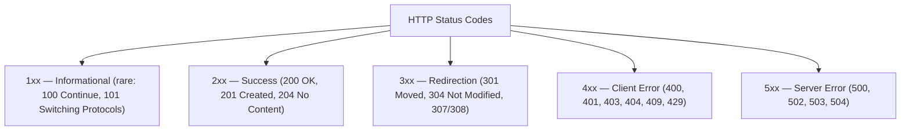

| Code | Meaning | When |
|---|---|---|
| **200 OK** | Success | Standard successful GET/PUT |
| **201 Created** | Resource created | Successful POST |
| **204 No Content** | Success, no body | Successful DELETE |
| **301 / 308** | Permanent redirect | URL moved forever |
| **302 / 307** | Temporary redirect | Temporarily elsewhere |
| **304 Not Modified** | Use your cache | Conditional GET (caching) |
| **400 Bad Request** | Malformed request | Validation failure |
| **401 Unauthorized** | Not authenticated | Missing/invalid credentials |
| **403 Forbidden** | Authenticated but not allowed | Insufficient permissions |
| **404 Not Found** | No such resource | Missing resource |
| **409 Conflict** | State conflict | Duplicate / version clash |
| **429 Too Many Requests** | Rate limited | Throttling |
| **500 Internal Server Error** | Server bug | Unhandled exception |
| **502 Bad Gateway** | Upstream returned garbage | Proxy/[[05 Nginx]] can't reach backend |
| **503 Service Unavailable** | Overloaded/down | Maintenance, overload |
| **504 Gateway Timeout** | Upstream too slow | Backend didn't respond in time |

> [!IMPORTANT]
> The status code *class* tells you *who's responsible*: **4xx = the client's fault** (fix your request), **5xx = the server's fault** (retry might help). Two distinctions candidates constantly botch: **401 vs 403** — 401 means *"I don't know who you are"* (not authenticated — provide credentials), 403 means *"I know who you are, but you can't do this"* (authenticated but unauthorized). And **502 vs 503 vs 504** — all "server-side" but different: **502** the gateway got an invalid response from upstream, **503** the server is up but refusing (overload/maintenance), **504** the upstream timed out. Precise status codes are a contract with clients, caches, and monitoring — returning `200 OK` with an error body (a real anti-pattern) breaks retry logic, caching, and alerting. Use the right code.

### 2.2 Headers — the metadata that runs the web

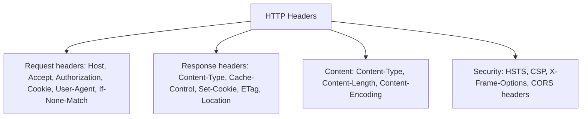

> [!TIP]
> **Headers are where most of HTTP's real power lives.** Content negotiation (`Accept`/`Content-Type` — "I want JSON," "here's JSON"), authentication (`Authorization: Bearer ...`), caching (`Cache-Control`, `ETag`), compression (`Accept-Encoding: gzip`/`br`), cookies (`Set-Cookie`/`Cookie`), CORS (`Access-Control-*`), and security (`Strict-Transport-Security`, `Content-Security-Policy`) are *all* header-driven. A huge amount of web behavior you might think is "magic" is just servers and browsers exchanging headers. Learning to read the Network tab (headers per request) is the single best way to understand what's really happening.

### 2.3 Cookies & Sessions — state on a stateless protocol

```mermaid
sequenceDiagram
    participant B as Browser
    participant S as Server
    B->>S: POST /login (credentials)
    S->>B: 200 OK + Set-Cookie: session=abc123; HttpOnly; Secure; SameSite
    Note over B: Browser stores cookie
    B->>S: GET /profile + Cookie: session=abc123
    S->>S: Look up session abc123 → "this is Alice"
    S->>B: 200 OK (Alice's profile)
```

> [!IMPORTANT]
> **Cookies are how the stateless web remembers you.** After login, the server sends `Set-Cookie`, and the browser *automatically* attaches that cookie to every subsequent request to that domain — re-establishing identity each time. The critical **cookie security flags**: **`HttpOnly`** (JavaScript can't read it — defends against XSS token theft), **`Secure`** (only sent over HTTPS), and **`SameSite`** (`Strict`/`Lax`/`None` — controls whether the cookie is sent on cross-site requests, the primary **CSRF** defense). Getting these flags right is essential security ([[01 OAuth2 OIDC and JWT]] token storage). The automatic-attachment behavior is *also* exactly why CSRF attacks exist (the browser sends your cookie even on attacker-triggered requests) — hence `SameSite`.

### 2.4 HTTP Caching

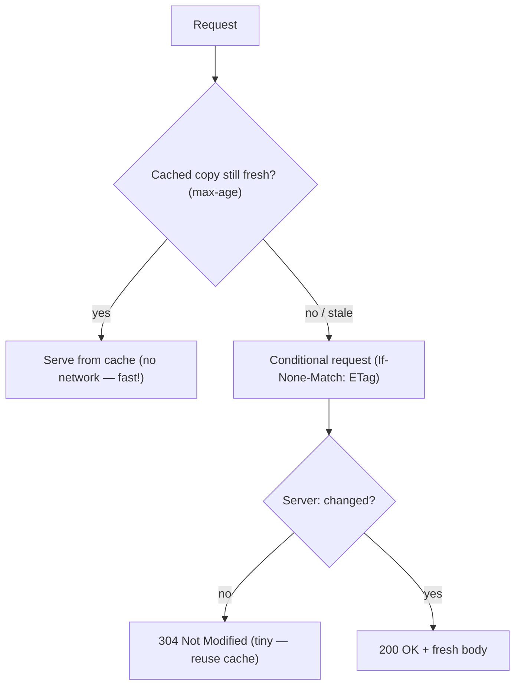

> [!IMPORTANT]
> HTTP caching is a two-tier system that dramatically cuts latency and load. **Tier 1 — Freshness**: `Cache-Control: max-age=3600` says "this is valid for 1 hour — don't even ask the server." The browser/CDN serves it directly, *zero network* (fastest). **Tier 2 — Validation**: once stale, the client makes a **conditional request** using **`ETag`** (a content fingerprint) via `If-None-Match`, or `Last-Modified` via `If-Modified-Since`. If unchanged, the server returns a tiny **`304 Not Modified`** (no body — saves bandwidth) and the client reuses its cached copy. Key `Cache-Control` directives: `no-store` (never cache — sensitive data), `no-cache` (cache but *always* revalidate), `private` (browser only, not shared CDN), `public` (CDN-cacheable), `immutable` (never changes — for versioned assets). Mastering caching is one of the highest-leverage performance skills ([[01 System Design Fundamentals]], [[05 Nginx]], CDNs).

### 2.5 HTTPS & TLS basics

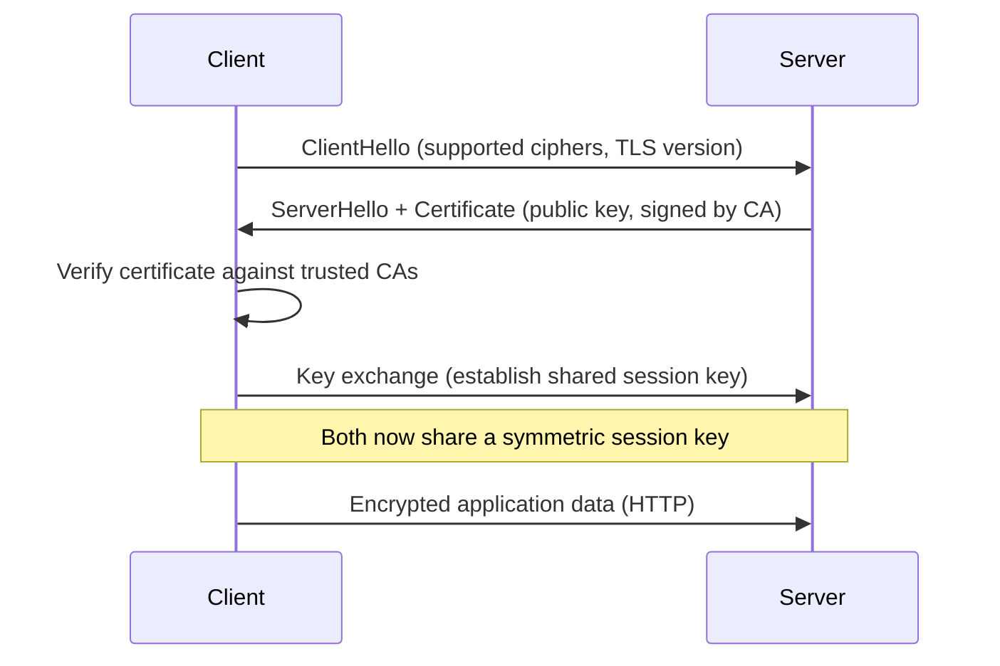

> [!IMPORTANT]
> **HTTPS = HTTP over TLS.** TLS provides three guarantees: **confidentiality** (encryption — eavesdroppers see gibberish), **integrity** (tampering is detected), and **authenticity** (the server is who it claims, via a **certificate** signed by a trusted **Certificate Authority**). The handshake uses **asymmetric crypto** (public/private keys, like [[01 OAuth2 OIDC and JWT]]'s RS256) to *authenticate the server and securely agree on a shared secret*, then switches to fast **symmetric encryption** for the actual data (asymmetric is slow; symmetric is fast — best of both). The certificate is the trust anchor: your browser ships with a list of trusted CAs, and it verifies the server's cert chains up to one. This is why a self-signed or expired cert triggers scary warnings — the authenticity guarantee is broken. TLS 1.3 (current) streamlined the handshake to a single round-trip (faster) and removed insecure legacy options.

### 2.6 CORS — the cross-origin gatekeeper

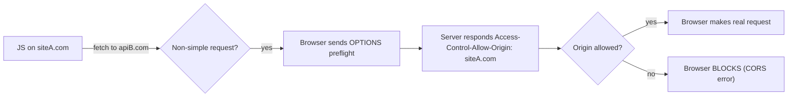

> [!WARNING]
> **CORS (Cross-Origin Resource Sharing) is the most misunderstood web mechanism.** Browsers enforce the **Same-Origin Policy** — JavaScript on `siteA.com` *cannot* read responses from `apiB.com` unless `apiB.com` explicitly opts in via `Access-Control-Allow-Origin` headers. For "non-simple" requests (custom headers, PUT/DELETE, JSON content-type), the browser first sends an **OPTIONS preflight** asking "am I allowed?" — the server must respond with the right `Access-Control-Allow-*` headers, *then* the real request goes. Critical clarifications: **(1) CORS is enforced by the *browser*, not the server** — it's a browser security feature; the server just declares policy (curl/Postman ignore CORS entirely). **(2) CORS is NOT security *for your API*** — it protects *users* from malicious sites reading data in their browser; it does nothing to stop direct attacks. **(3) A CORS error doesn't mean the request failed server-side** — the server often *processed* it; the browser just blocked *your JS from reading the response*. Countless hours are lost misunderstanding this.

---

## 3. ⚙️ ADVANCED CONCEPTS (Senior Level)

### 3.1 HTTP/1.1 — persistent connections & its limits

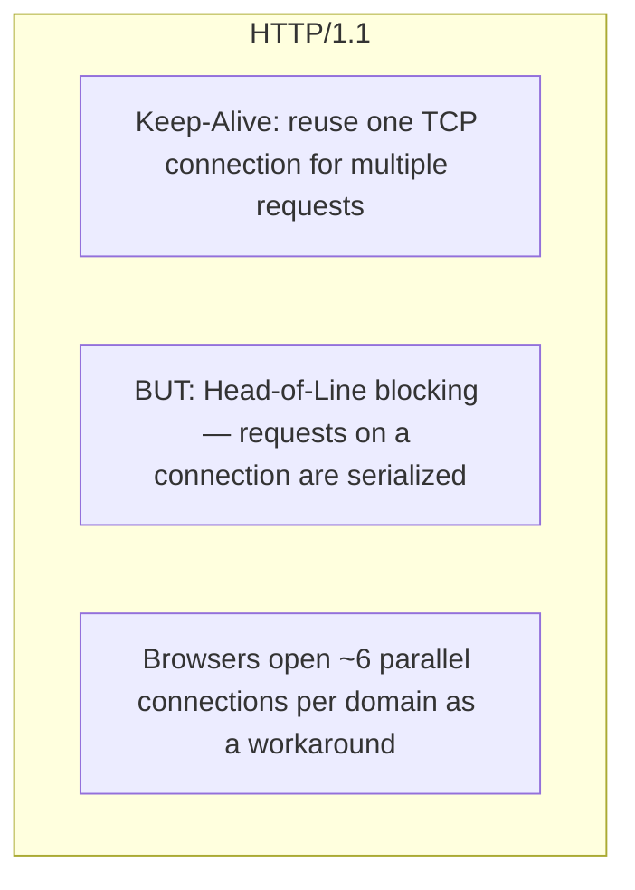

> [!IMPORTANT]
> **HTTP/1.1** (1997, still everywhere) added **persistent connections** (`Keep-Alive`) — reusing one TCP connection for many requests instead of a costly new handshake per request. But it has a fatal flaw: **head-of-line (HOL) blocking** — on a single connection, responses must come back *in order*, so one slow response blocks everything behind it. HTTP/1.1's "pipelining" tried to fix this but was broken in practice. The real-world workaround: browsers open **~6 parallel TCP connections per domain** (and developers did "domain sharding" — spreading assets across subdomains — to get more). This is wasteful (6× handshakes, 6× congestion control) and still limited. These pain points are *exactly* what HTTP/2 was designed to solve.

### 3.2 HTTP/2 — multiplexing

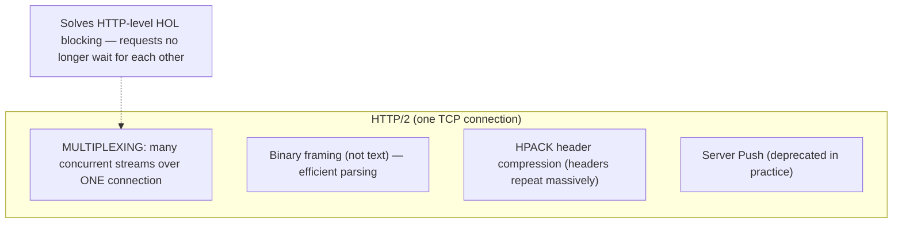

> [!IMPORTANT]
> **HTTP/2** (2015) revolutionized performance with **multiplexing**: many **streams** (independent request/response pairs) share a *single* TCP connection concurrently — no more 6-connection workaround, no HTTP-level head-of-line blocking. It switched from text to a **binary framing** layer (faster, less error-prone parsing) and added **HPACK header compression** (HTTP headers are hugely repetitive across requests — cookies, user-agent — so compressing them saves real bandwidth). Server Push (proactively sending resources) was included but proved problematic and is effectively **deprecated**. HTTP/2's catch: it solved HOL blocking at the *HTTP* layer but **not at the TCP layer** — because all streams share one TCP connection, a single lost TCP packet stalls *all* streams (TCP must deliver in order). This residual **TCP-level HOL blocking** is the problem HTTP/3 attacks.

### 3.3 HTTP/3 & QUIC

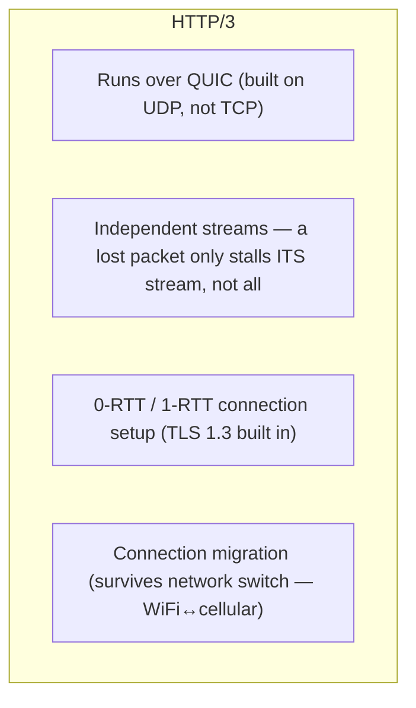

> [!IMPORTANT]
> **HTTP/3** (2022) makes a radical move: it **abandons TCP for QUIC**, a new transport built on **UDP**. Why? To kill **TCP head-of-line blocking** — QUIC implements independent streams at the transport level, so a lost packet only stalls *that one stream*, not all of them (unlike HTTP/2 over TCP). QUIC also **integrates TLS 1.3** into the transport (encryption is mandatory and the handshake is folded into connection setup — **0-RTT or 1-RTT**, much faster than TCP+TLS's multiple round-trips). A standout feature: **connection migration** — a QUIC connection is identified by a connection ID, not the IP/port, so it *survives a network change* (your phone switching from WiFi to cellular keeps the connection alive — no reconnect). HTTP/3 is now widely deployed (Google, Cloudflare, most major CDNs). The trade-off: UDP is sometimes blocked by corporate firewalls, so clients fall back to HTTP/2 (advertised via the `Alt-Svc` header).

### 3.4 The evolution at a glance

| Feature | HTTP/1.1 | HTTP/2 | HTTP/3 |
|---|---|---|---|
| Year | 1997 | 2015 | 2022 |
| Transport | TCP | TCP | **QUIC (UDP)** |
| Format | Text | Binary | Binary |
| Multiplexing | ❌ (6 connections) | ✅ (one connection) | ✅ |
| HOL blocking | HTTP + TCP level | TCP level only | ✅ Solved |
| Header compression | ❌ | HPACK | QPACK |
| TLS | Optional (add-on) | Effectively required | **Built-in (1.3)** |
| Connection migration | ❌ | ❌ | ✅ |

> [!TIP]
> The through-line of HTTP's evolution is **fighting head-of-line blocking and connection setup cost**. 1.1: persistent connections but serialized. 2: multiplexing kills HTTP-level HOL but TCP-level remains. 3: QUIC/UDP kills TCP-level HOL and slashes handshake latency. Each version is *backward-compatible in semantics* (same methods, status codes, headers — your [[02 REST API Design]] doesn't change) but *radically different in transport*. This separation of **semantics (stable) from transport (evolving)** is elegant: you upgrade your infrastructure to HTTP/3 and every existing app gets faster with zero code changes.

### 3.5 Content Negotiation, Compression & Range Requests

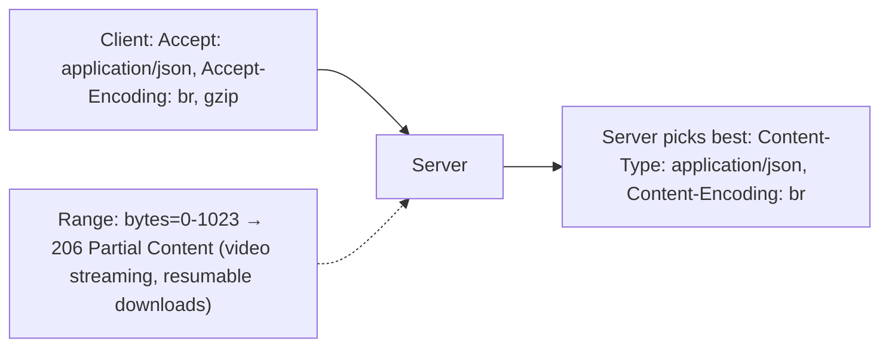

> [!TIP]
> HTTP has rich built-in negotiation. **Content negotiation**: the client's `Accept`, `Accept-Language`, `Accept-Encoding` headers let the server return the best representation (JSON vs XML, English vs French, Brotli vs gzip compression). **Compression** (`Content-Encoding: gzip`/`br`) can shrink text payloads 70–90% — one of the easiest performance wins (Brotli generally beats gzip for text). **Range requests** (`Range: bytes=0-1023` → `206 Partial Content`) enable resumable downloads and video seeking (the player fetches only the bytes it needs, and can resume after a drop). These features are why HTTP scales from tiny API calls to streaming multi-gigabyte video — all through headers.

### 3.6 Failure Scenarios & HTTP Pitfalls

| Pitfall | Cause | Fix |
|---|---|---|
| **Retrying non-idempotent POST** | Retry creates duplicates | Idempotency keys; use PUT where possible |
| **200 OK with error body** | Ignoring status semantics | Return correct 4xx/5xx codes |
| **Mixed content** | HTTPS page loads HTTP resources | All resources over HTTPS; HSTS |
| **Cache serving stale/private data** | Wrong `Cache-Control` | `no-store`/`private` for sensitive data |
| **CORS misconfiguration** | `Allow-Origin: *` with credentials | Explicit origins; understand preflight |
| **Missing security headers** | No HSTS/CSP | Add security headers ([[05 Nginx]]/gateway) |
| **HOL blocking / slow loads** | HTTP/1.1 limits | Upgrade to HTTP/2/3, CDN |
| **Huge uncompressed payloads** | No compression | Enable gzip/brotli |
| **401 vs 403 confusion** | Wrong auth semantics | 401 = who?, 403 = not allowed |

> [!WARNING]
> The most dangerous production HTTP mistakes cluster around **semantics and security**. **Retrying a POST** after a timeout can double-charge a customer (the first request may have succeeded — the *response* was lost, not the *request*); solve with **idempotency keys** (client sends a unique key; server dedupes — the same pattern as [[05 Event-Driven Architecture]] idempotency). **Caching sensitive data** by omitting `Cache-Control: no-store` can leak one user's data to another via a shared cache/CDN. **`Access-Control-Allow-Origin: *` combined with credentials** is both forbidden by spec and a security hole. And **missing HSTS** (`Strict-Transport-Security`) leaves users vulnerable to protocol-downgrade attacks. HTTP correctness *is* security and reliability — the protocol's rules exist for reasons.

---

## 4. 🏗️ REAL-WORLD SYSTEM DESIGN USAGE

### 4.1 The full path of a modern web request

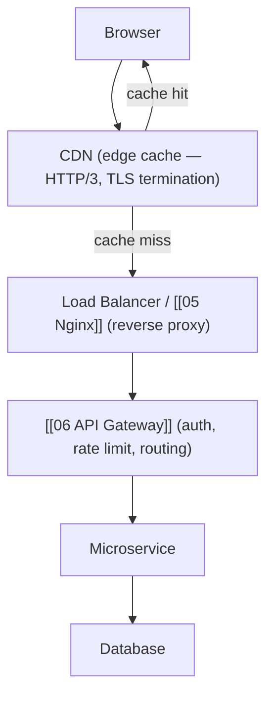

> [!IMPORTANT]
> A real request traverses many HTTP-speaking hops, each leveraging protocol features. The **CDN** caches static content at the edge (HTTP caching headers decide what/how long) and often terminates **TLS** and speaks **HTTP/3** to users. A **reverse proxy / load balancer** ([[05 Nginx]]) distributes traffic and may re-terminate TLS. The **[[06 API Gateway]]** handles cross-cutting concerns (auth via [[01 OAuth2 OIDC and JWT]], rate limiting → `429`, routing). Each hop reads/rewrites **headers** (adding `X-Forwarded-For`, correlation IDs for [[02 Observability]]). Understanding HTTP end-to-end lets you reason about *where* caching, compression, TLS termination, and errors happen — e.g., a `502` from the CDN means the origin misbehaved; a `504` means it timed out. This is the HTTP backbone of [[01 System Design Fundamentals]] and [[03 Microservices]].

### 4.2 HTTP for APIs vs real-time

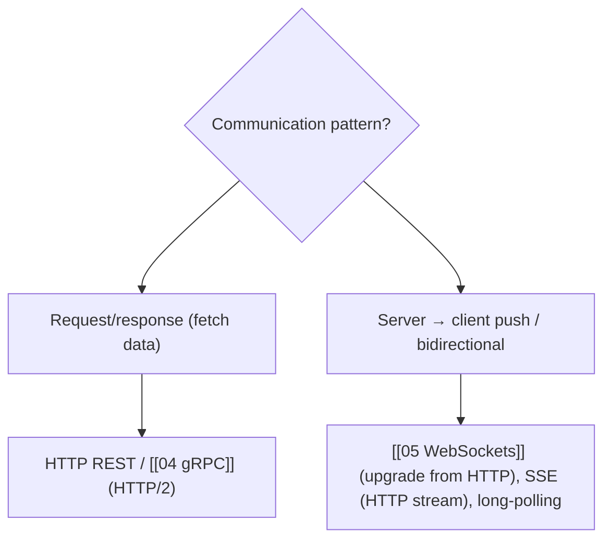

> [!TIP]
> Classic HTTP is **request/response** — the client always initiates. For **server-initiated / real-time** needs, you go beyond plain HTTP: **[[05 WebSockets]]** *upgrade* an HTTP connection (`101 Switching Protocols`) to a persistent bidirectional channel; **Server-Sent Events (SSE)** keep an HTTP response open to stream events server→client (simpler than WebSockets, one-directional, auto-reconnect); **long-polling** is the fallback (hold a request open until data's ready). Meanwhile **[[04 gRPC]]** rides on HTTP/2's multiplexing and streaming for high-performance service-to-service RPC. Knowing that WebSockets *start* as HTTP (the `Upgrade` header) and that SSE *is* just HTTP explains how real-time fits into the HTTP world rather than replacing it.

### 4.3 Security headers you should always set

| Header | Protects against |
|---|---|
| **Strict-Transport-Security (HSTS)** | Protocol downgrade / SSL stripping |
| **Content-Security-Policy (CSP)** | XSS (controls what scripts can load) |
| **X-Content-Type-Options: nosniff** | MIME-sniffing attacks |
| **X-Frame-Options / frame-ancestors** | Clickjacking |
| **Referrer-Policy** | Leaking URLs to third parties |
| **Set-Cookie: HttpOnly; Secure; SameSite** | XSS token theft, CSRF |

> [!IMPORTANT]
> A production HTTP service should ship a baseline of **security headers** — the cheap, high-impact defenses. **HSTS** forces browsers to always use HTTPS (preventing downgrade attacks). **CSP** is the strongest defense against XSS — it whitelists which sources scripts/styles can load from, so injected inline scripts don't execute. **`nosniff`** stops browsers from guessing content types (a vector for tricking them into executing data as script). **X-Frame-Options** prevents your site being embedded in a malicious iframe (clickjacking). These are typically set at the [[05 Nginx]]/[[06 API Gateway]] layer once for all responses. This is foundational web security — and a natural bridge to a dedicated OWASP/web-security topic.

---

## 5. 🎤 INTERVIEW PREPARATION

### 5.1 Most important questions

<details>
<summary><b>Q1: What happens when you type a URL and press Enter?</b></summary>

**DNS** resolves the domain to an IP. A **TCP** connection is opened (3-way handshake). For HTTPS, a **TLS** handshake negotiates encryption and verifies the server's certificate. The browser sends an **HTTP request** (method, path, headers). The server returns an **HTTP response** (status, headers, body). The browser parses the HTML and fetches additional resources (CSS, JS, images) — often over the same multiplexed HTTP/2 connection — then renders the page. Caching, redirects, and CDNs may short-circuit steps.
</details>

<details>
<summary><b>Q2: Is HTTP stateless? How do we maintain state?</b></summary>

Yes — HTTP is stateless; the server remembers nothing between requests. State is layered on top via **cookies** (server sends `Set-Cookie`; browser returns it on each request) referencing a **server-side session**, or via **tokens** ([[01 OAuth2 OIDC and JWT]] — a signed JWT carried in the `Authorization` header, self-contained so no server storage needed). Statelessness is what makes HTTP scalable — any server can handle any request.
</details>

<details>
<summary><b>Q3: Explain idempotency and which methods are idempotent.</b></summary>

Idempotent = performing the operation N times has the same effect as once. **GET, PUT, DELETE, HEAD, OPTIONS** are idempotent; **POST and PATCH** generally aren't. It matters for **retries**: after a network failure you can safely retry a PUT/DELETE but not a POST (which might create duplicates). For non-idempotent operations needing safe retries, use **idempotency keys** (client sends a unique key; server dedupes).
</details>

<details>
<summary><b>Q4: 401 vs 403? 502 vs 503 vs 504?</b></summary>

**401 Unauthorized** = not authenticated ("I don't know who you are" — provide credentials). **403 Forbidden** = authenticated but not permitted ("I know you, but you can't do this"). **502 Bad Gateway** = a proxy got an invalid response from upstream. **503 Service Unavailable** = server is up but refusing (overload/maintenance). **504 Gateway Timeout** = upstream didn't respond in time. 4xx = client's fault, 5xx = server's fault.
</details>

<details>
<summary><b>Q5: How does HTTP caching work?</b></summary>

Two tiers. **Freshness**: `Cache-Control: max-age=N` lets the client serve from cache without contacting the server for N seconds. **Validation**: once stale, the client sends a conditional request (`If-None-Match` with the **ETag**, or `If-Modified-Since`); if unchanged, the server returns **304 Not Modified** with no body and the client reuses its cache. Directives like `no-store` (never cache), `private` (browser only), and `immutable` (versioned assets) tune behavior.
</details>

<details>
<summary><b>Q6: HTTP/1.1 vs HTTP/2 vs HTTP/3?</b></summary>

**HTTP/1.1**: persistent connections but serialized (head-of-line blocking); browsers open ~6 connections per domain. **HTTP/2**: multiplexing (many streams over one TCP connection), binary framing, HPACK header compression — solves HTTP-level HOL but not TCP-level. **HTTP/3**: runs over **QUIC (UDP)**, eliminating TCP-level HOL blocking, with built-in TLS 1.3, faster (0/1-RTT) handshakes, and connection migration (survives WiFi↔cellular). Semantics stay the same; only transport evolves.
</details>

<details>
<summary><b>Q7: What is CORS and is it security for my API?</b></summary>

CORS relaxes the browser's Same-Origin Policy, letting a server opt in to cross-origin JS access via `Access-Control-Allow-*` headers (with an OPTIONS preflight for non-simple requests). Crucially, **CORS is enforced by the browser, not the server, and it is NOT security for your API** — it protects *users* from malicious sites reading their data in a browser. It does nothing against direct (curl/server) attacks; a CORS error often means the server processed the request but the browser blocked your JS from reading the response.
</details>

<details>
<summary><b>Q8: How does HTTPS/TLS work?</b></summary>

HTTPS is HTTP over TLS, providing confidentiality (encryption), integrity (tamper detection), and authenticity (server identity via a CA-signed certificate). The handshake uses asymmetric crypto to verify the server's certificate and agree on a shared secret, then switches to fast symmetric encryption for the data. The browser trusts the cert because it chains to a Certificate Authority in its trust store. TLS 1.3 reduced the handshake to one round-trip.
</details>

### 5.2 Tricky questions

> [!TIP]
> **"Why can retrying a POST be dangerous but retrying a PUT is safe?"** — PUT is idempotent (replaces a resource — same result every time). POST creates a new resource each call, so a retry after a lost *response* (the request may have succeeded) creates a duplicate. Use idempotency keys to make POST safely retryable.

> [!TIP]
> **"A user gets a CORS error — did the request reach the server?"** — Often yes! CORS is a browser-side gate on *reading the response*. The server may have fully processed the request (even a POST that changed data); the browser just blocked your JavaScript from seeing the result because the CORS headers weren't right.

> [!TIP]
> **"Does HTTP/2 eliminate head-of-line blocking?"** — Only at the HTTP layer (via multiplexing). Because all streams share one TCP connection, a lost TCP packet still stalls all streams (TCP-level HOL blocking). HTTP/3's QUIC fixes this with independent transport-level streams.

> [!TIP]
> **"Is a 302 or 301 better for a permanently moved page?"** — 301 (permanent) — browsers and search engines cache it and update links; SEO value transfers. 302/307 are temporary (don't cache the redirect). Using 302 for a permanent move is a common SEO mistake. Note 307/308 preserve the method/body, unlike legacy 301/302.

### 5.3 Common mistakes candidates make

| Mistake | Reality |
|---|---|
| "GET can have a body / can modify data" | GET is safe & should never mutate |
| "CORS secures my API" | It protects browser users, not the API |
| Confusing 401 and 403 | 401 = unauthenticated, 403 = unauthorized |
| "200 OK" for errors | Use proper 4xx/5xx codes |
| Retrying POST blindly | Non-idempotent → duplicates; use keys |
| "HTTP/2 needs multiple connections" | One connection, multiplexed |
| Ignoring cache/security headers | Huge perf & security impact |
| "HTTPS just encrypts" | Also integrity + authenticity (certs) |

### 5.4 What interviewers actually expect

- The **URL-to-render** journey (DNS→TCP→TLS→HTTP) and layering.
- **Statelessness** and how cookies/tokens re-establish state.
- **Methods** + **safe/idempotent** semantics (and retry implications).
- **Status codes** precisely (401 vs 403, the 5xx family).
- **Caching** (freshness vs validation, ETag, 304).
- **HTTP/1.1 → 2 → 3** evolution and head-of-line blocking.
- **HTTPS/TLS** guarantees and the handshake; **CORS** reality.

---

## 6. 🛠️ HANDS-ON PROJECTS

### Project 1: Inspect & Craft Raw HTTP (Beginner→Intermediate)

**Goal:** See HTTP as it really is — text on a wire.

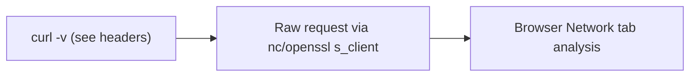

**Steps:**
1. Use `curl -v https://example.com` to see the full request/response with headers.
2. Send a **raw** HTTP request by hand (`openssl s_client -connect host:443`, type the request line + headers).
3. Explore methods: `curl -X POST -d`, `-H` custom headers, `-I` (HEAD).
4. In the browser Network tab, inspect caching (`Cache-Control`, `304`s), cookies, and status codes on a real site.
5. Trigger and read a redirect chain (`curl -L`).

**Learn:** request/response anatomy, headers, methods, status codes, caching — hands-on.

---

### Project 2: Build a Caching + Auth HTTP Server (Intermediate→Senior)

**Goal:** Implement HTTP's core features server-side.

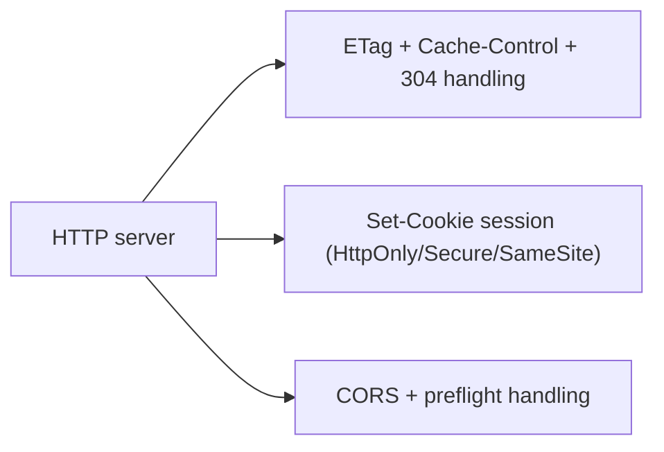

**Steps:**
1. Build a server ([[05 Node.js]]/[[06 Express.js]] or [[05 Spring Boot]]) with proper status codes and methods.
2. Implement **ETag** generation + `If-None-Match` → return **304** when unchanged.
3. Add cookie-based sessions with correct security flags; observe auto-attachment.
4. Implement **CORS** with a preflight; test cross-origin from a different port and watch the OPTIONS request.
5. Add `gzip`/`brotli` compression; measure payload size reduction.

**Learn:** caching implementation, ETags, cookie security, CORS/preflight, compression.

---

### Project 3: Compare HTTP/1.1 vs /2 vs /3 Performance (Senior)

**Goal:** Measure the protocol evolution empirically.

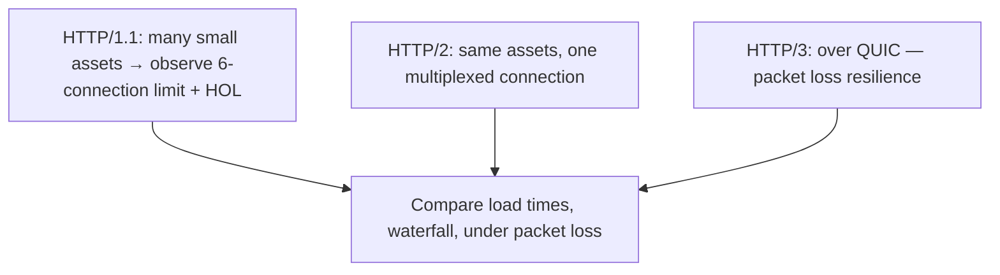

**Steps:**
1. Serve a page with many small assets over **HTTP/1.1**; observe the connection limit and waterfall in DevTools.
2. Enable **HTTP/2** ([[05 Nginx]]/Caddy); see multiplexing flatten the waterfall.
3. Enable **HTTP/3** (Caddy/Cloudflare); verify via `Alt-Svc` and DevTools protocol column.
4. Simulate **packet loss** (`tc netem`) and compare HTTP/2 vs HTTP/3 — see QUIC's per-stream resilience.
5. Inspect the TLS handshake round-trips (Wireshark) across versions.

**Learn:** multiplexing, HOL blocking, QUIC benefits, TLS handshake, real performance analysis.

---

## 7. 🔬 DEEP DIVE: INTERNALS

### 7.1 The TCP 3-way handshake & connection lifecycle

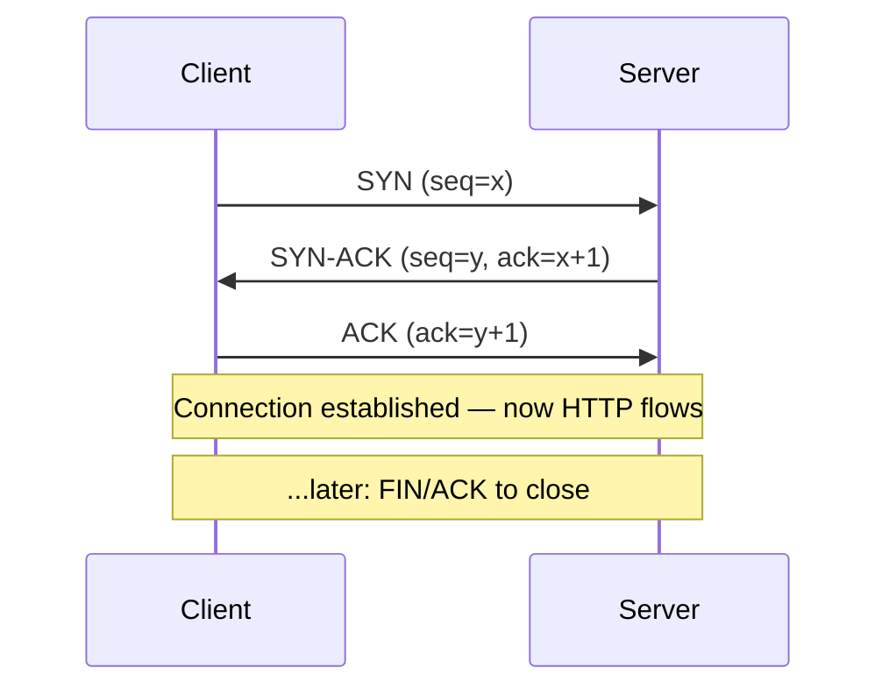

> [!IMPORTANT]
> HTTP (before HTTP/3) rides on **TCP**, and every classic connection starts with a **3-way handshake**: **SYN** (client: "let's talk, my sequence number is x"), **SYN-ACK** (server: "ok, mine is y, I got your x"), **ACK** (client: "got your y"). Only *then* can data flow — so there's a full round-trip of latency *before any HTTP is sent*, and for HTTPS, the **TLS handshake adds more round-trips** on top. This is why **connection reuse matters so much** (HTTP/1.1 Keep-Alive, HTTP/2 multiplexing) — amortizing that setup cost across many requests. It's also why HTTP/3/QUIC's **0-RTT/1-RTT** setup is a big deal: folding transport + TLS setup together and even resuming prior connections instantly slashes the latency floor. TCP also provides **reliability** (retransmits lost packets) and **ordering** (in-order delivery) — the very in-order guarantee that causes TCP-level HOL blocking (§3.2).

### 7.2 How TLS establishes a secure channel (deeper)

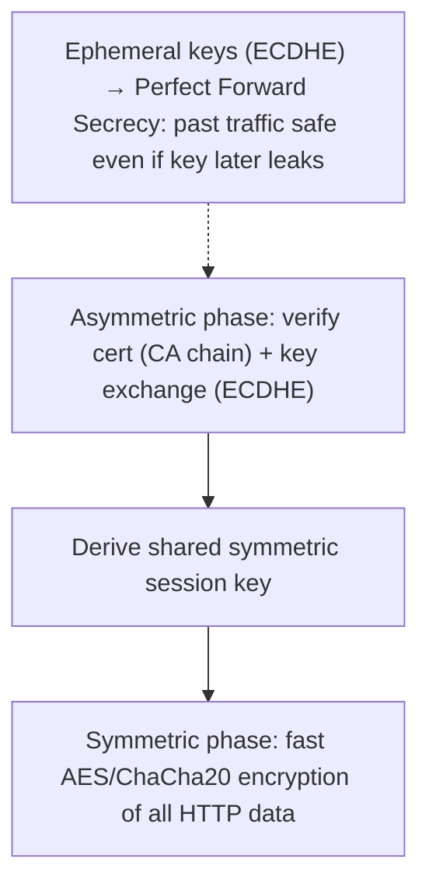

> [!IMPORTANT]
> TLS cleverly combines two cryptographic worlds. The **asymmetric phase** authenticates the server (its certificate, signed by a CA, proves it owns the private key matching the public key in the cert) and performs a **key exchange** — modern TLS uses **ECDHE** (Elliptic Curve Diffie-Hellman Ephemeral) to derive a shared secret that *neither party sent over the wire* and that an eavesdropper can't compute. Then the **symmetric phase** uses that shared key with fast ciphers (AES-GCM, ChaCha20) to encrypt all the actual HTTP data (symmetric crypto is far faster than asymmetric). The "Ephemeral" in ECDHE gives **Perfect Forward Secrecy**: a fresh key per session means that even if the server's private key is later compromised, past recorded traffic *can't* be decrypted. **TLS 1.3** (2018) stripped out legacy insecure ciphers, made PFS mandatory, and cut the handshake to **1-RTT** (or 0-RTT for resumption) — both faster and more secure than TLS 1.2. This mirrors the asymmetric-signs/symmetric-encrypts pattern and connects to [[01 OAuth2 OIDC and JWT]]'s use of the same primitives.

### 7.3 HTTP/2 framing & streams internals

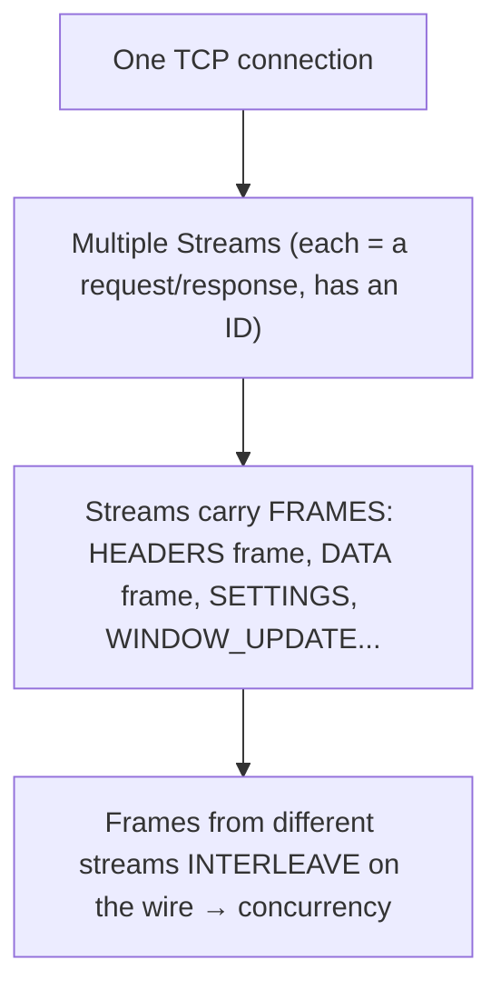

> [!TIP]
> HTTP/2's multiplexing works via a **binary framing layer**. A single connection carries many **streams** (each an independent request/response, identified by a stream ID). Messages are split into **frames** (HEADERS frame for headers, DATA frames for the body, plus control frames like SETTINGS and WINDOW_UPDATE for flow control). The magic: frames from *different* streams **interleave** on the wire — the server can send a bit of stream 1, then stream 3, then stream 1 again — achieving true concurrency over one connection. The receiver reassembles frames by stream ID. HTTP/2 also has **flow control** (WINDOW_UPDATE frames prevent a fast sender overwhelming a slow receiver — like TCP's flow control but per-stream) and **stream prioritization** (hint which streams matter most). This binary, framed, multiplexed design is a complete departure from HTTP/1.1's one-request-per-connection text model — while keeping identical *semantics*.

### 7.4 QUIC internals — why UDP?

```mermaid
flowchart TB
    QUIC["QUIC (over UDP)"] --> Indep["Independent streams: each has its own delivery/ordering"]
    QUIC --> Loss["Packet loss on stream A → only stream A waits; B, C proceed"]
    QUIC --> CID["Connection ID (not IP:port) → survives network change"]
    QUIC --> Crypto["TLS 1.3 integrated → handshake + encryption in one"]
```

> [!IMPORTANT]
> Why build QUIC on **UDP** instead of fixing TCP? Because TCP is implemented in the **OS kernel** (and baked into middleboxes/routers worldwide) — evolving it is glacially slow. UDP is a minimal, unordered datagram protocol, so QUIC builds its *own* reliability, ordering, and congestion control in **user space** (in the application/library), where it can iterate fast. This lets QUIC provide **independent streams**: unlike TCP's single ordered byte-stream (where one lost packet blocks everything behind it), each QUIC stream has independent delivery — a lost packet only stalls *its* stream. QUIC identifies connections by a **Connection ID** rather than the IP:port 4-tuple, so a connection **survives an IP change** (WiFi→cellular) — impossible with TCP. And it **integrates TLS 1.3** directly, merging transport and crypto handshakes for 0/1-RTT setup. The cost: UDP is sometimes throttled/blocked by firewalls (hence HTTP/3 falls back to HTTP/2), and doing congestion control in user space is complex. QUIC is arguably the most significant transport-layer change in decades.

### 7.5 Idempotency keys & safe retries (pattern internals)

```mermaid
flowchart LR
    Client["Client: POST /payments + Idempotency-Key: uuid-123"] --> Server
    Server --> Check{"Seen uuid-123 before?"}
    Check -->|"no"| Process["Process, store result under uuid-123"]
    Check -->|"yes"| Return["Return the SAME stored result (no double-charge)"]
```

> [!TIP]
> Since POST isn't idempotent but networks are unreliable, the **idempotency key** pattern (used by Stripe, payment APIs) makes retries safe. The client generates a unique key (UUID) per logical operation and sends it in a header (`Idempotency-Key`). The server, before processing, checks if it's seen that key: if not, it processes and **stores the result keyed by the idempotency key**; if yes (a retry), it returns the *stored* result *without re-executing* — so a retried payment charges once, not twice. The key insight: this converts an unsafe operation into an effectively-idempotent one at the application layer, solving the "did my request succeed before the response was lost?" problem. It's the exact same idempotency principle as [[05 Event-Driven Architecture]] consumers and connects to [[06 Distributed Systems]]' exactly-once challenges — a beautiful cross-cutting pattern that shows HTTP correctness and distributed-systems theory are the same discipline.

---

## ✅ Production Checklists

### Correctness
- [ ] Correct **methods** (GET never mutates) and **status codes** (no 200-for-errors)
- [ ] **Idempotency keys** for non-idempotent operations needing retry safety
- [ ] Precise **401 vs 403**, correct 3xx redirects (301/308 vs 302/307)
- [ ] Consistent error response format ([[02 REST API Design]])

### Performance
- [ ] **HTTP/2 or HTTP/3** enabled (via [[05 Nginx]]/CDN)
- [ ] **Compression** (gzip/brotli) on text responses
- [ ] **Caching** headers (`Cache-Control`, `ETag`) tuned per resource
- [ ] Static assets on a **CDN** with long `max-age` + `immutable` (versioned URLs)
- [ ] Connection reuse / keep-alive configured

### Security
- [ ] **HTTPS everywhere** + **HSTS**; TLS 1.2/1.3 only
- [ ] Security headers: **CSP**, `nosniff`, X-Frame-Options, Referrer-Policy
- [ ] Cookies: **HttpOnly, Secure, SameSite**
- [ ] **CORS** locked to explicit origins (no `*` with credentials)
- [ ] `no-store`/`private` on sensitive responses
- [ ] Rate limiting → **429** at the [[06 API Gateway]]

---

## 🗺️ Learning Roadmap

```mermaid
flowchart TB
    A["1️⃣ Request/response<br/>methods, status codes, headers"] --> B["2️⃣ State & caching<br/>cookies, sessions, Cache-Control/ETag"]
    B --> C["3️⃣ HTTPS/TLS<br/>encryption, certs, handshake"]
    C --> D["4️⃣ CORS & security headers<br/>same-origin, CSP, HSTS"]
    D --> E["5️⃣ Protocol evolution<br/>HTTP/1.1 → 2 → 3, HOL blocking"]
    E --> F["6️⃣ Transport internals<br/>TCP handshake, QUIC, framing"]
    F --> G["7️⃣ Patterns<br/>idempotency keys, compression, ranges"]
    G --> H["8️⃣ System design<br/>CDN, proxies, gateways, real-time"]
```

| Stage | Focus | You can... |
|---|---|---|
| 1–2 | Basics + caching | Build correct, cacheable APIs |
| 3–4 | Security | Ship secure HTTPS services |
| 5–6 | Protocol + transport | Explain & optimize performance |
| 7–8 | Patterns + design | Architect the HTTP layer at scale |

---

## 🔁 Self-Review Completion Loop

Reviewed against the HTTP RFCs (9110–9114), MDN HTTP docs, the TLS 1.3 RFC, and High Performance Browser Networking (Grigorik).

### Gap Review Matrix

| Dimension | Covered? | Where |
|---|---|---|
| URL-to-render journey | ✅ | §1, §5 |
| Request/response anatomy | ✅ | §1 |
| Methods + safe/idempotent | ✅ | §1 |
| Status codes (all classes) | ✅ | §2.1 |
| Headers | ✅ | §2.2 |
| Cookies & sessions | ✅ | §2.3 |
| Statelessness | ✅ | Exec, §5 |
| Caching (freshness/validation) | ✅ | §2.4 |
| HTTPS/TLS | ✅ | §2.5, §7.2 |
| CORS | ✅ | §2.6 |
| HTTP/1.1 | ✅ | §3.1 |
| HTTP/2 multiplexing | ✅ | §3.2, §7.3 |
| HTTP/3 & QUIC | ✅ | §3.3, §7.4 |
| Version comparison | ✅ | §3.4 |
| Content negotiation/compression/ranges | ✅ | §3.5 |
| HTTP pitfalls | ✅ | §3.6 |
| Request path (CDN/proxy/gateway) | ✅ | §4.1 |
| Real-time (WS/SSE) | ✅ | §4.2 |
| Security headers | ✅ | §4.3 |
| TCP handshake | ✅ | §7.1 |
| Idempotency keys | ✅ | §7.5 |
| Interview Q&A + mistakes | ✅ | §5 |
| Hands-on projects | ✅ | §6 |

> [!NOTE]
> **Remaining depth to explore independently:** DNS internals (recursive/authoritative, records, DNS-over-HTTPS), the full TLS 1.3 handshake message-by-message, HTTP/2 priority trees and their deprecation, QUIC congestion control algorithms, WebTransport (HTTP/3-based), Early Hints (103), the Fetch spec and request modes, HTTP semantics edge cases (chunked transfer encoding, trailers, 100-continue), proxy/caching hierarchies (Vary header subtleties), and load balancer L4 vs L7 details ([[05 Nginx]], [[01 System Design Fundamentals]]).

---

## 📚 Official References

| Resource | Source |
|---|---|
| RFC 9110 — HTTP Semantics | https://datatracker.ietf.org/doc/html/rfc9110 |
| RFC 9112/9113/9114 — HTTP/1.1, HTTP/2, HTTP/3 | https://datatracker.ietf.org/ |
| RFC 8446 — TLS 1.3 | https://datatracker.ietf.org/doc/html/rfc8446 |
| MDN — HTTP | https://developer.mozilla.org/en-US/docs/Web/HTTP |
| *High Performance Browser Networking* — Ilya Grigorik | https://hpbn.co/ |
| Cloudflare Learning — HTTP/2, HTTP/3, QUIC, TLS | https://www.cloudflare.com/learning/ |
| MDN — HTTP caching / CORS / Cookies | https://developer.mozilla.org/en-US/docs/Web/HTTP/Caching |

---

## 🎁 Final Summary

> [!IMPORTANT]
> **The one-paragraph takeaway:** HTTP is the **stateless request/response** protocol under all web communication — a client sends a **method** (GET/POST/PUT/PATCH/DELETE, each with **safe**/**idempotent** semantics that govern caching and retries) to a **URL** with **headers** (the metadata that drives auth, caching, compression, cookies, CORS, and security) and an optional **body**; the server replies with a **status code** (2xx success, 3xx redirect, **4xx client's fault** — know 401 *unauthenticated* vs 403 *unauthorized* — and **5xx server's fault** — 502 bad upstream, 503 overloaded, 504 timeout) plus its own headers and body. Because HTTP is **stateless** (the server remembers nothing), identity is re-established every request via **cookies** (with `HttpOnly`/`Secure`/`SameSite` flags) or **tokens** ([[01 OAuth2 OIDC and JWT]]) — the foundation of web scalability. **Caching** is two-tiered: freshness (`Cache-Control: max-age` serves from cache with zero network) then validation (`ETag`/`If-None-Match` → tiny **304 Not Modified**), and it's one of the highest-leverage performance tools. **HTTPS = HTTP over TLS**, giving confidentiality, integrity, and authenticity via CA-signed **certificates**, using asymmetric crypto to authenticate and agree a key, then fast symmetric encryption (TLS 1.3 = 1-RTT + Perfect Forward Secrecy). **CORS** is a browser-enforced relaxation of the Same-Origin Policy — *not* security for your API, and a CORS error means the browser blocked *reading the response*, not that the server rejected the request. The protocol's evolution is a war on **head-of-line blocking** and setup latency: **HTTP/1.1** (persistent but serialized, ~6 connections), **HTTP/2** (multiplexed streams + binary framing + HPACK over one TCP connection — solves HTTP-level HOL but not TCP-level), and **HTTP/3** (over **QUIC/UDP** — independent streams eliminate TCP HOL, built-in TLS 1.3, 0/1-RTT handshakes, and connection migration across networks) — all while keeping identical semantics so your app code never changes. And HTTP correctness *is* reliability and security: use proper status codes, **idempotency keys** to make POST retries safe (the same idempotency principle as [[05 Event-Driven Architecture]]/[[06 Distributed Systems]]), and ship the baseline security headers (HSTS, CSP, cookie flags).

**Golden rules:**
1. 🔄 HTTP is **stateless** — cookies/tokens re-establish identity every request.
2. 🎯 Respect **method semantics**: GET is safe (never mutates); PUT/DELETE idempotent; POST is not.
3. 📊 Use **precise status codes** — 401≠403, 5xx family distinct; never 200-for-errors.
4. 💾 **Caching** = freshness (`max-age`) + validation (`ETag`→304); huge perf lever.
5. 🔐 **HTTPS = HTTP+TLS**: confidentiality + integrity + authenticity (certs); TLS 1.3.
6. 🌍 **CORS protects browser users, not your API** — and it's browser-enforced.
7. 🚀 **HTTP/1.1→2→3** is a war on head-of-line blocking; HTTP/3/QUIC wins at the transport layer.
8. 🔑 Make POST retries safe with **idempotency keys** (lost response ≠ failed request).
9. 🗜️ Enable **compression** (brotli/gzip) and reuse connections — cheap wins.
10. 🛡️ Ship **security headers** (HSTS, CSP, `HttpOnly`/`Secure`/`SameSite` cookies) by default.

---

*Related guides in this vault: [[02 REST API Design]] · [[05 WebSockets]] · [[04 gRPC]] · [[05 Nginx]] · [[01 OAuth2 OIDC and JWT]] · [[06 API Gateway]] · [[01 System Design Fundamentals]] · [[06 Distributed Systems]] · [[05 Event-Driven Architecture]]*
