# 🔗 REST API Design — Complete Beginner-to-Expert Reference

> How to design HTTP APIs that are intuitive, consistent, evolvable, and a joy to consume — the architectural style that powers most of the web's service-to-service communication.

---

## 📑 Table of Contents

1. [Executive Summary](#-executive-summary)
2. [Fundamentals (Beginner)](#1--fundamentals-beginner-level)
3. [Core Concepts (Intermediate)](#2--core-concepts-intermediate-level)
4. [Advanced Concepts (Senior)](#3--advanced-concepts-senior-level)
5. [Real-World System Design](#4--real-world-system-design-usage)
6. [Interview Preparation](#5--interview-preparation)
7. [Hands-On Projects](#6--hands-on-projects)
8. [Deep Dive: Internals](#7--deep-dive-internals)
9. [Production Checklists](#-production-checklists)
10. [Learning Roadmap](#-learning-roadmap)
11. [Self-Review Completion Loop](#-self-review-completion-loop)
12. [Official References](#-official-references)
13. [Final Summary](#-final-summary)

---

## 🎯 Executive Summary

**REST (Representational State Transfer)** is an architectural style for designing networked APIs over HTTP. A well-designed REST API models your domain as **resources** (nouns) manipulated via standard **HTTP methods** (verbs), returns meaningful **status codes**, and is **stateless**, **cacheable**, and **evolvable**. It's the dominant style for web APIs because it leverages HTTP as designed.

| What it is | What it replaces | Core superpower |
|---|---|---|
| Resource-oriented HTTP API style | RPC-over-HTTP soup, inconsistent endpoints, SOAP | **Predictable, uniform, HTTP-native** interfaces that any client understands |

> [!IMPORTANT]
> REST is a **style, not a standard** — there's no spec that "validates" a REST API, which is exactly why quality varies wildly. Good REST design is about **consistency and using HTTP as intended**: resources as nouns, methods as verbs, status codes with meaning, statelessness. The single biggest mistake is treating REST as "JSON over HTTP with random endpoints" (`/getUser`, `/createOrderNow`). This guide is the design discipline that turns your [[05 Spring Boot]]/[[06 Express.js]]/[[05 Node.js]] endpoints into APIs consumers love — and it's the API layer of [[01 System Design Fundamentals]].

Related guides: [[05 Spring Boot]] · [[06 Express.js]] · [[05 Node.js]] · [[01 System Design Fundamentals]] · [[03 Microservices]] · [[11 Spring Boot Authentication]] · [[03 GraphQL]] · [[04 gRPC]]

---

## 1. 🌱 FUNDAMENTALS (Beginner Level)

### What is a REST API in simple terms?

An **API** lets one program talk to another. A **REST API** is a specific, tidy way to do that over HTTP: you expose **things** (resources like users, orders, products) at **URLs**, and clients **act on them** using standard HTTP methods — `GET` to read, `POST` to create, `PUT`/`PATCH` to update, `DELETE` to remove. It's like a well-organized library where everything has a predictable address and you interact with it in predictable ways.

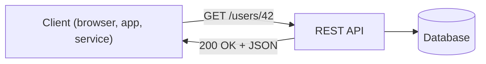

### Why does REST exist?

Before REST (Roy Fielding's 2000 dissertation), web services were often **SOAP** (heavy XML envelopes, complex tooling) or ad-hoc RPC (`/doThisAction?param=x`). These were verbose, tightly coupled, and didn't use HTTP's built-in features (caching, status codes, methods). REST proposed: **use HTTP the way it was designed** — resources, verbs, status codes, statelessness — for simple, scalable, evolvable APIs.

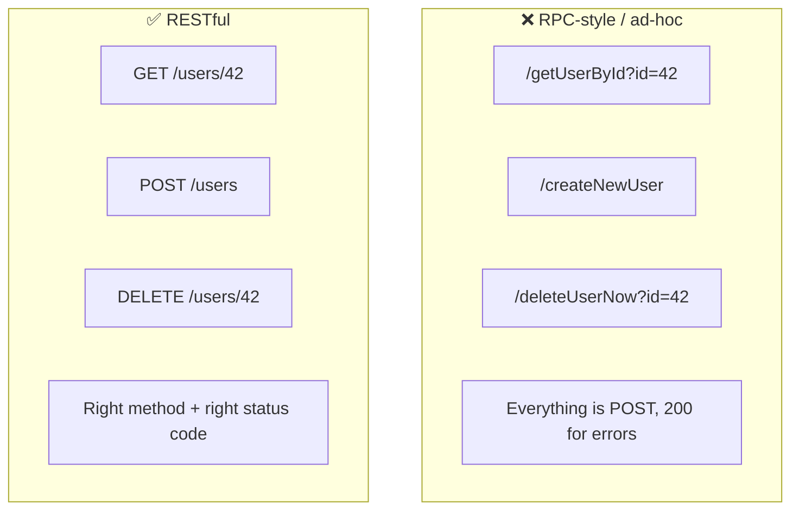

### Problems REST solves

| Problem | How REST solves it |
|---|---|
| **Inconsistent, unpredictable endpoints** | Uniform resource + method conventions |
| **Reinventing error signaling** | Standard HTTP status codes |
| **Tight client-server coupling** | Statelessness + uniform interface |
| **No caching** | Leverages HTTP caching (GET, ETags) |
| **Hard to evolve** | Versioning + additive changes |
| **Cross-platform interop** | Plain HTTP + JSON — every language speaks it |

### The 6 REST Constraints (what makes it "RESTful")

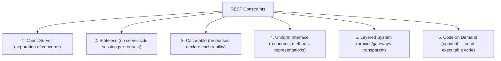

| Constraint | Meaning |
|---|---|
| **Client-Server** | UI and data storage evolve independently |
| **Stateless** | Each request carries all context; server stores no session |
| **Cacheable** | Responses indicate if/how they can be cached |
| **Uniform Interface** | Consistent resource identification & manipulation |
| **Layered System** | Intermediaries (LB, cache, gateway) are invisible to the client |
| **Code on Demand** | (Optional) server can send code (e.g., JS) to the client |

> [!IMPORTANT]
> **Statelessness is the most important constraint for scale.** Because each request contains everything the server needs (auth token, parameters), *any* server can handle *any* request — no session pinning. This is what makes horizontal scaling ([[01 System Design Fundamentals]], [[02 Kubernetes]] replicas) trivial: put a load balancer in front of N identical stateless servers. If your API stored per-user session in server memory, you'd break this. Push state to the client (tokens) or a shared store ([[04 Redis]]).

### Core vocabulary

| Term | Plain meaning |
|---|---|
| **Resource** | A "thing" the API exposes (user, order) |
| **Endpoint / URI** | The address of a resource (`/users/42`) |
| **HTTP method** | The action (GET/POST/PUT/PATCH/DELETE) |
| **Status code** | Numeric result (200, 404, 500) |
| **Representation** | The format of the resource (usually JSON) |
| **Idempotent** | Same request repeated = same effect |
| **Safe** | Read-only, no side effects (GET) |
| **HATEOAS** | Responses include links to related actions |

### Real-world analogy 🏛️

A REST API is like a **well-run government records office**:
- Every citizen record lives at a **predictable address** (`/citizens/42`) — a resource with a URI.
- You use **standard request forms** (HTTP methods): "view" (GET), "register new" (POST), "update" (PUT/PATCH), "remove" (DELETE).
- The clerk returns a **standard stamp** on your form (status code): approved (200), not found (404), you're not authorized (403), our system broke (500).
- Each visit is **self-contained** — you bring your ID every time (stateless); the clerk doesn't "remember" you between visits.

> [!TIP]
> The mental model: **URLs are nouns (resources), HTTP methods are verbs (actions), status codes are the outcome.** If you ever find a verb in your URL (`/createUser`, `/users/42/delete`), you're probably doing it wrong — the verb belongs in the HTTP method (`POST /users`, `DELETE /users/42`). Get this one idea right and 80% of REST design follows.

---

## 2. 🧩 CORE CONCEPTS (Intermediate Level)

### 2.1 Resources & URI Design

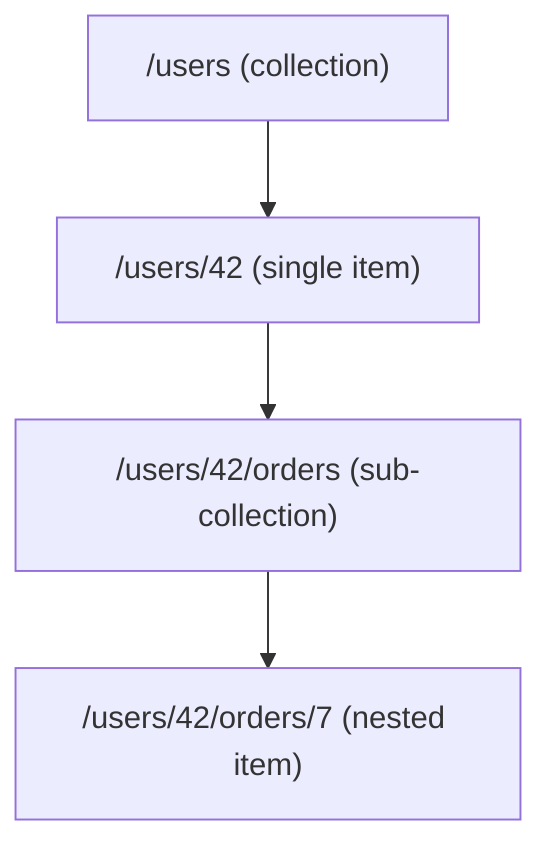

**URI design rules:**

| Rule | ✅ Good | ❌ Bad |
|---|---|---|
| Use **nouns**, not verbs | `/users` | `/getUsers` |
| Use **plural** for collections | `/orders` | `/order` |
| **Hierarchy** for relationships | `/users/42/orders` | `/getUserOrders?id=42` |
| **Lowercase + hyphens** | `/order-items` | `/orderItems`, `/Order_Items` |
| No trailing slash inconsistency | `/users` | `/users/` (pick one) |
| No file extensions | `/users/42` | `/users/42.json` |

> [!TIP]
> **Nest resources to show relationships, but don't over-nest.** `/users/42/orders` (a user's orders) is clear; `/users/42/orders/7/items/3/reviews/9` is a nightmare. Rule of thumb: **don't nest more than one level deep** — beyond that, use a top-level resource with a filter: `/order-items?order=7`. Nesting signals "belongs to"; deep nesting signals bad design.

### 2.2 HTTP Methods (the verbs)

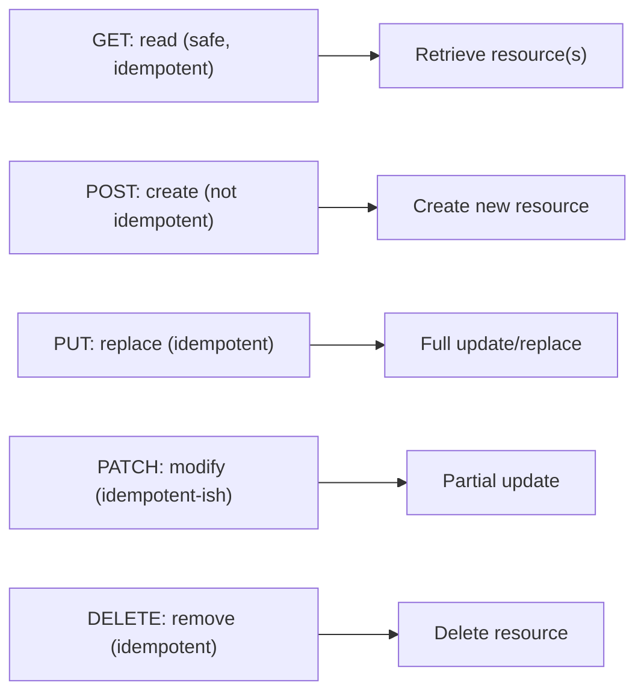

| Method | Purpose | Safe? | Idempotent? | Request body? |
|---|---|---|---|---|
| **GET** | Read | ✅ | ✅ | No |
| **POST** | Create (or non-idempotent action) | ❌ | ❌ | Yes |
| **PUT** | Replace entire resource | ❌ | ✅ | Yes |
| **PATCH** | Partial update | ❌ | ⚠️ (should be) | Yes |
| **DELETE** | Remove | ❌ | ✅ | Optional |
| **HEAD** | GET without body (metadata) | ✅ | ✅ | No |
| **OPTIONS** | Discover allowed methods (CORS) | ✅ | ✅ | No |

> [!IMPORTANT]
> **Safe** = no side effects (read-only). **Idempotent** = calling it N times has the same effect as once. These matter hugely for **reliability**: because networks retry ([[01 System Design Fundamentals]]), a client can safely retry a `GET`, `PUT`, or `DELETE` after a timeout — but **not a `POST`** (which might create duplicates). This is why creating resources with `POST` needs **idempotency keys** for safe retries, while `PUT` (replace) is naturally retry-safe. Interviewers love probing PUT vs POST vs PATCH through this lens.

### 2.3 PUT vs PATCH vs POST

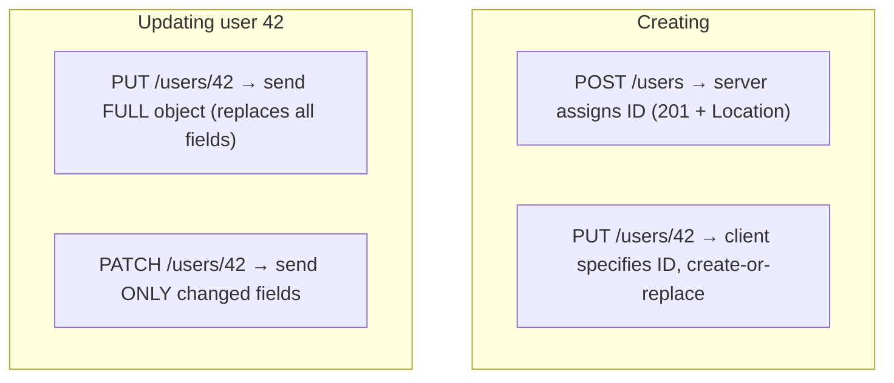

> [!WARNING]
> A subtle bug: using **`PUT` for partial updates**. `PUT` means "replace the *entire* resource with this representation" — if you `PUT { "name": "New" }` and omit `email`, a strict implementation should **null out** `email`. For partial updates (change just the name), use **`PATCH`**. Many APIs blur this (treating PUT as partial), which works but violates semantics and surprises consumers. Be explicit: PUT = full replace, PATCH = partial merge.

### 2.4 HTTP Status Codes (the outcomes)

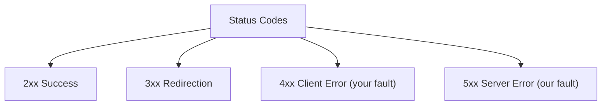

| Code | Meaning | Use when |
|---|---|---|
| **200 OK** | Success | GET/PUT/PATCH succeeded |
| **201 Created** | Resource created | POST created something (+ `Location` header) |
| **202 Accepted** | Async accepted | Queued for later processing |
| **204 No Content** | Success, empty body | DELETE / update with nothing to return |
| **301/302** | Redirect (permanent/temp) | Resource moved |
| **304 Not Modified** | Use your cache | Conditional GET (ETag match) |
| **400 Bad Request** | Malformed request | Validation failure |
| **401 Unauthorized** | Not authenticated | Missing/invalid credentials |
| **403 Forbidden** | Authenticated but not allowed | No permission |
| **404 Not Found** | Resource doesn't exist | Bad ID / hidden resource |
| **405 Method Not Allowed** | Wrong method | POST to a read-only endpoint |
| **409 Conflict** | State conflict | Duplicate, version conflict |
| **422 Unprocessable Entity** | Semantic validation error | Well-formed but invalid data |
| **429 Too Many Requests** | Rate limited | Client exceeded limits |
| **500 Internal Server Error** | Server bug | Unhandled exception |
| **502/503/504** | Gateway/unavailable/timeout | Upstream/backend issues |

> [!WARNING]
> **The #1 status-code sin: returning `200 OK` with an error inside the body** (`{ "success": false, "error": "not found" }`). This breaks HTTP — caches, monitoring, and clients all rely on the status code. Use the *right* code: `404` for missing, `400`/`422` for bad input, `401`/`403` for auth, `500` for your bugs. Also: **`401` = "who are you?" (not authenticated); `403` = "I know who you are, but no" (not authorized)** — mixing these up is a classic mistake ([[11 Spring Boot Authentication]]).

### 2.5 Request/Response Design

```json
// POST /users  — Request
{
  "name": "Alice",
  "email": "alice@example.com"
}

// 201 Created — Response
// Location: /users/42
{
  "id": 42,
  "name": "Alice",
  "email": "alice@example.com",
  "createdAt": "2026-07-07T10:00:00Z"
}
```

**Consistent error format** (RFC 9457 Problem Details is the standard):

```json
// 422 Unprocessable Entity
{
  "type": "https://api.example.com/errors/validation",
  "title": "Validation Failed",
  "status": 422,
  "detail": "Email is not valid",
  "errors": [
    { "field": "email", "message": "must be a valid email" }
  ]
}
```

> [!TIP]
> **Consistency is everything.** Pick conventions and apply them everywhere: date format (**ISO 8601 / UTC**), field naming (**camelCase** or snake_case — but *one*), a **single error envelope** (RFC 9457 Problem Details is the emerging standard), and always return the created/updated resource. Consumers build against your patterns — inconsistency (some endpoints camelCase, some snake_case; some return the object, some don't) is the fastest way to a hated API.

### 2.6 Filtering, Sorting, Pagination

```
GET /products?category=books&minPrice=10          # filtering
GET /products?sort=-price,name                     # sorting (- = desc)
GET /products?page=2&limit=20                       # offset pagination
GET /products?cursor=eyJpZCI6MTAwfQ&limit=20        # cursor pagination
GET /products?fields=id,name,price                  # sparse fieldsets
```

| Pagination style | How | Trade-off |
|---|---|---|
| **Offset/limit** | `?page=2&limit=20` | Simple; slow & inconsistent on large/changing data |
| **Cursor/keyset** | `?cursor=abc&limit=20` | Fast, stable; can't jump to arbitrary page |

> [!TIP]
> **Always paginate collection endpoints** — never return "all users" unbounded (it'll eventually return millions of rows and crash). For large or frequently-changing datasets, prefer **cursor (keyset) pagination** over offset: offset pagination gets slower as the offset grows (`OFFSET 100000` scans 100k rows in [[02 Postgres]]) and can skip/duplicate items when data changes mid-scan. Cursor pagination ("give me items after this ID") is stable and fast. Include pagination metadata (`total`, `nextCursor`) in the response.

---

## 3. ⚙️ ADVANCED CONCEPTS (Senior Level)

### 3.1 API Versioning

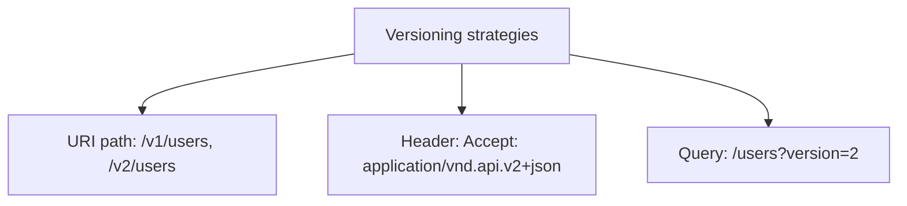

| Strategy | Example | Pros / Cons |
|---|---|---|
| **URI path** | `/v1/users` | Simple, visible, cacheable; "less pure", URL churn |
| **Custom/Accept header** | `Accept: application/vnd.co.v2+json` | Clean URLs; harder to test/debug |
| **Query param** | `/users?v=2` | Easy; clutters, caching issues |

> [!TIP]
> **URI path versioning (`/v1/`) is the most common and pragmatic** — it's visible, easy to route, cacheable, and trivial to test in a browser. Header versioning is "more RESTful" (the resource is the same, only representation changes) but harder to use. Whatever you pick: **version from day one**, make changes **additive** where possible (adding fields shouldn't break clients — that's forward compatibility), and only bump the version for **breaking** changes. Maintain old versions during a deprecation window with clear sunset headers.

### 3.2 Backward Compatibility & Evolution

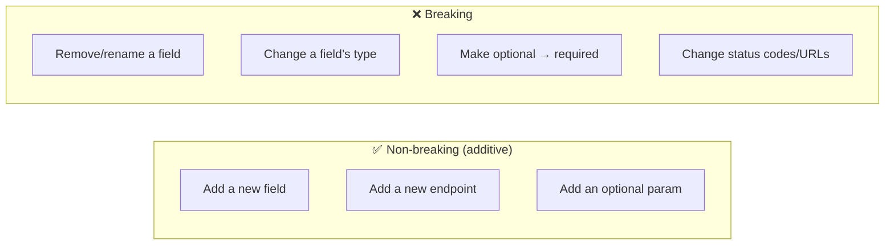

> [!IMPORTANT]
> **Clients depend on your response shape — treat it as a contract.** Adding fields is safe (well-behaved clients ignore unknowns); removing/renaming fields, changing types, or tightening validation **breaks** consumers. Design defensively: be **liberal in what you accept, conservative in what you send**, tolerate unknown fields on input, and never repurpose a field's meaning. When you must break, do it in a **new version** with migration guidance. This evolvability is a core reason REST + JSON won over rigid RPC.

### 3.3 Idempotency & Reliability

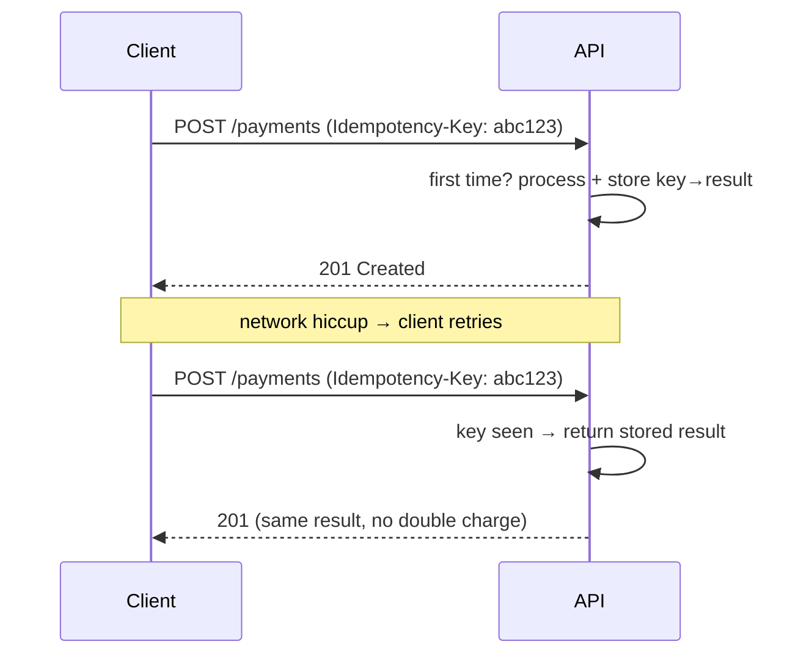

> [!IMPORTANT]
> `GET`/`PUT`/`DELETE` are naturally idempotent, but **`POST` is not** — a retried "create order" or "charge card" can duplicate. The solution ([[01 System Design Fundamentals]]): an **`Idempotency-Key`** header. The client generates a unique key; the server records processed keys and returns the *original* result on retry instead of reprocessing. Stripe popularized this for payments. Any mutating, non-idempotent endpoint that clients might retry needs it — networks *will* cause retries.

### 3.4 Caching, ETags & Conditional Requests

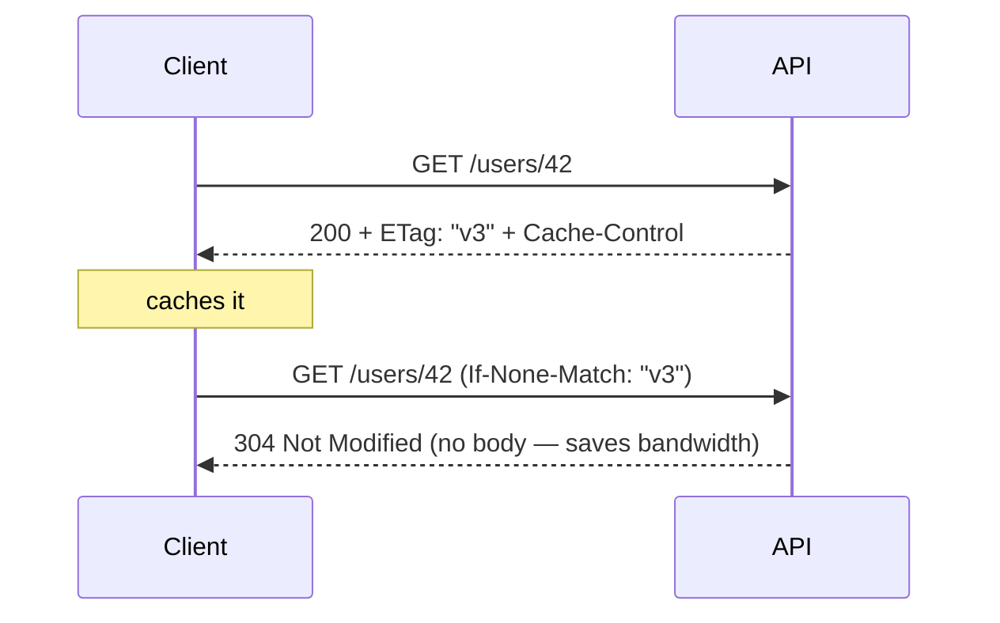

| Header | Purpose |
|---|---|
| `Cache-Control` | How/how long to cache (`max-age`, `no-store`, `private`) |
| `ETag` | Version fingerprint of a resource |
| `If-None-Match` | "Only send if changed since this ETag" → 304 |
| `Last-Modified` / `If-Modified-Since` | Time-based conditional |
| `If-Match` | Optimistic concurrency (update only if unchanged) |

> [!TIP]
> **ETags do double duty: caching and optimistic concurrency.** For caching, a client sends `If-None-Match: "etag"` and gets a cheap `304 Not Modified` if nothing changed (saves bandwidth). For **concurrency control**, a client sends `If-Match: "etag"` on an update — if someone else modified the resource meanwhile, the ETag won't match and the server returns **`412 Precondition Failed`**, preventing the "lost update" problem where two clients overwrite each other. This is the HTTP-native way to handle concurrent edits.

### 3.5 Security Essentials

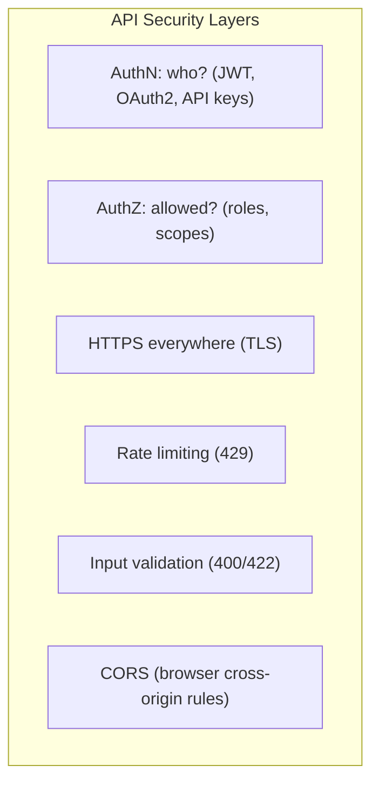

| Concern | Approach |
|---|---|
| **Authentication** | Bearer tokens (JWT), OAuth2, API keys ([[11 Spring Boot Authentication]]) |
| **Authorization** | Role/scope checks per endpoint |
| **Transport** | HTTPS/TLS always (never plain HTTP) |
| **Rate limiting** | Per-key/IP limits → `429` ([[04 Redis]], [[05 Nginx]]) |
| **Input validation** | Validate everything → `400`/`422`; prevent injection |
| **CORS** | Explicit allowed origins for browser clients |
| **Sensitive data** | Never in URLs (logged!); no secrets in responses |

> [!WARNING]
> **Never put sensitive data (tokens, passwords, PII) in the URL / query string** — URLs are logged everywhere (server logs, proxies, browser history, analytics). Put credentials in the **`Authorization` header** and sensitive payloads in the **body** (over HTTPS). Also beware **mass assignment**: blindly binding request JSON to your entity lets an attacker set `{ "role": "admin" }`. Use explicit DTOs/allow-lists for what clients can set. And validate/authorize **every** request — never trust the client.

### 3.6 HATEOAS & Richardson Maturity Model

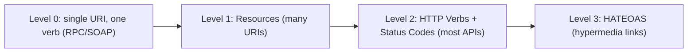

```json
// HATEOAS: response includes links to possible actions
{
  "id": 42,
  "status": "pending",
  "_links": {
    "self":   { "href": "/orders/42" },
    "cancel": { "href": "/orders/42/cancel", "method": "POST" },
    "pay":    { "href": "/orders/42/payment", "method": "POST" }
  }
}
```

> [!TIP]
> The **Richardson Maturity Model** grades RESTfulness: Level 2 (proper resources + verbs + status codes) is where **most "REST" APIs actually live** and is perfectly good. **Level 3 (HATEOAS)** — responses embedding links to next actions so clients discover the API dynamically — is "true REST" per Fielding but **rarely fully implemented** (it adds complexity clients seldom use). Know HATEOAS for interviews and understand *why* it exists (decoupling clients from URL structure), but don't feel obligated to build it — pragmatic Level 2 REST is the industry norm.

### 3.7 Failure Scenarios & Anti-Patterns

| Anti-pattern | Problem | Fix |
|---|---|---|
| Verbs in URLs (`/getUser`) | Not RESTful, unpredictable | Nouns + HTTP methods |
| `200 OK` for errors | Breaks clients/caches/monitoring | Correct status codes |
| No pagination | Returns millions of rows, crashes | Paginate collections |
| Inconsistent naming/formats | Hard to consume | One convention everywhere |
| No versioning | Every change breaks clients | Version + additive changes |
| Chatty APIs (N calls for one screen) | Latency, over-fetching | Aggregate endpoints, [[03 GraphQL]] |
| Leaking DB schema/internal errors | Security + coupling | DTOs + sanitized errors |
| Ignoring idempotency on POST | Duplicate side effects | Idempotency keys |
| Over-nesting resources | Unwieldy URLs | Max one level; use filters |

> [!WARNING]
> **Chatty APIs** are a common performance killer: a mobile screen needs a user, their orders, and recommendations — 3+ round trips, each with latency ([[01 System Design Fundamentals]] latency hierarchy). Fixes: design **aggregate/composite endpoints** for common client needs, support **sparse fieldsets** (`?fields=`) and **embedding** (`?include=orders`), or adopt **[[03 GraphQL]]** (which lets clients fetch exactly what they need in one query) or **[[04 gRPC]]** for internal service calls. Under-fetching (too many calls) and over-fetching (too much data) are the twin REST pains that GraphQL was created to solve.

---

## 4. 🏗️ REAL-WORLD SYSTEM DESIGN USAGE

### 4.1 Where REST Sits

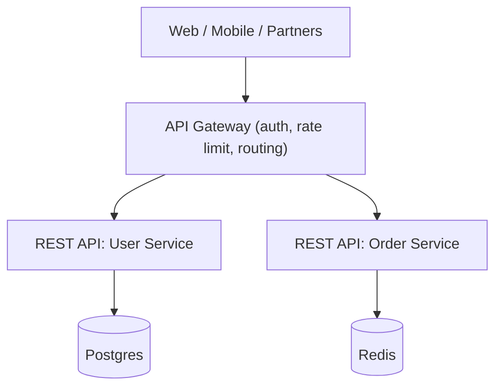

REST is the standard **public/external interface** for web and mobile apps, and a common **service-to-service** protocol in [[03 Microservices]] (though [[04 gRPC]] often wins internally). An **[[06 API Gateway]]** typically fronts REST services for cross-cutting concerns.

### 4.2 Documentation: OpenAPI/Swagger

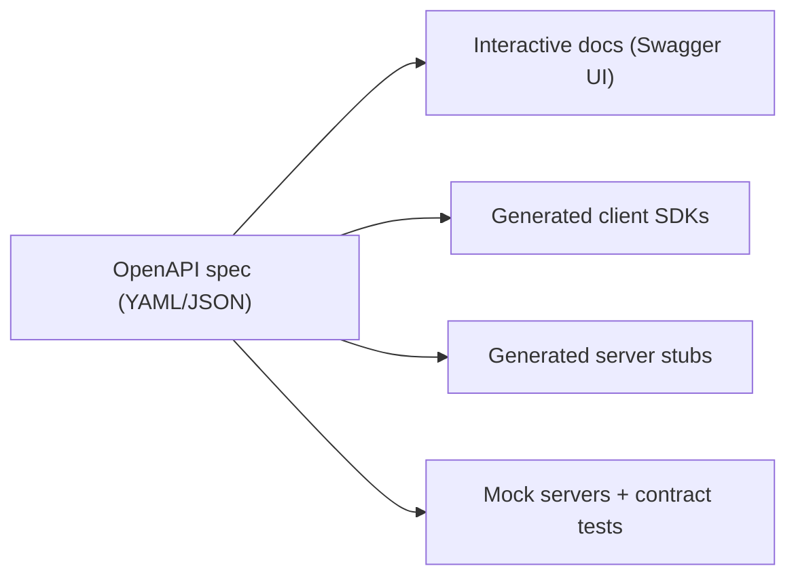

> [!IMPORTANT]
> **OpenAPI (formerly Swagger) is the de-facto standard for documenting REST APIs.** A single spec file describes every endpoint, parameter, schema, and response — and from it you get **interactive docs, client SDK generation, server stubs, mock servers, and contract tests** for free. In [[05 Spring Boot]], springdoc auto-generates it from your controllers; in [[05 Node.js]]/[[06 Express.js]], tools like swagger-jsdoc do the same. A REST API without OpenAPI docs is far harder to adopt — treat the spec as a first-class deliverable, ideally **design-first** (write the spec, then implement to it).

### 4.3 How companies design REST APIs

| Company | Practice |
|---|---|
| **Stripe** | Gold-standard: consistent, idempotency keys, great docs, versioned by date |
| **GitHub** | Rich REST API (+ GraphQL); hypermedia links; clear pagination |
| **Google/Microsoft** | Published **API design guides** (AIP, REST guidelines) |
| **Twilio, Twitter** | Resource-oriented, well-documented public APIs |

### 4.4 REST vs Alternatives

| Style | vs REST |
|---|---|
| **[[03 GraphQL]]** | Client picks exact fields, one endpoint; solves over/under-fetching; more client power, more server complexity |
| **[[04 gRPC]]** | Binary, HTTP/2, contract-first (Protobuf), fast; great internal service-to-service; not browser-native |
| **SOAP** | Older, XML-heavy, rigid contracts (WSDL); mostly legacy/enterprise |
| **[[05 WebSockets]]** | Bidirectional real-time; REST is request-response |
| **Webhooks** | Server→client push (reverse of REST pull) |

> [!TIP]
> **REST isn't always the answer.** Use **[[03 GraphQL]]** when clients have diverse data needs and you're fighting over/under-fetching; **[[04 gRPC]]** for high-performance internal [[03 Microservices]] communication; **[[05 WebSockets]]** for real-time bidirectional (chat, live updates); **webhooks** for server-initiated events. REST remains the best default for **public APIs, CRUD-style resources, and broad client compatibility** (any HTTP client works, human-readable, cacheable). Choose per use case — mature systems mix several.

---

## 5. 🎤 INTERVIEW PREPARATION

### 5.1 Most important questions

<details>
<summary><b>Q1: What makes an API RESTful?</b></summary>

Adherence to REST's constraints — especially **statelessness**, a **uniform interface** (resources identified by URIs, manipulated via standard HTTP methods with proper status codes), **cacheability**, client-server separation, and layered system. Practically: resources as nouns, HTTP methods as verbs, meaningful status codes, stateless requests, consistent representations. REST is a *style*, not a standard.
</details>

<details>
<summary><b>Q2: Explain safe and idempotent methods.</b></summary>

**Safe** = no side effects (read-only): GET, HEAD, OPTIONS. **Idempotent** = repeating the request has the same effect as doing it once: GET, PUT, DELETE, HEAD (and PATCH ideally). **POST is neither** — it creates/changes state and repeating can duplicate. This matters for retries: safe/idempotent requests are retry-safe; POST needs idempotency keys.
</details>

<details>
<summary><b>Q3: PUT vs PATCH vs POST?</b></summary>

**POST** creates a resource (server assigns ID, returns 201 + Location) or triggers a non-idempotent action. **PUT** replaces an entire resource (idempotent — send the full representation). **PATCH** partially updates (send only changed fields). Common mistake: using PUT for partial updates (it should replace, nulling omitted fields).
</details>

<details>
<summary><b>Q4: 401 vs 403?</b></summary>

**401 Unauthorized** = not authenticated ("who are you?") — missing or invalid credentials; the client should authenticate. **403 Forbidden** = authenticated but not permitted ("I know you, but you can't do this") — valid identity, insufficient rights. Re-authenticating won't fix a 403.
</details>

<details>
<summary><b>Q5: How do you handle API versioning?</b></summary>

Common approaches: **URI path** (`/v1/users` — most popular, visible, cacheable), **header** (`Accept: ...v2+json` — cleaner URLs), or **query param**. Best practices: version from day one, make changes **additive** (non-breaking), only bump for breaking changes, and support old versions during a deprecation window with sunset headers.
</details>

<details>
<summary><b>Q6: How do you paginate a large collection?</b></summary>

**Offset/limit** (`?page=2&limit=20`) is simple but slows down at large offsets and can skip/duplicate on changing data. **Cursor/keyset** (`?cursor=abc`) is fast and stable ("items after this point") but can't jump to arbitrary pages. Always paginate collections; prefer cursor pagination for large/dynamic datasets. Return metadata (total, nextCursor).
</details>

<details>
<summary><b>Q7: How do you make a POST idempotent?</b></summary>

Use an **`Idempotency-Key`** header: the client sends a unique key with the request; the server stores processed keys and their results, returning the original result if the key is seen again — so retries don't create duplicates (e.g., no double charge). Essential for payments and any retryable mutation.
</details>

<details>
<summary><b>Q8: What is HATEOAS and is it required?</b></summary>

**HATEOAS** (Hypermedia As The Engine Of Application State) means responses include links to related actions/resources, so clients navigate the API dynamically instead of hardcoding URLs — Level 3 of the Richardson Maturity Model, "true REST." It's rarely fully implemented; most production APIs stop at Level 2 (resources + verbs + status codes), which is pragmatic and widely accepted.
</details>

### 5.2 Tricky questions

> [!TIP]
> **"Is returning 200 with `{error: ...}` okay?"** — No. The HTTP status code *is* the primary success/failure signal; caches, gateways, and monitoring depend on it. Use proper 4xx/5xx codes with error details in the body.

> [!TIP]
> **"Can GET have a request body?"** — Technically the spec is ambiguous and many servers/proxies ignore or reject GET bodies. **Don't rely on it** — use query params for GET. If you need a complex query payload, some APIs use POST to a `/search` sub-resource (a pragmatic compromise).

> [!TIP]
> **"Is REST stateless — but what about sessions/auth?"** — Stateless means the *server* keeps no per-client session between requests; each request is self-contained. Auth is carried *in* each request (a token in the `Authorization` header), not stored server-side as a session. Token validation state can live in a shared store ([[04 Redis]]) without violating statelessness of the API tier.

> [!TIP]
> **"PUT to create — allowed?"** — Yes, when the *client* controls the ID: `PUT /users/42` can create-or-replace (idempotent). `POST /users` is for server-assigned IDs. So the create method depends on who owns the identifier.

### 5.3 Common mistakes candidates make

| Mistake | Reality |
|---|---|
| Verbs in URLs | Nouns + HTTP methods |
| 200 for everything | Use correct status codes |
| Confusing 401/403 | AuthN vs AuthZ |
| PUT = partial update | PUT replaces; PATCH is partial |
| No pagination | Collections must paginate |
| No versioning strategy | Version from day one |
| Ignoring idempotency | POST retries duplicate |
| "REST must have HATEOAS" | Level 2 is the norm |
| Sensitive data in URLs | Logged everywhere — use headers/body |

### 5.4 What interviewers actually expect

- **Resources/methods/status codes** fluency and consistency mindset.
- **Safe/idempotent** semantics and their reliability implications (retries, idempotency keys).
- **Versioning, pagination, error design, caching (ETags)** as practical concerns.
- **Security** basics (AuthN vs AuthZ, HTTPS, rate limiting, validation).
- Knowing when **[[03 GraphQL]]/[[04 gRPC]]/[[05 WebSockets]]** fit better than REST.
- Awareness of **OpenAPI**, HATEOAS/Richardson model, and pragmatic Level 2 reality.

---

## 6. 🛠️ HANDS-ON PROJECTS

### Project 1: Design & Build a CRUD REST API (Beginner→Intermediate)

**Goal:** A clean, well-designed resource API with proper conventions.

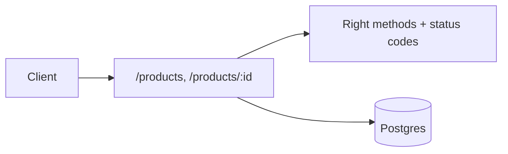

**Steps:**
1. Model `products` + nested `reviews` with RESTful URIs.
2. Implement GET/POST/PUT/PATCH/DELETE with correct status codes (201+Location, 204, 404, 422).
3. Add **pagination**, **filtering**, and **sorting** to the collection.
4. Return a consistent **error envelope** (RFC 9457).
5. Document with **OpenAPI/Swagger** ([[05 Spring Boot]] springdoc or [[06 Express.js]] swagger).

**Learn:** resource design, methods, status codes, pagination, docs.

---

### Project 2: Production-Grade API — Auth, Versioning, Caching (Intermediate→Senior)

**Goal:** Add the cross-cutting concerns that make an API real.

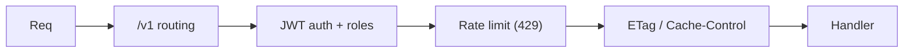

**Steps:**
1. Add **JWT authentication** + role-based authorization ([[11 Spring Boot Authentication]]); correct 401/403.
2. Implement **URI versioning** (`/v1`); plan an additive `/v2`.
3. Add **ETags** + conditional GET (304) and optimistic concurrency (If-Match → 412).
4. Add **rate limiting** ([[04 Redis]]/[[05 Nginx]]) → 429.
5. Add **idempotency keys** for a payment-like POST.

**Learn:** auth, versioning, caching/concurrency, rate limiting, idempotency.

---

### Project 3: API Design Review + GraphQL/gRPC Comparison (Senior)

**Goal:** Critique and evolve an API; know when to switch styles.

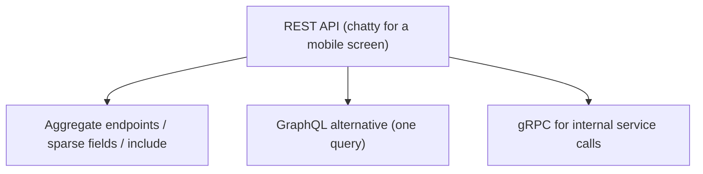

**Steps:**
1. Audit a messy API (verbs in URLs, 200-for-errors, no pagination) and refactor it.
2. Identify a **chatty/over-fetching** flow; add aggregate endpoints + sparse fieldsets.
3. Prototype the same use case in **[[03 GraphQL]]**; compare.
4. Prototype an internal call in **[[04 gRPC]]**; compare latency/ergonomics.
5. Write an **API style guide** for a team (naming, errors, versioning, pagination).

**Learn:** design review, anti-pattern fixes, REST vs GraphQL vs gRPC judgment, governance.

---

## 7. 🔬 DEEP DIVE: INTERNALS

### 7.1 HTTP Is the Foundation

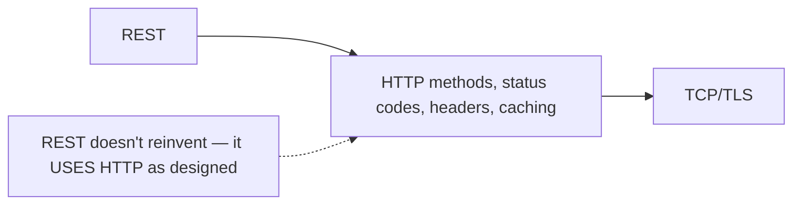

> [!IMPORTANT]
> REST's genius is **not inventing new machinery** — it fully exploits HTTP's existing features: methods (verbs), status codes (outcomes), headers (metadata/caching/auth/content negotiation), and URIs (identity). Understanding REST deeply means understanding **HTTP** deeply. Every "REST best practice" is really "use this HTTP feature correctly." This is why REST APIs work with every proxy, cache, gateway, and client library on earth — they all already speak HTTP. Newer protocols like [[04 gRPC]] (HTTP/2) and the impact of **HTTP/2 multiplexing** and **HTTP/3 (QUIC)** on API performance build on this same foundation.

### 7.2 Content Negotiation

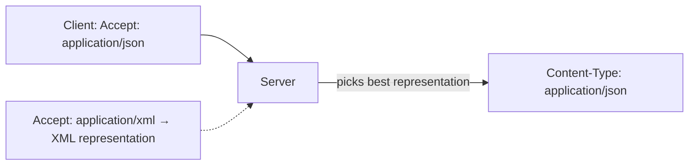

The same resource can have multiple **representations** (JSON, XML, CSV). Clients express preference via the **`Accept`** header; the server responds with the chosen format in **`Content-Type`**. This "one resource, many representations" is core to REST's uniform interface — and why `/users/42.json` (format in URL) is discouraged in favor of content negotiation.

### 7.3 Statelessness & Scaling Under the Hood

```mermaid
flowchart TB
    LB[Load Balancer] --> S1[Server 1]
    LB --> S2[Server 2]
    LB --> S3[Server 3]
    Note["Any server handles any request (stateless)<br/>→ trivial horizontal scaling"] -.-> LB
    Token["Auth token in each request"] -.-> S2
```

> [!IMPORTANT]
> Statelessness is what makes REST APIs **effortlessly horizontally scalable** ([[01 System Design Fundamentals]]): since no request depends on server-side session state, a load balancer can route any request to any of N identical servers, and you scale by adding servers ([[02 Kubernetes]] replicas). The cost: each request re-sends context (auth token, params), and you can't rely on server memory between calls — shared state goes to a database or [[04 Redis]]. This trade-off (a bit more per-request data for massive scalability) is central to why REST dominates web-scale APIs.

### 7.4 Idempotency & Retry Semantics at the Protocol Level

```mermaid
flowchart LR
    Timeout["Request times out (unknown outcome)"] --> Q{Idempotent method?}
    Q -->|"GET/PUT/DELETE"| SafeRetry["Retry safely"]
    Q -->|"POST"| Danger["Retry risks duplicate → need idempotency key"]
```

> [!TIP]
> HTTP's method semantics directly inform **retry logic** in clients, proxies, and gateways. Well-behaved infrastructure will auto-retry idempotent methods (GET/PUT/DELETE) on transient failures but **won't** auto-retry POST (to avoid duplicates). This is why correctly choosing your method matters beyond aesthetics — it changes how the entire network stack treats your request under failure. Designing your "create" as an idempotent `PUT` (client-supplied ID) or adding idempotency keys to `POST` makes your API resilient to the retries that *will* happen.

### 7.5 The Uniform Interface as Decoupling

```mermaid
flowchart LR
    Client["Any client (curl, browser, mobile, another service)"] --> Uniform["Uniform interface:<br/>same rules for every resource"]
    Uniform --> Server["Any server implementation"]
    Note["Client & server evolve independently<br/>as long as the contract holds"] -.-> Uniform
```

> [!IMPORTANT]
> The **uniform interface** is REST's most philosophically important constraint: because *every* resource is manipulated the same way (URIs + standard methods + standard status codes + self-describing representations), a client that understands the conventions can interact with *any* RESTful resource without custom code per endpoint. This **decouples client from server** — the reason a generic HTTP client library works against every REST API, and the reason REST APIs are so interoperable and long-lived. It's the [[02 Design Patterns|"program to an interface"]] principle applied to network APIs: uniformity buys you universal tooling and independent evolution.

---

## ✅ Production Checklists

### Design
- [ ] Resources are **nouns**, methods are verbs, no verbs in URLs
- [ ] **Plural** collection names, ≤1 level nesting, hyphen-lowercase
- [ ] Correct **status codes** everywhere (no 200-for-errors)
- [ ] **Consistent** naming, date format (ISO 8601 UTC), error envelope (RFC 9457)
- [ ] **Pagination** on all collections (cursor for large data)
- [ ] Filtering/sorting/sparse-fields conventions

### Reliability & Evolution
- [ ] **Versioning** strategy in place from day one
- [ ] Changes are **additive/backward-compatible**; sunset headers for deprecation
- [ ] **Idempotency keys** for non-idempotent mutations (payments)
- [ ] **ETags** + conditional requests (caching + optimistic concurrency)
- [ ] Sensible timeouts + retry guidance for clients

### Security & Ops
- [ ] **HTTPS** everywhere; no sensitive data in URLs
- [ ] **AuthN + AuthZ** on every endpoint (correct 401/403)
- [ ] **Input validation** (400/422); guard against mass assignment (DTOs)
- [ ] **Rate limiting** (429); CORS configured explicitly
- [ ] **OpenAPI** docs published + kept in sync
- [ ] Logging/monitoring on status codes, latency, error rates

---

## 🗺️ Learning Roadmap

```mermaid
flowchart TB
    A["1️⃣ Basics<br/>HTTP, resources, methods, status codes"] --> B["2️⃣ URI & resource design<br/>nouns, nesting, conventions"]
    B --> C["3️⃣ Requests/responses<br/>bodies, errors, pagination, filtering"]
    C --> D["4️⃣ Reliability<br/>idempotency, safe methods, retries"]
    D --> E["5️⃣ Caching & concurrency<br/>ETags, conditional requests"]
    E --> F["6️⃣ Versioning & evolution<br/>backward compatibility"]
    F --> G["7️⃣ Security & docs<br/>auth, rate limiting, OpenAPI"]
    G --> H["8️⃣ Beyond REST<br/>HATEOAS, GraphQL/gRPC trade-offs, internals"]
```

| Stage | Focus | You can... |
|---|---|---|
| 1–3 | Basics + design | Build a clean CRUD API |
| 4–5 | Reliability + caching | Make it robust and efficient |
| 6–7 | Evolution + security | Version, secure, and document it |
| 8 | Judgment | Choose REST vs alternatives; reason deeply |

---

## 🔁 Self-Review Completion Loop

Reviewed against REST principles (Fielding), HTTP RFCs, industry API guidelines (Google/Microsoft/Stripe), interview questions, and production practice.

### Gap Review Matrix

| Dimension | Covered? | Where |
|---|---|---|
| What/why, REST as a style | ✅ | §1 |
| 6 REST constraints | ✅ | §1 |
| Statelessness | ✅ | §1, §7.3 |
| URI/resource design | ✅ | §2.1 |
| HTTP methods + safe/idempotent | ✅ | §2.2 |
| PUT/PATCH/POST | ✅ | §2.3 |
| Status codes | ✅ | §2.4 |
| Request/response + error format | ✅ | §2.5 |
| Pagination/filtering/sorting | ✅ | §2.6 |
| Versioning | ✅ | §3.1 |
| Backward compatibility | ✅ | §3.2 |
| Idempotency keys | ✅ | §3.3, §7.4 |
| Caching/ETags/conditional | ✅ | §3.4 |
| Security | ✅ | §3.5 |
| HATEOAS/Richardson model | ✅ | §3.6 |
| Anti-patterns | ✅ | §3.7 |
| API gateway placement | ✅ | §4.1 |
| OpenAPI/docs | ✅ | §4.2 |
| REST vs GraphQL/gRPC/SOAP/WS | ✅ | §4.4 |
| HTTP foundation | ✅ | §7.1 |
| Content negotiation | ✅ | §7.2 |
| Uniform interface/decoupling | ✅ | §7.5 |
| Interview Q&A + mistakes | ✅ | §5 |
| Hands-on projects | ✅ | §6 |

> [!NOTE]
> **Remaining depth to explore independently:** JSON:API / HAL / OData specifications, gRPC-gateway and REST-to-gRPC transcoding, GraphQL federation, API-first/design-first workflows, contract testing (Pact), Backend-for-Frontend (BFF) pattern, HTTP/2 & HTTP/3 performance impacts, and the [[06 API Gateway]] guide for edge concerns.

---

## 📚 Official References

| Resource | URL |
|---|---|
| Fielding's REST Dissertation | https://ics.uci.edu/~fielding/pubs/dissertation/rest_arch_style.htm |
| MDN HTTP (methods, status, caching) | https://developer.mozilla.org/en-US/docs/Web/HTTP |
| OpenAPI Specification | https://spec.openapis.org/ |
| RFC 9110 (HTTP Semantics) | https://www.rfc-editor.org/rfc/rfc9110 |
| RFC 9457 (Problem Details) | https://www.rfc-editor.org/rfc/rfc9457 |
| Google API Design Guide | https://cloud.google.com/apis/design |
| Microsoft REST API Guidelines | https://github.com/microsoft/api-guidelines |
| Stripe API (reference example) | https://stripe.com/docs/api |

---

## 🎁 Final Summary

> [!IMPORTANT]
> **The one-paragraph takeaway:** REST is an architectural **style** for HTTP APIs built on **resources (nouns)** manipulated via **standard methods (verbs)** with **meaningful status codes**, and governed by constraints — above all **statelessness** (each request self-contained → trivial horizontal scaling) and a **uniform interface** (universal tooling + independent client/server evolution). Great REST design is really **using HTTP correctly and consistently**: proper methods respecting **safe/idempotent** semantics, right status codes (never 200-for-errors, 401≠403), consistent naming/error formats, **pagination** on collections, **versioning** with additive/backward-compatible changes, **ETags** for caching and optimistic concurrency, **idempotency keys** for retryable POSTs, and solid **security** (HTTPS, AuthN/AuthZ, validation, rate limiting) plus **OpenAPI** docs. Know that most "REST" APIs are pragmatic **Level 2** (resources+verbs+codes), that **HATEOAS** is the rarely-implemented ideal, and that **[[03 GraphQL]]/[[04 gRPC]]/[[05 WebSockets]]** are better for over-fetching/internal-performance/real-time respectively. REST won because it leverages HTTP's universal infrastructure — every client, cache, and proxy already speaks it.

**Golden rules:**
1. 🔤 **URLs are nouns, methods are verbs, status codes are outcomes.**
2. 🔁 Respect **safe/idempotent** semantics — they govern safe retries.
3. 📟 Use **correct status codes** — never 200-with-an-error; 401≠403.
4. 📄 Be **consistent** — naming, dates (ISO 8601), one error envelope.
5. 📃 **Paginate** collections (cursor for large data).
6. 🏷️ **Version** from day one; keep changes **additive**.
7. 🔑 Add **idempotency keys** to retryable POSTs; **ETags** for caching/concurrency.
8. 🔒 HTTPS, AuthN/AuthZ everywhere, validate input, rate limit, **no secrets in URLs**.
9. 📚 Ship **OpenAPI** docs; know when **[[03 GraphQL]]/[[04 gRPC]]/[[05 WebSockets]]** fit better.

---

*Related guides in this vault: [[05 Spring Boot]] · [[06 Express.js]] · [[05 Node.js]] · [[01 System Design Fundamentals]] · [[03 Microservices]] · [[11 Spring Boot Authentication]] · [[03 GraphQL]] · [[04 gRPC]] · [[06 API Gateway]] · [[05 WebSockets]] · [[05 Nginx]] · [[04 Redis]]*
