# ◈ GraphQL — Complete Beginner-to-Expert Reference

> A query language for APIs that lets clients ask for exactly the data they need in a single request — solving over-fetching and under-fetching with a strongly-typed schema.

---

## 📑 Table of Contents

1. [Executive Summary](#-executive-summary)
2. [Fundamentals (Beginner)](#1--fundamentals-beginner-level)
3. [Core Concepts (Intermediate)](#2--core-concepts-intermediate-level)
4. [Advanced Concepts (Senior)](#3--advanced-concepts-senior-level)
5. [Real-World System Design](#4--real-world-system-design-usage)
6. [Interview Preparation](#5--interview-preparation)
7. [Hands-On Projects](#6--hands-on-projects)
8. [Deep Dive: Internals](#7--deep-dive-internals)
9. [Production Checklists](#-production-checklists)
10. [Learning Roadmap](#-learning-roadmap)
11. [Self-Review Completion Loop](#-self-review-completion-loop)
12. [Official References](#-official-references)
13. [Final Summary](#-final-summary)

---

## 🎯 Executive Summary

**GraphQL** is a query language for APIs and a runtime for executing those queries, created by Facebook (2012, open-sourced 2015). Instead of many fixed [[02 REST API Design|REST]] endpoints, GraphQL exposes a **single endpoint** with a **strongly-typed schema**, and clients send **queries specifying exactly the fields they want** — getting precisely that data in one round trip.

| What it is | What it replaces | Core superpower |
|---|---|---|
| Query language + runtime for APIs | Many rigid REST endpoints, over/under-fetching | **Clients fetch exactly what they need** in one request, via a typed schema |

> [!IMPORTANT]
> GraphQL's defining idea: **the client, not the server, decides what data comes back.** A [[02 REST API Design|REST]] endpoint returns a fixed shape (often too much or too little); a GraphQL query asks for exactly the fields it needs — no more, no less — across multiple related resources in **one request**. This directly solves REST's **over-fetching** and **under-fetching (N+1 requests)** problems. The trade-off: complexity moves to the server (resolvers, query cost, caching), and you lose HTTP's simple caching. It's not "better than REST" — it's a different set of trade-offs for a different problem (diverse clients with varied data needs).

Related guides: [[02 REST API Design]] · [[04 gRPC]] · [[05 Node.js]] · [[08 React]] · [[12 TanStack Query]] · [[02 Postgres]] · [[01 System Design Fundamentals]] · [[03 Microservices]]

---

## 1. 🌱 FUNDAMENTALS (Beginner Level)

### What is GraphQL in simple terms?

With [[02 REST API Design|REST]], to build a profile screen you might call `/users/42`, then `/users/42/posts`, then `/users/42/followers` — three requests, each returning *fixed* data (including fields you don't need). With **GraphQL, you send one query describing the exact shape you want**, and the server returns precisely that:

```graphql
query {
  user(id: 42) {
    name
    posts(last: 3) { title }
    followers { name }
  }
}
```

You get the name, 3 post titles, and follower names — nothing else — in **one request**. It's like ordering à la carte instead of a fixed menu.

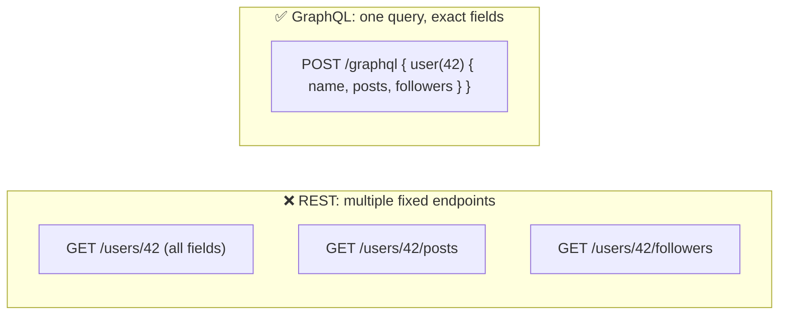

### Why does GraphQL exist? (Over/Under-fetching)

Facebook built GraphQL to power mobile apps with complex, nested data needs on slow networks, where REST's inefficiencies hurt:

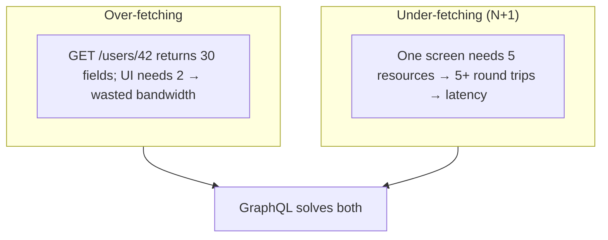

### Problems GraphQL solves

| Problem | How GraphQL solves it |
|---|---|
| **Over-fetching** (too much data) | Client requests only needed fields |
| **Under-fetching** (too many calls) | Fetch nested/related data in one query |
| **Rigid endpoints** | One flexible endpoint + schema |
| **Client-server coupling** | Clients evolve queries without new endpoints |
| **API versioning churn** | Evolve the schema additively (deprecate fields) |
| **Weak typing / discovery** | Strongly-typed, introspectable schema |
| **Diverse client needs** | Each client fetches its own shape |

### The three operation types

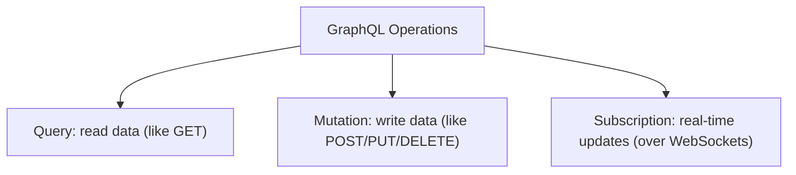

| Operation | Purpose | REST analogy |
|---|---|---|
| **Query** | Read data | GET |
| **Mutation** | Modify data | POST/PUT/PATCH/DELETE |
| **Subscription** | Real-time streaming | [[05 WebSockets]]/SSE |

### Core vocabulary

| Term | Plain meaning |
|---|---|
| **Schema** | The typed contract: all types, queries, mutations |
| **Type** | A structured object definition (`User`, `Post`) |
| **Field** | A property on a type |
| **Resolver** | Server function that fetches a field's data |
| **Query** | Client request for specific fields |
| **Mutation** | Client request to change data |
| **Subscription** | Live data stream |
| **SDL** | Schema Definition Language (the schema syntax) |
| **Introspection** | Querying the schema itself |

### Real-world analogy 🍽️

- **REST** is a **fixed-menu restaurant**: you order "Combo #3" and get whatever comes with it — maybe more sides than you want, and if you need something extra you place another order.
- **GraphQL** is a **build-your-own bowl**: you specify exactly the ingredients you want (fields), from any station (related types), in one order — and get precisely that plate.
- The **menu of possible ingredients** (schema) is published and strongly typed, so you always know what's available.

> [!TIP]
> The mental model: **GraphQL flips control to the client.** In REST, the *server* defines response shapes (endpoints); in GraphQL, the *client* defines them (queries) against a menu the server publishes (schema). This is powerful for frontend teams (no waiting for new endpoints) but shifts hard problems — performance, caching, security — onto the server. GraphQL isn't "REST but better"; it's a trade: client flexibility for server complexity.

---

## 2. 🧩 CORE CONCEPTS (Intermediate Level)

### 2.1 The Schema (the typed contract)

```graphql
# Schema Definition Language (SDL)
type User {
  id: ID!               # ! = non-nullable
  name: String!
  email: String
  posts: [Post!]!       # a non-null list of non-null Posts
}

type Post {
  id: ID!
  title: String!
  author: User!         # relationships are just fields
}

type Query {            # entry point for reads
  user(id: ID!): User
  posts(limit: Int = 10): [Post!]!
}

type Mutation {         # entry point for writes
  createPost(title: String!, authorId: ID!): Post!
}

type Subscription {     # entry point for real-time
  postAdded: Post!
}
```

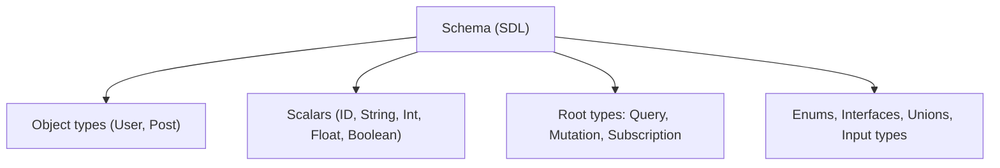

> [!IMPORTANT]
> **The schema is the heart of GraphQL** — a strongly-typed contract that describes every type, field, and operation. It's **self-documenting** and **introspectable** (clients can query the schema itself), which powers incredible tooling: autocomplete, validation, and auto-generated docs (GraphiQL/Apollo Studio). Because it's typed end-to-end, tools like **GraphQL Code Generator** produce type-safe [[03 TypeScript]] client code from the schema — you get compile-time safety across the network boundary, similar to [[04 gRPC]]'s contract-first approach but human-readable.

### 2.2 Resolvers (how data is fetched)

```javascript
const resolvers = {
  Query: {
    user: (parent, args, context) => db.users.findById(args.id),
  },
  User: {
    // resolver for the 'posts' field ON a User
    posts: (parent, args, context) => db.posts.findByAuthor(parent.id),
  },
};
```

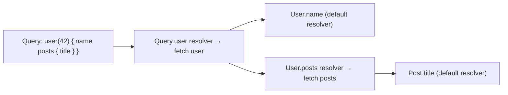

> [!IMPORTANT]
> A **resolver is a function that fetches the data for a single field.** GraphQL executes a query by calling resolvers **field by field**, passing each field's parent result down. This per-field resolution is what makes GraphQL flexible — each field can come from a different source (a database, another service, a cache) — but it's also the source of the infamous **N+1 problem** (§3.1): resolving `posts` for 100 users naively fires 100 separate queries. Understanding that a query becomes a *tree of resolver calls* is essential to everything about GraphQL performance.

### 2.3 Queries, Variables & Arguments

```graphql
# Query with variables (parameterized, reusable, safe)
query GetUser($id: ID!, $postLimit: Int!) {
  user(id: $id) {
    name
    posts(limit: $postLimit) {
      title
      comments { text }
    }
  }
}
# Variables: { "id": "42", "postLimit": 5 }
```

- **Arguments** parameterize fields (`user(id: 42)`, `posts(limit: 5)`).
- **Variables** (`$id`) separate the query structure from its values — safer (no string interpolation → no injection), cacheable, and reusable.
- **Aliases** let you query the same field twice: `admin: user(id: 1) { name }  guest: user(id: 2) { name }`.

### 2.4 Mutations

```graphql
mutation {
  createPost(input: { title: "Hello", authorId: "42" }) {
    id                    # you specify what the mutation RETURNS
    title
    author { name }
  }
}
```

> [!TIP]
> A key GraphQL feature: **mutations return data too** — you specify exactly what fields you want back after the change, so you can update your UI in the same round trip (no separate re-fetch). Best practices: use a single **`input` type** argument (cleaner, evolvable), return the modified object (plus maybe a status/errors payload), and design mutations around *business actions* (`publishPost`) rather than raw CRUD (`updatePost(status: "published")`). Note: unlike queries (which run in parallel), **mutation fields run sequentially** to avoid race conditions.

### 2.5 Subscriptions (real-time)

```graphql
subscription {
  postAdded {
    id
    title
    author { name }
  }
}
```

> [!TIP]
> **Subscriptions** provide real-time updates, typically over [[05 WebSockets]] (the `graphql-ws` protocol). When an event occurs (a new post), the server pushes the data to subscribed clients. Under the hood, subscriptions need a **pub/sub backplane** ([[04 Redis]]/[[01 Kafka]]) to work across multiple servers — the same stateful-scaling challenge as raw [[05 WebSockets]]. Use subscriptions for genuinely live data (chat, live feeds, notifications); for one-off reads/writes, queries/mutations over plain HTTP are simpler.

### 2.6 The Type System

| Type kind | Purpose | Example |
|---|---|---|
| **Scalar** | Primitive values | `ID`, `String`, `Int`, `Float`, `Boolean` (+ custom: `DateTime`) |
| **Object** | Structured type with fields | `type User { ... }` |
| **Enum** | Fixed set of values | `enum Role { ADMIN USER }` |
| **Interface** | Shared fields across types | `interface Node { id: ID! }` |
| **Union** | One of several types | `union SearchResult = User | Post` |
| **Input** | Argument objects | `input CreatePostInput { ... }` |
| **List / Non-null** | `[Type]`, `Type!` | `[Post!]!` |

> [!WARNING]
> **Nullability (`!`) is a critical, often-misunderstood design decision.** `String!` means "never null." But if a resolver for a non-null field throws an error, GraphQL can't return null there — so it **bubbles the error up** to the nearest nullable parent, potentially nulling out a *large* chunk of your response. Over-using `!` makes your API brittle (one failed field nukes a whole branch); under-using it makes clients handle nulls everywhere. Rule of thumb: use `!` for truly-always-present fields (IDs), be cautious with `!` on fields that hit external services.

---

## 3. ⚙️ ADVANCED CONCEPTS (Senior Level)

### 3.1 The N+1 Problem & DataLoader

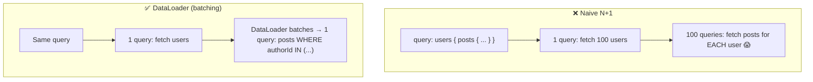

> [!WARNING]
> The **N+1 problem is GraphQL's most notorious performance trap.** Because resolvers run per-field, a query for 100 users' posts naively triggers 1 query for users + 100 queries for their posts (see [[09 Java Hibernate]] for the same problem in ORMs). The standard fix is **DataLoader**: it **batches** all the individual `posts(authorId)` calls made during one request into a single `WHERE authorId IN (...)` query, and **caches** within the request (deduplication). Every production GraphQL server needs DataLoader (or equivalent batching) — without it, GraphQL performance collapses on nested queries. This is *the* senior GraphQL topic.

### 3.2 Caching — GraphQL's Hard Problem

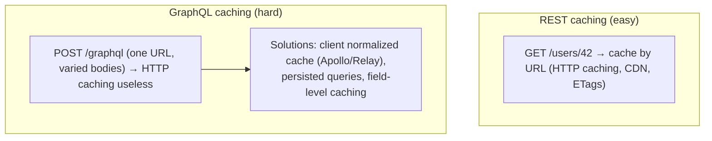

> [!IMPORTANT]
> GraphQL **sacrifices HTTP's simple caching.** [[02 REST API Design|REST]] caches beautifully by URL (browsers, CDNs, ETags) because a GET URL uniquely identifies a resource. GraphQL uses **one POST endpoint** with the query in the body — so URL-based HTTP caching is useless. Solutions: **client-side normalized caches** (Apollo Client, Relay store objects by ID and reuse them — see [[12 TanStack Query]] for the concept), **persisted queries** (send a query hash instead of the full text → enables GET + CDN caching), and **field-level server caching**. Losing easy HTTP caching is one of the biggest real costs of adopting GraphQL — weigh it seriously.

### 3.3 Security: Query Complexity & Depth

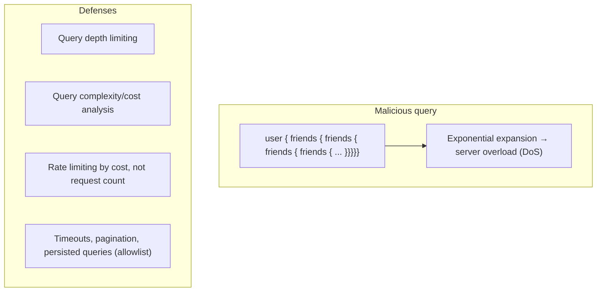

> [!WARNING]
> GraphQL's flexibility is a **security risk**: a single malicious query with deep nesting (`friends { friends { friends ... }}`) can trigger **exponential** work and take down your server — a DoS you can't have in fixed [[02 REST API Design|REST]] endpoints. Defenses: **query depth limiting**, **complexity/cost analysis** (assign each field a cost, reject expensive queries), **rate-limit by cost** (not request count — one GraphQL request can be arbitrarily expensive), **timeouts**, **pagination** enforcement, and **persisted-query allowlists** (only pre-approved queries allowed in production). Also **disable introspection in production** for closed APIs. GraphQL security requires more thought than REST.

### 3.4 Pagination

```graphql
# Cursor-based (Relay Connection spec) — the standard
query {
  posts(first: 10, after: "cursor123") {
    edges {
      node { id title }
      cursor
    }
    pageInfo { hasNextPage endCursor }
  }
}
```

> [!TIP]
> GraphQL's de-facto pagination standard is the **Relay Connection spec** (edges/nodes/cursors/pageInfo) — verbose but powerful, using **cursor-based pagination** (stable, efficient — see [[02 REST API Design]] §2.6 and [[02 Postgres]]). It handles the same offset-vs-cursor trade-offs as REST but with a standardized shape that tooling understands. Simpler `limit/offset` also works for basic cases. Always paginate list fields — an unbounded list field is both a performance and security hole (§3.3).

### 3.5 Schema Evolution & Versioning

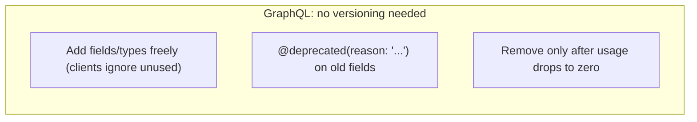

> [!TIP]
> A GraphQL selling point: **you rarely version the API** (no `/v2`). Because clients request only the fields they use, you can **add** fields/types without breaking anyone, and **deprecate** old fields with `@deprecated(reason: "...")` (tools warn users), monitoring **field-level usage analytics** to know when it's safe to remove them. This continuous evolution beats REST's version churn — *if* you have the tooling to track field usage. The catch: **breaking changes** (removing/retyping a used field) still break clients, and you can't easily "version" your way out — so evolution discipline matters.

### 3.6 Failure Scenarios & Anti-Patterns

| Problem | Cause | Fix |
|---|---|---|
| **N+1 queries** | Per-field resolvers hit DB individually | **DataLoader** batching |
| **No HTTP caching** | Single POST endpoint | Client normalized cache, persisted queries |
| **DoS via deep/complex queries** | Unbounded flexibility | Depth/complexity limits, cost-based rate limiting |
| **Over-fetching in resolvers** | Fetching all columns regardless of query | Look-ahead / select only requested fields |
| **Error swallowing** | Partial data + errors array confuses clients | Consistent error handling, `errors` field discipline |
| **Exposing everything** | Whole DB as a graph | Design schema for use cases, authorize per-field |
| **Chatty mutations** | CRUD-style, many round trips | Coarse business-action mutations |
| **200 OK for errors** | GraphQL returns 200 even on errors | Clients must check the `errors` array |

> [!WARNING]
> A GraphQL surprise: it typically returns **HTTP 200 even when there are errors** — errors go in a top-level `errors` array alongside partial `data`. This breaks the [[02 REST API Design|REST]] instinct of "check the status code." Clients **must inspect the `errors` array**, and you must decide how to handle **partial success** (some fields resolved, some failed). This "always 200, errors in body" model is a frequent source of bugs and monitoring blind spots — instrument it explicitly.

### 3.7 Authorization in GraphQL

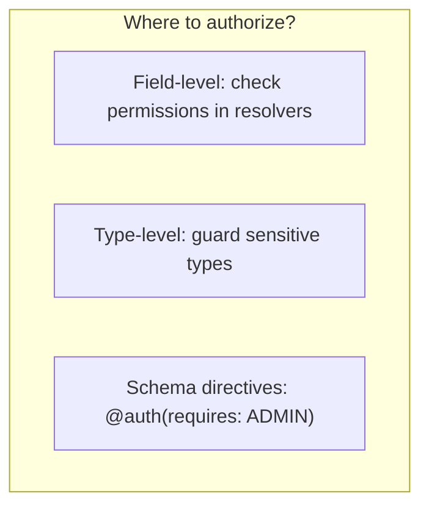

> [!IMPORTANT]
> **Authorization is harder in GraphQL than [[02 REST API Design|REST]].** In REST, you guard an endpoint. In GraphQL, a single query can traverse many types and fields from different sources — so authorization must often happen at the **resolver/field level** (can *this* user see *this* field of *this* object?). A user allowed to query `user` might not be allowed to see their `email` or traverse to `salaryInfo`. Approaches: per-resolver checks, schema **directives** (`@auth`), or a policy layer. Never assume "authorized to query the type" = "authorized to see all its fields." This granularity is powerful but easy to get wrong (data leaks).

---

## 4. 🏗️ REAL-WORLD SYSTEM DESIGN USAGE

### 4.1 GraphQL as an API Gateway / BFF

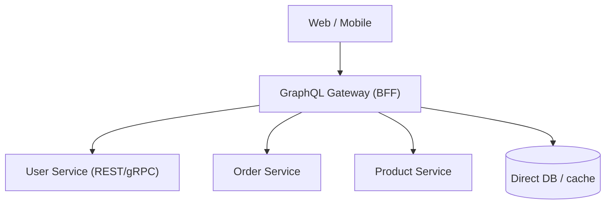

> [!IMPORTANT]
> A common architecture: GraphQL as a **Backend-for-Frontend (BFF) / API aggregation layer** over existing [[03 Microservices]]. Clients get one flexible GraphQL endpoint; resolvers fetch from underlying [[02 REST API Design|REST]]/[[04 gRPC]] services, databases, and caches, **stitching them into one graph**. This gives frontends the flexibility of GraphQL without rewriting backend services — the GraphQL layer *orchestrates*. It's especially valuable when diverse clients (web, iOS, Android) need different data shapes from the same services.

### 4.2 Federation (GraphQL for Microservices)

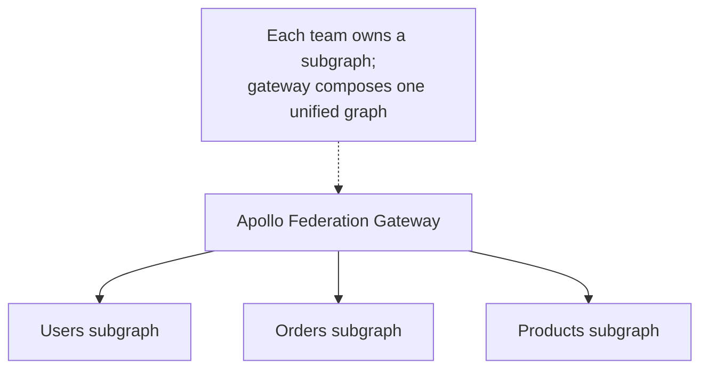

> [!TIP]
> **GraphQL Federation** (Apollo Federation) solves the "monolithic schema" problem at scale: instead of one giant GraphQL server, each [[03 Microservices|microservice]] team owns a **subgraph**, and a **gateway composes them into one unified graph**. A `User` type can be extended across services (the users service owns core fields; the orders service adds `user.orders`). This enables independent team ownership while presenting clients a single graph — the standard way large orgs (Netflix, etc.) run GraphQL across many services. The alternative, schema stitching, is older/less favored.

### 4.3 How companies use GraphQL

| Company | Usage |
|---|---|
| **Facebook/Meta** | Created it; powers the mobile apps |
| **GitHub** | Public GraphQL API (alongside REST) |
| **Shopify** | Storefront + Admin GraphQL APIs |
| **Netflix, Airbnb** | Federation across microservices, BFF |
| **Twitter, Twitch** | Internal GraphQL for complex client data |

### 4.4 GraphQL vs REST vs gRPC

| Aspect | GraphQL | [[REST API Design\|REST]] | [[04 gRPC]] |
|---|---|---|---|
| **Data fetching** | Client picks fields | Fixed per endpoint | Fixed per method |
| **Endpoints** | One | Many | Many methods |
| **Over/under-fetching** | Solved | Common problem | N/A (typed) |
| **Caching** | Hard (client-side) | Easy (HTTP/CDN) | N/A |
| **Format** | JSON | JSON | Binary |
| **Typing** | Strong (schema) | Optional (OpenAPI) | Strong (Protobuf) |
| **Real-time** | Subscriptions | SSE/[[05 WebSockets]] | Streaming |
| **Best for** | Diverse clients, complex/nested data | Public APIs, CRUD, caching | Internal high-perf services |
| **Complexity** | High (server) | Low | Medium |

> [!TIP]
> **Don't default to GraphQL** — it's not automatically better. Choose **GraphQL** when clients have **diverse, nested data needs** and you're fighting over/under-fetching (complex frontends, multiple client types, BFF/aggregation). Choose **[[02 REST API Design|REST]]** for simple CRUD, public APIs, and when **caching** matters (GraphQL's caching is genuinely hard). Choose **[[04 gRPC]]** for internal high-performance service calls. Many systems use **all three** at different layers. The interview-winning answer weighs GraphQL's client flexibility against its server-side complexity (N+1, caching, security, authz).

---

## 5. 🎤 INTERVIEW PREPARATION

### 5.1 Most important questions

<details>
<summary><b>Q1: What is GraphQL and what problems does it solve?</b></summary>

A query language + runtime for APIs where clients request **exactly the fields they need** from a **single, strongly-typed endpoint**. It solves REST's **over-fetching** (getting unneeded data) and **under-fetching** (N round trips for related data) by letting clients fetch precise, nested data in one request. Trade-off: complexity moves to the server (resolvers, N+1, caching, security).
</details>

<details>
<summary><b>Q2: Query vs Mutation vs Subscription?</b></summary>

**Query** reads data (like GET, runs in parallel). **Mutation** modifies data (like POST/PUT/DELETE, runs sequentially, returns the changed data). **Subscription** provides real-time updates, usually over [[05 WebSockets]]. These are the three root operation types.
</details>

<details>
<summary><b>Q3: What is a resolver?</b></summary>

A function that fetches the data for a single field. GraphQL executes a query by calling resolvers field-by-field (a resolver tree), passing each parent's result down. Each field can resolve from a different source. This per-field model gives flexibility but causes the **N+1 problem**.
</details>

<details>
<summary><b>Q4: Explain the N+1 problem and DataLoader.</b></summary>

Fetching a list and a nested field per item naively fires 1 query for the list + N queries for the nested data (e.g., 100 users → 100 "get posts" queries). **DataLoader** batches these individual calls made in one request into a single `IN (...)` query and caches/deduplicates within the request. It's essential for GraphQL performance.
</details>

<details>
<summary><b>Q5: Why is caching harder in GraphQL than REST?</b></summary>

REST caches by URL (GET requests → browser/CDN/ETag caching). GraphQL uses **one POST endpoint** with the query in the body, so URL-based HTTP caching doesn't work. Solutions: **client-side normalized caches** (Apollo/Relay store by ID), **persisted queries** (query hash → GET → CDN cacheable), and field-level server caching.
</details>

<details>
<summary><b>Q6: How do you secure a GraphQL API?</b></summary>

Because a single query can be arbitrarily deep/expensive, you need: **query depth limiting**, **complexity/cost analysis**, **cost-based rate limiting** (not request count), **timeouts**, **pagination**, **persisted-query allowlists**, disabling **introspection** in prod (for closed APIs), and **field-level authorization** (a query traverses many types — authorize per resolver/field).
</details>

<details>
<summary><b>Q7: How does GraphQL handle versioning?</b></summary>

Typically no explicit versioning. You **add** fields/types freely (clients only request what they use) and **deprecate** old fields with `@deprecated`, tracking field-level usage to know when removal is safe. Breaking changes (removing/retyping used fields) still break clients, so evolution discipline is needed — but you avoid REST's `/v2` churn.
</details>

<details>
<summary><b>Q8: When would you choose REST over GraphQL?</b></summary>

For simple CRUD, public APIs needing broad compatibility, and cases where **HTTP caching** matters (GraphQL caching is hard). REST is simpler to build, secure, and cache. Choose GraphQL when clients have diverse, nested data needs and you're fighting over/under-fetching. They can coexist.
</details>

### 5.2 Tricky questions

> [!TIP]
> **"Does GraphQL use HTTP status codes for errors?"** — Usually not — it returns **200 OK** even on errors, with problems in a top-level **`errors`** array (alongside partial `data`). Clients must check `errors`, not the status code. This surprises REST developers and complicates monitoring.

> [!TIP]
> **"Is GraphQL always better than REST?"** — No. It solves over/under-fetching but adds server complexity (N+1, resolvers), loses easy HTTP caching, and needs more security/authz work. It's a trade-off, not an upgrade. Best for diverse clients with complex data needs.

> [!TIP]
> **"Can one GraphQL query take down your server?"** — Yes — deeply nested or high-complexity queries can cause exponential work (DoS). This is a real vulnerability that fixed REST endpoints don't have. Mitigate with depth/complexity limits and cost-based rate limiting.

> [!TIP]
> **"Does GraphQL talk to the database directly?"** — Not necessarily — **resolvers** can fetch from anything: databases, [[02 REST API Design|REST]]/[[04 gRPC]] services, caches, or files. GraphQL is a layer *over* your data sources, not a database itself. (GraphQL is often confused with a database — it's not one.)

### 5.3 Common mistakes candidates make

| Mistake | Reality |
|---|---|
| "GraphQL replaces REST" | Different trade-offs; often coexist |
| Ignoring N+1 | Need DataLoader batching |
| "Caching is the same as REST" | Much harder — no URL caching |
| No query complexity limits | DoS vulnerability |
| Authorizing only at type level | Must authorize per field |
| Checking status code for errors | Errors are in the `errors` array (HTTP 200) |
| "GraphQL is a database" | It's an API layer over data sources |
| CRUD-style mutations | Prefer business-action mutations |

### 5.4 What interviewers actually expect

- **Over/under-fetching** as the core motivation, and the client-picks-fields model.
- **Schema + resolvers** mechanics and the resolver tree.
- The **N+1 problem + DataLoader** (the #1 performance topic).
- **Caching difficulty**, **security** (complexity/depth limits), **field-level authz**.
- **Subscriptions/federation** awareness.
- **GraphQL vs REST vs gRPC** trade-offs — and that GraphQL isn't a default win.

---

## 6. 🛠️ HANDS-ON PROJECTS

### Project 1: Build a GraphQL API (Beginner→Intermediate)

**Goal:** Schema-first API with queries, mutations, and a client.

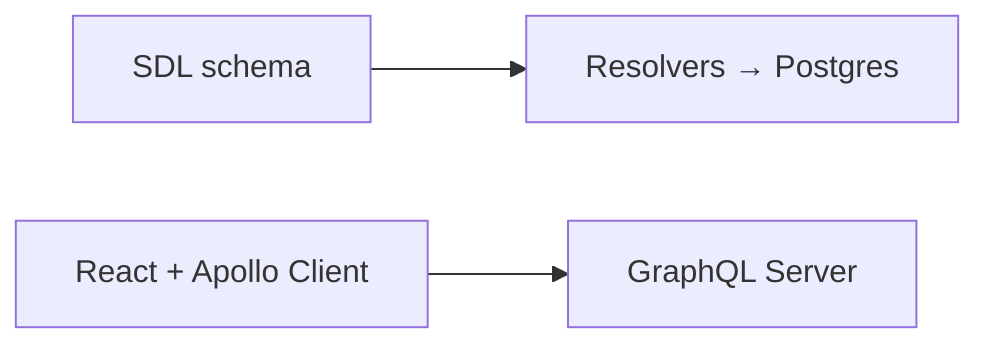

**Steps:**
1. Define a schema (`User`, `Post`, relationships) in SDL.
2. Implement resolvers over [[02 Postgres]] with a [[05 Node.js]] server (Apollo Server).
3. Add queries (nested), mutations (with `input` types), and variables.
4. Explore the schema with GraphiQL (introspection).
5. Consume it from [[08 React]] with Apollo Client (or [[12 TanStack Query]]).

**Learn:** schema, resolvers, queries/mutations, introspection, client integration.

---

### Project 2: Solve N+1 + Add Caching & Security (Intermediate→Senior)

**Goal:** Make the API production-ready.

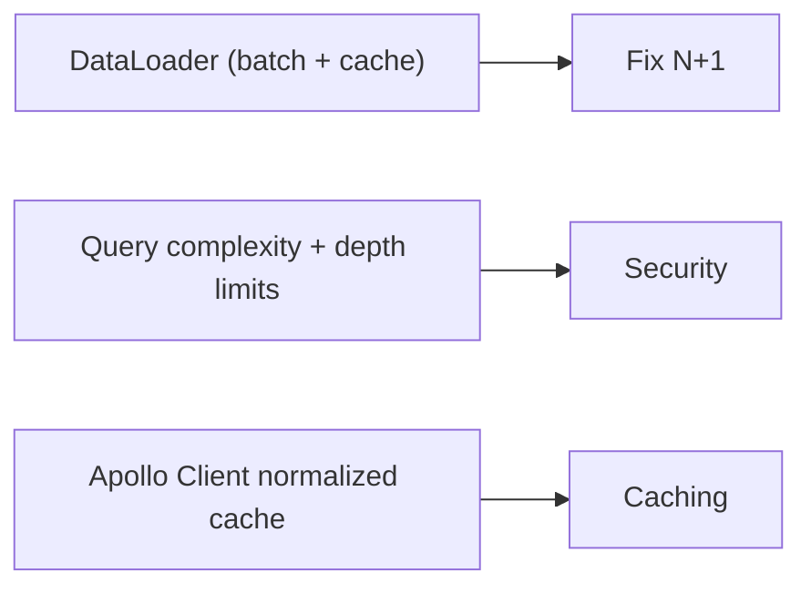

**Steps:**
1. Reproduce the **N+1 problem** (log DB queries on a nested query).
2. Add **DataLoader** to batch — verify query count drops.
3. Add **query depth + complexity limits** and cost-based rate limiting.
4. Implement **field-level authorization** in resolvers.
5. Configure **client-side normalized caching**; try **persisted queries**.

**Learn:** DataLoader, security hardening, authz, caching strategies.

---

### Project 3: Federated GraphQL over Microservices (Senior)

**Goal:** GraphQL as a BFF/gateway across services.

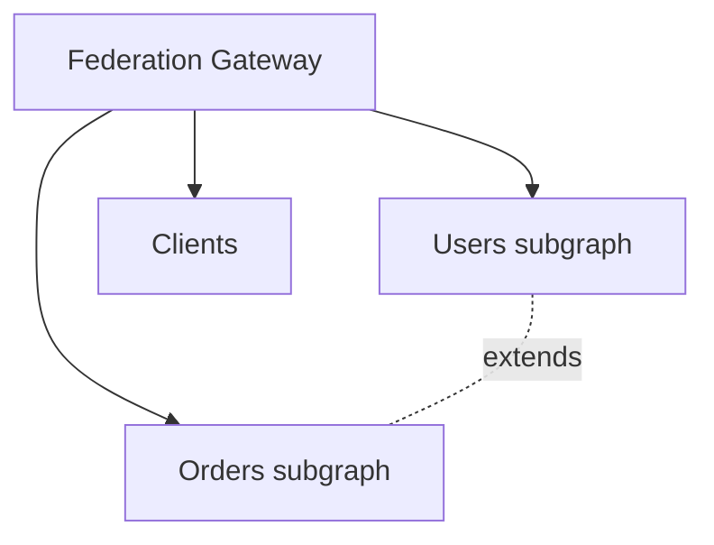

**Steps:**
1. Split a schema into **subgraphs** (users, orders) owned separately.
2. Use **Apollo Federation** to compose a unified graph; extend `User` with `orders`.
3. Resolvers fetch from underlying [[02 REST API Design|REST]]/[[04 gRPC]] [[03 Microservices]].
4. Add **subscriptions** (real-time) backed by a [[04 Redis]]/[[01 Kafka]] pub/sub.
5. Compare this BFF approach with clients calling REST/gRPC directly.

**Learn:** federation, BFF/aggregation, subscriptions at scale, GraphQL-over-microservices.

---

## 7. 🔬 DEEP DIVE: INTERNALS

### 7.1 Query Execution — Parse, Validate, Execute

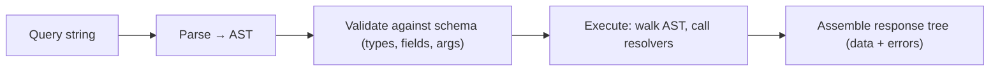

> [!IMPORTANT]
> A GraphQL query goes through **parse → validate → execute**. Parsing turns the query text into an **AST**; validation checks it against the schema (do these fields/types/args exist? correct types?) — **before** any resolver runs, catching bad queries early. Execution walks the AST, calling resolvers and building the response tree, collecting any errors. This validate-before-execute pipeline is why GraphQL can guarantee a query is well-formed against the schema — a strong contract enforced at runtime, complementing the compile-time safety of generated types.

### 7.2 The Resolver Tree & Execution Order

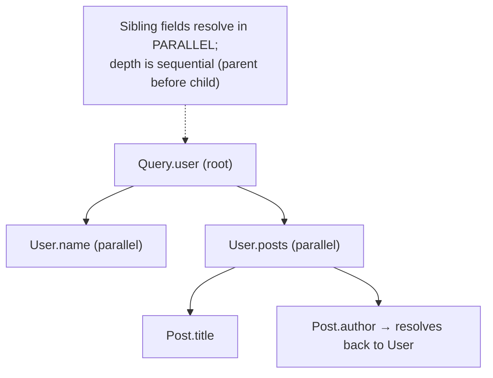

> [!TIP]
> GraphQL executes a query as a **tree of resolvers**: a field's resolver receives its **parent's** resolved value, so children can't resolve until parents do (depth is sequential), but **sibling fields resolve in parallel**. This parallelism is a performance advantage — independent branches fetch concurrently. It also explains why **mutations run sequentially** (to avoid write races) while **queries run in parallel**. Understanding the resolver tree is the key to reasoning about both performance (where N+1 happens) and execution semantics.

### 7.3 How DataLoader Batches

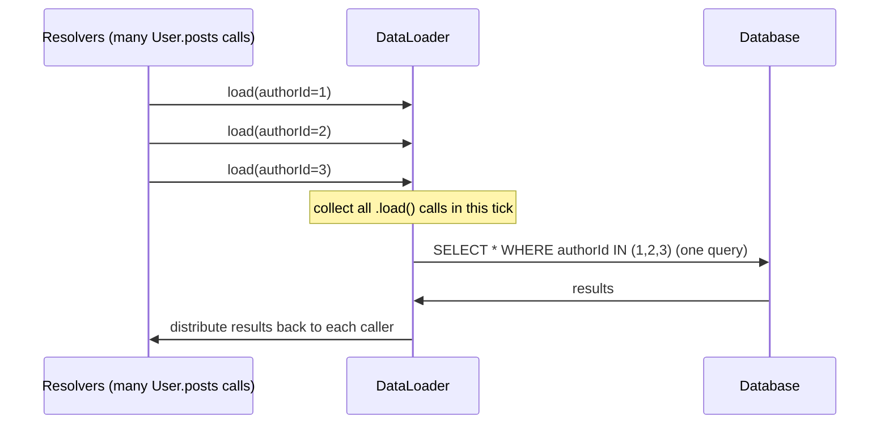

> [!IMPORTANT]
> **DataLoader exploits the event loop** ([[05 Node.js]]): it collects all `.load(key)` calls made during a single tick, then fires **one batched query** for all of them on the next tick, distributing results back. It also **caches per request** (calling `.load(1)` twice returns the same promise). This is an elegant application of async batching — the individual resolvers don't know they're being batched; DataLoader transparently coalesces their independent requests. It's the canonical solution to N+1 and a beautiful example of the event-loop-batching pattern also seen in [[04 Redis]] pipelining.

### 7.4 Introspection — The Self-Describing Schema

```graphql
# The schema can be queried like any data
{ __schema { types { name fields { name } } } }
```

> [!TIP]
> **Introspection** lets clients query the schema itself (`__schema`, `__type`) — the schema is data. This powers GraphQL's exceptional tooling: **GraphiQL/Apollo Studio** (interactive explorers with autocomplete), **code generators** ([[03 TypeScript]] types from the schema), and automatic documentation. It's a superpower for developer experience. The caveat: introspection **exposes your entire API surface**, so for closed/private APIs you typically **disable it in production** to avoid handing attackers a map (§3.3).

### 7.5 Why GraphQL Isn't a Silver Bullet

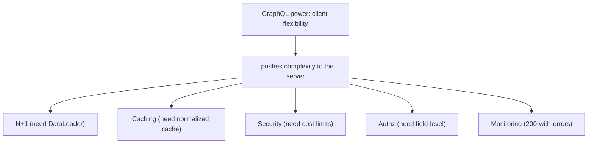

> [!IMPORTANT]
> The deepest lesson: **GraphQL doesn't eliminate complexity — it relocates it from the client to the server.** REST's rigidity gives you free HTTP caching, simple endpoint-level auth, natural rate limiting, and predictable performance. GraphQL trades all of that for client flexibility, then hands you back the hard problems — N+1, caching, query-cost security, field-level authorization, partial-error handling — to solve on the server. For the *right* problem (diverse clients, complex nested data), this trade is very worth it; for simple CRUD, it's needless complexity. Senior engineers evaluate whether the flexibility is worth the operational burden, rather than adopting GraphQL by default.

---

## ✅ Production Checklists

### Schema & Resolvers
- [ ] Schema designed for **use cases**, not raw DB dump
- [ ] Nullability (`!`) used deliberately (avoid brittle non-null on risky fields)
- [ ] **DataLoader** (or batching) for all list→nested resolvers
- [ ] Resolvers select only requested fields (avoid resolver over-fetching)
- [ ] `@deprecated` for evolution; field-usage tracking

### Security
- [ ] **Query depth + complexity limits**
- [ ] **Cost-based rate limiting** (not request count)
- [ ] Query **timeouts** + pagination enforced
- [ ] **Field-level authorization** in resolvers
- [ ] **Introspection disabled** in prod (closed APIs) + persisted-query allowlist
- [ ] Input validation

### Performance & Ops
- [ ] Client **normalized caching** (Apollo/Relay)
- [ ] **Persisted queries** for CDN/GET caching where possible
- [ ] `errors` array handling + partial-success strategy
- [ ] Monitoring (200-with-errors instrumented), tracing per resolver
- [ ] Federation/BFF boundaries clear if multi-service

---

## 🗺️ Learning Roadmap

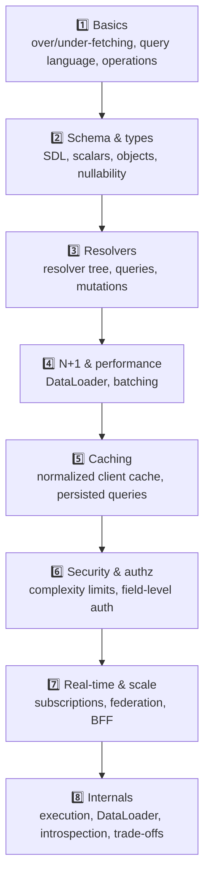

| Stage | Focus | You can... |
|---|---|---|
| 1–3 | Basics + schema/resolvers | Build a working GraphQL API |
| 4–5 | Performance + caching | Make it fast and efficient |
| 6–7 | Security + scale | Secure it; run it over microservices |
| 8 | Internals | Reason about trade-offs deeply |

---

## 🔁 Self-Review Completion Loop

Reviewed against the GraphQL specification, Apollo/Relay best practices, interview questions, and production experience.

### Gap Review Matrix

| Dimension | Covered? | Where |
|---|---|---|
| What/why, over/under-fetching | ✅ | §1 |
| Operation types (query/mutation/subscription) | ✅ | §1, §2.4–2.5 |
| Schema/SDL | ✅ | §2.1 |
| Resolvers | ✅ | §2.2, §7.2 |
| Queries/variables/arguments | ✅ | §2.3 |
| Type system + nullability | ✅ | §2.6 |
| N+1 & DataLoader | ✅ | §3.1, §7.3 |
| Caching challenges | ✅ | §3.2 |
| Security (complexity/depth) | ✅ | §3.3 |
| Pagination (Relay connections) | ✅ | §3.4 |
| Schema evolution/versioning | ✅ | §3.5 |
| Anti-patterns + 200-with-errors | ✅ | §3.6 |
| Authorization (field-level) | ✅ | §3.7 |
| BFF/gateway usage | ✅ | §4.1 |
| Federation | ✅ | §4.2 |
| GraphQL vs REST vs gRPC | ✅ | §4.4 |
| Execution pipeline | ✅ | §7.1 |
| Resolver tree/parallelism | ✅ | §7.2 |
| Introspection | ✅ | §7.4 |
| Trade-off reality | ✅ | §7.5 |
| Interview Q&A + mistakes | ✅ | §5 |
| Hands-on projects | ✅ | §6 |

> [!NOTE]
> **Remaining depth to explore independently:** Relay client & its spec in depth, GraphQL directives (custom @directives), schema stitching vs federation, GraphQL over gRPC/Connect, caching with Apollo Router, `@defer`/`@stream` (incremental delivery), file uploads, GraphQL Mesh, and comparing Apollo vs urql vs Relay clients.

---

## 📚 Official References

| Resource | URL |
|---|---|
| GraphQL Specification | https://spec.graphql.org/ |
| graphql.org (learn) | https://graphql.org/learn/ |
| Apollo GraphQL Docs | https://www.apollographql.com/docs/ |
| DataLoader | https://github.com/graphql/dataloader |
| Relay Connection spec | https://relay.dev/graphql/connections.htm |
| Apollo Federation | https://www.apollographql.com/docs/federation/ |
| Production Considerations (security) | https://www.apollographql.com/docs/technotes/ |
| GraphQL Code Generator | https://the-guild.dev/graphql/codegen |

---

## 🎁 Final Summary

> [!IMPORTANT]
> **The one-paragraph takeaway:** GraphQL is a **query language + runtime** where clients request **exactly the fields they need** from a **single, strongly-typed endpoint**, solving [[02 REST API Design|REST]]'s **over-fetching** and **under-fetching**. You define a **schema** (typed contract) and write **resolvers** (per-field data-fetching functions); a query becomes a **tree of resolver calls** where siblings run in parallel. GraphQL's flexibility relocates complexity to the server: you must solve the **N+1 problem** (with **DataLoader** batching), give up easy HTTP **caching** (use client-side normalized caches + persisted queries), defend against **query-complexity DoS** (depth/cost limits, cost-based rate limiting), handle **field-level authorization**, and cope with **HTTP-200-plus-errors** semantics. It shines for **diverse clients with complex nested data** (BFF/aggregation, **federation** across [[03 Microservices]]) and offers **subscriptions** for real-time. But it's **not a default upgrade over REST** — for simple CRUD and cache-heavy public APIs, REST is simpler; for internal high-performance calls, [[04 gRPC]] wins. The senior skill is recognizing when GraphQL's client flexibility justifies its server-side burden.

**Golden rules:**
1. ◈ Clients request **exact fields** → solves over/under-fetching.
2. 🌳 A query is a **tree of resolvers** — siblings parallel, mutations sequential.
3. 🔁 **DataLoader** is mandatory — batch to kill the **N+1 problem**.
4. 🗄️ **Caching is hard** — normalized client cache + persisted queries (no free HTTP caching).
5. 🛡️ Limit **query depth/complexity**; rate-limit by **cost**, not count.
6. 🔐 Authorize at the **field level** — a query traverses many types.
7. ⚠️ GraphQL returns **200 with an `errors` array** — clients must check it.
8. 🧩 Great for **BFF/aggregation** + **federation** over [[03 Microservices]].
9. ⚖️ Not a default win — it **relocates complexity to the server**; choose deliberately vs [[02 REST API Design|REST]]/[[04 gRPC]].

---

*Related guides in this vault: [[02 REST API Design]] · [[04 gRPC]] · [[05 Node.js]] · [[08 React]] · [[12 TanStack Query]] · [[02 Postgres]] · [[01 System Design Fundamentals]] · [[03 Microservices]] · [[05 WebSockets]] · [[04 Redis]] · [[03 TypeScript]]*
