# ⚡ gRPC — Complete Beginner-to-Expert Reference

> High-performance, contract-first RPC over HTTP/2 with Protocol Buffers — the framework of choice for fast, strongly-typed service-to-service communication in microservices.

---

## 📑 Table of Contents

1. [Executive Summary](#-executive-summary)
2. [Fundamentals (Beginner)](#1--fundamentals-beginner-level)
3. [Core Concepts (Intermediate)](#2--core-concepts-intermediate-level)
4. [Advanced Concepts (Senior)](#3--advanced-concepts-senior-level)
5. [Real-World System Design](#4--real-world-system-design-usage)
6. [Interview Preparation](#5--interview-preparation)
7. [Hands-On Projects](#6--hands-on-projects)
8. [Deep Dive: Internals](#7--deep-dive-internals)
9. [Production Checklists](#-production-checklists)
10. [Learning Roadmap](#-learning-roadmap)
11. [Self-Review Completion Loop](#-self-review-completion-loop)
12. [Official References](#-official-references)
13. [Final Summary](#-final-summary)

---

## 🎯 Executive Summary

**gRPC** (gRPC Remote Procedure Call) is a high-performance, open-source RPC framework by Google. You define your service and messages in a **`.proto` file** (Protocol Buffers), and gRPC generates strongly-typed client and server code in many languages. It runs over **HTTP/2**, uses **binary Protobuf** serialization, and supports **streaming** — making it dramatically faster and more efficient than JSON/[[02 REST API Design|REST]] for service-to-service calls.

| What it is | What it replaces | Core superpower |
|---|---|---|
| Contract-first RPC over HTTP/2 + Protobuf | JSON/REST for internal calls, hand-written clients | **Fast, strongly-typed, streaming** cross-language service communication |

> [!IMPORTANT]
> gRPC's defining idea: **call a remote function as if it were local.** You don't think about URLs, verbs, or JSON — you define a service interface in a `.proto` contract, and gRPC generates the client/server stubs so you just call `client.GetUser(request)`. Combined with **binary Protobuf** (small, fast) and **HTTP/2** (multiplexing, streaming), it's built for **internal [[03 Microservices]] communication** where performance and strong typing matter more than browser accessibility. It's the high-performance counterpart to [[02 REST API Design|REST]] in the API-styles landscape.

Related guides: [[02 REST API Design]] · [[03 Microservices]] · [[01 System Design Fundamentals]] · [[05 Spring Boot]] · [[05 Node.js]] · [[02 Kubernetes]] · [[05 WebSockets]] · [[03 GraphQL]]

---

## 1. 🌱 FUNDAMENTALS (Beginner Level)

### What is gRPC in simple terms?

Normally, when Service A needs data from Service B, you build a [[02 REST API Design|REST]] endpoint, write HTTP client code, serialize/deserialize JSON, and hope both sides agree on the shape. **gRPC lets Service A call a method on Service B as if B's functions were local** — `userService.getUser(id)` — and handles all the networking, serialization, and type-safety for you. You write a **contract** once, and gRPC generates the plumbing for both sides.

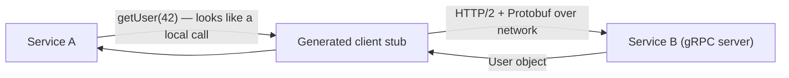

### Why does gRPC exist?

[[02 REST API Design|REST]]/JSON is great for public APIs but has real costs for **internal, high-volume service-to-service** calls:

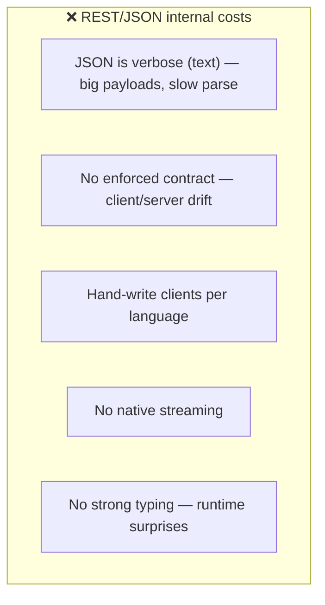

Google built gRPC (2015, from internal "Stubby") for its massive internal microservice mesh where **performance, strong contracts, and multi-language support** are essential.

### Problems gRPC solves

| Problem | How gRPC solves it |
|---|---|
| **Verbose, slow JSON** | Compact binary Protobuf (smaller, faster) |
| **Client/server contract drift** | `.proto` is the single source of truth |
| **Hand-writing clients** | Auto-generated stubs in every language |
| **No streaming in REST** | Native client/server/bidirectional streaming |
| **Weak typing** | Strongly-typed generated code |
| **HTTP/1.1 inefficiency** | HTTP/2 multiplexing, one connection |
| **Cross-language services** | Same `.proto` → any language |

### RPC vs REST — the paradigm shift

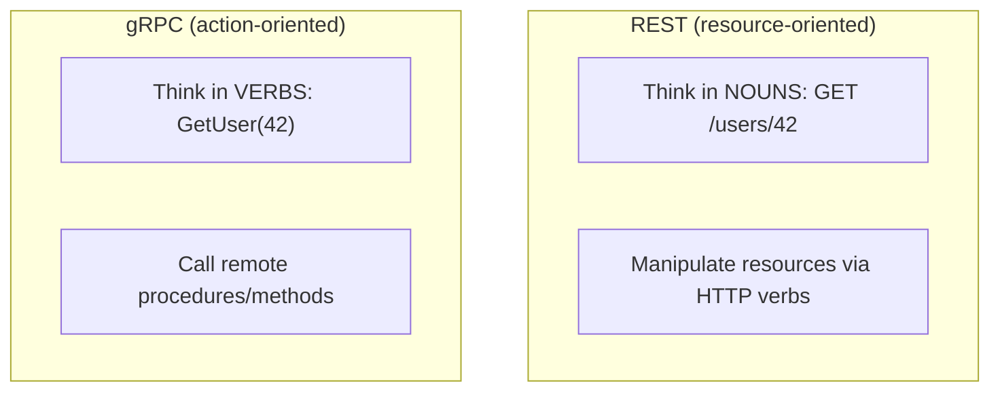

> [!TIP]
> The mental shift: [[02 REST API Design|REST]] is **resource-oriented** ("act on nouns via HTTP verbs"); gRPC is **action-oriented** ("call functions/procedures"). REST asks "what resource and what operation?"; gRPC asks "what method do I want to invoke?". Neither is universally better — REST fits CRUD and public APIs (human-readable, cacheable, browser-native); gRPC fits performance-critical internal service calls with strong contracts. Knowing *when* to use which is the senior-level skill.

### Core vocabulary

| Term | Plain meaning |
|---|---|
| **RPC** | Remote Procedure Call — invoke a function on another machine |
| **Protocol Buffers (Protobuf)** | Binary serialization format + IDL |
| **`.proto` file** | The contract: services + messages |
| **Message** | A structured data type (like a struct) |
| **Service** | A collection of RPC methods |
| **Stub** | Generated client code to call the service |
| **Channel** | A connection to a gRPC server |
| **Streaming** | Continuous flow of messages |
| **`protoc`** | The Protobuf compiler (generates code) |

### Real-world analogy 📜

gRPC is like **ordering from a restaurant with a strict, printed menu contract**:
- The **menu** (`.proto` file) precisely defines every dish (method) and its ingredients (message fields) — no ambiguity.
- Both the **waiter** (client) and **kitchen** (server) work from the *same* menu, generated from one source — they can't misunderstand each other.
- Orders are written in a **compact code** (binary Protobuf) rather than long sentences (JSON) — faster to write, transmit, and read.
- The kitchen can send dishes **continuously as they're ready** (streaming) rather than only after you ask each time.

> [!TIP]
> The unifying idea: **gRPC is contract-first.** The `.proto` file is written *before* any code and is the single source of truth from which both client and server are generated. This eliminates the "does the client match the server?" class of bugs that plagues hand-written [[02 REST API Design|REST]] clients — the contract is enforced by the compiler, not hope.

---

## 2. 🧩 CORE CONCEPTS (Intermediate Level)

### 2.1 Protocol Buffers — The Contract

```protobuf
syntax = "proto3";
package user.v1;

// A message = a structured data type
message User {
  int64 id = 1;          // field number (NOT a value — the wire identifier)
  string name = 2;
  string email = 3;
  repeated string roles = 4;   // repeated = a list/array
}

message GetUserRequest {
  int64 id = 1;
}

// A service = a set of RPC methods
service UserService {
  rpc GetUser(GetUserRequest) returns (User);
  rpc ListUsers(ListUsersRequest) returns (stream User);   // server streaming
}
```

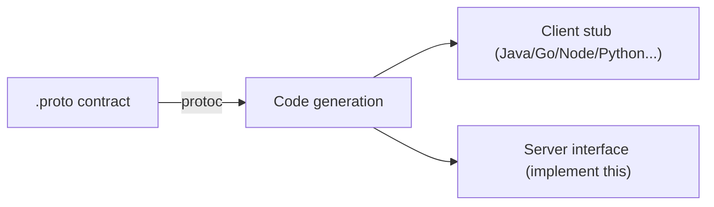

> [!IMPORTANT]
> The **field numbers** (`= 1`, `= 2`) are the heart of Protobuf and confuse beginners — they are **NOT default values**. They're the **identifiers used on the wire** to tag each field, enabling compact binary encoding and, crucially, **schema evolution**: you can add new fields (with new numbers) without breaking old clients, because they simply skip unknown field numbers. **Never reuse or change a field's number** once in production — it corrupts compatibility. This numbering is why Protobuf is both tiny and forward/backward compatible.

### 2.2 The Four RPC Types

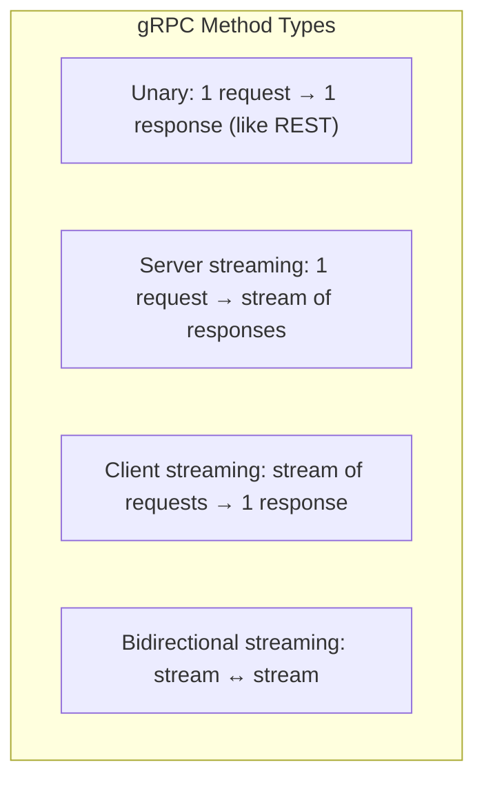

| Type | Pattern | Use case |
|---|---|---|
| **Unary** | 1 req → 1 resp | Standard call (`GetUser`) |
| **Server streaming** | 1 req → N resp | Live feed, large result sets, progress |
| **Client streaming** | N req → 1 resp | Upload chunks, aggregate metrics |
| **Bidirectional streaming** | N req ↔ N resp | Chat, real-time sync (like [[05 WebSockets]]) |

```protobuf
service ChatService {
  rpc SendMessage(Message) returns (Ack);                    // unary
  rpc Subscribe(Room) returns (stream Message);              // server stream
  rpc UploadLogs(stream LogEntry) returns (UploadSummary);   // client stream
  rpc Chat(stream Message) returns (stream Message);         // bidirectional
}
```

> [!TIP]
> **Streaming is a killer gRPC feature that [[02 REST API Design|REST]] lacks natively.** Server streaming replaces polling for large/continuous results (stream 10,000 records instead of paginating, or push live updates). Bidirectional streaming enables [[05 WebSockets]]-like real-time comms *with strong typing and one connection*. This is built on **HTTP/2's** ability to multiplex many streams — gRPC gets it "for free" from the transport. Most calls are still **unary** (REST-like), but reach for streaming when the interaction is continuous.

### 2.3 Why Protobuf Is Fast & Small

```mermaid
flowchart LR
    subgraph JSON["JSON (text)"]
        J['{"id": 42, "name": "Alice"}  → ~28 bytes, must parse text']
    end
    subgraph Proto["Protobuf (binary)"]
        P["[tag][varint 42][tag][len][Alice] → ~10 bytes, direct decode"]
    end
```

| Aspect | JSON | Protobuf |
|---|---|---|
| Format | Text (human-readable) | Binary (not human-readable) |
| Size | Larger (field names repeated) | Smaller (field numbers, packed) |
| Parse speed | Slower (text parsing) | Faster (direct binary decode) |
| Schema | None (or separate) | Built-in `.proto` |
| Typing | Dynamic | Strongly typed |

> [!TIP]
> Protobuf is typically **3–10× smaller and faster** than JSON: field *names* aren't sent (just numbers), integers use compact **varint** encoding, and there's no text parsing — the receiver decodes bytes directly into typed structures. The trade-off: it's **not human-readable** (you can't `curl` and eyeball it), and you need the `.proto` to interpret the bytes. For high-volume internal traffic, this efficiency compounds enormously; for a low-traffic public API, JSON's readability usually wins.

### 2.4 HTTP/2 — The Transport Foundation

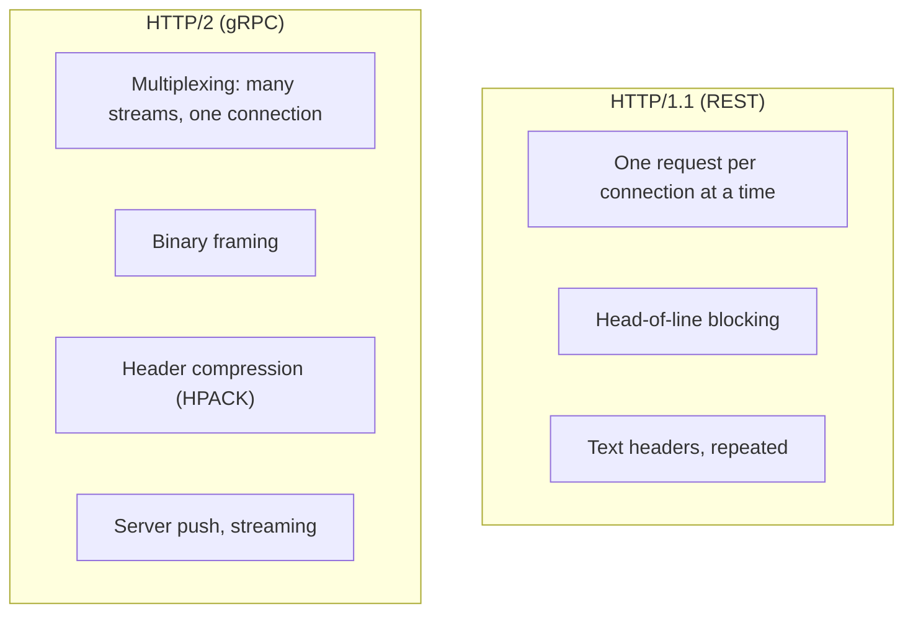

> [!IMPORTANT]
> gRPC **requires HTTP/2**, and this is central to its performance. HTTP/2 **multiplexes** many concurrent requests over a **single TCP connection** (no connection-per-request overhead, no HTTP/1.1 head-of-line blocking at the request level), uses **binary framing** and **header compression**, and natively supports the **streaming** gRPC relies on. This is also gRPC's biggest limitation: **browsers can't speak raw gRPC/HTTP/2 with the needed control**, which is why **gRPC-Web** (a proxy translation layer) exists for browser clients (§3.5).

### 2.5 A Basic gRPC Flow

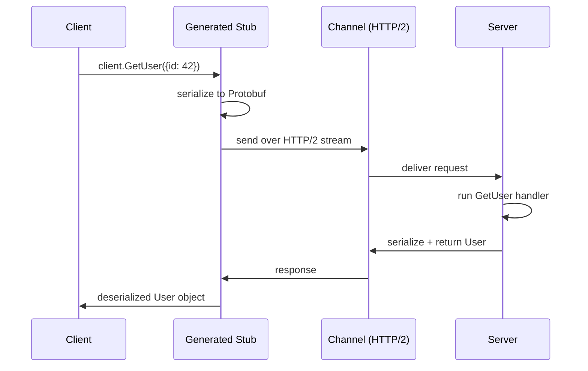

The developer experience: define `.proto` → run `protoc` (or build plugin) → get generated stubs → implement the server method → call the client stub like a local function. The serialization, HTTP/2 transport, and networking are invisible.

### 2.6 Metadata, Deadlines & Status Codes

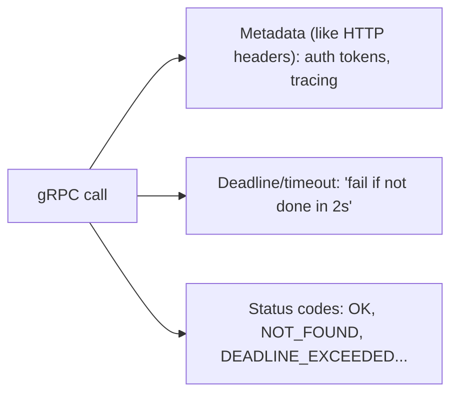

| gRPC status | Rough REST equivalent |
|---|---|
| `OK` | 200 |
| `NOT_FOUND` | 404 |
| `INVALID_ARGUMENT` | 400 |
| `UNAUTHENTICATED` | 401 |
| `PERMISSION_DENIED` | 403 |
| `DEADLINE_EXCEEDED` | 504 |
| `UNAVAILABLE` | 503 |
| `RESOURCE_EXHAUSTED` | 429 |

> [!TIP]
> **Deadlines (not just timeouts) are a gRPC best practice.** A client sets a **deadline** ("this must complete by time T"), which **propagates** through the call chain — if Service A calls B calls C with a 2s deadline, and 1.5s is used, C knows it has 0.5s left. This prevents work from continuing after the client has given up ([[01 System Design Fundamentals]] — avoids wasted work and cascading slowness). Always set deadlines; a missing deadline means a hung dependency can tie up resources indefinitely.

---

## 3. ⚙️ ADVANCED CONCEPTS (Senior Level)

### 3.1 Schema Evolution & Compatibility

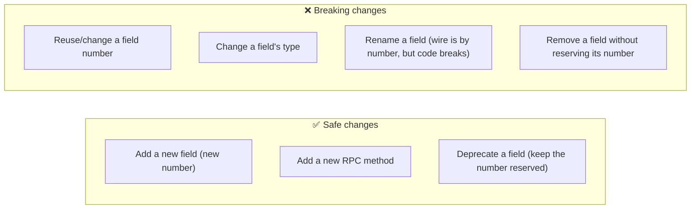

> [!WARNING]
> Protobuf's forward/backward compatibility is powerful **but only if you follow the rules**. Old clients skip unknown fields (forward compat); new clients see missing fields as defaults (backward compat). But **never reuse a field number** — if you delete `email = 3` and later add `phone = 3`, old data's email bytes get misread as phone. Use the **`reserved`** keyword to permanently retire field numbers/names. This disciplined evolution is what lets Google run thousands of services with independently-deployed schemas — but a single reused field number can silently corrupt data across the mesh.

### 3.2 Interceptors (Middleware)


> [!TIP]
> gRPC **interceptors** are the equivalent of [[06 Express.js]]/[[07 Servlets and Filters|servlet]] middleware — a [[02 Design Patterns|Chain of Responsibility]] that wraps every call for cross-cutting concerns: **authentication** (validate tokens from metadata), **logging**, **metrics**, **distributed tracing** (propagate trace context), **rate limiting**, and **error handling**. Both client-side and server-side interceptors exist. This keeps your service methods focused on business logic while auth/observability are applied uniformly — essential in a [[03 Microservices]] mesh.

### 3.3 Error Handling & Retries

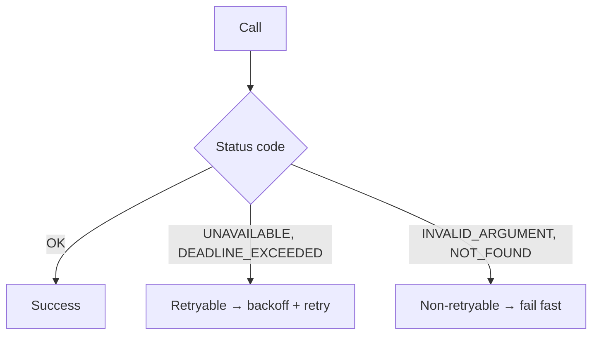

> [!IMPORTANT]
> gRPC has **built-in retry policies** (configurable in the service config) with exponential backoff — but you must distinguish **retryable** (`UNAVAILABLE`, `DEADLINE_EXCEEDED` — transient) from **non-retryable** (`INVALID_ARGUMENT`, `NOT_FOUND` — permanent) errors. Blindly retrying non-idempotent calls duplicates work ([[01 System Design Fundamentals]] idempotency). For richer error details, gRPC supports the **`google.rpc.Status`** model with typed error details (not just a code + string), letting servers return structured, machine-readable error info — more expressive than a bare [[02 REST API Design|REST]] status code.

### 3.4 Load Balancing in gRPC

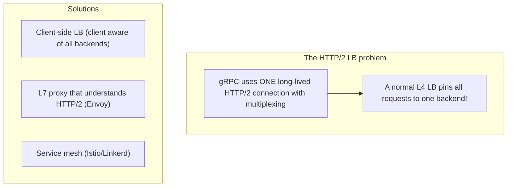

> [!WARNING]
> **Load balancing gRPC is tricky** and a classic production gotcha. Because gRPC keeps a **single long-lived HTTP/2 connection** and multiplexes all calls over it, a naive **L4 (TCP) load balancer pins every request to one backend** — the other servers sit idle. You need **request-level (L7) load balancing** that understands HTTP/2: either **client-side load balancing** (the client knows all backends and distributes calls), an **HTTP/2-aware proxy** like **Envoy**, or a **service mesh** ([[02 Kubernetes]] + Istio/Linkerd). This is a key reason gRPC pairs so naturally with service meshes.

### 3.5 gRPC-Web (browser support)

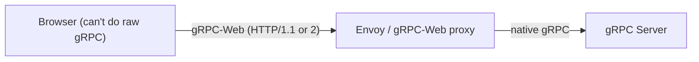

> [!IMPORTANT]
> **Browsers cannot make raw gRPC calls** — they lack the low-level HTTP/2 frame control gRPC needs. **gRPC-Web** solves this: a JavaScript client speaks a slightly different protocol to a **proxy** (Envoy or a dedicated gRPC-Web proxy) that translates to native gRPC for the backend. This works but adds a proxy hop and has limitations (no client-side/bidirectional streaming in most implementations). The practical takeaway: **gRPC shines for internal service-to-service and mobile/backend clients; for browser-facing APIs, [[02 REST API Design|REST]] or [[03 GraphQL]] is usually simpler** than gRPC-Web. Many architectures use REST/GraphQL at the edge and gRPC internally.

### 3.6 Failure Scenarios & Production Issues

| Failure | Symptom | Mitigation |
|---|---|---|
| **L4 LB pins to one backend** | Uneven load, idle servers | L7/client-side LB, Envoy, service mesh |
| **No deadline set** | Hung calls tie up resources | Always set deadlines (propagated) |
| **Reused field number** | Silent data corruption | Never reuse; use `reserved` |
| **Browser can't call gRPC** | Frontend integration fails | gRPC-Web proxy or REST at edge |
| **Non-retryable retried** | Duplicate side effects | Distinguish retryable errors; idempotency |
| **Debugging binary payloads** | Can't eyeball traffic | grpcurl, reflection, logging interceptors |
| **Large messages** | Memory/latency spikes | Streaming; size limits; pagination |
| **Version skew** | Client/server proto mismatch | Disciplined schema evolution + CI checks |

### 3.7 Observability & Tooling

> [!TIP]
> gRPC's binary nature makes it **harder to debug than [[02 REST API Design|REST]]** — you can't just `curl` and read JSON. The tooling ecosystem addresses this: **grpcurl** (a `curl` for gRPC, using server reflection to discover methods), **server reflection** (lets tools introspect available services at runtime), **Buf** (modern Protobuf tooling: linting, breaking-change detection, registry), and **interceptors** for logging/tracing/metrics. In a [[03 Microservices]] mesh, integrate **OpenTelemetry** for distributed tracing across gRPC calls — deadline and trace-context propagation are built to support this. Invest in tooling early; the debugging gap is real.

---

## 4. 🏗️ REAL-WORLD SYSTEM DESIGN USAGE

### 4.1 gRPC Internal, REST/GraphQL at the Edge

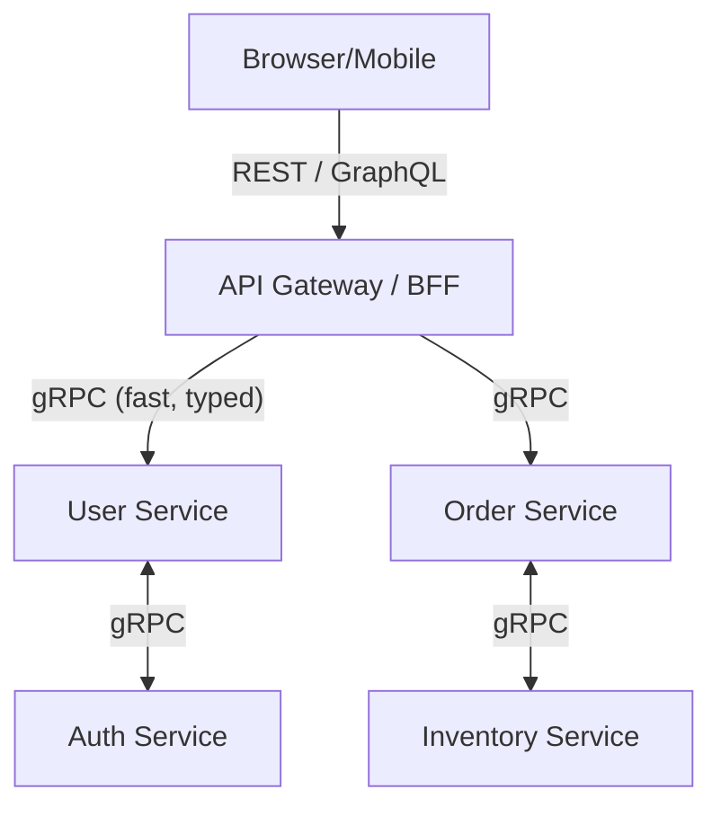

> [!IMPORTANT]
> The dominant real-world pattern: **[[02 REST API Design|REST]]/[[03 GraphQL]] at the edge (browser-facing), gRPC internally (service-to-service).** The [[06 API Gateway]] / Backend-for-Frontend exposes a browser-friendly REST/GraphQL API, then uses **gRPC to call internal [[03 Microservices]]** where its speed, strong typing, and streaming shine and browser compatibility doesn't matter. This gets the best of both: developer-friendly public APIs + high-performance, contract-safe internal communication. It's the canonical answer to "REST or gRPC?" — *both*, at different layers.

### 4.2 How companies use gRPC

| Company | Usage |
|---|---|
| **Google** | Internal RPC (Stubby → gRPC) across everything |
| **Netflix** | Inter-service communication at scale |
| **Uber** | High-throughput microservice mesh |
| **Square, Dropbox, CoreOS** | Internal services + APIs |
| **Kubernetes** | etcd and internal components speak gRPC |

### 4.3 gRPC in Kubernetes & Service Mesh

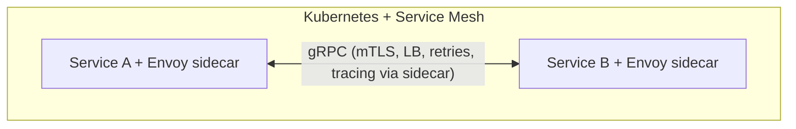

> [!TIP]
> gRPC and **service meshes** ([[02 Kubernetes]] + Istio/Linkerd) are a natural pairing. The mesh's **Envoy sidecars** handle gRPC's tricky **L7 load balancing**, add **mTLS** (automatic encryption between services), **retries/circuit breaking**, and **distributed tracing** — all transparently, without changing service code. This offloads exactly the cross-cutting concerns ([[03 Microservices]] resilience) that gRPC alone doesn't fully solve (especially load balancing). If you run gRPC at scale on Kubernetes, a service mesh is often the answer to its operational challenges.

### 4.4 gRPC vs REST vs GraphQL

| Aspect | gRPC | [[REST API Design\|REST]] | [[03 GraphQL]] |
|---|---|---|---|
| **Style** | RPC (call methods) | Resources (nouns/verbs) | Query language |
| **Format** | Binary (Protobuf) | Text (JSON) | JSON |
| **Transport** | HTTP/2 | HTTP/1.1+ | HTTP |
| **Contract** | `.proto` (strict) | OpenAPI (optional) | Schema (strict) |
| **Performance** | Highest | Moderate | Moderate |
| **Streaming** | Native (4 types) | No (needs [[05 WebSockets]]/SSE) | Subscriptions |
| **Browser** | Needs gRPC-Web | Native | Native |
| **Human-readable** | No | Yes | Yes |
| **Best for** | Internal microservices, low latency | Public APIs, CRUD | Flexible client data needs |

> [!TIP]
> The decision heuristic: **gRPC** for internal, performance-critical, strongly-typed service-to-service ([[03 Microservices]]); **[[02 REST API Design|REST]]** for public APIs, CRUD, broad compatibility, and cacheability; **[[03 GraphQL]]** when diverse clients need flexible data shapes (solving over/under-fetching). They're not mutually exclusive — a mature system uses REST/GraphQL at the edge and gRPC internally. The interview-winning answer names the *layer* each fits.

---

## 5. 🎤 INTERVIEW PREPARATION

### 5.1 Most important questions

<details>
<summary><b>Q1: What is gRPC and how does it differ from REST?</b></summary>

gRPC is a contract-first **RPC framework** over **HTTP/2** using **Protobuf** binary serialization, with generated cross-language stubs and native streaming. Differences from [[02 REST API Design|REST]]: RPC (call methods) vs resource-oriented; binary vs JSON; HTTP/2 vs HTTP/1.1; strict `.proto` contract vs optional; native streaming; not browser-native. gRPC excels at fast, typed internal service-to-service calls; REST at public/CRUD APIs.
</details>

<details>
<summary><b>Q2: What are Protocol Buffers and why field numbers?</b></summary>

Protobuf is a binary serialization format + IDL. You define messages/services in `.proto`; `protoc` generates typed code. **Field numbers** are wire identifiers (not values) that make encoding compact and enable **schema evolution** — old clients skip unknown numbers, so you can add fields without breaking anyone. Never reuse a field number (corrupts compatibility); use `reserved` to retire them.
</details>

<details>
<summary><b>Q3: What are the four RPC types?</b></summary>

**Unary** (1→1, like REST), **server streaming** (1→N, live feeds/large results), **client streaming** (N→1, uploads/aggregation), and **bidirectional streaming** (N↔N, chat/real-time, like [[05 WebSockets]]). Streaming is enabled by HTTP/2 multiplexing and is a key gRPC advantage over REST.
</details>

<details>
<summary><b>Q4: Why does gRPC use HTTP/2?</b></summary>

HTTP/2 provides **multiplexing** (many concurrent streams on one TCP connection, no per-request overhead or HTTP/1.1 head-of-line blocking), **binary framing**, **header compression**, and native **streaming** — all of which gRPC relies on for performance. The downside: browsers can't do raw gRPC/HTTP/2 control, hence gRPC-Web.
</details>

<details>
<summary><b>Q5: Why is load balancing gRPC hard?</b></summary>

gRPC uses a **single long-lived HTTP/2 connection** with multiplexing, so an L4 (TCP) load balancer pins all requests to one backend, leaving others idle. You need **request-level (L7) balancing**: client-side LB, an HTTP/2-aware proxy (Envoy), or a service mesh. This is why gRPC pairs well with service meshes.
</details>

<details>
<summary><b>Q6: How does gRPC handle browser clients?</b></summary>

Not directly — browsers lack the needed HTTP/2 control. **gRPC-Web** uses a proxy (Envoy/gRPC-Web) to translate between a browser-friendly protocol and native gRPC. It has limitations (streaming support). Often it's simpler to expose [[02 REST API Design|REST]]/[[03 GraphQL]] at the edge and use gRPC internally.
</details>

<details>
<summary><b>Q7: What are deadlines and why use them?</b></summary>

A **deadline** is an absolute time by which a call must complete; it **propagates** down the call chain, so downstream services know how much time remains and can stop work the client has already abandoned. This prevents hung dependencies from tying up resources and helps avoid cascading slowness. Always set deadlines.
</details>

<details>
<summary><b>Q8: When would you choose gRPC over REST?</b></summary>

For **internal microservice-to-service** communication where you want high performance (binary, HTTP/2), strong typing/contracts, multi-language codegen, and streaming. Choose **REST** for public APIs, CRUD, browser clients, cacheability, and human-readability. Common pattern: REST/GraphQL at the edge, gRPC internally.
</details>

### 5.2 Tricky questions

> [!TIP]
> **"Can you `curl` a gRPC endpoint?"** — Not usefully — it's binary Protobuf over HTTP/2, not text. Use **grpcurl** (which leverages server reflection) instead. This debugging difference vs REST is a real operational cost of gRPC.

> [!TIP]
> **"Is gRPC faster than REST because of Protobuf or HTTP/2?"** — Both. Protobuf gives smaller/faster serialization; HTTP/2 gives multiplexing, header compression, and streaming. The combination is what makes gRPC fast — Protobuf alone can be used over other transports, and HTTP/2 helps REST too, but gRPC bundles both.

> [!TIP]
> **"What happens if you reuse a field number?"** — Silent data corruption: existing serialized data tagged with that number gets decoded into the wrong field. This is why you `reserved` old numbers. It's one of the most dangerous Protobuf mistakes.

> [!TIP]
> **"Does gRPC replace message queues like Kafka?"** — No. gRPC is **synchronous request-response** (even streaming is within a call); [[01 Kafka]]/[[02 RabbitMQ]] provide **asynchronous, durable, decoupled** messaging with buffering and replay. Different tools: gRPC for direct service calls, message brokers for event-driven decoupling.

### 5.3 Common mistakes candidates make

| Mistake | Reality |
|---|---|
| "gRPC replaces REST everywhere" | Complementary; REST for edge/public |
| Field numbers = values | They're wire identifiers |
| Reusing field numbers | Corrupts compatibility — use `reserved` |
| Ignoring load-balancing issue | Need L7/mesh for gRPC |
| No deadlines | Hung calls, resource leaks |
| Expecting browser support | Needs gRPC-Web proxy |
| Retrying non-idempotent calls | Duplicate work |
| "gRPC = async messaging" | It's synchronous RPC, not a queue |

### 5.4 What interviewers actually expect

- **Protobuf + HTTP/2** as the two pillars, and *why* each matters.
- The **four RPC/streaming types** and when to use streaming.
- **Schema evolution** rules (field numbers, `reserved`).
- The **load-balancing challenge** and mesh/Envoy solution.
- **Deadlines, interceptors, error handling, gRPC-Web**.
- **gRPC vs REST vs GraphQL** by layer — and that they coexist.

---

## 6. 🛠️ HANDS-ON PROJECTS

### Project 1: Define & Build a Unary gRPC Service (Beginner→Intermediate)

**Goal:** Contract-first service with generated client/server.

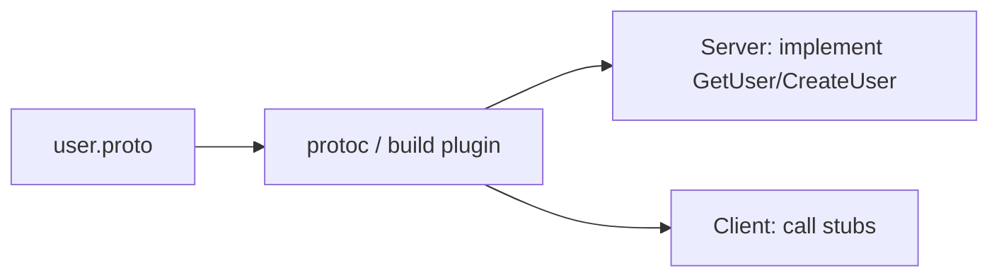

**Steps:**
1. Write a `.proto` with a `UserService` (GetUser, CreateUser, ListUsers).
2. Generate stubs in two languages ([[05 Spring Boot]]/Java + [[05 Node.js]]) — prove cross-language.
3. Implement the server; call from the generated client.
4. Add **metadata** (auth token) and a **deadline**.
5. Debug with **grpcurl** + server reflection.

**Learn:** Protobuf, codegen, unary RPC, metadata, deadlines, tooling.

---

### Project 2: Streaming + Interceptors (Intermediate→Senior)

**Goal:** Use all streaming types and add cross-cutting concerns.

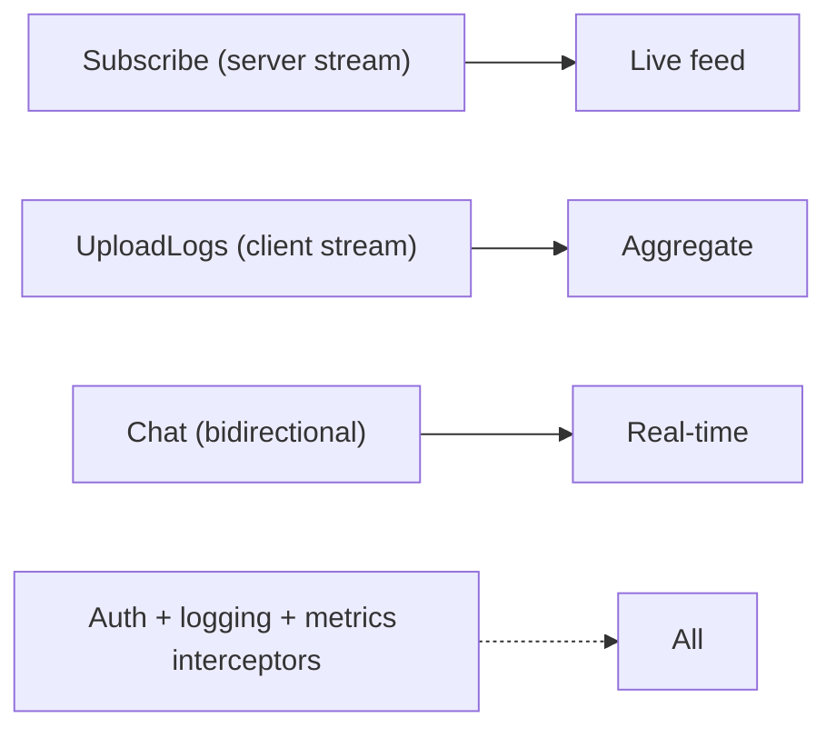

**Steps:**
1. Add server-streaming (live feed), client-streaming (log upload), bidirectional (chat).
2. Write **interceptors** for auth (validate token from metadata), logging, and metrics.
3. Implement proper **error handling** with gRPC status codes + retryable classification.
4. Configure a **retry policy** with backoff.
5. Compare bidirectional gRPC streaming with a [[05 WebSockets]] approach.

**Learn:** streaming, interceptors, error handling, retries, gRPC vs WebSockets.

---

### Project 3: gRPC Microservices Mesh + Edge Gateway (Senior)

**Goal:** Real architecture — gRPC internally, REST at the edge.

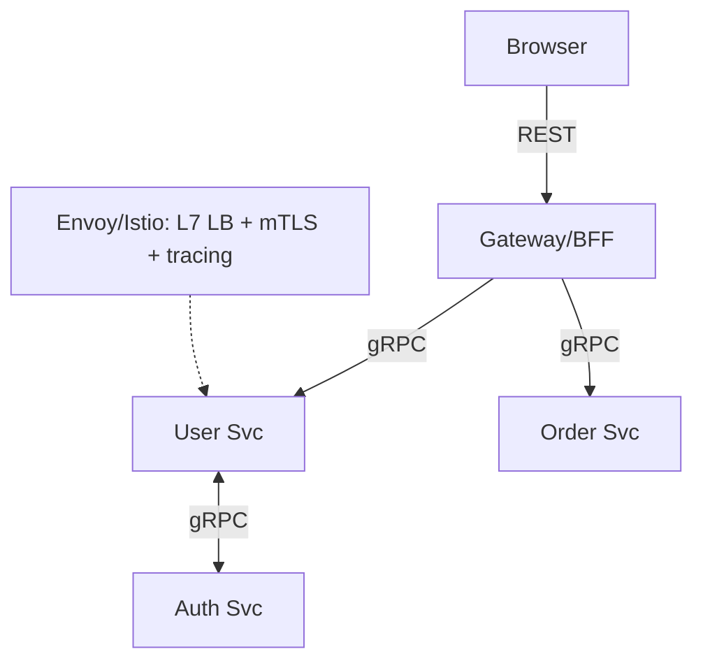

**Steps:**
1. Build 3 gRPC [[03 Microservices]] with a shared `.proto` registry (Buf).
2. Expose a [[02 REST API Design|REST]] edge gateway that calls them over gRPC.
3. Deploy to [[02 Kubernetes]] with a **service mesh** (Istio/Linkerd) for L7 LB + mTLS + tracing.
4. Practice **schema evolution**: add a field, deploy independently, verify compatibility.
5. Add **OpenTelemetry** distributed tracing across the gRPC calls.

**Learn:** edge-vs-internal pattern, service mesh, L7 LB, schema evolution, observability.

---

## 7. 🔬 DEEP DIVE: INTERNALS

### 7.1 Protobuf Wire Format

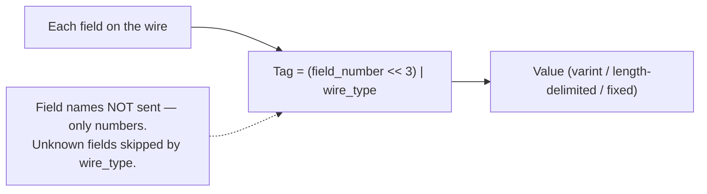

> [!IMPORTANT]
> On the wire, each Protobuf field is a **tag** (field number + wire type) followed by the value. **Field names are never transmitted** — only numbers — which is why it's compact and why renaming a field doesn't break the wire format (but reusing a number does). Integers use **varint** encoding (small numbers take fewer bytes). The **wire type** tells a decoder how to read the value and, crucially, how to **skip unknown fields** (forward compatibility). This elegant format is the foundation of both Protobuf's efficiency and its schema-evolution superpower.

### 7.2 How Streaming Maps to HTTP/2

```mermaid
flowchart LR
    Call["gRPC call"] --> Stream["= one HTTP/2 stream"]
    Stream --> Frames["Messages = HTTP/2 DATA frames"]
    Multi["Many calls = many streams, one TCP connection (multiplexed)"] -.-> Stream
```

> [!TIP]
> Each gRPC call maps to **one HTTP/2 stream**, and messages are carried as HTTP/2 **DATA frames**. Streaming RPCs simply keep the stream open, sending multiple frames. Because HTTP/2 **multiplexes** many streams over one TCP connection, thousands of concurrent gRPC calls share a single connection efficiently — no connection-per-call overhead. gRPC metadata maps to HTTP/2 **HEADERS frames**, and the trailing status is sent in **trailers**. Understanding this mapping demystifies gRPC: it's a well-designed convention *on top of* HTTP/2's primitives.

### 7.3 Channels & Connection Management

```mermaid
flowchart LR
    App --> Channel["Channel (manages 1+ HTTP/2 connections)"]
    Channel --> Subchannels["Subchannels to backends"]
    Channel --> LB["Client-side LB policy (round_robin, pick_first)"]
    Note["Reuse channels — creating them is expensive"] -.-> Channel
```

> [!TIP]
> A gRPC **channel** is a long-lived abstraction managing connections to a server (or set of backends), including client-side load-balancing policy and connection state (connecting/ready/failure). Like [[02 REST API Design|HTTP]] connections or [[02 RabbitMQ]] connections, **channels are expensive to create and meant to be reused** — create one per target and share it across calls (they're thread-safe). Creating a channel per call is a resource-wasting anti-pattern. Channels also handle **automatic reconnection** and health of subchannels transparently.

### 7.4 Code Generation Pipeline

```mermaid
flowchart LR
    Proto[".proto"] --> Protoc["protoc + language plugin"]
    Protoc --> Messages["Message classes (typed structs + serialization)"]
    Protoc --> Stubs["Service stubs (client) + base (server)"]
    Buf["Buf: lint, breaking-change detection, registry"] -.-> Proto
```

> [!IMPORTANT]
> The **code-generation step** is what makes gRPC "contract-first" real: `protoc` (with language plugins) reads the `.proto` and emits **typed message classes** (with built-in serialization) and **service stubs** (client) + **abstract base classes** (server to implement). Both sides are generated from the *same* contract, so mismatches are compile errors, not runtime surprises — the core reliability win over hand-written [[02 REST API Design|REST]] clients. Modern tooling like **Buf** adds linting, **breaking-change detection** (fails CI if you break the schema), and a schema **registry** — treating `.proto` files as governed, versioned API contracts across an organization.

### 7.5 gRPC vs Raw HTTP/2 vs Message Queues

```mermaid
flowchart TB
    Sync["Synchronous request-response"] --> gRPC["gRPC (fast RPC)"]
    Sync --> REST["REST (simple RPC)"]
    Async["Asynchronous, decoupled, durable"] --> MQ["Kafka / RabbitMQ"]
    Note["gRPC ≠ messaging — it's synchronous calls, not a queue"] -.-> gRPC
```

> [!IMPORTANT]
> A crucial architectural distinction: gRPC (like [[02 REST API Design|REST]]) is **synchronous request-response** — even streaming happens *within* a call while both sides are connected. It does **not** provide the **asynchronous decoupling, durability, buffering, and replay** of a message broker ([[01 Kafka]]/[[02 RabbitMQ]]). Use gRPC when a service needs an **answer now** from another service; use a message queue when you want **fire-and-forget, load-leveling, or event-driven** decoupling ([[01 System Design Fundamentals]]). Mature systems use **both**: gRPC for synchronous internal calls, [[01 Kafka]] for asynchronous event flows. Conflating them is a common design error.

---

## ✅ Production Checklists

### Contract & Schema
- [ ] `.proto` files version-controlled + linted (Buf)
- [ ] **Breaking-change detection** in CI
- [ ] Field numbers **never reused**; retired ones `reserved`
- [ ] Backward/forward-compatible evolution discipline
- [ ] Shared proto registry for multi-team

### Reliability
- [ ] **Deadlines** set on all calls (propagated)
- [ ] **Retry policies** with backoff; only retryable statuses
- [ ] Idempotency for retried mutations
- [ ] Proper **status codes** + structured error details
- [ ] Message size limits configured

### Performance & Ops
- [ ] **L7 load balancing** (client-side / Envoy / service mesh)
- [ ] **Channels reused** (not per-call)
- [ ] **Interceptors** for auth, logging, metrics, tracing
- [ ] **mTLS** between services (mesh or manual)
- [ ] Observability: **OpenTelemetry** tracing, metrics, grpcurl/reflection
- [ ] gRPC-Web proxy if browser clients needed

---

## 🗺️ Learning Roadmap

```mermaid
flowchart TB
    A["1️⃣ Basics<br/>RPC vs REST, Protobuf, .proto"] --> B["2️⃣ Codegen & unary<br/>protoc, stubs, first service"]
    B --> C["3️⃣ Streaming<br/>server/client/bidirectional"]
    C --> D["4️⃣ Cross-cutting<br/>metadata, deadlines, interceptors, errors"]
    D --> E["5️⃣ Schema evolution<br/>field numbers, reserved, compatibility"]
    E --> F["6️⃣ Scaling<br/>load balancing, mesh, gRPC-Web"]
    F --> G["7️⃣ Design<br/>gRPC internal + REST/GraphQL edge"]
    G --> H["8️⃣ Internals<br/>wire format, HTTP/2 mapping, channels"]
```

| Stage | Focus | You can... |
|---|---|---|
| 1–2 | Basics + unary | Build a contract-first service |
| 3–4 | Streaming + concerns | Use streaming, add auth/tracing |
| 5–6 | Evolution + scaling | Evolve schemas, load-balance at scale |
| 7–8 | Design + internals | Architect gRPC+REST systems; reason deeply |

---

## 🔁 Self-Review Completion Loop

Reviewed against official gRPC/Protobuf documentation, best practices, interview questions, and production usage.

### Gap Review Matrix

| Dimension | Covered? | Where |
|---|---|---|
| What/why, RPC concept | ✅ | §1 |
| RPC vs REST paradigm | ✅ | §1, §4.4 |
| Protocol Buffers + field numbers | ✅ | §2.1, §7.1 |
| Four RPC/streaming types | ✅ | §2.2 |
| Protobuf efficiency | ✅ | §2.3 |
| HTTP/2 transport | ✅ | §2.4, §7.2 |
| Basic flow | ✅ | §2.5 |
| Metadata/deadlines/status codes | ✅ | §2.6 |
| Schema evolution | ✅ | §3.1, §7.4 |
| Interceptors | ✅ | §3.2 |
| Error handling & retries | ✅ | §3.3 |
| Load balancing challenge | ✅ | §3.4 |
| gRPC-Web (browser) | ✅ | §3.5 |
| Failure scenarios | ✅ | §3.6 |
| Observability/tooling | ✅ | §3.7 |
| Edge vs internal pattern | ✅ | §4.1 |
| Service mesh | ✅ | §4.3 |
| gRPC vs REST vs GraphQL | ✅ | §4.4 |
| Wire format | ✅ | §7.1 |
| Channels | ✅ | §7.3 |
| Codegen pipeline | ✅ | §7.4 |
| vs message queues | ✅ | §7.5 |
| Interview Q&A + mistakes | ✅ | §5 |
| Hands-on projects | ✅ | §6 |

> [!NOTE]
> **Remaining depth to explore independently:** Protobuf advanced types (oneof, maps, Any, well-known types), gRPC health checking & reflection protocols, xDS (Envoy's dynamic config, gRPC's newer LB), Connect (Buf's gRPC-compatible protocol with better browser support), Protobuf editions, flatbuffers/Cap'n Proto alternatives, and deep HTTP/2 flow control.

---

## 📚 Official References

| Resource | URL |
|---|---|
| gRPC Documentation | https://grpc.io/docs/ |
| Protocol Buffers | https://protobuf.dev/ |
| gRPC Core Concepts | https://grpc.io/docs/what-is-grpc/core-concepts/ |
| Language guides | https://grpc.io/docs/languages/ |
| gRPC-Web | https://github.com/grpc/grpc-web |
| Buf (modern Protobuf tooling) | https://buf.build/ |
| Google API Design (gRPC) | https://cloud.google.com/apis/design |
| grpcurl | https://github.com/fullstorydev/grpcurl |

---

## 🎁 Final Summary

> [!IMPORTANT]
> **The one-paragraph takeaway:** gRPC is a **contract-first, high-performance RPC framework** built on two pillars — **Protocol Buffers** (compact binary serialization + a strict `.proto` contract from which typed cross-language client/server code is generated) and **HTTP/2** (multiplexing, header compression, and native **streaming** in four flavors: unary, server-, client-, and bidirectional). It lets you **call remote methods like local functions** with strong typing, and is ideal for **internal [[03 Microservices]] communication** where performance, contracts, and streaming matter. Its costs: **not browser-native** (needs gRPC-Web + a proxy), **not human-readable** (harder to debug — use grpcurl/reflection), and **tricky to load-balance** (single HTTP/2 connection → needs L7/client-side LB or a **service mesh**). Follow schema-evolution discipline (**never reuse field numbers**; use `reserved`), set **deadlines**, use **interceptors** for cross-cutting concerns, and distinguish retryable errors. The winning architecture: **[[02 REST API Design|REST]]/[[03 GraphQL]] at the edge, gRPC internally** — and remember gRPC is **synchronous RPC**, not a replacement for asynchronous message brokers ([[01 Kafka]]/[[02 RabbitMQ]]).

**Golden rules:**
1. 📜 **Contract-first** — the `.proto` is the single source of truth; code is generated.
2. ⚡ Fast because of **Protobuf (binary) + HTTP/2 (multiplexing/streaming)**.
3. 🔢 **Never reuse field numbers**; use `reserved` — protects schema evolution.
4. 🌊 Use **streaming** (4 types) where interactions are continuous.
5. ⏱️ Always set **deadlines** (they propagate down the call chain).
6. ⚖️ Load-balance at **L7** (client-side/Envoy/service mesh), not L4.
7. 🌐 **Not browser-native** — gRPC-Web proxy, or REST/GraphQL at the edge.
8. 🏗️ Pattern: **REST/GraphQL edge + gRPC internal**; mesh for LB/mTLS/tracing.
9. 🔀 gRPC is **synchronous RPC** — not a message queue ([[01 Kafka]]/[[02 RabbitMQ]]).

---

*Related guides in this vault: [[02 REST API Design]] · [[03 Microservices]] · [[01 System Design Fundamentals]] · [[05 Spring Boot]] · [[05 Node.js]] · [[02 Kubernetes]] · [[05 WebSockets]] · [[03 GraphQL]] · [[01 Kafka]] · [[02 RabbitMQ]] · [[06 API Gateway]]*
