# 🔌 WebSockets — Complete Beginner-to-Expert Reference

> Full-duplex, real-time communication over a single persistent connection — the technology behind chat, live dashboards, multiplayer games, and collaborative apps.

---

## 📑 Table of Contents

1. [Executive Summary](#-executive-summary)
2. [Fundamentals (Beginner)](#1--fundamentals-beginner-level)
3. [Core Concepts (Intermediate)](#2--core-concepts-intermediate-level)
4. [Advanced Concepts (Senior)](#3--advanced-concepts-senior-level)
5. [Real-World System Design](#4--real-world-system-design-usage)
6. [Interview Preparation](#5--interview-preparation)
7. [Hands-On Projects](#6--hands-on-projects)
8. [Deep Dive: Internals](#7--deep-dive-internals)
9. [Production Checklists](#-production-checklists)
10. [Learning Roadmap](#-learning-roadmap)
11. [Self-Review Completion Loop](#-self-review-completion-loop)
12. [Official References](#-official-references)
13. [Final Summary](#-final-summary)

---

## 🎯 Executive Summary

**WebSockets** provide a **full-duplex, bidirectional** communication channel over a single, long-lived TCP connection between client and server. Unlike [[02 REST API Design|HTTP request-response]], where the client must ask for everything, WebSockets let the **server push data to the client instantly** — enabling true real-time apps.

| What it is | What it replaces | Core superpower |
|---|---|---|
| Persistent full-duplex TCP channel | HTTP polling, long-polling hacks | **Instant bidirectional push** with low overhead per message |

> [!IMPORTANT]
> The defining trait: WebSockets start as a normal HTTP request that **"upgrades"** into a persistent, two-way pipe. After the handshake, **either side can send a message at any time** without a new request — the "server can't initiate" limitation of HTTP is gone. This is what makes chat, live scores, collaborative editing, and multiplayer games feel instant. But persistence changes everything about scaling ([[01 System Design Fundamentals]]): connections are **stateful and long-lived**, which breaks the "any server handles any request" assumption of stateless [[02 REST API Design|REST]].

Related guides: [[02 REST API Design]] · [[05 Node.js]] · [[06 Express.js]] · [[01 System Design Fundamentals]] · [[04 Redis]] · [[12 Spring WebFlux]] · [[05 Nginx]] · [[01 Kafka]]

---

## 1. 🌱 FUNDAMENTALS (Beginner Level)

### What are WebSockets in simple terms?

Normal web communication ([[02 REST API Design|HTTP]]) is like **sending letters**: the client asks a question, the server answers, and the conversation ends. To know if anything changed, the client must keep asking ("any new messages? any new messages?"). **WebSockets are like a phone call**: once connected, both sides can talk freely and instantly, anytime, until someone hangs up.

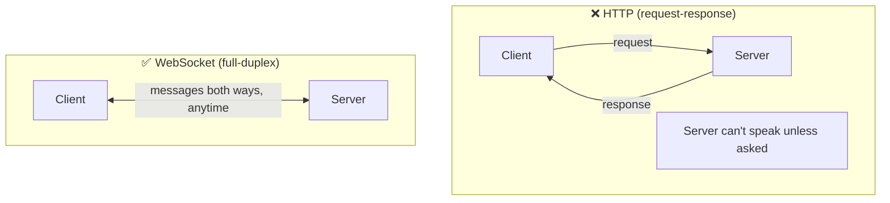

### Why do WebSockets exist?

Before WebSockets, achieving "real-time" meant **hacks** on top of request-response HTTP:

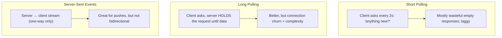

WebSockets (standardized 2011, RFC 6455) solve this properly: **one persistent connection, both directions, minimal overhead**.

### The evolution of real-time techniques

| Technique | Direction | How | Downside |
|---|---|---|---|
| **Short polling** | Client asks repeatedly | Request every N seconds | Wasteful, laggy |
| **Long polling** | Client asks, server holds | Hold request until data/timeout | Connection churn, complexity |
| **SSE (Server-Sent Events)** | Server → client only | HTTP stream (`text/event-stream`) | One-way; text only |
| **WebSockets** | Both directions | Persistent upgraded TCP | Stateful, scaling complexity |
| **WebTransport (emerging)** | Both, over HTTP/3 | QUIC-based | New, less support |

### Problems WebSockets solve

| Problem | How WebSockets solve it |
|---|---|
| **Server can't push to client** | Server sends anytime over the open connection |
| **Polling wastes bandwidth/latency** | No repeated requests; instant delivery |
| **HTTP header overhead per message** | Tiny frame overhead after handshake |
| **Real-time bidirectional needs** | True full-duplex (chat, games) |
| **High-frequency updates** | Efficient continuous streaming |

### Core vocabulary

| Term | Plain meaning |
|---|---|
| **Handshake** | Initial HTTP request that upgrades to WebSocket |
| **Upgrade** | Switching the protocol from HTTP to WS |
| **Frame** | The unit of WebSocket data |
| **Full-duplex** | Both sides can send simultaneously |
| **ws:// / wss://** | WebSocket URL schemes (wss = TLS/secure) |
| **Ping/Pong** | Keep-alive heartbeat frames |
| **Close frame** | Graceful connection termination |
| **Message** | Application data (text or binary) |

### Real-world analogy ☎️

- **HTTP** is like **texting a store**: "Do you have this in stock?" → they reply → conversation over. To get updates you keep texting.
- **WebSocket** is like a **walkie-talkie channel** you keep open: once you tune in, either party can talk instantly whenever they have something to say, no re-dialing. You hear news the moment it happens.
- The **handshake** is dialing in and confirming the channel; **ping/pong** is periodically saying "you still there?"; the **close frame** is signing off.

> [!TIP]
> The mental model: **WebSockets trade HTTP's simple, stateless, "ask-and-answer" model for a persistent "always-on channel" — gaining instant bidirectional push, but taking on the burden of managing long-lived, stateful connections.** Use them when the *server needs to push* or you need *low-latency two-way* comms. For everything else, [[02 REST API Design|REST]] is simpler and better.

---

## 2. 🧩 CORE CONCEPTS (Intermediate Level)

### 2.1 The Handshake (HTTP → WebSocket Upgrade)

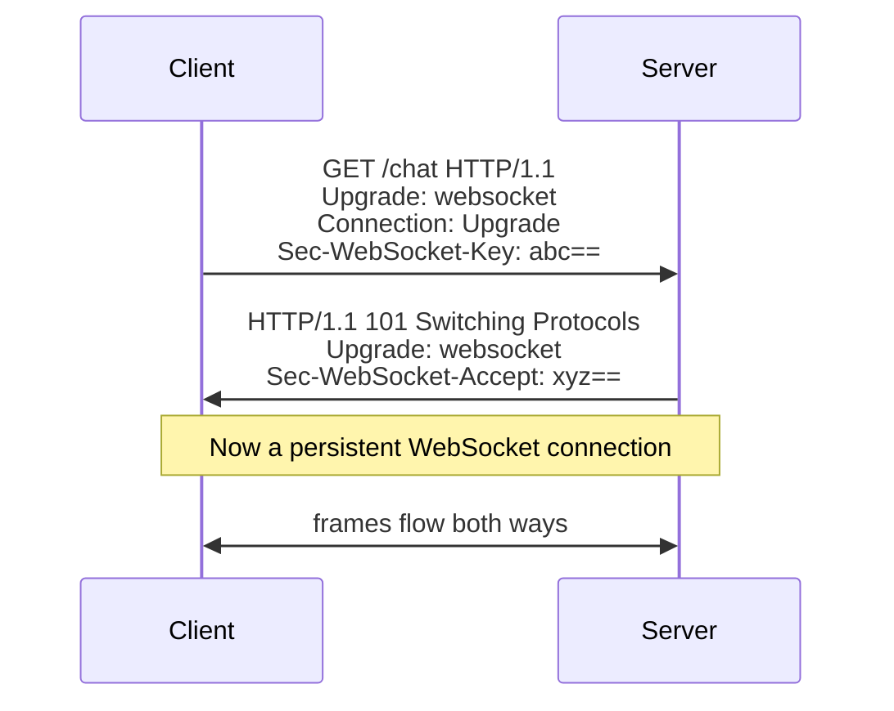

- The client sends a normal **HTTP GET** with `Upgrade: websocket` headers.
- The server responds **`101 Switching Protocols`** — the same TCP connection is now a WebSocket.
- The `Sec-WebSocket-Key`/`Accept` exchange proves both sides speak the protocol (not a security mechanism — just a handshake validation).

> [!IMPORTANT]
> WebSockets **start as HTTP** — this is deliberate and clever. Because the handshake is a standard HTTP request on port 80/443, it passes through existing web infrastructure (firewalls, proxies, load balancers) that already allow HTTP. After the `101` upgrade, the connection **stays open** and switches to the WebSocket framing protocol. This "HTTP-compatible bootstrap, then persistent channel" design is why WebSockets work across the real internet — and why `wss://` (over TLS/443) is essential for getting through corporate proxies cleanly.

### 2.2 The Connection Lifecycle

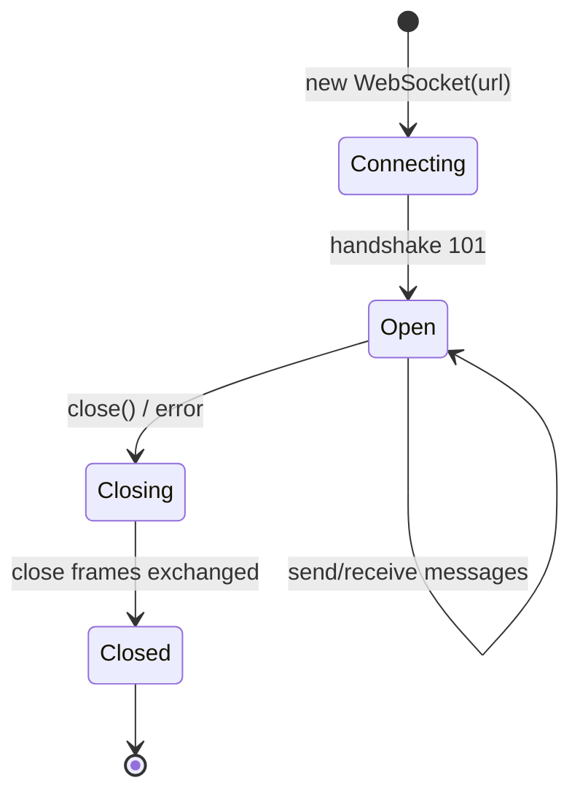

**Client-side (browser) API:**

```javascript
const ws = new WebSocket("wss://example.com/chat");

ws.onopen    = ()  => ws.send(JSON.stringify({ type: "join", room: "general" }));
ws.onmessage = (e) => console.log("received:", e.data);
ws.onclose   = (e) => console.log("closed:", e.code, e.reason);
ws.onerror   = (e) => console.error("error:", e);

ws.send("hello");   // send anytime while open
ws.close(1000, "done");
```

**Server-side ([[05 Node.js]] with `ws`):**

```javascript
import { WebSocketServer } from "ws";
const wss = new WebSocketServer({ port: 8080 });

wss.on("connection", (socket, req) => {
  socket.on("message", (data) => {
    // broadcast to all connected clients
    wss.clients.forEach((c) => c.readyState === 1 && c.send(data));
  });
  socket.on("close", () => console.log("client left"));
});
```

### 2.3 Frames & Message Types

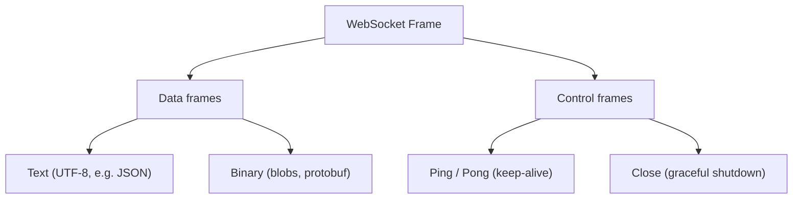

| Frame type | Purpose |
|---|---|
| **Text** | UTF-8 data (usually JSON) |
| **Binary** | Raw bytes (images, protobuf, audio) |
| **Ping/Pong** | Heartbeat / keep-alive |
| **Close** | Graceful termination (with code + reason) |

WebSockets are **message-oriented** (not stream-oriented like raw TCP) — you send discrete messages, and the protocol handles framing. Large messages can be split into multiple frames and reassembled.

### 2.4 Ping/Pong & Keep-Alive

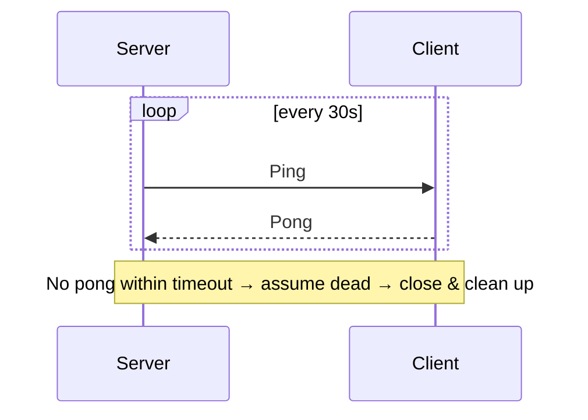

> [!WARNING]
> **Idle WebSocket connections silently die** — proxies, load balancers ([[05 Nginx]]), and NAT gateways drop connections they think are inactive (often after 30–60s). Without **ping/pong heartbeats**, you get "zombie" connections: the server thinks a client is connected, but messages vanish into a dead pipe. Implement heartbeats (server pings, expects pongs; terminate on timeout) to detect dead connections and free resources. This is one of the most common real-world WebSocket bugs — connections that "work in dev" but drop in production behind a proxy.

### 2.5 Message Protocol Design

Since WebSockets just move bytes, **you design the message protocol** (usually JSON with a `type` field):

```json
// Client → Server
{ "type": "chat.message", "room": "general", "text": "hello" }

// Server → Client
{ "type": "chat.message", "room": "general", "user": "alice", "text": "hi", "ts": 1720000000 }
{ "type": "presence.update", "room": "general", "online": ["alice", "bob"] }
{ "type": "error", "code": "rate_limited", "detail": "slow down" }
```

> [!TIP]
> **Design a clear message envelope** with a `type` (or `event`) field for routing — this is your application-level protocol. Consider: versioning the protocol, correlation IDs for request-response-style flows over WS, and separating channels/rooms. For structured, high-throughput data, **binary formats (Protobuf/MessagePack)** beat JSON. Libraries like **Socket.IO** add rooms, acknowledgments, auto-reconnection, and fallbacks on top of raw WebSockets — convenient but a heavier, non-standard protocol (Socket.IO client can't talk to a raw WebSocket server).

### 2.6 WebSockets vs SSE vs Polling — When to Use What

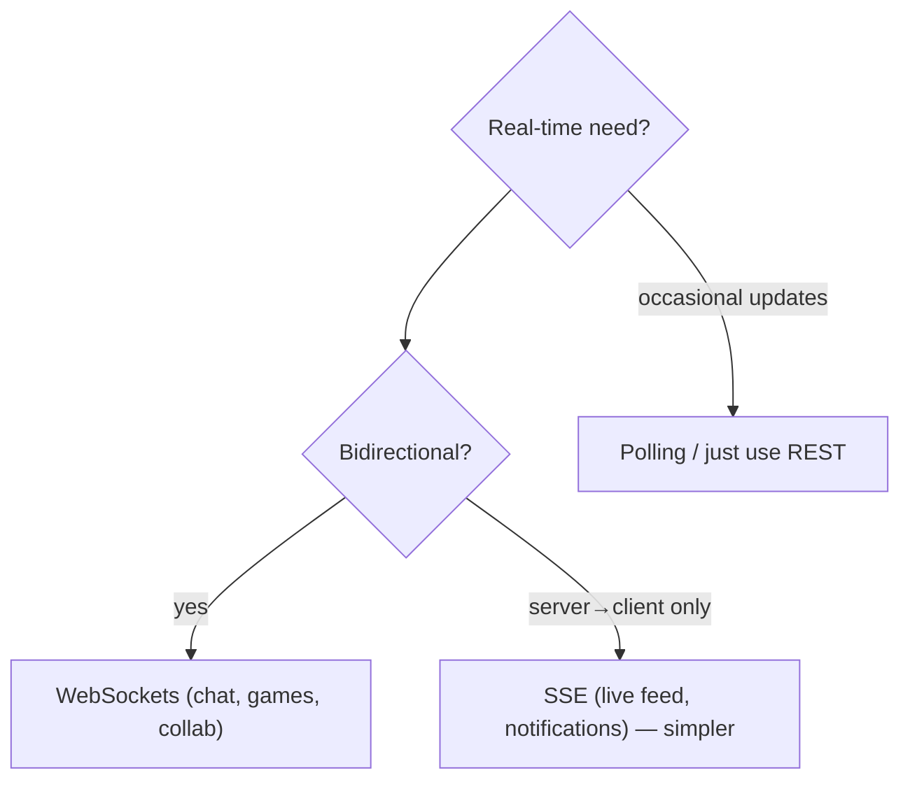

> [!TIP]
> **Don't reach for WebSockets by default** — they add real complexity. If you only need **server→client** push (live notifications, a stock ticker, progress updates), **Server-Sent Events (SSE)** are simpler: they're plain HTTP, auto-reconnect, work through proxies easily, and need no special server. Use **WebSockets** only when you genuinely need **bidirectional, low-latency** communication (chat, multiplayer, collaborative editing, live cursors). For infrequent updates, plain [[02 REST API Design|REST]] polling is fine. Match the tool to the actual interaction pattern.

---

## 3. ⚙️ ADVANCED CONCEPTS (Senior Level)

### 3.1 The Scaling Challenge: Stateful Connections

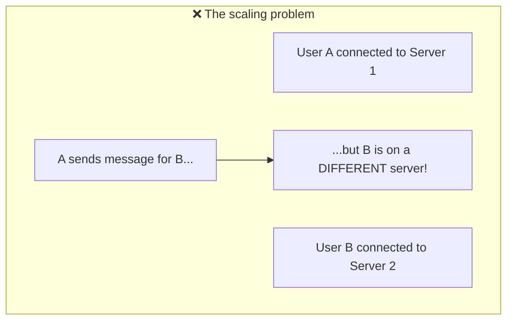

> [!IMPORTANT]
> This is *the* WebSocket scaling problem. [[02 REST API Design|REST]] is stateless — any server handles any request. But WebSocket connections are **stateful and pinned**: User A is connected to Server 1, User B to Server 2. When A sends a message for B, Server 1 doesn't have B's connection. With N servers, broadcasting to all users requires servers to **coordinate**. This breaks the simple horizontal scaling of [[01 System Design Fundamentals]] — you can't just add stateless replicas behind a load balancer.

### 3.2 The Solution: Pub/Sub Backplane

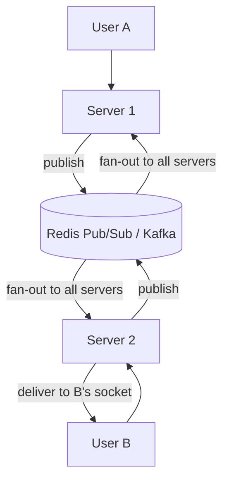

> [!IMPORTANT]
> The standard solution is a **pub/sub backplane** ([[04 Redis]] Pub/Sub, [[01 Kafka]], or NATS): when Server 1 receives a message, it **publishes** it to the backplane; **all** servers subscribe and each delivers to the relevant locally-connected clients. Now servers don't need to know where each user is connected — the backplane fans out messages to everyone. This is how Socket.IO's Redis adapter, Phoenix Channels, and every scaled chat system work. The connection stays stateful per-server, but message *routing* becomes shared state via the backplane.

### 3.3 Load Balancing WebSockets

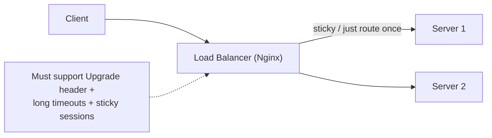

> [!WARNING]
> Load balancers need special configuration for WebSockets. They must: (1) **forward the `Upgrade`/`Connection` headers** so the handshake succeeds ([[05 Nginx]] `proxy_set_header Upgrade $http_upgrade`); (2) use **long timeouts** (the connection is meant to stay open — default HTTP timeouts kill it); and (3) since a connection is pinned to one server, **sticky sessions** or L4 (TCP) balancing help. A misconfigured proxy is the #1 reason "WebSockets work locally but fail in production" — the upgrade gets stripped or the connection times out.

### 3.4 Authentication & Security

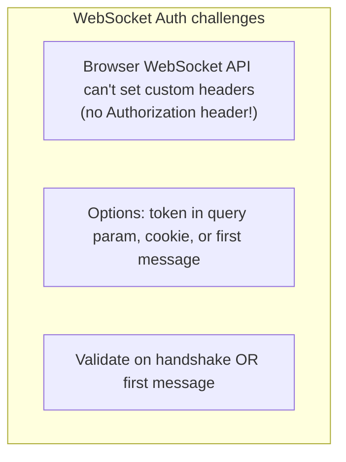

| Approach | How | Caveat |
|---|---|---|
| **Token in query** | `wss://x/chat?token=jwt` | Token in URL/logs — use short-lived tokens |
| **Cookie** | Browser sends cookies on handshake | CSRF concerns; same-site |
| **First message auth** | Connect, then send auth message | Connection open before auth |
| **Ticket/handshake auth** | Get a one-time ticket via REST, use it to connect | More secure, more steps |

> [!WARNING]
> The browser **`WebSocket` API cannot set custom headers** — so you can't send `Authorization: Bearer <jwt>` on the handshake like a normal API call. Common workarounds: pass a **short-lived token as a query parameter** (accept that it may be logged — keep it short-lived), rely on **cookies** (watch CSRF), or **authenticate via the first message** after connecting. Also validate **Origin** (WebSockets aren't subject to CORS the same way — this is a real vector for **Cross-Site WebSocket Hijacking**), always use **`wss://` (TLS)**, and **rate-limit messages** per connection to prevent abuse.

### 3.5 Reconnection & Reliability

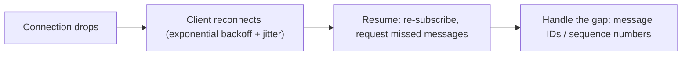

> [!WARNING]
> **WebSocket connections WILL drop** (network changes, wifi→cellular, proxy timeouts, server restarts). Robust clients need **automatic reconnection with exponential backoff + jitter** ([[01 System Design Fundamentals]]) — not a tight reconnect loop that stampedes your servers when they restart. Critically: **WebSockets guarantee ordered delivery but NOT delivery during a disconnect** — messages sent while a client is disconnected are lost unless you design for it. For guaranteed delivery, add **message sequence numbers / IDs** so a reconnecting client can request what it missed (often backed by a [[04 Redis]]/[[01 Kafka]] log). Don't assume the pipe is reliable.

### 3.6 Backpressure & Resource Management

> [!TIP]
> A fast server can overwhelm a slow client: if you push messages faster than the client consumes them, they buffer in the server's send queue, **consuming memory** until the server OOMs ([[05 Node.js]] `bufferedAmount` grows). Monitor the outbound buffer per connection and apply **backpressure** — slow down, drop non-critical messages (e.g., only send the latest price for a ticker), or disconnect abusive clients. Also, each connection holds a file descriptor and memory; **tens of thousands of connections per server** require OS tuning (file descriptor limits) and an event-driven server ([[05 Node.js]]/[[12 Spring WebFlux]]/Go), not thread-per-connection.

### 3.7 Failure Scenarios & Production Issues

| Failure | Symptom | Mitigation |
|---|---|---|
| **Proxy strips Upgrade** | Handshake fails in prod | Configure LB/[[05 Nginx]] for WS |
| **Idle connection dropped** | Silent message loss | Ping/pong heartbeats |
| **Zombie connections** | Memory leak, ghost users | Heartbeat timeout → close |
| **Cross-server messaging fails** | Users on different servers can't reach each other | Pub/sub backplane |
| **Message loss on reconnect** | Missed updates | Sequence IDs + replay |
| **Slow client OOM** | Server memory grows | Backpressure, buffer limits |
| **Reconnect storm** | Servers overwhelmed on restart | Backoff + jitter |
| **Auth bypass / hijacking** | Unauthorized access | Validate Origin, wss, token auth |
| **Too many connections** | FD exhaustion | Raise ulimits; event-driven server; scale out |

---

## 4. 🏗️ REAL-WORLD SYSTEM DESIGN USAGE

### 4.1 A Scalable Real-Time Architecture

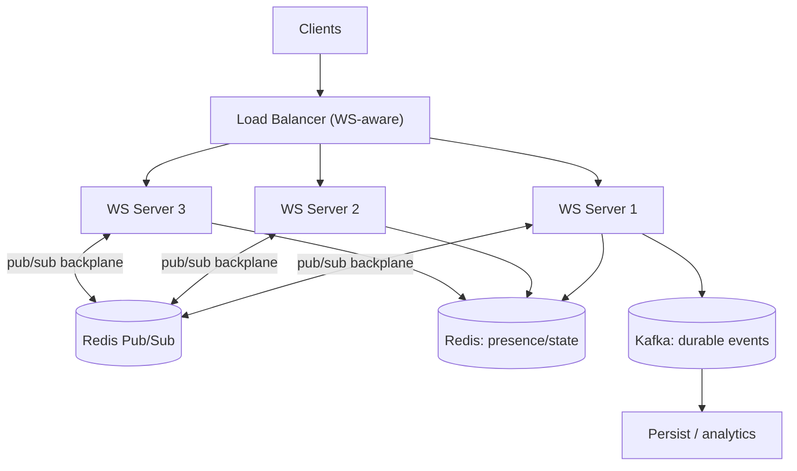

The pattern: WS-aware load balancer → stateless-ish WS servers (they hold connections but no unique app state) → **[[04 Redis]] pub/sub** for cross-server messaging → **[[04 Redis]]** for presence/online state → **[[01 Kafka]]** for durable event history and downstream processing.

### 4.2 Common Use Cases

| Use case | Why WebSockets |
|---|---|
| **Chat / messaging** | Instant bidirectional delivery |
| **Live dashboards / tickers** | Continuous server push |
| **Collaborative editing** (Docs, Figma) | Low-latency two-way sync + presence |
| **Multiplayer games** | Fast, frequent bidirectional state |
| **Live notifications** | Server-initiated push (or SSE) |
| **Trading platforms** | Real-time price streams + orders |
| **IoT / telemetry** | Continuous device streams |
| **Live sports / auctions** | Real-time updates to many viewers |

### 4.3 How companies use WebSockets

| Company | Usage |
|---|---|
| **Slack/Discord** | Real-time messaging + presence |
| **Figma** | Multiplayer design collaboration (custom binary protocol) |
| **Google Docs** | Collaborative editing (operational transforms over WS-like transport) |
| **Trading platforms** | Live market data feeds |
| **Twitch/live sports** | Chat + live event updates |

### 4.4 WebSockets vs Alternatives (recap)

| Tech | Best for | vs WebSockets |
|---|---|---|
| **[[02 REST API Design]]** | CRUD, request-response | Stateless, simple, cacheable; no server push |
| **SSE** | Server→client streams | Simpler, HTTP-native; one-way only |
| **[[04 gRPC]] streaming** | Service-to-service streams | Great internally; not browser-native (needs proxy) |
| **WebTransport** | Modern low-latency (HTTP/3) | Emerging; unreliable+reliable streams over QUIC |
| **MQTT** | IoT pub/sub | Lightweight; often *over* WebSockets in browsers |

> [!TIP]
> A useful framing: **[[02 REST API Design|REST]]/SSE and WebSockets are complementary, not competitors.** Most real apps use REST for standard CRUD and auth, and add WebSockets *only* for the specifically real-time, bidirectional parts. Don't rebuild your whole API on WebSockets — you'd lose caching, statelessness, and simplicity. Layer WebSockets in surgically where the interaction genuinely needs instant two-way communication.

---

## 5. 🎤 INTERVIEW PREPARATION

### 5.1 Most important questions

<details>
<summary><b>Q1: What are WebSockets and how do they differ from HTTP?</b></summary>

WebSockets provide a **persistent, full-duplex** connection over a single TCP socket, letting client and server send messages to each other **anytime** with low overhead. HTTP is **request-response** (stateless, client must initiate; server can't push). WebSockets start as an HTTP request that **upgrades** (101 Switching Protocols) into a persistent bidirectional channel.
</details>

<details>
<summary><b>Q2: Explain the WebSocket handshake.</b></summary>

The client sends an HTTP GET with `Upgrade: websocket`, `Connection: Upgrade`, and a `Sec-WebSocket-Key`. The server responds `101 Switching Protocols` with a `Sec-WebSocket-Accept` (derived from the key). The same TCP connection then switches to the WebSocket framing protocol. Starting as HTTP lets it traverse existing web infrastructure.
</details>

<details>
<summary><b>Q3: WebSockets vs long polling vs SSE?</b></summary>

**Long polling**: client requests, server holds until data — real-time-ish but with connection churn. **SSE**: server→client stream over HTTP, one-way, auto-reconnect, simple. **WebSockets**: full bidirectional, low overhead, but stateful and more complex. Use SSE for server-push-only, WebSockets for bidirectional, polling for infrequent updates.
</details>

<details>
<summary><b>Q4: How do you scale WebSockets across multiple servers?</b></summary>

Connections are stateful/pinned, so users on different servers can't directly reach each other. Use a **pub/sub backplane** ([[04 Redis]] Pub/Sub, [[01 Kafka]], NATS): each server publishes messages to the backplane and subscribes to deliver to its local clients. Add a **WS-aware load balancer** (forwards Upgrade, long timeouts, sticky sessions) and [[04 Redis]] for presence/state.
</details>

<details>
<summary><b>Q5: How do you handle authentication?</b></summary>

The browser WebSocket API can't set custom headers, so no `Authorization` header on handshake. Options: **short-lived token in query param**, **cookies** (watch CSRF), a **one-time ticket** obtained via REST, or **authenticate via the first message**. Always validate **Origin** (prevent cross-site hijacking) and use **wss://** (TLS).
</details>

<details>
<summary><b>Q6: How do you keep connections alive and detect dead ones?</b></summary>

**Ping/pong heartbeats**: the server periodically sends a ping and expects a pong; if none arrives within a timeout, the connection is considered dead and closed. This detects zombie connections (dropped by proxies/NAT without a close frame) and prevents resource leaks. Also needed because idle connections get killed by intermediaries.
</details>

<details>
<summary><b>Q7: Do WebSockets guarantee message delivery?</b></summary>

They guarantee **ordered delivery** over an open connection (built on TCP), but **not delivery across disconnects** — messages sent while a client is disconnected are lost. For reliability, add **message sequence numbers/IDs** and a replay mechanism (backed by [[04 Redis]]/[[01 Kafka]]) so reconnecting clients can fetch what they missed.
</details>

<details>
<summary><b>Q8: When should you NOT use WebSockets?</b></summary>

When you don't need bidirectional real-time: for CRUD use [[02 REST API Design|REST]]; for server-push-only use **SSE** (simpler). WebSockets add statefulness, scaling complexity (backplane), reconnection handling, and proxy config. Don't rebuild a whole API on WebSockets — layer them in only for genuinely real-time, two-way features.
</details>

### 5.2 Tricky questions

> [!TIP]
> **"Are WebSockets subject to CORS?"** — Not in the same way as HTTP requests; the browser doesn't enforce the CORS preflight for WS. This is why you **must validate the `Origin` header server-side** — otherwise a malicious site can open a WebSocket to your server using the victim's cookies (**Cross-Site WebSocket Hijacking**).

> [!TIP]
> **"Is a WebSocket the same as raw TCP?"** — No. It runs *over* TCP but adds a **message framing** protocol (discrete messages, not a raw byte stream), a handshake, control frames (ping/close), and browser accessibility. You get message boundaries for free, unlike raw TCP.

> [!TIP]
> **"Why does my WebSocket work locally but drop in production?"** — Almost always a **proxy/load balancer** not configured for WebSockets: it strips the `Upgrade` header or applies a short idle timeout that kills the persistent connection. Configure [[05 Nginx]]/the LB for WS (forward upgrade headers, long timeouts).

> [!TIP]
> **"HTTP/2 has server push — do we still need WebSockets?"** — HTTP/2 server push (now largely deprecated) was for pushing *resources*, not app messages, and isn't bidirectional app-level messaging. WebSockets (and emerging WebTransport over HTTP/3) remain the answer for true bidirectional real-time.

### 5.3 Common mistakes candidates make

| Mistake | Reality |
|---|---|
| "WebSockets replace REST" | Complementary — use REST for CRUD |
| No heartbeats | Zombie connections, silent drops |
| Ignoring multi-server scaling | Need a pub/sub backplane |
| Assuming guaranteed delivery | Not across disconnects — add replay |
| No reconnection logic | Connections will drop |
| `Authorization` header on handshake | Browser can't set it — use query/cookie/first-msg |
| Not validating Origin | Cross-site hijacking risk |
| No proxy/LB config | Fails in production |

### 5.4 What interviewers actually expect

- The **handshake/upgrade** mechanism and full-duplex model.
- **WebSockets vs polling vs SSE** and *when* to use each.
- The **stateful scaling problem** and the **pub/sub backplane** solution.
- **Heartbeats, reconnection, delivery guarantees, backpressure**.
- **Auth/security** specifics (no headers, Origin validation, wss).
- **Proxy/LB** configuration awareness.

---

## 6. 🛠️ HANDS-ON PROJECTS

### Project 1: Real-Time Chat App (Beginner→Intermediate)

**Goal:** Multi-room chat with presence over WebSockets.

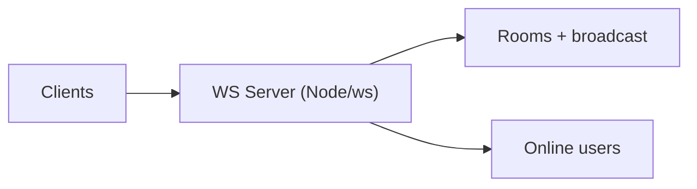

**Steps:**
1. Build a [[05 Node.js]] `ws` server; connect from a browser client.
2. Design a JSON message protocol (`join`, `message`, `leave`, `presence`).
3. Implement rooms + broadcast to room members.
4. Add **ping/pong heartbeats** and clean up dead connections.
5. Add client **auto-reconnection** with backoff.

**Learn:** handshake, message protocol, broadcast, heartbeats, reconnection.

---

### Project 2: Scalable Chat with Redis Backplane (Intermediate→Senior)

**Goal:** Make it work across multiple server instances.

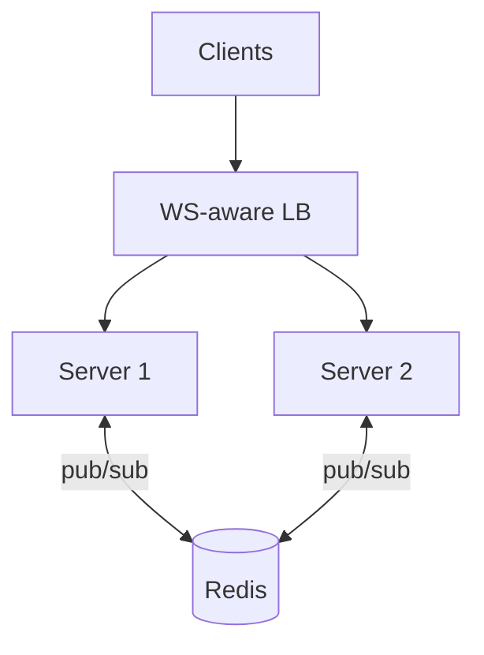

**Steps:**
1. Run 2+ WS server instances behind an [[05 Nginx]] WS-configured load balancer.
2. Add a **[[04 Redis]] Pub/Sub backplane** so messages reach clients on any server.
3. Store **presence** in [[04 Redis]] (who's online, in which room).
4. Test cross-server messaging (users on different instances).
5. Handle a server restart → clients reconnect + resume.

**Learn:** stateful scaling, pub/sub backplane, presence, LB config.

---

### Project 3: Collaborative / Live Feature with Delivery Guarantees (Senior)

**Goal:** Reliable real-time with reconnection replay.

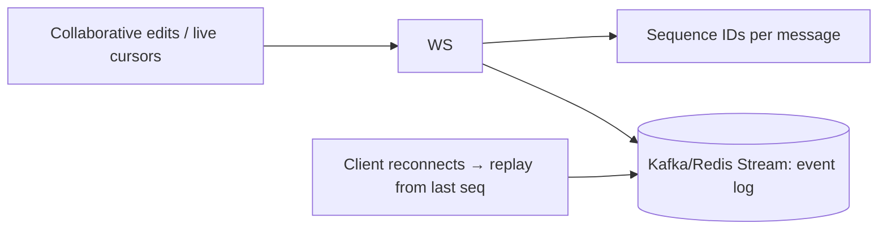

**Steps:**
1. Build a collaborative feature (shared cursor / live doc / live dashboard).
2. Assign **sequence numbers** to messages; store an event log ([[04 Redis]] Streams/[[01 Kafka]]).
3. On reconnect, client sends its last-seen sequence → server **replays** missed events.
4. Add **backpressure** handling for slow clients.
5. Secure with **Origin validation** + short-lived token auth over **wss**.

**Learn:** delivery guarantees, replay, event logs, backpressure, WS security.

---

## 7. 🔬 DEEP DIVE: INTERNALS

### 7.1 The Frame Format

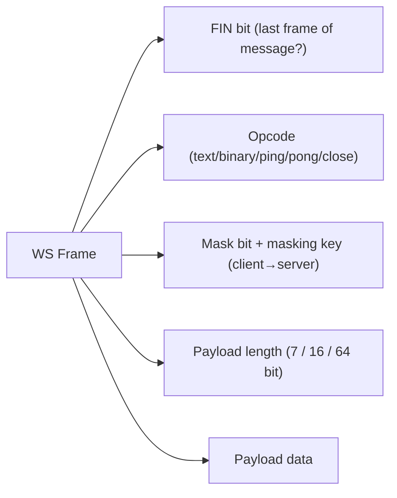

> [!IMPORTANT]
> WebSocket frames are **compact and binary** — a few bytes of header (opcode, length, mask) versus HTTP's hundreds of bytes of headers *per request*. This tiny per-message overhead is why WebSockets crush polling for high-frequency updates. A subtle detail: **client→server frames must be masked** (XOR'd with a random key) — a security measure to prevent cache-poisoning attacks against proxies that might misinterpret WebSocket traffic as HTTP. Server→client frames are not masked. Understanding framing explains WebSockets' efficiency and some of their quirks.

### 7.2 Built on TCP — Ordering and Head-of-Line Blocking

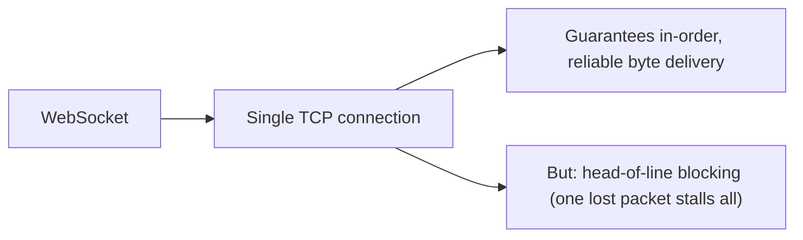

> [!TIP]
> Because WebSockets run over a **single TCP connection**, they inherit TCP's guarantees (reliable, in-order) *and* its limitation: **head-of-line blocking** — if one packet is lost, everything behind it waits for retransmission, even independent messages. For most apps this is fine, but for latency-critical use (gaming), it's a real constraint. This is exactly what **WebTransport over HTTP/3 (QUIC)** aims to fix — QUIC provides independent streams so one lost packet doesn't stall others, plus optional *unreliable* delivery for data where freshness beats completeness (position updates). Know this as the future direction.

### 7.3 Connection Handling at Scale (C10k again)

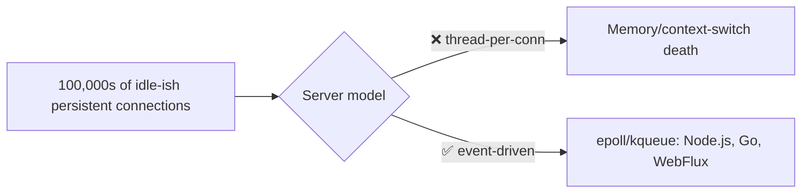

> [!IMPORTANT]
> WebSockets resurrect the **C10k problem** ([[05 Nginx]] §1): a chat server might hold **hundreds of thousands of mostly-idle persistent connections**. A thread-per-connection server would die under the memory/context-switch load. WebSocket servers must be **event-driven** — [[05 Node.js]] (libuv/epoll), Go (goroutines), [[12 Spring WebFlux]] (Reactor/Netty) — so idle connections cost almost nothing (just a file descriptor + small buffer). This is why real-time platforms are built on async runtimes, and why you must raise OS **file-descriptor limits** to hold many connections per box.

### 7.4 The Backplane Pattern in Depth

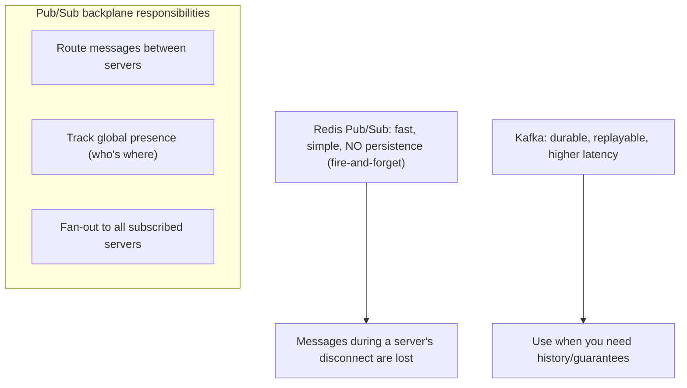

> [!TIP]
> Choosing the backplane is a real trade-off: **[[04 Redis]] Pub/Sub** is fast and simple but **fire-and-forget** (no persistence — if a server is momentarily disconnected from Redis, those messages are gone). **[[01 Kafka]]** (or Redis Streams) gives **durability and replay** at higher latency — right when you need message history or delivery guarantees. Many systems use **both**: Redis Pub/Sub for low-latency live fan-out, and [[01 Kafka]] for the durable event log that powers reconnection replay and downstream analytics. Match the backplane to your delivery-guarantee needs.

### 7.5 Presence — A Deceptively Hard Problem

```mermaid
flowchart LR
    Online["User connects → mark online (Redis)"] --> TTL["Set with TTL + heartbeat refresh"]
    Drop["Connection drops (no clean close)"] --> Expire["TTL expires → marked offline eventually"]
    Multi["Same user, multiple devices/tabs"] --> Count["Reference count connections"]
```

> [!WARNING]
> **"Who's online?" is harder than it looks.** A user can have multiple connections (tabs, devices) — so presence needs **reference counting**, not a boolean. Connections drop *without* a close frame (crashes, network loss), so you can't rely on a clean "offline" event — instead store presence in [[04 Redis]] with a **TTL refreshed by heartbeats**, so a dead connection's presence **expires** automatically. Across servers, presence must be **global** (in the backplane/Redis), not per-server memory. Getting presence subtly wrong ("ghost" online users, flickering status) is a classic real-time bug.

---

## ✅ Production Checklists

### Connection Management
- [ ] **Ping/pong heartbeats** + dead-connection cleanup
- [ ] **Auto-reconnection** (client) with exponential backoff + jitter
- [ ] Graceful **close** handling (codes/reasons)
- [ ] OS **file-descriptor limits** raised for many connections
- [ ] Event-driven server ([[05 Node.js]]/Go/[[12 Spring WebFlux]])

### Scaling & Reliability
- [ ] **Pub/sub backplane** ([[04 Redis]]/[[01 Kafka]]) for multi-server
- [ ] **WS-aware load balancer** ([[05 Nginx]]: Upgrade headers, long timeouts, sticky)
- [ ] **Presence** in shared store with TTL + heartbeat refresh
- [ ] **Message sequence IDs** + replay for delivery guarantees
- [ ] **Backpressure** handling for slow clients (buffer limits)
- [ ] Reconnect-storm protection (backoff + jitter)

### Security
- [ ] **`wss://` (TLS)** always
- [ ] **Validate `Origin`** (prevent cross-site hijacking)
- [ ] **Authenticate** (short-lived token / ticket / first-message)
- [ ] **Rate limit** messages per connection
- [ ] Validate/sanitize all incoming messages
- [ ] Authorize actions per message (not just at connect)

---

## 🗺️ Learning Roadmap

```mermaid
flowchart TB
    A["1️⃣ Basics<br/>HTTP vs WS, handshake, full-duplex"] --> B["2️⃣ Client/server API<br/>lifecycle, send/receive, frames"]
    B --> C["3️⃣ Real-time patterns<br/>rooms, broadcast, protocol design"]
    C --> D["4️⃣ Reliability<br/>heartbeats, reconnection, delivery"]
    D --> E["5️⃣ Scaling<br/>backplane, load balancing, presence"]
    E --> F["6️⃣ Security<br/>auth, origin, wss, rate limiting"]
    F --> G["7️⃣ Alternatives<br/>SSE, gRPC streaming, WebTransport"]
    G --> H["8️⃣ Internals<br/>frames, TCP/HOL, C10k, backplane trade-offs"]
```

| Stage | Focus | You can... |
|---|---|---|
| 1–3 | Basics + patterns | Build a working real-time app |
| 4–5 | Reliability + scaling | Run it across multiple servers robustly |
| 6–7 | Security + alternatives | Secure it; choose the right real-time tech |
| 8 | Internals | Reason about performance and trade-offs |

---

## 🔁 Self-Review Completion Loop

Reviewed against RFC 6455, real-time system design patterns, interview questions, and production practice.

### Gap Review Matrix

| Dimension | Covered? | Where |
|---|---|---|
| What/why, HTTP vs WS | ✅ | §1 |
| Real-time evolution (polling/SSE) | ✅ | §1 |
| Handshake/upgrade | ✅ | §2.1 |
| Connection lifecycle + API | ✅ | §2.2 |
| Frames & message types | ✅ | §2.3, §7.1 |
| Ping/pong keep-alive | ✅ | §2.4 |
| Message protocol design | ✅ | §2.5 |
| WS vs SSE vs polling | ✅ | §2.6 |
| Stateful scaling problem | ✅ | §3.1 |
| Pub/sub backplane | ✅ | §3.2, §7.4 |
| Load balancing WS | ✅ | §3.3 |
| Auth & security | ✅ | §3.4, §7 |
| Reconnection & reliability | ✅ | §3.5 |
| Backpressure | ✅ | §3.6 |
| Failure scenarios | ✅ | §3.7 |
| Scalable architecture | ✅ | §4.1 |
| Use cases | ✅ | §4.2 |
| vs alternatives (SSE/gRPC/WebTransport) | ✅ | §4.4 |
| Frame format | ✅ | §7.1 |
| TCP/head-of-line blocking | ✅ | §7.2 |
| C10k / event-driven servers | ✅ | §7.3 |
| Presence | ✅ | §7.5 |
| Interview Q&A + mistakes | ✅ | §5 |
| Hands-on projects | ✅ | §6 |

> [!NOTE]
> **Remaining depth to explore independently:** WebTransport & HTTP/3/QUIC in depth, Socket.IO vs raw WS trade-offs, operational transforms / CRDTs for collaborative editing, the WAMP sub-protocol, MQTT-over-WebSockets for IoT, WebRTC (peer-to-peer, for media), and Phoenix Channels / Elixir's approach to massive connection counts.

---

## 📚 Official References

| Resource | URL |
|---|---|
| RFC 6455 (The WebSocket Protocol) | https://www.rfc-editor.org/rfc/rfc6455 |
| MDN WebSockets API | https://developer.mozilla.org/en-US/docs/Web/API/WebSockets_API |
| MDN Writing WebSocket servers | https://developer.mozilla.org/en-US/docs/Web/API/WebSockets_API/Writing_WebSocket_servers |
| ws (Node.js library) | https://github.com/websockets/ws |
| Socket.IO | https://socket.io/docs/ |
| Server-Sent Events (MDN) | https://developer.mozilla.org/en-US/docs/Web/API/Server-sent_events |
| WebTransport | https://developer.mozilla.org/en-US/docs/Web/API/WebTransport_API |

---

## 🎁 Final Summary

> [!IMPORTANT]
> **The one-paragraph takeaway:** WebSockets give you a **persistent, full-duplex** channel over a single TCP connection, started by an HTTP **upgrade handshake** (101 Switching Protocols) so it traverses normal web infrastructure. They enable **instant bidirectional server↔client push** — the foundation of chat, live dashboards, collaboration, and games — with tiny per-message overhead versus polling. The cost is **statefulness**: long-lived connections are pinned to servers, so scaling requires a **pub/sub backplane** ([[04 Redis]]/[[01 Kafka]]) to route messages across instances, a **WS-aware load balancer** ([[05 Nginx]] with Upgrade forwarding + long timeouts), **heartbeats** to kill zombie connections, **auto-reconnection with backoff**, **sequence IDs + replay** for delivery guarantees (WS doesn't guarantee delivery across disconnects), and **backpressure** for slow clients. Secure them with **wss://**, **Origin validation** (cross-site hijacking), and token/ticket auth (no `Authorization` header on the browser handshake). Crucially, WebSockets **complement** [[02 REST API Design|REST]]/SSE rather than replace them — layer them in only where genuine bidirectional real-time is needed; use **SSE** for server-push-only.

**Golden rules:**
1. 🔌 WebSockets = **persistent full-duplex** — server can push anytime.
2. 🤝 Starts as **HTTP, upgrades** (101) → traverses web infrastructure.
3. 💓 **Heartbeats (ping/pong)** to detect & kill zombie connections.
4. 🔁 **Auto-reconnect** with backoff+jitter; connections *will* drop.
5. 📡 Scale with a **pub/sub backplane** ([[04 Redis]]/[[01 Kafka]]) — connections are stateful.
6. ⚖️ Configure the **load balancer** for WS (Upgrade headers, long timeouts).
7. 📮 No guaranteed delivery across disconnects → **sequence IDs + replay**.
8. 🔒 **wss://**, validate **Origin**, token/ticket auth, rate limit.
9. 🎯 **Complement REST/SSE** — use WS only for genuine bidirectional real-time.

---

*Related guides in this vault: [[02 REST API Design]] · [[05 Node.js]] · [[06 Express.js]] · [[01 System Design Fundamentals]] · [[04 Redis]] · [[12 Spring WebFlux]] · [[05 Nginx]] · [[01 Kafka]] · [[04 gRPC]]*
