# 🚪 API Gateway — Complete Beginner-to-Expert Reference

> The single front door to your microservices — one entry point that handles routing, authentication, rate limiting, and every cross-cutting concern so your services don't have to.

---

## 📑 Table of Contents

1. [Executive Summary](#-executive-summary)
2. [Fundamentals (Beginner)](#1--fundamentals-beginner-level)
3. [Core Concepts (Intermediate)](#2--core-concepts-intermediate-level)
4. [Advanced Concepts (Senior)](#3--advanced-concepts-senior-level)
5. [Real-World System Design](#4--real-world-system-design-usage)
6. [Interview Preparation](#5--interview-preparation)
7. [Hands-On Projects](#6--hands-on-projects)
8. [Deep Dive: Internals](#7--deep-dive-internals)
9. [Production Checklists](#-production-checklists)
10. [Learning Roadmap](#-learning-roadmap)
11. [Self-Review Completion Loop](#-self-review-completion-loop)
12. [Official References](#-official-references)
13. [Final Summary](#-final-summary)

---

## 🎯 Executive Summary

An **API Gateway** is a server that sits between clients and your backend services, acting as the **single entry point** for all API requests. It **routes** each request to the right service and centralizes **cross-cutting concerns** — authentication, rate limiting, TLS, caching, logging, request transformation — so individual [[03 Microservices]] don't each reimplement them.

| What it is | What it replaces | Core superpower |
|---|---|---|
| Single entry point / reverse proxy for APIs | Clients calling many services directly, duplicated cross-cutting logic | **Centralize routing + cross-cutting concerns** at one edge |

> [!IMPORTANT]
> The API Gateway is the **"front door" pattern** for [[03 Microservices]]. Without it, every client must know about every service (their addresses, protocols, auth), and every service must reimplement auth, rate limiting, and logging. The gateway solves both: clients talk to **one endpoint**, and cross-cutting concerns live in **one place**. It's a specialized application of the reverse-proxy idea ([[05 Nginx]]) plus the [[02 Design Patterns|Facade pattern]] — one simple interface hiding a complex subsystem. This is the API-layer capstone that ties together [[02 REST API Design]], [[04 gRPC]], [[03 GraphQL]], and [[01 System Design Fundamentals]].

Related guides: [[03 Microservices]] · [[01 System Design Fundamentals]] · [[05 Nginx]] · [[02 REST API Design]] · [[04 gRPC]] · [[03 GraphQL]] · [[02 Kubernetes]] · [[11 Spring Boot Authentication]]

---

## 1. 🌱 FUNDAMENTALS (Beginner Level)

### What is an API Gateway in simple terms?

Imagine a large office building with 50 departments ([[03 Microservices]]). Without a receptionist, every visitor would need to know exactly which floor and room each department is on, show ID at each door, and navigate the maze. **An API Gateway is the building's reception desk**: visitors (clients) go to *one* front desk, get their ID checked *once*, and are directed to the right department. The departments focus on their work, not on security or directions.

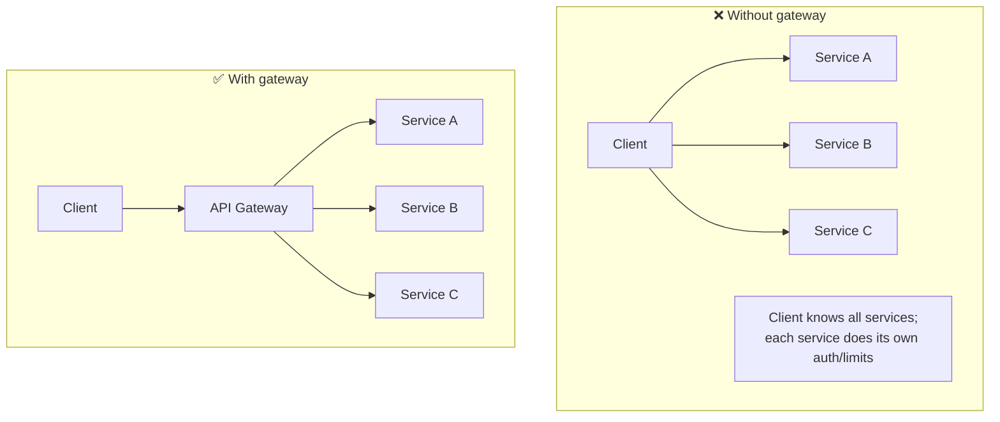

### Why do API Gateways exist?

As monoliths split into [[03 Microservices]], new problems appeared:

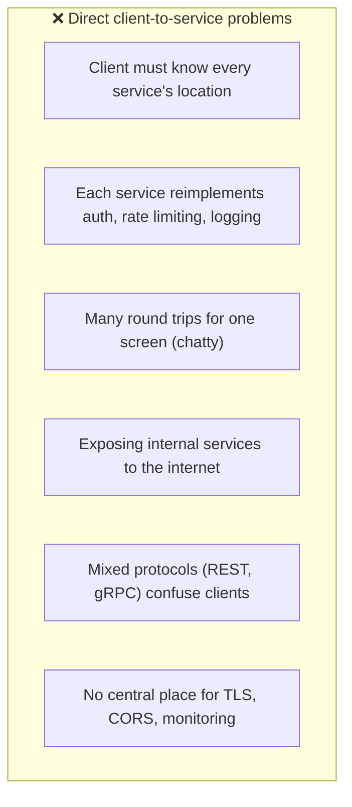

The API Gateway centralizes the edge concerns, letting services stay small and focused.

### Problems API Gateways solve

| Problem | How the gateway solves it |
|---|---|
| **Clients coupled to service topology** | One stable endpoint; routing hidden |
| **Duplicated cross-cutting logic** | Centralized auth, rate limit, logging, TLS |
| **Exposed internal services** | Only the gateway is public; services stay private |
| **Chatty clients** (many calls) | Request aggregation/composition |
| **Protocol mismatch** | Translate (e.g., REST client → [[04 gRPC]] service) |
| **No central observability** | One place for metrics, logging, tracing |
| **Inconsistent security** | Uniform auth/authorization enforcement |

### Gateway vs Load Balancer vs Reverse Proxy

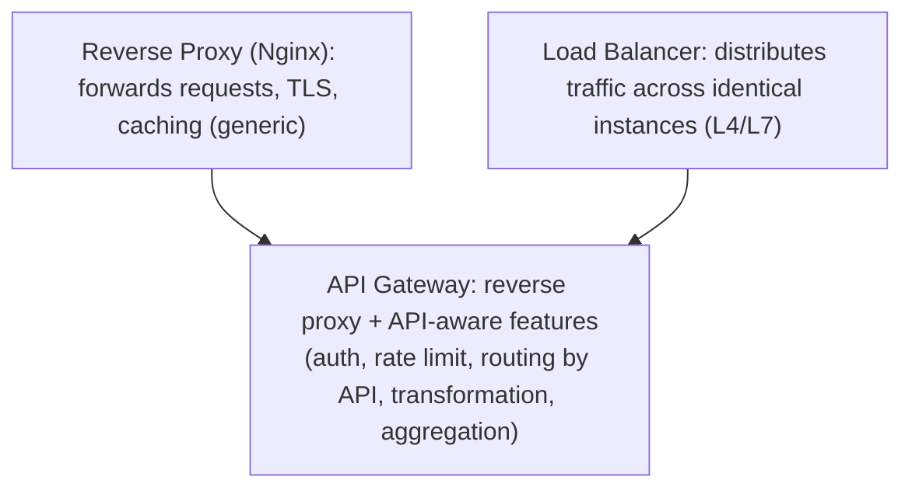

> [!TIP]
> These overlap and confuse people. A **load balancer** spreads requests across identical copies of a service. A **reverse proxy** ([[05 Nginx]]) forwards requests and can add TLS/caching. An **API Gateway** is a *specialized, API-aware* reverse proxy: it understands your APIs and adds application-level features — authentication, per-API rate limiting, request/response transformation, aggregation, and service-specific routing. Many gateways *are* built on reverse proxies ([[05 Nginx]]/Envoy) and *include* load balancing. Think: gateway = reverse proxy + LB + API-aware cross-cutting concerns.

### Core vocabulary

| Term | Plain meaning |
|---|---|
| **Route** | A rule mapping a request to a backend service |
| **Upstream** | The backend service a request is sent to |
| **Cross-cutting concern** | Logic needed everywhere (auth, logging) |
| **Rate limiting** | Capping requests per client |
| **Aggregation** | Combining multiple service calls into one response |
| **BFF** | Backend-for-Frontend (a gateway per client type) |
| **Plugin/filter** | A pluggable gateway feature |
| **Ingress** | The Kubernetes term for edge routing |

### Real-world analogy 🏢

An API Gateway is like an **airport**:
- All travelers (requests) go through **one terminal entrance** (single entry point), not directly onto random planes.
- **Security checkpoint** (authentication/authorization) happens once, centrally.
- **Departure boards + gate agents** (routing) direct each traveler to the right gate (service).
- **Capacity controls** (rate limiting) prevent overcrowding.
- **Announcements/CCTV** (logging/monitoring) track everything from one place.
- The **planes/crews** (services) focus purely on flying, not on checking passports.

> [!TIP]
> The mental model: **the API Gateway is where all the "boring but essential" edge work happens once, so your services can be simple.** Every concern that applies to *all* requests — who are you (auth), are you allowed (authz), not too fast (rate limit), over HTTPS (TLS), which service (routing), and log it (observability) — belongs at the gateway, not scattered across services. It's the [[02 Design Patterns|Facade]] + [[02 Design Patterns|Chain of Responsibility]] patterns at the system edge.

---

## 2. 🧩 CORE CONCEPTS (Intermediate Level)

### 2.1 The Request Pipeline


> [!IMPORTANT]
> An API Gateway processes each request through a **pipeline of filters/plugins** — a [[02 Design Patterns|Chain of Responsibility]], exactly like [[05 Nginx]] phases, [[06 Express.js]] middleware, or [[07 Servlets and Filters|servlet filters]]. Each stage (auth, rate limit, transform, route) can inspect, modify, or reject the request. This pipeline model is the gateway's core architecture: you compose cross-cutting behavior by ordering plugins. Understanding it means you can reason about *where* in the flow each concern is handled and *why order matters* (e.g., authenticate before rate-limiting per-user).

### 2.2 Routing

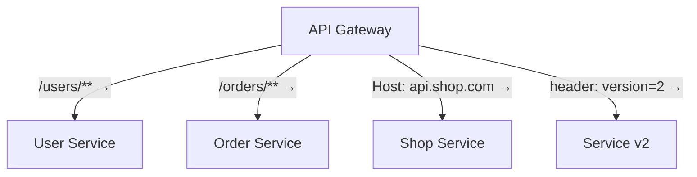

Gateways route based on:
- **Path** (`/users/*` → user service),
- **Host/domain** (`api.example.com`),
- **HTTP method**, **headers**, **query params**,
- **Weighted/canary** (send 5% to a new version).

Routing decouples clients from service locations — services can move, scale, or be renamed without clients knowing.

### 2.3 Authentication & Authorization

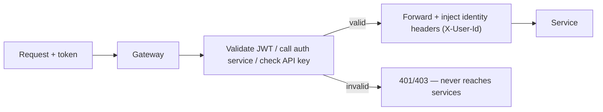

> [!IMPORTANT]
> **Centralizing authentication at the gateway is one of its biggest wins.** The gateway validates credentials (JWT signature/expiry, API keys, OAuth2 tokens — see [[11 Spring Boot Authentication]]) **once**, rejects bad requests before they touch any service, and **injects trusted identity headers** (e.g., `X-User-Id`, `X-Roles`) so downstream services know who the caller is *without re-validating*. Services then trust the gateway (within the private network). Caveat: this means services must **not** be directly reachable from outside (bypassing the gateway = bypassing auth) — a common security hole. **Authorization** (fine-grained "can this user do this?") is often split: coarse checks at the gateway, business-specific checks in services.

### 2.4 Rate Limiting & Throttling

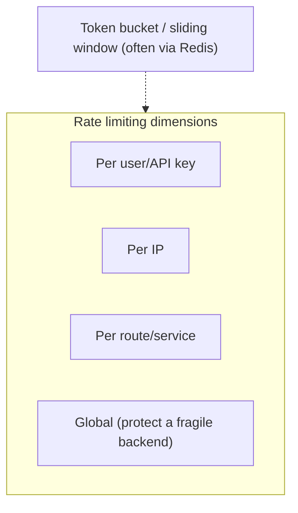

> [!TIP]
> Rate limiting at the gateway protects your entire system from abuse, runaway clients, and DoS ([[01 System Design Fundamentals]]) — *before* traffic reaches services. It's typically implemented with **token-bucket or sliding-window** algorithms backed by [[04 Redis]] (shared state across gateway instances — see [[04 Redis]] §4.3). Apply limits per **API key/user** (fair usage, monetization tiers), per **IP** (abuse), and per **route** (protect a specific fragile service). Returning **429 Too Many Requests** with `Retry-After` is the standard. This is a headline reason gateways exist — one place to enforce quotas across all APIs.

### 2.5 Request Aggregation / Composition

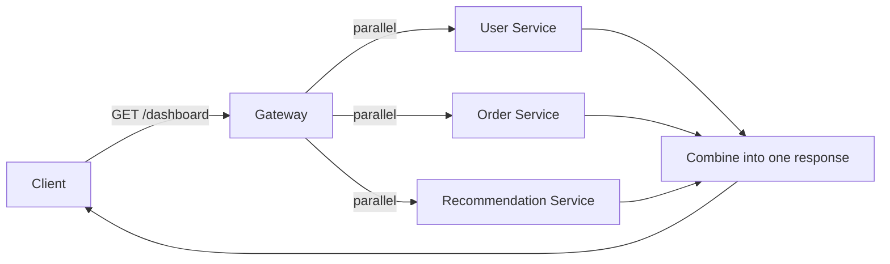

> [!TIP]
> Gateways can **aggregate** multiple backend calls into a single client response — solving the "chatty API" problem ([[02 REST API Design]] §3.7) where a mobile screen needs data from several services. Instead of the client making 3 round trips over a slow network, it makes **one** call to the gateway, which fans out to services **in parallel** and composes the result. This is powerful but adds coupling/logic to the gateway — for complex aggregation needs, a dedicated **BFF** (§3.2) or [[03 GraphQL]] gateway is often cleaner than stuffing aggregation logic into a general-purpose gateway.

### 2.6 Protocol Translation & Transformation

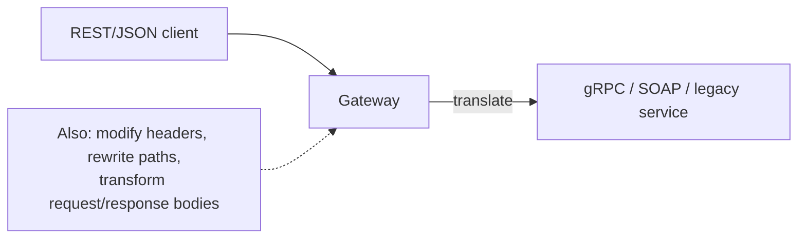

> [!TIP]
> Gateways can **translate protocols** — e.g., accept a browser-friendly [[02 REST API Design|REST]]/JSON request and call an internal [[04 gRPC]] service (the "REST edge, gRPC internal" pattern from [[04 gRPC]] §4.1), or front a legacy SOAP service with a modern REST facade. They also **transform** requests/responses: rewrite paths, add/strip headers, convert formats, mask sensitive fields. This lets clients use one consistent style while backends use whatever fits them, and lets you modernize incrementally without breaking clients.

---

## 3. ⚙️ ADVANCED CONCEPTS (Senior Level)

### 3.1 The Gateway as a Single Point of Failure

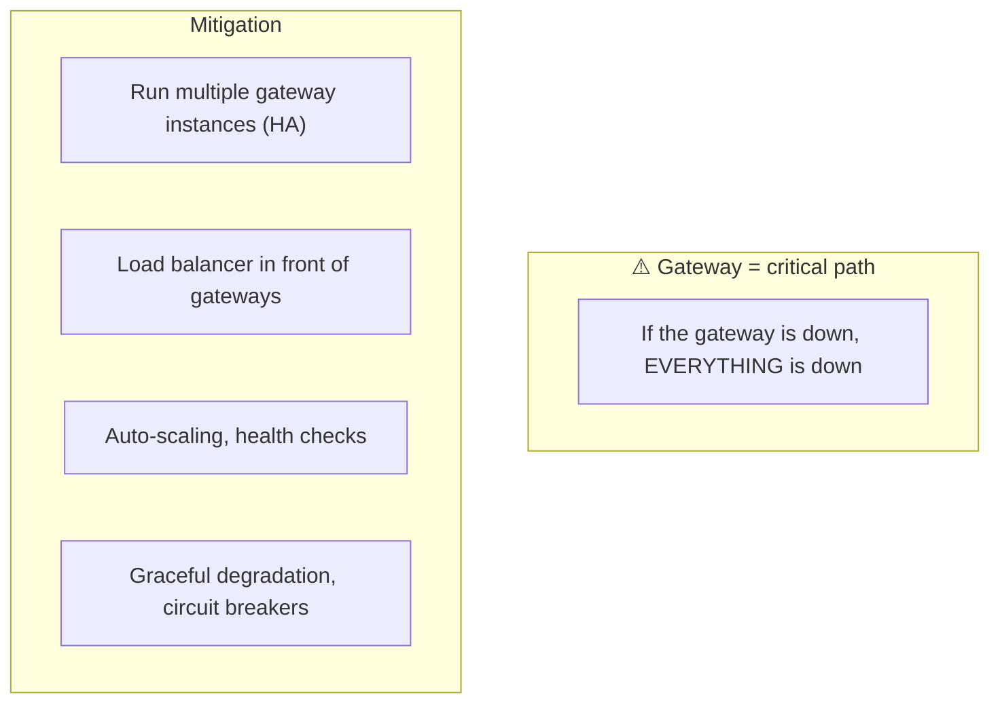

> [!WARNING]
> The gateway's greatest strength (single entry point) is also its greatest risk: it's a **single point of failure and a potential bottleneck** — if it goes down, your *entire* API is unreachable. You **must** run it **highly available**: multiple gateway instances behind a load balancer, across availability zones ([[01 System Design Fundamentals]], [[02 Kubernetes]]), with health checks and auto-scaling. It also adds a **network hop** and latency to every request, so the gateway itself must be fast and efficient (event-driven, like [[05 Nginx]]/Envoy). Never run a single gateway instance in production.

### 3.2 Backend-for-Frontend (BFF) Pattern

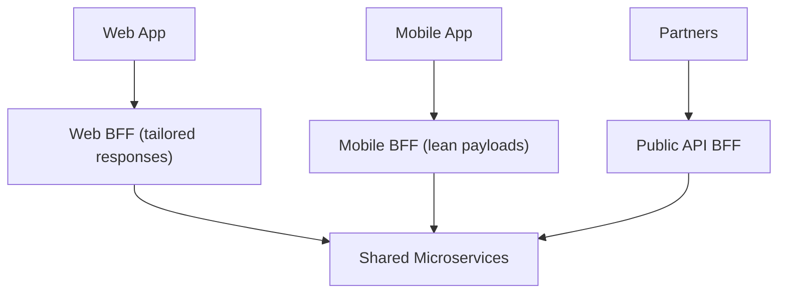

> [!IMPORTANT]
> The **BFF pattern** creates a **separate gateway per client type** (web, iOS, Android, partner API) rather than one gateway serving everyone. Why? Different clients have different needs: a mobile app wants **lean payloads** (bandwidth/battery), a web app wants **richer data**, partners want a **stable public contract**. A one-size-fits-all gateway forces compromises; BFFs let each client team own and optimize their edge — tailoring aggregation, field selection, and caching per client. The trade-off is more gateways to maintain. [[03 GraphQL]] is a popular BFF technology (clients pick their own fields, one BFF serves all). This is a key senior-level architectural decision.

### 3.3 Resilience Patterns at the Gateway

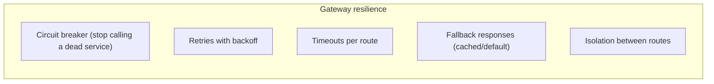

> [!TIP]
> The gateway is a natural place for **resilience patterns** ([[03 Microservices]], [[01 System Design Fundamentals]]): **circuit breakers** (stop hammering a failing service, fail fast), **retries with backoff**, per-route **timeouts**, **fallback responses** (serve cached/default data when a service is down → graceful degradation), and **bulkheads** (isolate routes so one slow service doesn't exhaust the gateway's resources). Centralizing these means consistent failure handling across all services. But beware: putting *too much* logic in the gateway makes it a fat, fragile component — balance centralization against keeping the gateway lean.

### 3.4 Observability

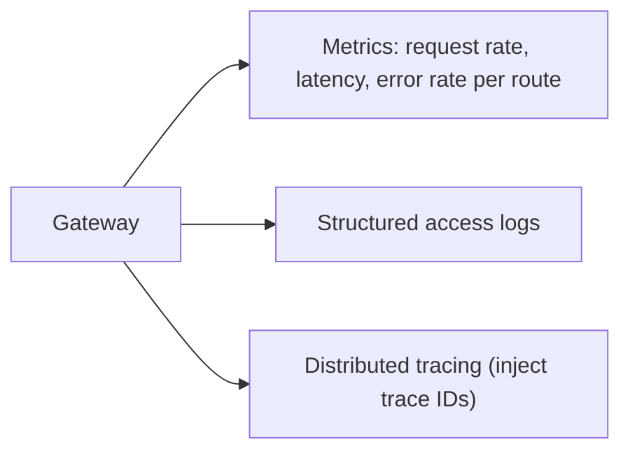

> [!IMPORTANT]
> Because *every* request flows through it, the gateway is the ideal place for **centralized observability** ([[01 System Design Fundamentals]] §4.5): per-route **metrics** (rate, latency, error percentages), **structured access logs**, and — critically — **distributed tracing**. The gateway **generates/propagates a trace ID** on each request, which flows through all downstream services, letting you follow a single request across your entire [[03 Microservices]] mesh. This "single choke point" view is invaluable — the gateway gives you a system-wide dashboard of API health for free.

### 3.5 Caching at the Gateway

> [!TIP]
> Gateways can **cache responses** for cacheable endpoints (like [[05 Nginx]]/[[02 REST API Design|REST]] caching), serving repeated requests without hitting backends — reducing latency and load. This works best for read-heavy, slowly-changing data with proper cache headers/TTLs. Caveats: it's the same **cache invalidation** hard problem ([[04 Redis]] §3.5), it doesn't help personalized/authenticated responses easily, and [[03 GraphQL]]'s single-endpoint model makes gateway caching hard (§GraphQL). Use gateway caching for public, cacheable GET endpoints; rely on service-level/[[04 Redis]] caching for dynamic data.

### 3.6 Failure Scenarios & Anti-Patterns

| Problem | Cause | Fix |
|---|---|---|
| **Gateway down = total outage** | Single instance | HA: multiple instances + LB |
| **Added latency/bottleneck** | Every request hops through it | Fast gateway (Envoy/Nginx), scale out |
| **Services bypass gateway** | Direct internal access | Network policies; services only reachable via gateway |
| **"God gateway"** | Too much business logic in gateway | Keep it thin; logic in services |
| **Coupling to service internals** | Gateway knows too much | Stable contracts, loose coupling |
| **Config sprawl** | Hundreds of routes hand-managed | Declarative config, GitOps |
| **Single team bottleneck** | One team owns all gateway config | BFFs / self-service config |
| **Inconsistent auth** | Some routes unprotected | Default-deny; audit routes |

> [!WARNING]
> The **"God Gateway" anti-pattern** is the biggest senior-level trap: over time, teams pile business logic, data transformation, and orchestration into the gateway until it becomes a **distributed monolith bottleneck** — fragile, hard to change, and owned by a single team that becomes everyone's blocker. Keep the gateway **thin**: it should handle *generic* cross-cutting concerns (auth, routing, rate limiting, observability), **not** business logic. Business rules and complex orchestration belong in services (or dedicated BFFs). If your gateway config needs a business analyst to understand, you've gone too far.

---

## 4. 🏗️ REAL-WORLD SYSTEM DESIGN USAGE

### 4.1 Gateway in a Microservices Architecture

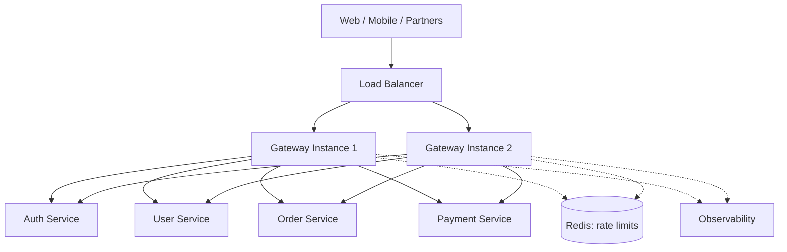

The gateway sits behind a load balancer (for its own HA), fronts all [[03 Microservices]], validates auth (possibly via an auth service), enforces rate limits (via [[04 Redis]]), and emits observability data. Services are private — only reachable through the gateway.

### 4.2 Popular API Gateways

| Gateway | Notes |
|---|---|
| **Kong** | Built on [[05 Nginx]]/OpenResty; plugin ecosystem; popular open-source |
| **AWS API Gateway** | Managed; integrates with Lambda; serverless-friendly |
| **NGINX / NGINX Plus** | [[05 Nginx]] as a gateway; fast, mature |
| **Envoy** | Modern L7 proxy; service mesh data plane; dynamic config |
| **Spring Cloud Gateway** | Java/Spring-native ([[12 Spring WebFlux]] reactive) |
| **Apigee (Google)** | Enterprise API management (analytics, monetization) |
| **Traefik** | Cloud-native, auto-discovery, great for [[01 Docker]]/[[02 Kubernetes]] |
| **Zuul (Netflix)** | Older Java gateway (largely superseded) |

### 4.3 API Gateway vs Service Mesh

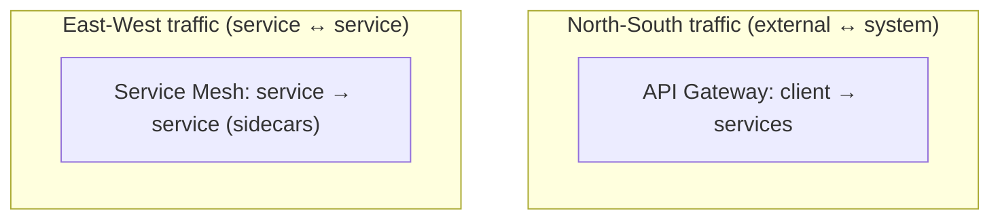

> [!IMPORTANT]
> A frequently-confused distinction: **API Gateway handles "north-south" traffic** (external clients ↔ your system — the edge), while a **service mesh** ([[02 Kubernetes]] + Istio/Linkerd) handles **"east-west" traffic** (service ↔ service *inside* the system). The gateway is the front door; the mesh is the internal road network (with sidecar proxies handling inter-service mTLS, retries, load balancing — see [[04 gRPC]] §4.3). They're **complementary**, not competing: large systems run **both** — a gateway at the edge, a mesh internally. Some tools (Envoy) can play either role. Knowing north-south vs east-west is a classic senior interview point.

### 4.4 API Management (beyond the gateway)

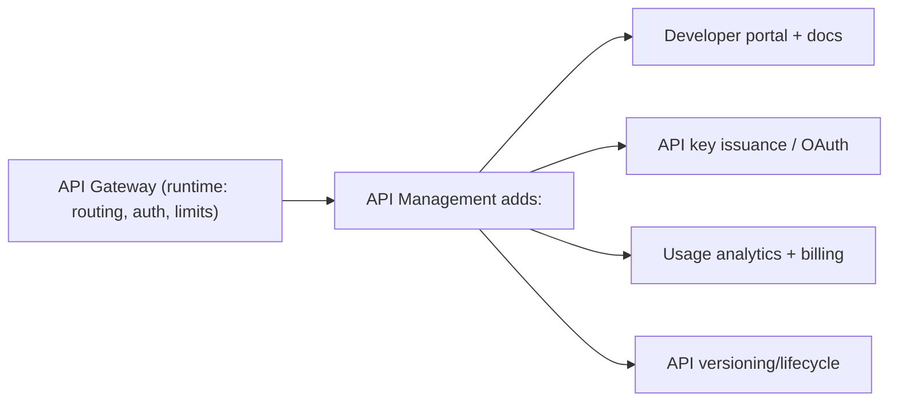

> [!TIP]
> **API Management** is the broader discipline around gateways (Apigee, AWS API Gateway, Kong Enterprise): a **developer portal** (docs, self-service onboarding), **API key/credential management**, **usage analytics and monetization/billing**, and **lifecycle governance**. The gateway is the *runtime enforcement* component; API management adds the *business and developer-experience* layer on top. This matters when you expose APIs to **external developers/partners** (a public API product) rather than just internal clients — the gateway alone handles traffic; management handles the API-as-a-product concerns.

---

## 5. 🎤 INTERVIEW PREPARATION

### 5.1 Most important questions

<details>
<summary><b>Q1: What is an API Gateway and why use one?</b></summary>

A single entry point between clients and backend services that handles routing and centralizes cross-cutting concerns (auth, rate limiting, TLS, logging, transformation, aggregation). Benefits: clients talk to one endpoint (decoupled from service topology), services stay simple (no duplicated edge logic), internal services stay private, and you get one place for security and observability. It's the "front door" pattern for [[03 Microservices]].
</details>

<details>
<summary><b>Q2: Gateway vs load balancer vs reverse proxy?</b></summary>

A **load balancer** distributes traffic across identical instances. A **reverse proxy** forwards requests (with TLS/caching). An **API Gateway** is an API-aware reverse proxy adding application-level features — authentication, per-API rate limiting, request transformation, aggregation, and service routing. Gateways often include LB and are built on reverse proxies ([[05 Nginx]]/Envoy).
</details>

<details>
<summary><b>Q3: What cross-cutting concerns belong at the gateway?</b></summary>

Authentication/authorization, rate limiting/throttling, TLS termination, routing, request/response transformation, aggregation, caching, CORS, logging/metrics/tracing. Essentially anything that applies to *all* (or many) requests and shouldn't be duplicated per service. **Business logic does NOT belong** at the gateway (avoid the "God Gateway").
</details>

<details>
<summary><b>Q4: How do you prevent the gateway from being a single point of failure?</b></summary>

Run **multiple gateway instances** behind a load balancer, across availability zones, with health checks and auto-scaling ([[02 Kubernetes]]). Add resilience (circuit breakers, timeouts, fallbacks) so backend failures don't cascade. Never run a single instance — the gateway is on the critical path for every request.
</details>

<details>
<summary><b>Q5: What is the BFF pattern?</b></summary>

**Backend-for-Frontend**: a separate gateway per client type (web, mobile, partner) instead of one shared gateway. Each BFF tailors responses to its client's needs (lean mobile payloads, richer web data), owned by that client's team. Solves the "one-size-fits-all gateway forces compromises" problem. [[03 GraphQL]] is often used as a BFF.
</details>

<details>
<summary><b>Q6: API Gateway vs Service Mesh?</b></summary>

The gateway handles **north-south** traffic (external clients ↔ system, at the edge); a service mesh handles **east-west** traffic (service ↔ service internally, via sidecars — mTLS, retries, LB). They're complementary — large systems use both: gateway at the edge, mesh inside. Some tools (Envoy) can do either.
</details>

<details>
<summary><b>Q7: How is authentication centralized at the gateway?</b></summary>

The gateway validates credentials (JWT, API key, OAuth token) once, rejects invalid requests before they reach services, and injects trusted identity headers (`X-User-Id`) for downstream services. Services trust the gateway within the private network. Critical: services must not be directly reachable externally, or auth is bypassed.
</details>

<details>
<summary><b>Q8: What is the "God Gateway" anti-pattern?</b></summary>

When too much business logic, orchestration, and transformation accumulates in the gateway, turning it into a fragile distributed-monolith bottleneck owned by one blocking team. Keep the gateway **thin** — generic cross-cutting concerns only; business logic belongs in services/BFFs.
</details>

### 5.2 Tricky questions

> [!TIP]
> **"Doesn't the gateway add latency?"** — Yes, it adds a network hop and processing to every request. That's the cost of centralization. Mitigate with a fast, event-driven gateway (Envoy/[[05 Nginx]]) and by keeping it thin. The benefits (centralized concerns, decoupling) usually outweigh the small latency cost — but it's a real trade-off.

> [!TIP]
> **"If auth is at the gateway, why do services also check permissions?"** — The gateway does coarse authentication and often coarse authorization; **fine-grained, business-specific authorization** (can *this* user edit *this* order?) needs context only the service has. Defense in depth also means services shouldn't blindly trust — especially if the network isn't fully locked down.

> [!TIP]
> **"Can the gateway do everything, so services need no cross-cutting logic?"** — No. Some concerns (business authorization, domain validation, data-level security) require service context. And centralizing *too much* creates the God Gateway. The gateway handles *generic* edge concerns; services keep domain-specific ones.

> [!TIP]
> **"Is the API Gateway a microservice?"** — It's infrastructure/edge component, not a business microservice — but it's often deployed and scaled like one. In [[02 Kubernetes]], an **Ingress Controller** ([[05 Nginx]] ingress) plays the gateway role. Don't put business logic in it (that would make it a monolith-in-disguise).

### 5.3 Common mistakes candidates make

| Mistake | Reality |
|---|---|
| "Gateway = load balancer" | Gateway is API-aware, does more |
| Single gateway instance | SPOF — needs HA |
| Business logic in gateway | God Gateway anti-pattern |
| Forgetting added latency | Real cost — keep it thin/fast |
| Services directly exposed | Bypasses gateway auth |
| Confusing gateway & service mesh | North-south vs east-west |
| No fine-grained authz in services | Gateway auth is coarse |
| One gateway for all clients | Consider BFF pattern |

### 5.4 What interviewers actually expect

- The **single-entry-point + centralized cross-cutting concerns** value.
- Distinguishing **gateway vs LB vs reverse proxy vs service mesh**.
- The **SPOF/HA** concern and keeping the gateway **thin** (God Gateway).
- **BFF pattern**, **aggregation**, **protocol translation**, **auth centralization**.
- **North-south vs east-west** (gateway vs mesh).
- Naming real gateways (Kong, Envoy, AWS API Gateway, [[05 Nginx]], Spring Cloud Gateway).

---

## 6. 🛠️ HANDS-ON PROJECTS

### Project 1: Build a Basic API Gateway (Beginner→Intermediate)

**Goal:** Route to multiple services with centralized auth + rate limiting.

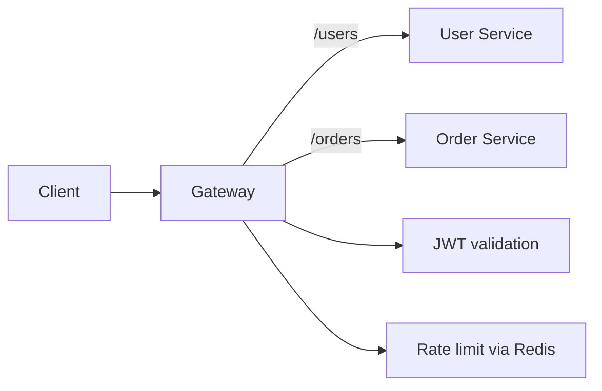

**Steps:**
1. Stand up 2–3 small [[03 Microservices]] ([[05 Node.js]]/[[05 Spring Boot]]).
2. Put a gateway in front ([[05 Nginx]], Kong, or Spring Cloud Gateway) with **path-based routing**.
3. Add **JWT authentication** at the gateway; inject `X-User-Id` downstream.
4. Add **rate limiting** backed by [[04 Redis]] → 429.
5. Make services private (only reachable via the gateway).

**Learn:** routing, centralized auth, rate limiting, the pipeline model.

---

### Project 2: Aggregation, Transformation & Resilience (Intermediate→Senior)

**Goal:** Add API-aware features and failure handling.

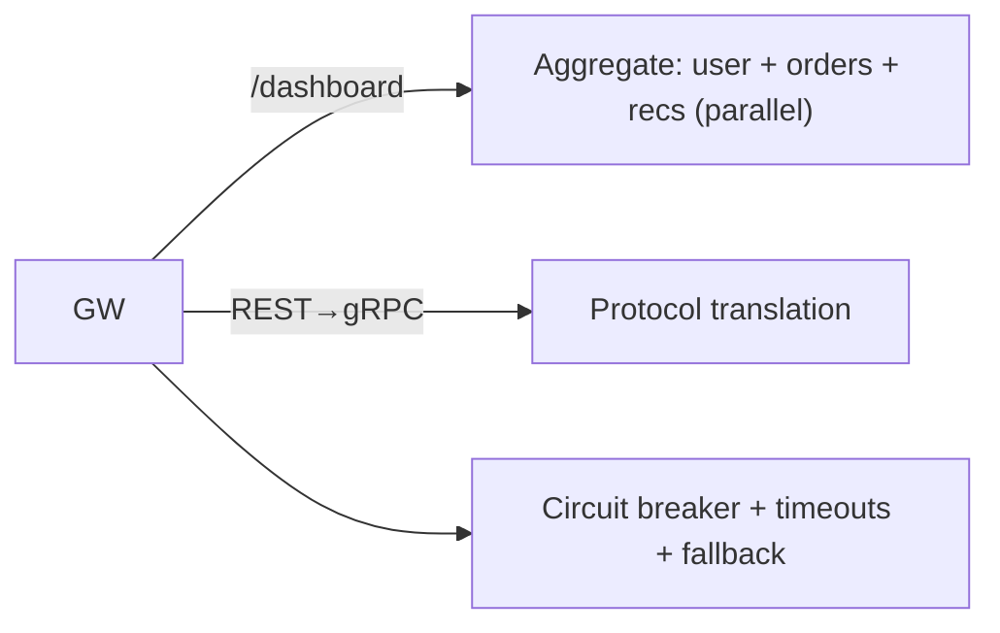

**Steps:**
1. Add a **request aggregation** endpoint (fan out to 3 services in parallel, combine).
2. Add **request/response transformation** (rewrite paths, strip/inject headers).
3. Add **protocol translation** (REST client → [[04 gRPC]] service).
4. Add **circuit breakers, timeouts, and fallbacks** for resilience.
5. Add **distributed tracing** (propagate trace IDs).

**Learn:** aggregation, transformation, protocol translation, resilience, tracing.

---

### Project 3: BFF + Kubernetes Ingress + Observability (Senior)

**Goal:** Production-shaped edge with BFFs and full observability.

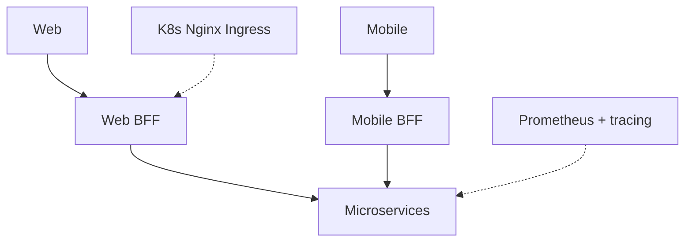

**Steps:**
1. Build **two BFFs** (web + mobile) tailoring responses per client.
2. Deploy on [[02 Kubernetes]] using the **[[05 Nginx]] Ingress Controller** as the edge.
3. Run **multiple gateway/BFF replicas** (HA) with health checks.
4. Add **metrics (Prometheus) + distributed tracing** at the edge.
5. Compare a **GraphQL BFF** approach ([[03 GraphQL]]) for client flexibility.

**Learn:** BFF pattern, K8s ingress, HA, observability, GraphQL-as-BFF.

---

## 7. 🔬 DEEP DIVE: INTERNALS

### 7.1 The Plugin/Filter Chain

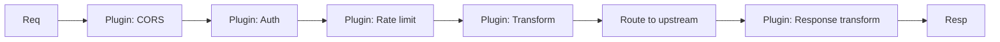

> [!IMPORTANT]
> Under the hood, an API Gateway is a **configurable [[02 Design Patterns|Chain of Responsibility]]** — the same pattern as [[06 Express.js]] middleware, [[07 Servlets and Filters|servlet filters]], and [[05 Nginx]] phases. Each **plugin/filter** in the chain can inspect, modify, short-circuit (reject), or pass the request along; the order is configurable and matters (auth before rate-limiting-per-user, CORS early, etc.). This composable pipeline is why gateways are so extensible — you add capabilities by writing/enabling plugins (Kong's plugin model, Envoy's filters, Spring Cloud Gateway's filters) without changing the core. Understanding this pattern demystifies every gateway.

### 7.2 Built on Reverse Proxies

```mermaid
flowchart TB
    Kong["Kong"] --> OpenResty["OpenResty (Nginx + Lua)"]
    Envoy["Envoy"] --> CppProxy["Modern C++ L7 proxy"]
    SCG["Spring Cloud Gateway"] --> WebFlux["Spring WebFlux (Netty, reactive)"]
    Note["Gateways are specialized reverse proxies"] -.-> Kong
```

> [!TIP]
> Most gateways are built on high-performance **reverse-proxy engines**: **Kong** on OpenResty ([[05 Nginx]] + Lua), **Envoy** as a modern C++ L7 proxy, **Spring Cloud Gateway** on [[12 Spring WebFlux]]/Netty (reactive, non-blocking). This matters because the gateway is on **every request's critical path** — it must be fast and handle massive concurrency, which demands **event-driven, non-blocking** architectures ([[05 Nginx]] §7, [[05 Node.js]] event loop). A thread-per-request gateway would collapse under load. The gateway inherits its host proxy's performance characteristics — which is why understanding [[05 Nginx]]/Envoy internals helps you understand gateway performance.

### 7.3 Configuration Models — Static vs Dynamic

```mermaid
flowchart LR
    subgraph Static["Static config (Nginx-style)"]
        S["Config file → reload to change"]
    end
    subgraph Dynamic["Dynamic config (Kong/Envoy)"]
        D["Admin API / control plane → change routes at runtime, no restart"]
    end
```

> [!IMPORTANT]
> A key architectural difference: **static** gateways ([[05 Nginx]]-style) load routes from a config file and need a reload to change; **dynamic** gateways (Kong via its Admin API/database, Envoy via **xDS** control plane) can add/modify routes **at runtime without restarts**. Dynamic config is essential in modern [[02 Kubernetes]]/[[03 Microservices]] environments where services scale up/down and deploy constantly — routes must update automatically (e.g., driven by service discovery or K8s resources). This is why cloud-native gateways favor dynamic, API-driven or declarative (GitOps) configuration over hand-edited files.

### 7.4 The Kubernetes Ingress Connection

```mermaid
flowchart TB
    Ingress["Ingress resource (routing rules as K8s YAML)"] --> Controller["Ingress Controller (Nginx/Traefik/Envoy)"]
    Controller -->|"watches K8s API, updates routes"| Route[Routing to Services]
```

> [!IMPORTANT]
> In [[02 Kubernetes]], the **Ingress Controller** *is* the API gateway for HTTP traffic ([[05 Nginx]] §4.3): you declare routing rules as **Ingress resources** (K8s YAML), and the controller (Nginx, Traefik, Envoy-based) **watches the K8s API** and dynamically reconfigures itself — the reconciliation model of [[02 Kubernetes]] applied to edge routing. Newer **Gateway API** (Ingress's successor) adds richer, role-oriented routing. For advanced gateway features (auth, rate limiting, transformation) beyond basic routing, teams add a full gateway (Kong, Envoy Gateway) or use the ingress controller's annotations/CRDs. This is how the gateway pattern manifests in cloud-native infra.

### 7.5 Where to Put Cross-Cutting Concerns

```mermaid
flowchart TB
    Concern{"Where does this concern live?"}
    Concern -->|"applies to all requests, generic"| GW["Gateway (auth, rate limit, TLS, routing)"]
    Concern -->|"service-to-service, internal"| Mesh["Service Mesh (mTLS, internal retries)"]
    Concern -->|"business-specific"| Service["Service (domain auth, validation)"]
```

> [!IMPORTANT]
> The deepest design question is **placement**: which cross-cutting concern goes at the gateway, the service mesh, or the service itself? **Generic edge concerns** (external auth, public rate limiting, TLS termination, routing) → **gateway**. **Internal service-to-service concerns** (mTLS, inter-service retries/LB) → **service mesh**. **Business-specific concerns** (domain authorization, validation, business rules) → **the service**. Getting this wrong causes the classic failures: too much at the gateway (God Gateway), too little (duplicated logic everywhere), or wrong layer (business logic in infrastructure). The senior skill is drawing these boundaries cleanly — the gateway is powerful precisely because it handles the *right* concerns and *only* those.

---

## ✅ Production Checklists

### Availability & Performance
- [ ] **Multiple gateway instances** (HA) behind a load balancer, multi-AZ
- [ ] Health checks + **auto-scaling** ([[02 Kubernetes]])
- [ ] Fast, event-driven engine ([[05 Nginx]]/Envoy/reactive)
- [ ] Gateway kept **thin** (no business logic — avoid God Gateway)
- [ ] Latency budget monitored (the extra hop)

### Security
- [ ] **Centralized authentication** (JWT/OAuth/API keys); inject identity headers
- [ ] Services **not directly reachable** (only via gateway; network policies)
- [ ] **Rate limiting** per user/IP/route ([[04 Redis]]-backed) → 429
- [ ] **TLS termination**; strong ciphers
- [ ] CORS configured; input validation; default-deny routes
- [ ] Fine-grained authz still enforced in services (defense in depth)

### Reliability & Ops
- [ ] **Circuit breakers, timeouts, retries, fallbacks** per route
- [ ] **Observability**: metrics/logs/**distributed tracing** (trace IDs propagated)
- [ ] **Dynamic/declarative config** (GitOps), not hand-edited on prod
- [ ] Route/config audited; versioned
- [ ] BFF boundaries clear if multiple client types

---

## 🗺️ Learning Roadmap

```mermaid
flowchart TB
    A["1️⃣ Basics<br/>what/why, front-door pattern, vs LB/proxy"] --> B["2️⃣ Core features<br/>routing, auth, rate limiting"]
    B --> C["3️⃣ Pipeline<br/>plugin/filter chain, transformation"]
    C --> D["4️⃣ API-aware<br/>aggregation, protocol translation"]
    D --> E["5️⃣ Resilience & HA<br/>circuit breakers, SPOF mitigation"]
    E --> F["6️⃣ Patterns<br/>BFF, gateway vs service mesh"]
    F --> G["7️⃣ Observability & mgmt<br/>tracing, API management"]
    G --> H["8️⃣ Internals<br/>proxy engines, dynamic config, K8s ingress"]
```

| Stage | Focus | You can... |
|---|---|---|
| 1–2 | Basics + core | Route and secure services centrally |
| 3–4 | Pipeline + API features | Aggregate, transform, translate |
| 5–6 | Resilience + patterns | Run HA gateways; apply BFF/mesh |
| 7–8 | Ops + internals | Operate and reason about gateways deeply |

---

## 🔁 Self-Review Completion Loop

Reviewed against microservices architecture patterns, gateway documentation (Kong/Envoy/AWS), interview questions, and production practice.

### Gap Review Matrix

| Dimension | Covered? | Where |
|---|---|---|
| What/why, front-door pattern | ✅ | §1 |
| Gateway vs LB vs reverse proxy | ✅ | §1 |
| Request pipeline | ✅ | §2.1, §7.1 |
| Routing | ✅ | §2.2 |
| Auth/authz centralization | ✅ | §2.3 |
| Rate limiting | ✅ | §2.4 |
| Aggregation/composition | ✅ | §2.5 |
| Protocol translation/transformation | ✅ | §2.6 |
| SPOF/HA | ✅ | §3.1 |
| BFF pattern | ✅ | §3.2 |
| Resilience patterns | ✅ | §3.3 |
| Observability | ✅ | §3.4 |
| Caching | ✅ | §3.5 |
| Anti-patterns (God Gateway) | ✅ | §3.6 |
| Microservices architecture | ✅ | §4.1 |
| Popular gateways | ✅ | §4.2 |
| Gateway vs service mesh (N-S/E-W) | ✅ | §4.3 |
| API management | ✅ | §4.4 |
| Plugin/filter chain internals | ✅ | §7.1 |
| Proxy engines | ✅ | §7.2 |
| Static vs dynamic config | ✅ | §7.3 |
| K8s Ingress | ✅ | §7.4 |
| Concern placement | ✅ | §7.5 |
| Interview Q&A + mistakes | ✅ | §5 |
| Hands-on projects | ✅ | §6 |

> [!NOTE]
> **Remaining depth to explore independently:** Kong plugin development, Envoy filter/xDS internals, Gateway API (K8s), AWS API Gateway + Lambda authorizers, GraphQL federation gateways, WebSocket/gRPC proxying through gateways, JWT vs opaque token introspection at the edge, and API monetization/developer portals (Apigee).

---

## 📚 Official References

| Resource | URL |
|---|---|
| API Gateway pattern (microservices.io) | https://microservices.io/patterns/apigateway.html |
| Kong Gateway Docs | https://docs.konghq.com/gateway/ |
| Envoy Proxy | https://www.envoyproxy.io/docs |
| AWS API Gateway | https://docs.aws.amazon.com/apigateway/ |
| Spring Cloud Gateway | https://spring.io/projects/spring-cloud-gateway |
| Kubernetes Ingress | https://kubernetes.io/docs/concepts/services-networking/ingress/ |
| Kubernetes Gateway API | https://gateway-api.sigs.k8s.io/ |
| BFF pattern (Sam Newman) | https://samnewman.io/patterns/architectural/bff/ |

---

## 🎁 Final Summary

> [!IMPORTANT]
> **The one-paragraph takeaway:** An API Gateway is the **single entry point** ("front door") to your [[03 Microservices]], centralizing **routing** and **cross-cutting concerns** — authentication, authorization, rate limiting, TLS termination, request/response transformation, aggregation, caching, and observability — so services stay small and clients talk to one stable endpoint. It's a specialized, API-aware reverse proxy ([[05 Nginx]]/Envoy-based) implementing the [[02 Design Patterns|Facade]] + [[02 Design Patterns|Chain-of-Responsibility]] (plugin pipeline) patterns. Its power (single choke point) is also its risk: it's a **single point of failure and bottleneck**, so run it **highly available** and keep it **thin** (business logic belongs in services, not the gateway — avoid the "God Gateway"). Know the key distinctions: **gateway vs load balancer vs reverse proxy** (gateway is API-aware and does more), and **gateway vs service mesh** (north-south edge traffic vs east-west internal traffic — complementary). Advanced patterns include **BFF** (a tailored gateway per client type, often [[03 GraphQL]]) and **protocol translation** ([[02 REST API Design|REST]] edge → [[04 gRPC]] internal). In [[02 Kubernetes]], the **Ingress Controller** is the gateway. It's the capstone that unifies [[02 REST API Design]], [[04 gRPC]], [[03 GraphQL]], and [[01 System Design Fundamentals]] at the edge.

**Golden rules:**
1. 🚪 One **front door** — clients hit the gateway, not services directly.
2. 🎯 Centralize **cross-cutting concerns** (auth, rate limit, TLS, routing, observability).
3. 🪶 Keep it **thin** — no business logic (avoid the God Gateway).
4. 🔀 It's a **SPOF** — run **multiple instances (HA)** behind a load balancer.
5. 🧩 **Gateway ≠ load balancer ≠ reverse proxy** — it's API-aware and does more.
6. 🧭 **Gateway (north-south) ≠ service mesh (east-west)** — complementary.
7. 📱 Consider **BFF** (a gateway per client type) for tailored responses.
8. 🔐 Centralize auth, but keep **fine-grained authz in services**; lock down direct access.
9. ☸️ In [[02 Kubernetes]], the **Ingress Controller** plays the gateway role.

---

*Related guides in this vault: [[03 Microservices]] · [[01 System Design Fundamentals]] · [[05 Nginx]] · [[02 REST API Design]] · [[04 gRPC]] · [[03 GraphQL]] · [[02 Kubernetes]] · [[11 Spring Boot Authentication]] · [[04 Redis]] · [[02 Design Patterns]] · [[12 Spring WebFlux]]*
