# 🚀 Apache Kafka — Complete Beginner-to-Expert Reference

> A production-grade guide to the distributed event streaming platform that powers LinkedIn, Netflix, Uber, and most modern data infrastructure.

---

## 📑 Table of Contents

1. [Executive Summary](#-executive-summary)
2. [Fundamentals (Beginner)](#1--fundamentals-beginner-level)
3. [Core Concepts (Intermediate)](#2--core-concepts-intermediate-level)
4. [Advanced Concepts (Senior)](#3--advanced-concepts-senior-level)
5. [Real-World System Design](#4--real-world-system-design-usage)
6. [Interview Preparation](#5--interview-preparation)
7. [Hands-On Projects](#6--hands-on-projects)
8. [Deep Dive: Internals](#7--deep-dive-internals)
9. [Production Checklists](#-production-checklists)
10. [Learning Roadmap](#-learning-roadmap)
11. [Self-Review Completion Loop](#-self-review-completion-loop)
12. [Official References](#-official-references)
13. [Final Summary](#-final-summary)

---

## 🎯 Executive Summary

**Apache Kafka** is a distributed, partitioned, replicated **commit log** used as an event streaming platform. It decouples data producers from consumers, buffers massive throughput (millions of messages/sec), and retains data durably so multiple independent systems can read the same stream at their own pace.

| What it is | What it replaces | Core superpower |
|---|---|---|
| Distributed append-only log | Point-to-point message queues, batch ETL, nightly DB dumps | Durable, replayable, high-throughput event streams read by many independent consumers |

> [!IMPORTANT]
> Kafka is **not** "just a message queue." The killer distinction: a traditional queue *deletes* a message once consumed. Kafka **retains** messages (by time or size), lets **many consumer groups** read the same data independently, and lets any consumer **replay** history by rewinding its offset. Think "distributed log," not "mailbox."

Related guides: [[03 Microservices]] · [[05 Node.js]] · [[05 Spring Boot]] · [[02 Postgres]] · [[03 MongoDB]]

---

## 1. 🌱 FUNDAMENTALS (Beginner Level)

### What is Kafka in simple terms?

Imagine a **giant, append-only notebook** that many writers can add lines to, and many readers can read from — each reader keeping their own bookmark. Writers never wait for readers. Readers never block each other. The notebook keeps pages for a configured time (say 7 days) even after everyone has read them.

That notebook is a Kafka **topic**. Writers are **producers**, readers are **consumers**, and each reader's bookmark is an **offset**.

### Why does Kafka exist?

Before Kafka (built at LinkedIn ~2010), companies wired systems together **point-to-point**:

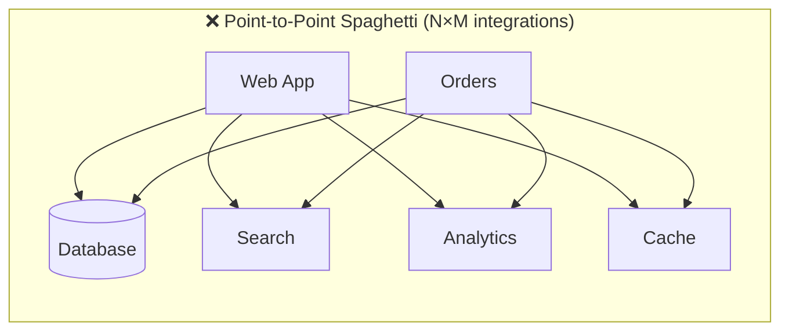

Every new system meant new custom integrations to every other system — an **O(N×M)** mess that was fragile, tightly coupled, and impossible to scale.

Kafka introduces a **central log** so each system produces/consumes once:

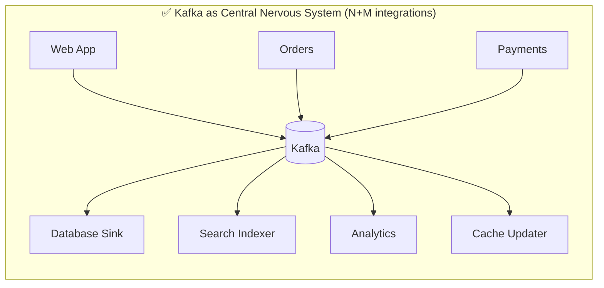

### Problems Kafka solves

| Problem | How Kafka solves it |
|---|---|
| **Tight coupling** between services | Producers & consumers never know about each other — only the topic |
| **Traffic spikes** overwhelming downstream | Kafka buffers; slow consumers catch up later (backpressure via retention) |
| **Data loss** on consumer crash | Durable disk log + replication; consumer resumes from last committed offset |
| **One event, many needs** | Multiple consumer groups read the same stream independently |
| **Reprocessing / bug recovery** | Replay by resetting offsets — the data is still there |
| **Batch latency** (nightly ETL) | Real-time streaming instead of hours-old batches |

### Core concepts (the vocabulary)

| Term | Plain meaning |
|---|---|
| **Topic** | A named stream/category of events (e.g., `orders`, `clicks`) |
| **Partition** | A topic is split into ordered shards; the unit of parallelism & ordering |
| **Offset** | A monotonically increasing ID of a message *within a partition* |
| **Producer** | Client that writes events |
| **Consumer** | Client that reads events |
| **Consumer Group** | Set of consumers sharing the work of a topic (each partition → one member) |
| **Broker** | A single Kafka server; a cluster is many brokers |
| **Record** | A single message: `key`, `value`, `timestamp`, `headers` |
| **Replica** | A copy of a partition on another broker for fault tolerance |

### Real-world analogy 📰

Kafka is like a **newspaper subscription system**:
- The **newspaper** = topic
- **Printing presses** in parallel = partitions
- **Publishers** = producers
- **Subscribers** = consumers; a **household** sharing one subscription = a consumer group (they split which sections they read)
- Your **bookmark on which issue you've read** = offset
- Back issues kept in the archive for a month = **retention**
- The same newspaper delivered to thousands of households independently = **multiple consumer groups**

> [!TIP]
> The single most clarifying mental model: **Kafka is a distributed, durable, replayable log.** Almost every design decision (partitions, offsets, retention, ordering guarantees) follows from that one idea.

---

## 2. 🧩 CORE CONCEPTS (Intermediate Level)

### 2.1 The Log Abstraction

A partition is a **strictly ordered, immutable, append-only sequence**:

```
Partition 0:  [0][1][2][3][4][5][6] → new writes append here →
              ^oldest              ^log-end-offset (LEO)
                     ^consumer A offset=2
                              ^consumer B offset=4
```

- Writes only **append** to the end.
- Each record gets the next **offset**.
- Reads are **sequential** (great for disk throughput).
- Ordering is **guaranteed only within a partition**, never across partitions.

### 2.2 Topics, Partitions & Keys

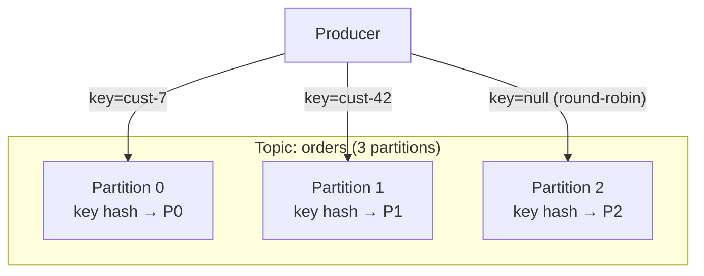

**How the partition is chosen:**
- **Key present** → `partition = murmur2(key) % numPartitions`. Same key → same partition → **ordered per key**.
- **Key null** → sticky/round-robin batching across partitions for throughput.
- **Explicit partition** → producer can override with a custom partitioner.

> [!WARNING]
> **Partition count is effectively one-way.** You can increase partitions but not decrease. Increasing partitions **breaks key→partition affinity** (the modulo changes), scrambling ordering for existing keys. Choose partition count deliberately up front.

### 2.3 Producers — how a write happens

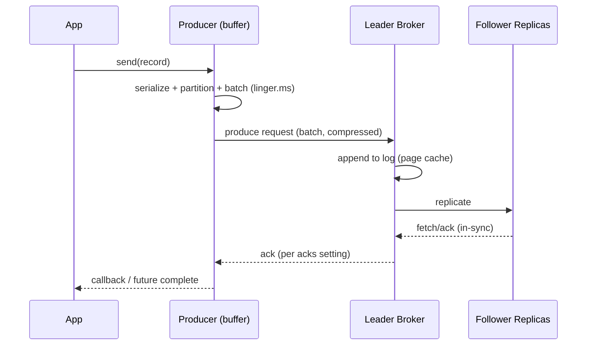

**Key producer configs:**

| Config | Meaning | Trade-off |
|---|---|---|
| `acks=0` | Fire-and-forget | Fastest, can lose data |
| `acks=1` | Leader-only ack | Loses data if leader dies before replication |
| `acks=all` (`-1`) | All in-sync replicas ack | Safest, higher latency |
| `enable.idempotence=true` | Dedup + ordered retries | **Default in modern Kafka**; prevents dupes on retry |
| `linger.ms` | Wait to batch more records | Higher latency, better throughput |
| `batch.size` | Max bytes per batch | Bigger = better throughput |
| `compression.type` | `lz4`/`zstd`/`snappy`/`gzip` | CPU vs network/disk savings |
| `max.in.flight.requests.per.connection` | Concurrent unacked requests | >1 with idempotence still keeps order (≤5) |

> [!TIP]
> For durability with performance, the modern default recipe is: **`acks=all` + `enable.idempotence=true` + `compression.type=zstd` + `linger.ms=5–20`**. Idempotence is on by default since Kafka 3.0.

### 2.4 Consumers & Consumer Groups

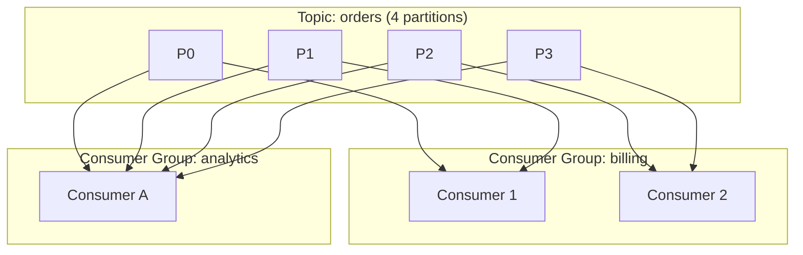

**Rules:**
- Within a group, **each partition is consumed by exactly one member**.
- **Max useful consumers in a group = number of partitions.** Extra consumers sit idle.
- Different groups get **independent copies** of the stream with independent offsets.

**Rebalancing:** when members join/leave, partitions are reassigned.

| Strategy | Behavior |
|---|---|
| `RangeAssignor` | Per-topic ranges (can skew) |
| `RoundRobinAssignor` | Even spread across all partitions |
| `StickyAssignor` | Minimizes movement on rebalance |
| `CooperativeStickyAssignor` | **Incremental** rebalance — no full stop-the-world (preferred) |

> [!WARNING]
> **Stop-the-world rebalancing** (eager protocol) pauses *all* consumers in the group while partitions reshuffle. On large groups this causes latency spikes. Use **`CooperativeStickyAssignor`** for incremental rebalancing, and tune `session.timeout.ms` / `heartbeat.interval.ms` / `max.poll.interval.ms` to avoid spurious rebalances.

### 2.5 Offset Management

Consumers track progress via **committed offsets**, stored in the internal topic `__consumer_offsets`.

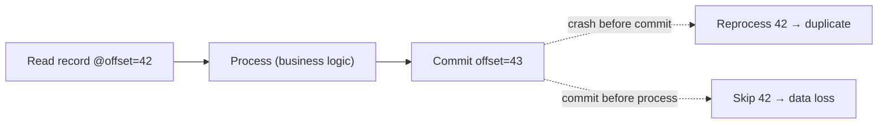

| Commit mode | Semantics | Risk |
|---|---|---|
| `enable.auto.commit=true` | Commits every `auto.commit.interval.ms` | Can lose or dup on crash |
| Manual sync `commitSync()` | Blocks until committed | Safe, slower |
| Manual async `commitAsync()` | Non-blocking | Faster, may miss on failure |

> [!IMPORTANT]
> **Commit AFTER processing** for at-least-once. Committing before processing gives at-most-once (data loss). The order of "process" vs "commit" *is* your delivery semantics.

### 2.6 Replication & the ISR

Each partition has **1 leader + N followers**. Producers/consumers talk only to the leader; followers replicate.

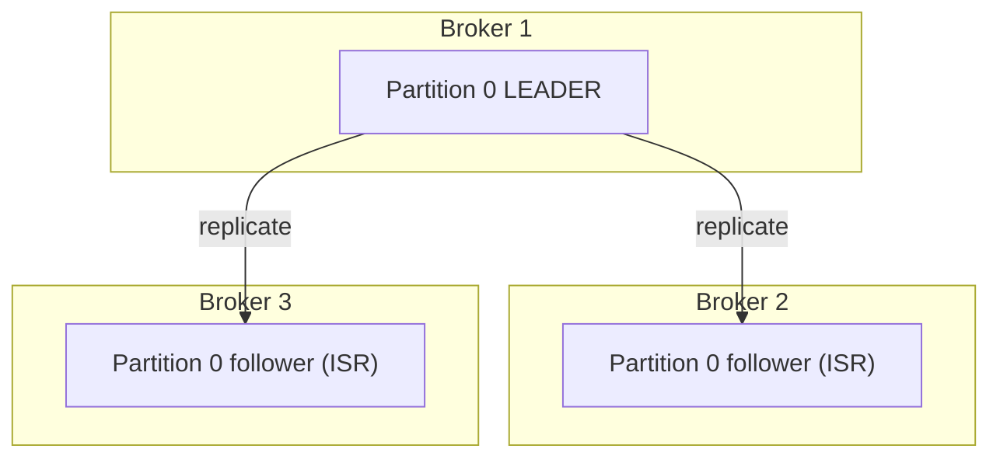

- **ISR (In-Sync Replicas):** replicas caught up with the leader.
- **High Watermark (HW):** highest offset replicated to all ISR; consumers can only read *up to* the HW (committed data).
- If the leader dies, a **new leader is elected from the ISR**.

| Config | Role |
|---|---|
| `replication.factor` | Copies per partition (prod: **3**) |
| `min.insync.replicas` | Min ISR required for `acks=all` write to succeed (prod: **2**) |
| `unclean.leader.election.enable` | If `true`, allows out-of-sync replica to become leader (**data loss** — keep `false`) |

> [!TIP]
> The durable trio: **RF=3, `min.insync.replicas=2`, `acks=all`.** This tolerates one broker failure with zero data loss and continued availability. With RF=3/minISR=2 you can lose 1 broker and still write; lose 2 and writes are rejected (fail safe) rather than losing data.

### 2.7 Architecture Overview

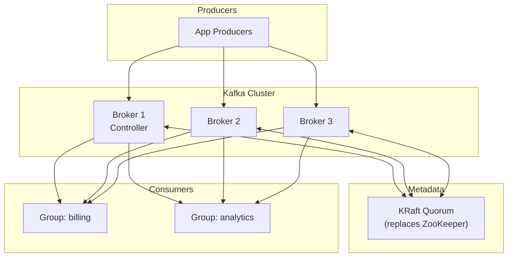

---

## 3. ⚙️ ADVANCED CONCEPTS (Senior Level)

### 3.1 Delivery Semantics — the heart of Kafka correctness

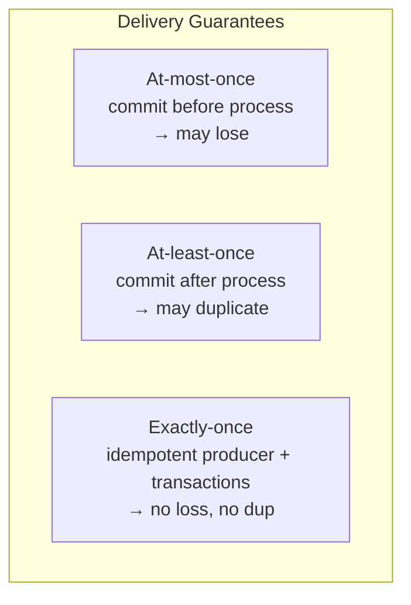

| Semantic | Producer side | Consumer side | Use when |
|---|---|---|---|
| **At-most-once** | `acks=0/1`, no retries | commit before processing | Metrics you can drop |
| **At-least-once** | `acks=all` + retries | commit after processing | **Default for most systems** — pair with idempotent consumers |
| **Exactly-once (EOS)** | idempotent producer + transactions | `read_committed` + offsets committed in the transaction | Financial, dedup-critical pipelines |

**Exactly-Once Semantics (EOS)** combines:
1. **Idempotent producer** — dedups retries within a partition (PID + sequence number).
2. **Transactions** — atomically write to multiple partitions **and** commit consumer offsets, all-or-nothing.
3. **`isolation.level=read_committed`** — consumers skip aborted/uncommitted records.

> [!IMPORTANT]
> EOS only holds **within Kafka** (Kafka→Kafka, e.g., Kafka Streams). The moment you write to an **external system** (a DB, a REST call), you need **idempotent consumers** (dedup keys, upserts) or the **transactional outbox pattern** — Kafka's transactions do not span external systems. In practice: **at-least-once + idempotent consumer is the pragmatic "effectively-once."**

### 3.2 The Idempotent Consumer Pattern

Since true EOS rarely spans external systems, make consumers idempotent:

```java
// Dedup via unique business key + upsert
void handle(OrderEvent e) {
    // Option A: idempotency key table
    if (processedRepo.existsById(e.getEventId())) return;   // already handled
    // Option B: upsert (idempotent by nature)
    orderRepo.upsert(e.getOrderId(), e.getStatus());
    processedRepo.save(e.getEventId());   // same tx as business write
}
```

> [!TIP]
> Store the **dedup marker in the same transaction** as your business write (e.g., a Postgres row with a unique constraint on `event_id`). That gives effectively-once even under at-least-once redelivery. See [[02 Postgres]] for transactional guarantees.

### 3.3 Ordering — subtle and dangerous

- Order is guaranteed **only within a partition**.
- To keep events for an entity ordered → **use a consistent key** (e.g., `orderId`) so they land on the same partition.
- `max.in.flight.requests.per.connection > 1` **without** idempotence can **reorder on retry**. Idempotence preserves order up to 5 in-flight.

> [!WARNING]
> A classic prod bug: enabling retries with `max.in.flight=5` and **idempotence off**. A retried batch can land *after* a later batch → **out-of-order writes**. Fix: keep idempotence enabled (the modern default).

### 3.4 Performance & Throughput Internals

Kafka's speed comes from OS-level tricks:

| Technique | What it does |
|---|---|
| **Sequential I/O** | Append-only log → disk behaves near RAM speed |
| **Zero-copy (`sendfile`)** | Data goes disk → NIC without copying through app memory |
| **Page cache reliance** | Kafka lets the OS cache; JVM heap stays small |
| **Batching + compression** | Fewer, bigger network/disk ops |
| **Partition parallelism** | Linear horizontal scaling |

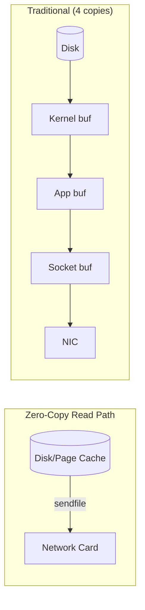

> [!TIP]
> Give Kafka brokers **modest JVM heap (5–6 GB)** and lots of **OS page cache** (RAM). Kafka deliberately offloads caching to the OS — a huge heap causes GC pain without helping throughput.

### 3.5 Retention, Compaction & Cleanup

Two cleanup policies:

| Policy | Behavior | Use case |
|---|---|---|
| `delete` (default) | Drop segments older than `retention.ms` or over `retention.bytes` | Event streams, logs |
| `compact` | Keep the **latest value per key** forever | Changelog / current-state topics (e.g., user profiles) |
| `compact,delete` | Both | Bounded changelogs |

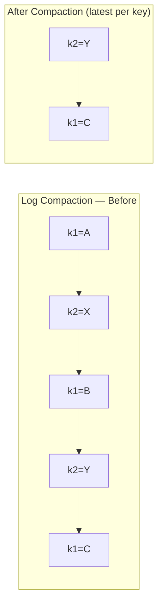

> [!IMPORTANT]
> Compacted topics power **event sourcing** and **Kafka Streams state stores / KTables**. A `null` value for a key is a **tombstone** → deletes that key after `delete.retention.ms`. This is how you "delete" in a compacted log.

### 3.6 Failure Scenarios & Production Issues

| Failure | Symptom | Mitigation |
|---|---|---|
| **Broker down** | Leader re-election, brief unavailability | RF≥3, minISR=2, spread across racks/AZs |
| **Consumer lag explosion** | Downstream falling behind | Scale consumers ≤ partitions, optimize processing, alert on lag |
| **Rebalance storms** | Repeated pauses | `CooperativeStickyAssignor`, tune `max.poll.interval.ms` |
| **Poison pill message** | Consumer crash-loops on one bad record | try/catch + **Dead Letter Topic (DLT)** |
| **Hot partition** | One partition overloaded | Better key distribution / more partitions |
| **`min.insync.replicas` not met** | Producer `NotEnoughReplicas` errors | This is *safety working* — investigate broker health |
| **Under-replicated partitions** | ISR shrinking | Broker/disk/network issue; monitor `UnderReplicatedPartitions` |
| **Disk full** | Broker crash | Retention limits + disk alerts + monitoring |
| **Unclean leader election** | Silent data loss | Keep `unclean.leader.election.enable=false` |

### 3.7 Consumer Lag — the #1 operational metric

**Lag = Log-End-Offset − Committed-Offset** per partition. It tells you how far behind consumers are.

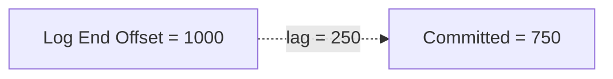

Monitor with **Burrow**, **Kafka Exporter → Prometheus/Grafana**, or `kafka-consumer-groups.sh --describe`.

> [!WARNING]
> Rising lag that never recovers means consumers can't keep up. Options: add consumers (up to partition count), increase partitions (plan the key impact), speed up processing (batch DB writes, async), or shed load. If you're already at `consumers == partitions`, **adding consumers won't help** — you must repartition or optimize.

### 3.8 Dead Letter Topics & Error Handling

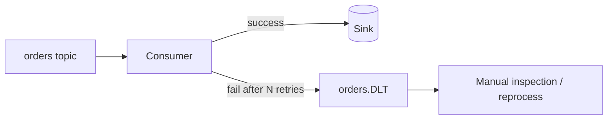

Spring Kafka provides `DefaultErrorHandler` + `DeadLetterPublishingRecoverer`; raw clients need a custom retry+DLT wrapper.

---

## 4. 🏗️ REAL-WORLD SYSTEM DESIGN USAGE

### 4.1 How big companies use Kafka

| Company | Use case |
|---|---|
| **LinkedIn** (birthplace) | Activity streams, metrics, 7+ trillion messages/day |
| **Netflix** | Real-time monitoring, Keystone pipeline, billions of events/day |
| **Uber** | Trip events, surge pricing, real-time analytics (uReplicator) |
| **Airbnb** | Event bus for pricing, search indexing |
| **Slack** | Message delivery, notifications, log pipeline |

### 4.2 Common Architecture Patterns

**A. Event-Driven Microservices** (see [[03 Microservices]])

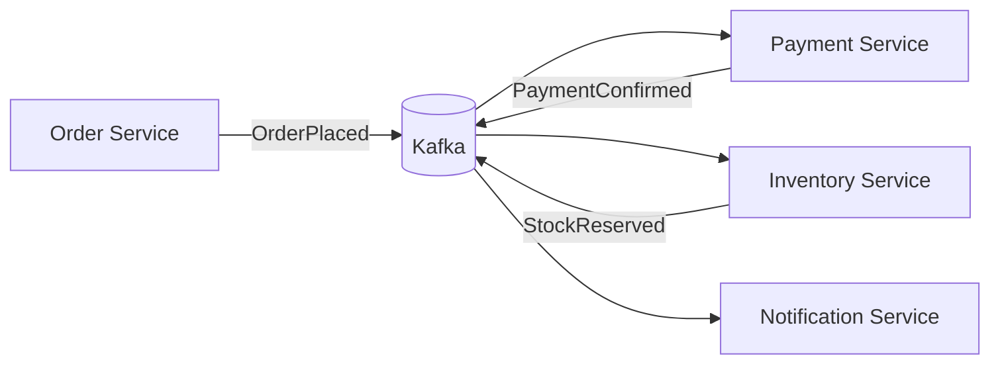

Services communicate via events, not synchronous calls → loose coupling, resilience, independent scaling.

**B. CQRS + Event Sourcing**

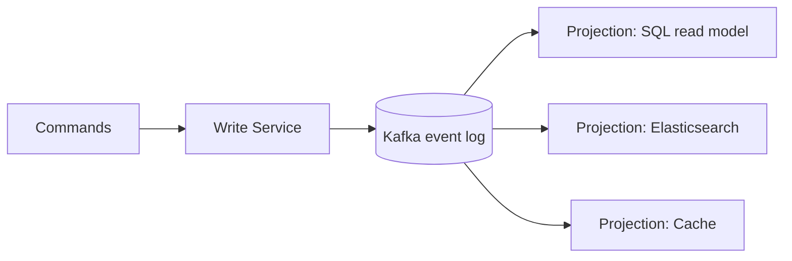

The Kafka log is the **source of truth**; read models are projections rebuilt by replaying events.

**C. The Transactional Outbox** (reliable event publishing)

```mermaid
sequenceDiagram
    participant Svc as Service
    participant DB as Database
    participant CDC as Debezium (CDC)
    participant K as Kafka
    Svc->>DB: BEGIN; write business row + outbox row; COMMIT
    CDC->>DB: read WAL / binlog
    CDC->>K: publish outbox event
```

Solves the **dual-write problem**: you can't atomically write to a DB *and* Kafka. Instead, write both the business change and an "outbox" row in **one DB transaction**, then **Debezium (CDC)** streams the outbox to Kafka. See [[02 Postgres]] / [[03 MongoDB]] for CDC sources.

**D. Log Aggregation & Stream Processing Pipeline**

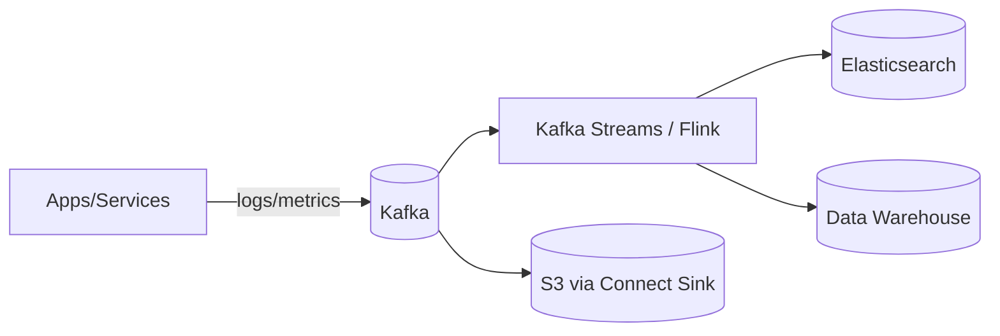

### 4.3 The Kafka Ecosystem

| Component | Purpose |
|---|---|
| **Kafka Connect** | No-code source/sink connectors (JDBC, S3, Elasticsearch, Debezium CDC) |
| **Kafka Streams** | Java library for stateful stream processing (joins, windows, aggregations) |
| **ksqlDB** | SQL over streams |
| **Schema Registry** | Enforce/evolve Avro/Protobuf/JSON schemas |
| **MirrorMaker 2** | Cross-cluster/geo replication |
| **Flink / Spark Streaming** | Heavy external stream processing |

### 4.4 Schema Registry & Evolution

> [!IMPORTANT]
> In production you almost never send raw JSON. Use **Avro/Protobuf + Schema Registry** to enforce **compatibility** (backward/forward/full). This prevents a producer change from silently breaking every downstream consumer — the #1 cause of data pipeline outages at scale.

| Compatibility | Rule |
|---|---|
| **Backward** | New consumer reads old data (can add optional fields) |
| **Forward** | Old consumer reads new data |
| **Full** | Both |

### 4.5 Kafka Streams — stateful processing

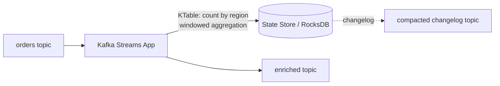

- **KStream** = record stream (each event). **KTable** = changelog/current-state (latest per key, backed by a compacted topic).
- **State stores** (RocksDB) are backed by compacted changelog topics → fault-tolerant, restorable.

---

## 5. 🎤 INTERVIEW PREPARATION

### 5.1 Most important questions

<details>
<summary><b>Q1: Kafka vs traditional message queue (RabbitMQ/SQS)?</b></summary>

| Aspect | Kafka | Traditional MQ (RabbitMQ) |
|---|---|---|
| Model | Distributed **log** (pull) | Queue/broker (push) |
| Message after read | **Retained** (replayable) | Deleted on ack |
| Consumers | Many groups read same data | Compete; message goes to one |
| Ordering | Per-partition | Per-queue (weaker at scale) |
| Throughput | Very high (millions/sec) | Moderate |
| Routing | Simple (topic/partition) | Rich (exchanges, routing keys) |
| Best for | Event streaming, replay, analytics | Complex routing, task queues, RPC |

**Key line:** "Kafka is a durable, replayable log optimized for high-throughput streaming to many consumers; RabbitMQ is a smart broker optimized for flexible routing and per-message delivery."
</details>

<details>
<summary><b>Q2: How does Kafka guarantee ordering?</b></summary>

Only **within a partition**. Use a **consistent key** so related events hash to the same partition. Across partitions there's no global order. Beware `max.in.flight > 1` without idempotence causing reorders on retry.
</details>

<details>
<summary><b>Q3: Explain exactly-once semantics. Is it real?</b></summary>

Real **within Kafka** via idempotent producer (PID + sequence dedup) + transactions (atomic multi-partition write + offset commit) + `read_committed`. It does **not** extend to external systems — for those you need idempotent consumers / outbox. Interviewers love when you say "EOS is Kafka-to-Kafka; cross-system needs idempotency."
</details>

<details>
<summary><b>Q4: What happens when a consumer joins/leaves a group?</b></summary>

A **rebalance** reassigns partitions. Eager protocol = stop-the-world (all pause). Cooperative (incremental) rebalancing avoids the global pause. Triggered by member changes, topic metadata changes, or `max.poll.interval.ms` timeouts (consumer considered dead if it doesn't poll in time).
</details>

<details>
<summary><b>Q5: How do you handle a poison-pill message?</b></summary>

Wrap processing in try/catch, apply bounded retries with backoff, then route to a **Dead Letter Topic**. Never let one bad record crash-loop the consumer and block the partition.
</details>

<details>
<summary><b>Q6: acks=all guarantees no data loss — true?</b></summary>

Only with the full recipe: `acks=all` **+** `min.insync.replicas≥2` **+** RF≥3 **+** `unclean.leader.election.enable=false`. `acks=all` alone with minISR=1 can still lose data if the sole in-sync replica dies.
</details>

<details>
<summary><b>Q7: How do you scale consumers?</b></summary>

Add consumers to the group up to the **partition count** (1 partition : 1 consumer max). Beyond that, add partitions (mind the key→partition remap) or optimize per-record processing. Consumers > partitions = idle consumers.
</details>

<details>
<summary><b>Q8: ZooKeeper vs KRaft?</b></summary>

Legacy Kafka used **ZooKeeper** for metadata/controller election. **KRaft** (KIP-500) replaces it with a built-in Raft quorum — simpler ops, faster failover, millions of partitions, single binary. ZooKeeper is removed in Kafka 4.0. Always answer KRaft for new deployments.
</details>

### 5.2 Tricky questions

> [!TIP]
> **"Can two consumers in the same group read the same partition simultaneously?"** — **No.** One partition → one consumer per group. That's the ordering/parallelism guarantee.

> [!TIP]
> **"If you increase partitions, what breaks?"** — Existing key→partition mapping (`hash % N` changes), so per-key ordering for historical data is lost, and stateful apps (Kafka Streams) may need re-keying. Never repartition a live ordered topic casually.

> [!TIP]
> **"Where are consumer offsets stored?"** — In the internal compacted topic `__consumer_offsets` (not ZooKeeper, since modern versions).

> [!TIP]
> **"Does Kafka push or pull?"** — Consumers **pull** (long-poll). This gives consumers control over rate (natural backpressure) and enables batching/replay.

### 5.3 Common mistakes candidates make

| Mistake | Reality |
|---|---|
| "Kafka is a message queue" | It's a distributed **log**; retention + replay + multi-consumer are the point |
| "Ordering is global" | Only per-partition |
| "acks=all = zero loss" | Needs minISR + RF + no unclean election |
| "More consumers = always faster" | Capped at partition count |
| "Exactly-once everywhere" | Only Kafka-internal; external needs idempotency |
| Forgetting **consumer lag** as the key metric | It's the first thing ops looks at |
| Ignoring schema evolution | #1 real-world pipeline breaker |

### 5.4 What interviewers actually expect

- You reason about **trade-offs** (throughput vs latency vs durability), not memorized configs.
- You know the **durability recipe** and *why* each part matters.
- You distinguish **delivery semantics** and where EOS stops.
- You can **design an event-driven system** and handle failures (DLT, lag, rebalance, outbox).

---

## 6. 🛠️ HANDS-ON PROJECTS

### Project 1: Real-Time Order Processing Pipeline (Beginner→Intermediate)

**Goal:** Event-driven order flow with multiple independent consumers.

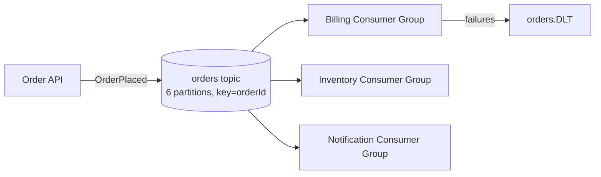

**Steps:**
1. Spin up Kafka via Docker Compose (KRaft mode — no ZooKeeper).
2. Create `orders` topic: `--partitions 6 --replication-factor 3`.
3. Producer (Node.js `kafkajs` or Spring Boot) keyed by `orderId` for per-order ordering.
4. Three consumer groups, each with its own logic.
5. Add manual offset commit **after** processing (at-least-once).
6. Add a DLT + retry for poison pills.

```javascript
// Node.js producer (kafkajs) — see [[05 Node.js]]
const kafka = new Kafka({ clientId: 'order-api', brokers: ['localhost:9092'] });
const producer = kafka.producer({ idempotent: true });
await producer.send({
  topic: 'orders',
  messages: [{ key: order.id, value: JSON.stringify(order) }],
  acks: -1,
});
```

**Learn:** partitioning, keys, consumer groups, offsets, DLT.

---

### Project 2: Idempotent Payment Consumer with Outbox (Intermediate→Senior)

**Goal:** Effectively-once payment processing across Kafka + a database.

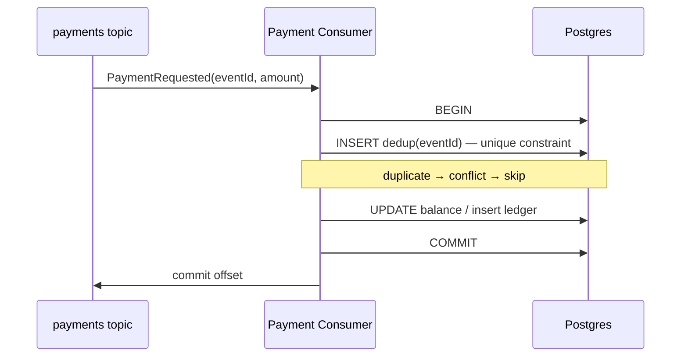

**Steps:**
1. Consumer reads `payments`, uses a **`processed_events(event_id PK)`** table.
2. Business write + dedup insert in the **same [[02 Postgres]] transaction**.
3. On unique-violation → already processed → skip (idempotent).
4. Add a transactional **outbox** to publish `PaymentConfirmed` reliably; stream via Debezium CDC.

**Learn:** delivery semantics, idempotent consumers, dual-write problem, outbox/CDC.

---

### Project 3: Real-Time Analytics with Kafka Streams (Senior)

**Goal:** Windowed aggregations + a live dashboard.

```mermaid
flowchart LR
    Clicks[clicks topic] --> KS[Kafka Streams]
    KS -->|"tumbling 1-min window<br/>count by page"| Agg[page-views-per-min]
    Agg --> Dash[Dashboard / WebSocket]
    KS -.state.-> RDB[(RocksDB + changelog)]
```

**Steps:**
1. Produce a `clicks` stream (simulate traffic).
2. Kafka Streams: `groupByKey().windowedBy(TimeWindows.ofSizeWithNoGrace(Duration.ofMinutes(1))).count()`.
3. Materialize to a compacted output topic.
4. Consume into a WebSocket dashboard ([[06 Express.js]] / [[07 Hono]]).
5. Kill/restart the app → observe state restore from the changelog.

**Learn:** stateful stream processing, windowing, KTables, state stores, fault tolerance.

---

## 7. 🔬 DEEP DIVE: INTERNALS

### 7.1 On-Disk Storage Layout

A partition is a directory of **segment files**:

```
/kafka-logs/orders-0/
  00000000000000000000.log     ← records (base offset 0)
  00000000000000000000.index   ← offset → byte position (sparse)
  00000000000000000000.timeindex← timestamp → offset
  00000000000000368421.log     ← next segment (base offset 368421)
  ...
  leader-epoch-checkpoint
```

- The **active segment** receives writes; closed segments are immutable.
- **Sparse indexes** (`.index`, `.timeindex`) enable `O(log n)` lookup by offset/timestamp via binary search, then sequential scan.
- Retention/compaction operate at **segment granularity** (delete whole old segments — cheap).

```mermaid
flowchart LR
    subgraph Partition["Partition = ordered segments"]
        S0["Segment base=0<br/>(closed, immutable)"]
        S1["Segment base=368421<br/>(closed)"]
        S2["Active segment<br/>(appends here)"]
    end
    S0 --> S1 --> S2
```

### 7.2 KRaft — the ZooKeeper replacement

```mermaid
flowchart TB
    subgraph KRaft["KRaft Metadata Quorum (Raft)"]
        C1["Controller 1 (leader)"]
        C2[Controller 2]
        C3[Controller 3]
        C1 <-->|Raft replication| C2
        C1 <-->|Raft replication| C3
    end
    C1 -->|metadata log| B1[Broker]
    C1 -->|metadata log| B2[Broker]
```

- Cluster metadata is itself stored as an **event log** (`__cluster_metadata`) replicated via Raft.
- No external ZooKeeper → **faster failover, millions of partitions, single system to operate**.
- Controllers form a quorum; brokers replay the metadata log.

### 7.3 The Produce/Consume Byte Path

**Produce:**
1. Producer batches + compresses records per partition.
2. Sends to the **leader** broker.
3. Leader appends to the active segment (writes to **page cache**, OS flushes lazily).
4. Followers **fetch** and replicate; leader advances **High Watermark** once ISR catches up.
5. Ack returned per `acks`.

**Consume (zero-copy):**
1. Consumer sends a fetch request (offset + max bytes).
2. Broker uses **`sendfile()`** to transfer log bytes **directly from page cache to the socket** — no user-space copy, no serialization on the broker.
3. Consumer decompresses + deserializes client-side.

> [!IMPORTANT]
> Kafka does **almost no work per message on the broker** — no per-message transformation, zero-copy transfer, OS page cache. That's why a single broker handles enormous throughput. The cleverness is in *doing less*, offloaded to the kernel.

### 7.4 Idempotent Producer Internals

- Each producer gets a **Producer ID (PID)** and a **monotonic sequence number per partition**.
- The broker tracks the last sequence per (PID, partition). A ret[ried duplicate has the same sequence → broker **drops it**.
- Out-of-order sequence → `OutOfOrderSequenceException`. This is how retries don't create dupes and don't reorder (up to 5 in-flight).

### 7.5 Transactions Internals

```mermaid
sequenceDiagram
    participant P as Producer
    participant TC as Transaction Coordinator
    participant B as Partitions
    P->>TC: initTransactions (get PID + epoch)
    P->>TC: beginTransaction
    P->>B: send records (marked in-tx)
    P->>TC: sendOffsetsToTransaction (consumer offsets)
    P->>TC: commitTransaction
    TC->>B: write COMMIT markers
    Note over B: read_committed consumers now see records
```

- A **Transaction Coordinator** + internal `__transaction_state` topic track transaction status.
- **Control markers** (commit/abort) are written into partitions; `read_committed` consumers filter aborted records.
- **Producer epoch** fences zombie producers (a restarted producer with a higher epoch invalidates the old one).

---

## ✅ Production Checklists

### Cluster / Broker
- [ ] **RF=3**, spread across **3 racks/AZs** (`broker.rack`)
- [ ] `min.insync.replicas=2`
- [ ] `unclean.leader.election.enable=false`
- [ ] KRaft mode (not ZooKeeper) for new clusters
- [ ] Dedicated fast disks; JVM heap **5–6 GB**, rest for page cache
- [ ] Monitor `UnderReplicatedPartitions`, `OfflinePartitionsCount`, `ActiveControllerCount=1`

### Producer
- [ ] `acks=all`, `enable.idempotence=true`
- [ ] `compression.type=zstd`/`lz4`
- [ ] Tuned `linger.ms` + `batch.size`
- [ ] Sensible `retries` + `delivery.timeout.ms`
- [ ] Consistent **keys** where ordering matters

### Consumer
- [ ] Manual commit **after** processing
- [ ] `CooperativeStickyAssignor`
- [ ] Tuned `max.poll.records`, `max.poll.interval.ms`
- [ ] **DLT** + bounded retry with backoff
- [ ] **Idempotent** processing (dedup key / upsert)
- [ ] **Consumer-lag alerting**

### Data Governance
- [ ] **Schema Registry** with compatibility enforced
- [ ] Documented retention & compaction per topic
- [ ] Topic naming conventions + partition-count planning
- [ ] ACLs / TLS / SASL auth enabled

---

## 🗺️ Learning Roadmap

```mermaid
flowchart TB
    A["1️⃣ Fundamentals<br/>topics, partitions, offsets, log model"] --> B["2️⃣ Producers & Consumers<br/>keys, groups, commits"]
    B --> C["3️⃣ Reliability<br/>replication, ISR, acks, delivery semantics"]
    C --> D["4️⃣ Operations<br/>lag, rebalancing, DLT, monitoring"]
    D --> E["5️⃣ Advanced<br/>transactions/EOS, compaction, tuning"]
    E --> F["6️⃣ Ecosystem<br/>Connect, Streams, Schema Registry, ksqlDB"]
    F --> G["7️⃣ Architecture<br/>event-driven, CQRS, outbox, CDC"]
    G --> H["8️⃣ Internals<br/>storage, KRaft, zero-copy, source"]
```

| Stage | Focus | You can... |
|---|---|---|
| 1–2 | Core model + clients | Build a producer/consumer, use groups |
| 3–4 | Reliability + ops | Configure durability, debug lag, handle failures |
| 5–6 | Advanced + ecosystem | Do EOS, Streams, Connect, schemas |
| 7–8 | Design + internals | Architect event-driven systems, reason at source level |

---

## 🔁 Self-Review Completion Loop

I recursively reviewed this guide against official docs, best practices, edge cases, interview patterns, and production scenarios.

### Gap Review Matrix

| Dimension | Covered? | Where |
|---|---|---|
| Core model (topics/partitions/offsets/log) | ✅ | §1, §2.1–2.2 |
| Producers (acks, idempotence, batching) | ✅ | §2.3 |
| Consumers & groups & rebalancing | ✅ | §2.4 |
| Offset management & commit semantics | ✅ | §2.5 |
| Replication, ISR, High Watermark | ✅ | §2.6 |
| Delivery semantics (at-most/least/exactly) | ✅ | §3.1 |
| Idempotent consumer / dedup | ✅ | §3.2 |
| Ordering pitfalls | ✅ | §3.3 |
| Performance internals (zero-copy, page cache) | ✅ | §3.4, §7.3 |
| Retention & log compaction | ✅ | §3.5 |
| Failure scenarios | ✅ | §3.6 |
| Consumer lag | ✅ | §3.7 |
| Dead Letter Topics | ✅ | §3.8 |
| Ecosystem (Connect/Streams/ksqlDB/Registry) | ✅ | §4.3–4.5 |
| Schema evolution & compatibility | ✅ | §4.4 |
| Architecture patterns (EDA/CQRS/Outbox/CDC) | ✅ | §4.2 |
| Transactions internals | ✅ | §7.5 |
| KRaft vs ZooKeeper | ✅ | §5.1 Q8, §7.2 |
| On-disk storage & segments | ✅ | §7.1 |
| Security (TLS/SASL/ACLs) | ✅ | Checklists |
| Interview Q&A + mistakes | ✅ | §5 |
| Hands-on projects | ✅ | §6 |

> [!NOTE]
> **Remaining depth to explore independently:** tiered storage (KIP-405), quotas/throttling, MirrorMaker 2 active-active geo-replication, exactly-once with Kafka Connect, cruise-control for rebalancing, and cost/right-sizing of partitions at extreme scale.

---

## 📚 Official References

| Resource | URL |
|---|---|
| Apache Kafka Docs | https://kafka.apache.org/documentation/ |
| Kafka Design | https://kafka.apache.org/documentation/#design |
| KRaft (KIP-500) | https://cwiki.apache.org/confluence/display/KAFKA/KIP-500 |
| Producer/Consumer configs | https://kafka.apache.org/documentation/#configuration |
| Kafka Streams | https://kafka.apache.org/documentation/streams/ |
| Kafka Connect | https://kafka.apache.org/documentation/#connect |
| Confluent Developer | https://developer.confluent.io/ |
| Confluent Schema Registry | https://docs.confluent.io/platform/current/schema-registry/ |
| Exactly-Once (KIP-98) | https://cwiki.apache.org/confluence/display/KAFKA/KIP-98 |

---

## 🎁 Final Summary

> [!IMPORTANT]
> **The one-paragraph takeaway:** Kafka is a **distributed, partitioned, replicated commit log**. Everything follows from that: **partitions** give parallelism and per-key ordering; **offsets + retention** give replay and independent multi-consumer reads; **replication + ISR + acks** give durability; **consumer groups** give scalable, fault-tolerant consumption. It excels at high-throughput event streaming by *doing less per message* (sequential I/O, zero-copy, page cache). Master the **durability recipe** (RF=3, minISR=2, acks=all, no unclean election), the **delivery semantics** (at-least-once + idempotent consumers is the pragmatic default; true exactly-once is Kafka-internal only), and the **operational metric that matters most — consumer lag**.

**Golden rules:**
1. 🔑 Order lives **inside a partition** — key your messages to preserve it.
2. 🛡️ Durability = **RF=3 + minISR=2 + acks=all + no unclean election**.
3. 🔁 Assume **at-least-once**; make consumers **idempotent**.
4. 📊 Watch **consumer lag** above all else.
5. 📐 Plan **partition count** early — it's hard to change.
6. 🧬 Use a **Schema Registry** — schema drift is the silent pipeline killer.
7. ⚡ Give RAM to **page cache**, not the JVM heap.

---

*Related guides in this vault: [[03 Microservices]] · [[05 Spring Boot]] · [[05 Node.js]] · [[02 Postgres]] · [[03 MongoDB]] · [[06 Express.js]] · [[07 Hono]]*
