# 🐰 RabbitMQ — Complete Beginner-to-Expert Reference

> The battle-tested message broker built for flexible routing and reliable delivery — a "smart broker" that decouples services, absorbs load, and guarantees work gets done.

---

## 📑 Table of Contents

1. [Executive Summary](#-executive-summary)
2. [Fundamentals (Beginner)](#1--fundamentals-beginner-level)
3. [Core Concepts (Intermediate)](#2--core-concepts-intermediate-level)
4. [Advanced Concepts (Senior)](#3--advanced-concepts-senior-level)
5. [Real-World System Design](#4--real-world-system-design-usage)
6. [Interview Preparation](#5--interview-preparation)
7. [Hands-On Projects](#6--hands-on-projects)
8. [Deep Dive: Internals](#7--deep-dive-internals)
9. [Production Checklists](#-production-checklists)
10. [Learning Roadmap](#-learning-roadmap)
11. [Self-Review Completion Loop](#-self-review-completion-loop)
12. [Official References](#-official-references)
13. [Final Summary](#-final-summary)

---

## 🎯 Executive Summary

**RabbitMQ** is an open-source **message broker** — middleware that lets applications communicate by sending **messages** through the broker instead of calling each other directly. It implements the **AMQP** protocol and is famous for its **flexible routing** (exchanges + bindings), **reliable delivery** (acknowledgments, persistence), and maturity. It's a "smart broker, dumb consumer" system: routing logic lives in the broker.

| What it is | What it replaces | Core superpower |
|---|---|---|
| Message broker (AMQP) | Synchronous service-to-service calls, ad-hoc job tables | **Flexible routing + reliable, per-message delivery** with acknowledgments |

> [!IMPORTANT]
> RabbitMQ is a **traditional message queue / broker**, fundamentally different from [[01 Kafka]]'s distributed log. RabbitMQ **pushes** messages to consumers and **deletes them once acknowledged** — it's optimized for *flexible routing* and *task distribution* (get work to the right worker, reliably, once). [[01 Kafka]] **retains** a replayable log that many consumers read independently. The mental shorthand: **RabbitMQ = a smart post office that routes and delivers letters; Kafka = a durable newspaper archive many readers subscribe to.** Choosing between them is one of the most common architecture (and interview) questions — this guide makes the distinction crisp.

Related guides: [[01 Kafka]] · [[03 Microservices]] · [[04 Redis]] · [[05 Node.js]] · [[05 Spring Boot]] · [[01 System Design Fundamentals]] · [[01 Docker]]

---

## 1. 🌱 FUNDAMENTALS (Beginner Level)

### What is RabbitMQ in simple terms?

When Service A needs Service B to do something, the naive way is a **direct synchronous call** — A waits for B. But what if B is slow, down, or overwhelmed? A is blocked or fails. **RabbitMQ is a middleman**: A drops a **message** into RabbitMQ and moves on; B picks it up when ready. They never talk directly, never wait on each other, and RabbitMQ makes sure the message isn't lost.

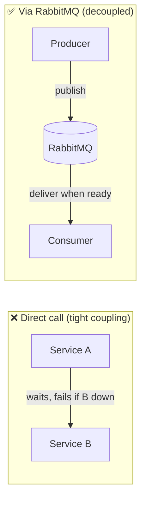

### Why does RabbitMQ exist?

Direct, synchronous communication between services creates fragile, tightly-coupled systems:

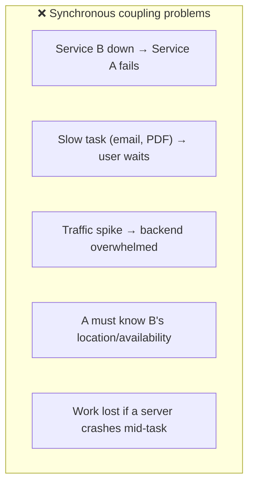

RabbitMQ (2007, Erlang) provides **asynchronous, decoupled, reliable** messaging — a proven pattern for building resilient distributed systems and [[03 Microservices]].

### Problems RabbitMQ solves

| Problem | How RabbitMQ solves it |
|---|---|
| **Tight coupling** | Producers & consumers only know the broker |
| **Slow synchronous work** | Offload to a queue; respond to the user instantly |
| **Traffic spikes** | Queue buffers work; consumers process at their pace |
| **Lost work on crash** | Persistence + acknowledgments guarantee delivery |
| **Uneven load** | Multiple consumers share a queue (work distribution) |
| **Complex routing needs** | Exchanges route by rules (direct/topic/fanout) |
| **Different processing speeds** | Producer and consumer scale independently |

### Core concepts (the vocabulary)

| Term | Plain meaning |
|---|---|
| **Producer** | App that sends messages |
| **Consumer** | App that receives messages |
| **Message** | The data being sent (+ headers/properties) |
| **Queue** | A buffer that holds messages until consumed |
| **Exchange** | Receives messages from producers, routes to queues |
| **Binding** | A rule linking an exchange to a queue |
| **Routing key** | A label on a message used for routing |
| **Broker** | The RabbitMQ server itself |
| **Acknowledgment (ack)** | Consumer confirms a message was processed |
| **Virtual host (vhost)** | Isolated namespace within a broker |
| **Channel** | A lightweight virtual connection inside a TCP connection |

### The key insight: producers don't publish to queues

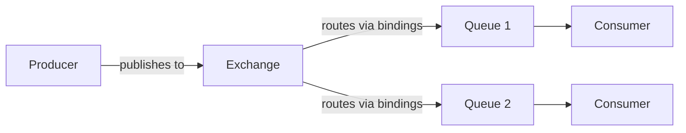

> [!IMPORTANT]
> The single most important RabbitMQ concept beginners miss: **producers publish to an EXCHANGE, never directly to a queue.** The exchange decides which queue(s) get the message based on **bindings** and the **routing key**. This indirection is RabbitMQ's superpower — the producer doesn't know or care which queues exist; you can add/remove consumers and change routing without touching the producer. The exchange type (direct/topic/fanout/headers) determines the routing logic.

### Real-world analogy 📮

RabbitMQ is like a **postal sorting office**:
- You (producer) drop a **letter** (message) with an **address** (routing key) at the post office (exchange) — you don't hand-deliver it or even know which mailbag it goes into.
- The **sorting office** (exchange) reads the address and, based on **sorting rules** (bindings), puts it into the right **mailbags** (queues).
- **Mail carriers** (consumers) pick up letters from their assigned mailbags and deliver them.
- If a carrier drops a letter without confirming delivery (no ack), the office **re-sends** it (redelivery).
- Once delivered and signed for (acknowledged), the letter is **gone from the system** (deleted).

> [!TIP]
> The mental model: **RabbitMQ moves messages from producers to the right consumers reliably, and messages disappear once done.** Unlike [[01 Kafka]]'s "everyone reads the same log," RabbitMQ is about *routing a unit of work to a worker and ensuring it's completed exactly one place*. Think "task distribution and routing," not "event stream."

---

## 2. 🧩 CORE CONCEPTS (Intermediate Level)

### 2.1 The AMQP Model: Exchanges, Queues, Bindings

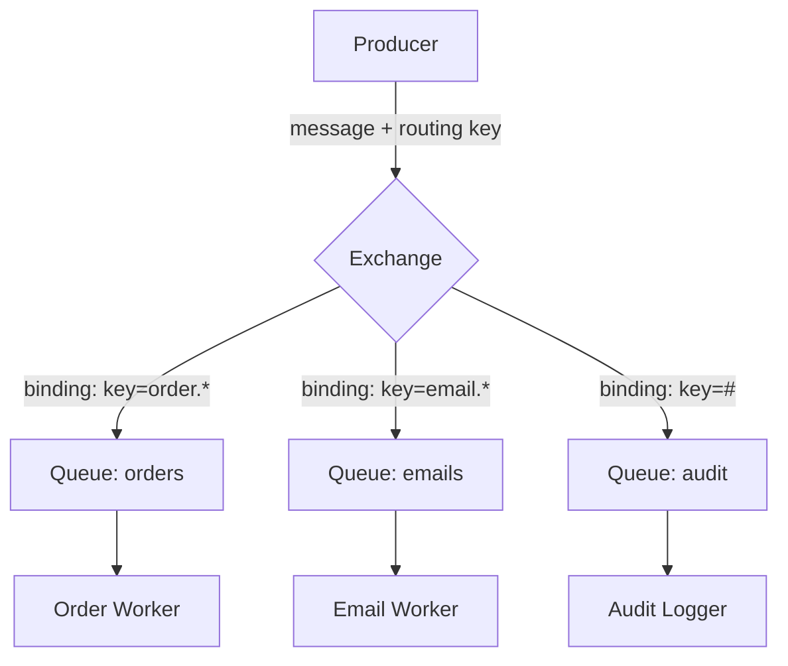

**The flow:**
1. Producer publishes a **message** with a **routing key** to an **exchange**.
2. The exchange examines its **bindings** (rules connecting it to queues).
3. Matching queues receive a copy of the message.
4. Consumers pull from their queues and **acknowledge** when done.

### 2.2 Exchange Types (the routing brain)

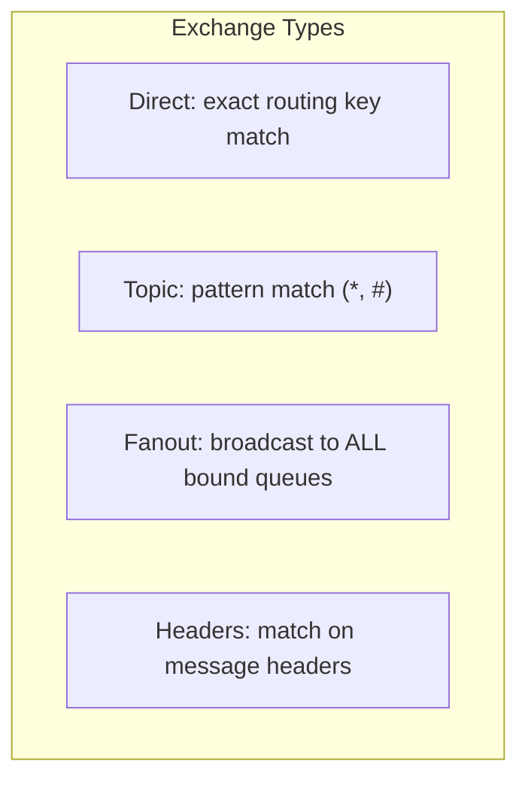

| Exchange type | Routing logic | Use case |
|---|---|---|
| **Direct** | Routing key **exactly equals** binding key | Route by specific type (`error` → error queue) |
| **Topic** | Routing key matches a **pattern** (`*` = one word, `#` = zero+ words) | Flexible routing (`order.created.us`) |
| **Fanout** | **Ignores** routing key — sends to **all** bound queues | Broadcast (notify all services of an event) |
| **Headers** | Matches on **header attributes** instead of routing key | Complex multi-attribute routing |
| **Default** (nameless) | Direct exchange; routing key = queue name | Simple "publish to a queue" (beginner convenience) |

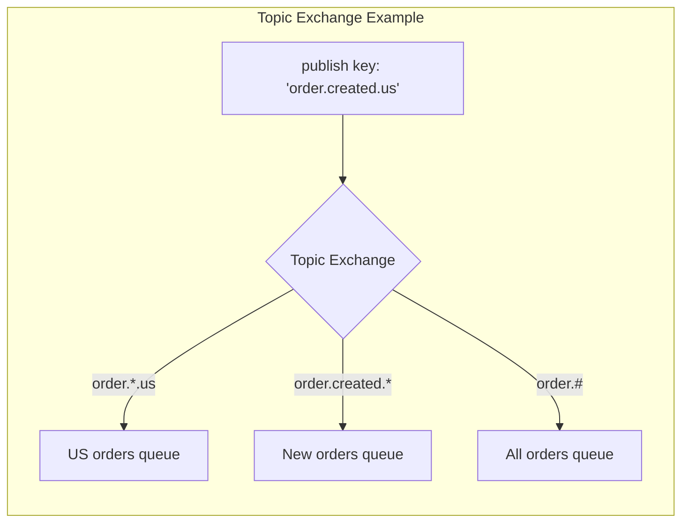

> [!TIP]
> **Topic exchanges are the most flexible and commonly used** in real systems. A routing key like `order.created.us` can be matched by patterns: `order.*.us` (all US order events), `order.created.#` (all creation events anywhere), or `#` (everything). This lets you build sophisticated, evolvable routing without changing producers. **Fanout** is for pure broadcast (every consumer needs every message). **Direct** is for simple exact-match routing. Start with topic — it subsumes direct and gives room to grow.

### 2.3 The Default Exchange (why "publish to a queue" seems to work)

```python
# This LOOKS like publishing directly to a queue...
channel.basic_publish(exchange='', routing_key='task_queue', body='hello')
# ...but '' is the DEFAULT exchange (a direct exchange),
# and every queue is auto-bound to it by its own name.
```

> [!WARNING]
> Beginners write `exchange=''` and think they're publishing to a queue directly — but that's the **default (nameless) exchange**, a special direct exchange to which every queue is automatically bound using its name as the routing key. It's a convenience that *hides* the exchange concept, which is exactly why beginners get confused later when routing gets complex. Understand that **there's always an exchange** — the default one just makes simple cases look queue-direct.

### 2.4 Acknowledgments & Reliable Delivery

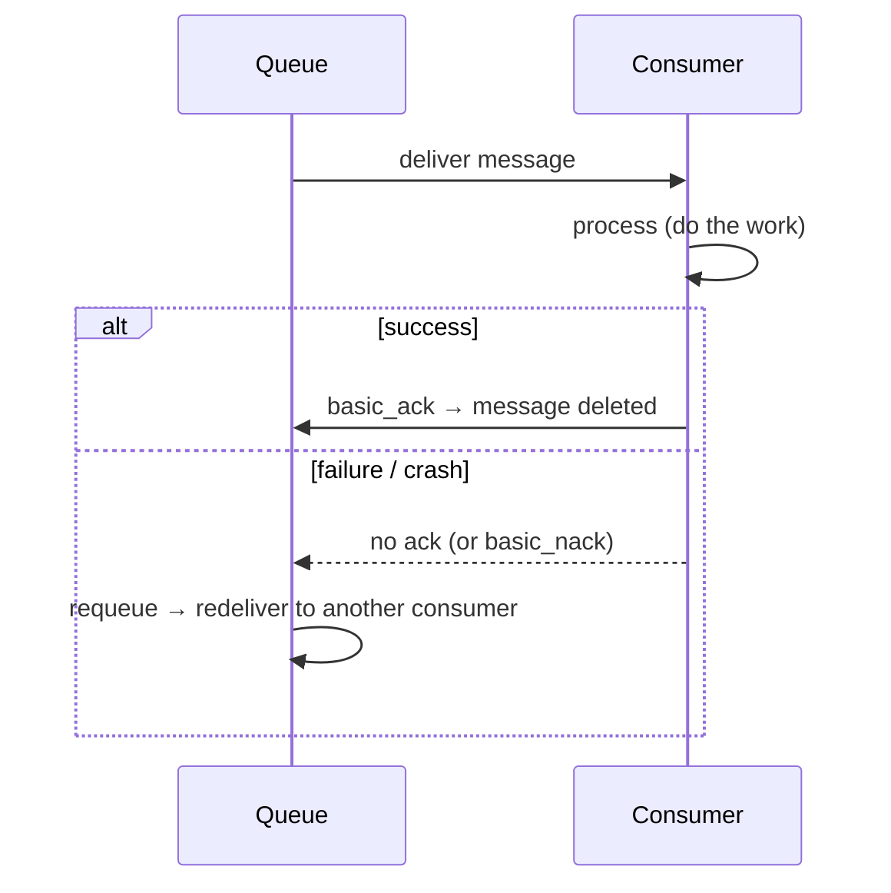

| Ack mode | Behavior | Risk |
|---|---|---|
| **Auto-ack** | Message deleted on delivery (before processing) | **Lost** if consumer crashes mid-process |
| **Manual ack** | Consumer acks *after* successful processing | Safe (at-least-once); possible duplicates |
| **`basic_nack`/`reject`** | Negative ack — requeue or discard/DLX | Controlled failure handling |

> [!IMPORTANT]
> **Manual acknowledgment is the foundation of reliable delivery.** With manual acks, RabbitMQ holds a message as "unacknowledged" until the consumer confirms success (`basic_ack`). If the consumer crashes before acking, RabbitMQ **redelivers** the message to another consumer — nothing is lost. This gives **at-least-once** delivery (a message may be delivered more than once on retry), so consumers must be **idempotent** — the same discipline as [[01 Kafka]]. Never use auto-ack for important work: a crash mid-processing silently loses the message.

### 2.5 Persistence & Durability (surviving broker restart)

For messages to survive a RabbitMQ restart, **three things** must all be durable:

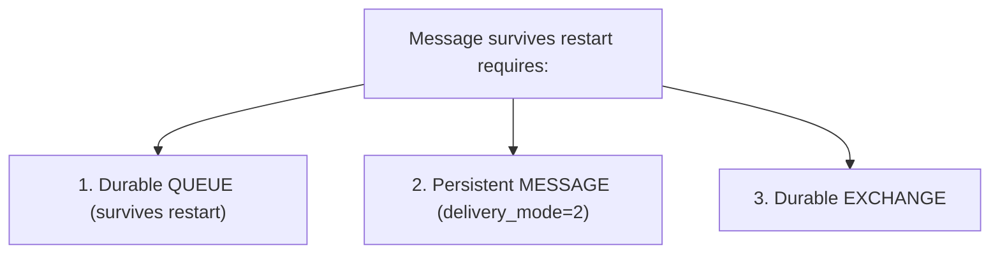

> [!WARNING]
> A common data-loss trap: developers mark the **queue** durable but forget to mark **messages** as persistent (`delivery_mode=2`) — so on a broker crash, the queue survives but its messages are gone. **You need both**: a durable queue *and* persistent messages. Even then, persistence isn't instant — there's a small window where a message is in memory but not yet written to disk. For true guarantees, combine persistence with **publisher confirms** (§3.1). Persistence also costs throughput (disk writes), so use it deliberately for important messages.

### 2.6 Work Queues & Fair Dispatch

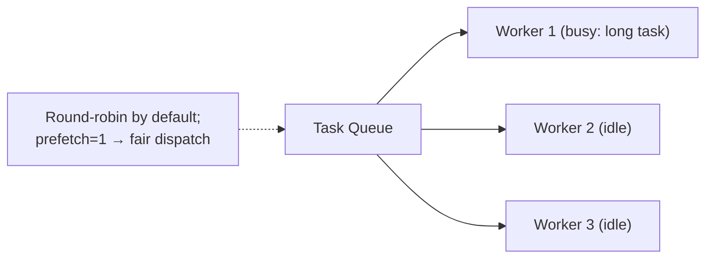

- **Multiple consumers on one queue** share the work — RabbitMQ round-robins messages between them (the **competing consumers** pattern).
- **`prefetch` (QoS)**: limits how many unacked messages a consumer holds at once. `prefetch=1` = "don't give me a new message until I've acked the current one" → **fair dispatch** (busy workers don't pile up).

> [!TIP]
> By default RabbitMQ **round-robins** messages to consumers regardless of how busy they are — so a worker stuck on a slow task still gets new messages queued behind it while idle workers sit empty. Setting **`prefetch=1`** (basic.qos) enables **fair dispatch**: RabbitMQ only sends a consumer a new message once it has acked the previous one, so fast/idle workers naturally take more work. Tuning prefetch is one of the most impactful RabbitMQ performance knobs — too low underutilizes; too high causes uneven load and memory pressure.

### 2.7 Connections vs Channels

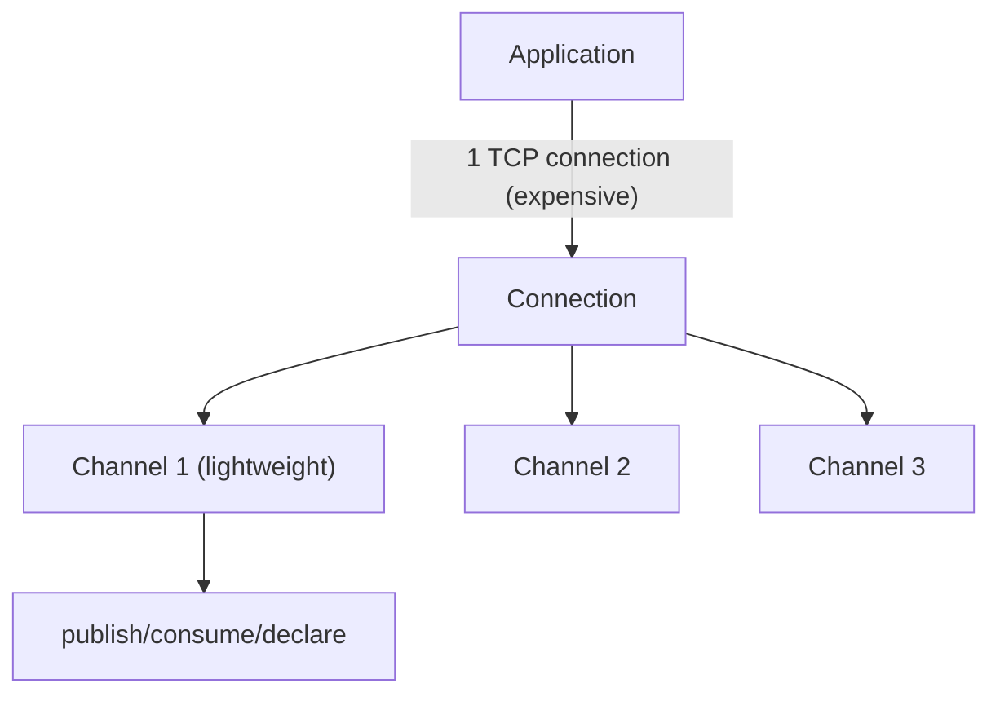

> [!TIP]
> Opening a **TCP connection** is expensive; RabbitMQ multiplexes many **channels** over a single connection. A channel is a lightweight virtual connection where all the real work (publish, consume, declare) happens. **Best practice: one long-lived connection per app (or per process), many channels** — often one channel per thread (channels are *not* thread-safe). A classic anti-pattern is opening a new connection per message, which exhausts resources. Reuse connections, use channels liberally.

---

## 3. ⚙️ ADVANCED CONCEPTS (Senior Level)

### 3.1 Publisher Confirms (guaranteed publishing)

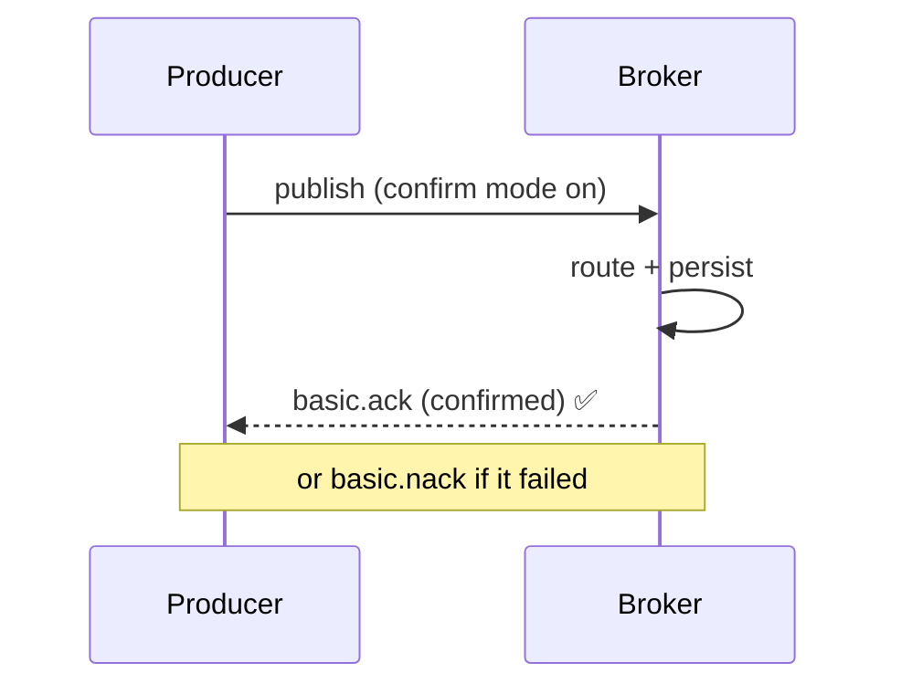

> [!IMPORTANT]
> Acknowledgments protect the **consumer** side; **publisher confirms** protect the **producer** side. Without confirms, `basic_publish` is fire-and-forget — the producer doesn't know if the broker actually received and persisted the message (it could be lost in a network blip or broker crash). **Publisher confirms** make the broker send an `ack` back once the message is safely handled, so the producer knows it's durable. For end-to-end reliability you need **both**: publisher confirms (producer→broker) *and* consumer acks (broker→consumer). This is the RabbitMQ equivalent of [[01 Kafka]]'s `acks=all`.

### 3.2 Dead Letter Exchanges (DLX) & Handling Failures

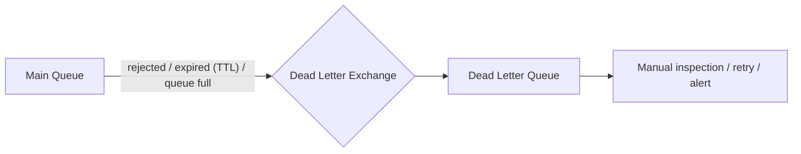

Messages get "dead-lettered" (routed to a DLX) when they are:
- **Rejected** (`basic_nack`/`reject` with `requeue=false`),
- **Expired** (message TTL exceeded),
- **Dropped** because the queue hit its length limit.

> [!WARNING]
> Without a **Dead Letter Exchange**, a "poison message" (one that always fails processing) gets endlessly **requeued** — the consumer keeps crashing on it, blocking the queue and burning CPU forever. The fix: after N failed attempts, `reject` with `requeue=false` so it's **dead-lettered** to a DLQ for inspection/alerting instead of poisoning the main queue. DLX is also the building block for **delayed retries** (dead-letter to a queue with a TTL that routes back after a delay) — the classic RabbitMQ retry pattern, since it has no native delayed-message support (there's a plugin).

### 3.3 Message TTL, Queue Limits & Priority

| Feature | Purpose |
|---|---|
| **Message TTL** | Auto-expire messages after a time (→ DLX) |
| **Queue TTL** | Auto-delete an unused queue |
| **Max length / max bytes** | Cap queue size; overflow → drop or dead-letter |
| **Priority queues** | Higher-priority messages jump ahead |
| **Lazy queues** | Keep messages on disk (for very long queues) |

> [!TIP]
> **Queue length limits + DLX are essential backpressure tools.** An unbounded queue that fills faster than consumers drain it will eventually **exhaust broker memory and crash RabbitMQ** (a real outage mode). Set `max-length`, and on overflow either drop oldest or dead-letter. **Lazy queues** (messages kept on disk, not memory) are the right choice when queues can grow very large — they trade latency for stability, preventing the memory blowup that kills brokers under backlog.

### 3.4 High Availability: Clustering & Quorum Queues

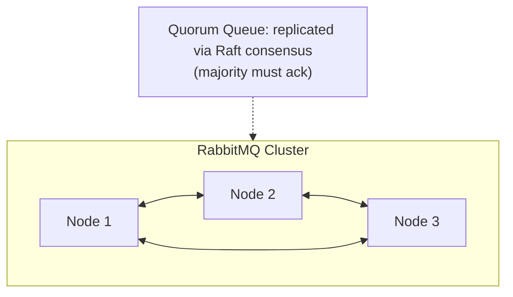

| Approach | Notes |
|---|---|
| **Clustering** | Multiple nodes share metadata & vhosts; a queue historically lived on one node |
| **Classic mirrored queues** | Old HA — mirror a queue to other nodes (**deprecated**) |
| **Quorum queues** | Modern HA — **Raft-based** replication, majority quorum (the recommended default now) |
| **Streams** | Newer append-only, replayable log type (Kafka-like, added in 3.9+) |

> [!IMPORTANT]
> **Quorum queues are the modern standard for HA in RabbitMQ**, replacing the deprecated classic mirrored queues. They use the **Raft consensus algorithm** (same as [[02 Kubernetes]] etcd, [[01 Kafka]] KRaft): the queue is replicated across nodes and a write is confirmed once a **majority** acknowledges it — so the queue survives node failures without data loss. Trade-off: quorum queues are heavier (replication overhead) and every replicated write costs more. For a durable, HA task queue, quorum queues + publisher confirms + persistent messages is the reliable combination.

### 3.5 RabbitMQ Streams (the Kafka-like addition)

> [!TIP]
> Modern RabbitMQ (3.9+) added **Streams** — an append-only, **replayable, persistent log** with a dedicated high-throughput protocol, directly inspired by [[01 Kafka]]. Streams let multiple consumers read the same messages independently and replay history, blurring the old "RabbitMQ vs Kafka" line. However, Kafka is still generally superior for extreme-throughput event streaming and its mature ecosystem (Connect, Streams, ksqlDB). RabbitMQ Streams is great when you're *already* running RabbitMQ and want log-style consumption for some workloads without adding Kafka. Know it exists — but classic queues remain RabbitMQ's core strength.

### 3.6 Failure Scenarios & Production Issues

| Failure | Symptom | Mitigation |
|---|---|---|
| **Poison message** | Consumer crash-loops on one message | Retry limit → DLX |
| **Queue memory blowup** | Broker crashes under backlog | Max-length limits, lazy queues, scale consumers |
| **Lost messages** | Missing work after crash | Durable queue + persistent msgs + publisher confirms |
| **Auto-ack data loss** | Work vanishes on consumer crash | Use manual acks |
| **Unbounded connections** | Broker resource exhaustion | Reuse connections, use channels; connection limits |
| **Uneven worker load** | Some idle, some overloaded | `prefetch=1` fair dispatch |
| **Duplicate processing** | Same work done twice | Idempotent consumers (at-least-once reality) |
| **Split-brain in cluster** | Inconsistent state on partition | Quorum queues, `pause_minority` partition handling |
| **High memory/disk alarms** | Broker blocks publishers | Flow control kicks in; add capacity, fix consumers |

> [!WARNING]
> RabbitMQ has a built-in **flow control / memory alarm**: when memory or disk usage crosses a threshold, the broker **blocks publishers** (stops accepting new messages) to protect itself from crashing. This looks like "publishing hangs" and surprises people — it's RabbitMQ defending itself against a queue backlog it can't hold. The real fix isn't raising the threshold; it's **draining the backlog** (scale consumers, fix slow processing) or bounding queues. Monitor queue depth and memory as primary health signals.

### 3.7 The Competing Consumers Pattern & Scaling

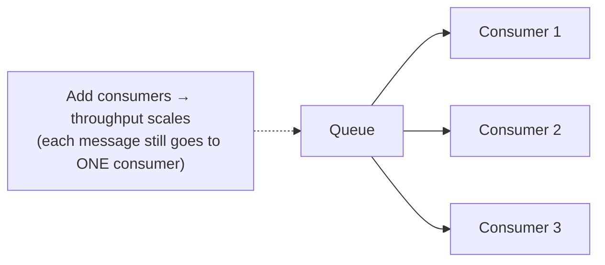

> [!TIP]
> To scale consumption in RabbitMQ, add more **consumers to the same queue** — each message is delivered to exactly **one** of them (competing consumers / work queue). This differs from [[01 Kafka]], where parallelism is bounded by **partition count**. RabbitMQ has no such hard limit — you can add consumers freely — but ordering across consumers is *not* preserved (each grabs the next available message). If you need ordering, use a single consumer per queue or a **consistent-hash exchange** to route related messages to the same queue.

---

## 4. 🏗️ REAL-WORLD SYSTEM DESIGN USAGE

### 4.1 The Classic Async Task Pattern

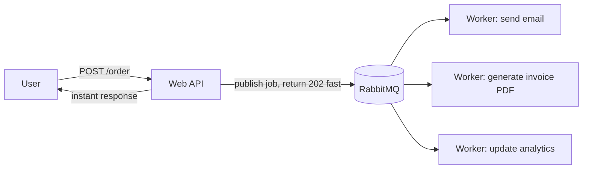

The canonical use: **offload slow work from the request path.** The API publishes a job and returns immediately (fast user response); background workers process asynchronously. This is the responsiveness + load-leveling win from [[01 System Design Fundamentals]] — email sending, image/PDF processing, notifications, and report generation are all textbook RabbitMQ workloads.

### 4.2 RabbitMQ in Microservices

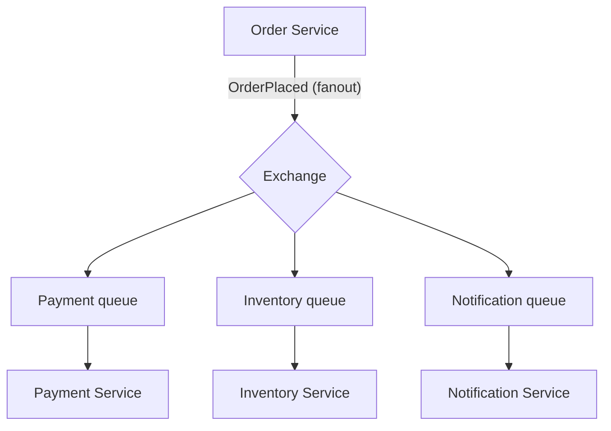

In [[03 Microservices]], RabbitMQ decouples services via events/commands: an Order Service publishes `OrderPlaced` to a fanout exchange; payment, inventory, and notification services each consume from their own queue. Services scale and fail independently. RabbitMQ's **reliable delivery + routing** makes it excellent for **commands** ("do this specific task") and moderate-scale event distribution.

### 4.3 RPC over RabbitMQ (request-reply)

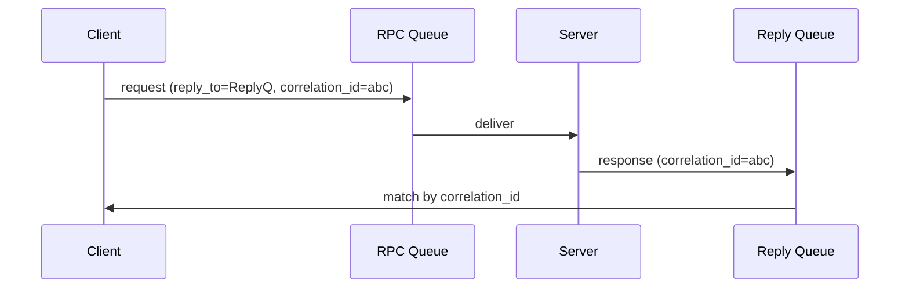

RabbitMQ supports **request-reply (RPC)**: the client sends a request with a `reply_to` queue and a `correlation_id`, the server processes and publishes the response to that reply queue, and the client matches responses by correlation ID. Useful, but adds coupling/latency — often a direct HTTP/[[04 gRPC]] call is simpler unless you specifically want the broker's buffering/decoupling.

### 4.4 How companies use RabbitMQ

| Context | Usage |
|---|---|
| **Task/job queues** | Background processing (Celery/Python, Sidekiq-style, Bull) |
| **Microservices** | Command & event distribution, decoupling |
| **Financial/telecom** | Reliable, ordered delivery with strong guarantees |
| **IoT** | MQTT plugin for device messaging |
| **Notifications** | Fan-out to email/SMS/push workers |
| **Reddit, Instagram (Celery)** | RabbitMQ as the Celery broker for async tasks |

### 4.5 RabbitMQ vs Kafka — the Defining Comparison

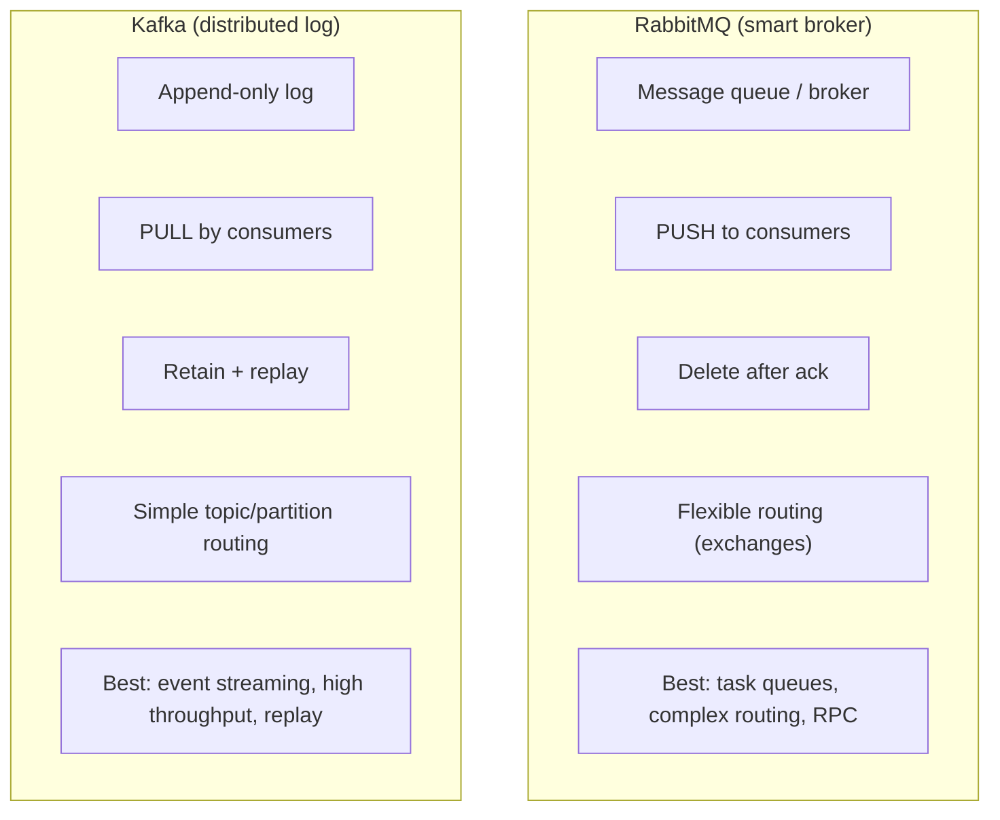

| Aspect | RabbitMQ | [[01 Kafka]] |
|---|---|---|
| **Model** | Message broker/queue | Distributed commit log |
| **Delivery** | Push to consumers | Consumers pull |
| **After consumption** | Deleted (once acked) | Retained (replayable) |
| **Routing** | Rich (direct/topic/fanout/headers) | Simple (topic/partition by key) |
| **Ordering** | Per-queue (single consumer) | Per-partition |
| **Throughput** | High (10s–100s K/s) | Very high (millions/s) |
| **Replay** | No (message is gone) | Yes (rewind offset) |
| **Multiple independent readers** | Awkward (need copies/fanout) | Native (consumer groups) |
| **Protocol** | AMQP (+ MQTT/STOMP) | Custom binary |
| **Best for** | Task queues, complex routing, RPC, per-message reliability | Event streaming, analytics, high-volume, replay |

> [!IMPORTANT]
> **The decision rule:** choose **RabbitMQ** when you need **flexible routing, per-message reliability, task distribution, and priority/RPC** — "get this specific work to the right worker, reliably, once." Choose **[[01 Kafka]]** when you need **high-throughput event streaming, replay, many independent consumers reading the same data, and an event log as source of truth.** They're not competitors so much as different tools: RabbitMQ is a *smart broker* (routing logic in the broker, dumb consumers); Kafka is a *dumb pipe/smart consumer* (simple broker, consumers track their own position). Many large systems run **both**. Answering this well is one of the most-asked messaging interview questions.

---

## 5. 🎤 INTERVIEW PREPARATION

### 5.1 Most important questions

<details>
<summary><b>Q1: What is RabbitMQ and what problem does it solve?</b></summary>

An open-source **message broker** (AMQP) that enables asynchronous, decoupled communication between applications. It solves the fragility of direct synchronous calls: producers drop messages into the broker and move on; consumers process them when ready. Benefits — **decoupling, load leveling (buffering spikes), responsiveness (offload slow work), and reliable delivery** (acks + persistence).
</details>

<details>
<summary><b>Q2: Explain exchanges, queues, and bindings.</b></summary>

Producers publish to an **exchange** (never directly to a queue). The exchange routes messages to **queues** based on **bindings** (rules) and the message's **routing key**. Consumers read from queues. Exchange types — **direct** (exact key match), **topic** (pattern match), **fanout** (broadcast to all), **headers** (match on headers) — determine routing behavior.
</details>

<details>
<summary><b>Q3: RabbitMQ vs Kafka?</b></summary>

RabbitMQ is a **smart broker** optimized for flexible routing and reliable per-message delivery; messages are **pushed** and **deleted after ack**. Kafka is a **distributed log**; consumers **pull**, messages are **retained and replayable**, and many consumer groups read independently. Use RabbitMQ for task queues/complex routing/RPC; Kafka for high-throughput event streaming, replay, and analytics.
</details>

<details>
<summary><b>Q4: How does RabbitMQ guarantee messages aren't lost?</b></summary>

Multiple layers: **durable queues** + **persistent messages** (survive broker restart), **publisher confirms** (producer knows the broker got it), **manual consumer acks** (redeliver if a consumer crashes before acking), and **quorum queues** (replicated HA). All together give strong at-least-once guarantees — so consumers must be **idempotent**.
</details>

<details>
<summary><b>Q5: What are acknowledgments and why manual ack?</b></summary>

An **ack** is the consumer confirming a message was processed, letting RabbitMQ delete it. **Auto-ack** deletes on delivery — if the consumer crashes mid-processing, the message is lost. **Manual ack** (ack after success) means RabbitMQ redelivers on crash → no loss, at the cost of possible duplicates. Use manual ack for anything important.
</details>

<details>
<summary><b>Q6: What is a Dead Letter Exchange?</b></summary>

A DLX receives messages that are **rejected, expired (TTL), or dropped** from a queue (e.g., over max-length). It routes them to a **dead letter queue** for inspection, alerting, or delayed retry — preventing **poison messages** from endlessly requeuing and blocking a queue. Also the basis for delayed-retry patterns.
</details>

<details>
<summary><b>Q7: What is prefetch / fair dispatch?</b></summary>

By default RabbitMQ round-robins messages to consumers regardless of load, so a busy worker still gets queued messages while others idle. **`prefetch` (basic.qos)** limits unacked messages per consumer; **`prefetch=1`** means "don't send another until I ack the current," enabling **fair dispatch** — idle workers naturally take more work. A key throughput/fairness tuning knob.
</details>

<details>
<summary><b>Q8: Connection vs channel?</b></summary>

A **connection** is a TCP connection (expensive to create). A **channel** is a lightweight virtual connection multiplexed over it, where publishing/consuming happens. Best practice: reuse a long-lived connection and open many channels (one per thread — channels aren't thread-safe). Opening a connection per message is a resource-exhausting anti-pattern.
</details>

### 5.2 Tricky questions

> [!TIP]
> **"Can you publish directly to a queue?"** — Not really — you always publish to an **exchange**. Publishing "to a queue" uses the **default exchange** (`exchange=''`), a direct exchange to which every queue is auto-bound by name. There's always an exchange in between.

> [!TIP]
> **"I marked my queue durable but still lost messages on restart — why?"** — Durable **queue** ≠ persistent **messages**. You also need `delivery_mode=2` (persistent) on the messages. Both are required, plus publisher confirms for the small in-memory-before-flush window.

> [!TIP]
> **"Does RabbitMQ guarantee exactly-once?"** — No — it's **at-least-once** (redelivery on failure means possible duplicates). Design **idempotent consumers** (dedup keys). True exactly-once across systems is impractical, same as [[01 Kafka]].

> [!TIP]
> **"Why did publishing suddenly hang?"** — Likely RabbitMQ's **memory/disk flow control** blocking publishers because a queue backlog crossed a threshold. The fix is draining the backlog (more/faster consumers, bounded queues), not just raising limits.

### 5.3 Common mistakes candidates make

| Mistake | Reality |
|---|---|
| "Producers publish to queues" | They publish to **exchanges** |
| "RabbitMQ and Kafka are interchangeable" | Different models (broker vs log) |
| Durable queue but non-persistent messages | Both needed to survive restart |
| Using auto-ack for important work | Crash = lost message; use manual ack |
| Expecting exactly-once | At-least-once → idempotency required |
| New connection per message | Reuse connections, use channels |
| No DLX / retry limit | Poison messages block the queue |
| Ignoring prefetch | Uneven load / memory pressure |
| Unbounded queues | Memory blowup crashes broker |

### 5.4 What interviewers actually expect

- The **exchange → binding → queue** model and the four exchange types.
- **RabbitMQ vs [[01 Kafka]]** articulated crisply (broker/push/delete vs log/pull/retain).
- **Reliability stack**: durable queues + persistent messages + publisher confirms + manual acks + quorum queues.
- **Failure handling**: DLX, poison messages, prefetch/fair dispatch, idempotency.
- **Operational awareness**: connections vs channels, flow control, queue-depth monitoring.
- When to reach for RabbitMQ vs Kafka vs a direct call.

---

## 6. 🛠️ HANDS-ON PROJECTS

### Project 1: Async Task Queue for a Web App (Beginner→Intermediate)

**Goal:** Offload slow work (email/PDF) from the request path with reliable delivery.

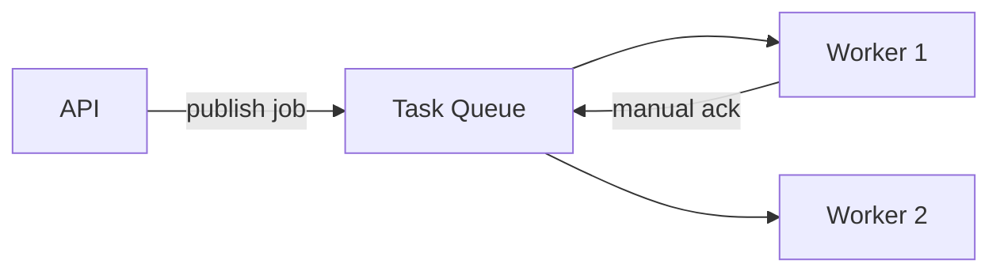

**Steps:**
1. Run RabbitMQ via [[01 Docker]] (with the management UI on :15672).
2. Publish "send email" jobs from a [[05 Node.js]]/[[05 Spring Boot]] API; return `202` immediately.
3. Consumers process with **manual ack** + `prefetch=1` (fair dispatch).
4. Make the queue **durable** and messages **persistent**.
5. Kill a worker mid-task → watch redelivery to another worker.

**Learn:** work queues, acks, persistence, fair dispatch, decoupling.

---

### Project 2: Topic Routing + Dead Letter Retry (Intermediate→Senior)

**Goal:** Flexible routing plus robust failure handling.

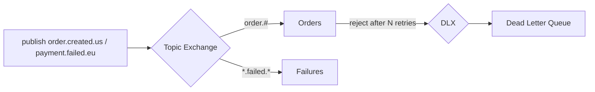

**Steps:**
1. Set up a **topic exchange** with pattern bindings (`order.#`, `*.failed.*`).
2. Add a **retry count** header; after N failures, `reject(requeue=false)` → **DLX**.
3. Implement **delayed retry**: dead-letter to a TTL queue that routes back after a delay.
4. Add **publisher confirms** for guaranteed publishing.
5. Inspect the DLQ; build an alert on its depth.

**Learn:** topic routing, DLX, retry/backoff patterns, publisher confirms, poison-message handling.

---

### Project 3: Microservices Event Bus + HA (Senior)

**Goal:** Decouple services with reliable, highly-available messaging.

```mermaid
flowchart TB
    OS[Order Service] -->|fanout| X{Exchange}
    X --> PQ[Payment] --> PS[Payment Svc]
    X --> IQ[Inventory] --> IS[Inventory Svc]
    QQ["Quorum queues (Raft HA)"] -.-> PQ
    QQ -.-> IQ
```

**Steps:**
1. Model an event flow ([[03 Microservices]]): `OrderPlaced` fans out to payment/inventory/notification queues.
2. Use **quorum queues** across a 3-node RabbitMQ cluster for HA.
3. Ensure end-to-end reliability: publisher confirms + persistent messages + manual acks + idempotent consumers.
4. Set **max-length** limits + DLX for backpressure.
5. Kill a cluster node → verify no message loss (quorum majority).
6. Compare this design with a [[01 Kafka]]-based approach.

**Learn:** event-driven microservices, quorum queues/HA, end-to-end reliability, RabbitMQ vs Kafka trade-offs.

---

## 7. 🔬 DEEP DIVE: INTERNALS

### 7.1 Built on Erlang/OTP

```mermaid
flowchart LR
    RMQ[RabbitMQ] --> Erlang["Erlang/OTP runtime (BEAM VM)"]
    Erlang --> Features["Lightweight processes, actor model,<br/>supervision trees, built-in distribution"]
```

> [!IMPORTANT]
> RabbitMQ is written in **Erlang**, a language built by Ericsson for **telecom systems** requiring extreme reliability and concurrency. This isn't trivia — Erlang's **actor model** (millions of cheap, isolated processes), **supervision trees** (auto-restart failed components), and **built-in distribution** (clustering across nodes is native to the language) are *why* RabbitMQ is so robust and naturally clusterable. Each queue and connection maps to lightweight Erlang processes. The trade-off: Erlang is niche, so deep RabbitMQ debugging/tuning requires understanding the BEAM VM (memory, schedulers), which is unfamiliar territory for most teams.

### 7.2 How a Message Flows Through the Broker

```mermaid
flowchart LR
    P[Producer] -->|"publish + confirm"| Conn[Connection/Channel]
    Conn --> X[Exchange process]
    X -->|"evaluate bindings"| Router["Routing (key/pattern/header match)"]
    Router --> Q[Queue process]
    Q -->|"persist if durable"| Disk[(Disk)]
    Q -->|"push to consumer (respecting prefetch)"| C[Consumer]
    C -->|ack| Q
    Q -->|"delete message"| Done((✓))
```

Each stage is an Erlang process passing messages. The **exchange** evaluates bindings to decide target queues; each **queue** is its own process managing its messages, persistence, and delivery to consumers per their prefetch/ack state.

### 7.3 Persistence & the Message Store

```mermaid
flowchart TB
    Msg["Persistent message"] --> QueueIndex["Queue index (per-queue: which messages, where)"]
    Msg --> MsgStore["Message store (shared: actual message bodies)"]
    Note["Small msgs may be embedded in the index;<br/>large msgs go to the shared store"] -.-> MsgStore
```

> [!TIP]
> RabbitMQ separates the **queue index** (per-queue metadata: message order, acked/unacked state) from the **message store** (the actual message bodies, shared across queues). Persistent messages are written to disk; RabbitMQ batches disk writes (fsync) for throughput. This is why persistence has a cost and a small window of vulnerability — and why **lazy queues** (which aggressively page messages to disk rather than holding them in RAM) help with huge backlogs at the cost of latency. Memory management here is the crux of RabbitMQ stability under load.

### 7.4 Clustering & Partition Handling

```mermaid
flowchart TB
    subgraph Cluster
        N1[Node 1] <--> N2[Node 2] <--> N3[Node 3]
    end
    Partition["Network partition!"] --> Handle{Partition strategy}
    Handle --> PM["pause_minority: minority side pauses (safe)"]
    Handle --> AH["autoheal: pick a winner, restart losers"]
    Handle --> Manual["ignore: manual resolution"]
```

> [!WARNING]
> In a RabbitMQ **cluster**, a network partition can cause **split-brain** — nodes on each side think the others are dead and diverge. RabbitMQ offers **partition handling strategies**: **`pause_minority`** (nodes in the smaller partition stop serving, preserving consistency — usually the safest choice, requires odd node counts) or **`autoheal`** (pick a winning partition, restart the rest). This is the **CAP theorem** ([[01 System Design Fundamentals]]) playing out concretely: during a partition you choose consistency (pause_minority) or availability. **Quorum queues** handle this cleanly via Raft majority — another reason they're the modern default.

### 7.5 AMQP Protocol Structure

```mermaid
flowchart LR
    AMQP["AMQP 0-9-1"] --> Frames["Frames: method, header, body, heartbeat"]
    AMQP --> Model["Model: connection → channel → class.method"]
    Model --> Ops["e.g., basic.publish, basic.consume, queue.declare"]
```

> [!TIP]
> RabbitMQ's primary protocol is **AMQP 0-9-1** — a **binary, programmable protocol** (not just a message format) that defines the whole model: connections, channels, and "classes" of operations (`exchange.declare`, `queue.bind`, `basic.publish`, `basic.ack`). Because it's an open standard, any AMQP client in any language interoperates. RabbitMQ also speaks **MQTT** (IoT/lightweight), **STOMP** (simple text), and now a **Streams protocol** via plugins — making it a multi-protocol broker. Understanding that AMQP is *programmatic* (you declare topology over the wire) explains why RabbitMQ topology can be created dynamically by clients.

---

## ✅ Production Checklists

### Reliability
- [ ] **Durable queues** + **persistent messages** (`delivery_mode=2`)
- [ ] **Publisher confirms** enabled for important messages
- [ ] **Manual acks** (never auto-ack for critical work)
- [ ] **Idempotent consumers** (at-least-once → dedup)
- [ ] **Quorum queues** for HA (not deprecated mirrored queues)
- [ ] **DLX + retry limits** for poison-message handling

### Performance & Stability
- [ ] **`prefetch`** tuned (start at 1 for fair dispatch; raise for throughput)
- [ ] **Queue length limits** (max-length / max-bytes) — prevent memory blowup
- [ ] **Lazy queues** for large/long backlogs
- [ ] **Connections reused**; channels per thread (not thread-shared)
- [ ] Memory/disk **alarm thresholds** understood (flow control)
- [ ] Monitor **queue depth, unacked count, consumer count, memory**

### Operations & Security
- [ ] **Clustering** with a partition strategy (`pause_minority` / quorum)
- [ ] **vhosts** for isolation; per-app users + permissions
- [ ] **TLS** for connections; strong credentials (not guest/guest in prod)
- [ ] Management UI/API secured
- [ ] Regular RabbitMQ + Erlang updates (CVEs)
- [ ] Backups of definitions (exchanges/queues/bindings/policies)

---

## 🗺️ Learning Roadmap

```mermaid
flowchart TB
    A["1️⃣ Basics<br/>what/why, message broker, producer/consumer"] --> B["2️⃣ AMQP model<br/>exchanges, queues, bindings, routing keys"]
    B --> C["3️⃣ Exchange types<br/>direct, topic, fanout, headers"]
    C --> D["4️⃣ Reliability<br/>acks, persistence, publisher confirms"]
    D --> E["5️⃣ Failure handling<br/>DLX, TTL, retries, prefetch"]
    E --> F["6️⃣ HA & scaling<br/>clustering, quorum queues, competing consumers"]
    F --> G["7️⃣ Comparison & design<br/>vs Kafka, microservices patterns"]
    G --> H["8️⃣ Internals<br/>Erlang, message store, partitions, AMQP"]
```

| Stage | Focus | You can... |
|---|---|---|
| 1–3 | Basics + routing | Build producers/consumers with routing |
| 4–5 | Reliability + failures | Guarantee delivery, handle poison messages |
| 6–7 | HA + design | Run resilient clusters; choose RabbitMQ vs Kafka |
| 8 | Internals | Debug and tune deeply |

---

## 🔁 Self-Review Completion Loop

Reviewed against official RabbitMQ documentation, best practices, common interview questions, and real-world production usage.

### Gap Review Matrix

| Dimension | Covered? | Where |
|---|---|---|
| What/why, broker concept | ✅ | §1 |
| Producers/consumers/decoupling | ✅ | §1 |
| Exchanges/queues/bindings (AMQP model) | ✅ | §2.1 |
| Exchange types (direct/topic/fanout/headers) | ✅ | §2.2 |
| Default exchange | ✅ | §2.3 |
| Acknowledgments | ✅ | §2.4 |
| Persistence & durability | ✅ | §2.5 |
| Work queues & fair dispatch (prefetch) | ✅ | §2.6 |
| Connections vs channels | ✅ | §2.7 |
| Publisher confirms | ✅ | §3.1 |
| Dead Letter Exchanges | ✅ | §3.2 |
| TTL / queue limits / priority / lazy | ✅ | §3.3 |
| Clustering & quorum queues (HA) | ✅ | §3.4 |
| RabbitMQ Streams | ✅ | §3.5 |
| Failure scenarios & flow control | ✅ | §3.6 |
| Competing consumers / scaling | ✅ | §3.7 |
| Async task pattern | ✅ | §4.1 |
| Microservices usage | ✅ | §4.2 |
| RPC / request-reply | ✅ | §4.3 |
| RabbitMQ vs Kafka | ✅ | §4.5 |
| Erlang/OTP foundation | ✅ | §7.1 |
| Message flow internals | ✅ | §7.2 |
| Persistence/message store | ✅ | §7.3 |
| Cluster partition handling | ✅ | §7.4 |
| AMQP protocol | ✅ | §7.5 |
| Interview Q&A + mistakes | ✅ | §5 |
| Hands-on projects | ✅ | §6 |

> [!NOTE]
> **Remaining depth to explore independently:** the Shovel & Federation plugins (linking brokers across datacenters), consistent-hash exchange (ordered partitioning), the delayed-message plugin, Streams protocol deep-dive, MQTT/STOMP for IoT, Celery/Bull/Spring AMQP client specifics, RabbitMQ on [[02 Kubernetes]] (Cluster Operator), and detailed Erlang/BEAM memory tuning.

---

## 📚 Official References

| Resource | URL |
|---|---|
| RabbitMQ Documentation | https://www.rabbitmq.com/docs |
| Getting Started Tutorials | https://www.rabbitmq.com/tutorials |
| AMQP 0-9-1 Model Explained | https://www.rabbitmq.com/tutorials/amqp-concepts |
| Quorum Queues | https://www.rabbitmq.com/docs/quorum-queues |
| Reliability Guide | https://www.rabbitmq.com/docs/reliability |
| Production Checklist | https://www.rabbitmq.com/docs/production-checklist |
| Streams | https://www.rabbitmq.com/docs/streams |
| Clustering | https://www.rabbitmq.com/docs/clustering |

---

## 🎁 Final Summary

> [!IMPORTANT]
> **The one-paragraph takeaway:** RabbitMQ is a mature **message broker** (AMQP) that decouples applications via asynchronous messaging — a **"smart broker"** where producers publish to **exchanges** that route messages to **queues** (via bindings and routing keys) for consumers to process and **acknowledge**, after which messages are **deleted**. Its strengths are **flexible routing** (direct/topic/fanout/headers) and **reliable, per-message delivery** (durable queues + persistent messages + publisher confirms + manual acks + quorum queues for HA), making it ideal for **task queues, background jobs, RPC, and moderate-scale event distribution** in [[03 Microservices]]. It gives **at-least-once** delivery, so consumers must be **idempotent**; handle failures with **DLX + retry limits**, prevent memory blowup with **queue limits/lazy queues**, and tune throughput with **prefetch/fair dispatch**. The defining decision is **RabbitMQ vs [[01 Kafka]]**: RabbitMQ for routing/task-distribution/reliability ("deliver this work to the right worker, once"); Kafka for high-throughput streaming/replay/many-independent-readers ("a durable event log"). Built on **Erlang/OTP**, RabbitMQ inherits telecom-grade reliability and native clustering.

**Golden rules:**
1. 📮 Producers publish to **exchanges**, not queues — routing lives in the broker.
2. 🔀 **Topic exchanges** are the flexible default; fanout broadcasts; direct exact-matches.
3. ✅ Reliability = **durable queue + persistent message + publisher confirm + manual ack**.
4. 🔁 It's **at-least-once** — make consumers **idempotent**.
5. ☠️ Use **DLX + retry limits** so poison messages don't block queues.
6. ⚖️ Tune **prefetch** (start at 1) for fair dispatch; bound queues to avoid memory blowup.
7. 🔌 Reuse **connections**, use **channels** (per thread) — never a connection per message.
8. 🏢 Use **quorum queues** (Raft) for HA, not deprecated mirrored queues.
9. 🆚 **RabbitMQ** for routing/tasks/reliability; **[[01 Kafka]]** for streaming/replay/throughput.

---

*Related guides in this vault: [[01 Kafka]] · [[03 Microservices]] · [[04 Redis]] · [[05 Node.js]] · [[05 Spring Boot]] · [[01 System Design Fundamentals]] · [[01 Docker]] · [[02 Kubernetes]]*
