# 🏛️ System Design Fundamentals — Complete Beginner-to-Expert Reference

> How to architect systems that scale to millions of users — the building blocks, trade-offs, and mental models behind every large-scale application.

---

## 📑 Table of Contents

1. [Executive Summary](#-executive-summary)
2. [Fundamentals (Beginner)](#1--fundamentals-beginner-level)
3. [Core Concepts (Intermediate)](#2--core-concepts-intermediate-level)
4. [Advanced Concepts (Senior)](#3--advanced-concepts-senior-level)
5. [Real-World System Design](#4--real-world-system-design-usage)
6. [Interview Preparation](#5--interview-preparation)
7. [Hands-On Projects](#6--hands-on-projects)
8. [Deep Dive: Internals](#7--deep-dive-internals)
9. [Production Checklists](#-production-checklists)
10. [Learning Roadmap](#-learning-roadmap)
11. [Self-Review Completion Loop](#-self-review-completion-loop)
12. [Official References](#-official-references)
13. [Final Summary](#-final-summary)

---

## 🎯 Executive Summary

**System Design** is the process of defining the architecture, components, data flow, and trade-offs of a software system to meet functional and non-functional requirements (scale, latency, availability, cost). It's about making the **right trade-offs** — there is no "correct" design, only designs that fit the constraints.

| What it is | What it replaces | Core superpower |
|---|---|---|
| Architecting systems for scale & reliability | "Just throw it on one server," hope-based scaling | **Reasoning about trade-offs** to build systems that stay fast, available, and affordable as they grow |

> [!IMPORTANT]
> The defining truth of system design: **everything is a trade-off.** More consistency costs availability; more caching costs freshness; more services cost operational complexity. There is no universally "best" architecture — only the best fit for *your* requirements (scale, latency budget, consistency needs, team size, budget). Interviewers and real architecture both reward **naming the trade-off and justifying your choice**, not reciting a "right answer." This guide ties together everything in your vault — [[01 Kafka]], [[04 Redis]], [[02 Postgres]], [[02 Kubernetes]], [[03 Microservices]] — into one coherent way of thinking.

Related guides: [[03 Microservices]] · [[01 Kafka]] · [[04 Redis]] · [[02 Postgres]] · [[03 MongoDB]] · [[02 Kubernetes]] · [[01 Docker]] · [[02 Design Patterns]]

---

## 1. 🌱 FUNDAMENTALS (Beginner Level)

### What is system design in simple terms?

Writing code that works for **you** on **one machine** is easy. Making it work for **10 million users** across **thousands of machines** — staying fast, never losing data, surviving server crashes, all without going bankrupt on cloud bills — is **system design**. It's the difference between building a shed and engineering a skyscraper: the same materials, but entirely different concerns (foundations, load distribution, failure of any single beam).

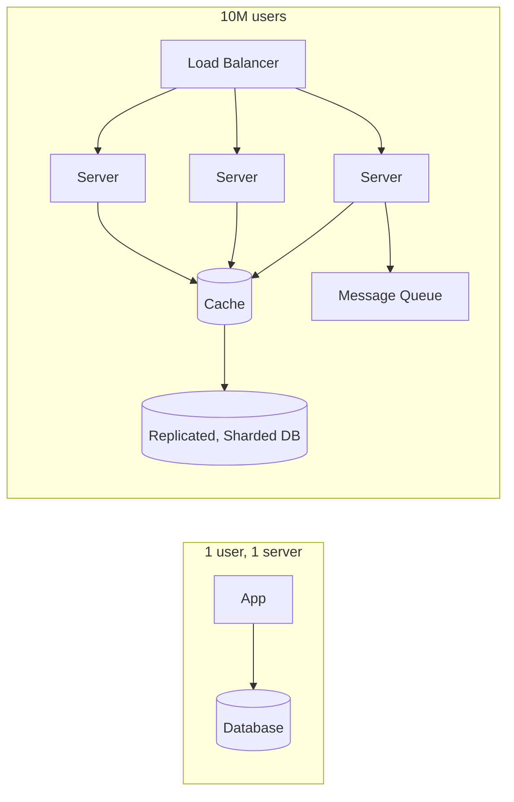

### Why does system design exist?

A single server has limits: finite CPU, RAM, disk, and network. It's also a **single point of failure** — when it dies, everything dies. As users grow, you *must* distribute work across many machines, which introduces entirely new problems: How do requests find a healthy server? How do machines share data? What happens when the network between them fails? System design is the discipline of answering these.

### The Two Types of Requirements

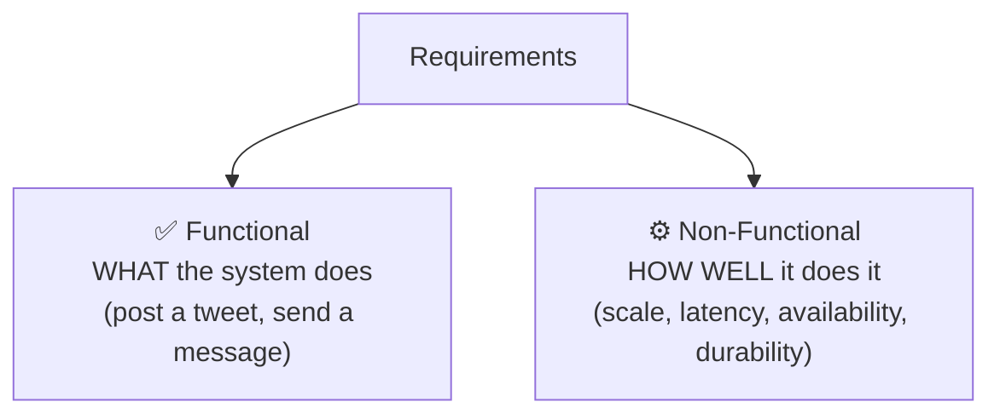

| Type | Question | Examples |
|---|---|---|
| **Functional** | What features? | Users can post, follow, search |
| **Non-Functional** | How well? | 100M users, <200ms latency, 99.99% uptime, no data loss |

> [!IMPORTANT]
> **Non-functional requirements drive the architecture.** "Users can post a photo" is easy on one server. "500M users, uploads under 2s globally, never lose a photo, 99.99% available" forces load balancers, CDNs, replicated storage, sharding, and caching. In any design (interview or real), **nail down the non-functional requirements first** — scale numbers, latency budget, consistency needs — because they dictate every subsequent decision.

### The Core Building Blocks

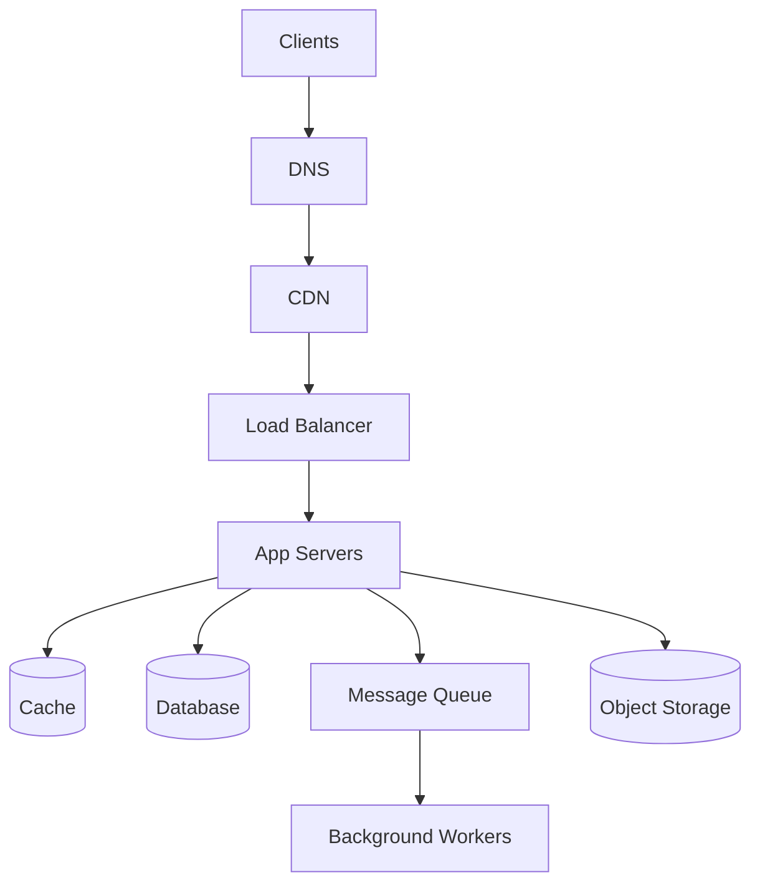

| Block | Role | Your guide |
|---|---|---|
| **DNS** | Name → IP resolution | — |
| **Load Balancer** | Distribute traffic across servers | §2.2 |
| **CDN** | Cache static content near users | §2.6 |
| **App Servers** | Run business logic (stateless) | [[02 Kubernetes]] |
| **Cache** | Fast in-memory data | [[04 Redis]] |
| **Database** | Durable source of truth | [[02 Postgres]], [[03 MongoDB]] |
| **Message Queue** | Async decoupling | [[01 Kafka]] |
| **Object Storage** | Files/images/video (S3) | — |

### Key metrics vocabulary

| Term | Meaning |
|---|---|
| **Latency** | Time for one request (ms) |
| **Throughput** | Requests handled per second (RPS/QPS) |
| **Availability** | % uptime (99.9% = "three nines") |
| **Scalability** | Ability to handle growth |
| **Consistency** | All nodes see the same data |
| **Durability** | Data survives failures |
| **SLA / SLO / SLI** | Agreement / Objective / Indicator of service level |

### Real-world analogy 🍔

Scaling a system is like scaling a **restaurant**:
- **One cook** (single server) is fine for a few tables. Overwhelmed at rush hour.
- **Vertical scaling** = hire a *faster* super-chef (bigger machine) — expensive, and still one person who can call in sick.
- **Horizontal scaling** = hire *many* cooks (more servers) — a **host** (load balancer) assigns diners to available cooks.
- **Cache** = a tray of pre-made popular dishes (instant serving).
- **Message queue** = the order-ticket rail — orders queue up, cooks pull them at their own pace.
- **Database replica** = a copy of the recipe book so multiple cooks can read simultaneously.

> [!TIP]
> The mental model: **you can't make one machine infinitely powerful, so you coordinate many machines** — and *that coordination* is the entire challenge. Every concept (load balancing, replication, caching, queues, consistency) is a tool for making many machines behave like one fast, reliable system.

---

## 2. 🧩 CORE CONCEPTS (Intermediate Level)

### 2.1 Vertical vs Horizontal Scaling

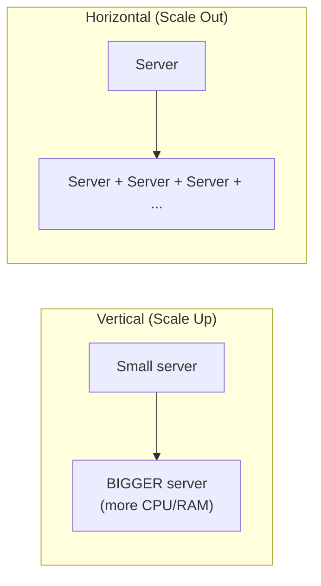

| | Vertical (scale up) | Horizontal (scale out) |
|---|---|---|
| How | Bigger machine | More machines |
| Ceiling | Hardware limit | Near-infinite |
| Failure | Single point of failure | Redundant |
| Complexity | Simple | Needs load balancing, coordination |
| Cost curve | Exponential | Linear-ish |
| State | Easy (one box) | Hard (distributed state) |

> [!IMPORTANT]
> **Horizontal scaling is how the internet scales** — but it *requires statelessness*. If a server stores session state in local memory, a user's next request might hit a different server that doesn't have it. The fix: keep app servers **stateless** and push shared state to [[04 Redis]]/a database. This is why "stateless services" is a mantra — it's the precondition for horizontal scaling (and for [[02 Kubernetes]] pod replicas).

### 2.2 Load Balancing

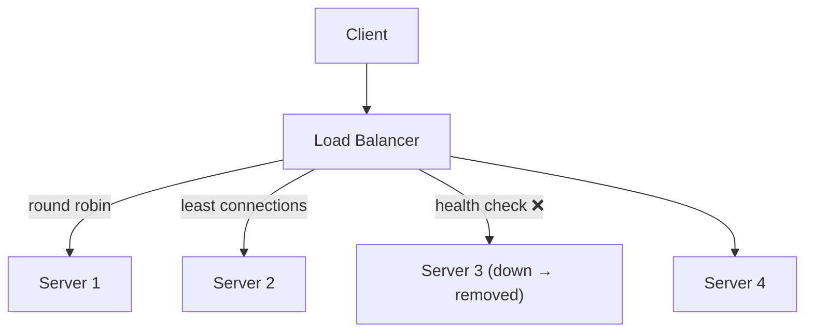

**Algorithms:**

| Algorithm | Behavior |
|---|---|
| **Round Robin** | Rotate through servers evenly |
| **Least Connections** | Send to least-busy server |
| **Weighted** | Bias toward more powerful servers |
| **IP Hash / Consistent Hash** | Same client → same server (sticky) |
| **Random** | Simple, surprisingly effective at scale |

- **L4 (transport)** load balancing routes by IP/port (fast). **L7 (application)** routes by HTTP content (path, headers, cookies) — more flexible.
- Load balancers also do **health checks** (remove dead servers) and can terminate **TLS**.

> [!TIP]
> The load balancer must not itself become a single point of failure — run it **redundantly** (active-passive or active-active with failover, often via a floating IP / DNS). Cloud LBs (ALB/NLB, GCLB) and [[02 Kubernetes]] Services/Ingress handle this for you. **Nginx**/HAProxy are common self-hosted L7 balancers.

### 2.3 Databases: SQL vs NoSQL

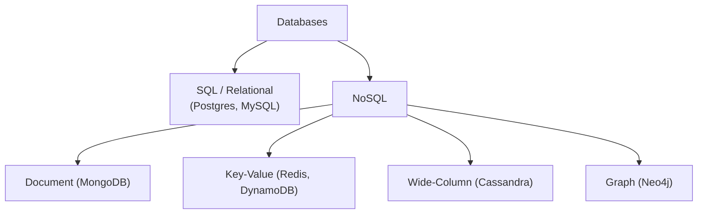

| Aspect | SQL ([[02 Postgres]]) | NoSQL ([[03 MongoDB]]) |
|---|---|---|
| Schema | Fixed, structured | Flexible |
| Relationships | Joins, foreign keys | Embedding / denormalization |
| Consistency | Strong (ACID) | Often eventual (BASE) |
| Scaling | Vertical + read replicas; sharding is harder | Horizontal by design |
| Query power | Rich (SQL, joins, aggregates) | Simpler, type-specific |
| Best for | Transactions, complex queries, integrity | Huge scale, flexible/varied data, high write volume |

> [!TIP]
> "SQL vs NoSQL" is a false binary — **most large systems use both (polyglot persistence)**: [[02 Postgres]] for transactional core data (orders, payments — needs ACID), [[03 MongoDB]]/Cassandra for high-volume flexible data (logs, feeds, catalogs), [[04 Redis]] for caching/sessions. Choose per *access pattern*, not dogma. Default to SQL for correctness-critical data; reach for NoSQL when scale/flexibility/write-volume demands it.

### 2.4 Replication

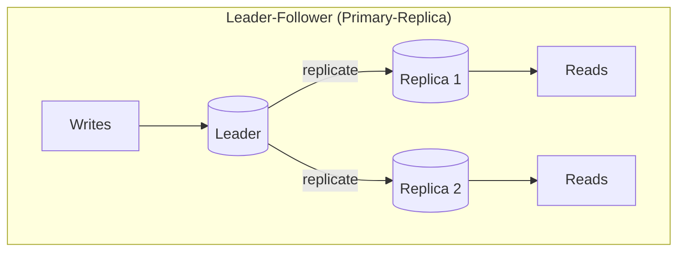

- **Leader-Follower**: one node takes writes, replicates to read replicas → **scales reads** and adds redundancy.
- **Synchronous** replication = no data loss but slower writes; **asynchronous** = fast writes but possible loss on leader failure (see [[04 Redis]], [[01 Kafka]] replication).
- **Multi-Leader / Leaderless** (Cassandra, DynamoDB) allow writes anywhere — higher availability, but conflict resolution needed.

> [!WARNING]
> **Read replicas introduce replication lag** — a user who writes then immediately reads from a replica may not see their own write ("read-your-writes" violation). Fixes: route the user's reads to the leader briefly after a write, or use synchronous replication for critical paths. This is a classic real-world consistency bug and a favorite interview follow-up.

### 2.5 Sharding (Partitioning)

When data is too big for one machine, **split it across many** (horizontal partitioning):

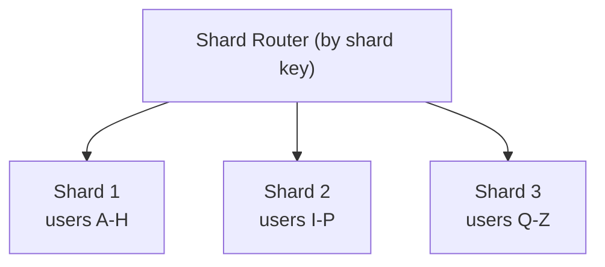

| Strategy | How | Risk |
|---|---|---|
| **Range-based** | Split by key ranges (A-H, I-P…) | **Hotspots** (uneven ranges) |
| **Hash-based** | `hash(key) % N` | Even spread, but resharding is painful |
| **Consistent hashing** | Hash ring | Minimal reshuffling when adding nodes |
| **Directory-based** | Lookup table maps key → shard | Flexible; lookup is a bottleneck |

> [!WARNING]
> **Sharding is powerful but adds major complexity**: cross-shard queries and joins become expensive or impossible, transactions across shards are hard, and **choosing a bad shard key creates hotspots** (e.g., sharding by `country` when 80% of users are in one country). Rebalancing when adding shards is operationally painful (why **consistent hashing** exists — it minimizes key movement). Shard only when you must; a single well-tuned [[02 Postgres]] with read replicas handles more than people think.

### 2.6 Caching

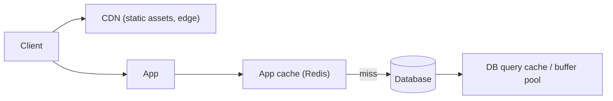

**Cache at every layer:**

| Layer | What | Example |
|---|---|---|
| **Client** | Browser cache | HTTP cache headers |
| **CDN** | Static content at edge | CloudFront, Cloudflare |
| **Application** | Hot data, sessions | [[04 Redis]] |
| **Database** | Query/buffer cache | [[02 Postgres]] shared buffers |

Caching strategies (cache-aside, write-through, write-behind) and the failure modes (**stampede, penetration, avalanche**) are covered in depth in [[04 Redis]] §3.5–3.6.

> [!IMPORTANT]
> **Caching is the highest-leverage performance tool in system design** — a cache hit is ~100× faster than a DB query and shields the database from load. But it introduces the hardest problem in CS: **invalidation** (keeping cache and source of truth in sync). Every cache is a bet that stale-for-a-moment is acceptable. Always pair caches with **TTLs** and a clear invalidation strategy, and know your **consistency requirement** — some data (account balance) can't tolerate staleness; some (like counts) can.

### 2.7 Message Queues & Async Processing

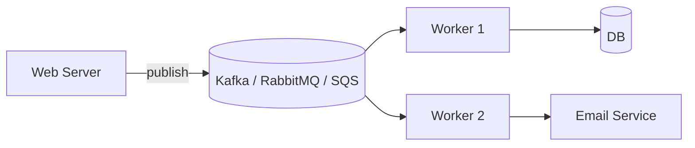

> [!TIP]
> **Message queues decouple and absorb.** Instead of making a user wait while you resize an image, send an email, and update analytics **synchronously**, drop a message on a queue and return immediately — workers process it asynchronously. Benefits: **responsiveness** (fast user response), **resilience** (retry failed work), **load leveling** (queue absorbs traffic spikes so workers aren't overwhelmed), and **decoupling** (producer/consumer evolve independently). This is the backbone of [[03 Microservices]] and event-driven architecture — see [[01 Kafka]] for the deep dive.

---

## 3. ⚙️ ADVANCED CONCEPTS (Senior Level)

### 3.1 The CAP Theorem

In a distributed system, when a **network partition** happens, you must choose between Consistency and Availability — you can't have both.

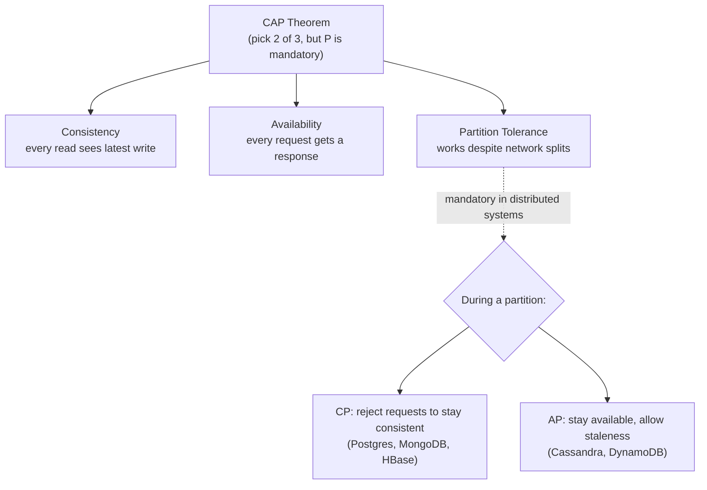

> [!IMPORTANT]
> **CAP is widely misunderstood.** Partitions *will* happen in any distributed system (networks fail), so **P is non-negotiable** — the real choice is **C vs A during a partition**. A **CP** system (like [[02 Postgres]] with sync replication) refuses writes when it can't guarantee consistency; an **AP** system (Cassandra) keeps serving but may return stale data. In normal operation (no partition), you get both. The nuance: it's not "pick 2 of 3" forever — it's "**when a partition occurs, do you sacrifice C or A?**"

### 3.2 Consistency Models & PACELC

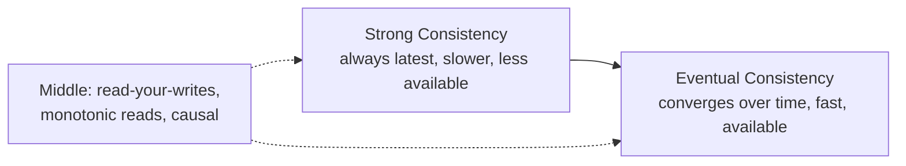

| Model | Guarantee | Use case |
|---|---|---|
| **Strong** | Every read sees the latest write | Bank balances, inventory |
| **Eventual** | Reads may lag; converges eventually | Social feeds, view counts, DNS |
| **Read-your-writes** | You see your own updates | Profile edits |
| **Causal** | Causally-related events ordered | Comments/replies |

> [!TIP]
> **PACELC** extends CAP: *if* **P**artition, choose **A**/**C**; **E**lse (normal operation), choose **L**atency/**C**onsistency. Even without partitions, strong consistency costs latency (coordination between nodes). So the real everyday trade-off is often **latency vs consistency**, not just availability. Most systems tune consistency *per operation*: strong for a payment, eventual for a like count.

### 3.3 ACID vs BASE

| ACID (SQL) | BASE (NoSQL) |
|---|---|
| **A**tomicity | **B**asically **A**vailable |
| **C**onsistency | **S**oft state |
| **I**solation | **E**ventual consistency |
| **D**urability | |
| Strong guarantees, transactions | High availability, scale, flexibility |

> [!TIP]
> **ACID** ([[02 Postgres]] transactions) guarantees a transfer either fully completes or fully rolls back — essential for money. **BASE** trades those guarantees for availability and scale — fine for a social feed where a slightly-stale like count is harmless. Know which data needs which: never put your payment ledger on an eventually-consistent store, and don't force ACID overhead on your analytics firehose.

### 3.4 Idempotency & Exactly-Once

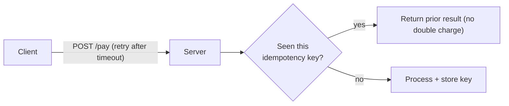

> [!IMPORTANT]
> **Networks are unreliable — clients retry — so operations must be idempotent** (safe to apply multiple times). A payment API must use an **idempotency key** so a retried "charge $50" doesn't charge twice. This is one of the most important real-world distributed-systems concerns and a frequent interview theme. "Exactly-once delivery" is largely a myth in distributed messaging ([[01 Kafka]]); the practical pattern is **at-least-once delivery + idempotent consumers**. Design every mutating endpoint to be safely retryable.

### 3.5 Rate Limiting

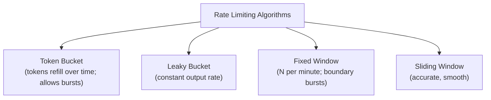

Rate limiting protects services from abuse, overload, and cascading failure. Implemented with atomic counters in [[04 Redis]] (see [[04 Redis]] §4.3 for a sliding-window implementation). Applied at API gateways, per-user/per-IP.

### 3.6 Resilience Patterns

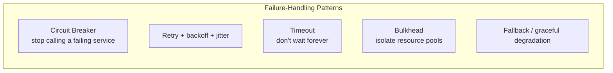

| Pattern | Purpose |
|---|---|
| **Circuit Breaker** | After N failures, "open" and fail fast instead of hammering a dead service ([[03 Microservices]]) |
| **Retry with backoff + jitter** | Retry transient failures without stampeding |
| **Timeout** | Bound waiting; free resources |
| **Bulkhead** | Isolate failures (one slow dependency doesn't sink everything) |
| **Graceful degradation** | Serve reduced functionality (e.g., cached/stale data) instead of erroring |

> [!WARNING]
> **Cascading failure** is how big outages happen: service A calls slow service B, A's threads pile up waiting, A exhausts its thread pool, A goes down, everything calling A goes down — a chain reaction. **Circuit breakers, timeouts, and bulkheads** exist to contain this. Also beware the **retry storm**: naive retries during an outage multiply load and prevent recovery — always use **exponential backoff + jitter**.

### 3.7 Failure Scenarios & Production Issues

| Failure | Symptom | Mitigation |
|---|---|---|
| **Single point of failure** | One component's death = outage | Redundancy at every tier |
| **Thundering herd / cache stampede** | Mass cache expiry floods DB | Jittered TTL, request coalescing ([[04 Redis]]) |
| **Hot shard / hotspot** | One partition overloaded | Better shard key, consistent hashing |
| **Replication lag** | Stale reads | Read-from-leader for critical reads |
| **Cascading failure** | Chain-reaction outage | Circuit breakers, timeouts, bulkheads |
| **Retry storm** | Retries amplify outage | Backoff + jitter, circuit breakers |
| **Data loss on failover** | Async replication gap | Sync replication for critical data |
| **Clock skew** | Ordering/expiry bugs | Logical clocks, NTP, avoid wall-clock ordering |
| **Split brain** | Two "leaders" after partition | Quorum, fencing, consensus (Raft) |

### 3.8 Estimation (Back-of-the-Envelope)

> [!TIP]
> Senior design requires **quick capacity math**. Know the orders of magnitude: memory read ~100ns, SSD read ~100µs, network round-trip within a datacenter ~500µs, cross-continent ~100ms. Estimate: *"100M daily users × 10 requests = 1B/day ≈ 12K RPS average, ~5× peak = 60K RPS. Each server does 1K RPS → ~60 servers + headroom."* Storage: *"1B photos × 2MB = 2PB → needs object storage + CDN."* Interviewers watch **whether your numbers justify your architecture**, not perfect precision.

**Latency numbers every engineer should know (approx):**

| Operation | Time |
|---|---|
| L1 cache reference | ~1 ns |
| Main memory reference | ~100 ns |
| [[04 Redis]] GET (same DC) | ~0.5 ms |
| SSD random read | ~100 µs |
| Datacenter round trip | ~0.5 ms |
| Disk seek | ~10 ms |
| Cross-continent round trip | ~100–150 ms |

---

## 4. 🏗️ REAL-WORLD SYSTEM DESIGN USAGE

### 4.1 A Reference Large-Scale Architecture

```mermaid
flowchart TB
    User[Users] --> DNS[DNS + GeoDNS]
    DNS --> CDN[CDN edge]
    CDN --> GLB[Global Load Balancer]
    GLB --> GW[API Gateway<br/>auth, rate limit, routing]
    GW --> S1[Service A] & S2[Service B] & S3[Service C]
    S1 --> Cache[(Redis)]
    S1 --> DBP[(Postgres primary)]
    DBP --> DBR[(Read replicas)]
    S2 --> Shard[(Sharded NoSQL)]
    S1 & S2 & S3 --> MQ[(Kafka)]
    MQ --> Workers[Async Workers]
    S3 --> Blob[(S3 Object Storage)]
    All -.-> Obs[Observability: metrics/logs/traces]
```

This composes your whole vault: [[02 Kubernetes]]-orchestrated stateless services behind an API gateway, [[04 Redis]] caching, [[02 Postgres]] with replicas + [[03 MongoDB]]/NoSQL for scale, [[01 Kafka]] for async, object storage for blobs, and observability throughout.

### 4.2 The Interview Framework (how to approach any design)

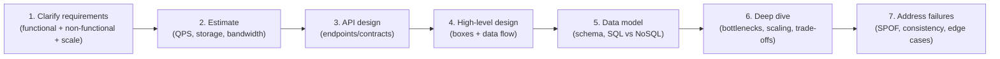

> [!IMPORTANT]
> In a system design interview, **the process matters more than the final diagram.** Start by **clarifying requirements and scale** (never dive into components first), do **capacity estimation**, sketch a **high-level design**, then **deep-dive** where prompted, always **narrating trade-offs**. Interviewers evaluate: Did you gather requirements? Justify choices? Identify bottlenecks? Handle failures? Communicate clearly? A "perfect" architecture stated without reasoning scores worse than a simpler one with clear trade-off analysis.

### 4.3 Classic Design Problems & Key Ideas

| Problem | Key concepts |
|---|---|
| **URL Shortener** (TinyURL) | Hashing/base62, key-value store, cache, read-heavy |
| **News Feed** (Twitter/FB) | Fan-out (write vs read), caching, [[04 Redis]], pagination |
| **Chat** (WhatsApp) | WebSockets, message queue, presence, delivery receipts |
| **Rate Limiter** | Token/sliding window, [[04 Redis]] atomic counters |
| **Video Streaming** (YouTube) | CDN, chunking/transcoding, object storage, adaptive bitrate |
| **Ride-Sharing** (Uber) | Geospatial index ([[04 Redis]] geo), matching, real-time |
| **Notification System** | Queues ([[01 Kafka]]), fan-out, retries, idempotency |
| **Distributed Cache** | Consistent hashing, replication, eviction |
| **Payment System** | Idempotency, ACID, saga, audit log, exactly-once handling |

> [!TIP]
> The **fan-out problem** (news feed) is a classic trade-off: **fan-out-on-write** (push each post to all followers' feeds — fast reads, expensive for celebrities with 100M followers) vs **fan-out-on-read** (build the feed when requested — cheap writes, slower reads). Real systems (Twitter) use a **hybrid**: push for normal users, pull for celebrities. Naming this hybrid is a senior-level answer.

### 4.4 How big companies think

| Company | System design signature |
|---|---|
| **Google** | Spanner (global consistency), Bigtable, MapReduce, SRE discipline |
| **Amazon** | Everything-is-a-service, DynamoDB (AP), cell-based architecture |
| **Netflix** | Microservices, Chaos Engineering, circuit breakers, CDN (Open Connect) |
| **Meta** | TAO (graph cache), memcached at scale, fan-out for feed |
| **Uber** | Geospatial, real-time matching, [[01 Kafka]] event backbone |

### 4.5 Observability — you can't run what you can't see

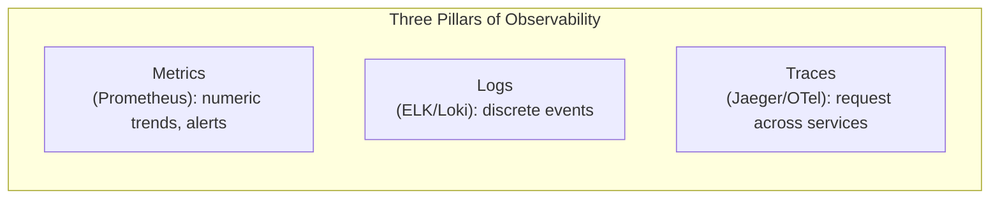

> [!IMPORTANT]
> At scale, **observability is not optional** — with dozens of [[03 Microservices]], a single user request touches many services, and without **distributed tracing** you can't tell *which* service caused a slow response. The three pillars — **metrics** (what's happening), **logs** (what happened), **traces** (where time went across services) — plus **alerting** on SLOs, are how you operate a distributed system. Design it in from the start, not after the first outage.

---

## 5. 🎤 INTERVIEW PREPARATION

### 5.1 Most important questions

<details>
<summary><b>Q1: Vertical vs horizontal scaling — trade-offs?</b></summary>

**Vertical** (bigger machine): simple, no code changes, but hits a hardware ceiling and stays a single point of failure. **Horizontal** (more machines): near-infinite scale + redundancy, but requires **stateless services**, load balancing, and distributed-state coordination. Modern systems scale horizontally; the enabler is statelessness (push state to [[04 Redis]]/DB).
</details>

<details>
<summary><b>Q2: Explain the CAP theorem.</b></summary>

In a distributed system experiencing a **network partition**, you must choose **Consistency** (reject requests to avoid stale data — CP) or **Availability** (keep serving, possibly stale — AP). Partition tolerance is mandatory (networks fail). It's not "pick 2 of 3 forever" — in normal operation you get both C and A; the trade-off only forces itself **during a partition**. PACELC adds: even without partitions, you trade latency vs consistency.
</details>

<details>
<summary><b>Q3: How would you scale a read-heavy system?</b></summary>

Add **caching** ([[04 Redis]]/CDN) to serve hot data without touching the DB; add **read replicas** to scale DB reads; use a **CDN** for static content. Watch for **replication lag** (stale reads) and **cache invalidation**. For a read:write ratio like 100:1, caching + replicas often suffice before sharding.
</details>

<details>
<summary><b>Q4: SQL vs NoSQL — when to choose which?</b></summary>

**SQL** for structured data with relationships, transactions, and strong consistency needs (payments, orders). **NoSQL** for massive scale, flexible/varied schemas, or high write throughput (feeds, logs, catalogs). Most real systems use **both** (polyglot persistence). Choose per access pattern, defaulting to SQL for correctness-critical data.
</details>

<details>
<summary><b>Q5: What is sharding and what are its challenges?</b></summary>

Splitting data across machines by a **shard key** to scale beyond one node. Challenges: **cross-shard queries/joins** become hard, **transactions across shards** are complex, a **bad shard key causes hotspots**, and **resharding** is painful (mitigated by **consistent hashing**). Shard only when a single node + replicas genuinely can't cope.
</details>

<details>
<summary><b>Q6: How do you ensure a payment isn't processed twice?</b></summary>

**Idempotency**: the client sends an **idempotency key**; the server records processed keys and returns the prior result on retry instead of reprocessing. Combined with **ACID** transactions and an **audit log**. Since networks cause retries and "exactly-once delivery" is impractical, the pattern is **at-least-once + idempotent processing**.
</details>

<details>
<summary><b>Q7: How do you prevent cascading failures?</b></summary>

**Circuit breakers** (fail fast when a dependency is down), **timeouts** (don't wait forever), **bulkheads** (isolate resource pools), **retries with exponential backoff + jitter** (avoid retry storms), and **graceful degradation** (serve stale/cached data). Load shedding and rate limiting also help.
</details>

<details>
<summary><b>Q8: Strong vs eventual consistency — give examples.</b></summary>

**Strong**: every read returns the latest write — required for bank balances, inventory, seat booking (correctness > speed). **Eventual**: reads may briefly lag but converge — fine for like counts, social feeds, DNS (availability/speed > instant accuracy). Systems often mix: strong for the money path, eventual for analytics/counters.
</details>

### 5.2 Tricky questions

> [!TIP]
> **"Does the CAP theorem mean you can only pick 2 of 3?"** — No — a common oversimplification. Partition tolerance is mandatory, so during a partition you choose C or A; during normal operation you have both. The sharper framing is **PACELC**.

> [!TIP]
> **"Is exactly-once delivery possible?"** — Not truly, in distributed messaging. You get at-most-once or at-least-once *delivery*; "effectively-once" is achieved with **at-least-once + idempotent consumers** ([[01 Kafka]] §3.1). Claiming true exactly-once delivery is a red flag.

> [!TIP]
> **"You added read replicas but users complain they don't see their edits."** — **Replication lag** + reading from a replica. Fix with read-your-writes (route the user to the leader after a write) or session consistency.

> [!TIP]
> **"When should you use microservices?"** — Not by default! [[03 Microservices]] add huge operational complexity (distributed transactions, network failures, observability). Start with a **well-structured monolith**; split out services when you have real scaling/team-autonomy needs. Premature microservices is a classic over-engineering trap.

### 5.3 Common mistakes candidates make

| Mistake | Reality |
|---|---|
| Jumping to components before requirements | Clarify scale/needs first |
| No capacity estimation | Numbers must justify the architecture |
| "Just add more servers" | Needs statelessness + coordination |
| Ignoring trade-offs | Every choice has a cost — name it |
| Microservices by default | Start monolith; split when needed |
| Forgetting single points of failure | Redundancy everywhere |
| Ignoring the failure case | Design for partitions, retries, outages |
| Over-engineering for imagined scale | Design for realistic, stated scale |

### 5.4 What interviewers actually expect

- **Requirements & estimation first**, then architecture.
- **Trade-off reasoning** at every decision (CAP, consistency, SQL/NoSQL, caching).
- Fluency with the **building blocks** (LB, cache, queue, replication, sharding).
- **Failure thinking** (SPOF, cascading failure, replication lag, idempotency).
- **Communication** — structured, narrated, collaborative.
- Pragmatism — **the simplest design that meets the requirements**, not the fanciest.

---

## 6. 🛠️ HANDS-ON PROJECTS

### Project 1: Design & Build a URL Shortener (Beginner→Intermediate)

**Goal:** A classic, end-to-end, with caching and scale reasoning.

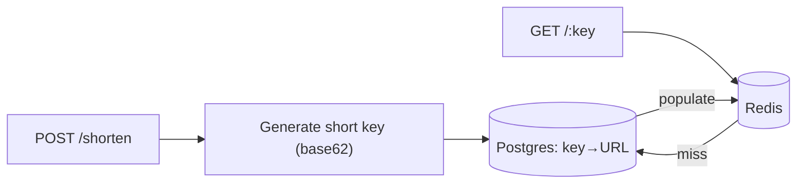

**Steps:**
1. Clarify: scale (reads ≫ writes), latency, key length.
2. Estimate QPS + storage (e.g., 100M URLs).
3. Design the API + key-generation strategy (counter+base62 vs hash).
4. Build with [[02 Postgres]] + [[04 Redis]] cache-aside + a [[05 Node.js]]/[[05 Spring Boot]] service.
5. Add analytics via a [[01 Kafka]] event per redirect.
6. Discuss scaling: read replicas, CDN, sharding the key space.

**Learn:** the full design process, caching, read-heavy scaling, estimation.

---

### Project 2: Design a Scalable News Feed (Intermediate→Senior)

**Goal:** Tackle the fan-out trade-off.

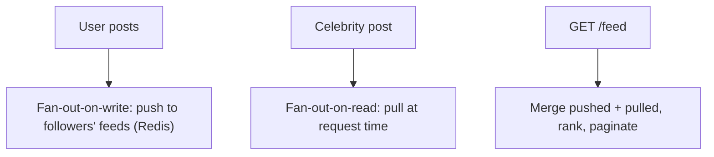

**Steps:**
1. Requirements: feed latency, follower counts, ranking.
2. Design **fan-out-on-write** with per-user feed lists in [[04 Redis]].
3. Handle the **celebrity problem** with a **hybrid** (pull for high-follower accounts).
4. Add ranking, pagination (cursor-based), and cache warming.
5. Discuss consistency (eventual feed is fine) and storage growth.

**Learn:** fan-out trade-offs, caching strategy, hybrid designs, real-world scale.

---

### Project 3: Design a Resilient Payment/Order System (Senior)

**Goal:** Correctness under failure — idempotency, consistency, resilience.

```mermaid
flowchart LR
    Order["POST /order (idempotency key)"] --> Check{Seen key?}
    Check -->|yes| Prior[Return prior result]
    Check -->|no| Tx["ACID tx: create order + reserve stock"]
    Tx --> Saga["Saga: payment → inventory → shipping"]
    Saga -.compensate on failure.-> Rollback
    Saga --> Events[(Kafka events)]
```

**Steps:**
1. Design **idempotent** order creation (idempotency keys).
2. Use **ACID** ([[02 Postgres]]) for the order transaction; **Saga** for the cross-service flow ([[03 Microservices]]).
3. Add **circuit breakers + retries with backoff** for the payment gateway.
4. Emit events to [[01 Kafka]] with **at-least-once + idempotent consumers**.
5. Add an **audit log**; reason about consistency and exactly-once handling.

**Learn:** idempotency, ACID vs saga, resilience patterns, exactly-once reality, event-driven design.

---

## 7. 🔬 DEEP DIVE: INTERNALS

### 7.1 Consistent Hashing (how distributed caches/DBs shard)

```mermaid
flowchart TB
    subgraph Ring["Hash Ring (0 → 2^32)"]
        N1["Node A @ pos 100"]
        N2["Node B @ pos 5000"]
        N3["Node C @ pos 9000"]
        K["key hashes to 4200 →<br/>walk clockwise → Node B"]
    end
```

> [!IMPORTANT]
> Naive sharding (`hash(key) % N`) **remaps almost every key when N changes** (adding/removing a node) — catastrophic for a cache (mass misses) or DB (mass data movement). **Consistent hashing** places nodes and keys on a **ring**; a key belongs to the next node clockwise. Adding/removing a node only moves the keys between two adjacent points — **~1/N of keys**, not all. **Virtual nodes** (each physical node at many ring positions) smooth out the distribution. This powers Cassandra, DynamoDB, and distributed [[04 Redis]]/memcached.

### 7.2 Quorum & Consensus (Raft/Paxos)

```mermaid
flowchart LR
    Write["Write"] --> Q["Quorum: W nodes must ack"]
    Read["Read"] --> QR["Quorum: R nodes must respond"]
    Rule["If W + R > N → strong consistency<br/>(read/write sets overlap)"] -.-> Q
```

- **Quorum**: with N replicas, require **W** acks to write and **R** responses to read. If **W + R > N**, read and write sets overlap → you always read the latest write (tunable consistency, à la Cassandra/Dynamo).
- **Consensus** (Raft, Paxos): how a cluster agrees on a **single leader** and a **consistent log** despite failures — the backbone of etcd ([[02 Kubernetes]]), [[01 Kafka]] KRaft, ZooKeeper, and Spanner.

> [!TIP]
> **Raft** (used by etcd, Consul, [[01 Kafka]] KRaft) solves leader election + log replication understandably: nodes vote for a leader, the leader replicates a log to a **majority quorum** before committing, and a new leader is elected if the old one fails. "How does the cluster avoid two leaders (split brain)?" → **majority quorum** — only a side with more than half the nodes can elect a leader, so a minority partition can't.

### 7.3 Database Internals That Shape Design

```mermaid
flowchart LR
    subgraph Storage["Storage Engines"]
        BT["B-Tree (Postgres/MySQL):<br/>read-optimized, in-place updates"]
        LSM["LSM-Tree (Cassandra/RocksDB):<br/>write-optimized, sequential writes + compaction"]
    end
```

> [!TIP]
> The **storage engine** shapes what a database is good at. **B-Trees** ([[02 Postgres]]) are read-optimized with in-place updates — great for balanced/read-heavy workloads. **LSM-Trees** (Cassandra, RocksDB, [[01 Kafka]] internally) buffer writes in memory and flush sequentially, making them **write-optimized** (excellent for high-ingest workloads) at the cost of read amplification and background compaction. Choosing Cassandra vs Postgres is partly choosing LSM vs B-Tree for your write:read profile. See [[02 Postgres]] for indexing internals.

### 7.4 The Latency Hierarchy & Why Architecture Looks Like It Does

```mermaid
flowchart LR
    CPU["CPU/RAM: ns"] --> Cache["Redis: µs–ms"]
    Cache --> Disk["SSD/DB: ms"]
    Disk --> Net["Cross-region: 100ms+"]
```

> [!IMPORTANT]
> **The entire shape of distributed architecture follows from the latency hierarchy.** Memory is ~1000× faster than a network call, which is why we **cache** ([[04 Redis]]) aggressively. Cross-region calls cost 100ms+, which is why we use **CDNs** and **regional replicas** to serve users near them. Disk is slow, which is why databases use memory buffers and why [[01 Kafka]] uses **sequential disk I/O** (nearly RAM-speed). When you understand these numbers, architectural decisions stop being arbitrary — you're always **moving data closer and avoiding slow hops**.

### 7.5 Stateless vs Stateful & the CALM/Coordination Cost

```mermaid
flowchart TB
    Stateless["Stateless services (easy to scale)"] --> Push["Push all state to →"]
    Push --> Stateful["Stateful stores (DB, Redis, Kafka)"]
    Coord["Coordination (locks, consensus, transactions)<br/>is the expensive part"] -.-> Stateful
```

> [!IMPORTANT]
> The deepest principle in system design: **coordination is expensive; avoid it where you can.** Stateless services scale trivially because they coordinate nothing — they're interchangeable. All the hard problems (consensus, distributed transactions, locking, consistency) live in the **stateful** layer, which is why we concentrate state in purpose-built systems ([[02 Postgres]], [[04 Redis]], [[01 Kafka]]) and keep everything else stateless. The art is **minimizing the surface that requires coordination** — partition data so operations stay local, use eventual consistency where correctness allows, and reserve strong coordination for the few places that truly need it (payments, inventory).

---

## ✅ Production Checklists

### Scalability
- [ ] App servers are **stateless** (state in [[04 Redis]]/DB)
- [ ] **Load balancing** with health checks, redundant LBs
- [ ] **Caching** at appropriate layers (CDN/app/DB) with TTLs
- [ ] Read scaling via **replicas**; sharding plan if needed
- [ ] **Async processing** via queues ([[01 Kafka]]) for slow work
- [ ] Autoscaling configured ([[02 Kubernetes]] HPA)

### Reliability
- [ ] **No single point of failure** (redundancy per tier, multi-AZ)
- [ ] **Circuit breakers, timeouts, retries (backoff+jitter), bulkheads**
- [ ] **Idempotency** on all mutating/retryable endpoints
- [ ] Graceful degradation / fallbacks
- [ ] Backups + tested **disaster recovery** (RPO/RTO defined)
- [ ] **Rate limiting** at the edge

### Consistency & Data
- [ ] Consistency model chosen **per operation** (strong vs eventual)
- [ ] Replication lag understood; read-your-writes where needed
- [ ] ACID for correctness-critical data; audit logs for money
- [ ] Shard key avoids hotspots (if sharded)

### Observability
- [ ] **Metrics, logs, distributed tracing** in place
- [ ] **Alerting on SLOs**; dashboards
- [ ] Capacity/load testing done against realistic scale

---

## 🗺️ Learning Roadmap

```mermaid
flowchart TB
    A["1️⃣ Fundamentals<br/>requirements, metrics, building blocks"] --> B["2️⃣ Scaling<br/>vertical/horizontal, load balancing, statelessness"]
    B --> C["3️⃣ Data<br/>SQL/NoSQL, replication, sharding, caching"]
    C --> D["4️⃣ Distributed theory<br/>CAP, consistency, ACID/BASE, idempotency"]
    D --> E["5️⃣ Resilience<br/>circuit breakers, retries, failure handling"]
    E --> F["6️⃣ Async & messaging<br/>queues, event-driven, workers"]
    F --> G["7️⃣ Practice<br/>design classic problems, estimation, trade-offs"]
    G --> H["8️⃣ Deep internals<br/>consistent hashing, consensus, storage engines, latency"]
```

| Stage | Focus | You can... |
|---|---|---|
| 1–2 | Fundamentals + scaling | Reason about scaling a single service |
| 3–4 | Data + theory | Choose data stores, reason about consistency |
| 5–6 | Resilience + async | Design for failure and decoupling |
| 7–8 | Practice + internals | Nail design interviews, architect real systems |

---

## 🔁 Self-Review Completion Loop

Reviewed against distributed-systems literature, system-design interview frameworks, real-world architectures, and production best practices.

### Gap Review Matrix

| Dimension | Covered? | Where |
|---|---|---|
| What/why, functional vs non-functional | ✅ | §1 |
| Building blocks | ✅ | §1 |
| Vertical vs horizontal scaling | ✅ | §2.1 |
| Load balancing | ✅ | §2.2 |
| SQL vs NoSQL | ✅ | §2.3 |
| Replication | ✅ | §2.4 |
| Sharding/partitioning | ✅ | §2.5 |
| Caching (multi-layer) | ✅ | §2.6 |
| Message queues / async | ✅ | §2.7 |
| CAP theorem | ✅ | §3.1 |
| Consistency models + PACELC | ✅ | §3.2 |
| ACID vs BASE | ✅ | §3.3 |
| Idempotency / exactly-once | ✅ | §3.4 |
| Rate limiting | ✅ | §3.5 |
| Resilience patterns | ✅ | §3.6 |
| Failure scenarios | ✅ | §3.7 |
| Capacity estimation + latency numbers | ✅ | §3.8 |
| Reference architecture | ✅ | §4.1 |
| Interview framework | ✅ | §4.2 |
| Classic design problems + fan-out | ✅ | §4.3 |
| Observability | ✅ | §4.5 |
| Consistent hashing | ✅ | §7.1 |
| Quorum & consensus (Raft) | ✅ | §7.2 |
| Storage engines (B-Tree/LSM) | ✅ | §7.3 |
| Latency hierarchy | ✅ | §7.4 |
| Coordination cost / stateless principle | ✅ | §7.5 |
| Interview Q&A + mistakes | ✅ | §5 |
| Hands-on projects | ✅ | §6 |

> [!NOTE]
> **Remaining depth to explore independently:** the [[03 Microservices]] deep-dive (service mesh, saga/CQRS/event sourcing — already in your vault), API gateway patterns, GraphQL vs REST vs gRPC trade-offs, data-intensive processing (batch vs stream, Lambda/Kappa architectures), geo-distribution & multi-region active-active, CRDTs for conflict-free replication, security at scale (auth, secrets, zero-trust), and cost optimization. Read *Designing Data-Intensive Applications* for the definitive treatment.

---

## 📚 Official References

| Resource | Source |
|---|---|
| *Designing Data-Intensive Applications* — Martin Kleppmann | The definitive book (a must-read) |
| System Design Primer | https://github.com/donnemartin/system-design-primer |
| ByteByteGo (Alex Xu) | https://bytebytego.com/ · *System Design Interview* Vol 1 & 2 |
| Google SRE Book | https://sre.google/books/ |
| High Scalability (case studies) | http://highscalability.com/ |
| AWS Well-Architected Framework | https://aws.amazon.com/architecture/well-architected/ |
| Martin Fowler's architecture articles | https://martinfowler.com/ |
| Jepsen (consistency analyses) | https://jepsen.io/ |

---

## 🎁 Final Summary

> [!IMPORTANT]
> **The one-paragraph takeaway:** System design is the art of **making the right trade-offs** to build systems that stay fast, available, and durable at scale. You scale **horizontally** with **stateless services** behind **load balancers**, absorb read load with **caching** ([[04 Redis]]/CDN) and **replicas**, scale data with **sharding**, and decouple slow work with **message queues** ([[01 Kafka]]). Distributed systems force hard choices — **CAP** (consistency vs availability during partitions), **PACELC** (latency vs consistency always), **ACID vs BASE** — so you pick a consistency model **per operation**. You defend against failure with **redundancy, circuit breakers, timeouts, retries with backoff, and idempotency**, and you operate blind without **observability**. The deepest principle: **coordination is expensive, so minimize it** — concentrate state in purpose-built stores, keep everything else stateless, and move data closer to where it's used (the latency hierarchy explains every architecture). In interviews and reality alike: **gather requirements, estimate, design, and narrate the trade-offs** — there's no perfect design, only the right fit for the constraints.

**Golden rules:**
1. ⚖️ **Everything is a trade-off** — name it and justify it.
2. 📋 **Requirements & scale first**, architecture second.
3. 📈 Scale **horizontally** — which demands **stateless** services.
4. ⚡ **Cache aggressively** (latency hierarchy) — but plan invalidation.
5. 🧭 **CAP/PACELC**: choose consistency vs availability/latency **per operation**.
6. 🔁 Assume retries — make mutations **idempotent** (exactly-once is a myth).
7. 🛡️ Design for failure: **redundancy, circuit breakers, backoff, bulkheads**.
8. 🧠 **Minimize coordination** — it's the expensive part of distributed systems.
9. 🔭 **Observability** (metrics/logs/traces) is not optional at scale.
10. 🚫 Don't over-engineer — the **simplest design that meets the requirements** wins.

---

*Related guides in this vault: [[03 Microservices]] · [[01 Kafka]] · [[04 Redis]] · [[02 Postgres]] · [[03 MongoDB]] · [[02 Kubernetes]] · [[01 Docker]] · [[02 Design Patterns]] · [[05 Node.js]] · [[05 Spring Boot]]*
