# 🎨 Design Patterns — Complete Beginner-to-Expert Reference

> Battle-tested, reusable solutions to recurring software design problems — the shared vocabulary that separates senior engineers from code that merely works.

---

## 📑 Table of Contents

1. [Executive Summary](#-executive-summary)
2. [Fundamentals (Beginner)](#1--fundamentals-beginner-level)
3. [Core Concepts (Intermediate)](#2--core-concepts-intermediate-level)
4. [Advanced Concepts (Senior)](#3--advanced-concepts-senior-level)
5. [Real-World System Design](#4--real-world-system-design-usage)
6. [Interview Preparation](#5--interview-preparation)
7. [Hands-On Projects](#6--hands-on-projects)
8. [Deep Dive: Internals](#7--deep-dive-internals)
9. [Production Checklists](#-production-checklists)
10. [Learning Roadmap](#-learning-roadmap)
11. [Self-Review Completion Loop](#-self-review-completion-loop)
12. [Official References](#-official-references)
13. [Final Summary](#-final-summary)

---

## 🎯 Executive Summary

**Design Patterns** are named, reusable solutions to problems that recur in software design. They're not code you copy — they're **proven templates** for how to structure classes and objects to solve a specific problem while keeping code flexible, maintainable, and extensible. Formalized by the "Gang of Four" (GoF) in 1994, they give engineers a **shared vocabulary**.

| What it is | What it replaces | Core superpower |
|---|---|---|
| Reusable solution templates for design problems | Reinventing wheels, rigid coupled code, ad-hoc structure | **Shared vocabulary** + proven, flexible structures that absorb change |

> [!IMPORTANT]
> The point of design patterns is **not** to memorize 23 diagrams — it's to internalize the *principles* they encode: **program to interfaces, favor composition over inheritance, encapsulate what varies, and reduce coupling.** A senior engineer rarely says "let's use a Decorator"; they recognize a shape ("this behavior needs to be composable at runtime") and reach for the right structure. Patterns are a **vocabulary and a toolkit**, not a checklist — and misapplying them (over-engineering) is as harmful as not knowing them.

Related guides: [[01 Basic Java]] · [[05 Spring Boot]] · [[09 Java Hibernate]] · [[03 Microservices]] · [[08 React]] · [[03 TypeScript]]

---

## 1. 🌱 FUNDAMENTALS (Beginner Level)

### What are design patterns in simple terms?

Imagine you're an architect. You don't redesign "a staircase" or "a load-bearing wall" from scratch every time — there are **known, proven designs** for these recurring needs. **Design patterns are those proven designs, but for code.** When you face "I need exactly one shared instance" or "I need to create objects without hardcoding their class," someone has already solved it well — that solution has a name and a structure.

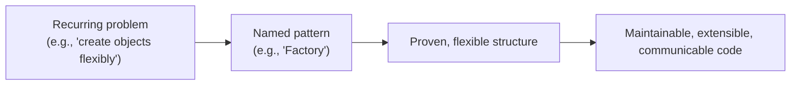

### Why do design patterns exist?

As programs grow, naive designs become **rigid** (hard to change), **fragile** (changes break unrelated things), and **immobile** (can't reuse pieces). Patterns emerged from experienced engineers noticing the *same* good solutions appearing again and again — so they named and documented them.

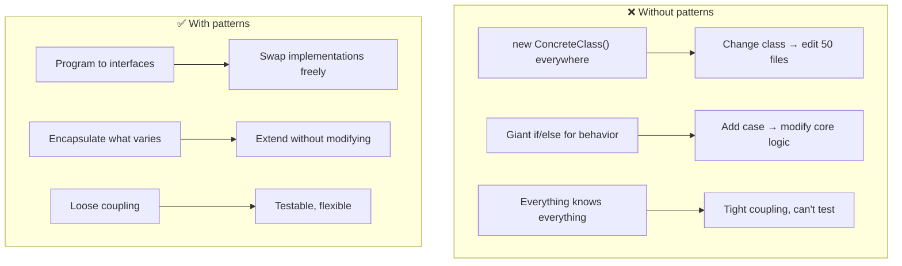

### Problems design patterns solve

| Problem | Pattern family that helps |
|---|---|
| **Rigid object creation** (hardcoded `new`) | Creational (Factory, Builder…) |
| **Incompatible interfaces / complex structures** | Structural (Adapter, Facade…) |
| **Hard-to-change behavior / communication** | Behavioral (Strategy, Observer…) |
| **Tight coupling** | Most patterns (via interfaces) |
| **Duplicated design decisions** | The shared vocabulary itself |
| **Onboarding & communication** | "It's a Decorator" conveys a whole design |

### The SOLID Principles (the foundation beneath patterns)

Patterns are *applications* of deeper principles. **SOLID** is the bedrock:

| Principle | Meaning | Example |
|---|---|---|
| **S** — Single Responsibility | A class should have one reason to change | Separate `UserRepository` from `EmailSender` |
| **O** — Open/Closed | Open for extension, closed for modification | Add a new Strategy without editing existing code |
| **L** — Liskov Substitution | Subtypes must be usable as their base type | A `Square` that breaks `Rectangle`'s contract violates this |
| **I** — Interface Segregation | Many small interfaces > one fat one | Don't force `Robot` to implement `eat()` |
| **D** — Dependency Inversion | Depend on abstractions, not concretions | Inject an interface, not a concrete class ([[05 Spring Boot]] DI) |

> [!IMPORTANT]
> **SOLID principles matter more than any specific pattern.** Most patterns are just concrete ways to satisfy SOLID — especially the **Dependency Inversion** and **Open/Closed** principles. If you understand SOLID, patterns become "obvious" applications rather than magic incantations. Interviewers probe SOLID because it reveals whether you understand *why* code is structured a certain way.

### The three categories

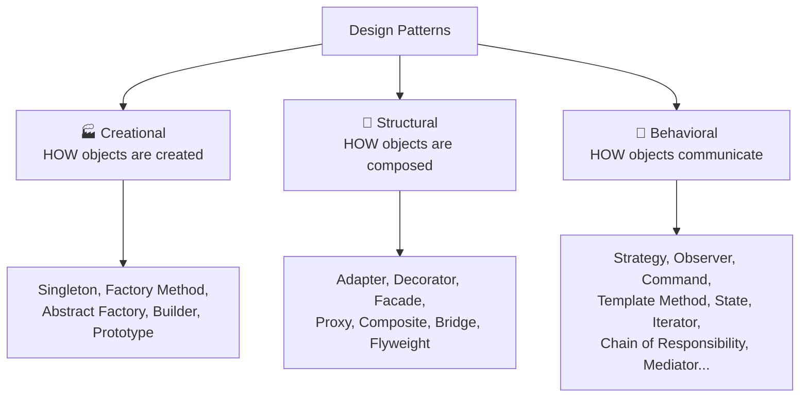

### Real-world analogy 🔌

Design patterns are like **standardized solutions in everyday life**:
- A **power adapter** (Adapter pattern) lets your device plug into a foreign socket without redesigning the device.
- A **universal remote** (Facade) gives one simple interface to a complex home-theater system.
- A **restaurant order ticket** (Command) packages "make this dish" as an object the kitchen processes later.
- A **newsletter subscription** (Observer) — subscribers get notified when a new issue publishes; publisher doesn't know who they are.

> [!TIP]
> Learn patterns by the **problem they solve**, not the diagram. Ask "what varies here, and how do I isolate it?" Every pattern is an answer to "how do I let *this* change without breaking *that*." If you can state the problem, you can pick the pattern — and equally important, recognize when *no* pattern is needed (YAGNI).

---

## 2. 🧩 CORE CONCEPTS (Intermediate Level)

### 2.1 Creational Patterns — object creation

#### Singleton — exactly one instance

```java
public class Config {
    private static volatile Config instance;
    private Config() {}
    public static Config getInstance() {
        if (instance == null) {                    // double-checked locking
            synchronized (Config.class) {
                if (instance == null) instance = new Config();
            }
        }
        return instance;
    }
}
// Better in Java: an enum singleton (thread-safe, serialization-safe)
public enum Config2 { INSTANCE; }
```

**Use for:** shared config, connection pools, caches, loggers.

> [!WARNING]
> **Singleton is the most overused and most criticized pattern.** It introduces **global state** (hard to test, hidden dependencies), can cause **concurrency bugs** if not implemented carefully, and often violates Single Responsibility. In modern code, prefer a **DI container** ([[05 Spring Boot]]) managing a single-instance bean — you get "one instance" *plus* testability and explicit dependencies. Reach for a raw Singleton rarely.

#### Factory Method & Abstract Factory — create without hardcoding classes

```java
// Factory Method: subclass decides what to create
interface Notification { void send(String msg); }
class EmailNotification implements Notification { public void send(String m){} }
class SmsNotification implements Notification { public void send(String m){} }

class NotificationFactory {
    static Notification create(String type) {
        return switch (type) {
            case "email" -> new EmailNotification();
            case "sms"   -> new SmsNotification();
            default -> throw new IllegalArgumentException(type);
        };
    }
}
```

- **Factory Method**: defer instantiation to a method/subclass — callers depend on the interface, not concrete classes.
- **Abstract Factory**: a factory of related factories (e.g., a `UIFactory` producing matching `Button` + `Checkbox` for Windows vs Mac).

#### Builder — construct complex objects step by step

```java
Pizza pizza = new Pizza.Builder()
    .size("large")
    .addTopping("mushroom")
    .addTopping("cheese")
    .thinCrust(true)
    .build();
```

**Use for:** objects with many optional parameters (avoids "telescoping constructors"). Common in [[09 Java Hibernate]] criteria, HTTP client builders, etc.

#### Prototype — clone existing objects

Create new objects by **copying** a prototype instead of building from scratch — useful when construction is expensive or configuration is complex.

| Pattern | Use when |
|---|---|
| **Singleton** | Exactly one shared instance needed |
| **Factory Method** | Decouple creation; subclasses choose the type |
| **Abstract Factory** | Create families of related objects |
| **Builder** | Many optional params / step-by-step construction |
| **Prototype** | Cloning is cheaper than creating |

### 2.2 Structural Patterns — object composition

#### Adapter — make incompatible interfaces work together

```java
// Legacy payment system with a different interface
class LegacyPayment { void makePayment(int cents) {} }

interface PaymentProcessor { void pay(double dollars); }

class LegacyPaymentAdapter implements PaymentProcessor {
    private final LegacyPayment legacy = new LegacyPayment();
    public void pay(double dollars) {
        legacy.makePayment((int)(dollars * 100));   // adapt the call
    }
}
```

#### Decorator — add behavior dynamically without subclassing

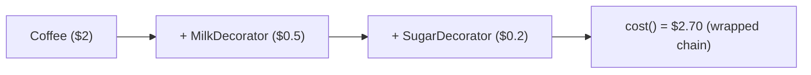

```java
Coffee coffee = new SugarDecorator(new MilkDecorator(new SimpleCoffee()));
coffee.cost();   // each decorator wraps and adds
```

**Use for:** composable, stackable features (Java's `BufferedReader(new FileReader(...))` is a Decorator; [[12 Spring WebFlux]]/HTTP middleware too).

#### Facade — simple interface over a complex subsystem

```java
// Instead of orchestrating 5 subsystems, one simple call:
class OrderFacade {
    void placeOrder(Cart cart) {
        inventory.reserve(cart);
        payment.charge(cart);
        shipping.schedule(cart);
        notifications.confirm(cart);
    }
}
```

#### Proxy — a stand-in that controls access

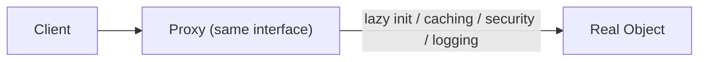

**Use for:** lazy loading ([[09 Java Hibernate]] lazy proxies!), access control, caching, remote calls. **Spring AOP creates proxies** for `@Transactional`/`@Cacheable` ([[06 Spring Boot Annotations]]).

| Pattern | Intent |
|---|---|
| **Adapter** | Convert one interface to another |
| **Decorator** | Add responsibilities dynamically |
| **Facade** | Simplify a complex subsystem |
| **Proxy** | Control access to an object |
| **Composite** | Treat individual + groups uniformly (trees) |
| **Bridge** | Separate abstraction from implementation |
| **Flyweight** | Share objects to save memory |

> [!TIP]
> **Adapter vs Decorator vs Proxy vs Facade** confuse everyone — the distinction is *intent*, not structure (they all "wrap"): **Adapter** changes the interface, **Decorator** adds behavior (same interface), **Proxy** controls access (same interface), **Facade** simplifies many objects into one. Same wrapping mechanic, different purpose.

### 2.3 Behavioral Patterns — object communication

#### Strategy — swap algorithms at runtime

```java
interface PaymentStrategy { void pay(double amount); }
class CreditCard implements PaymentStrategy { public void pay(double a){} }
class PayPal implements PaymentStrategy { public void pay(double a){} }

class Checkout {
    private PaymentStrategy strategy;
    void setStrategy(PaymentStrategy s) { this.strategy = s; }
    void checkout(double amount) { strategy.pay(amount); }   // delegates
}
```

> [!TIP]
> **Strategy is the antidote to giant `if/else`/`switch` on "type."** Instead of `if (type == "creditcard") {...} else if (...)`, you inject a strategy object. Adding a payment method = a new class, **zero changes to existing code** (Open/Closed). In modern languages, a strategy is often just a **function/lambda** passed in — the pattern predates first-class functions.

#### Observer — publish/subscribe notifications

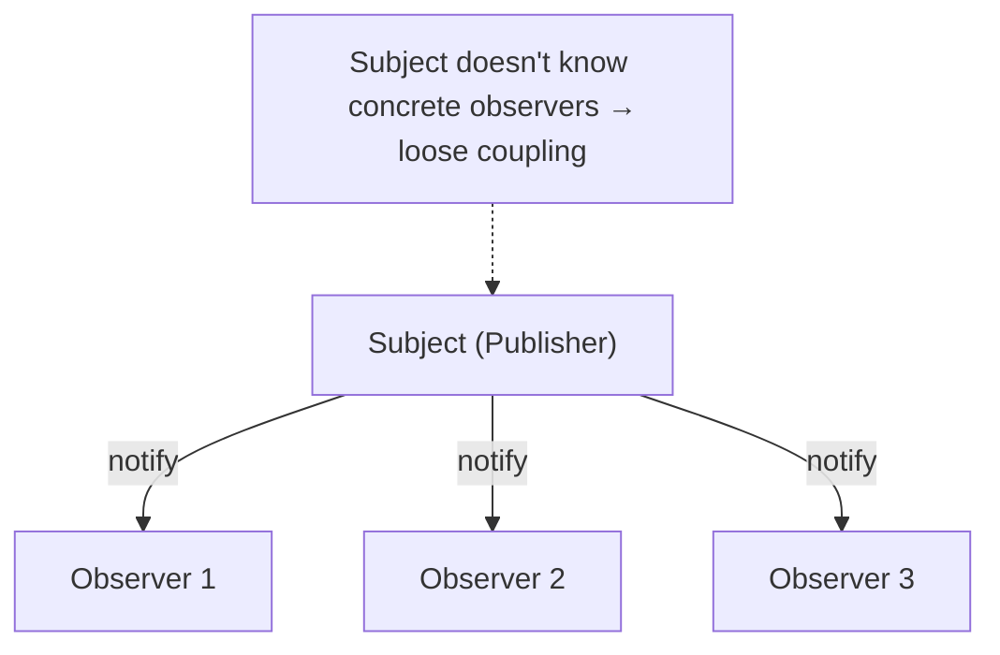

```java
subject.subscribe(observer1);
subject.subscribe(observer2);
subject.notifyAll(event);   // all observers react
```

**Use for:** event systems, UI updates ([[08 React]]'s state→render, [[11 Redux Toolkit and RTK Query]] store subscriptions), [[01 Kafka]]-style pub/sub conceptually, reactive streams ([[12 Spring WebFlux]]).

#### Command — encapsulate a request as an object

```java
interface Command { void execute(); void undo(); }
class AddTextCommand implements Command { /* execute + undo */ }

// Enables: queues, logging, undo/redo, transactions
commandHistory.push(command);
command.execute();
// later: command.undo();
```

**Use for:** undo/redo, job queues, task scheduling, transactional operations.

#### Template Method — fixed skeleton, customizable steps

```java
abstract class DataProcessor {
    public final void process() {   // the fixed algorithm (template)
        readData();
        transform();                // subclass customizes
        writeData();
    }
    protected abstract void transform();
}
```

| Pattern | Intent |
|---|---|
| **Strategy** | Interchangeable algorithms |
| **Observer** | One-to-many event notification |
| **Command** | Request as an object (undo/queue) |
| **Template Method** | Skeleton with overridable steps |
| **State** | Behavior changes with internal state |
| **Iterator** | Sequential access without exposing internals |
| **Chain of Responsibility** | Pass request along handlers ([[07 Servlets and Filters]]!) |
| **Mediator** | Centralize complex communication |

### 2.4 Choosing a Pattern

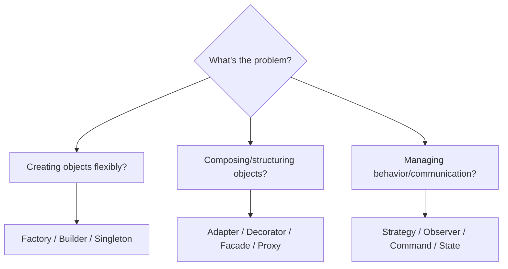

---

## 3. ⚙️ ADVANCED CONCEPTS (Senior Level)

### 3.1 Patterns Are Everywhere in Frameworks You Use

| Framework feature | Pattern(s) |
|---|---|
| [[05 Spring Boot]] `@Bean` / IoC container | Factory, Singleton (scoped), Dependency Injection |
| [[06 Spring Boot Annotations]] `@Transactional`/`@Cacheable` | **Proxy** + Decorator (AOP) |
| [[07 Servlets and Filters]] filter chain | **Chain of Responsibility** |
| [[09 Java Hibernate]] lazy loading | **Proxy** |
| [[08 React]] component composition & context | Composite, Observer, (HOCs = Decorator) |
| [[11 Redux Toolkit and RTK Query]] reducers/store | Observer, Command (actions), Flux |
| Java I/O (`BufferedReader`) | **Decorator** |
| [[06 Express.js]]/[[07 Hono]] middleware | **Chain of Responsibility** |
| [[05 Node.js]] `EventEmitter` | **Observer** |
| `Comparator`, lambdas passed to methods | **Strategy** |

> [!IMPORTANT]
> The senior realization: **you already use design patterns constantly — the frameworks are built from them.** Understanding patterns lets you *read framework source code*, predict behavior (why does `@Transactional` fail on a self-call? Because it's a **Proxy**, and self-invocation bypasses it — see [[06 Spring Boot Annotations]]), and extend frameworks correctly. Patterns aren't academic; they're the blueprint of every library you import.

### 3.2 Composition Over Inheritance

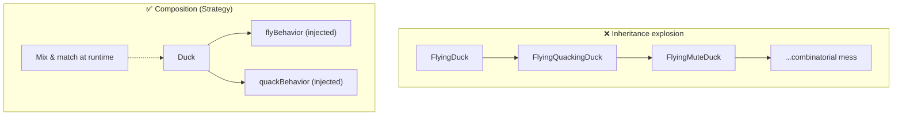

> [!IMPORTANT]
> **"Favor composition over inheritance" is the single most important design maxim** — and most GoF patterns embody it (Strategy, Decorator, Bridge, State…). Deep inheritance hierarchies are rigid: behavior is fixed at compile time, changes ripple through subclasses, and multiple varying dimensions cause a **combinatorial explosion** of subclasses. Composition injects behavior as collaborating objects — flexible, runtime-swappable, testable. When you feel the urge to subclass, ask: "can I compose this instead?"

### 3.3 Anti-Patterns & Over-Engineering

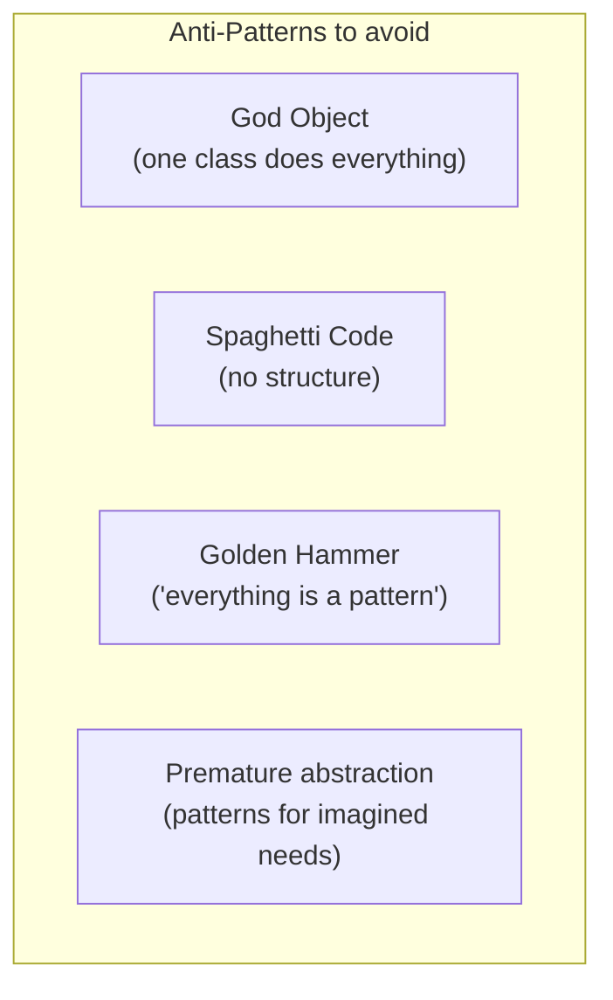

> [!WARNING]
> **Over-applying patterns is a classic mid-level mistake.** Wrapping a two-line function in an `AbstractStrategyFactoryProviderBuilder` because "patterns are good" creates *more* complexity than it removes. Patterns have a **cost** (indirection, more classes, cognitive load). Apply them when the **flexibility they buy is actually needed** — i.e., when you have evidence something *will* vary. **YAGNI** (You Aren't Gonna Need It) and **KISS** (Keep It Simple) are guardrails. The mark of seniority is knowing when *not* to use a pattern.

### 3.4 Modern Language Features That Replace Patterns

| Classic pattern | Modern replacement |
|---|---|
| **Strategy** | First-class functions / lambdas |
| **Command** | Closures / functions |
| **Iterator** | Built-in `for...of`, generators, streams |
| **Singleton** | Module system (a module *is* a singleton) / DI container |
| **Observer** | Built-in events, reactive streams (RxJS, [[12 Spring WebFlux]]), signals |
| **Decorator** | Higher-order functions, language decorators |
| **Factory** | Simple factory functions |

> [!TIP]
> Many GoF patterns were **workarounds for limitations of 1990s C++/Java** (no first-class functions, no modules). In [[01 JavaScript]]/[[03 TypeScript]]/modern Java, a "Strategy" is often just passing a function; a "Singleton" is just a module export. Don't ceremonially implement a full pattern when a language feature expresses the same intent more simply. Know the pattern's *intent*, then use the lightest tool that achieves it.

### 3.5 Concurrency & Enterprise Patterns (beyond GoF)

Patterns extend well past the original 23:

| Pattern | Domain | Purpose |
|---|---|---|
| **Repository** | Data access | Abstract persistence ([[09 Java Hibernate]], [[05 Spring Boot]] repos) |
| **Unit of Work** | Data access | Track changes, commit as one transaction |
| **DTO** | Layering | Transfer data across boundaries |
| **MVC / MVVM** | UI architecture | Separate concerns |
| **Dependency Injection** | Wiring | Invert control of dependencies ([[05 Spring Boot]]) |
| **Circuit Breaker** | Resilience | Stop cascading failures ([[03 Microservices]]) |
| **Saga** | Distributed txns | Coordinate across services ([[03 Microservices]]) |
| **CQRS / Event Sourcing** | Data | Separate reads/writes; log events ([[01 Kafka]]) |
| **Producer-Consumer** | Concurrency | Decouple work generation/processing |
| **Object Pool** | Performance | Reuse expensive objects (connection pools) |

> [!TIP]
> Interviews increasingly favor **architectural/enterprise patterns** (Repository, DI, Circuit Breaker, Saga, CQRS) over rote GoF for backend/system-design roles. These build directly on GoF principles but operate at the service/system level. Your [[03 Microservices]] and [[01 Kafka]] guides cover several — recognize them as "design patterns at scale."

### 3.6 Failure Scenarios & Design Smells

| Smell | Indicates | Likely fix |
|---|---|---|
| **Giant `switch`/`if-else` on type** | Missing Strategy/State/polymorphism | Strategy or polymorphic dispatch |
| **`new ConcreteClass()` everywhere** | Missing Factory / DI | Factory + Dependency Injection |
| **God Object** | SRP violation | Split responsibilities |
| **Deep inheritance tree** | Inheritance abuse | Composition (Strategy/Decorator) |
| **Duplicated notification logic** | Missing Observer | Observer / events |
| **Changing code to add a feature** | Open/Closed violation | Extension points (Strategy/Template) |
| **Untestable due to `new`/statics** | Hard dependencies | Inject abstractions (DIP) |
| **Pattern for a trivial case** | Over-engineering | Remove it — YAGNI |

---

## 4. 🏗️ REAL-WORLD SYSTEM DESIGN USAGE

### 4.1 Patterns in a Layered Backend

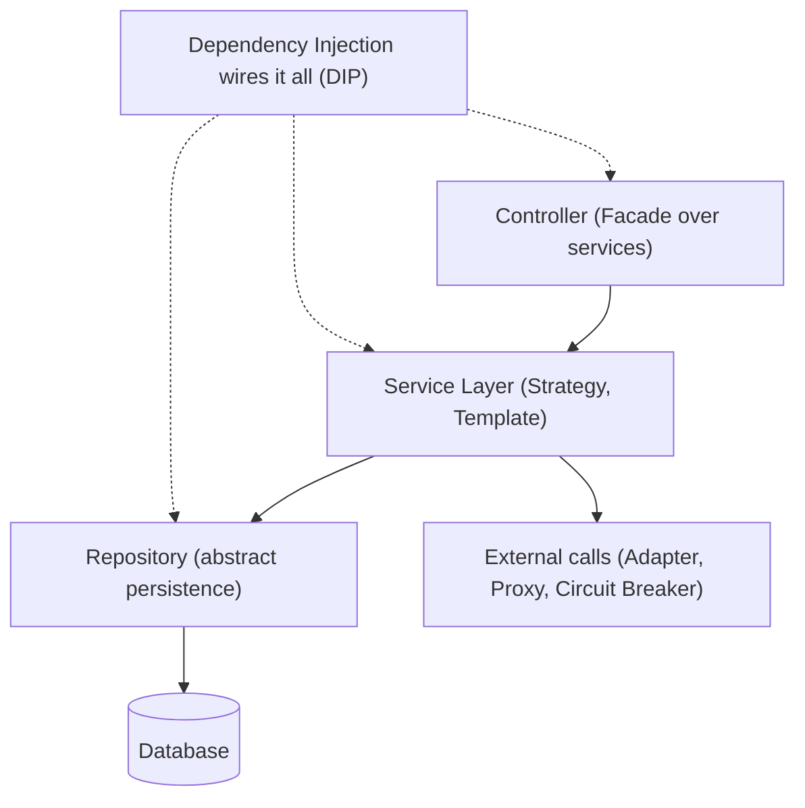

A typical [[05 Spring Boot]] app layers multiple patterns: **DI** wires everything, **Repository** abstracts the DB, **Facade** simplifies controllers, **Strategy** for pluggable business rules, **Adapter/Proxy** for external systems, **Circuit Breaker** for resilience.

### 4.2 How big systems use patterns

| Company/System | Pattern usage |
|---|---|
| **Netflix** | Circuit Breaker (Hystrix), Facade (API gateway), Observer (RxJava) |
| **Uber** | Strategy (pricing/matching algorithms), Saga (trip transactions) |
| **Spring Framework** | Proxy (AOP), Factory (beans), Template Method (`JdbcTemplate`) |
| **React ecosystem** | Composite (components), Observer (state), HOC/render props (Decorator/Strategy) |
| **Databases** | Iterator (cursors), Flyweight (interned values), Proxy (lazy) |

### 4.3 Event-Driven Systems (Observer at scale)

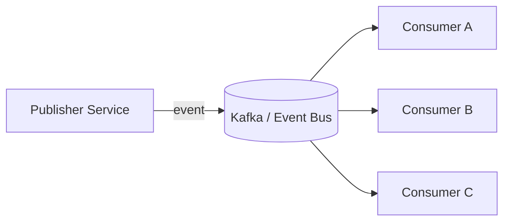

The **Observer** pattern, scaled across a network, *is* event-driven architecture ([[01 Kafka]], [[03 Microservices]]). Publishers emit events; consumers subscribe — same loose-coupling principle, distributed. Recognizing this connects OOP patterns to system design.

### 4.4 Framework Extension Points

When you extend a framework, you use *its* patterns:
- Adding a [[07 Servlets and Filters|Servlet Filter]] → plugging into **Chain of Responsibility**.
- Writing [[06 Express.js]]/[[07 Hono]] middleware → same chain.
- A custom [[08 React]] hook → composing behavior (Strategy-like).
- A [[05 Spring Boot]] `BeanPostProcessor` → **Template Method** / interception hook.

> [!IMPORTANT]
> Frameworks expose **extension points that are patterns**. To extend a framework correctly, identify which pattern the extension point implements — then your custom code slots in naturally. Fighting the framework usually means fighting its patterns.

---

## 5. 🎤 INTERVIEW PREPARATION

### 5.1 Most important questions

<details>
<summary><b>Q1: What are the three categories of GoF patterns?</b></summary>

**Creational** (object creation — Singleton, Factory, Builder, Prototype, Abstract Factory), **Structural** (composition — Adapter, Decorator, Facade, Proxy, Composite, Bridge, Flyweight), and **Behavioral** (communication — Strategy, Observer, Command, Template Method, State, Iterator, Chain of Responsibility, Mediator, etc.).
</details>

<details>
<summary><b>Q2: Explain SOLID.</b></summary>

**S**ingle Responsibility (one reason to change), **O**pen/Closed (extend without modifying), **L**iskov Substitution (subtypes substitutable for base), **I**nterface Segregation (small focused interfaces), **D**ependency Inversion (depend on abstractions). Most patterns are concrete ways to satisfy these — especially Open/Closed and Dependency Inversion.
</details>

<details>
<summary><b>Q3: Singleton — how to implement safely, and why is it criticized?</b></summary>

Safely: **enum singleton** in Java (thread-safe, serialization-safe) or double-checked locking with `volatile`. Criticized because it's **global mutable state** (hard to test, hidden dependencies, concurrency risks) and often violates SRP. Modern preference: a single-instance **bean in a DI container** for the same benefit with testability.
</details>

<details>
<summary><b>Q4: Strategy vs Template Method?</b></summary>

Both vary an algorithm. **Strategy** uses **composition** — inject a whole algorithm object, swappable at runtime. **Template Method** uses **inheritance** — a base class fixes the skeleton and subclasses override specific steps (fixed at compile time). Strategy is more flexible; Template Method reuses more shared structure.
</details>

<details>
<summary><b>Q5: Adapter vs Decorator vs Proxy vs Facade?</b></summary>

All wrap an object, differing by **intent**: **Adapter** converts one interface to another; **Decorator** adds behavior while keeping the same interface; **Proxy** controls access (lazy/security/cache) with the same interface; **Facade** provides a simpler interface over a *whole subsystem*.
</details>

<details>
<summary><b>Q6: How does Factory improve on `new`?</b></summary>

`new ConcreteClass()` hardcodes the dependency — callers are coupled to a specific class, and changing it means editing every call site. A **Factory** centralizes creation behind an interface, so callers depend on the abstraction; you can swap implementations, add types, or add creation logic in one place (Open/Closed + Dependency Inversion).
</details>

<details>
<summary><b>Q7: Where do you see patterns in Spring/frameworks?</b></summary>

Spring: **Proxy** (AOP `@Transactional`), **Factory/Singleton** (bean container), **Template Method** (`JdbcTemplate`), **DI** (Dependency Inversion). Servlet **filters** & Express middleware are **Chain of Responsibility**. Java I/O streams are **Decorator**. React state is **Observer**. Naming these shows real understanding.
</details>

<details>
<summary><b>Q8: When should you NOT use a design pattern?</b></summary>

When the flexibility it provides isn't needed — patterns add indirection and complexity. Applying a pattern for an imagined future requirement (premature abstraction) violates **YAGNI/KISS**. Simple, direct code beats a needlessly "patterned" design. Seniority is knowing when to *not* reach for one.
</details>

### 5.2 Tricky questions

> [!TIP]
> **"Why does a Spring `@Transactional` self-invocation not open a transaction?"** — Because Spring wraps the bean in a **Proxy**; annotations work when calls go *through* the proxy. A method calling another `@Transactional` method on `this` bypasses the proxy, so the aspect never runs. Understanding Proxy explains the bug (see [[06 Spring Boot Annotations]]).

> [!TIP]
> **"Is a Singleton the same as a static class?"** — No. A Singleton is an **instance** (can implement interfaces, be passed around, be lazily created, be mocked/replaced); a static class is just namespaced functions with no instance and no polymorphism. Singletons can participate in patterns; static utilities can't.

> [!TIP]
> **"Strategy pattern with lambdas — still a pattern?"** — Yes. The *intent* (interchangeable algorithms injected at runtime) is Strategy; the *implementation* is just lighter with first-class functions. Patterns describe intent, not a specific code shape.

> [!TIP]
> **"Dependency Injection — is it a pattern or a principle?"** — DI is a **pattern/technique** that *implements* the **Dependency Inversion principle** (the "D" in SOLID). DI containers ([[05 Spring Boot]]) automate wiring. Don't conflate the principle (depend on abstractions) with the mechanism (inject them).

### 5.3 Common mistakes candidates make

| Mistake | Reality |
|---|---|
| Memorizing diagrams, not intent | Patterns solve problems; state the problem |
| Overusing patterns | Adds complexity; use only when flexibility is needed |
| Singleton for everything | Global state; prefer DI |
| Confusing the wrappers (Adapter/Decorator/Proxy) | Distinguish by intent |
| Not connecting patterns to SOLID | Patterns *implement* SOLID |
| Ignoring composition over inheritance | The core maxim behind most patterns |
| Not recognizing patterns in frameworks | They're everywhere you already work |

### 5.4 What interviewers actually expect

- **SOLID** fluency and how patterns implement it.
- **Intent-based** understanding (not diagram recall) — especially the wrapper family.
- **Composition over inheritance** and *when not* to use patterns.
- Recognizing patterns **in the frameworks you use** ([[05 Spring Boot]], [[08 React]]).
- For senior/system roles: **enterprise patterns** (Repository, DI, Circuit Breaker, Saga, CQRS).
- Pragmatism — patterns serve maintainability, not resume-driven complexity.

---

## 6. 🛠️ HANDS-ON PROJECTS

### Project 1: Refactor a "God Class" with Patterns (Beginner→Intermediate)

**Goal:** Take smelly code and apply the right patterns.

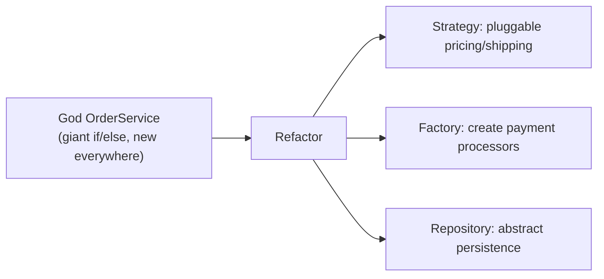

**Steps:**
1. Start with a class doing pricing, payment, persistence, and notifications (SRP violation).
2. Extract **Strategy** for payment methods (kill the `switch`).
3. Add a **Factory** for creating processors.
4. Introduce a **Repository** interface for data access.
5. Wire with **Dependency Injection**; add **Observer** for notifications.
6. Note how each change satisfies a SOLID principle.

**Learn:** Strategy, Factory, Repository, Observer, DI, SOLID in practice.

---

### Project 2: Build a Notification/Middleware System (Intermediate→Senior)

**Goal:** Compose behavior with structural + behavioral patterns.

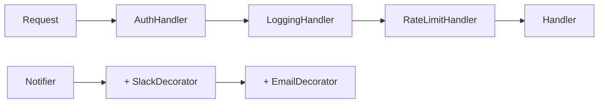

**Steps:**
1. Build a **Chain of Responsibility** middleware pipeline (auth → logging → rate limit) — mirrors [[06 Express.js]]/[[07 Servlets and Filters]].
2. Build a notification system with **Observer** (subscribers) + **Decorator** (stack Slack/email/SMS channels).
3. Use **Command** to make notifications queueable and retryable.
4. Compare with how [[06 Express.js]]/[[07 Hono]] and [[05 Node.js]] `EventEmitter` do it.

**Learn:** Chain of Responsibility, Decorator, Observer, Command, composition.

---

### Project 3: A Mini Framework / Plugin System (Senior)

**Goal:** Design extension points — build patterns *others* plug into.

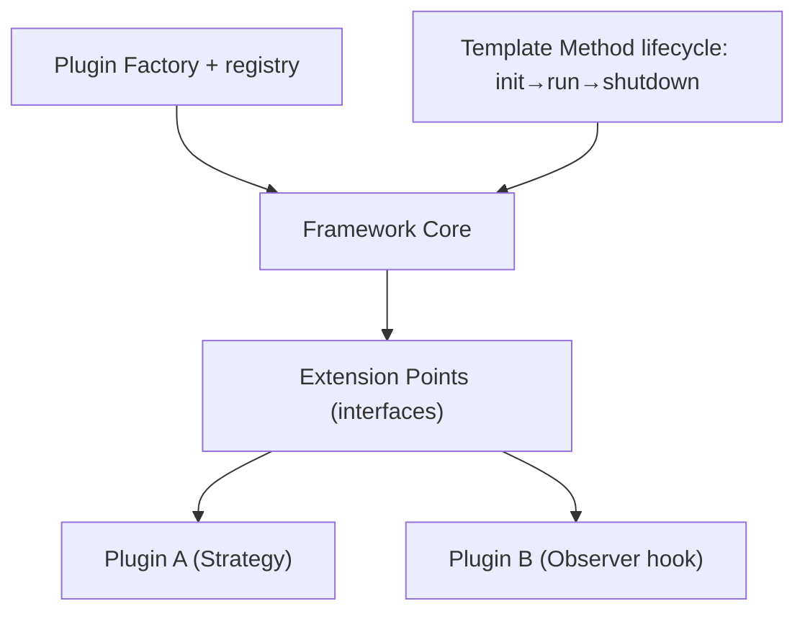

**Steps:**
1. Define a plugin interface and a **registry/Factory** to load plugins.
2. Use **Template Method** for a lifecycle skeleton (init → configure → run → shutdown).
3. Provide **Observer** hooks so plugins react to core events.
4. Let plugins supply **Strategies** to customize core behavior.
5. Add a **Facade** so consumers use the framework simply.

**Learn:** designing for extension, Open/Closed at framework scale, multiple patterns collaborating.

---

## 7. 🔬 DEEP DIVE: INTERNALS

### 7.1 Why Patterns Work — Polymorphism & Indirection

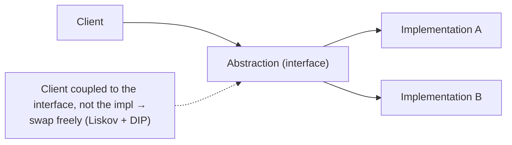

> [!IMPORTANT]
> Nearly every design pattern rests on **two mechanisms**: **polymorphism** (call an abstraction, get the right concrete behavior) and **indirection** (an extra layer that decouples caller from callee). Strategy, Observer, Factory, Adapter, Proxy — all work because the client depends on an **interface** and the concrete type is chosen/swapped elsewhere. This is the machinery of "program to an interface, not an implementation" — the GoF's foundational rule. Patterns are structured, named ways of introducing the *right* indirection.

### 7.2 The Two GoF Principles Underlying Everything

The Gang of Four distilled all 23 patterns to two guidelines:

1. **"Program to an interface, not an implementation."** → depend on abstractions (enables substitution).
2. **"Favor object composition over class inheritance."** → assemble behavior from parts (enables runtime flexibility).

> [!TIP]
> If you remember nothing else, remember these two. Every pattern is a specific, reusable way to apply one or both. When designing, ask: *"Am I coding to an interface? Am I composing rather than inheriting?"* — you'll naturally arrive at good structure, often re-deriving a named pattern without trying.

### 7.3 Proxy Internals — Dynamic Proxies

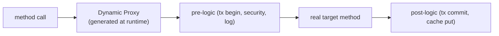

> [!IMPORTANT]
> [[05 Spring Boot]]'s AOP creates **dynamic proxies** at runtime — either **JDK dynamic proxies** (if the bean implements an interface) or **CGLIB subclass proxies** (if not). The proxy intercepts calls, runs the aspect (transaction, cache, security), then delegates to the real object. This is *why* `@Transactional`/`@Cacheable` exist as a Proxy pattern and *why* self-invocation and `private`/`final` methods break them — the proxy can't intercept a call that doesn't go through it. Understanding the Proxy pattern explains an entire class of real Spring bugs ([[06 Spring Boot Annotations]]).

### 7.4 Observer Internals — Push vs Pull & Reactive Streams

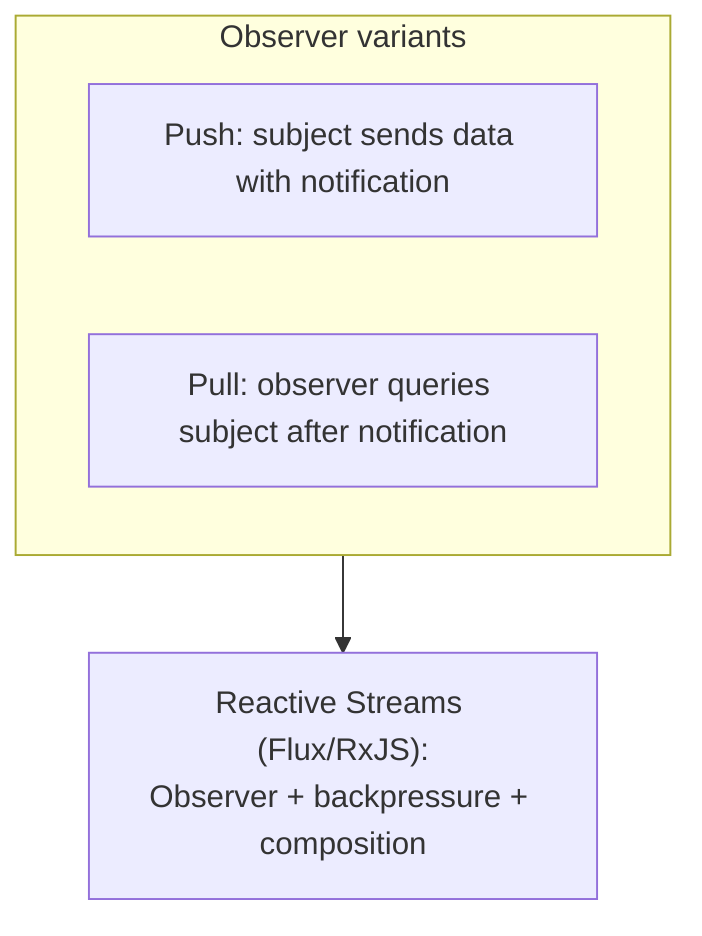

Classic Observer notifies subscribers of changes. **Reactive programming** ([[12 Spring WebFlux]], RxJS) is Observer *industrialized*: streams of events with **operators** (map/filter/merge), **backpressure** (handling fast producers), and composition. [[08 React]]'s render-on-state-change and [[11 Redux Toolkit and RTK Query]]/[[12 TanStack Query]] subscriptions are Observer at heart.

### 7.5 Patterns vs Idioms vs Architecture

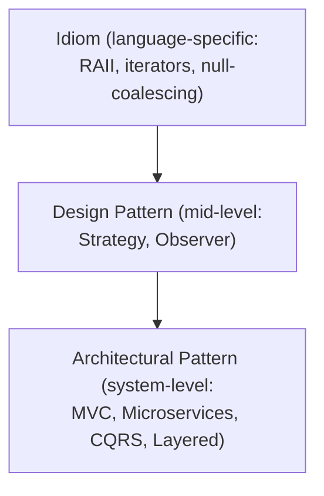

> [!TIP]
> Patterns live at a **level**: **idioms** are language-specific tricks; **design patterns** (GoF) are object/class-level solutions; **architectural patterns** (MVC, Layered, [[03 Microservices]], Event-Driven, CQRS) structure whole systems. Interviews and real design range across all three — a senior fluidly moves between "use a Strategy here" and "this should be an event-driven architecture." They share the same DNA (coupling, cohesion, abstraction) at different scales.

---

## ✅ Production Checklists

### Design Review
- [ ] Each class has a **single responsibility** (SRP)
- [ ] New features **extend** rather than **modify** (Open/Closed)
- [ ] Dependencies are **injected abstractions** (DIP), not `new`ed concretes
- [ ] **Composition** preferred over deep inheritance
- [ ] Behavior that varies is **encapsulated** (Strategy/polymorphism)
- [ ] No giant `switch`/`if-else` on type
- [ ] No God Objects

### Pattern Application
- [ ] Pattern chosen for a **real** (not imagined) need — YAGNI respected
- [ ] Simplest solution considered first (KISS)
- [ ] Pattern's **intent** matches the problem (not just structure)
- [ ] Modern language features considered before ceremonial patterns
- [ ] Pattern is **documented/named** in code for the team

### Testability & Maintainability
- [ ] Classes testable in isolation (dependencies mockable)
- [ ] No hidden global state (careful with Singletons/statics)
- [ ] Loose coupling verified (can components change independently?)
- [ ] Framework extension points used idiomatically
- [ ] Enterprise patterns (Repository, Circuit Breaker) where warranted

---

## 🗺️ Learning Roadmap

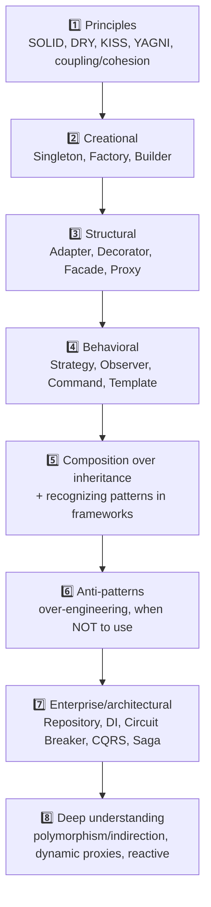

| Stage | Focus | You can... |
|---|---|---|
| 1 | Principles | Reason about good design (SOLID) |
| 2–4 | The GoF families | Apply the core patterns correctly |
| 5–6 | Judgment | Compose well; avoid over-engineering |
| 7–8 | Scale + depth | Use architectural patterns; understand the machinery |

---

## 🔁 Self-Review Completion Loop

Reviewed against the GoF catalog, SOLID literature, framework source patterns, interview question banks, and real-world architecture.

### Gap Review Matrix

| Dimension | Covered? | Where |
|---|---|---|
| What/why, definition | ✅ | §1 |
| SOLID principles | ✅ | §1, §5.1 Q2 |
| Three categories | ✅ | §1, §2 |
| Creational (all 5) | ✅ | §2.1 |
| Structural (Adapter/Decorator/Facade/Proxy + more) | ✅ | §2.2 |
| Behavioral (Strategy/Observer/Command/Template + more) | ✅ | §2.3 |
| Pattern selection | ✅ | §2.4 |
| Patterns in frameworks | ✅ | §3.1, §4 |
| Composition over inheritance | ✅ | §3.2 |
| Anti-patterns / over-engineering | ✅ | §3.3 |
| Modern features replacing patterns | ✅ | §3.4 |
| Enterprise/concurrency patterns | ✅ | §3.5 |
| Design smells | ✅ | §3.6 |
| Layered backend usage | ✅ | §4.1 |
| Event-driven (Observer at scale) | ✅ | §4.3 |
| Wrapper-family distinction | ✅ | §2.2, §5.1 Q5 |
| Dynamic proxy internals | ✅ | §7.3 |
| Observer/reactive internals | ✅ | §7.4 |
| Polymorphism/indirection foundation | ✅ | §7.1–7.2 |
| Patterns vs idioms vs architecture | ✅ | §7.5 |
| Interview Q&A + mistakes | ✅ | §5 |
| Hands-on projects | ✅ | §6 |

> [!NOTE]
> **Remaining depth to explore independently:** the full remaining GoF patterns in detail (Bridge, Composite, Flyweight, Interpreter, Mediator, Memento, Visitor, State machines), Domain-Driven Design tactical patterns (Aggregate, Value Object, Domain Event), concurrency patterns (Reactor, Actor model, Thread Pool), functional design patterns (Monad, Lens), and language-specific idiom catalogs.

---

## 📚 Official References

| Resource | URL / Source |
|---|---|
| *Design Patterns* (Gang of Four, 1994) | The original book (Gamma, Helm, Johnson, Vlissides) |
| Refactoring.Guru (patterns + examples) | https://refactoring.guru/design-patterns |
| SourceMaking | https://sourcemaking.com/design_patterns |
| *Head First Design Patterns* | O'Reilly (approachable intro) |
| *Clean Code* / *Clean Architecture* | Robert C. Martin (SOLID, principles) |
| *Patterns of Enterprise Application Architecture* | Martin Fowler (Repository, Unit of Work, DTO) |
| *Refactoring* (Fowler) | Code smells → pattern-based fixes |
| Java Design Patterns (repo) | https://github.com/iluwatar/java-design-patterns |

---

## 🎁 Final Summary

> [!IMPORTANT]
> **The one-paragraph takeaway:** Design patterns are **named, proven solutions to recurring design problems**, grouped into **Creational** (how objects are made), **Structural** (how they're composed), and **Behavioral** (how they communicate). They exist to make code **flexible, maintainable, and communicable**, and they're all concrete applications of deeper principles — especially **SOLID**, "**program to an interface**," and "**favor composition over inheritance**." Master the intent (not the diagram) of the core patterns — **Factory, Builder, Singleton, Adapter, Decorator, Facade, Proxy, Strategy, Observer, Command, Template Method** — recognize that **the frameworks you already use** ([[05 Spring Boot]] proxies, [[07 Servlets and Filters]] chains, [[08 React]] observers) are *built* from them, and apply them **only when the flexibility is genuinely needed** (YAGNI/KISS). At scale they become **architectural patterns** (Repository, DI, Circuit Breaker, CQRS, Saga). The real skill isn't knowing 23 patterns — it's knowing which shape a problem has, and when *not* to reach for a pattern at all.

**Golden rules:**
1. 🧭 **SOLID first** — patterns are how you implement those principles.
2. 🎯 Learn patterns by **intent/problem**, not by diagram.
3. 🧩 **Favor composition over inheritance** — the maxim behind most patterns.
4. 🔌 **Program to interfaces** — polymorphism + indirection make patterns work.
5. 🚫 Don't over-engineer — a pattern has a cost; use it when change is real (**YAGNI/KISS**).
6. 🔍 The **wrapper family** (Adapter/Decorator/Proxy/Facade) differs by *intent*, not structure.
7. 🏗️ Recognize patterns **in your frameworks** — it explains their behavior and bugs.
8. 📈 At system scale, patterns become **architecture** (Repository, CQRS, Saga, Circuit Breaker).

---

*Related guides in this vault: [[01 Basic Java]] · [[05 Spring Boot]] · [[06 Spring Boot Annotations]] · [[09 Java Hibernate]] · [[07 Servlets and Filters]] · [[03 Microservices]] · [[08 React]] · [[03 TypeScript]] · [[01 Kafka]]*
