# Microservices: Beginner-to-Expert Engineering Guide

> **Scope:** This guide teaches microservices architecture from first principles through production-grade system design. It is diagram-heavy by design: every major concept includes a Mermaid diagram so the architecture is visible, not just described.

## Table of Contents

1. [Executive Summary](#executive-summary)
2. [1. Fundamentals](#1-fundamentals-beginner-level)
3. [2. Core Concepts](#2-core-concepts-intermediate-level)
4. [3. Advanced Concepts](#3-advanced-concepts-senior-level)
5. [4. Real-World System Design Usage](#4-real-world-system-design-usage)
6. [5. Interview Preparation](#5-interview-preparation)
7. [6. Hands-On Thinking](#6-hands-on-thinking)
8. [7. Deep Dive](#7-deep-dive-optional-but-important)
9. [Production Checklists](#production-checklists)
10. [Learning Roadmap](#learning-roadmap)
11. [Self-Review Completion Loop](#self-review-completion-loop)
12. [Official References](#official-references)

---

## Executive Summary

Microservices is an architectural style where an application is built as a collection of small, independently deployable services, each owning a specific business capability, communicating over the network (usually HTTP/REST, gRPC, or async messaging).

The core idea:

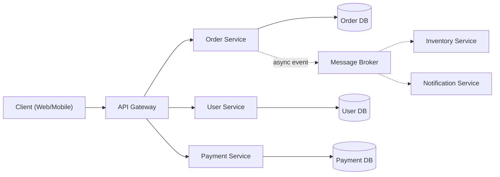

> [!TIP]
> Learn microservices as a trade-off, not a default. You are trading **simplicity** (a monolith's single deploy, single transaction, single codebase) for **independent scalability, deployability, and team autonomy** — at the cost of network calls, distributed data, and operational complexity. Senior engineers can articulate this trade-off explicitly, not just draw the boxes.

---

# 1. Fundamentals (Beginner Level)

## 1.1 What Are Microservices?

A microservices architecture splits an application into multiple small services, each responsible for one business capability, each independently deployable, each usually owning its own data store.

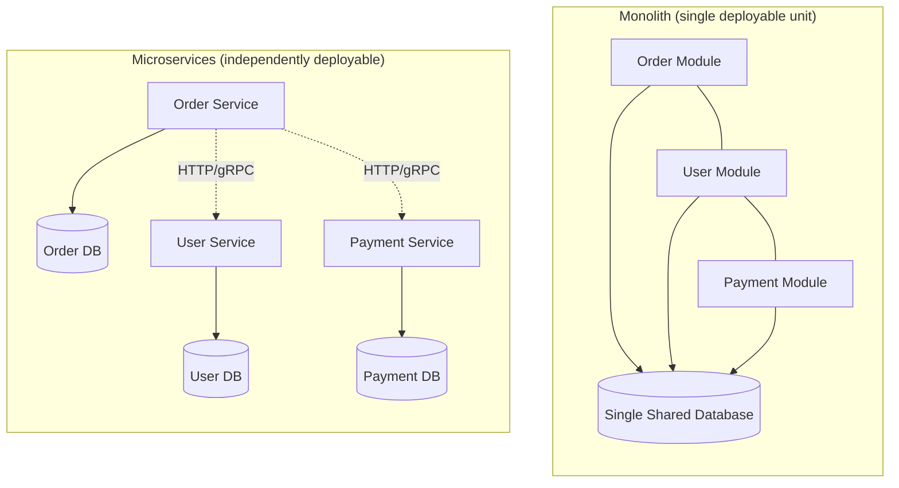

## 1.2 Why Microservices Exist

| Problem in Large Monoliths | Microservices' Answer |
|---|---|
| Entire app must be redeployed for one small change | Each service deploys independently |
| One team's bug can take down the whole app | Failure isolation per service |
| Hard to scale just the "hot" part of the system | Scale only the services under load |
| Large codebase becomes hard to understand/own | Small, team-owned codebases with clear boundaries |
| Everyone uses the same tech stack forever | Each service can choose its own stack (polyglot) |
| Slow build/test/deploy cycles as codebase grows | Small services build/test/deploy fast in isolation |

## 1.3 Problems Microservices Solve

Microservices are especially useful when:

- Multiple teams need to work independently without blocking each other.
- Different parts of the system have very different scaling needs (e.g., checkout vs. product catalog).
- You need independent release cadences per capability.
- Fault isolation matters (one failing component shouldn't take down everything).

Microservices are **not** ideal when:

- The team is small (a handful of engineers) — the operational overhead outweighs the benefits.
- The domain boundaries aren't understood yet — splitting too early leads to costly re-drawing of boundaries across a network instead of within a codebase.
- Strong consistency across many entities is a core requirement (distributed transactions are hard).

> [!WARNING]
> "Premature microservices" is a well-known anti-pattern: teams split a poorly understood domain into network-separated services too early, then pay distributed-systems tax (latency, partial failure, data consistency) for a problem they didn't need to solve yet. Many senior engineers recommend starting with a well-modularized monolith and extracting services once boundaries are proven.

## 1.4 Real-World Analogy

Think of a monolith like one large all-purpose department store, and microservices like a shopping mall with independent specialty stores.

In the department store, if the electronics section needs renovation, part of the whole store may need to close. In the mall, each store (service) has its own staff, opening hours, and inventory system — renovating one doesn't shut down the others. But now customers (requests) may need to walk between stores (network calls), and if the payment kiosk shared by several stores goes down, multiple stores are affected (shared dependency risk).

```text
Monolith        = one big department store, one set of doors, one set of rules
Microservices   = a mall, each store independent, but connected by walkways (network calls)
Shared services = the mall's shared parking lot/payment terminal (a shared dependency risk)
```

## 1.5 Core Vocabulary

| Term | Meaning |
|---|---|
| Service | An independently deployable unit owning one business capability |
| Bounded Context | A DDD concept: a boundary within which a domain model is consistent and well-defined |
| API Gateway | Single entry point routing client requests to backend services |
| Service Discovery | Mechanism for services to find each other's network locations |
| Service Mesh | Infrastructure layer managing service-to-service communication (retries, mTLS, observability) |
| Event-Driven | Services communicate via asynchronous events instead of direct calls |
| Saga | A pattern for managing distributed transactions across services |
| Circuit Breaker | A pattern that stops calling a failing downstream service temporarily |
| Idempotency | A property where repeating an operation has the same effect as doing it once |
| Eventual Consistency | Data across services converges to consistency over time, not instantly |

## 1.6 A Minimal Microservice Example

```java
@RestController
@RequestMapping("/orders")
public class OrderController {

    private final OrderService orderService;

    OrderController(OrderService orderService) {
        this.orderService = orderService;
    }

    @PostMapping
    public ResponseEntity<OrderResponse> createOrder(@RequestBody CreateOrderRequest request) {
        Order order = orderService.createOrder(request);
        return ResponseEntity.status(HttpStatus.CREATED).body(OrderResponse.from(order));
    }
}
```

Each such service is packaged, deployed, scaled, and versioned independently of the others.

## 1.7 Basic Communication Patterns

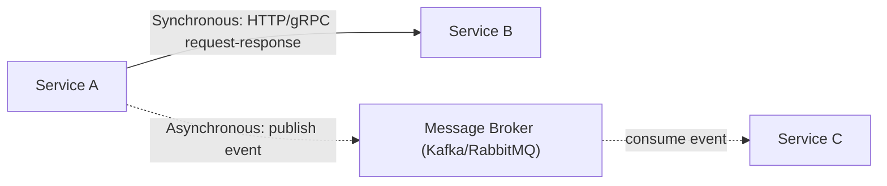

| Style | Example | Trade-off |
|---|---|---|
| Synchronous (request/response) | REST, gRPC | Simple to reason about, but couples availability (caller waits on callee) |
| Asynchronous (event-driven) | Kafka, RabbitMQ, SQS | Decouples availability, but adds eventual consistency and debugging complexity |

## 1.8 Data Ownership

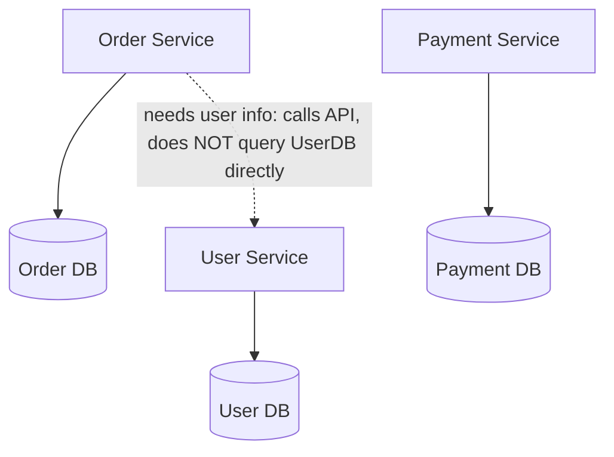

> [!IMPORTANT]
> The defining rule of microservices data ownership: **a service's database is private to that service.** No other service may query it directly. Cross-service data access happens only through the owning service's API or published events — never through a shared database table.

---

# 2. Core Concepts (Intermediate Level)

## 2.1 Overall Reference Architecture

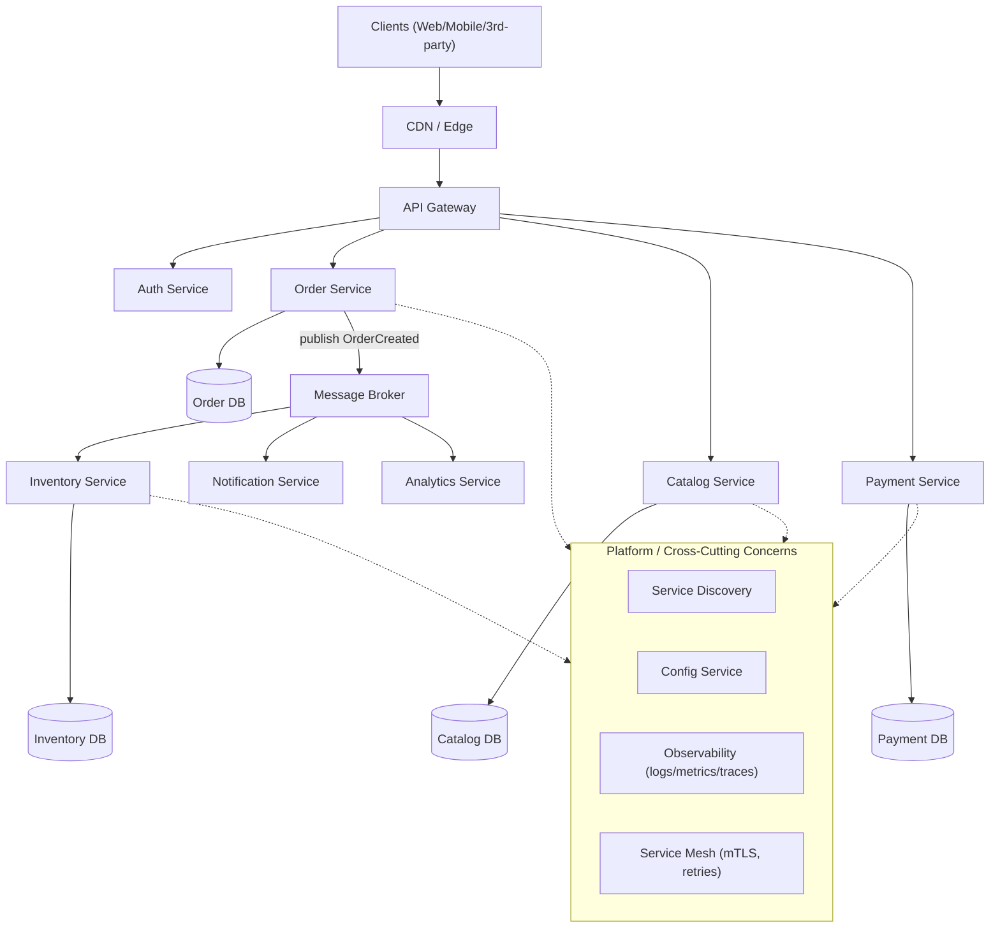

## 2.2 API Gateway

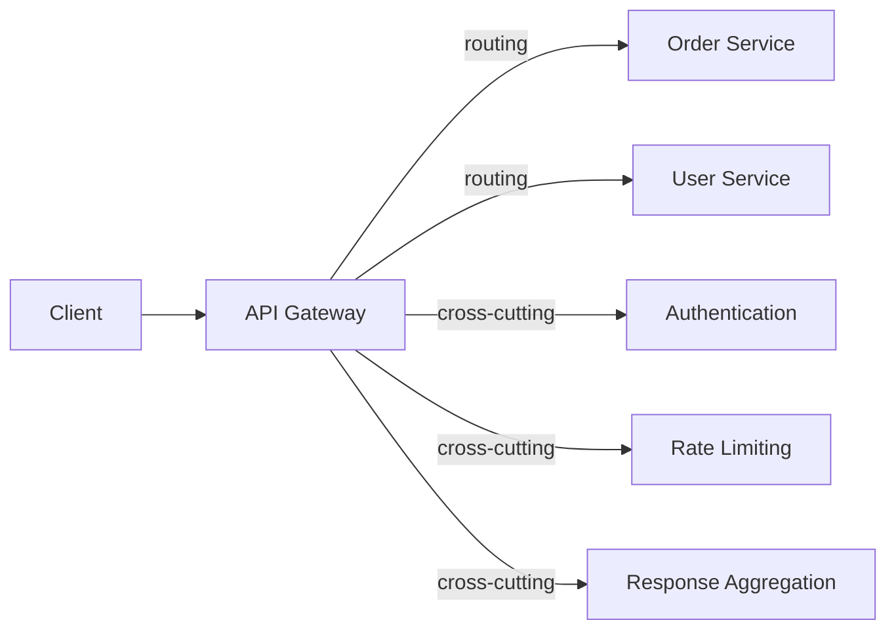

| Responsibility | Description |
|---|---|
| Routing | Directs incoming requests to the correct backend service |
| Authentication/Authorization | Validates tokens centrally instead of in every service |
| Rate limiting | Protects backend services from overload |
| Request aggregation | Combines multiple backend calls into one client-facing response (BFF pattern) |
| Protocol translation | e.g., external REST to internal gRPC |

> [!WARNING]
> An API Gateway that accumulates business logic becomes a "distributed monolith" chokepoint. Keep it focused on cross-cutting routing/auth/rate-limiting concerns, not domain logic.

## 2.3 Service Discovery

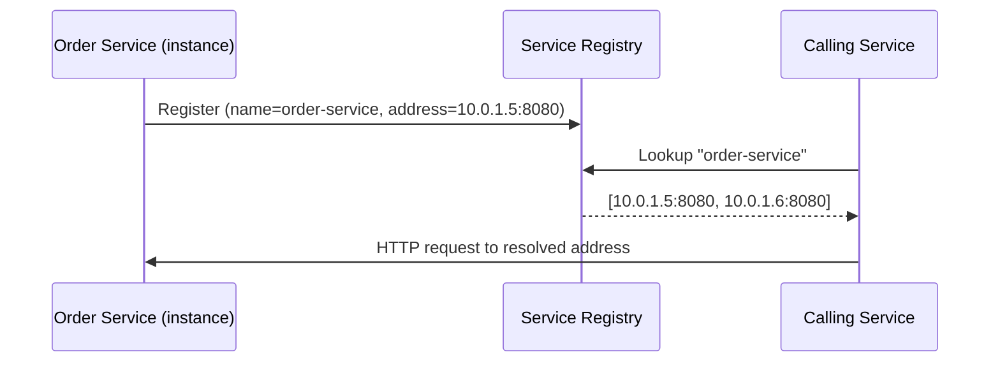

| Pattern | Mechanism |
|---|---|
| Client-side discovery | Client queries registry directly, then load-balances itself |
| Server-side discovery | Client calls a load balancer/gateway, which queries the registry |
| DNS-based (Kubernetes default) | Service names resolve via cluster DNS to a stable virtual IP |

## 2.4 Synchronous Communication: REST and gRPC

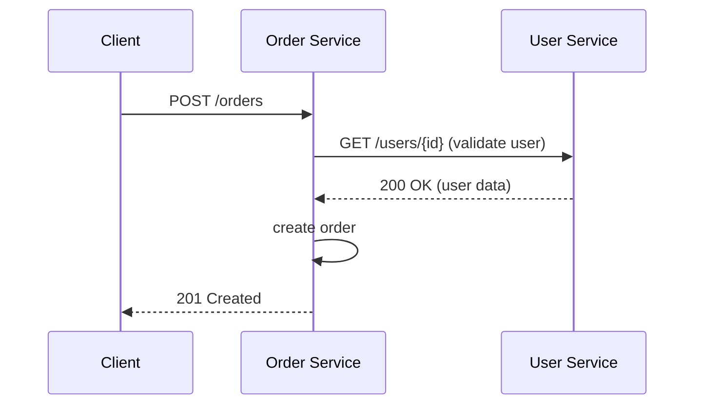

| Protocol | Strengths | Trade-offs |
|---|---|---|
| REST/JSON | Simple, human-readable, ubiquitous tooling | Larger payloads, less strict contracts |
| gRPC | Fast (HTTP/2 + protobuf), strict typed contracts, streaming support | Steeper learning curve, less human-readable |
| GraphQL | Client-specified queries, good for BFF/aggregation | Can shift complexity to a single gateway layer |

## 2.5 Asynchronous Communication: Events and Messaging

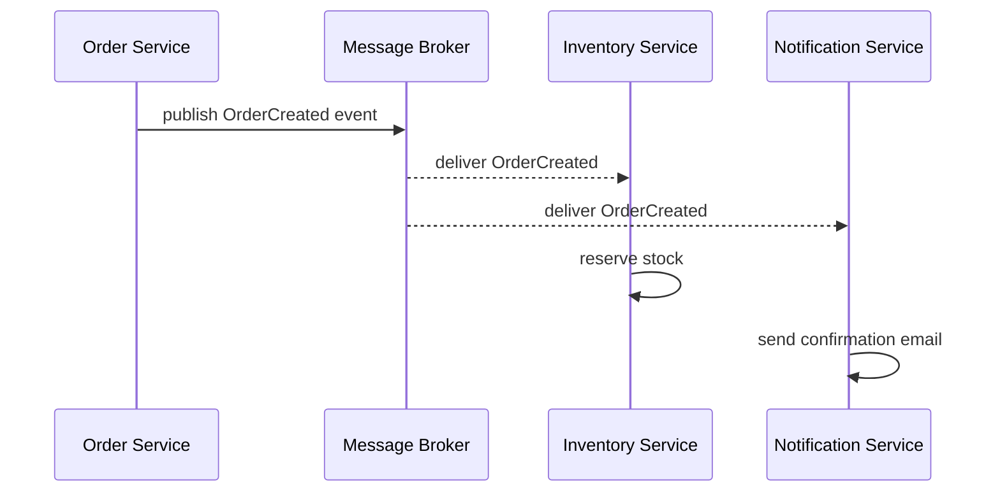

| Pattern | Description |
|---|---|
| Publish/Subscribe | One event, many independent consumers, fully decoupled |
| Point-to-point queue | One message, one consumer (work distribution) |
| Event streaming (Kafka) | Durable, ordered, replayable log of events |

> [!TIP]
> Prefer async events for cross-service workflows that don't need an immediate response (e.g., "send a confirmation email after order creation"). Prefer synchronous calls only when the caller genuinely cannot proceed without an immediate answer (e.g., validating payment authorization before confirming an order).

## 2.6 Database-per-Service and Data Consistency

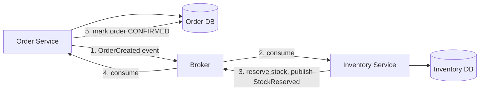

Because each service owns its own database, a single business transaction spanning multiple services can no longer use a simple database `COMMIT`. This is where the **Saga pattern** comes in (covered in Advanced Concepts).

## 2.7 API Versioning

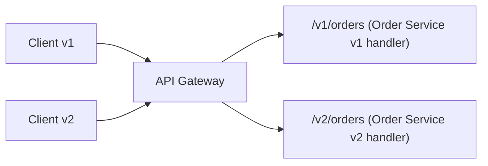

| Strategy | Example |
|---|---|
| URI versioning | `/v1/orders`, `/v2/orders` |
| Header versioning | `Accept: application/vnd.company.v2+json` |
| Backward-compatible evolution | Add optional fields, never remove/rename required fields |

## 2.8 Health Checks and Readiness

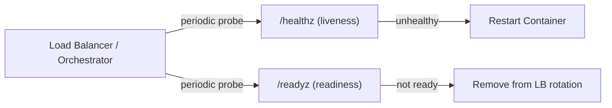

| Probe | Purpose |
|---|---|
| Liveness | "Is the process alive?" — failure triggers a restart |
| Readiness | "Can it serve traffic right now?" — failure removes it from load balancing without restarting |

## 2.9 Configuration Management

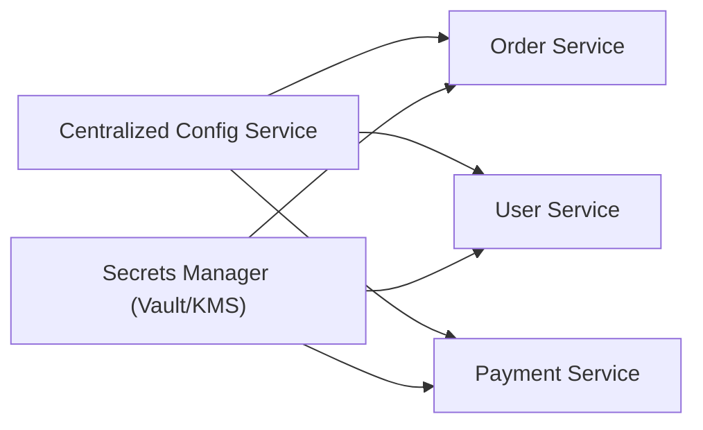

Configuration and secrets should be externalized from code and container images, injected at deploy/runtime, and environment-specific (dev/staging/prod) without code changes.

## 2.10 Basic Testing Strategy

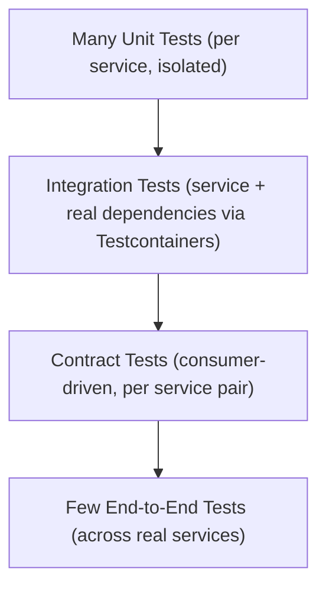

| Test Type | Scope |
|---|---|
| Unit | Single class/function, no network |
| Integration | Service + real DB/broker (e.g., via Testcontainers) |
| Contract | Verifies a service's API matches what consumers expect (e.g., Pact) |
| End-to-end | Full flow across multiple real services — expensive, keep minimal |

---

# 3. Advanced Concepts (Senior Level)

## 3.1 The Saga Pattern (Distributed Transactions)

Since each service has its own database, a business process spanning services can't use a single ACID transaction. Sagas coordinate a sequence of local transactions with compensating actions on failure.

### Choreography-Based Saga

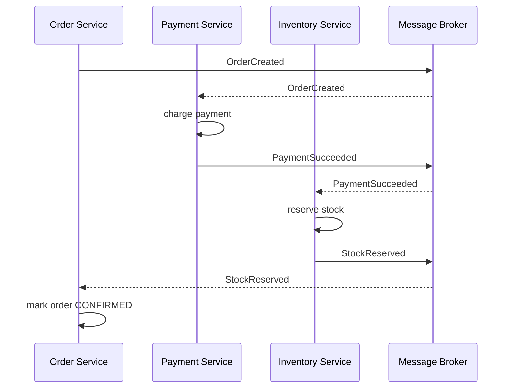

### Orchestration-Based Saga

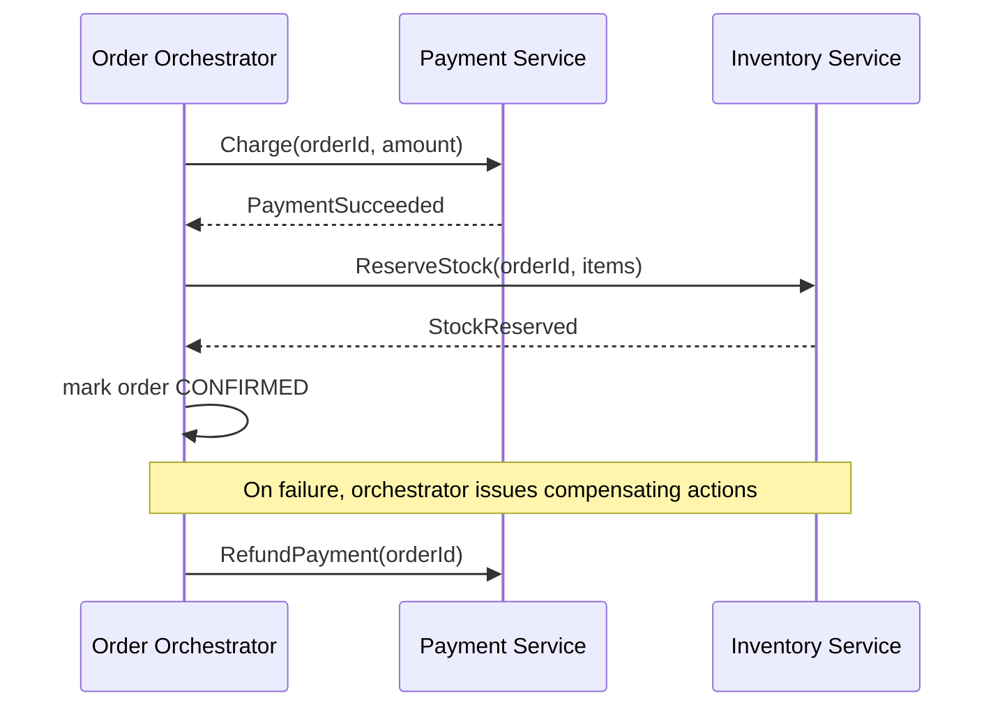

| Style | Coordination | Trade-off |
|---|---|---|
| Choreography | Each service reacts to events, no central coordinator | Simple for few steps; hard to trace/debug as steps grow |
| Orchestration | A central orchestrator directs each step | Easier to reason about and monitor; orchestrator becomes a critical component |

### Compensating Transactions

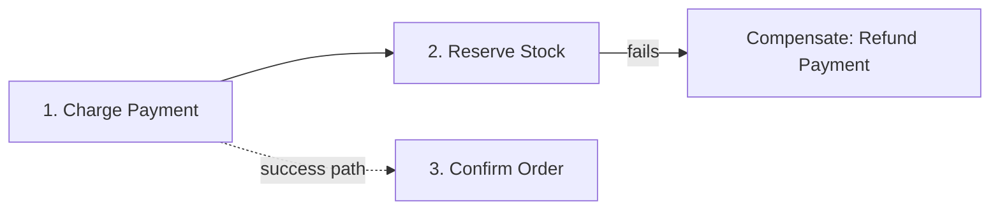

> [!IMPORTANT]
> Compensating transactions are **not** a rollback in the database sense — they are new forward-moving business operations (e.g., "issue a refund," not "undo the charge"). Design every saga step with an explicit compensating action from the start, not as an afterthought.

## 3.2 Circuit Breaker Pattern

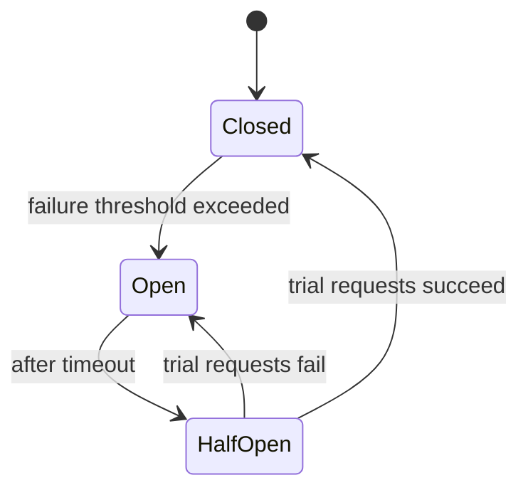

| State | Behavior |
|---|---|
| Closed | Requests flow normally; failures are counted |
| Open | Requests fail fast immediately, without calling the downstream service |
| Half-Open | A limited number of trial requests are allowed through to test recovery |

```java
@CircuitBreaker(name = "paymentService", fallbackMethod = "fallbackCharge")
public PaymentResult charge(ChargeRequest request) {
    return paymentClient.charge(request);
}

public PaymentResult fallbackCharge(ChargeRequest request, Throwable t) {
    return PaymentResult.pending("Payment service unavailable, queued for retry");
}
```

## 3.3 Retries, Timeouts, and Bulkheads

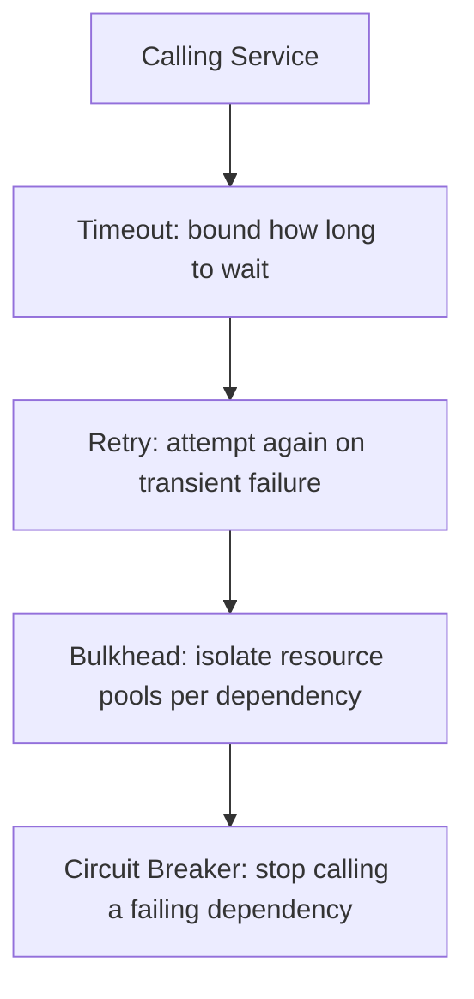

| Pattern | Purpose | Risk if Misused |
|---|---|---|
| Timeout | Prevents indefinite waiting on a slow dependency | Too short causes false failures; too long causes cascading pile-up |
| Retry | Recovers from transient failures | Retrying non-idempotent operations can cause duplicate side effects |
| Bulkhead | Isolates thread/connection pools per dependency | Without it, one slow dependency exhausts shared resources for all calls |
| Circuit Breaker | Stops hammering a failing dependency | Poorly tuned thresholds cause flapping or slow detection |

> [!WARNING]
> Retries without idempotency keys are a classic production bug source: a client retries a timed-out "charge card" request, and the original request actually succeeded server-side — the customer gets charged twice.

## 3.4 Cascading Failures

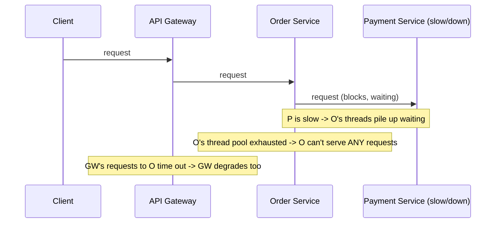

Mitigations: timeouts, circuit breakers, bulkheads (isolated thread/connection pools per dependency), and load shedding.

## 3.5 Distributed Tracing

```mermaid
sequenceDiagram
    participant Client
    participant GW as API Gateway (trace_id=abc123)
    participant O as Order Service (trace_id=abc123, span=order-create)
    participant P as Payment Service (trace_id=abc123, span=payment-charge)

    Client->>GW: request
    GW->>O: request (propagates trace_id)
    O->>P: request (propagates trace_id)
    P-->>O: response
    O-->>GW: response
    GW-->>Client: response

    Note over GW,P: All spans share trace_id=abc123, visible as one trace in tracing UI
```

| Concept | Meaning |
|---|---|
| Trace | The full journey of one request across all services |
| Span | A single unit of work within a trace (e.g., one service's handling) |
| Trace Context Propagation | Passing trace/span IDs through HTTP headers or message metadata across service boundaries |

## 3.6 Service Mesh

```mermaid
flowchart TB
    subgraph Pod1["Order Service Pod"]
        App1["Order Service"] --- Sidecar1["Sidecar Proxy"]
    end
    subgraph Pod2["Payment Service Pod"]
        App2["Payment Service"] --- Sidecar2["Sidecar Proxy"]
    end
    Sidecar1 <-->|"mTLS, retries, load balancing"| Sidecar2
    ControlPlane["Mesh Control Plane (config, certs, policy)"] -.-> Sidecar1
    ControlPlane -.-> Sidecar2
```

A service mesh (e.g., Istio, Linkerd) offloads cross-cutting network concerns — mutual TLS, retries, timeouts, load balancing, and telemetry — into a sidecar proxy alongside each service, so application code doesn't need to implement them directly.

## 3.7 Event Sourcing and CQRS

```mermaid
flowchart LR
    Command["Command: PlaceOrder"] --> WriteModel["Write Model: appends OrderPlaced event"]
    WriteModel --> EventStore[("Event Store: append-only log")]
    EventStore --> Projector["Projector"]
    Projector --> ReadModel[("Read Model: optimized for queries")]
    Query["Query: GetOrderSummary"] --> ReadModel
```

| Concept | Meaning |
|---|---|
| Event Sourcing | State is derived by replaying a sequence of stored events, rather than storing current state directly |
| CQRS | Command Query Responsibility Segregation — separate models for writes (commands) and reads (queries) |

> [!TIP]
> CQRS and Event Sourcing are powerful but add significant complexity (event versioning, replay logic, eventual consistency between write/read models). Reserve them for domains with genuine audit/history requirements or complex read/write scaling asymmetry — not as a default microservices pattern.

## 3.8 Idempotency

```mermaid
sequenceDiagram
    participant Client
    participant Svc as Payment Service

    Client->>Svc: POST /charges (Idempotency-Key: abc-123)
    Svc->>Svc: check if abc-123 already processed
    alt not processed yet
        Svc->>Svc: process charge, store result keyed by abc-123
        Svc-->>Client: 200 OK (charged)
    else already processed
        Svc-->>Client: 200 OK (same result, no double charge)
    end
```

```java
@PostMapping("/charges")
public ChargeResponse charge(
        @RequestHeader("Idempotency-Key") String idempotencyKey,
        @RequestBody ChargeRequest request) {
    return idempotencyStore.getOrCompute(idempotencyKey, () -> paymentService.charge(request));
}
```

## 3.9 Failure Scenarios

| Failure | Symptom | Common Cause | Mitigation |
|---|---|---|---|
| Cascading failure | Whole system slows/fails from one slow dependency | No timeouts/bulkheads | Timeouts, circuit breakers, bulkheads |
| Duplicate side effects | Customer charged twice | Retry without idempotency key | Idempotency keys on all mutating endpoints |
| Data inconsistency across services | Order shows CONFIRMED but stock never reserved | Saga step failed without compensation | Proper saga compensating transactions, monitoring |
| Distributed monolith | Deploys still require coordinating multiple services together | Services too tightly coupled/shared library-bound | Re-draw bounded contexts, decouple contracts |
| Thundering herd on recovery | Dependency recovers, then immediately overwhelmed | All retries fire simultaneously | Exponential backoff with jitter |
| Split-brain / stale reads | Two instances disagree on state | Network partition, no consensus protocol | Use proven coordination (etcd/ZooKeeper) or accept eventual consistency explicitly |
| Message duplication | Consumer processes the same event twice | At-least-once delivery semantics (default for most brokers) | Idempotent consumers, dedup keys |
| Version skew | New service version breaks old clients | Breaking API change deployed without compatibility window | Backward-compatible contracts, versioned APIs |

## 3.10 Security in Microservices

```mermaid
flowchart LR
    Client --> GW["API Gateway (AuthN: validate JWT)"]
    GW -->|"propagate identity"| S1["Order Service (AuthZ: check scopes)"]
    S1 -->|"mTLS"| S2["Payment Service"]
```

| Concern | Mitigation |
|---|---|
| Service-to-service trust | Mutual TLS (mTLS) between services, often via service mesh |
| Token propagation | JWT/OAuth2 tokens passed and validated at each hop, not just the edge |
| Secrets management | Centralized secrets manager (Vault/KMS), never hardcoded |
| Network exposure | Internal services not directly reachable from the public internet |
| Least privilege | Each service has only the permissions/scopes it needs |

---

# 4. Real-World System Design Usage

## 4.1 Where Microservices Are Used in Production

- Large e-commerce platforms (Amazon-style: catalog, cart, checkout, payment, shipping as separate services).
- Streaming platforms (Netflix-style: playback, recommendations, billing, content management).
- Ride-sharing/logistics platforms (dispatch, pricing, driver management, payments).
- Banking/fintech platforms (accounts, ledger, payments, fraud detection as isolated, auditable services).

## 4.2 Full Reference Production Architecture

```mermaid
flowchart TB
    subgraph Edge["Edge"]
        CDN["CDN"]
        WAF["WAF / DDoS Protection"]
    end

    subgraph Gateway["Gateway Layer"]
        GW["API Gateway"]
        Auth["Auth / Identity Service"]
    end

    subgraph Services["Service Layer"]
        Catalog["Catalog Service"]
        Cart["Cart Service"]
        Orders["Order Service"]
        Payments["Payment Service"]
        Inventory["Inventory Service"]
        Shipping["Shipping Service"]
        Notify["Notification Service"]
    end

    subgraph Data["Data Layer"]
        CatalogDB[("Catalog DB")]
        CartCache[("Cart Cache - Redis")]
        OrdersDB[("Order DB")]
        PaymentsDB[("Payment DB")]
        InventoryDB[("Inventory DB")]
    end

    subgraph Messaging["Messaging Layer"]
        Broker["Kafka / Event Bus"]
    end

    subgraph Platform["Platform"]
        SD["Service Discovery"]
        ConfigSvc["Config Service"]
        Obs["Observability Stack"]
        Mesh["Service Mesh"]
    end

    CDN --> WAF --> GW
    GW --> Auth
    GW --> Catalog --> CatalogDB
    GW --> Cart --> CartCache
    GW --> Orders --> OrdersDB
    Orders -->|"OrderCreated"| Broker
    Broker --> Payments --> PaymentsDB
    Broker --> Inventory --> InventoryDB
    Broker --> Shipping
    Broker --> Notify

    Services -.-> Platform
```

## 4.3 Big-Company Style Thinking

| Concern | Microservices Design Response |
|---|---|
| Reliability | Circuit breakers, retries with backoff, bulkheads, chaos testing |
| Scale | Independent horizontal scaling per service, async processing for spikes |
| Observability | Distributed tracing, centralized structured logging, per-service SLOs |
| Security | mTLS between services, centralized identity, least-privilege service accounts |
| Maintainability | Clear bounded contexts, contract testing, versioned APIs |
| Organizational alignment | Conway's Law: team boundaries mirror service boundaries |

## 4.4 Example: Checkout Flow End-to-End

```mermaid
sequenceDiagram
    participant C as Client
    participant GW as API Gateway
    participant O as Order Service
    participant P as Payment Service
    participant I as Inventory Service
    participant B as Broker
    participant N as Notification Service

    C->>GW: POST /checkout
    GW->>O: create order (status=PENDING)
    O->>P: charge payment (sync, must succeed before confirming)
    P-->>O: PaymentSucceeded
    O->>B: publish OrderConfirmed
    O-->>GW: 201 Created (order confirmed)
    GW-->>C: 201 Created

    B-->>I: consume OrderConfirmed
    I->>I: decrement stock
    B-->>N: consume OrderConfirmed
    N->>N: send confirmation email
```

Notice the deliberate split: payment charge is synchronous (checkout can't succeed without it), while inventory decrement and notification are asynchronous (they shouldn't block the customer-facing response).

## 4.5 Conway's Law and Team Topology

```mermaid
flowchart LR
    TeamA["Order Team"] --> OrderSvc["Order Service"]
    TeamB["Payment Team"] --> PaymentSvc["Payment Service"]
    TeamC["Inventory Team"] --> InventorySvc["Inventory Service"]
```

> [!TIP]
> Conway's Law: systems tend to mirror the communication structure of the organization that builds them. Design team ownership boundaries and service boundaries together — a service owned by two teams that constantly need to coordinate is a sign the boundary is wrong.

## 4.6 Deployment Topology (Kubernetes-Style)

```mermaid
flowchart TB
    Ingress["Ingress Controller"] --> SvcGW["order-service (K8s Service)"]
    SvcGW --> Pod1["order-service Pod 1"]
    SvcGW --> Pod2["order-service Pod 2"]
    SvcGW --> Pod3["order-service Pod 3"]
    HPA["Horizontal Pod Autoscaler"] -.->|"scales based on CPU/queue depth"| SvcGW
```

## 4.7 Integration with Other Systems

| System | Microservices Integration |
|---|---|
| Message brokers | Kafka, RabbitMQ, SQS/SNS for async communication |
| Service mesh | Istio, Linkerd for mTLS, retries, traffic shaping |
| Observability | OpenTelemetry, Prometheus, Grafana, Jaeger/Zipkin |
| API management | API gateways (Kong, Envoy, cloud-native gateways) |
| Orchestration | Kubernetes for deployment, scaling, service discovery |
| CI/CD | Per-service pipelines enabling independent deployment |
| Config/secrets | Consul/etcd for config, Vault/KMS for secrets |

---

# 5. Interview Preparation

## 5.1 What Interviewers Expect

For "Microservices" topics, interviewers usually expect:

- You can explain what a microservice is and why it exists vs. a monolith.
- You understand data ownership (database-per-service) and why shared databases are an anti-pattern.
- You can design a basic service architecture for a given problem (e.g., "design an e-commerce checkout").
- You understand sync vs async communication trade-offs.

For senior backend/system design roles, they also expect:

- You can design sagas for distributed transactions and explain compensating actions.
- You understand cascading failure and how to prevent it (timeouts, circuit breakers, bulkheads).
- You can reason about consistency trade-offs (eventual vs strong).
- You know how to design for observability (tracing, metrics) in a distributed system.
- You understand organizational implications (Conway's Law, team ownership).

## 5.2 Most Important Questions and Answers

### Q1. What is the difference between a monolith and microservices?

A monolith is a single deployable unit containing all application logic, typically sharing one database. Microservices split the application into multiple independently deployable services, each owning a specific business capability and typically its own data store, communicating over the network.

### Q2. Why shouldn't microservices share a database?

Sharing a database creates implicit coupling: any service can be broken by another service's schema change, and it becomes impossible to reason about which service "owns" a piece of data. Database-per-service enforces boundaries and enables independent schema evolution and deployment.

### Q3. How do you handle a transaction that spans multiple services?

Use the Saga pattern: break the transaction into a sequence of local transactions per service, each with a corresponding compensating action to undo its effect if a later step fails. Coordinate via choreography (event-driven) or orchestration (central coordinator).

### Q4. What is a circuit breaker and why is it needed?

A circuit breaker stops a service from repeatedly calling a downstream dependency that's failing, failing fast instead of piling up requests/threads waiting on a doomed call. It transitions between Closed, Open, and Half-Open states based on observed failure rates, preventing cascading failures.

### Q5. How do you achieve consistency across services without distributed transactions?

Generally through eventual consistency: services publish events when their local state changes, and other services react asynchronously to update their own state. Strong consistency across service boundaries is avoided in favor of well-designed compensating logic (sagas) and idempotent processing.

### Q6. What's the difference between choreography and orchestration in sagas?

Choreography has each service react to events independently with no central coordinator — simple for a few steps but hard to trace as complexity grows. Orchestration uses a central coordinator that explicitly calls each step and manages compensation — easier to monitor and reason about, but the orchestrator becomes a critical, must-be-reliable component.

### Q7. How do you prevent cascading failures?

Combine timeouts (bound wait time), circuit breakers (stop calling failing dependencies), bulkheads (isolate resource pools per dependency so one slow dependency can't exhaust shared threads/connections), and load shedding under extreme load.

### Q8. What is idempotency and why does it matter in microservices?

An idempotent operation produces the same result no matter how many times it's performed. It matters because network failures force retries, and without idempotency, retries of non-idempotent operations (like charging a card) can cause duplicate side effects.

### Q9. How do you debug a request that touches five services?

Distributed tracing: propagate a trace ID across every service call (via HTTP headers or message metadata), and use a tracing system (Jaeger/Zipkin/OpenTelemetry backend) to visualize the full request path and identify where latency or errors occurred.

### Q10. When would you NOT use microservices?

When the team is small, the domain isn't well understood yet, strong cross-entity consistency is a hard requirement, or the organization can't yet support the operational overhead (service discovery, distributed tracing, on-call complexity per service). Start with a modular monolith and extract services once real boundaries and scaling needs are proven.

## 5.3 Tricky Questions

### Isn't microservices just "SOA" (Service-Oriented Architecture) rebranded?

They share goals (service-based decomposition) but differ in emphasis: SOA historically leaned on centralized enterprise service buses (ESBs) with heavy middleware, while microservices favor lightweight communication (REST/gRPC/events), decentralized data management, and full ownership (build/deploy/operate) by small autonomous teams.

### If services are "independent," why do teams still need to coordinate releases?

True independence requires backward-compatible API contracts and consumer-driven contract testing. If services aren't contract-tested and versioned carefully, they become a "distributed monolith" — deployed separately in name, but requiring coordinated releases in practice.

### Why can adding more retries make an outage worse?

Uncoordinated retries during an outage can cause a "retry storm" — as the failing dependency starts to recover, it's immediately hit with a surge of retried requests from every caller simultaneously, pushing it back into failure. Exponential backoff with jitter spreads retries out over time to avoid this.

### Does eventual consistency mean the system is "wrong" temporarily?

Not wrong — the system passes through valid intermediate states before reaching a converged state. The design challenge is ensuring the *user-facing* experience accounts for this window (e.g., showing "order processing" rather than assuming instant global consistency).

## 5.4 Common Candidate Mistakes

- Jumping straight to microservices for a small, simple application.
- Proposing a shared database "just for this one case."
- Forgetting to mention data consistency trade-offs when describing a distributed transaction.
- Not knowing the difference between choreography and orchestration.
- Ignoring failure modes (assuming every network call succeeds).
- Not considering idempotency for retried operations.
- Overusing synchronous calls where async would decouple availability better.
- Not mentioning observability (tracing/metrics) in a system design answer.

## 5.5 Interview Coding/Design Checklist

- [ ] Identify bounded contexts / service boundaries clearly tied to business capabilities.
- [ ] State which communication style (sync/async) fits each interaction and why.
- [ ] Call out data ownership per service explicitly.
- [ ] Address failure modes: what happens if service X is down?
- [ ] Mention idempotency for any retried/mutating operation.
- [ ] Include observability (tracing, metrics, logging) in the design.
- [ ] Discuss consistency model (eventual vs. strong) where relevant.

---

# 6. Hands-On Thinking

## 6.1 Three Real-World Projects Using Microservices

### Project 1: E-Commerce Platform

```mermaid
flowchart LR
    Client --> GW["API Gateway"]
    GW --> Catalog["Catalog Service"]
    GW --> Cart["Cart Service"]
    GW --> Orders["Order Service"]
    Orders --> Payments["Payment Service"]
    Orders -->|"event"| Broker["Broker"]
    Broker --> Inventory["Inventory Service"]
    Broker --> Shipping["Shipping Service"]
```

Concepts: API Gateway, database-per-service, saga for checkout, async fulfillment events.

### Project 2: Ride-Hailing Dispatch System

```mermaid
flowchart LR
    RiderApp["Rider App"] --> GW["API Gateway"]
    DriverApp["Driver App"] --> GW
    GW --> Matching["Matching Service"]
    GW --> Pricing["Pricing Service"]
    GW --> Trips["Trip Service"]
    Matching -->|"real-time location events"| Broker["Event Stream"]
    Broker --> Trips
    Trips --> Payments["Payment Service"]
```

Concepts: real-time event streaming, geospatial matching service, pricing as an independently scalable service, trip lifecycle state machine.

### Project 3: Banking Ledger System

```mermaid
flowchart LR
    Client --> GW["API Gateway"]
    GW --> Accounts["Account Service"]
    GW --> Ledger["Ledger Service"]
    GW --> Fraud["Fraud Detection Service"]
    Accounts -->|"TransactionRequested"| Broker["Event Bus"]
    Broker --> Ledger
    Broker --> Fraud
    Ledger --> LedgerDB[("Append-only Ledger DB")]
```

Concepts: event sourcing for the ledger (append-only, auditable), CQRS for balance queries vs. transaction history, strict idempotency on all money-movement operations.

## 6.2 Step-by-Step Design Approach

For any microservices system:

1. Model the domain and identify bounded contexts (business capabilities), not technical layers.
2. Decide data ownership per service — no shared databases.
3. Choose sync vs async per interaction based on whether the caller needs an immediate answer.
4. Design sagas (with compensations) for any cross-service business transaction.
5. Add resilience patterns: timeouts, retries with backoff+jitter, circuit breakers, bulkheads.
6. Design for idempotency on every mutating endpoint.
7. Plan observability: tracing propagation, structured logs, per-service metrics/SLOs.
8. Define API contracts and versioning strategy up front; add contract tests.
9. Plan deployment topology (containers, orchestration, service discovery).
10. Load test and inject failures (chaos testing) before trusting the design in production.

## 6.3 Production Implementation Approach

```mermaid
flowchart TD
    A["Domain Modeling / Bounded Contexts"] --> B["Service Boundaries + Data Ownership"]
    B --> C["Communication Design (sync/async)"]
    C --> D["Resilience Patterns (timeout/retry/circuit breaker)"]
    D --> E["Saga Design for Cross-Service Transactions"]
    E --> F["Contract Testing"]
    F --> G["Observability (tracing/metrics/logs)"]
    G --> H["Deployment Topology (K8s/service mesh)"]
    H --> I["Chaos / Failure Testing"]
    I --> J["Production Rollout"]
```

## 6.4 Production Readiness Example

For a microservices system, define:

- Per-service health/readiness endpoints wired into the orchestrator.
- Distributed tracing enabled end-to-end across all services.
- Circuit breakers and timeouts configured for every outbound call.
- Idempotency keys required on all mutating public endpoints.
- Saga compensation logic tested explicitly (not just the happy path).
- Contract tests run in CI for every consumer-producer pair.
- Chaos testing (kill a dependency, inject latency) run periodically in staging.
- Clear on-call ownership mapped 1:1 to service ownership.

---

# 7. Deep Dive (Optional but Important)

## 7.1 Bounded Contexts and Domain-Driven Design

```mermaid
flowchart TB
    subgraph SalesContext["Sales Bounded Context"]
        Order["Order (Sales meaning: a customer purchase)"]
    end
    subgraph FulfillmentContext["Fulfillment Bounded Context"]
        Shipment["Shipment (Fulfillment meaning: a physical delivery)"]
    end
    Order -.->|"OrderConfirmed event triggers"| Shipment
```

The same real-world concept ("an order") can mean different things in different contexts. DDD's bounded context principle says each service should model concepts according to its own context's needs, translating at the boundary rather than sharing one "universal" model across all services.

## 7.2 Strangler Fig Pattern (Migrating a Monolith)

```mermaid
flowchart LR
    Client --> GW["Facade / Gateway"]
    GW -->|"new functionality"| NewSvc["New Microservice"]
    GW -->|"not-yet-migrated functionality"| Monolith["Legacy Monolith"]
```

```mermaid
flowchart TB
    Phase1["Phase 1: Facade routes ~all traffic to monolith"] --> Phase2["Phase 2: Extract one capability to a new service, facade routes that slice to it"]
    Phase2 --> Phase3["Phase 3: Repeat per capability"]
    Phase3 --> Phase4["Phase 4: Monolith shrinks until fully replaced or retired"]
```

The Strangler Fig pattern incrementally migrates a monolith to microservices by routing traffic for newly extracted capabilities to new services while the facade still routes everything else to the legacy system — avoiding a risky big-bang rewrite.

## 7.3 Consensus and Coordination

Distributed systems sometimes need agreement across nodes (leader election, distributed locks, configuration consistency).

```mermaid
flowchart LR
    N1["Node 1"] <--> Consensus["Consensus Store (etcd/ZooKeeper - Raft/ZAB)"]
    N2["Node 2"] <--> Consensus
    N3["Node 3"] <--> Consensus
    Consensus -->|"elects"| Leader["Current Leader"]
```

Tools like etcd (Raft consensus) or ZooKeeper (ZAB protocol) provide strongly consistent coordination primitives that individual microservices can build on for leader election or distributed locking — implementing consensus from scratch is a well-known source of subtle distributed-systems bugs.

## 7.4 The CAP Theorem in Practice

```mermaid
flowchart TB
    CAP["CAP Theorem: during a network partition, choose"]
    CAP --> CP["Consistency (reject/queue requests until partition heals)"]
    CAP --> AP["Availability (serve possibly-stale data during partition)"]
```

| Choice | Example System Behavior |
|---|---|
| CP (Consistency + Partition tolerance) | Reject writes/reads that can't be guaranteed consistent during a partition |
| AP (Availability + Partition tolerance) | Keep serving requests with possibly stale data during a partition |

Most microservices systems lean AP for cross-service reads (accepting eventual consistency) while keeping individual service databases CP/ACID internally.

## 7.5 Message Delivery Semantics

| Guarantee | Meaning | Risk |
|---|---|---|
| At-most-once | Message delivered zero or one time | Silent message loss possible |
| At-least-once | Message delivered one or more times | Duplicate processing possible (most common default) |
| Exactly-once | Message delivered and processed exactly once | Hardest to guarantee end-to-end; usually approximated via idempotent consumers + at-least-once delivery |

```mermaid
flowchart LR
    Producer["Producer"] --> Broker["Broker (at-least-once delivery)"]
    Broker --> Consumer["Consumer"]
    Consumer --> Dedup["Deduplication via idempotency key / processed-message log"]
    Dedup --> EffectivelyOnce["Effectively-once processing outcome"]
```

## 7.6 Observability Internals

```mermaid
flowchart TB
    App["Service Code"] --> SDK["OpenTelemetry SDK"]
    SDK --> Logs["Structured Logs"]
    SDK --> Metrics["Metrics (Prometheus)"]
    SDK --> Traces["Traces (spans w/ trace context)"]
    Logs --> LogBackend["Log Aggregator (e.g., ELK/Loki)"]
    Metrics --> MetricsBackend["Prometheus/Grafana"]
    Traces --> TraceBackend["Jaeger/Zipkin/Tempo"]
```

The three observability pillars — logs, metrics, traces — are most powerful correlated together (e.g., jumping from a metric spike to the exact traces and logs for the affected time window and trace ID).

## 7.7 Debugging Tools

| Tool/Practice | Purpose |
|---|---|
| Distributed tracing UI (Jaeger/Zipkin) | Visualize a request's full path and latency breakdown across services |
| Correlation IDs in logs | Tie log lines across services back to one originating request |
| Service mesh dashboards | Observe retries, circuit breaker state, and traffic shifts in real time |
| Chaos engineering tools (Chaos Monkey-style) | Proactively verify resilience patterns actually work before a real outage |
| Dependency graphs | Understand blast radius before making a change to a shared service |

---

# Production Checklists

## Code Quality Checklist

- [ ] Each service has a clearly defined, single business capability.
- [ ] No service directly queries another service's database.
- [ ] Public APIs are versioned and backward-compatible by default.
- [ ] Every mutating endpoint supports idempotency keys.
- [ ] Contract tests exist for every consumer-producer relationship.
- [ ] Saga compensating actions are implemented and tested, not just the happy path.

## Performance/Resilience Checklist

- [ ] Timeouts set on every outbound network call.
- [ ] Retries use exponential backoff with jitter.
- [ ] Circuit breakers configured for critical downstream dependencies.
- [ ] Bulkheads isolate resource pools per dependency.
- [ ] Load shedding/backpressure strategy defined for overload scenarios.
- [ ] Async processing used where the caller doesn't need an immediate result.

## Security Checklist

- [ ] mTLS (or equivalent) enforced for service-to-service traffic.
- [ ] Identity/authorization propagated across service hops, not just validated at the edge.
- [ ] Secrets managed centrally (Vault/KMS), never hardcoded or in images.
- [ ] Internal-only services not exposed directly to the public internet.
- [ ] Each service account scoped to least privilege.

## Debugging/Observability Checklist

- [ ] Distributed tracing propagated end-to-end across all services.
- [ ] Correlation/trace IDs present in all structured logs.
- [ ] Per-service dashboards for latency, error rate, and saturation (the "RED" metrics).
- [ ] Alerting tied to SLOs, not just raw infrastructure metrics.
- [ ] Chaos/failure testing performed regularly, not only during incidents.
- [ ] Runbooks exist for common failure scenarios (dependency down, broker lag, etc.).

---

# Learning Roadmap

## Phase 1: Beginner

Learn:

- Monolith vs. microservices trade-offs.
- Basic REST API design.
- Database-per-service principle.
- Basic sync request/response communication.

Practice:

- Split a simple app (e.g., blog) into 2-3 services (users, posts, comments).
- Build a basic API Gateway routing to those services.

## Phase 2: Intermediate

Learn:

- Async messaging (pub/sub, queues).
- Service discovery and health checks.
- API versioning strategies.
- Contract testing.

Practice:

- Add an event-driven notification service to your split app.
- Add health/readiness endpoints and deploy to a container orchestrator.

## Phase 3: Advanced

Learn:

- Saga pattern (choreography and orchestration).
- Circuit breakers, retries, bulkheads.
- Distributed tracing.
- Idempotency design.

Practice:

- Build a checkout flow spanning order/payment/inventory services with a saga.
- Add distributed tracing across all services and visualize a full request.

## Phase 4: Production Systems Engineer

Learn:

- Service mesh (mTLS, traffic shaping).
- Event sourcing/CQRS where appropriate.
- Consensus/coordination primitives (etcd/ZooKeeper).
- Chaos engineering and failure injection.
- Organizational design (Conway's Law, team topologies).

Practice:

- Production-style multi-service system with a service mesh, full observability stack, saga-based checkout, and chaos-tested resilience patterns.

---

# Self-Review Completion Loop

The topic was reviewed against:

- Industry-standard microservices architecture patterns (API Gateway, Saga, Circuit Breaker, CQRS/Event Sourcing).
- Domain-Driven Design concepts (bounded contexts).
- Distributed systems theory (CAP theorem, consensus, message delivery semantics).
- Common production incident patterns (cascading failure, retry storms, data inconsistency).
- Interview patterns for beginner through senior system design roles.

## Gap Review Matrix

| Area | Covered? | Notes |
|---|---|---|
| Beginner fundamentals | Yes | Monolith vs. microservices, why/when to use |
| Data ownership | Yes | Database-per-service principle and rationale |
| Sync/async communication | Yes | REST/gRPC vs. events, trade-offs |
| API Gateway / service discovery | Yes | Diagrams and responsibilities |
| Saga pattern | Yes | Choreography and orchestration, compensation |
| Resilience patterns | Yes | Timeouts, retries, circuit breakers, bulkheads |
| Cascading failure | Yes | Sequence diagram + mitigations |
| Distributed tracing/observability | Yes | Traces, spans, three pillars |
| Idempotency | Yes | Design pattern and sequence diagram |
| Event sourcing/CQRS | Yes | When appropriate, trade-offs |
| Security | Yes | mTLS, identity propagation, secrets |
| DDD bounded contexts | Yes | Deep dive with diagram |
| Strangler fig migration | Yes | Deep dive with phased diagram |
| CAP theorem / consensus | Yes | Deep dive with diagrams |
| Message delivery semantics | Yes | At-most/at-least/exactly-once |
| Interview prep | Yes | Common and tricky questions, candidate mistakes |
| Hands-on projects | Yes | Three realistic projects with diagrams |
| Diagram depth | Yes | Every major section includes a Mermaid diagram, per request |

No significant beginner-to-senior microservices foundation gaps remain for the requested scope. Further specialization should split into separate deep dives: **Service Mesh Deep Dive (Istio/Linkerd)**, **Event-Driven Architecture with Kafka**, **Distributed Transactions and Sagas in Depth**, **Kubernetes for Microservices**, and **Chaos Engineering Practices**.

---

# Official References

- Martin Fowler, Microservices: <https://martinfowler.com/articles/microservices.html>
- Microservices.io (Chris Richardson, patterns catalog): <https://microservices.io/patterns/index.html>
- CNCF Cloud Native Landscape: <https://landscape.cncf.io/>
- OpenTelemetry Documentation: <https://opentelemetry.io/docs/>
- Google SRE Book (reliability practices applicable to microservices): <https://sre.google/books/>
- Istio Documentation: <https://istio.io/latest/docs/>

---

## Final Summary

Microservices trade the simplicity of a single deployable, single-database monolith for independent scalability, deployability, and team autonomy — at the cost of network calls, distributed data consistency, and operational complexity. Production mastery comes from treating that trade-off seriously: drawing service boundaries around real bounded contexts, choosing sync vs. async communication deliberately, designing sagas with real compensating actions, and building resilience (timeouts, circuit breakers, bulkheads, idempotency) and observability (tracing, metrics, logs) in from the start rather than bolting them on after the first production incident.
