# 🎯 Domain-Driven Design — Complete Beginner-to-Expert Reference

> How to build software that models the *business* — **ubiquitous language**, **bounded contexts**, **aggregates**, **entities vs value objects**, **domain events**, and the strategic + tactical patterns that tame complexity and reveal where [[03 Microservices]] boundaries truly belong.

---

## 📑 Table of Contents

1. [Executive Summary](#-executive-summary)
2. [Fundamentals (Beginner)](#1--fundamentals-beginner-level)
3. [Core Concepts (Intermediate)](#2--core-concepts-intermediate-level)
4. [Advanced Concepts (Senior)](#3--advanced-concepts-senior-level)
5. [Real-World System Design](#4--real-world-system-design-usage)
6. [Interview Preparation](#5--interview-preparation)
7. [Hands-On Projects](#6--hands-on-projects)
8. [Deep Dive: Internals](#7--deep-dive-internals)
9. [Production Checklists](#-production-checklists)
10. [Learning Roadmap](#-learning-roadmap)
11. [Self-Review Completion Loop](#-self-review-completion-loop)
12. [Official References](#-official-references)
13. [Final Summary](#-final-summary)

---

## 🎯 Executive Summary

**Domain-Driven Design (DDD)** is an approach to building complex software where the **structure of the code mirrors the structure of the business domain** it serves. Instead of organizing software around technical layers or database tables, DDD organizes it around the *concepts, rules, and language of the business* — modeled collaboratively with domain experts. It has two halves: **strategic design** (drawing boundaries — bounded contexts, the big-picture) and **tactical design** (the building blocks — entities, value objects, aggregates).

| What it is | What it replaces | Core superpower |
|---|---|---|
| Modeling software around the business domain & its language | CRUD/database-driven design, anemic layered apps, technical-only decomposition | **Managing complexity by aligning code with the business** — and revealing where service boundaries belong |

> [!IMPORTANT]
> The core idea that makes DDD click: **the hardest part of complex software isn't the technology — it's understanding and modeling the business correctly.** DDD (Eric Evans, 2003) says the *model of the domain* should be the heart of your software, developed jointly by engineers and **domain experts** using a shared **ubiquitous language**, and the code should *literally* reflect that model (a class named `Order` behaves like a real order, enforcing real business rules). DDD is not a framework or a set of tools — it's a **philosophy and a vocabulary** for taming complexity. Its two levels: **strategic** (how to divide a large domain into **bounded contexts** — this is what tells you where [[03 Microservices]] boundaries should be) and **tactical** (how to model within a context — entities, value objects, aggregates, domain events). Crucially, **DDD is for *complex* domains** — applying it to a simple CRUD app is over-engineering. This guide connects deeply to [[03 Microservices]] (context = service boundary), [[05 Event-Driven Architecture]] (domain events), and [[02 Design Patterns]] (tactical patterns).

Related guides: [[03 Microservices]] · [[05 Event-Driven Architecture]] · [[02 Design Patterns]] · [[05 Spring Boot]] · [[01 System Design Fundamentals]] · [[02 REST API Design]] · [[08 JPA vs Hibernate]]

---

## 1. 🌱 FUNDAMENTALS (Beginner Level)

### The problem DDD solves

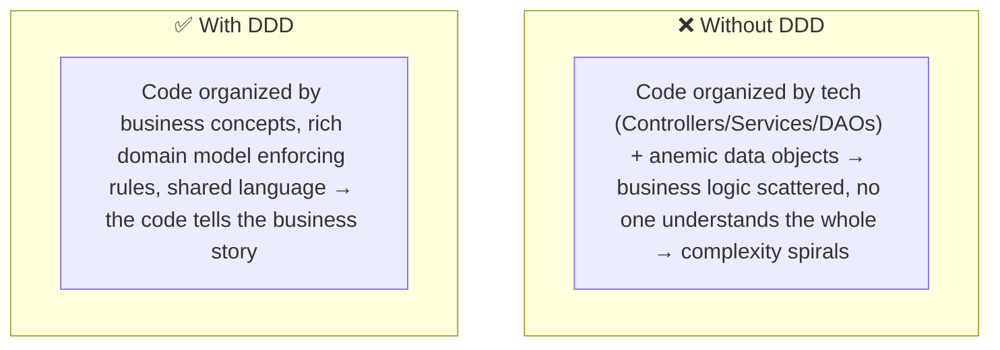

> [!IMPORTANT]
> As software grows, the killer isn't lines of code — it's **complexity**: business rules scattered everywhere, no single place that captures "how the business actually works," and a widening gap between what domain experts *say* and what the code *does*. DDD attacks this by making the **domain model** the center of the software — a rich, shared representation of the business that both experts and code agree on. The payoff is that the code becomes *understandable in business terms*: a new developer (or a domain expert reading pseudocode) can follow it because it uses the same words and rules the business uses. DDD is fundamentally about **communication and shared understanding** as much as code structure.

### Ubiquitous Language

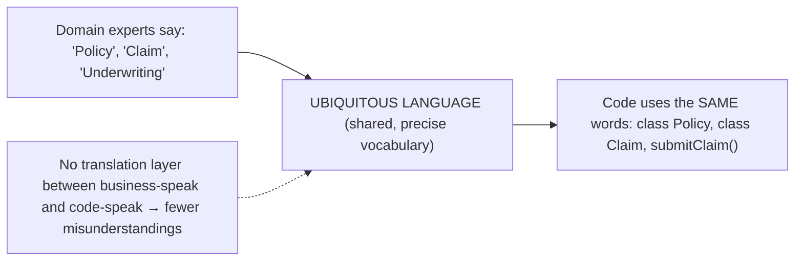

> [!IMPORTANT]
> **Ubiquitous language** is DDD's foundational practice: the team develops a **single, shared, precise vocabulary** for the domain — used identically by domain experts, in conversations, in documentation, *and in the code*. If the business says "a customer *places* an order" and "an order is *fulfilled*," the code has `order.place()` and `order.fulfill()` — not `insertOrderRecord()` or generic `save()`. The point is to **eliminate translation** — the constant, error-prone mental mapping between "business words" and "developer words" where requirements get lost. When code and conversation use the same terms, misunderstandings shrink, onboarding speeds up, and the model stays honest. This language is *cultivated* (it emerges and sharpens through discussion) and *bounded* (the same word can mean different things in different contexts — §2.1). It sounds soft, but it's arguably DDD's most valuable and most-neglected idea.

### Domain, Subdomain, and Model

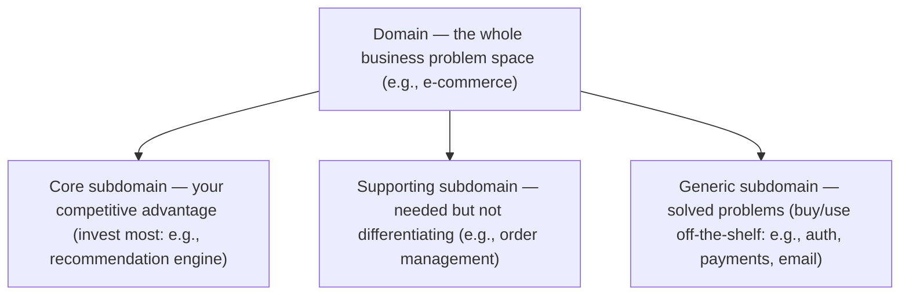

> [!TIP]
> The **domain** is the entire subject area your software addresses (banking, logistics, healthcare). It's divided into **subdomains** of three kinds, and distinguishing them is a key strategic decision: the **core subdomain** is your *competitive advantage* — the thing your business is uniquely good at (invest your best engineers and deepest modeling here). A **supporting subdomain** is necessary but not differentiating (build it adequately, don't gold-plate). A **generic subdomain** is a solved problem others do better (authentication, payments, email — *buy or use off-the-shelf*, don't build). This classification prevents a classic waste: pouring elite effort into a generic subdomain (writing your own auth — see [[01 OAuth2 OIDC and JWT]]) while under-investing in the core. The **model** is your abstraction of a subdomain — the selective, purposeful representation of the concepts and rules that matter (a good model *omits* what's irrelevant).

### Real-world analogy 🗺️

DDD is like **making a map with the locals**:
- You don't invent street names — you learn what the **locals call things** (ubiquitous language) so everyone can navigate together.
- A single map of the whole world at street detail is useless — you make **regional maps** (bounded contexts), each detailed and self-consistent for its area.
- The **same word means different things in different regions** — "football" means different games in different countries (context matters).
- You focus detail on the **important regions** (core subdomain) and use a rough sketch or someone else's map for the rest (generic subdomain).
- The map is a **model** — a purposeful simplification. A map showing *every* detail would be as confusing as the territory itself.

> [!TIP]
> Beginner takeaway: DDD makes the **business domain** — not the database or the framework — the heart of your software, expressed in a **ubiquitous language** shared by experts and code. Split the domain into **subdomains** (invest in the *core*), and model each in a clear **bounded context**. It's a philosophy of managing complexity through business alignment and shared understanding — most valuable when the domain is genuinely complex.

---

## 2. 🧩 CORE CONCEPTS (Intermediate Level)

### 2.1 Bounded Contexts — the central strategic pattern

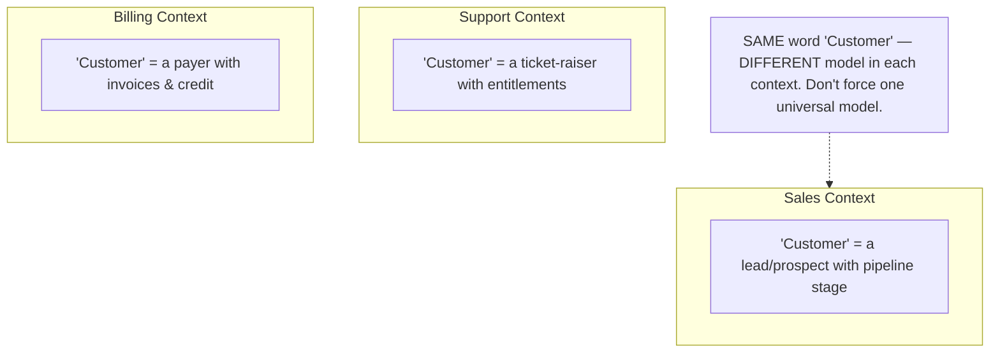

> [!IMPORTANT]
> A **bounded context** is an explicit boundary within which a particular domain model — and its ubiquitous language — applies consistently. It's DDD's most important strategic concept. The key insight: **there is no single, universal model of a business concept** — the meaning of "Customer" is genuinely *different* in Sales (a prospect in a pipeline), Support (someone with tickets and entitlements), and Billing (a payer with invoices). Trying to build one giant "Customer" model that serves everyone produces a bloated, contradictory mess that pleases no one. Instead, DDD says: **let each context have its *own* model of Customer**, optimized for that context's needs, with a clear boundary between them. Within a context, the language is precise and unambiguous; *across* contexts, you translate (§3.4). This directly answers **"where do I draw [[03 Microservices]] boundaries?"** — a bounded context is the natural unit of a microservice (a well-designed service ≈ a bounded context, with its own model and database). Getting these boundaries right is the single highest-leverage architectural decision.

### 2.2 Entities vs Value Objects

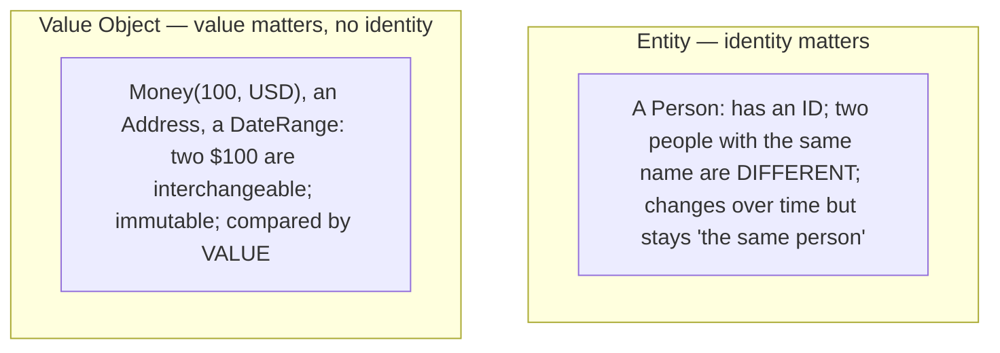

| Aspect | Entity | Value Object |
|---|---|---|
| **Identity** | Has a unique ID | No identity — defined by attributes |
| **Equality** | By ID (same ID = same entity) | By value (same attributes = equal) |
| **Mutability** | Can change over time | Immutable (create a new one to "change") |
| **Example** | User, Order, Account | Money, Address, Color, DateRange |

> [!IMPORTANT]
> Two fundamental tactical building blocks. An **entity** has a distinct **identity** that persists through change — a `User` is the same user even after changing their name/email; two users with identical attributes are still *different* (compared by **ID**). A **value object** has **no identity** — it's defined entirely by its attributes and is **interchangeable**: `$100 USD` is `$100 USD`, an `Address` is just its fields (compared by **value**, not identity). Value objects should be **immutable** (to "change" money, you create a new `Money` — like `String` in [[01 Basic Java]]). Why this distinction matters: it clarifies modeling (is this thing tracked over time, or just a value?), reduces bugs (immutable value objects are inherently thread-safe — [[04 Java Concurrency and JVM]] — and can't be corrupted), and pushes logic into rich objects (a `Money` object enforces currency rules; a `DateRange` validates start < end). A common anti-pattern is making everything an entity with a database ID when many concepts are really value objects.

### 2.3 Aggregates & Aggregate Roots

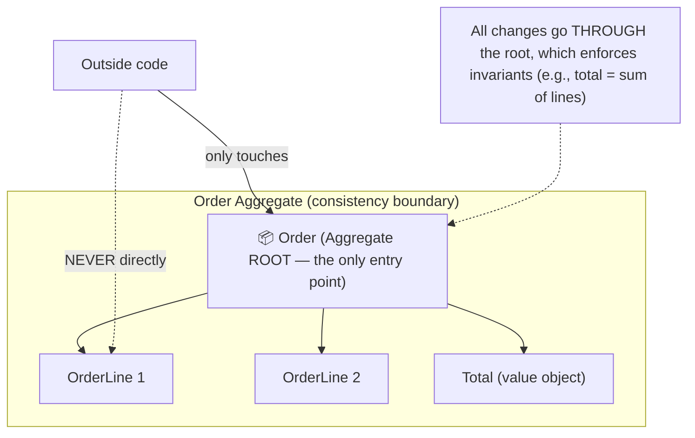

> [!IMPORTANT]
> An **aggregate** is a cluster of related entities and value objects treated as a **single unit for data changes**, with one designated **aggregate root** (an entity) as the *only* entry point. The rules: **outside objects may only reference the root** (never reach inside to a child directly), and **all modifications go through the root**, which enforces the aggregate's **invariants** (business rules that must *always* hold — e.g., "an order's total must equal the sum of its line items," "you can't add items to a shipped order"). Why aggregates matter: they define the **consistency boundary** — everything inside an aggregate is kept consistent *together, transactionally* ([[01 SQL and Transactions Deep Dive]]), while consistency *between* aggregates is **eventual** (via domain events — §2.5). This is a profound design tool: it tells you what must be atomic (one aggregate = one transaction) and what can be eventually consistent (across aggregates), which directly shapes your transactions and your [[03 Microservices]]/[[05 Event-Driven Architecture]] boundaries. **Keep aggregates small** — large aggregates cause contention and performance problems (§3.2).

### 2.4 Domain Services, Repositories, Factories

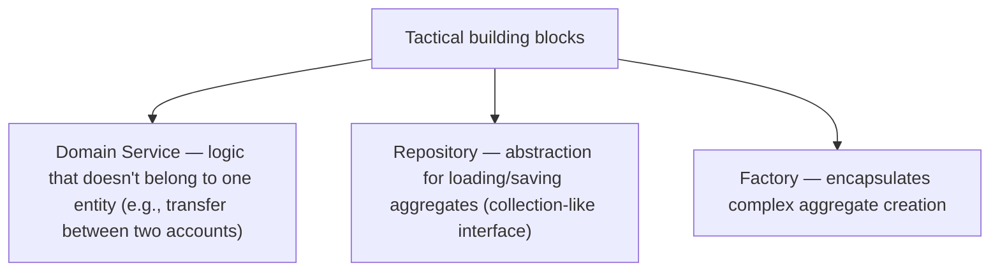

> [!TIP]
> Three more tactical patterns. A **domain service** holds domain logic that doesn't naturally belong to any single entity or value object — e.g., transferring money *between two accounts* (it involves two aggregates, so it's not one account's responsibility) or a pricing calculation spanning several concepts. (Don't confuse this with an application/technical service — a *domain* service contains genuine business logic and speaks the ubiquitous language.) A **repository** provides a collection-like abstraction for retrieving and persisting **aggregates** (`orderRepository.findById()`, `save()`) — it hides the database, so the domain model stays persistence-ignorant ([[08 JPA vs Hibernate]] often implements these; note repositories work at the *aggregate* level, not per-table). A **factory** encapsulates the creation of complex aggregates/value objects when construction involves significant logic or invariants, keeping that complexity out of the objects themselves ([[02 Design Patterns]] factory). Together these keep the domain model clean and focused on *behavior*, with persistence and construction concerns pushed to the edges.

### 2.5 Domain Events

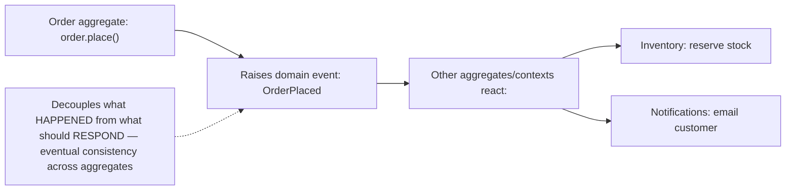

> [!IMPORTANT]
> A **domain event** is something meaningful that *happened in the domain*, expressed in the ubiquitous language and past tense: `OrderPlaced`, `PaymentReceived`, `InventoryDepleted`. This is the direct bridge to [[05 Event-Driven Architecture]]: aggregates **raise domain events** when significant state changes occur, and other aggregates or bounded contexts **react** — enabling **eventual consistency across aggregate boundaries** without giant transactions. Domain events are how you coordinate the "one aggregate per transaction" rule (§2.3) with real workflows that span multiple aggregates: place the order (one transaction on the Order aggregate), *raise* `OrderPlaced`, and let Inventory reserve stock in *its own* transaction reacting to the event. They also create an audit trail, decouple contexts (the Order context doesn't know or care who reacts), and often become the integration events published to [[01 Kafka]]/[[02 RabbitMQ]] across [[03 Microservices]]. Domain events are one of DDD's most powerful and practical concepts — they make the model *express* the important moments in the business.

### 2.6 Layered / Hexagonal Architecture

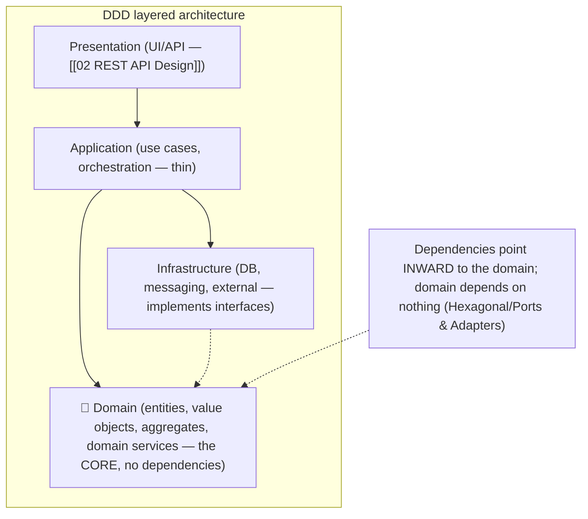

> [!IMPORTANT]
> DDD is typically implemented with a **layered** (or **hexagonal / ports-and-adapters / clean**) architecture where the **domain model sits at the center and depends on *nothing*** — no database, no framework, no UI. Dependencies point *inward*: the **infrastructure** (database via [[08 JPA vs Hibernate]], messaging, external APIs) and **presentation** ([[02 REST API Design]]/UI) layers depend on the domain, not vice versa, and they implement interfaces (**ports**) the domain defines (**dependency inversion** — [[02 Design Patterns]]). The thin **application layer** orchestrates use cases (load an aggregate via a repository, call a domain method, save) but contains *no business rules* — those live in the domain. The huge benefit: the **domain logic is pure, isolated, and testable** ([[01 Testing Strategies]]) — you can unit-test business rules with zero database or framework, and you can swap infrastructure without touching the core. This isolation of the domain is what prevents the business logic from being tangled up with technical concerns (the "anemic domain model" anti-pattern, §3.6).

---

## 3. ⚙️ ADVANCED CONCEPTS (Senior Level)

### 3.1 Context Mapping — how contexts relate

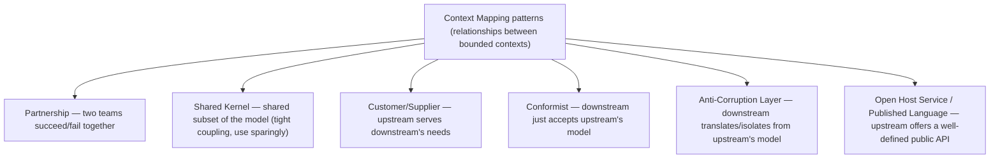

> [!IMPORTANT]
> A large system has many bounded contexts, and **context mapping** documents how they relate — both technically and *organizationally* (Conway's Law: your system structure mirrors your team structure). The key patterns: **Shared Kernel** (two contexts share a common model subset — powerful but creates tight coupling, so use sparingly). **Customer/Supplier** (an upstream context provides what a downstream one needs, with the downstream having a say). **Conformist** (the downstream simply adopts the upstream's model wholesale — cheap but you inherit its baggage). **Anti-Corruption Layer (ACL)** (the downstream builds a *translation layer* that converts the upstream's model into its own terms — protecting its clean model from a messy or foreign upstream, e.g., a legacy system or third party). **Open Host Service / Published Language** (an upstream offers a well-defined, stable public interface — like a [[02 REST API Design]] or a published event schema — so many downstreams can integrate). Context maps are essential for [[03 Microservices]] at scale: they make the *relationships and dependencies between services explicit*, revealing coupling risks and integration strategies.

### 3.2 Aggregate Design Rules

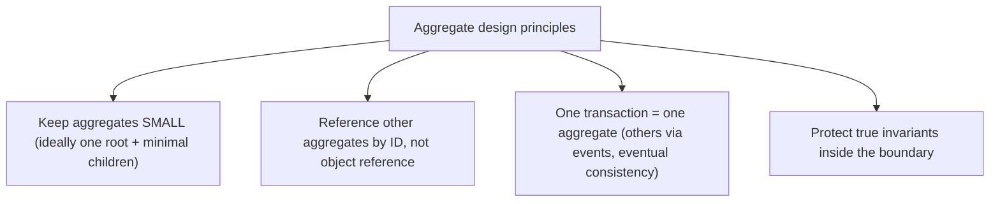

> [!IMPORTANT]
> Aggregate design is where DDD gets genuinely hard, and Vaughn Vernon's rules are the guide. **(1) Keep aggregates small** — a big aggregate (e.g., a `Customer` holding *all* their orders) means loading tons of data and high contention (every change locks the whole thing — [[01 SQL and Transactions Deep Dive]]). Prefer many small aggregates over few large ones. **(2) Reference other aggregates by identity (ID), not by direct object reference** — an `Order` holds a `customerId`, not a `Customer` object; this keeps aggregates decoupled and independently loadable, and is *essential* in [[03 Microservices]] (you can't hold an object reference across a service boundary anyway). **(3) One transaction modifies one aggregate** — if a use case needs to change multiple aggregates, do it across *separate* transactions coordinated by **domain events** (§2.5) with eventual consistency (or a **Saga** — [[05 Event-Driven Architecture]]). **(4) The aggregate boundary is the *true-invariant* boundary** — only cluster things that must be *immediately* consistent; anything that can be eventually consistent belongs in a *separate* aggregate. These rules are the difference between aggregates that scale and aggregates that become monolithic bottlenecks.

### 3.3 Strategic vs Tactical DDD

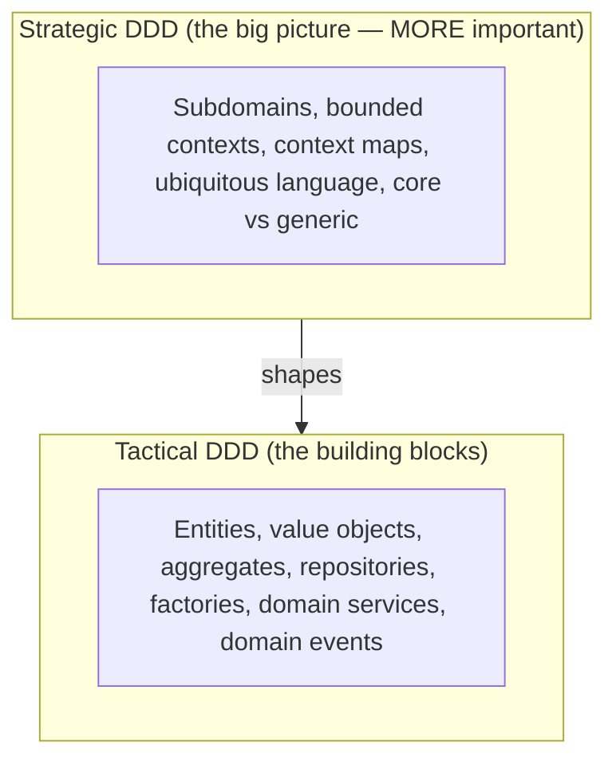

> [!IMPORTANT]
> DDD has two levels, and a common mistake is focusing only on the tactical patterns while ignoring the strategic. **Strategic DDD** is the *big-picture* design: identifying subdomains, drawing **bounded contexts**, mapping their relationships, and cultivating the ubiquitous language. **Tactical DDD** is the *implementation toolkit*: entities, value objects, aggregates, repositories, factories, domain events. The senior insight: **strategic design matters more** — getting your bounded contexts and their boundaries right has far bigger consequences than whether you perfectly apply the tactical patterns (wrong boundaries create a "distributed monolith" of tightly-coupled services no tactical elegance can fix — [[03 Microservices]]). Many teams "do DDD" by using aggregates and repositories in a single badly-bounded blob, missing the point. You can even do valuable strategic DDD (bounded contexts, ubiquitous language) *without* the heavy tactical patterns for simpler contexts. **Boundaries first, building blocks second.**

### 3.4 Anti-Corruption Layer (deep)

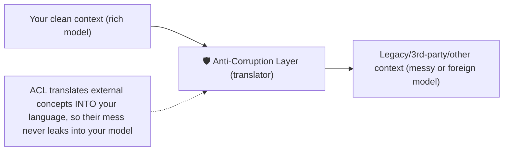

> [!IMPORTANT]
> The **Anti-Corruption Layer (ACL)** deserves special attention because it's one of the most *practically* useful patterns. When your clean bounded context must integrate with something you don't control — a **legacy system**, a **third-party API**, or another team's context with a different (possibly bad) model — the danger is that the foreign model's concepts, quirks, and terminology **leak into and corrupt your own model**. The ACL is a **translation layer** that sits between them, converting the external model into *your* ubiquitous language and shielding your domain from external changes and messiness. For example, integrating a legacy CRM: rather than letting its weird `CUST_REC` structures pollute your `Customer` aggregate, the ACL translates at the boundary, so your domain only ever sees clean, well-modeled concepts. This is invaluable during **strangler-fig migrations** (gradually replacing a legacy system — the ACL insulates new code from old) and whenever integrating external systems ([[03 Microservices]], [[06 API Gateway]]). It embodies a deep principle: **protect the integrity of your model at its boundaries.**

### 3.5 Event Storming & discovering the model

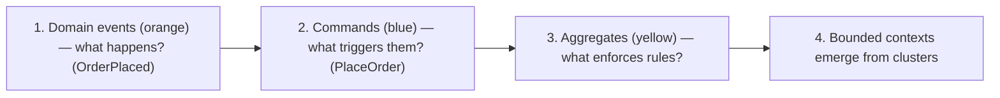

> [!TIP]
> **Event Storming** (Alberto Brandolini) is a collaborative workshop technique for *discovering* the domain model — and it's how DDD is actually practiced. Domain experts and developers gather (physically or virtually) with sticky notes and map the business as a flow of **domain events** (orange notes: "Order Placed," "Payment Received"), then add the **commands** that cause them, the **aggregates** that handle them, the **actors**, external systems, and **policies** ("whenever X happens, do Y"). As the events line up chronologically, natural **clusters and boundaries emerge** — revealing the bounded contexts and aggregates *from the business flow itself*, rather than guessing them upfront. It's powerful because it (1) builds shared understanding fast, (2) surfaces the ubiquitous language, (3) uncovers hidden complexity and edge cases early, and (4) directly informs [[05 Event-Driven Architecture]] design (the events you storm often *become* your integration events). Knowing Event Storming shows you understand DDD as a *collaborative modeling practice*, not just a coding style.

### 3.6 Failure Scenarios & DDD Anti-Patterns

| Anti-pattern | Problem | Fix |
|---|---|---|
| **Anemic domain model** | Objects are data bags; logic in services | Put behavior/rules *in* the domain objects |
| **One giant model** | Forcing one model across all contexts | Split into bounded contexts |
| **Huge aggregates** | Contention, slow loads | Small aggregates; reference by ID |
| **DDD on a CRUD app** | Over-engineering simple domains | Use DDD only for complex core domains |
| **Tactical without strategic** | Patterns applied inside bad boundaries | Get bounded contexts right first |
| **Leaking external models** | Third-party concepts corrupt your model | Anti-Corruption Layer |
| **Ignoring domain experts** | Model diverges from reality | Collaborate; ubiquitous language |
| **Database-driven design** | Model shaped by tables, not domain | Model the domain first, persist second |

> [!WARNING]
> The **anemic domain model** is DDD's most common and insidious anti-pattern (Martin Fowler named it): your "domain" objects are just **bags of getters/setters with no behavior**, and all the actual business logic lives in a pile of "service" classes that manipulate them from outside. This *looks* object-oriented but isn't — it's procedural code with objects as data structures, and it scatters business rules so the model can't enforce its own invariants (any service can put an object in an invalid state). The fix is a **rich domain model**: behavior lives *with* the data it operates on (`order.addItem(...)` enforces the rules, rather than a service reaching into the order's fields). The equally-critical warning: **DDD is not free** — its full machinery (aggregates, contexts, event storming, layered architecture) is justified for **complex core domains**, and is *over-engineering* for simple CRUD apps or generic subdomains. Applying heavyweight DDD everywhere creates needless complexity. The mature stance: **invest DDD where the domain complexity is real (the core), keep it simple elsewhere.**

---

## 4. 🏗️ REAL-WORLD SYSTEM DESIGN USAGE

### 4.1 DDD → Microservices boundaries

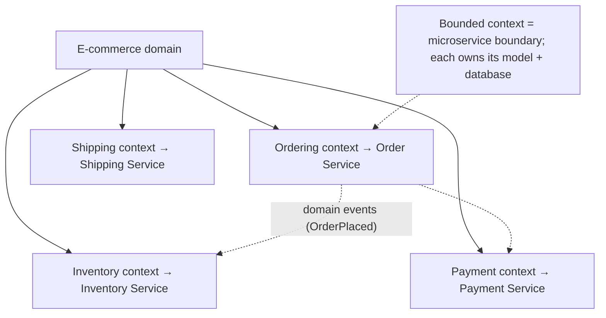

> [!IMPORTANT]
> The most impactful practical use of DDD today: **bounded contexts define [[03 Microservices]] boundaries.** The #1 cause of microservices pain is *wrong boundaries* — services split by technical layer or arbitrarily, creating chatty, tightly-coupled "distributed monoliths" that must be deployed together (worse than a monolith). DDD provides the *principled* way to decompose: **each bounded context becomes a microservice**, owning its own model *and its own database* (the golden rule of microservices data ownership), speaking to others via **domain/integration events** ([[05 Event-Driven Architecture]]) or well-defined APIs ([[02 REST API Design]]) with **Anti-Corruption Layers** at the seams. The aggregate rules directly help: "one transaction per aggregate" fits "one service owns its data" (no distributed transactions — use **Sagas**), and "reference other aggregates by ID" fits "services don't share object graphs." So DDD isn't just modeling theory — it's the design discipline that makes microservices *work*. "Design your bounded contexts before your services" is core senior guidance.

### 4.2 A layered DDD service in practice

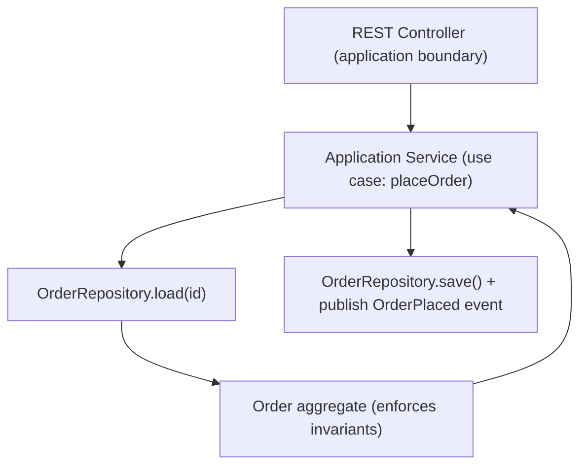

> [!TIP]
> Concretely, a use case in a DDD-structured [[05 Spring Boot]] service flows like this: a **controller** ([[02 REST API Design]]) receives the request and calls a thin **application service** (`placeOrder`), which loads the relevant **aggregate** via a **repository**, invokes a **domain method** on it (`order.place()` — where the *business rules live and invariants are enforced*), saves the aggregate back through the repository, and publishes the resulting **domain event**. Notice: the application service *orchestrates* but holds no business logic; the rules are all in the `Order` aggregate; persistence is behind the repository ([[08 JPA vs Hibernate]]); and the domain classes have no framework/DB dependencies (testable in isolation — [[01 Testing Strategies]]). This structure is the tactical DDD payoff — clean separation where the *business logic is findable, testable, and protected*. It's a world away from the anemic "fat service, dumb entity" style, and it scales as complexity grows because new rules have an obvious home.

### 4.3 When to use DDD (and when not)

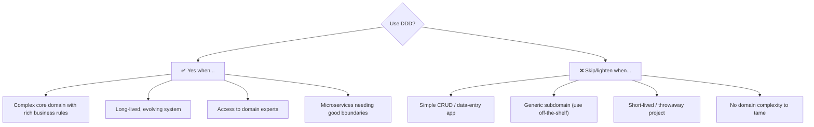

> [!IMPORTANT]
> **DDD is a complexity-management tool, so it pays off in proportion to complexity.** Use it (especially the full tactical + strategic machinery) for **complex, core, long-lived domains** with rich, evolving business rules — where the investment in modeling and boundaries prevents the complexity from becoming unmanageable, and where you have **domain experts** to collaborate with. **Don't** over-apply it: a simple CRUD app (a to-do list, a basic admin panel) has no domain complexity to tame, so aggregates, contexts, and event storming are pure overhead — plain layered CRUD is correct there. Generic subdomains should be bought, not lovingly modeled. The nuanced real-world answer, and a strong senior signal: **apply DDD selectively** — rich DDD in the *core subdomain* where your competitive advantage and complexity live, and lightweight/CRUD approaches in supporting and generic subdomains. Even in a DDD system, not every context deserves the same rigor. Matching the *technique* to the *complexity* is the essence of good engineering judgment.

---

## 5. 🎤 INTERVIEW PREPARATION

### 5.1 Most important questions

<details>
<summary><b>Q1: What is Domain-Driven Design and what problem does it solve?</b></summary>

DDD is an approach where the software's structure mirrors the business domain, modeled collaboratively with domain experts using a shared **ubiquitous language**. It tackles the core difficulty of complex software — understanding and modeling the business correctly — by making a rich **domain model** the heart of the code. It has strategic design (bounded contexts, subdomains, context maps) and tactical design (entities, value objects, aggregates, domain events). It's most valuable for complex domains and is over-engineering for simple CRUD apps.
</details>

<details>
<summary><b>Q2: What is a bounded context?</b></summary>

An explicit boundary within which a specific domain model and ubiquitous language apply consistently. The key insight: there's no single universal model of a concept — "Customer" means different things in Sales, Support, and Billing — so each context gets its own model rather than forcing one bloated shared model. Within a context terms are unambiguous; across contexts you translate. A bounded context is the natural unit for a microservice boundary (own model + own database).
</details>

<details>
<summary><b>Q3: Entity vs Value Object?</b></summary>

An **entity** has a unique identity that persists through change (a User is the same user after changing their name; compared by ID). A **value object** has no identity — it's defined by its attributes, interchangeable, and should be immutable (Money, Address, DateRange; compared by value). Distinguishing them clarifies modeling, reduces bugs (immutable value objects are thread-safe and can't be corrupted), and puts logic in rich objects. Making everything an entity with a DB ID is a common anti-pattern.
</details>

<details>
<summary><b>Q4: What is an aggregate and aggregate root?</b></summary>

An aggregate is a cluster of entities/value objects treated as one unit for changes, with an **aggregate root** as the only entry point. Outside code references only the root, and all changes go through it so it can enforce **invariants**. The aggregate is the **consistency boundary** — everything inside is transactionally consistent, while consistency across aggregates is eventual (via domain events). Rules: keep aggregates small, reference other aggregates by ID, one transaction per aggregate. This directly shapes transactions and service boundaries.
</details>

<details>
<summary><b>Q5: What are domain events and why use them?</b></summary>

A domain event is something meaningful that happened in the domain, in past tense (OrderPlaced), in the ubiquitous language. Aggregates raise them when significant state changes occur, and other aggregates/contexts react — enabling eventual consistency across aggregate boundaries without giant transactions. They decouple what happened from what responds, create an audit trail, and often become the integration events published across microservices (Event-Driven Architecture). They reconcile "one transaction per aggregate" with workflows spanning multiple aggregates.
</details>

<details>
<summary><b>Q6: How does DDD relate to microservices?</b></summary>

Bounded contexts define microservice boundaries — each context becomes a service owning its own model and database, communicating via domain/integration events or well-defined APIs, with Anti-Corruption Layers at the seams. This solves the #1 microservices failure (wrong boundaries → distributed monolith). Aggregate rules reinforce it: "one transaction per aggregate" fits "one service owns its data" (no distributed transactions — use Sagas), and "reference by ID" fits "services don't share object graphs." Design bounded contexts before services.
</details>

<details>
<summary><b>Q7: What is an anemic domain model and why is it an anti-pattern?</b></summary>

An anemic domain model has domain objects that are just data bags (getters/setters) with no behavior, while all business logic sits in separate service classes. It looks OO but is really procedural — it scatters business rules so the model can't enforce its own invariants (any service can create invalid state). The fix is a rich domain model where behavior lives with the data (`order.addItem()` enforces rules). It's the most common way "doing DDD" goes wrong.
</details>

<details>
<summary><b>Q8: Strategic vs tactical DDD — which matters more?</b></summary>

**Strategic** (bounded contexts, subdomains, context maps, ubiquitous language) is the big-picture boundary design; **tactical** (entities, value objects, aggregates, repositories, domain events) is the implementation toolkit. Strategic matters more — wrong boundaries create tightly-coupled distributed monoliths that no tactical elegance can fix. Many teams misapply DDD by using tactical patterns inside badly-bounded blobs. Get boundaries right first, then apply building blocks — and only with the rigor the domain's complexity warrants.
</details>

### 5.2 Tricky questions

> [!TIP]
> **"Should every microservice be one bounded context?"** — Ideally a service aligns with a bounded context (or a context maps to one/few services), but they're not identical concepts — a context is a *modeling* boundary, a service is a *deployment* boundary. A context might be implemented as several services, but you should *never* split a single aggregate across services. The guidance: let contexts *inform* service boundaries; don't split more finely than the model justifies.

> [!TIP]
> **"Can two aggregates be updated in one transaction?"** — The DDD rule says no — one transaction per aggregate, to keep aggregates independent and scalable. Coordinate multi-aggregate changes via domain events with eventual consistency (or a Saga). If two things *must* change together atomically, that's a signal they might belong in the *same* aggregate — but beware making aggregates too big.

> [!TIP]
> **"Isn't DDD just good OOP?"** — There's overlap (rich objects, encapsulation), but DDD adds the *strategic* dimension (bounded contexts, subdomains, ubiquitous language, context mapping) and a *collaboration* discipline (working with domain experts, event storming) that plain OOP doesn't. The strategic and linguistic parts are what make it DDD, not just clean code.

> [!TIP]
> **"When would you NOT use DDD?"** — Simple CRUD apps with little business logic, generic subdomains (buy off-the-shelf), throwaway/short-lived projects, or when you have no access to domain experts. DDD's cost is only justified by domain complexity — applying it to trivial domains is over-engineering. Reserve the full machinery for the complex core.

### 5.3 Common mistakes candidates make

| Mistake | Reality |
|---|---|
| "DDD is a framework/tech" | It's a philosophy + vocabulary, tool-agnostic |
| Anemic model (logic in services) | Rich model — behavior with data |
| One universal model for all | Bounded contexts; model per context |
| Tactical patterns, no strategy | Boundaries matter more than patterns |
| Huge aggregates | Keep small; reference by ID |
| DDD everywhere | Only for complex core domains |
| Ignoring domain experts | DDD is collaborative modeling |
| Confusing subdomain & bounded context | Problem-space vs solution-space |

### 5.4 What interviewers actually expect

- **Ubiquitous language** and **bounded contexts** (the strategic core).
- **Entity vs value object**, **aggregates/roots/invariants** (tactical core).
- **Domain events** and their link to [[05 Event-Driven Architecture]].
- **DDD → [[03 Microservices]] boundaries** (the killer practical application).
- The **anemic model** anti-pattern and rich domain models.
- **Strategic > tactical**; **context mapping** (esp. ACL).
- Pragmatism: DDD is for *complex* domains, not everything.

---

## 6. 🛠️ HANDS-ON PROJECTS

### Project 1: Model a Domain with Rich Objects (Beginner→Intermediate)

**Goal:** Feel the difference between anemic and rich models.

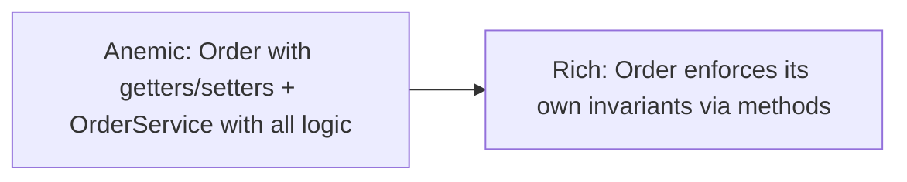

**Steps:**
1. Pick a domain (e.g., a library, a food-delivery order).
2. First build it **anemically** (data classes + a big service) — notice logic scattering and invalid states.
3. Refactor to a **rich model**: `Order` with `addItem()`, `place()`, `cancel()` enforcing invariants; introduce **value objects** (Money, Address).
4. Identify the **aggregate root** and make all changes go through it.
5. Write unit tests for the invariants ([[01 Testing Strategies]]) — note the domain needs *no database* to test.

**Learn:** rich vs anemic models, entities vs value objects, aggregates, invariants, testable domains.

---

### Project 2: Event Storming → Bounded Contexts (Intermediate→Senior)

**Goal:** Discover boundaries from the business flow.

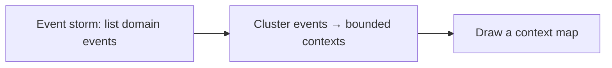

**Steps:**
1. Take a domain (e-commerce, ride-hailing) and **event storm** it: sticky-note all **domain events** in time order.
2. Add **commands** and **aggregates**; identify **actors** and **policies**.
3. Watch **bounded contexts** emerge from event clusters (Ordering, Inventory, Payment, Shipping).
4. Draw a **context map** with relationships (ACL, customer/supplier, published language).
5. Map each context to a potential [[03 Microservices]] boundary with its own data.

**Learn:** event storming, domain events, discovering bounded contexts, context mapping, service boundaries.

---

### Project 3: Build a DDD Service with Events & ACL (Senior)

**Goal:** A full tactical + strategic DDD service.

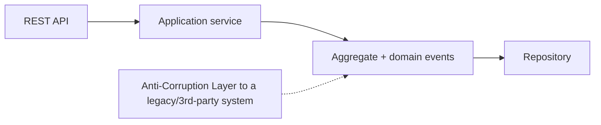

**Steps:**
1. Build an [[05 Spring Boot]] service in a **layered/hexagonal** structure (domain depends on nothing).
2. Implement an aggregate with invariants, a **repository** ([[08 JPA vs Hibernate]]), and an **application service** orchestrating a use case.
3. Raise **domain events** and publish them (to [[01 Kafka]]/in-process) for another context to react — eventual consistency.
4. Integrate a mock **legacy/3rd-party API** behind an **Anti-Corruption Layer** that translates to your language.
5. Unit-test the domain in isolation; integration-test the whole flow ([[01 Testing Strategies]]).

**Learn:** hexagonal architecture, aggregates, repositories, domain events, ACL, eventual consistency across contexts.

---

## 7. 🔬 DEEP DIVE: INTERNALS

### 7.1 Why aggregates = transaction boundaries

```mermaid
flowchart LR
    Agg["One aggregate = one consistency + transaction boundary"] --> Inside["Inside: strong consistency (single DB transaction — ACID)"]
    Agg --> Across["Across aggregates: eventual consistency (domain events)"]
    Note["This maps DIRECTLY onto how you scale and where you can/can't have distributed transactions"] -.-> Agg
```

> [!IMPORTANT]
> The deepest reason aggregates matter: **the aggregate boundary is simultaneously the consistency boundary, the transaction boundary, and (in distributed systems) the scalability boundary.** Everything inside an aggregate is kept **strongly consistent** in a single database transaction ([[01 SQL and Transactions Deep Dive]] — ACID). Everything *across* aggregates is **eventually consistent**, coordinated by domain events. This is not an arbitrary rule — it reflects a fundamental constraint: strong consistency requires a transaction, transactions don't scale across distributed nodes ([[06 Distributed Systems]] — no cheap distributed ACID), so the aggregate defines the largest unit you can keep *immediately* consistent affordably. When you design aggregates, you're actually deciding **what must be atomic vs what can lag** — which determines your transaction scope, your locking/contention profile, and where you can split into [[03 Microservices]] (a service can own whole aggregates but shouldn't split one). This is why "keep aggregates small" is really "keep your strong-consistency requirements small" — a profound systems-design insight hiding inside a modeling rule.

### 7.2 Bounded Context & Conway's Law

```mermaid
flowchart LR
    Teams["Team structure"] <-->|"mirror each other"| Contexts["Bounded contexts / services"]
    Conway["Conway's Law: systems mirror the communication structure of the org that builds them"] -.-> Teams
    Inverse["Inverse Conway Maneuver: design teams to GET the architecture you want"] -.-> Contexts
```

> [!IMPORTANT]
> Bounded contexts have a profound **organizational** dimension via **Conway's Law**: *"organizations design systems that mirror their own communication structure."* Because a bounded context has clear boundaries and its own ubiquitous language, it aligns naturally with an **autonomous team** that owns it end-to-end. This cuts both ways: if your team structure doesn't match your desired context boundaries, the architecture will drift toward the *team* structure regardless of your intentions (two teams sharing one context will fracture it; one team spanning two contexts will blur them). The **Inverse Conway Maneuver** exploits this deliberately — *structure your teams to produce the architecture you want* (want independent [[03 Microservices]]? create independent teams each owning a context). This is why DDD's bounded contexts are as much about *people and communication* as code — and why context mapping (§3.1) documents team relationships, not just technical ones. Senior architects design *sociotechnical* systems: the contexts, the services, *and* the teams together.

### 7.3 The model is a distillation, not reality

```mermaid
flowchart LR
    Reality["Messy full reality (infinite detail)"] --> Model["Model: purposeful selection of what MATTERS for this context"]
    Model --> Useful["A useful model OMITS the irrelevant — 'all models are wrong, some are useful'"]
```

> [!TIP]
> A subtle but crucial DDD principle: **a domain model is a *purposeful abstraction*, not a faithful copy of reality.** Reality is infinitely detailed; a good model deliberately *selects* the concepts and rules relevant to solving the problem *in this context* and *ignores* everything else. The statistician George Box's line — *"all models are wrong, but some are useful"* — captures it. This is why the *same* real-world thing (a Customer) is modeled *differently* in different bounded contexts (§2.1): each context's model captures only what *that context* needs. It's also why "model the whole business perfectly in one schema" fails — you'd be trying to copy reality instead of *distilling* it for a purpose. The skill of DDD modeling is **knowing what to leave out** — a model cluttered with irrelevant detail is as useless as no model. This connects to the "core domain" idea: spend modeling effort where distillation yields the most value (the complex core), and keep peripheral models deliberately thin.

### 7.4 Domain Events, Event Sourcing & CQRS

```mermaid
flowchart LR
    DE["Domain Events (DDD)"] --> ES["Event Sourcing: STORE the events as the source of truth (rebuild state by replay)"]
    DE --> CQRS["CQRS: separate write model (aggregates) from read model (projections)"]
    ES --> Fit["Natural fit: aggregates raise events → stored → projections built"]
```

> [!IMPORTANT]
> DDD's **domain events** connect directly to the advanced patterns in [[05 Event-Driven Architecture]]. **Event Sourcing** takes domain events to their logical conclusion: instead of storing the *current state* of an aggregate, you store the *sequence of domain events* that happened to it, and reconstruct current state by **replaying** them — giving a perfect audit trail and time-travel. Aggregates fit this beautifully: an aggregate *is* a consistency boundary that raises events, so those events *become* its persisted form. **CQRS** (Command Query Responsibility Segregation) pairs naturally: the **write model** is your DDD aggregates (enforcing invariants on commands), while **read models** are separate denormalized **projections** built by consuming the domain events — each optimized for specific queries (which sidesteps the tension between "aggregates optimized for consistency" and "reads optimized for queries"). This trio — DDD + Event Sourcing + CQRS — is a powerful (and complex) combination for complex domains, though each is independently adoptable (§[[05 Event-Driven Architecture]]). Understanding that domain events are the *linchpin* connecting DDD's tactical modeling to event-driven architecture is a senior-level synthesis.

### 7.5 Subdomain vs Bounded Context (problem vs solution space)

```mermaid
flowchart LR
    Problem["PROBLEM SPACE: Subdomains (how the business is naturally divided)"] --> Solution["SOLUTION SPACE: Bounded Contexts (how you divide your software/models)"]
    Ideal["Ideal: one bounded context per subdomain (but not always 1:1 in legacy/reality)"] -.-> Solution
```

> [!TIP]
> A distinction that trips up even experienced practitioners: **subdomains live in the *problem space*; bounded contexts live in the *solution space*.** A **subdomain** is a natural division of the *business problem* — it exists whether or not you write software (a company *has* sales, billing, and shipping concerns inherently). A **bounded context** is a division of *your software solution* — a boundary *you* draw around a model. In an **ideal greenfield design**, they align one-to-one (one bounded context per subdomain — the cleanest outcome). But in reality (legacy systems, poor past decisions, organizational constraints) they often *don't*: a single tangled legacy context might span three subdomains, or one subdomain might be awkwardly split across two contexts. Recognizing the mismatch is diagnostic — it reveals where your software structure has drifted from the business's natural structure, and where refactoring (splitting contexts, applying ACLs) would pay off. Getting the vocabulary right (problem-space subdomain vs solution-space context) signals genuine DDD depth, not just buzzword familiarity.

---

## ✅ Production Checklists

### Strategic
- [ ] Domain split into **subdomains**; **core** identified and prioritized
- [ ] **Bounded contexts** defined with explicit boundaries
- [ ] **Ubiquitous language** documented and used in code
- [ ] **Context map** showing relationships (ACL, published language, etc.)
- [ ] Generic subdomains **bought**, not custom-built
- [ ] Context boundaries align with **team** ownership (Conway)

### Tactical
- [ ] Rich domain model (**behavior with data**, not anemic)
- [ ] Entities vs **value objects** distinguished (value objects immutable)
- [ ] **Aggregates small**; one root; invariants enforced inside
- [ ] Other aggregates referenced **by ID**; one transaction per aggregate
- [ ] **Domain events** for cross-aggregate/context coordination
- [ ] Domain layer **isolated** (no framework/DB deps — testable)

### Fit
- [ ] DDD rigor **matched to complexity** (rich for core, light elsewhere)
- [ ] Bounded contexts → **microservice** boundaries where applicable
- [ ] **ACL** wrapping legacy/third-party integrations
- [ ] Domain experts **actively involved** in modeling

---

## 🗺️ Learning Roadmap

```mermaid
flowchart TB
    A["1️⃣ Why DDD<br/>complexity, ubiquitous language, subdomains"] --> B["2️⃣ Strategic design<br/>bounded contexts, context maps"]
    B --> C["3️⃣ Tactical blocks<br/>entities, value objects, aggregates"]
    C --> D["4️⃣ Domain events & services<br/>repositories, factories"]
    D --> E["5️⃣ Architecture<br/>layered/hexagonal, isolation"]
    E --> F["6️⃣ Advanced strategy<br/>ACL, event storming, aggregate design"]
    F --> G["7️⃣ Deep connections<br/>Conway, ES/CQRS, transaction boundaries"]
    G --> H["8️⃣ Application<br/>DDD → microservices, knowing when NOT to"]
```

| Stage | Focus | You can... |
|---|---|---|
| 1–2 | Strategic | Draw bounded contexts, cultivate language |
| 3–4 | Tactical | Model rich aggregates with events |
| 5–6 | Architecture + practice | Structure & discover the model |
| 7–8 | Synthesis | Apply DDD to microservices judiciously |

---

## 🔁 Self-Review Completion Loop

Reviewed against Evans' *Domain-Driven Design*, Vernon's *Implementing DDD*, Fowler's DDD articles, and Richardson's *Microservices Patterns*.

### Gap Review Matrix

| Dimension | Covered? | Where |
|---|---|---|
| Problem DDD solves | ✅ | §1 |
| Ubiquitous language | ✅ | §1 |
| Domain/subdomain/model | ✅ | §1 |
| Bounded contexts | ✅ | §2.1 |
| Entities vs value objects | ✅ | §2.2 |
| Aggregates & roots | ✅ | §2.3, §7.1 |
| Domain services/repos/factories | ✅ | §2.4 |
| Domain events | ✅ | §2.5, §7.4 |
| Layered/hexagonal architecture | ✅ | §2.6 |
| Context mapping | ✅ | §3.1 |
| Aggregate design rules | ✅ | §3.2 |
| Strategic vs tactical | ✅ | §3.3 |
| Anti-Corruption Layer | ✅ | §3.4 |
| Event storming | ✅ | §3.5 |
| DDD anti-patterns | ✅ | §3.6 |
| DDD → microservices | ✅ | §4.1 |
| Layered service in practice | ✅ | §4.2 |
| When (not) to use DDD | ✅ | §4.3 |
| Aggregates = txn boundaries | ✅ | §7.1 |
| Conway's Law | ✅ | §7.2 |
| Model as distillation | ✅ | §7.3 |
| ES/CQRS connection | ✅ | §7.4 |
| Subdomain vs bounded context | ✅ | §7.5 |
| Interview Q&A + mistakes | ✅ | §5 |
| Hands-on projects | ✅ | §6 |

> [!NOTE]
> **Remaining depth to explore independently:** specification pattern, domain model persistence strategies & ORM impedance mismatch ([[08 JPA vs Hibernate]]), aggregate design with eventual consistency in depth (Vernon's essays), CQRS read-model projections, DDD with functional programming (immutability, algebraic types), modeling with the "whirlpool" process, bounded context integration testing ([[01 Testing Strategies]] contract tests), strategic monolith-to-microservices decomposition (strangler fig), team topologies (Skelton/Pais), and modeling time/temporal concepts and process managers/sagas ([[05 Event-Driven Architecture]]).

---

## 📚 Official References

| Resource | Source |
|---|---|
| *Domain-Driven Design* — Eric Evans (the "blue book") | The original text |
| *Implementing Domain-Driven Design* — Vaughn Vernon (the "red book") | Practical tactical patterns |
| *Domain-Driven Design Distilled* — Vernon | Concise intro |
| Martin Fowler — DDD, Bounded Context, Aggregate | https://martinfowler.com/tags/domain%20driven%20design.html |
| *Learning Domain-Driven Design* — Vlad Khononov | Modern, approachable |
| Event Storming — Alberto Brandolini | https://www.eventstorming.com/ |
| DDD Reference (Evans, free PDF) | https://www.domainlanguage.com/ddd/reference/ |

---

## 🎁 Final Summary

> [!IMPORTANT]
> **The one-paragraph takeaway:** Domain-Driven Design tackles the hardest part of complex software — *understanding and modeling the business* — by making a rich **domain model** the heart of the code, built collaboratively with **domain experts** using a shared **ubiquitous language** so the code literally speaks the business's terms (no translation gap). It works at two levels. **Strategic design** (the more important level) divides the domain into **subdomains** — invest in the **core** (your competitive advantage), buy **generic** ones off-the-shelf — and draws **bounded contexts**, each with its *own* model of shared concepts (there is no universal "Customer"; it differs in Sales, Billing, Support), related through a **context map** (Shared Kernel, Customer/Supplier, Conformist, **Anti-Corruption Layer**, Published Language). **Tactical design** provides the building blocks: **entities** (identity that persists through change, compared by ID) vs **value objects** (immutable, compared by value); **aggregates** (clusters with a single **root** as the only entry point, enforcing **invariants**) — which are simultaneously the **consistency, transaction, and scalability boundary** (strong consistency *inside* via one DB transaction, **eventual consistency across** via **domain events**); plus **repositories**, **factories**, and **domain services**. Keep aggregates **small**, reference other aggregates **by ID**, and use **one transaction per aggregate** — rules that map cleanly onto [[03 Microservices]] (a **bounded context = a service** owning its model and database, the principled fix for the "wrong boundaries → distributed monolith" failure) and [[05 Event-Driven Architecture]] (domain events *become* integration events, and pair naturally with Event Sourcing and CQRS). Structure it with a **hexagonal/layered architecture** where the domain depends on nothing (pure, testable business logic), avoid the **anemic domain model** (behavior belongs *with* data, not in fat services), discover the model collaboratively via **event storming**, and remember Conway's Law (contexts align with teams). Above all, DDD is a **complexity-management tool** — apply its full rigor to the **complex core**, and keep it light for simple/generic subdomains; using heavyweight DDD on a CRUD app is over-engineering, and getting the **strategic boundaries right matters far more** than perfecting the tactical patterns.

**Golden rules:**
1. 🗣️ Build a **ubiquitous language** — same words in conversation and code.
2. 🗺️ **Bounded contexts** are king — no universal model; each context owns its own.
3. 🧩 **Strategic > tactical** — right boundaries beat perfect patterns.
4. 🆔 **Entity** = identity over time; **value object** = immutable, compared by value.
5. 📦 **Aggregates** enforce invariants; keep them small, reference others by ID.
6. ⚛️ **One transaction per aggregate**; cross-aggregate = domain events + eventual consistency.
7. 💪 **Rich domain model** — behavior with data, never anemic bags + fat services.
8. 🛡️ Protect your model at boundaries with an **Anti-Corruption Layer**.
9. 🏗️ **Bounded context = microservice boundary** (own model + own database).
10. ⚖️ DDD is for **complex core domains** — match the rigor to the complexity.

---

*Related guides in this vault: [[03 Microservices]] · [[05 Event-Driven Architecture]] · [[02 Design Patterns]] · [[05 Spring Boot]] · [[01 System Design Fundamentals]] · [[02 REST API Design]] · [[08 JPA vs Hibernate]] · [[01 SQL and Transactions Deep Dive]] · [[06 Distributed Systems]] · [[01 Testing Strategies]]*
