# 📡 Event-Driven Architecture — Complete Beginner-to-Expert Reference

> How systems built on **events** — not direct calls — achieve loose coupling, scalability, and resilience. Pub/sub, event streaming, **Event Sourcing**, **CQRS**, **Sagas**, the outbox pattern, and exactly-once delivery — the architecture behind modern distributed systems.

---

## 📑 Table of Contents

1. [Executive Summary](#-executive-summary)
2. [Fundamentals (Beginner)](#1--fundamentals-beginner-level)
3. [Core Concepts (Intermediate)](#2--core-concepts-intermediate-level)
4. [Advanced Concepts (Senior)](#3--advanced-concepts-senior-level)
5. [Real-World System Design](#4--real-world-system-design-usage)
6. [Interview Preparation](#5--interview-preparation)
7. [Hands-On Projects](#6--hands-on-projects)
8. [Deep Dive: Internals](#7--deep-dive-internals)
9. [Production Checklists](#-production-checklists)
10. [Learning Roadmap](#-learning-roadmap)
11. [Self-Review Completion Loop](#-self-review-completion-loop)
12. [Official References](#-official-references)
13. [Final Summary](#-final-summary)

---

## 🎯 Executive Summary

**Event-Driven Architecture (EDA)** is a design paradigm where components communicate by **producing and reacting to events** — facts about things that *have happened* — instead of directly calling each other. A service announces "OrderPlaced" and moves on; any number of other services react, now or later, without the producer knowing they exist. This **inverts the dependency direction** and decouples systems in time, space, and knowledge — the foundation of scalable [[03 Microservices]] and real-time systems.

| What it is | What it replaces | Core superpower |
|---|---|---|
| Components communicate via async events (facts about the past) | Synchronous request/response chains, tight coupling | **Loose coupling + independent scaling + resilience** — producers and consumers never block or know each other |

> [!IMPORTANT]
> The mental shift that unlocks EDA: **stop thinking in commands ("do this") and start thinking in events ("this happened").** In a request-driven system, the Order service *calls* the Inventory service and *waits* — if Inventory is down, the order fails; they're tightly coupled. In an event-driven system, the Order service *publishes* `OrderPlaced` and is done; Inventory, Shipping, Analytics, and Email services independently *react* whenever they can. The producer doesn't know who's listening, doesn't wait, and doesn't break if a consumer is down. This **temporal, spatial, and cognitive decoupling** is what makes systems scale and survive failure — but it trades away simplicity: you inherit eventual consistency, ordering challenges, and debugging complexity ([[06 Distributed Systems]]). EDA sits on top of your messaging infrastructure ([[01 Kafka]], [[02 RabbitMQ]]).

Related guides: [[01 Kafka]] · [[02 RabbitMQ]] · [[06 Distributed Systems]] · [[03 Microservices]] · [[01 System Design Fundamentals]] · [[02 REST API Design]] · [[04 Redis]]

---

## 1. 🌱 FUNDAMENTALS (Beginner Level)

### What is an "event"?

An **event** is an immutable record of something that **already happened** — a fact about the past, in past tense: `OrderPlaced`, `PaymentReceived`, `UserRegistered`, `ItemShippedForkasted`. It's not a request or a command; it's a notification of a state change.

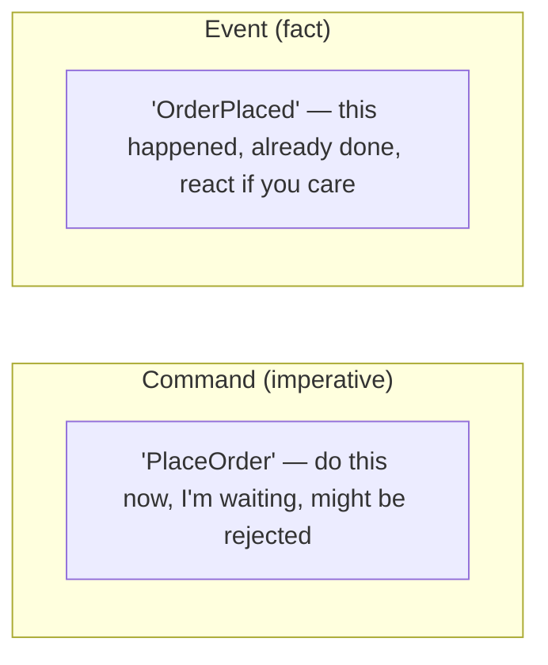

> [!IMPORTANT]
> The distinction between a **command** and an **event** is foundational. A **command** is a request to *do* something — it's directed at *one* handler, expresses *intent*, and can be *rejected* ("PlaceOrder"). An **event** is a statement that something *did* happen — it's *broadcast*, expresses a *fact*, is in *past tense*, and cannot be rejected (it already occurred). Commands have one recipient; events have zero-to-many. This isn't pedantry: naming things as events (past tense) forces you to design around *facts that are true* rather than *actions you're demanding*, which is what enables loose coupling. If you find yourself sending an event that expects a specific service to do a specific thing, you've actually sent a command in disguise.

### Request-Driven vs Event-Driven

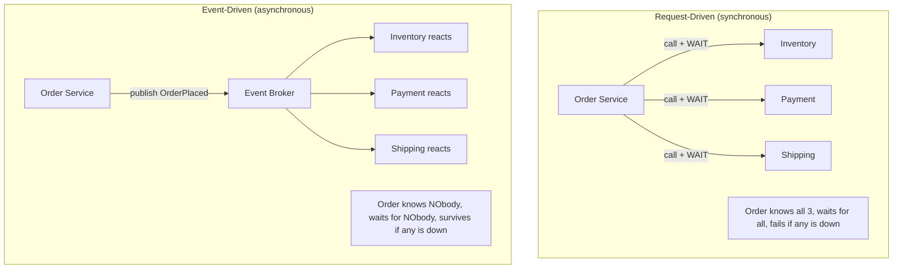

> [!TIP]
> In **request-driven** design, the caller orchestrates and waits — simple to reason about, but creates a fragile chain: latency adds up, and one slow/down service breaks the whole flow (**temporal coupling**). In **event-driven** design, the producer fires an event and forgets; consumers work independently and asynchronously. To add a new reaction (say, a "loyalty points" service), you just add a new consumer — **no change to the producer**. This is the open/closed principle at the architecture level ([[02 Design Patterns]]).

### The core building blocks

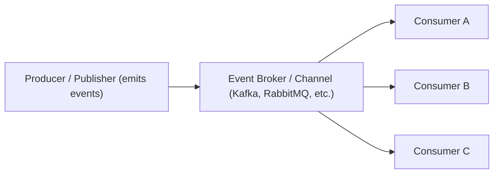

| Term | Meaning |
|---|---|
| **Event** | Immutable fact about something that happened |
| **Producer / Publisher** | Emits events (doesn't know consumers) |
| **Consumer / Subscriber** | Reacts to events (doesn't know producer) |
| **Broker / Event Bus** | Transports events between them ([[01 Kafka]]/[[02 RabbitMQ]]) |
| **Topic / Channel** | A named stream events are published to |
| **Event Schema** | The agreed structure/contract of an event |

### Real-world analogy 📢

EDA is like a **newspaper / social media feed**:
- A journalist (**producer**) publishes an article (**event**) — a fact about what happened.
- They don't call each reader individually; they publish to the paper (**broker/topic**).
- **Subscribers** read it whenever they want — some react (share, comment), some ignore it.
- The journalist doesn't know or wait for any reader. New subscribers can join anytime and even read old articles (if archived — like [[01 Kafka]]'s retained log).
- Contrast with a **phone call** (request-driven): you dial one specific person and wait for them to pick up — if they don't, you're stuck.

> [!TIP]
> Beginner takeaway: EDA flips communication from *"I call you and wait"* to *"I announce, you react."* This buys you **decoupling** (producers/consumers evolve independently), **scalability** (add consumers freely, buffer bursts), and **resilience** (a down consumer doesn't break the producer — it catches up later). The cost is **asynchronicity** — things happen *eventually*, not instantly, which reshapes how you think about consistency and debugging (covered next).

---

## 2. 🧩 CORE CONCEPTS (Intermediate Level)

### 2.1 Event Notification vs Event-Carried State Transfer

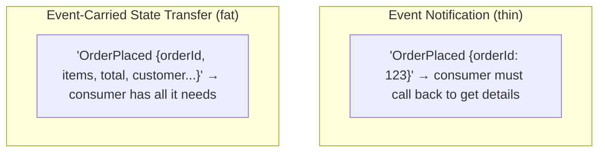

> [!IMPORTANT]
> A key design decision: **how much data does an event carry?** **Event Notification** sends a thin event (just an ID) — consumers call back to the source for details. Pros: small events, source of truth stays central. Cons: chatty (a callback per event), reintroduces coupling/latency (the source must be up). **Event-Carried State Transfer** sends a fat event with all relevant data — consumers need nothing else. Pros: full decoupling (source can be down), consumers keep local copies. Cons: larger events, data duplication, staleness. Most scalable systems lean toward **carried state** for decoupling, accepting the redundancy. Choosing wrong (thin events everywhere) silently rebuilds the tight coupling EDA was meant to remove.

### 2.2 The four styles of EDA (Fowler's taxonomy)

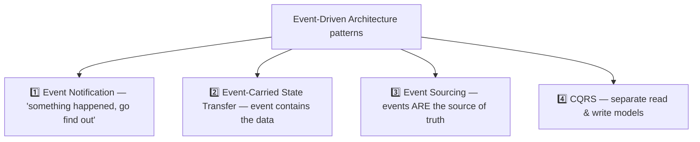

> [!TIP]
> Martin Fowler's four patterns are often conflated but are distinct. **Event Notification** and **Event-Carried State Transfer** (§2.1) are about *communication*. **Event Sourcing** (§3.1) is about *persistence* — storing state as a log of events. **CQRS** (§3.2) is about *separating reads from writes*. You can use any combination — many teams do event notification without event sourcing, for instance. Interviewers love probing whether you understand these are *independent* choices, not a package deal.

### 2.3 Pub/Sub vs Message Queue

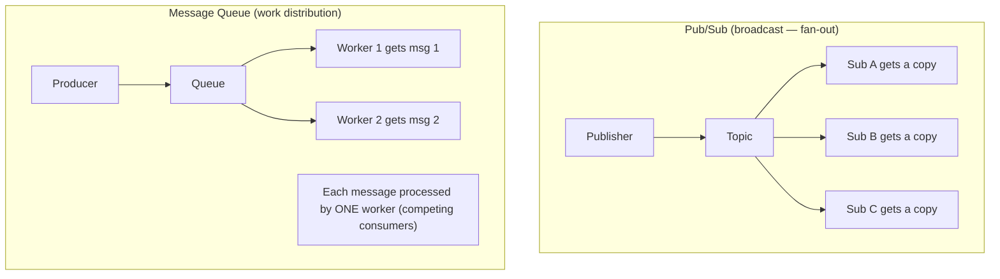

> [!IMPORTANT]
> Two fundamental delivery models. **Pub/Sub** *broadcasts* — every subscriber gets its **own copy** of each event (fan-out; used for "notify everyone interested"). **Message Queue** *distributes work* — each message goes to exactly **one** of several competing consumers (load balancing; used for "process this once"). [[01 Kafka]] elegantly does both via **consumer groups**: consumers in the *same* group share the partitions (queue semantics — each message processed once per group), while *different* groups each get all messages (pub/sub semantics). [[02 RabbitMQ]] separates these via exchanges (pub/sub) and queues (work). Knowing which model a scenario needs — broadcast a fact vs distribute a task — is core to EDA design.

### 2.4 Event Broker Choices

| Broker | Model | Best for |
|---|---|---|
| **[[01 Kafka]]** | Distributed log (retained, replayable) | High-throughput streaming, event sourcing, replay |
| **[[02 RabbitMQ]]** | Smart broker, flexible routing | Complex routing, task queues, RPC |
| **AWS SNS/SQS** | Managed pub/sub + queue | Cloud-native, serverless |
| **Redis Streams/Pub-Sub** | Lightweight, in-memory | Simple/fast, ephemeral ([[04 Redis]]) |
| **NATS / Pulsar** | Cloud-native streaming | Modern high-scale |

> [!TIP]
> The big mental split: **[[01 Kafka]] is a durable, replayable log** — events are retained (hours to forever), consumers track their own position (offset), and you can *replay* history (essential for event sourcing and adding new consumers that need the past). **[[02 RabbitMQ]] is a smart message broker** — rich routing (topic/fanout/direct exchanges), messages typically deleted after consumption, great for task queues and request/reply. "Kafka vs RabbitMQ" is a classic interview question: log vs broker, replay vs delete, throughput vs routing flexibility.

### 2.5 Eventual Consistency

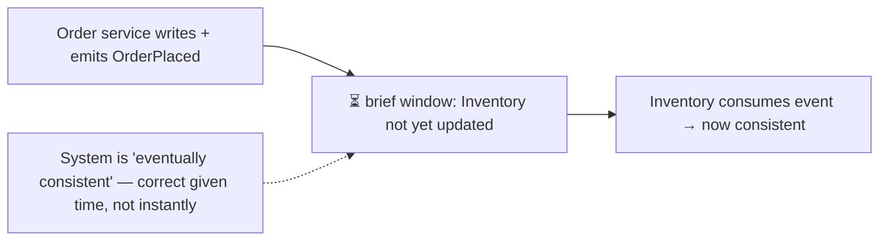

> [!WARNING]
> EDA almost always means **eventual consistency**: after an event, there's a window where different services have different views of the world (the order exists, but inventory hasn't decremented yet). This is a *fundamental trade-off*, not a bug — you gain decoupling/availability and give up the instant, global consistency of a single database transaction (CAP theorem, [[06 Distributed Systems]]). You must design for it: users may see "processing" states, you need **idempotency** (§3.4) since events can be redelivered, and business logic must tolerate temporary disagreement. Teams that don't internalize eventual consistency build EDA systems riddled with race conditions. When you truly need strong consistency across services, EDA (with Sagas, §3.3) coordinates it — but never instantly.

---

## 3. ⚙️ ADVANCED CONCEPTS (Senior Level)

### 3.1 Event Sourcing

Instead of storing *current state*, store the **full sequence of events** that led to it. Current state is derived by replaying events.

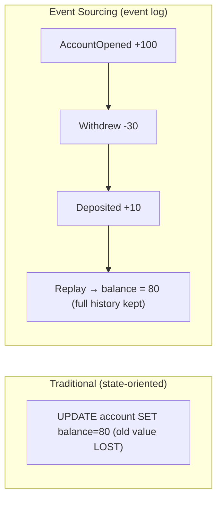

> [!IMPORTANT]
> **Event Sourcing** persists every state change as an immutable event in an append-only log; the current state is a *derived* projection you get by **replaying** events. Instead of `UPDATE balance=80` (destroying the old value), you append `Withdrew(30)`. Benefits are profound: a **complete audit trail** for free (every change, with cause and timing), the ability to **reconstruct state at any past point** ("what was the balance last Tuesday?"), **temporal queries**, easy debugging (replay to reproduce bugs), and natural fit with EDA (the events you store are the events you publish). Costs: **complexity** (replaying, snapshots for performance), **schema evolution** of old events, eventual consistency, and the mental shift from "current state" to "history of changes." It pairs naturally with [[01 Kafka]] (a durable log *is* an event store) and with CQRS (§3.2) to build read models.

### 3.2 CQRS (Command Query Responsibility Segregation)

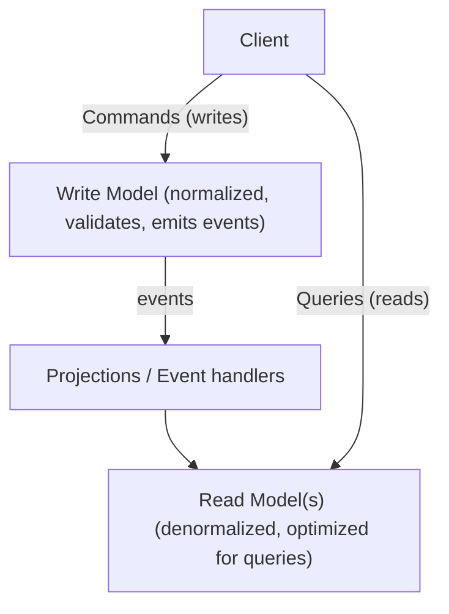

> [!IMPORTANT]
> **CQRS** splits the model for *writing* (commands) from the model for *reading* (queries). The **write side** handles commands, enforces business rules, and emits events — optimized for consistency and validation (often normalized). The **read side** consumes those events to build **denormalized, query-optimized projections** — often multiple, each shaped for a specific view (a search index, a dashboard aggregate, a cache). Why? Reads and writes have very different needs: writes need consistency and validation; reads need speed and specific shapes, often at far higher volume. CQRS lets you scale and optimize them independently — e.g., write to Postgres, read from [[04 Redis]]/Elasticsearch projections. It shines with Event Sourcing (events feed the projections) and EDA (events flow naturally), but adds complexity and eventual consistency (the read model lags the write). **Don't apply CQRS everywhere** — it's justified for complex domains with asymmetric read/write loads, not simple CRUD.

### 3.3 The Saga Pattern — distributed transactions

You can't use a single ACID transaction across microservices (no shared DB). **Sagas** coordinate a business transaction as a sequence of local transactions, each publishing an event that triggers the next — with **compensating actions** to undo on failure.

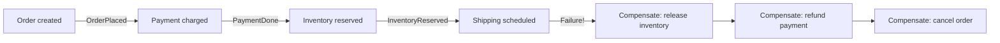

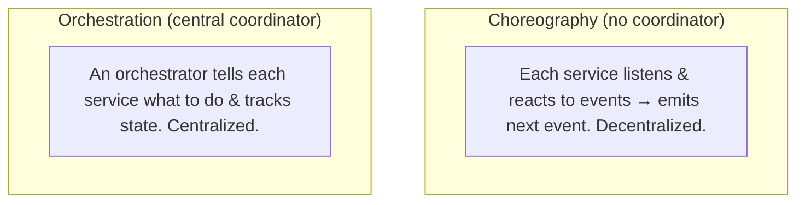

> [!IMPORTANT]
> A **Saga** manages data consistency across services *without* a distributed ACID transaction (which is impractical at scale — 2PC is slow and blocking, [[06 Distributed Systems]]). It breaks a transaction into **local transactions**, each emitting an event that triggers the next step; if a step fails, previously-completed steps run **compensating transactions** to semantically undo their work (refund the payment, release the inventory). Two flavors: **Choreography** — services react to each other's events with no central brain (decentralized, loosely coupled, but hard to see the overall flow — "who does what?"). **Orchestration** — a central **orchestrator** commands each step and tracks saga state (clear flow, easier to debug/monitor, but the orchestrator is a coupling point — relates to your [[07 Shim and Orchestrator Services in Microservices and Monolithic Services]] guide). Key nuance: sagas provide **atomicity via compensation, not isolation** — intermediate states are *visible* (an order can briefly be "paid but not shipped"), so you design for it (e.g., "pending" states, semantic locks). This is *the* answer to "how do you do transactions across microservices?"

### 3.4 Idempotency & Delivery Guarantees

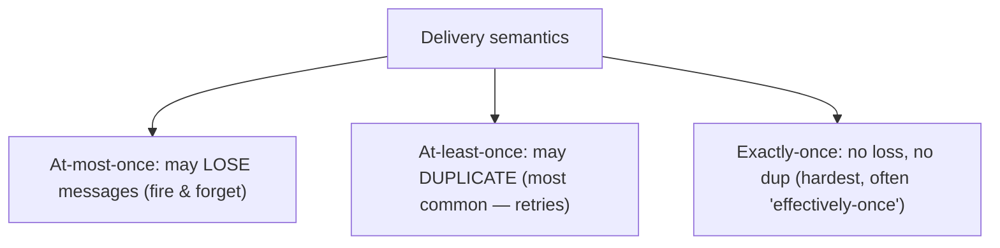

> [!WARNING]
> Distributed messaging almost always gives **at-least-once** delivery — to guarantee no loss, brokers retry, which means **consumers WILL occasionally receive duplicates** (network hiccup, consumer crashes after processing but before acking). Therefore **consumers must be idempotent**: processing the same event twice must have the same effect as once. Techniques: track processed event IDs (dedup table/[[04 Redis]] set), use natural idempotency (`SET status=paid` is idempotent; `balance = balance - 10` is NOT), or upserts. **True exactly-once delivery is essentially impossible** across a network (the "two generals" problem, [[06 Distributed Systems]]); what systems like [[01 Kafka]] offer is **effectively-once** via idempotent producers + transactions within their boundary. The senior mantra: *design for at-least-once, make consumers idempotent.* Forgetting this causes double-charges, duplicate emails, and corrupted counters in production.

### 3.5 The Transactional Outbox Pattern

The **dual-write problem**: you can't atomically (1) write to your database AND (2) publish an event to the broker — if one succeeds and the other fails, you get inconsistency (order saved but no event, or event sent but order not saved).

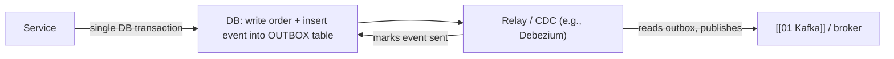

> [!IMPORTANT]
> The **Transactional Outbox** solves the dual-write problem elegantly. Instead of writing to the DB *and* publishing to the broker separately (which can't be atomic), you write the business data **and** insert the event into an **outbox table** in the *same local database transaction* — so they succeed or fail together (real ACID). A separate **message relay** (a poller, or better, **Change Data Capture** like **Debezium** reading the DB transaction log) then reads the outbox and publishes to the broker, marking events as sent. This guarantees "if the state changed, the event *will* be published" (at-least-once), without distributed transactions. It's the standard, battle-tested way to reliably emit events from a service — and a strong senior/staff interview signal. The mirror pattern for consumers is the **inbox** (dedup table) for idempotency (§3.4).

### 3.6 Failure Scenarios & EDA Pitfalls

| Pitfall | Cause | Mitigation |
|---|---|---|
| **Duplicate processing** | At-least-once redelivery | Idempotent consumers (§3.4) |
| **Dual-write inconsistency** | Write DB + publish separately | Transactional outbox (§3.5) |
| **Poison messages** | A message that always fails | Dead Letter Queue (DLQ) + retry limits |
| **Lost ordering** | Parallel consumers / partitions | Partition by key ([[01 Kafka]]), single-partition per entity |
| **Event schema breakage** | Producer changes event shape | Schema registry, versioning, compatibility rules |
| **"Distributed monolith"** | Events used as sync RPC in disguise | Design true async, carried-state events |
| **Cascading replays** | Reprocessing floods consumers | Rate limits, idempotency, careful replay |
| **Hard debugging** | No single call stack across services | Correlation IDs, distributed tracing ([[02 Observability]]) |

> [!WARNING]
> The subtlest failure is the **"distributed monolith"** — teams adopt events but use them as thin, synchronous-in-spirit RPC (Service A emits an event and *expects* Service B to respond with another event it then waits on). This recreates tight coupling and temporal dependency with *added* async complexity — the worst of both worlds. Real EDA means events are **fire-and-forget facts**, consumers are **autonomous**, and no producer waits on a consumer's reaction. Two other must-haves for production: a **Dead Letter Queue** (where messages that repeatedly fail go, so one poison message doesn't block the queue) and **distributed tracing with correlation IDs** — because when a business flow spans 6 services reacting to events, there's no single stack trace; you *need* [[02 Observability]] to follow a request end-to-end.

---

## 4. 🏗️ REAL-WORLD SYSTEM DESIGN USAGE

### 4.1 E-Commerce Order Flow (canonical example)

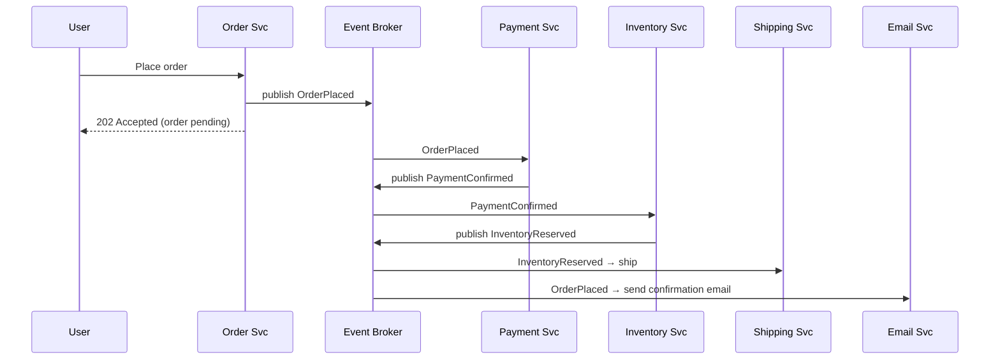

> [!TIP]
> The classic EDA showcase: placing an order returns **immediately** (202 Accepted, "we're processing") — the user isn't blocked while payment, inventory, shipping, and email happen. Each service reacts to events autonomously and emits its own. Want to add fraud detection or loyalty points? Add a consumer to `OrderPlaced` — **zero changes** to the order service. This is EDA's decoupling and extensibility in action. The trade-off users experience: the order is briefly "pending" (eventual consistency) rather than instantly "confirmed."

### 4.2 When to use EDA — and when NOT to

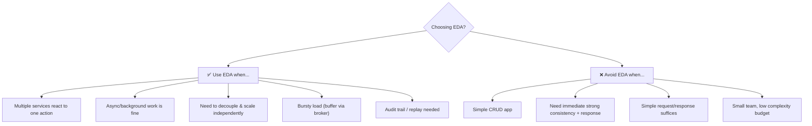

> [!WARNING]
> **EDA is not a default — it's a trade-off.** It shines when multiple consumers react to events, when work can be async, when you need independent scaling/resilience, or need audit/replay. It's *overkill and harmful* for simple CRUD apps or flows needing an immediate, strongly-consistent response — there, synchronous [[02 REST API Design]] is simpler and correct. The failure mode is **accidental complexity**: adopting events, eventual consistency, sagas, and idempotency for a problem that a single database transaction would solve trivially. Mature architects mix both: synchronous calls where consistency/simplicity matter, events where decoupling/scale matter. "Should this be an event or a request?" is a per-interaction decision.

### 4.3 EDA + Microservices + CQRS together

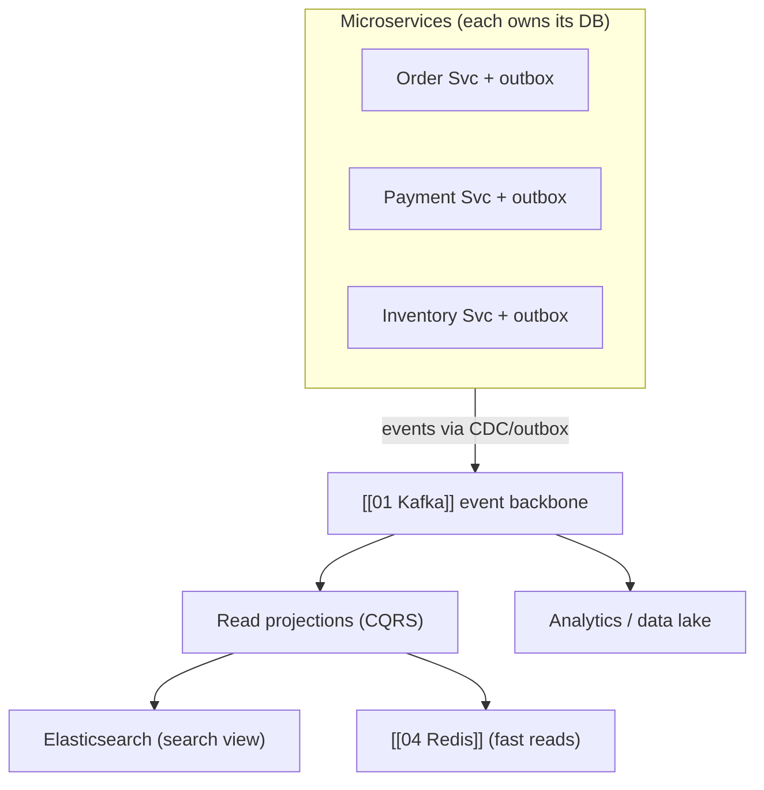

> [!IMPORTANT]
> In a mature microservices platform, EDA is the **integration backbone**. Each service owns its database (no shared DB — the golden rule of [[03 Microservices]]) and communicates changes via events (emitted reliably via the outbox pattern). [[01 Kafka]] serves as the durable event log that everything flows through. **CQRS projections** consume events to build specialized read models — an Elasticsearch index for search, a [[04 Redis]] cache for fast lookups, analytics tables for reporting — each independently updated and scaled. This architecture lets teams deploy services independently, add new capabilities as new consumers, and rebuild read models by replaying events. It's the reference architecture for large-scale systems (Netflix, Uber, etc.) — but every arrow is an eventual-consistency boundary you must design around.

---

## 5. 🎤 INTERVIEW PREPARATION

### 5.1 Most important questions

<details>
<summary><b>Q1: What is Event-Driven Architecture and why use it?</b></summary>

EDA is a paradigm where components communicate by producing and reacting to **events** (facts about things that happened) rather than calling each other directly. A producer publishes an event to a broker and forgets it; consumers react independently and asynchronously. Benefits: **loose coupling** (producers/consumers don't know each other), **scalability** (add consumers freely, buffer bursts), **resilience** (a down consumer doesn't break the producer), and **extensibility** (add reactions without changing producers). Costs: eventual consistency, ordering/duplication challenges, and harder debugging.
</details>

<details>
<summary><b>Q2: Command vs Event?</b></summary>

A **command** is a request to *do* something — imperative, directed at one handler, expresses intent, can be rejected ("PlaceOrder"). An **event** is a notification that something *did* happen — past tense, broadcast to zero-to-many, a fact that can't be rejected ("OrderPlaced"). Commands have one recipient and expect an action; events have many potential consumers and expect nothing. Designing around events (facts) is what enables decoupling.
</details>

<details>
<summary><b>Q3: Explain Event Sourcing. Pros and cons?</b></summary>

Store state as an append-only log of events rather than current state; derive current state by replaying events. **Pros**: complete audit trail, time-travel/temporal queries, reconstruct past state, replay for debugging or new projections, natural fit with EDA. **Cons**: complexity (snapshots for performance, replay logic), event schema evolution, eventual consistency, and a steep mental shift. Best for domains needing auditability/history (finance, compliance); overkill for simple CRUD.
</details>

<details>
<summary><b>Q4: What is CQRS and when would you use it?</b></summary>

Command Query Responsibility Segregation separates the write model (commands, validation, consistency) from the read model (denormalized, query-optimized projections). Use it when reads and writes have very different needs/scales — e.g., complex writes but high-volume varied reads. Often paired with Event Sourcing (events build the read projections) and EDA. Adds complexity and eventual consistency (reads lag writes), so it's justified for complex/high-scale domains, not simple CRUD.
</details>

<details>
<summary><b>Q5: How do you handle transactions across microservices?</b></summary>

You can't use a distributed ACID transaction (2PC is slow/blocking and impractical). Use the **Saga pattern**: a sequence of local transactions, each emitting an event that triggers the next; on failure, run **compensating transactions** to undo prior steps. Two styles: **choreography** (services react to events, decentralized) and **orchestration** (a central coordinator directs steps). Sagas give atomicity via compensation but not isolation — intermediate states are visible, so design for them.
</details>

<details>
<summary><b>Q6: How do you ensure a message isn't lost or double-processed?</b></summary>

Messaging is typically **at-least-once** (retries → possible duplicates). So make **consumers idempotent** (dedup by event ID, use idempotent operations/upserts) to handle duplicates safely. To avoid losing events when saving state, use the **transactional outbox** (write data + event in one DB transaction, relay publishes later). True exactly-once across a network is essentially impossible; aim for at-least-once + idempotency ("effectively-once").
</details>

<details>
<summary><b>Q7: What's the dual-write problem and how does the outbox solve it?</b></summary>

The dual-write problem: you can't atomically write to your DB and publish to a broker — if one succeeds and the other fails, state and events diverge (order saved but no event, or vice versa). The **outbox pattern** writes the business data and the event into an outbox table in the *same DB transaction* (atomic), then a relay (poller or CDC like Debezium reading the DB log) publishes outbox events to the broker. Guarantees events are published iff state changed.
</details>

<details>
<summary><b>Q8: Pub/Sub vs message queue? Kafka vs RabbitMQ?</b></summary>

**Pub/Sub** broadcasts — every subscriber gets a copy (fan-out). **Queue** distributes — each message to one competing consumer (work sharing). **Kafka** is a durable, replayable log (retained events, consumer-tracked offsets, replay, high throughput, does both models via consumer groups) — great for streaming/event sourcing. **RabbitMQ** is a smart broker with rich routing (exchanges), messages usually deleted after consumption — great for task queues and complex routing. Kafka = log/replay; RabbitMQ = broker/routing.
</details>

### 5.2 Tricky questions

> [!TIP]
> **"Does EDA give you consistency?"** — Eventual, not strong. There's a window where services disagree. If you need immediate cross-service consistency, EDA (via sagas) coordinates it but never instantly — and if you truly need ACID across entities, they probably belong in one service/DB.

> [!TIP]
> **"Choreography or orchestration for sagas?"** — Choreography for simple, few-step flows (loose coupling, no central point). Orchestration for complex, many-step flows needing visibility/control (easier to monitor and debug, but the orchestrator is a coupling/failure point). Trade decentralization vs observability.

> [!TIP]
> **"How is exactly-once possible in Kafka if delivery is at-least-once?"** — It's **effectively-once within Kafka's boundary**: idempotent producers (dedupe by sequence number) + transactions (atomic write across partitions + offset commit). End-to-end to an external system, you still need idempotent consumers — Kafka can't make your database write exactly-once.

> [!TIP]
> **"Your events are causing a 'distributed monolith' — what went wrong?"** — Events are being used as synchronous RPC in disguise (producer waits on consumer's response event; services are chained and co-dependent). Fix: make events true fire-and-forget facts with carried state, consumers autonomous, no producer awaiting reactions.

### 5.3 Common mistakes candidates make

| Mistake | Reality |
|---|---|
| "EDA = just using a message queue" | It's a paradigm (events as facts), not a tool |
| Ignoring idempotency | At-least-once → duplicates are guaranteed |
| Dual-write (DB + publish separately) | Use the outbox pattern |
| Naming events as commands | Events are past-tense facts, not "do X" |
| "Exactly-once is easy" | Effectively-once at best; design for duplicates |
| CQRS/Event Sourcing everywhere | Overkill for CRUD; justify the complexity |
| Expecting strong consistency | EDA is eventually consistent by nature |
| No DLQ / no tracing | Poison messages block; flows are unobservable |

### 5.4 What interviewers actually expect

- **Event vs command**, and events as immutable past-tense facts.
- **Decoupling** (temporal/spatial/cognitive) and its trade-off: **eventual consistency**.
- **Sagas** for distributed transactions (choreography vs orchestration, compensation).
- **Idempotency** + at-least-once delivery; **outbox** for the dual-write problem.
- **Event Sourcing** and **CQRS** — what they are, when to use, and that they're *independent*.
- **Pub/sub vs queue**, and [[01 Kafka]] vs [[02 RabbitMQ]] trade-offs.
- Pragmatism: when EDA is *wrong* (simple CRUD, strong-consistency needs).

---

## 6. 🛠️ HANDS-ON PROJECTS

### Project 1: Event-Driven Order System (Beginner→Intermediate)

**Goal:** Build the canonical decoupled order flow.

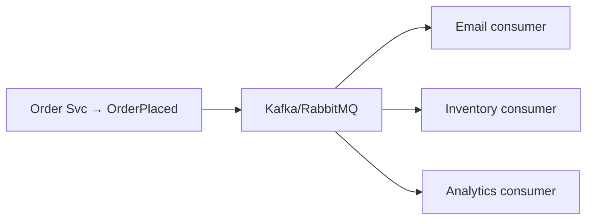

**Steps:**
1. Order service publishes `OrderPlaced` (event-carried state) to [[01 Kafka]] or [[02 RabbitMQ]] and returns 202 immediately.
2. Build three independent consumers (email, inventory, analytics) reacting to it.
3. Add a **fourth** consumer (loyalty points) *without touching* the producer — feel the decoupling.
4. Kill a consumer, keep producing, restart it — watch it catch up (durability).

**Learn:** pub/sub, decoupling, event-carried state, consumer independence, async flow.

---

### Project 2: Saga with Compensation + Idempotency (Intermediate→Senior)

**Goal:** Coordinate a multi-service transaction with rollback.

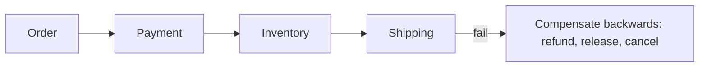

**Steps:**
1. Implement an order saga (order → payment → inventory → shipping) via **choreography** (events trigger each step).
2. Force a failure at shipping; implement **compensating transactions** (release inventory, refund payment, cancel order).
3. Redeliver the same event twice; make consumers **idempotent** (dedup table / [[04 Redis]] set).
4. Re-implement as **orchestration** (a central coordinator + saga state machine); compare debuggability.

**Learn:** sagas, compensation, idempotency, choreography vs orchestration, eventual consistency.

---

### Project 3: Event Sourcing + CQRS + Outbox (Senior)

**Goal:** Build a full event-sourced service with separated reads.

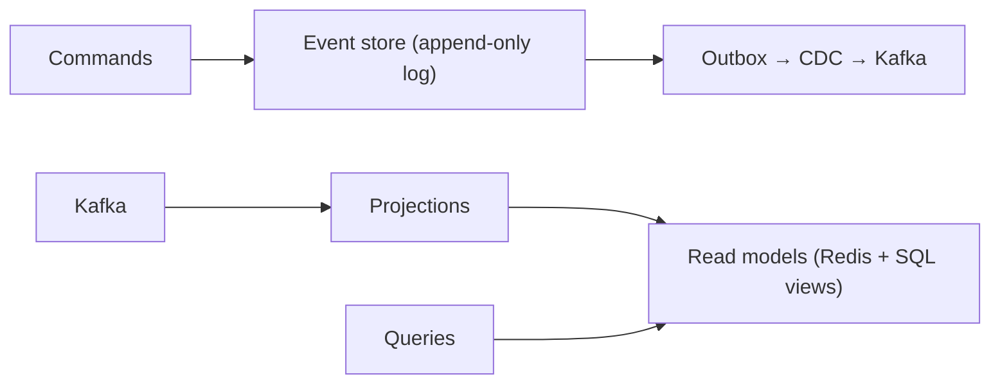

**Steps:**
1. Model an account/ledger as **event-sourced** (append events; replay to get balance).
2. Add **snapshots** to speed up replay.
3. Implement the **transactional outbox** (write event + outbox row in one tx; relay/CDC to [[01 Kafka]]).
4. Build **CQRS projections** into a denormalized read model ([[04 Redis]]/SQL) for fast queries.
5. Demonstrate **temporal queries** (balance at a past time) and rebuilding a projection by replay.

**Learn:** event sourcing, snapshots, outbox/CDC, CQRS projections, replay, temporal queries.

---

## 7. 🔬 DEEP DIVE: INTERNALS

### 7.1 Ordering Guarantees & Partitioning

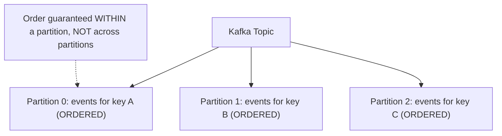

> [!IMPORTANT]
> Event ordering is one of EDA's hardest problems. [[01 Kafka]] guarantees order **only within a partition**, not across a topic. So to keep events for a single entity ordered (all events for `order-123` in sequence), you **partition by a key** (the order ID) — all events with that key land in the same partition and are processed in order. But this creates tension: strict ordering means those events can't be parallelized across consumers (one partition = one consumer in a group), limiting throughput for a hot key. The design lever is **partition key choice**: fine-grained keys (per order) give parallelism but only per-entity ordering; coarse keys give more ordering but less parallelism. Many bugs come from assuming *global* ordering that doesn't exist. When you genuinely need total order, you're often fighting the architecture — reconsider whether per-entity ordering suffices (it usually does).

### 7.2 Schema Evolution & the Contract Problem

```mermaid
flowchart LR
    Producer["Producer v2 (adds field)"] --> Registry["Schema Registry (compatibility check)"]
    Registry -->|"backward compatible?"| OK["✅ old consumers still work"]
    Registry -->|"breaking change"| Reject["❌ rejected / needs new version"]
```

> [!IMPORTANT]
> Events are **contracts** between services that deploy independently — and they *outlive* any single deployment (in [[01 Kafka]], an event may be replayed years later by a new consumer). So **schema evolution** is critical: a producer can't just change an event's shape without breaking consumers. A **Schema Registry** (Avro/Protobuf/JSON Schema) enforces **compatibility rules**: **backward** compatible (new consumers read old events — add optional fields, don't remove/rename), **forward** compatible (old consumers read new events — they ignore unknown fields), or **full**. The golden rules: only add optional fields, never remove or repurpose fields, version events when you must break. This governance is invisible in demos but *essential* in production — an unversioned breaking change to a widely-consumed event can take down a platform. It's the EDA equivalent of API versioning in [[02 REST API Design]].

### 7.3 How the Outbox Relay Works (CDC internals)

```mermaid
flowchart LR
    DB["Database"] -->|"writes go to"| WAL["Write-Ahead Log (WAL/binlog)"]
    WAL --> Debezium["Debezium (CDC) tails the log"]
    Debezium -->|"transforms row changes → events"| Kafka["Kafka"]
    Note["CDC reads the DB's own replication log — no polling, near-real-time, no missed changes"] -.-> Debezium
```

> [!TIP]
> The best outbox relay uses **Change Data Capture (CDC)** rather than polling. Databases write every change to a **write-ahead log** (Postgres WAL, MySQL binlog) for durability and replication ([[02 Postgres]], [[06 Distributed Systems]]). Tools like **Debezium** *tail that log* — reading committed changes in order, near-real-time, with no missed events and no polling load on the database. It transforms row-level changes into events and publishes them to [[01 Kafka]]. This is elegant: you write to your DB normally (including the outbox table), and CDC reliably turns those committed writes into an event stream. It's the same log-shipping mechanism databases use for replication, repurposed for event propagation — a beautiful reuse of the "log as universal primitive" idea central to [[01 Kafka]] and [[06 Distributed Systems]].

### 7.4 Dead Letter Queues & Retry Topology

```mermaid
flowchart LR
    Q["Main queue"] --> C["Consumer"]
    C -->|"fail"| Retry["Retry queue (delay + backoff)"]
    Retry --> C
    C -->|"exceeds max retries"| DLQ["Dead Letter Queue"]
    DLQ --> Human["Alert + manual inspection / replay"]
```

> [!WARNING]
> In production, some messages will **always fail** (malformed data, a bug, a permanently-missing dependency) — a **"poison message."** Without handling, it blocks the queue (retried forever) or gets silently dropped. The solution is a **retry + DLQ topology**: failed messages go to a **retry queue** with exponential backoff (transient failures often self-heal); after N attempts, they move to a **Dead Letter Queue** — a holding area where they're *out of the main flow* but *not lost*, triggering an alert for human inspection and later replay after a fix. Designing the retry/DLQ topology (how many retries, backoff strategy, what's retryable vs immediately-dead-lettered) is a core operational concern. A system without a DLQ *will* eventually stall or lose data on its first poison message.

### 7.5 Consumer Offset Management & Replay

```mermaid
flowchart LR
    Log["Kafka partition log: [0][1][2][3][4][5]..."] --> Consumer["Consumer reads, commits offset"]
    Consumer -->|"committed offset = 3"| Position["Resumes at 4 after restart"]
    Replay["Reset offset to 0 → REPLAY entire history"] -.-> Log
```

> [!IMPORTANT]
> [[01 Kafka]]'s superpower for EDA is that consumers **track their own position (offset)** in a *retained* log — the broker doesn't delete events after delivery (unlike a traditional queue). This unlocks **replay**: reset a consumer's offset to the beginning and it reprocesses all history. Why this matters: you can **add a new consumer** that needs the full past (e.g., a new analytics service, or rebuilding a CQRS projection §3.2), **recover from bugs** by fixing the consumer and replaying, and **reconstruct state** (event sourcing §3.1). The trade-off is *when to commit offsets*: commit *before* processing = at-most-once (crash = lost message); commit *after* processing = at-least-once (crash after processing but before commit = reprocessed = duplicate, hence idempotency §3.4). This offset semantics is exactly where delivery guarantees are *implemented* — the abstract "at-least-once" becomes concrete in *where you commit the offset*.

---

## ✅ Production Checklists

### Event Design
- [ ] Events named as **past-tense facts** (`OrderPlaced`, not `PlaceOrder`)
- [ ] Chosen notification vs carried-state deliberately (lean carried for decoupling)
- [ ] Events versioned; **schema registry** + compatibility rules enforced
- [ ] Event includes a unique **event ID** and **correlation ID**
- [ ] Payloads documented as contracts; only additive changes

### Reliability
- [ ] Consumers **idempotent** (dedup by event ID)
- [ ] **Transactional outbox** (or CDC) for reliable publishing (no dual-write)
- [ ] **Dead Letter Queue** + retry/backoff for poison messages
- [ ] Delivery semantics understood (at-least-once + idempotency)
- [ ] Ordering handled via partition keys where needed

### Operations
- [ ] **Distributed tracing** + correlation IDs across services ([[02 Observability]])
- [ ] Consumer lag monitored (are consumers keeping up?)
- [ ] Replay strategy tested (offset reset, projection rebuild)
- [ ] Eventual-consistency windows surfaced in UX (pending states)
- [ ] Broker HA/durability configured (replication, acks) ([[01 Kafka]])

---

## 🗺️ Learning Roadmap

```mermaid
flowchart TB
    A["1️⃣ Events vs commands<br/>facts, pub/sub, decoupling"] --> B["2️⃣ Communication patterns<br/>notification vs carried state"]
    B --> C["3️⃣ Delivery & consistency<br/>at-least-once, idempotency, eventual"]
    C --> D["4️⃣ Reliability patterns<br/>outbox, DLQ, retries"]
    D --> E["5️⃣ Distributed transactions<br/>Sagas (choreography/orchestration)"]
    E --> F["6️⃣ Event Sourcing + CQRS<br/>event log, projections, replay"]
    F --> G["7️⃣ Internals<br/>ordering, schema evolution, CDC, offsets"]
    G --> H["8️⃣ Full platform<br/>EDA + microservices + streaming at scale"]
```

| Stage | Focus | You can... |
|---|---|---|
| 1–3 | Foundations | Design decoupled event flows correctly |
| 4–5 | Reliability + Sagas | Handle failures & distributed transactions |
| 6 | ES + CQRS | Build advanced event-sourced systems |
| 7–8 | Internals + scale | Architect production EDA platforms |

---

## 🔁 Self-Review Completion Loop

Reviewed against Fowler's EDA writings, Chris Richardson's *Microservices Patterns*, Kafka/Confluent docs, and the SEDA/enterprise integration literature.

### Gap Review Matrix

| Dimension | Covered? | Where |
|---|---|---|
| Event definition (fact) | ✅ | §1 |
| Command vs event | ✅ | §1 |
| Request- vs event-driven | ✅ | §1 |
| Producers/consumers/broker | ✅ | §1 |
| Notification vs carried state | ✅ | §2.1 |
| Fowler's 4 patterns | ✅ | §2.2 |
| Pub/sub vs queue | ✅ | §2.3 |
| Broker choices | ✅ | §2.4 |
| Eventual consistency | ✅ | §2.5 |
| Event Sourcing | ✅ | §3.1 |
| CQRS | ✅ | §3.2 |
| Saga pattern | ✅ | §3.3 |
| Idempotency & delivery | ✅ | §3.4 |
| Transactional outbox | ✅ | §3.5 |
| EDA pitfalls | ✅ | §3.6 |
| Order flow example | ✅ | §4.1 |
| When (not) to use EDA | ✅ | §4.2 |
| EDA + microservices + CQRS | ✅ | §4.3 |
| Ordering & partitioning | ✅ | §7.1 |
| Schema evolution | ✅ | §7.2 |
| CDC internals | ✅ | §7.3 |
| DLQ & retries | ✅ | §7.4 |
| Offsets & replay | ✅ | §7.5 |
| Interview Q&A + mistakes | ✅ | §5 |
| Hands-on projects | ✅ | §6 |

> [!NOTE]
> **Remaining depth to explore independently:** Event Streaming vs Event Sourcing distinction, stream processing (Kafka Streams / Flink — stateful processing, windowing, joins), the Enterprise Integration Patterns catalog (Hohpe/Woolf), event storming (domain discovery), event mesh / EDA at global scale, exactly-once semantics deep-dive (Kafka transactions internals), backpressure across event pipelines, event-driven + serverless (AWS EventBridge/Lambda), and the interplay of EDA with Domain-Driven Design (bounded contexts, domain events).

---

## 📚 Official References

| Resource | Source |
|---|---|
| Martin Fowler — "What do you mean by Event-Driven?" | https://martinfowler.com/articles/201701-event-driven.html |
| Martin Fowler — Event Sourcing / CQRS | https://martinfowler.com/eaaDev/EventSourcing.html |
| Chris Richardson — Microservices Patterns (Saga, Outbox, CQRS) | https://microservices.io/patterns/ |
| Confluent — Event-Driven Architecture | https://developer.confluent.io/ |
| Enterprise Integration Patterns — Hohpe & Woolf | https://www.enterpriseintegrationpatterns.com/ |
| Debezium (CDC / outbox) | https://debezium.io/documentation/ |
| *Designing Data-Intensive Applications* — Kleppmann | Ch. 11 (Stream Processing) |

---

## 🎁 Final Summary

> [!IMPORTANT]
> **The one-paragraph takeaway:** Event-Driven Architecture flips communication from *"call and wait"* to *"announce and react"* — components emit **events** (immutable, past-tense **facts** like `OrderPlaced`) to a broker and move on, while any number of consumers react independently and asynchronously, never known to the producer. This buys **loose coupling** (temporal, spatial, cognitive), **independent scaling**, **resilience** (a down consumer doesn't break producers), and **extensibility** (new reactions = new consumers, no producer change) — at the cost of **eventual consistency**, ordering/duplication challenges, and harder debugging. Master the reliability trinity: messaging is **at-least-once**, so **make consumers idempotent** (design for duplicates — true exactly-once is effectively-once at best); reliably emit events with the **transactional outbox** (write data + event in one DB transaction, then a **CDC** relay like Debezium publishes) to defeat the dual-write problem; and handle poison messages with **DLQ + retries**. For consistency across services (no distributed ACID possible), use **Sagas** — sequences of local transactions with **compensating actions**, via **choreography** (decentralized, event-reactive) or **orchestration** (central coordinator, observable). Layer in **Event Sourcing** (store the event log as source of truth, replay for state/audit/time-travel) and **CQRS** (separate write model from denormalized read projections) *when the domain justifies it* — they're independent choices, not a mandatory bundle, and overkill for simple CRUD. Under the hood it all rests on the **log** ([[01 Kafka]]): ordering-within-partition (partition by entity key), retained events enabling **replay** (offsets = where delivery guarantees live), and **schema evolution** governed by a registry since events are long-lived contracts. EDA is not a default — it's a deliberate trade of simplicity for decoupling and scale, and the mark of maturity is knowing when a synchronous [[02 REST API Design]] call is the better answer.

**Golden rules:**
1. 📢 Events are **past-tense facts** (`OrderPlaced`), not commands (`PlaceOrder`).
2. 🔗 EDA trades **strong consistency for decoupling + scale** — embrace eventual consistency.
3. 🔁 Delivery is **at-least-once** → **make consumers idempotent** (dedup by event ID).
4. 📦 Use the **transactional outbox** (+ CDC) to defeat the dual-write problem.
5. 🪦 Add **DLQs + retries** — one poison message must not stall the system.
6. 🔀 **Sagas** do distributed transactions via compensation (choreography vs orchestration).
7. 🗄️ **Event Sourcing** = events as source of truth (audit, replay, time-travel).
8. ✂️ **CQRS** separates reads from writes — and it's *independent* of Event Sourcing.
9. 📐 Events are **long-lived contracts** — version them; only additive changes.
10. ⚖️ EDA is a trade-off, **not a default** — synchronous is right for simple/strongly-consistent flows.

---

*Related guides in this vault: [[01 Kafka]] · [[02 RabbitMQ]] · [[06 Distributed Systems]] · [[03 Microservices]] · [[01 System Design Fundamentals]] · [[02 REST API Design]] · [[04 Redis]] · [[02 Observability]] · [[07 Shim and Orchestrator Services in Microservices and Monolithic Services]]*
