# 🌐 Distributed Systems — Complete Beginner-to-Expert Reference

> Consensus, replication, and partitioning theory — the hard computer science behind every system that runs on more than one machine and can't afford to lose data or go down.

---

## 📑 Table of Contents

1. [Executive Summary](#-executive-summary)
2. [Fundamentals (Beginner)](#1--fundamentals-beginner-level)
3. [Core Concepts (Intermediate)](#2--core-concepts-intermediate-level)
4. [Advanced Concepts (Senior)](#3--advanced-concepts-senior-level)
5. [Real-World System Design](#4--real-world-system-design-usage)
6. [Interview Preparation](#5--interview-preparation)
7. [Hands-On Projects](#6--hands-on-projects)
8. [Deep Dive: Internals](#7--deep-dive-internals)
9. [Production Checklists](#-production-checklists)
10. [Learning Roadmap](#-learning-roadmap)
11. [Self-Review Completion Loop](#-self-review-completion-loop)
12. [Official References](#-official-references)
13. [Final Summary](#-final-summary)

---

## 🎯 Executive Summary

A **distributed system** is a collection of independent computers that appears to users as a single coherent system. The discipline is about making many unreliable machines, connected by an unreliable network, behave reliably together. Its three deepest problems are **consensus** (getting nodes to agree), **replication** (keeping copies consistent), and **partitioning** (splitting data across nodes) — all governed by hard theoretical limits (CAP, FLP).

| What it is | What it replaces | Core superpower |
|---|---|---|
| Many machines acting as one system | Single-server limits & single points of failure | **Fault tolerance + scale** despite unreliable nodes and networks |

> [!IMPORTANT]
> Distributed systems exist because a single machine has hard limits (capacity + it's a single point of failure), but coordinating many machines introduces problems that **don't exist** on one machine: partial failures, network partitions, message loss/reordering, no shared clock, and the impossibility of *knowing* whether a remote node is dead or just slow. This is the **theory layer beneath everything in your vault** — [[01 Kafka]]'s replication, [[02 Kubernetes]]'s etcd, [[02 Postgres]]'s replicas, [[04 Redis]]'s cluster, [[03 MongoDB]]'s sharding all implement these ideas. [[01 System Design Fundamentals]] applies them; this guide explains *why* they work.

Related guides: [[01 System Design Fundamentals]] · [[01 Kafka]] · [[02 Kubernetes]] · [[02 Postgres]] · [[03 MongoDB]] · [[04 Redis]] · [[03 Microservices]] · [[Cassandra]]

---

## 1. 🌱 FUNDAMENTALS (Beginner Level)

### What is a distributed system in simple terms?

On **one computer**, things are simple: memory is shared, there's one clock, and if a function is called it either runs or the whole program crashes — no in-between. A **distributed system** spreads work across **many computers talking over a network**, and suddenly nothing is simple: a message might arrive, arrive twice, arrive late, or never arrive; a machine might be dead — or just slow, and *you can't tell the difference*; and there's no single "now" everyone agrees on.

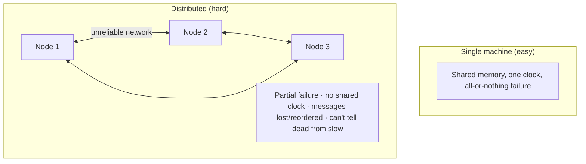

### Why do distributed systems exist?

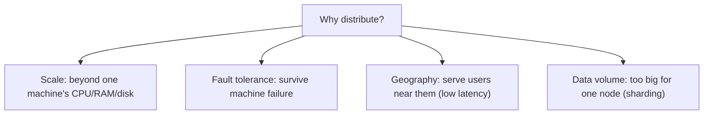

A single server can't handle Google-scale traffic, and if it dies, everything dies. Distributing gives **scale** (many machines' combined power) and **fault tolerance** (survive individual failures) — but at the cost of enormous **coordination complexity**.

### The 8 Fallacies of Distributed Computing

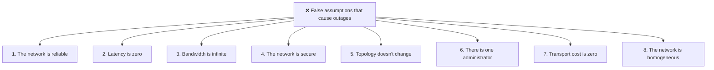

> [!IMPORTANT]
> The **8 Fallacies** (Peter Deutsch, Sun) are the classic list of wrong assumptions that sink distributed systems. Every one is *false*, yet developers instinctively assume them. **"The network is reliable"** is the deadliest — networks *will* partition, drop, delay, and reorder packets. Designing as if the network is reliable produces systems that work in testing and fail catastrophically in production. Internalizing that **the network is a hostile, unreliable medium** is the mental shift that separates distributed-systems engineers from everyone else.

### The Core Problems

| Problem | Description | Where you'll see it |
|---|---|---|
| **Partial failure** | Some nodes fail while others run | Everywhere |
| **Consensus** | Getting nodes to agree on a value | [[01 Kafka]], [[02 Kubernetes]] etcd, ZooKeeper |
| **Replication** | Keeping data copies in sync | [[02 Postgres]] replicas, [[04 Redis]], [[01 Kafka]] |
| **Partitioning** | Splitting data across nodes | [[03 MongoDB]] shards, [[Cassandra]], DynamoDB |
| **Consistency** | Ensuring reads see correct data | Every database |
| **Time & ordering** | No shared clock; what happened first? | Logs, versioning, conflicts |

### The two hardest facts

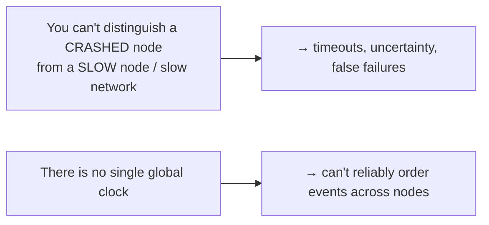

> [!TIP]
> Two truths make distributed systems fundamentally hard, and everything else follows from them: **(1) you cannot tell a dead node from a slow one** — a lack of response could mean the node crashed, or it's alive but the network is slow, so all failure detection is *guessing* via timeouts; and **(2) there is no shared clock** — machine clocks drift, so "which event happened first?" has no trivial answer across nodes. Consensus, replication, and consistency mechanisms all exist to cope with these two facts.

### Real-world analogy 🎖️

The classic analogy is the **Two Generals Problem**: two armies on opposite hills must attack *simultaneously* to win, coordinating only via messengers who cross enemy territory (the unreliable network) and may be captured (lost messages). General A sends "attack at dawn." Did it arrive? A needs an acknowledgment. But did the *ack* arrive? B needs an ack of the ack... **This never terminates** — you can never achieve *certain* agreement over an unreliable channel. It proves that guaranteed consensus over a lossy network is *impossible*; real systems settle for "good enough" with high probability.

> [!TIP]
> The mental model: **distributed systems are about managing uncertainty, not eliminating it.** You can never be *certain* a message arrived, a node is alive, or two nodes agree — you can only make it *overwhelmingly likely* through acknowledgments, retries, quorums, and consensus protocols. Comfort with "we can't know for sure, but we can bound the risk" is the mindset. Perfect certainty is provably impossible (Two Generals, FLP §3.1).

---

## 2. 🧩 CORE CONCEPTS (Intermediate Level)

### 2.1 Replication — Keeping Copies

Replication = storing the same data on multiple nodes for **fault tolerance** (survive node loss) and **read scaling** (serve reads from many copies).

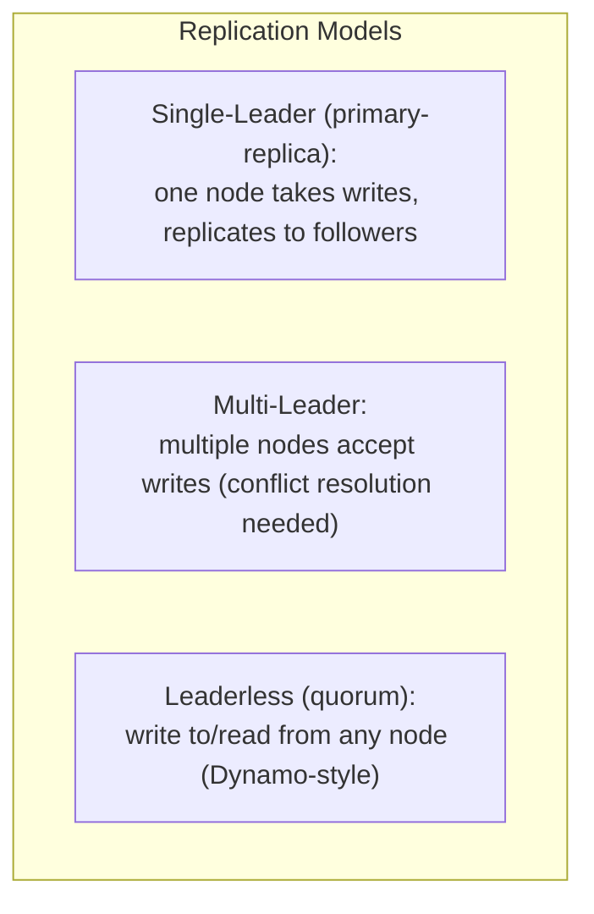

| Model | Writes | Pros | Cons | Examples |
|---|---|---|---|---|
| **Single-Leader** | One leader | Simple, no write conflicts | Leader is a bottleneck/SPOF | [[02 Postgres]], [[03 MongoDB]], [[04 Redis]], [[01 Kafka]] (per partition) |
| **Multi-Leader** | Several leaders | Write anywhere, geo-local writes | **Conflicts** to resolve | Multi-DC databases, CRDTs |
| **Leaderless** | Any node (quorum) | High availability | Complex, tunable consistency | [[Cassandra]], DynamoDB |

> [!IMPORTANT]
> **Single-leader replication is the most common** (and simplest): all writes go to the leader, which streams changes to followers; reads can be served by followers (scaling reads). The catch is **replication lag** — followers are slightly behind, so a follower read may not reflect a just-written value ([[01 System Design Fundamentals]] "read-your-writes" problem). **Multi-leader** and **leaderless** trade this simplicity for higher write availability but introduce **conflicts** (two nodes write the same key concurrently) that must be resolved. The model choice is one of the deepest architectural decisions in any distributed data system.

### 2.2 Synchronous vs Asynchronous Replication

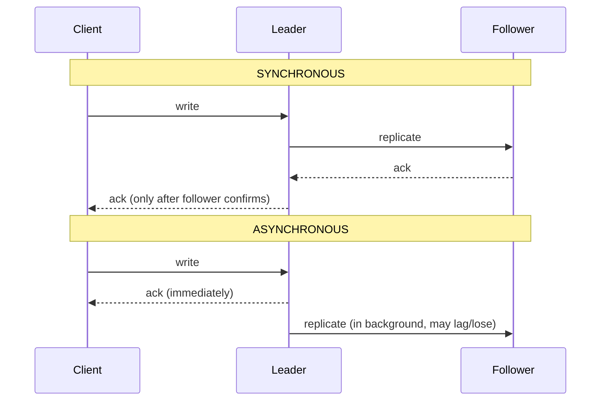

> [!WARNING]
> This is a fundamental durability trade-off. **Synchronous** replication guarantees the follower has the data before acking the client (no data loss on leader failure) — but it's **slower** (wait for the follower) and **less available** (if the follower is down, writes block). **Asynchronous** is fast and available but risks **data loss**: if the leader crashes after acking but before replicating, that write is *gone* (see [[04 Redis]], [[01 Kafka]] async replication). Most systems use a middle ground — **semi-synchronous** (at least one synchronous follower) — or make it tunable. There is no free lunch: durability, latency, and availability trade against each other.

### 2.3 Partitioning (Sharding) — Splitting Data

When data exceeds one node's capacity, **partition** it across nodes (horizontal scaling).

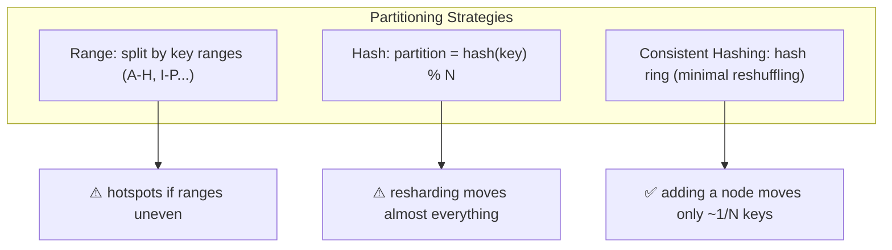

| Strategy | How | Trade-off |
|---|---|---|
| **Range** | Contiguous key ranges | Efficient range scans; **hotspots** |
| **Hash** | `hash(key) % N` | Even spread; range scans impossible; resharding pain |
| **Consistent hashing** | Keys + nodes on a ring | Minimal movement when nodes change |

> [!IMPORTANT]
> Partitioning enables scale beyond one machine, but creates hard problems: **cross-partition queries/joins** become expensive or impossible, **transactions across partitions** are complex (§3.5), and a bad **partition key** causes **hotspots** (one shard overloaded). **Consistent hashing** (§7.1) is the key innovation — naive `hash % N` remaps *almost every key* when you add/remove a node (catastrophic for a cache or DB), while consistent hashing moves only ~1/N of keys. This is why [[Cassandra]], DynamoDB, and distributed [[04 Redis]] use it. Partitioning + replication combine: each partition is also replicated for fault tolerance.

### 2.4 Consistency Models

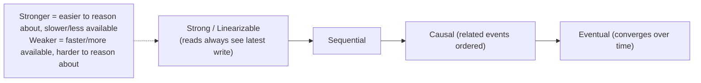

| Model | Guarantee | Cost |
|---|---|---|
| **Linearizable (strong)** | Every read sees the most recent write; system appears as one copy | Slowest, coordination-heavy |
| **Sequential** | All nodes see operations in the same order | Strong but weaker than linearizable |
| **Causal** | Causally-related events are ordered (effect after cause) | Good balance |
| **Read-your-writes** | You always see your own updates | Session-level |
| **Eventual** | All replicas converge *eventually* if writes stop | Fastest, most available |

> [!TIP]
> **Consistency is a spectrum, not a binary.** **Linearizability** (strongest) makes a distributed system behave like a single machine — every operation appears instantaneous and globally ordered — but requires expensive coordination (consensus on every operation). **Eventual consistency** (weakest useful) just promises replicas converge *if writes stop*, giving high availability and low latency but allowing stale/conflicting reads. Most real systems pick a point in between *per operation*: strong for a bank balance, eventual for a like count. Understanding this spectrum — and that stronger consistency costs latency/availability — is the crux of distributed data design ([[01 System Design Fundamentals]] CAP/PACELC).

### 2.5 Quorums

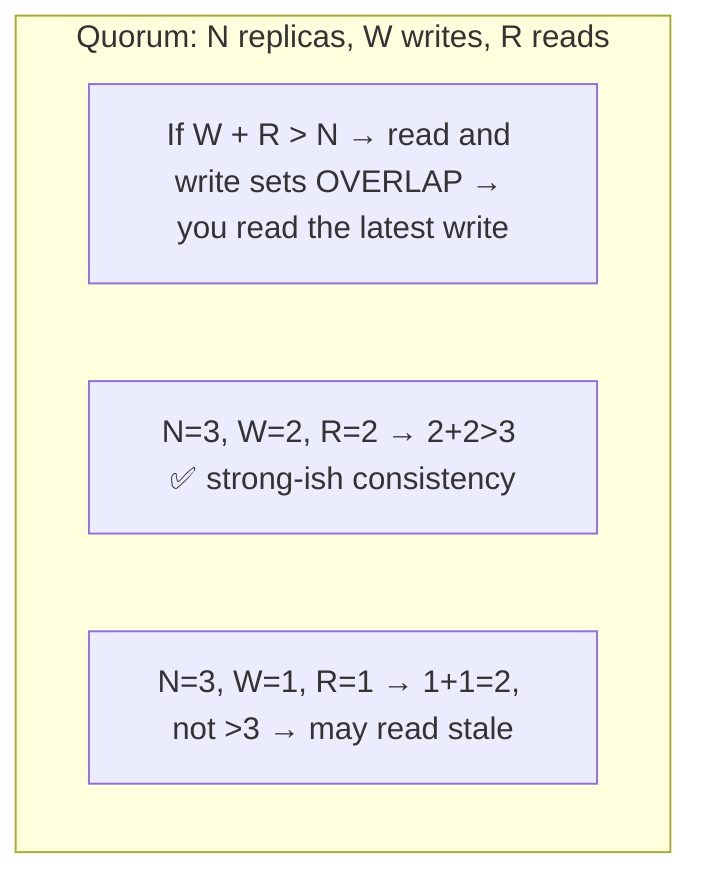

> [!IMPORTANT]
> **Quorums** are how leaderless systems ([[Cassandra]], DynamoDB) tune consistency vs availability. With **N** replicas, require **W** nodes to ack a write and **R** nodes to respond to a read. The magic rule: **if W + R > N, the read and write sets are guaranteed to overlap** — so at least one node in your read set has the latest write → strong-ish consistency. Tune the knobs: `W=N, R=1` (fast reads, slow writes), `W=1, R=N` (fast writes, slow reads), or `W=R=quorum` (balanced). Lower W+R = faster and more available but may read stale data. This tunability is why "eventually consistent" databases can *also* offer strong consistency per query.

### 2.6 Time, Clocks & Ordering

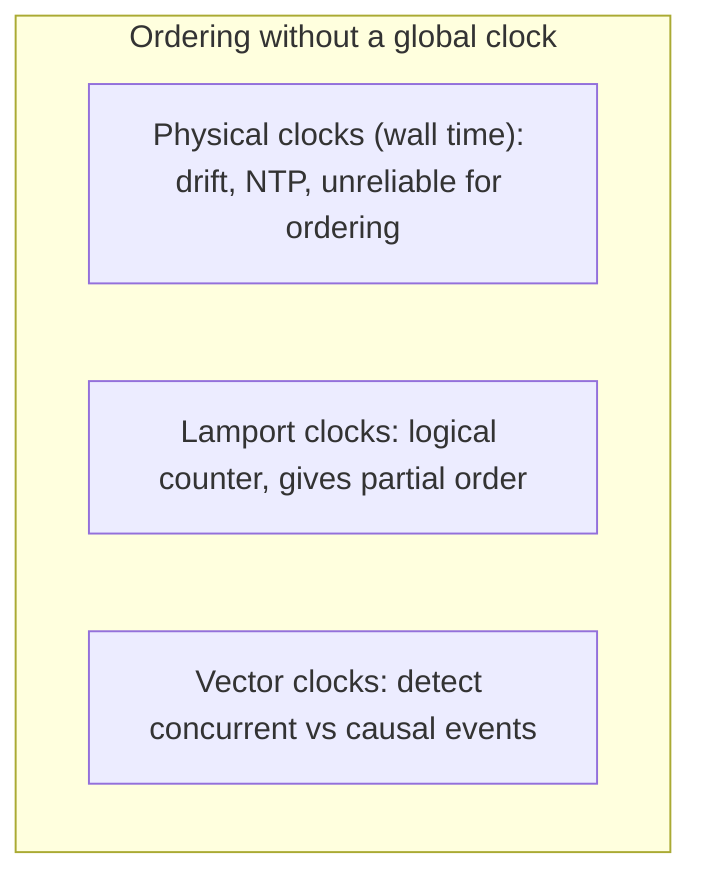

> [!WARNING]
> **Never trust wall-clock time to order events across machines.** Physical clocks drift (even with NTP, they can be off by milliseconds — or leap backward), so "event A's timestamp < event B's timestamp" does *not* reliably mean A happened first. **Logical clocks** solve this: a **Lamport clock** is a simple counter that establishes a *partial* ordering ("if A caused B, then A's clock < B's"). **Vector clocks** go further, detecting whether two events were **causally related or truly concurrent** (needed for conflict detection in [[Cassandra]]/Dynamo). Google's **TrueTime** (Spanner) uses atomic clocks + GPS to bound uncertainty and achieve global ordering — an expensive, rare exception. The "last write wins" strategy based on wall clocks silently loses data when clocks disagree.

---

## 3. ⚙️ ADVANCED CONCEPTS (Senior Level)

### 3.1 The Impossibility Results (CAP & FLP)

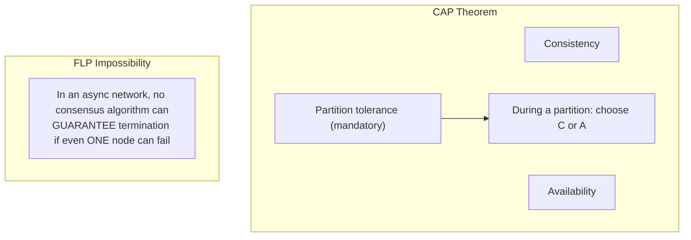

> [!IMPORTANT]
> Two theorems bound what's possible. **CAP** ([[01 System Design Fundamentals]] §3.1): during a **network partition**, you must choose **Consistency** (reject requests to avoid stale data) or **Availability** (serve, possibly stale) — you can't have both, and partition tolerance is non-negotiable (networks fail). **FLP** (Fischer-Lynch-Paterson) is deeper and more theoretical: in a purely **asynchronous** network, **no consensus algorithm can guarantee it will terminate** if even one node might crash — because you can't distinguish a crashed node from a slow one. Real consensus protocols (Raft, Paxos) sidestep FLP by using **timeouts** (partial synchrony) — they're *safe* always but only *live* when the network behaves. These aren't academic trivia: they explain *why* every distributed system makes the trade-offs it does.

### 3.2 Consensus — Getting Nodes to Agree

**Consensus**: multiple nodes agree on a single value (or an ordered log of values), even with failures. It's *the* fundamental building block — leader election, distributed locks, config, and replicated state machines all reduce to consensus.

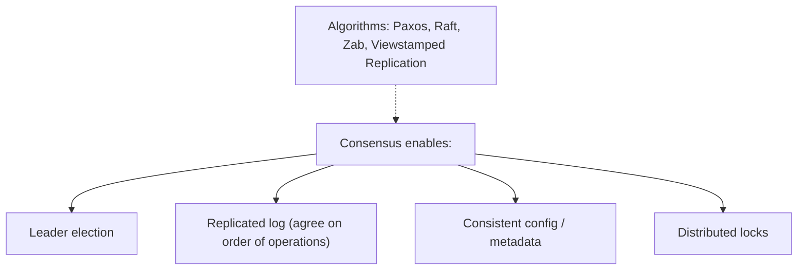

**Requirements of a correct consensus protocol:**
- **Agreement**: all non-faulty nodes decide the same value.
- **Validity**: the decided value was proposed by some node.
- **Termination**: all non-faulty nodes eventually decide (the part FLP threatens).

### 3.3 Raft (the understandable consensus algorithm)

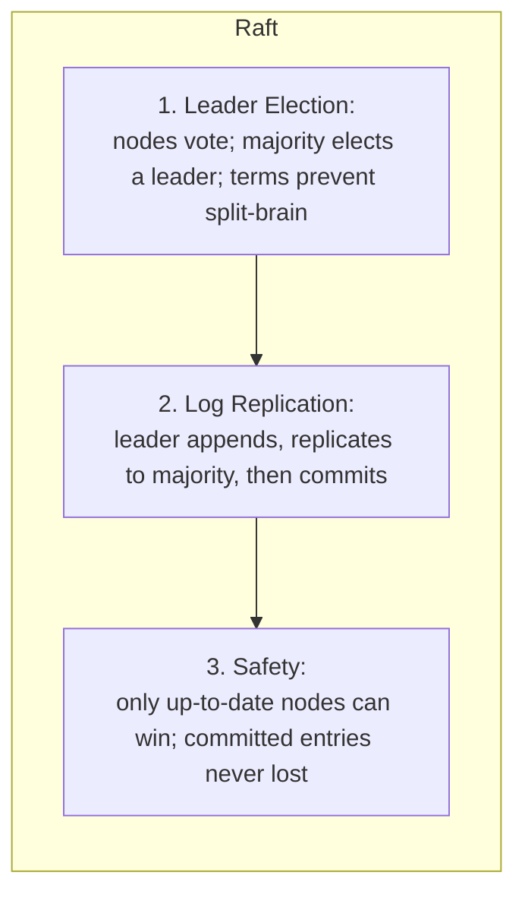

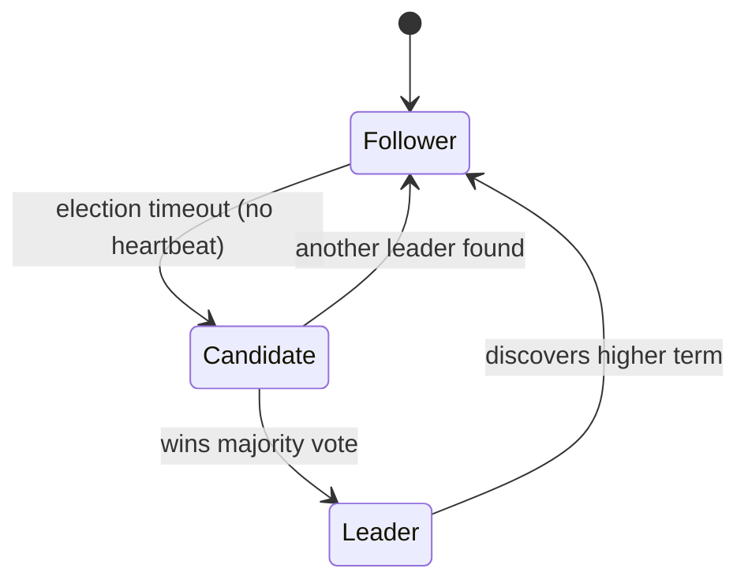

> [!IMPORTANT]
> **Raft** (2014) was designed to be *understandable* (unlike Paxos, notoriously hard). It works in three parts: **(1) Leader election** — nodes are followers; if a follower hears no heartbeat, it becomes a candidate and requests votes; a **majority** elects a leader. **Terms** (monotonic epoch numbers) prevent two leaders. **(2) Log replication** — clients send commands to the leader, which appends them to its log, replicates to followers, and **commits** once a **majority** has stored the entry. **(3) Safety** — only a node with an up-to-date log can be elected, guaranteeing committed entries survive. Raft powers **etcd ([[02 Kubernetes]])**, **Consul**, **[[01 Kafka]] KRaft**, and CockroachDB. Its "majority quorum" is why these need an **odd number of nodes (3, 5)** — a majority must agree, and only one partition side can hold a majority (no split-brain).

### 3.4 Why Majority Quorums Prevent Split-Brain

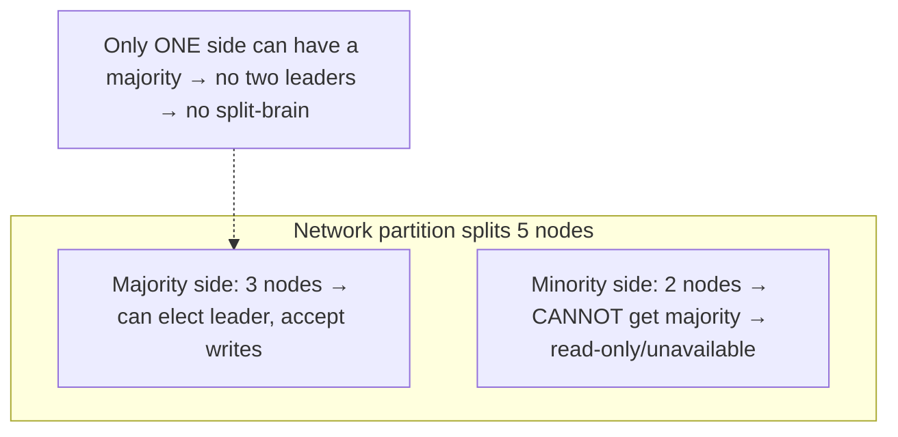

> [!IMPORTANT]
> **Split-brain** — two nodes both believing they're the leader and diverging — is a catastrophic distributed-systems failure (conflicting writes, data corruption). **Majority quorums prevent it mathematically**: a leader must be elected by *more than half* the nodes, and in any partition, only **one side can contain a majority** (5 nodes split 3-2: only the 3-side can elect). The minority side becomes read-only/unavailable rather than accepting conflicting writes. This is *why* consensus systems use odd node counts and why **RabbitMQ's `pause_minority`, [[01 Kafka]] ISR, and [[03 MongoDB]] replica-set elections** all rely on majorities. Fewer than a majority = you must sacrifice availability to preserve consistency (CAP made concrete).

### 3.5 Distributed Transactions & Two-Phase Commit

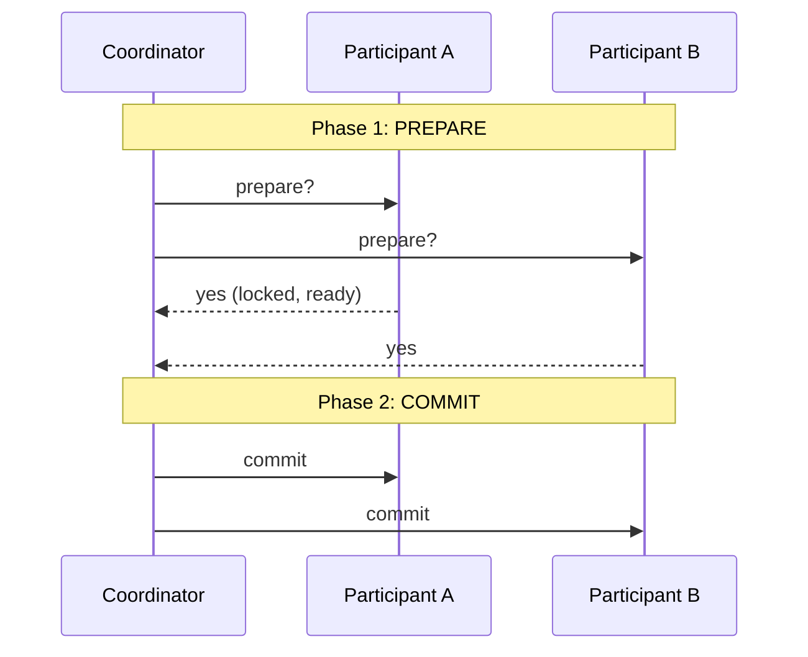

> [!WARNING]
> **Two-Phase Commit (2PC)** coordinates a transaction across multiple nodes: a **coordinator** asks all participants to **prepare** (lock resources, vote yes/no); if all vote yes, it tells them to **commit**, else **abort** — giving atomicity across nodes. But 2PC has a fatal flaw: it's a **blocking protocol** — if the **coordinator crashes** after participants prepared, they're stuck holding locks *indefinitely*, unable to commit or abort. This makes 2PC fragile and slow, which is why modern [[03 Microservices]] avoid it in favor of the **Saga pattern** (a sequence of local transactions with compensating actions — see [[03 Microservices]]) — trading atomicity for availability. "Don't do distributed transactions if you can avoid them" is hard-won wisdom.

### 3.6 Conflict Resolution (multi-leader/leaderless)

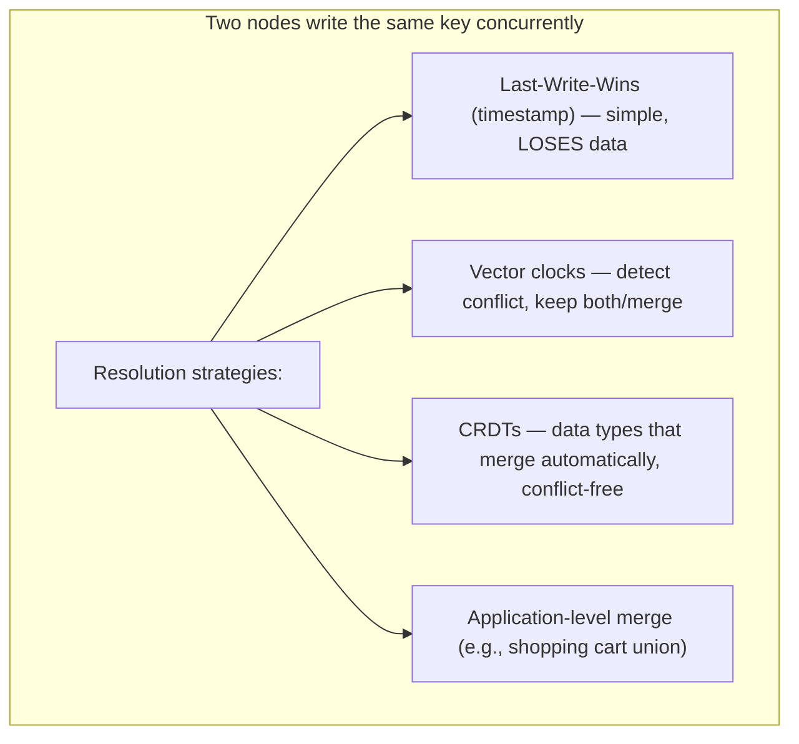

> [!TIP]
> When multiple nodes accept writes (multi-leader/leaderless), **concurrent writes to the same key conflict**. **Last-Write-Wins** (pick the higher timestamp) is simple but **silently discards data** and depends on unreliable clocks (§2.6). **Vector clocks** detect *whether* writes truly conflicted (vs one causally followed the other), letting you keep both versions ("siblings") for resolution. **CRDTs (Conflict-free Replicated Data Types)** are the elegant solution — data structures (counters, sets, maps) with merge operations mathematically guaranteed to converge regardless of order, no coordination needed (used in Riak, Redis, collaborative editors like Figma). Choosing conflict resolution is unavoidable in any available, geo-distributed write system.

### 3.7 Failure Scenarios & Patterns

| Failure | Mechanism to handle it |
|---|---|
| **Node crash** | Replication + failover (elect new leader) |
| **Network partition** | Quorum (majority proceeds, minority pauses) |
| **Split-brain** | Majority quorum / fencing tokens |
| **Message loss/duplication** | Retries + **idempotency** ([[01 System Design Fundamentals]]) |
| **Slow node (can't tell if dead)** | Timeouts + heartbeats (phi-accrual detectors) |
| **Clock skew** | Logical/vector clocks, not wall time |
| **Cascading failure** | Circuit breakers, backpressure, bulkheads |
| **Data corruption** | Checksums, Merkle trees (anti-entropy) |
| **Stale reads** | Quorum reads, read-your-writes routing |

> [!WARNING]
> **Fencing tokens** solve a subtle but deadly problem: a node acquires a distributed lock, then **pauses** (GC, network hiccup) past the lock's expiry; the lock is granted to another node; the first node **wakes up thinking it still holds the lock** — now two nodes act as the holder ([[04 Redis]] distributed-lock pitfall). The fix: the lock service issues a **monotonically increasing fencing token** with each grant; downstream resources **reject any operation with a stale (lower) token**. This turns "I think I hold the lock" into a verifiable, ordered claim. It's a canonical example of why distributed locking is far harder than it looks.

---

## 4. 🏗️ REAL-WORLD SYSTEM DESIGN USAGE

### 4.1 Where the Theory Lives in Your Vault

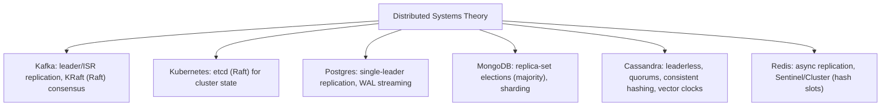

> [!IMPORTANT]
> Every data system in your vault is a distributed-systems textbook made real: **[[01 Kafka]]** replicates partitions via leader+ISR and uses **Raft (KRaft)** for metadata consensus. **[[02 Kubernetes]]** stores all state in **etcd**, a **Raft**-based store. **[[02 Postgres]]** does single-leader WAL replication. **[[03 MongoDB]]** replica sets hold **majority elections**. **[[Cassandra]]** is fully leaderless with tunable **quorums**, **consistent hashing**, and vector-clock-style conflict handling. **[[04 Redis]]** Cluster shards by hash slots with async replication + Sentinel failover. When you understand consensus, replication, and partitioning *theory*, these systems stop being magic — you can predict their failure modes and tuning knobs.

### 4.2 Famous Distributed Systems & Their Ideas

| System | Key contribution |
|---|---|
| **Google Spanner** | Globally-distributed strong consistency via **TrueTime** (atomic clocks) |
| **Amazon Dynamo** (paper) | Leaderless, consistent hashing, vector clocks, eventual consistency (→ DynamoDB, [[Cassandra]]) |
| **Google Bigtable** | Wide-column, range partitioning (→ HBase) |
| **etcd / ZooKeeper** | Consensus (Raft/Zab) for coordination/config |
| **CockroachDB / TiDB** | Distributed SQL with Raft-per-range |
| **Cassandra** | Dynamo + Bigtable ideas: AP, tunable consistency |

### 4.3 The Replicated State Machine Pattern

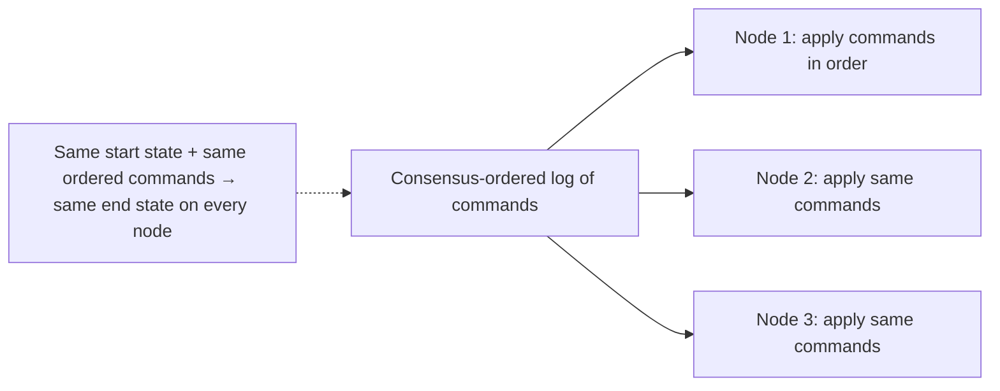

> [!IMPORTANT]
> The **Replicated State Machine (RSM)** is the master pattern behind fault-tolerant systems. The idea: if every node starts in the same state and applies the **same commands in the same order**, they all reach the **same state** — so you get identical, fault-tolerant replicas. The hard part reduces to **agreeing on the order of commands**, which is *exactly* what consensus (Raft/Paxos) provides via a **replicated log**. This is how etcd, [[01 Kafka]], CockroachDB, and databases achieve consistency: consensus orders the log, and every replica deterministically applies it. It's the elegant unifying idea — "distributed consistency = agree on an ordered log, then replay it everywhere."

### 4.4 Anti-Entropy & Gossip

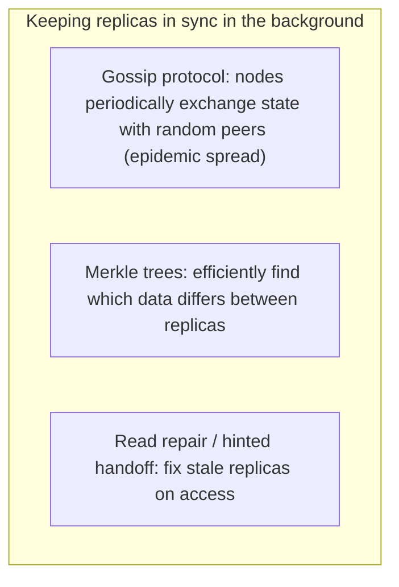

> [!TIP]
> Leaderless systems ([[Cassandra]], Dynamo) can't rely on a leader to keep replicas in sync, so they use **anti-entropy** background mechanisms: **gossip protocols** spread membership/state info epidemically (each node tells a few random peers, who tell more — info spreads exponentially, robustly, with no central coordinator — this is how nodes discover cluster topology). **Merkle trees** let two replicas compare a hash tree to pinpoint *exactly* which data ranges differ without transferring everything. **Read repair** (fix stale replicas when a read reveals disagreement) and **hinted handoff** (a live node temporarily stores writes for a down node) fill gaps. These decentralized, self-healing techniques are how AP systems stay converged without consensus on every write.

---

## 5. 🎤 INTERVIEW PREPARATION

### 5.1 Most important questions

<details>
<summary><b>Q1: What makes distributed systems hard?</b></summary>

**Partial failure** (some nodes fail while others run), the impossibility of **distinguishing a crashed node from a slow one** (all failure detection is guessing via timeouts), **no global clock** (can't reliably order events), and an **unreliable network** (messages lost/delayed/reordered/duplicated). The 8 Fallacies capture the false assumptions that cause outages. Everything else — consensus, replication, consistency — exists to cope with these realities.
</details>

<details>
<summary><b>Q2: Explain the CAP theorem (and FLP).</b></summary>

**CAP**: during a network partition, you must choose Consistency (reject to avoid stale data) or Availability (serve, possibly stale); partition tolerance is mandatory. In normal operation you get both. **FLP** is deeper: in a fully asynchronous network, no consensus algorithm can *guarantee* termination if a node can fail (you can't tell crashed from slow). Real protocols (Raft/Paxos) use timeouts (partial synchrony) — always safe, live only when the network cooperates.
</details>

<details>
<summary><b>Q3: How does consensus work? Explain Raft.</b></summary>

Consensus = nodes agree on a value/ordered log despite failures. **Raft**: (1) **Leader election** — followers with no heartbeat become candidates, request votes, a **majority** elects a leader (terms prevent split-brain); (2) **Log replication** — leader appends commands, replicates to a majority, then commits; (3) **Safety** — only up-to-date nodes can be elected. Powers etcd, Consul, Kafka KRaft. Needs odd node counts (majority quorum).
</details>

<details>
<summary><b>Q4: Single-leader vs multi-leader vs leaderless replication?</b></summary>

**Single-leader**: one node takes writes, replicates to followers — simple, no write conflicts, but leader is SPOF/bottleneck and followers lag ([[02 Postgres]], [[01 Kafka]]). **Multi-leader**: multiple writable nodes — geo-local writes but **conflicts** to resolve. **Leaderless** (quorum): write/read any node with W+R>N for consistency — highly available, complex ([[Cassandra]], DynamoDB).
</details>

<details>
<summary><b>Q5: What are quorums and the W+R>N rule?</b></summary>

With N replicas, require W nodes to ack a write and R to respond to a read. If **W + R > N**, read and write sets overlap → at least one read node has the latest write → strong-ish consistency. Tune for read-heavy (W=N,R=1) or write-heavy (W=1,R=N) or balanced (W=R=quorum). Lower W+R = faster/more available but may read stale.
</details>

<details>
<summary><b>Q6: How do majority quorums prevent split-brain?</b></summary>

A leader must be elected by more than half the nodes. In any network partition, only **one side can hold a majority** (5 nodes split 3-2 → only the 3-side elects). The minority becomes read-only/unavailable rather than accepting conflicting writes — so there can never be two leaders. This is why consensus systems use odd node counts.
</details>

<details>
<summary><b>Q7: Why is wall-clock time dangerous for ordering?</b></summary>

Physical clocks drift and can jump backward (NTP corrections), so timestamp order ≠ real order across machines. Use **logical clocks**: Lamport clocks give a partial order (causality); **vector clocks** detect concurrent vs causally-related events (for conflict detection). "Last-write-wins" by wall clock silently loses data when clocks disagree. Spanner's TrueTime is the rare exception (atomic clocks bound uncertainty).
</details>

<details>
<summary><b>Q8: Why avoid distributed transactions (2PC)?</b></summary>

**2PC** (prepare → commit across nodes) gives atomicity but is a **blocking protocol**: if the coordinator crashes after participants prepare, they hold locks indefinitely, stuck. It's slow and fragile. Modern [[03 Microservices]] prefer the **Saga pattern** — local transactions with compensating actions — trading strict atomicity for availability and resilience.
</details>

### 5.2 Tricky questions

> [!TIP]
> **"Can you achieve guaranteed consensus over an unreliable network?"** — No — the **Two Generals Problem** proves certain agreement over a lossy channel is impossible, and **FLP** proves async consensus can't guarantee termination with failures. Real systems achieve consensus with *high probability* using timeouts and majorities, not certainty.

> [!TIP]
> **"A node stopped responding — is it dead?"** — You can't know. It could be crashed, GC-paused, or the network could be slow/partitioned. This is the fundamental uncertainty; you use timeouts + heartbeats to *guess*, and design so a wrong guess (falsely declaring it dead) is safe (e.g., fencing tokens prevent the "resurrected" node from causing harm).

> [!TIP]
> **"Is eventual consistency 'weak'?"** — It's a deliberate trade for availability/latency, not a bug. For a like counter or shopping cart, brief staleness is fine, and eventual consistency gives you an always-available, low-latency system. For a bank balance, you need strong consistency. "Weak" is the wrong framing — it's *appropriate* consistency per use case.

> [!TIP]
> **"More replicas = more reliable, right?"** — For *durability/reads*, yes; but for *consensus/writes*, more nodes means a larger majority to coordinate → **slower writes** and it doesn't linearly improve availability. 5 nodes tolerate 2 failures; 7 tolerate 3, but with more coordination cost. There's a sweet spot (usually 3 or 5), not "more is always better."

### 5.3 Common mistakes candidates make

| Mistake | Reality |
|---|---|
| Assuming the network is reliable | The #1 fallacy — it isn't |
| "CAP means pick 2 of 3 always" | Only during a partition; C-vs-A |
| Using wall clocks to order events | Use logical/vector clocks |
| Last-write-wins is safe | It silently loses data |
| Distributed locks are easy | Need fencing tokens; pauses break them |
| 2PC everywhere | Blocking/fragile; prefer Sagas |
| Even node counts for quorum | Use odd (3,5) for clean majorities |
| Ignoring replication lag | Causes stale reads / read-your-writes bugs |

### 5.4 What interviewers actually expect

- Fluency with the **core difficulties** (partial failure, no clock, dead-vs-slow).
- **CAP/FLP** framed correctly (trade-offs, not "pick 2 forever").
- **Consensus (Raft)** and **majority quorums / split-brain prevention**.
- **Replication models** and **partitioning/consistent hashing**.
- **Consistency models** as a spectrum, **quorum tuning (W+R>N)**.
- Recognizing the theory in real systems ([[01 Kafka]]/[[02 Kubernetes]]/[[Cassandra]]) and knowing when to avoid distributed transactions.

---

## 6. 🛠️ HANDS-ON PROJECTS

### Project 1: Build a Replicated Key-Value Store (Beginner→Intermediate)

**Goal:** Feel replication, quorums, and consistency first-hand.

```mermaid
flowchart LR
    Client --> Coord["Coordinator"]
    Coord -->|"W acks"| N1[Node 1] & N2[Node 2] & N3[Node 3]
    Coord -->|"R responses"| Read
```

**Steps:**
1. Run 3 in-memory KV nodes; a coordinator writes to W and reads from R.
2. Implement **tunable quorums**; demonstrate W+R>N gives fresh reads, W+R≤N can read stale.
3. Add **async replication**; kill a node mid-write → observe potential loss.
4. Add **read repair** (fix stale replicas on read).
5. Simulate a **partition**; show minority can't reach quorum.

**Learn:** replication, quorums, consistency trade-offs, read repair.

---

### Project 2: Implement Raft Leader Election (Intermediate→Senior)

**Goal:** Understand consensus by building the election core.

```mermaid
stateDiagram-v2
    [*] --> Follower
    Follower --> Candidate: election timeout
    Candidate --> Leader: majority votes
    Leader --> Follower: higher term seen
```

**Steps:**
1. Implement Raft nodes with **terms**, **heartbeats**, and **randomized election timeouts**.
2. Elect a leader by **majority vote**; verify only one leader per term.
3. Simulate leader crash → new election → new leader.
4. Simulate a **partition**: show the minority can't elect (no majority) → no split-brain.
5. (Stretch) Add log replication + commit-on-majority.

**Learn:** Raft, leader election, terms, majority quorums, split-brain prevention.

---

### Project 3: Consistent Hashing + Anti-Entropy (Senior)

**Goal:** Build the partitioning + convergence machinery of a Dynamo-style store.

```mermaid
flowchart LR
    Ring["Consistent hash ring (virtual nodes)"] --> Place["Place keys + replicas"]
    Gossip["Gossip membership"] --> Ring
    Merkle["Merkle-tree comparison"] --> Repair[Anti-entropy repair]
```

**Steps:**
1. Implement a **consistent hash ring** with **virtual nodes**; show adding a node moves only ~1/N keys.
2. Replicate each key to the next R nodes clockwise.
3. Add a **gossip protocol** for membership.
4. Add **Merkle-tree** comparison to detect and repair divergent replicas.
5. Compare rebalancing cost vs naive `hash % N`.

**Learn:** consistent hashing, virtual nodes, gossip, Merkle trees, anti-entropy.

---

## 7. 🔬 DEEP DIVE: INTERNALS

### 7.1 Consistent Hashing In Depth

```mermaid
flowchart TB
    subgraph Ring["Hash ring [0, 2^32)"]
        A["Node A @ many virtual positions"]
        B["Node B @ many virtual positions"]
        K["key → hash → walk clockwise → owning node"]
    end
    VNode["Virtual nodes: each physical node at MANY ring points → even distribution + smooth rebalancing"] -.-> Ring
```

> [!IMPORTANT]
> **Consistent hashing** places both nodes and keys on a ring (hash space `[0, 2^32)`); a key belongs to the next node **clockwise**. Adding/removing a node only reassigns the keys between two adjacent points — **~1/N of keys move**, not all (unlike `hash % N`, which remaps everything). The refinement is **virtual nodes**: each physical node is placed at *many* ring positions, which (a) evens out distribution (avoids one node owning a huge arc), and (b) spreads a departing node's load across *many* remaining nodes rather than dumping it all on one neighbor. This powers [[Cassandra]], DynamoDB, distributed [[04 Redis]]/memcached, and CDN routing — the foundational partitioning algorithm.

### 7.2 Paxos vs Raft

```mermaid
flowchart TB
    Paxos["Paxos (1998): proven correct, notoriously hard to understand/implement"]
    Raft["Raft (2014): designed for understandability, same guarantees, decomposed (election/log/safety)"]
    Both["Both: majority-quorum consensus, replicated log"] -.-> Paxos
    Both -.-> Raft
```

> [!TIP]
> **Paxos** (Leslie Lamport) was the first proven-correct consensus algorithm, but it's infamous for being nearly impossible to understand and implement correctly (Lamport's own papers are legendarily opaque; production systems used ad-hoc variants like Multi-Paxos). **Raft** was explicitly designed to provide the *same* guarantees with **understandability** as the primary goal — decomposing consensus into leader election, log replication, and safety, with a clear state machine. This is why Raft rapidly became the default for new systems (etcd, Consul, [[01 Kafka]] KRaft, CockroachDB) despite Paxos's head start. Other variants: **Zab** (ZooKeeper), **Viewstamped Replication**, **EPaxos** (leaderless). They all solve the same core problem — agree on an ordered log via majorities.

### 7.3 Vector Clocks & Causality

```mermaid
flowchart LR
    subgraph VC["Vector clock: [A:2, B:1, C:0]"]
        Compare["Compare two vectors:"]
        Compare --> Before["all ≤ and one < → happened-before (causal)"]
        Compare --> Concurrent["neither dominates → CONCURRENT (conflict!)"]
    end
```

> [!IMPORTANT]
> A **vector clock** is a per-node array of counters — each node increments its own entry on events and merges (element-wise max) on message receipt. Comparing two vector clocks reveals causality: if every element of V1 ≤ V2 (and at least one is strictly less), then V1 **happened-before** V2 (causal). If **neither dominates** the other, the events are **concurrent** — meaning they happened without knowledge of each other, i.e., a **conflict** that needs resolution. This is how [[Cassandra]]/Dynamo detect whether two writes to a key genuinely conflict (keep both as siblings) or one supersedes the other. Vector clocks are the rigorous answer to "what happened first?" that wall clocks can't provide — they capture *causality*, not *time*.

### 7.4 The Replicated Log as the Universal Primitive

```mermaid
flowchart LR
    Consensus["Consensus"] --> Log["An ordered, replicated log"]
    Log --> DB["Database (apply ops in order)"]
    Log --> Queue["Message queue (Kafka)"]
    Log --> SM["State machine replication"]
    Log --> CDC["Change data capture / event sourcing"]
```

> [!IMPORTANT]
> Jay Kreps (creator of [[01 Kafka]]) articulated a profound unification: **the ordered, replicated log is the fundamental abstraction of distributed systems.** Consensus produces an agreed-upon log; a **database** is that log applied to build current state; a **message queue** ([[01 Kafka]]) *is* the log, consumed by many readers; **state machine replication** replays the log on every node; **event sourcing / CDC** treats the log as the source of truth. Once you see that "agree on an ordered log, then derive everything from it" is the common thread, [[01 Kafka]], etcd, databases, and event-driven architectures all reveal themselves as facets of the same idea. This is the single most powerful mental model in distributed systems.

### 7.5 Failure Detectors & Partial Synchrony

```mermaid
flowchart LR
    Sync["Synchronous model: bounded delays (unrealistic)"] --> Real
    Async["Asynchronous model: no bounds (FLP says consensus impossible)"] --> Real
    Real["Partial synchrony: mostly bounded, occasionally not → REAL systems live here"]
    Real --> Timeouts["Consensus uses timeouts; safe always, live when network behaves"]
```

> [!TIP]
> Theory defines three timing models: **synchronous** (message delays are bounded — clean but unrealistic), **asynchronous** (no bounds — where FLP proves consensus can't guarantee termination), and **partial synchrony** (the network is *usually* well-behaved but occasionally not — where real systems live). Consensus protocols exploit partial synchrony via **timeouts**: they remain **safe** (never produce wrong results) even during arbitrary delays, but only make **progress (liveness)** when the network is behaving. This is the practical escape from FLP — you can't *guarantee* progress in theory, but in practice networks are usually fine, so Raft/Paxos make progress almost always. **Phi-accrual failure detectors** ([[Cassandra]]) refine this by outputting a *suspicion level* rather than a binary dead/alive, adapting to observed network conditions.

---

## ✅ Production Checklists

### Replication & Durability
- [ ] Replication factor ≥ 3 across failure domains (racks/AZs)
- [ ] Sync/async replication choice matches durability needs
- [ ] Replication lag monitored; read-your-writes handled
- [ ] Automated failover (leader election) tested

### Consensus & Coordination
- [ ] **Odd node counts** (3, 5) for consensus clusters
- [ ] Majority quorum for writes (split-brain prevention)
- [ ] Consensus store (etcd/ZooKeeper) backed up & sized for latency
- [ ] Fencing tokens for distributed locks

### Consistency & Partitioning
- [ ] Consistency model chosen **per operation** (strong vs eventual)
- [ ] Quorum (W, R) tuned to consistency needs (W+R>N where strong)
- [ ] Partition/shard key avoids hotspots; consistent hashing where dynamic
- [ ] Conflict resolution defined (CRDT/vector clock/app merge) for multi-writer

### Resilience
- [ ] Timeouts + retries + **idempotency** everywhere
- [ ] Logical clocks (not wall time) for ordering
- [ ] Anti-entropy/read-repair for leaderless stores
- [ ] Partition behavior explicitly designed (CP vs AP)
- [ ] Chaos testing (kill nodes, inject partitions)

---

## 🗺️ Learning Roadmap

```mermaid
flowchart TB
    A["1️⃣ Foundations<br/>fallacies, partial failure, no clock, Two Generals"] --> B["2️⃣ Replication<br/>leader models, sync/async, lag"]
    B --> C["3️⃣ Partitioning<br/>sharding, consistent hashing"]
    C --> D["4️⃣ Consistency<br/>models spectrum, quorums (W+R>N)"]
    D --> E["5️⃣ Consensus<br/>CAP/FLP, Raft, majority quorums"]
    E --> F["6️⃣ Time & conflicts<br/>logical/vector clocks, CRDTs"]
    F --> G["7️⃣ Transactions<br/>2PC, Sagas, distributed txns"]
    G --> H["8️⃣ Advanced<br/>replicated log, anti-entropy, gossip, Paxos"]
```

| Stage | Focus | You can... |
|---|---|---|
| 1–2 | Foundations + replication | Reason about failures and copies |
| 3–4 | Partitioning + consistency | Design sharded, tunable stores |
| 5–6 | Consensus + time | Understand agreement and ordering |
| 7–8 | Transactions + advanced | Architect real distributed data systems |

---

## 🔁 Self-Review Completion Loop

Reviewed against *Designing Data-Intensive Applications*, distributed-systems papers (Dynamo, Raft, Spanner), and production systems.

### Gap Review Matrix

| Dimension | Covered? | Where |
|---|---|---|
| Why distributed / core difficulties | ✅ | §1 |
| 8 Fallacies | ✅ | §1 |
| Two Generals / dead-vs-slow / no clock | ✅ | §1 |
| Replication models | ✅ | §2.1 |
| Sync vs async replication | ✅ | §2.2 |
| Partitioning strategies | ✅ | §2.3 |
| Consistency models spectrum | ✅ | §2.4 |
| Quorums (W+R>N) | ✅ | §2.5 |
| Time/clocks/ordering | ✅ | §2.6, §7.3 |
| CAP & FLP | ✅ | §3.1 |
| Consensus | ✅ | §3.2 |
| Raft | ✅ | §3.3, §7.2 |
| Split-brain / majority quorum | ✅ | §3.4 |
| 2PC & distributed transactions | ✅ | §3.5 |
| Conflict resolution / CRDTs | ✅ | §3.6 |
| Fencing tokens / failure patterns | ✅ | §3.7 |
| Theory in real systems | ✅ | §4.1 |
| Famous systems | ✅ | §4.2 |
| Replicated state machine | ✅ | §4.3 |
| Anti-entropy / gossip / Merkle | ✅ | §4.4, §7 |
| Consistent hashing internals | ✅ | §7.1 |
| Paxos vs Raft | ✅ | §7.2 |
| Vector clocks | ✅ | §7.3 |
| Replicated log as primitive | ✅ | §7.4 |
| Partial synchrony / failure detectors | ✅ | §7.5 |
| Interview Q&A + mistakes | ✅ | §5 |
| Hands-on projects | ✅ | §6 |

> [!NOTE]
> **Remaining depth to explore independently:** Byzantine fault tolerance (PBFT, blockchain consensus), Spanner/TrueTime & external consistency, CRDTs in depth (state-based vs op-based), Calvin/deterministic databases, Lamport's "Time, Clocks" and "Paxos Made Simple" papers, HLC (hybrid logical clocks), consensus in blockchains (PoW/PoS), and formal verification (TLA+).

---

## 📚 Official References

| Resource | Source |
|---|---|
| *Designing Data-Intensive Applications* — Martin Kleppmann | **The** book (essential) |
| Raft paper ("In Search of an Understandable Consensus Algorithm") | https://raft.github.io/ |
| Raft visualization | https://thesecretlivesofdata.com/raft/ |
| Amazon Dynamo paper | https://www.allthingsdistributed.com/files/amazon-dynamo-sosp2007.pdf |
| Lamport — "Time, Clocks, and the Ordering of Events" | Classic paper |
| FLP Impossibility paper | Fischer, Lynch, Paterson (1985) |
| MIT 6.824 Distributed Systems | https://pdos.csail.mit.edu/6.824/ |
| Jepsen (consistency testing) | https://jepsen.io/ |

---

## 🎁 Final Summary

> [!IMPORTANT]
> **The one-paragraph takeaway:** Distributed systems make many unreliable machines behave as one reliable system, coping with realities that don't exist on a single machine: **partial failure**, an **unreliable network**, **no global clock**, and the impossibility of distinguishing a **crashed node from a slow one**. Three problems dominate: **replication** (copies for fault tolerance + read scaling — single-leader is simplest but lags; leaderless uses **quorums** where **W+R>N** gives strong-ish consistency), **partitioning** (sharding for scale — **consistent hashing** minimizes rebalancing), and **consensus** (agreeing on an ordered log — **Raft** via **majority quorums**, which prevent split-brain and demand odd node counts). Hard limits bound everything: **CAP** (consistency vs availability during partitions) and **FLP** (async consensus can't guarantee termination — escaped in practice via timeouts/partial synchrony). Order events with **logical/vector clocks**, not wall time; resolve concurrent writes with **CRDTs/vector clocks**; avoid **2PC** (blocking) in favor of **Sagas**; and secure locks with **fencing tokens**. The unifying insight — the **replicated log** — reveals that [[01 Kafka]], etcd, databases, and event sourcing are all "agree on an ordered log, then derive state from it." This theory is the bedrock beneath [[01 Kafka]], [[02 Kubernetes]], [[02 Postgres]], [[Cassandra]], and [[04 Redis]] — and applying it well is [[01 System Design Fundamentals]].

**Golden rules:**
1. 🌐 The **network is unreliable** — the deadliest fallacy is assuming otherwise.
2. ❓ You **can't tell dead from slow** — all failure detection is timeout-based guessing.
3. ⏱️ **No global clock** — order with logical/vector clocks, never wall time.
4. 🗳️ **Consensus = majority quorum** (Raft) — odd node counts, prevents split-brain.
5. ⚖️ **CAP**: during a partition, choose C or A; **FLP**: no guaranteed async consensus.
6. 🔢 Quorum rule: **W + R > N** for overlap → strong-ish consistency; tune per need.
7. 🔁 Replication is a **durability/latency/availability** trade (sync vs async).
8. 🧩 **Consistent hashing** for partitioning; **CRDTs/vector clocks** for conflicts.
9. 🚫 Avoid **2PC** (blocking) — prefer **Sagas** + idempotency + fencing tokens.
10. 📜 **The replicated log** is the universal primitive — the deepest unifying idea.

---

*Related guides in this vault: [[01 System Design Fundamentals]] · [[01 Kafka]] · [[02 Kubernetes]] · [[02 Postgres]] · [[03 MongoDB]] · [[04 Redis]] · [[Cassandra]] · [[03 Microservices]] · [[02 RabbitMQ]]*
