# Shim and Orchestrator Services in Microservices and Monolithic Services

> **Audience:** Backend engineers and system-design interview candidates who want to understand when to use shim services, orchestrator services, gateway aggregation, BFFs, anti-corruption layers, and saga orchestration in real production systems.

## Table of Contents

1. [Executive Summary](#executive-summary)
2. [1. Fundamentals](#1-fundamentals-beginner-level)
3. [2. Core Concepts](#2-core-concepts-intermediate-level)
4. [3. Advanced Concepts](#3-advanced-concepts-senior-level)
5. [4. Real-World System Design Usage](#4-real-world-system-design-usage)
6. [5. Interview Preparation](#5-interview-preparation)
7. [6. Hands-On Thinking](#6-hands-on-thinking)
8. [7. Deep Dive](#7-deep-dive-optional-but-important)
9. [Production Checklists](#production-checklists)
10. [Learning Roadmap](#learning-roadmap)
11. [Self-Review Completion Loop](#self-review-completion-loop)
12. [References](#references)

---

## Executive Summary

A **shim service** is a thin compatibility or translation layer. It hides differences between old and new systems, client contracts and backend contracts, protocols, data models, or deployment boundaries.

An **orchestrator service** coordinates a multi-step workflow. It decides which services/actions run, in what order, how failures are handled, and how the final business outcome is produced.

They are often confused because both sit "between" systems. Their responsibilities are different:

| Service Type | Main Job | Should Contain Business Workflow? | Common Lifetime |
|---|---|---:|---|
| Shim | Adapt, route, translate, protect contracts | No, or very little | Temporary or long-lived compatibility |
| Orchestrator | Coordinate business process | Yes | Long-lived if workflow is core |
| API Gateway | Edge routing, auth, rate limits | No domain workflow | Long-lived platform component |
| BFF | Client-specific API shaping | Limited client workflow | Long-lived per client class |
| Anti-corruption Layer | Protect new model from legacy model | Translation only | Often migration-period |

> [!IMPORTANT]
> A shim becomes dangerous when it silently grows into an undocumented orchestrator. An orchestrator becomes dangerous when it becomes a god service that owns everyone else's business logic.

---

# 1. Fundamentals (Beginner Level)

## 1.1 What Is a Shim Service?

A shim service is a small adapter placed between two systems so they can work together without either side changing immediately.

Simple definition:

```text
Client expects A
Backend provides B
Shim translates A <-> B
```

Example:

```text
Old Mobile App -> Shim Service -> New User Service
```

The old mobile app still calls:

```http
GET /v1/profile/123
```

But the new service expects:

```http
GET /users/123/profile
```

The shim maps old request/response shape to the new one.

## 1.2 What Is an Orchestrator Service?

An orchestrator service coordinates multiple steps to complete a business workflow.

Example:

```text
Place Order:
1. Create order
2. Reserve inventory
3. Authorize payment
4. Schedule shipment
5. Send confirmation
```

The orchestrator knows the order of steps, handles failures, retries safe operations, and triggers compensating actions when needed.

## 1.3 Why These Services Exist

They exist because real systems are messy:

- Clients cannot all upgrade at the same time.
- Legacy systems still serve important business functions.
- Different services use different domain models.
- A business operation may span multiple services.
- Microservices cannot rely on one local database transaction.
- Monolith-to-microservice migrations need gradual cutovers.
- Teams need stable contracts while internals evolve.

## 1.4 Problems They Solve

| Problem | Shim Solves? | Orchestrator Solves? |
|---|---:|---:|
| Old API must keep working | Yes | No |
| New service has different schema | Yes | Sometimes |
| Legacy and new systems must coexist | Yes | Sometimes |
| Multi-service transaction | No | Yes |
| Long-running workflow | No | Yes |
| Saga compensation | No | Yes |
| Client-specific response shape | Sometimes | No |
| Hide vendor API differences | Yes | No |
| Centralize workflow state | No | Yes |

## 1.5 Real-World Analogy

### Shim Analogy

A travel plug adapter lets a charger fit a different wall socket. It should not decide when to charge your laptop or how much battery you need.

```text
Plug adapter = shim
Electricity flow = existing behavior
```

### Orchestrator Analogy

A wedding planner coordinates venue, catering, guests, music, transport, and timing. The planner does not cook the food but decides when the caterer acts and what happens if something fails.

```text
Planner = orchestrator
Vendors = services
Wedding schedule = workflow
```

## 1.6 Microservices vs Monolithic Services

Terminology:

| Term | Meaning |
|---|---|
| Monolith | One deployable application containing many features |
| Modular monolith | One deployable application with strong internal module boundaries |
| Monoservice | One service/application that owns most or all business capability |
| Microservices | Many independently deployable services, each owning a bounded capability |

In a monolith, orchestration may be a class or module. In microservices, orchestration is often a separate service or workflow engine because steps cross process and database boundaries.

---

# 2. Core Concepts (Intermediate Level)

## 2.1 Shim vs Orchestrator: The Key Difference

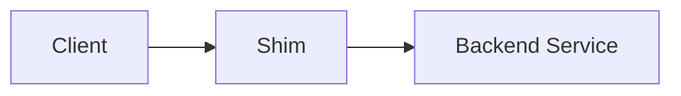

The shim mostly adapts.

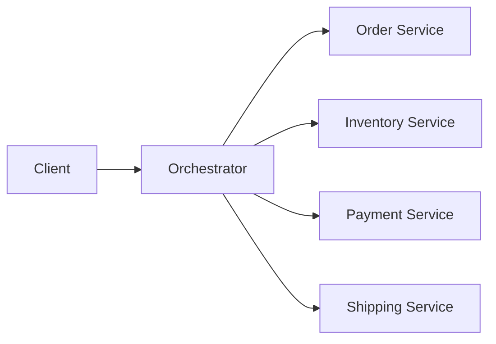

The orchestrator controls a workflow.

## 2.2 Shim Service Responsibilities

A good shim may handle:

- Request path mapping.
- Response shape mapping.
- Field renaming.
- Protocol adaptation.
- Auth token translation.
- Version compatibility.
- Legacy routing.
- Default values for old clients.
- Feature flag based routing.
- Temporary coexistence during migration.

Example mapping:

```json
{
  "oldClientRequest": {
    "user_id": "123",
    "include_orders": true
  },
  "newServiceRequest": {
    "userId": "123",
    "expand": ["orders"]
  }
}
```

## 2.3 What a Shim Should Not Do

A shim should not:

- Own complex business rules.
- Become the source of truth.
- Maintain long-running workflow state.
- Implement retries without idempotency awareness.
- Hide data quality problems forever.
- Become a permanent dumping ground.
- Contain unrelated client-specific behavior for many domains.

> [!WARNING]
> A shim should be boring. If it needs a product manager to explain its business behavior, it is probably no longer just a shim.

## 2.4 Orchestrator Service Responsibilities

A good orchestrator may handle:

- Workflow step order.
- Workflow state.
- Retry policy.
- Timeout policy.
- Compensation policy.
- Branching decisions.
- Aggregating step results.
- Publishing workflow completion events.
- Idempotency at the workflow level.
- Correlation IDs and tracing.

Example:

```text
CreateOrderWorkflow
    -> create pending order
    -> reserve inventory
    -> authorize payment
    -> confirm order
    -> publish OrderConfirmed

If payment fails:
    -> release inventory
    -> mark order rejected
```

## 2.5 Orchestration vs Choreography

| Style | How It Works | Strength | Weakness |
|---|---|---|---|
| Orchestration | Central coordinator tells participants what to do | Easier to see workflow | Coordinator can bottleneck or centralize too much |
| Choreography | Services react to events and emit new events | Looser coupling | Harder to trace global workflow |

### Orchestration

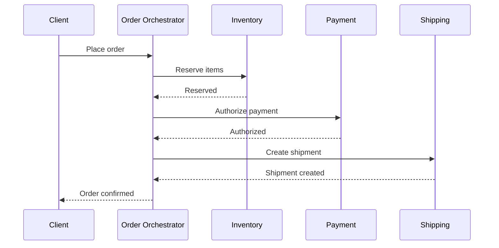

### Choreography

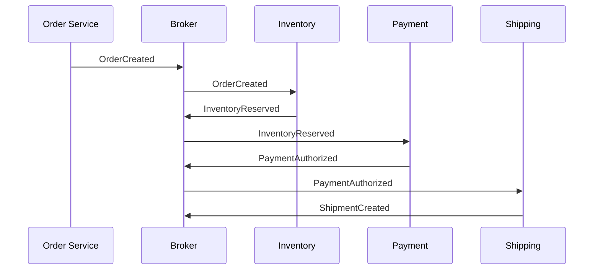

## 2.6 Saga Pattern

A saga is a sequence of local transactions. If a later step fails, compensating transactions undo earlier steps as much as the business allows.

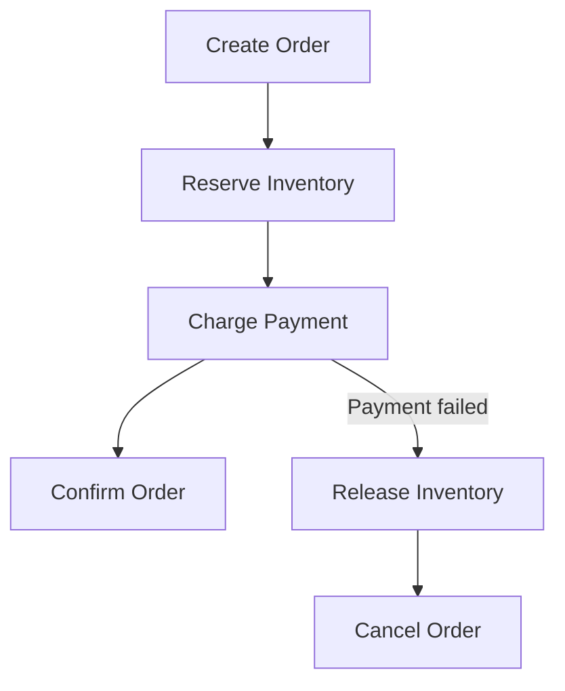

Important: compensation is not the same as database rollback. It is a business action.

| Original Step | Compensation |
|---|---|
| Reserve inventory | Release inventory |
| Authorize payment | Void authorization |
| Book hotel | Cancel hotel booking |
| Create shipment | Cancel shipment if not dispatched |

## 2.7 Gateway Aggregation and BFFs

Gateway aggregation gathers data from multiple backend services to reduce client round trips.

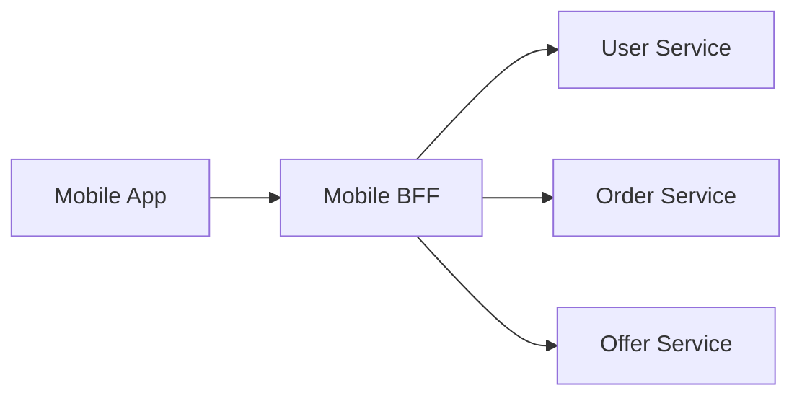

A BFF is a backend tailored to a frontend/client type:

- Mobile BFF.
- Web BFF.
- Admin BFF.
- Partner API BFF.

Do not confuse BFF aggregation with business orchestration. A BFF may assemble a screen response, but it should usually avoid owning deep domain workflows.

## 2.8 Anti-Corruption Layer

An anti-corruption layer protects a clean domain model from legacy or external models.

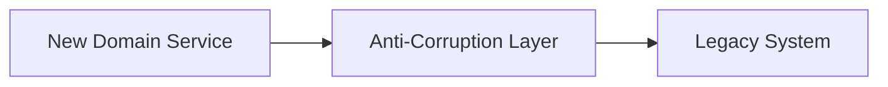

It translates:

- Data models.
- Error codes.
- Protocols.
- Naming conventions.
- Legacy states.
- Inconsistent semantics.

An ACL is a specialized shim with a domain-protection purpose.

## 2.9 Strangler Fig Migration

The strangler pattern incrementally replaces old functionality with new functionality behind a facade/proxy.

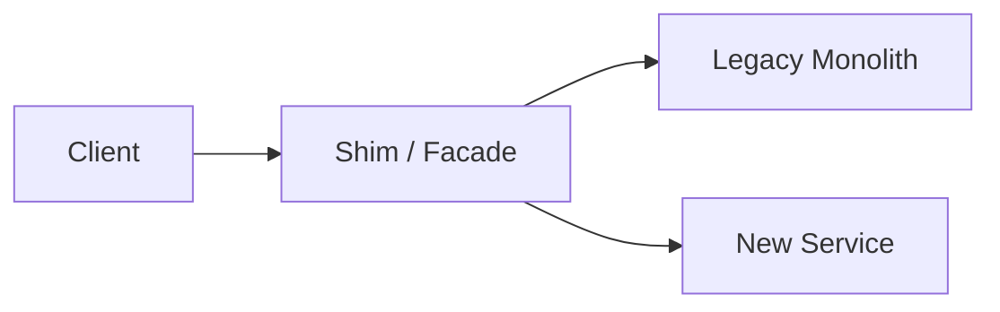

Migration sequence:

1. Put facade/shim in front of legacy.
2. Route most traffic to legacy.
3. Build one new capability.
4. Route that capability to the new service.
5. Repeat until legacy is empty.
6. Remove or simplify the facade.

## 2.10 Orchestrator Inside a Monolith

In a monolith, orchestration is usually a module/class:

```text
OrderController
    -> CheckoutApplicationService
        -> InventoryModule
        -> PaymentModule
        -> ShippingModule
```

Because all modules may share one database transaction, you may not need saga orchestration.

But if the monolith calls external systems, you still need orchestration thinking:

- Timeouts.
- Retries.
- Idempotency.
- Partial failure handling.
- Transaction boundaries.

## 2.11 Orchestrator in Microservices

In microservices, an orchestrator becomes more explicit because each service owns its own database and failures are partial.

```text
Order Orchestrator
    state: STARTED
    call: Inventory.reserve()
    state: INVENTORY_RESERVED
    call: Payment.authorize()
    state: PAYMENT_AUTHORIZED
    call: Shipping.create()
    state: COMPLETED
```

State matters. If the orchestrator crashes after inventory reservation but before payment authorization, it must resume correctly.

---

# 3. Advanced Concepts (Senior Level)

## 3.1 The Biggest Trade-Off

Shim services reduce coupling at the boundary but can add hidden complexity.

Orchestrator services make workflows explicit but can centralize too much control.

| Choice | Benefit | Cost |
|---|---|---|
| Shim | Fast compatibility and migration | Can become permanent legacy |
| Orchestrator | Clear workflow and failure handling | Can become bottleneck/god service |
| Choreography | Loose service autonomy | Harder debugging and emergent behavior |
| BFF | Better client experience | Can duplicate logic across clients |
| Modular monolith | Simpler transactions/deployment | Scaling and team boundaries may be harder |

## 3.2 Shim Service Failure Modes

| Failure | What Happens | Prevention |
|---|---|---|
| Shim grows business logic | Rules split across systems | Ownership rules and code review |
| Mapping drift | Old/new contracts diverge | Contract tests |
| Hidden data loss | Fields dropped silently | Schema validation and audit logs |
| Latency tax | Every request adds network hop | Keep thin, cache carefully |
| Permanent temporary layer | Migration never finishes | Decommission date and metrics |
| Single point of failure | All traffic depends on shim | HA deployment and fallback |
| Security bypass | Auth translation wrong | Security tests and least privilege |

## 3.3 Orchestrator Failure Modes

| Failure | What Happens | Prevention |
|---|---|---|
| Orchestrator crash mid-workflow | Unknown transaction status | Durable workflow state |
| Duplicate command | Double payment/order | Idempotency keys |
| Timeout ambiguity | Service may have succeeded | Query status or use idempotent retry |
| Compensation fails | System remains inconsistent | Retry, alert, manual repair queue |
| Central bottleneck | Workflow throughput limited | Partitioning, async execution |
| God orchestrator | Domain logic pulled from services | Keep services authoritative |
| Tight coupling | Every service change breaks workflow | Stable contracts and versioning |

## 3.4 Idempotency

Idempotency means repeating the same operation has the same effect as doing it once.

Example:

```http
POST /payments/authorize
Idempotency-Key: order-123-payment-auth
```

If the request is retried, the payment service should return the original result rather than charging twice.

Orchestrators need idempotency because:

- Networks fail after the downstream service succeeds.
- Clients retry.
- Brokers redeliver messages.
- Workers crash and resume.

## 3.5 Retry Strategy

Retries are not harmless.

Safe retry candidates:

- Read operations.
- Idempotent writes.
- Transient network failures.
- 429/503 with backoff.

Dangerous retry candidates:

- Payment capture without idempotency.
- Inventory decrement without reservation key.
- Email/SMS send without dedupe.
- Non-idempotent external vendor calls.

Retry policy:

```text
maxAttempts: 3
initialDelay: 200ms
backoff: exponential
jitter: true
timeoutPerAttempt: 1s
overallDeadline: 5s
```

## 3.6 Timeout Strategy

Every inter-service call needs a timeout.

```text
Client timeout > Gateway timeout > Orchestrator timeout > Downstream timeout
```

Bad:

```text
Client waits 30s
Orchestrator waits 60s
Payment waits forever
```

Better:

```text
Client waits 5s
Gateway waits 4.5s
Orchestrator returns accepted/pending
Workflow continues asynchronously
Client polls status
```

## 3.7 Consistency Models

In monoliths, one database transaction can often provide strong consistency.

In microservices, workflows commonly use eventual consistency.

| Model | Meaning | Fit |
|---|---|---|
| Strong consistency | Result visible immediately and atomically | Single DB / monolith |
| Eventual consistency | System converges after steps/events complete | Microservices workflows |
| Read-your-writes | User sees their own update | UX-sensitive apps |
| Compensating consistency | Failures corrected with business actions | Sagas |

## 3.8 Observability

For shims:

- Log source contract version.
- Log target service/version.
- Count route decisions.
- Count mapping failures.
- Track dropped/defaulted fields.
- Track legacy traffic percentage.

For orchestrators:

- Workflow ID.
- Step state.
- Correlation ID.
- Idempotency key.
- Retry count.
- Compensation count.
- Step latency.
- Failure reason.

Example structured log:

```json
{
  "workflowId": "order-123",
  "step": "reserve_inventory",
  "attempt": 2,
  "status": "failed",
  "correlationId": "c-789",
  "reason": "timeout"
}
```

## 3.9 Security Concerns

Shim risks:

- Accidentally accepts old insecure auth.
- Drops authorization context.
- Exposes internal fields to old clients.
- Logs sensitive transformed payloads.
- Allows legacy clients to bypass new validation.

Orchestrator risks:

- Over-privileged service account.
- Confused deputy problem.
- Missing per-step authorization.
- Leaks workflow state.
- Executes compensation without verifying ownership.

Controls:

- Authenticate at edge.
- Authorize at domain service.
- Propagate user/service identity.
- Use scoped service credentials.
- Validate after translation.
- Redact logs.
- Threat-model compensation actions.

## 3.10 Performance Concerns

Shim:

- Adds one network hop.
- May serialize/deserialize payloads twice.
- Can amplify backend calls.
- May need caching but must avoid stale semantics.

Orchestrator:

- Sequential calls increase latency.
- Parallel calls increase load and failure fanout.
- Durable workflow state adds I/O.
- Too much synchronous orchestration hurts tail latency.

Optimization examples:

- Parallelize independent steps.
- Use async workflow for slow operations.
- Return `202 Accepted` with status endpoint.
- Cache read-only reference data.
- Batch calls where domain-safe.
- Avoid orchestration for trivial one-service operations.

## 3.11 Data Ownership

Rule:

```text
The orchestrator coordinates.
The participant service owns its data and invariants.
```

Bad:

```text
Order Orchestrator directly updates inventory table.
```

Good:

```text
Order Orchestrator sends ReserveInventory command.
Inventory Service validates and updates its own database.
```

## 3.12 When Not to Use an Orchestrator Service

Do not create a separate orchestrator when:

- One service can own the whole use case cleanly.
- The workflow is just CRUD.
- The operation is read-only aggregation for one screen.
- You only need routing or schema conversion.
- The monolith is simpler and still maintainable.
- The team cannot operate distributed workflows yet.

## 3.13 When Not to Use a Shim Service

Do not create a shim when:

- You can update clients cheaply.
- There is only one caller and one backend.
- The mapping rules are actually domain rules.
- The system needs a stable new API, not translation.
- The shim would hide a bad boundary.
- The migration has no owner or end date.

---

# 4. Real-World System Design Usage

## 4.1 Microservices: Order Checkout

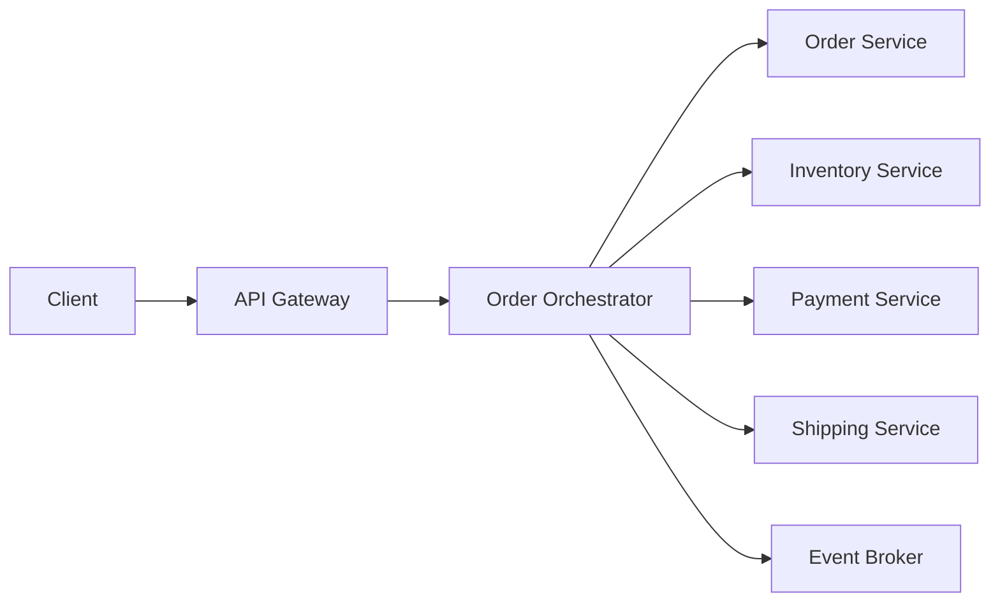

Use an orchestrator when:

- The checkout workflow spans multiple services.
- You need clear failure/compensation behavior.
- You need a client-visible workflow status.
- Business wants deterministic step order.

Possible API:

```http
POST /checkout
Idempotency-Key: checkout-abc
```

Response:

```json
{
  "workflowId": "wf-123",
  "status": "PENDING"
}
```

Status:

```http
GET /checkout/wf-123
```

## 4.2 Monolith: Internal Application Service

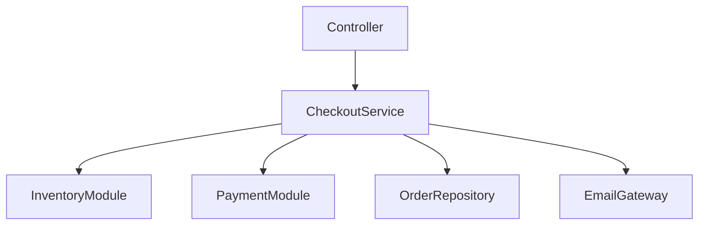

Inside a monolith, the "orchestrator" is often an application service:

```java
class CheckoutService {
    CheckoutResult checkout(CheckoutCommand command) {
        Order order = orderRepository.createPending(command);
        inventory.reserve(order.items());
        payment.authorize(order.payment());
        order.confirm();
        emailGateway.sendConfirmation(order);
        return CheckoutResult.confirmed(order.id());
    }
}
```

This does not need to be a separate network service unless there is a deployment, ownership, scalability, or reliability reason.

## 4.3 Strangler Migration from Monolith to Microservices

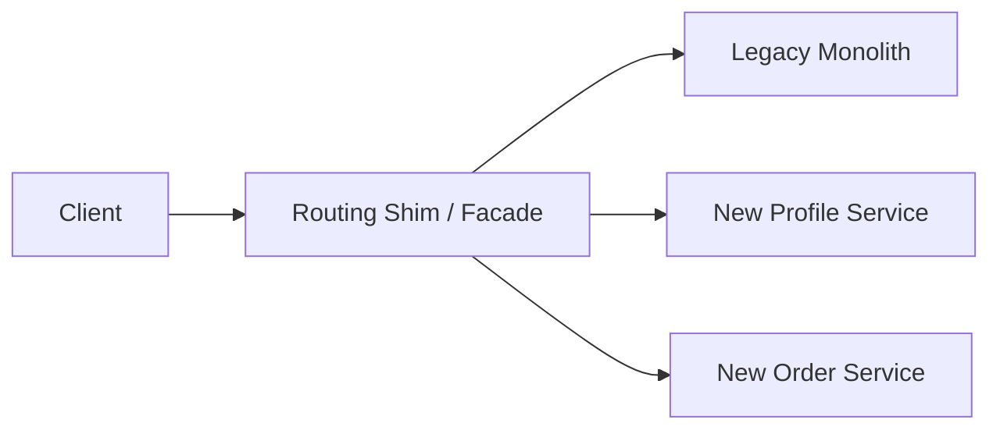

Stage 1:

```text
100% traffic -> monolith
```

Stage 2:

```text
/profile -> new profile service
everything else -> monolith
```

Stage 3:

```text
/profile -> new profile service
/orders -> new order service
everything else -> monolith
```

Stage 4:

```text
monolith retired
shim removed or simplified into gateway
```

## 4.4 Vendor API Shim

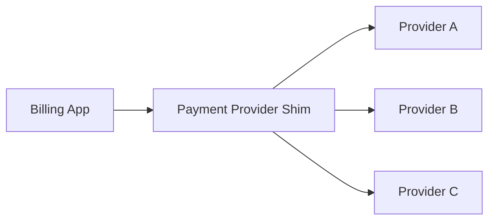

Use when:

- Multiple providers have different APIs.
- You want a stable internal contract.
- You may switch vendors.
- You need consistent error handling.

Be careful:

- Do not hide all provider-specific behavior if it matters.
- Do not pretend all payment providers have identical semantics.
- Keep provider capability differences explicit.

## 4.5 BFF for Mobile

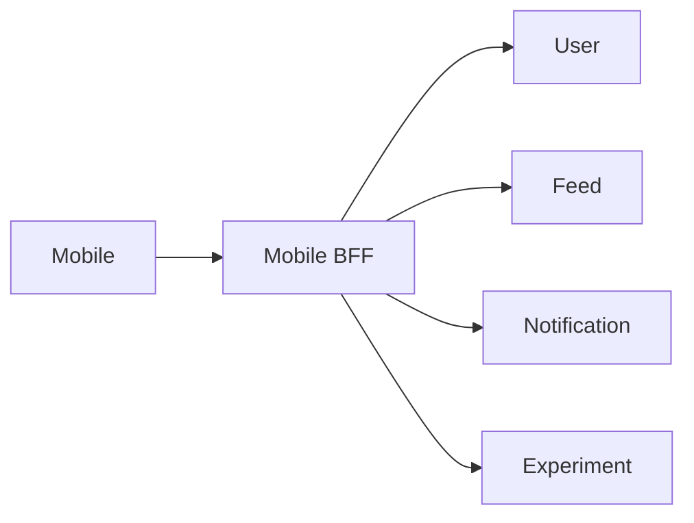

The BFF may:

- Aggregate multiple calls.
- Shape payload for mobile bandwidth.
- Hide backend churn from the app.
- Apply client-version compatibility.

The BFF should not:

- Own payment rules.
- Own inventory rules.
- Own core account state.

## 4.6 Big-Company Style Thinking

Large organizations use these patterns to reduce blast radius:

| Need | Pattern |
|---|---|
| Keep old clients working | Shim |
| Gradually replace monolith | Strangler facade |
| Protect new domain from legacy | Anti-corruption layer |
| Coordinate distributed transaction | Saga orchestrator |
| Compose client screen data | BFF / gateway aggregation |
| Reduce central workflow dependency | Choreography |
| Make workflows observable/replayable | Durable workflow engine |

## 4.7 Common Tooling Choices

| Need | Examples |
|---|---|
| API gateway | Kong, NGINX, Envoy, AWS API Gateway, Azure API Management |
| Service mesh | Istio, Linkerd, Consul |
| Workflow orchestration | Temporal, Cadence, Netflix/Conductor, AWS Step Functions, Azure Durable Functions |
| Messaging | Kafka, RabbitMQ, SNS/SQS, Azure Service Bus |
| Contract testing | Pact, Spring Cloud Contract |
| Observability | OpenTelemetry, Prometheus, Grafana, Jaeger, Datadog |

Tool choice is less important than clear ownership, idempotency, failure handling, and observability.

---

# 5. Interview Preparation

## 5.1 What Interviewers Expect

For this topic, interviewers expect you to distinguish:

- Routing vs translation vs orchestration.
- API gateway vs BFF vs shim.
- Orchestration vs choreography.
- Monolith orchestration vs microservice orchestration.
- Saga compensation vs ACID rollback.
- Temporary migration facade vs permanent platform layer.

They also expect production concerns:

- Idempotency.
- Timeouts.
- Retries.
- Partial failures.
- Observability.
- Data ownership.
- Contract compatibility.
- Avoiding god services.

## 5.2 Most Important Questions and Answers

### Q1. What is a shim service?

A shim service is a thin compatibility layer that adapts one interface, protocol, schema, or behavior to another. It is usually used for migrations, legacy compatibility, vendor abstraction, or client-version support.

### Q2. What is an orchestrator service?

An orchestrator service coordinates a multi-step workflow across services or modules. It decides step order, handles retries/timeouts, tracks workflow state, and triggers compensation when a workflow cannot complete normally.

### Q3. How is a shim different from an API gateway?

An API gateway is usually an edge platform component for routing, authentication, rate limiting, TLS termination, and sometimes aggregation. A shim is a compatibility adapter for a specific boundary or migration problem. A gateway can host shim-like logic, but too much domain-specific translation in the gateway is risky.

### Q4. How is an orchestrator different from a BFF?

A BFF shapes APIs for a specific frontend. An orchestrator coordinates business workflow. A BFF might call several services to render a screen, but it should not usually own deep domain transaction logic.

### Q5. When should you use orchestration instead of choreography?

Use orchestration when the workflow needs explicit ordering, central visibility, durable state, client status tracking, or complex compensation. Use choreography when services can react independently to events and the workflow is naturally decentralized.

### Q6. What is the danger of an orchestrator?

It can become a god service, bottleneck, single point of failure, or centralized owner of business rules that should live in participant services.

### Q7. What is the danger of a shim?

It can become permanent accidental architecture, hide contract problems, add latency, duplicate business rules, and make migrations look complete when complexity has only moved.

### Q8. Do monoliths need orchestrator services?

Usually not as separate network services. A monolith may have application-service classes that orchestrate modules. A separate orchestrator service is only justified if there is a real deployment, scaling, ownership, or reliability need.

### Q9. How do you handle failure in a distributed checkout workflow?

Use a saga with idempotent participant operations, durable workflow state, timeouts, retries for safe operations, compensation for completed steps, and observable workflow status.

### Q10. What is the strangler fig pattern?

It is a migration pattern where a facade intercepts requests and gradually routes specific capabilities from a legacy system to new services until the legacy system can be retired.

## 5.3 Tricky Questions

### Is a shim always temporary?

No. Migration shims should usually be temporary. Compatibility shims for external clients or vendor abstraction may be long-lived. Long-lived shims need clear ownership and tests.

### Can an orchestrator call a monolith?

Yes. During migration, an orchestrator might coordinate new services and old monolith capabilities. Use an anti-corruption layer to avoid leaking legacy semantics into new services.

### Should an orchestrator access other services' databases?

No. It should call service APIs or send commands/events. Direct database access breaks service ownership and creates tight coupling.

### Can compensation always undo a business action?

No. Some actions are irreversible. You may need forward recovery, manual review, refunds, adjustment records, or customer communication.

### Is choreography always more scalable?

Not automatically. It removes a central coordinator but can create event storms, hard-to-debug flows, ordering problems, and duplicated failure logic.

## 5.4 Common Candidate Mistakes

- Saying "orchestrator" for any service that calls another service.
- Putting business workflow in API gateway.
- Creating microservices before defining service boundaries.
- Using distributed transactions as the default answer.
- Ignoring idempotency.
- Ignoring compensation failure.
- Treating retries as harmless.
- Letting shims become permanent without ownership.
- Making orchestrator directly update every database.
- Not planning observability from day one.

## 5.5 Interview Design Template

When asked to design one:

1. Clarify whether the problem is translation or workflow.
2. Identify data ownership.
3. Draw request/event flow.
4. Define success and failure states.
5. Define idempotency keys.
6. Define retry and timeout policy.
7. Define compensation or manual repair.
8. Add observability.
9. Explain trade-offs.
10. Explain when you would remove or avoid the layer.

---

# 6. Hands-On Thinking

## 6.1 Three Real-World Projects

### Project 1: Legacy API Shim

Goal: Keep old clients working while routing to a new service.

Features:

- Accept `/v1/users/{id}`.
- Call new `/users/{id}/profile`.
- Translate old/new schemas.
- Return old error codes.
- Add contract tests.
- Track legacy traffic percentage.

Architecture:

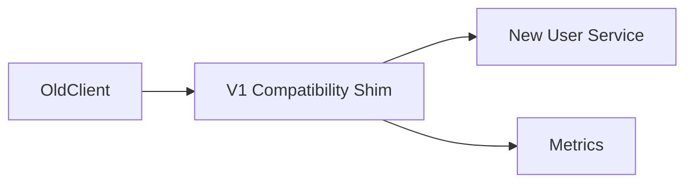

Key implementation ideas:

```java
record OldUserResponse(String user_id, String full_name) {}
record NewUserResponse(String userId, String displayName) {}

OldUserResponse toOld(NewUserResponse response) {
    return new OldUserResponse(response.userId(), response.displayName());
}
```

### Project 2: Order Saga Orchestrator

Goal: Coordinate order, inventory, and payment.

Features:

- Start checkout workflow.
- Store workflow state.
- Reserve inventory.
- Authorize payment.
- Confirm order.
- Compensate on failure.
- Provide status endpoint.

Architecture:

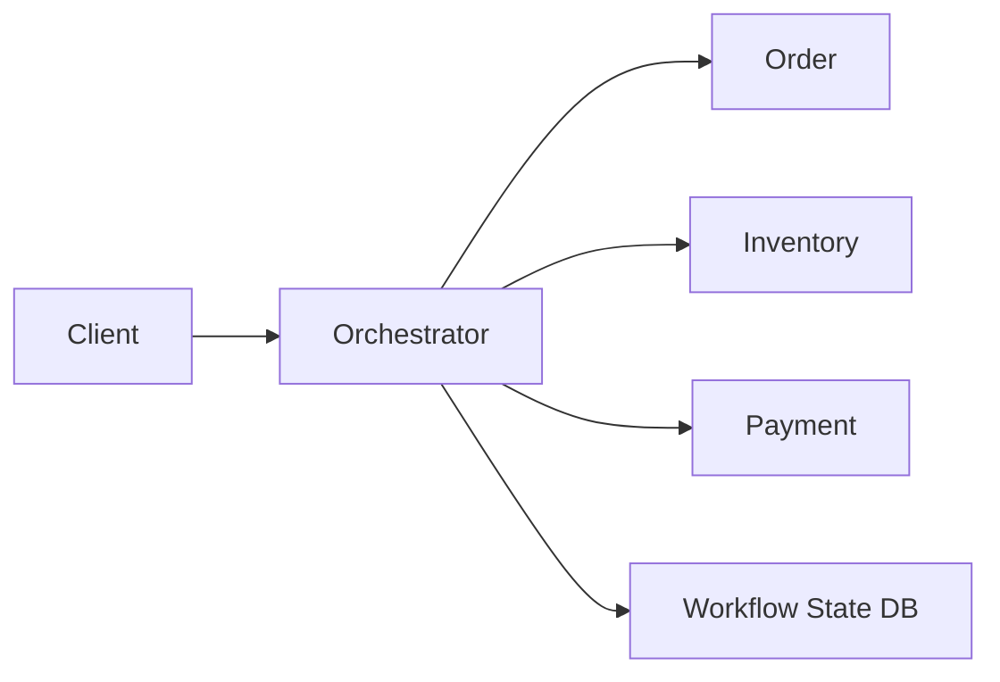

State machine:

```text
STARTED
ORDER_CREATED
INVENTORY_RESERVED
PAYMENT_AUTHORIZED
COMPLETED
FAILED_COMPENSATED
FAILED_NEEDS_REPAIR
```

### Project 3: Monolith Strangler Facade

Goal: Gradually route features from a monolith to new services.

Features:

- Route `/profile` to new service.
- Route everything else to monolith.
- Add feature flags.
- Add rollback switch.
- Add route metrics.
- Track migration progress.

Architecture:

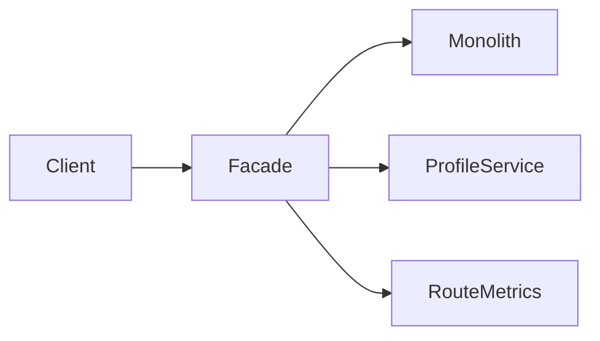

## 6.2 Step-by-Step Design Approach

For a shim:

1. Identify old contract and new contract.
2. Define exact mapping rules.
3. Decide whether errors map one-to-one.
4. Add contract tests for old clients.
5. Add metrics for each route/mapping.
6. Keep business rules out.
7. Define decommission criteria if temporary.

For an orchestrator:

1. Identify workflow steps.
2. Identify owner service for each step.
3. Define workflow states.
4. Define idempotency keys.
5. Define retries and timeouts.
6. Define compensation per step.
7. Persist workflow state durably.
8. Emit events and metrics.
9. Add repair tooling.
10. Load/failure test.

## 6.3 Production Implementation Skeleton

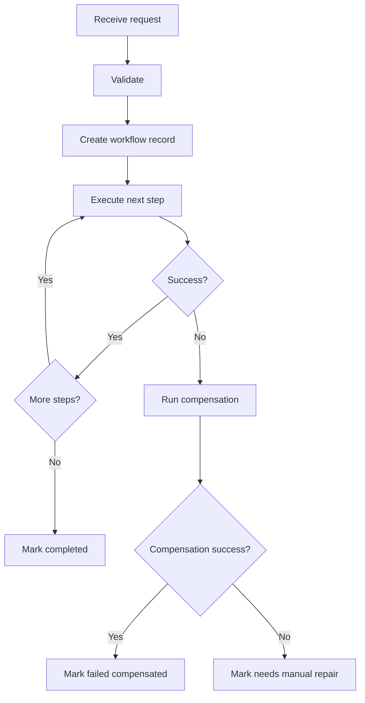

## 6.4 Minimal Orchestrator Pseudocode

```java
class CheckoutOrchestrator {
    CheckoutResult start(CheckoutCommand command) {
        String workflowId = command.idempotencyKey();

        Workflow workflow = workflowStore.getOrCreate(workflowId);

        try {
            workflow.markOrderCreated(orderService.create(command));
            workflow.markInventoryReserved(inventoryService.reserve(command.items()));
            workflow.markPaymentAuthorized(paymentService.authorize(command.payment()));
            workflow.markCompleted(orderService.confirm(workflow.orderId()));
            return CheckoutResult.completed(workflow.orderId());
        } catch (PaymentFailedException e) {
            compensate(workflow);
            return CheckoutResult.failed(workflow.id(), e.getMessage());
        }
    }

    private void compensate(Workflow workflow) {
        if (workflow.inventoryReserved()) {
            inventoryService.release(workflow.inventoryReservationId());
        }
        if (workflow.orderCreated()) {
            orderService.cancel(workflow.orderId());
        }
    }
}
```

Production version must handle durable state, retries, duplicate execution, partial compensation failure, and async status.

---

# 7. Deep Dive (Optional but Important)

## 7.1 How a Shim Evolves into Trouble

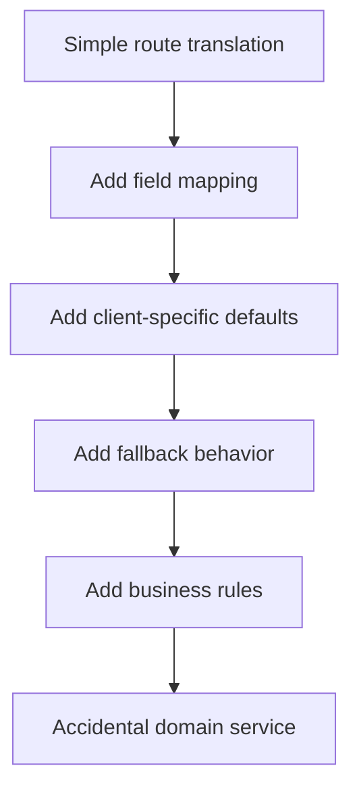

Guardrails:

- Keep mapping config explicit.
- Reject unknown fields when appropriate.
- Use contract tests.
- Measure migration progress.
- Assign owner and retirement plan.
- Review every new rule: "Is this translation or business behavior?"

## 7.2 How an Orchestrator Becomes a God Service

Warning signs:

- It validates all domain rules itself.
- It directly queries participant databases.
- Every service release requires orchestrator changes.
- It has huge conditional logic for every product variation.
- Participant services become CRUD wrappers.
- Teams argue about whether rules live in orchestrator or services.

Better boundary:

```text
Orchestrator: "Reserve inventory for order 123"
Inventory Service: decides if inventory can be reserved
```

## 7.3 Workflow State Design

Example table:

| Column | Purpose |
|---|---|
| `workflow_id` | Stable ID/idempotency key |
| `workflow_type` | Checkout, refund, onboarding |
| `status` | Current state |
| `current_step` | Resume point |
| `payload` | Workflow input snapshot |
| `attempt_count` | Retry tracking |
| `last_error` | Debugging |
| `created_at` | Audit |
| `updated_at` | Audit |

## 7.4 Transactional Outbox

Problem:

```text
Update database succeeds
Publish event fails
System is inconsistent
```

Outbox approach:

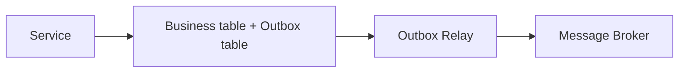

The service writes business state and the event record in one local transaction. A relay publishes unsent events.

## 7.5 Manual Repair Is Part of the Design

Some distributed failures cannot be fully automated.

You need:

- Dead-letter queues.
- Workflow admin UI.
- Replay tools.
- Compensation retry tools.
- Audit logs.
- Runbooks.
- Alerting on stuck states.

Example stuck states:

```text
PAYMENT_AUTHORIZED_BUT_ORDER_NOT_CONFIRMED
INVENTORY_RESERVED_COMPENSATION_FAILED
VENDOR_STATUS_UNKNOWN
```

## 7.6 Testing Strategy

| Test Type | Shim | Orchestrator |
|---|---|---|
| Unit test | Mapping functions | State transitions |
| Contract test | Old and new API compatibility | Participant API contracts |
| Integration test | Route and transform | End-to-end workflow |
| Failure test | Backend unavailable | Step failure and compensation |
| Load test | Added latency | Throughput and stuck workflows |
| Security test | Auth propagation | Authorization per step |

## 7.7 Decision Matrix

| Scenario | Recommended Pattern |
|---|---|
| Old API must keep working for 6 months | Shim |
| Replacing monolith one feature at a time | Strangler facade + shims |
| Mobile needs one response from five services | BFF / gateway aggregation |
| Checkout spans order, inventory, payment | Saga orchestrator |
| Services react independently to domain events | Choreography |
| New service must call ugly legacy model | Anti-corruption layer |
| Simple CRUD within one service | No orchestrator |
| One maintainable app with strong modules | Modular monolith |

---

# Production Checklists

## Shim Checklist

- [ ] Is this only adapting/routing/translating?
- [ ] Are mapping rules documented?
- [ ] Are old and new contracts tested?
- [ ] Are auth and authorization preserved?
- [ ] Are sensitive fields redacted?
- [ ] Are mapping failures visible?
- [ ] Is latency measured?
- [ ] Is there an owner?
- [ ] Is there a decommission plan if migration-related?
- [ ] Is business logic kept out?

## Orchestrator Checklist

- [ ] Are workflow states explicit?
- [ ] Is workflow state durable?
- [ ] Are all participant commands idempotent?
- [ ] Are timeouts defined?
- [ ] Are retries bounded with backoff and jitter?
- [ ] Are compensations defined per step?
- [ ] Are compensation failures handled?
- [ ] Is correlation/tracing implemented?
- [ ] Are stuck workflows alerted?
- [ ] Are participant services still owners of their data?

## Monolith Checklist

- [ ] Can this remain an internal application service?
- [ ] Are module boundaries clear?
- [ ] Is a single transaction enough?
- [ ] Are external calls outside DB transaction where possible?
- [ ] Is the monolith becoming too coupled?
- [ ] Is decomposition driven by business boundaries, not fashion?

## Microservices Checklist

- [ ] Does each service own its data?
- [ ] Are distributed transactions avoided?
- [ ] Is eventual consistency acceptable?
- [ ] Are events versioned?
- [ ] Are duplicate/out-of-order messages handled?
- [ ] Is observability end-to-end?
- [ ] Are failures tested, not just happy paths?

---

# Learning Roadmap

## Phase 1: Foundations

Learn:

- API gateway.
- BFF.
- Adapter pattern.
- Facade pattern.
- Basic microservices boundaries.
- Basic monolith vs microservices trade-offs.

Practice:

- Build a REST API shim that maps old JSON to new JSON.

## Phase 2: Intermediate

Learn:

- Saga pattern.
- Orchestration vs choreography.
- Idempotency.
- Retries and timeouts.
- Event-driven communication.
- Contract testing.

Practice:

- Build an order workflow with inventory and payment mock services.

## Phase 3: Advanced

Learn:

- Durable workflow engines.
- Transactional outbox.
- Event schema evolution.
- Distributed tracing.
- Compensation failure handling.
- Manual repair operations.

Practice:

- Add crash recovery and replay to your orchestrator.

## Phase 4: Production Architect

Learn:

- Domain-driven service boundaries.
- Strangler migrations.
- Anti-corruption layers.
- Platform governance.
- Multi-team ownership.
- Operability and runbooks.

Practice:

- Design a monolith-to-microservice migration with routing, rollback, metrics, and decommission milestones.

---

# Self-Review Completion Loop

Reviewed against:

- Saga orchestration and choreography patterns.
- Strangler facade migration guidance.
- Gateway aggregation and BFF patterns.
- Anti-corruption layer principles.
- Microservice data ownership practices.
- Production failure modes.
- Security and observability requirements.
- Common system-design interview traps.

## Gap Review Matrix

| Area | Covered? | Notes |
|---|---|---|
| Shim fundamentals | Yes | Translation, routing, compatibility |
| Orchestrator fundamentals | Yes | Workflow, state, compensation |
| Microservices usage | Yes | Saga, data ownership, async workflows |
| Monolith usage | Yes | Internal application services, modular monolith |
| Migration usage | Yes | Strangler facade and anti-corruption |
| Gateway/BFF distinction | Yes | Edge/client shaping vs domain workflow |
| Trade-offs | Yes | Bottlenecks, god services, permanent shims |
| Failure handling | Yes | Retry, timeout, compensation, repair |
| Security | Yes | Auth propagation, secrets, over-privilege |
| Performance | Yes | Latency, fanout, async, parallelism |
| Observability | Yes | Workflow IDs, route metrics, tracing |
| Interview prep | Yes | Direct Q&A and mistakes |
| Hands-on projects | Yes | Shim, saga orchestrator, strangler facade |

No major conceptual gaps remain for the requested topic. The next deep-dive topics would be **Saga Pattern**, **Transactional Outbox**, **API Gateway vs BFF**, **Temporal/Workflow Engines**, and **Monolith to Microservices Migration**.

---

# References

- Microservices.io - Saga pattern: <https://microservices.io/patterns/data/saga.html>
- Microsoft Azure Architecture Center - Choreography pattern: <https://learn.microsoft.com/en-us/azure/architecture/patterns/choreography>
- Microsoft Azure Architecture Center - Strangler Fig pattern: <https://learn.microsoft.com/en-us/azure/architecture/patterns/strangler-fig>
- Microsoft Azure Architecture Center - Gateway Aggregation pattern: <https://learn.microsoft.com/en-us/azure/architecture/patterns/gateway-aggregation>
- Microsoft Azure Architecture Center - Backends for Frontends pattern: <https://learn.microsoft.com/en-us/azure/architecture/patterns/backends-for-frontends>
- AWS Prescriptive Guidance - Saga orchestration pattern: <https://docs.aws.amazon.com/prescriptive-guidance/latest/cloud-design-patterns/saga-orchestration.html>

---

## Final Summary

Use a **shim** when the problem is compatibility, translation, routing, or migration. Use an **orchestrator** when the problem is coordinating a multi-step business workflow with state, failure handling, and compensation. In a monolith, orchestration usually belongs inside the application as a module or service class. In microservices, orchestration often becomes explicit because each service owns its own process, database, and failure boundary.
