# 🐳 Docker — Complete Beginner-to-Expert Reference

> The container platform that solved "works on my machine" — package once, run anywhere, with OS-level isolation and near-native performance.

---

## 📑 Table of Contents

1. [Executive Summary](#-executive-summary)
2. [Fundamentals (Beginner)](#1--fundamentals-beginner-level)
3. [Core Concepts (Intermediate)](#2--core-concepts-intermediate-level)
4. [Advanced Concepts (Senior)](#3--advanced-concepts-senior-level)
5. [Real-World System Design](#4--real-world-system-design-usage)
6. [Interview Preparation](#5--interview-preparation)
7. [Hands-On Projects](#6--hands-on-projects)
8. [Deep Dive: Internals](#7--deep-dive-internals)
9. [Production Checklists](#-production-checklists)
10. [Learning Roadmap](#-learning-roadmap)
11. [Self-Review Completion Loop](#-self-review-completion-loop)
12. [Official References](#-official-references)
13. [Final Summary](#-final-summary)

---

## 🎯 Executive Summary

**Docker** is a platform for building, shipping, and running applications inside **containers** — lightweight, isolated, portable units that bundle an app with *all* its dependencies. Unlike virtual machines, containers share the host OS kernel, making them start in milliseconds and consume a fraction of the resources.

| What it is | What it replaces | Core superpower |
|---|---|---|
| OS-level containerization platform | "Works on my machine" chaos, heavy VMs, manual dependency setup | **Package once, run identically anywhere** with near-native speed and isolation |

> [!IMPORTANT]
> Docker's core insight: bundle the app **and its entire userspace environment** (libraries, runtime, config) into an immutable **image**, then run it as an isolated **container** that shares the host kernel. This gives VM-like isolation with process-like speed. Everything you've learned in [[02 Kubernetes]] and [[03 Helm Charts]] orchestrates *these containers* — Docker is the foundation beneath them.

Related guides: [[02 Kubernetes]] · [[03 Helm Charts]] · [[06 Jenkins]] · [[07 CICD GitHub Actions]] · [[03 Microservices]] · [[05 Node.js]] · [[05 Spring Boot]]

---

## 1. 🌱 FUNDAMENTALS (Beginner Level)

### What is Docker in simple terms?

Imagine you build an app on your laptop. It works. You send it to a colleague — it breaks. Different OS, different Python/Java version, a missing library, a different config. This is **dependency hell** and "works on my machine."

**Docker packages your app + everything it needs to run into a single sealed box (a container).** That box runs *identically* on your laptop, your colleague's machine, a test server, and production.

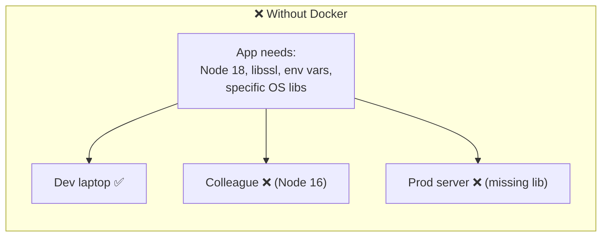

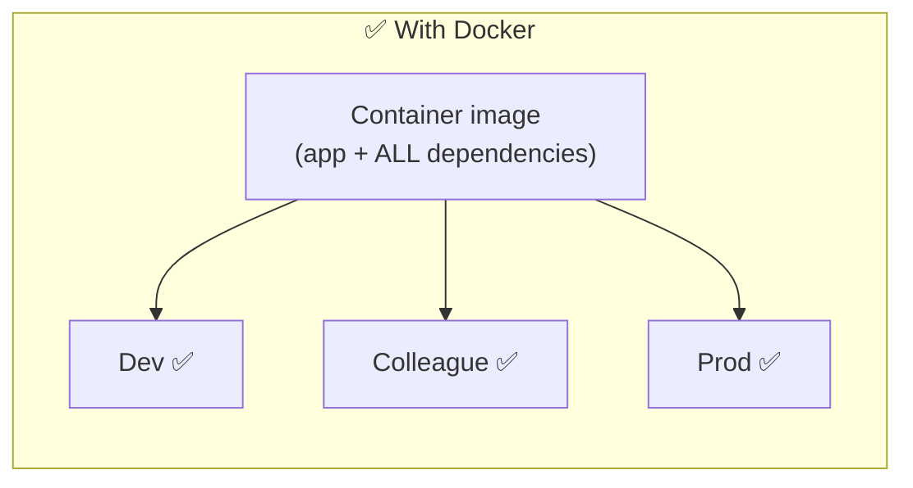

### Why does Docker exist?

Before containers, we had two bad options:
1. **Install everything directly on servers** → dependency conflicts, snowflake servers, "don't touch it, it works."
2. **Virtual Machines** → full guest OS per app = gigabytes of RAM, minutes to boot, heavy.

Docker (2013) popularized **containers**: isolation like a VM, but sharing the host kernel — so they're **tiny and instant**.

### Containers vs Virtual Machines

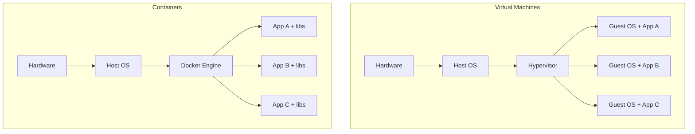

| Aspect | Virtual Machine | Container |
|---|---|---|
| **Isolation** | Full (own kernel) | Process-level (shared kernel) |
| **Size** | GBs (full OS) | MBs (just app + libs) |
| **Startup** | Minutes | Milliseconds |
| **Overhead** | Heavy (hypervisor + guest OS) | Near-zero |
| **Density** | ~10s per host | ~100s-1000s per host |
| **Security boundary** | Stronger | Weaker (shared kernel) |

> [!TIP]
> The mental model: **a VM virtualizes hardware (each gets a full OS); a container virtualizes the OS (each gets an isolated userspace, sharing one kernel).** Containers trade a bit of isolation strength for massive gains in speed, size, and density — which is why the cloud runs on them.

### Problems Docker solves

| Problem | How Docker solves it |
|---|---|
| **"Works on my machine"** | Identical image runs everywhere |
| **Dependency hell** | Dependencies baked into the image, isolated per container |
| **Slow, heavy VMs** | Lightweight, instant-start containers |
| **Environment drift** (dev ≠ prod) | Same image promoted through all environments |
| **Onboarding friction** | `docker run` instead of a 3-page setup doc |
| **Inconsistent deploys** | Immutable, versioned images |
| **Microservices packaging** | Each service its own container ([[03 Microservices]]) |

### Core concepts (the vocabulary)

| Term | Plain meaning |
|---|---|
| **Image** | A read-only template/blueprint (app + deps + config). Like a class. |
| **Container** | A running instance of an image. Like an object. |
| **Dockerfile** | A recipe of instructions to build an image |
| **Registry** | A store for images (Docker Hub, GHCR, ECR) |
| **Layer** | Images are built in stacked, cached, read-only layers |
| **Volume** | Persistent storage that outlives a container |
| **Network** | Virtual network letting containers talk to each other |
| **Docker Engine / daemon** | The background service (`dockerd`) that runs containers |
| **Docker Compose** | Tool to define & run multi-container apps via YAML |

### Real-world analogy 📦

Docker is like **shipping containers** (the metaphor is literal — that's the whale logo carrying boxes):
- Before standardized shipping containers, cargo was loaded piece-by-piece — slow, incompatible across ships/trucks/trains.
- The **standard container** made cargo portable across *any* ship, crane, or truck.
- Similarly, a **Docker image** is a standard unit that runs on *any* Docker host — laptop, server, cloud.
- The **ship** = your host machine; the **crane** = Docker Engine; the **manifest** = the Dockerfile.

> [!TIP]
> **Image = class, Container = instance.** You build one image and run many containers from it. Images are immutable; containers are the ephemeral, running instances. Almost every Docker concept maps onto this OOP analogy.

---

## 2. 🧩 CORE CONCEPTS (Intermediate Level)

### 2.1 Architecture: Client, Daemon, Registry

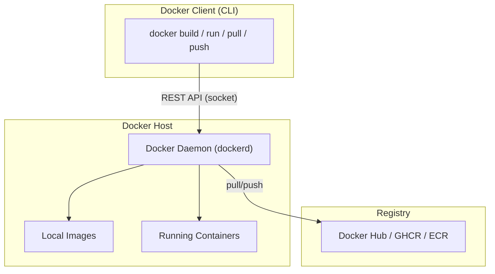

- **Docker Client**: the `docker` CLI you type commands into.
- **Docker Daemon (`dockerd`)**: does the real work — builds images, runs containers, manages networks/volumes. Talks to the client over a REST API (Unix socket).
- **Registry**: stores and distributes images.
- Under the hood, `dockerd` delegates to **containerd** → **runc** (the actual container runtime — same containerd [[02 Kubernetes]] uses).

> [!IMPORTANT]
> The client and daemon are **separate**. The daemon runs as **root** and does everything; the CLI just sends it commands. This is why "add user to the `docker` group" ≈ giving root access — anyone who can talk to the daemon can mount the host filesystem. It's also why **rootless Docker** and daemonless tools (Podman) exist.

### 2.2 Images & Layers

An image is a stack of **read-only layers**, each created by a Dockerfile instruction. Layers are **cached and shared** across images.

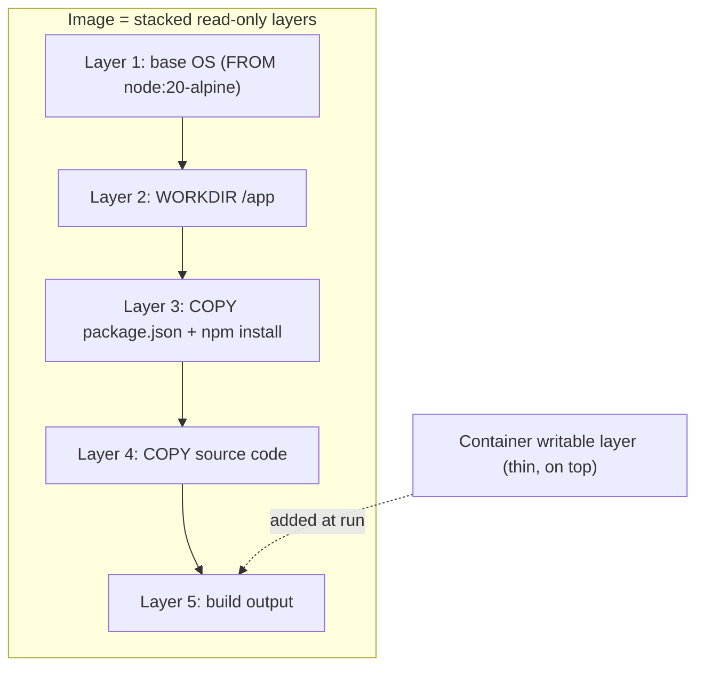

- Each layer is a **diff** of filesystem changes.
- Layers are **content-addressed** (SHA digest) and **shared** — if two images use `node:20-alpine`, that layer is stored once.
- A running container adds a thin **writable layer** on top (copy-on-write); deleting the container discards it.

> [!TIP]
> **Layer caching is the key to fast builds.** Docker reuses cached layers until the first instruction whose inputs changed — then it rebuilds that layer and *everything after it*. This drives the #1 Dockerfile optimization: **copy dependency manifests and install deps BEFORE copying source code**, so a code change doesn't bust the (expensive) dependency-install layer.

### 2.3 The Dockerfile

```dockerfile
# Base image (a layer everyone shares)
FROM node:20-alpine

# Metadata
LABEL maintainer="team@example.com"

# Set working directory inside the image
WORKDIR /app

# Copy ONLY dependency manifests first (cache optimization)
COPY package*.json ./
RUN npm ci --omit=dev

# Now copy the rest of the source (changes often → later layer)
COPY . .

# Document the port (informational)
EXPOSE 3000

# Environment variables
ENV NODE_ENV=production

# Run as non-root
USER node

# Default command when the container starts
CMD ["node", "server.js"]
```

**Key instructions:**

| Instruction | Purpose |
|---|---|
| `FROM` | Base image to build on |
| `WORKDIR` | Set the working directory (creates it) |
| `COPY` / `ADD` | Copy files in (`ADD` also unpacks tars/URLs — prefer `COPY`) |
| `RUN` | Execute a command at **build time** (creates a layer) |
| `CMD` | Default command at **run time** (overridable) |
| `ENTRYPOINT` | The fixed executable at run time (args appended) |
| `ENV` | Set environment variables |
| `EXPOSE` | Document a port (doesn't publish it) |
| `ARG` | Build-time variables |
| `USER` | Which user to run as |
| `VOLUME` | Declare a mount point for persistent data |
| `HEALTHCHECK` | Command to test container health |

### 2.4 CMD vs ENTRYPOINT (classic confusion)

```dockerfile
ENTRYPOINT ["python", "app.py"]   # fixed part
CMD ["--port", "8080"]            # default args (overridable)
# → runs: python app.py --port 8080
# `docker run image --port 9090` → python app.py --port 9090
```

| | `CMD` | `ENTRYPOINT` |
|---|---|---|
| Purpose | Default command **or** default args | The fixed executable |
| Overridable by `docker run ...args` | Fully replaced | Args appended (not replaced) |
| Common pattern | Alone for simple images | `ENTRYPOINT` (binary) + `CMD` (default args) |

> [!WARNING]
> Always use the **exec form** (`CMD ["node", "server.js"]`), not the shell form (`CMD node server.js`). The shell form wraps your process in `/bin/sh -c`, so your app runs as **PID != 1** and **doesn't receive `SIGTERM`** on `docker stop` → the container is force-killed after the grace period, breaking graceful shutdown. Exec form makes your app PID 1 and signal-aware.

### 2.5 Core CLI Lifecycle

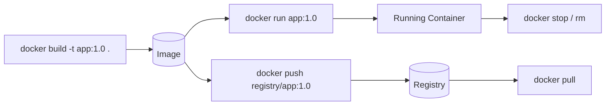

| Command | Purpose |
|---|---|
| `docker build -t name:tag .` | Build an image from a Dockerfile |
| `docker run [opts] image` | Create + start a container |
| `docker ps` / `docker ps -a` | List running / all containers |
| `docker images` | List local images |
| `docker exec -it <c> sh` | Run a command in a running container |
| `docker logs -f <c>` | Stream container logs |
| `docker stop` / `start` / `rm <c>` | Lifecycle control |
| `docker pull` / `push` | Fetch / publish images |
| `docker rmi <image>` | Remove an image |
| `docker system prune` | Clean up unused data |
| `docker inspect <obj>` | Full JSON metadata |

**Common `run` flags:**

```bash
docker run \
  -d \                        # detached (background)
  --name api \                # container name
  -p 8080:3000 \              # host:container port mapping
  -e NODE_ENV=production \    # env var
  -v mydata:/app/data \       # volume mount
  --restart unless-stopped \  # restart policy
  --memory 512m --cpus 1.5 \  # resource limits
  myapp:1.0
```

### 2.6 Data Persistence: Volumes & Bind Mounts

Containers are ephemeral — their writable layer dies with them. For persistent data, mount storage:

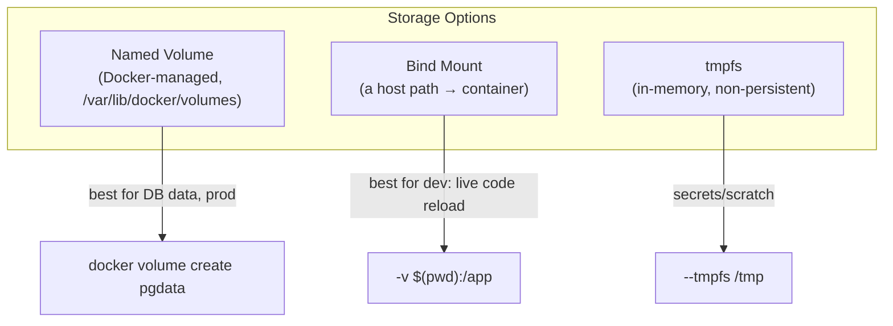

| Type | Managed by | Use case |
|---|---|---|
| **Named volume** | Docker | Databases, production persistent data |
| **Bind mount** | You (host path) | Dev — mount source code for live reload |
| **tmpfs** | RAM | Sensitive/temporary data, never persisted |

> [!TIP]
> Use **named volumes** for anything that must survive container restarts (e.g., [[02 Postgres]] data). Use **bind mounts** in development to mount your source into the container for instant reloads. Never store production data in the container's writable layer — it's lost on `docker rm`.

### 2.7 Networking

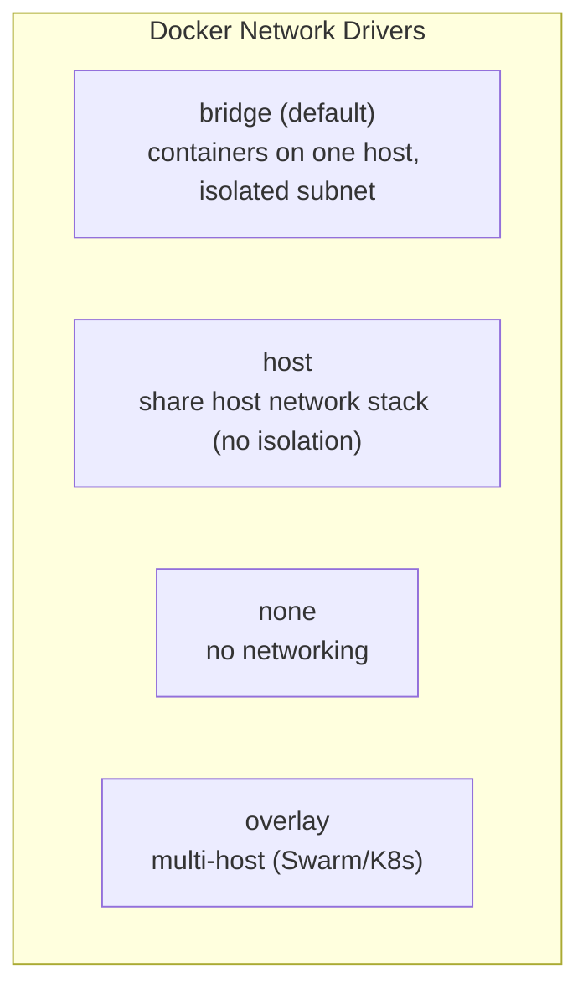

- On a **user-defined bridge network**, containers reach each other by **name** (built-in DNS) — e.g., `api` can connect to `postgres:5432`.
- `-p 8080:3000` **publishes** a container port to the host.
- The **default bridge** does *not* provide name resolution — always create a user-defined network for multi-container apps.

```bash
docker network create appnet
docker run -d --name db --network appnet postgres
docker run -d --name api --network appnet -e DB_HOST=db myapi   # reaches "db" by name
```

> [!IMPORTANT]
> On a **user-defined bridge network**, Docker provides automatic **DNS resolution by container name** — this is how multi-container apps wire together. The legacy default `bridge` network lacks this (requires deprecated `--link`). Compose creates a user-defined network automatically, which is why services find each other by service name.

### 2.8 Docker Compose (multi-container apps)

```yaml
# compose.yaml
services:
  api:
    build: .
    ports:
      - "8080:3000"
    environment:
      DB_HOST: db
      REDIS_HOST: cache
    depends_on:
      db:
        condition: service_healthy
    restart: unless-stopped

  db:
    image: postgres:16-alpine
    environment:
      POSTGRES_PASSWORD: secret
    volumes:
      - pgdata:/var/lib/postgresql/data
    healthcheck:
      test: ["CMD-SHELL", "pg_isready -U postgres"]
      interval: 5s
      retries: 5

  cache:
    image: redis:7-alpine

volumes:
  pgdata:
```

```bash
docker compose up -d      # start the whole stack
docker compose logs -f    # tail all logs
docker compose down       # stop + remove (add -v to drop volumes)
```

> [!TIP]
> Compose is ideal for **local development** and simple single-host deployments — one command spins up your app + [[02 Postgres]] + Redis + more, all networked together. For multi-host production orchestration, you graduate to [[02 Kubernetes]]. `depends_on` with `condition: service_healthy` waits for a real healthcheck, not just process start.

---

## 3. ⚙️ ADVANCED CONCEPTS (Senior Level)

### 3.1 Multi-Stage Builds (the #1 optimization)

Build in a heavy image, ship only the artifact in a tiny one:

```dockerfile
# ---- Stage 1: build (has compilers, dev deps) ----
FROM node:20 AS build
WORKDIR /app
COPY package*.json ./
RUN npm ci
COPY . .
RUN npm run build          # produces /app/dist

# ---- Stage 2: runtime (tiny, only what's needed) ----
FROM node:20-alpine AS runtime
WORKDIR /app
ENV NODE_ENV=production
COPY package*.json ./
RUN npm ci --omit=dev
COPY --from=build /app/dist ./dist   # copy ONLY the build output
USER node
CMD ["node", "dist/server.js"]
```

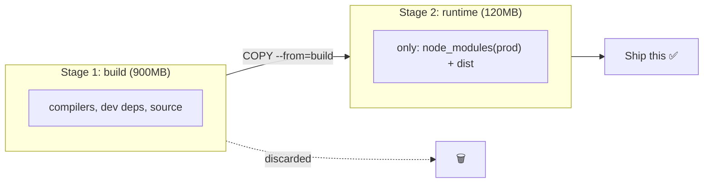

> [!IMPORTANT]
> **Multi-stage builds** are the single biggest lever for small, secure images. The final image contains **none** of the build tools, source code, or dev dependencies — shrinking size from ~1GB to ~100MB and **drastically reducing attack surface**. For Java, build with Maven/Gradle in stage 1, copy the JAR into a JRE (or distroless) image in stage 2 (see [[05 Spring Boot]]).

### 3.2 Image Size & Security Optimization

| Technique | Impact |
|---|---|
| **Multi-stage builds** | Ship only artifacts |
| **Small base images** (`alpine`, `distroless`, `slim`) | 5MB vs 900MB base |
| **`.dockerignore`** | Exclude `node_modules`, `.git`, secrets from build context |
| **Combine `RUN` layers** | Fewer layers; clean apt cache in same layer |
| **Pin base image digests** | Reproducible, tamper-evident builds |
| **Non-root `USER`** | Limit blast radius of a container escape |
| **Minimal packages** | Less attack surface, faster pulls |

```dockerfile
# ❌ Bad: leaves apt cache in a layer, adds size
RUN apt-get update
RUN apt-get install -y curl

# ✅ Good: one layer, cache cleaned in the same layer
RUN apt-get update && apt-get install -y --no-install-recommends curl \
    && rm -rf /var/lib/apt/lists/*
```

```
# .dockerignore
node_modules
.git
.env
*.log
dist
Dockerfile
```

> [!WARNING]
> The **build context** (everything in the directory you run `docker build .` from) is sent to the daemon. Without a `.dockerignore`, you might ship your `.git` history, `.env` secrets, and huge `node_modules` into the image or at least slow the build massively. Always add `.dockerignore` — it's both a performance and a **security** control.

### 3.3 Distroless & Minimal Base Images

```dockerfile
# Java example — distroless (no shell, no package manager, no OS cruft)
FROM eclipse-temurin:21-jdk AS build
WORKDIR /app
COPY . .
RUN ./mvnw package -DskipTests

FROM gcr.io/distroless/java21-debian12
COPY --from=build /app/target/app.jar /app.jar
USER nonroot
ENTRYPOINT ["java", "-jar", "/app.jar"]
```

> [!TIP]
> **Distroless images** contain only your app + runtime — no shell, no package manager, no `curl`. This slashes attack surface (a compromised container can't `apt install` tools or spawn a shell) and CVE count. Trade-off: harder to debug (no `docker exec sh`) — use ephemeral debug containers or a `:debug` variant when needed.

### 3.4 Container Security

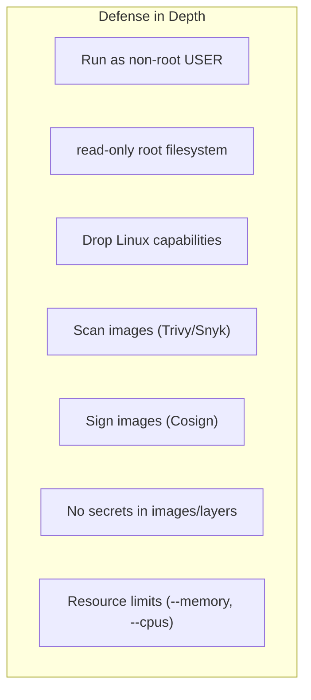

| Risk | Mitigation |
|---|---|
| **Running as root** | `USER` directive; `runAsNonRoot` |
| **Container escape** | Non-root, drop capabilities, seccomp/AppArmor, keep kernel patched |
| **Secrets baked into layers** | Never `COPY` secrets; use build secrets / runtime injection |
| **Vulnerable dependencies** | Scan with **Trivy/Snyk/Grype** in CI |
| **Tampered images** | Sign with **Cosign**; pin digests |
| **Resource exhaustion (DoS)** | `--memory`, `--cpus`, PIDs limits |
| **Privileged mode** | Avoid `--privileged`; it grants near-host access |

> [!WARNING]
> **Secrets in a Dockerfile are NOT hidden — they persist in the image layers forever**, even if you `rm` the file in a later instruction (the earlier layer still contains it). Anyone who pulls the image can extract it with `docker history` / layer inspection. Use **BuildKit build secrets** (`RUN --mount=type=secret`) for build-time creds and **runtime env/secret managers** for runtime creds. Never `ENV SECRET=...` or `COPY .env`.

### 3.5 BuildKit — the modern builder

BuildKit (default in modern Docker) adds:
- **Parallel** layer builds (independent stages build concurrently)
- **Build secrets** that never land in layers: `RUN --mount=type=secret,id=npmtoken ...`
- **Cache mounts**: `RUN --mount=type=cache,target=/root/.npm npm ci` (persistent dep cache across builds)
- **`--platform`** multi-arch builds (amd64 + arm64)

```dockerfile
# syntax=docker/dockerfile:1
FROM node:20-alpine
WORKDIR /app
COPY package*.json ./
# Cache mount: npm cache survives between builds → faster
RUN --mount=type=cache,target=/root/.npm npm ci
# Build secret: token available only during this RUN, never in a layer
RUN --mount=type=secret,id=gh_token \
    GH_TOKEN=$(cat /run/secrets/gh_token) ./fetch-private-deps.sh
```

> [!TIP]
> Multi-arch matters now that Apple Silicon (arm64) and AWS Graviton (arm64) are everywhere. Use `docker buildx build --platform linux/amd64,linux/arm64 -t app:1.0 --push .` to publish a **manifest list** so the right architecture is pulled automatically on each host.

### 3.6 Graceful Shutdown & Signals

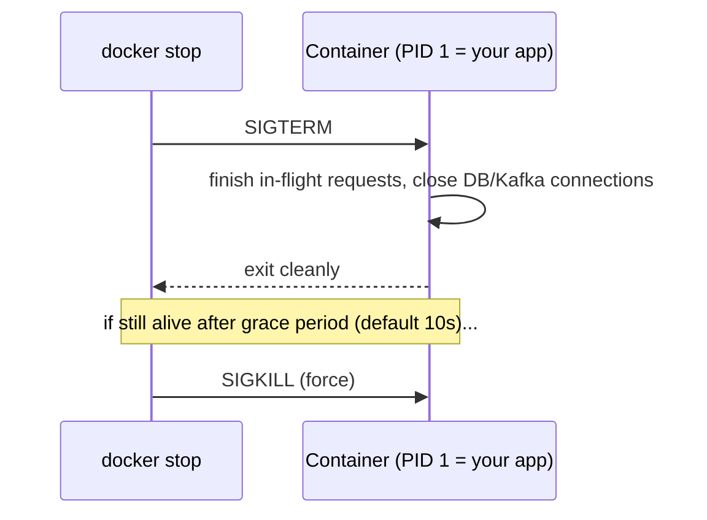

```javascript
// Node.js graceful shutdown (see [[05 Node.js]])
process.on('SIGTERM', async () => {
  server.close();              // stop accepting new connections
  await db.end();              // drain [[02 Postgres]] pool
  await kafkaConsumer.disconnect();
  process.exit(0);
});
```

> [!WARNING]
> If your app isn't **PID 1** (shell-form `CMD`) or ignores `SIGTERM`, `docker stop` waits the grace period then **SIGKILLs** — dropping in-flight requests and skipping cleanup. Use **exec-form CMD** so your app is PID 1, handle SIGTERM, and consider an init like **`--init`** (tini) to reap zombie processes if your app spawns children. This directly ties to zero-downtime rollouts in [[02 Kubernetes]].

### 3.7 Failure Scenarios & Production Issues

| Failure | Symptom | Mitigation |
|---|---|---|
| **Image bloat** | Slow pulls, big attack surface | Multi-stage, alpine/distroless, `.dockerignore` |
| **Cache busting on every build** | Slow CI | Order Dockerfile: deps before source |
| **Container OOM** | `OOMKilled`, exit 137 | Set `--memory`, right-size app, fix leaks |
| **Data loss on `rm`** | Gone data | Use named volumes, not writable layer |
| **Zombie processes** | PID buildup | `--init` / tini as PID 1 |
| **Secrets leaked in layers** | Credential exposure | BuildKit secrets, never COPY secrets |
| **Time drift / DNS issues** | Flaky networking | Proper network config, healthchecks |
| **`latest` tag chaos** | Unreproducible deploys | Pin explicit versions/digests |
| **Disk full** | Build/run failures | `docker system prune`, log rotation |
| **Root container escape** | Host compromise | Non-root, drop caps, seccomp |

> [!IMPORTANT]
> **Never deploy `image:latest` to production.** `latest` is a moving pointer — two hosts can pull different images under the same tag, and you can't reproduce or roll back reliably. Always deploy **immutable, explicit tags** (`app:1.4.2`) or, best, **digests** (`app@sha256:...`). This is the single most common production Docker mistake.

---

## 4. 🏗️ REAL-WORLD SYSTEM DESIGN USAGE

### 4.1 Docker in the CI/CD Pipeline

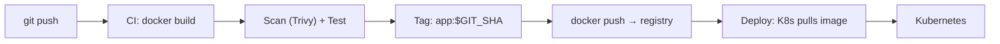

The image is the **immutable deployable artifact**. Built once in CI ([[06 Jenkins]] / [[07 CICD GitHub Actions]]), scanned, tagged with the git SHA, pushed to a registry, then pulled by [[02 Kubernetes]] / [[03 Helm Charts]]. "Build once, promote the same image through dev → staging → prod."

### 4.2 How big companies use Docker/containers

| Company | Usage |
|---|---|
| **Google** | Runs *everything* in containers (billions/week); pioneered with Borg → [[02 Kubernetes]] |
| **Netflix** | Containerized microservices + Titus orchestration |
| **Spotify, Uber, Airbnb** | Microservices packaged as containers, orchestrated on K8s |
| **PayPal, banks** | Containerized legacy + new apps for portability & density |

### 4.3 Container Registries

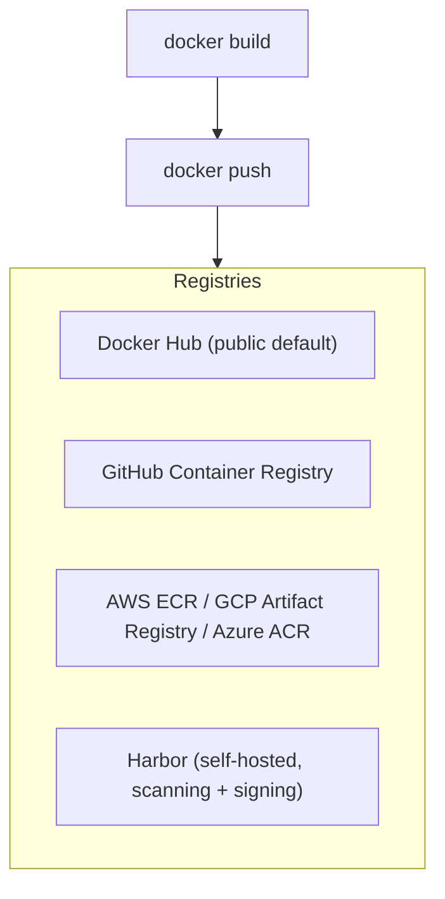

Production registries add **vulnerability scanning**, **image signing**, **access control (RBAC)**, **retention policies**, and **replication**. Beware Docker Hub **rate limits** — use an authenticated pull-through cache or a private registry in CI.

### 4.4 Docker vs the Ecosystem

| Tool | Relationship |
|---|---|
| **Docker** | Build + run containers on a single host |
| **[[02 Kubernetes]]** | Orchestrates containers across many hosts (uses containerd, not Docker Engine, to run them) |
| **[[03 Helm Charts]]** | Packages K8s manifests for those containers |
| **Podman** | Daemonless, rootless Docker-compatible alternative |
| **containerd / CRI-O** | The lower-level runtimes K8s actually uses |
| **Docker Compose** | Multi-container on one host (dev / small prod) |
| **Docker Swarm** | Docker's built-in orchestrator (largely superseded by K8s) |

> [!IMPORTANT]
> **"Kubernetes removed Docker" — clarified:** K8s deprecated the *Docker Engine shim* (dockershim) as its runtime in v1.24, switching to **containerd/CRI-O** directly. But **images you build with Docker still run fine** — they follow the **OCI (Open Container Initiative)** standard. Docker for building images + containerd for running them in K8s is the normal modern setup. Docker isn't "dead" in K8s; only the redundant runtime shim was removed.

### 4.5 The OCI Standard

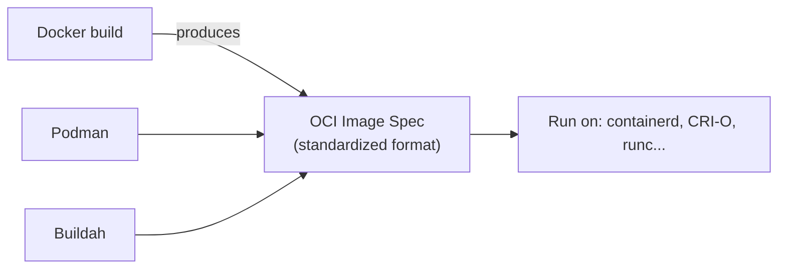

Docker donated its image + runtime formats to the **Open Container Initiative**, so images and runtimes are now **vendor-neutral standards**. This is why a Docker-built image runs on any OCI-compliant runtime, and why the ecosystem interoperates.

---

## 5. 🎤 INTERVIEW PREPARATION

### 5.1 Most important questions

<details>
<summary><b>Q1: Container vs Virtual Machine?</b></summary>

A VM virtualizes **hardware** — each VM runs a full guest OS on a hypervisor (GBs, minutes to boot, strong isolation). A container virtualizes the **OS** — containers share the host kernel, isolated via namespaces/cgroups (MBs, milliseconds to start, weaker isolation). Containers give far higher density and speed; VMs give stronger security boundaries. They're often combined (containers *inside* VMs in the cloud).
</details>

<details>
<summary><b>Q2: Image vs Container?</b></summary>

An **image** is an immutable, read-only template (app + dependencies + config), built in layers. A **container** is a running instance of an image with a thin writable layer on top. Image = class, container = instance; you run many containers from one image.
</details>

<details>
<summary><b>Q3: How does layer caching work and how do you optimize a Dockerfile?</b></summary>

Each instruction creates a cached layer. Docker reuses cache until an instruction's inputs change, then rebuilds it and everything after. Optimize by ordering **least-to-most frequently changing**: copy dependency manifests + install deps *before* copying source, so code changes don't invalidate the expensive install layer. Add multi-stage builds, small bases, and `.dockerignore`.
</details>

<details>
<summary><b>Q4: CMD vs ENTRYPOINT?</b></summary>

`ENTRYPOINT` defines the fixed executable; `CMD` provides default arguments (or a default command). Args from `docker run` **replace** CMD but **append** to ENTRYPOINT. Common pattern: `ENTRYPOINT ["app-binary"]` + `CMD ["--default-flag"]`. Always use exec form for correct signal handling.
</details>

<details>
<summary><b>Q5: What are multi-stage builds and why use them?</b></summary>

Multiple `FROM` stages in one Dockerfile: build in a heavy image (compilers, dev deps), then `COPY --from=build` only the artifact into a tiny runtime image. Result: much smaller images (~10x), no build tools/source in the final image, and greatly reduced attack surface.
</details>

<details>
<summary><b>Q6: How do you persist data in Docker?</b></summary>

Containers are ephemeral (writable layer dies on `rm`). Use **named volumes** (Docker-managed, best for prod DB data), **bind mounts** (host path → container, best for dev live-reload), or **tmpfs** (in-memory). Databases must use volumes.
</details>

<details>
<summary><b>Q7: How do containers communicate?</b></summary>

On a **user-defined bridge network**, containers resolve each other by **name** via Docker's embedded DNS. `-p host:container` publishes ports to the host. For multi-host, overlay networks (Swarm) or [[02 Kubernetes]] Services. Compose auto-creates a network so services reach each other by service name.
</details>

<details>
<summary><b>Q8: How do you keep images small and secure?</b></summary>

Multi-stage builds, minimal base (alpine/distroless/slim), `.dockerignore`, combine RUN layers + clean caches, run as **non-root**, no secrets in layers, pin versions/digests, and scan with Trivy/Snyk in CI. Sign images with Cosign for supply-chain integrity.
</details>

<details>
<summary><b>Q9: Did Kubernetes remove Docker?</b></summary>

K8s removed **dockershim** (the Docker Engine runtime adapter) in v1.24, using **containerd/CRI-O** directly. Docker-built **images still run** because they're OCI-standard. You build with Docker, run with containerd — no problem.
</details>

### 5.2 Tricky questions

> [!TIP]
> **"Why is my container exiting immediately?"** — A container runs as long as its **PID 1 process** runs. If `CMD` starts a process that forks to background and exits (or there's no long-running foreground process), the container stops. Run the app in the **foreground** as PID 1.

> [!TIP]
> **"I put a secret in the Dockerfile then deleted it — is it safe?"** — **No.** The secret persists in the earlier **layer** forever; `docker history` / layer extraction reveals it. Use BuildKit secrets or runtime injection.

> [!TIP]
> **"Why does `docker stop` take 10 seconds?"** — Your app isn't handling `SIGTERM` (or isn't PID 1 due to shell-form CMD), so Docker waits the grace period, then SIGKILLs. Handle SIGTERM + use exec form.

> [!TIP]
> **"Is a container a lightweight VM?"** — No — a container is an **isolated process** (namespaces + cgroups), not a virtualized machine. It shares the host kernel; there's no guest OS.

### 5.3 Common mistakes candidates make

| Mistake | Reality |
|---|---|
| "Container = mini VM" | It's an isolated process sharing the kernel |
| Deploying `:latest` | Unreproducible — pin versions/digests |
| Secrets in Dockerfile/ENV | Baked into layers forever |
| Running as root | Container escape = host risk; use non-root |
| Copying source before deps | Busts dependency cache every build |
| Data in writable layer | Lost on `rm`; use volumes |
| Shell-form CMD | Breaks signal handling / graceful shutdown |
| No `.dockerignore` | Bloated, insecure build context |
| One giant single-stage image | Use multi-stage builds |

### 5.4 What interviewers actually expect

- Clear **container vs VM** distinction and the **namespaces/cgroups** basis.
- **Image/layer/cache** model and Dockerfile **optimization** instincts.
- **Multi-stage builds, small bases, non-root, no secrets in layers** — the production hygiene.
- **Volumes vs bind mounts**, **networking/DNS**, **signals/graceful shutdown**.
- How Docker fits with **OCI, containerd, and [[02 Kubernetes]]** (the "Docker removed" nuance).

---

## 6. 🛠️ HANDS-ON PROJECTS

### Project 1: Containerize a Full-Stack App (Beginner→Intermediate)

**Goal:** Dockerize an API + DB + cache and run it all with one command.

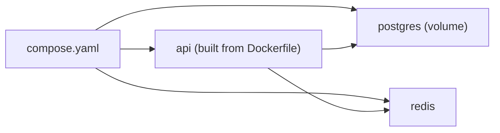

**Steps:**
1. Write a Dockerfile for a [[05 Node.js]] or [[05 Spring Boot]] API (deps-before-source ordering).
2. Add a `.dockerignore`.
3. Create `compose.yaml` with api + [[02 Postgres]] + Redis, a named volume, and healthchecks.
4. Use `depends_on: condition: service_healthy`.
5. `docker compose up` → hit the API → verify data persists across `down`/`up`.

**Learn:** Dockerfile basics, Compose, volumes, networking, healthchecks.

---

### Project 2: Optimize & Secure a Production Image (Intermediate→Senior)

**Goal:** Take a 1GB image down to ~100MB and harden it.


**Steps:**
1. Start from a naive single-stage Dockerfile.
2. Convert to **multi-stage**; switch runtime to **alpine/distroless**.
3. Add non-root `USER`, pin base image by **digest**, combine RUN layers.
4. Scan with **Trivy** before/after; fix criticals.
5. Use **BuildKit cache mounts** + **build secrets**; publish **multi-arch** with buildx.
6. Compare image size + CVE count before/after.

**Learn:** multi-stage, distroless, security hardening, scanning, BuildKit, multi-arch.

---

### Project 3: Build → Scan → Push in CI, Deploy to K8s (Senior)

**Goal:** A full image supply chain from commit to cluster.

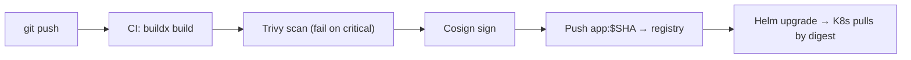

**Steps:**
1. In [[07 CICD GitHub Actions]] / [[06 Jenkins]], build the image tagged with the git SHA.
2. Scan with Trivy; **fail the build** on critical CVEs.
3. Sign the image with **Cosign**; push to GHCR/ECR.
4. Deploy via [[03 Helm Charts]] to [[02 Kubernetes]], referencing the image **by digest**.
5. Verify the signature at admission (Kyverno/cosign policy).

**Learn:** image supply chain, scanning gates, signing, immutable digests, CI/CD + K8s integration.

---

## 7. 🔬 DEEP DIVE: INTERNALS

### 7.1 What Actually Makes a Container (namespaces + cgroups)

A container isn't a "thing" — it's a **normal Linux process** wrapped in kernel features:

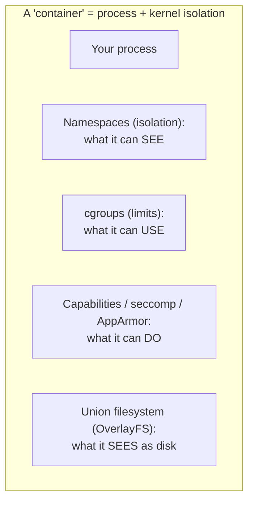

**Linux namespaces** (isolation — what a process can *see*):

| Namespace | Isolates |
|---|---|
| **PID** | Process IDs (container sees its own PID 1) |
| **NET** | Network interfaces, IPs, ports |
| **MNT** | Filesystem mounts |
| **UTS** | Hostname |
| **IPC** | Inter-process communication |
| **USER** | User/group IDs (root in container ≠ host root, if userns) |
| **cgroup** | cgroup root view |

**cgroups (control groups)** — limit what a process can *use*: CPU, memory, disk I/O, PIDs. This is how `--memory 512m` and `--cpus 1.5` are enforced.

> [!IMPORTANT]
> **A container is just a Linux process with restricted vision (namespaces) and restricted resources (cgroups), using a layered filesystem (OverlayFS).** There's no "container" kernel object — Docker orchestrates these primitives. This is why containers are so light (no guest OS) and why they share the host kernel (the isolation is *within* one kernel). Understanding this demystifies everything.

### 7.2 The Runtime Stack

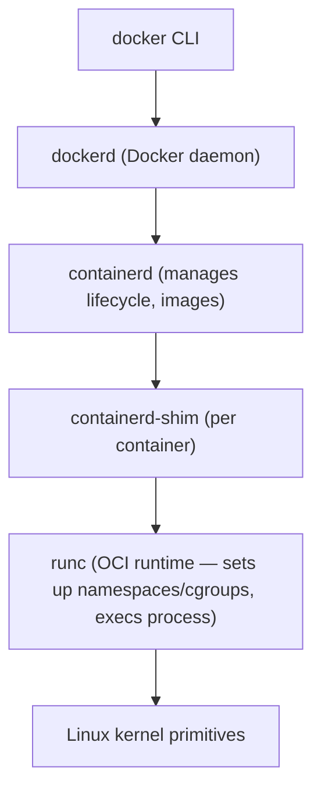

- **dockerd** — high-level daemon (API, build, networking, volumes).
- **containerd** — core runtime (image pull, container lifecycle); **used directly by [[02 Kubernetes]]**.
- **runc** — the low-level OCI runtime that actually creates the namespaces/cgroups and launches the process, then exits.
- **shim** — keeps the container running independently of dockerd (so restarting Docker doesn't kill containers).

### 7.3 Union Filesystems (OverlayFS)

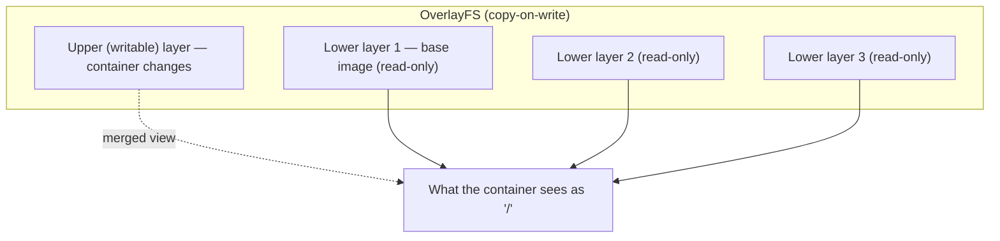

- Read-only image layers are stacked; the container gets a **writable upper layer**.
- **Copy-on-write**: modifying a file copies it up from a lower layer into the writable layer first.
- Deleting the container discards only the upper layer — the shared image layers remain (and are reused by other containers).

> [!TIP]
> Copy-on-write explains two things: (1) starting a container is instant (no copying — just a new thin writable layer), and (2) many containers from one image share the same read-only layers, so 100 containers of the same image use almost no extra disk. Heavy *writes* inside a container, however, bloat the writable layer — another reason to put data on **volumes**.

### 7.4 Image Manifest & Content Addressing

```mermaid
flowchart TB
    Manifest["Image Manifest (JSON)"] --> Config["Config (env, cmd, layers order)"]
    Manifest --> Layers["Layer digests (sha256:...)"]
    Layers --> Blob1["Layer blob 1 (tar.gz, content-addressed)"]
    Layers --> Blob2["Layer blob 2"]
    ML["Manifest List (multi-arch)"] --> Manifest
    ML --> Manifest2["...arm64 manifest"]
```

- Every layer and config is **content-addressed** by SHA-256 — the digest *is* the identity, so it's tamper-evident and dedup-able.
- A **manifest** lists the config + ordered layer digests.
- A **manifest list** (image index) maps architectures → manifests, enabling multi-arch `image:tag`.
- `image@sha256:...` pins the exact bytes — immutable, unlike a mutable tag.

### 7.5 Storage & Network Drivers

| Subsystem | Pluggable drivers |
|---|---|
| **Storage** | overlay2 (default), btrfs, zfs, devicemapper |
| **Network** | bridge, host, none, overlay, macvlan, ipvlan |
| **Logging** | json-file (default), journald, syslog, fluentd, awslogs |

> [!TIP]
> In production, configure **log rotation** on the json-file driver (`max-size`, `max-file`) or ship logs to a central system (fluentd/Loki). Unbounded container logs are a top cause of "disk full" outages on Docker hosts.

---

## ✅ Production Checklists

### Image Build
- [ ] **Multi-stage build** (no build tools in final image)
- [ ] Minimal base (**alpine / distroless / slim**), pinned by **digest**
- [ ] `.dockerignore` excludes `.git`, `node_modules`, secrets, `.env`
- [ ] Deps installed **before** copying source (cache optimization)
- [ ] Combined `RUN` layers; caches cleaned in the same layer
- [ ] **No secrets** in layers/ENV (use BuildKit secrets)
- [ ] `HEALTHCHECK` defined

### Runtime Security
- [ ] Runs as **non-root** `USER`
- [ ] `--read-only` root filesystem where possible
- [ ] Dropped Linux capabilities; no `--privileged`
- [ ] Resource limits (`--memory`, `--cpus`, PIDs)
- [ ] Image **scanned** (Trivy/Snyk) — build fails on criticals
- [ ] Image **signed** (Cosign); verified at deploy

### Operations
- [ ] Explicit **version/digest tags** (never `latest` in prod)
- [ ] Exec-form `CMD`/`ENTRYPOINT`; handles **SIGTERM**
- [ ] `--init` for zombie reaping if spawning children
- [ ] **Log rotation** configured (`max-size`/`max-file`)
- [ ] Persistent data on **named volumes**, backed up
- [ ] Restart policy set (`unless-stopped`/`on-failure`)
- [ ] Registry with scanning, RBAC, retention

---

## 🗺️ Learning Roadmap

```mermaid
flowchart TB
    A["1️⃣ Basics<br/>images vs containers, run/build, CLI"] --> B["2️⃣ Dockerfile<br/>instructions, layers, caching"]
    B --> C["3️⃣ Data & Networking<br/>volumes, bind mounts, networks, DNS"]
    C --> D["4️⃣ Compose<br/>multi-container apps, healthchecks"]
    D --> E["5️⃣ Optimization<br/>multi-stage, small bases, .dockerignore"]
    E --> F["6️⃣ Security<br/>non-root, scanning, secrets, signing"]
    F --> G["7️⃣ Ecosystem<br/>registries, OCI, BuildKit, multi-arch, CI/CD"]
    G --> H["8️⃣ Internals<br/>namespaces, cgroups, OverlayFS, runc/containerd"]
```

| Stage | Focus | You can... |
|---|---|---|
| 1–2 | Basics + Dockerfile | Build and run images |
| 3–4 | Data + Compose | Run multi-container local stacks |
| 5–6 | Optimization + security | Ship small, hardened production images |
| 7–8 | Ecosystem + internals | Integrate CI/CD + K8s; reason at kernel level |

---

## 🔁 Self-Review Completion Loop

Reviewed against official Docker docs, best practices, edge cases, interview patterns, and production scenarios.

### Gap Review Matrix

| Dimension | Covered? | Where |
|---|---|---|
| What/why, dependency-hell problem | ✅ | §1 |
| Containers vs VMs | ✅ | §1 |
| Architecture (client/daemon/registry) | ✅ | §2.1 |
| Images & layers | ✅ | §2.2 |
| Dockerfile instructions | ✅ | §2.3 |
| CMD vs ENTRYPOINT | ✅ | §2.4 |
| CLI lifecycle | ✅ | §2.5 |
| Volumes & bind mounts | ✅ | §2.6 |
| Networking & DNS | ✅ | §2.7 |
| Docker Compose | ✅ | §2.8 |
| Multi-stage builds | ✅ | §3.1 |
| Image size/security optimization | ✅ | §3.2 |
| Distroless/minimal bases | ✅ | §3.3 |
| Container security | ✅ | §3.4 |
| BuildKit (secrets/cache/multi-arch) | ✅ | §3.5 |
| Signals & graceful shutdown | ✅ | §3.6 |
| Failure scenarios | ✅ | §3.7 |
| CI/CD integration | ✅ | §4.1 |
| Registries | ✅ | §4.3 |
| Docker vs K8s/containerd/OCI | ✅ | §4.4–4.5 |
| Namespaces & cgroups | ✅ | §7.1 |
| Runtime stack (dockerd/containerd/runc) | ✅ | §7.2 |
| OverlayFS / copy-on-write | ✅ | §7.3 |
| Image manifest / content addressing | ✅ | §7.4 |
| Storage/network/logging drivers | ✅ | §7.5 |
| Interview Q&A + mistakes | ✅ | §5 |
| Hands-on projects | ✅ | §6 |

> [!NOTE]
> **Remaining depth to explore independently:** rootless Docker & Podman internals, user namespace remapping, seccomp/AppArmor/SELinux profiles in depth, Docker Swarm mode, gVisor/Kata (sandboxed runtimes for stronger isolation), Dockerfile `HEALTHCHECK` tuning, and Docker Desktop vs Engine on macOS/Windows (the hidden Linux VM).

---

## 📚 Official References

| Resource | URL |
|---|---|
| Docker Docs | https://docs.docker.com/ |
| Dockerfile Reference | https://docs.docker.com/reference/dockerfile/ |
| Dockerfile Best Practices | https://docs.docker.com/build/building/best-practices/ |
| Multi-stage Builds | https://docs.docker.com/build/building/multi-stage/ |
| Compose Spec | https://docs.docker.com/compose/ |
| BuildKit | https://docs.docker.com/build/buildkit/ |
| Storage (volumes) | https://docs.docker.com/storage/ |
| Networking | https://docs.docker.com/network/ |
| OCI Spec | https://opencontainers.org/ |
| Trivy (scanning) | https://trivy.dev/ |

---

## 🎁 Final Summary

> [!IMPORTANT]
> **The one-paragraph takeaway:** Docker packages an app plus its entire environment into an immutable, layered **image** that runs as an isolated **container** — a normal Linux process fenced by **namespaces** (isolation) and **cgroups** (limits), using a copy-on-write **OverlayFS**. This delivers VM-like isolation with process-like speed, killing "works on my machine." Master the **image/layer/cache** model and Dockerfile ordering, use **multi-stage builds + minimal bases** for small secure images, run **non-root with no secrets in layers**, persist data on **volumes**, wire multi-container apps with **Compose + user-defined networks**, and never ship **`:latest`** to prod. Docker builds the OCI-standard artifact that [[02 Kubernetes]] (via containerd) orchestrates — it's the foundation of the entire cloud-native stack.

**Golden rules:**
1. 📦 **Image = class, Container = instance** — immutable images, ephemeral containers.
2. 🧅 Order the Dockerfile **deps-before-source** to preserve layer cache.
3. 🏗️ **Multi-stage + small base** = small, secure images.
4. 🔐 Run **non-root**; **never** bake secrets into layers.
5. 💾 Persistent data → **named volumes**, not the writable layer.
6. 🏷️ Deploy **immutable digests/versions**, never `:latest`.
7. ✍️ **Exec-form CMD** + handle **SIGTERM** for graceful shutdown.
8. 🔬 A container is **a process** (namespaces + cgroups), not a mini-VM.

---

*Related guides in this vault: [[02 Kubernetes]] · [[03 Helm Charts]] · [[06 Jenkins]] · [[07 CICD GitHub Actions]] · [[03 Microservices]] · [[05 Node.js]] · [[05 Spring Boot]] · [[02 Postgres]]*
