# ☸️ Kubernetes — Complete Beginner-to-Expert Reference

> The container orchestration platform that runs the modern cloud — declarative desired-state management, self-healing, and elastic scaling across thousands of machines.

---

## 📑 Table of Contents

1. [Executive Summary](#-executive-summary)
2. [Fundamentals (Beginner)](#1--fundamentals-beginner-level)
3. [Core Concepts (Intermediate)](#2--core-concepts-intermediate-level)
4. [Advanced Concepts (Senior)](#3--advanced-concepts-senior-level)
5. [Real-World System Design](#4--real-world-system-design-usage)
6. [Interview Preparation](#5--interview-preparation)
7. [Hands-On Projects](#6--hands-on-projects)
8. [Deep Dive: Internals](#7--deep-dive-internals)
9. [Production Checklists](#-production-checklists)
10. [Learning Roadmap](#-learning-roadmap)
11. [Self-Review Completion Loop](#-self-review-completion-loop)
12. [Official References](#-official-references)
13. [Final Summary](#-final-summary)

---

## 🎯 Executive Summary

**Kubernetes (K8s)** is an open-source **container orchestration platform** that automates deploying, scaling, healing, and networking containerized applications across a cluster of machines. You declare the **desired state** ("run 5 replicas of this app"), and Kubernetes continuously works to make reality match it.

| What it is | What it replaces | Core superpower |
|---|---|---|
| Declarative container orchestrator | Manual server management, bespoke deploy scripts, static VM fleets | **Self-healing, declarative desired-state** reconciliation + elastic scaling across many nodes |

> [!IMPORTANT]
> Kubernetes' defining idea is the **reconciliation loop**: you declare *what* you want (not *how*), and controllers continuously drive the actual state toward that desired state — restarting crashed pods, replacing dead nodes, scaling to meet demand. This "declarative + self-healing" model is *the* mental shift. Everything else (Pods, Deployments, Services) is machinery serving that loop.

Related guides: [[03 Helm Charts]] · [[03 Microservices]] · [[07 CICD GitHub Actions]] · [[06 Jenkins]] · [[01 Kafka]] · [[02 Postgres]]

---

## 1. 🌱 FUNDAMENTALS (Beginner Level)

### What is Kubernetes in simple terms?

Imagine you have 100 applications to run across 20 servers. By hand you'd have to decide which app runs where, restart crashed ones at 3 AM, move workloads off failed servers, scale up during traffic spikes, and wire up networking. **Kubernetes is the automated operations team that does all of this for you** — you just tell it what you want running, and it figures out the rest.

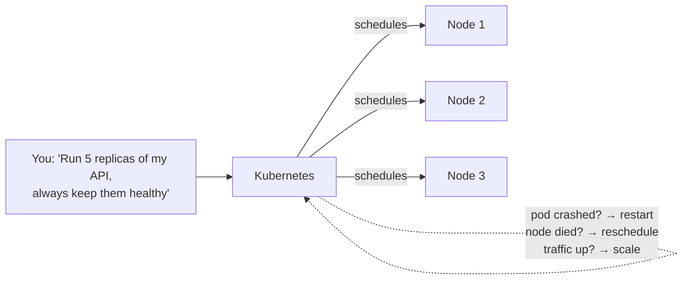

### Why does Kubernetes exist?

Containers ([[03 Microservices]] packaged via Docker) solved "it works on my machine." But running **many** containers across **many** servers created new problems:

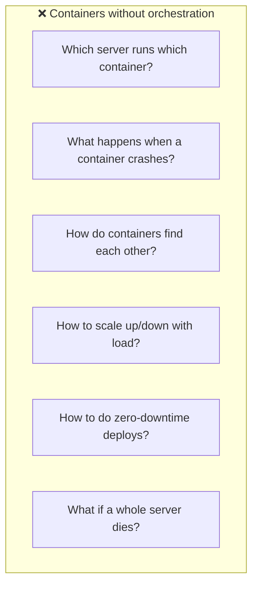

Google ran billions of containers with an internal system called **Borg**; Kubernetes (2014) is its open-source descendant. It answers every question above **automatically**.

### Problems Kubernetes solves

| Problem | How K8s solves it |
|---|---|
| **Where to run containers** | Scheduler places pods on optimal nodes |
| **Crashes** | Self-healing: restarts failed containers, reschedules off dead nodes |
| **Service discovery** | Built-in DNS + Services give stable addresses |
| **Scaling** | Horizontal Pod Autoscaler scales with load |
| **Zero-downtime deploys** | Rolling updates + health checks + instant rollback |
| **Load balancing** | Services distribute traffic across replicas |
| **Config & secrets** | ConfigMaps/Secrets decouple config from images |
| **Storage** | Persistent Volumes abstract cloud/on-prem storage |
| **Multi-cloud portability** | Same API on AWS/GCP/Azure/on-prem |

### Core concepts (the vocabulary)

| Term | Plain meaning |
|---|---|
| **Cluster** | The whole set of machines K8s manages |
| **Node** | A single worker machine (VM or physical) |
| **Control Plane** | The brain that makes global decisions |
| **Pod** | Smallest deployable unit — one or more containers sharing network/storage |
| **Deployment** | Manages a replicated, self-healing set of identical pods |
| **ReplicaSet** | Ensures N copies of a pod exist (managed by Deployment) |
| **Service** | Stable network endpoint + load balancer for a set of pods |
| **Ingress** | HTTP(S) routing from outside into Services |
| **ConfigMap / Secret** | External configuration / sensitive data |
| **Namespace** | Virtual cluster for isolating groups of resources |
| **kubectl** | The CLI to talk to the cluster |
| **Manifest** | A YAML file declaring a desired resource |

### Real-world analogy 🚢

Kubernetes ("helmsman" in Greek) is the **captain + crew of a container ship**:
- **Shipping containers** = your app containers
- The **ship** = the cluster; **cargo holds** = nodes
- The **captain** = control plane (decides where cargo goes)
- **Dock workers** = kubelet on each node (load/unload as told)
- **Cargo manifest** = your YAML (what should be aboard)
- **"A container fell overboard"** → captain immediately orders a replacement (self-healing)
- **"More cargo this route"** → add containers/holds (scaling)

> [!TIP]
> The one idea that makes everything click: **you declare desired state; controllers reconcile actual state toward it — forever.** You never say "start this container on that server." You say "5 of these should exist," and K8s makes it true and *keeps* it true.

---

## 2. 🧩 CORE CONCEPTS (Intermediate Level)

### 2.1 Cluster Architecture

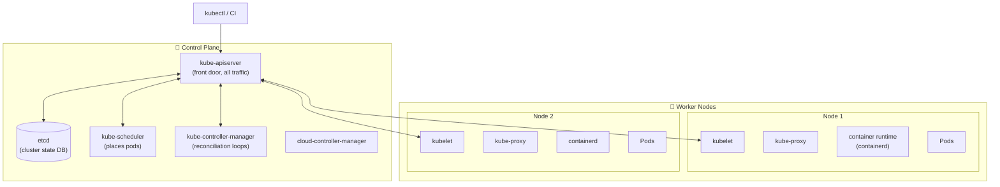

**Control Plane components:**

| Component | Role |
|---|---|
| **kube-apiserver** | The **only** component that talks to etcd; all requests (kubectl, controllers, kubelets) go through it. REST API + validation + auth. |
| **etcd** | Distributed key-value store holding **all** cluster state (the single source of truth). |
| **kube-scheduler** | Decides which node each new pod runs on (based on resources, affinity, taints). |
| **kube-controller-manager** | Runs the reconciliation loops (Deployment, ReplicaSet, Node, Job controllers…). |
| **cloud-controller-manager** | Integrates with cloud provider (load balancers, volumes, nodes). |

**Worker Node components:**

| Component | Role |
|---|---|
| **kubelet** | The node agent — ensures containers described in PodSpecs are running & healthy. |
| **kube-proxy** | Maintains network rules (iptables/IPVS) implementing Services. |
| **container runtime** | Actually runs containers (containerd, CRI-O; Docker shim removed in 1.24). |

> [!IMPORTANT]
> **etcd is the crown jewel.** It holds *all* cluster state. Lose etcd without a backup and you lose the entire cluster's config. The apiserver is the *only* thing that reads/writes it. In production: run etcd as a 3 or 5-node quorum, **back it up regularly**, and never expose it.

### 2.2 Pods — the atomic unit

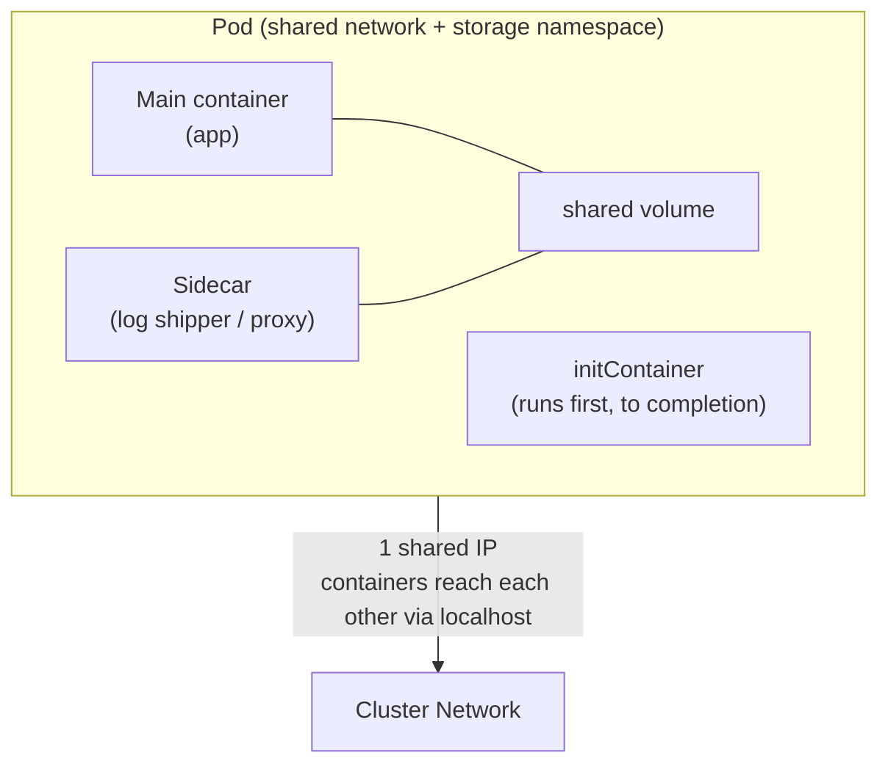

- A **Pod** wraps one or more tightly-coupled containers that share: **network** (one IP, reachable via `localhost` between them), **storage volumes**, and lifecycle.
- **Most pods = 1 container.** Multi-container pods are for **sidecars** (proxy, log collector) that must co-locate.
- **initContainers** run to completion *before* app containers start (setup, migrations, waiting for deps).

> [!WARNING]
> **Pods are ephemeral and disposable.** They get a new IP each time, can be killed/rescheduled anytime, and you should almost **never create a bare Pod** directly. Always use a controller (Deployment/StatefulSet/Job) so something manages replacement. Treating pods as pets is a classic beginner mistake.

### 2.3 The Controller Hierarchy

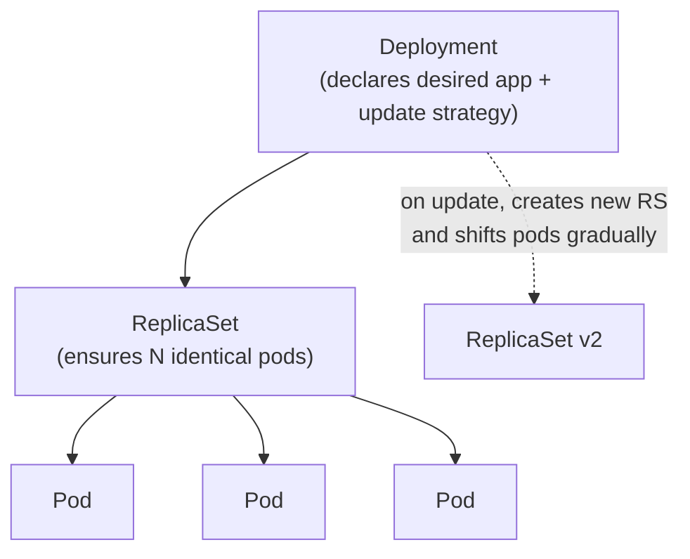

| Controller | Use for |
|---|---|
| **Deployment** | Stateless apps — rolling updates, rollback, scaling (the default) |
| **ReplicaSet** | Low-level replica guarantee (managed by Deployment; rarely used directly) |
| **StatefulSet** | Stateful apps needing stable identity/storage (databases, [[01 Kafka]]) |
| **DaemonSet** | One pod per node (log agents, monitoring, CNI) |
| **Job** | Run-to-completion task (batch, migration) |
| **CronJob** | Scheduled Jobs (backups, reports) |

### 2.4 Services — stable networking

Pods come and go with changing IPs. **Services** provide a stable virtual IP + DNS name + load balancing over a dynamic set of pods (selected by labels).

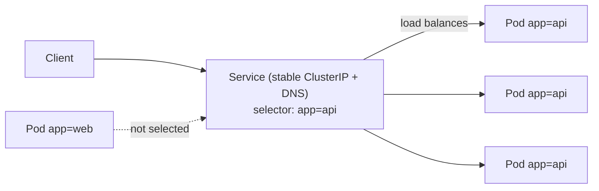

| Service type | Exposure | Use |
|---|---|---|
| **ClusterIP** (default) | Internal only | Service-to-service inside cluster |
| **NodePort** | Opens a port on every node | Basic external access, dev |
| **LoadBalancer** | Provisions a cloud LB | Production external access (cloud) |
| **ExternalName** | DNS CNAME | Alias to external service |
| **Headless** (`clusterIP: None`) | No LB; direct pod DNS | StatefulSets, custom discovery |

**Ingress** sits above Services for L7 HTTP routing:

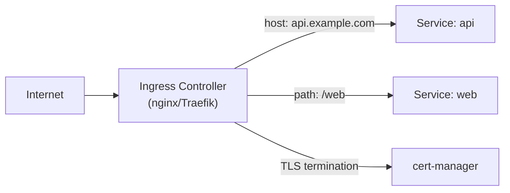

> [!TIP]
> **Service = L4 (TCP/IP) load balancing + discovery. Ingress = L7 (HTTP) routing** (host/path-based, TLS, one cloud LB for many services). Use ClusterIP Services internally and **one Ingress** for external HTTP instead of many expensive LoadBalancer Services. Newer clusters may use the **Gateway API** (Ingress's more expressive successor).

### 2.5 Configuration: ConfigMaps & Secrets

```yaml
apiVersion: v1
kind: ConfigMap
metadata: { name: app-config }
data:
  LOG_LEVEL: "info"
  DB_HOST: "postgres.default.svc.cluster.local"
---
apiVersion: v1
kind: Secret
metadata: { name: app-secrets }
type: Opaque
data:
  DB_PASSWORD: c3VwZXJzZWNyZXQ=   # base64 (NOT encrypted by default!)
```

Consumed as **env vars** or **mounted files**:

```yaml
envFrom:
  - configMapRef: { name: app-config }
  - secretRef: { name: app-secrets }
```

> [!WARNING]
> **Kubernetes Secrets are only base64-encoded, NOT encrypted, by default** — anyone with etcd or API read access can decode them. For real security: enable **encryption at rest** for etcd, tighten **RBAC**, and use **external secret managers** (Vault, AWS/GCP Secret Manager via External Secrets Operator). Never commit Secret YAML with real values to git — use **SOPS** or sealed-secrets.

### 2.6 The Declarative Workflow

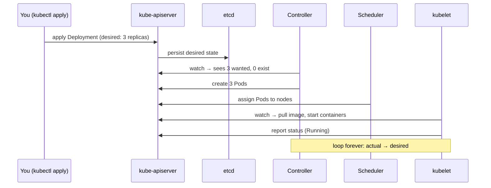

```bash
kubectl apply -f deployment.yaml     # declarative (preferred, idempotent)
kubectl get pods -o wide             # inspect
kubectl describe pod <name>          # events + details for debugging
kubectl logs -f <pod> [-c container] # stream logs
kubectl exec -it <pod> -- sh         # shell into a container
kubectl rollout status deploy/api    # watch a rollout
kubectl rollout undo deploy/api      # instant rollback
```

> [!IMPORTANT]
> Prefer **`kubectl apply`** (declarative) over `kubectl create`/`run` (imperative). Declarative manifests are version-controlled, idempotent, diffable, and enable GitOps. Imperative commands are fine for quick debugging, not for managing production state.

---

## 3. ⚙️ ADVANCED CONCEPTS (Senior Level)

### 3.1 Scheduling: Requests, Limits, QoS

```yaml
resources:
  requests:                 # guaranteed minimum → used for scheduling
    cpu: "250m"
    memory: "256Mi"
  limits:                   # hard cap → throttle/kill if exceeded
    cpu: "500m"
    memory: "512Mi"
```

| Setting | Effect if exceeded |
|---|---|
| CPU limit | **Throttled** (not killed) — app slows |
| Memory limit | **OOMKilled** — container terminated |
| Requests | Used by scheduler to find a node with capacity |

**Quality of Service classes** (determine eviction order under pressure):

| QoS | Condition | Eviction priority |
|---|---|---|
| **Guaranteed** | requests == limits for all resources | Evicted last |
| **Burstable** | requests < limits | Middle |
| **BestEffort** | no requests/limits | Evicted first |

> [!WARNING]
> **Setting memory `requests` far below `limits` invites trouble.** The scheduler packs nodes based on requests; if many pods burst toward their limits simultaneously, the node runs out of memory and starts **OOMKilling** pods (BestEffort/Burstable first). For critical workloads, set **requests == limits** (Guaranteed QoS). Never omit resource requests in production.

### 3.2 Advanced Scheduling Controls

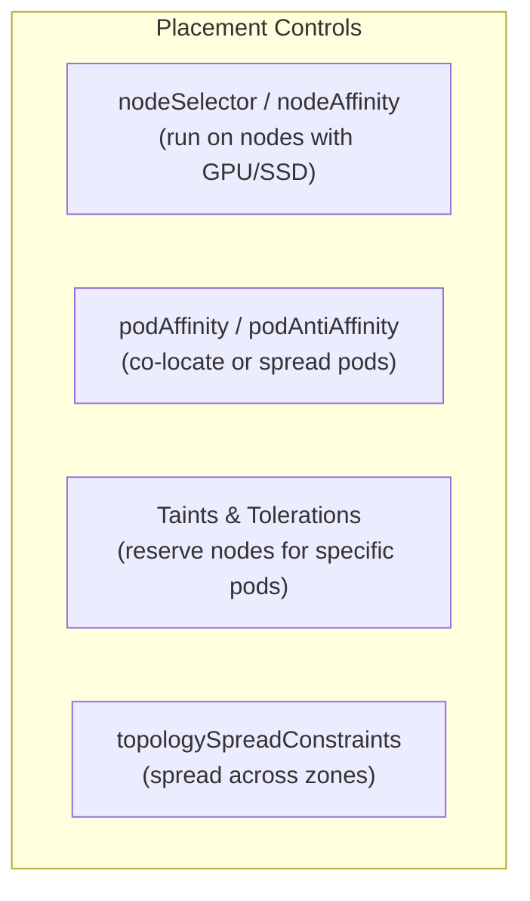

- **Taints** repel pods from a node; **tolerations** let specific pods ignore the taint (e.g., dedicate GPU nodes).
- **Affinity/anti-affinity** attract/repel pods relative to nodes or other pods (spread replicas across zones for HA).
- **topologySpreadConstraints** evenly distribute pods across failure domains.

> [!TIP]
> Use **podAntiAffinity** or **topologySpreadConstraints** to ensure replicas of a critical service don't all land on the same node/zone — otherwise one node failure takes down your whole "highly available" service. This is a top real-world resilience pattern.

### 3.3 Health Probes

```yaml
livenessProbe:                 # is the container alive? fail → restart
  httpGet: { path: /healthz, port: 8080 }
  initialDelaySeconds: 10
  periodSeconds: 10
readinessProbe:                # ready for traffic? fail → remove from Service
  httpGet: { path: /ready, port: 8080 }
  periodSeconds: 5
startupProbe:                  # for slow starters; gates the other probes
  httpGet: { path: /healthz, port: 8080 }
  failureThreshold: 30
  periodSeconds: 10
```

| Probe | Fails → | Purpose |
|---|---|---|
| **liveness** | Restart container | Recover from deadlocks/hangs |
| **readiness** | Remove from Service endpoints | Don't send traffic before ready / during overload |
| **startup** | (gates others) | Protect slow-booting apps from premature liveness kills |

> [!WARNING]
> A **too-aggressive liveness probe** is a common outage cause: if the app is briefly slow (GC pause, cold cache), liveness fails, K8s restarts it, it's slow again on restart → **restart loop / cascading failure**. Make liveness lenient (detect true hangs), use **readiness** to gate traffic, and **startup** probes for slow boots. Never point liveness at a deep dependency check.

### 3.4 Autoscaling

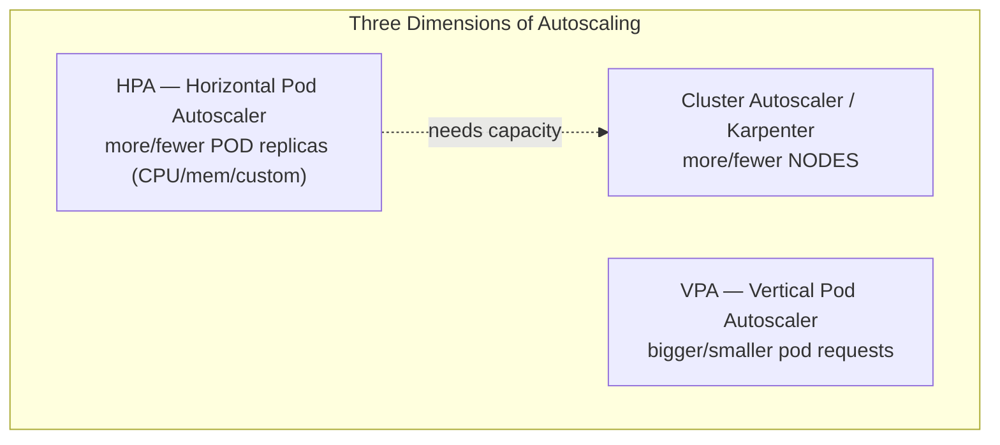

```yaml
apiVersion: autoscaling/v2
kind: HorizontalPodAutoscaler
spec:
  scaleTargetRef: { apiVersion: apps/v1, kind: Deployment, name: api }
  minReplicas: 3
  maxReplicas: 20
  metrics:
    - type: Resource
      resource: { name: cpu, target: { type: Utilization, averageUtilization: 70 } }
```

- **HPA** scales pod count on metrics (CPU/memory/custom via metrics-server or KEDA for event-driven, e.g. [[01 Kafka]] lag).
- **VPA** right-sizes requests/limits (usually not with HPA on the same metric).
- **Cluster Autoscaler / Karpenter** add/remove nodes when pods can't be scheduled.

> [!TIP]
> HPA + Cluster Autoscaler compose: HPA adds pods → if no node has room, Cluster Autoscaler provisions a node → pods schedule. For event-driven scaling (queue depth, Kafka lag, requests/sec), use **KEDA**, which can even scale to **zero**.

### 3.5 Rolling Updates, Rollbacks & Deployment Strategies

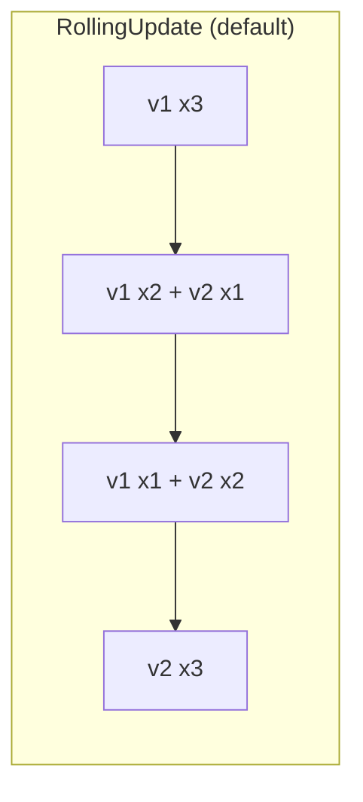

```yaml
strategy:
  type: RollingUpdate
  rollingUpdate:
    maxSurge: 1            # extra pods allowed above desired during update
    maxUnavailable: 0      # never drop below desired (zero-downtime)
```

| Strategy | How | Trade-off |
|---|---|---|
| **RollingUpdate** | Gradually replace old with new | Zero-downtime; both versions briefly coexist |
| **Recreate** | Kill all, then start new | Downtime; use when versions can't coexist |
| **Blue-Green** | Full parallel env, switch traffic | Instant switch/rollback; 2× resources |
| **Canary** | Route small % to new version | Safe gradual rollout; needs mesh/Ingress weighting |

> [!IMPORTANT]
> `maxUnavailable: 0` + `maxSurge: 1` + a correct **readinessProbe** = true zero-downtime deploys. Without a readiness probe, K8s sends traffic to pods that aren't ready yet → errors during every deploy. The probe is what makes rolling updates safe.

### 3.6 StatefulSets & Storage

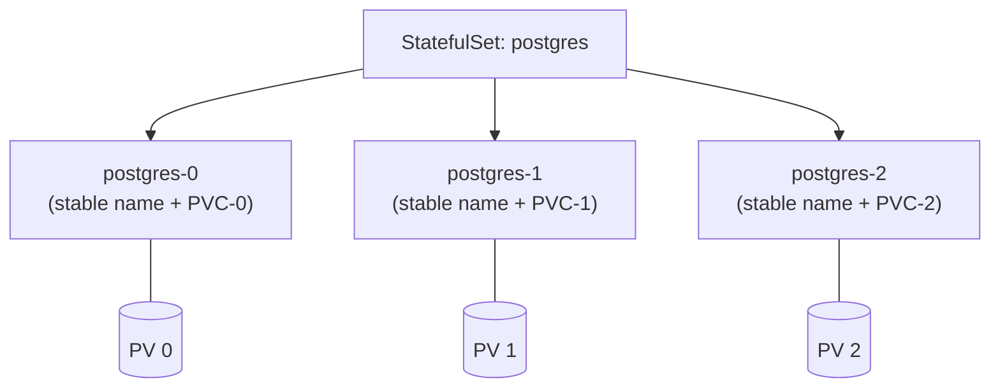

- **StatefulSet** gives **stable network identity** (`pod-0`, `pod-1`…), **ordered** startup/scaling, and **per-pod persistent storage** — essential for databases, [[01 Kafka]], ZooKeeper.
- **Persistent Volume (PV)** = a piece of storage; **PersistentVolumeClaim (PVC)** = a pod's request for storage; **StorageClass** = dynamic provisioning template.

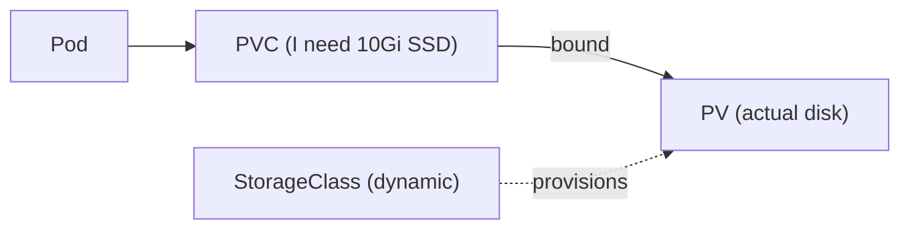

> [!WARNING]
> Databases on Kubernetes are advanced. StatefulSets handle identity/storage, but **backups, failover, and replication are your responsibility** — use a proper **Operator** (e.g., CloudNativePG for [[02 Postgres]], Strimzi for [[01 Kafka]]) rather than a raw StatefulSet. Many teams keep primary databases on managed services (RDS) and run only stateless apps on K8s.

### 3.7 Networking Model & Network Policies

Kubernetes networking rules:
1. Every **Pod gets its own IP**.
2. Pods can reach all other pods **without NAT** (flat network).
3. Implemented by a **CNI plugin** (Calico, Cilium, Flannel).

By default, **all pods can talk to all pods** — a security risk. **NetworkPolicies** restrict traffic:

```yaml
apiVersion: networking.k8s.io/v1
kind: NetworkPolicy
metadata: { name: db-allow-api }
spec:
  podSelector: { matchLabels: { app: postgres } }
  policyTypes: [Ingress]
  ingress:
    - from:
        - podSelector: { matchLabels: { app: api } }   # only 'api' pods may reach postgres
      ports:
        - { protocol: TCP, port: 5432 }
```

> [!IMPORTANT]
> **Default-deny NetworkPolicies** are a production security must. Without them, a compromised pod can reach *every* service in the cluster (lateral movement). Start with deny-all, then explicitly allow needed flows. Note: NetworkPolicy requires a CNI that enforces it (Calico/Cilium; Flannel alone doesn't).

### 3.8 RBAC & Security

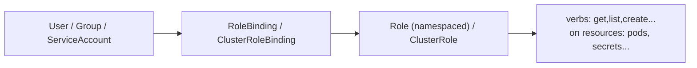

| Concept | Scope |
|---|---|
| **Role** | Permissions within a namespace |
| **ClusterRole** | Cluster-wide permissions |
| **RoleBinding** | Grants a Role to subjects in a namespace |
| **ServiceAccount** | Identity for pods/workloads |

Other security layers: **Pod Security Standards** (restrict privileged pods), **admission controllers** (OPA/Gatekeeper, Kyverno for policy), **image scanning**, **runtime security** (Falco).

> [!WARNING]
> **Never run containers as root or privileged in production.** Set `securityContext: { runAsNonRoot: true, readOnlyRootFilesystem: true, allowPrivilegeEscalation: false }`, drop capabilities, and enforce with **Pod Security Standards** (`restricted`) or a policy engine (Kyverno/Gatekeeper). A privileged container escape = node compromise.

### 3.9 Failure Scenarios & Production Issues

| Failure | Symptom | Mitigation |
|---|---|---|
| **etcd loss** | Cluster state gone | 3/5-node quorum + regular backups |
| **Node failure** | Pods rescheduled (delay) | Multi-node, anti-affinity, PodDisruptionBudgets |
| **OOMKilled** | Container restarts, `OOMKilled` | Right-size memory limits; Guaranteed QoS |
| **CrashLoopBackOff** | Pod restarts repeatedly | `kubectl logs --previous`, `describe`; fix app/probe/config |
| **ImagePullBackOff** | Can't pull image | Check image name/tag, registry creds |
| **Pending pods** | Unschedulable | Insufficient resources/taints → scale nodes, fix affinity |
| **Liveness restart loops** | Healthy app killed | Loosen liveness, use startup probe |
| **DNS failures** | Intermittent lookup errors | CoreDNS scaling/caching, `ndots` tuning |
| **Noisy neighbor** | One pod starves node | Requests/limits, QoS, LimitRanges |
| **Disruptions during upgrade** | Too many pods down | **PodDisruptionBudget** (`minAvailable`) |

> [!TIP]
> **CrashLoopBackOff** debugging order: `kubectl describe pod` (events — image? probe? OOM?), then `kubectl logs <pod> --previous` (crash output of the last attempt), then check config/secrets and resource limits. The "BackOff" is K8s exponentially delaying restarts, not the root cause.

---

## 4. 🏗️ REAL-WORLD SYSTEM DESIGN USAGE

### 4.1 A Production Cluster Topology

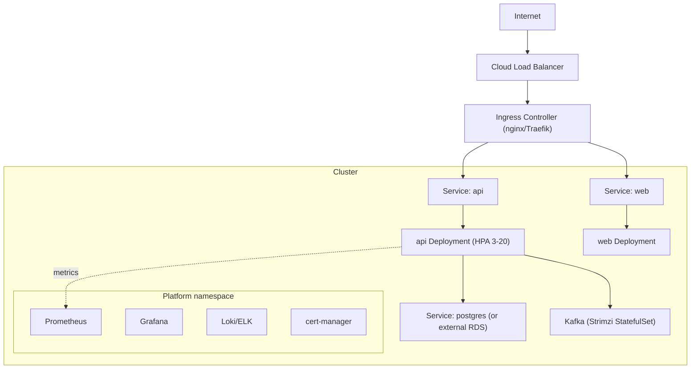

### 4.2 How big companies use Kubernetes

| Company | Usage |
|---|---|
| **Google** | GKE; Borg was the ancestor; runs everything containerized |
| **Spotify** | Migrated microservices to K8s; built Backstage on top |
| **Airbnb** | Thousands of services; migrated from monolith |
| **Pinterest, Shopify, Uber** | Large-scale K8s for microservices + data platforms |
| **OpenAI** | Massive K8s clusters for ML training/inference |

### 4.3 The Cloud-Native Ecosystem (CNCF)

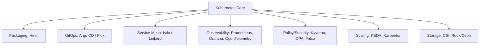

| Need | Tool |
|---|---|
| **Package/deploy** | [[03 Helm Charts]], Kustomize |
| **GitOps CD** | Argo CD, Flux |
| **Service mesh** | Istio, Linkerd (mTLS, traffic shaping, observability) |
| **Observability** | Prometheus + Grafana, Loki, Jaeger, OpenTelemetry |
| **Ingress/Gateway** | nginx, Traefik, Gateway API |
| **Policy** | Kyverno, OPA/Gatekeeper |
| **Secrets** | External Secrets Operator, Vault, sealed-secrets |
| **CI/CD** | [[06 Jenkins]], [[07 CICD GitHub Actions]] → build; Argo CD → deploy |

### 4.4 GitOps: the modern deployment model

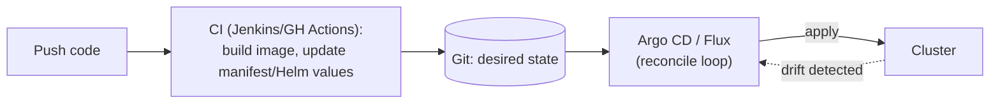

> [!IMPORTANT]
> **GitOps** makes git the single source of truth: the desired cluster state lives in a repo, and an agent (Argo CD/Flux) **continuously reconciles** the cluster to match — the same reconciliation philosophy as K8s itself, extended to deployments. Benefits: full audit trail, trivial rollback (`git revert`), no `kubectl` access needed in CI, automatic drift correction. This pairs perfectly with [[03 Helm Charts]] and CI from [[06 Jenkins]]/[[07 CICD GitHub Actions]].

### 4.5 Namespaces & Multi-Tenancy

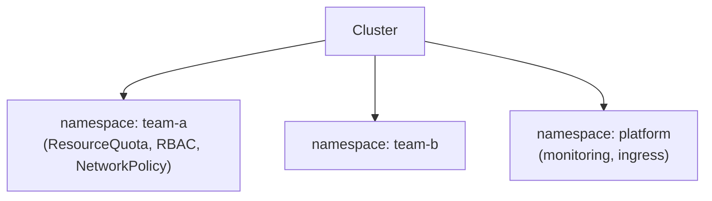

Namespaces isolate teams/environments with **ResourceQuotas** (cap CPU/mem/objects), **LimitRanges** (default limits), **RBAC**, and **NetworkPolicies**. For hard multi-tenancy, separate **clusters** are often safer than namespaces.

---

## 5. 🎤 INTERVIEW PREPARATION

### 5.1 Most important questions

<details>
<summary><b>Q1: Explain the reconciliation loop / declarative model.</b></summary>

You declare **desired state** via manifests stored in etcd. **Controllers** continuously watch actual vs desired state and take action to converge them (create/delete/restart pods). It's a level-triggered control loop that runs forever — this is why K8s self-heals: kill a pod and the ReplicaSet controller notices the gap and recreates it.
</details>

<details>
<summary><b>Q2: Pod vs Deployment vs ReplicaSet vs Service?</b></summary>

**Pod** = smallest unit (containers sharing net/storage). **ReplicaSet** = keeps N identical pods running. **Deployment** = manages ReplicaSets to enable rolling updates/rollback (you use this). **Service** = stable network endpoint + load balancer over pods selected by labels (pods are ephemeral; Services are stable).
</details>

<details>
<summary><b>Q3: How does a Service find its pods, and how does traffic reach them?</b></summary>

A Service selects pods by **labels**; the endpoints controller maintains the list of matching pod IPs (EndpointSlices). **kube-proxy** programs iptables/IPVS rules on each node so the Service's ClusterIP load-balances to those pod IPs. DNS (CoreDNS) resolves the Service name to the ClusterIP.
</details>

<details>
<summary><b>Q4: liveness vs readiness vs startup probe?</b></summary>

**Liveness**: is it alive? Fail → restart (recover from hangs). **Readiness**: ready for traffic? Fail → remove from Service endpoints (no restart). **Startup**: gates the other probes for slow-booting apps. Misconfigured liveness causes restart loops — a classic outage.
</details>

<details>
<summary><b>Q5: requests vs limits, and QoS classes?</b></summary>

**Requests** = guaranteed minimum, used for scheduling. **Limits** = hard cap (CPU→throttle, memory→OOMKill). QoS: **Guaranteed** (requests==limits), **Burstable** (requests<limits), **BestEffort** (none) — determines eviction order under node pressure.
</details>

<details>
<summary><b>Q6: How do rolling updates achieve zero downtime?</b></summary>

Deployment creates a new ReplicaSet and shifts pods gradually per `maxSurge`/`maxUnavailable`. With `maxUnavailable: 0` and a proper **readinessProbe**, traffic only goes to ready new pods while old ones drain — no dropped requests. `kubectl rollout undo` reverts by scaling the old ReplicaSet back up.
</details>

<details>
<summary><b>Q7: StatefulSet vs Deployment?</b></summary>

Deployment = interchangeable, stateless pods with random names. StatefulSet = **stable identity** (ordinal names `-0`,`-1`), **ordered** deploy/scale, and **stable per-pod storage** (PVC per pod). Use it for databases, [[01 Kafka]], anything needing persistent identity.
</details>

<details>
<summary><b>Q8: Are Kubernetes Secrets secure?</b></summary>

Not by default — they're only **base64-encoded** and stored in etcd in plaintext unless you enable **encryption at rest**. Anyone with etcd/API read access can decode them. Secure them with encryption at rest, tight RBAC, and external secret managers (Vault/External Secrets).
</details>

<details>
<summary><b>Q9: What happens when you run `kubectl apply -f deploy.yaml`?</b></summary>

kubectl sends it to the **apiserver** → authenticated, authorized (RBAC), validated, admission-controlled → persisted in **etcd**. The **Deployment controller** sees desired replicas, creates a ReplicaSet → Pods. The **scheduler** binds each Pod to a node. Each node's **kubelet** pulls images and starts containers via the runtime, reporting status back. Controllers keep reconciling forever.
</details>

### 5.2 Tricky questions

> [!TIP]
> **"Why is my healthy app in CrashLoopBackOff?"** — Often a **misconfigured liveness probe** (too aggressive, wrong port/path, checks a slow dependency) killing a working app, or a missing **startup probe** for a slow booter. Also check OOMKills and config/secret errors via `describe` + `logs --previous`.

> [!TIP]
> **"You deleted a pod and it came back — why?"** — A controller (Deployment/ReplicaSet) owns it; the reconciliation loop recreated it to maintain desired replica count. To truly remove it, delete/scale the **controller**, not the pod.

> [!TIP]
> **"Ingress vs Service vs LoadBalancer?"** — Service (L4) = internal discovery/LB; LoadBalancer Service = one cloud LB per service (expensive); **Ingress** (L7) = HTTP host/path routing behind **one** LB for many services.

> [!TIP]
> **"Can two containers in a pod use the same port?"** — No — they share one network namespace, so ports can't collide (they reach each other via `localhost`).

### 5.3 Common mistakes candidates make

| Mistake | Reality |
|---|---|
| Creating bare Pods | Use controllers (Deployment/StatefulSet) |
| No resource requests/limits | Scheduling chaos, OOMKills, noisy neighbors |
| No readiness probe | Traffic hits unready pods during deploys |
| Aggressive liveness probe | Restart loops on healthy apps |
| Thinking Secrets are encrypted | Only base64 — enable encryption + RBAC |
| Deployment for databases | Use StatefulSet + Operator |
| No NetworkPolicies | Flat network = lateral movement risk |
| Running as root/privileged | Node compromise risk |
| Ignoring PodDisruptionBudgets | Upgrades take down too many replicas |

### 5.4 What interviewers actually expect

- Deep grasp of the **declarative reconciliation model** (not just YAML memorization).
- The **control-plane data flow** of `kubectl apply`.
- **Probes, requests/limits/QoS, rolling updates** — the day-2 operational core.
- **Networking** (Service/Ingress/kube-proxy/DNS) and **security** (RBAC, Secrets reality, NetworkPolicy, non-root).
- Awareness of the **ecosystem** (Helm, GitOps, mesh, observability) and *when NOT to run something on K8s* (stateful DBs).

---

## 6. 🛠️ HANDS-ON PROJECTS

### Project 1: Deploy a Full Web App Stack (Beginner→Intermediate)

**Goal:** Frontend + API + Postgres with config, secrets, and external access.

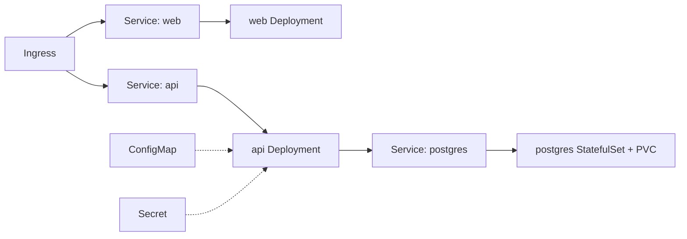

**Steps:**
1. Local cluster via **kind** or **minikube**.
2. Deployment + ClusterIP Service for web and api; StatefulSet + PVC for [[02 Postgres]].
3. ConfigMap (DB host, log level) + Secret (DB password) → env vars.
4. Add liveness/readiness probes + resource requests/limits.
5. Install an Ingress controller; expose web/api via host/path rules.
6. Break things on purpose: `kubectl delete pod` → watch self-healing.

**Learn:** core objects, config/secrets, probes, services, ingress, self-healing.

---

### Project 2: Zero-Downtime Deploys + Autoscaling (Intermediate→Senior)

**Goal:** Rolling updates with no dropped requests, plus load-based scaling.

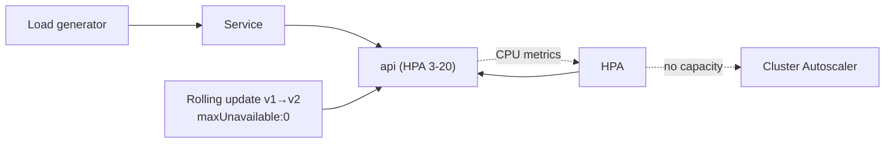

**Steps:**
1. Configure `RollingUpdate` (`maxSurge:1`, `maxUnavailable:0`) + solid readiness probe.
2. Run a load test (`hey`/`k6`) *during* a deploy → confirm zero 5xx.
3. Add an **HPA** (target 70% CPU, min 3 / max 20).
4. Generate load → watch pods scale out; stop → scale in.
5. Trigger a bad deploy → `kubectl rollout undo`.

**Learn:** rolling updates, readiness gating, HPA, rollback, resilience.

---

### Project 3: Production-Grade Platform with GitOps (Senior)

**Goal:** Secure, observable, GitOps-managed multi-service platform.

```mermaid
flowchart TB
    Git[(Git: manifests/Helm)] --> Argo[Argo CD]
    Argo --> Cluster
    subgraph Cluster
        Apps["Microservices (Helm charts)"]
        NP["NetworkPolicies (default-deny)"]
        RBAC["RBAC + Pod Security (restricted)"]
        Mon["Prometheus + Grafana + Loki"]
        Cert["cert-manager (TLS)"]
    end
```

**Steps:**
1. Package services as [[03 Helm Charts]]; store values in git.
2. Install **Argo CD**; point it at the repo (GitOps reconciliation).
3. Enforce **default-deny NetworkPolicies** + explicit allows.
4. Apply **Pod Security Standards (restricted)**, non-root securityContext, RBAC per namespace.
5. Deploy Prometheus/Grafana/Loki; add ServiceMonitors + dashboards + alerts.
6. Add **cert-manager** for automatic TLS; PodDisruptionBudgets for safe upgrades.
7. `git revert` a change → watch Argo CD auto-roll-back.

**Learn:** GitOps, security hardening, observability, HA, real production shape.

---

## 7. 🔬 DEEP DIVE: INTERNALS

### 7.1 The API Server & etcd

```mermaid
flowchart LR
    Clients["kubectl / controllers / kubelets"] --> API[kube-apiserver]
    API --> Auth["AuthN → AuthZ (RBAC) → Admission Controllers"]
    Auth --> Validate["Schema validation"]
    Validate --> ETCD[("etcd (watch + store)")]
    API -->|"watch streams"| Controllers
```

- Everything is a **REST resource** persisted in etcd. The apiserver is the *only* etcd client.
- **Admission controllers** (validating/mutating webhooks) intercept requests — how tools like OPA/Kyverno, sidecar injection, and defaulting work.
- Components use **watches** (efficient long-poll streams) to react to changes — the backbone of the reconciliation model.

> [!IMPORTANT]
> Kubernetes is fundamentally **an eventually-consistent database (etcd) fronted by a REST API, with a swarm of controllers reconciling toward declared state.** Understanding this — resources in etcd + watch + control loops — demystifies almost every behavior, from self-healing to why deletes sometimes lag.

### 7.2 The Scheduler Algorithm

```mermaid
flowchart LR
    Pod["Pending Pod"] --> Filter["Filtering (Predicates):<br/>which nodes CAN run it?<br/>(resources, taints, affinity, ports)"]
    Filter --> Score["Scoring (Priorities):<br/>rank feasible nodes<br/>(spread, least-loaded, affinity)"]
    Score --> Bind["Bind Pod → best node"]
```

Two phases: **filter** (feasible nodes) then **score** (best node). Extensible via the **scheduler framework** (plugins). The scheduler only *decides*; the **kubelet** on the chosen node actually runs the pod.

### 7.3 How kubelet Runs a Pod (CRI/CNI/CSI)

```mermaid
sequenceDiagram
    participant API as apiserver
    participant K as kubelet
    participant CRI as Container Runtime (CRI)
    participant CNI as Network Plugin (CNI)
    participant CSI as Storage Plugin (CSI)
    API->>K: Pod assigned to this node (watch)
    K->>CSI: attach/mount volumes
    K->>CRI: create pod sandbox
    K->>CNI: set up pod network (assign IP)
    K->>CRI: pull images, start containers
    K->>API: report Pod status (Running)
    loop probes
        K->>K: run liveness/readiness/startup
    end
```

Three pluggable interfaces: **CRI** (runtime — containerd), **CNI** (networking — Calico/Cilium), **CSI** (storage — cloud disks). This plugin model is why K8s runs everywhere.

### 7.4 Service Networking Under the Hood

```mermaid
flowchart TB
    Svc["Service (ClusterIP 10.96.0.10)"] --> EPS["EndpointSlice<br/>(pod IPs: 10.1.1.5, 10.1.2.7...)"]
    EPS --> KP["kube-proxy on each node"]
    KP --> Rules["iptables / IPVS rules<br/>(DNAT ClusterIP → random pod IP)"]
    DNS["CoreDNS: api.ns.svc.cluster.local → 10.96.0.10"] --> Svc
```

- A Service's **ClusterIP is virtual** — no process listens on it. **kube-proxy** programs **iptables/IPVS** rules that DNAT ClusterIP traffic to an actual pod IP.
- **EndpointSlices** track healthy pod IPs (updated as pods come/go).
- **CoreDNS** resolves Service names to ClusterIPs.

> [!TIP]
> This explains a classic gotcha: you can't `ping` a ClusterIP meaningfully (no host owns it) and `tcpdump` won't show it as a destination on the wire — it's rewritten by iptables to a pod IP. Debug Services by checking **EndpointSlices** (`kubectl get endpointslices`) — empty endpoints = your label selector doesn't match any ready pods.

### 7.5 Custom Resources & Operators

```mermaid
flowchart LR
    CRD["CustomResourceDefinition<br/>(extend the K8s API)"] --> CR["Custom Resource<br/>(e.g., kind: PostgresCluster)"]
    CR --> Op["Operator (custom controller)"]
    Op -->|reconcile| Real["Manages real StatefulSets,<br/>backups, failover..."]
```

> [!IMPORTANT]
> The **Operator pattern** is Kubernetes' ultimate extensibility: define your own resource types (CRDs) and write a **controller** that reconciles them — encoding human operational knowledge ("how to run [[02 Postgres]]/[[01 Kafka]] with backups and failover") as software. K8s itself is built from this same primitive: everything is a resource + a controller. Operators are how complex stateful software runs reliably on K8s.

---

## ✅ Production Checklists

### Workloads
- [ ] Every container has **resource requests + limits**
- [ ] **Readiness + liveness** (+ startup for slow apps) probes set correctly
- [ ] `maxUnavailable: 0` for zero-downtime rolling updates
- [ ] **PodDisruptionBudgets** for critical services
- [ ] **Anti-affinity / topology spread** across nodes & zones
- [ ] Controllers (never bare Pods); StatefulSet + Operator for stateful
- [ ] HPA configured with sane min/max

### Security
- [ ] `runAsNonRoot`, `readOnlyRootFilesystem`, drop capabilities
- [ ] **Pod Security Standards (restricted)** or Kyverno/Gatekeeper enforced
- [ ] **RBAC** least-privilege; no wildcard cluster-admin
- [ ] etcd **encryption at rest**; Secrets via external manager
- [ ] **Default-deny NetworkPolicies** + explicit allows
- [ ] Image scanning + signed images; pinned digests

### Operations
- [ ] **etcd backups** tested (restore drills)
- [ ] Monitoring (Prometheus) + logging (Loki/ELK) + tracing
- [ ] Alerts on node/pod health, resource pressure, restarts
- [ ] GitOps (Argo CD/Flux) for deploys; manifests in git
- [ ] Multi-node, multi-AZ control plane + workers
- [ ] Cluster Autoscaler/Karpenter for elasticity
- [ ] Namespace ResourceQuotas + LimitRanges

---

## 🗺️ Learning Roadmap

```mermaid
flowchart TB
    A["1️⃣ Foundations<br/>containers, cluster arch, kubectl, Pods"] --> B["2️⃣ Core objects<br/>Deployments, Services, ConfigMaps/Secrets"]
    B --> C["3️⃣ Networking<br/>Services, Ingress, DNS, NetworkPolicy"]
    C --> D["4️⃣ Operations<br/>probes, requests/limits, rolling updates, HPA"]
    D --> E["5️⃣ Stateful & storage<br/>StatefulSets, PV/PVC, Operators"]
    E --> F["6️⃣ Security<br/>RBAC, Pod Security, secrets, policy"]
    F --> G["7️⃣ Ecosystem<br/>Helm, GitOps, mesh, observability"]
    G --> H["8️⃣ Internals<br/>apiserver/etcd, scheduler, CRI/CNI/CSI, Operators"]
```

| Stage | Focus | You can... |
|---|---|---|
| 1–2 | Foundations + core objects | Deploy and expose an app |
| 3–4 | Networking + day-2 ops | Run resilient, zero-downtime, autoscaled apps |
| 5–6 | Stateful + security | Handle databases and harden clusters |
| 7–8 | Ecosystem + internals | Architect production platforms, extend K8s |

---

## 🔁 Self-Review Completion Loop

Reviewed against official Kubernetes docs, best practices, edge cases, interview patterns, and production scenarios.

### Gap Review Matrix

| Dimension | Covered? | Where |
|---|---|---|
| What/why, orchestration problem | ✅ | §1 |
| Cluster architecture (control plane/nodes) | ✅ | §2.1 |
| Pods (multi-container, init, sidecar) | ✅ | §2.2 |
| Controllers (Deploy/RS/StatefulSet/DaemonSet/Job) | ✅ | §2.3 |
| Services & Ingress | ✅ | §2.4 |
| ConfigMaps/Secrets | ✅ | §2.5 |
| Declarative workflow & kubectl | ✅ | §2.6 |
| Requests/limits/QoS | ✅ | §3.1 |
| Advanced scheduling (affinity/taints/spread) | ✅ | §3.2 |
| Probes (liveness/readiness/startup) | ✅ | §3.3 |
| Autoscaling (HPA/VPA/CA/KEDA) | ✅ | §3.4 |
| Rolling updates & strategies | ✅ | §3.5 |
| StatefulSets & storage (PV/PVC/SC) | ✅ | §3.6 |
| Networking model & NetworkPolicy | ✅ | §3.7 |
| RBAC & security | ✅ | §3.8 |
| Failure scenarios | ✅ | §3.9 |
| Production topology | ✅ | §4.1 |
| CNCF ecosystem | ✅ | §4.3 |
| GitOps | ✅ | §4.4 |
| Namespaces/multi-tenancy | ✅ | §4.5 |
| apiserver/etcd internals | ✅ | §7.1 |
| Scheduler algorithm | ✅ | §7.2 |
| kubelet + CRI/CNI/CSI | ✅ | §7.3 |
| Service networking (kube-proxy/iptables) | ✅ | §7.4 |
| CRDs & Operators | ✅ | §7.5 |
| Interview Q&A + mistakes | ✅ | §5 |
| Hands-on projects | ✅ | §6 |

> [!NOTE]
> **Remaining depth to explore independently:** Gateway API (Ingress successor), service mesh internals (Istio/Envoy, mTLS, sidecar-less/ambient mesh), advanced scheduling (Descheduler, custom schedulers), cost optimization (bin-packing, spot), multi-cluster (Cluster API, fleet management), Windows nodes, and eBPF-based networking (Cilium).

---

## 📚 Official References

| Resource | URL |
|---|---|
| Kubernetes Docs | https://kubernetes.io/docs/ |
| Concepts | https://kubernetes.io/docs/concepts/ |
| kubectl Reference | https://kubernetes.io/docs/reference/kubectl/ |
| API Reference | https://kubernetes.io/docs/reference/kubernetes-api/ |
| Production Best Practices | https://kubernetes.io/docs/setup/best-practices/ |
| Pod Security Standards | https://kubernetes.io/docs/concepts/security/pod-security-standards/ |
| The Kubernetes Book (concepts) | https://kubernetes.io/docs/tutorials/ |
| CNCF Landscape | https://landscape.cncf.io/ |
| kubernetes/kubernetes (source) | https://github.com/kubernetes/kubernetes |

---

## 🎁 Final Summary

> [!IMPORTANT]
> **The one-paragraph takeaway:** Kubernetes is a **declarative, self-healing container orchestrator** built on one idea — **reconciliation loops** that drive actual state toward your declared desired state, forever. A **control plane** (apiserver + etcd + scheduler + controllers) manages **worker nodes** (kubelet + kube-proxy + runtime). You deploy apps as **Pods** managed by **Deployments** (stateless) or **StatefulSets** (stateful), expose them via **Services** (L4) and **Ingress** (L7), configure them with **ConfigMaps/Secrets**, and keep them healthy with **probes, requests/limits, and rolling updates**. Production readiness means **resource limits, correct probes, RBAC, non-root, NetworkPolicies, encrypted Secrets, PodDisruptionBudgets, backups of etcd, observability, and GitOps**. The whole platform is extensible via **CRDs + Operators** — the same resource+controller pattern K8s is built from.

**Golden rules:**
1. ☸️ Declare desired state; let controllers **reconcile** — never manage pods by hand.
2. 🩺 **Readiness gates traffic, liveness detects hangs** — and keep liveness lenient.
3. 📊 Always set **requests + limits**; aim for Guaranteed QoS on critical workloads.
4. 🔄 `maxUnavailable: 0` + readiness probe = **true zero-downtime** deploys.
5. 🔐 Secrets are **base64, not encrypted** — encrypt etcd, use RBAC + external managers.
6. 🧱 **Default-deny NetworkPolicies**, non-root, Pod Security `restricted`.
7. 💾 **etcd is everything** — quorum + tested backups.
8. 🗄️ Stateful workloads → **StatefulSet + Operator** (or managed service).
9. 🚀 Deploy via **GitOps** (Argo/Flux) + [[03 Helm Charts]] — git as source of truth.

---

*Related guides in this vault: [[03 Helm Charts]] · [[03 Microservices]] · [[07 CICD GitHub Actions]] · [[06 Jenkins]] · [[01 Kafka]] · [[02 Postgres]]*
