# ⎈ Helm Charts — Complete Beginner-to-Expert Reference

> The package manager for Kubernetes — templating, versioning, and releasing your entire application stack as one versioned, rollback-able unit.

---

## 📑 Table of Contents

1. [Executive Summary](#-executive-summary)
2. [Fundamentals (Beginner)](#1--fundamentals-beginner-level)
3. [Core Concepts (Intermediate)](#2--core-concepts-intermediate-level)
4. [Advanced Concepts (Senior)](#3--advanced-concepts-senior-level)
5. [Real-World System Design](#4--real-world-system-design-usage)
6. [Interview Preparation](#5--interview-preparation)
7. [Hands-On Projects](#6--hands-on-projects)
8. [Deep Dive: Internals](#7--deep-dive-internals)
9. [Production Checklists](#-production-checklists)
10. [Learning Roadmap](#-learning-roadmap)
11. [Self-Review Completion Loop](#-self-review-completion-loop)
12. [Official References](#-official-references)
13. [Final Summary](#-final-summary)

---

## 🎯 Executive Summary

**Helm** is the de-facto **package manager for Kubernetes**. A **Helm Chart** bundles all the Kubernetes manifests (Deployments, Services, ConfigMaps, Ingress, etc.) an application needs into a single, **templated, versioned, parameterized** package that you install, upgrade, roll back, and share.

| What it is | What it replaces | Core superpower |
|---|---|---|
| Templated package of K8s manifests | Hand-written `kubectl apply` YAML sprawl + `sed`/`envsubst` hacks | One versioned release you can `install`, `upgrade`, and `rollback` atomically |

> [!IMPORTANT]
> Helm's real value is **not** "templating YAML." It's **release management**: Helm tracks every install/upgrade as a numbered **revision** with its computed manifests stored in-cluster, so you get **atomic upgrades, one-command rollbacks, and reproducible deployments** across environments. Templating is the means; lifecycle management is the point.

Related guides: [[03 Microservices]] · [[07 CICD GitHub Actions]] · [[01 Kafka]] · [[02 Postgres]] · [[05 Spring Boot]]

---

## 1. 🌱 FUNDAMENTALS (Beginner Level)

### What is Helm in simple terms?

If **Kubernetes** is an operating system for your cluster, **Helm is its `apt`/`npm`/`brew`**. Instead of writing and applying a dozen YAML files by hand for every environment, you package them into a **chart**, fill in a few **values**, and run:

```bash
helm install myapp ./mychart
```

Helm renders the templates into real Kubernetes manifests and applies them as one tracked **release**.

### Why does Helm exist?

Raw Kubernetes YAML doesn't scale across environments:

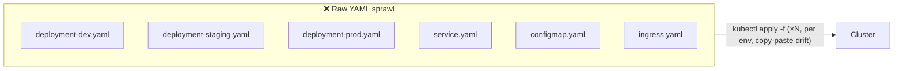

Problems: **copy-paste drift** between environments, no versioning, no atomic rollback, hard-coded values, and no way to share a stack (like "a Postgres + Redis + app" bundle) as one unit.

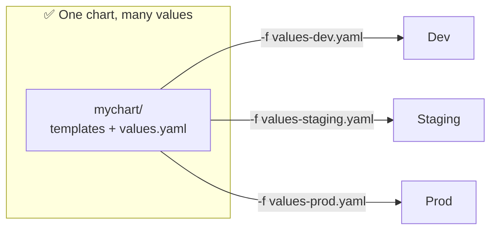

### Problems Helm solves

| Problem | How Helm solves it |
|---|---|
| **Environment drift** (dev vs prod YAML diverge) | One chart + per-env `values.yaml` overrides |
| **No versioning of deployments** | Charts have a version; releases have numbered revisions |
| **No safe rollback** | `helm rollback myapp 3` restores a previous revision |
| **Repetitive boilerplate** | Templates + helpers (`_helpers.tpl`) DRY up manifests |
| **Sharing complex stacks** | Charts published to repos/OCI registries; dependencies (subcharts) |
| **Coordinated multi-resource install** | One release = many resources applied/tracked together |
| **Config injection** | `values.yaml` parameterizes images, replicas, resources, env |

### Core concepts (the vocabulary)

| Term | Plain meaning |
|---|---|
| **Chart** | A package of templated Kubernetes manifests + metadata |
| **Release** | A specific *install* of a chart into a cluster (named, e.g. `myapp`) |
| **Revision** | A numbered version of a release (each upgrade increments it) |
| **Values** | Configuration inputs that fill the templates (`values.yaml` + overrides) |
| **Template** | A `.yaml` file with Go-template placeholders (`{{ .Values.x }}`) |
| **Repository** | A place charts are published (HTTP index or OCI registry) |
| **Subchart / Dependency** | A chart another chart depends on (e.g., app depends on `postgresql`) |
| **Manifest** | The final rendered Kubernetes YAML Helm applies |
| **Hook** | A chart resource run at a lifecycle point (e.g., pre-upgrade DB migration) |

### Real-world analogy 📦

Helm is like a **meal-kit delivery service**:
- The **recipe + boxed ingredients** = chart (templates + defaults)
- **Your dietary tweaks** ("less salt, extra spice") = values overrides
- **Cooking the meal** = rendering + installing a release
- **The dated receipt for each order** = revisions
- **"Send me the same as last week"** = reinstall a versioned chart
- **"Actually, undo — give me last week's version"** = `helm rollback`

> [!TIP]
> Mental model: **Chart = template/class, Release = instance, Values = constructor arguments, Revision = git-commit-like history.** Almost every Helm behavior maps cleanly onto that analogy.

---

## 2. 🧩 CORE CONCEPTS (Intermediate Level)

### 2.1 Chart Directory Structure

```
mychart/
├── Chart.yaml           # chart metadata (name, version, appVersion, dependencies)
├── values.yaml          # default configuration values
├── values.schema.json   # (optional) JSON Schema to validate values
├── charts/              # subcharts / vendored dependencies
├── crds/                # Custom Resource Definitions (installed before templates)
├── templates/
│   ├── deployment.yaml
│   ├── service.yaml
│   ├── ingress.yaml
│   ├── configmap.yaml
│   ├── _helpers.tpl     # reusable template partials (named templates)
│   ├── NOTES.txt        # post-install message shown to the user
│   └── tests/
│       └── test-connection.yaml  # `helm test` pods
└── .helmignore          # files to exclude from the packaged chart
```

**`Chart.yaml`:**

```yaml
apiVersion: v2
name: mychart
description: My application
type: application          # or "library"
version: 1.2.3             # the CHART version (SemVer) — bump on chart changes
appVersion: "2.4.0"        # the APP version (informational)
dependencies:
  - name: postgresql
    version: "13.x.x"
    repository: "https://charts.bitnami.com/bitnami"
    condition: postgresql.enabled
```

> [!WARNING]
> **`version` ≠ `appVersion`.** `version` is the chart's own SemVer (bump it whenever you change templates/values). `appVersion` just documents the app image version and does **not** need to follow SemVer. Forgetting to bump `version` breaks repo consumers who pin versions.

### 2.2 The Templating Engine (Go templates + Sprig)

Helm renders templates with Go's `text/template` plus the **Sprig** function library and Helm-specific functions.

```yaml
# templates/deployment.yaml
apiVersion: apps/v1
kind: Deployment
metadata:
  name: {{ include "mychart.fullname" . }}
  labels:
    {{- include "mychart.labels" . | nindent 4 }}
spec:
  replicas: {{ .Values.replicaCount }}
  selector:
    matchLabels:
      {{- include "mychart.selectorLabels" . | nindent 6 }}
  template:
    metadata:
      labels:
        {{- include "mychart.selectorLabels" . | nindent 8 }}
    spec:
      containers:
        - name: {{ .Chart.Name }}
          image: "{{ .Values.image.repository }}:{{ .Values.image.tag | default .Chart.AppVersion }}"
          ports:
            - containerPort: {{ .Values.service.port }}
          {{- with .Values.resources }}
          resources:
            {{- toYaml . | nindent 12 }}
          {{- end }}
```

**Built-in objects:**

| Object | Contains |
|---|---|
| `.Values` | Merged values (defaults + overrides) |
| `.Chart` | `Chart.yaml` fields (`.Chart.Name`, `.Chart.Version`) |
| `.Release` | `.Release.Name`, `.Release.Namespace`, `.Release.Revision`, `.Release.IsUpgrade/IsInstall` |
| `.Capabilities` | Cluster/K8s API versions (`.Capabilities.KubeVersion`, `.Capabilities.APIVersions.Has`) |
| `.Files` | Access non-template files in the chart (`.Files.Get`, `.Files.Glob`) |
| `.Template` | `.Template.Name`, `.Template.BasePath` |

### 2.3 Whitespace, Indentation & the `-` Trap

```yaml
# {{- trims whitespace BEFORE; -}} trims AFTER
metadata:
  labels:
    {{- include "mychart.labels" . | nindent 4 }}
```

| Pattern | Meaning |
|---|---|
| `{{-` | Trim preceding whitespace/newline |
| `-}}` | Trim following whitespace/newline |
| `nindent N` | Newline + indent block by N spaces |
| `indent N` | Indent (no leading newline) |
| `toYaml .` | Serialize a values object to YAML |

> [!WARNING]
> **YAML whitespace bugs are the #1 Helm frustration.** A misplaced `nindent`/`indent` produces invalid YAML that only fails at apply time. Always debug with **`helm template`** or **`helm install --dry-run --debug`** to see the *rendered* output before hitting the cluster.

### 2.4 `_helpers.tpl` — Named Templates (DRY)

```yaml
{{/* templates/_helpers.tpl */}}
{{- define "mychart.fullname" -}}
{{- printf "%s-%s" .Release.Name .Chart.Name | trunc 63 | trimSuffix "-" -}}
{{- end -}}

{{- define "mychart.labels" -}}
helm.sh/chart: {{ .Chart.Name }}-{{ .Chart.Version }}
app.kubernetes.io/name: {{ .Chart.Name }}
app.kubernetes.io/instance: {{ .Release.Name }}
app.kubernetes.io/managed-by: {{ .Release.Service }}
{{- end -}}
```

- `define` creates a named template; `include` calls it (**prefer `include` over `template`** because `include` can be piped into functions like `nindent`).
- `trunc 63` respects Kubernetes' 63-char label/name limit.

> [!TIP]
> Use **`include`, never `template`**, inside pipelines. `template` is an *action* (can't be piped); `include` is a *function* that returns a string, so `include "x" . | nindent 4` works but `template "x" . | nindent 4` is a syntax error.

### 2.5 Values Precedence

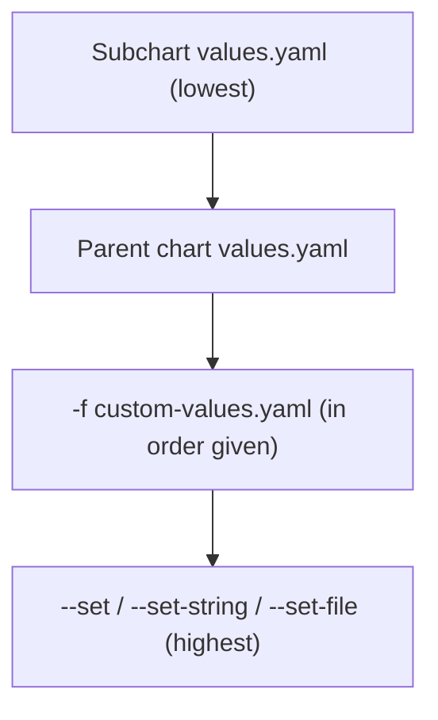

Order of override (later wins):
1. Chart's `values.yaml` (defaults)
2. Parent chart values (override subchart values)
3. `-f file.yaml` (multiple allowed; last file wins per key)
4. `--set key=val` (CLI, highest precedence)

```bash
helm install myapp ./mychart \
  -f values-prod.yaml \
  --set image.tag=2.5.0 \
  --set replicaCount=5
```

> [!IMPORTANT]
> `--set` uses a mini-DSL: dots are nesting (`a.b=c`), commas separate keys, and lists use `{}`/index syntax (`a.b[0]=x`). For values that contain dots/commas (like image tags or annotations) prefer `-f` files or `--set-string` to avoid surprising parsing.

### 2.6 Core CLI Lifecycle

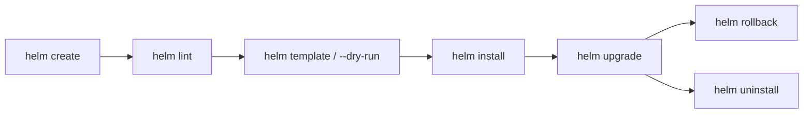

| Command | Purpose |
|---|---|
| `helm create NAME` | Scaffold a new chart |
| `helm lint ./chart` | Static validation |
| `helm template ./chart` | Render manifests locally (no cluster) |
| `helm install NAME ./chart` | Create a release |
| `helm install --dry-run --debug` | Render + validate against cluster, don't apply |
| `helm upgrade NAME ./chart` | Apply changes as a new revision |
| `helm upgrade --install` | Install if absent, else upgrade (**idempotent — use in CI/CD**) |
| `helm rollback NAME REV` | Revert to a previous revision |
| `helm history NAME` | List revisions |
| `helm list` / `helm status NAME` | Inspect releases |
| `helm uninstall NAME` | Delete a release |
| `helm test NAME` | Run test hooks |
| `helm dependency update` | Fetch subcharts into `charts/` |

> [!TIP]
> In [[07 CICD GitHub Actions]] pipelines, always use **`helm upgrade --install --atomic --wait`**. `--install` makes it idempotent, `--wait` blocks until resources are ready, and `--atomic` **auto-rolls-back on failure** — no half-applied releases.

---

## 3. ⚙️ ADVANCED CONCEPTS (Senior Level)

### 3.1 Release State & the 3-Way Merge

Helm 3 stores each release's state as a **Secret** in the release namespace (`sh.helm.release.v1.<name>.v<rev>`), containing the gzipped rendered manifest.

On `upgrade`, Helm computes a **three-way strategic merge patch**:

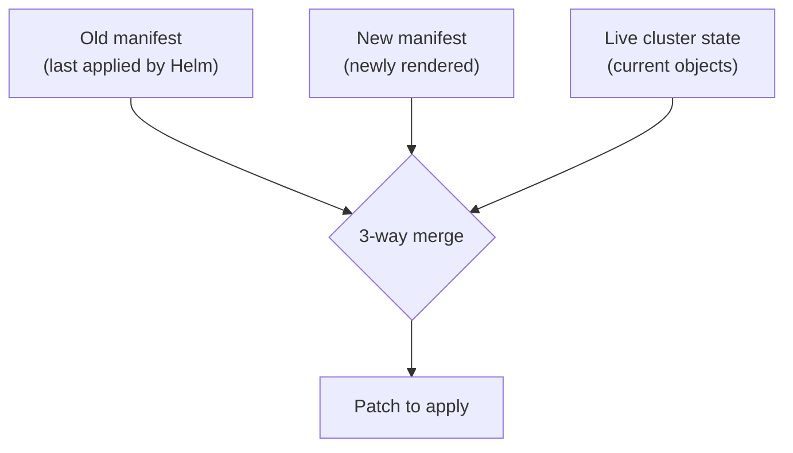

> [!IMPORTANT]
> Helm 3's **three-way merge** (old, new, *live*) means it respects changes made by other controllers (e.g., an HPA scaling replicas) instead of blindly reverting them — a major improvement over Helm 2's two-way merge. But manual `kubectl edit` changes that conflict with the chart can still cause surprising diffs. Treat the chart as the single source of truth.

### 3.2 Lifecycle Hooks

Hooks let you run resources at specific points via the `helm.sh/hook` annotation:

```yaml
apiVersion: batch/v1
kind: Job
metadata:
  name: db-migrate
  annotations:
    "helm.sh/hook": pre-upgrade,pre-install
    "helm.sh/hook-weight": "-5"          # lower runs first
    "helm.sh/hook-delete-policy": before-hook-creation,hook-succeeded
spec:
  template:
    spec:
      restartPolicy: Never
      containers:
        - name: migrate
          image: myapp:{{ .Values.image.tag }}
          command: ["./migrate.sh"]
```

| Hook | When it runs |
|---|---|
| `pre-install` / `post-install` | Around initial install |
| `pre-upgrade` / `post-upgrade` | Around upgrades (e.g., **DB migrations**) |
| `pre-rollback` / `post-rollback` | Around rollbacks |
| `pre-delete` / `post-delete` | Around uninstall |
| `test` | On `helm test` |

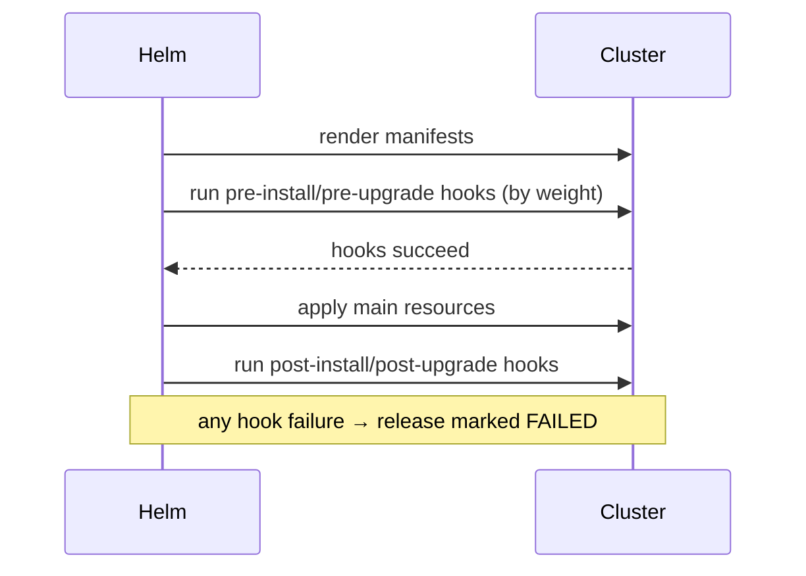

> [!WARNING]
> **Hooks are NOT part of the release's tracked resources** — Helm doesn't manage their lifecycle on upgrade/rollback the way it does normal resources. Use `hook-delete-policy` to clean them up, or you'll accumulate orphaned migration Jobs. Also, a failed hook fails the whole release (use `--atomic` to auto-rollback).

### 3.3 CRDs — the Special Case

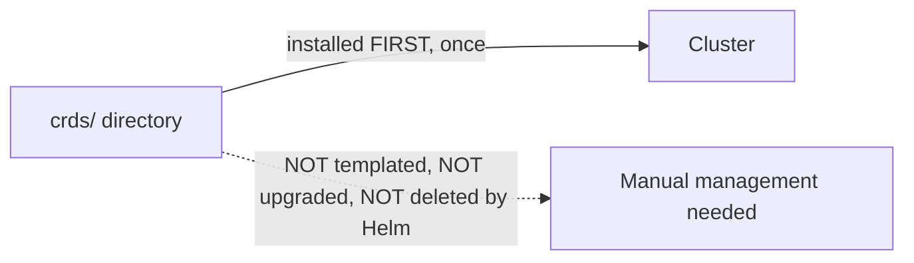

> [!IMPORTANT]
> CRDs in the `crds/` directory are installed **before** templates and are **never upgraded or deleted** by Helm (to avoid catastrophic data loss from removing a CRD and its custom resources). Upgrading a CRD requires **manual `kubectl apply`** or a separate chart. This is a classic senior gotcha.

### 3.4 Dependencies & Subcharts

```yaml
# Chart.yaml
dependencies:
  - name: postgresql
    version: "13.2.0"
    repository: "https://charts.bitnami.com/bitnami"
    condition: postgresql.enabled       # toggle with a value
    alias: primarydb                    # rename to use twice
    tags:
      - database
    import-values:                      # pull child values up to parent
      - child: primary.service
        parent: dbService
```

- **`condition`** — enable/disable a subchart via a boolean value.
- **`tags`** — group-enable multiple subcharts.
- **`alias`** — include the same chart twice under different names.
- Parent values **override** child values; `global.` values are shared with all subcharts.

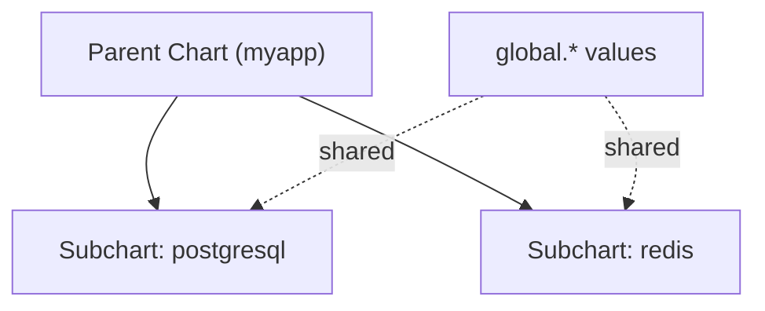

> [!TIP]
> Vendored dependencies live in `charts/` after `helm dependency update` and are pinned in `Chart.lock` (like a lockfile). Commit `Chart.lock` for reproducible builds; decide deliberately whether to commit the `charts/*.tgz` (vendored) or fetch at build time.

### 3.5 Values Validation

```json
// values.schema.json
{
  "$schema": "https://json-schema.org/draft-07/schema#",
  "type": "object",
  "required": ["replicaCount", "image"],
  "properties": {
    "replicaCount": { "type": "integer", "minimum": 1 },
    "image": {
      "type": "object",
      "required": ["repository"],
      "properties": { "repository": { "type": "string" } }
    }
  }
}
```

Plus in-template guards:

```yaml
{{- if not .Values.image.repository }}
{{- fail "image.repository is required" }}
{{- end }}
replicas: {{ required "replicaCount is required!" .Values.replicaCount }}
```

> [!TIP]
> Combine **`values.schema.json`** (structural validation, runs automatically) with **`required`/`fail`** (semantic guards) so misconfigurations fail *fast at render time* with a clear message instead of producing broken manifests.

### 3.6 Failure Scenarios & Production Issues

| Failure | Symptom | Mitigation |
|---|---|---|
| **Failed upgrade leaves release stuck** | Status `pending-upgrade` / `failed` | `--atomic --wait`; `helm rollback`; last resort `--force` |
| **`another operation in progress`** | Interrupted upgrade | `helm rollback`, or delete the stuck release secret |
| **Whitespace/indent bug** | Invalid YAML at apply | `helm template` / `--dry-run --debug` in CI |
| **CRD not upgraded** | New CR fields missing | Manually `kubectl apply` CRDs |
| **Secret size limit** | Huge charts fail (1 MB Secret cap) | `.helmignore`, trim files, fewer stored revisions |
| **Orphaned hook Jobs** | Accumulating migrate Jobs | `hook-delete-policy` |
| **Rollback doesn't revert data** | DB migrated forward | Hooks/migrations need their own reversibility |
| **`--set` type coercion** | `"true"` string vs bool, tag `1.10` → `1.1` | `--set-string`, quote in `values.yaml` |
| **Namespace not created** | Install fails | `--create-namespace` |

### 3.7 Chart Testing & CI Quality Gates

```yaml
# templates/tests/test-connection.yaml
apiVersion: v1
kind: Pod
metadata:
  name: "{{ include "mychart.fullname" . }}-test"
  annotations:
    "helm.sh/hook": test
spec:
  restartPolicy: Never
  containers:
    - name: wget
      image: busybox
      command: ['wget']
      args: ['{{ include "mychart.fullname" . }}:{{ .Values.service.port }}']
```

Toolchain: **`helm lint`** → **`helm template | kubeconform`** (schema validation) → **`ct` (chart-testing)** for install/upgrade tests in kind → **`helm test`** for smoke tests.

---

## 4. 🏗️ REAL-WORLD SYSTEM DESIGN USAGE

### 4.1 Helm in the GitOps / CI/CD Pipeline

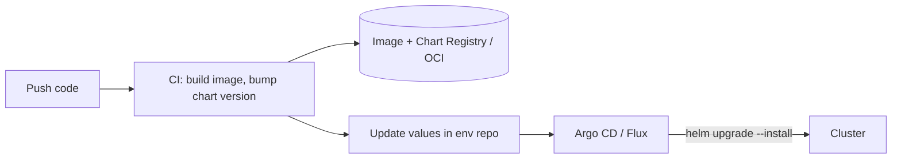

Two common models:
- **CI-driven push:** pipeline runs `helm upgrade --install --atomic` directly (see [[07 CICD GitHub Actions]]).
- **GitOps pull:** Argo CD / Flux watch a git repo of Helm values and reconcile the cluster continuously.

### 4.2 Environment Promotion with Layered Values

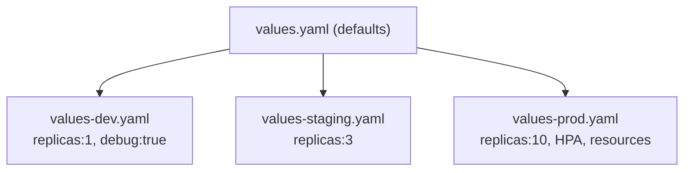

Same chart, different value overlays per environment — the canonical pattern for eliminating drift.

### 4.3 The Umbrella Chart Pattern (Microservices)

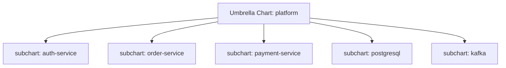

An **umbrella chart** deploys an entire [[03 Microservices]] platform as one release. Trade-off: convenient single-release management vs. coupled deploys (all services upgrade together). Large orgs often prefer **per-service charts** deployed independently for autonomy.

> [!IMPORTANT]
> **Umbrella vs per-service** is a key architectural decision. Umbrella = simple, atomic, but couples release cadence. Per-service charts = independent deploys, team autonomy, but you lose single-command whole-platform installs. Most mature microservice orgs go **per-service + GitOps**.

### 4.4 How organizations use Helm

| Use case | Pattern |
|---|---|
| **Off-the-shelf software** | `helm install prometheus prometheus-community/prometheus` |
| **Internal app deployment** | Company "base chart" library + thin per-app charts |
| **Multi-tenant SaaS** | Same chart, per-tenant release + namespace + values |
| **Platform engineering** | Library charts enforcing org standards (labels, security, probes) |
| **Databases/stateful** | Bitnami charts for [[02 Postgres]], Redis, [[01 Kafka]] |

### 4.5 Library Charts (DRY across many charts)

```yaml
# Chart.yaml
type: library
```

A **library chart** exposes reusable named templates (helpers) but renders **no resources itself**. Platform teams publish one so every app chart shares identical labels, probes, security contexts, and resource conventions.

---

## 5. 🎤 INTERVIEW PREPARATION

### 5.1 Most important questions

<details>
<summary><b>Q1: What problem does Helm solve that raw kubectl doesn't?</b></summary>

Release lifecycle management: **versioned, atomic installs/upgrades with one-command rollback**, environment parameterization via values, packaging/sharing of multi-resource stacks, and dependency management — none of which raw `kubectl apply` provides.
</details>

<details>
<summary><b>Q2: Helm 2 vs Helm 3 — key differences?</b></summary>

Helm 3 **removed Tiller** (the in-cluster server component that was a security liability). It now uses the caller's kubeconfig/RBAC directly, stores release state as **Secrets** (was ConfigMaps under Tiller), added **three-way merge**, JSON schema validation, and OCI registry support. "No Tiller + three-way merge" is the headline answer.
</details>

<details>
<summary><b>Q3: Where does Helm store release state?</b></summary>

As **Kubernetes Secrets** in the release's namespace, named `sh.helm.release.v1.<release>.v<revision>`, containing the gzip+base64-encoded rendered manifest and metadata. That's how `helm history`/`rollback` work.
</details>

<details>
<summary><b>Q4: Explain values precedence.</b></summary>

Lowest→highest: subchart `values.yaml` → parent `values.yaml` → `-f` files (in order) → `--set` flags. Parent overrides child; CLI overrides files.
</details>

<details>
<summary><b>Q5: How do you run a DB migration during upgrade?</b></summary>

A **`pre-upgrade` hook Job** with a `hook-weight` for ordering and a `hook-delete-policy` for cleanup. Note migrations aren't auto-reversed on rollback — plan reversibility separately.
</details>

<details>
<summary><b>Q6: Why are CRDs special in Helm?</b></summary>

Files in `crds/` install **before** templates and are **never upgraded or deleted** by Helm (to prevent accidental deletion of all custom resources). Upgrading CRDs is a manual step.
</details>

<details>
<summary><b>Q7: `helm upgrade` vs `helm upgrade --install`?</b></summary>

Plain `upgrade` fails if the release doesn't exist. `--install` creates it if absent, upgrades if present — **idempotent**, ideal for CI/CD. Add `--atomic --wait` for safe, auto-rolling-back deploys.
</details>

<details>
<summary><b>Q8: How do you debug a chart that renders bad YAML?</b></summary>

`helm lint`, then `helm template ./chart` (pure local render) or `helm install --dry-run --debug` (render + server validation) to inspect the exact output before applying. Whitespace/`nindent` bugs are the usual culprit.
</details>

### 5.2 Tricky questions

> [!TIP]
> **"Does `helm rollback` restore your database?"** — **No.** Helm rolls back *Kubernetes manifests*, not application data. A `pre-upgrade` migration that altered a DB schema is **not** auto-reversed. Data reversibility is your responsibility.

> [!TIP]
> **"`include` vs `template`?"** — `template` is an action (can't pipe); `include` is a function returning a string, so it can be piped into `nindent`/`indent`. Always use `include` in pipelines.

> [!TIP]
> **"Why did `--set image.tag=1.10` deploy `1.1`?"** — `--set` coerces types; unquoted numeric-looking values can lose trailing zeros. Use `--set-string image.tag=1.10` or quote it in `values.yaml`.

> [!TIP]
> **"Is Tiller still a thing?"** — No, removed in Helm 3. Mentioning Tiller as current is an instant red flag.

### 5.3 Common mistakes candidates make

| Mistake | Reality |
|---|---|
| "Helm is just YAML templating" | It's **release lifecycle management** |
| Confusing `version` and `appVersion` | Chart SemVer vs app image version |
| Assuming rollback reverts data | Only reverts manifests |
| Forgetting CRDs aren't upgraded | Manual step required |
| `template` inside a pipe | Use `include` |
| Not using `--atomic` in CI | Leaves failed releases stuck |
| Editing resources with `kubectl` | Causes 3-way-merge drift |

### 5.4 What interviewers actually expect

- You see Helm as **lifecycle + packaging**, not just templating.
- You know **Helm 3 architecture** (no Tiller, Secrets, 3-way merge).
- You can reason about **values precedence, hooks, CRDs, dependencies**.
- You know the **safe CI recipe** and how to **debug rendered output**.

---

## 6. 🛠️ HANDS-ON PROJECTS

### Project 1: Chart-ify a Web App + Database (Beginner→Intermediate)

**Goal:** Package a stateless app with a Postgres dependency into one chart.

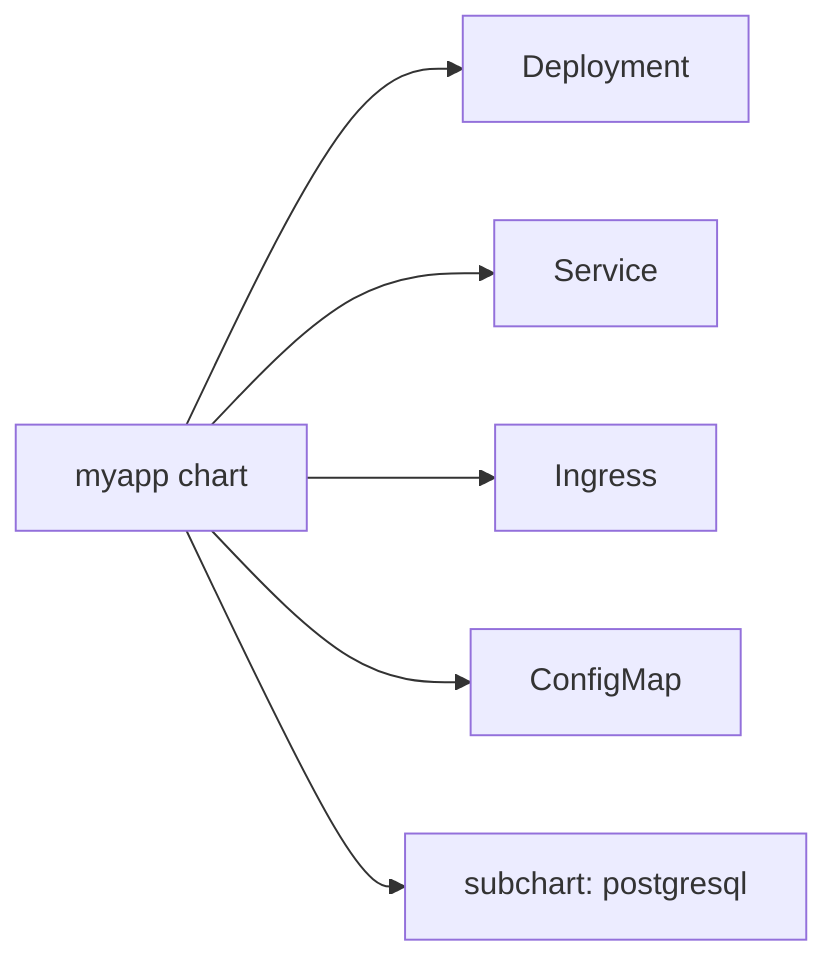

**Steps:**
1. `helm create myapp` → strip the scaffold to essentials.
2. Add a `postgresql` dependency in `Chart.yaml` with `condition: postgresql.enabled`.
3. Wire the app's DB env vars to the subchart's service name via `global` values.
4. Create `values-dev.yaml` (1 replica, embedded PG) and `values-prod.yaml` (external managed [[02 Postgres]], HPA).
5. `helm dependency update` → `helm install --dry-run --debug` → `helm install`.

**Learn:** structure, dependencies, values overlays, rendering/debugging.

---

### Project 2: Zero-Downtime Upgrade with Migration Hook (Intermediate→Senior)

**Goal:** Safe rolling upgrade that runs a DB migration first and auto-rolls-back on failure.

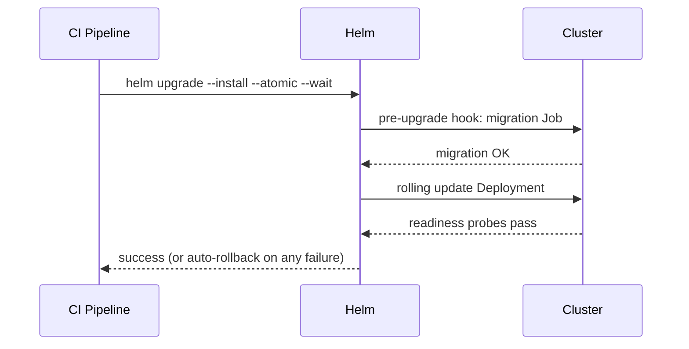

**Steps:**
1. Add a `pre-upgrade` migration Job hook with `hook-weight` + `hook-delete-policy`.
2. Configure `readinessProbe`/`livenessProbe` and a `RollingUpdate` strategy with `maxUnavailable: 0`.
3. Run `helm upgrade --install --atomic --wait --timeout 5m` in [[07 CICD GitHub Actions]].
4. Force a failing migration → observe **automatic rollback**.
5. Inspect `helm history` and `helm rollback`.

**Learn:** hooks, atomic upgrades, probes, rollback mechanics.

---

### Project 3: Reusable Library Chart + Umbrella Platform (Senior)

**Goal:** Enforce org standards via a library chart and deploy a microservices platform via an umbrella.

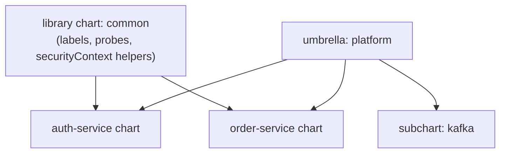

**Steps:**
1. Build a `type: library` chart exposing `common.labels`, `common.deployment`, `common.securityContext`.
2. Consume it from two service charts (`include "common.labels" .`).
3. Compose an umbrella chart with both services + a [[01 Kafka]] subchart.
4. Add `values.schema.json` to enforce required fields org-wide.
5. Publish charts to an **OCI registry** (`helm push`), deploy the umbrella.

**Learn:** library charts, DRY at scale, umbrella pattern, OCI distribution, schema validation.

---

## 7. 🔬 DEEP DIVE: INTERNALS

### 7.1 The Render → Apply Pipeline

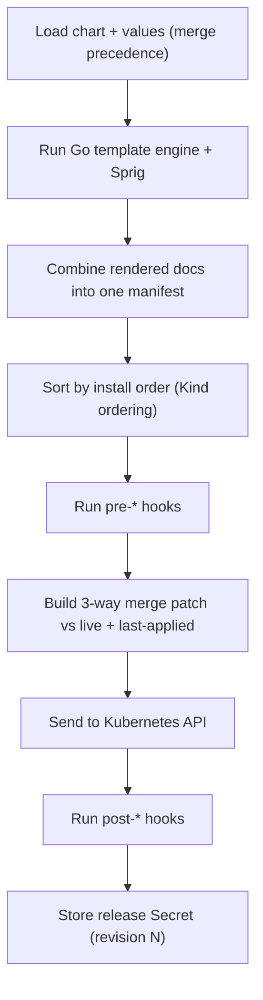

> [!IMPORTANT]
> Helm renders **client-side** — the whole chart becomes a plain manifest before anything touches the cluster. Kubernetes never sees your templates. This is why `helm template` fully works offline, and why the cluster has no notion of "a chart" — only the release-tracking Secrets Helm writes.

### 7.2 Kind Install Ordering

Helm applies resources in a **fixed order by Kind** so dependencies exist first:

```
Namespace → NetworkPolicy → ResourceQuota → LimitRange →
ServiceAccount → Secret → ConfigMap → PersistentVolume/PVC →
CRD → ClusterRole/Binding → Role/Binding →
Service → DaemonSet → Deployment → StatefulSet → Job → ... 
```

This guarantees, e.g., a `ConfigMap` exists before the `Deployment` that mounts it.

### 7.3 Release Storage Format

```bash
kubectl get secret -n mynamespace -l owner=helm
# sh.helm.release.v1.myapp.v1
# sh.helm.release.v1.myapp.v2   <- each revision = one Secret
```

- Payload = **base64(gzip(release JSON))** including the rendered manifest, values, chart metadata, and status.
- `helm rollback` re-applies the manifest stored in the target revision's Secret.
- `--history-max` (default 10) caps retained revisions to avoid Secret sprawl.

> [!WARNING]
> Because state lives in a **Secret (max 1 MB, etcd-backed)**, very large charts or many stored revisions can hit limits. Use `.helmignore` to keep test data/docs out of the packaged chart, and cap `--history-max`.

### 7.4 OCI Distribution

Modern Helm treats charts as **OCI artifacts**, stored in any container registry:

```bash
helm package ./mychart                       # -> mychart-1.2.3.tgz
helm push mychart-1.2.3.tgz oci://registry.example.com/charts
helm install myapp oci://registry.example.com/charts/mychart --version 1.2.3
```

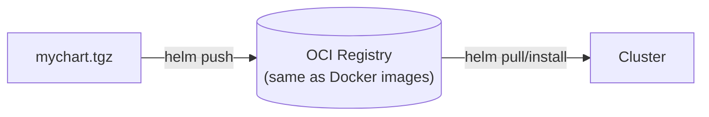

This unifies image and chart distribution, auth, and signing (**Cosign / provenance `.prov` files** for supply-chain security).

### 7.5 Rendering Order Gotcha (functions vs values)

Helm evaluates the entire template with **all values available at once** — there's no sequential variable assignment across files. But note:
- **Subchart rendering** happens with the merged parent+child values context.
- **`lookup`** function can query live cluster state at render time (but returns empty during `--dry-run`/`template`), so charts relying on `lookup` behave differently in dry-run vs real install.

> [!TIP]
> Avoid depending on `lookup` for critical logic — it silently returns empty objects during `helm template`/`--dry-run`, so a chart that "works" in dry-run can behave differently on a real install. Prefer explicit values.

---

## ✅ Production Checklists

### Chart Authoring
- [ ] `Chart.yaml` `version` bumped on every change; `appVersion` set
- [ ] `values.schema.json` validates required/typed values
- [ ] `_helpers.tpl` for names/labels; `trunc 63` on names
- [ ] Standard `app.kubernetes.io/*` labels everywhere
- [ ] Resource requests/limits, probes, `securityContext` templated
- [ ] `NOTES.txt` with post-install guidance
- [ ] `.helmignore` excludes tests/docs/large files

### CI/CD
- [ ] `helm lint` + `helm template | kubeconform` in pipeline
- [ ] `ct` install/upgrade tests in kind
- [ ] `helm upgrade --install --atomic --wait --timeout`
- [ ] `--create-namespace` where needed
- [ ] Charts pushed to OCI registry, versioned & signed (Cosign)
- [ ] `Chart.lock` committed for reproducible dependencies

### Operations
- [ ] `--history-max` capped
- [ ] Migration hooks with `hook-delete-policy`
- [ ] CRD upgrade process documented (manual)
- [ ] Rollback runbook (incl. data considerations)
- [ ] RBAC scoped to deploy identity (no cluster-admin in CI)
- [ ] Secrets via external managers (not plaintext values), e.g. SOPS/External Secrets

---

## 🗺️ Learning Roadmap

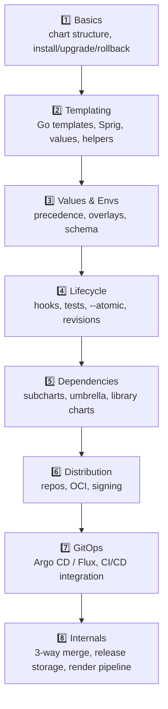

| Stage | Focus | You can... |
|---|---|---|
| 1–2 | Basics + templating | Author and install a working chart |
| 3–4 | Values + lifecycle | Manage envs, hooks, safe upgrades |
| 5–6 | Deps + distribution | Compose platforms, publish charts |
| 7–8 | GitOps + internals | Run Helm in production pipelines confidently |

---

## 🔁 Self-Review Completion Loop

Reviewed against official Helm docs, best practices, edge cases, interview patterns, and production scenarios.

### Gap Review Matrix

| Dimension | Covered? | Where |
|---|---|---|
| What/why, problems solved | ✅ | §1 |
| Chart structure & `Chart.yaml` | ✅ | §2.1 |
| Templating engine + built-in objects | ✅ | §2.2 |
| Whitespace/indent control | ✅ | §2.3 |
| Named templates / helpers | ✅ | §2.4 |
| Values precedence | ✅ | §2.5 |
| CLI lifecycle | ✅ | §2.6 |
| Release state & 3-way merge | ✅ | §3.1, §7.3 |
| Hooks | ✅ | §3.2 |
| CRD handling | ✅ | §3.3 |
| Dependencies/subcharts | ✅ | §3.4 |
| Values validation (schema/required) | ✅ | §3.5 |
| Failure scenarios | ✅ | §3.6 |
| Testing & quality gates | ✅ | §3.7 |
| CI/CD & GitOps integration | ✅ | §4.1 |
| Env promotion overlays | ✅ | §4.2 |
| Umbrella & library charts | ✅ | §4.3, §4.5 |
| Helm 2 vs 3 (Tiller removal) | ✅ | §5.1 Q2 |
| OCI distribution & signing | ✅ | §7.4, checklists |
| Render/apply internals & kind ordering | ✅ | §7.1–7.2 |
| Interview Q&A + mistakes | ✅ | §5 |
| Hands-on projects | ✅ | §6 |
| Security (RBAC, secrets, provenance) | ✅ | Checklists |

> [!NOTE]
> **Remaining depth to explore independently:** Helmfile (managing many releases declaratively), `post-renderer` + Kustomize integration, `helm diff` plugin for pre-apply diffs, Helm + External Secrets Operator / SOPS patterns, and comparison with pure-Kustomize or Timoni/CUE-based alternatives.

---

## 📚 Official References

| Resource | URL |
|---|---|
| Helm Docs | https://helm.sh/docs/ |
| Chart Template Guide | https://helm.sh/docs/chart_template_guide/ |
| Best Practices | https://helm.sh/docs/chart_best_practices/ |
| Chart.yaml reference | https://helm.sh/docs/topics/charts/ |
| Hooks | https://helm.sh/docs/topics/charts_hooks/ |
| Values files | https://helm.sh/docs/chart_template_guide/values_files/ |
| Sprig functions | https://masterminds.github.io/sprig/ |
| OCI registries | https://helm.sh/docs/topics/registries/ |
| Artifact Hub (find charts) | https://artifacthub.io/ |

---

## 🎁 Final Summary

> [!IMPORTANT]
> **The one-paragraph takeaway:** Helm is Kubernetes' **package manager and release lifecycle tool**. A **chart** is a templated, versioned bundle of manifests; a **release** is an install of that chart; **revisions** give you git-like history with **atomic upgrades and one-command rollback**. Helm renders templates **client-side** into plain manifests, stores each revision as a **Secret**, and uses a **three-way merge** on upgrade. Master **values precedence**, **hooks** (esp. migrations), the **CRD gotcha**, **dependencies/umbrella/library** patterns, and the safe CI recipe **`helm upgrade --install --atomic --wait`**. Remember Helm manages *manifests, not data* — rollbacks don't undo database migrations.

**Golden rules:**
1. 📦 Chart = template, Release = instance, Values = arguments, Revision = history.
2. 🔍 Always `helm template` / `--dry-run --debug` before applying — whitespace bugs are lurking.
3. 🛡️ CI recipe: **`helm upgrade --install --atomic --wait`**.
4. 🔢 Bump **chart `version`** on every change; don't confuse it with `appVersion`.
5. 🪝 Use **hooks** for migrations — but they don't auto-reverse on rollback.
6. ⚠️ **CRDs aren't upgraded** by Helm — manage them manually.
7. 🧩 Use **library charts** to DRY standards; choose umbrella vs per-service deliberately.
8. 🔐 Rollback reverts **manifests, not data** — plan data reversibility separately.

---

*Related guides in this vault: [[03 Microservices]] · [[07 CICD GitHub Actions]] · [[01 Kafka]] · [[02 Postgres]] · [[05 Spring Boot]]*
