# 🌍 Terraform — Complete Beginner-to-Expert Reference

> Infrastructure as Code — declaratively provision and manage cloud resources across any provider, with a state-driven plan/apply workflow that makes infrastructure versioned, reviewable, and reproducible.

---

## 📑 Table of Contents

1. [Executive Summary](#-executive-summary)
2. [Fundamentals (Beginner)](#1--fundamentals-beginner-level)
3. [Core Concepts (Intermediate)](#2--core-concepts-intermediate-level)
4. [Advanced Concepts (Senior)](#3--advanced-concepts-senior-level)
5. [Real-World System Design](#4--real-world-system-design-usage)
6. [Interview Preparation](#5--interview-preparation)
7. [Hands-On Projects](#6--hands-on-projects)
8. [Deep Dive: Internals](#7--deep-dive-internals)
9. [Production Checklists](#-production-checklists)
10. [Learning Roadmap](#-learning-roadmap)
11. [Self-Review Completion Loop](#-self-review-completion-loop)
12. [Official References](#-official-references)
13. [Final Summary](#-final-summary)

---

## 🎯 Executive Summary

**Terraform** is an open-source **Infrastructure as Code (IaC)** tool by HashiCorp that lets you define cloud and on-prem infrastructure in declarative configuration files, then create, change, and version it safely. You describe the **desired end state** (servers, networks, databases, DNS), and Terraform figures out the API calls to make reality match — across AWS, GCP, Azure, [[02 Kubernetes]], and 1000+ providers.

| What it is | What it replaces | Core superpower |
|---|---|---|
| Declarative, provider-agnostic IaC | Manual console clicking, bespoke shell scripts, snowflake servers | **Plan-then-apply** state-driven provisioning that's versioned, reviewable, and reproducible across any provider |

> [!IMPORTANT]
> Terraform's defining ideas are **declarative desired-state + state tracking + plan/apply**. You don't write "create this server" imperatively — you *declare* what should exist, Terraform records what it created in a **state file**, and before every change it shows you a **plan** (the exact diff) to approve. This is the same reconciliation philosophy as [[02 Kubernetes]], but for *provisioning infrastructure itself* rather than orchestrating containers on it. Terraform builds the clusters your [[03 Helm Charts]] then deploy into.

Related guides: [[02 Kubernetes]] · [[01 Docker]] · [[03 Helm Charts]] · [[07 CICD GitHub Actions]] · [[06 Jenkins]] · [[01 System Design Fundamentals]] · [[03 Microservices]]

---

## 1. 🌱 FUNDAMENTALS (Beginner Level)

### What is Terraform in simple terms?

Suppose you need 3 servers, a load balancer, a database, and a network in the cloud. You *could* click through the AWS console for an hour — but then you can't reproduce it, can't review it, and nobody knows how it was built ("ClickOps"). **Terraform lets you write that infrastructure as a text file**, and running one command builds it all. Change the file, run again — it updates only what changed. Delete the file's resources, run destroy — it's all gone cleanly.

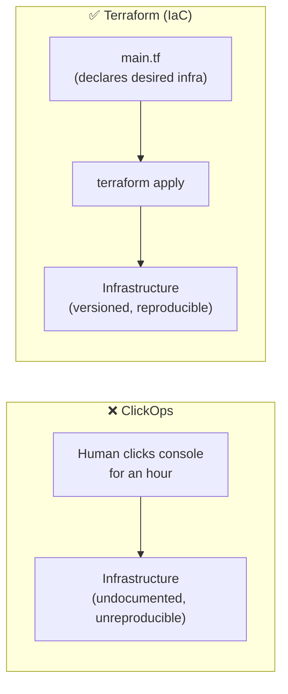

### Why does Terraform exist?

Manually managing cloud infrastructure doesn't scale and is error-prone:

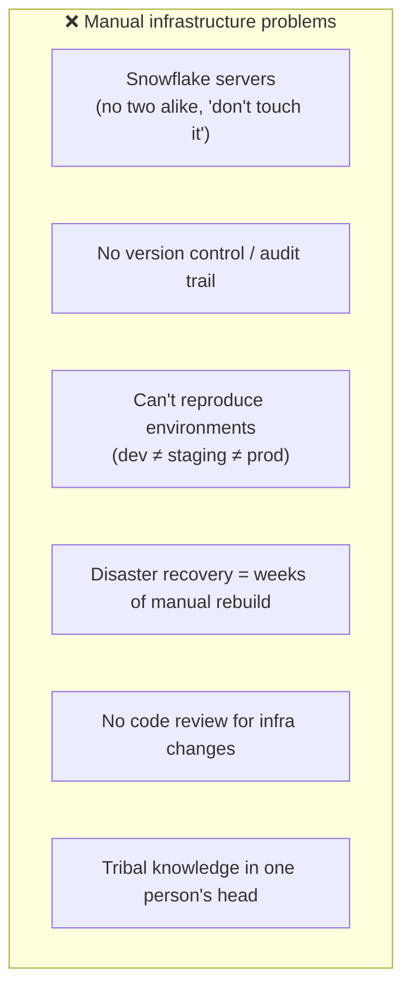

Terraform (2014) treats infrastructure like software: **written, versioned, reviewed, tested, and automated**.

### Problems Terraform solves

| Problem | How Terraform solves it |
|---|---|
| **Snowflake servers** | Config is the source of truth; rebuild identically anytime |
| **No audit trail** | Infra in git — every change reviewed & versioned |
| **Environment drift** | Same code → identical dev/staging/prod |
| **Slow disaster recovery** | `terraform apply` rebuilds everything |
| **Vendor lock-in of tooling** | One tool, 1000+ providers (multi-cloud) |
| **Manual, error-prone changes** | `plan` previews the exact diff before applying |
| **Coordination** | State + locking prevent conflicting changes |

### IaC categories: where Terraform fits

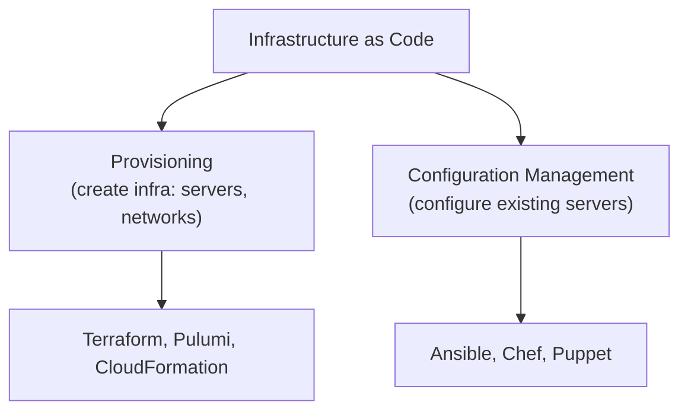

| Type | Purpose | Tools |
|---|---|---|
| **Provisioning** | Create the infrastructure itself | **Terraform**, Pulumi, CloudFormation |
| **Config management** | Install/configure software *on* servers | Ansible, Chef, Puppet |

> [!TIP]
> Terraform is a **provisioning** tool (it creates the servers, networks, databases), not primarily a **configuration management** tool (installing packages on a running server — that's Ansible's job). They're complementary: Terraform provisions a VM, then hands off to Ansible/cloud-init to configure it. In the container world, [[01 Docker]] images replace much config management, and Terraform provisions the [[02 Kubernetes]] cluster the containers run on.

### Declarative vs Imperative

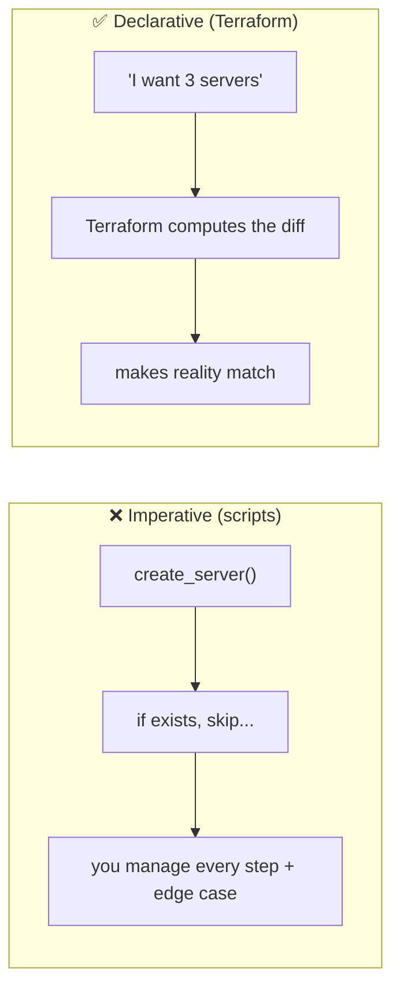

> [!IMPORTANT]
> Terraform is **declarative**: you describe the *desired end state*, not the steps to get there. Run it once → it creates everything. Run it again with no changes → it does *nothing* (idempotent). Change "3 servers" to "5" → it adds exactly 2. You never write "if it exists, skip; else create" logic — Terraform derives the necessary actions by **diffing desired state against current state**. This idempotency is the heart of IaC.

### Core concepts (the vocabulary)

| Term | Plain meaning |
|---|---|
| **Provider** | Plugin for a platform (AWS, GCP, Azure, [[02 Kubernetes]]) |
| **Resource** | A single infrastructure object (a VM, a bucket, a DNS record) |
| **Data source** | Read-only lookup of existing infrastructure |
| **State** | Terraform's record of what it manages (`terraform.tfstate`) |
| **Plan** | Preview of changes before applying |
| **Apply** | Execute the planned changes |
| **Module** | Reusable, parameterized bundle of resources |
| **Variable** | Input parameter |
| **Output** | Exported value from a config/module |
| **HCL** | HashiCorp Configuration Language (the syntax) |
| **Backend** | Where state is stored (local, S3, Terraform Cloud) |

### Real-world analogy 🏗️

Terraform is like an **architect's blueprint + a construction crew that reads it**:
- The **blueprint** (your `.tf` files) declares exactly what the building should be.
- The **crew** (Terraform) reads it and builds precisely that.
- A **registry of what's been built** (state file) means the crew knows what already exists.
- Want a change? Update the blueprint; the crew shows you a **work order** (plan) of exactly what they'll add/modify/demolish before touching anything.
- The blueprint lives in a **filing cabinet** (git) — reviewed, versioned, and reproducible by any crew.

> [!TIP]
> The mental model: **Terraform maintains a three-way relationship — your config (desired), the state file (what Terraform thinks exists), and the real cloud (what actually exists).** Every `plan` reconciles these three. Almost every Terraform behavior, bug, and best practice flows from understanding this triangle — especially that the **state file is Terraform's memory**, and if it's wrong, Terraform is wrong.

---

## 2. 🧩 CORE CONCEPTS (Intermediate Level)

### 2.1 HCL — The Language

```hcl
# Provider: which platform + config
provider "aws" {
  region = "us-east-1"
}

# Resource: something to create — TYPE "NAME"
resource "aws_instance" "web" {
  ami           = "ami-0c55b159cbfafe1f0"
  instance_type = "t3.micro"

  tags = {
    Name        = "web-server"
    Environment = "production"
  }
}

# Variable: input parameter
variable "instance_count" {
  type    = number
  default = 3
}

# Output: exported value
output "public_ip" {
  value = aws_instance.web.public_ip
}
```

**Anatomy of a resource block:**

```mermaid
flowchart LR
    R["resource"] --> T['"aws_instance"<br/>(type = provider_object)']
    T --> N['"web"<br/>(local name)']
    N --> Ref["referenced as:<br/>aws_instance.web.id"]
```

- `resource "TYPE" "NAME" { ... }` — type is `<provider>_<object>`, name is your local handle.
- Reference attributes elsewhere: `aws_instance.web.public_ip` — this creates an **implicit dependency**.

### 2.2 The Core Workflow

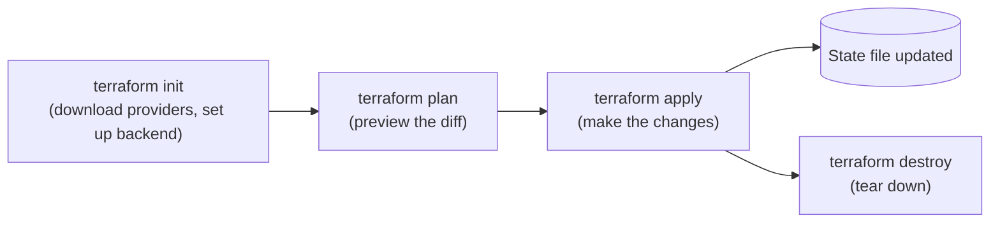

| Command | Purpose |
|---|---|
| `terraform init` | Initialize — download providers, configure backend, install modules |
| `terraform plan` | Dry run — show what *would* change (create/update/destroy) |
| `terraform apply` | Execute the plan (prompts for confirmation) |
| `terraform destroy` | Delete all managed resources |
| `terraform validate` | Check config syntax/validity |
| `terraform fmt` | Auto-format code |
| `terraform show` | Inspect current state |
| `terraform state <cmd>` | Advanced state manipulation |

> [!IMPORTANT]
> **`terraform plan` is Terraform's killer feature and your safety net.** It shows the *exact* diff — every resource to be **created (+), updated (~), or destroyed (-)** — *before* anything happens. Always read the plan carefully, especially for the dreaded **`-/+` (destroy and recreate)** and any `-` (destroy) on stateful resources like databases. In CI/CD, `plan` output is what reviewers approve. Never `apply` without reading the plan — a careless apply can delete a production database.

### 2.3 State — Terraform's Memory

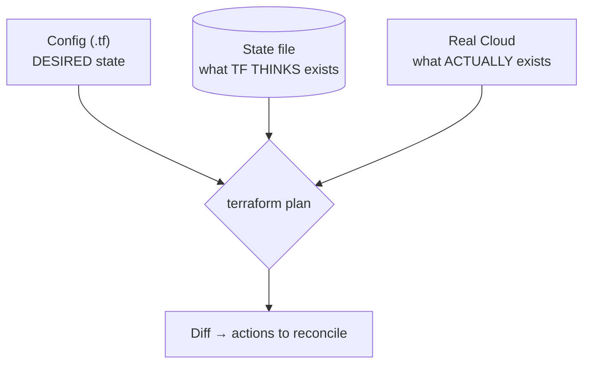

The **state file** (`terraform.tfstate`) maps your config to real-world resource IDs. It's how Terraform knows that `aws_instance.web` corresponds to real instance `i-0abc123`.

> [!WARNING]
> **The state file is critical and sensitive.** It (1) contains **secrets in plaintext** (DB passwords, keys) — so it must be encrypted and access-controlled; (2) is the **single source of truth** — corrupt or lose it and Terraform loses track of your infrastructure (it may try to recreate everything); (3) must **never be edited by hand**. Never commit `terraform.tfstate` to git (secrets + conflicts). Use a **remote backend** (see §2.6) for encryption, locking, and team sharing.

### 2.4 Variables, Outputs & Locals

```hcl
# Input variable with validation
variable "environment" {
  type        = string
  description = "Deployment environment"
  validation {
    condition     = contains(["dev", "staging", "prod"], var.environment)
    error_message = "Must be dev, staging, or prod."
  }
}

# Local value (computed, reused)
locals {
  common_tags = {
    Environment = var.environment
    ManagedBy   = "terraform"
  }
}

# Using them
resource "aws_s3_bucket" "data" {
  bucket = "myapp-${var.environment}-data"
  tags   = local.common_tags
}

# Output for other configs/humans
output "bucket_name" {
  value = aws_s3_bucket.data.id
}
```

| Construct | Purpose |
|---|---|
| **`variable`** | External input (per-environment, secrets, CLI/`.tfvars`) |
| **`local`** | Internal computed value, DRY reuse |
| **`output`** | Expose values (to CLI, other modules, remote state) |

**Setting variables** (precedence, low→high): defaults → env vars (`TF_VAR_x`) → `.tfvars` files → `-var` CLI flags.

### 2.5 Dependencies & the Resource Graph

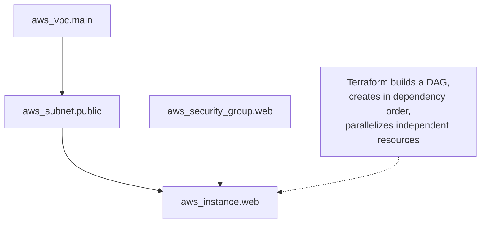

- **Implicit dependencies**: referencing `aws_vpc.main.id` in a subnet tells Terraform the subnet depends on the VPC.
- **Explicit dependencies**: `depends_on = [aws_iam_role.x]` when there's no attribute reference but an ordering need.
- Terraform builds a **dependency graph (DAG)**, creates resources in order, and **parallelizes** independent ones.

> [!TIP]
> **Prefer implicit dependencies** (via attribute references) over `depends_on` — they're automatic and precise. Use `depends_on` only when a real ordering dependency exists that isn't expressed through data (e.g., an IAM policy must exist before a resource can use it, but the resource doesn't reference the policy's attributes). Over-using `depends_on` reduces parallelism and can mask design issues.

### 2.6 Backends & Remote State

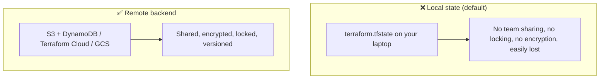

```hcl
terraform {
  backend "s3" {
    bucket         = "mycompany-tfstate"
    key            = "prod/network/terraform.tfstate"
    region         = "us-east-1"
    encrypt        = true
    dynamodb_table = "terraform-locks"   # state locking
  }
}
```

> [!IMPORTANT]
> For any team or production use, a **remote backend is mandatory**. It provides: **shared state** (everyone sees the same truth), **state locking** (prevents two people applying simultaneously and corrupting state — via DynamoDB/Terraform Cloud), **encryption at rest**, and **versioning** (roll back a bad state). The classic setup is **S3 (state) + DynamoDB (lock)**. Without locking, concurrent `apply`s can race and corrupt your infrastructure record.

---

## 3. ⚙️ ADVANCED CONCEPTS (Senior Level)

### 3.1 Modules — Reusable Infrastructure

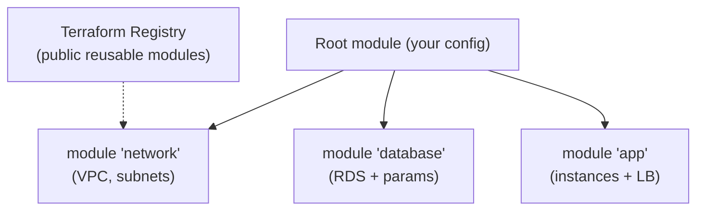

```hcl
module "network" {
  source     = "./modules/network"      # local, or registry, or git
  cidr_block = "10.0.0.0/16"
  env        = var.environment
}

resource "aws_instance" "app" {
  subnet_id = module.network.subnet_id   # use module output
}
```

- A **module** is a folder of `.tf` files with inputs (variables) and outputs — a reusable, parameterized component.
- Sources: local paths, the **Terraform Registry**, git repos, S3.
- **Root module** = your top-level config; it calls **child modules**.

> [!TIP]
> **Modules are how you avoid copy-pasting infrastructure and enforce standards.** Build a `network` module once (with your org's security/tagging conventions baked in) and reuse it across every project — like a function for infrastructure. This mirrors [[03 Helm Charts]] for [[02 Kubernetes]] and library charts. Key discipline: **version your modules** (git tags / registry versions) so a module change rolls out in a controlled way, not silently to everyone at once.

### 3.2 Managing Multiple Environments

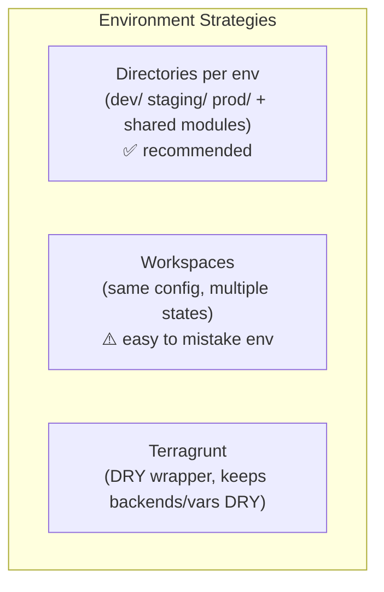

| Approach | Pros | Cons |
|---|---|---|
| **Directory per env** | Clear separation, per-env backends, safe | Some duplication |
| **Workspaces** | Same code, multiple states | Easy to apply to wrong env; hidden state; not for strong isolation |
| **Terragrunt** | DRY, powerful for many envs | Extra tool/learning |

> [!WARNING]
> **Terraform workspaces are commonly misused for environment separation.** They share the *same* backend and config, differing only by state — making it dangerously easy to `apply` prod changes while pointed at the wrong workspace, and they don't isolate backends/permissions. For real dev/staging/prod separation (with different accounts, backends, and blast radius), **prefer a directory-per-environment structure** with separate state and credentials. Workspaces suit ephemeral/parallel copies of the *same* environment (e.g., per-feature-branch testing).

### 3.3 Count, for_each & Dynamic Blocks

```hcl
# count — N identical resources (index-based)
resource "aws_instance" "web" {
  count         = 3
  instance_type = "t3.micro"
  tags = { Name = "web-${count.index}" }
}

# for_each — resources from a map/set (key-based, safer)
resource "aws_instance" "app" {
  for_each      = toset(["api", "worker", "scheduler"])
  instance_type = "t3.micro"
  tags = { Name = each.key }
}

# dynamic block — generate repeated nested blocks
resource "aws_security_group" "web" {
  dynamic "ingress" {
    for_each = var.allowed_ports
    content {
      from_port = ingress.value
      to_port   = ingress.value
      protocol  = "tcp"
    }
  }
}
```

> [!WARNING]
> **Prefer `for_each` over `count` for sets of non-identical resources.** With `count`, resources are tracked by **index** — removing the *middle* item shifts every subsequent index, so Terraform destroys and recreates everything after it (e.g., deleting `web[1]` makes `web[2]` become `web[1]` → churn). `for_each` tracks by **map key**, so removing one item affects only that item. Use `count` only for truly identical, order-independent resources or simple on/off toggles (`count = var.enabled ? 1 : 0`).

### 3.4 Provisioners & When NOT to Use Them

```hcl
resource "aws_instance" "web" {
  # ...
  provisioner "remote-exec" {          # run commands on the resource
    inline = ["sudo apt install -y nginx"]
  }
}
```

> [!WARNING]
> **Provisioners are a last resort** (HashiCorp says so explicitly). They break the declarative model: they run only at create-time (not on updates), can leave resources in a half-built "tainted" state on failure, and aren't tracked in state. Prefer: **pre-baked images** (Packer + [[01 Docker]]/AMIs), **cloud-init/user_data** for bootstrap, and **config management** (Ansible) or [[02 Kubernetes]] for software config. Reach for provisioners only when there's genuinely no API-based alternative.

### 3.5 State Operations (surgical fixes)

| Command | Use case |
|---|---|
| `terraform import` | Bring an existing (manually-created) resource under Terraform management |
| `terraform state mv` | Rename/move a resource in state (e.g., after refactoring into a module) |
| `terraform state rm` | Remove a resource from state *without* destroying it |
| `terraform taint` (now `-replace`) | Force recreation of a resource on next apply |
| `terraform refresh` | Sync state with real-world (now part of plan) |

```bash
# Adopt an existing resource created manually in the console
terraform import aws_instance.web i-0abc123def456

# Force-recreate a resource
terraform apply -replace="aws_instance.web"
```

> [!TIP]
> **`terraform import`** is essential for adopting brownfield infrastructure (resources created before Terraform, or by hand). You write the matching config block, then `import` links it to the real resource ID in state. Modern Terraform also supports **`import` blocks** (declarative, plannable imports) and `terraform plan -generate-config-out` to scaffold the config. This is how teams migrate existing manual infra into IaC incrementally.

### 3.6 Drift & Reconciliation

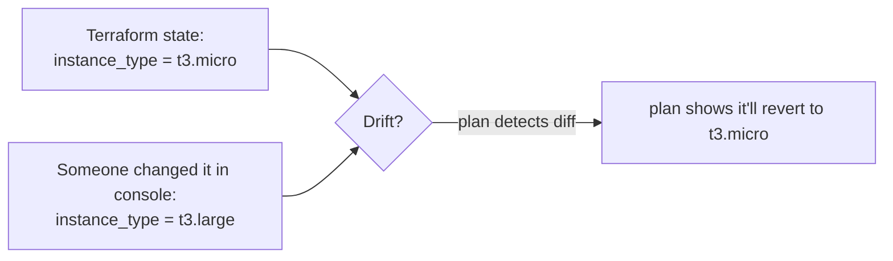

> [!IMPORTANT]
> **Configuration drift** happens when someone changes managed infrastructure *outside* Terraform (a console click, an emergency hotfix). On the next `plan`, Terraform **detects the drift** (comparing state/config to reality) and proposes to **revert it back** to what the config says — because the config is the source of truth. This is powerful (self-correcting) but can be surprising (it may undo an emergency fix). The discipline: **all changes go through Terraform**; if you must change something manually, update the code to match. Regular `plan` runs (in CI) catch drift early.

### 3.7 Failure Scenarios & Production Issues

| Failure | Symptom | Mitigation |
|---|---|---|
| **State file lost/corrupted** | TF loses track of infra | Remote backend + versioning + backups |
| **State lock stuck** | "state locked" errors | `terraform force-unlock` (carefully) after verifying no active apply |
| **Accidental destroy** | Prod resource deleted | Read plans; `prevent_destroy` lifecycle; least-privilege CI |
| **Secrets in state/plan** | Credential exposure | Encrypt backend, restrict access, avoid outputting secrets |
| **`count` index shift** | Mass recreate | Use `for_each` |
| **Provider version drift** | "works on my machine" | Pin provider versions + lock file |
| **Long apply / rate limits** | Slow, throttled | `-parallelism`, target, split state |
| **Circular/implicit dep bugs** | Plan errors | Fix references; minimal `depends_on` |
| **Two teams, one state** | Conflicts, huge blast radius | Split state per component/team |

### 3.8 Testing & Validation

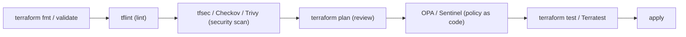

Modern Terraform pipelines gate changes with: **fmt/validate** (syntax), **tflint** (best practices), **tfsec/Checkov** (security misconfig scanning), **plan review**, **policy-as-code** (OPA/Sentinel — "no public S3 buckets", "only approved instance types"), and **tests** (native `terraform test`, Terratest).

---

## 4. 🏗️ REAL-WORLD SYSTEM DESIGN USAGE

### 4.1 Terraform in the Delivery Pipeline

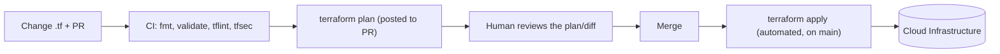

Terraform is the **GitOps for infrastructure**: changes are PRs, `plan` is the reviewable diff, and `apply` runs from CI ([[07 CICD GitHub Actions]] / [[06 Jenkins]]) after approval. Tools like **Atlantis** and **Terraform Cloud/Spacelift** automate plan-on-PR and apply-on-merge with locking and policy checks.

### 4.2 Provisioning the Whole Stack

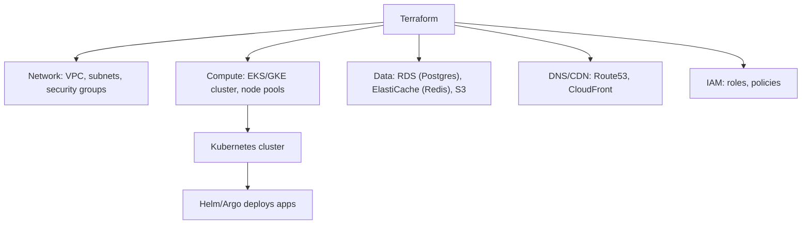

> [!IMPORTANT]
> A common, powerful division of labor: **Terraform provisions the platform** (network, the [[02 Kubernetes]] cluster, managed [[02 Postgres]]/[[04 Redis]], DNS, IAM), and then **[[03 Helm Charts]] / Argo CD deploy the applications** into that cluster. Terraform handles the "slow-moving" foundational infra; Helm/GitOps handle the "fast-moving" app deployments. Mixing the two (using Terraform to also manage every K8s Deployment) is possible via the Kubernetes/Helm providers but often blurs the boundary — keep app deploys in the K8s-native tooling.

### 4.3 How companies use Terraform

| Company/Context | Usage |
|---|---|
| **Startups** | Entire cloud footprint as code from day one |
| **Enterprises** | Multi-account/multi-region, module registries, policy-as-code governance |
| **Multi-cloud** | One workflow across AWS + GCP + Azure |
| **Platform teams** | Provide golden-path modules to product teams |
| **Managed services** | Terraform Cloud, Spacelift, env0, Atlantis for collaboration |

### 4.4 Terraform vs Alternatives

| Tool | vs Terraform |
|---|---|
| **CloudFormation** | AWS-only, JSON/YAML; Terraform is multi-cloud, HCL, better UX |
| **Pulumi** | Real languages (TS/Python/Go) instead of HCL; same IaC model |
| **AWS CDK** | Generates CloudFormation from code; AWS-focused |
| **Ansible** | Config management (imperative-ish); complements Terraform |
| **[[03 Helm Charts]]** | K8s app packaging; Terraform provisions the cluster |
| **OpenTofu** | Open-source Terraform fork (post-license change) |

> [!IMPORTANT]
> **HashiCorp changed Terraform's license (2023) from open-source MPL to the Business Source License (BSL)**, prompting the community to fork **OpenTofu** (Linux Foundation, MPL, drop-in compatible). OpenTofu tracks Terraform's features and is a genuine open-source alternative. For interviews/architecture: know that "Terraform-compatible IaC" now includes OpenTofu, and some orgs have migrated to avoid the BSL. The concepts in this guide apply to both (`tofu` mirrors `terraform` commands).

### 4.5 Provider-Agnostic, Not Provider-Abstracted

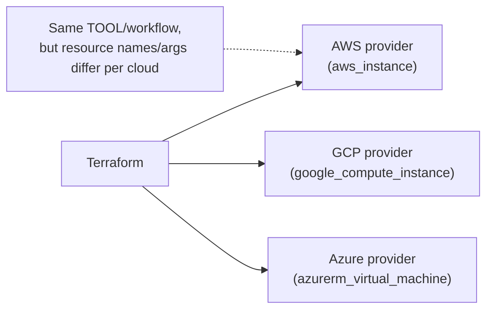

> [!WARNING]
> A common misconception: "Terraform lets me write once, deploy to any cloud." **Not true.** Terraform gives you one *tool and workflow* across clouds, but the **resources are provider-specific** — `aws_instance` ≠ `google_compute_instance`. Multi-cloud with Terraform means managing each cloud's resources with the same tool, not writing cloud-agnostic config. True cloud portability requires abstraction layers ([[02 Kubernetes]] is closer to that goal). Terraform's win is *one consistent workflow*, not magical portability.

---

## 5. 🎤 INTERVIEW PREPARATION

### 5.1 Most important questions

<details>
<summary><b>Q1: What is Terraform and what problem does it solve?</b></summary>

An open-source **Infrastructure as Code** tool for declaratively provisioning infrastructure across many providers. It solves manual, error-prone, unreproducible "ClickOps": infrastructure becomes **versioned, reviewable, reproducible code** with a **plan/apply** workflow that previews changes before making them. It tracks what it manages in a **state file** and is **declarative + idempotent**.
</details>

<details>
<summary><b>Q2: Explain the core workflow.</b></summary>

**`init`** (download providers, set up backend) → **`plan`** (preview the exact diff: create/update/destroy) → **`apply`** (execute after confirmation) → **`destroy`** (tear down). `plan` is the safety net — you review changes before they happen. State is updated on apply.
</details>

<details>
<summary><b>Q3: What is the state file and why does it matter?</b></summary>

`terraform.tfstate` maps your config to real resource IDs — it's Terraform's memory of what it manages. It's critical because it's the source of truth (lose it → Terraform loses track), **sensitive** (contains secrets in plaintext), and must never be hand-edited. Production requires a **remote backend** (S3+DynamoDB) for sharing, locking, and encryption.
</details>

<details>
<summary><b>Q4: count vs for_each?</b></summary>

Both create multiple resources. **`count`** uses a numeric index — removing a middle element shifts indices and recreates everything after it. **`for_each`** uses map/set keys — removing one element affects only that one. Prefer **`for_each`** for sets of distinct resources; use `count` for identical resources or simple enable/disable toggles.
</details>

<details>
<summary><b>Q5: How do you manage secrets in Terraform?</b></summary>

Never hardcode secrets in `.tf` or commit state to git. Use: environment variables (`TF_VAR_`), a **secrets manager** (Vault, AWS Secrets Manager) via data sources, mark variables `sensitive = true` (hides them in output), and **encrypt the remote backend** (state still stores them). Recognize that **secrets end up in state in plaintext** — restrict state access tightly.
</details>

<details>
<summary><b>Q6: What is configuration drift and how does Terraform handle it?</b></summary>

Drift is when infrastructure changes outside Terraform (manual console edit). On the next `plan`, Terraform compares config/state to reality, **detects the drift**, and proposes reverting to the config (the source of truth). Best practice: make all changes through Terraform; run `plan` regularly (in CI) to catch drift.
</details>

<details>
<summary><b>Q7: How do modules work and why use them?</b></summary>

A module is a reusable, parameterized bundle of resources (inputs = variables, outputs = exported values). You call it with `module "x" { source = ... }`. They enable DRY, standardization (bake in org conventions), and composition. **Version them** so changes roll out controllably. Analogous to functions for infrastructure, or [[03 Helm Charts]] for K8s.
</details>

<details>
<summary><b>Q8: How do you handle multiple environments (dev/staging/prod)?</b></summary>

Preferred: **directory per environment** with shared modules and **separate state/backends/credentials** per env — clear isolation and blast-radius control. **Workspaces** are an option but risky for env separation (shared config/backend, easy to target the wrong env). Terragrunt helps keep multi-env setups DRY.
</details>

### 5.2 Tricky questions

> [!TIP]
> **"Does Terraform let you write cloud-agnostic code?"** — No. It's one *tool/workflow* across clouds, but resources are provider-specific (`aws_instance` ≠ `google_compute_instance`). Multi-cloud ≠ write-once-deploy-anywhere.

> [!TIP]
> **"You ran apply and it wants to destroy your database — why?"** — Something forced replacement: an immutable attribute changed (`-/+` in plan), a `count` index shifted, or the resource was removed from config. **Read the plan** — add `prevent_destroy` on critical resources and use `for_each` to avoid index churn.

> [!TIP]
> **"Is `terraform refresh` safe?"** — It updates state to match reality (drift detection). Modern Terraform folds refresh into `plan`. It doesn't change infra, but it *can* change state in ways that affect the next plan — use `-refresh-only` to review drift deliberately.

> [!TIP]
> **"terraform vs terraform Cloud vs OpenTofu?"** — Terraform (CLI, now BSL-licensed), **Terraform Cloud** (HashiCorp's managed collaboration/state/runs service), **OpenTofu** (open-source MPL fork of the CLI). Don't conflate the CLI tool with the SaaS product.

### 5.3 Common mistakes candidates make

| Mistake | Reality |
|---|---|
| Committing `terraform.tfstate` to git | Secrets + conflicts; use remote backend |
| Editing state by hand | Use `state` commands / import |
| Not reading the plan | Careless apply can destroy prod |
| `count` for distinct resources | Index shift churn; use `for_each` |
| Workspaces for prod/dev isolation | Prefer directory-per-env |
| Hardcoding secrets | Use secrets managers + sensitive vars |
| No state locking | Concurrent applies corrupt state |
| No provider version pinning | Unreproducible builds |
| Using provisioners by default | Last resort; use images/cloud-init |

### 5.4 What interviewers actually expect

- The **declarative + state + plan/apply** model, articulated clearly.
- Deep respect for **state** (sensitivity, remote backends, locking) — the #1 real-world topic.
- **Modules, for_each vs count, environments, drift, import** — practical fluency.
- **Security** (secrets in state, policy-as-code, least-privilege CI).
- Knowing Terraform's limits (**not cloud-agnostic**, provisioners last resort) and modern context (**OpenTofu**, BSL).
- Pragmatism — reviewable plans, small state blast radius, IaC discipline.

---

## 6. 🛠️ HANDS-ON PROJECTS

### Project 1: Provision a Web Stack from Scratch (Beginner→Intermediate)

**Goal:** Network + compute + storage, fully as code, with remote state.

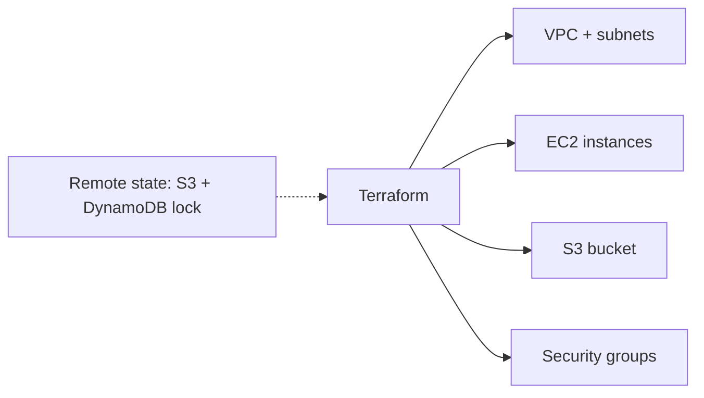

**Steps:**
1. Configure the AWS provider + an **S3 backend with DynamoDB locking**.
2. Declare a VPC, subnet, security group, and an EC2 instance (referencing each other = implicit deps).
3. Use **variables** for region/instance type and **outputs** for the public IP.
4. Run `init → plan → apply`; inspect the state; make a change and re-plan.
5. `terraform destroy` to tear it all down cleanly.

**Learn:** HCL, workflow, dependencies, variables/outputs, remote state, plan-reading.

---

### Project 2: Reusable Modules + Multi-Environment (Intermediate→Senior)

**Goal:** DRY, standardized infra across dev/staging/prod.

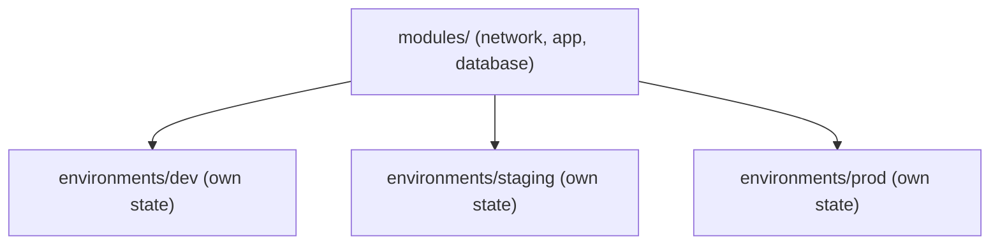

**Steps:**
1. Extract reusable **modules** (network, app, database) with inputs/outputs.
2. Create a **directory per environment**, each with its own backend/state and `.tfvars`.
3. Parameterize sizing per env (small dev, HA prod).
4. Use **`for_each`** to create a variable set of app instances.
5. Add `prevent_destroy` on the prod database; **version** your modules with git tags.

**Learn:** modules, environment strategy, for_each, lifecycle rules, safe production practices.

---

### Project 3: Full GitOps IaC Pipeline (Senior)

**Goal:** Plan-on-PR, apply-on-merge, with security + policy gates.

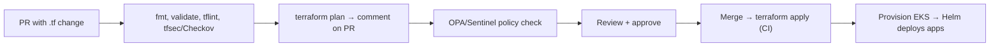

**Steps:**
1. Set up a pipeline ([[07 CICD GitHub Actions]] / [[06 Jenkins]] / Atlantis) that runs `plan` on PRs and posts the diff.
2. Add **security scanning** (tfsec/Checkov) and **policy-as-code** (OPA/Sentinel — e.g., "no public S3", "approved instance types").
3. Provision a [[02 Kubernetes]] (EKS/GKE) cluster + managed [[02 Postgres]]/[[04 Redis]] via modules.
4. Hand off app deployment to [[03 Helm Charts]] / Argo CD.
5. Introduce deliberate **drift**; show `plan` detecting and reverting it.

**Learn:** IaC CI/CD, plan review gates, security/policy scanning, Terraform↔K8s boundary, drift handling.

---

## 7. 🔬 DEEP DIVE: INTERNALS

### 7.1 The Core Engine: Config + State + Real World

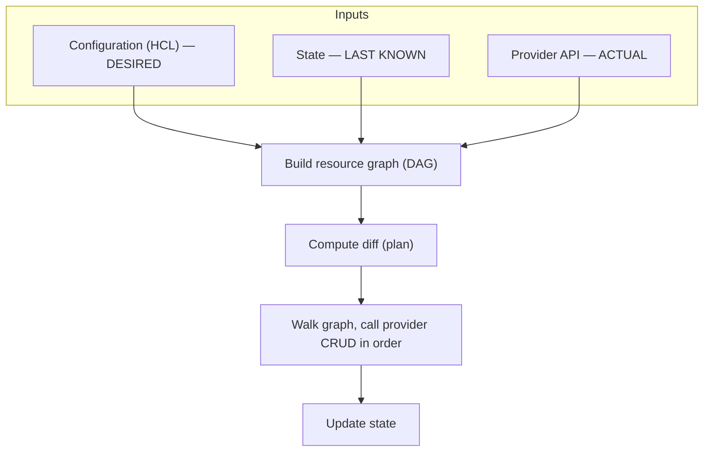

> [!IMPORTANT]
> Every Terraform run reconciles **three sources**: your **config** (desired state), the **state file** (what Terraform last recorded), and the **real world** (queried via provider APIs). `plan` = compute the diff between these; `apply` = walk the dependency graph executing provider CRUD operations to converge them, then update state. This three-way reconciliation is *the* Terraform mental model — understanding it explains drift, import, `state rm`, and nearly every "why is it doing that?" moment.

### 7.2 The Provider Plugin Architecture

```mermaid
flowchart LR
    Core["Terraform Core<br/>(graph, diff, state, HCL)"] <-->|"gRPC"| Provider["Provider Plugin<br/>(aws, google, kubernetes...)"]
    Provider <-->|"REST/SDK"| CloudAPI["Cloud API"]
```

> [!TIP]
> Terraform has a **two-part architecture**: **Terraform Core** (the engine — parses HCL, builds the graph, computes diffs, manages state) communicates over **gRPC** with **provider plugins** (separate binaries that know how to CRUD a specific platform's resources by calling its API). This is why Terraform supports 1000+ platforms — anyone can write a provider implementing the plugin protocol. `terraform init` downloads the provider binaries; the **`.terraform.lock.hcl`** lock file pins their versions/checksums for reproducibility (commit it!).

### 7.3 The Resource Lifecycle & CRUD

```mermaid
stateDiagram-v2
    [*] --> Create: plan shows +
    Create --> Update: config change (in-place ~)
    Update --> Update: further changes
    Update --> Replace: immutable attr change (-/+)
    Replace --> Update
    Update --> Delete: removed from config (-)
    Delete --> [*]
```

Providers implement **CRUD** for each resource type. Terraform decides per-resource whether a change is an **in-place update (~)** or a **destroy-and-recreate (-/+)** based on whether the changed attribute is mutable. The **`lifecycle`** block tunes this:

```hcl
resource "aws_db_instance" "main" {
  lifecycle {
    prevent_destroy       = true    # block accidental deletion
    create_before_destroy = true    # avoid downtime on replacement
    ignore_changes        = [tags]  # don't fight external tag changes
  }
}
```

> [!WARNING]
> **`create_before_destroy` is crucial for zero-downtime replacement.** By default Terraform destroys the old resource *then* creates the new one — causing an outage for things like load balancer targets. `create_before_destroy = true` reverses that (new first, then swap, then delete old). **`prevent_destroy`** guards critical stateful resources (databases) against accidental deletion — the apply *errors* rather than destroying. **`ignore_changes`** stops Terraform from reverting attributes managed elsewhere (e.g., autoscaling changing instance counts, or tags added by another system).

### 7.4 How State Locking Works

```mermaid
sequenceDiagram
    participant A as Engineer A
    participant Lock as DynamoDB / backend lock
    participant B as Engineer B
    A->>Lock: acquire lock (apply starts)
    Lock-->>A: 🔒 locked
    B->>Lock: acquire lock (apply starts)
    Lock-->>B: ❌ already locked — wait/fail
    A->>Lock: release (apply done)
    B->>Lock: acquire → proceeds
```

> [!IMPORTANT]
> **State locking prevents the catastrophic race** of two `apply`s running simultaneously against the same state — which could corrupt the state file or create conflicting/duplicate resources. The backend (DynamoDB for S3, or Terraform Cloud) holds a **lock** for the duration of an apply; a second apply waits or fails. If an apply crashes mid-run, the lock can get **stuck** — `terraform force-unlock <ID>` releases it, but only after you've confirmed no apply is actually running (force-unlocking during a real apply reintroduces the race).

### 7.5 Plan Internals — The Diff Algorithm

```mermaid
flowchart LR
    Refresh["1. Refresh: query real state via providers"] --> Compare["2. Compare desired (config) vs current (refreshed state)"]
    Compare --> Actions["3. Determine per-resource action:<br/>no-op / create / update / replace / delete"]
    Actions --> Order["4. Order by dependency graph"]
    Order --> Output["5. Render human-readable plan"]
```

> [!TIP]
> A `plan` (1) **refreshes** — queries providers for the current real state of managed resources; (2) **diffs** that against your config; (3) classifies each resource's needed action; (4) orders them by the dependency DAG; and (5) renders the diff. Reading a plan: **`+`** create, **`~`** update in place, **`-`** destroy, **`-/+`** (or `+/-` with create_before_destroy) replace, and **`# forces replacement`** annotations tell you *why* a replace is happening. The scariest lines are `-` and `-/+` on stateful resources — always scrutinize those.

---

## ✅ Production Checklists

### State & Backend
- [ ] **Remote backend** (S3+DynamoDB / Terraform Cloud / GCS) — never local for teams
- [ ] **State locking** enabled
- [ ] State **encrypted at rest** + tight access control (contains secrets)
- [ ] State **versioning/backups** on
- [ ] State **split** per component/team to limit blast radius
- [ ] `.tfstate` **never** in git

### Code Quality
- [ ] Provider + module **versions pinned**; `.terraform.lock.hcl` committed
- [ ] `terraform fmt` + `validate` + **tflint** in CI
- [ ] **`for_each`** over `count` for distinct resources
- [ ] **Modules** for reuse, versioned
- [ ] No hardcoded secrets; `sensitive = true`; secrets from a manager
- [ ] Meaningful tags/labels via `locals`

### Safety
- [ ] **`prevent_destroy`** on critical stateful resources (DBs)
- [ ] **`create_before_destroy`** where zero-downtime matters
- [ ] **Plan reviewed** before every apply (plan-on-PR)
- [ ] **Least-privilege** CI credentials (no god-mode)
- [ ] Security scanning (**tfsec/Checkov**) + **policy-as-code** (OPA/Sentinel)
- [ ] Directory-per-environment isolation (separate accounts/state)

---

## 🗺️ Learning Roadmap

```mermaid
flowchart TB
    A["1️⃣ Basics<br/>IaC, HCL, providers, resources"] --> B["2️⃣ Workflow<br/>init/plan/apply/destroy, reading plans"]
    B --> C["3️⃣ State<br/>state file, remote backends, locking"]
    C --> D["4️⃣ Variables & structure<br/>vars, outputs, locals, dependencies"]
    D --> E["5️⃣ Modules & environments<br/>reuse, dev/staging/prod, for_each"]
    E --> F["6️⃣ Operations<br/>import, drift, state ops, lifecycle"]
    F --> G["7️⃣ Production<br/>CI/CD, security scanning, policy-as-code"]
    G --> H["8️⃣ Internals<br/>graph, provider plugins, diff, locking"]
```

| Stage | Focus | You can... |
|---|---|---|
| 1–2 | Basics + workflow | Provision and change simple infra |
| 3–4 | State + structure | Work safely on a team with remote state |
| 5–6 | Modules + operations | Build reusable, multi-env, maintainable infra |
| 7–8 | Production + internals | Run governed IaC pipelines; debug deeply |

---

## 🔁 Self-Review Completion Loop

Reviewed against official Terraform documentation, best practices, common interview questions, and real-world production usage.

### Gap Review Matrix

| Dimension | Covered? | Where |
|---|---|---|
| What/why, IaC problem | ✅ | §1 |
| IaC categories (provision vs config mgmt) | ✅ | §1 |
| Declarative vs imperative | ✅ | §1 |
| HCL syntax & resource anatomy | ✅ | §2.1 |
| Core workflow (init/plan/apply/destroy) | ✅ | §2.2 |
| State file | ✅ | §2.3, §7.1 |
| Variables/outputs/locals | ✅ | §2.4 |
| Dependencies & graph | ✅ | §2.5 |
| Backends & remote state & locking | ✅ | §2.6, §7.4 |
| Modules | ✅ | §3.1 |
| Multi-environment strategies | ✅ | §3.2 |
| count / for_each / dynamic | ✅ | §3.3 |
| Provisioners (and avoiding them) | ✅ | §3.4 |
| State operations (import/mv/rm) | ✅ | §3.5 |
| Drift & reconciliation | ✅ | §3.6 |
| Failure scenarios | ✅ | §3.7 |
| Testing/validation/policy | ✅ | §3.8 |
| CI/CD pipeline | ✅ | §4.1 |
| Terraform↔K8s boundary | ✅ | §4.2 |
| vs alternatives + OpenTofu/license | ✅ | §4.4 |
| Provider-agnostic ≠ portable | ✅ | §4.5 |
| Provider plugin architecture | ✅ | §7.2 |
| Resource lifecycle & CRUD | ✅ | §7.3 |
| Plan diff internals | ✅ | §7.5 |
| Interview Q&A + mistakes | ✅ | §5 |
| Hands-on projects | ✅ | §6 |

> [!NOTE]
> **Remaining depth to explore independently:** Terragrunt (DRY multi-env orchestration), Terraform Cloud/Enterprise features (run tasks, private registry, RBAC), Sentinel policy language, `moved` blocks for safe refactors, `import` blocks + config generation, provider aliasing (multi-region/multi-account), dynamic provider configuration, custom providers (Go SDK/Framework), and CDK for Terraform (CDKTF — write infra in TS/Python).

---

## 📚 Official References

| Resource | URL |
|---|---|
| Terraform Documentation | https://developer.hashicorp.com/terraform/docs |
| Terraform Registry (providers + modules) | https://registry.terraform.io/ |
| HCL Language | https://developer.hashicorp.com/terraform/language |
| Recommended Practices | https://developer.hashicorp.com/terraform/cloud-docs/recommended-practices |
| State docs | https://developer.hashicorp.com/terraform/language/state |
| Modules | https://developer.hashicorp.com/terraform/language/modules |
| OpenTofu (open-source fork) | https://opentofu.org/ |
| tfsec / Checkov (security) | https://aquasecurity.github.io/tfsec/ · https://www.checkov.io/ |

---

## 🎁 Final Summary

> [!IMPORTANT]
> **The one-paragraph takeaway:** Terraform is a **declarative, provider-agnostic Infrastructure-as-Code tool** that provisions cloud/on-prem resources by reconciling three things — your **config** (desired state), the **state file** (what it manages), and the **real world** (via provider APIs). Its workflow — **`init → plan → apply`** — makes infrastructure **versioned, reviewable, reproducible, and idempotent**, with **`plan`** as the safety net that previews the exact diff before any change. The concepts that dominate real-world use: treat **state** as critical and sensitive (remote backend + locking + encryption, never in git), use **modules** for reusable standardized infra, prefer **`for_each`** over `count`, isolate environments by **directory**, guard critical resources with **`prevent_destroy`**/`create_before_destroy`, and gate changes through **CI with plan review + security/policy scanning**. Know its limits — it's **not** write-once-cloud-agnostic (resources are provider-specific), provisioners are a last resort — and the modern context (**OpenTofu** fork after the BSL license change). Terraform provisions the platform ([[02 Kubernetes]] clusters, managed [[02 Postgres]]/[[04 Redis]], networks); [[03 Helm Charts]]/GitOps then deploy the apps onto it.

**Golden rules:**
1. 📜 **Declarative + idempotent** — declare desired state; Terraform computes the diff.
2. 👀 **Always read the `plan`** — especially `-` and `-/+` on stateful resources.
3. 💾 **State is critical & sensitive** — remote backend, locking, encryption, never in git.
4. 🧩 Use **versioned modules** for reusable, standardized infrastructure.
5. 🔑 Prefer **`for_each`** over `count`; directory-per-environment over workspaces.
6. 🛡️ **`prevent_destroy`** + **`create_before_destroy`** protect production.
7. 🔐 Never hardcode secrets; scan with **tfsec/Checkov**; enforce **policy-as-code**.
8. 🌐 Multi-cloud = one **workflow**, not cloud-agnostic **code**.
9. 🔀 Terraform **provisions the platform**; [[03 Helm Charts]]/GitOps **deploy the apps**.

---

*Related guides in this vault: [[02 Kubernetes]] · [[01 Docker]] · [[03 Helm Charts]] · [[07 CICD GitHub Actions]] · [[06 Jenkins]] · [[01 System Design Fundamentals]] · [[03 Microservices]] · [[02 Postgres]] · [[04 Redis]]*
