# 🟢 Nginx — Complete Beginner-to-Expert Reference

> The high-performance web server, reverse proxy, and load balancer that fronts a huge share of the internet — event-driven, blazingly efficient, and the Swiss-army knife of the web edge.

---

## 📑 Table of Contents

1. [Executive Summary](#-executive-summary)
2. [Fundamentals (Beginner)](#1--fundamentals-beginner-level)
3. [Core Concepts (Intermediate)](#2--core-concepts-intermediate-level)
4. [Advanced Concepts (Senior)](#3--advanced-concepts-senior-level)
5. [Real-World System Design](#4--real-world-system-design-usage)
6. [Interview Preparation](#5--interview-preparation)
7. [Hands-On Projects](#6--hands-on-projects)
8. [Deep Dive: Internals](#7--deep-dive-internals)
9. [Production Checklists](#-production-checklists)
10. [Learning Roadmap](#-learning-roadmap)
11. [Self-Review Completion Loop](#-self-review-completion-loop)
12. [Official References](#-official-references)
13. [Final Summary](#-final-summary)

---

## 🎯 Executive Summary

**Nginx** (pronounced "engine-x") is an open-source **web server** that also excels as a **reverse proxy, load balancer, API gateway, and cache**. Built around an **event-driven, asynchronous** architecture, it handles tens of thousands of concurrent connections with minimal memory — solving the "C10k problem" that sank older thread-per-connection servers like Apache.

| What it is | What it replaces | Core superpower |
|---|---|---|
| Web server + reverse proxy + load balancer | Thread-per-request servers, ad-hoc edge scripts | **Event-driven concurrency** — massive connections on tiny resources, at the web edge |

> [!IMPORTANT]
> Nginx's defining trait is its **event-driven, non-blocking architecture**: instead of one thread/process per connection (the old Apache model that collapses under load), a handful of worker processes each juggle thousands of connections via an event loop — the same idea as [[05 Node.js]]. This is why Nginx serves static content and proxies traffic with extraordinary efficiency. In a modern stack it sits at **the edge**: the first thing requests hit, distributing them to your [[03 Microservices]]/app servers, terminating TLS, caching, and shielding your backend — exactly the "load balancer + reverse proxy" tier from [[01 System Design Fundamentals]].

Related guides: [[01 System Design Fundamentals]] · [[03 Microservices]] · [[02 Kubernetes]] · [[01 Docker]] · [[05 Node.js]] · [[06 Express.js]] · [[04 Redis]]

---

## 1. 🌱 FUNDAMENTALS (Beginner Level)

### What is Nginx in simple terms?

When you type a URL, *something* has to receive that request and respond with a web page. That something is a **web server**. Nginx is a web server — but its real power is acting as a **middleman (reverse proxy)** that sits in front of your actual application servers, receiving all incoming traffic and intelligently forwarding it, while handling cross-cutting concerns (TLS, compression, caching, load distribution) so your app doesn't have to.

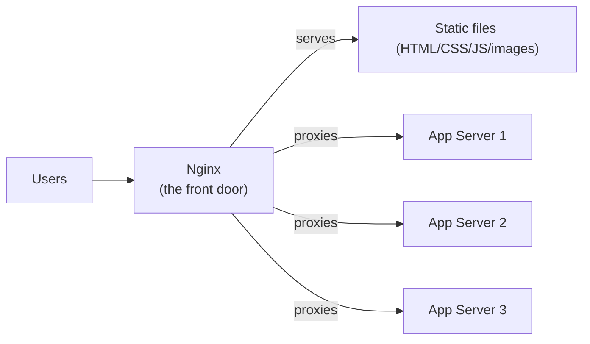

### Why does Nginx exist? (The C10k Problem)

Older servers (Apache in its classic mode) used **one thread or process per connection**. Each connection consumes memory and a thread; with 10,000 concurrent connections you'd need 10,000 threads — the OS drowns in context-switching and RAM. This is the famous **"C10k problem"** (handling 10,000 concurrent connections).

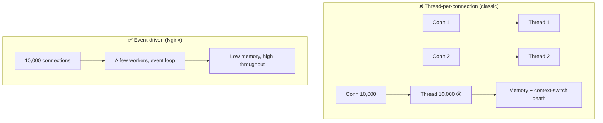

Nginx (2004, by Igor Sysoev) was built specifically to solve this with an **asynchronous, event-driven** model.

### Problems Nginx solves

| Problem | How Nginx solves it |
|---|---|
| **Massive concurrent connections** | Event-driven workers (C10k+) |
| **Slow static file serving** | Highly optimized static serving (sendfile, caching) |
| **App servers exposed to the internet** | Reverse proxy shields & fronts them |
| **Uneven load across servers** | Built-in load balancing |
| **TLS/HTTPS overhead on app** | TLS termination at the edge |
| **Repeated identical responses** | Caching layer |
| **Large/slow clients tying up app** | Buffering slow connections |
| **Routing many services under one domain** | Path/host-based routing (API gateway) |

### The many hats of Nginx

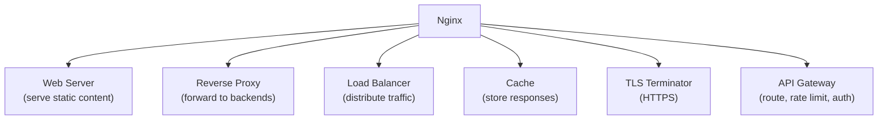

### Forward Proxy vs Reverse Proxy

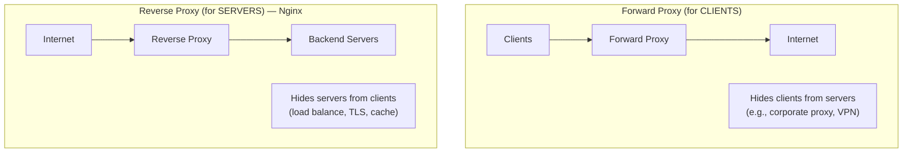

> [!TIP]
> **Forward proxy** works on behalf of *clients* (hides who's making requests — like a VPN). **Reverse proxy** works on behalf of *servers* (clients think they're talking to one server, but Nginx routes to many hidden backends). Nginx is almost always used as a **reverse proxy** — this is the mental model that unlocks 90% of its real-world use.

### Real-world analogy 🏨

Nginx is like a **hotel front desk / concierge**:
- **Guests** (users) never wander into the kitchen or housekeeping (your app servers) — they go to the **front desk** (Nginx).
- The concierge **routes requests**: "restaurant? → floor 2," "spa? → floor 3" (path-based routing to services).
- If one waiter is busy, the concierge sends you to another (load balancing).
- The desk keeps a **stack of common brochures** to hand out instantly (caching static content).
- It **checks IDs and handles security** at the door (TLS, auth, rate limiting) so the back-of-house staff can focus on their work.

> [!TIP]
> The unifying mental model: **Nginx is the intelligent front door of your system.** Everything it does — serving files, proxying, load balancing, caching, TLS, routing — is about handling requests *at the edge* efficiently so your application servers do less and stay protected. In [[01 System Design Fundamentals]] terms, it's the load-balancer + reverse-proxy + CDN-edge tier made concrete.

---

## 2. 🧩 CORE CONCEPTS (Intermediate Level)

### 2.1 Architecture: Master + Workers

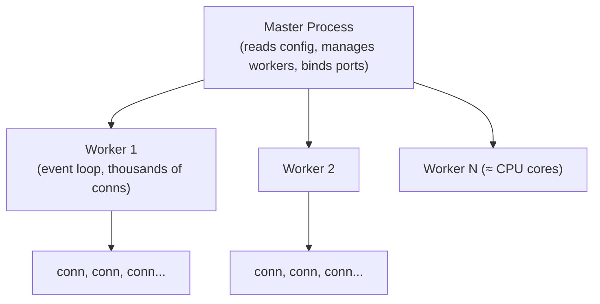

- **Master process**: privileged; reads/validates config, binds to ports (80/443), spawns and manages **worker processes**, handles signals (reload/restart). Does *not* handle requests.
- **Worker processes**: do the actual request handling. Typically **one per CPU core** (`worker_processes auto;`). Each runs a **single-threaded event loop** handling thousands of connections.

> [!IMPORTANT]
> The master/worker split is why Nginx can **reload config with zero downtime**: on `nginx -s reload`, the master starts *new* workers with the new config, lets *old* workers finish their in-flight requests (graceful drain), then retires them. Users never see a dropped connection. Also, since each worker is single-threaded and event-driven, there's no per-connection thread overhead — the key to its efficiency.

### 2.2 The Configuration Structure

Nginx config is a hierarchy of **directives** (settings) organized in **contexts** (blocks):

```nginx
# --- main context (global) ---
user  nginx;
worker_processes  auto;

events {
    worker_connections  1024;   # max connections per worker
}

http {                          # --- http context ---
    include       mime.types;
    sendfile      on;
    keepalive_timeout  65;

    upstream backend {          # define a pool of servers
        server 10.0.0.1:8080;
        server 10.0.0.2:8080;
    }

    server {                    # --- a virtual server ---
        listen       80;
        server_name  example.com;

        location / {            # --- a route ---
            proxy_pass http://backend;
        }

        location /static/ {
            root /var/www;
        }
    }
}
```

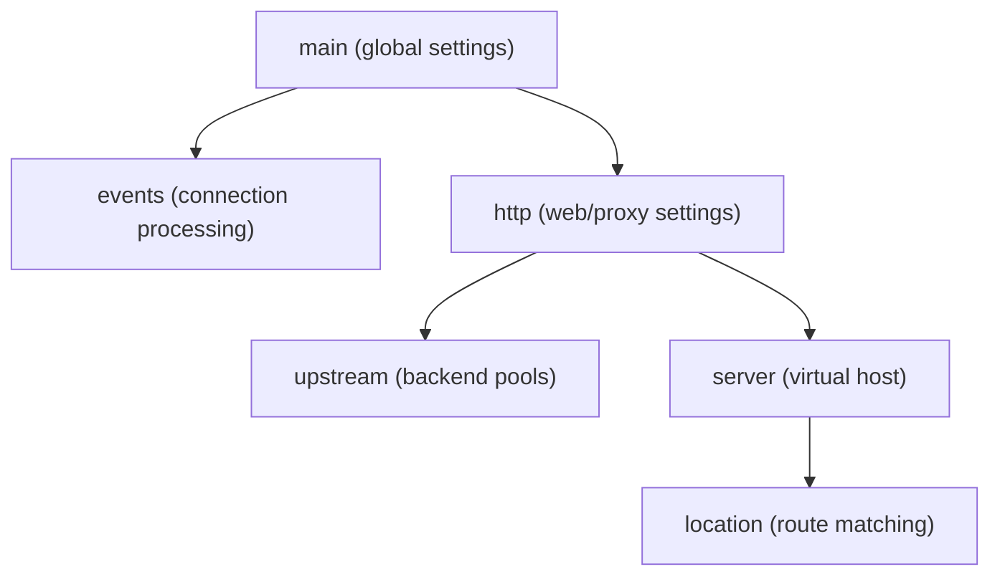

| Context | Purpose |
|---|---|
| **main** | Global (user, worker_processes, error_log) |
| **events** | Connection handling (worker_connections) |
| **http** | All HTTP settings, caching, upstreams |
| **server** | A virtual host (domain + port) |
| **location** | Route matching within a server |
| **upstream** | A named pool of backend servers |

### 2.3 The `server` Block (Virtual Hosts)

One Nginx instance can host **many sites** via multiple `server` blocks, selected by `listen` port + `server_name`:

```nginx
server {
    listen 80;
    server_name api.example.com;
    location / { proxy_pass http://api_backend; }
}

server {
    listen 80;
    server_name www.example.com;
    root /var/www/html;
}
```

Nginx picks the `server` block by matching `Host` header against `server_name`. A `default_server` handles unmatched requests.

### 2.4 The `location` Block (Routing)

`location` matches the request URI. **Match precedence** (this trips everyone up):

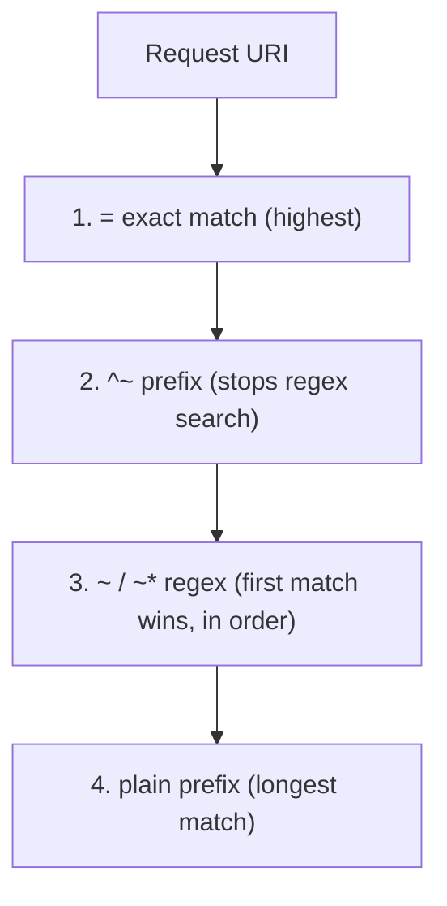

```nginx
location = /health      { return 200 "ok"; }        # exact
location ^~ /static/     { root /var/www; }          # prefix, no regex after
location ~* \.(jpg|png)$ { expires 30d; }            # case-insensitive regex
location /                { proxy_pass http://app; }  # catch-all prefix
```

| Modifier | Meaning | Priority |
|---|---|---|
| `=` | Exact match | Highest |
| `^~` | Prefix, skip regex if matched | High |
| `~` | Case-sensitive regex | Medium (order matters) |
| `~*` | Case-insensitive regex | Medium |
| (none) | Prefix match (longest wins) | Lowest |

> [!WARNING]
> **`location` matching order is NOT top-to-bottom for prefixes.** Nginx picks the **most specific** match: exact (`=`) first, then the longest prefix, but **regex matches (`~`) are tested in file order and the first match wins**, overriding prefix matches (unless `^~` was used). This non-linear precedence is the #1 source of "why is my request hitting the wrong location?" confusion. When debugging routing, remember: specificity and modifiers beat position.

### 2.5 Reverse Proxy Basics

```nginx
location / {
    proxy_pass http://backend;
    proxy_set_header Host $host;                     # preserve original host
    proxy_set_header X-Real-IP $remote_addr;         # pass client IP
    proxy_set_header X-Forwarded-For $proxy_add_x_forwarded_for;
    proxy_set_header X-Forwarded-Proto $scheme;      # http/https
}
```

> [!IMPORTANT]
> When Nginx proxies a request, the backend sees the connection coming from **Nginx**, not the real client — so you **must forward the original client info** via headers (`X-Real-IP`, `X-Forwarded-For`, `X-Forwarded-Proto`). Forgetting these means your app logs Nginx's IP for every user, breaks IP-based rate limiting/geolocation, and can cause redirect loops (app thinks it's on HTTP when the client used HTTPS). This is one of the most common real-world proxy misconfigurations.

### 2.6 Serving Static Content

```nginx
location /static/ {
    root /var/www;              # serves /var/www/static/file.css
    # alias /var/www/assets/;   # alternative: maps /static/ → /var/www/assets/
    expires 30d;                # cache headers
    gzip on;
    try_files $uri $uri/ =404;  # check file, then dir, then 404
}
```

> [!TIP]
> **`root` vs `alias`** confuses everyone: with `root /var/www`, a request `/static/x.css` → `/var/www/static/x.css` (URI *appended* to root). With `alias /var/www/assets/`, `/static/x.css` → `/var/www/assets/x.css` (the location prefix is *replaced*). Use `alias` when the URL path and filesystem path differ. **`try_files`** is the workhorse for SPAs: `try_files $uri $uri/ /index.html;` serves the file if it exists, else falls back to `index.html` for client-side routing.

---

## 3. ⚙️ ADVANCED CONCEPTS (Senior Level)

### 3.1 Load Balancing

```nginx
upstream backend {
    least_conn;                          # algorithm
    server 10.0.0.1:8080 weight=3;       # gets 3x traffic
    server 10.0.0.2:8080;
    server 10.0.0.3:8080 backup;         # only used if others down
    server 10.0.0.4:8080 max_fails=3 fail_timeout=30s;  # passive health check
}
```

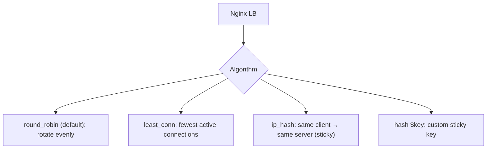

| Algorithm | Behavior | Use case |
|---|---|---|
| **round_robin** (default) | Rotate through servers | General, stateless backends |
| **least_conn** | Send to fewest active connections | Uneven/long request times |
| **ip_hash** | Hash client IP → sticky server | Session affinity (no shared session store) |
| **hash $key** | Custom hash (e.g., URL) | Cache locality, consistent routing |
| **random two** | Pick 2 random, choose better | Large clusters (power-of-two-choices) |

> [!TIP]
> **Prefer stateless backends + a shared session store ([[04 Redis]]) over `ip_hash` sticky sessions.** Sticky sessions (`ip_hash`) tie a user to one server — but if that server dies, the user loses their session, and load can become uneven (many users behind one NAT IP → one server). The [[01 System Design Fundamentals]] answer is: keep app servers stateless, push session state to [[04 Redis]], and use plain `least_conn`/`round_robin`. Reach for sticky sessions only when you can't externalize state.

### 3.2 Health Checks & Resilience

- **Passive health checks** (open-source Nginx): `max_fails` + `fail_timeout` — Nginx marks a server "down" after N failed requests, retries later.
- **Active health checks** (Nginx Plus / or via other tools): Nginx proactively probes `/health` endpoints.
- `proxy_next_upstream`: retry the request on the next server if one fails.

```nginx
location / {
    proxy_pass http://backend;
    proxy_next_upstream error timeout http_502 http_503;
    proxy_connect_timeout 2s;
    proxy_read_timeout 10s;
}
```

> [!WARNING]
> Open-source Nginx only does **passive** health checks (it learns a server is down by *failing* real user requests). This means some users hit errors before Nginx ejects the bad server. **Active** health checks (proactive probing) require **Nginx Plus** (paid) or a sidecar. In [[02 Kubernetes]], the ingress + readiness probes handle this — the platform removes unhealthy pods from the Service before Nginx even sees them. Know this limitation when designing resilience.

### 3.3 Caching

```nginx
# Define a cache zone
proxy_cache_path /var/cache/nginx levels=1:2 keys_zone=my_cache:10m
                 max_size=1g inactive=60m;

location / {
    proxy_cache my_cache;
    proxy_cache_valid 200 302 10m;       # cache 200s for 10 min
    proxy_cache_valid 404 1m;
    proxy_cache_key "$scheme$request_method$host$request_uri";
    add_header X-Cache-Status $upstream_cache_status;  # HIT/MISS/EXPIRED
    proxy_pass http://backend;
}
```

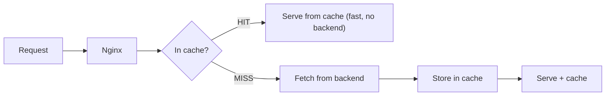

> [!TIP]
> Nginx caching shields your backend from repeated identical requests — a form of the caching tier from [[01 System Design Fundamentals]]. Key features: **`proxy_cache_lock`** (only one request rebuilds a cache entry while others wait — prevents cache stampede, like the [[04 Redis]] rebuild lock), **`proxy_cache_use_stale`** (serve stale content when the backend is down — graceful degradation), and micro-caching (cache even for 1 second) to absorb traffic spikes on dynamic content. The `X-Cache-Status` header is invaluable for debugging hit/miss rates.

### 3.4 TLS/SSL Termination

```nginx
server {
    listen 443 ssl http2;
    server_name example.com;

    ssl_certificate     /etc/letsencrypt/live/example.com/fullchain.pem;
    ssl_certificate_key /etc/letsencrypt/live/example.com/privkey.pem;
    ssl_protocols       TLSv1.2 TLSv1.3;
    ssl_ciphers         HIGH:!aNULL:!MD5;
    ssl_session_cache   shared:SSL:10m;

    location / { proxy_pass http://backend; }   # backend gets plain HTTP
}

# Redirect HTTP → HTTPS
server {
    listen 80;
    server_name example.com;
    return 301 https://$host$request_uri;
}
```

> [!IMPORTANT]
> **TLS termination** means Nginx handles the expensive HTTPS encryption/decryption at the edge, then talks plain HTTP to your backends over the trusted internal network. Benefits: certificates managed in *one* place (not every app server), CPU-heavy TLS offloaded from apps, and centralized cipher/protocol policy. Pair with **Let's Encrypt + certbot** for free auto-renewing certs. (For zero-trust, you can re-encrypt to backends — "TLS re-encryption" — but termination-then-plaintext-internally is the common pattern.)

### 3.5 Rate Limiting & Security

```nginx
# Limit request rate per client IP
limit_req_zone $binary_remote_addr zone=api_limit:10m rate=10r/s;
# Limit concurrent connections
limit_conn_zone $binary_remote_addr zone=conn_limit:10m;

location /api/ {
    limit_req zone=api_limit burst=20 nodelay;   # allow bursts
    limit_conn conn_limit 10;
    proxy_pass http://backend;
}
```

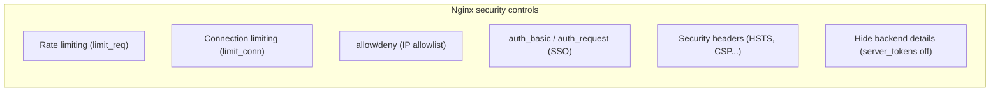

> [!TIP]
> Nginx's **leaky-bucket rate limiter** (`limit_req` with `rate` + `burst`) is a front-line defense against abuse, brute-force, and DoS — applied *before* requests reach your app. `burst` allows short spikes; `nodelay` serves burst requests immediately (vs queuing). This complements app-level rate limiting ([[04 Redis]] sliding window) — do coarse limiting at the edge (Nginx), fine-grained per-user limiting in the app. Also set `server_tokens off` to hide the Nginx version, and add security headers.

### 3.6 Failure Scenarios & Production Issues

| Failure | Symptom | Mitigation |
|---|---|---|
| **502 Bad Gateway** | Backend unreachable/crashed | Check backend health, timeouts, `proxy_next_upstream` |
| **504 Gateway Timeout** | Backend too slow | Tune `proxy_read_timeout`; fix slow backend |
| **413 Request Too Large** | Upload exceeds limit | Raise `client_max_body_size` |
| **Wrong location matched** | Unexpected routing | Understand match precedence (§2.4) |
| **Client IP = Nginx IP in logs** | Missing forwarded headers | Set `X-Real-IP`/`X-Forwarded-For` |
| **worker_connections exceeded** | Dropped connections | Raise `worker_connections`, `worker_rlimit_nofile` |
| **Redirect loop** | Infinite HTTPS redirect | Fix `X-Forwarded-Proto` handling |
| **Config error on reload** | Reload fails | `nginx -t` before reload (test config) |
| **Too many open files** | `EMFILE` errors | Increase OS file descriptor limits |
| **Stale cache** | Old content served | Tune `proxy_cache_valid`, purge cache |

> [!WARNING]
> **Always run `nginx -t` before reloading** — it validates the config syntax without applying it. A typo in a live reload on open-source Nginx will fail the reload (old config keeps running, which is safe), but on a fresh *start* a bad config means Nginx won't come up at all. `502 Bad Gateway` almost always means "Nginx is fine, but the backend it proxies to is down/unreachable" — check your app, not Nginx. `504` means the backend is up but too slow.

---

## 4. 🏗️ REAL-WORLD SYSTEM DESIGN USAGE

### 4.1 The Classic Web Architecture

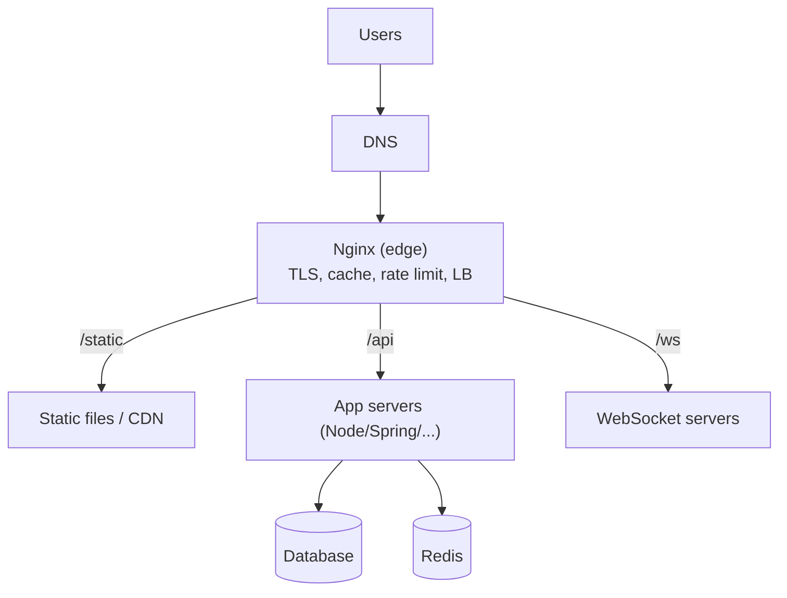

Nginx as the single edge tier: terminates TLS, serves static assets directly (fast), load-balances API traffic across app servers, rate-limits, and routes by path — a textbook realization of the edge tier in [[01 System Design Fundamentals]].

### 4.2 Nginx as an API Gateway (Microservices)

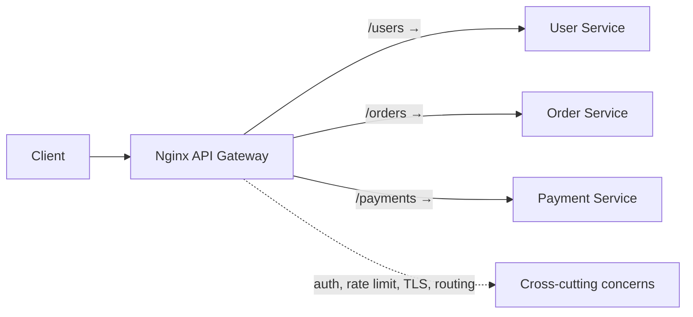

In [[03 Microservices]], Nginx can act as a lightweight **API gateway**: one entry point routing `/users`, `/orders`, `/payments` to different services, handling auth (`auth_request`), rate limiting, and TLS centrally — so each service doesn't reimplement these.

### 4.3 Nginx in Kubernetes (Ingress Controller)

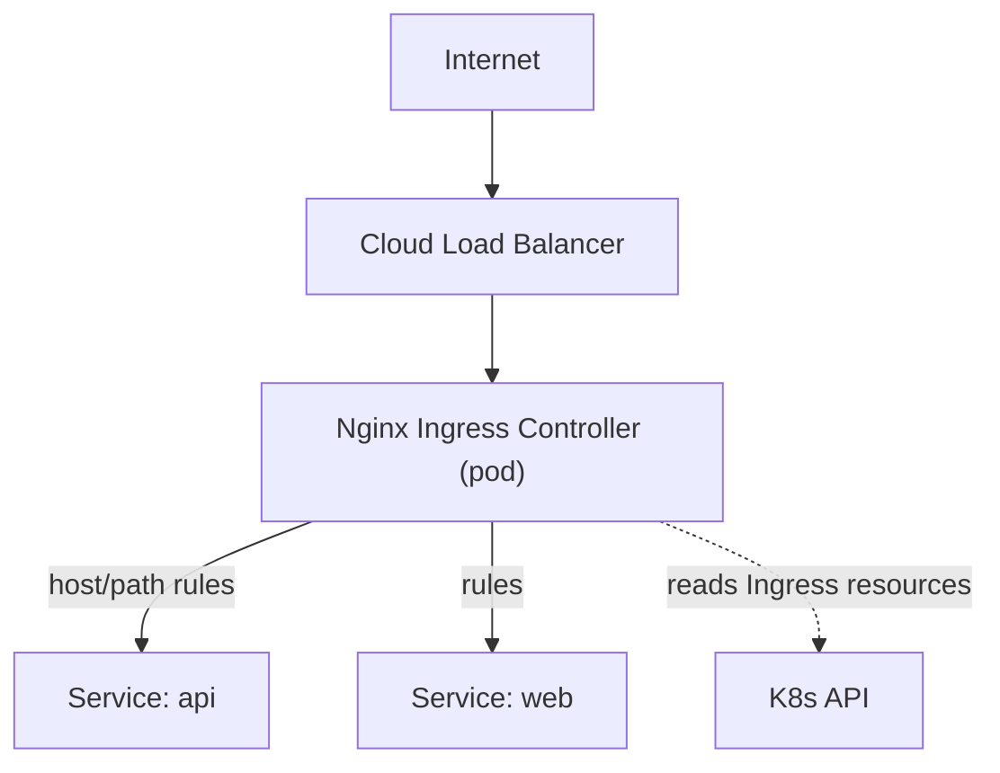

> [!IMPORTANT]
> The **Nginx Ingress Controller** is the most popular way to route external HTTP into a [[02 Kubernetes]] cluster. It runs Nginx as a pod, **watches Kubernetes Ingress resources**, and dynamically rewrites its config to route traffic to Services based on host/path rules — TLS, rate limiting, and rewrites included. This is Nginx's reverse-proxy/routing power, made **cloud-native and config-driven** by the K8s control loop. When your [[03 Helm Charts]] define an `Ingress`, it's usually this Nginx controller implementing it.

### 4.4 How companies use Nginx

| Company/Context | Usage |
|---|---|
| **Netflix, Airbnb, Dropbox** | Edge serving, reverse proxy at massive scale |
| **~1/3 of all websites** | Nginx is among the most-used web servers globally |
| **CDNs (Cloudflare heritage)** | Nginx/OpenResty power edge caching layers |
| **Microservices shops** | API gateway / ingress |
| **Any SPA + API** | Static frontend + `/api` proxy to backend |

### 4.5 Nginx vs Alternatives

| Tool | vs Nginx |
|---|---|
| **Apache HTTP Server** | Process/thread-per-connection (classic); more modules/`.htaccess`; Nginx faster for static/concurrency |
| **HAProxy** | Specialized L4/L7 load balancer; superb LB features; Nginx more general (also web server/cache) |
| **Traefik** | Cloud-native, auto-service-discovery, dynamic config; great for K8s/Docker; Nginx more mature/raw-perf |
| **Envoy** | Modern L7 proxy, service mesh data plane (Istio); richer observability/dynamic API; heavier |
| **Caddy** | Automatic HTTPS by default, simpler config; smaller ecosystem |
| **OpenResty** | Nginx + LuaJIT — programmable Nginx (scripting, API gateways like Kong) |

> [!TIP]
> **Nginx vs Envoy/Traefik** is a live modern debate: Nginx is battle-tested, extremely fast, and simple, but its config is static (reload to change) and observability is basic. **Envoy** (service mesh data plane) and **Traefik** (auto-discovery) offer dynamic configuration and richer telemetry, better suited to highly dynamic [[02 Kubernetes]]/[[03 Microservices]] environments. Nginx remains the default for edge/web serving and is still hugely popular as an ingress; the newer tools win where dynamic, observable, mesh-native routing matters.

---

## 5. 🎤 INTERVIEW PREPARATION

### 5.1 Most important questions

<details>
<summary><b>Q1: What is Nginx and why is it so efficient?</b></summary>

Nginx is a web server / reverse proxy / load balancer. Its efficiency comes from an **event-driven, asynchronous, non-blocking** architecture: a few worker processes (≈ CPU cores), each a single-threaded event loop, handle thousands of concurrent connections without a thread per connection. This solves the **C10k problem** and uses far less memory than thread-per-connection servers (classic Apache).
</details>

<details>
<summary><b>Q2: Forward proxy vs reverse proxy?</b></summary>

A **forward proxy** acts for *clients* — it sits in front of clients and forwards their requests to the internet (hiding the clients; e.g., corporate proxy/VPN). A **reverse proxy** acts for *servers* — it sits in front of backend servers, receiving client requests and routing them (hiding the servers; load balancing, TLS, caching). Nginx is used mainly as a **reverse proxy**.
</details>

<details>
<summary><b>Q3: Explain the master/worker architecture.</b></summary>

The **master** process reads config, binds ports, and manages workers (but handles no requests). **Worker** processes (usually one per core) handle all connections via an event loop. This enables **zero-downtime reloads** (master spawns new workers with new config, drains old ones) and efficient, thread-free concurrency.
</details>

<details>
<summary><b>Q4: How does load balancing work in Nginx?</b></summary>

Define an `upstream` pool of servers; Nginx distributes requests using an algorithm: **round_robin** (default), **least_conn** (fewest active), **ip_hash** (sticky by client IP), or custom **hash**. Supports weights, backup servers, and **passive health checks** (`max_fails`/`fail_timeout`). Prefer stateless backends + [[04 Redis]] over sticky sessions.
</details>

<details>
<summary><b>Q5: What is TLS termination and why do it at Nginx?</b></summary>

Nginx handles HTTPS encryption/decryption at the edge, then forwards plain HTTP to backends over the internal network. Benefits: certificates managed centrally (one place), CPU-heavy TLS offloaded from app servers, unified cipher/protocol policy. Commonly paired with Let's Encrypt for free auto-renewing certs.
</details>

<details>
<summary><b>Q6: How does location matching work?</b></summary>

Nginx selects the most specific match, not top-to-bottom: **`=`** (exact) first, then **`^~`** (prefix, skips regex), then **regex `~`/`~*`** (first match in file order wins), then plain **prefix** (longest wins). This non-linear precedence causes many routing bugs — specificity/modifiers beat position.
</details>

<details>
<summary><b>Q7: What does a 502 vs 504 mean?</b></summary>

**502 Bad Gateway**: Nginx reached the backend but got an invalid/failed response, or the backend is down/unreachable — the problem is the **backend**, not Nginx. **504 Gateway Timeout**: the backend is up but didn't respond within `proxy_read_timeout` — it's too slow. Both point to backend issues, not Nginx itself.
</details>

<details>
<summary><b>Q8: How do you achieve zero-downtime config changes?</b></summary>

Run **`nginx -t`** to validate, then **`nginx -s reload`**. The master starts new workers with the new config and lets old workers finish in-flight requests before retiring them — no dropped connections. For binary upgrades, Nginx supports hot binary swapping via signals.
</details>

### 5.2 Tricky questions

> [!TIP]
> **"Why is the client IP showing as Nginx's IP in my app logs?"** — Because the backend sees the proxy's connection. You must forward `X-Real-IP` / `X-Forwarded-For` headers via `proxy_set_header`, and configure the app to trust them. Classic proxy gotcha.

> [!TIP]
> **"root vs alias?"** — With `root`, the location URI is *appended* to the root path. With `alias`, the location prefix is *replaced* by the alias path. Mixing them up serves files from the wrong directory (404s).

> [!TIP]
> **"Does Nginx open-source do active health checks?"** — No — only **passive** (learns a server is down by failing real requests). Active health checks need Nginx Plus or an external mechanism (or K8s readiness probes in an ingress setup).

> [!TIP]
> **"Is Nginx multi-threaded?"** — Mostly no — workers are **single-threaded event loops**. It added an optional **thread pool** for offloading blocking disk I/O (`aio threads`), but request processing is event-driven, not thread-per-request. Don't confuse "multiple worker *processes*" with "multi-threaded."

### 5.3 Common mistakes candidates make

| Mistake | Reality |
|---|---|
| "Nginx is just a web server" | Also reverse proxy, LB, cache, gateway |
| Forgetting forwarded headers | Backend logs/ratelimit see Nginx IP |
| Assuming top-to-bottom location matching | Specificity/modifiers decide |
| `root` vs `alias` confusion | Different path resolution |
| Blaming Nginx for 502/504 | It's the backend that's down/slow |
| Sticky sessions by default | Prefer stateless + [[04 Redis]] |
| Reloading without `nginx -t` | Validate config first |
| "Nginx is multi-threaded per request" | Event-driven, single-threaded workers |

### 5.4 What interviewers actually expect

- The **event-driven architecture** and **C10k** story (why Nginx is efficient).
- **Reverse proxy vs forward proxy**, and Nginx's role at the **edge**.
- **Load balancing** algorithms + **TLS termination** + **caching** + **rate limiting**.
- **location/server** matching and common proxy header pitfalls.
- Debugging **502/504** and reading `X-Cache-Status`.
- Modern context: **Nginx as K8s Ingress**, vs Envoy/Traefik, and its limits (passive health checks, static config).

---

## 6. 🛠️ HANDS-ON PROJECTS

### Project 1: Reverse Proxy + Static Frontend for a SPA (Beginner→Intermediate)

**Goal:** Serve a React SPA and proxy `/api` to a backend, with TLS.

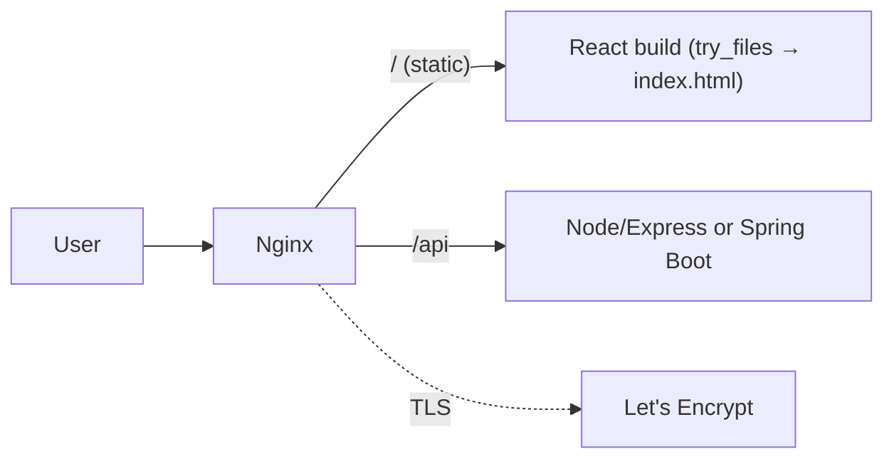

**Steps:**
1. Serve the SPA build with `try_files $uri /index.html` (client-side routing).
2. `proxy_pass` `/api/` to a [[05 Node.js]]/[[06 Express.js]] or [[05 Spring Boot]] backend with proper forwarded headers.
3. Add gzip + cache headers (`expires`) for static assets.
4. Add TLS with Let's Encrypt (certbot) + HTTP→HTTPS redirect.
5. Test `nginx -t` and zero-downtime `reload`.

**Learn:** server/location blocks, reverse proxy, static serving, TLS, try_files.

---

### Project 2: Load Balancer + Cache + Rate Limiter (Intermediate→Senior)

**Goal:** Front multiple backend instances with LB, caching, and protection.

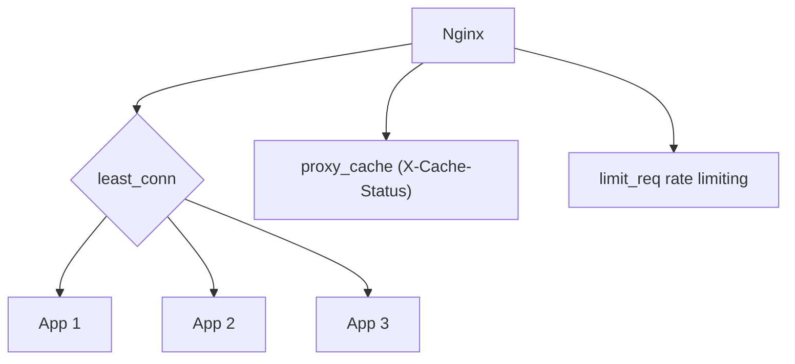

**Steps:**
1. Run 3 backend instances (via [[01 Docker]] Compose) behind an `upstream` pool.
2. Configure `least_conn` + weights + passive health checks (`max_fails`).
3. Add `proxy_cache` with `proxy_cache_lock` and expose `X-Cache-Status`.
4. Add `limit_req` rate limiting with `burst`.
5. Kill a backend → observe Nginx routing around it; load-test hit/miss ratios.

**Learn:** upstream/LB algorithms, health checks, caching, stampede prevention, rate limiting.

---

### Project 3: Nginx as Microservices API Gateway + K8s Ingress (Senior)

**Goal:** One entry point routing to many services, then the K8s-native version.

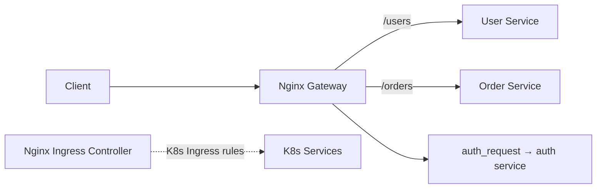

**Steps:**
1. Build an Nginx gateway routing `/users`, `/orders`, `/payments` to separate [[03 Microservices]].
2. Add centralized TLS, rate limiting, and `auth_request` for auth delegation.
3. Deploy to [[02 Kubernetes]] and reimplement routing via the **Nginx Ingress Controller** + Ingress resources ([[03 Helm Charts]]).
4. Compare static Nginx config vs dynamic K8s-driven config.
5. Add path rewrites and per-service rate limits.

**Learn:** API gateway pattern, auth delegation, K8s Ingress, static-vs-dynamic config.

---

## 7. 🔬 DEEP DIVE: INTERNALS

### 7.1 The Event-Driven Model (epoll/kqueue)

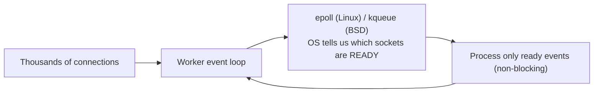

> [!IMPORTANT]
> Nginx workers use **OS-level event notification** (`epoll` on Linux, `kqueue` on BSD/macOS) — the same mechanism behind [[05 Node.js]] and [[04 Redis]]. Instead of a thread blocking on each connection, the worker asks the kernel "which of my thousands of sockets have data ready?" and processes only those, never blocking. One worker can juggle tens of thousands of connections because idle connections cost almost nothing (just a file descriptor). This is the fundamental reason Nginx crushes the C10k problem — it decouples *connections* from *threads*.

### 7.2 Why Blocking Is the Enemy

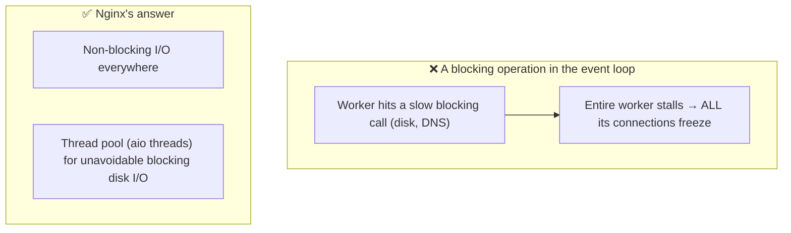

> [!WARNING]
> In an event-driven server, a **single blocking operation freezes the whole worker** and every connection it's handling (exactly the "don't block the event loop" rule from [[05 Node.js]]). This is why Nginx is obsessive about non-blocking I/O. For unavoidable blocking work — like reading large files from slow disks — Nginx added an optional **thread pool** (`aio threads`) that offloads just those blocking operations to separate threads, keeping the event loop responsive. Understanding this explains both Nginx's design and its performance-tuning knobs.

### 7.3 Request Processing Phases


Nginx processes each request through ordered **phases** (rewrite, access control, content generation, response filtering). Modules hook into specific phases — this phased pipeline is how features like rewriting, auth, gzip, and caching compose cleanly (a [[02 Design Patterns|Chain of Responsibility]]-style pipeline).

### 7.4 The Module Architecture

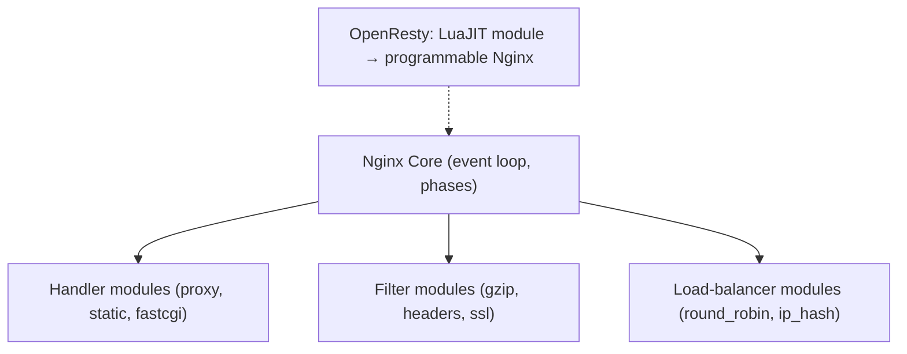

> [!TIP]
> Nginx is built from **modules** — handlers (generate content: proxy, static, FastCGI), filters (transform responses: gzip, SSL, headers), and load balancers. Historically modules had to be **compiled in** (static), though **dynamic modules** now exist. **OpenResty** embeds **LuaJIT**, turning Nginx into a programmable platform — you can write request-handling logic in Lua. This is how powerful API gateways like **Kong** are built *on top of* Nginx, and how you'd add custom logic (dynamic routing, JWT validation) at the edge without a separate service.

### 7.5 Zero-Downtime Reloads & Binary Upgrades

```mermaid
sequenceDiagram
    participant M as Master
    participant Old as Old Workers
    participant New as New Workers
    M->>M: nginx -s reload (new config)
    M->>New: spawn workers with NEW config
    M->>Old: signal graceful shutdown
    Old->>Old: finish in-flight requests
    Old-->>M: exit when drained
    Note over New: New connections go to new workers
```

> [!IMPORTANT]
> Nginx's graceful reload is elegant: the master validates and loads the new config, **forks new workers** using it, and tells old workers to **stop accepting new connections but finish their current ones**. Once drained, old workers exit. No connection is ever dropped — critical for high-availability edges. Nginx goes further with **hot binary upgrades**: you can replace the Nginx *executable* itself (new version) without downtime by signaling the master to spawn a new master/worker set, then retiring the old — the OS keeps the listening sockets alive across the swap. This is production-grade operational design.

---

## ✅ Production Checklists

### Configuration
- [ ] `worker_processes auto;` (match CPU cores); tune `worker_connections`
- [ ] **`nginx -t`** in CI/before every reload
- [ ] `server_tokens off;` (hide version)
- [ ] Proper forwarded headers (`X-Real-IP`, `X-Forwarded-For/Proto`)
- [ ] `client_max_body_size` set for uploads
- [ ] Sensible `proxy_*_timeout` values
- [ ] OS file-descriptor limits raised (`worker_rlimit_nofile`)

### Security
- [ ] **TLS 1.2/1.3 only**, strong ciphers, HSTS header
- [ ] Auto-renewing certs (Let's Encrypt/certbot)
- [ ] **Rate limiting** (`limit_req`) + connection limits on sensitive endpoints
- [ ] Security headers (CSP, X-Frame-Options, X-Content-Type-Options)
- [ ] `allow`/`deny` for admin/internal paths
- [ ] Regular Nginx updates (CVEs)

### Performance & Reliability
- [ ] **gzip/brotli** compression on
- [ ] Static asset caching (`expires`, `sendfile on`)
- [ ] `proxy_cache` with `proxy_cache_lock` where beneficial
- [ ] `keepalive` connections to upstreams
- [ ] HTTP/2 (or HTTP/3) enabled
- [ ] Health checks + `proxy_next_upstream` for failover
- [ ] Access/error logs shipped to central logging; monitor 4xx/5xx rates

---

## 🗺️ Learning Roadmap

```mermaid
flowchart TB
    A["1️⃣ Basics<br/>what/why, web server, install, first config"] --> B["2️⃣ Config structure<br/>contexts, server, location, matching"]
    B --> C["3️⃣ Reverse proxy<br/>proxy_pass, forwarded headers, static"]
    C --> D["4️⃣ Load balancing<br/>upstream, algorithms, health checks"]
    D --> E["5️⃣ TLS & security<br/>termination, certs, rate limiting, headers"]
    E --> F["6️⃣ Caching & perf<br/>proxy_cache, gzip, HTTP/2, tuning"]
    F --> G["7️⃣ Production<br/>API gateway, K8s Ingress, observability"]
    G --> H["8️⃣ Internals<br/>event loop, phases, modules, reloads, OpenResty"]
```

| Stage | Focus | You can... |
|---|---|---|
| 1–2 | Basics + config | Configure servers and routing |
| 3–4 | Proxy + LB | Front and balance backends |
| 5–6 | TLS + cache | Secure and speed up the edge |
| 7–8 | Production + internals | Run gateways/ingress; understand the engine |

---

## 🔁 Self-Review Completion Loop

Reviewed against official Nginx documentation, best practices, common interview questions, and real-world production usage.

### Gap Review Matrix

| Dimension | Covered? | Where |
|---|---|---|
| What/why, C10k problem | ✅ | §1 |
| Web server vs reverse proxy vs LB roles | ✅ | §1 |
| Forward vs reverse proxy | ✅ | §1 |
| Master/worker architecture | ✅ | §2.1 |
| Config structure & contexts | ✅ | §2.2 |
| server blocks (virtual hosts) | ✅ | §2.3 |
| location matching precedence | ✅ | §2.4 |
| Reverse proxy + forwarded headers | ✅ | §2.5 |
| Static content (root/alias/try_files) | ✅ | §2.6 |
| Load balancing algorithms | ✅ | §3.1 |
| Health checks & resilience | ✅ | §3.2 |
| Caching | ✅ | §3.3 |
| TLS termination | ✅ | §3.4 |
| Rate limiting & security | ✅ | §3.5 |
| Failure scenarios (502/504 etc.) | ✅ | §3.6 |
| Classic web architecture | ✅ | §4.1 |
| API gateway | ✅ | §4.2 |
| K8s Ingress controller | ✅ | §4.3 |
| vs Apache/HAProxy/Envoy/Traefik | ✅ | §4.5 |
| Event-driven internals (epoll) | ✅ | §7.1 |
| Blocking/thread pool | ✅ | §7.2 |
| Request phases | ✅ | §7.3 |
| Module architecture / OpenResty | ✅ | §7.4 |
| Zero-downtime reload/binary upgrade | ✅ | §7.5 |
| Interview Q&A + mistakes | ✅ | §5 |
| Hands-on projects | ✅ | §6 |

> [!NOTE]
> **Remaining depth to explore independently:** HTTP/3 (QUIC) support, gRPC proxying (`grpc_pass` — pairs with a future gRPC guide), stream (TCP/UDP) load balancing (`stream` context, e.g., balancing [[02 Postgres]]/[[04 Redis]]), FastCGI/uWSGI for PHP/Python, `njs` (JavaScript in Nginx), advanced OpenResty/Lua scripting, mutual TLS (mTLS), WebSocket proxying details, and Nginx Plus features (active health checks, dynamic upstreams, dashboard).

---

## 📚 Official References

| Resource | URL |
|---|---|
| Nginx Documentation | https://nginx.org/en/docs/ |
| Nginx Admin Guide | https://docs.nginx.com/nginx/admin-guide/ |
| Beginner's Guide | https://nginx.org/en/docs/beginners_guide.html |
| Directive Index | https://nginx.org/en/docs/dirindex.html |
| Nginx Ingress (Kubernetes) | https://kubernetes.github.io/ingress-nginx/ |
| OpenResty | https://openresty.org/ |
| Let's Encrypt / certbot | https://certbot.eff.org/ |
| Mozilla SSL Config Generator | https://ssl-config.mozilla.org/ |

---

## 🎁 Final Summary

> [!IMPORTANT]
> **The one-paragraph takeaway:** Nginx is a high-performance **web server, reverse proxy, load balancer, cache, and API gateway** whose **event-driven, non-blocking** architecture (a master + a few single-threaded worker processes using `epoll`/`kqueue`) lets it handle tens of thousands of concurrent connections on minimal resources — solving the **C10k problem**. It lives at the **edge** of your system: terminating **TLS**, serving static content fast, **load-balancing** across stateless backends, **caching** responses, **rate-limiting** abuse, and **routing** by host/path to your [[03 Microservices]] — the concrete embodiment of the load-balancer/reverse-proxy tier from [[01 System Design Fundamentals]]. Master the **config hierarchy** (http → server → location) and its **non-linear location matching**, always **forward client headers** when proxying, understand **502 = backend down / 504 = backend slow**, prefer **stateless backends + [[04 Redis]]** over sticky sessions, and validate with **`nginx -t`** before zero-downtime **reloads**. In [[02 Kubernetes]], it reappears as the **Nginx Ingress Controller**, config-driven by the cluster — while newer tools (Envoy, Traefik) compete where dynamic, observable, mesh-native routing is needed.

**Golden rules:**
1. ⚡ **Event-driven workers** (≈ CPU cores) — connections decoupled from threads (C10k).
2. 🚪 Nginx is the **intelligent front door** — reverse proxy, LB, TLS, cache, gateway.
3. 🧭 **location matching is non-linear** — specificity/modifiers beat file order.
4. 📨 **Always forward** `X-Real-IP`/`X-Forwarded-For/Proto` when proxying.
5. 🔒 **Terminate TLS** at the edge; auto-renew certs (Let's Encrypt).
6. ⚖️ Prefer **stateless backends + [[04 Redis]]** over sticky sessions.
7. 🩺 **502 = backend down, 504 = backend slow** — not Nginx's fault.
8. ✅ **`nginx -t`** then **`reload`** for zero-downtime changes.
9. ☸️ In [[02 Kubernetes]] it's the **Ingress Controller**, driven by Ingress resources.

---

*Related guides in this vault: [[01 System Design Fundamentals]] · [[03 Microservices]] · [[02 Kubernetes]] · [[01 Docker]] · [[05 Node.js]] · [[06 Express.js]] · [[04 Redis]] · [[03 Helm Charts]] · [[02 Design Patterns]]*
