# 🔧 Jenkins — Complete Beginner-to-Expert Reference

> The battle-tested, self-hosted automation server that pioneered CI/CD — pipelines-as-code, a 1,800+ plugin ecosystem, and distributed build orchestration at enterprise scale.

---

## 📑 Table of Contents

1. [Executive Summary](#-executive-summary)
2. [Fundamentals (Beginner)](#1--fundamentals-beginner-level)
3. [Core Concepts (Intermediate)](#2--core-concepts-intermediate-level)
4. [Advanced Concepts (Senior)](#3--advanced-concepts-senior-level)
5. [Real-World System Design](#4--real-world-system-design-usage)
6. [Interview Preparation](#5--interview-preparation)
7. [Hands-On Projects](#6--hands-on-projects)
8. [Deep Dive: Internals](#7--deep-dive-internals)
9. [Production Checklists](#-production-checklists)
10. [Learning Roadmap](#-learning-roadmap)
11. [Self-Review Completion Loop](#-self-review-completion-loop)
12. [Official References](#-official-references)
13. [Final Summary](#-final-summary)

---

## 🎯 Executive Summary

**Jenkins** is an open-source, self-hosted **automation server** for building, testing, and deploying software — the tool that popularized **Continuous Integration / Continuous Delivery (CI/CD)**. Its modern form expresses pipelines **as code** (`Jenkinsfile`) and distributes work across a **controller + agents** architecture.

| What it is | What it replaces | Core superpower |
|---|---|---|
| Self-hosted CI/CD automation server | Manual build/test/deploy scripts, cron jobs, "works on my machine" | Infinitely extensible (plugins) pipelines-as-code you fully control on your own infrastructure |

> [!IMPORTANT]
> Jenkins' defining trait is **control + extensibility**: you host it yourself and its **1,800+ plugin** ecosystem integrates with virtually anything. That's its strength (flexible, no vendor lock-in, air-gap friendly) *and* its weakness (you own the maintenance, upgrades, and security). Contrast with hosted [[07 CICD GitHub Actions]] where the platform is managed for you.

Related guides: [[07 CICD GitHub Actions]] · [[03 Helm Charts]] · [[03 Microservices]] · [[01 Kafka]] · [[05 Spring Boot]]

---

## 1. 🌱 FUNDAMENTALS (Beginner Level)

### What is Jenkins in simple terms?

Jenkins is a **robot butler for your code**. Every time a developer pushes a change, Jenkins automatically: pulls the code, compiles it, runs the tests, and — if everything passes — packages and deploys it. Instead of a human running these steps by hand, Jenkins does them **consistently, automatically, and repeatably**.

```bash
# The pain Jenkins removes: someone manually running, every release...
git pull && mvn clean package && ./run-tests.sh && ./deploy-prod.sh   # 😰 error-prone, inconsistent
```

### Why does Jenkins exist?

Before CI, teams practiced **"integration hell"** — everyone merged their work rarely, and combining it was a painful, bug-ridden event.

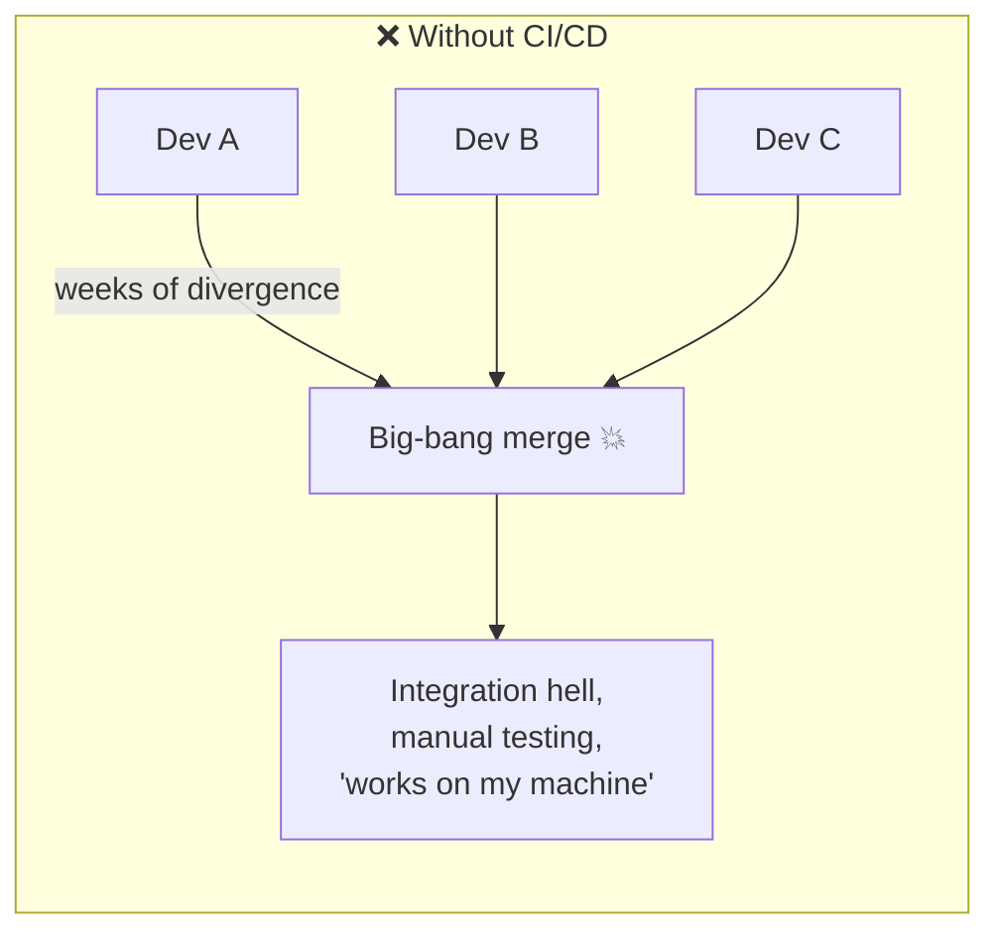

**Continuous Integration** fixes this: merge frequently, and let an automated server build + test **every change immediately**.

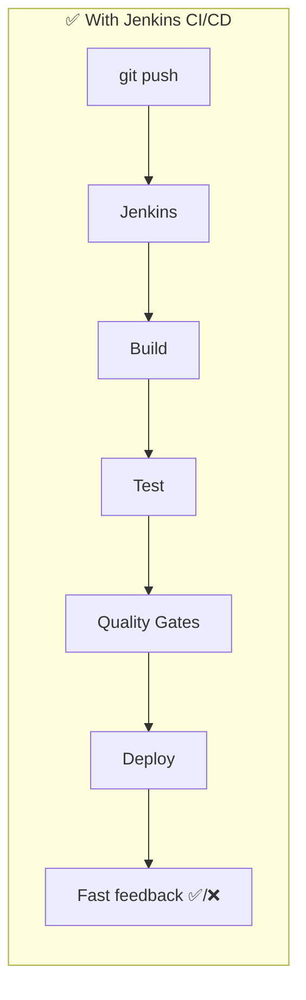

### Problems Jenkins solves

| Problem | How Jenkins solves it |
|---|---|
| **Integration hell** | Build + test every commit automatically |
| **Manual, error-prone releases** | Codified, repeatable pipelines |
| **Slow feedback on bugs** | Fail fast — developer notified in minutes |
| **"Works on my machine"** | Consistent, clean build environment (agents/containers) |
| **Tool sprawl** | Plugins integrate SCM, build tools, cloud, notifications |
| **Scaling builds** | Distribute across many agents |
| **No audit trail** | Every build logged, versioned, reproducible |

### Core concepts (the vocabulary)

| Term | Plain meaning |
|---|---|
| **Controller** (formerly "master") | The brain — schedules jobs, stores config, serves the UI |
| **Agent** (formerly "slave") | A worker machine that actually runs the build |
| **Node** | Any machine Jenkins runs on (controller or agent) |
| **Executor** | A slot on a node that runs one build at a time |
| **Job / Project** | A configured task (build, test, deploy) |
| **Build / Run** | One execution of a job |
| **Pipeline** | A job defined as code describing the whole CD flow |
| **Jenkinsfile** | The file (in your repo) that defines a pipeline |
| **Stage** | A logical phase of a pipeline (Build, Test, Deploy) |
| **Step** | A single action within a stage (`sh 'mvn test'`) |
| **Plugin** | An add-on extending Jenkins functionality |
| **Workspace** | The directory on an agent where the build runs |

### Real-world analogy 🏭

Jenkins is a **factory assembly line**:
- **Raw materials arrive** (a git push) = trigger
- The **conveyor belt** = pipeline
- Each **station** (cut → weld → paint → inspect) = stage
- **Workers at stations** = steps
- The **factory floor manager** = controller (assigns work, tracks progress)
- **Worker stations across buildings** = agents (distributed builds)
- **Quality inspection** that can halt the line = quality gates/tests
- The **shipping dock** = deployment

> [!TIP]
> Mental model: **Controller = orchestrator/brain (never run heavy builds on it), Agents = the muscle, Pipeline = the codified recipe, Jenkinsfile = that recipe living in your repo.** Keeping the pipeline in the repo ("pipeline-as-code") is the single most important modern practice.

---

## 2. 🧩 CORE CONCEPTS (Intermediate Level)

### 2.1 Architecture: Controller + Agents

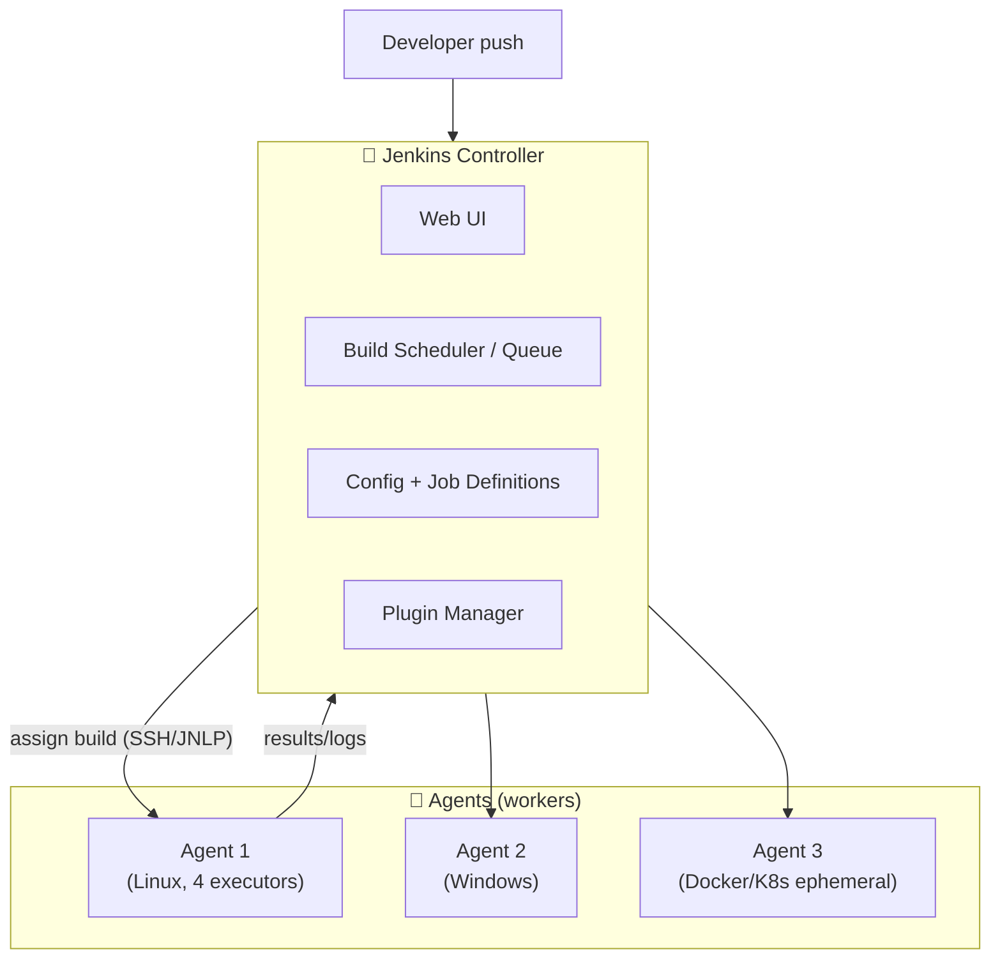

- **Controller**: schedules builds, dispatches to agents, stores results, serves UI/API. Should **not** run builds itself.
- **Agents**: execute the actual work. Connect via **SSH** or **inbound (JNLP)**.
- **Executors**: each agent has N executors = N concurrent builds.

> [!WARNING]
> **Never run builds on the controller** in production. Build code executing on the controller has access to Jenkins' secrets, credentials store, and the whole config — a massive security hole. Set controller executors to **0** and run everything on agents.

### 2.2 Freestyle Jobs vs Pipelines

| Aspect | Freestyle (legacy) | Pipeline (modern) |
|---|---|---|
| Definition | Clicking through the UI | Code (`Jenkinsfile`) |
| Version control | ❌ Config lives in Jenkins | ✅ Lives with your code |
| Complex flows | Hard (limited chaining) | ✅ Loops, conditionals, parallel |
| Code review | ❌ | ✅ Reviewed like any code |
| Durability | Lost on restart mid-build | ✅ Survives controller restart |
| Recommendation | Avoid for new work | **Use this** |

> [!IMPORTANT]
> Modern Jenkins = **pipeline-as-code in a `Jenkinsfile` committed to your repo.** It's versioned, code-reviewed, portable, and reproducible. Freestyle jobs are legacy — know them for interviews and old systems, but don't build new ones.

### 2.3 Declarative vs Scripted Pipeline

Two syntaxes, both Groovy-based:

**Declarative** (structured, opinionated — **preferred**):

```groovy
pipeline {
    agent any
    options {
        timeout(time: 30, unit: 'MINUTES')
        buildDiscarder(logRotator(numToKeepStr: '20'))
        disableConcurrentBuilds()
    }
    environment {
        REGISTRY = 'registry.example.com'
        IMAGE    = "${REGISTRY}/myapp:${env.BUILD_NUMBER}"
    }
    parameters {
        choice(name: 'DEPLOY_ENV', choices: ['dev','staging','prod'], description: 'Target')
    }
    stages {
        stage('Build') {
            steps { sh 'mvn -B clean package' }
        }
        stage('Test') {
            steps { sh 'mvn test' }
            post { always { junit '**/target/surefire-reports/*.xml' } }
        }
        stage('Docker Build & Push') {
            steps {
                sh "docker build -t ${IMAGE} ."
                withCredentials([usernamePassword(credentialsId: 'registry-creds',
                        usernameVariable: 'U', passwordVariable: 'P')]) {
                    sh 'echo $P | docker login -u $U --password-stdin $REGISTRY'
                    sh "docker push ${IMAGE}"
                }
            }
        }
        stage('Deploy') {
            when { expression { params.DEPLOY_ENV == 'prod' } }
            steps { sh "helm upgrade --install myapp ./chart --set image.tag=${BUILD_NUMBER}" }
        }
    }
    post {
        success { echo '✅ Pipeline succeeded' }
        failure { mail to: 'team@example.com', subject: "FAILED: ${env.JOB_NAME} #${env.BUILD_NUMBER}", body: "${env.BUILD_URL}" }
        always  { cleanWs() }
    }
}
```

**Scripted** (full Groovy, imperative — power-user escape hatch):

```groovy
node('linux') {
    stage('Build') {
        checkout scm
        try {
            sh 'mvn clean package'
        } catch (err) {
            currentBuild.result = 'FAILURE'
            throw err
        } finally {
            junit '**/target/surefire-reports/*.xml'
        }
    }
}
```

| | Declarative | Scripted |
|---|---|---|
| Structure | Rigid `pipeline{}` blocks | Arbitrary Groovy |
| Learning curve | Easier | Steeper |
| Validation | Pre-validated syntax | Runtime failures |
| Flexibility | Good (+ `script{}` escape) | Unlimited |
| Recommendation | **Default choice** | Only when you truly need it |

> [!TIP]
> Start **Declarative**. When you hit a wall (complex dynamic logic), drop into a `script { }` block for just that part rather than converting the whole pipeline to Scripted. You get structure + escape hatch.

### 2.4 Pipeline Anatomy

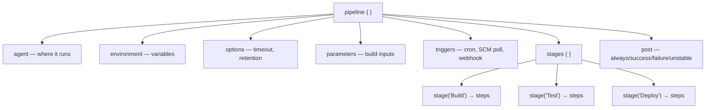

**Key directives:**

| Directive | Purpose |
|---|---|
| `agent` | Which node/executor/container runs the work |
| `environment` | Env vars (block or stage-scoped) |
| `options` | Timeouts, retries, log rotation, concurrency |
| `parameters` | User inputs at build time |
| `triggers` | `cron`, `pollSCM`, `upstream`, webhooks |
| `when` | Conditional stage execution |
| `post` | Cleanup/notify by outcome |
| `matrix` | Run a stage across combinations (OS × version) |
| `parallel` | Run stages/branches concurrently |

### 2.5 Agents in Pipelines

```groovy
pipeline {
    agent none                              // no global agent
    stages {
        stage('Build') {
            agent { label 'linux && jdk17' } // pick by label
            steps { sh 'mvn package' }
        }
        stage('Test in container') {
            agent {
                docker {
                    image 'node:20-alpine'   // ephemeral container agent
                    args '-v $HOME/.npm:/root/.npm'
                }
            }
            steps { sh 'npm ci && npm test' }
        }
        stage('K8s agent') {
            agent {
                kubernetes {                  // dynamic pod-per-build
                    yaml '''
                    spec:
                      containers:
                        - name: maven
                          image: maven:3.9-eclipse-temurin-17
                          command: ['sleep']
                          args: ['infinity']
                    '''
                }
            }
            steps { container('maven') { sh 'mvn -B verify' } }
        }
    }
}
```

> [!TIP]
> **Ephemeral agents** (Docker/Kubernetes) are the modern gold standard: each build gets a **fresh, clean, isolated environment** that's destroyed afterward. No state leakage between builds, no "polluted workspace" bugs, and elastic scaling. The **Kubernetes plugin** spins up a pod per build and tears it down after.

### 2.6 Triggers — how builds start

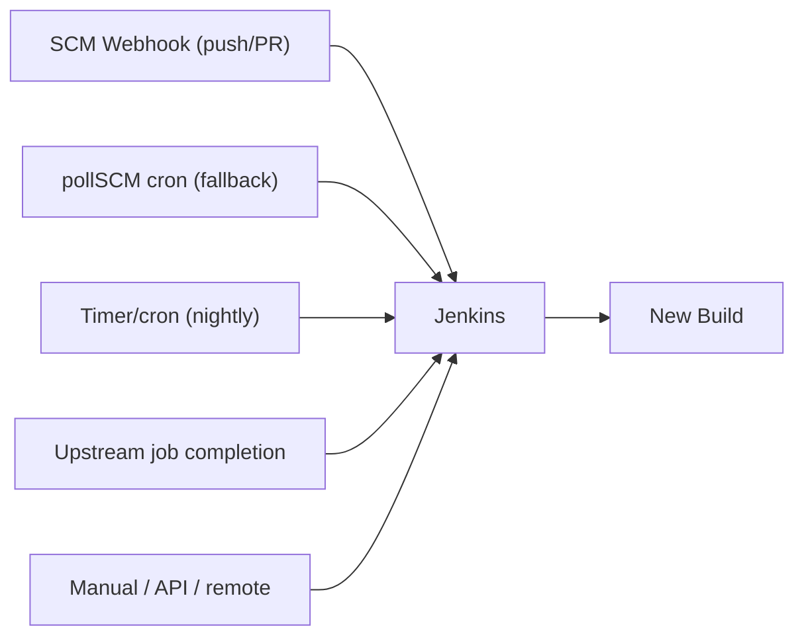

| Trigger | Config | Use case |
|---|---|---|
| **Webhook** | GitHub/GitLab hook → Jenkins | Instant build on push (**best**) |
| **`pollSCM`** | `pollSCM('H/5 * * * *')` | Fallback when webhooks unavailable |
| **`cron`** | `cron('H 2 * * *')` | Nightly builds, cleanups |
| **`upstream`** | Build after another job | Pipeline chaining |
| **Remote/API** | `curl JENKINS_URL/job/x/build` | External triggering |

> [!IMPORTANT]
> The **`H` (hash) in cron** — `H 2 * * *` instead of `0 2 * * *` — spreads load by hashing the job name to a consistent-but-distributed minute. Without it, every job fires at exactly 2:00 and stampedes the controller. Always use `H`.

---

## 3. ⚙️ ADVANCED CONCEPTS (Senior Level)

### 3.1 Shared Libraries (DRY across pipelines)

For dozens/hundreds of pipelines, duplicate Groovy is unmaintainable. **Shared Libraries** extract reusable pipeline code into a versioned git repo.

```
(shared-library repo)
├── vars/
│   ├── buildJavaApp.groovy      # global function: buildJavaApp()
│   └── deployToK8s.groovy
├── src/
│   └── org/example/Utils.groovy # classes (OOP)
└── resources/
    └── templates/pod.yaml        # non-Groovy files
```

```groovy
// vars/standardPipeline.groovy — a reusable templated pipeline
def call(Map config) {
    pipeline {
        agent { label 'linux' }
        stages {
            stage('Build') { steps { sh "mvn -B clean package" } }
            stage('Deploy') {
                steps { deployToK8s(env: config.env, image: config.image) }
            }
        }
    }
}
```

```groovy
// Jenkinsfile in EVERY microservice — now just 3 lines
@Library('my-shared-lib@v1.4.0') _
standardPipeline(env: 'prod', image: 'myapp')
```

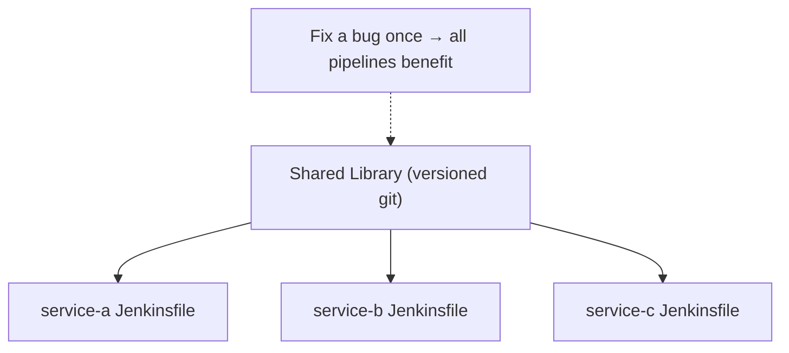

> [!TIP]
> Pin the shared library to a **version tag** (`@Library('lib@v1.4.0')`), not `@main`. Otherwise a change to the library silently alters every pipeline in the org at once — a recipe for a company-wide outage. Versioning gives controlled, reviewable rollout.

### 3.2 Multibranch Pipelines & Organization Folders

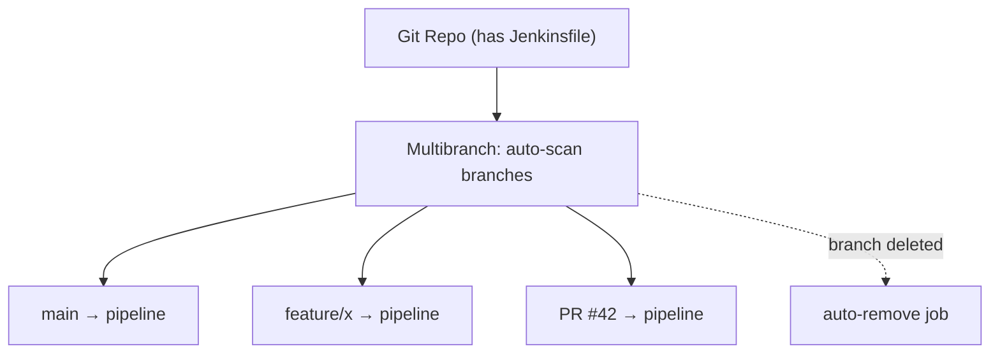

- **Multibranch Pipeline**: auto-discovers branches/PRs containing a `Jenkinsfile`, creating a pipeline per branch and removing them when branches are deleted.
- **Organization Folder**: scans an entire GitHub/GitLab org, auto-creating multibranch pipelines for **every repo** with a `Jenkinsfile`. Zero manual job setup.

### 3.3 Parallelism, Matrix & Fan-out/Fan-in

```groovy
stage('Cross-platform tests') {
    matrix {
        axes {
            axis { name 'OS';      values 'linux', 'windows' }
            axis { name 'JDK';     values '17', '21' }
        }
        stages {
            stage('Test') {
                agent { label "${OS}" }
                steps { sh "test-with-jdk ${JDK}" }
            }
        }
    }
}

stage('Parallel checks') {
    parallel {
        stage('Unit')        { steps { sh 'mvn test' } }
        stage('Lint')        { steps { sh 'mvn checkstyle:check' } }
        stage('Security')    { steps { sh 'trivy fs .' } }
    }
}
```

> [!TIP]
> `failFast true` inside `parallel` aborts all branches as soon as one fails — saves compute on doomed builds. Great for a fan-out of independent checks where any failure means the build is dead anyway. (Compare with matrix in [[07 CICD GitHub Actions]].)

### 3.4 Credentials & Secrets Management

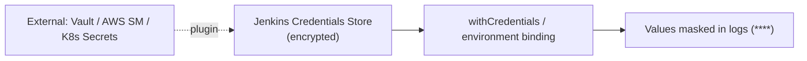

```groovy
withCredentials([
    string(credentialsId: 'api-token', variable: 'TOKEN'),
    usernamePassword(credentialsId: 'db', usernameVariable: 'DB_USER', passwordVariable: 'DB_PASS')
]) {
    sh 'deploy --token $TOKEN'   // single-quotes: shell expands, not Groovy
}
```

> [!WARNING]
> **Never use double quotes with secrets** in `sh` steps: `sh "deploy --token ${TOKEN}"` interpolates the secret into the command string in Groovy, which can **leak it into the build log and process list**. Use **single quotes** so the *shell* expands the env var (`sh 'deploy --token $TOKEN'`), keeping Jenkins' log masking effective.

| Credential type | Use |
|---|---|
| Secret text | API tokens |
| Username/password | Registries, DBs |
| SSH key | Git, agent connections |
| Secret file | kubeconfig, certs |
| Certificate | mTLS |

For production, integrate **HashiCorp Vault**, **AWS Secrets Manager**, or **External Secrets** rather than storing long-lived secrets in Jenkins.

### 3.5 Configuration as Code (JCasC)

The controller's own config (plugins, security, agents, credentials refs) should itself be **code**, not hand-clicked in the UI:

```yaml
# jenkins.yaml (JCasC plugin)
jenkins:
  systemMessage: "Managed by JCasC — do not edit via UI"
  numExecutors: 0                    # no builds on controller
  securityRealm:
    local:
      allowsSignup: false
  authorizationStrategy:
    roleBased: { }
  clouds:
    - kubernetes:
        name: k8s
        namespace: jenkins-agents
        containerCapStr: "50"
unclassified:
  location:
    url: https://jenkins.example.com/
```

> [!IMPORTANT]
> **JCasC turns a "pet" Jenkins into "cattle."** Without it, your controller is a hand-configured snowflake that's impossible to reproduce after a disk failure. With JCasC + pipeline-as-code + plugins pinned, the entire Jenkins can be rebuilt from git — critical for disaster recovery and audit.

### 3.6 Failure Scenarios & Production Issues

| Failure | Symptom | Mitigation |
|---|---|---|
| **Controller is SPOF** | Whole CI down if controller dies | HA is hard; back up `JENKINS_HOME`, fast restore, consider active/passive |
| **Disk fills (`JENKINS_HOME`)** | Builds fail, corruption | `buildDiscarder` log rotation, artifact cleanup, monitor disk |
| **Plugin hell** | Upgrade breaks pipelines | Pin versions, test in staging, read changelogs |
| **Flaky/stuck builds** | Hung executors | `timeout()` on stages, `disableConcurrentBuilds` |
| **Groovy memory leaks** | Controller OOM | Avoid heavy logic in pipelines; use agents/tools; heap tuning |
| **Secret leakage** | Token in logs | Single-quote sh, credentials binding, log masking |
| **Slow builds** | Long queues | More agents, ephemeral K8s agents, caching, parallelism |
| **Workspace pollution** | Nondeterministic builds | `cleanWs()`, ephemeral agents |
| **Zombie agents** | Builds queued, no runners | Agent health monitoring, auto-provisioning |

### 3.7 Blue-Green & Canary Deploys from Jenkins

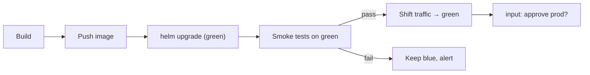

```groovy
stage('Promote to Prod') {
    steps {
        input message: 'Deploy to production?', ok: 'Deploy',
              submitter: 'release-managers'
        sh 'helm upgrade --install myapp ./chart --set track=green --atomic --wait'
    }
}
```

The `input` step pauses for **manual approval** — the classic Continuous *Delivery* (vs Deployment) gate. See [[03 Helm Charts]] for the deploy mechanics.

---

## 4. 🏗️ REAL-WORLD SYSTEM DESIGN USAGE

### 4.1 A Full Enterprise CI/CD Flow

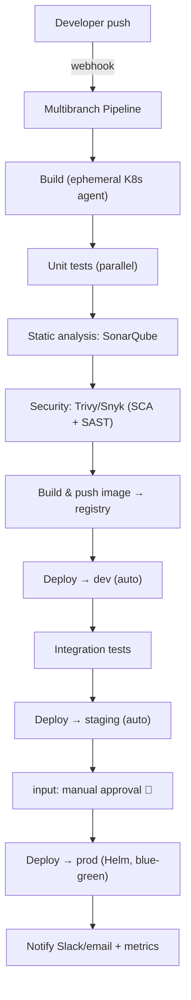

### 4.2 How organizations use Jenkins

| Context | Pattern |
|---|---|
| **Regulated industries** (banks, healthcare) | Self-hosted/air-gapped for compliance & data control |
| **Large enterprises** | Shared libraries enforce standardized pipelines across 100s of teams |
| **Microservices** | Org folder auto-onboards every repo; per-service pipelines ([[03 Microservices]]) |
| **Legacy + modern mix** | Jenkins bridges old build tools with modern deploys |
| **Multi-cloud** | Plugins deploy to AWS/GCP/Azure/on-prem uniformly |

### 4.3 Jenkins vs the CI/CD Landscape

| Tool | Model | Best for |
|---|---|---|
| **Jenkins** | Self-hosted, plugin-based | Control, customization, on-prem/air-gap, complex legacy |
| **[[07 CICD GitHub Actions]]** | Hosted, YAML, marketplace | GitHub-native repos, low maintenance |
| **GitLab CI** | Integrated with GitLab | All-in-one DevOps platform |
| **CircleCI/Travis** | Hosted SaaS | Quick cloud setup |
| **Argo CD / Flux** | GitOps CD (K8s) | Declarative K8s deployment (often *paired* with Jenkins CI) |

> [!IMPORTANT]
> Modern pattern: **Jenkins for CI (build/test), GitOps (Argo CD) for CD (deploy).** Jenkins builds and pushes the image + updates a git manifest; Argo CD reconciles the cluster. This separates "make the artifact" from "deploy the artifact," combining Jenkins' flexibility with GitOps' declarative safety.

### 4.4 Scaling Jenkins

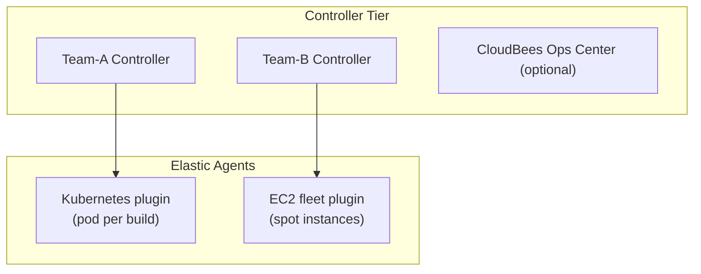

At scale: **multiple controllers** (per team/domain to limit blast radius), **ephemeral elastic agents** (Kubernetes/EC2) for cost-efficient bursting, and shared libraries + JCasC for consistency.

---

## 5. 🎤 INTERVIEW PREPARATION

### 5.1 Most important questions

<details>
<summary><b>Q1: Controller vs Agent architecture?</b></summary>

The **controller** orchestrates: schedules builds, stores config/results, serves UI/API, dispatches work. **Agents** execute the builds. The controller should run **zero builds** (security + stability); agents do all the heavy lifting and can be static or ephemeral (Docker/K8s). Executors are concurrent build slots on a node.
</details>

<details>
<summary><b>Q2: Declarative vs Scripted pipeline?</b></summary>

**Declarative** uses a structured `pipeline{}` DSL — easier, pre-validated, opinionated, the recommended default. **Scripted** is full imperative Groovy inside `node{}` — unlimited flexibility but steeper and less safe. Use Declarative + `script{}` blocks for the rare dynamic parts.
</details>

<details>
<summary><b>Q3: What is a Jenkinsfile and why pipeline-as-code?</b></summary>

A `Jenkinsfile` defines the pipeline as code committed to the repo. Benefits: **versioned, code-reviewed, portable, reproducible, survives controller restarts**, and the pipeline evolves with the code it builds.
</details>

<details>
<summary><b>Q4: How do Shared Libraries work?</b></summary>

Reusable pipeline code (`vars/` global functions, `src/` classes, `resources/`) in a versioned git repo, loaded via `@Library`. They DRY up common logic across many pipelines — fix once, benefit everywhere. Pin to a version tag to avoid org-wide breakage.
</details>

<details>
<summary><b>Q5: How do you secure secrets in Jenkins?</b></summary>

Use the **Credentials store** (encrypted) with `withCredentials`/environment binding; values are **masked** in logs. Critically, use **single quotes** in `sh` so the shell (not Groovy) expands them. For production, integrate **Vault/AWS Secrets Manager**. Never hard-code secrets in Jenkinsfiles.
</details>

<details>
<summary><b>Q6: Multibranch Pipeline?</b></summary>

Automatically discovers branches and PRs containing a `Jenkinsfile`, creating a pipeline per branch and cleaning up when branches are deleted. Organization Folders extend this to scan an entire git org.
</details>

<details>
<summary><b>Q7: How do you handle a controller as a single point of failure?</b></summary>

Back up `JENKINS_HOME` (config, job history) regularly, use **JCasC** so the controller is reproducible from code, keep plugins pinned, and design for fast restore. True active-active HA is hard (CloudBees offers it); most run active/passive with solid backups. Split into multiple controllers to limit blast radius.
</details>

<details>
<summary><b>Q8: CI vs CD vs Continuous Deployment?</b></summary>

**CI** = auto build+test every change. **Continuous Delivery** = every passing build is *deployable*, with a **manual approval** gate to production (the `input` step). **Continuous Deployment** = fully automated to prod with **no** manual gate. Jenkins supports all three.
</details>

### 5.2 Tricky questions

> [!TIP]
> **"Why single quotes for secrets in `sh`?"** — Double quotes make **Groovy** interpolate the secret into the command string (leaks into logs/process list, bypassing masking). Single quotes defer expansion to the **shell**, keeping the secret masked.

> [!TIP]
> **"Why `H` in cron expressions?"** — `H` hashes the job name to distribute trigger times, preventing a thundering herd of jobs all firing at `0 * * * *` and overwhelming the controller.

> [!TIP]
> **"master/slave terminology?"** — Renamed to **controller/agent**. Using old terms signals you haven't touched modern Jenkins.

> [!TIP]
> **"Where should builds run?"** — **Never on the controller** (0 executors). Always agents, ideally ephemeral. This is both a security and stability answer interviewers look for.

### 5.3 Common mistakes candidates make

| Mistake | Reality |
|---|---|
| Building on the controller | Security/stability disaster — use agents |
| Freestyle jobs for new work | Use pipeline-as-code |
| Double-quoting secrets in `sh` | Leaks into logs |
| `@Library('lib@main')` unpinned | Org-wide breakage risk |
| No log rotation | Disk fills, controller dies |
| Heavy Groovy logic in pipeline | Controller OOM — offload to agents/scripts |
| Cron `0 2 * * *` everywhere | Thundering herd — use `H` |
| Hand-configured controller | Unreproducible snowflake — use JCasC |

### 5.4 What interviewers actually expect

- **Controller/agent** separation and *why builds never run on the controller*.
- **Pipeline-as-code** fluency (Declarative, stages, post, agents).
- **Shared libraries** for scale, **JCasC** for reproducibility.
- **Secrets hygiene** and the single-quote subtlety.
- Awareness of Jenkins' **trade-offs** vs hosted CI and the **CI-Jenkins + CD-GitOps** modern split.

---

## 6. 🛠️ HANDS-ON PROJECTS

### Project 1: First Declarative CI Pipeline (Beginner→Intermediate)

**Goal:** Build → test → archive for a Java/Spring app, triggered by push.

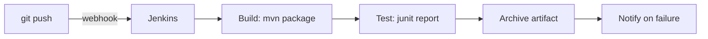

**Steps:**
1. Run Jenkins via Docker; create an agent (or use Docker agents).
2. Add a `Jenkinsfile` to a [[05 Spring Boot]] repo with `Build`/`Test` stages.
3. Publish JUnit results (`junit` step) and archive the JAR.
4. Configure a GitHub webhook → Multibranch Pipeline.
5. Add `post { failure { mail/slack } }` and `buildDiscarder` retention.

**Learn:** declarative syntax, stages, post actions, triggers, artifacts.

---

### Project 2: Dockerized Build + Push + Deploy with Approval (Intermediate→Senior)

**Goal:** Full CD with ephemeral agents, credentials, and a prod approval gate.

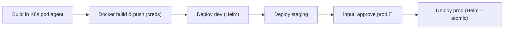

**Steps:**
1. Use the **Kubernetes plugin** for pod-per-build agents.
2. Store registry + kubeconfig in **Credentials**; bind with `withCredentials` (single quotes!).
3. Build/push a Docker image tagged with `BUILD_NUMBER`.
4. Deploy to dev/staging via `helm upgrade --install` ([[03 Helm Charts]]).
5. Add an `input` approval before prod + `--atomic` rollback safety.

**Learn:** ephemeral agents, credentials hygiene, multi-env promotion, approval gates.

---

### Project 3: Shared Library + Multibranch at Scale (Senior)

**Goal:** Standardize CI/CD across many microservices with one reusable library.

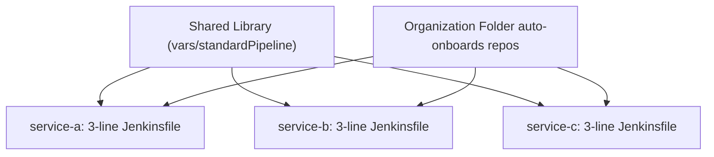

**Steps:**
1. Build a shared library repo (`vars/standardPipeline.groovy`, `src/` utils).
2. Encapsulate build/test/scan/deploy; parameterize per service.
3. Each service's `Jenkinsfile` = `@Library('lib@v1') _; standardPipeline(...)`.
4. Set up an **Organization Folder** to auto-discover all repos.
5. Manage the controller via **JCasC**; pin all plugin versions.

**Learn:** shared libraries, versioning, org folders, JCasC, governance at scale.

---

## 7. 🔬 DEEP DIVE: INTERNALS

### 7.1 How a Pipeline Actually Executes

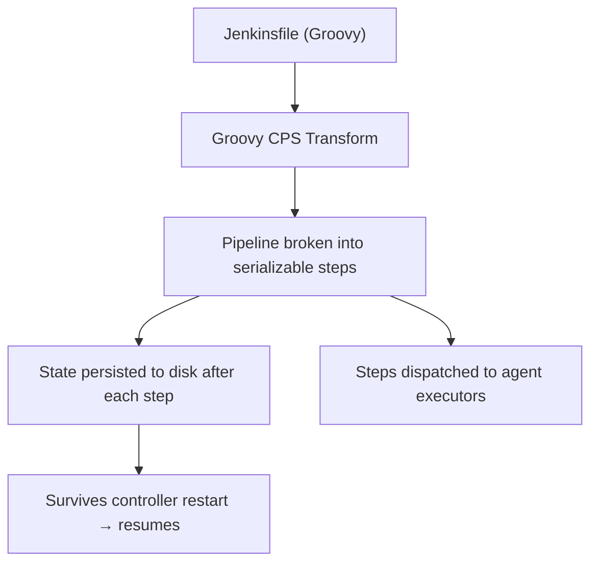

> [!IMPORTANT]
> Jenkins pipelines run on a **CPS (Continuation-Passing Style)** engine. Groovy is transformed so pipeline state can be **serialized to disk after every step** — that's how a build **survives a controller restart** and resumes exactly where it left off. The cost: pipeline Groovy has quirks (non-`@NonCPS` code must be serializable; some Java idioms break). This is why heavy logic belongs in `sh`/agents, not inline Groovy.

### 7.2 JENKINS_HOME — the single source of state

```
$JENKINS_HOME/
├── config.xml               # global config
├── jobs/<job>/              # per-job config + build history
│   └── builds/<n>/          # each build's log, metadata, artifacts
├── plugins/                 # installed plugins (.hpi/.jpi)
├── secrets/                 # encryption keys (BACK THESE UP)
├── nodes/                   # agent configs
├── users/
└── workspace/               # (on agents) build working dirs
```

> [!WARNING]
> **`JENKINS_HOME` is everything.** Lose it and you lose all jobs, history, and config. It's also the disaster-recovery target: **back it up** (especially `secrets/` and `config.xml`). The modern approach — **JCasC + pipeline-as-code + pinned plugins** — makes most of it reproducible from git, so only build history/artifacts need traditional backup.

### 7.3 The Build Queue & Executor Model

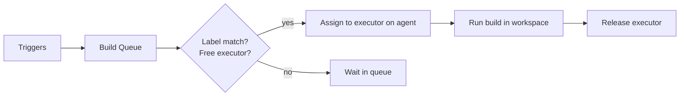

- Builds enter a **queue**; the scheduler matches each to an agent with a **free executor** and **matching label**.
- **Quiet period** can batch rapid triggers; **throttling** and **concurrency options** control parallelism.
- Executor count per agent = max concurrent builds on that node.

### 7.4 Plugin Architecture

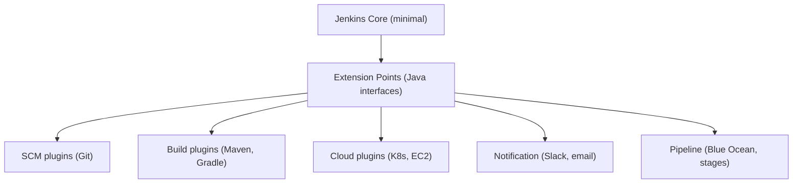

Jenkins core is deliberately minimal; nearly all functionality is **plugins** implementing **extension points**. This is the source of both its **power** (integrate anything) and its **pain** (dependency conflicts, security CVEs, upgrade breakage).

> [!TIP]
> Treat plugins as a **managed dependency set**: pin versions, review security advisories (Jenkins publishes them regularly), test upgrades in a staging controller, and minimize the plugin count. Every plugin is attack surface and upgrade risk.

### 7.5 Security Model

| Layer | Mechanism |
|---|---|
| **Authentication** | Local users, LDAP, SSO/OAuth, SAML |
| **Authorization** | Matrix / Role-Based Strategy (per-project roles) |
| **Agent-to-controller** | Access control subsystem restricts what agents can do |
| **Script security** | Groovy sandbox + admin approval for `@NonCPS`/unsafe calls |
| **Credentials** | Encrypted store, scoped, masked in logs |
| **CSRF** | Crumb tokens on state-changing requests |

> [!IMPORTANT]
> The **Groovy sandbox** restricts what pipeline code can call; unsafe methods require **admin approval**. This prevents a malicious `Jenkinsfile` from, say, reading the controller's filesystem or secrets. Combined with "no builds on controller" and RBAC, it forms Jenkins' core defense — but Jenkins has a long CVE history, so **keep core + plugins patched**.

---

## ✅ Production Checklists

### Controller
- [ ] Controller executors set to **0** (no builds on controller)
- [ ] Managed via **JCasC** (config as code)
- [ ] `JENKINS_HOME` backed up (esp. `secrets/`, `config.xml`)
- [ ] Plugins **pinned** and regularly patched (security advisories)
- [ ] HTTPS/TLS, reverse proxy, CSRF protection on
- [ ] RBAC (role-based authorization), SSO integrated

### Pipelines
- [ ] Pipeline-as-code (`Jenkinsfile`) in every repo
- [ ] Declarative syntax; `script{}` only where needed
- [ ] `timeout()` + `buildDiscarder` (log rotation) on every job
- [ ] `disableConcurrentBuilds` where appropriate
- [ ] Shared library pinned to version tags
- [ ] `post { }` cleanup (`cleanWs`) + notifications
- [ ] Secrets via credentials + **single-quoted** `sh`

### Agents & Scale
- [ ] Ephemeral agents (Kubernetes/Docker) preferred
- [ ] Labels for capability-based routing
- [ ] Agent auto-provisioning + health monitoring
- [ ] Disk/CPU/queue-depth monitoring & alerts
- [ ] Cron uses `H` to distribute load

### Security
- [ ] Groovy sandbox enabled; approvals reviewed
- [ ] External secret manager (Vault/AWS SM) for prod secrets
- [ ] Least-privilege deploy credentials (no cluster-admin)
- [ ] Audit logging enabled

---

## 🗺️ Learning Roadmap

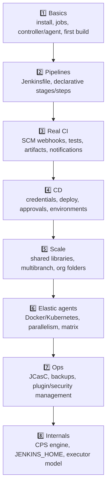

| Stage | Focus | You can... |
|---|---|---|
| 1–2 | Basics + pipelines | Author a working CI pipeline |
| 3–4 | CI + CD | Build/test/deploy with approvals |
| 5–6 | Scale + agents | Standardize & elastically scale CI/CD |
| 7–8 | Ops + internals | Run production Jenkins reliably |

---

## 🔁 Self-Review Completion Loop

Reviewed against official Jenkins docs, best practices, edge cases, interview patterns, and production scenarios.

### Gap Review Matrix

| Dimension | Covered? | Where |
|---|---|---|
| What/why, CI/CD problem | ✅ | §1 |
| Controller/agent architecture | ✅ | §2.1 |
| Freestyle vs Pipeline | ✅ | §2.2 |
| Declarative vs Scripted | ✅ | §2.3 |
| Pipeline anatomy/directives | ✅ | §2.4 |
| Agents (docker/k8s/label) | ✅ | §2.5 |
| Triggers (webhook/cron/poll) | ✅ | §2.6 |
| Shared libraries | ✅ | §3.1 |
| Multibranch/org folders | ✅ | §3.2 |
| Parallel/matrix | ✅ | §3.3 |
| Credentials & secret hygiene | ✅ | §3.4 |
| JCasC | ✅ | §3.5 |
| Failure scenarios | ✅ | §3.6 |
| Blue-green/canary/approval | ✅ | §3.7 |
| Enterprise CI/CD flow | ✅ | §4.1 |
| Jenkins vs landscape | ✅ | §4.3 |
| Scaling (multi-controller/elastic) | ✅ | §4.4 |
| CPS execution engine | ✅ | §7.1 |
| JENKINS_HOME/state | ✅ | §7.2 |
| Queue/executor model | ✅ | §7.3 |
| Plugin architecture | ✅ | §7.4 |
| Security model (sandbox/RBAC/CSRF) | ✅ | §7.5 |
| Interview Q&A + mistakes | ✅ | §5 |
| Hands-on projects | ✅ | §6 |

> [!NOTE]
> **Remaining depth to explore independently:** Blue Ocean UI, CloudBees CI (enterprise HA/operations center), Jenkins on Kubernetes via the official Helm chart, `input` with `parallel` restart semantics, `stash`/`unstash` for inter-stage file passing, `lock`/throttle (resource concurrency), and migration strategies from Jenkins to GitHub Actions/GitLab CI.

---

## 📚 Official References

| Resource | URL |
|---|---|
| Jenkins Docs | https://www.jenkins.io/doc/ |
| Pipeline Syntax | https://www.jenkins.io/doc/book/pipeline/syntax/ |
| Pipeline Steps Reference | https://www.jenkins.io/doc/pipeline/steps/ |
| Shared Libraries | https://www.jenkins.io/doc/book/pipeline/shared-libraries/ |
| Best Practices | https://www.jenkins.io/doc/book/pipeline/pipeline-best-practices/ |
| JCasC | https://www.jenkins.io/projects/jcasc/ |
| Security Advisories | https://www.jenkins.io/security/advisories/ |
| Kubernetes Plugin | https://plugins.jenkins.io/kubernetes/ |
| Credentials | https://www.jenkins.io/doc/book/using/using-credentials/ |

---

## 🎁 Final Summary

> [!IMPORTANT]
> **The one-paragraph takeaway:** Jenkins is the self-hosted, plugin-extensible **automation server** that pioneered CI/CD. Its architecture is a **controller** (orchestrator — runs *no* builds) plus **agents** (workers, ideally ephemeral Docker/K8s pods). Modern Jenkins is **pipeline-as-code** in a `Jenkinsfile` — prefer **Declarative** syntax, extract common logic into **versioned Shared Libraries**, auto-onboard repos with **Multibranch/Organization Folders**, and make the controller reproducible with **JCasC**. Guard secrets via the credentials store with **single-quoted `sh`**, protect the controller (0 executors, patched plugins, backed-up `JENKINS_HOME`), and remember the trade-off: **maximum control and extensibility at the cost of you owning the operations.** The modern sweet spot is **Jenkins for CI + GitOps for CD.**

**Golden rules:**
1. 🧠 Controller orchestrates; **never build on it** (0 executors).
2. 📜 **Pipeline-as-code** (Declarative `Jenkinsfile`), versioned in the repo.
3. 📚 DRY with **Shared Libraries** — pinned to version tags.
4. 🔐 Secrets via credentials store; **single-quote** `sh` to avoid leaks.
5. ⚙️ Make Jenkins reproducible with **JCasC** + pinned plugins.
6. 💪 Prefer **ephemeral agents** (K8s/Docker) for clean, elastic builds.
7. 🕒 Use **`H`** in cron; add `timeout` + `buildDiscarder` everywhere.
8. 💾 Back up **`JENKINS_HOME`**; patch core + plugins for security.

---

*Related guides in this vault: [[07 CICD GitHub Actions]] · [[03 Helm Charts]] · [[03 Microservices]] · [[01 Kafka]] · [[05 Spring Boot]]*
